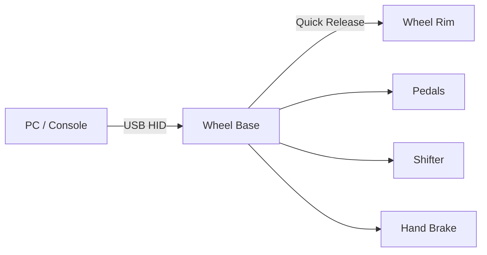
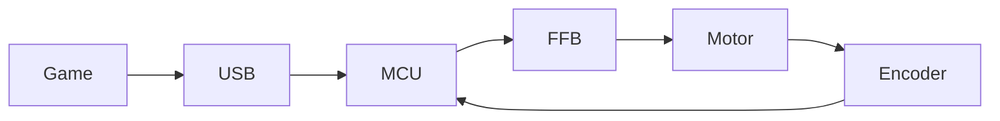

# Sim Racing Ecosystem

> Firmware Architecture & System Overview

## Target Audience

- Firmware Engineers
- Embedded Software Developers
- System Architects
- Technical Leads

## Purpose

This document introduces the architecture of a modern Sim Racing ecosystem from an embedded firmware perspective. It is intended as onboarding documentation before customer requirements or source code become available.

---

# Table of Contents

1. System Overview
2. Product Overview
3. Hardware Architecture
4. Communication Architecture
5. Firmware Architecture
6. Force Feedback Overview
7. Runtime Data Flow
8. Hardware Interaction
9. Real-Time Tasks
10. Firmware Engineering View

---

# 1. System Overview

## Objectives

- Understand the complete Sim Racing ecosystem.
- Identify every hardware component.
- Understand firmware responsibilities.
- Visualize system architecture using Mermaid diagrams.

## High-Level System

## Firmware Perspective

### Responsibilities

- USB Host communication
- Force Feedback processing
- Motor control
- Sensor acquisition
- Peripheral management

### Typical Drivers

- USB
- SPI
- UART
- CAN
- PWM
- ADC
- GPIO

### Typical Tasks

| Task | Frequency |
|------|----------:|
| Motor Control | 20 kHz |
| USB HID | 1 kHz |
| Wheel Communication | 500 Hz |
| Pedals | 250 Hz |

## Key Takeaways

- Wheel Base is the system master.
- Wheel Rim is an intelligent peripheral.
- USB is the host interface.
- Firmware coordinates all subsystems.

---

# Standard Chapter Template

Use the following template for each subsystem.

## Purpose

## Responsibilities

## Hardware

## Internal Block Diagram

## Communication Interfaces

## Firmware Modules

## Timing Requirements

## Debugging Strategy

## Firmware Perspective

## Key Takeaways

---

# Recommended Document Style

> [!NOTE]
> Focus on firmware architecture rather than proprietary implementation.

> [!TIP]
> End every chapter with **Firmware Perspective** and **Key Takeaways**.

> [!IMPORTANT]
> Separate generic embedded architecture from vendor-specific implementation.

---

# Mermaid Guidelines

Use:

- flowchart LR
- graph TD
- sequenceDiagram
- stateDiagram-v2
- architecture-beta

Example:

---

# Next Chapters

- Product Breakdown
- Wheel Base Architecture
- Wheel Rim Architecture
- Motor Controller
- Communication Interfaces
- Firmware Modules
- Force Feedback
- Runtime Timing
- Safety
- Bootloader
- Firmware Update
- Debugging

