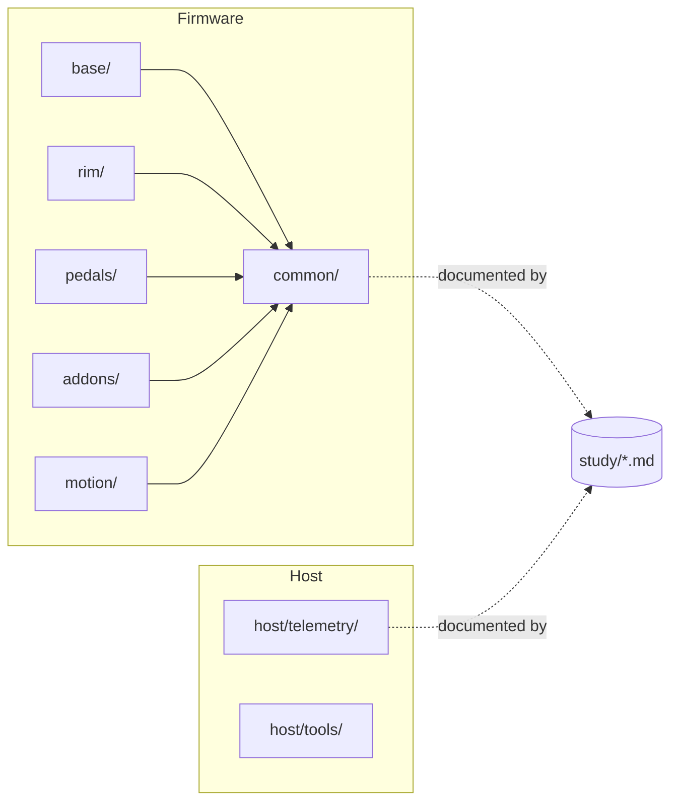

# Codebase Summary

> Version: 1.0
> Reviewed: 2026-07-02
> Purpose: orient a new engineer in this repository and describe how a future firmware codebase should map onto the subsystem study docs.

## Document Change Log

| Version | Date | Changes |
|---|---|---|
| 1.0 | 2026-07-02 | Initial summary. Documented the current documentation-only state, mapped the doc set, and proposed a source layout mirroring the subsystem docs. |

## 1. Current State

> [!IMPORTANT]
> This repository is currently **documentation-only**. There is no firmware or tooling source yet. This document therefore describes (a) the documentation as it exists and (b) a *proposed* source layout for when implementation begins. The proposed layout is engineering guidance, not a description of shipped code.

## 2. Documentation Map

| Area | Document | Role |
|---|---|---|
| Documentation index | [README.md](./README.md) | Entry point; links project and study docs. |
| Reference architecture | [system-architecture.md](./system-architecture.md) | System boundaries and data paths. |
| Chapter template | [Template.md](./Template.md) | Pattern and real-time task model for subsystem docs. |
| Enhancement conventions | [spec-update.md](./spec-update.md) | Formatting, normative language, and change-log rules. |
| Change aggregate | [spec-updates.md](./spec-updates.md) | Cross-document record of each enhancement pass. |
| Code conventions | [code-standards.md](./code-standards.md) | How firmware and tooling should be written. |
| Roadmap | [development-roadmap.md](./development-roadmap.md) | Bring-up sequencing and verification gates. |
| Project changelog | [project-changelog.md](./project-changelog.md) | Human-facing project history. |
| Study map | [study/README.md](./study/README.md) | Reading path and evidence model for the subsystem docs. |

Subsystem study docs live under `study/` (wheel base, wheel rim, pedals, add-ons, accessories, cockpits, motion, tactile, telemetry, compatibility matrix, tools, repos, references, glossary, and two knowledge bases).

## 3. Proposed Source Layout

When implementation begins, source **should** be organized so each module maps to exactly one subsystem doc, per the naming rule in [code-standards.md](./code-standards.md) §4:

```
src/
  base/         -> study/wheel_base.md      (USB, FFB, torque arbiter, safety, update)
  rim/          -> study/wheel_rim.md       (input scan, display, identity, QR link)
  pedals/       -> study/pedals.md          (sensor chain, calibration, HID / base proxy)
  addons/       -> study/add_ons.md         (shifter, handbrake)
  accessories/  -> study/accessories.md     (QR, dashboards, button boxes)
  motion/       -> study/motion.md          (motion platform controller, if in scope)
  common/       -> HID descriptors, framing, fault handling, identity/health
host/
  telemetry/    -> study/telemetry.md       (game -> bridge -> device pipeline)
  tools/        -> study/tools.md           (flashing, protocol simulation, HIL fixtures)
```

**Figure 3-1: Proposed Module-to-Document Mapping**



## 4. Build and Flash (Forward-Looking)

Build and flash conventions **shall** be defined once a target MCU family is chosen (see [code-standards.md](./code-standards.md) §2 and the flashing/measurement tooling in [study/tools.md](./study/tools.md)). Until then, no build is expected to succeed from this repository.

## 5. Where Each Spec Is Implemented

Each subsystem doc's "Firmware Modules" and "Timing Requirements" sections are the contract the corresponding `src/` module **shall** satisfy. A reviewer traces a module to its doc by matching module directory to the table in §3 and confirming state and signal names match, per the review checklist in [code-standards.md](./code-standards.md) §8.

## Unresolved Questions

- When source is added, this document **shall** be updated from "proposed" to a description of the actual tree, and the module-to-document mapping re-verified.
