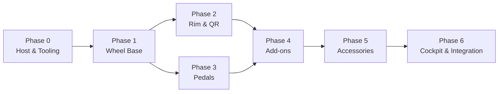

# Development Roadmap

> Version: 1.0
> Reviewed: 2026-07-02
> Purpose: sequence implementation and bring-up in dependency order, using the per-subsystem validation gates from [study/tools.md](./study/tools.md) as milestones.

## Document Change Log

| Version | Date | Changes |
|---|---|---|
| 1.0 | 2026-07-02 | Initial roadmap. Phasing follows the subsystem dependency map in [study/README.md](./study/README.md); gates follow the validation checklist in [study/tools.md](./study/tools.md) §5. |

## 1. Phasing Principle

Work proceeds in dependency order: the wheel base is the system master, so it is brought up first; peripherals are added only once the master and its safety path are proven. Each phase has explicit **entry** and **exit** criteria, and no phase involving actuator torque proceeds to full energy until its safety gate passes.

> [!IMPORTANT]
> This roadmap is scoped to the reference architecture in this study base. Real customer requirements will refine phase content and acceptance criteria.

**Figure 1-1: Bring-Up Dependency Order**

## 2. Phases

### Phase 0 — Host and Tooling

- **Entry:** target MCU family selected; toolchain per [code-standards.md](./code-standards.md) §2.
- **Work:** flashing path, logic analyzer / oscilloscope bench, protocol simulator, current-limited supply, HIL fixtures per [study/tools.md](./study/tools.md).
- **Exit:** a module can be built, flashed, and observed on the bench; fault-injection fixture is ready.

### Phase 1 — Wheel Base

- **Entry:** Phase 0 exit.
- **Work:** USB enumeration and HID; encoder and current acquisition; bounded PWM; torque arbiter and fault handling; bootloader/recovery.
- **Safety gate (from tools.md §5):** verified on oscilloscope, logic analyzer, current-limited supply, USB trace, and E-stop/fault-injection fixture **before** any full-energy motor test.
- **Exit:** base enumerates, produces bounded torque under current limit, and fails safe on injected fault.

### Phase 2 — Rim and QR

- **Entry:** Phase 1 exit.
- **Work:** rim input scan, display/LED, identity/capability reporting; QR-link framing with length checks and stalled-peer recovery.
- **Gate:** logic analyzer on the QR link, rail/backfeed test, input-bounce test, display/LED stress test.
- **Exit:** rim identifies to the base, exchanges bounded frames, and degrades safely on link loss (rim telemetry cleared, display stopped).

### Phase 3 — Pedals

- **Entry:** Phase 1 exit (parallel with Phase 2).
- **Work:** sensor sampling, filtering, calibration (tare/span), HID axes, and base-port proxy path.
- **Gate:** calibration repeatability, cable-fault and rail-out-of-bounds handling.
- **Exit:** pedals report stable, calibrated axes over both USB and base-port paths.

### Phase 4 — Add-ons

- **Entry:** Phases 2 and 3 exit.
- **Work:** H-pattern gate thresholds with impossible-state rejection; sequential edge/pulse semantics; handbrake range calibration.
- **Exit:** shifter and handbrake report correct states with debounce and fault detection.

### Phase 5 — Accessories

- **Entry:** Phase 4 exit.
- **Work:** dashboards/button boxes, telemetry bridge integration per [study/telemetry.md](./study/telemetry.md).
- **Exit:** dashboards render live telemetry within the latency budget; button boxes enumerate as clean HID.

### Phase 6 — Cockpit and Integration

- **Entry:** Phase 5 exit.
- **Work:** full-rig integration; deflection-under-load and fastener-torque audit; resonance / tactile-transducer isolation check per [study/tactile.md](./study/tactile.md) and [study/cockpits.md](./study/cockpits.md).
- **Exit:** integrated rig meets FFB fidelity and pedal-signal stability targets with no destructive resonance.

## 3. Risk Register

| Risk | Impact | Mitigation |
|---|---|---|
| High-torque test before fault handling proven | Injury / hardware damage | Phase 1 safety gate is mandatory before full energy. |
| Generation-boundary compatibility (e.g., ClubSport DD/DD+ SPI) | Rim/base integration failure | Track in [study/compatibility-matrix.md](./study/compatibility-matrix.md); verify on bench. |
| Telemetry middleware latency | Poor dashboard/shaker responsiveness | Measure and budget in Phase 5 (see telemetry.md). |
| Vendor/standards claims unverified against live sources | Incorrect assumptions | Re-confirm links per [study/references.md](./study/references.md). |

## 4. Milestones

M0 bench ready (Phase 0) → M1 base fails safe under load (Phase 1) → M2 rim+pedals integrated (Phases 2–3) → M3 add-ons + accessories (Phases 4–5) → M4 full rig validated (Phase 6).

## Unresolved Questions

- Concrete acceptance thresholds (torque, latency, deflection) will be set from customer requirements and recorded here.
