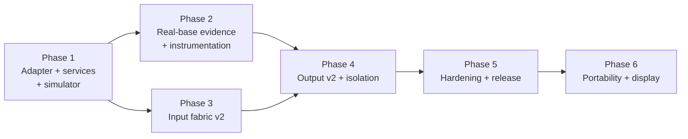

# Development Roadmap

> Version: 2.0
> Reviewed: 2026-07-04
> Purpose: sequence the rim project's phases with entry/exit gates and record current status. The authoritative long-form roadmap is [fanatec-wheel-roadmap-and-system-spec.md](./fanatec-wheel-roadmap-and-system-spec.md); this document is its status ledger.

## Document Change Log

| Version | Date | Changes |
|---|---|---|
| 2.0 | 2026-07-04 | Replaced the generic ecosystem bring-up phasing (wheel base / pedals / cockpit) with this repository's actual rim roadmap (Phases 1–6) and recorded implementation status per phase. The ecosystem phasing remains valid context for the wider research base but did not describe this codebase. |
| 1.0 | 2026-07-02 | Initial roadmap (reference-architecture phasing). |

## 1. Phasing Principle

The rim is brought up against a simulated base first, then a real base, then custom hardware. Each phase has explicit gates; nothing that could load or delay the link path ships before the link invariants are proven (fast-path purity, armed-frame immutability, 50 ms stale rule).

**Figure 1-1: Phase Dependency Order**

## 2. Phases and Status

| Phase | Scope | Firmware | Hardware evidence |
|---|---|---|---|
| 1 | `rimlink` adapter, link_spi, input/output/diag services, base simulator, 14 unit tests | **Done** | bench pair validated |
| 2 | Capture ring + `rim cap`, fastboot + `rim boot`, session header, host toolkit, compat matrix, sim base-twin profile | **Done** | real-base captures, boot margin, matrix rows: **pending** |
| 3 | input_svc v2: 4× quadrature, funky, Hall clutches + dual-clutch, settings schema v2, axis/encoder frame enablement, scan-budget measurement | **Done** | full-fabric P99, LA reconciliation, 4 h base stress: **pending** |
| 4 | led_svc, lra_svc (source disabled), power manager, watchdog, DMA/IRQ budget, pin registry, rim_pcb_a docs stub | **Done** | PCB rev A port, 24 h isolation run: **pending** |
| 5 | MCUboot verified boot (ED25519 sysbuild), health counters, soak automation, config lock, release definition + CI | **Done** | 24 h soak, interrupted-update, boot-margin-through-loader: **pending** |
| 6 | Portability bake-off (NXP/Renesas), display module, environmental campaign | **Not started** | — |

Detailed delivery record: [plans/260704-phases2-5/plan.md](../plans/260704-phases2-5/plan.md).

## 3. Gates Still Open (hardware-dependent)

1. **Real-base session** (Phase 2 exit): LA capture on a genuine base, `ring_diff.py` reconciling to zero unexplained discrepancy, first real row in [compat/matrix.md](./compat/matrix.md), measured first-poll deadline vs `rim boot` (≥ 2× margin).
2. **Full-fabric timing** (Phase 3 exit): `rim stats` P99 ≤ 250 µs with every input populated on real hardware.
3. **Isolation proof** (Phase 4 exit): 24 h dual-console soak via `scripts/soak/soak_runner.py` with LED/haptic activity and zero link anomalies.
4. **Update torture** (Phase 5 exit): power-cut-during-swap test per [update-recovery.md](./update-recovery.md).
5. **PCB rev A bring-up** (Phase 4/6): checklist in [../boards/README.md](../boards/README.md); pin baseline in [specs/steering_wheel_pin_mapping.csv](./specs/steering_wheel_pin_mapping.csv).

## 4. Risk Register

| Risk | Impact | Mitigation |
|---|---|---|
| Boot-to-ready margin fails against a fast-polling base | Rim not enumerated | Mitigation ladder in [update-recovery.md](./update-recovery.md): shrink MCUboot, direct-XIP, hold QR detect |
| `rumble` semantics differ from assumption | Wrong/unsafe haptics | Source disabled by default until `field_activity.py` evidence (spec 4-S2) |
| BTN1/PF10 shares the on-board QSPI CLK net | Phantom NOR clocking | Benign on bench (NOR CS idles high); relocate on PCB rev A (hw spec §6) |
| Base firmware update changes link behavior | Compat regression | Per-firmware rows in the compat matrix; capture ring freeze on anomaly |
| Two DRV2605L on one bus share address 0x5A | Haptic driver conflict | EN-line device selection or address-selectable substitute (hw spec §4) |

## Unresolved Questions

- Phase 6 acceptance thresholds (bake-off criteria, display latency budget) are set when that phase is planned.
