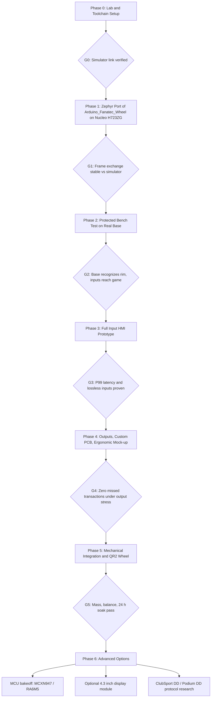
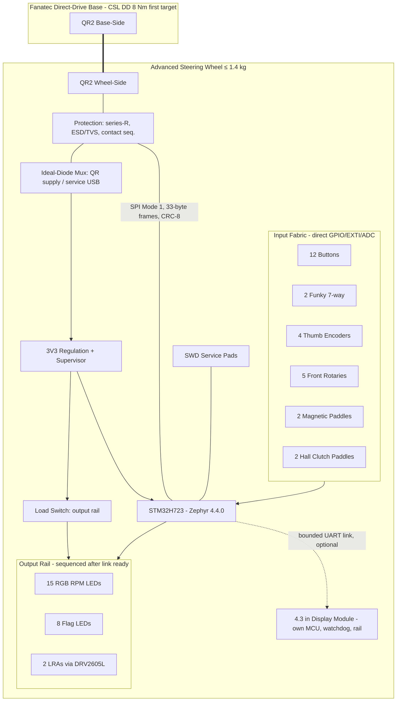
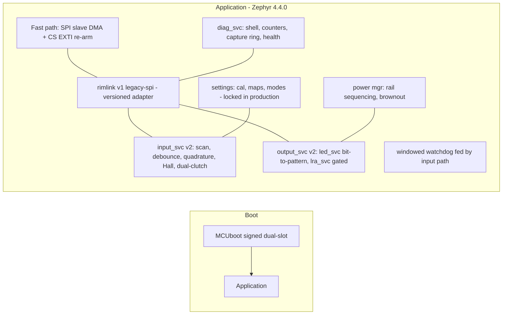

# Advanced Fanatec-Compatible Steering Wheel — Roadmap, System Specification, and Procurement Plan

| Document | Version | Date | Target Audience |
|---|---|---|---|
| Advanced Fanatec-Compatible Steering Wheel — Roadmap, System Specification, and Procurement Plan | 1.2 | 2026-07-04 | Embedded developer (mid-level), sim-racing domain fresher |

> **Informative:**
> This plan operationalizes the approved brainstorm report (2026-07-03) and the study set
> (wheel_rim.md (research base: wheel_rim.md), wheel_base.md (research base: wheel_base.md),
> sim_racing_research.md (research base: sim_racing_research.md), repos.md (research base: repos.md),
> references.md (research base: references.md)). It covers the full journey from a bench-only
> Zephyr prototype to a complete 300 mm screenless GT wheel with optional display expansion.
> No proprietary firmware extraction, security bypass, or console-authentication work is in scope.

## Document Change Log

| Version | Date | Description |
|---|---|---|
| 1.0 | 2026-07-03 | Initial roadmap, system specification, and phased procurement plan. |
| 1.1 | 2026-07-03 | Resolved open questions: first bench base fixed to CSL DD 8 Nm; added §11.4 legacy-link output capability findings (display/LED/rumble frame fields) from public source review; updated Phase 2/4 accordingly. |
| 1.2 | 2026-07-04 | Review pass: added §11.5 link-timing findings (12 MHz observed clock, CRC-8 polynomial verified computationally, Zephyr slave-driver confirmation), added §16 Completed Product Definition with system/firmware diagrams and requirements traceability, linked all phase specifications, updated question register. |

---

## 1. Purpose and Scope

This section states what the program builds, in what order, and what must be purchased at each stage. Read the brainstorm report first for the problem analysis; this document assumes its decisions are final.

The program shall deliver a PC-first, 300 mm closed D-shaped GT steering wheel that:

- communicates with a Fanatec direct-drive base only through the quick-release electrical link (no normal USB data cable),
- runs Zephyr RTOS 4.4.0 on a natively 3.3 V Cortex-M MCU,
- provides full GT controls, magnetic shift paddles, and dual analog Hall clutch paddles,
- provides RPM/flag RGB LEDs and two directional LRAs as bounded output cues,
- remains screenless in the core configuration; a 4.3-inch display is a gated optional expansion.

Initial compatibility research targets CSL DD / GT DD Pro and Podium DD1/DD2 only. ClubSport DD/DD+ and the current Podium DD shall be treated as unsupported until their electrical and protocol behavior is established through approved documentation or safe bench measurement (community evidence explicitly warns the legacy AVR emulator approach fails on ClubSport DD/DD+).

**Platform baseline:** Zephyr 4.4.0, first target board `nucleo_h723zg` (STM32H723ZG, 550 MHz Cortex-M7). Phase 1 ports the behavior of [`lshachar/Arduino_Fanatec_Wheel`](https://github.com/lshachar/Arduino_Fanatec_Wheel) (`Community implementation`) from AVR/Arduino to Zephyr on this board.

## 2. Definitions and References

| Term | Meaning |
|---|---|
| **QR / QR2** | Fanatec quick release; QR2 is the current mechanical generation (QR1 discontinued; Fanatec-store products QR2 by default as of 2026-02-16 — `Manufacturer public docs`) |
| **Rim link** | The electrical data link between rim MCU and base through the QR contacts; legacy community evidence describes base-master SPI at 3.3 V with 33-byte CRC-8 frames (`Community implementation`) |
| **Fast path** | ISR/DMA code servicing the rim link; no logging, allocation, flash writes, rendering, or blocking I/O permitted |
| **LRA** | Linear resonant actuator used for short directional haptic cues |
| **Protocol simulator** | A second MCU board acting as the wheel base (SPI controller) so the rim firmware can be validated before touching a commercial base |
| **Gate** | A measurable pass/fail condition that must be met before the next phase's purchases or integration begin |

Source-class labels in this document follow §8 of the spec conventions: `Official standard`, `Manufacturer public docs`, `Community implementation`, `Reference context`, `Community observation`.

## 3. Target System Specification

This section defines the end-state product the roadmap converges on. Phase deliverables are partial realizations of this specification.

### 3.1 Mechanical

| Item | Requirement |
|---|---|
| Rim | 300 mm closed D-shaped GT rim |
| Mass | Complete wheel including QR2 Wheel-Side shall not exceed 1.4 kg |
| Balance | Mass shall be concentrated near the rotation axis; no perceptible QR, paddle, or grip play |
| Grips | Replaceable molded grips validated with gloved and bare hands |
| Interface | QR2 Wheel-Side; exact model and torque approval shall be verified against manufacturer guidance before base testing (`Manufacturer public docs`) |
| Proof testing | Structural proof loads shall be applied on a fixture, never through a powered base |

### 3.2 Electrical and Power

- The rim shall be powered from the QR supply in normal operation; the QR power budget is **unknown until measured** and shall be established with a current-limited fixture before any load beyond the MCU is enabled.
- The hardware shall never join base and debug-USB 5 V rails; an ideal-diode mux or load switch shall isolate them.
- All QR signal pins shall remain high-impedance during power-off, reset, bootloader, and brownout.
- LED, LRA, and (optional) display rails shall be load-switched so the link/input subsystem powers and becomes ready first.
- QR signal and power pins shall be protected against ESD, contention, inrush, and backfeed (series resistance + TVS/ESD arrays).

### 3.3 Controller and Firmware

| Layer | Requirement |
|---|---|
| RTOS | Zephyr 4.4.0, west workspace, board `nucleo_h723zg` for prototyping |
| Link driver | SPI peripheral (slave) mode with DMA and CS edge interrupt; immutable, pre-composed response buffer per transaction |
| Priorities | Highest: QR CS/clock handling, DMA completion, response exchange. High: input scan/debounce/ADC/snapshot. Medium: LED patterns and bounded LRA commands. Low: diagnostics, health counters, configuration commit |
| Protocol adapter | A versioned `rim-link` adapter shall isolate the legacy SPI implementation so future transports can be added without touching input/output services |
| Fast-path rule | No logging, allocation, flash writes, rendering, or blocking I/O in the rim-link fast path |
| Staleness | Momentary controls shall clear and outputs shall enter a safe quiet state when the link or telemetry becomes stale |

### 3.4 Input HMI (maximum configuration, subject to ergonomic mock-up)

12 primary buttons with distinct caps/guards, two seven-way funky switches, four thumb encoders, up to five front rotaries with distinct detents, two magnetic shift paddles, two analog Hall clutch paddles, and up to two optional auxiliary paddles. The final control count shall be frozen only after the Phase 4 ergonomic mock-up.

### 3.5 Output HMI

15 RGB RPM LEDs, eight flag/status LEDs positioned for peripheral vision, and two independently driven LRAs for short left/right cues. Continuous road-texture haptic effects shall not be implemented; they may mask base FFB.

### 3.6 Acceptance Criteria (system level)

- Acquisition-to-immutable-snapshot latency: P99 ≤ 1 ms.
- Zero missed QR transactions during a 24-hour maximum-input/LED/LRA stress test.
- Boot-to-link-ready meets the measured target-base deadline across expected supply conditions.
- Every encoder detent and paddle transition preserved at maximum actuation rate.
- No USB-to-QR backfeed; QR pins high-impedance when unpowered or in reset.
- Compatibility matrix records exact base model, firmware version, QR generation, and result.

## 4. Program Architecture Overview

**Figure 4-1: Phase Flow and Gates**

**Kill criteria (program level):** stop the current concept if the QR power/link cannot safely support the required controls and cues, or if compatibility would require security or licensing circumvention.

> **Note:** Purchases are staged per phase below. Do not buy Phase-N hardware before the Phase-(N−1) gate passes; the largest cost items (base, QR2 components, CNC parts, display) all sit behind gates on purpose.

---

## 5. Phase 0 — Lab, Toolchain, and Safety Foundations

This phase establishes the measurement and safety infrastructure required before any Fanatec hardware is energized. Everything here is reusable across all later phases.

### 5.1 Work Items

| Step | Action | Notes / Constraint |
|---|---|---|
| 1 | Install Zephyr 4.4.0 SDK, `west`, and build/flash/debug for `nucleo_h723zg` | Blinky + shell over ST-LINK VCP |
| 2 | Set up logic analyzer capture profiles for SPI (CS, SCLK, MOSI, MISO) plus one link-ready GPIO | ≥ 25 MS/s digital minimum for legacy-speed SPI margin |
| 3 | Build the **protocol simulator**: a second board acting as SPI controller replaying the 33-byte transaction pattern from `Arduino_Fanatec_Wheel` | An Arduino Nano/Uno running the community base-side test code, or a second Nucleo |
| 4 | Establish the ESD-safe bench: mat, wrist strap, current-limited supply discipline | All later fixtures inherit this |
| 5 | Create the repository/CI skeleton: Zephyr workspace, `rim-link` adapter interface stub, unit-test harness (ztest) for CRC-8, frame parser, encoder transition table | Host-side unit tests run without hardware |

### 5.2 Phase 0 Procurement

Cost bands: **A** < €50, **B** €50–150, **C** €150–400, **D** €400–1000, **E** > €1000. Bands are indicative for mid-2026; verify current prices at order time (prices are deliberately not pinned per source-hygiene rules).

| Item | Qty | Band | Purpose | Notes |
|---|---|---|---|---|
| ST Nucleo-H723ZG | 2 | B (each A–B) | Rim prototype + spare/simulator candidate | On-board ST-LINK V3; Zephyr board `nucleo_h723zg` (`Manufacturer public docs`) |
| Arduino Nano/Uno (or clone) | 2 | A | Run the original `Arduino_Fanatec_Wheel` sketch as behavioral reference and as base-side simulator | 3.3 V handling required if used on the live link later (`Community implementation`) |
| Logic analyzer, 8–16 ch (Saleae Logic 8 class, or budget FX2/LA1010 class) | 1 | B–D | SPI timing, CS boundaries, boot-deadline measurement | Saleae-class strongly preferred for protocol decode and long captures |
| Bench power supply, 2-channel, adjustable current limit (e.g. 0–30 V / 0–5 A class) | 1 | C | Current-limited rim power; QR power-budget measurement | Current limiting is a hard safety requirement |
| Digital oscilloscope, ≥ 100 MHz, 4-ch preferred | 1 | C–D | Rails, inrush, reset behavior, signal integrity, backfeed checks | 2-ch acceptable to start; 4-ch needed by Phase 4 |
| Digital multimeter (auto-ranging, continuity) | 1 | A–B | General verification | |
| USB isolator (full-speed) | 1 | A–B | Isolate debug USB from rim power domain during combined tests | Prevents ground loops/backfeed via ST-LINK |
| ESD mat + wrist strap kit | 1 | A | Bench safety | |
| Soldering station (temperature-controlled) + solder, flux, wick | 1 | B–C | Fixtures, harnesses, proto boards | Skip if already owned |
| Breadboards, jumper sets, 0.1" headers, Dupont crimp kit | — | A | Phase 1 wiring | |
| Resistor/capacitor assortment, series resistors (100 Ω–1 kΩ), TVS/ESD diode assortment (3.3 V working) | — | A | Signal protection on every fixture | |
| microSD/USB stick + label kit | — | A | Capture archive discipline | Every base test session must be recorded |

**Gate G0:** simulator ↔ Nucleo H723ZG SPI exchange captured on the logic analyzer with correct byte count and stable CS framing; Zephyr build/flash/debug loop under 60 s.

---

## 6. Phase 1 — Port `Arduino_Fanatec_Wheel` to Zephyr on STM32H723ZG

This is the first firmware milestone: reproduce the legacy rim behavior (identity, 33-byte exchange, CRC-8, button bitfields, display-byte decoding) on Zephyr, validated only against the protocol simulator. No commercial base is connected in this phase.

### 6.1 Porting Map

| Arduino_Fanatec_Wheel element (AVR) | Zephyr / H723ZG realization |
|---|---|
| Hardware SPI slave via `SPCR`, byte-at-a-time ISR | STM32 SPI peripheral in slave mode with DMA (full 33-byte RX/TX per CS assertion); CS edge via GPIO EXTI callback for frame boundary and resync |
| Global `mosiBuf[33]` / `returnData[33]` mutated in place | Double-buffered immutable TX snapshot: input task composes next response; ISR/DMA swaps pointers only between transactions |
| CRC-8 computed in loop code | CRC-8 in the link adapter unit-tested with ztest; optionally hardware CRC if polynomial matches |
| `alps_process()` / button reads mixed into main loop | Dedicated input thread (high priority) with work queue; k_timer-driven scan at fixed cadence |
| TM1637 display writes in main loop | Deferred to a medium-priority output thread; display optional in this phase |
| `Serial.print` debugging that disturbs timing | Zephyr deferred logging only outside the fast path; RTT/UART logging shall be disabled in timing runs |
| `delay()`-based sequencing | k_sleep/k_timer; boot path minimized to meet base recognition deadline later |
| 5 V Arduino with level concerns | Native 3.3 V I/O on H723 — no level shifters (matches the 3.3 V signaling reported by the community projects) |

### 6.2 Work Items

| Step | Action | Notes / Constraint |
|---|---|---|
| 1 | Write devicetree overlay: SPI slave instance + DMA channels, CS EXTI GPIO, link-ready debug GPIO, user LEDs | Keep pinout on one ST morpho connector region for a future shield |
| 2 | Implement `rim-link` adapter v1 (legacy SPI): transaction state machine per wheel_rim.md §12.2, CRC validation, error counters | Versioned API; no protocol constants outside the adapter |
| 3 | Implement input service with synthetic inputs (on-board button + GPIO stubs) publishing immutable snapshots | Snapshot latency instrumented with cycle counter |
| 4 | Validate against simulator: correct identity bytes, button bitfield changes visible on MISO, CRC accepted | Logic-analyzer decode archived |
| 5 | Fault injection: truncated frames, extra clocks, CRC errors, rapid CS glitches, mid-transaction reset | Error counters must match injected counts; no lockups |
| 6 | Measure boot-to-link-ready time from power/reset to first valid response readiness | Baseline for Phase 2 deadline comparison |

### 6.3 Phase 1 Procurement

| Item | Qty | Band | Purpose | Notes |
|---|---|---|---|---|
| Proto/perma-proto shields for Nucleo (morpho-compatible) | 3 | A | Stable wiring instead of loose jumpers | |
| Tactile buttons, quality momentary switches | 10+ | A | Synthetic input matrix | |
| TM1637 7-segment module | 1 | A | Optional: reproduce display decode from the original project (`Community implementation`) |
| Second logic-analyzer probe harness / grabber clips | 1 | A | Parallel capture of link + link-ready GPIO | |
| Spare Nucleo-H723ZG (if not bought in Phase 0) | 1 | B | Simulator on identical silicon for timing realism | Optional |

**Gate G1:** 1-hour continuous simulator run with zero unexplained CRC/length errors, all injected faults detected and recovered, and documented boot-to-ready time.

---

## 7. Phase 2 — Protected Bench Test Against a Real Base (CSL DD / GT DD Pro)

This phase connects the prototype to a commercial base for the first time, through a protected fixture, and establishes the measured QR electrical facts that everything downstream depends on. This is the phase with the highest damage risk; the fixture rules are mandatory.

### 7.1 Work Items

| Step | Action | Notes / Constraint |
|---|---|---|
| 1 | Purchase the first exact bench base: **CSL DD 8 Nm** (decided 2026-07-03) | Community evidence reports legacy-emulator success on this family (`Community observation`); record exact firmware at receipt |
| 2 | Build the QR breakout/measurement fixture: connector breakout, series resistance on every signal, ESD protection, current-shunt on the supply pin, test points for every contact | Use the community pinout repo only as a hypothesis to verify, never as truth (`Community implementation` — [Fanatec-Pinout](https://github.com/FendtXerion3800/Fanatec-Pinout)) |
| 3 | With the rim disconnected, measure QR rail voltage, available current (loaded via electronic load or resistor bank in steps), contact sequence, and behavior at connect/disconnect | Establishes the QR power budget |
| 4 | Capture a genuine transaction if a donor Fanatec wheel is available: passive logic-analyzer tap between base and donor wheel | Optional but the single most valuable evidence source |
| 5 | Connect the Nucleo prototype through the fixture, current-limited; verify base recognition, button reporting into the Fanatec driver/game on PC | First real compatibility data point |
| 6 | Measure the base's boot-to-first-poll deadline and compare against Phase 1 boot time | Deadline becomes a normative requirement |
| 7 | Start the compatibility matrix: base model, firmware, QR generation, result | Maintained for the life of the program |

### 7.2 Safety Rules (normative)

- The base shall be powered through a mains RCD/GFCI-protected outlet, mounted or clamped, with no rim torque testing in this phase.
- The prototype supply path shall be current-limited at all times; the QR 5 V shall not be connected to the Nucleo's USB 5 V domain (USB isolator or battery-powered laptop for debug).
- Any unexplained current, heat, or signal anomaly shall stop the session; captures are archived before retry.
- No overclocking, replayed captures against unknown bases, or authentication probing.

### 7.3 Phase 2 Procurement

| Item | Qty | Band | Purpose | Notes |
|---|---|---|---|---|
| Fanatec CSL DD 8 Nm wheel base + Boost Kit 180 PSU | 1 | D | First exact bench target (decided) | Used/refurb acceptable if firmware updatable; the 8 Nm rating requires the Boost Kit 180 supply (`Manufacturer public docs` for setup/warnings) |
| Fanatec QR2 Wheel-Side (and QR2 Base-Side if the used base lacks it) | 1 (+1) | B–C | Mechanical/electrical mating; both sides must be the same QR generation (`Manufacturer public docs`) | Verify torque approval class for DIY use |
| Optional: cheapest compatible used Fanatec steering wheel (donor) | 1 | C–D | Passive protocol capture of a genuine wheel; later parts donor | Highest-leverage optional purchase |
| Table/desk clamp mount for the base | 1 | B | Rigid, safe bench mounting | A cockpit is not required yet |
| Electronic DC load (or power-resistor decade set) | 1 | B–C | QR current-budget characterization | |
| Connector/contact materials for the QR breakout (pin receptacles, machined headers, shielded wire, heat-shrink) | — | A–B | Measurement fixture | |
| Current shunt/precision resistors + differential probe or shunt amplifier board | 1 | A–B | Supply-current profiling incl. inrush | |
| Emergency power cutoff (switched outlet strip within reach) | 1 | A | Session kill switch | |

**Gate G2:** base recognizes the Zephyr rim; buttons reach a PC game; QR voltage/current budget, contact order, and boot deadline documented; zero electrical incidents.

---

## 8. Phase 3 — Full Input HMI Prototype

With the link proven, this phase scales the input side to the full GT control set and proves the deterministic-input claims (P99 ≤ 1 ms snapshot latency, lossless detents and paddle edges) while the link runs against the real base.

### 8.1 Work Items

| Step | Action | Notes / Constraint |
|---|---|---|
| 1 | Build the full input board on proto/shield: 12 buttons, 2 funky switches, 4 thumb encoders, up to 5 front rotaries, 2 magnetic paddle switches, 2 Hall clutch paddles into ADC | Direct GPIO preferred; expanders/shift registers only where scan latency and fault modes are proven acceptable |
| 2 | Implement encoder transition-table decoding with illegal-transition counters; debounce and stuck-button diagnostics per input class | Unit-tested off target first |
| 3 | Implement Hall clutch acquisition: ratiometric ADC, RC filtering, min/max calibration, deadzone, dual-clutch bite-point logic | Calibration persisted via settings subsystem (never written in fast path) |
| 4 | Map the full input set into the legacy frame's button bitfields within the `rim-link` adapter | Adapter remains the only protocol-aware module |
| 5 | Maximum-rate robotics-free stress: scripted actuation (or fast manual runs) proving zero lost detents/edges while the base polls continuously | Firmware counters + logic-analyzer cross-check |
| 6 | Measure acquisition-to-snapshot latency distribution over ≥ 10⁶ samples | P99 ≤ 1 ms acceptance criterion |

### 8.2 Phase 3 Procurement

| Item | Qty (+spares) | Band | Purpose | Notes |
|---|---|---|---|---|
| Quality momentary pushbuttons (guarded/varied caps; e.g. APEM/E-Switch class) | 12 (+4) | B | Primary buttons with tactile differentiation | Distinct caps/guards are a requirement, not decoration |
| 7-way funky switches (Alps SKQU/RKJX-class or sim-grade equivalents) | 2 (+1) | B | Thumb multi-directional controls | |
| Thumb rotary encoders, detented (Alps EC11/EC12 class) | 4 (+2) | A | Thumb encoders | |
| Front rotary encoders or multi-position switches with distinct detents | 5 (+1) | A–B | Front rotaries | Mixed detent feels aid eyes-free use |
| Magnetic shifter paddle kits (Hall/magnet + microswitch hybrid) or magnet + Hall switch parts to build them | 2 sets | B–C | Magnetic shifting | Off-the-shelf sim paddle kits acceptable for prototype |
| Ratiometric Hall-effect sensors (e.g. A1324-class) + magnets | 4 | A | Analog clutch paddles (2 + spares) | |
| Precision springs, pivots, bearings for paddle mock-ups | — | A–B | Paddle feel iteration | |
| Wiring: fine-gauge silicone wire, JST-PH/GH connector kits, crimper | — | B | Serviceable harnessing | A proper crimper pays for itself immediately |
| Optional: I/O expander / 74HC165 evaluation parts | few | A | Only if GPIO count forces it; must pass latency budget (`Community implementation` pattern from F_Interface_AL) |

**Gate G3:** P99 snapshot latency ≤ 1 ms; zero lost encoder detents/paddle edges at maximum rate; link error counters unchanged from Phase 2 baseline during a 4-hour input stress against the real base.

---

## 9. Phase 4 — Outputs, Custom PCB, and Ergonomic Freeze

This phase adds the bounded output HMI (LEDs, LRAs), proves output traffic cannot disturb the link, converts the proto stack into a custom rim PCB, and freezes the control layout via a full-scale ergonomic mock-up.

### 9.1 Work Items

| Step | Action | Notes / Constraint |
|---|---|---|
| 1 | Determine which LED/display/rumble commands the stock base+driver actually transport to a legacy rim (from Phase 2 captures and the Linux driver's public feature surface — `Community implementation`: [hid-fanatecff](https://github.com/gotzl/hid-fanatecff)) | Decides whether RPM LEDs are base-fed or host-fed |
| 2 | Implement LED service: 15 RPM + 8 flag LEDs, rate-limited, priority alerts over decoration, safe quiet state on stale data | Medium priority; measured against link error rate |
| 3 | Implement LRA service: two independent short directional cues via haptic driver; hardware-ready even if base telemetry cannot feed it | No continuous texture effects |
| 4 | 24-hour combined stress: max input + max LED + LRA duty against the real base; zero missed transactions required | The core Approach-A validation |
| 5 | Full-scale ergonomic mock-up (3D-printed or laser-cut rim blank with all controls placed); blind control-identification sessions; freeze control count and placement | Gate for mechanical CAD |
| 6 | Design and order custom rim PCB rev A: MCU (H723 or bakeoff winner later), power mux/load switches, protection, LED drivers, haptic drivers, connectorized paddle/grip harnesses, SWD service pads | Reuse Nucleo firmware with a board port |
| 7 | Bring up PCB rev A per the wheel_rim bench sequence (rails → impedance → boot → simulator → base) | Never first-connect a new PCB to the base |

### 9.2 Phase 4 Procurement

| Item | Qty | Band | Purpose | Notes |
|---|---|---|---|---|
| Addressable RGB LEDs (SK6812/WS2812-class) or constant-current LED driver ICs + RGB LEDs | 30+ | A | 15 RPM + 8 flag + spares | Current budget must fit measured QR budget |
| LRA actuators (coin/bar type) | 4 | A–B | 2 fitted + spares | |
| Haptic driver ICs/breakouts (DRV2605L-class) | 2–3 | A | LRA drive with braking/overdrive | |
| Load switch / ideal-diode ICs (TPS2211/LM66100-class), 3.3 V LDO/buck, supervisor ICs | — | A | Power tree per §3.2 | |
| ESD arrays, TVS, ferrites, series-R networks | — | A | QR pin protection on the PCB | |
| PCB fabrication + assembly, rev A (4-layer) | 1 run (3–5 boards) | C–D | Custom rim controller | Budget a rev B respin |
| SWD tap connector (Tag-Connect TC2030-class) + cable | 1 | A–B | Service pads programming | |
| 3D-printing service or FDM printer access; PLA/PETG + laser-cut MDF/acrylic blanks | — | B–C | Ergonomic mock-ups | Multiple iterations expected |
| USB current/power meter | 1 | A | Sanity checks on debug rail | |

**Gate G4:** 24-hour stress with zero missed transactions and unchanged input latency under full output load; control layout frozen with blind-identification pass; PCB rev A passes the full bench sequence.

---

## 10. Phase 5 — Mechanical Integration and Complete Wheel

This phase turns the validated electronics into the actual 300 mm wheel: structural plate, rim, grips, QR2 mounting, mass/balance targets, and the full soak/vibration validation.

### 10.1 Work Items

| Step | Action | Notes / Constraint |
|---|---|---|
| 1 | CAD the center plate and housings around the frozen layout; target total ≤ 1.4 kg incl. QR2 Wheel-Side, mass near axis | Aluminum 6061 or carbon plate; FEA or hand-calc stiffness check |
| 2 | Source/machine the 300 mm closed D-shaped rim (bare rim blank with grip substrate) | Buying a quality bare GT rim blank is usually better than machining one |
| 3 | Fit QR2 Wheel-Side to the plate with verified bolt pattern and torque approval | Both sides same QR generation (`Manufacturer public docs`) |
| 4 | Mold or fit replaceable grips; validate with gloved and bare hands | |
| 5 | Measure assembled mass, static balance, and moment of inertia (torsion-pendulum or trifilar method); verify no perceptible play | Define the acceptance method before measuring |
| 6 | Structural proof test on a fixture (representative torque + paddle/grip loads), never on a powered base | |
| 7 | Full-system soak: vibration, repeated QR mate cycles, thermal range, 24-hour traffic; regression of all Phase 2–4 gates on the final assembly | |

### 10.2 Phase 5 Procurement

| Item | Qty | Band | Purpose | Notes |
|---|---|---|---|---|
| 300 mm closed D-shaped rim blank (aluminum core / leather- or suede-ready) | 1 (+1 spare) | C | The rim itself | |
| CNC machining of center plate + housings (or carbon plate + waterjet) | 1 set + respin budget | C–D | Structure | |
| Grip material: molded silicone kit or leather/suede wrap + adhesive | — | B | Replaceable grips | |
| Fastener assortment (stainless/black-oxide M3–M6, threadlocker, torque driver) | — | A–B | Assembly with controlled torque | |
| Shielded/flex harness materials, strain reliefs, grommets | — | A | Rotating-assembly wiring durability | |
| Scale (0.1 g) + simple inertia fixture materials (trifilar strings/frame) | — | A–B | Mass/inertia acceptance | |
| Cockpit or rigid wheel stand for realistic driving validation | 1 | C–E | First realistic FFB evaluation; aluminum-profile rig recommended | Deferred from Phase 2 intentionally |
| Optional: budget second base of the same family | 1 | D | Compatibility-matrix breadth + destructive-test insurance | |

**Gate G5:** complete wheel meets mass/balance/inertia targets, passes proof load, and repeats all electrical gates on the final assembly.

---

## 11. Phase 6 — Advanced Options (Post-Core)

The core product is complete after G5. Phase 6 items are independent, optional, and individually gated.

### 11.1 MCU Bakeoff (production candidate selection)

Compare STM32H723ZG against NXP MCXN947 and Renesas RA6M5 on identical tests: peripheral-mode SPI behavior, DMA completion timing, startup time, error recovery, worst-case interrupt latency, and power. Procurement: FRDM-MCXN947 and EK-RA6M5 evaluation boards (Band B each). Outcome: production MCU decision; H745/H747 remains the fallback only if the single-core stress evidence fails.

### 11.2 Optional 4.3-inch Display Module

The display shall be a self-contained module (own controller, framebuffer, power switch, watchdog) receiving only bounded, validated data from the core MCU. It shall not be started unless all six promotion gates from the brainstorm report pass (HUD-value user test, inertia budget, QR power margin, telemetry availability, zero missed transactions under max rendering, and failure independence). Candidate controller for the module experiment: STM32U5A9/U5G9 or RA8D1 evaluation kit + 4.3-inch MIPI/RGB panel (Band C total).

### 11.3 ClubSport DD / DD+ and Current Podium DD Research

These bases remain unsupported. Research shall proceed only through approved documentation or safe passive measurement (donor wheel + passive tap on a purchased base), never through overclocking, capture replay, or authentication probing. Procurement occurs only if this track is funded: one ClubSport DD (Band E) plus a compatible current-generation donor wheel.

---

### 11.4 Resolved: Legacy Link Output Capability (Question 4 Findings)

> **Informative:** Findings from a 2026-07-03 source review of the public community implementations
> (GitHub was reachable; general web search was not required). These are `Community implementation`
> observations of the legacy CSW-era link, not official Fanatec specifications. Bench captures in
> Phases 2 and 4 shall confirm them on the CSL DD 8 Nm before any output feature is considered supported.

The legacy 33-byte base-to-rim frame carries three output channels. The structure below is declared
in `darknao/btClubSportWheel` (`src/fanatec.h`, struct `csw_out_t`) and its display offsets are
independently confirmed by `lshachar/Arduino_Fanatec_Wheel`, which decodes the same bytes:

| Offset | Field | Size | Meaning | Confidence |
|---|---|---|---|---|
| 0 | header | 1 B | Frame header | observed |
| 1 | id | 1 B | Command/identity byte | observed |
| 2–4 | disp[3] | 3 B | Three 7-segment characters; bit 7 of each byte is the dot segment | observed (two independent repos) |
| 5–6 | leds | 2 B | 16-bit LED bitfield (rev/RPM strip; a CSW→CSL 9-LED conversion helper exists) | observed |
| 7–8 | rumble[2] | 2 B | Two independent 8-bit rumble intensity channels | observed in struct; base-side transport on CSL DD **unknown** |
| 9–31 | padding | 23 B | Unused in community decode | observed |
| 32 | crc | 1 B | CRC-8 (0x131-polynomial table, init 0xFF) | observed |

Companion facts confirmed in the same review: the link runs as SPI Mode 1 (CPOL = 0, CPHA = 1),
MSB first; the rim's first MISO byte is 0xA5; the rim identity byte selects the emulated wheel
(0x01 BMW GT2, 0x02 ClubSport Formula, 0x03 Porsche 918 RSR, 0x04 UniHub); and the rim-to-base
frame carries `buttons[3]`, `axisX/axisY`, an `int8` encoder delta, hub/PS button bytes, a firmware
version byte, and CRC-8.

Host-side path on PC: on Linux, `gotzl/hid-fanatecff` registers the CSL DD (0EB7:0020) with
FF + tuning-menu + high-res flags; rim display and RPM-LED sysfs controls are exposed **per detected
rim identity** (e.g. the ClubSport Formula wheel exposes `display` and RPM LEDs), and
`hid-fanatecff-tools` or FanatecSDK-aware games via HIDRAW feed them. On Windows the FanatecSDK
performs the same role. Inference: the base relays host LED/display/rumble values into the
`disp`/`leds`/`rumble` frame fields for rims whose identity advertises those capabilities.

**Design consequences (normative for Phases 3–4):**

- The rim shall present an identity whose display/LED capabilities the driver stack recognizes (0x03 Porsche 918 RSR is the Phase 1 default; 0x02 ClubSport Formula shall be bench-compared because its host-side display/LED surface is explicitly exposed).
- The 15 RGB RPM LEDs shall be rendered locally from the 16-bit `leds` bitfield (bit-to-pattern mapping); individual per-LED addressing over the legacy link is not available.
- The eight flag/status LEDs may derive from the `disp` characters and `leds` bits; no dedicated flag channel exists on the legacy link.
- The two LRAs shall map to `rumble[0]`/`rumble[1]` if — and only if — Phase 2/4 captures show the CSL DD 8 Nm actually populates these bytes for the chosen rim identity; otherwise LRAs remain hardware-ready and disabled (per the brainstorm decision: no invented tunnel).
- The Phase 4 step-1 capture task is now targeted: verify `disp`, `leds`, and `rumble` field activity on the CSL DD 8 Nm with each candidate rim identity while a FanatecSDK-aware title (or hid-fanatecff-tools) drives outputs.

### 11.5 Resolved: Link Timing and Integrity Findings (Review 2026-07-04)

> **Informative:** Second desk-research pass over the community sources, with computational
> verification where possible. Confidence labels per §8 of the spec conventions.

| Finding | Detail | Confidence |
|---|---|---|
| Genuine rims accept 12 MHz clocking | `darknao/btClubSportWheel` (the base-side emulator that drives **genuine** Fanatec CSW rims) clocks at 12 MHz and is widely reproduced | observed (`Community implementation`) |
| CS setup delay | The same implementation waits 5 µs between CS assert and the first clock | observed |
| SPI mode tolerance | btClubSportWheel drives genuine rims in Mode 0; the real CSW base was measured as Mode 1 by the Phase 1 reference author | observed (both); genuine rims evidently tolerate both — the new rim shall too |
| Interrupted transactions | Genuine CSW rim controllers *resume* an interrupted transaction rather than resyncing; the emulator flushes to a frame boundary before starting | observed — our CS-edge resync design is strictly more robust, and the simulator shall emulate the flush behavior as a compatibility test |
| CRC-8 exact definition | Reflected polynomial 0x31 (table form 0x8C), init 0xFF, no final XOR — **verified computationally** against the community 256-entry table (200 random-vector equivalence). Test vector: frame `A5 03 00×30` → CRC `0x5A` | verified (computation) on observed table |
| Zephyr STM32 SPI slave support | In-tree driver supports `SPI_OP_MODE_SLAVE` with hardware NSS input and DMA (`CONFIG_SPI_STM32_DMA`), including STM32H7 paths; slave transfers block until the controller acts | verified (driver source review) |
| Legacy CSL (P1) rims | Use a separate short selector transaction (first byte 0xE0), a different protocol family | observed — explicitly out of scope |

Consequences applied to the phase specifications: the Phase 1 clock sweep extends to 12 MHz;
fixture and series-resistance networks must pass 12 MHz edges; the CRC question is closed
(hardware CRC reproduction is possible; the software table remains the baseline).

## 12. Consolidated Procurement Summary

| Phase | Focus | New spend band (typical) | Blocking gate before buying |
|---|---|---|---|
| 0 | Lab, tools, Nucleos | C–D total (much lower if instruments owned) | — |
| 1 | Port + simulator validation | A | G0 |
| 2 | Base, QR2, fixture | D–E total | G1 |
| 3 | Full input set | B–C total | G2 |
| 4 | Outputs + custom PCB + mock-up | C–D total | G3 |
| 5 | Mechanics, rim, rig | D–E total | G4 |
| 6 | Bakeoff / display / new-gen research | per track | G5 |

> **Note:** The single most cost-effective optional purchase in the whole plan is the used donor Fanatec wheel in Phase 2 — passive captures of genuine base↔wheel traffic convert many `Community observation` items into `verified` bench facts.

## 13. Risks (delta view)

| Risk | Phase exposed | Mitigation in this plan |
|---|---|---|
| Unknown current QR protocol | 2 | Legacy-first target family; simulator before base; donor-wheel capture |
| Unknown QR power budget | 2 | Electronic-load characterization before any LED/LRA load |
| Stock base lacks LED/LRA telemetry | 4 | Outputs hardware-ready; only transportable commands enabled |
| SPI slave driver misses deadline on H723 | 1 | DMA + CS-EXTI design, cycle-counter instrumentation, Phase 6 bakeoff as fallback |
| Output noise couples into link/ADC | 4 | Separate rails/returns, load switching, stress capture on rev A PCB |
| Scope creep to consoles / new-gen bases | all | PC-first policy; Phase 6 gating; no security circumvention (kill criterion) |

## 14. References

### Internal
- Brainstorm report (2026-07-03) (research base: 260703-1808-advanced-fanatec-wheel-brainstorm.md)
- [Phase 1 Hardware Specification](./phase1-hardware-spec.md) / [Phase 1 Software Specification](./phase1-software-spec.md)
- [Hardware Specification Updates — Phases 2–6](./phases2-6-hardware-spec.md) / [Software Specification Updates — Phases 2–6](./phases2-6-software-spec.md)
- Steering rim architecture (research base: wheel_rim.md) — §5 power rules, §8 link model, §15 bench sequence, §16 roadmap
- Wheel-base architecture (research base: wheel_base.md) — safety posture and base-side context
- Ecosystem knowledge base (research base: sim_racing_research.md)
- Source register (research base: references.md) — source classes and currency conflicts
- Repository map (research base: repos.md)

### External (source class per §8 of the spec conventions)
- [lshachar/Arduino_Fanatec_Wheel](https://github.com/lshachar/Arduino_Fanatec_Wheel) — `Community implementation`; Phase 1 port source; display-byte decode and SPI mode evidence
- [darknao/btClubSportWheel](https://github.com/darknao/btClubSportWheel) — `Community implementation`; upstream of the Phase 1 source; declares the full 33-byte in/out frame structures (`src/fanatec.h`) cited in §11.4
- [StuyoP/Fanatec-Wheel-Barebone-Emulator](https://github.com/StuyoP/Fanatec-Wheel-Barebone-Emulator) — `Community implementation`; boot-deadline lessons and ClubSport DD/DD+ incompatibility warning
- [FendtXerion3800/Fanatec-Pinout](https://github.com/FendtXerion3800/Fanatec-Pinout) — `Community implementation`; pinout hypotheses to verify, not truth
- [gotzl/hid-fanatecff](https://github.com/gotzl/hid-fanatecff) — `Community implementation`; host-side feature surface for LEDs/display
- [Zephyr Nucleo H723ZG board docs](https://docs.zephyrproject.org/latest/boards/st/nucleo_h723zg/doc/index.html) — `Manufacturer public docs` (project docs)
- [ST STM32H723ZG](https://www.st.com/en/microcontrollers-microprocessors/stm32h723zg.html) — `Manufacturer public docs`
- [Fanatec Steering Wheel FAQ (QR2 default)](https://help.fanatec.com/hc/en-us/articles/43802514108433-Steering-Wheel-FAQ) — `Manufacturer public docs`
- [QR2 conversion guidance](https://help.fanatec.com/hc/en-us/articles/30011253510289-Which-products-can-be-converted-to-QR2) — `Manufacturer public docs`
- [Fanatec Wheel Bases FAQ](https://help.fanatec.com/hc/en-us/articles/43766204938257-Wheel-Bases-A-FAQ) — `Manufacturer public docs`
- [USB-IF HID](https://www.usb.org/hid) / [PID Class 1.0](https://www.usb.org/sites/default/files/documents/pid1_01.pdf) — `Official standard` (host-side context)

## 15. Question Register

| # | Question | Status (2026-07-03) | Resolution |
|---|---|---|---|
| 1 | Exact first bench base | **Resolved** | CSL DD 8 Nm (with Boost Kit 180); Phase 2 updated |
| 2 | QR2 Wheel-Side torque approval for a DIY plate mount | **Accepted** | Standard QR2 Wheel-Side confirmed as the target; exact torque-approval class shall be recorded from manufacturer documentation at purchase (Phase 2 step 1) |
| 3 | Zephyr 4.4.0 STM32 SPI slave + DMA meets the transaction deadline | **Resolved (capability) / measurement pending** | Driver-source review confirms in-tree slave mode with hardware NSS and DMA on STM32H7 (§11.5). Phase 1 timing measurements remain mandatory; the thin HAL-level fallback stays pre-approved |
| 4 | LED/display/rumble transport on the legacy link | **Resolved (desk research)** | See §11.4: 3× 7-seg display, 16-bit LED bitfield, 2× 8-bit rumble channels observed in community implementations; CSL DD bench confirmation scheduled in Phases 2/4 |
| 5 | Final control count | **Accepted** | §3.4 maximum configuration confirmed as the mock-up starting point; freeze remains gated on the Phase 4 blind-identification test |
| 6 | Moment-of-inertia acceptance method | **Accepted** | Trifilar-pendulum measurement confirmed as the method; the numeric limit shall be derived from a reference commercial GT wheel measured on the same fixture before Phase 5 step 5 |

Remaining genuinely open items are tracked inside their owning phases (measured QR power budget — Phase 2; rumble-field activity on CSL DD — Phase 4; production MCU — Phase 6).

## 16. Completed Product Definition

This closing section assembles the end state the phases converge on: the complete advanced steering wheel as one system picture, one firmware picture, and a requirements-traceability table showing where every system-level requirement is satisfied and proven. When every row of §16.3 references a passed gate, the product defined in §3 exists.

### 16.1 Complete System Architecture

**Figure 16-1: Advanced Steering Wheel — Complete System**

### 16.2 Final Firmware Stack

**Figure 16-2: Firmware Stack at Release 1.0**

### 16.3 Requirements Traceability (completion checklist)

| System requirement (§3) | Implemented in | Proven by |
|---|---|---|
| QR-link-only communication, legacy SPI frames | Phase 1 port (SW §2, §5) | G1 simulator parity; G2 base recognition |
| Boot-to-link-ready within base deadline | Phase 2 fastboot (SW-upd 2-S2); MCUboot re-check (5-S1) | G2 margin measurement; G5 regression |
| ≤ 1 ms P99 input snapshot; lossless detents/edges | input_svc v2 (SW-upd §3) | G3 latency report + LA reconciliation |
| Full GT control set, frozen ergonomically | HW-upd §3 fabric; §4 mock-up | G3 stress; G4 blind-identification pass |
| 15 RGB + 8 flag LEDs, bounded haptics, no FFB masking | output_svc v2 (SW-upd §4); output rail (HW-upd 4-A1..3) | G4 24 h isolation proof |
| Zero missed transactions under full load | DMA/IRQ budget (4-S5); buffer-swap fast path | G4 and G5 24 h soaks |
| Safe electrical behavior: high-Z when unpowered, no backfeed, protected pins | Phase 1 §4 rules; PCB rev A protection + mux (HW-upd 4-A4) | Bring-up steps 1–2; G5 regression |
| Stale-input clearing and quiet outputs | Adapter invariants (SW §5.4; SW-upd §1) | Fault-injection matrices at every gate |
| ≤ 1.4 kg, balance, inertia limit, no play | Phase 5 mechanics (HW-upd §5) | G5 fixture measurements + proof load |
| Serviceability: signed updates, recovery, health counters | Hardening set (SW-upd §5) | Interrupted-update test; release 1.0 artifacts |
| Compatibility recorded per base/firmware/QR | Matrix format (SW-upd 2-S5) | Rows committed at G2 and every regression |
| Optional display cannot harm the core | Module boundary (HW-upd 6-T2; SW-upd 6.2) | Isolation proof with module fault injection |

> **Note:** This table is the program's definition of done. A release of the advanced steering
> wheel is the state in which every row cites a passed gate with archived evidence — nothing more
> is required, and nothing less counts.
