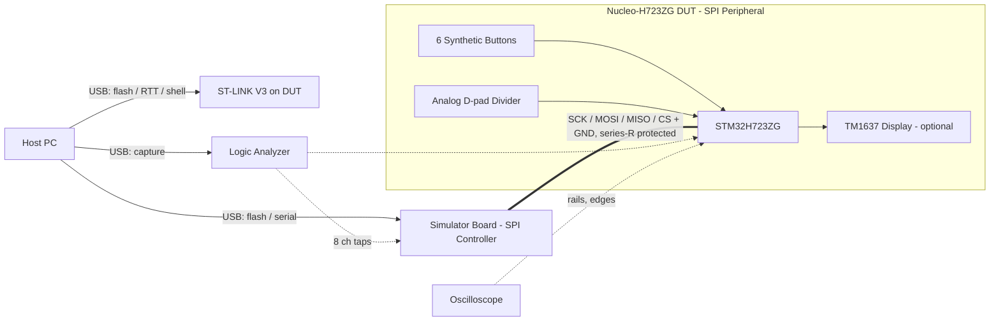
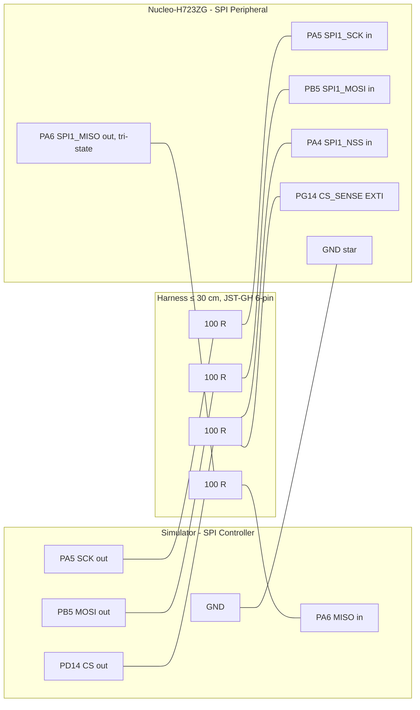
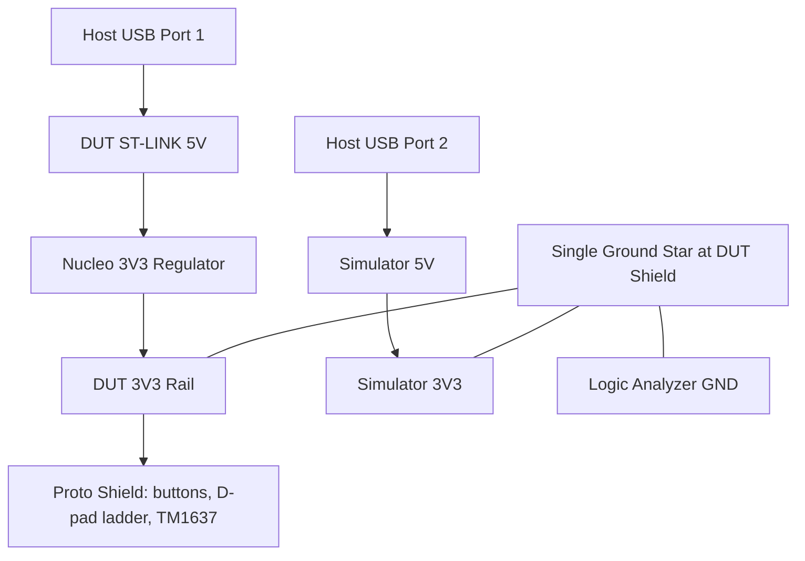

# Phase 1 Hardware Specification — Zephyr Rim-Link Prototype on Nucleo-H723ZG

| Document | Version | Date | Target Audience |
|---|---|---|---|
| Phase 1 Hardware Specification — Zephyr Rim-Link Prototype | 1.1 | 2026-07-04 | Embedded developer (mid-level), sim-racing domain fresher |

> **Informative:**
> This specification defines the bench hardware for Phase 1 of the
> [program roadmap](./fanatec-wheel-roadmap-and-system-spec.md): a Nucleo-H723ZG device under test
> (DUT) that reproduces the rim-side behavior of
> [`lshachar/Arduino_Fanatec_Wheel`](https://github.com/lshachar/Arduino_Fanatec_Wheel)
> (`Community implementation`), validated exclusively against a **protocol simulator**.
> **No Fanatec wheel base is connected in Phase 1.** All frame-format and electrical facts derived
> from community repositories are labeled `observed` and shall be re-verified on real hardware in
> Phase 2. Companion document: [Phase 1 Software Specification](./phase1-software-spec.md).

## Document Change Log

| Version | Date | Description |
|---|---|---|
| 1.0 | 2026-07-03 | Initial Phase 1 hardware specification derived from repository study of Arduino_Fanatec_Wheel, btClubSportWheel, and the Zephyr `nucleo_h723zg` board definition. |
| 1.1 | 2026-07-04 | Review pass: clock sweep extended to 12 MHz per roadmap §11.5 findings; CS setup timing and Mode-0 tolerance added; harness wiring figure added; simulator Option S1 restricted; §13 questions closed as decisions. |

---

## 1. Scope

This section defines what hardware Phase 1 builds and what it explicitly excludes, so that purchases and wiring stay within the phase gate.

Phase 1 hardware comprises four assemblies on one ESD-safe bench:

1. **DUT** — ST Nucleo-H723ZG running Zephyr 4.4.0 rim firmware.
2. **Simulator** — a second board acting as the wheel base (SPI controller/master), clocking 33-byte transactions.
3. **Instrumentation** — logic analyzer and oscilloscope taps on the link and timing GPIOs.
4. **Peripheral stubs** — six synthetic pushbuttons, one analog D-pad emulation input, and one optional TM1637 4-digit display, mirroring the reference project's I/O set.

Excluded from Phase 1: any Fanatec base or QR hardware, level shifters (the DUT is native 3.3 V), battery/QR power paths, custom PCBs, and all Phase 3 input hardware (funky switches, encoders, Hall paddles).

## 2. Reference Design Analysis

This section summarizes the electrical design of the reference project and states which of its decisions carry over to the H723ZG prototype and which are superseded. Source class for all rows: `Community implementation`.

| Reference design element (Arduino_Fanatec_Wheel) | Finding | Phase 1 disposition |
|---|---|---|
| 5 V Arduino Nano/Uno + logic level shifter to 3.3 V base signals | Author recommends the shifter; direct 5 V drive risks the base | **Superseded** — STM32H723 I/O is native 3.3 V; no shifter anywhere in Phase 1 |
| MISO from 5 V Arduino via divider acceptable because base MISO is base input only | Divider hack for shifterless builds | **Not applicable** (3.3 V native) |
| Series diode between base 5 V and USB 5 V so supplies never join | Diode drops base 5 V to ≈ 4.3 V for the AVR; prevents backfeed | **Principle retained** — Phase 1 uses fully separate supplies (§7); the ideal-diode mux is a Phase 4 PCB item |
| Base CS wired to two pins: D10 (AVR SS input) and D2 (external interrupt) | CS rising edge re-arms the response buffer; SS enables SPI slave | **Retained** — CS is wired to both SPI1_NSS (PA4) and an EXTI GPIO (PG14) on the DUT |
| SPI slave, Mode 1 (CPOL = 0, CPHA = 1), MSB first, measured by the author with a logic scope | Corrects earlier Mode-0 assumption from the upstream project | **Retained** as the `observed` link configuration |
| 33-byte fixed transaction, CRC-8 (0x131-polynomial table, init 0xFF) in last byte | Both directions | **Retained** |
| Fanatec round connector: 13 contacts; DIY epoxy-cast male connector documented | Connector build guide exists in the repo | **Deferred to Phase 2** — no QR connector in Phase 1 |
| TM1637 display on D3/D4; buttons on A5, A4, A3, A2, D8, D9; analog D-pad on A0 | Reference peripheral set | **Mirrored** with H723ZG pins (§6) |
| Debug serial traffic can cause the base firmware to release held buttons | Author's warning in source comments | Motivates the hardware link-ready/timing test points in §6.3 and the logging rules in the software spec |

## 3. System Overview

This section shows the complete Phase 1 bench topology. The simulator takes the electrical role of the wheel base; every signal that would arrive from the QR connector in production arrives from the simulator harness here.

**Figure 3-1: Phase 1 Bench Topology**

The simulator shall be one of:

- **Option S1 (default):** Arduino Uno/Nano running base-side test firmware derived from the reference project's raw-capture lineage, clocking at 3.3 V logic **via a level shifter or a natively 3.3 V AVR**, or
- **Option S2:** the second Nucleo-H723ZG running the Zephyr simulator application (SPI master), preferred for clock-rate sweeps and scripted fault injection.

> **Note:** If Option S1 uses a 5 V AVR, a level shifter on SCK/MOSI/CS toward the DUT is mandatory. The DUT's 3.3 V MISO is safely readable by 5 V AVR inputs. Option S2 avoids the issue entirely and is the recommended configuration.

## 4. Link Electrical Definition

This section defines the four-wire link plus ground between simulator and DUT. Values marked `observed` come from the community repositories; the base-side true values remain unknown until Phase 2.

| Parameter | Phase 1 value | Status |
|---|---|---|
| Signaling voltage | 3.3 V CMOS | observed (base side reported 3.3 V); normative for the bench |
| Roles | Simulator = SPI controller; DUT = SPI peripheral | observed |
| SPI mode | Mode 1 (CPOL = 0, CPHA = 1) | observed (author's logic-scope measurement) |
| Bit order | MSB first | observed |
| Transaction length | 33 bytes, CS held asserted for the full transaction | observed |
| SCK frequency | Configurable sweep 100 kHz – 12 MHz; default 500 kHz | Real-base clock unmeasured, but genuine rims accept 12 MHz from the community base-side emulator (roadmap §11.5) — the DUT shall tolerate the full sweep |
| Transaction cadence | Configurable 1 – 10 ms period; default 2 ms | **unknown on real base** — bench parameter only |
| CS polarity | Active low (asserted low during transaction; rising edge ends it) | observed |
| CS setup time | ≥ 5 µs from CS assert to first clock | observed in the community base-side emulator (roadmap §11.5); simulator default |
| Mode tolerance | Mode 1 default; a Mode-0 tolerance run is part of the sweep | Both modes observed working against genuine rims/bases (roadmap §11.5) |

Normative link rules:

- Every link signal (SCK, MOSI, MISO, CS) shall pass through a 100 Ω series resistor at the DUT boundary.
- The DUT MISO pin shall be high-impedance whenever the DUT is unpowered, in reset, or CS is deasserted.
- Simulator and DUT shall share a single ground return wire in the same harness bundle as the signals; total harness length shall not exceed 30 cm.
- No link signal shall exceed 3.6 V at the DUT boundary under any single-fault condition.

## 5. DUT Assembly

This section defines the Nucleo-H723ZG configuration and the peripheral stubs mounted on its proto shield.

### 5.1 Board Configuration

| Item | Requirement |
|---|---|
| Board | ST Nucleo-H723ZG (Nucleo-144), on-board ST-LINK V3 |
| Power | From ST-LINK USB only in Phase 1 (§7); JP set to STLK power source |
| Solder bridges / jumpers | Default factory state; document any change in the bench log |
| Proto shield | Morpho-compatible perma-proto carrying series resistors, button bank, D-pad divider, TM1637 header, and link connector (JST-GH 6-pin) |

### 5.2 DUT Pin Assignment

Pin identities below are taken from the Zephyr `nucleo_h723zg` board definition and the STM32H723 pinctrl tables (`Manufacturer public docs` via Zephyr project sources): SPI1 SCK = PA5 (Arduino D13), MISO = PA6 (D12), MOSI = PB5 (D11); SPI1 hardware NSS alternatives are PA4, PA15, PG10.

| Function | MCU pin | Header location | Direction | Notes |
|---|---|---|---|---|
| LINK_SCK | PA5 (SPI1_SCK) | Arduino D13 | In | 100 Ω series at shield edge |
| LINK_MISO | PA6 (SPI1_MISO) | Arduino D12 | Out (tri-state) | High-Z in reset/unselected; 100 Ω series |
| LINK_MOSI | PB5 (SPI1_MOSI) | Arduino D11 | In | 100 Ω series |
| LINK_CS (NSS) | PA4 (SPI1_NSS, AF) | Morpho CN7 | In | Hardware slave-select for the SPI peripheral |
| LINK_CS_SENSE (EXTI) | PG14 | Arduino D2 | In | Same CS wire, second tap — mirrors the reference D2+D10 trick; rising-edge interrupt re-arms the next response |
| LINK_READY (test point) | PF3 | Arduino D8 → repurposed TP | Out | Firmware asserts when a valid response is armed; logic-analyzer channel |
| SNAPSHOT_TICK (test point) | PD15 | Arduino D9 → TP | Out | Toggles on each input-snapshot publish; latency measurement |
| BTN1..BTN6 | PF10, PC2, PB1, PC3, PE9, PE11 | Arduino A5, A4, A3, A2, D6, D5 | In (pull-up) | Mirrors reference button set; active low to GND |
| DPAD_AIN | PA3 (ADC) | Arduino A0 | In (analog) | Resistor-ladder D-pad emulation (5-position divider) |
| TM1637_CLK | PE13 | Arduino D3 | Out | Optional display, bit-banged |
| TM1637_DIO | PE14 | Arduino D4 | Out/In (open-drain) | Optional display |
| LD1 (green) | PB0 | On-board | Out | Heartbeat |
| LD3 (red) | PB14 | On-board | Out | Link-error latch indicator |

**Figure 5-1: Link Harness Wiring (simulator ↔ DUT)**

> **Note:** The reference project's D8/D9 buttons are moved to D5/D6 on the DUT because D8/D9 are repurposed as timing test points; the software spec's default button-bit mapping follows this table.

### 5.3 Peripheral Stub Requirements

- The six buttons shall be quality momentary switches to ground with internal MCU pull-ups enabled; no external debounce capacitors (debounce is a firmware deliverable under test).
- The analog D-pad shall be a resistor ladder producing five distinct, monotonic voltage levels (idle + four directions) within 0 – 3.3 V; the exact levels shall be documented in the bench log and mirrored in the firmware calibration table.
- The optional TM1637 module shall be powered from the DUT 3V3 rail; if a 5 V-only module is used it shall be omitted rather than mixed onto the 3.3 V bus.

## 6. Simulator Assembly

This section defines the base-side simulator. Its purpose is to be a controllable, instrumentable stand-in for the wheel base so the DUT firmware can be proven before real hardware is risked.

### 6.1 Simulator Requirements

- The simulator shall drive CS, SCK, and MOSI, and sample MISO, as SPI controller in Mode 1, MSB first, 33-byte fixed transactions.
- The simulator shall compute and append CRC-8 (0x131-table, init 0xFF) on outgoing frames and verify it on incoming frames, counting mismatches.
- SCK frequency and transaction cadence shall be run-time configurable (serial/shell command) across at least 100 kHz – 12 MHz and 1 – 10 ms respectively; a Mode-0/Mode-1 toggle shall be provided.
- The simulator shall support scripted fault injection: truncated transaction (CS deassert mid-frame), extra clock cycles after byte 33, corrupted CRC, back-to-back transactions with minimal CS gap, randomized cadence jitter, and the genuine-base **flush behavior** (clocking dummy bytes to a frame boundary before starting a transaction, per roadmap §11.5).
- The simulator shall expose one GPIO that pulses at transaction start, for logic-analyzer correlation.
- MOSI frame content shall be settable: constant pattern, incrementing counter, and a display-text mode that encodes three 7-segment characters into bytes 2–4 (dot bit = bit 7) per the observed layout.

### 6.2 Simulator Pin Assignment (Option S2, second Nucleo-H723ZG)

| Function | MCU pin | Header | Direction |
|---|---|---|---|
| SIM_SCK | PA5 | D13 | Out |
| SIM_MOSI | PB5 | D11 | Out |
| SIM_MISO | PA6 | D12 | In |
| SIM_CS | PD14 | D10 (GPIO CS, active low) | Out |
| SIM_TXN_MARK | PF3 | D8 | Out (pulse at transaction start) |

Option S1 (5 V AVR) shall follow the reference project's controller-side wiring with a 4-channel level shifter (HV = 5 V, LV = 3.3 V) on SCK/MOSI/CS toward the DUT; DUT MISO connects to the shifter LV side. **Option S1 is restricted to ≤ 2 MHz** (AVR SPI-master and shifter bandwidth limits); the full 12 MHz sweep requires Option S2.

## 7. Power Architecture

This section defines Phase 1 power distribution. The governing rule inherited from the reference design (which used a series diode for the same purpose) is that no two 5 V sources are ever joined.

**Figure 7-1: Phase 1 Power Tree**

Normative power rules:

- The DUT shall be powered only through its ST-LINK USB in Phase 1; the simulator shall be powered from a separate USB port or supply.
- The 5 V and 3V3 rails of DUT and simulator shall never be interconnected; only ground is common, at a single star point on the DUT shield.
- A USB isolator should be inserted on the DUT ST-LINK connection during timing-critical captures to eliminate host ground-loop artifacts.
- Inrush, rail sequencing, ideal-diode muxing, and QR supply characterization are out of scope until Phase 2/4 and shall not be improvised on this bench.

## 8. Instrumentation and Test Points

This section fixes the measurement setup so results are comparable across runs and against the Phase 2 real-base captures.

| Instrument channel | Signal | Purpose |
|---|---|---|
| LA ch0 | LINK_CS | Transaction framing, CS-gap measurement |
| LA ch1 | LINK_SCK | Clock rate/mode verification |
| LA ch2 | LINK_MOSI | Base-to-rim frame decode |
| LA ch3 | LINK_MISO | Rim-to-base frame decode; first-byte (0xA5) arming check |
| LA ch4 | LINK_READY (PF3) | Boot-to-ready and re-arm latency |
| LA ch5 | SNAPSHOT_TICK (PD15) | Input-to-snapshot latency correlation |
| LA ch6 | SIM_TXN_MARK | Simulator-side transaction start |
| LA ch7 | spare / BTN1 | Button-edge to frame-content latency |
| Scope ch1/ch2 | DUT 3V3 rail / LINK_MISO edge | Rail sanity; tri-state verification at reset |

The logic analyzer shall capture at no less than 25 MS/s digital; every gate-relevant run shall be archived with firmware commit hash, simulator settings, and date.

## 9. Assembly and Verification Checklist

This section is the build-order procedure. Steps are sequential; do not energize the link before step 5 passes.

| Step | Action | Pass condition |
|---|---|---|
| 1 | Assemble DUT proto shield: series resistors, button bank, D-pad ladder, link connector, test-point headers | Continuity per §5.2 table; no short between any two link nets |
| 2 | Power DUT alone via ST-LINK; measure 3V3 rail | 3.3 V ± 5 %, no abnormal current |
| 3 | With DUT unpowered and again while held in reset, measure LINK_MISO impedance from the connector | High-impedance (no drive) in both states |
| 4 | Assemble simulator; verify its idle CS is deasserted (high) and SCK/MOSI idle levels match Mode 1 (SCK low) | Scope confirmation |
| 5 | Connect harness, grounds first; power both boards from separate ports | No current anomaly; idle bus quiet |
| 6 | Run first 33-byte transaction at 100 kHz | LA decode shows 33 clocked bytes within one CS assertion; DUT first MISO byte = 0xA5 |
| 7 | Sweep SCK 100 kHz → 12 MHz (Mode 1, plus a Mode-0 tolerance pass) and cadence 10 ms → 1 ms | Zero CRC errors on both sides at every point, or the failing corner is documented as the DUT's measured limit; 12 MHz edge quality captured on the scope |
| 8 | Verify LINK_READY behavior: asserted before first transaction, re-armed within the CS gap | LA measurement archived |

## 10. Bill of Materials (Phase 1 increment)

Items already purchased in Phase 0 (Nucleos, logic analyzer, PSU, scope, USB isolator, resistor/ESD kits, breadboard/proto stock) are not repeated. Cost bands per the roadmap (A < €50).

| Item | Qty | Band | Purpose |
|---|---|---|---|
| Morpho/Arduino perma-proto shields | 3 | A | DUT shield, simulator shield, spare |
| JST-GH 6-pin connector pairs + pre-crimped leads | 4 | A | Link harness (SCK, MOSI, MISO, CS, GND, spare) |
| Momentary pushbuttons (through-hole, quality) | 10 | A | 6 fitted + spares |
| Resistor ladder values for D-pad divider (per bench log) | — | A | Analog D-pad stub |
| TM1637 4-digit module, 3.3 V-capable | 1 | A | Optional display decode demo |
| 4-channel bidirectional level shifter module | 1 | A | Only if Option S1 (5 V AVR simulator) is used |
| Test-point headers / grabber-friendly pins | — | A | §8 instrumentation |

## 11. Exit Criteria and Forward Notes

Hardware-side contribution to Gate G1: all §9 steps pass; the DUT survives the full fault-injection matrix (driven by the simulator per the software spec) with no electrical anomaly; MISO tri-state behavior is proven at power-off, reset, and CS-deasserted.

Forward notes for Phase 2: the 13-contact Fanatec round connector build guide in the reference repository (`Community implementation`) and the QR2 mechanical interface are the starting points for the Phase 2 breakout fixture; nothing on this Phase 1 bench (including the series-resistor values) shall be assumed transferable to the real base without the Phase 2 measurements.

## 12. References

- [lshachar/Arduino_Fanatec_Wheel](https://github.com/lshachar/Arduino_Fanatec_Wheel) — `Community implementation`; reference wiring (D2+D10 CS trick, diode isolation, level-shifter guidance, peripheral set, SPI Mode 1 measurement)
- [darknao/btClubSportWheel](https://github.com/darknao/btClubSportWheel) — `Community implementation`; upstream frame structures
- [Zephyr `nucleo_h723zg` board definition](https://docs.zephyrproject.org/latest/boards/st/nucleo_h723zg/doc/index.html) and board devicetree sources — pin identities used in §5.2/§6.2
- [ST Nucleo-H723ZG user manual (UM2407-family)](https://www.st.com/en/evaluation-tools/nucleo-h723zg.html) — `Manufacturer public docs`; jumpers, power sources, morpho pinout
- [Program roadmap and system specification](./fanatec-wheel-roadmap-and-system-spec.md)

## 13. Question Register

| # | Question | Status (2026-07-04) | Resolution |
|---|---|---|---|
| 1 | Real base SCK frequency, cadence, CS-gap minimum | **Bounded / measurement pending** | Design envelope set: tolerate ≤ 12 MHz, CS setup ≥ 5 µs, both SPI modes (roadmap §11.5). Exact base values remain a Phase 2 measurement |
| 2 | PA4 hardware NSS vs software CS under Zephyr | **Resolved (design decision)** | Both retained: the in-tree driver uses PA4 as hardware NSS input in slave mode (verified in driver source); PG14 EXTI remains the authoritative framing/re-arm and short-frame-abort signal |
| 3 | Series-resistor value at high clock | **Resolved (decision rule)** | 100 Ω is the default; if the 12 MHz sweep corner shows edge degradation, SCK/MOSI/MISO drop to 47 Ω (then 33 Ω) while CS keeps 100 Ω; each change re-runs §9 step 7 and is logged |
