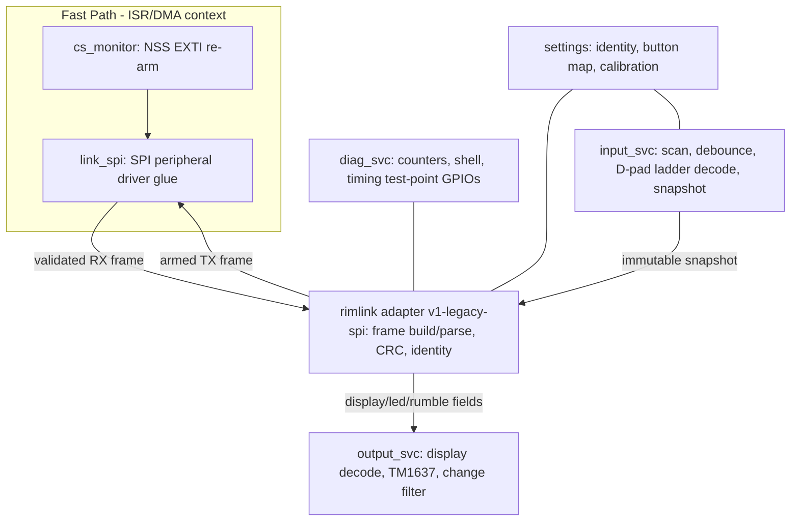
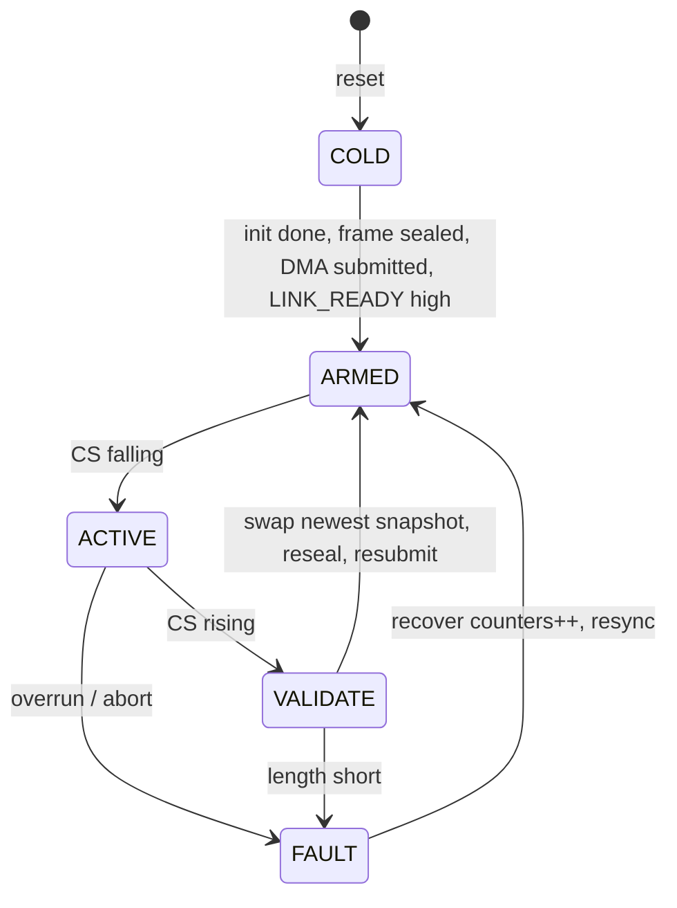
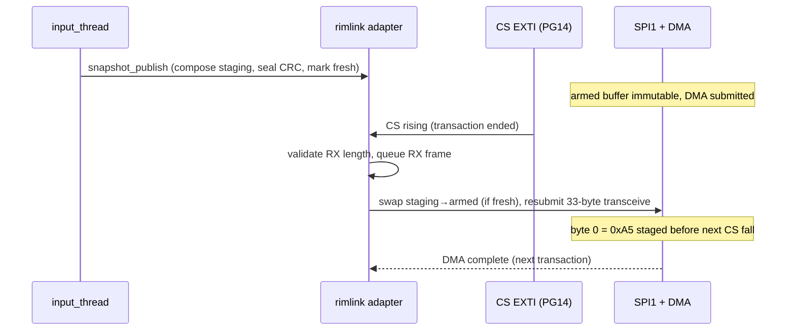

# Phase 1 Software Specification — Zephyr 4.4.0 Port of Arduino_Fanatec_Wheel

| Document | Version | Date | Target Audience |
|---|---|---|---|
| Phase 1 Software Specification — Zephyr Rim-Link Prototype Firmware | 1.1 | 2026-07-04 | Embedded developer (mid-level), sim-racing domain fresher |

> **Informative:**
> This specification defines the Phase 1 firmware: a Zephyr 4.4.0 application for `nucleo_h723zg`
> that reproduces the rim-side behavior of
> [`lshachar/Arduino_Fanatec_Wheel`](https://github.com/lshachar/Arduino_Fanatec_Wheel)
> (`Community implementation`) behind a versioned `rim-link` adapter, plus the base-side simulator
> application. All protocol constants are `observed` community facts, not Fanatec specifications;
> Phase 2 re-verifies them on a CSL DD 8 Nm. Companion document:
> [Phase 1 Hardware Specification](./phase1-hardware-spec.md).

## Document Change Log

| Version | Date | Description |
|---|---|---|
| 1.0 | 2026-07-03 | Initial Phase 1 software specification from source study of the reference sketch (469 lines, AVR) and the upstream btClubSportWheel frame structures. |
| 1.1 | 2026-07-04 | Review pass: CRC-8 definition made exact with verified test vector; 12 MHz/CS-setup/flush findings incorporated; Zephyr slave-driver capability confirmed with cache/abort implementation notes; button map table restructured; boot and buffer-swap figures added; questions closed. |

---

## 1. Scope

Phase 1 firmware shall implement: the legacy 33-byte SPI-peripheral exchange with CRC-8, identity presentation, button/D-pad input acquisition into immutable response snapshots, optional display-byte decoding to a TM1637, shell diagnostics, fault handling, and the timing instrumentation needed for Gate G1. It shall not implement: any base-specific workaround, QR power management, LED/LRA services, encoders, analog paddles, or the optional display module (Phases 3–6).

## 2. Reference Behavior (Observed Protocol Facts)

This section is the normative record of what the port must reproduce. Every fact is `observed` in the cited sources; offsets were cross-checked between the two repositories.

### 2.1 Link Parameters

| Parameter | Value | Source |
|---|---|---|
| Roles | Base = SPI controller; rim = SPI peripheral | Both repos |
| Mode | SPI Mode 1 (CPOL = 0, CPHA = 1), MSB first | Arduino_Fanatec_Wheel (author's logic-scope measurement, correcting Mode-0 in upstream comments) |
| Transaction | 33 bytes per CS assertion | Both repos |
| Re-arm point | CS **rising** edge (end of transaction): reset index, preload first response byte | `cableselect()` ISR in the reference sketch |
| CRC | CRC-8 over bytes 0–31, result in byte 32, both directions. **Exact definition (verified computationally):** reflected polynomial 0x31 (table form 0x8C), init 0xFF, no final XOR. Test vector: `A5 03 00×30` → `0x5A`. Ztest shall assert this vector and 200 random-vector equivalence against the ported table | Reference sketch table; verification per roadmap §11.5 |
| Clock envelope | Genuine rims accept 12 MHz; CS-assert-to-first-clock ≥ 5 µs; genuine rims *resume* interrupted transactions (our CS-edge resync supersedes this; the simulator emulates the base-side flush) | roadmap §11.5 (`Community implementation`) |

### 2.2 Rim → Base Frame (MISO), 33 bytes

Layout per `csw_in_t` in btClubSportWheel `src/fanatec.h`, confirmed by the reference sketch's `returnData` usage:

| Offset | Field | Size | Phase 1 content |
|---|---|---|---|
| 0 | header | 1 | 0xA5 constant |
| 1 | id | 1 | Rim identity: 0x01 BMW GT2, 0x02 ClubSport Formula, 0x03 Porsche 918 RSR (default), 0x04 UniHub — Kconfig/shell selectable |
| 2–4 | buttons[3] | 3 | Button bytes A/B/C per §2.4 bit map |
| 5 | axisX | 1 | 0x00 (neutral) in Phase 1 |
| 6 | axisY | 1 | 0x00 (neutral) in Phase 1 |
| 7 | encoder | 1 | int8 delta; 0x00 in Phase 1 (no encoder fitted) |
| 8–9 | btnHub[2] | 2 | 0x00 |
| 10–11 | btnPS[2] | 2 | 0x00 |
| 12–30 | reserved | 19 | 0x00 |
| 31 | fwvers | 1 | 0x00 (as in reference `returnData` init) |
| 32 | crc | 1 | CRC-8 over 0–31 |

### 2.3 Base → Rim Frame (MOSI), 33 bytes

Layout per `csw_out_t`, display offsets confirmed by the reference sketch's decoder (`mosiBuf[2..4]`):

| Offset | Field | Size | Phase 1 handling |
|---|---|---|---|
| 0 | header | 1 | Recorded, not interpreted |
| 1 | id | 1 | Recorded |
| 2–4 | disp[3] | 3 | Three 7-segment characters; bit 7 = dot. Decoded to ASCII (shell) and mirrored to TM1637 if fitted, only on CRC-valid frames and only on change |
| 5–6 | leds | 2 | 16-bit LED bitfield — counted/logged only in Phase 1 (no LED hardware) |
| 7–8 | rumble[2] | 2 | Two 8-bit rumble channels — counted/logged only |
| 9–31 | padding | 23 | Ignored |
| 32 | crc | 1 | Verified; mismatch increments error counter and suppresses output processing of that frame |

The 7-segment→ASCII decode table shall be ported verbatim from the reference sketch (0x3F→'0', 0x6D→'S', 0x39→'C', 0x40→'-', etc.), with unknown patterns rendered as hex.

### 2.4 Button Bit Map (buttons[3])

Ported from the reference sketch's tail comment. Bit numbering: bit 1 = LSB of byte A (offset 2), continuing through byte C (offset 4).

**Byte A (offset 2):**

| Bit | 1 | 2 | 3 | 4 | 5 | 6 | 7 | 8 |
|---|---|---|---|---|---|---|---|---|
| Function | D-pad Up | D-pad Left | D-pad Right | D-pad Down | Button 11 | Button 3 | Button 6 | Button 4 |

**Byte B (offset 3):**

| Bit | 9 | 10 | 11 | 12 | 13 | 14 | 15 | 16 |
|---|---|---|---|---|---|---|---|---|
| Function | Right paddle | Button 2 | Button 8 | Left paddle | Button 1 | Button 5 | Button 9 | Button 10 |

**Byte C (offset 4):**

| Bit | 17 | 18 | 19 | 20 | 21 | 22 |
|---|---|---|---|---|---|---|
| Function | Button 21 (CM) | D-pad Button | Joystick Button | Button 7 | Button 27 (CM) | Menu button |

Default physical mapping of the six DUT buttons (hardware spec §5.2) shall be bits {8, 5, 13, 11, 9, 12}, matching the reference configuration, and shall be reconfigurable at run time via shell.

> **Informative:** The reference sketch documents menu sequences over these bits (e.g. bit 22 toggling enters the base setup menu; centering via D-pad combinations). The Phase 1 shell reproduces the sketch's serial command feature so these sequences can be exercised against the simulator and, in Phase 2, the real base.

## 3. Software Architecture

This section defines the module decomposition and scheduling. The central corrective lesson from the reference implementation — a monolith whose serial printing disturbs button timing — is enforced structurally: nothing besides the link ISR/DMA path touches the transaction, and logging is impossible in that path by construction.

**Figure 3-1: Module Architecture**



### 3.1 Threads and Priorities

| Context | Priority | Work | Budget |
|---|---|---|---|
| SPI DMA/ISR + NSS EXTI | Interrupt | Frame RX/TX completion, re-arm, CRC hand-off flagging | ≤ 10 µs CPU per event |
| `input_thread` | Cooperative high (e.g. -2) | 1 kHz scan tick: GPIO read, debounce, ADC D-pad, snapshot compose+publish | ≤ 100 µs per tick |
| `output_thread` | Preemptive medium | Display decode, TM1637 refresh on change | Best effort, ≥ 10 ms min interval |
| `diag_thread` / shell | Preemptive low | Counters, shell, periodic health line | Best effort |

Normative scheduling rules:

- No logging, dynamic allocation, flash/settings writes, or blocking calls shall occur in the fast path.
- The TX response buffer visible to the SPI peripheral shall be immutable for the entire time it is armed; updates occur only by pointer swap between transactions (§5.3).
- A missed re-arm (CS asserts while no buffer is armed) shall transmit the previous valid frame, increment `rearm_miss`, and light LD3.

## 4. Porting Map (AVR Sketch → Zephyr)

This section is the traceability table from every functional element of the 469-line reference sketch to its Zephyr realization.

| Reference element | Behavior | Zephyr realization |
|---|---|---|
| `setup()` pin/SPI config (`SPCR` SPE+SPIE+CPHA) | SPI slave, Mode 1, interrupt per byte | Devicetree SPI1 peripheral instance; `spi_config` with `SPI_OP_MODE_SLAVE \| SPI_MODE_CPHA \| SPI_WORD_SET(8)`; DMA full-frame transfer instead of per-byte ISR |
| `cableselect()` on D2 RISING (jumpered to D10/SS) | Reset byte index; preload `SPDR = returnData[0]` for next transaction | `cs_monitor`: GPIO EXTI on PG14 rising edge → complete/abort current transfer, swap in newest snapshot frame, re-submit `spi_transceive` so byte 0 (0xA5) is staged before the next CS fall |
| `ISR(SPI_STC_vect)` byte exchange | Store MOSI byte, load next MISO byte | Replaced by DMA; the 33-byte RX buffer is validated after CS rising edge |
| `crc8()` + PROGMEM table | Table-driven CRC-8, init 0xFF | `rimlink_crc8()` in adapter; identical 256-entry table in const flash; ztest-verified against reference vectors; optional STM32 hardware CRC only if it reproduces the table exactly |
| `calcOutgoingCrc()` / `checkIncomingCrc()` | Append/verify byte 32 | Adapter `frame_seal()` / `frame_validate()`; RX mismatch → counter + frame drop for output purposes (buttons already sent are unaffected, matching reference behavior) |
| `returnData[]` init (0xA5, id, …, crc) | Static identity frame | `rimlink_identity_set(enum rim_id)`; frames built by adapter, identity from Kconfig default + shell/settings override |
| `readButtons()` bit set/clear into bytes 2–4 | Direct GPIO → bit map | `input_svc` debounced scan → logical button set → adapter maps to bytes A/B/C via configurable map |
| Analog D-pad (`DPADPIN` A0, level windows) | ADC value → 4 direction bits | `input_svc` ADC channel + calibration windows from settings; hysteresis between windows |
| `refreshAlphanumericDisplays()` | Decode `mosiBuf[2..4]` 7-seg to serial + TM1637, CRC-gated, change-gated | `output_svc`: same decode table; shell `rim disp` shows current text; TM1637 driver (bit-banged GPIO, 3.3 V) behind Kconfig |
| Serial monitor commands (`i`, `o`, `d`, `A/B/C`, `1..7`) | Print MOSI/MISO, select button byte, toggle bits manually | Zephyr shell commands `rim mosi`, `rim miso`, `rim disp`, `rim btn set/clr <bit>`, `rim id <n>` — enabling base-menu sequences without physical buttons |
| Debug-serial disturbs buttons (author warning) | Timing hazard | Structural fix: deferred logging only, nothing in fast path; `CONFIG_LOG_MODE_DEFERRED=y`, logs dropped rather than blocking |
| `delay()`/`millis()` pacing | Loop timing | `k_timer` 1 kHz input tick; `k_work` for output/diag |
| 5 V + level shifter / diode power notes | Electrical | Removed — native 3.3 V DUT; power rules in hardware spec §7 |

## 5. Rim-Link Adapter v1 (legacy-spi)

This section specifies the versioned adapter that isolates every protocol constant. Higher layers see logical inputs/outputs only; no other module may reference frame offsets.

### 5.1 Interface

| Element | Direction | Type | Description |
|---|---|---|---|
| `rimlink_init(cfg)` | In | struct | Bus/DMA handles, identity, callbacks; returns error if SPI slave unsupported |
| `rimlink_snapshot_publish(snap)` | In | `struct rim_inputs` | Logical buttons (bitset), dpad, axes, encoder delta; adapter builds+seals next TX frame |
| `rimlink_rx_cb(frame)` | Out (callback) | `struct base_outputs` | Validated display chars, leds bitfield, rumble[2]; invoked from workqueue, never ISR |
| `rimlink_stats_get()` | Out | struct | txn_count, crc_err_rx, crc_err_sim_reported, rearm_miss, short_frame, overrun, cs_gap_min/max |
| `rimlink_identity_set(id)` | In | enum | 0x01/0x02/0x03/0x04; takes effect next transaction |

### 5.2 Transaction State Machine

**Figure 5-1: Link Transaction States**



### 5.3 Buffering Model

**Figure 5-2: Double-Buffer Swap Across Transactions**



- Two TX frame buffers shall alternate: `armed` (owned by DMA) and `staging` (owned by adapter). `rimlink_snapshot_publish` writes `staging` and marks it fresh; the CS-rising handler swaps only if fresh, otherwise re-arms the previous frame.
- One RX buffer per transaction shall be handed to a message queue (depth ≥ 4) for validation/decode outside interrupt context; queue-full increments `overrun` and drops the oldest.

### 5.4 Error and Fault Conditions

| Condition | Trigger | Action |
|---|---|---|
| RX CRC mismatch | byte 32 ≠ CRC(0–31) | `crc_err_rx`++; drop frame for output decode; no TX change |
| Short transaction | CS rising before 33 bytes | `short_frame`++; abort+resubmit DMA; frame discarded |
| Extra clocks | clocks after byte 33 within CS | ignored by DMA length; `extra_clk` flag if detectable; resync at CS edge |
| Re-arm miss | CS falling while VALIDATE incomplete | previous frame repeats; `rearm_miss`++; LD3 on |
| Stale inputs | no snapshot for > 50 ms | momentary bits cleared in next sealed frame (safety rule from system spec) |

## 6. Input Service

This section specifies acquisition. The 1 kHz tick shall read the six buttons (active-low, internal pull-ups), run per-button debounce (two consecutive equal samples to change state, i.e. 2 ms), decode the D-pad ADC ladder through calibrated windows with hysteresis, compose a `struct rim_inputs`, timestamp it with the cycle counter, publish it to the adapter, and toggle SNAPSHOT_TICK (PD15). Acquisition-to-publish latency shall be measured continuously; the running P99 shall be readable via `rim stats` and shall satisfy the ≤ 1 ms system criterion trivially at this scale (budget ≤ 100 µs).

## 7. Output Service (Optional TM1637)

Enabled by `CONFIG_RIM_TM1637=y`. On each CRC-valid RX frame whose `disp[3]` differs from the previous valid value, the service shall map the three characters into the TM1637 segment buffer (4th digit blank), matching the reference behavior of updating only on change and only on valid CRC. LED/rumble fields shall be accumulated into counters (`leds_last`, `rumble_last`, change counts) visible via shell — evidence collection for the Phase 4 output decision.

## 8. Simulator Application

The base-side application (second Nucleo, hardware spec §6) shall: clock 33-byte Mode-1 transactions at shell-configurable rate/cadence; seal MOSI frames with CRC-8; verify MISO CRC and header 0xA5; run the fault-injection set {truncate at byte N, corrupt CRC, extra clocks, min CS gap, cadence jitter}; encode shell-entered text into `disp[3]` for display-path testing; and stream per-second statistics (transactions, MISO CRC errors, first-byte errors) over its console. Simulator and DUT statistics shall be reconcilable to zero unexplained discrepancy.

## 9. Configuration

| Kconfig symbol | Default | Meaning |
|---|---|---|
| `CONFIG_RIMLINK_LEGACY_SPI` | y | Build adapter v1 |
| `CONFIG_RIM_IDENTITY` | 3 | 0x03 Porsche 918 RSR (reference default) |
| `CONFIG_RIM_TM1637` | n | Optional display mirror |
| `CONFIG_RIM_SHELL` | y | Diagnostic shell |
| `CONFIG_SPI_SLAVE` | y | Zephyr SPI peripheral mode (confirmed in-tree for STM32H7: hardware NSS input, `K_FOREVER` slave wait — roadmap §11.5) |
| `CONFIG_SPI_STM32_DMA` | y | DMA transfers; devicetree `dmas`/`dma-names` required |
| `CONFIG_NOCACHE_MEMORY` | y | Link frame buffers placed in a non-cacheable region (or explicit cache maintenance) — mandatory with D-cache + DMA on H7 |
| `CONFIG_LOG_MODE_DEFERRED` | y | Structural fast-path protection |

Devicetree overlay (informative sketch):

```dts
&spi1 {
    status = "okay";
    pinctrl-0 = <&spi1_sck_pa5 &spi1_miso_pa6 &spi1_mosi_pb5 &spi1_nss_pa4>;
    pinctrl-names = "default";
    dmas = <&dmamux1 ... >, <&dmamux1 ... >;
    dma-names = "tx", "rx";
};
/ {
    rim_pins {
        compatible = "gpio-keys";
        cs_sense: cs_sense { gpios = <&gpiog 14 GPIO_ACTIVE_LOW>; };
        /* btn1..btn6 per hardware spec §5.2; link_ready PF3; snap_tick PD15 */
    };
};
```

## 10. Timing Requirements and Measurement

**Figure 10-1: Boot-to-Link-Ready Sequence (fast path first)**

```mermaid
sequenceDiagram
    participant HW as Reset/Power
    participant Z as Zephyr kernel
    participant AD as rimlink
    participant REST as deferred init
    HW->>Z: reset release (t0)
    Z->>AD: clocks, SPI1 slave + DMA, identity frame sealed
    AD->>AD: arm TX buffer, submit transceive
    AD->>HW: LINK_READY (PF3) high (t1 = boot-to-ready)
    Z->>REST: shell, TM1637, diagnostics (after t1)
    Note over AD: t1 - t0 measured on LA; must beat base first-poll deadline (Phase 2)
```

| Requirement | Limit | Method |
|---|---|---|
| Boot-to-LINK_READY | Measured and recorded; target < 100 ms pending Phase 2 base deadline | LA: reset release → PF3 high |
| Re-arm time (CS rising → DMA resubmitted with byte 0 staged) | < minimum CS gap sustained at 1 ms cadence | LA: CS ch0 vs LINK_READY pulse |
| Snapshot latency (input edge → published) | P99 ≤ 1 ms (budget ≤ 100 µs) | BTN1 edge (ch7) → SNAPSHOT_TICK (ch5) |
| Zero-error sweep | 0 CRC/short/overrun across §Hardware §9 step 7 sweep | Reconciled DUT+simulator counters |

> **Note:** Driver-source review (roadmap §11.5) confirms slave mode + DMA capability in-tree, so this is now an implementation task, not a feasibility question. Implementation notes: slave `spi_transceive` blocks until the controller completes the frame, so it runs in a dedicated link thread; the PG14 CS-rising EXTI performs the swap/resubmit; short frames are terminated via the driver's abort/release path from the EXTI handler. If measured re-arm latency still misses the deadline, the pre-approved fallback is a thin LL-level transfer layer beneath the unchanged adapter API.

## 11. Test Plan

| Layer | Tests |
|---|---|
| Host-native ztest | CRC-8 vectors vs reference table; frame build/parse round-trip; button bit-map (all 22 bits); 7-seg decode table incl. dot bit and unknown-glyph path; debounce and D-pad window/hysteresis logic |
| On-target | Boot-to-ready; sweep matrix; 1-hour soak at 2 ms cadence; fault-injection matrix (each injector ≥ 1000 events, counters reconcile); stale-input clearing; identity switch mid-run |
| Regression artifacts | LA captures + counter dumps per run, keyed to commit hash |

## 12. Acceptance Criteria (software contribution to Gate G1)

- 1-hour continuous run at 500 kHz / 2 ms: zero unexplained CRC, short-frame, overrun, or re-arm-miss counts on both sides.
- All fault injections detected, counted, and recovered without reset.
- Boot-to-ready and snapshot-latency figures documented in the bench log.
- All ztest suites pass in CI; adapter API stable (no protocol constants outside `rimlink_legacy_spi`).
- Shell reproduces the reference serial-command feature sufficiently to drive the documented menu bit sequences.

## 13. Repository Layout

```
app/
  rim/            # DUT application (main, threads)
  sim/            # simulator application
lib/
  rimlink/        # adapter v1: frames, crc, identity, state machine
  input_svc/  output_svc/  diag_svc/
boards/           # nucleo_h723zg overlays (rim + sim)
tests/            # ztest suites (host-native + on-target)
docs/             # this spec, bench logs, capture archive index
west.yml          # Zephyr 4.4.0 manifest
```

## 14. References

- [lshachar/Arduino_Fanatec_Wheel](https://github.com/lshachar/Arduino_Fanatec_Wheel) — `Community implementation`; primary behavioral reference (sketch studied at master, 2026-07-03)
- [darknao/btClubSportWheel](https://github.com/darknao/btClubSportWheel) — `Community implementation`; `csw_in_t`/`csw_out_t` frame structures
- [Zephyr SPI API and `nucleo_h723zg` board documentation](https://docs.zephyrproject.org/) — driver capabilities, devicetree
- [Phase 1 Hardware Specification](./phase1-hardware-spec.md)
- [Program roadmap and system specification](./fanatec-wheel-roadmap-and-system-spec.md)

## 15. Question Register

| # | Question | Status (2026-07-04) | Resolution |
|---|---|---|---|
| 1 | Zephyr slave + DMA without a custom LL layer | **Resolved (capability) / latency measurement pending** | In-tree support confirmed by driver-source review (roadmap §11.5); §10 measurements decide only whether the pre-approved LL fallback is needed |
| 2 | Minimum CS gap for re-arm on the real base | **Bounded / measurement pending** | CS setup ≥ 5 µs observed on the community base side; exact base gap is a Phase 2 capture item |
| 3 | Hardware CRC reproduction | **Resolved (yes)** | CRC is reflected poly 0x31, init 0xFF, no XOR-out (verified). The H7 CRC unit reproduces it with 8-bit programmable polynomial 0x31, init 0xFF, byte-level input reversal and output reversal enabled; on-target ztest against the §2.1 vectors gates adoption. Software table remains the baseline |
| 4 | Identity 0x02 vs 0x03 for output traffic | **Resolved (decision)** | 0x03 stays the Phase 1 default (reference parity); 0x02 ClubSport Formula is the designated primary candidate for Phase 2 output-capability captures because its host-side display/LED surface is explicitly exposed (roadmap §11.4) |
