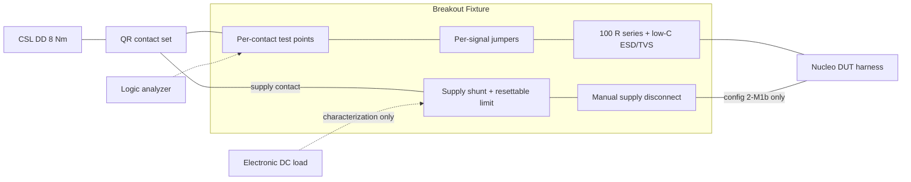
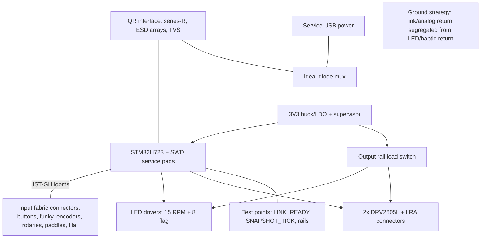

# Hardware Specification Updates — Phases 2–6 (Baseline: Phase 1 Hardware Specification v1.0)

| Document | Version | Date | Target Audience |
|---|---|---|---|
| Hardware Specification Updates — Phases 2–6 | 1.1 | 2026-07-04 | Embedded developer (mid-level), sim-racing domain fresher |

> **Informative:**
> This document extends the [Phase 1 Hardware Specification](./phase1-hardware-spec.md) v1.0
> through the remaining program phases as **delta specifications**: each phase section lists what
> is *added*, *modified*, and *retired* relative to the then-current bench. Baseline items not
> mentioned in a delta remain in force unchanged. Phase gates (G2–G5) are defined in the
> [program roadmap](./fanatec-wheel-roadmap-and-system-spec.md); a delta shall not be built before
> its predecessor gate passes. Companion:
> [Software Specification Updates — Phases 2–6](./phases2-6-software-spec.md).

## Document Change Log

| Version | Date | Description |
|---|---|---|
| 1.0 | 2026-07-03 | Initial delta specifications for Phases 2–6 on the Phase 1 v1.0 baseline. |
| 1.1 | 2026-07-04 | Review pass: fixture bandwidth requirement (12 MHz) added; Phase 2 fixture and PCB rev A block figures added; LED architecture, display-module link, and rev-B criteria questions closed as decisions. |

---

## 1. Baseline and Delta Conventions

This section fixes the shared vocabulary for all deltas so each phase reads as a controlled change, not a redesign.

**Baseline (end of Phase 1 / Gate G1):** Nucleo-H723ZG DUT with proto shield (SPI1 slave on PA5/PA6/PB5, dual CS tap PA4 + PG14, six buttons, D-pad ladder, optional TM1637, LINK_READY PF3, SNAPSHOT_TICK PD15), Nucleo-based protocol simulator, logic-analyzer/scope instrumentation, separate USB supplies with single ground star.

Delta rules:

- **ADD** items introduce new assemblies or signals; each shall receive a pin/connector entry in the living bench-log pin registry before first power.
- **MOD** items change an existing baseline element; the superseded configuration shall be photographed/logged before modification.
- **RET** items are retired; retired fixtures shall be labeled and kept until the phase gate passes, then archived.
- Every delta inherits the baseline electrical rules unless explicitly relaxed: 3.3 V-only DUT signaling, series resistance at boundaries, MISO high-impedance in reset/unpowered, no joined supplies, single ground star, harness ≤ 30 cm on the link.
- Facts sourced from community repositories remain `Community implementation` observations until re-measured; measured values shall be promoted to `verified` in the bench log with capture references.

**Figure 1-1: Bench Evolution Across Phases**

---

## 2. Phase 2 Delta — Protected Base Bench and QR Measurement Fixture

This phase adds the first Fanatec hardware. Every new element exists to make connecting an unproven prototype to a commercial base survivable and evidence-producing. The simulator is not retired; it remains the regression reference.

### 2.1 Additions

| ID | ADD item | Requirement summary |
|---|---|---|
| 2-A1 | **Bench base**: Fanatec CSL DD 8 Nm + Boost Kit 180 PSU | Clamp-mounted; powered via switched, RCD/GFCI-protected outlet within reach (session kill switch). Exact firmware recorded at receipt (`Manufacturer public docs` for setup/warnings). No rim torque testing in Phase 2. |
| 2-A2 | **QR breakout fixture** | Passive breakout between base QR (or base-side connector) and DUT harness. Every contact routed to a labeled test point. Signals: 100 Ω series + 3.3 V-rated ESD/TVS to the DUT side. Supply contact routed through a precision shunt (see 2-A4) and a resettable current limit. Community pinout ([Fanatec-Pinout](https://github.com/FendtXerion3800/Fanatec-Pinout), `Community implementation`) is the starting hypothesis; each contact shall be verified by measurement before the DUT connects. |
| 2-A3 | **Connector build** | 13-contact male connector per the reference project's epoxy-cast method, or QR2 Wheel-Side electrical tap — whichever matches the purchased base's wheel-side interface. Contact assignments frozen only after 2-A2 verification. |
| 2-A4 | **Supply characterization set** | Electronic DC load (or resistor decade), shunt + differential probe/shunt-amp board. Shall establish: rail voltage, usable current in steps to first brownout/limit, inrush at mate, behavior on hot mate/de-mate. Results promote the QR power budget to `verified`. |
| 2-A5 | **Donor wheel tap (optional, recommended)** | Used Fanatec wheel + passive LA tap inserted between base and donor. Tap shall be series-resistored, never driven. Purpose: genuine transaction captures (clock rate, cadence, CS gap, frame content incl. `disp`/`leds`/`rumble` activity). |
| 2-A6 | **Isolation for DUT debug** | USB isolator (baseline item) becomes mandatory whenever DUT and base are electrically connected; alternatively battery-powered debug host. |

### 2.2 Modifications

| ID | MOD item | Change |
|---|---|---|
| 2-M1 | DUT power source | Two approved configurations: (a) DUT powered from ST-LINK USB **through isolator**, QR supply contact *not* connected to DUT; (b) DUT powered from QR supply through fixture current limit, ST-LINK connected only through isolator. Configurations shall never be mixed; the active configuration is logged per session. |
| 2-M2 | Simulator role | Re-parameterized with measured base values (clock, cadence, CS gap) after first captures; becomes the "base twin" for regression. |
| 2-M3 | LA channel plan | ch6 reassigned from SIM_TXN_MARK to fixture shunt-comparator/current-event flag during base sessions. |

### 2.3 Fixture Requirements (normative)

- The fixture shall prevent any DUT-side fault from presenting > 3.6 V or > the configured current limit to the base connector.
- The signal path (series resistance, ESD network, wiring) shall pass 12 MHz SPI edges cleanly: low-capacitance ESD parts (≤ 5 pF class) on SCK/MOSI/MISO, series values per the Phase 1 §13 decision rule, verified with a scope edge capture before first base session (envelope from roadmap §11.5).
- The fixture shall allow disconnecting each signal individually (jumper per contact) so the DUT can be introduced pin-by-pin.
- The supply path shall include a manual disconnect and a resettable limit set below the measured base supply capability.
- Hot-plug events shall be exercised deliberately and captured; the DUT shall not be left mated across base power cycles until §2.4 step 6 passes.

**Figure 2-1: Phase 2 QR Measurement Fixture**

### 2.4 Phase 2 Verification Additions

| Step | Action | Pass condition |
|---|---|---|
| 1 | Fixture continuity/isolation, no boards attached | Per-contact map matches build sheet; no inter-contact leakage |
| 2 | Base + fixture only: rail/contact survey | Voltage map recorded; unknown contacts identified or left open |
| 3 | Supply characterization (2-A4) | Budget table `verified`; inrush captured |
| 4 | Donor tap captures (if 2-A5 present) | ≥ 10 min clean capture; parameters extracted |
| 5 | DUT via fixture, signals-only config (2-M1a) | Base recognizes rim; buttons visible on PC; zero electrical anomalies |
| 6 | DUT on QR power config (2-M1b) | Stable operation ≥ 30 min; brownout/mate cycling survived |
| 7 | Boot-deadline measurement | Base power-on → first poll vs DUT boot-to-ready margin documented |

Gate G2 hardware contribution: steps 1–7 pass; compatibility-matrix row 1 (CSL DD 8 Nm, firmware, QR gen, result) recorded with capture references.

---

## 3. Phase 3 Delta — Full Input HMI Board

This phase scales the input electronics to the system-spec §3.4 maximum configuration. The link and power boundary are untouched; all changes are on the input side of the snapshot.

### 3.1 Additions

| ID | ADD item | Requirement summary |
|---|---|---|
| 3-A1 | **Input expansion board** (proto shield stack or dedicated proto PCB on morpho) | Carries: 12 primary buttons, 2 seven-way funky switches, 4 detented thumb encoders, 5 front rotaries, 2 magnetic paddle switch sets, 2 Hall clutch paddle channels. |
| 3-A2 | **Direct-GPIO scan fabric** | Buttons/funky/paddles on direct GPIO with internal pull-ups where pin count allows. A 74HC165-class shift-register bank (`Community implementation` pattern from F_Interface_AL) may be used only for the 12 primary buttons and only if the measured added scan latency keeps the snapshot budget; encoders and paddles shall remain on direct GPIO/EXTI-capable pins. |
| 3-A3 | **Quadrature wiring** | Each of the 4 encoders on two EXTI-capable GPIOs; RC (100 Ω/1 nF class) permitted, values logged; no Schmitt buffers unless measurement shows chatter beyond firmware decode capability. |
| 3-A4 | **Analog front end** | 2 ratiometric Hall channels (clutch L/R) + 1 existing D-pad ladder on distinct ADC channels; per-channel RC filter; sensors powered from DUT 3V3; wiring shielded/twisted, ≤ 20 cm. |
| 3-A5 | **Pin registry extension** | All new assignments committed to the devicetree overlay and bench-log registry before power; EXTI line conflicts (one line number per port group on STM32) shall be checked at allocation time. |

### 3.2 Modifications / Retirements

| ID | Item | Change |
|---|---|---|
| 3-M1 | Baseline 6-button bank | Absorbed into 3-A1 as primary buttons 1–6 |
| 3-M2 | LA channel plan | ch7 cycles across encoder/paddle channels per test case |
| 3-R1 | None retired | D-pad ladder retained as regression input |

### 3.3 Phase 3 Verification Additions

Maximum-rate actuation runs per input class (bounce capture, stuck detection, simultaneous-activation), Hall calibration sweep end-stop to end-stop with temperature spot-checks, and the latency re-measurement feeding Gate G3 (P99 ≤ 1 ms with the full scan fabric active against the real base).

---
## 4. Phase 4 Delta — Output Subsystem and Rim PCB Rev A

This phase adds the bounded output hardware and converts the validated proto stack into the first custom rim controller PCB. The governing constraint: output load shall be electrically and thermally incapable of disturbing the link/input domain.

### 4.1 Additions

| ID | ADD item | Requirement summary |
|---|---|---|
| 4-A1 | **LED subsystem** | 15 RGB RPM LEDs + 8 flag/status LEDs. Addressable (SK6812-class) driven from a DMA-fed timer/SPI stream, or constant-current driver ICs — decided by the measured QR current budget (Phase 2, `verified`). Worst-case LED current shall fit the budget with ≥ 30 % margin; a global brightness cap shall be hardware-enforceable (rail load switch). |
| 4-A2 | **Haptic subsystem** | 2 LRAs on DRV2605L-class drivers (I2C + enable GPIOs), independent left/right channels, flyback/current protection per driver datasheet. Hardware-ready regardless of the §11.4 rumble-transport outcome. |
| 4-A3 | **Load-switched output rail** | LEDs, LRAs (and future display) on a separately switched rail sequenced after link/input readiness; inrush-limited for LED bulk capacitance. |
| 4-A4 | **Rim PCB rev A** | 4-layer board integrating: MCU (H723 baseline footprint; bakeoff alternate noted in layout review), QR interface protection (series-R, ESD arrays, TVS), ideal-diode power mux (QR vs service USB) — the productionized descendant of the reference project's isolation diode — 3V3 regulation + supervisor/brownout, scan fabric connectors (JST-GH per input group), LED/haptic drivers, load switches, SWD service pads (Tag-Connect), LINK_READY/SNAPSHOT_TICK test points retained, mounting pattern matching the Phase 5 plate draft. |
| 4-A5 | **Ergonomic mock-up hardware** | Full-scale printed/laser-cut rim blanks carrying real controls for blind-identification sessions; not electrically connected to the base. |

**Figure 4-1: Rim PCB Rev A Block Diagram**

### 4.2 Modifications / Retirements

| ID | Item | Change |
|---|---|---|
| 4-M1 | Ground star | Migrates onto PCB rev A star/plane strategy; separate analog return for Hall/ADC group; LED/haptic returns kept out of the link/analog return path |
| 4-M2 | Instrumentation | Scope 4-channel required (rail, LED rail switching, link signal, haptic drive) for coupling stress captures |
| 4-R1 | Nucleo DUT + proto stack | Retired as DUT after PCB rev A passes the bring-up sequence; retained as reference/regression platform |

### 4.3 PCB Rev A Bring-Up (normative order)

| Step | Action | Pass condition |
|---|---|---|
| 1 | Rails on current-limited bench supply, no MCU load switches enabled | Voltages/sequencing per design; no thermal anomaly |
| 2 | Unpowered/reset pin impedance at QR connector; mux backfeed test | High-Z; zero backfeed both directions |
| 3 | MCU flash via service pads; boot-to-ready measured | ≤ Phase 2 deadline with margin |
| 4 | Simulator regression (full Phase 1 §9 sweep + fault matrix) | Parity with Nucleo baseline counters |
| 5 | Base connection through Phase 2 fixture | G2-level results reproduced |
| 6 | Output stress: max LED frame rate + LRA duty during max input rate, 24 h | Zero missed transactions; input latency unchanged; coupling captures clean |

Gate G4 hardware contribution: steps 1–6 pass; control layout frozen from 4-A5 sessions; superseded proto stack archived.

---

## 5. Phase 5 Delta — Mechanical Integration and Complete Wheel

This phase packages PCB rev A (or rev B respin) into the 300 mm wheel and validates the assembly as a mechanical product. Electrical architecture is frozen; changes here are structural, harness, and environmental.

### 5.1 Additions

| ID | ADD item | Requirement summary |
|---|---|---|
| 5-A1 | **Center plate + housings** | Machined 6061 (or carbon) per frozen layout; stiffness verified by hand-calc/FEA note in the design file; PCB mount with vibration-rated fasteners + threadlocker; service-pad access without full disassembly |
| 5-A2 | **300 mm rim + grips** | D-shaped rim blank; replaceable molded/wrapped grips; grip fastening serviceable |
| 5-A3 | **QR2 Wheel-Side integration** | Verified bolt pattern and documented torque values; electrical tap from Phase 2 connector work carried into a strain-relieved internal harness |
| 5-A4 | **Internal harness set** | Per-group JST-GH looms, silicone wire, strain reliefs and grommets at every housing pass-through; shielded/twisted analog group; harness routing keeps LED/haptic looms away from link/analog looms |
| 5-A5 | **Mass/inertia fixture** | 0.1 g scale; trifilar-pendulum fixture (method fixed in roadmap §15 Q6); reference commercial GT wheel measured on the same fixture to derive the numeric inertia limit |
| 5-A6 | **Driving rig** | Rigid cockpit/stand for realistic validation drives after all bench gates pass |

### 5.2 Modifications / Retirements

| ID | Item | Change |
|---|---|---|
| 5-M1 | Bench fixture role | Phase 2 fixture retained solely for regression/measurement; normal operation is direct QR2 mating |
| 5-M2 | Environmental scope | Adds vibration soak, repeated QR mate cycles (≥ 500), thermal range spot tests, drop-of-tools/abuse survey on housings |
| 5-R1 | Mock-up blanks | Retired after layout freeze confirmation on the real plate |

### 5.3 Phase 5 Verification Additions

Mass ≤ 1.4 kg incl. QR2 Wheel-Side; static balance and inertia within the 5-A5-derived limit; proof loads on a fixture (never a powered base); zero perceptible QR/paddle/grip play; full electrical regression (G2–G4 test set) repeated on the final assembly; 24 h soak on the rig. These feed Gate G5.

---

## 6. Phase 6 Delta — Optional Tracks

Each track is independent and separately gated; none may modify the G5-frozen core wheel except through a new change-controlled PCB revision.

| Track | Hardware additions | Boundary rules |
|---|---|---|
| 6-T1 MCU bakeoff | FRDM-MCXN947 and EK-RA6M5 eval boards + adapter shields replicating the Phase 1 DUT pin contract (link, CS taps, test points) | Identical harness/instrumentation; results comparable only if the pin contract is honored |
| 6-T2 Display module | Self-contained module: own controller (STM32U5A9/RA8D1 class), 4.3″ panel, own framebuffer memory, watchdog, load-switched supply, single bounded serial/SPI feed from the core; mechanical dock adding removable mass only | Module removal/failure shall not affect core control reporting (hard requirement from system spec); promotion blocked until all six roadmap gates pass |
| 6-T3 New-generation base research | ClubSport DD (if funded) + current-gen donor wheel + passive tap only | Passive measurement exclusively; no drive-side experiments, no authentication probing; findings feed a future rim-link v2, not this hardware |

## 7. Consolidated Requirement Deltas

| Requirement | Introduced | Supersedes |
|---|---|---|
| Base sessions require fixture current limit + kill switch + isolated debug | Phase 2 | Baseline separate-supply rule (extends it) |
| QR power budget `verified` before any output load | Phase 2→4 | — |
| Encoders/paddles direct-GPIO only | Phase 3 | — |
| Output rail load-switched and sequenced after link readiness | Phase 4 | — |
| Ideal-diode mux on PCB | Phase 4 | Phase 1 separate-supplies workaround; reference diode pattern productionized |
| Analog return segregation | Phase 4 | Baseline single star (refined) |
| Harness segregation LED/haptic vs link/analog | Phase 5 | — |
| Core PCB frozen post-G5; changes via revision control only | Phase 5/6 | — |

## 8. References

- [Phase 1 Hardware Specification](./phase1-hardware-spec.md) — baseline
- [Program roadmap and system specification](./fanatec-wheel-roadmap-and-system-spec.md) — gates, §11.4 output findings, procurement
- [Steering rim architecture study](./wheel_rim.md) — §5 power rules, §15 bench sequence (parent requirements)
- [FendtXerion3800/Fanatec-Pinout](https://github.com/FendtXerion3800/Fanatec-Pinout) — `Community implementation`; Phase 2 pinout hypotheses
- [lshachar/Arduino_Fanatec_Wheel](https://github.com/lshachar/Arduino_Fanatec_Wheel) — `Community implementation`; connector build method, isolation-diode pattern

## 9. Question Register

| # | Question | Status (2026-07-04) | Resolution |
|---|---|---|---|
| 1 | QR2 wheel-side electrical tap details | **Measurement pending** | Genuinely empirical; Phase 2 step 2 owns it. The 12 MHz bandwidth requirement (§2.3) now constrains the tap design in advance |
| 2 | LED architecture | **Resolved (baseline decision)** | SK6812-class addressable chain is the baseline (DMA-fed stream, one data line, per-LED RGB); the hardware-switched output rail plus firmware global-brightness cap enforce the power budget. Constant-current drivers remain the documented fallback if the verified QR budget cannot carry the chain's worst case with ≥ 30 % margin |
| 3 | Rev B respin | **Resolved (criteria defined)** | Rev B is triggered by any of: bring-up step failure not fixable by bodge within protection/power blocks, isolation-proof failure attributable to layout (coupling/return paths), or a bakeoff MCU decision differing from H723. Otherwise rev A proceeds to Phase 5 |
| 4 | Display-module internal link | **Resolved (baseline decision)** | Full-duplex UART at 1 Mbaud, COBS-framed packets with CRC-16 and sequence numbers, telemetry one-way-dominant, module TX limited to acks/health. Chosen over SPI to avoid a second clocked bus near the QR link and to keep the module electrically trivial to disconnect. Physical layer re-verified against the Phase 2 power/EMC measurements at track start |
