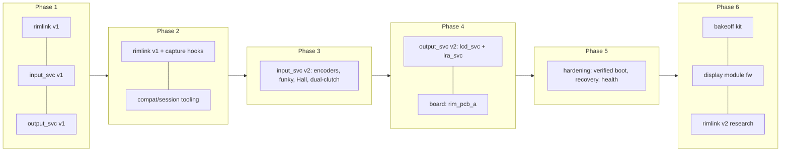
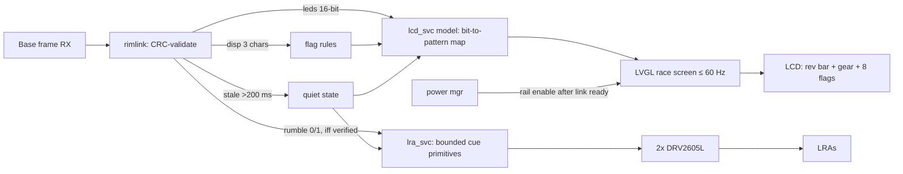
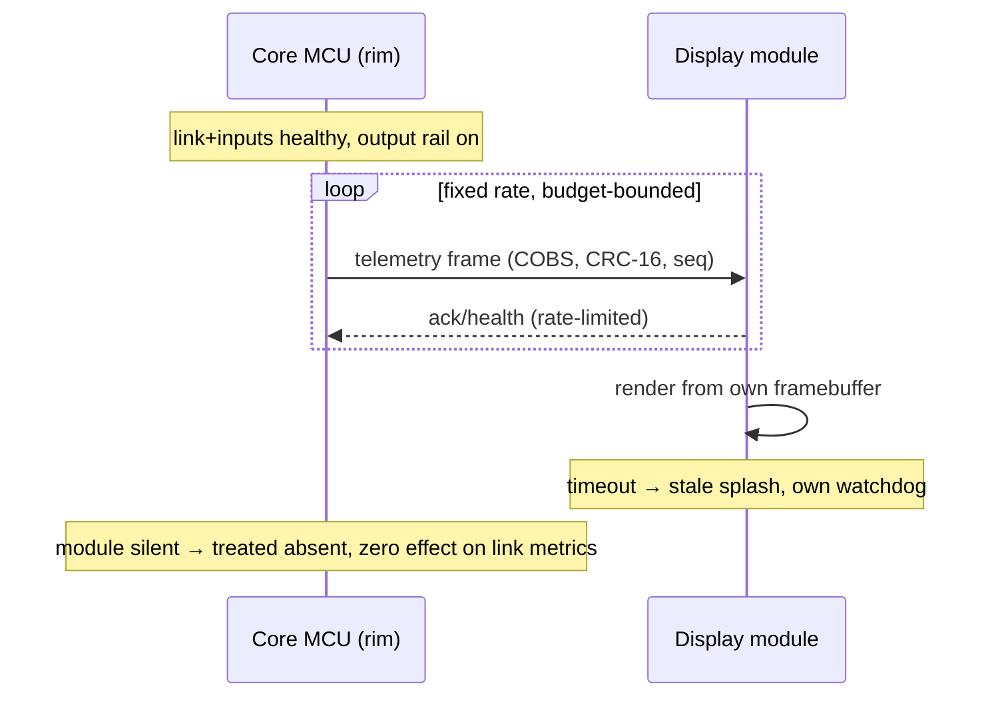

# Software Specification Updates — Phases 2–6 (Baseline: Phase 1 Software Specification v1.0)

| Document | Version | Date | Target Audience |
|---|---|---|---|
| Software Specification Updates — Phases 2–6 | 1.1 | 2026-07-04 | Embedded developer (mid-level), sim-racing domain fresher |

> **Informative:**
> This document extends the [Phase 1 Software Specification](./phase1-software-spec.md) v1.0
> through Phases 2–6 as **delta specifications** against the frozen baseline architecture:
> `rimlink` adapter v1 (legacy-spi), `input_svc`, `output_svc`, `diag_svc`, the simulator
> application, and the fast-path rules. Baseline elements not mentioned in a delta remain in
> force. Module version numbers increment only when their external interface changes; protocol
> constants remain confined to the adapter in every phase. Companion:
> [Hardware Specification Updates — Phases 2–6](./phases2-6-hardware-spec.md).

## Document Change Log

| Version | Date | Description |
|---|---|---|
| 1.0 | 2026-07-03 | Initial software delta specifications for Phases 2–6 on the Phase 1 v1.0 baseline. |
| 1.1 | 2026-07-04 | Review pass: simulator base-twin gains 12 MHz + flush emulation; Phase 4 output data-flow and 6-T2 module sequence figures added; LED default map, MCUboot mitigation, and module-link questions closed. |
| 1.2 | 2026-07-04 | 4-S1 output device changed from the addressable LED chain to a digital LCD panel: the same 15-segment rev bar + 8 flag indicators rendered through the Zephyr display API (`chosen zephyr,display`, RGB565 tile writes); protocol field names, the rendering rules, rate limit, and quiet state are unchanged. |
| 1.3 | 2026-07-04 | Service renamed `led_svc` -> `lcd_svc`; view layer moved to **LVGL 9** (Zephyr `lvgl` module): full race screen (title, 0..10 rev scale over the segment bar, gear-in-arc from the decoded display bytes, flag squares, quiet-state banner). Lap/tire panels are placeholders - the legacy frame carries no telemetry (question register). Note: the LVGL-enabled image (~420 KiB) still exceeds the expanded 384 KiB MCUboot slot; widget/font pruning or a further partition revision is required before signing that variant. |

---

## 1. Baseline and Evolution Model

This section defines how the firmware grows without eroding the Phase 1 guarantees. The invariants below are permanent; every phase's exit regression re-proves them.

**Permanent invariants (all phases):**

- No logging, allocation, flash writes, rendering, or blocking I/O in the rim-link fast path.
- The armed TX frame is immutable; updates only by pointer swap between transactions.
- Stale inputs (> 50 ms without snapshot) clear momentary controls in the next sealed frame.
- Only `rimlink` knows frame offsets; only `input_svc` knows electrical input details; only `output_svc` knows output hardware.
- Every phase ends with the full Phase 1 §11 regression plus its own additions, on both simulator and (from Phase 2) real base.

**Figure 1-1: Module Version Evolution**

---

## 2. Phase 2 Delta — Real-Base Instrumentation and Compatibility Tooling

No functional protocol change is permitted in this phase: the firmware that faces the CSL DD 8 Nm shall be the G1-passing build plus observation capability only. The deliverable is evidence, not features.

### 2.1 Additions

| ID | ADD | Specification |
|---|---|---|
| 2-S1 | **Capture hooks in `rimlink` (interface-neutral)** | Ring buffer (RAM, ≥ 256 transactions) of {timestamp, direction, 33 bytes, crc_ok, cs_gap}; armed/drained only from `diag_svc`; zero fast-path cost when disabled (compile-time + runtime gate). Shell: `rim cap start/stop/dump`. |
| 2-S2 | **Boot-deadline mode** | `CONFIG_RIM_FASTBOOT=y`: init ordered link-first (clock → SPI/DMA → identity seal → LINK_READY), all non-link init deferred behind readiness; boot-to-ready re-measured and compared to the base's measured first-poll deadline (margin ≥ 2× required). |
| 2-S3 | **Session log discipline** | `diag_svc` emits a session header (git hash, identity, config 2-M1a/b per hardware spec, base firmware string as logged manually) so every capture is attributable. |
| 2-S4 | **Host-side capture toolkit** | Scripts (host PC) to: decode LA exports of link traffic into the frame model; diff DUT ring-buffer dumps against LA truth; extract clock rate, cadence, CS-gap statistics; and produce the donor-wheel capture report (`disp`/`leds`/`rumble` field activity per roadmap §11.4). |
| 2-S5 | **Compatibility matrix format** | Machine-readable YAML row: {base_model, base_fw, qr_gen, rim_identity, result, capture_refs[], date}; rendered table checked into docs. |
| 2-S6 | **Simulator "base twin" profile** | Simulator gains a profile file loaded at boot: measured clock, cadence, CS gap, jitter distribution; becomes default regression profile from G2 onward. The profile schema shall support up to 12 MHz clock and the genuine-base flush behavior (roadmap §11.5) so measured values drop in without simulator code changes. |

### 2.2 Modifications

| ID | MOD | Change |
|---|---|---|
| 2-M1 | Identity handling | `rim id` shell command exercised against the real base for 0x01–0x04; per-identity behavior recorded into the matrix (feeds §11.4 identity decision) |
| 2-M2 | Error policy | Any base-session anomaly (unexplained CRC burst, unexpected frame length, brownout reset) freezes the capture ring for post-mortem instead of wrapping |

### 2.3 Phase 2 Exit (software contribution to G2)

Buttons from the DUT visible in a PC title through the Fanatec driver; boot margin documented; base parameters extracted and loaded into the simulator twin profile; matrix row 1 committed; zero firmware changes made in reaction to the base without a matching simulator reproduction first.

---

## 3. Phase 3 Delta — Input Service v2

This phase replaces `input_svc` v1's six-button scanner with the full GT acquisition engine while holding the published snapshot interface stable (the adapter is untouched except for now-populated axis/encoder fields).

### 3.1 `input_svc` v2 Interface (unchanged publish, extended payload)

| Element | Direction | Type | Description |
|---|---|---|---|
| `snapshot.buttons` | Out | bitset ≤ 32 | Logical buttons incl. funky presses, paddles |
| `snapshot.dpad` / `snapshot.funky[2]` | Out | enum | 4/7-way direction states with hysteresis |
| `snapshot.encoders[4]` | Out | int8 delta each | Accumulated detents since last snapshot; saturating |
| `snapshot.clutch[2]` | Out | uint8 | Calibrated 0–255 Hall positions |
| `snapshot.clutch_combined` | Out | uint8 | Dual-clutch output per selected mode |
| `snapshot.diag` | Out | flags | stuck, illegal-transition, ADC-range faults |

### 3.2 Additions

| ID | ADD | Specification |
|---|---|---|
| 3-S1 | **Encoder decoder** | Full quadrature transition table (no interrupt-per-edge counting into logic); illegal transitions counted per channel; accumulation into int8 delta consumed atomically at snapshot compose; zero-loss requirement at maximum hand rate |
| 3-S2 | **Funky/7-way decoder** | Direct-GPIO direction states + push; direction changes debounced independently of push; chord rules (opposite directions = fault, not input) |
| 3-S3 | **Hall clutch pipeline** | Per-channel: median-of-3 + IIR filter, min/max calibration with guard bands, deadzone, plausibility (rate-of-change limit, open/short detection via out-of-rail windows) |
| 3-S4 | **Dual-clutch logic** | Modes mirroring the public Fanatec paddle modes surfaced by the Linux driver (`Community implementation`, hid-fanatecff `ACP`): bite-point combined mode (default), two-axis mode, mappable mode; mode + bite point in settings; changeable via shell and via a defined button chord |
| 3-S5 | **Calibration & settings schema v2** | Zephyr settings namespaces `rim/cal/*`, `rim/map/*`, `rim/mode/*`; commits only from `diag_svc` context (never fast path); schema versioned with migration stub |
| 3-S6 | **Scan scheduler** | 1 kHz tick budget re-verified with full fabric: GPIO/shift-register read, ADC sequence (DMA), decode, compose ≤ 250 µs worst case on H723; budget measured, not assumed |
| 3-S7 | **Frame field enablement** | Adapter now populates axisX/axisY (mappable), encoder byte (one selected encoder or 0 per map), and full 22-bit button map from the Phase 1 §2.4 table via the configurable logical→bit map |

### 3.3 Phase 3 Exit (software contribution to G3)

P99 acquisition-to-snapshot ≤ 1 ms with full fabric (measured budget report); zero lost detents/edges in maximum-rate runs (firmware counters reconciled against LA captures); calibration persistence across power cycles; 4 h real-base stress with link error counters at G2 baseline.

---
## 4. Phase 4 Delta — Output Service v2, Board Port, and Isolation Proof

This phase adds the LED and haptic services and ports the firmware to PCB rev A. The defining software deliverable is the isolation proof: maximum output workload with zero effect on link/input metrics.

### 4.1 Additions

| ID | ADD | Specification |
|---|---|---|
| 4-S1 | **`lcd_svc`** | Consumes the validated 16-bit `leds` bitfield from `rimlink` RX callbacks; the pure model layer maps it to a 15-segment RPM rev bar via a configurable bit→pattern map (per roadmap §11.4: local rendering, no per-segment protocol addressing) plus 8 flag indicators derived from `disp`/`leds` rules. View layer: an **LVGL 9 race screen** on a digital LCD (`chosen zephyr,display` node) — title bar, 0..10 rev scale over the segment bar, the decoded display character as the gear inside an arc with an RPM caption, flag squares, and placeholder lap/tire panels (the legacy frame carries no telemetry). Frame-rate limited (default ≤ 60 Hz, change-driven); priority alerts preempt decoration; stale link (> 200 ms without valid RX) → quiet state with a visible banner. The LVGL timer pump and all rendering run in the workqueue; the panel's SPI/DMA priority is allocated so display traffic can never delay link DMA (DMA budget table). On boards without a panel the model runs to counters only. |
| 4-S2 | **`lra_svc`** | Two channels via DRV2605L-class drivers (I2C); short bounded cue primitives only (duration-capped, cooldown-enforced); source = `rumble[2]` field **iff** Phase 2/4 captures show the base populates it for the chosen identity (roadmap §11.4 condition), else service stays hardware-ready/disabled; no continuous effects (system-spec rule); stale/quiet behavior as 4-S1. |
| 4-S3 | **Output rail sequencing** | Power-manager module drives the load-switch GPIO: rail enabled only after LINK_READY and first valid transaction; disabled on brownout warning, stale link, or fault latch; sequencing events counted |
| 4-S4 | **Board port `rim_pcb_a`** | New Zephyr board/devicetree for PCB rev A; pin registry generated from the overlay; Phase 1 test-point contract (LINK_READY, SNAPSHOT_TICK) preserved; CI builds nucleo + pcb_a from one source tree |
| 4-S5 | **DMA/IRQ budget table** | Living document: every stream/channel/priority with owner and worst-case occupancy; reviewed at each addition; link DMA highest, ADC next, LED stream strictly lower |
| 4-S6 | **Watchdog** | Windowed watchdog fed from `input_thread` only; starvation of the input path resets; reset reason captured into `diag_svc` |

**Figure 4-1: Output Data Flow (base-fed, locally rendered)**

### 4.2 Isolation Proof (normative test)

24 h run against the real base: maximum-rate scripted inputs + max LED activity + LRA duty cycles. Pass: zero missed transactions, `rearm_miss`= 0, input P99 unchanged (± measurement noise) vs G3, no output-rail event during healthy link. Any failure is a scheduling/DMA defect to fix — Approach B (dual-core) may be considered only after a documented failure here (roadmap decision rule).

### 4.3 Phase 4 Exit (software contribution to G4)

Isolation proof passed on PCB rev A; `lcd_svc` mapping validated against captured base LED semantics; `lra_svc` decision recorded (enabled with evidence, or parked); settings/watchdog/power-manager regression green.

---

## 5. Phase 5 Delta — Product Hardening

This phase converts a validated prototype firmware into a serviceable product firmware. No new features; the deltas are integrity, recovery, and observability.

| ID | ADD/MOD | Specification |
|---|---|---|
| 5-S1 | **Verified boot** | MCUboot (or equivalent) with signed images; boot time re-verified against the Phase 2 deadline **including** bootloader; QR pins high-impedance guaranteed through bootloader and DFU paths (parent rule from wheel_rim §13.3) |
| 5-S2 | **Update & recovery** | Update via SWD service pads (normal path) with dual-slot fallback; interrupted-update test mandatory; no update path over the QR link in this generation |
| 5-S3 | **Health & lifetime counters** | Persisted counters: power cycles, QR mate events (detected via supply/reset signature), transaction totals, error totals, watchdog resets, thermal excursions if sensed; `rim health` shell dump feeds service documentation |
| 5-S4 | **Soak automation** | Scripted 24 h+ soak runner with pass/fail thresholds and automatic capture-freeze on anomaly; used for vibration/thermal/mate-cycle campaigns from the hardware delta |
| 5-S5 | **Config lock** | Production settings lock (calibration/map write-protect toggle) so field state is deliberate |
| 5-S6 | **Release definition** | A release = signed image + compatibility matrix snapshot + calibration procedure + known-issue list; tagged and reproducible from CI |

Phase 5 exit (software contribution to G5): full regression (G1–G4 suites) green on the final assembly across the environmental campaign; interrupted-update recovery proven; release 1.0 artifacts produced.

---

## 6. Phase 6 Delta — Optional Tracks

### 6.1 Track 6-T1: MCU Bakeoff Kit

The bakeoff is a software portability exercise with a hard rule: the test suite, not opinion, decides.

- The Phase 1 test applications (rim + simulator + fault matrix + timing measurements) shall build for `frdm_mcxn947` and `ek_ra6m5` from the same tree via board overlays only; any `#ifdef` outside board/HAL glue disqualifies the port.
- Measured comparison set: boot-to-ready, re-arm latency vs CS gap, sustained zero-error sweep corners, worst-case IRQ latency under LED-stream load, power draw.
- Output: scored table appended to the roadmap; production MCU decision recorded with capture references.

### 6.2 Track 6-T2: Display Module Firmware

Applies only if all six promotion gates pass (roadmap). The module is a separate firmware product:

| Element | Specification |
|---|---|
| Core→module link | Bounded, versioned, one-way-dominant protocol: fixed-rate telemetry frames (≤ agreed budget), CRC, sequence numbers; module never blocks the core; core treats module as absent on any timeout |
| Module firmware | Own RTOS instance, own watchdog; render pipeline (DMA2D/GPU as available) fully decoupled from link RX; stale-data splash on timeout |
| Failure independence | Module reset/removal shall produce zero change in core link/input metrics — proven by repeating the Phase 4 isolation test with module fault injection |
| Update | Module updated independently via its own service port |

**Figure 6-1: Core ↔ Display Module Interaction**

### 6.3 Track 6-T3: rimlink v2 Research (new-generation bases)

Research-only rules, inherited from the program kill criteria:

- All work is passive: decode captures from the funded ClubSport DD/current-gen donor tap; no transmission experiments against unverified protocols, no replay, no authentication analysis beyond noting that a boundary exists.
- Findings accumulate in a `rimlink v2` design note behind the existing versioned adapter interface; implementation is a future program decision, not a Phase 6 deliverable.

---

## 7. Cross-Phase Test and CI Matrix

| Suite | Introduced | Runs in |
|---|---|---|
| Host ztest (CRC, frames, maps, decoders, calibration logic) | P1 | Every CI build |
| Simulator sweep + fault matrix | P1 | Every merge; base-twin profile from P2 onward |
| Base session regression (G2 script) | P2 | Each phase exit; each firmware change that touches adapter/scheduling |
| Full-fabric latency report | P3 | P3 exit; re-run at P4/P5 exits |
| Isolation proof (24 h) | P4 | P4 exit; P5 final assembly; 6-T2 fault-injection variant |
| Soak/environmental automation | P5 | P5 campaign; release candidates |
| Bakeoff comparison set | P6 | On demand per candidate |

## 8. References

- [Phase 1 Software Specification](./phase1-software-spec.md) — baseline architecture and protocol record
- [Program roadmap and system specification](./fanatec-wheel-roadmap-and-system-spec.md) — gates, §11.4 output-capability findings, kill criteria
- [Hardware Specification Updates — Phases 2–6](./phases2-6-hardware-spec.md)
- [gotzl/hid-fanatecff](https://github.com/gotzl/hid-fanatecff) — `Community implementation`; ACP paddle modes (3-S4), host-side LED/display surface (4-S1 semantics)
- Steering rim architecture study (research base: wheel_rim.md) — parent non-negotiable rules (§13.3)

## 9. Question Register

| # | Question | Status (2026-07-04) | Resolution |
|---|---|---|---|
| 1 | Base LED-bitfield semantics per identity | **Default defined / captures pending** | Community evidence shows 9 rev-LED positions in use on CSW rims (a 9-position CSW→CSL conversion table exists — `Community implementation`). Default 4-S1 map: bits 0–8 → 9 logical positions interpolated across the 15 RGB LEDs; remaining bits logged. Phase 2/4 captures confirm or amend |
| 2 | `rumble[2]` transport on CSL DD 8 Nm | **Measurement pending** | Genuinely empirical; decides 4-S2 enablement (unchanged) |
| 3 | MCUboot boot-time vs base deadline | **Mitigation defined / measurement pending** | Measure first; if the signed-boot path breaks the 2× margin, adopt in order: minimal-verify profile, then direct-XIP with signature check deferred to background — never an unsigned image. Decision recorded at 5-S1 |
| 4 | Core→module link physical layer | **Resolved (baseline decision)** | UART 1 Mbaud, COBS + CRC-16 + sequence numbers, telemetry one-way-dominant (matches hardware spec §9 Q4); EMC re-verification at track start |
