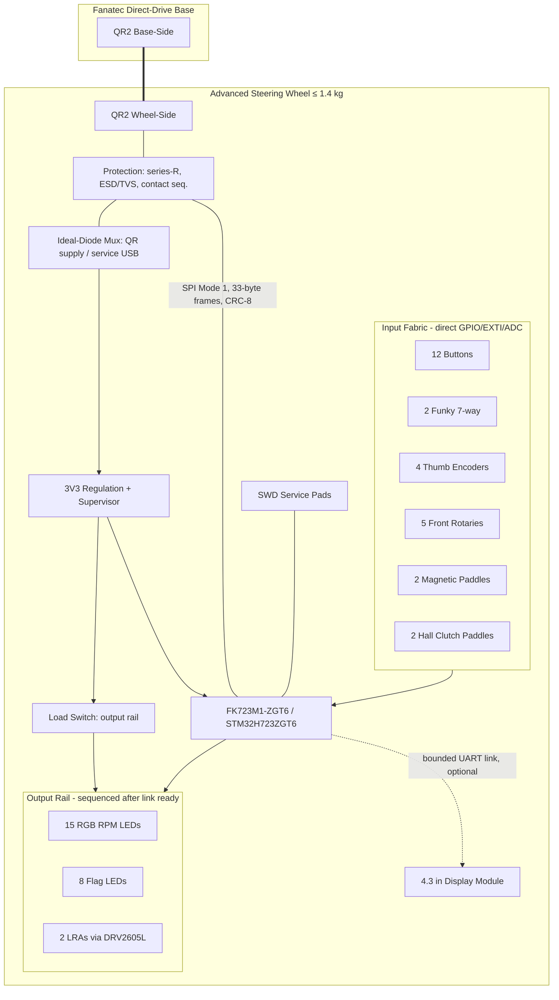

# Hardware Specification — Advanced Fanatec-Compatible Steering Wheel

| Document | Version | Date | Target Audience |
|---|---|---|---|
| Hardware Specification | 1.0 | 2026-07-04 | Embedded developer (mid-level), sim-racing domain fresher |

> **Informative:**
> This document consolidates the hardware design for the Advanced Fanatec-Compatible Steering Wheel, targeting the **FK723M1-ZGT6** development board (STM32H723ZGT6) as the core controller. It defines the final system architecture, electrical parameters, power distribution, and the mechanical integration required for the 300 mm GT wheel.

## 1. System Architecture

The steering wheel operates as an SPI peripheral communicating directly with the Fanatec wheel base via the QR2 interface. It acquires inputs from a comprehensive GT control set and renders local outputs (LEDs, haptics) without masking the base's force feedback.

### 1.1 Complete Wheel Block Diagram

## 2. Electrical and Power Definition

The FK723M1-ZGT6 MCU operates at 3.3 V natively. Level shifters are **not** required for the QR link, but rigorous protection is mandatory.

### 2.1 Power Tree and Sequencing
- **Dual Source**: The system can be powered by either the Fanatec base (QR supply) or a service USB connection. These 5 V rails are **never joined**; an ideal-diode power mux isolates them to prevent backfeed.
- **Output Rail**: High-draw outputs (LEDs, LRAs) sit behind a dedicated 3.3 V load switch. This switch is sequenced on *only* after the link and input fabric are fully ready, and disables immediately on brownout or stale-link detection.
- **Ground Segregation**: The analog return path (Hall clutches, ADCs) and the rim link return are physically segregated from the high-noise return path of the LEDs and haptic drivers.

### 2.2 Link Electrical Characteristics
- **Signaling**: 3.3 V CMOS.
- **Role**: Wheel is SPI peripheral (slave), Base is SPI controller (master).
- **Mode**: SPI Mode 1 (CPOL = 0, CPHA = 1), MSB first. Mode 0 tolerance is required.
- **SCK Frequency**: Rated up to 12 MHz.
- **CS Polarity**: Active low. A rising edge signals the end of the transaction.
- **Protection**: Every link signal passes through a 100 Ω series resistor and low-capacitance (≤ 5 pF) ESD/TVS arrays near the QR connector.
- **Tri-State Guarantee**: The MISO pin must remain high-impedance when the MCU is unpowered, in reset, or when CS is deasserted.

## 3. Input HMI Specification

The input fabric relies primarily on direct GPIO with internal pull-ups, minimizing latency.
- **Buttons and Switches**: 12 primary momentary buttons, 2 seven-way funky switches, 5 front rotary switches (distinct detents). No external debounce capacitors; debounce is in firmware.
- **Encoders**: 4 detented thumb encoders wired to EXTI-capable GPIOs. RC filtering (100 Ω / 1 nF) is permitted.
- **Paddles**: 2 magnetic shift paddles (Hall switch or microswitch hybrid).
- **Analog Clutches**: 2 ratiometric Hall-effect sensors (e.g., A1324) fed to distinct ADC channels with dedicated RC filters.

## 4. Output HMI Specification

Outputs are bounded and locally rendered to avoid delaying the fast-path SPI link.
- **LEDs**: 15 RGB RPM LEDs and 8 flag LEDs. These are addressable (SK6812-class) driven by a DMA-fed timer/SPI stream to avoid CPU blocking.
- **Haptics**: Two independent LRAs driven by DRV2605L-class I2C haptic drivers for short, directional cues.
- **Power Constraints**: A global brightness cap and strict duty-cycle limits are enforced to guarantee the output power draw remains at least 30% below the measured QR current limit.

## 5. Mechanical Integration

The components will be integrated into a complete 300 mm GT wheel assembly.
- **Core Structure**: CNC-machined 6061 aluminum or carbon fiber center plate and housings.
- **Weight and Balance**: The fully assembled wheel, including the QR2 Wheel-Side, must not exceed **1.4 kg**. Mass must be concentrated near the axis of rotation.
- **QR2 Integration**: The wheel uses the standard Fanatec QR2 Wheel-Side mechanical coupling.
- **Harnessing**: Internal wiring uses JST-GH looms and silicone-insulated wire with grommets at all pass-throughs. The LED/Haptic harnesses are routed away from the link and analog signal harnesses.

## 6. Prototyping on the FK723M1-ZGT6

The FK723M1-ZGT6 is the target board. During prototyping and before custom PCB manufacturing:
- Do not use on-board features that conflict with necessary pins (e.g., the external Winbond OSPI flash pins on `PF6`-`PF10` and `PG6`).
- Refer to `pin_mapping.md` for the explicit pin assignments designed to avoid conflicts with the FK723M1-ZGT6's fixed peripherals.
