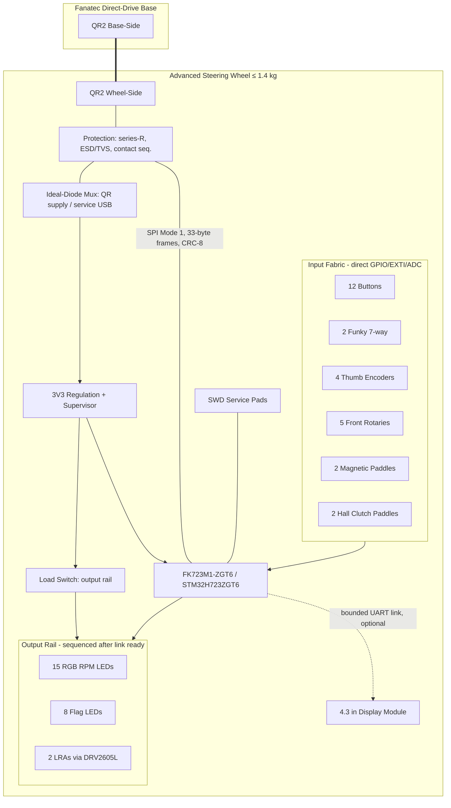

# Hardware Specification — Advanced Fanatec-Compatible Steering Wheel

| Document | Version | Date | Target Audience |
|---|---|---|---|
| Hardware Specification | 1.1 | 2026-07-04 | Embedded developer (mid-level), sim-racing domain fresher |

## Document Change Log

| Version | Date | Changes |
|---|---|---|
| 1.1 | 2026-07-04 | Corrected against the released source: added the bench implementation-status table (section 8); corrected the pin-mapping CSV reference (Status column, I2C1 moved to PB8/PB9, clutch ADC on PA0/PA1, D-pad ladder on PA3); flagged the BTN1/PF10 QSPI-CLK sharing caveat; documented the DRV2605L shared-address bus constraint; noted the windowed-watchdog deviation (IWDG on the bench MCU). |
| 1.0 | 2026-07-04 | Initial consolidated specification. |

> **Informative:**
> This document consolidates the hardware design for the Advanced Fanatec-Compatible Steering Wheel, targeting the **FK723M1-ZGT6** development board (STM32H723ZGT6) as the core controller. It defines the final system architecture, electrical parameters, power distribution, and the mechanical integration required for the 300 mm GT wheel.

## 1. System Architecture

The steering wheel operates as an SPI peripheral communicating directly with the Fanatec wheel base via the QR2 interface. It acquires inputs from a comprehensive GT control set and renders local outputs (LEDs, haptics) without masking the base's force feedback.

### 1.1 Complete Wheel Block Diagram

## 2. Electrical and Power Definition

The FK723M1-ZGT6 MCU operates at 3.3 V natively. Level shifters are **not** required for the QR link, but rigorous protection is mandatory.

### 2.1 Power Tree and Sequencing
- **Dual Source**: The system can be powered by either the Fanatec base (QR supply) or a service USB connection. These 5 V rails are **never joined**; an ideal-diode power mux isolates them to prevent backfeed.
- **Output Rail**: High-draw outputs (LEDs, LRAs) sit behind a dedicated 3.3 V load switch. This switch is sequenced on *only* after the link and input fabric are fully ready, and disables immediately on brownout or stale-link detection.
- **Ground Segregation**: The analog return path (Hall clutches, ADCs) and the rim link return are physically segregated from the high-noise return path of the LEDs and haptic drivers.

### 2.2 Link Electrical Characteristics
- **Signaling**: 3.3 V CMOS.
- **Role**: Wheel is SPI peripheral (slave), Base is SPI controller (master).
- **Mode**: SPI Mode 1 (CPOL = 0, CPHA = 1), MSB first. Mode 0 tolerance is required.
- **SCK Frequency**: Rated up to 12 MHz.
- **CS Polarity**: Active low. A rising edge signals the end of the transaction.
- **Protection**: Every link signal passes through a 100 Ω series resistor and low-capacitance (≤ 5 pF) ESD/TVS arrays near the QR connector.
- **Tri-State Guarantee**: The MISO pin must remain high-impedance when the MCU is unpowered, in reset, or when CS is deasserted.

## 3. Input HMI Specification

The input fabric relies primarily on direct GPIO with internal pull-ups, minimizing latency.
- **Buttons and Switches**: 12 primary momentary buttons, 2 seven-way funky switches, 5 front rotary switches (distinct detents). No external debounce capacitors; debounce is in firmware.
- **Encoders**: 4 detented thumb encoders wired to EXTI-capable GPIOs. RC filtering (100 Ω / 1 nF) is permitted.
- **Paddles**: 2 magnetic shift paddles (Hall switch or microswitch hybrid).
- **Analog Clutches**: 2 ratiometric Hall-effect sensors (e.g., A1324) fed to distinct ADC channels with dedicated RC filters.

## 4. Output HMI Specification

Outputs are bounded and locally rendered to avoid delaying the fast-path SPI link.
- **LEDs**: 15 RGB RPM LEDs and 8 flag LEDs. These are addressable (SK6812-class) driven by a DMA-fed timer/SPI stream to avoid CPU blocking.
- **Haptics**: Two independent LRAs driven by DRV2605L-class I2C haptic drivers for short, directional cues. Both DRV2605L devices answer the same fixed I2C address (0x5A); the design therefore shares one I2C bus and uses the per-driver EN lines (`LRA_EN_L`/`LRA_EN_R`) to select the active device, or substitutes an address-selectable equivalent on PCB rev A.
- **Power Constraints**: A global brightness cap and strict duty-cycle limits are enforced to guarantee the output power draw remains at least 30% below the measured QR current limit.

## 5. Mechanical Integration

The components will be integrated into a complete 300 mm GT wheel assembly.
- **Core Structure**: CNC-machined 6061 aluminum or carbon fiber center plate and housings.
- **Weight and Balance**: The fully assembled wheel, including the QR2 Wheel-Side, must not exceed **1.4 kg**. Mass must be concentrated near the axis of rotation.
- **QR2 Integration**: The wheel uses the standard Fanatec QR2 Wheel-Side mechanical coupling.
- **Harnessing**: Internal wiring uses JST-GH looms and silicone-insulated wire with grommets at all pass-throughs. The LED/Haptic harnesses are routed away from the link and analog signal harnesses.

## 6. Prototyping on the FK723M1-ZGT6

The FK723M1-ZGT6 is the target board. During prototyping and before custom PCB manufacturing:
- Do not use on-board features that conflict with necessary pins (e.g., the external Winbond QSPI flash pins on `PF6`-`PF10` and `PG6`).
  - **Known bench caveat**: the released overlay places `BTN1` on `PF10`, which shares the QSPI CLK net with the on-board NOR. The NOR's chip select idles high (pull-up), so button edges on its clock input are ignored — benign on the bench, but `BTN1` **shall** be relocated on PCB rev A. Firmware never accesses the QSPI NOR (the settings `storage` partition lives on internal flash; the board's QSPI `storage_partition` node is deleted by the overlay).
- Refer to [`steering_wheel_pin_mapping.csv`](./steering_wheel_pin_mapping.csv) for the explicit pin assignments. The CSV carries a `Status` column: **Implemented** rows match `app/boards/fk723m1_zgt6.overlay` exactly (verifiable with `python3 scripts/pin_registry.py app/boards/fk723m1_zgt6.overlay`); **Planned** rows are PCB rev A targets pending schematic verification; **Reserved** rows are board-fixed peripherals.

## 7. Bill of Materials (BOM) & Component Preparation

To manufacture the prototype and final assembly, the following hardware components, sub-boards, and materials must be prepared:

### 7.1 Core & Sub-boards
- **Main Controller**: 1x **FK723M1-ZGT6** (STM32H723ZGT6) development board.
- **Main Carrier / Interconnect PCB**: Custom baseboard to dock the FK723M1-ZGT6, containing the power mux, load switches, ESD protection, and connector headers.
- **Input Sub-boards**: Custom PCBs for the side grips and center plate to mount the buttons, rotaries, and funky switches securely.
- **LED Sub-board**: Custom PCB (or integrated into the main carrier) for the 15 RGB RPM LEDs and 8 Flag LEDs.

### 7.2 Input Components
- **Push Buttons**: 12x high-quality momentary tactile switches (e.g., APEM, Knitter-switch, or standard 12 mm tactile switches for prototyping).
- **Funky Switches**: 2x 7-way multi-directional switches (e.g., Alps Alpine RKJXT1E12001).
- **Front Rotaries**: 5x rotary switches or detented encoders configured for distinct detents.
- **Thumb Encoders**: 4x detented rotary encoders (e.g., Alps Alpine EC11 or ELMA series).
- **Shifters**: 2x Magnetic paddle shifter assemblies containing microswitches or Hall-effect sensors.
- **Analog Clutches**: 2x Hall-effect ratiometric sensors (e.g., Allegro A1324/A1302) with corresponding neodymium magnets and mechanical paddle assemblies.

### 7.3 Output Components
- **Addressable LEDs**: 23x SK6812 or WS2812B RGB LEDs (15 for RPM, 8 for Flags).
- **Haptic Drivers**: 2x DRV2605L I2C haptic driver ICs or breakout boards.
- **Haptic Actuators**: 2x LRAs (Linear Resonant Actuators) suitable for mounting in the wheel grips.
- **Display (Optional)**: 1x 4.3" bounded UART display module.

### 7.4 Power & Protection Circuitry
- **Power Mux**: 1x Ideal-Diode Mux IC (e.g., TPS2113A) to safely isolate the QR 5V supply and Service USB 5V.
- **Load Switch**: 1x 3.3 V load switch (e.g., TPS22918) for the LED and LRA output rails.
- **ESD Protection**: Low-capacitance (≤ 5 pF) TVS diode arrays (e.g., TPD4E05U06) for SPI link lines.
- **Passives**: 
  - 100 Ω series resistors for SPI lines.
  - RC filter components (100 Ω resistors and 1 nF capacitors) for encoders and analog lines.

### 7.5 Mechanical & Wiring
- **Base Structure**: CNC-machined 6061 aluminum or carbon fiber center plate and front/rear housings.
- **Quick Release**: 1x Fanatec QR2 Wheel-Side.
- **Harnessing**: JST-GH connectors (receptacles on PCB, pre-crimped wires) and flexible silicone-insulated wiring.
- **Hardware**: Assorted metric screws (M3/M4), standoffs, and grommets for secure wire routing.

## 8. Implementation Status on the FK723M1-ZGT6 Bench

The released firmware (Phases 1–5) exercises this hardware specification as far as the development board allows. Devicetree guards let the same application binary configuration run on the bench and, later, on PCB rev A without code changes.

| Subsystem (this spec) | Bench status | Notes |
|---|---|---|
| QR2 SPI link (section 2.2) | Implemented | SPI1 slave Mode 1, CS sense on PG14, LINK_READY test point PF3; protection network is a PCB rev A item |
| Power mux / load switch (2.1) | Stub | `power_mgr` state machine + counters run; `out_rail` GPIO node absent on bench |
| 6 buttons + D-pad ladder | Implemented | remaining 6 buttons, rotaries, shift paddles: Planned (CSV) |
| 2 funky switches (3) | 1 implemented | funky 2 and the encoder rings: Planned |
| 4 thumb encoders (3) | Implemented | PD0/1, PD3/4, PD5/6, PD7+PE0 |
| 2 Hall clutches (3) | Implemented | PA0/PA1 = ADC1 INP16/17; full pipeline + dual-clutch modes |
| 15 RGB + 8 flag LEDs (4) | Renderer implemented | physical chain behind the `led-strip` alias: PCB rev A |
| 2 LRAs via DRV2605L (4) | Gate logic implemented | driver behind `lra0` node: PCB rev A; rumble source disabled by default |
| Watchdog | Implemented (deviation) | IWDG, window lower bound 0; true windowed part: PCB rev A selection |
| Display module (1.1, optional) | Not started | Phase 6 track |
| Mechanical (5) / BOM (7) | Procurement guidance | unchanged |
