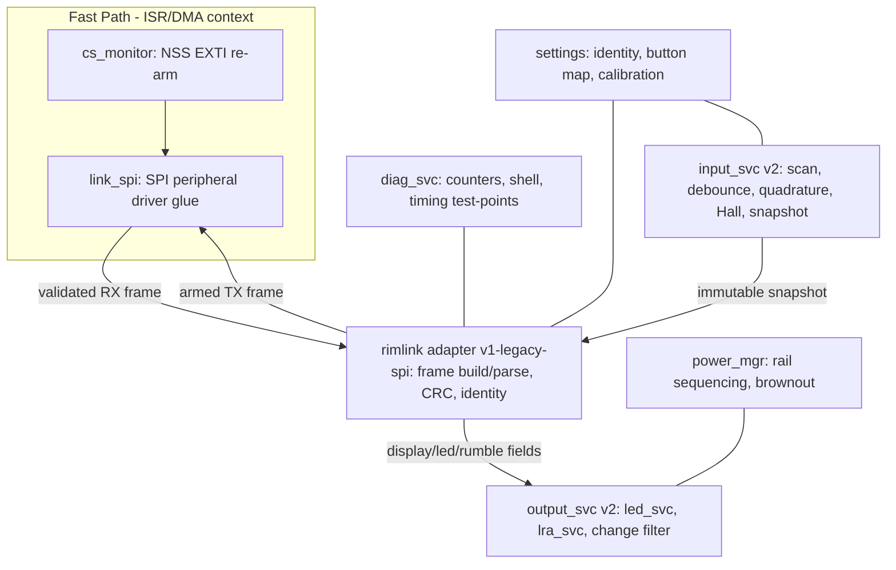

# Software Specification — Advanced Fanatec-Compatible Steering Wheel

| Document | Version | Date | Target Audience |
|---|---|---|---|
| Software Specification | 1.0 | 2026-07-04 | Embedded developer (mid-level), sim-racing domain fresher |

> **Informative:**
> This document consolidates the firmware architecture and protocol specifications for the Advanced Fanatec-Compatible Steering Wheel, targeting Zephyr 4.4.0 on the **FK723M1-ZGT6** (STM32H723ZGT6) controller. It integrates the input acquisition, link communication, output rendering, and system hardening layers.

## 1. System Requirements and Architecture

The firmware must operate the wheel as an SPI peripheral, honoring the Fanatec protocol's strict 33-byte frame constraints. It must guarantee sub-millisecond input snapshot latency and zero missed transactions.

### 1.1 Invariants and Constraints
- **Fast Path Rules**: No logging, dynamic allocation, flash/settings writes, or blocking calls shall occur in the fast-path SPI DMA/ISR context.
- **Buffer Immutability**: The armed SPI TX buffer must remain immutable during a transaction. Updates happen only by atomic pointer swapping between CS assertions.
- **Stale Input Clearing**: If a link transaction does not occur for > 50 ms, momentary inputs must be cleared in the next sealed frame.

### 1.2 Firmware Module Decomposition

## 2. Protocol Details (Rim-Link v1)

The rim communicates with the base via legacy SPI-peripheral frames. Both directions exchange 33 bytes sealed with CRC-8.

### 2.1 MISO Frame (Rim to Base)

| Offset | Size | Content |
|---|---|---|
| 0 | 1 | Header constant: `0xA5` |
| 1 | 1 | Rim Identity (e.g., `0x03` Porsche 918 RSR, `0x02` ClubSport Formula) |
| 2–4 | 3 | `buttons[3]`: 22-bit mapped logical inputs (A/B/C bytes) |
| 5–6 | 2 | `axisX`, `axisY`: Re-mappable analog fields |
| 7 | 1 | `encoder`: int8 delta accumulation |
| 8–9 | 2 | `btnHub[2]` |
| 10–11 | 2 | `btnPS[2]` |
| 12–30 | 19 | Reserved / Padding |
| 31 | 1 | `fwvers` |
| 32 | 1 | `crc`: CRC-8 over bytes 0–31 |

### 2.2 MOSI Frame (Base to Rim)

| Offset | Size | Content |
|---|---|---|
| 0 | 1 | Header |
| 1 | 1 | Rim ID |
| 2–4 | 3 | `disp[3]`: Three 7-segment chars (bit 7 = dot) |
| 5–6 | 2 | `leds`: 16-bit LED bitfield |
| 7–8 | 2 | `rumble[2]`: Left/right haptic commands |
| 9–31 | 23 | Padding |
| 32 | 1 | `crc`: CRC-8 verification |

**CRC-8 Definition**: Reflected polynomial `0x31` (table form `0x8C`), init `0xFF`, no final XOR.

## 3. Module Specifications

### 3.1 Input Service (`input_svc v2`)
- **Scan Scheduler**: Runs at a 1 kHz `k_timer` tick. Budget ≤ 250 µs worst case.
- **Quadrature Encoders**: Decoded via transition table to guarantee zero lost detents at maximum rotation speeds.
- **Hall Clutches**: Processed with median-of-3 plus IIR filtering. Supports modes: bite-point combined (default), two-axis, and mappable.
- **Snapshot Publish**: Composes a `struct rim_inputs`, timestamps it, and publishes to the adapter. 

### 3.2 Output Service (`output_svc v2`)
- **LED Service (`led_svc`)**: Decodes the 16-bit `leds` bitfield into a 15-RGB RPM pattern, and derives 8 flag LEDs. Feeds an addressable LED chain via DMA-driven SPI/Timer.
- **Haptic Service (`lra_svc`)**: Translates `rumble[2]` into short, directional haptic cues using DRV2605L primitives.
- **Quiet State**: All outputs are zeroed or disabled if valid SPI frames stop arriving for > 200 ms.

### 3.3 Power Manager
- Ensures the 3.3 V output load switch remains OFF until the MCU boots, connects via SPI, and receives the first valid transaction.

## 4. System Hardening

### 4.1 Verified Boot and Recovery
- **MCUboot**: Integrated to provide signed image verification.
- The boot process is instrumented (`CONFIG_RIM_FASTBOOT=y`) to sequence clocks, SPI/DMA, and the link identity before any other initialization, ensuring the rim meets the base's first-poll deadline.
- Updates happen via SWD (or an off-link DFU mechanism) with a dual-slot fallback.

### 4.2 Watchdog and Diagnostics
- **Windowed Watchdog**: Fed strictly by the `input_thread`. Starvation of the input path resets the MCU.
- **Diagnostics**: `diag_svc` maintains counters for power cycles, CRC errors, transaction totals, and re-arm misses. Accessible via the Zephyr shell (`rim health`).
