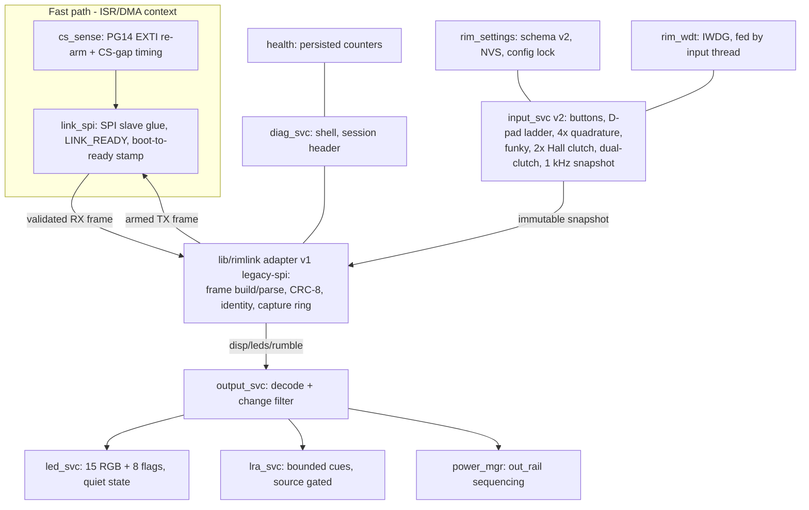

# Software Specification — Advanced Fanatec-Compatible Steering Wheel

| Document | Version | Date | Target Audience |
|---|---|---|---|
| Software Specification | 1.1 | 2026-07-04 | Embedded developer (mid-level), sim-racing domain fresher |

## Document Change Log

| Version | Date | Changes |
|---|---|---|
| 1.1 | 2026-07-04 | Corrected against the released source (Phases 1–5): watchdog described as IWDG with the windowed-mode deviation; LRA rumble source documented as disabled by default; LED backend documented as devicetree-guarded; added the implemented settings schema, capture/session instrumentation, verified-boot parameters, health counters, and shell surface; split diag vs health counters; noted bench vs PCB-rev-A feature availability. |
| 1.0 | 2026-07-04 | Initial consolidated specification. |

> **Informative:**
> This document consolidates the firmware architecture and protocol specifications for the Advanced Fanatec-Compatible Steering Wheel, targeting **Zephyr 4.4.0** on the **FK723M1-ZGT6** (STM32H723ZGT6) controller. It is the reader-friendly summary; the normative phase specifications are [`../plans/phase1-software-spec.md`](../plans/phase1-software-spec.md) and [`../plans/phases2-6-software-spec.md`](../plans/phases2-6-software-spec.md). Where this summary and a phase spec disagree, the phase spec wins.

## 1. System Requirements and Architecture

The firmware operates the wheel as an SPI peripheral, honoring the legacy protocol's strict 33-byte frame constraints. It guarantees sub-millisecond input snapshot latency and zero missed transactions.

### 1.1 Invariants and Constraints (implemented and review-gated)

- **Fast Path Rules**: No logging, dynamic allocation, flash/settings writes, or blocking calls occur in the fast-path SPI/ISR context. The Phase 2 capture hook is the sole addition: two relaxed atomics plus a bounded 33-byte copy, active only while the diagnostic ring is armed.
- **Buffer Immutability**: The armed SPI TX buffer remains immutable during a transaction. Updates happen only by double-buffer swap between CS assertions (`rimlink_link.c`).
- **Stale Input Clearing**: If no link transaction occurs for > 50 ms, momentary inputs are cleared in the next sealed frame (`stale_clear` counter in `rim stats`).
- **Offset Confinement**: Protocol byte offsets exist only inside `lib/rimlink` (and, mirrored by design, in the host toolkit `scripts/capture/frame_model.py`). No service module indexes frame bytes.

### 1.2 Firmware Module Decomposition (as built)

## 2. Protocol Details (Rim-Link v1)

The rim communicates with the base via legacy SPI-peripheral frames. Both directions exchange 33 bytes sealed with CRC-8.

### 2.1 MISO Frame (Rim to Base)

| Offset | Size | Content |
|---|---|---|
| 0 | 1 | Header constant: `0xA5` |
| 1 | 1 | Rim identity 1–4 (`CONFIG_RIM_IDENTITY`, default `0x03` Porsche 918 RSR; `0x02` ClubSport Formula) |
| 2–4 | 3 | `buttons[3]`: 22-bit mapped logical inputs (bytes A/B/C) |
| 5–6 | 2 | `axisX`, `axisY`: re-mappable analog fields (`rim/map/axis`) |
| 7 | 1 | `encoder`: int8 saturating detent delta of the selected encoder (`rim/map/encoder`) |
| 8–9 | 2 | `btnHub[2]` (zero in this release, reference behavior) |
| 10–11 | 2 | `btnPS[2]` (zero in this release) |
| 12–30 | 19 | Reserved / padding (zero) |
| 31 | 1 | `fwvers` (zero in this release) |
| 32 | 1 | `crc`: CRC-8 over bytes 0–31 |

### 2.2 MOSI Frame (Base to Rim)

| Offset | Size | Content |
|---|---|---|
| 0 | 1 | Header |
| 1 | 1 | Rim ID |
| 2–4 | 3 | `disp[3]`: three 7-segment characters (bit 7 = dot) |
| 5–6 | 2 | `leds`: 16-bit LED bitfield |
| 7–8 | 2 | `rumble[2]`: left/right haptic commands |
| 9–31 | 23 | Padding |
| 32 | 1 | `crc`: CRC-8 verification |

**CRC-8 definition**: reflected polynomial `0x31` (table form `0x8C`), init `0xFF`, no final XOR. Reference vector: `A5 03` + 30 zero bytes → `0x5A`.

## 3. Module Specifications

### 3.1 Input Service (`input_svc` v2)

- **Scan scheduler**: 1 kHz `k_timer` tick into a cooperative-priority thread. Budget ≤ 250 µs worst case, *measured* by the latency ring and reported (P99/max) via `rim stats`; the full-fabric report on real hardware is measurement-pending.
- **Quadrature encoders (×4)**: transition-table decode (16-entry, CW = Gray `00→01→11→10` counts positive); illegal double transitions are counted per channel, never counted as movement; detents accumulate into a saturating `int8` consumed atomically at snapshot compose.
- **Funky switch**: four direction contacts + push, independently debounced (2 samples); an opposite-direction chord raises a diagnostic fault and produces no input.
- **Hall clutches (×2)**: median-of-3 → IIR (shift 2) → min/max calibration with guard bands → deadzone → rate-of-change plausibility (flag + slew limit). Out-of-rail windows raise open-circuit / short-to-rail diagnostic flags.
- **Dual-clutch logic**: modes bite-point combined (default), two-axis, and mappable; mode + bite point persist in settings and can be cycled by the both-paddles + MENU chord or `rim clutch`.
- **Snapshot publish**: composes `struct rim_inputs` (buttons, axes, encoder byte, timestamp) and publishes to the adapter; change-driven with a 20 ms keep-alive republish.

### 3.2 Output Path (`output_svc` → `led_svc` / `lra_svc`)

- **LED service**: decodes the 16-bit `leds` field — bits 0–8 are nine logical rev positions interpolated across the 15-RGB strip with a green→red ramp; bits 9–15 drive flag LEDs 0–6; flag LED 7 is reserved pending real-base capture evidence. Rendering is change-driven at ≤ 60 Hz. The physical backend is the Zephyr `led_strip` API behind the `led-strip` devicetree alias: on the bench board the alias is absent and the renderer runs to counters only (PCB rev A provides the DMA-fed chain).
- **Haptic service**: two channels driven exclusively through bounded cue primitives — duration capped at 100 ms with a 50 ms per-channel cooldown, never raw pass-through. The `rumble[2]` frame source is **disabled by default** and stays disabled until real-base captures show the base populating those bytes for this identity (`scripts/capture/field_activity.py`). The DRV2605L backend is devicetree-guarded (`lra0` node, absent on the bench).
- **Quiet state**: all outputs are zeroed if valid frames stop arriving for > 200 ms; every valid frame re-arms the timer.

### 3.3 Power Manager

- The 3.3 V output load switch (`out_rail` node — PCB rev A, guarded stub on the bench) stays OFF until LINK_READY plus the first CRC-valid transaction; it disables on a 200 ms stale link or a latched fault. On/off/stale transitions are counted.

## 4. Configuration and Persistence

- **Settings schema v2** (`rim_settings.c`, NVS on the internal-flash `storage` partition, 2 × 128 KiB sectors): `rim/cal` (clutch calibration, D-pad thresholds/hysteresis), `rim/map` (button map, encoder select, axis map), `rim/mode` (clutch mode, bite point), `rim/lock`. The schema is versioned with a migration stub; commits happen only from the diag/shell context (`rim save cal|map|mode`).
- **Config lock**: `rim lock on|off|status`; while locked, cal/map/mode commits are rejected with `-EACCES`.

## 5. Instrumentation and Evidence (Phase 2)

- **Capture ring**: 256-transaction RAM ring `{timestamp, direction, 33 bytes, crc_ok, cs_gap}` behind `CONFIG_RIMLINK_CAPTURE` plus a runtime gate; freezes automatically on a CRC error or short frame for post-mortem. Shell: `rim cap start|stop|freeze|dump|status|auto`.
- **Session header**: every boot logs `{fw version, git hash, identity, config flags, base-fw string}`; `rim session base <str>` records the base firmware under test.
- **Boot-deadline mode**: `CONFIG_RIM_FASTBOOT` defers all non-link services behind link readiness; `rim boot` reports boot-to-ready in µs (margin vs the measured base first-poll deadline is measurement-pending).
- **Host toolkit**: `scripts/capture/` — LA decode, DUT-ring vs LA diff, clock/cadence/CS-gap statistics, and the donor-wheel field-activity report; `scripts/soak/soak_runner.py` runs thresholded dual-console soaks with capture-freeze on anomaly.
- **Simulator twin**: the base simulator loads a profile (`app/sim/profiles/base_twin.yaml` → generated header) covering clock ≤ 12 MHz, cadence + jitter, CS setup, and genuine-base flush-byte emulation; runtime override via `sim profile`.

## 6. System Hardening (Phase 5)

### 6.1 Verified Boot and Recovery

- **MCUboot** (sysbuild, `SB_CONFIG_BOOTLOADER_MCUBOOT=y`): ED25519 signatures via MCUboot's bundled tinycrypt; flash layout boot 128 KiB / slot0 256 KiB / slot1 256 KiB / storage 256 KiB on the 8 × 128 KiB internal sectors; swap-using-move gives dual-slot update with automatic revert. Development builds use MCUboot's dev key — production key handling is defined in [`../update-recovery.md`](../update-recovery.md).
- `CONFIG_RIM_FASTBOOT` keeps the link-first ordering; the boot-to-ready re-measurement *through the loader* is measurement-pending, with the mitigation ladder documented in update-recovery.
- Updates arrive via SWD or an off-link mechanism into slot1; a failed update cannot brick the rim.

### 6.2 Watchdog and Diagnostics

- **Watchdog**: IWDG, 100 ms timeout, fed strictly by the input thread's 1 kHz tick — starvation of the acquisition path resets the MCU. The IWDG lower window bound is 0; a **true windowed watchdog is a PCB rev A part-selection item** (documented deviation, `rim_wdt.h` and [`dma-irq-budget.md`](./dma-irq-budget.md)). Gated by `CONFIG_RIM_WATCHDOG` (default off on the bench to keep debugger sessions alive). Reset cause is captured via `hwinfo` into the session header and health counters.
- **Diagnostics split**: link statistics (transactions, CRC errors, short frames, overruns, re-arm misses, CS-gap min/max, snapshot latency P99/max) live in `rim stats`; **persisted** health counters (power cycles, mate events, transaction/error totals, watchdog resets, thermal excursions) live in `rim health` and commit every 60 s from the diag context.

### 6.3 Shell Surface

`rim mosi|miso|disp|btn|id|stats|input|clutch|save|lock|health|session|boot|cap` on the rim; `sim start|stop|rate|profile|fault|disp|leds` on the simulator.

## 7. Verification Status

All host unit suites (28 tests across 12 suites: adapter, capture, link, health, encoder, funky, clutch, LED, LRA, debounce, D-pad, seg7) and all five build targets (app, TM1637+watchdog variant, sysbuild signed pair, simulator, functional test) pass with zero warnings. Items requiring real hardware — real-base captures, boot margin, full-fabric P99, 24 h soak, interrupted-update — are explicitly marked *measurement pending* in code and docs.
