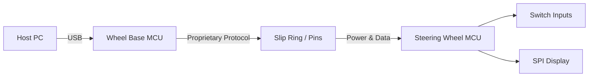
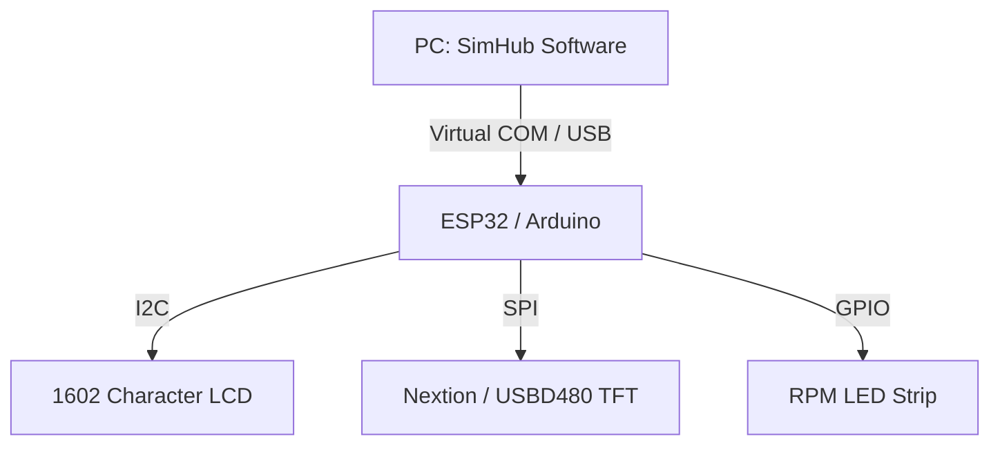
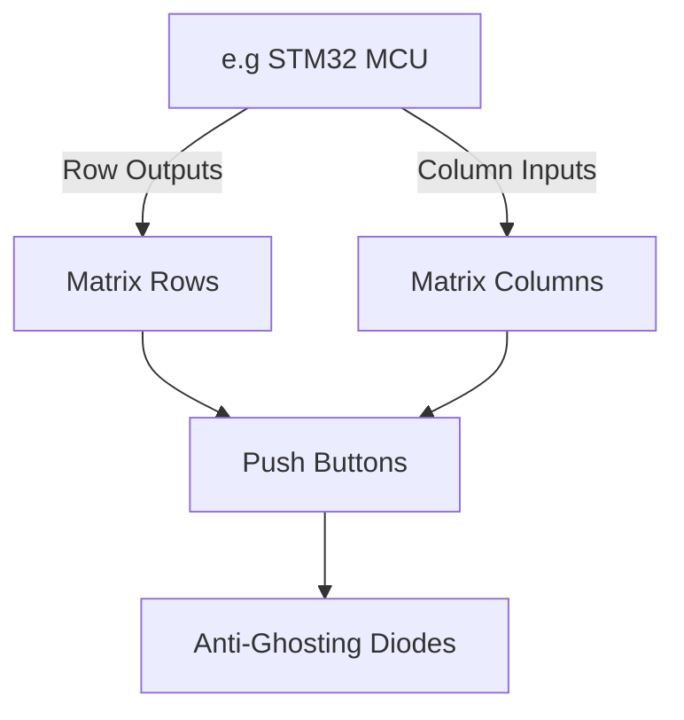

# Sim Racing Accessories Architecture

> Research date: 2026-07-02
> Evidence model: public standards, manufacturer manuals/support, and community projects. Community projects are implementation evidence, not official vendor specifications.  
> Start here after [sim_racing_research.md](./sim_racing_research.md), [wheel_base.md](./wheel_base.md), and [wheel_rim.md](./wheel_rim.md).

This document outlines the hardware and software architectures of common sim racing peripherals, specifically Quick Release (QR) systems, dashboards, and button boxes. It is intended to provide a foundational understanding for engineers entering the sim racing domain, focusing on embedded systems design, communication protocols, and human-machine interface (HMI) integration.

## 1. Quick Release (QR) Systems

> **Note:** This section covers the generic physical and mechanical coupling standards of standalone accessories. For details on how the steering wheel PCB and firmware specifically handle the QR data payload and power muxing, refer to the [Steering Rim Architecture](./wheel_rim.md).

The Quick Release (QR) system forms the critical physical and electrical bridge between the stationary (or rotating) wheelbase and the interchangeable steering wheel rim. This section details its mechanical constraints and data transmission architectures.

### 1.1 Mechanical and Electrical Interfaces

> **Informative:** A QR system must handle significant torque from Direct Drive (DD) wheelbases while maintaining continuous electrical contact for wheel-mounted buttons and displays.

The QR and hub are separate compatibility boundaries. A universal hub may support common rim bolt patterns such as 6x70 mm or 3x50 mm, while the QR itself must match the wheel-base shaft generation, torque rating, mechanical lock, and electrical interface. A generic bolt pattern does not make a rim safe or electrically compatible with a base.

For current Fanatec products, QR2 has distinct **Base-Side** and **Wheel-Side** components. Both sides must use QR2. QR1 and QR2 do not mate, QR1 is discontinued, and conversion support is model-specific. QR2 Lite, QR2, and QR2 Pro Wheel-Side variants also have different product and high-torque approvals; check the current compatibility list rather than inferring support from material alone.

**Figure 1-1: Quick Release Electrical Architecture**

### 1.2 Data Transmission Protocols

> **Informative:** Manufacturers employ various protocols to pass data through the QR. Some use standard USB pass-through, while others rely on proprietary serial buses or wireless (Bluetooth/2.4GHz) links combined with inductive power.

The steering wheel microcontroller **shall** process raw peripheral inputs and package them into a structured payload. The QR data link **shall** maintain a polling rate of at least 100 Hz to prevent noticeable input lag. 

| Element | Direction | Type | Description |
|---------|-----------|------|-------------|
| `VCC` | Input | Power | 5V or 12V supply from wheelbase to rim |
| `GND` | Common | Ground | System ground reference |
| `DATA_TX` | Output | Serial | Button state payload to wheelbase |
| `DATA_RX` | Input | Serial | Force feedback or display data from wheelbase |

## 2. Dashboards and Telemetry Displays

> **Note:** This section covers *standalone* USB or Wi-Fi telemetry dashboards. For information on *integrated* displays that are built into a steering wheel and driven directly by the wheelbase link, refer to the [Steering Rim Architecture](./wheel_rim.md).

Dashboards provide real-time telemetry, such as RPM, gear, and tire temperatures, to the driver. They require a reliable software bridge to extract game data and an embedded controller to drive the physical display.

### 2.1 Hardware Architecture

> **Informative:** DIY and prosumer dashboards typically rely on microcontrollers (e.g., Arduino, ESP32) bridging USB serial data to display peripherals via I2C or SPI.

The dashboard controller **shall** interface with character displays via the I2C bus and TFT/OLED displays via the SPI bus. The system **should** minimize I2C device daisy-chaining to prevent bus saturation during high-refresh-rate telemetry updates.

**Figure 2-1: Dashboard Controller Architecture**

### 2.2 Telemetry Software Integration

> **Informative:** SimHub is the industry-standard software for extracting game telemetry and dispatching it to external devices.

The host software **shall** transmit encoded telemetry strings over a virtual serial port to the dashboard controller. The dashboard firmware **shall** parse these strings and update the respective display buffers.

| Condition | Trigger | Action |
|-----------|---------|--------|
| `RPM >= SHIFT_POINT` | RPM Threshold | Flash all WS2812 LEDs |
| `Rx_Timeout > 2000ms` | Connection Loss | Clear screen and display "NO SIGNAL" |

## 3. Button Boxes and Input Matrices

Button boxes expand the driver's input capabilities, handling ignition switches, brake bias rotaries, and menu navigation. They act as standalone USB Human Interface Devices (HID).

### 3.1 Input Matrix Hardware

> **Informative:** To support dozens of switches without exhausting microcontroller GPIO pins, buttons are wired in a row-column matrix.

The button box hardware **shall** utilize a switch matrix topology for all push-buttons and toggles. A diode (e.g., 1N4148) **shall** be placed in series with each switch to prevent phantom keypresses (ghosting) when multiple inputs are active. Rotary encoders **shall not** be wired into the matrix; they **shall** be connected to dedicated GPIO pins with hardware or software debouncing.

**Figure 3-1: Matrix Wiring Topology**

### 3.2 Firmware and USB HID Enumeration

> **Informative:** For native plug-and-play compatibility with operating systems and racing simulators, the device must emulate a standard game controller.

The button box microcontroller **shall** feature native USB HID support (e.g., ATmega32U4 or RP2040). The firmware **shall** debounce all physical switch state transitions.

| Step | Action | Notes / Constraint |
|------|--------|--------------------|
| 1 | The firmware **shall** configure matrix rows as outputs and columns as inputs with internal pull-ups. | Initializes hardware state. |
| 2 | The firmware **shall** sequentially pull each row LOW and sample the column states. | Matrix scanning loop. |
| 3 | The firmware **shall** construct a standard HID joystick report. | Formats data for host PC. |
| 4 | The firmware **shall** transmit the HID report over USB. | Occurs on state change or polling interval. |

## 4. Unresolved Questions

* Which identity, capability, and torque-permission exchanges are publicly specified for each QR generation? Do not assume a cryptographic or DRM mechanism without approved evidence.
* What are the specific latency overheads when bridging telemetry through intermediate middleware like SimHub versus native game-engine telemetry output?
* Could CAN bus architectures replace simple serial or SPI connections in prosumer sim racing steering wheels for higher reliability and node expansion?

## 5. References

### 5.1 Official and Standards Sources

- [USB-IF HID specifications and tools](https://www.usb.org/hid) — HID descriptors, usages, and tooling for button boxes and dashboard control interfaces.
- [USB-IF PID Class 1.0](https://www.usb.org/sites/default/files/documents/pid1_01.pdf) — haptic/force-feedback device model; useful boundary context for separating FFB from dashboard telemetry.
- [Fanatec Podium DD1 manual](https://assets.fanatec.com/fanatec-pwa/image/upload/downloads-prod/pdfs/P-WB-DD1-Manual-EN_web.pdf) — public quick-release, startup, update, calibration, and steering-wheel detection context.
- [Fanatec QR2 conversion guidance](https://help.fanatec.com/hc/en-us/articles/30011253510289-Which-products-can-be-converted-to-QR2) — QR1/QR2 generation boundary, Base-Side/Wheel-Side variants, and model-specific upgrades.
- [Fanatec Steering Wheel FAQ](https://help.fanatec.com/hc/en-us/articles/43802514108433-Steering-Wheel-FAQ) — QR2 default and QR1 discontinuation date.

### 5.2 Public Tools and Community Sources

- [SimHub wiki](https://github.com/SHWotever/SimHub/wiki) — dashboards, Arduino displays, LEDs, buttons, custom serial devices, and telemetry tooling.
- [OpenFFBoard wiki](https://github.com/Ultrawipf/OpenFFBoard/wiki/) — open force-feedback device architecture; useful for separating motor control, HID/PID, and I/O concerns.
- [gotzl/hid-fanatecff](https://github.com/gotzl/hid-fanatecff) — Linux-side Fanatec LED/display, HIDRAW, and force-feedback integration patterns.
- [FendtXerion3800/Fanatec-Pinout](https://github.com/FendtXerion3800/Fanatec-Pinout) — community connector observations; verify electrically before use.
- [Fanatec ecosystem source register](./references.md) — official/community source classification and currency notes.
