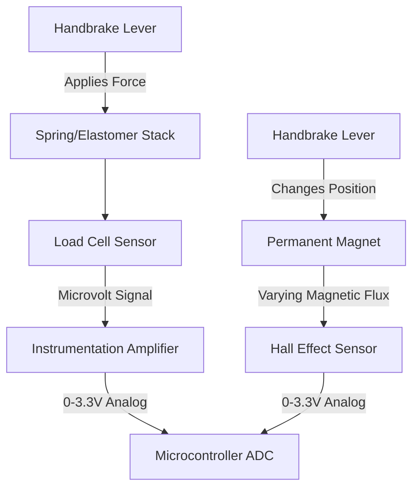
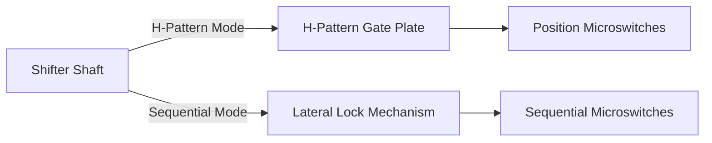
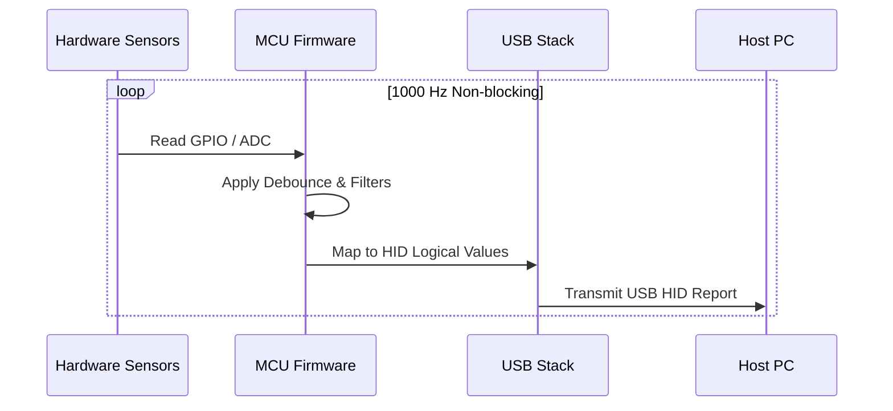

# Sim Racing Add-Ons: Shifters and Handbrakes Architecture

> Research date: 2026-07-02
> Evidence model: public standards, manufacturer manuals/support, and community projects. Community projects are implementation evidence, not official vendor specifications.  
> Related docs: [sim_racing_research.md](./sim_racing_research.md), [wheel_base.md](./wheel_base.md), [pedals.md](./pedals.md), [repos.md](./repos.md).

## 1. Introduction and Scope

This document defines the hardware mechanisms and embedded software architecture required for modern sim racing add-ons, focusing specifically on handbrakes and dual-mode (H-pattern and sequential) shifters. It provides the necessary context and constraints for engineers entering the sim racing hardware domain with an existing background in embedded systems.

The scope covers physical sensor paradigms (load cell vs. Hall effect), mechanical actuation, microcontroller selection, and USB Human Interface Device (HID) firmware implementation.

---

## 2. Hardware Architecture and Mechanisms

This section outlines the physical and electrical foundations of sim racing add-ons before detailing the software implementation. Understanding the mechanical interaction is critical, as sim racing devices must replicate the tactile feedback of real automotive components.

### 2.1 Handbrake Sensor Paradigms

Sim racing handbrakes rely on two primary sensing architectures to capture user input: force-based (load cell) and position-based (Hall effect). The hardware shall support the selected sensor type and interface it with the microcontroller's analog-to-digital converter (ADC).

| Sensor Type | Operating Principle | Characteristic |
|-------------|---------------------|----------------|
| **Load Cell** | Measures physical force (pressure) using a strain gauge. | Mirrors hydraulic brake systems; relies on muscle memory. |
| **Hall Effect** | Measures physical displacement (lever travel) using magnetic flux. | Non-contact, highly durable, lower complexity. |

**Figure 2-1: Handbrake Sensor Data Flow**

> **Informative:**
> Because load cells output signals in the microvolt range, they require a dedicated amplifier (e.g., HX711 or INA333) before the microcontroller can read the signal. Hall effect sensors output a ready-to-read analog voltage.

### 2.2 Dual-Mode Shifter Mechanisms

Dual-mode shifters provide both traditional H-pattern and sequential shifting within a single unit. The mechanical architecture uses constrained pathways and physical locking mechanisms to route the shifter shaft.

The shifter hardware should incorporate heavy-duty springs and spring-loaded detents to provide tactile resistance and a distinct "click" upon gear engagement.

**Figure 2-2: Dual-Mode Shifter Architecture**

To switch between modes, the design may use a physical switch or removable plate that restricts the lateral (left-right) motion of the shaft, limiting it to a single forward-backward axis.

### 2.3 Fanatec Connection Paths

Current public guidance separates console and standalone-PC use:

| Use Case | Supported Path | Constraint |
|---|---|---|
| Console shifter/handbrake | Peripheral to Fanatec wheel base; base to console | Standalone USB adapters are not a console path. Platform licensing still comes from the wheel/hub for Xbox or base for PlayStation. |
| PC through wheel base | Peripheral to compatible base; base to PC | Uses the base as the input aggregator. |
| Standalone PC | Peripheral through a correctly configured ClubSport USB Adapter | Adapter firmware/mode must match shifter, handbrake, or pedals. |
| ClubSport Shifter H-pattern or SQ | Shifter 1 | Current guidance assigns both H-pattern and sequential modes to Shifter 1. |
| Sequential/static paddles | Shifter 2 | Shifter 2 supports sequential input, including supported static paddles. |

Connector shape alone does not prove electrical or firmware compatibility. Check the exact peripheral, base, cable, and adapter mode.

---

## 3. Firmware Architecture

This section describes the embedded software responsible for converting physical hardware states into standard USB HID reports. The firmware acts as the bridge between the analog/digital inputs and the host PC.

### 3.1 Microcontroller Requirements

The device shall utilize a microcontroller with native USB support to allow plug-and-play functionality without requiring secondary USB-to-serial conversion chips. Appropriate selections include the ATmega32U4, RP2040, or STM32 architectures.

### 3.2 Main Execution Loop

The firmware shall implement a non-blocking execution loop to guarantee low latency. Standard polling rates for sim racing peripherals should be at least 1000 Hz (1 ms).

**Figure 3-2: Firmware Execution Loop**

### 3.3 Initialization Sequence

The initialization sequence dictates the device startup before entering the main loop.

| Step | Action | Notes / Constraint |
|------|--------|--------------------|
| 1 | The firmware shall initialize the USB HID stack. | The device shall identify as a Gamepad or Joystick. |
| 2 | The firmware shall configure GPIO pins. | Input pins shall use internal pull-up resistors where applicable. |
| 3 | The firmware shall initialize the ADC peripheral. | Set resolution to match the HID report descriptor (e.g., 10-bit or 12-bit). |

---

## 4. Signal Processing and Fault Handling

This section covers the processing applied to raw sensor data to ensure consistent and reliable input to the host PC, mitigating mechanical tolerances and electrical noise.

The firmware shall map raw analog inputs to the logical bounds defined in the USB report descriptor.

| Interface Element | Direction | Type | Description |
|-------------------|-----------|------|-------------|
| `raw_adc_val` | Input | uint16 | Raw measurement from load cell amp or Hall sensor |
| `switch_state` | Input | boolean | Raw digital read from shifter microswitch |
| `hid_axis_out` | Output | uint8 / uint16 | Scaled output for USB transmission |

The system shall handle edge cases and signal noise using the following logic:

| Condition | Trigger | Action |
|-----------|---------|--------|
| `raw_adc_val < DEADZONE_MIN` | Lever resting state / slight mechanical play | The firmware shall output `0` (minimum axis value). |
| `raw_adc_val > DEADZONE_MAX` | Maximum physical force applied | The firmware shall output the logical maximum axis value. |
| `switch_state` changes | Shifter gear engaged | The firmware shall apply a software debounce timer (e.g., 20ms) before validating the state change. |

---

## 5. Repository Analysis

This section explores how community projects interface with standard shifter mechanisms.

### 5.1 `StuyoP/Universal-Shifter-Interface-for-Fanatec`

| Aspect | Finding |
|---|---|
| Goal | Connect any switch-based shifter (H-pattern or sequential) via RJ12 |
| Method | Resistor networks and analog voltage mapping to mimic original hardware |
| Product lesson | Shifter interfaces rely on specific analog voltage windowing or matrix logic rather than digital bus protocols. |

## 6. References

### 6.1 Official and Standards Sources

- [USB-IF HID specifications and tools](https://www.usb.org/hid) — reference for standalone shifter/handbrake HID joystick reports.
- [Fanatec Podium DD1 manual](https://assets.fanatec.com/fanatec-pwa/image/upload/downloads-prod/pdfs/P-WB-DD1-Manual-EN_web.pdf) — public base update, shifter calibration, startup, and accessory context.
- [Fanatec shifter-port guidance](https://help.fanatec.com/hc/en-us/articles/45597346898449-Which-shifter-port-should-I-use-on-my-Fanatec-wheel-base) — Shifter 1 H-pattern/SQ and Shifter 2 sequential/static-paddle use.
- [Fanatec ClubSport USB Adapter troubleshooting](https://help.fanatec.com/hc/en-us/articles/45603844706705-My-connected-product-isn-t-working-when-using-the-ClubSport-USB-Adapter) — product-specific adapter modes and PC connection path.

### 6.2 Public Tools and Community Sources

- [StuyoP/Universal-Shifter-Interface-for-Fanatec](https://github.com/StuyoP/Universal-Shifter-Interface-for-Fanatec) — switch-based H-pattern/sequential shifter interface for Fanatec wheelbases.
- [FendtXerion3800/Fanatec-Pinout](https://github.com/FendtXerion3800/Fanatec-Pinout) — community connector/pinout discovery; verify before hardware use.
- [SimHub wiki](https://github.com/SHWotever/SimHub/wiki) — button boxes, serial devices, and telemetry support patterns.
- [Fanatec ecosystem source register](./references.md) — buyer-guide context and official compatibility cross-checks.

## 7. Unresolved Questions

- **Ecosystem Integration:** How do proprietary ecosystems (e.g., Fanatec, Moza) handle device enumeration and communication via proprietary RJ12/CAN-bus connections to the wheelbase, rather than direct standalone USB?
- **Thermal Drift:** What are the specific thermal drift compensation requirements for load cell amplifiers (e.g., HX711) over prolonged, multi-hour sim racing endurance sessions?
- **Auto-Detection:** Can the dual-mode shifter firmware reliably auto-detect the transition between H-pattern and sequential modes without requiring the user to manually trigger a toggle switch or software flag?

---
*End of Document*
