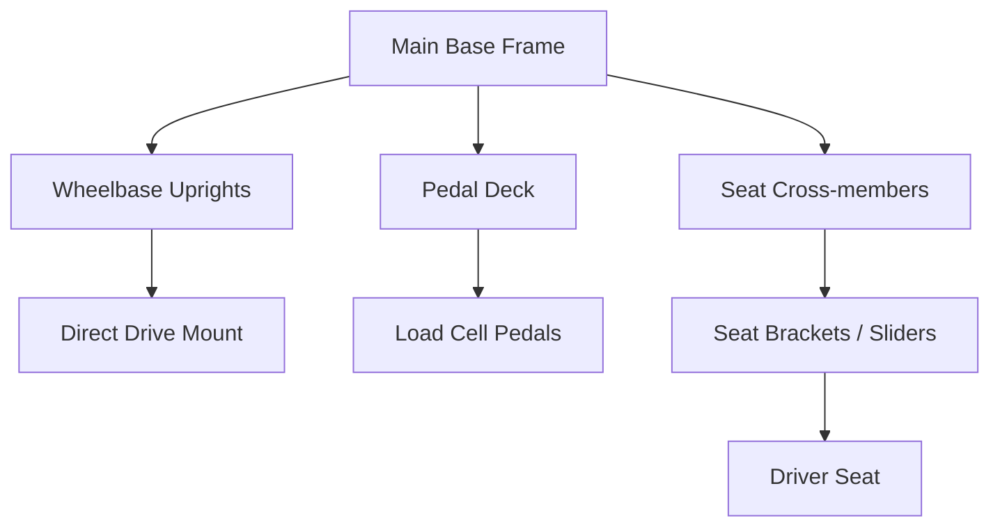

# Sim Racing Cockpits: Mechanical Architecture & Rigidity

> Research date: 2026-07-02
> Evidence model: public product/manual information plus engineering inference. Cockpit stiffness recommendations are design guidance, not a universal vendor requirement.  
> Related docs: [sim_racing_research.md](./sim_racing_research.md), [wheel_base.md](./wheel_base.md), [pedals.md](./pedals.md).

## 1. Introduction

The sim racing cockpit serves as the mechanical grounding plane for all user inputs and system outputs. For an embedded systems engineer, the cockpit can be viewed as the structural chassis that houses the primary actuators (Direct Drive wheelbases) and sensors (Load Cell pedals). Any mechanical flex in this chassis acts as an unintended low-pass filter for Force Feedback (FFB) signals and injects noise into braking pressure readings. This document details the architectural standards, rigidity requirements, and integration methods for extruded aluminum (8020) sim racing cockpits.

## 2. System Architecture Overview

Modern high-fidelity sim racing rigs rely on modular T-slot extruded aluminum profiles. This approach provides infinite adjustability and immense stiffness-to-weight ratios. The architecture isolates different stress points by distributing them across a rigid base frame.

**Figure 2-1: Standard Cockpit Component Hierarchy**

The base frame is the foundational structural loop. All secondary structures (uprights, decks, and cross-members) branch off this base to support the driver and the hardware.

## 3. Structural Rigidity and Signal Fidelity

Structural flex introduces parasitic losses to the system. Understanding how flex affects both output fidelity and input consistency is critical for designing a performant rig.

The illustration makes the core idea concrete: in a stiff rig, the wheelbase's FFB torque and the driver's brake force transfer almost entirely to the hands and feet. In a flexible rig, part of that energy bends the frame instead — the upright leans under torque and the pedal deck moves back under braking. That absorbed energy is exactly the detail the driver loses: the wheel feels soft or delayed, and braking becomes hard to repeat.

### 3.1. Direct Drive Torque Dynamics

Direct Drive (DD) wheelbases couple a large servo motor directly to the steering wheel, capable of producing transient torque spikes in excess of 20Nm. These motors operate with high bandwidth to deliver detailed road texture and slip angle feedback. 

If the wheelbase uprights flex, the mechanical structure absorbs the high-frequency FFB transients. 

* The wheelbase uprights **shall** be constructed from profile no smaller than 40x80mm to resist torsional flex.
* The mounting brackets connecting the uprights to the base frame **should** utilise heavy-duty corner gussets and sandwich plates to eliminate play.
* The steering column mount **shall** ensure zero lateral or vertical deflection under peak operating torque.

### 3.2. Load Cell Brake Deflection Forces

Unlike standard potentiometers that measure angular displacement, load cell pedals measure the actual physical force applied to the brake face (often up to or exceeding 100kg of force). This mimics the hydraulic pressure in a real racing car, relying on human muscle memory which is highly sensitive to pressure but poor at measuring distance.

When a driver applies 100kg of force, any backward flex in the pedal deck or the driver's seat creates "lost energy" and changes the pedal's spatial position relative to the driver. This dynamically alters the pressure-to-displacement ratio, destroying input consistency during critical trail-braking phases.

* The pedal deck and seat mounting system **shall** remain completely rigid under a minimum of 100kg longitudinal force.
* Load cell pedal stiffness **should** be tuned via elastomers or springs to allow a minimal, predictable travel without inducing chassis flex.

## 4. Component Sizing and Specifications

Aluminum profiles are categorized by their cross-sectional dimensions. Proper selection is critical to meet the rigidity requirements without unnecessary cost.

| Profile Size | Primary Application | Structural Rigidity Rating | Usage Requirement |
|--------------|---------------------|----------------------------|-------------------|
| **40x40mm**  | Accessories, monitor mounts | Low | **Shall not** be used for primary structural load paths. |
| **40x80mm**  | Base Frame, Uprights, Pedal Deck | High | **Shall** be the minimum standard for the main chassis and uprights. |
| **40x120mm+**| Heavy-duty Uprights, Aesthetic builds | Extreme | **May** be used for ultra-high-torque Direct Drive bases (20Nm+). |

## 5. Seat Integration and Ergonomics

The seat mounting architecture must bridge the lateral gap between the main base rails while accommodating drivers of different sizes. Modularity is achieved through a layered approach of cross-members and sliding rails.

**Figure 5-1: Seat Mounting Architecture and Load Path**

* The system **shall** provide a secure, flat mounting interface to prevent binding in the slider rails.
* Seat cross-members **should** span the exact width between the inner channels of the base rails.
* If automotive seats are used, spacers or adapter plates **may** be required to flush-mount uneven factory seat rails to the flat aluminum profiles.

### 5.1 Ecosystem Mounting Example

Fanatec's public ClubSport GT Cockpit guidance states that its standard bottom plate supports current Fanatec bases including CSL DD, Gran Turismo DD Pro, ClubSport DD/DD+, and Podium DD2 QR2. An optional Direct Drive Front Mount is a separate mounting path. This is product-specific evidence, not proof that every cockpit or hole pattern supports every base.

For customer communication, separate three questions:

1. Does the mounting plate have the approved hole pattern and fastener depth for the exact base?
2. Is the structure rated and sufficiently stiff for the base's available torque and pedal force?
3. Are the seat, wheel, pedals, shifter, and handbrake ergonomically adjustable together?

## 6. Unresolved Questions

- What is the measurable, acceptable tolerance for micro-flex (in millimeters) under a 100kg braking load before it demonstrably impacts load cell sensor consistency?
- How should vibration transducers (e.g., tactile transducers or "bass shakers") be mechanically isolated from the primary structural profiles to avoid destructive interference with Direct Drive high-frequency FFB?
- Are there specific resonance frequencies in standard 40x80mm aluminum structures that align with common FFB signal frequencies, and if so, how can they be dampened?

## 7. References

### 7.1 Manufacturer and Product Context

- [Sim-Lab P1X Pro cockpit](https://sim-lab.eu/products/p1x-pro-sim-racing-cockpit) — public example of an aluminum-profile cockpit ecosystem with wheel, pedal, seat, monitor, shifter, and handbrake mounting accessories.
- [Fanatec Podium DD1 manual](https://assets.fanatec.com/fanatec-pwa/image/upload/downloads-prod/pdfs/P-WB-DD1-Manual-EN_web.pdf) — public high-torque base setup, calibration, and safety context.
- [Fanatec ClubSport GT Cockpit wheel-base compatibility](https://www.fanatec.com/us/en/explorer/products/cockpit/wheel-bases-fit-on-the-fanatec-clubsport-gt-cockpit/) — official bottom-mount and optional front-mount product example.
- [Fanatec ecosystem source register](./references.md) — source dates and community buyer-guide limitations.

### 7.2 Related Internal References

- [Wheel-base architecture](./wheel_base.md) — torque generation, motor safety, and FFB constraints.
- [Pedals architecture](./pedals.md) — load-cell force path and calibration sensitivity.

## 8. Implementation Notes

- Measure cockpit deflection under expected peak brake force and wheel torque before treating the rig as a stable reference frame.
- Treat tactile transducers as a separate vibration system; isolate and test them so they do not mask FFB or sensor diagnostics.
- Record fastener torque, bracket type, and profile size in bench reports so mechanical results are reproducible.
