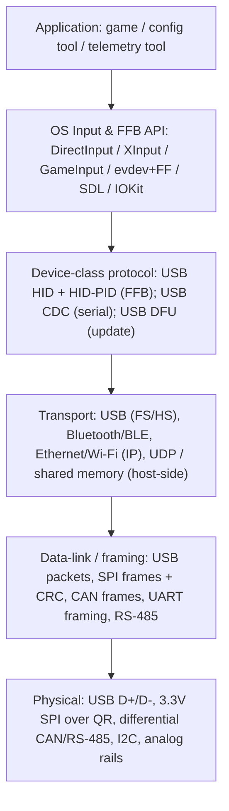
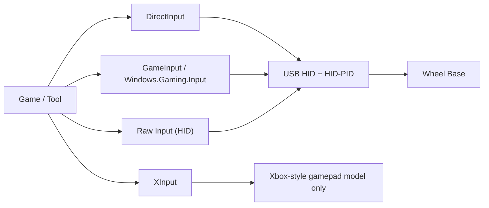
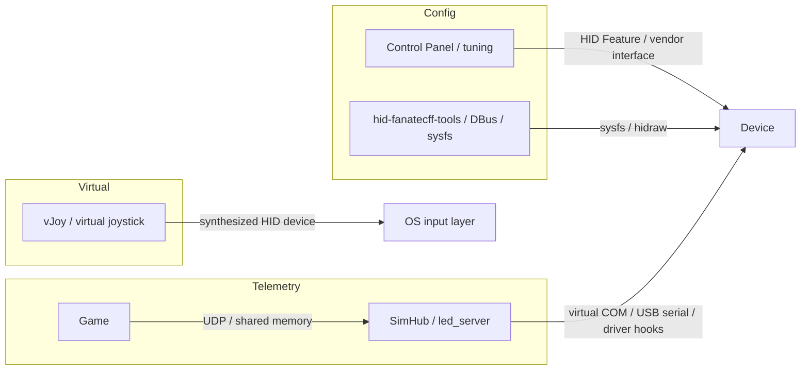

# Communication Protocols and Standards

> Version: 1.0
> Reviewed: 2026-07-02
> Purpose: provide a single layered reference for the communication standards in the sim-racing ecosystem — physical layer through application/API layer — with emphasis on the wheel base <-> PC link and on how software tools talk to devices. It consolidates and extends the material in [sim_racing_research.md](./sim_racing_research.md) §7, [wheel_base.md](./wheel_base.md) §7 & §11, and [telemetry.md](./telemetry.md).

## Document Change Log

| Version | Date | Changes |
|---|---|---|
| 1.0 | 2026-07-02 | New document. Fills the OS/driver/API layer (DirectInput, XInput, GameInput, Raw Input, Linux evdev/FF/hidraw/libinput, SDL, IOKit), the HID usage/HID-PID application layer, the USB DFU update transport, and a software-tools-to-device matrix. Linux and telemetry specifics cited from the verified `hid-fanatecff` and `hid-fanatecff-tools` repositories. |

## 1. Purpose and Scope

The existing docs describe the *physical links* well (see the link table in [sim_racing_research.md](./sim_racing_research.md) §7.1). What was missing was a consolidated view of the **higher layers** — the operating-system input APIs, the HID application/force-feedback protocol, the firmware-update transport, and the concrete paths software tools use to reach devices. This document supplies that view.

> [!IMPORTANT]
> **Evidence and reachability.** USB-IF, Microsoft, Apple, and Fanatec documentation were **not reachable** from the review environment and are cited by reference only (verified for internal consistency, not re-fetched). Linux and translation-layer specifics are taken from the **verified** `hid-fanatecff` / `hid-fanatecff-tools` READMEs. Standard OS APIs are **verified public** general knowledge as of the review date; brand-specific packet formats remain **Unknown** unless a public source identifies them.

## 2. The Layered Model

**Figure 2-1: Ecosystem Communication Stack**

The same stack, drawn as labelled layers with the concrete protocols at each level, makes the "each layer only talks to its neighbours" property easier to see:

This document is organized top-down: PC transport and its device classes (§3–§6), the OS/API layer (§7), firmware update (§8), and software-tools-to-device paths (§9). The physical and data-link layers are catalogued in [sim_racing_research.md](./sim_racing_research.md) §7.1 and §7.3 and are not duplicated here beyond the additions in §3.

## 3. Physical and Link Layer (Additions)

The canonical physical link table lives in [sim_racing_research.md](./sim_racing_research.md) §7.1 (USB FS/HS, SPI, UART, CAN/CAN-FD, I2C, RS-485, Ethernet, BLE, Wi-Fi). Additions relevant to the standards below:

- **USB speeds.** A wheel base typically enumerates as **USB 2.0 Full Speed (12 Mbit/s)**; **High Speed (480 Mbit/s)** is used where display/vendor bandwidth demands it (**verified public**; stated in research §7.1).
- **USB connector/power.** Base is self-powered with VBUS sensing (see [wheel_base.md](./wheel_base.md) §7). Connector type is product-specific.
- **QR electrical link.** 3.3 V SPI (base controller/master, rim peripheral/slave) for older generations — see [wheel_rim.md](./wheel_rim.md) and [accessories.md](./accessories.md); generation boundary tracked in [compatibility-matrix.md](./compatibility-matrix.md).

## 4. USB Transport for the Base <-> PC Link

At enumeration the base presents USB descriptors that declare its interfaces and endpoints. As documented in [sim_racing_research.md](./sim_racing_research.md) §7.2.1:

- **Interrupt IN** endpoint carries axes/buttons (device -> host).
- **Interrupt OUT** or **SET_REPORT** carries force-feedback effects (host -> device).
- **Feature** reports carry capabilities/configuration.
- An optional **vendor interface** carries vendor-specific data.

**Verified public device identity:** the `hid-fanatecff` driver enumerates Fanatec devices under **USB vendor ID `0x0EB7`**, with per-device product IDs — for example `0x0020` (CSL DD / DD Pro / ClubSport DD), `0x0006` (Podium DD1), `0x0007` (Podium DD2), and pedal PIDs such as `0x6204` (see [repos.md](./repos.md) and the `hid-fanatecff` README). Exact PIDs should be confirmed per product.

## 5. HID Application Layer

USB HID is the self-describing class that lets the base work without a custom driver. Two semantic pieces were previously implied but not named:

- **Usage pages / usages.** The report descriptor tags each field with a usage. The **Generic Desktop** usage page (`0x01`) describes axes (X, Y, Z, Rx, Ry, Rz), sliders, and buttons; the **Physical Interface Device (PID)** usage page (`0x0F`) describes force-feedback controls. (**Verified public**, USB-IF HID usage tables.)
- **Report types and control requests.** **Input** reports flow device -> host; **Output** reports flow host -> device; **Feature** reports are bidirectional configuration. `GET_REPORT` / `SET_REPORT` control requests move Feature/Output reports over the control endpoint.

## 6. HID-PID: The Force-Feedback Command Layer

Force feedback on the PC is carried by the USB-IF **Physical Interface Device (PID)** class — the "high layer" that turns a game's forces into device commands. This was referenced as "PID Class" in the existing docs but not detailed.

Typical HID-PID reports (**verified public**, USB-IF PID 1.0):

| Report | Role |
|---|---|
| Set Effect | Define an effect's type, duration, and parameters |
| Set Envelope | Attack/fade shaping |
| Set Condition | Spring / damper / inertia / friction coefficients |
| Set Periodic | Sine / square / triangle / sawtooth parameters |
| Set Constant / Ramp Force | Constant or ramped magnitude |
| Effect Operation | Start / start-solo / stop an effect |
| Device Gain | Global gain scaling |
| PID Pool / Block Load | Effect memory management on the device |

> [!NOTE]
> The verified `hid-fanatecff` driver shows a real instance of this layer: for Wine/Proton via HIDRAW it **extends the device's HID descriptor with HID-PID components**, then intercepts HID-PID commands and translates them into Fanatec's custom HID protocol. The custom on-wire protocol itself is **Unknown** from public specs; only the standard HID-PID boundary is public. (Reference: USB-IF *Device Class Definition for PID 1.0*.)

## 7. Operating-System Input and FFB APIs (Primary Gap)

This is the layer through which software talks to the base, and it was the largest documentation gap. It differs per OS.

### 7.1 Windows

**Figure 7-1: Windows Input/FFB API Landscape**

| API | FFB support | Wheel fit | Notes |
|---|---|---|---|
| **DirectInput** | Yes (full effect set) | Strong | Legacy but still the common path for FFB wheels; exposes many axes/buttons and the effect model in §6. |
| **XInput** | Rumble only | Poor | Fixed Xbox-gamepad model; no directional FFB, limited axes. Wheels are **not** well served by XInput. |
| **GameInput / Windows.Gaming.Input** | Yes (RacingWheel class) | Growing | Newer unified API with an explicit racing-wheel device class and force feedback. |
| **Raw Input** | Read only | Read path | Low-level HID input access; no FFB output model of its own. |

(**Verified public** as of the review date; API availability evolves, so confirm current support before relying on any one path.)

### 7.2 Linux

The Linux path is documented concretely by the **verified** `hid-fanatecff` driver:

- **evdev** (`/dev/input/event*`) and **joydev** (`/dev/input/js*`) expose input; `evdev-joystick` sets deadzone/fuzz.
- The kernel **force-feedback (FF) API** lets effects be uploaded via the standard **libinput** interface; `hid-fanatecff` translates them into the custom HID protocol on an asynchronous timer defaulting to **2 ms**. `FF_FRICTION` and `FF_INERTIA` are experimental in that driver.
- The kernel **LED interface** (sysfs) drives rim RPM/other LEDs by writing sysfs files.
- **hidraw** (`/dev/hidrawN`) gives raw HID-descriptor access used for SDK-style LED/display control.

### 7.3 macOS

macOS exposes devices through **IOKit HID** and the higher-level **Game Controller** framework (**verified public**, general knowledge). FFB support for arbitrary wheels is more limited than on Windows/Linux and is product-dependent.

### 7.4 Cross-Platform and Translation Layers

- **SDL** (SDL_Joystick / SDL_GameController + the haptic subsystem) is the common cross-platform library many games and tools use; it sits on top of the OS layers above.
- **Wine/Proton** (from the verified `hid-fanatecff` README) reaches the device two ways: via **libinput (directly or through SDL)** to synthesize a Windows input device, or via **HIDRAW** to present the raw HID descriptor so the vendor SDK and HID-PID FFB work as on native Windows. Proton 10.0-2+ enables HIDRAW for Fanatec bases by default; `PROTON_DISABLE_HIDRAW=1` forces the libinput/SDL path.

## 8. Firmware Update Transport

Update was covered as "bootloader" behavior but the standardized transport was not named:

- **USB DFU (Device Firmware Upgrade) class** is the standard mechanism: a device advertises a DFU interface, is sent a **DETACH** and re-enumerates in **DFU mode**, then receives the image (host tooling such as `dfu-util`). (**Verified public**, USB-IF DFU 1.1.)
- **Vendor bootloader / recovery** interfaces are the common alternative, exposed over the same USB connection or a service interface (see [wheel_base.md](./wheel_base.md) §7, §11). Fanatec ships its own updater; its wire protocol is **Unknown** from public specs.

> [!IMPORTANT]
> Per the safety model in [wheel_base.md](./wheel_base.md), update/diagnostics is a **torque-disabled service plane**. Firmware **shall not** produce torque while in a bootloader/DFU state.

## 9. How Software Tools Communicate With Devices

This section answers the second question directly. Tools reach devices through three distinct paths.

**Figure 9-1: Software-Tool-to-Device Paths**

| Tool type | Path to device | Standard / mechanism | Status |
|---|---|---|---|
| Config / tuning (e.g. Control Panel) | HID **Feature** reports or a **vendor interface** over USB | USB HID (§5); vendor specifics Unknown | Verified public boundary; vendor payload Unknown |
| Linux tuning bridge (`hid-fanatecff-tools`) | Driver **sysfs** via a **DBus** service; **hidraw** for SDK features | Linux sysfs/DBus/hidraw | Verified (community) |
| Telemetry (SimHub, `fanatec_led_server.py`) | Read game telemetry over **UDP** or **shared memory / memory-mapped ("named-mapping")**, then push to the device over **virtual COM / USB serial** or driver hooks | Per-game telemetry APIs; USB CDC | Verified (community); see [telemetry.md](./telemetry.md) |
| Virtual / relay driver (**vJoy**) | Presents a **synthesized HID joystick** to the OS input layer for injection/relay | Windows virtual-joystick driver | Verified public |
| Proxy emulator (pedal/rim emulators) | Presents as a **HID device** or connects to a **base RJ12 port** as a proxy | USB HID / RJ12 (§3) | Community-reported; see [repos.md](./repos.md), [compatibility-matrix.md](./compatibility-matrix.md) |

Per-game telemetry transports observed in the verified `hid-fanatecff-tools` README: Assetto Corsa exposes a **UDP** endpoint by default; ACC uses Windows **named memory-mappings** (bridged to Linux); AMS2 / Project CARS 2 use **UDP** (a configurable protocol version); rFactor 2 uses a **shared-memory-map plugin** creating mappings in `/dev/shm/`; the F1 titles use **UDP**. This confirms the two dominant host-side telemetry transports are **UDP** and **shared memory / memory-mapped files**.

## 10. What This Document Adds

Relative to prior coverage, this document newly names and organizes: the OS API layer (DirectInput / XInput / GameInput / Raw Input; Linux evdev / FF / libinput / hidraw / joydev; macOS IOKit; SDL and Wine/Proton translation); the HID usage-page and report-type semantics; the HID-PID effect command set; the USB DFU update transport; and the software-tool-to-device matrix with per-game telemetry transports. Physical-layer detail continues to live in research §7.

## 11. Firmware Perspective

The base must present standards-clean interfaces at each layer so it works without bespoke drivers: HID + HID-PID for input/FFB, CDC where a serial plane is offered, and DFU or a clearly-scoped vendor recovery for update. Every host-facing plane **shall** be bounded and length-checked (§ input/FFB/config/telemetry/update planes in [wheel_base.md](./wheel_base.md) §11), and the device **shall not** trust that any particular host API or tool is present.

## 12. Key Takeaways

- Base <-> PC is USB HID for I/O and **HID-PID** for force feedback; consoles use licensed paths that **shall not** be emulated or bypassed.
- The OS API layer matters: **DirectInput** and **GameInput** carry wheel FFB on Windows; **XInput** does not; Linux uses the kernel **FF API + libinput/hidraw**; **SDL** and **Wine/Proton** bridge across.
- Firmware update has a standard transport (**USB DFU**) and a torque-disabled safety requirement.
- Software tools reach devices three ways: **config** (HID Feature / vendor / sysfs), **telemetry** (UDP or shared memory -> serial), and **virtual/relay** drivers (vJoy) or **proxy** emulators.

## References

- [USB-IF HID specifications and tools](https://www.usb.org/hid) — HID class, usage tables, report types.
- [USB-IF Device Class Definition for PID 1.0](https://www.usb.org/document-library/device-class-definition-pid-10-0) — force-feedback command layer.
- [USB-IF Device Firmware Upgrade (DFU) 1.1](https://www.usb.org/sites/default/files/DFU_1.1.pdf) — standardized update transport.
- [Linux force-feedback (FF) API](https://www.kernel.org/doc/html/latest/input/ff.html) and [hidraw](https://docs.kernel.org/hid/hidraw.html) — Linux input/FFB/raw-HID interfaces.
- [gotzl/hid-fanatecff](https://github.com/gotzl/hid-fanatecff) — verified Linux driver; VID/PID list, FF API, sysfs LEDs, HIDRAW/HID-PID, SDL/Proton behavior.
- [gotzl/hid-fanatecff-tools](https://github.com/gotzl/hid-fanatecff-tools) — verified telemetry bridge; per-game UDP / shared-memory transports.
- [telemetry.md](./telemetry.md), [wheel_base.md](./wheel_base.md) §7 & §11, [sim_racing_research.md](./sim_racing_research.md) §7 — related in-tree sections.

> Vendor/standards links (usb.org, Microsoft, Apple, Fanatec) were not reachable in this review environment and are cited by reference; re-confirm against the live sources before production use.

## Unresolved Questions

- What are the exact USB product IDs and any vendor-interface report formats per current product? (Vendor payloads are Unknown from public specs.)
- Which OS APIs will the target integration support first (DirectInput vs GameInput on Windows), and what is the minimum viable set for Linux (libinput vs hidraw)?
