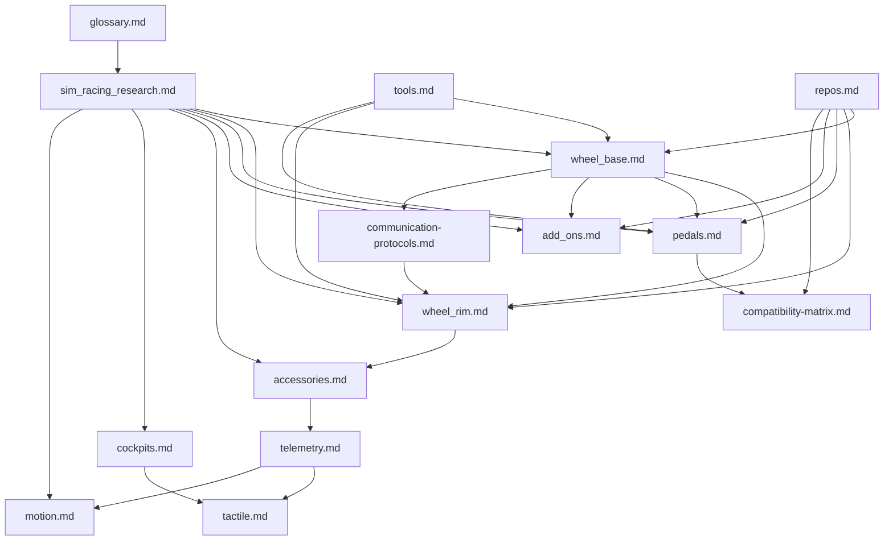

# Sim Racing Study Index

> Version: 1.4
> Reviewed: 2026-07-05

## Document Change Log

| Version | Date | Changes |
|---|---|---|
| 1.4 | 2026-07-05 | Question-register pass. Reviewed every "Unresolved Questions" section across the base and either **resolved** items (from the knowledge base, public standards, or documented community evidence such as the `hid-fanatecff` USB IDs and the GeekyDeaks RJ12/UART pinout) or **re-styled** them as "Open — developer self-investigation" with a concrete method (what to measure, which spec to obtain, which tool to use). Sections renamed to "Question Register (Resolved and Open)" or "Open Questions for Developers to Self-Investigate" accordingly. |
| 1.3 | 2026-07-05 | Added a consolidated, reader-facing force-feedback explainer ([force_feedback_explained.md](./force_feedback_explained.md)) covering the theory of force, the servo motor and power electronics, the full FFB signal chain, and every category of force/vibration felt at the hand (tire physics, weight transfer, road/kerb texture, condition effects) plus fidelity, tuning, and safety. It reuses the existing FFB-relevant illustrations and cross-references the subsystem docs. |
| 1.2 | 2026-07-05 | Systematic explanation + illustration pass. Added original SVG illustrations for physical/power-electronics concepts across the subsystem docs (three-phase inverter, PWM/ADC timing, thermal derating, servo cross-section, load cell / Hall / potentiometer-encoder sensors, ADC resolution, button-matrix ghosting, H-pattern gate, quick-release coupling, cockpit flex, 6-DOF motion, comms stack, telemetry latency, tactile crossover), each with accompanying plain-language explanation. Illustrations are original diagrams, not manufacturer artwork. |
| 1.1 | 2026-07-02 | Added version header and change log; added the five newer subsystem docs (telemetry, tactile, motion, compatibility-matrix, communication-protocols) to the reading path and dependency map; captioned the dependency-map diagram. |

This folder is a developer-oriented study map for sim-racing hardware and firmware. It separates public facts, community evidence, and engineering recommendations so implementation work can proceed without assuming proprietary Fanatec internals.

## Recommended Reading Path

| Step | Read | Outcome |
|---|---|---|
| 1 | [glossary.md](./glossary.md) | Learn product terms, abbreviations, compatibility labels, and customer-safe wording. |
| 2 | [sim_racing_research.md](./sim_racing_research.md) | Learn the ecosystem, safety model, FFB path, and subsystem ownership. |
| 2b | [force_feedback_explained.md](./force_feedback_explained.md) | Get the consolidated FFB picture: theory of force, servo motor, the full signal chain, what the hands feel (tire physics, weight transfer, road texture), fidelity, tuning, and safety. |
| 3 | [wheel_base.md](./wheel_base.md) | Understand the safety-critical hub: USB/PID, motor control, torque arbitration, update, diagnostics. |
| 4 | [wheel_rim.md](./wheel_rim.md) | Understand rotating I/O nodes, QR links, rim identity, input scanning, displays, and generation boundaries. |
| 5 | [pedals.md](./pedals.md) | Understand sensor chains, calibration, USB HID, and base-port proxying. |
| 6 | [add_ons.md](./add_ons.md) | Understand shifters and handbrakes as discrete or analog input devices. |
| 7 | [accessories.md](./accessories.md) | Understand quick releases, dashboards, telemetry displays, and button boxes. |
| 8 | [cockpits.md](./cockpits.md) | Understand the mechanical chassis that preserves FFB and pedal signal fidelity. |
| 9 | [tools.md](./tools.md) | Pick standards, software, measurement tools, and validation references. |
| 10 | [repos.md](./repos.md) | Inspect public projects; treat them as community evidence, not official specs. |
| 11 | [telemetry.md](./telemetry.md) | Understand the game -> bridge -> device telemetry pipeline. |
| 12 | [tactile.md](./tactile.md) | Understand tactile transducers as a separate vibration system isolated from FFB. |
| 13 | [motion.md](./motion.md) | Understand motion platforms, motion cueing, and the mandatory safety envelope. |
| 14 | [communication-protocols.md](./communication-protocols.md) | Understand the layered protocol stack and how software tools reach devices. |
| 15 | [compatibility-matrix.md](./compatibility-matrix.md) | Separate USB-direct vs base-proxy, QR generation, and platform paths, with verification status. |

## Subsystem Dependency Map

**Figure 1-1: Subsystem Dependency Map**

## Evidence Model

| Label | Meaning | Preferred Sources |
|---|---|---|
| Verified public behavior | Publicly documented product or standard behavior | USB-IF specs, manufacturer manuals, support pages |
| Community implementation | Working or documented public implementation | GitHub repositories, project wikis |
| Engineering inference | Reasoned design conclusion from public evidence | Multiple sources plus embedded/control-system practice |
| Unknown | Not public enough to claim | Requires approved schematic, BOM, trace, descriptor, or vendor spec |

> **On the illustrations (added v1.2).** The SVG diagrams added in this pass are original, schematic teaching illustrations of general engineering principles (motor construction, three-phase inversion, PWM timing, strain-gauge bridges, quadrature encoding, button matrices, and so on). They are **not** reproductions of any manufacturer's schematics or product artwork, and they depict generic concepts rather than any specific product's internals. Where a value would be product-specific (pole count, PWM rate, resolution, resonance frequency), the illustration is labelled as illustrative and the text defers to measurement or an approved specification. They sit at the "engineering inference / verified public general knowledge" confidence level, not "verified product behavior."

## Safety and Scope Rules

- Do not include leaked firmware, confidential schematics, proprietary binaries, credentials, or private support material.
- Do not present Fanatec-compatible community projects as official Fanatec protocol specifications.
- Do not bypass console authentication, torque limits, safety keys, or firmware protections.
- Treat high-torque motor testing as hazardous until independent gate-disable and fault handling are verified.

## Reference Hubs

- [USB-IF HID specifications and tools](https://www.usb.org/hid)
- [USB-IF PID Class 1.0](https://www.usb.org/sites/default/files/documents/pid1_01.pdf)
- [Fanatec Podium DD1 manual](https://assets.fanatec.com/fanatec-pwa/image/upload/downloads-prod/pdfs/P-WB-DD1-Manual-EN_web.pdf)
- [OpenFFBoard wiki](https://github.com/Ultrawipf/OpenFFBoard/wiki/)
- [hid-fanatecff Linux driver](https://github.com/gotzl/hid-fanatecff)
- [SimHub wiki](https://github.com/SHWotever/SimHub/wiki)

## Unresolved Questions

- None.
