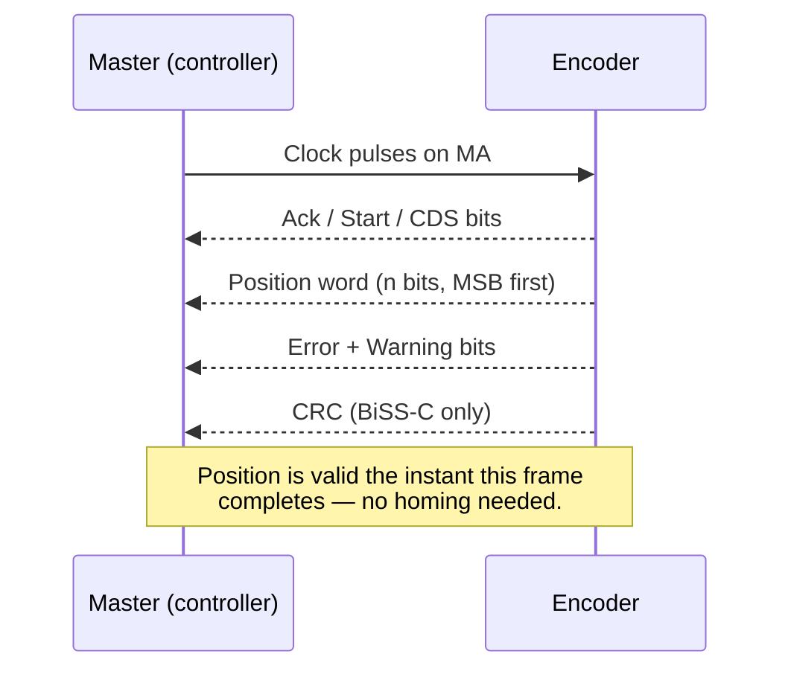
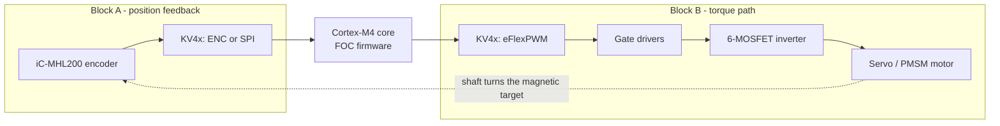
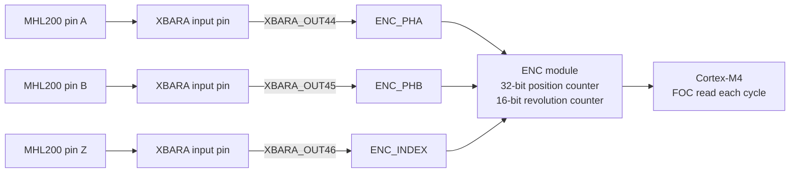
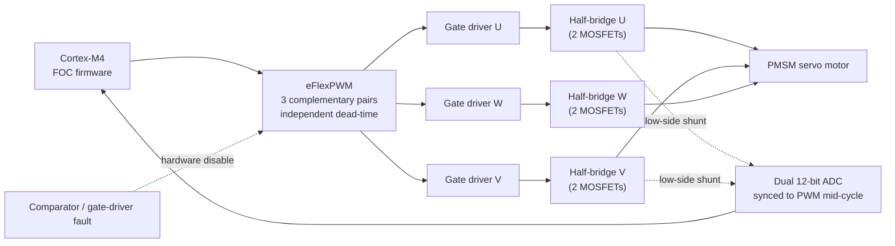

# Encoders for Servo Motors — Position Sensing & Resolution Math

> Version: 1.1 · Companion to `servo.md`
> Scope: what a rotary/linear position encoder actually does for a servo motor, the main encoder families, how a controller turns raw encoder signals into a usable position, and — the practical core of this document — how to calculate an encoder's resolution within one electrical/magnetic cycle and across a full mechanical revolution. §12 additionally grounds the whole loop on real motor-control silicon, showing how the encoder and the inverter both attach to one microcontroller.
> Grounding: general encoder theory (quadrature decoding, absolute serial protocols, interpolation) is standard industrial-encoder practice. All concrete numbers, register names, and worked examples are taken from one real part, the **iC-Haus iC-MHL200** 12-bit linear/rotary Hall encoder datasheet (Rev E1), used here as a fully worked, verifiable case study. §12's MCU-side numbers and peripheral names are taken from the **NXP/Freescale Kinetis KV4x Reference Manual** (Rev. 3.2), a Cortex-M4 MCU family built specifically for motor control. Where `servo.md` already covers a topic (FOC, pole pairs, electrical vs. mechanical angle, the inverter, the torque loop), this document cross-references it rather than repeating it.

---

## Table of Contents

1. [What an Encoder Does for a Servo](#1-what-an-encoder-does-for-a-servo)
2. [Encoder Types at a Glance](#2-encoder-types-at-a-glance)
3. [How Position Is Actually Measured](#3-how-position-is-actually-measured)
4. [Resolution — What the Word Means](#4-resolution--what-the-word-means)
5. [Finding the Resolution in One Cycle](#5-finding-the-resolution-in-one-cycle)
6. [Worked Example: the iC-MHL200](#6-worked-example-the-ic-mhl200)
7. [Speed vs. Resolution: the Trade-off](#7-speed-vs-resolution-the-trade-off)
8. [Resolution Is Not Accuracy](#8-resolution-is-not-accuracy)
9. [Choosing an Encoder for a Servo](#9-choosing-an-encoder-for-a-servo)
10. [Quick Reference Formulas](#10-quick-reference-formulas)
11. [Quick Glossary](#11-quick-glossary)
12. [System Integration on the KV4x MCU](#12-system-integration-on-the-kv4x-mcu)
13. [Sources](#13-sources)

---

## 1. What an Encoder Does for a Servo

A servo motor is only as good as its position feedback. As `servo.md` puts it, the encoder does double duty:

1. **Commutation** — Field-Oriented Control needs the rotor's *electrical* angle every control cycle to rotate measured currents into the correct reference frame (the Park transform). Get the angle wrong and the motor pushes in the wrong direction.
2. **Position output** — the same angle, unwrapped and scaled, is the "where is the shaft right now" value the rest of the system (a steering axis, a robot joint, a stage) actually cares about.

Everything below is about turning a physical signal — a changing magnetic field, a striped optical disc, a resistive wiper — into a trustworthy number for both of those jobs.


---

## 2. Encoder Types at a Glance

| Family | Sensing principle | Output | Boot behavior | Typical resolution driver |
|---|---|---|---|---|
| **Incremental quadrature** | Optical slots, magnetic stripes, or Hall pairs | A/B square waves, optional Z index | Needs homing/reference before absolute position is known | Physical line count × electronic interpolation |
| **Absolute serial (SSI / BiSS-C)** | Any of the above, digitized on-chip | Clocked-out binary/Gray word | Angle valid immediately at power-up, no homing | Bits in the transmitted word |
| **Sin/cos analog + interpolation** | Photodiode pair or Hall pair generating two sinusoids 90° apart | Analog VSIN/VCOS, or digitized ABZ/serial after on-chip interpolation | Depends on downstream digitizer | How finely the sine period is subdivided (interpolation factor) |
| **Discrete Hall sectors** | 3 digital Hall switches around the rotor | 6-state commutation pattern | Immediate, but coarse | Fixed — one state per 60° electrical, not user-adjustable |

The iC-MHL200 used as the worked example in this document is a **Hall-based sin/cos sensor with on-chip interpolation**, offered with either incremental quadrature (ABZ) *or* absolute serial (SSI/BiSS-C) output — so it is a convenient single part to illustrate every row in the table above except the fixed Hall-sector case.

> `servo.md` §5.2 covers the same comparison from the FOC/DD-wheel angle (absolute vs. incremental, why premium servo designs favor absolute). This document goes one level deeper into *how the number is produced* and *how fine it can be*.

---

## 3. How Position Is Actually Measured

### 3.1 Incremental (quadrature) counting

Two square waves, **A** and **B**, are generated 90° out of phase. A counter in the controller increments or decrements on every edge of either channel; the sign of the count comes from which channel leads. Because both channels contribute both their rising *and* falling edges, a decoder that uses all four edge combinations multiplies the raw line count by four — this is the **×4 quadrature decoding** referenced throughout §5.

An optional third channel, **Z** (the index), pulses once per mechanical revolution (or once per electrical cycle) and is used to re-zero the count and catch missed-edge drift.

```text
A: __┌‾┐__┌‾┐__┌‾┐__
B: ___┌‾┐__┌‾┐__┌‾┐_     (B lags A -> one direction; B leads A -> the other)
Z: __________┌┐__________  (one pulse per revolution / period)
```

The controller only ever knows a **relative** count from wherever it started; on power-up it must move (or otherwise locate the index) before the count means anything — the "homing" step `servo.md` flags as a concern for incremental encoders.

### 3.2 Absolute serial reading (SSI / BiSS-C)

Instead of counting edges, the controller clocks a fixed-width binary (or Gray-coded) word directly out of the sensor on a clock/data pair. On the iC-MHL200, this is the **MA** (clock) / **SLO** (data out) / **SLI** (data in, BiSS-C only) pins. The sequence is: master raises the clock, the sensor latches its current position, and the word — plus status/error bits and a CRC in the BiSS-C case — shifts out synchronously.



The practical payoff: the controller knows the angle **within the first frame after power-up**, which is exactly why `servo.md` calls absolute encoders the premium default for a servo that must be safe and correctly positioned from the first PWM cycle.

### 3.3 From raw counts to motor position: pole pairs and offset

Whichever method produces the raw angle, a servo controller still has to turn it into something FOC can use. `servo.md` §3 and §6 already cover this transform in detail (`electrical angle = mechanical angle × pole pairs`, plus a commissioned zero offset between the magnetic zero and the encoder's zero). This document's job is upstream of that step: producing the cleanest, finest-grained raw angle in the first place.

### 3.4 Getting position past one cycle (multiturn / long travel)

A sin/cos or quadrature encoder only ever resolves position **within one electrical cycle** — one magnetic or optical period. Beyond that, the signal repeats and looks identical to the previous cycle. Two common ways to recover the "which cycle am I in" information:

- **Motor-shaft (on-axis) case**: one mechanical revolution already equals a small, fixed number of electrical cycles (the pole-pair count), so a single absolute frame per cycle plus knowledge of the pole count is enough — this is exactly the case `servo.md` describes for FOC commutation.
- **Long linear travel or an off-axis / multi-pole target**: an additional coarse counter tracks how many full periods have been crossed (often a second output pulsing once per period, or a separate absolute stage), and true position is `period_count × period_length + fine_position_within_period`. The iC-MHL200's `CFGO = 11` output mode (§6.5 below) is a direct example of this pattern.

---

## 4. Resolution — What the Word Means

**Resolution** is the smallest position change the encoder can distinguish. It is *not* the same as accuracy (§8), and it can be expressed in several equivalent units:

| Unit | Meaning | Example |
|---|---|---|
| **Counts per cycle** | Distinguishable steps within one electrical/magnetic period | 4096 counts per period |
| **Bits** | `log2(counts)` — how the number is often marketed | 4096 counts = 12 bits |
| **Angle per count** (electrical) | `360° / counts per cycle` | 360°/4096 = 0.088° electrical |
| **Angle per count** (mechanical) | Electrical angle per count ÷ pole pairs (or periods) per revolution | depends on target geometry, §6.4 |
| **Linear distance per count** | `period length / counts per cycle` — for linear scales | 4 mm / 4096 = 0.977 µm |

The phrase "how many counts in one cycle" is therefore the foundation everything else (mechanical resolution, linear resolution, bit depth) is derived from — which is exactly §5.

---

## 5. Finding the Resolution in One Cycle

### 5.1 Incremental encoders with a fixed line count

If a vendor quotes **PPR** (pulses/lines per revolution or per cycle):

```
CPR (counts per cycle) = PPR × 4        (×4 from quadrature edge decoding)
angle per count          = 360° / CPR
```

### 5.2 Absolute encoders with a bit specification

If a vendor quotes **n bits**:

```
counts per cycle = 2^n
angle per count   = 360° / 2^n
```

### 5.3 Sin/cos encoders with on-chip interpolation (the general case)

This is the family the iC-MHL200 belongs to, and the most common one in modern servo sensors (magnetic or optical). The physical sensor produces one raw sine/cosine pair per period; a digital converter then subdivides that one period into a programmable number of steps — the **interpolation factor**:

```
counts per cycle = interpolation_factor × 4
angle per count (electrical) = 360° / (interpolation_factor × 4)
```

The ×4 appears here too because the interpolated output is still ultimately presented (or internally structured) as quadrature-style steps — one full sine period is split into four quadrants, each quadrant further subdivided by the interpolation factor.

### 5.4 From one cycle to one full mechanical revolution

If the target (magnetic tape, pole wheel, optical disc) repeats its pattern **N times per mechanical revolution** (N = pole-pair count for a rotary target, or "number of periods around the circumference"):

```
counts per revolution   = counts per cycle × N
angle per count (mech.) = 360° / (counts per cycle × N)
                         = angle per count (electrical) / N
```

For a purely linear stage, there is no "per revolution" step — position is simply `period_count × period_length + (fine count × distance per count)`, as in §3.4.

---

## 6. Worked Example: the iC-MHL200

All numbers below are taken directly from the datasheet's register map and electrical characteristics, so this section doubles as a template for reading any similar part's datasheet.

### 6.1 The physical cycle

The iC-MHL200 scans a magnetic target (tape or pole wheel) with a north/south pitch of 2 mm, giving a full electrical/magnetic **period of P = 4 mm**. One period is one full 360° electrical cycle regardless of whether the application is linear or rotary — this is the "one cycle" that §5.3's formula applies to.

### 6.2 Interpolation factor → counts per cycle

The **CFGRES** register (address `0x06`) programs the interpolation factor directly, from 1 up to 1024 (only binary values above 128):

| CFGRES value | Interpolation factor | Counts per cycle (`= factor × 4`) |
|---|---|---|
| `0x00` | 1 | 4 |
| `0x01` | 2 | 8 |
| `0x7F` | 128 | 512 |
| `0x80` | 256 | 1024 |
| `0x81` | 512 | 2048 |
| `0x82` | 1024 | **4096** |

At the maximum setting, `4096 = 2^12` counts per cycle — this is exactly where the datasheet's headline spec "**12-bit interpolation w. 4096 increments**" comes from: 12 bits is just `log2(4096)`.

### 6.3 Turning that into a linear resolution

Using §5.3/§5.4 directly:

```
distance per count = period / counts per cycle
                    = 4 mm / 4096
                    = 0.9766 µm
```

That is the arithmetic behind the datasheet's other headline claim, "**resolution better 1 µm**" — 0.977 µm actually clears that bar with margin.

### 6.4 Scaling up to a full rotary revolution

For an **off-axis rotary encoder** application (the part's magnetic period repeats N times around a pole wheel's circumference), apply §5.4. Using the datasheet's own commutation example of a **10-pole-pair** target:

```
counts per revolution   = 4096 × 10 = 40 960
angle per count (mech.) = 360° / 40 960 ≈ 0.0088°  (≈ 31.6 arcsec)
effective bit depth      = log2(40 960) ≈ 15.3 bits per revolution
```

Note that the encoder chip itself is still only "12-bit" — the extra resolution per revolution comes entirely from the target having 10 repeating magnetic periods, not from the chip. This is the general lesson: **advertised bit depth of an interpolating sensor describes one cycle, not one revolution** — always multiply by the target's period count to get the mechanical figure.

### 6.5 Recovering position beyond one period

Per §3.4, a magnetic-tape or multi-pole-wheel application needs a coarse period counter. The iC-MHL200's `CFGO = 11` output mode does exactly this: the U/V pins output one quadrature period **per full mechanical rotation**, intended to feed an external counter that tracks completed rotations, while A/B/Z continue to output the fine 4096-count position within the current period. Absolute position is then reconstructed as:

```
position = (rotation_count × counts_per_revolution) + fine_count_within_period
```

### 6.6 Reading it straight from an absolute frame

If the part is configured for **BiSS-C or SSI** instead of incremental ABZ, the same 12-bit (or fewer, for lower CFGRES settings) position value is simply clocked out as a binary/Gray word each frame (§3.2) — no external counter or edge-counting is needed for the within-cycle position, though the multiturn problem in §6.5 is unchanged if the application needs more than one period of absolute range.

---

## 7. Speed vs. Resolution: the Trade-off

Every incremental/interpolating output has a **maximum edge rate** it can physically produce. The iC-MHL200's `CFGMTD`/`CFGMTD2` register pair sets the minimum spacing between output edges on A, trading maximum edge rate for compatibility with slower external counters:

| CFGMTD2 | CFGMTD | Min. edge spacing | Max. frequency at A |
|---|---|---|---|
| 0 | 0 | 500 ns | 500 kHz *(default)* |
| 0 | 1 | 125 ns | 2 MHz |
| 1 | 0 | 8 µs | 31.25 kHz |
| 1 | 1 | 2 µs | 125 kHz |

Because every count in one cycle produces an edge, **higher resolution means more edges per revolution, which means the same edge-rate ceiling is reached at a lower rotational/linear speed.** Rearranging §5's relationship gives a practical speed ceiling:

```
max cycle frequency = max edge frequency at A / interpolation_factor
max linear speed     = max cycle frequency × period length
```

Checking this against the datasheet's own headline figures: at the highest resolution (interpolation factor 1024) and the fastest edge-rate setting (2 MHz), `2 MHz / 1024 ≈ 1.95 kHz` cycles/second, and `1.95 kHz × 4 mm ≈ 7.8 m/s` — matching (with the vendor's own rounding/margin) the quoted **"linear speed up to 8 m/s at full resolution."** This is the general shape of the trade-off for any interpolating encoder: **resolution and top speed are set by the same edge-rate budget and must be balanced against each other**, not chosen independently.

---

## 8. Resolution Is Not Accuracy

A servo designer should not read "4096 counts" as "position is correct to ±1/4096 of a period." Resolution says how *finely* the output can step; **accuracy** says how *close* those steps are to the true angle, and the two are governed by different datasheet parameters:

| Concept | What it captures | iC-MHL200 example |
|---|---|---|
| **Resolution** | Smallest representable step, set by interpolation factor | Up to 4096 counts / period (§6.2) |
| **Absolute accuracy** | Worst-case error of any single reading vs. true angle | ±0.35° electrical (typ., at 4 Vpp signal) |
| **Relative accuracy** | Edge-to-edge spacing consistency at a given resolution setting | ±10% of one A/B period at 10-bit resolution — i.e. edges land within a 40–60% window of where an ideal edge would fall |
| **Alignment tolerance** | Mechanical placement error the accuracy figures assume | e.g. ±0.2 mm lateral, ±3° rotational chip-to-magnet alignment |

The practical implication for `servo.md`'s FOC loop: cranking the resolution register to maximum does not automatically buy proportionally finer, cleaner torque texture — signal offset/gain calibration (`servo.md`'s "validated → calibrated → unwrapped" pipeline) and correct mechanical alignment matter just as much, and are what the accuracy figures — not the resolution figures — actually bound.

---

## 9. Choosing an Encoder for a Servo

| Question | Points toward |
|---|---|
| Must the controller know angle immediately at power-on, with no homing move? | Absolute serial (SSI/BiSS-C) |
| Is a simple, low-latency signal into an existing quadrature counter acceptable? | Incremental ABZ |
| Does the application need finer position steps than the mechanical target alone provides? | On-chip interpolation (sin/cos + interpolator), tune the interpolation factor per §5.3 |
| Is the mechanical target multi-pole (off-axis rotary, long linear scale)? | Add a coarse period/rotation counter (§3.4, §6.5) on top of the fine within-cycle output |
| Is top speed a hard requirement (e.g. 8 m/s linear tracking)? | Check the edge-rate budget (§7) *before* maximizing resolution — the two trade off directly |
| Does the servo need position, current-loop-grade accuracy, and status/CRC self-checking in one link? | BiSS-C, which carries position, error, and CRC bits in the same frame (§3.2) |

---

## 10. Quick Reference Formulas

```
Counts per cycle (line-count encoders):        CPR = PPR × 4
Counts per cycle (bit-spec absolute encoders):  CPR = 2^n
Counts per cycle (interpolating sin/cos):       CPR = interpolation_factor × 4

Angle per count, electrical:    360° / CPR
Angle per count, mechanical:    360° / (CPR × periods_per_revolution)
Linear distance per count:      period_length / CPR

Max cycle frequency:            max_edge_frequency / interpolation_factor
Max linear/rotational speed:    max_cycle_frequency × period_length
```

---

## 11. Quick Glossary

| Term | Meaning |
|---|---|
| **Cycle / period** | One full 360° electrical repetition of the sensor signal; may be much shorter than one mechanical revolution |
| **PPR / CPR** | Pulses (lines) per revolution vs. Counts per revolution (`CPR = PPR × 4` after quadrature decoding) |
| **Quadrature (A/B)** | Two square waves 90° apart; edge order gives direction, edge count gives position |
| **Index (Z)** | One pulse per revolution/period, used to re-zero an incremental count |
| **Interpolation factor** | How many digital sub-steps a sin/cos converter divides one analog period into |
| **Absolute encoder** | Reports true position immediately at power-up via a serial/parallel word — no homing |
| **Incremental encoder** | Reports relative motion only; needs a reference move or index pulse to become absolute |
| **SSI / BiSS-C** | Serial synchronous protocols for reading absolute position (BiSS-C adds CRC, status, and bidirectional configuration) |
| **Pole pairs** | Magnet pairs on a rotor/target; mechanical angle × pole pairs = electrical angle (see `servo.md` §3) |
| **Resolution** | Smallest representable position step |
| **Accuracy** | How close a reading is to the true position — independent of resolution |
| **Multiturn / period counting** | Tracking which cycle you're in, on top of the fine within-cycle position, for travel spanning more than one period |

---

## 12. System Integration on the KV4x MCU

Sections 1–11 covered the encoder in isolation. This section closes the loop by putting the iC-MHL200 and a three-phase inverter on the same real microcontroller — NXP/Freescale's **Kinetis KV4x**, a Cortex-M4 family whose peripheral set reads like a checklist for exactly the servo loop `servo.md` describes. It is the concrete answer to "what is the **motor MCU**" referenced in `servo.md` §8 (the fast, local core that owns encoder, current, and PWM, as opposed to the main MCU's USB/FFB/policy role).

Two system blocks make up that loop, and they map directly onto the two halves of the servo feedback diagram in `servo.md` §1:



### 12.1 The KV4x at a Glance

The KV4x family clocks its Cortex-M4 core up to 168 MHz and, unlike a general-purpose MCU, dedicates hardware to almost every block in the servo loop rather than leaving it to software:

| KV4x peripheral | Role in this system | Cross-reference |
|---|---|---|
| **ENC** (Quadrature Encoder/Decoder) | Free-running hardware quadrature counter — decodes the iC-MHL200's A/B/Z output with no CPU intervention | §12.2 below |
| **FTM1** (FlexTimer, quadrature mode) | A second, software-selectable quadrature decoder if ENC is committed elsewhere; also supports Hall-sensor speed capture | §12.2 below |
| **eFlexPWM (PWMA)**, 4 submodules | Generates the three complementary gate-drive pairs for the inverter, with independent dead-time per pair | §12.3 below |
| **Dual 12-bit Cyclic ADC** (ADCA/ADCB) | Simultaneous-sampling current feedback from the low-side shunts, synchronizable to the PWM counter | §12.3 below |
| **SPI (DSPI)** | General synchronous master (2 CTAR configs, up to 16-bit frames) — usable for the iC-MHL200's absolute BiSS-C/SSI output | §12.2 below |
| **XBARA / XBARB crossbar** | Internal signal router that connects ENC, PWM sync/fault, and ADC-trigger signals to pins or to each other | Both blocks |
| **GPIO** | Bit-bang fallback for protocol details the hardware engines above don't natively parse (e.g. BiSS-C's ACK/Start handshake) | §12.2 below |

Not every KV4x derivative populates all of these: the reference manual's own part-number table shows, for example, that the ENC- and FTM0/FTM3/FTM1-equipped derivatives (the MKV46/MKV44 line) differ from the FTM-only MKV42 line, which omits the eFlexPWM-NanoEdge column entirely. Confirm the exact peripheral list against the ordering table (Ch. 2.3) and the pinout (Ch. 11) for the specific part before finalizing a design.

### 12.2 System Block: KV4x + iC-MHL200 (Position Feedback)

Which KV4x peripheral reads the encoder depends on which MHL200 output mode is programmed (§3 above — incremental `CFGO` vs. absolute `ENSSI`).

**Option A — Incremental ABZ into the ENC module (the low-overhead default)**



The MHL200's A/B pair is exactly the "typical quadrature encoder" input the ENC module expects, and the ENC does the same ×4 edge decode described in §3.1 — but entirely in hardware, with a configurable digital input filter, so the core reads one position register per control-loop tick instead of servicing an interrupt on every edge. A few points carry over directly from earlier sections:

- **The ENC is never the speed bottleneck.** Its maximum count frequency is the IPBus clock rate — the reference manual's own worked example uses a 60 MHz IPBus clock for its velocity-resolution numbers — which is far above the iC-MHL200's own edge-rate ceiling (§7: 500 kHz to 2 MHz at pin A). The speed limit stays exactly where §7 puts it, at the encoder chip's driver setting, not at the MCU.
- **Z feeds ENC_INDEX (or ENC_HOME)**, giving the same once-per-period re-zero behavior §3.1 describes, plus a hardware-preloadable revolution counter. Because that revolution counter already tracks completed periods, it plays the same role as the coarse period counter §3.4/§6.5 assigns to the iC-MHL200's `CFGO = 11` output mode — a design should use one or the other, not both, to track "which cycle am I in."
- **A watchdog timer detects a stalled shaft** (ENC feature list) — a hardware-level version of the "stale encoder data → immediate inhibit" rule `servo.md` §8 requires, catching a non-rotating shaft even before firmware notices.
- **The ENC's timer-assisted mode also yields low-speed velocity** by timing the gap between phase edges rather than only counting them — useful at the low end of a servo's speed range, where a fixed control-loop-rate position difference alone is too coarse.
- **FTM1 quadrature mode is the fallback**: the KV4x's FlexTimer channels can independently be configured as a second quadrature decoder, useful if the ENC's inputs are needed elsewhere or a second sensor (e.g., a coarse rotation counter) is present.

**Option B — Absolute BiSS-C/SSI into the SPI module (software-framed)**

The KV4x's SPI (DSPI) is a general-purpose synchronous master — configurable clock polarity/phase and up to 16-bit frame size across two CTAR profiles — but it has no dedicated BiSS state machine, so the fit with the MHL200's serial interface (§3.2 above) is partial:

| MHL200 pin | KV4x connection | Fit |
|---|---|---|
| **MA** (clock, master out) | SPI_SCK | Direct — SPI is a clock master |
| **SLO** (data out from encoder) | SPI_SIN (MISO) | Direct — a shift-in of the position word |
| **SLI** (data in, BiSS-C config only) | SPI_SOUT (MOSI) or a bit-banged GPIO | Partial — BiSS-C's continuous-clock, bidirectional framing (Ack/Start/CDS handshake, §3.2) doesn't map onto SPI's chip-select-framed transfer model |

In practice: **SSI** mode is the easier fit, since it is just a fixed-width word clocked out on a free-running clock — one or two chained SPI transfers cover it. **BiSS-C** mode (with its Ack/Start bits, CRC, and bidirectional SLI configuration path) generally needs either a GPIO/FlexTimer bit-bang implementation (Ch. 47) that mirrors Figure 5's timing directly in firmware, or a vendor BiSS-master IP block if one is available — the general-purpose SPI hardware alone doesn't parse the handshake.

**Choosing between them**, using the same lens as §9 above: if the application only needs the angle every control cycle for FOC (`servo.md` §8's "encoder read... every control cycle" row), Option A (ENC) is simpler, lower-latency, and needs no software framing. Option B (BiSS-C via SPI/bit-bang) earns its extra complexity only when the design also wants the MHL200's absolute power-up angle, in-band CRC/error bits, and remote register configuration (§3.2, MHL200 datasheet "BiSS Interface" chapter, p. 26) — i.e., exactly the case `servo.md` §11 has in mind when it lists "a valid encoder" among the preconditions for enabling full torque.

### 12.3 System Block: KV4x + PWM + MOSFET Inverter + Servo Motor (Torque Path)

This is the KV4x-specific implementation of the inverter `servo.md` §4 describes in general terms.



The eFlexPWM (PWMA) module contains four identical submodules; three of them are assigned one each to the U/V/W half-bridges, with the fourth free for an auxiliary channel or an additional fault/sync function. Each submodule is built to drive one half-bridge power stage, and this is where several of `servo.md` §4's and §11's "hard rules" turn into concrete register features rather than firmware discipline alone:

- **Complementary-pair outputs with independent, per-pair dead-time insertion** are a native PWM submodule mode — this is the hardware backstop for `servo.md`'s "dead-time is mandatory" rule: the shoot-through gap is enforced by the timer, not only by careful firmware timing.
- **Up to four fault inputs per submodule**, routed through the XBARA/XBARB crossbar from an external overcurrent comparator or a gate-driver fault pin, can force PWM outputs to a safe state in hardware. This is the same "hardware protection is authoritative" principle in `servo.md` §11's fault-latch diagram (OCP / gate fault / E-stop / watchdog → an asynchronous, software-independent disable of the gate outputs) — on the KV4x it is literally the PWM fault-input mechanism.
- **PWM outputs default to their inactive state in Stop mode** and can optionally do so in Wait/Debug modes too — matching `servo.md` §11's invariant that the motor stays de-energized through resets, bootloaders, and any state where firmware isn't actively and correctly running.
- **The dual ADC (ADCA/ADCB) can synchronize its sampling to the PWM counter**, so the low-side shunt conversions land at the PWM mid-cycle "quiet point" `servo.md` §5.3/§7.1 requires (away from switching-edge noise) without a software-timed trigger — the KV4x's answer to the "the ADC is triggered at the quiet point... at the carrier peak" requirement.
- **The position feedback closes the loop here too**: the same ENC (or SPI-framed BiSS-C) angle from §12.2 is what the FOC firmware's Clarke/Park transform (`servo.md` §6) uses to know *which* electrical angle the PWM duty cycles should target on this cycle — the two system blocks are read and written inside the same fast loop, not two independent subsystems.

### 12.4 Why One Chip Can Own Both Blocks

Putting §12.2 and §12.3 side by side is the point of this section: a KV4x-class MCU is built so that the **entire fast loop** `servo.md` §8 describes — encoder read, current read, FOC math, and PWM update — happens on one core, in one deterministic interrupt, using dedicated peripherals for every I/O-heavy step instead of bit-banging them all in software. That is precisely the "motor MCU" role `servo.md` §8–§9 splits away from the main MCU's USB/FFB/policy work, and precisely why a part family marketed for "motor control" bundles an ENC, an eFlexPWM, and a synchronizable dual ADC on the same die rather than leaving a designer to assemble those functions from generic timers and a generic ADC.

One caveat worth repeating from §12.1: the pin/register names above (`ENC_PHA`, `XBARA_OUT44`, `PWM0_FAULT0`, etc.) are the KV4x family's actual signal names, useful as a concrete, checkable example — but exact crossbar routing and peripheral availability differ between KV4x derivatives (MKV46 vs. MKV44 vs. MKV42) and even between package pin counts of the same derivative, so a real design should confirm both against the specific part's signal-multiplexing table (Reference Manual Ch. 11) rather than assuming every KV4x variant wires identically.

---

## 13. Sources

- **Primary source for all iC-MHL200 concrete numbers, register names, and worked examples:** iC-Haus **iC-MHL200** datasheet, "12-Bit Linear/Rotary Position Hall Encoder," Rev E1 (2022) — features, block diagram, register map (`CFGRES`, `CFGMTD`/`CFGMTD2`, `CFGCOM`, `CFGZPOS`), electrical characteristics (items 102, 602–606), the incremental/BiSS output-mode figures, and the BiSS Interface chapter (p. 26–28).
- **Primary source for all KV4x concrete peripheral/register names in §12:** NXP/Freescale **Kinetis KV4x Reference Manual**, Rev. 3.2 (09/2015) — Ch. 2 (Module Functional Categories: ENC, eFlexPWM, dual ADC, SPI, timer modules), Ch. 37 (Pulse Width Modulator A / eFlexPWM), Ch. 41 (Quadrature Encoder/Decoder, ENC), Ch. 44 (Serial Peripheral Interface, SPI/DSPI), Ch. 47 (GPIO), and the Ch. 2.3 orderable-part-numbers table.
- **General encoder/quadrature-decoding and SSI/BiSS-C protocol concepts:** standard industrial motion-control practice, consistent with the vendor documentation above.
- **Cross-referenced companion document:** `servo.md` — motor construction, pole pairs, the inverter and dead-time rule, FOC's use of encoder angle, the current-sampling timing requirement, the main-MCU/motor-MCU split, and the hardware-fault-latch safety principle, all referenced directly in §12.

> Note on scope: §1–§11 explain the *sensing and resolution math* side of the encoder in vendor-agnostic terms; §12 is the one section that names a specific MCU family, and does so deliberately — to show that the architecture described throughout this document and `servo.md` is not just a diagram, but something that maps cleanly onto real, currently available motor-control silicon. The *controller* side proper — how the electrical angle feeds Clarke/Park transforms, alignment offset commissioning, and fault handling for a stale or implausible reading — remains covered in `servo.md` §3, §5.1, §7, §8, and §11, and is not repeated here.
