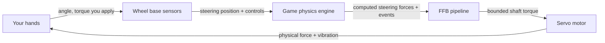
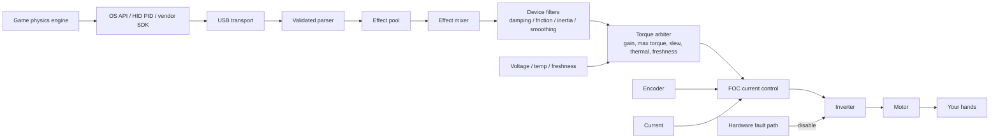
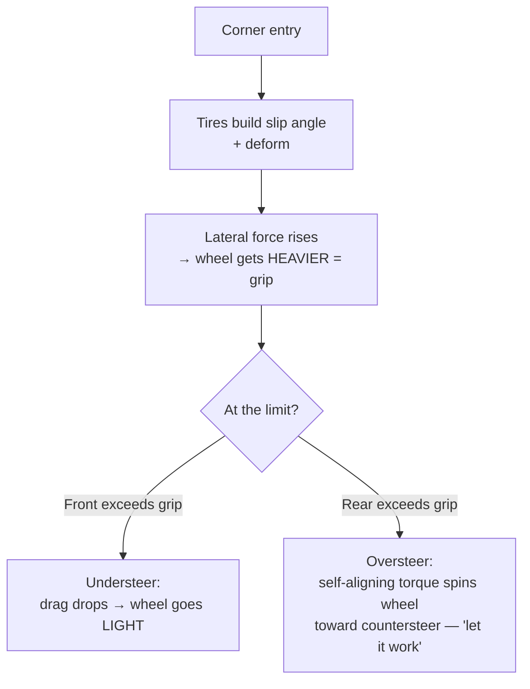
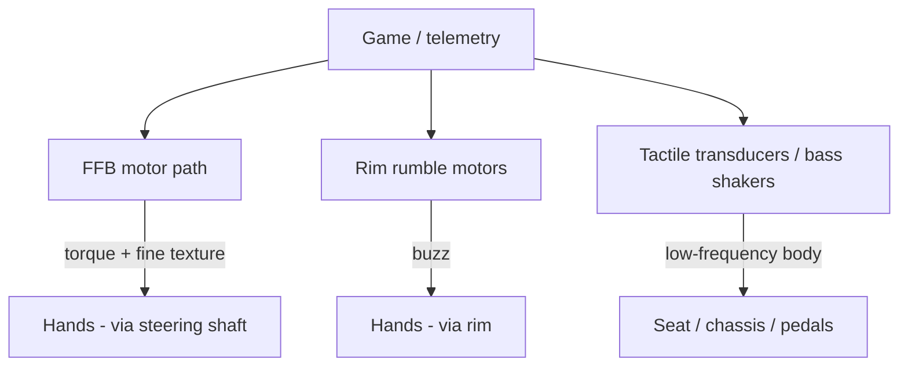
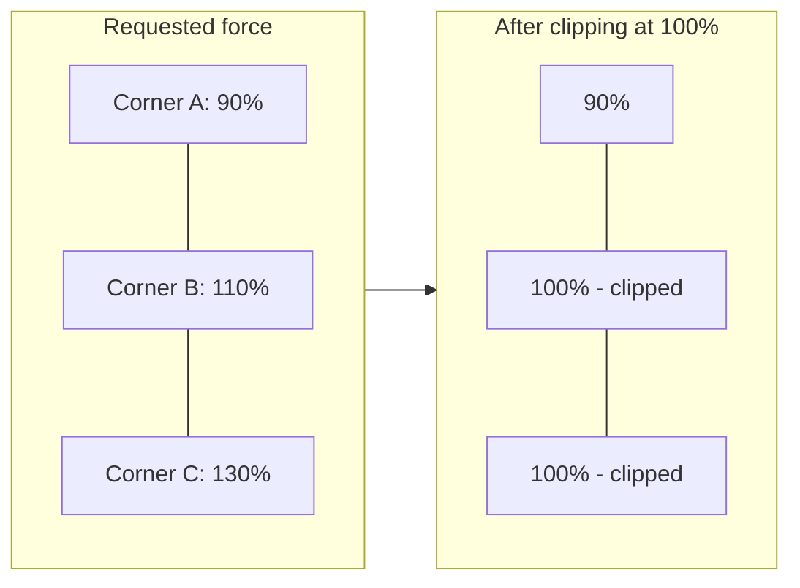
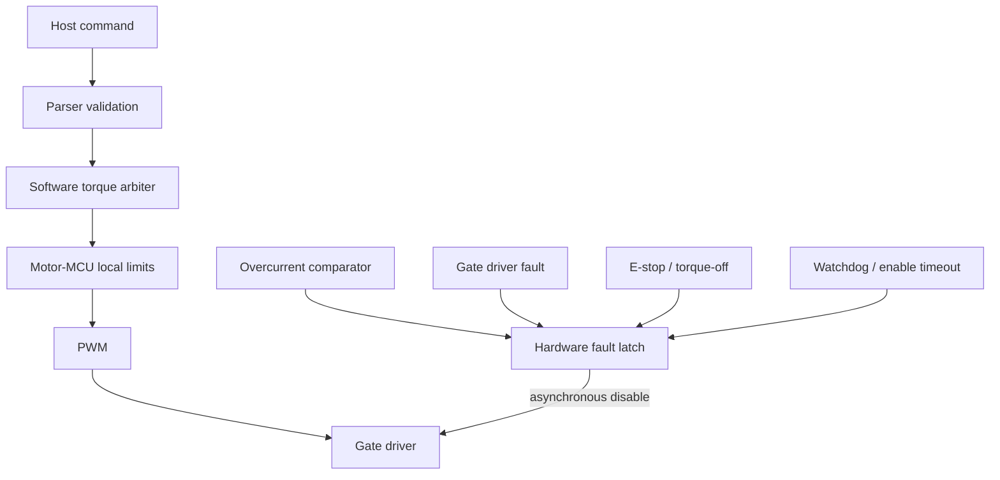

# Force Feedback (FFB) in Sim Racing — A Complete Explanation

> Version: 1.0 · Compiled: 2026-07-05
> Scope: how a sim‑racing steering system turns virtual physics into real forces on your hands — from the theory of force, through the servo motor and power electronics, to every category of force and vibration you can feel, and how it is tuned and kept safe.
> Grounding: this document is built on the accompanying study base (`wheel_base.md`, `sim_racing_research.md`, `tactile.md`, `telemetry.md`, `glossary.md`) and its original teaching illustrations, plus the *Inside Sim Racing Tech* explainer video. Product‑specific numbers (torque, latency, sensor resolution) are quoted as **manufacturer/advertised claims**, not independently verified measurements, consistent with the study base's evidence model.

---

## Table of Contents

1. [What Force Feedback Actually Is](#1-what-force-feedback-actually-is)
2. [The Theory of Force: Torque, and the Four Base Sensations](#2-the-theory-of-force-torque-and-the-four-base-sensations)
3. [The Servo Motor: How the Force Is Physically Made](#3-the-servo-motor-how-the-force-is-physically-made)
4. [Drive Types: Gear vs Belt vs Direct Drive](#4-drive-types-gear-vs-belt-vs-direct-drive)
5. [High‑Resolution Motor Technology: Torque, Latency, Fidelity](#5-high-resolution-motor-technology-torque-latency-fidelity)
6. [The FFB Signal Chain: From Game Physics to Your Hands](#6-the-ffb-signal-chain-from-game-physics-to-your-hands)
7. [What Your Hands Actually Feel](#7-what-your-hands-actually-feel)
8. [The Force‑Effect Taxonomy (HID PID)](#8-the-force-effect-taxonomy-hid-pid)
9. [Vibrations on the Hand vs. in the Seat](#9-vibrations-on-the-hand-vs-in-the-seat)
10. [Fidelity, Resolution, Latency, and Clipping](#10-fidelity-resolution-latency-and-clipping)
11. [Tuning FFB](#11-tuning-ffb)
12. [Safety and Limits](#12-safety-and-limits)
13. [Quick Glossary](#13-quick-glossary)
14. [Sources and Evidence Model](#14-sources-and-evidence-model)

---

## 1. What Force Feedback Actually Is

Force feedback is best understood not as a feature bolted onto a steering wheel, but as one half of a **closed, bidirectional human‑machine loop** that runs continuously while you drive.

Two things are happening at once, thousands of times per second:

- **Input (you → game):** the base measures exactly where the wheel is pointed and reports it, along with pedals and buttons, to the simulation.
- **Output (game → you):** the simulation calculates the forces that *would* be acting on a real steering rack and commands the motor to reproduce a scaled, safe version of them at the rim.

The definition matters because it sets expectations. Force feedback is *not* a rumble effect layered on top of a game; it is the physics of a virtual car projected onto a real motor. When the tires load up, the wheel gets heavy. When grip is lost, the wheel goes light. When you hit a kerb, you feel the impact. The quality of a system is measured by how faithfully and how quickly it closes that loop.

The study base states this precisely: *"Force feedback converts simulation‑defined physical effects into bounded shaft torque while returning steering position and controls to the simulation."* Everything else in this document is the machinery that makes that one sentence real.

---

## 2. The Theory of Force: Torque, and the Four Base Sensations

### 2.1 Torque is the currency of FFB

A steering wheel is a rotating object, so the relevant physical quantity is not *force* (newtons) but **torque** (newton‑metres, N·m) — a rotational force. Torque is the product of a tangential force and the radius at which it acts:

$$\tau = F \times r$$

This single relationship has a practical consequence people feel immediately: **for the same shaft torque, a larger‑diameter rim requires less hand force.** A 33 cm GT rim on a 10 N·m base feels heavier at the grips than a 30 cm rim on the same base, because your hands are at a shorter lever. Torque is the honest number; "how heavy it feels" also depends on rim size and grip position.

> **Language discipline (from the glossary):** *FFB strength* is a **setting** (often a percentage); *torque in N·m* is a **physical output**. They are related but not interchangeable. "Set FFB to 100%" and "the base produces 15 N·m" describe different things.

### 2.2 The four base sensations FFB synthesizes

Beyond the raw torque signal, almost everything a wheel does to your hands is built from a small set of physical behaviors. The study base defines the core four (plus one motor artifact):

| Sensation | Physical meaning | What it feels like at the wheel |
|---|---|---|
| **Torque** | Tangential force at a radius | The wheel actively pushing/pulling your hands |
| **Inertia** | Resistance to *angular acceleration* (effective mass) | The wheel feels "heavy" to start or stop turning |
| **Damping** | Resistance proportional to *velocity* | Movement is smoothed; fast flicks are resisted |
| **Friction** | Resistance opposing *motion*, including slow motion | A constant drag, like a stiff steering rack |
| **Cogging** *(artifact)* | Position‑dependent magnetic torque ripple in the motor itself | A faint notchiness as the wheel turns; a thing to *minimize*, not a driving cue |

These are the primitives. Grip, self‑aligning torque, kerbs, and weight transfer are all *expressed* through combinations of torque, inertia, damping, and friction — modulated in real time by the game's physics.

---

## 3. The Servo Motor: How the Force Is Physically Made

To feel anything, a real motor has to produce real torque. Modern direct‑drive bases use a **three‑phase PMSM** (Permanent‑Magnet Synchronous Motor, closely related to a BLDC motor): a wound steel **stator** surrounding a permanent‑magnet **rotor** that is coupled directly to the steering shaft.

### 3.1 Why you can't just apply DC

A PMSM cannot be driven from raw DC. It needs **three sinusoidal phase currents, offset 120° from one another**, which together create a *rotating magnetic field* in the stator. The permanent‑magnet rotor tries to follow that field — and the "effort" of following it, controlled precisely, *is* the torque you feel. Steer the field, and you steer the force.

### 3.2 The inverter: turning a DC bus into three phases

The component that synthesizes those three phases is the **inverter** — six power MOSFETs arranged as three **half‑bridges** (one per phase), fed from a fixed DC bus.

Each phase has a high‑side switch (to DC+) and a low‑side switch (to DC−). Rapidly switching them with **PWM** (Pulse‑Width Modulation) sets the *average* voltage on each phase; doing this on all three legs with the right timing produces the rotating field. Two hard rules fall out of this:

- **Dead‑time is mandatory.** The two switches in one leg must never be on together, or they short the DC bus (**shoot‑through**) and destroy the MOSFETs. Hardware enforces a brief both‑off gap on every transition.
- **Low‑side shunts measure current.** Small resistors in each low‑side leg let the controller read the actual phase current — the feedback the control loop needs to regulate torque.

### 3.3 Field‑Oriented Control (FOC): the heart of "feel"

The algorithm that makes a modern DD wheel feel clean rather than notchy is **Field‑Oriented Control**. FOC continuously reads the **rotor angle** (from the encoder) and the **phase currents** (from the shunts), then mathematically separates the current into two components:

- the part that produces useful **torque** (the *q‑axis* current, `Iq`), and
- the wasteful part that just pushes against the magnets (the *d‑axis*, driven toward zero).

The controller then commands exactly the torque current requested. The governing relationship is beautifully simple:

$$\tau \approx K_t \times I_q$$

Torque is (to first order) proportional to the torque‑producing current. **Want more force? Push more current. More current makes more heat** — which is why thermal management (§12) exists.

### 3.4 When the current is measured matters as much as the value

FOC only works if the current reading is clean, and the switching edges of the MOSFETs inject electrical noise. So the ADC (analog‑to‑digital converter) is triggered at the *quiet* point — the **middle of the PWM period**, away from the switching edges.

A triangular carrier is compared against each phase's duty command to generate the gate signal; sampling at the carrier peak (the middle of the on‑time) captures a clean average value. This "valid middle‑of‑PWM window" is a core timing requirement of any competent motor controller, and it runs *very* fast — the current/FOC loop typically executes at **10–40 kHz**.

### 3.5 The two sensors FOC depends on

| Sensor | Reads | Why FFB needs it |
|---|---|---|
| **Encoder** (absolute SPI/SSI/BiSS‑C, or ABZ / Sin‑Cos) | Rotor/shaft angle & speed | FOC must know rotor position to commutate correctly; it is also the steering angle reported to the game |
| **Current sensing** (shunts + amplifier + synchronized ADC) | Phase currents | Closes the torque loop: `τ ≈ Kt × Iq` requires knowing `Iq` |

Encoder **resolution** is the ceiling on how finely the wheel can *sense* position, and therefore how finely it can reproduce small forces — this is the "23‑bit / 8‑million‑points" claim discussed in §5.

---

## 4. Drive Types: Gear vs Belt vs Direct Drive

How the motor's torque reaches the rim decides how much detail survives the trip.

| Drive type | Cost | Mechanism | Characteristic artifact |
|---|---|---|---|
| **Gear‑driven** | Low | Motor drives rim through a gear reduction | **Backlash** — a small dead zone / notchiness on direction change |
| **Belt‑driven** | Mid | Motor drives rim through a belt | **Compliance / stretch** — the belt slightly absorbs and delays fast detail |
| **Direct‑drive (DD)** | High | Motor shaft *is* the steering shaft | **Lowest transmission error** — highest fidelity; also the highest torque and the greatest safety burden |

The reason direct drive dominates the high end is that every mechanical stage between the motor and your hands is a **filter** that blurs the signal. Gears add a dead zone; belts add stretch and lag. Removing the transmission removes the filter: with DD, the tiny high‑frequency textures the motor produces arrive at the rim essentially intact. That fidelity is exactly why DD systems must be treated as hazardous — there is nothing mechanical between an industrial‑grade motor and your wrists.

---

## 5. High‑Resolution Motor Technology: Torque, Latency, Fidelity

A direct‑drive base is not "a controller with stronger rumble." It is an industrial servo drive with precision sensing. Three specifications describe how convincing it can be: **how strong**, **how fast**, and **how detailed**.

### 5.1 Strength — peak vs holding torque (N·m)

More torque means a wider dynamic range: the wheel can be feather‑light in a slow hairpin and genuinely fight you in a high‑speed corner. But there is a subtlety the glossary insists on — **peak torque and holding torque are not the same number and are not directly comparable:**

| Metric | Meaning |
|---|---|
| **Peak torque** | Highest short‑duration torque under specified conditions |
| **Holding / sustained torque** | Torque maintained over time within thermal & electrical limits |

Representative advertised figures from the study base (as manufacturer claims, subject to change and firmware updates):

| Product (example) | Advertised torque | Note |
|---|---|---|
| Fanatec CSL DD | 5 N·m (8 N·m with Boost Kit) | Entry direct drive |
| Fanatec ClubSport DD / DD+ | 15 / 18 N·m holding (post firmware V1.4.2.3) | Raised in software, no hardware change |
| Fanatec Podium DD1 / DD2 | up to 20 / 25 N·m **peak** | Previous flagship generation |
| Fanatec Podium DD (2026) | 25 N·m holding; up to 33 N·m peak overshoot | Current flagship |
| VNM Direct Drive Xtreme (vendor claim) | 32 N·m | High‑output enthusiast base |

> Available torque is *also* capped by the attached steering wheel, quick release, firmware, and any Low‑Torque Mode — the motor's rating is a ceiling, not a guarantee.

### 5.2 Speed — latency

Realism collapses if the force arrives late. The wheel must respond to an in‑game event (kerb strike, snap of oversteer) with as little delay as possible so the cue reaches your hands essentially in lockstep with what you see. Vendors advertise very low figures — for example, **Simagic markets ~1 ms latency** on its Alpha line — which, if achieved end‑to‑end, means information reaches your hands almost instantaneously.

Latency is not a single number, though; it is **stage‑additive** across the whole chain (game physics tick → USB transport → FFB evaluation → motor loop). The useful engineering practice is to budget and measure each stage, not just the end‑to‑end figure. The study base lists typical rates: FOC loop 10–40 kHz, FFB/torque arbitration 0.5–2 kHz, USB at endpoint cadence.

### 5.3 Detail — fidelity and sensor resolution

Fidelity is the ability to reproduce *small* forces cleanly — engine idle vibration, the fine graining of a tire near its limit, the texture of coarse asphalt. It is gated by:

- **Encoder resolution.** The finer the angle sensor, the more distinct steps of position and force the system can resolve. Vendors quote large numbers here — e.g. a **23‑bit sensor advertised as reproducing over 8 million data points per rotation** (VNM). More bits = smaller quantization steps = smoother small‑signal detail (given a low‑noise signal). The same "more bits = finer steps" principle governs pedal ADCs:

  

- **Low transmission error** (direct drive, §4) so the detail is not filtered out mechanically.
- **A rigid cockpit** so the detail is not absorbed by a flexing frame (§9.3, illustrated below).

Put together: **strength gives dynamic range, low latency keeps it synchronized with the sim, and resolution + rigidity preserve the fine texture.** A convincing wheel needs all three; a big torque number alone does not buy realism — indeed the glossary warns that "more N·m does not automatically mean more detail or realism."

---

## 6. The FFB Signal Chain: From Game Physics to Your Hands

A single force starts as a number in the game engine and ends as current in the motor. The study base calls this "the FFB journey." Each stage has one job.

| Stage | Responsibility |
|---|---|
| **Game engine** | Computes the virtual steering forces and physics events every physics tick |
| **API / driver** | Expresses effects through the OS contract — DirectInput, **USB HID PID**, or a vendor SDK |
| **USB transport** | Delivers and validates the effect reports |
| **PID manager / effect pool** | Allocates effects and tracks their duration, envelope, conditions, and start/stop state |
| **FFB mixer** | Combines all active effects into one signal **without arithmetic overflow** |
| **Device filters** | Apply the user's configured damping / friction / inertia / smoothing |
| **Torque arbiter** | The single gatekeeper: applies gain, max torque, **slew‑rate**, thermal derating, enable state, and **freshness** limits |
| **Motor control (FOC)** | Converts the bounded torque request into phase current / PWM — it knows nothing about "effects," only current |
| **Power stage** | Produces the physical torque |
| **Safety** | Independently removes torque on a hardware fault, no matter what software wants |

Two design principles are worth internalizing:

- **The torque arbiter is the only software route to the motor.** No effect, however it's labelled, can bypass the final safety and power bounds.
- **Freshness is enforced.** If the host link goes stale (game crash, USB drop), the base runs a defined **torque decay and disable** policy rather than freezing at the last commanded force. Stale encoder/current data, by contrast, is treated as a critical fault and triggers immediate inhibit.

---

## 7. What Your Hands Actually Feel

This is the heart of the request: the catalog of sensations a good FFB system delivers, and the physics behind each. All of them are ultimately expressed through the torque/inertia/damping/friction primitives of §2, modulated in real time by the game.

### 7.1 Tire physics — the primary language of FFB

The steering wheel does not merely vibrate; it **rotates and creates drag** based on the interaction between the tires and the road. This is where most of the "information" lives.

**Grip and cornering load.** When you turn into a corner, the front tires build a **slip angle** and deform, generating lateral force. That force acts through the steering geometry and shows up at your hands as **increasing weight** — the wheel gets heavier the harder the tires are working. Reading that build‑up is how you find the limit by feel: you sense the tire loading up, approaching its peak, without looking at anything on screen.

**Loss of traction (understeer).** When the front tires exceed their grip and start to **understeer**, they can no longer generate the lateral force that was loading the wheel. The result is dramatic and instantly recognizable: the **drag on the steering suddenly drops and the wheel goes light.** That lightening is an early warning — you feel the car begin to lose the front *before* you see the nose wash wide. Adding more lock at that point does nothing, and the light wheel tells you so.

**Self‑aligning torque (SAT) and letting the wheel work.** In a real car, caster and pneumatic trail make the front wheels naturally try to **return to center** — this is self‑aligning torque. High‑end wheels reproduce SAT faithfully, which is what lets you *"let go" and let the car balance itself.* During a controlled slide (oversteer/drift), the SAT will actively spin the wheel toward the correct amount of counter‑steer; a good driver rides that self‑aligning force rather than fighting it, catching the slide with a light touch. When the rear steps out, you feel the wheel try to countersteer *for* you — follow it, don't resist it.

### 7.2 Suspension and weight transfer

The simulation calculates the load on each wheel in real time and folds it into the steering signal.

**Weight transfer changes wheel weight.** Under **hard braking**, load shifts forward onto the front tires; they grip harder and the **steering gets heavier.** Under **acceleration**, the front unloads and the **steering goes lighter.** These slow, large‑scale changes in wheel weight are your read on what the chassis is doing dynamically — they tell you when the front is planted and when it's floating.

**Road surface and impacts.** Every **kerb (rumble strip)**, pothole, expansion joint, and the transition from asphalt to grass or gravel comes through as vibration and jolts of torque. A kerb strike is a sharp, structured buzz; grass or a gravel trap is a coarse, chaotic rumble; a smooth track surface is quiet. This is layered *on top of* the tire and weight signals, so you feel the road texture through the steering load rather than instead of it.

### 7.3 Vibration and texture effects

Higher‑frequency content rides on the main force signal:

- **Engine / RPM vibration** — a periodic buzz that rises with revs; strongest with high‑resolution DD hardware that can reproduce fine, fast oscillations.
- **ABS pulsing and brake lockup** — the pedal/wheel feedback when a front wheel locks or ABS modulates.
- **Tire graining / scrub** — the fine "scrubbing" texture as a tire approaches or passes its grip limit.
- **Wheelspin** — a fluttery vibration when the driven wheels break traction.

Depending on the title, these are either **physics‑derived** (computed from the actual simulated contact patch) or **canned** (pre‑authored effects triggered by an event). Physics‑derived effects scale naturally with the situation; canned effects are more uniform. The glossary flags this distinction under *Road Effects*.

### 7.4 Condition effects (the "feel" primitives, as knobs)

The four base sensations from §2 also appear as *deliberately configurable* effects that shape the overall character of the wheel:

| Effect | What it does at the wheel | Tuning name (Fanatec) |
|---|---|---|
| **Spring** | Pulls the wheel toward a center point | SPR (scales game‑requested spring; not automatic centering) |
| **Damper** | Resists *speed* of movement — calms and stabilizes | Damping / NDP |
| **Friction** | Constant resistance to motion, even slow | NFR (Natural Friction) |
| **Inertia** | Adds simulated steering mass — useful with light rims | NIN (Natural Inertia) |

Used in moderation these add realism and stability; overused, they **mask detail** and add fatigue — too much friction or damping hides exactly the fine cues §7.1–7.3 are trying to deliver.

---

## 8. The Force‑Effect Taxonomy (HID PID)

Under the hood, the game does not send "understeer" or "kerb." It sends standardized **USB PID (Physical Interface Device)** effects that the base combines. Understanding the taxonomy explains what the FFB pipeline is actually mixing.

| PID effect class | Examples | Used to convey |
|---|---|---|
| **Constant force** | A steady torque of a given magnitude/direction | The main steering load — grip, weight transfer, SAT |
| **Periodic** | Sine, square, triangle, sawtooth vibrations | Engine buzz, kerbs, ABS, road texture |
| **Condition** | Spring, damper, inertia, friction | Centering and the "feel" primitives (§7.4) |
| **Ramp** | A force rising/falling linearly over time | Transitional effects |
| **Envelope** (modifier) | Attack/fade shaping on the above | Smooths how effects start and stop |

The **effect pool** allocates these; the **mixer** sums the active ones; the **arbiter** bounds the result. The realism of a title depends heavily on how intelligently it maps its physics onto these primitives — a great sim drives the *constant force* from a genuine tire model, while a weaker one leans on canned periodics.

---

## 9. Vibrations on the Hand vs. in the Seat

"Vibration you feel" in a sim rig comes from up to **three separate systems**, and conflating them is a common source of confusion. They must stay separate — both for fidelity and for safety.

### 9.1 The main FFB motor (hands, via the shaft)

The primary and highest‑fidelity path. On a good DD base this alone can reproduce engine vibration and road texture as *modulation of the main torque signal* — the fine, fast content described in §7.3. This is "vibration on the hand" in its truest form.

### 9.2 Rim rumble / shaker motors (hands, via the rim)

Some steering wheels contain small dedicated vibration motors, controlled by a **separate** strength setting (Fanatec's **SHO** — Shock/Vibration Strength). Crucially, **SHO controls those buzz motors, not the base's main FFB motor** — turning it up does not increase steering force, and it is a coarser effect than motor‑generated texture.

### 9.3 Tactile transducers / "bass shakers" (body, via the seat & frame)

These are a **distinct vibration subsystem**, fed from telemetry or a low‑frequency audio channel, that shake the *seat, panel, or frame* — engine rumble, kerb strikes, wheel lock felt through your body rather than your hands. The study base is emphatic: they **must be isolated so they do not corrupt FFB or sensor readings.**

A **crossover** keeps the shaker inside its low band (green) so its energy does not sum into the wheel's FFB detail band (purple) or drive a structural resonance of the rig (red). Mount transducers to the seat or a dedicated panel (not rigidly into the main FFB load path), use compliant mounts on the frame, and commission them independently before running alongside high‑torque FFB.

### 9.4 Why rigidity matters to *hand* feel

Even the best motor is undermined by a flexible cockpit, because a frame that flexes silently **absorbs** FFB torque and blurs the fine detail before it reaches your hands.

A stiff rig sends the motor's force into your hands; a flexible one dissipates part of it into frame deflection. This is the mechanical counterpart to §5.3: resolution creates the detail, and rigidity is what lets it survive to the rim.

---

## 10. Fidelity, Resolution, Latency, and Clipping

Three quantities determine how convincing the loop feels, plus one common failure mode.

- **Resolution** (§5.3): the smallest force/position step the system can represent. Higher = smoother small‑signal texture.
- **Latency** (§5.2): the delay from in‑game event to force at your hands. Lower = better synchronization with what you see. It is stage‑additive; budget each stage.
- **Dynamic range** (§5.1): the span from the lightest cue to peak torque. Wider = more expressive.

### Clipping — the most important failure mode to understand

**Clipping** occurs when the demanded torque exceeds the active limit, so **different large forces all collapse to the same maximum and detail is lost.** Imagine three distinct heavy corners that all get flattened to "100%": you can no longer tell them apart, and the wheel feels like an on/off wall instead of a living surface.

The fix is counter‑intuitive: **lower the in‑game gain** (or rebalance strength) so peaks sit just under the limit. That preserves the differences between forces — the detail — even though the absolute maximum is slightly lower. A common in‑game telemetry meter or the base LED helps you set gain so it only clips on the very biggest hits.

Two related tools:

- **Interpolation (INT)** smooths coarse or noisy game FFB; higher values reduce harshness but can slightly reduce immediacy.
- **Minimum Force** boosts weak on‑center forces so the very smallest cues are felt — but excess minimum force can cause on‑center **oscillation** on sensitive DD bases.

---

## 11. Tuning FFB

Good FFB is a negotiation between the game's output and the base's settings. The goal is to feel the most information with the least distortion, fatigue, and clipping.

**A sane starting procedure (from the study base's setup safety section):**

1. Mount the base rigidly; inspect QR, cables, PSU, and the torque‑off switch.
2. Calibrate steering center, steering range, and pedals. Match the hardware steering range to the in‑game range.
3. **Start at low torque with default filters.** Verify motor direction and that the torque‑off switch works before normal use.
4. Increase torque gradually, watching for **clipping, oscillation, and excessive heat.**

**Key settings and what they trade off:**

| Setting (abbrev.) | Effect | Watch out for |
|---|---|---|
| **Gain** (in‑game) | Overall FFB strength multiplier | Too high → clipping |
| **FF / FFB** (base) | Base maximum strength | Related to, but not the same as, N·m output |
| **FFS — LIN / PEA** | Linear vs peak response curve | LIN preserves proportionality, may reduce max output |
| **NDP / Damping** | Speed‑based resistance; stabilizes | Too much hides fast detail |
| **NFR — Natural Friction** | Constant resistance | Too much masks detail, adds fatigue |
| **NIN — Natural Inertia** | Simulated steering mass | Helpful with light rims; too much feels sluggish |
| **INT — Interpolation** | Smooths coarse FFB | Too much reduces immediacy |
| **FEI — Force Effect Intensity** | Sharpness/intensity of effects | Not the main torque limit |
| **Minimum Force** | Boosts weak center forces | Excess → on‑center oscillation on DD |

**The golden rules:** set in‑game gain so it only clips on the biggest hits; use damping/friction sparingly so they don't bury the tire and road cues; and remember that **more N·m is dynamic range, not automatically more realism.** A well‑tuned 8 N·m base can out‑communicate a badly clipped 20 N·m one.

---

## 12. Safety and Limits

A direct‑drive base is an industrial servo motor bolted to a wheel your wrists are on. The same power that makes it expressive makes it dangerous, so safety is not optional and the pipeline is designed to **fail with torque OFF.**

### 12.1 The layered safety model

The principle: **hardware protection is authoritative and independent of software.** An overcurrent comparator, a gate fault, an E‑stop press, or a watchdog timeout can drop the motor's power stage *without asking software's permission.* Software can request torque; only hardware gets the final word on removing it.

Key invariants from the study base:

- The motor stays **de‑energized** through reset, bootloader, updates, USB enumeration, incompatible‑rim detection, invalid sensor feedback, and brownout. USB being connected does **not** mean torque is enabled.
- **Stale host commands** decay to zero torque in bounded time; **stale encoder/current** triggers immediate inhibit.
- Enabling full torque requires verified firmware, a passed self‑test, calibrated sensors, a healthy power stage, an explicit policy, and no latched faults.

### 12.2 Thermal derating — torque and heat

Because `τ ≈ Kt × Iq`, torque needs current, and current makes heat. Rather than cutting out abruptly at a temperature limit, firmware **derates** — smoothly lowering the torque ceiling as the motor and inverter warm up — so the base stays usable and predictable instead of dying mid‑corner.

Below the derate‑start temperature the full ceiling is available; between derate‑start and shutdown the ceiling falls off; above shutdown, torque is removed. Recovery uses **hysteresis** — torque is only restored once the temperature drops well back below the derate point — so the system doesn't oscillate in and out of derating at the threshold.

### 12.3 Practical operator rules

Keep hands, hair, clothing, cables, and children clear of the rotating rim. Never bypass physical interlocks, torque limits, or firmware safety features. Use approved software and update procedures. And treat the "let go and let it self‑align" behavior of §7.1 as a *driving technique*, not an invitation to remove your hands from a live high‑torque wheel.

---

## 13. Quick Glossary

| Term | Meaning |
|---|---|
| **FFB** | Force Feedback — motor‑generated steering force based on game commands and base settings |
| **Torque / N·m** | Rotational force at the shaft; the honest measure of FFB output |
| **Peak vs Holding torque** | Short‑duration max vs sustainable max; not directly comparable |
| **DD (Direct Drive)** | Motor shaft drives the steering shaft directly — lowest transmission error |
| **PMSM / BLDC** | The three‑phase permanent‑magnet motor used in DD bases |
| **FOC** | Field‑Oriented Control — the algorithm regulating torque‑producing current |
| **Inverter / PWM / dead‑time** | Power stage that synthesizes three phases from DC; dead‑time prevents shoot‑through |
| **Encoder** | Angle sensor; its resolution caps FFB fine detail |
| **SAT** | Self‑Aligning Torque — the wheel's natural return‑to‑center; key to catching slides |
| **Understeer / Oversteer** | Front loses grip (wheel goes light) / rear loses grip (SAT countersteers) |
| **Clipping** | Forces above the limit collapse to max, losing detail; fix by lowering gain |
| **Slew rate** | Limit on how fast commanded torque may change |
| **Freshness / stale policy** | If the host link drops, torque decays and disables rather than freezing |
| **Tactile transducer / bass shaker** | Separate seat/frame vibration system, isolated from FFB |
| **SHO** | Shock/Vibration Strength — controls rim buzz motors, *not* the main FFB motor |
| **NDP / NFR / NIN / INT / FEI** | Damping / friction / inertia / interpolation / effect‑intensity tuning knobs |
| **Torque arbiter** | The single software gate that applies all final power and safety limits |
| **Derating** | Smoothly lowering the torque ceiling as the motor heats up |
| **E‑stop / torque‑off** | Hardware kill switch that removes motor power independent of software |

---

## 14. Sources and Evidence Model

This document synthesizes the accompanying study base and its original illustrations. Following that base's evidence discipline:

- **Verified public / standards:** USB HID & PID force‑feedback model; PMSM/FOC motor‑control principles; torque = F·r; `τ ≈ Kt·Iq`; three‑phase inversion and dead‑time.
- **Manufacturer / advertised claims (not independently verified here):** specific torque figures (CSL DD, ClubSport DD/DD+, Podium DD, VNM 32 N·m), latency figures (Simagic ~1 ms), and sensor‑resolution figures (23‑bit / 8‑million‑points). These describe vendor specifications and marketing; real‑world results depend on the full system, firmware, and game.
- **Engineering inference:** latency budgeting, tactile isolation, and tuning guidance.

Primary study files: `wheel_base.md` (motor control, FFB path, safety), `sim_racing_research.md` (ecosystem, FFB stages, drive types), `tactile.md` (tactile isolation), `telemetry.md` (latency budget), `glossary.md` (terminology and tuning). Illustrations are original teaching diagrams of general engineering principles, reused from the study base's `assets`.

Selected public references cited by the study base: [USB‑IF HID](https://www.usb.org/hid), [USB‑IF PID Class 1.0](https://www.usb.org/sites/default/files/documents/pid1_01.pdf), [Infineon PMSM FOC reference](https://documentation.infineon.com/aurixtc3xx/docs/kbv1711616051757), [TI sensored FOC](https://software-dl.ti.com/msp430/esd/MSPM0-SDK/2_04_00_06/docs/english/middleware/motor_control_pmsm_sensored_foc/doc_guide/doc_guide-srcs/Sensored_FOC_Motor_Control_Library.html), [Logitech TRUEFORCE](https://www.logitechg.com/en-za/innovation/trueforce.html), [Simucube FFB effects](https://docs.simucube.com/TunerSoftware/wheelbases/wheelbaseeffects.html), [OpenFFBoard wiki](https://github.com/Ultrawipf/OpenFFBoard/wiki/), [hid‑fanatecff](https://github.com/gotzl/hid-fanatecff).

> Note on scope: general internet browsing was not available in this environment, so live web sources beyond those already cited in the study base were not re‑fetched. Product specifications and firmware‑dependent torque figures change frequently — verify current numbers against the manufacturer's product pages before relying on them.
