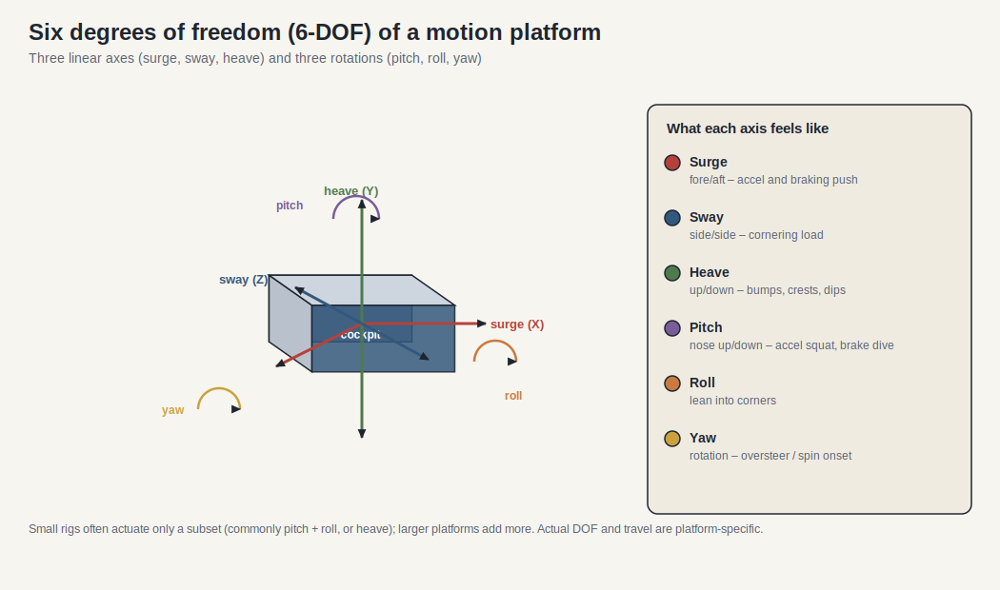
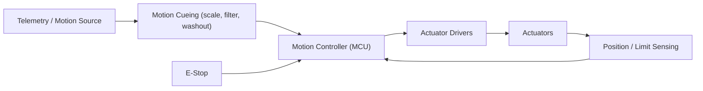

# Motion Platform Architecture

> Version: 1.0
> Reviewed: 2026-07-02
> Purpose: introduce motion platforms (motion cueing rigs) as a subsystem, at the architectural level. Answers part of the expansion question in [sim_racing_research.md](./sim_racing_research.md) §13.

## Document Change Log

| Version | Date | Changes |
|---|---|---|
| 1.0 | 2026-07-02 | New document. Architecture-level treatment grounded in the `VNM_MOTION_CONTROLLER` project from [repos.md](./repos.md) and the ecosystem safety model in [sim_racing_research.md](./sim_racing_research.md). |

## 1. Purpose

A motion platform physically moves the cockpit to cue the driver's vestibular system — conveying acceleration, braking, and road texture that a static rig cannot. This document defines architectural boundaries and, above all, the safety requirements; it does not specify a particular product's internals.

> [!IMPORTANT]
> Motion platforms move a person under power. Safety requirements in §6 are not optional and take precedence over fidelity.

## 2. Responsibilities

- Receive a motion source (telemetry-derived accelerations, or a game's motion output).
- Apply motion cueing (scaling, filtering, and washout) to fit real actuator travel.
- Command actuators within hard travel, velocity, and force limits.
- Detect faults and bring the platform to a safe state on any anomaly.

## 3. Degrees of Freedom (General)

As **verified public** general knowledge, hobby and prosumer platforms are commonly described by their actuated degrees of freedom: heave (vertical), pitch, roll, surge, sway, and yaw. Small platforms often actuate a subset (for example, pitch and roll); larger rigs add more. The exact DOF and geometry are platform-specific.

Each axis cues a different sensation: surge conveys acceleration and braking, sway conveys cornering load, heave conveys bumps and crests, while pitch (nose up/down), roll (leaning into corners), and yaw (rotation, e.g. the onset of a spin) are the three rotations. A cueing strategy chooses which of these a given platform can render and how strongly.

## 4. Controller Architecture

**Figure 4-1: Motion Control Path**

Community DIY controllers exist for this class of hardware: `VNM_MOTION_CONTROLLER` is documented as STM32F401RCT-based firmware and a configurator for building DIY hardware including motion rigs (see [repos.md](./repos.md)). This is **community implementation** evidence, not a reference design.

## 5. Motion Cueing (General)

Motion cueing maps large virtual accelerations onto small physical travel. As **engineering inference** from standard motion-simulation practice, a cueing stage scales the input, applies filtering, and uses a **washout** filter that returns actuators toward center after a sustained input so the platform does not hit its travel limit. Tuning trades cue strength against available travel.

## 6. Safety Requirements

These are mandatory and align with the safety posture in [sim_racing_research.md](./sim_racing_research.md) and [tools.md](./tools.md) (E-stop / fault-injection).

- A hardware **E-stop shall** be present and **shall** remove actuator power independently of firmware state.
- Hard limits on travel, velocity, and force **shall** be enforced and **shall not** be user-overridable into an unsafe range.
- Position/limit sensing **shall** be validated; loss of sensing **shall** drive a safe stop.
- On any fault (sensor loss, command timeout, out-of-range), the controller **shall** bring the platform to a defined safe state and latch until an authenticated reset.
- The system **shall not** implement bypasses of these interlocks. Full-energy motion testing **shall** follow the HIL/fault-injection gating in [tools.md](./tools.md) §5.

## 7. Communication Interfaces

The controller receives motion data from the telemetry pipeline (see [telemetry.md](./telemetry.md)) over USB/serial or network, and commands actuator drivers over the driver-specific interface (PWM, step/direction, or a motor-controller bus). Interfaces **shall** use bounded, length-checked messages with a command-timeout watchdog.

## 8. Debugging Strategy

Bring up against a current-limited supply and, where possible, without load; verify E-stop and limit handling *before* attaching to the cockpit; measure command-to-motion latency; and confirm washout keeps actuators off their end-stops under sustained input.

## 9. Firmware Perspective

The motion controller is a real-time actuator system with a person in the loop. It **shall** treat the motion source as untrusted, enforce limits in firmware independent of the source, and fail safe. Cueing quality is secondary to never exceeding a safe envelope.

## 10. Key Takeaways

- Motion platforms cue acceleration through bounded physical travel; cueing plus washout makes this possible.
- Safety (E-stop, hard limits, fault-driven safe stop) is mandatory and non-bypassable.
- DIY controllers exist (`VNM_MOTION_CONTROLLER`) as community evidence, not reference designs.
- The motion source arrives from the telemetry pipeline; treat it as untrusted.

## References

- [vnmsimulation/VNM_MOTION_CONTROLLER](https://github.com/vnmsimulation/VNM_MOTION_CONTROLLER) — DIY STM32-based motion/hardware controllers.
- [telemetry.md](./telemetry.md) — motion source pipeline.
- [tools.md](./tools.md) — HIL fixtures and fault-injection gating.
- [cockpits.md](./cockpits.md) — the structure a platform moves.

## Question Register (Resolved and Open)

Reviewed 2026-07-05.

### Resolved (as method / typical ranges)

- **Latency and safe-stop acceptance criteria — how to set them.**
  Motion cueing latency should be budgeted stage-additively (telemetry → cueing algorithm → actuator command → actuator response) and kept low enough that motion agrees with the visual/FFB cue rather than lagging it. Safe-stop is a **hard safety requirement**, not a tuning goal: the platform must have an independent E-stop and a bounded, controlled stop time with the actuators failing to a safe state — this mirrors the wheel base's hardware-inhibit principle (fail to a safe state, hardware authoritative over software). The *numeric* thresholds are product-specific and set from the chosen actuator class (2.2).

### Open — for developers to self-investigate

- **What DOF, actuator class, and travel limits will be in scope, and what are the numeric acceptance criteria for latency and safe-stop time on target hardware?**
  *How to investigate:* a scoping decision. Pick the DOF set (e.g. 2-DOF seat mover, 3-DOF, or 6-DOF Stewart platform — see the 6-DOF illustration) and actuator class (belt/servo vs. linear actuator) from the target experience and budget; those choices set travel limits, force, and speed. Then **measure** achieved end-to-end cueing latency and the controlled safe-stop time on the built platform and validate against the safety envelope before unsupervised use. Do not finalize acceptance numbers before actuator selection — they are meaningless without it.
