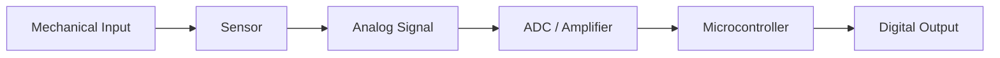
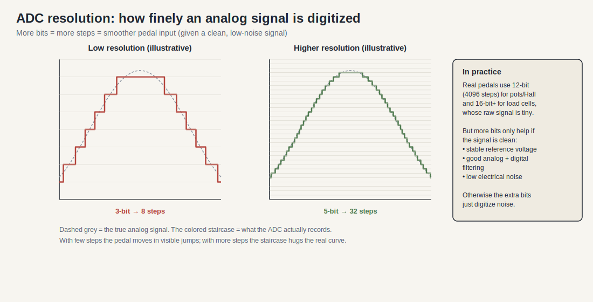
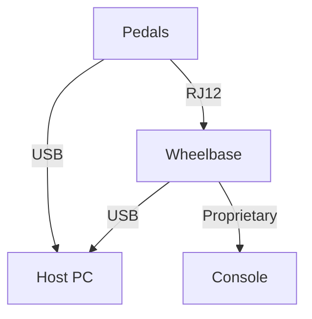

# Sim Racing Pedals Architecture

> Research date: 2026-07-02
> Evidence model: public standards, manufacturer manuals/support, and community projects. Community projects are implementation evidence, not official vendor specifications.  
> Related docs: [sim_racing_research.md](./sim_racing_research.md), [wheel_base.md](./wheel_base.md), [add_ons.md](./add_ons.md), [repos.md](./repos.md).

## 1. Introduction and Scope

This document provides a technical overview of the hardware and software architecture of modern sim racing pedals. It is designed to introduce the foundational concepts of sim racing peripherals to engineers while detailing the embedded systems that drive them. Readers should have a basic understanding of microcontrollers and analog signal processing before reading this specification.

This document describes the physical sensor technologies, the analog-to-digital signal chain, the communication protocols used to interface with a host system, and the software layer responsible for calibration and telemetry.

---

## 2. Sensor Technologies

This section details the physical sensors used to translate mechanical pedal movement into electrical signals. Understanding these sensors is critical for evaluating the durability, precision, and realistic feel of a pedal set.

### 2.1 Potentiometers

Potentiometers are contact-based rotary resistors that measure the pedal's travel distance (position). As the pedal is pressed, a mechanical wiper moves across a resistive track, producing a variable voltage output.

Read as a voltage divider, the output is simply `V_out = V+ × (wiper position / full track)`. This is cheap and trivial for an ADC to read, but the sliding contact is also the weakness: it wears, and worn tracks develop noise and dead spots. (The right-hand panel shows a rotary encoder for contrast — a contactless alternative used for steering-angle and rotor sensing rather than pedal travel.)

*   The system **shall** supply a stable reference voltage to the potentiometer.
*   Potentiometers are prone to mechanical wear over time, which introduces noise or "dead spots" into the signal.

### 2.2 Hall Effect Sensors

Hall Effect sensors are non-contact devices that measure changes in a magnetic field to determine pedal position. A magnet attached to the pedal arm moves relative to the sensor, altering the magnetic flux.

Because there is no physical contact between the magnet and the sensor, there is nothing to wear out. The trade-off is placement sensitivity: the magnet size, air gap, and alignment must be right, and calibration should keep the pedal's travel inside the sensor's linear range (the output saturates outside it, as the curve above shows).

*   Hall Effect implementations **shall** use a fixed magnetic reference to ensure repeatable position tracking.
*   Because they lack physical contact, Hall Effect sensors are highly durable and immune to the frictional wear associated with potentiometers.

### 2.3 Load Cells

Load cells measure the physical force (pressure) applied to the pedal rather than its position. They utilize strain gauges that deform under pressure, altering their electrical resistance and producing a microvolt-level differential signal. This mimics real-world hydraulic brake systems where pedal pressure dictates braking force.

The reason the raw signal is so small — and why an amplifier is non-negotiable — is visible in the bridge above. Four strain gauges are wired into a Wheatstone bridge, two in tension and two in compression, so applying force unbalances the bridge and produces a differential voltage. This arrangement doubles sensitivity and cancels temperature drift, but the output is still only microvolts to millivolts, so an instrumentation amplifier sits between the bridge and the ADC.

*   A load cell-based brake pedal **shall** be paired with an appropriate mechanical resistance medium (e.g., elastomers or springs) to provide physical feedback.
*   The raw signal from a load cell **shall** be amplified using an instrumentation amplifier before analog-to-digital conversion.

**Table 2-1: Sensor Technology Comparison**

| Sensor Type | Measurement | Contact Type | Durability | Typical Application |
|-------------|-------------|--------------|------------|---------------------|
| Potentiometer | Position | Contact | Low | Entry-level pedals |
| Hall Effect | Position | Non-contact | High | Throttle, Clutch |
| Load Cell | Force | Non-contact | High | Brake |

---

## 3. Hardware Architecture and Signal Chain

This section covers the electronic signal routing and processing required to digitize the analog sensor inputs.

The hardware signal chain converts the physical input into a digital value that can be processed by a microcontroller. High-end pedals require precise Analog-to-Digital Converters (ADCs) to ensure minimal noise and high sensitivity.

**Figure 3-1: Pedal Hardware Signal Chain**

### 3.1 Analog-to-Digital Conversion

The raw analog signals from the sensors must be digitized. The resolution of the ADC directly impacts the precision of the pedal input.

An ADC records the continuous analog signal as a series of discrete steps. More bits means more steps, so the recorded staircase hugs the true signal more closely and the pedal moves smoothly rather than in visible jumps. This is why a load cell — whose usable signal is tiny even after amplification — benefits from 16-bit or higher conversion, while position sensors are adequate at 12-bit. The important caveat is that extra bits only help if the analog signal is clean; without a stable reference and proper filtering, the additional bits simply digitize noise.

*   The system **shall** digitize the amplified load cell signal using a high-resolution ADC (e.g., HX711 or ADS1115).
*   The ADC resolution **should** be at least 12-bit for potentiometers and Hall Effect sensors, and 16-bit or higher for load cells.
*   The hardware **shall** implement low-pass filtering to mitigate high-frequency electrical noise before the ADC sampling phase.

---

## 4. Communication Interfaces

This section explains the two primary methods for connecting sim racing pedals to a host system: direct USB connection and RJ12 proxying via a wheelbase.

Pedals must transmit their digital state to the simulation software. The choice of interface impacts convenience, ecosystem compatibility, and sometimes the polling rate.

**Figure 4-1: Communication Topology**

### 4.1 USB (Direct to Host)

Connecting pedals directly to the host PC via USB allows the pedals to operate as an independent Human Interface Device (HID).

*   Polling/report rate, firmware-update path, and available calibration controls are product-specific.
*   Direct USB is a PC connection path. Fanatec accessories must connect through a Fanatec wheel base for console use.
*   Base CSL Pedals do not include standalone USB by themselves. The supported USB path requires a CSL Pedals Load Cell Kit or ClubSport USB Adapter.
*   Third-party USB pedals can operate independently on PC but cannot connect directly to a Fanatec wheel-base pedal port.

### 4.2 RJ12 Proxying (via Wheelbase)

Connecting the pedals to a wheelbase via an RJ12 cable allows the wheelbase to act as a proxy, translating the pedal signals into its own communication protocol.

*   The base aggregates the pedal axes into its host report and provides the required console path.
*   Supported load-cell pedals may expose Brake Force (BRF) adjustment through the base Tuning Menu.
*   Follow the exact pedal manual for USB/RJ12 selection. Do not assume simultaneous connection is permitted across all models.

**Table 4-1: Interface Comparison**

| Feature | USB | RJ12 (Wheelbase Proxy) |
|---------|-----|------------------------|
| Resolution/report rate | Product-specific | Product/base-specific |
| Platform | Supported PC path | PC and supported consoles through a compatible base |
| Tuning | Product software/App | Base/App behavior depends on pedal model |
| Firmware updates | Product-specific | Follow current manual/App workflow |

---

## 5. Software Architecture

This section describes the software logic responsible for processing the raw digital values and mapping them to standardized game inputs.

The embedded firmware and host PC software work in tandem to calibrate the pedals, apply custom curves, and provide haptic feedback.

### 5.1 Calibration and Filtering

*   The pedal firmware **shall** allow the user to define logical minimum (deadzone) and maximum (saturation) bounds for each axis.
*   The software **should** implement dynamic filtering (e.g., a moving average or Kalman filter) to smooth load cell jitter without introducing excessive latency.
*   The calibration parameters **shall** be stored in non-volatile memory on the pedal controller to ensure persistence across power cycles.

### 5.2 HID Mapping and Telemetry

*   The controller **shall** report the calibrated pedal values as standard HID joystick axes.
*   If equipped with haptic actuators (e.g., vibration motors), the software **may** read game telemetry (such as ABS activation or wheel slip) to trigger physical feedback through the pedal faces.

---

## 6. Repository Analysis

This section explores how community open-source projects approach pedal emulation and interface conversion.

### 6.1 `jssting/ArduinoTec-Pedals`

| Aspect | Finding |
|---|---|
| Goal | Replace CSP V1 pedal controller with standalone USB MCU |
| Controller | Leonardo, Pro Micro, or Teensy using ArduinoJoystickLibrary |
| Sensors | Existing linear Hall sensors; load cell through existing or external amplifier |
| Output | USB joystick axes; host calibration |
| Extra output | Pedal vibration motor via transistor/PWM |
| Product lesson | Pedals shall act as a separate sensor/USB node; load-cell AFE, analog Hall behavior, and actuator drive require distinct ownership. |

### 6.2 `GeekyDeaks/fanatec-pedal-emulator`

| Aspect | Finding |
|---|---|
| Goal | Proxy third-party USB pedals into a Fanatec wheelbase via RJ12 |
| Platform | Raspberry Pi Pico (RP2040) acting as USB host and RJ12 analog emulator |
| Motivation | Allows use of non-Fanatec pedals on consoles, bypassing console security |
| Product lesson | The wheelbase pedal port is an analog/digital interface (not USB), which can be spoofed by external DACs/PWM to proxy other devices. |

## 7. Question Register (Resolved and Open)

Reviewed 2026-07-05.

### 7.1 Resolved

- **What is the acceptable latency budget (ms) from physical pedal actuation to USB HID packet transmission for competitive e-sports?**
  **Engineering inference.** The dominant, controllable term is the report interval: a 1000 Hz (1 ms interval) HID device caps quantization latency at ~1 ms, versus ~8 ms at 125 Hz. A competitive target is therefore a **1 ms polling interval** plus a bounded sampling/filtering delay, keeping actuation-to-report comfortably under one game frame (≈16.7 ms at 60 Hz). Treat 1 ms as the *transport* budget and measure sensor + filter latency separately (see [`telemetry.md`](./telemetry.md) §6 for the stage-additive method); over-filtering (heavy averaging) is usually the real latency culprit, not USB.
- **Should the firmware support custom non-linear gamma curves on the MCU, or delegate to host software?**
  **Engineering inference: support both, MCU-first for portability.** An on-device curve (lookup table over the calibrated range) works everywhere including consoles and independent of host software, and is the safer default; a host-side curve offers richer, easier editing. The common pattern is: MCU applies calibration + an optional stored curve; host tooling edits and uploads that curve. Keep the raw axis available so the curve is never destructive.
- **Are there proprietary wheelbase protocols over RJ12 that require licensing or reverse-engineering for cross-compatibility?**
  **Community evidence (verify electrically).** The analog pedal path over RJ12 is simple and community-documented — e.g. GeekyDeaks' `fanatec-pedal-emulator` reports the CSL Elite pedal-to-base link as a plain **UART protocol** (CP2102, 5 V-tolerant) and publishes an RJ12 pinout (pin 1 = 3.3 V, pin 6 = GND, analog signal(s) between; wheelbase side carries RX/TX/Vcc). No licensing is needed for the *analog/serial* pedal path itself; what is licensed/proprietary is the **console authentication** the base performs upstream, which is a separate concern from the pedal link. Older CSL Elite LC modules use a PIC18F26J53. Confirm any pinout on your exact hardware before connecting.

### 7.2 Open — for developers to self-investigate

- **Exact per-model RJ12 electrical limits and pin assignments across the full product range.**
  *How:* the community pinout above covers selected models only; measure your target model's socket (reference voltages, signal ranges, current limits) before proxying third-party hardware, and never exceed the base's rail limits.

## 8. References

### 8.1 Official and Standards Sources

- [USB-IF HID specifications and tools](https://www.usb.org/hid) — HID descriptor and report model for standalone USB pedals.
- [Fanatec Podium DD1 manual](https://assets.fanatec.com/fanatec-pwa/image/upload/downloads-prod/pdfs/P-WB-DD1-Manual-EN_web.pdf) — public base-side update/calibration context and accessory integration constraints.
- [Fanatec Wheel Bases FAQ](https://help.fanatec.com/hc/en-us/articles/43766204938257-Wheel-Bases-A-FAQ) — console aggregation, PC standalone peripherals, and third-party pedal boundary.
- [Fanatec CSL Pedals direct USB guidance](https://help.fanatec.com/hc/en-us/articles/30312127196945-How-can-I-connect-CSL-Pedals-directly-to-a-PC-via-USB) — Load Cell Kit and ClubSport USB Adapter requirements.

### 8.2 Community Implementation Sources

- [jssting/ArduinoTec-Pedals](https://github.com/jssting/ArduinoTec-Pedals) — Arduino Leonardo/Pro Micro/Teensy replacement controller for older Fanatec ClubSport Pedals.
- [GeekyDeaks/fanatec-pedal-emulator](https://github.com/GeekyDeaks/fanatec-pedal-emulator) — USB-pedal proxying to Fanatec wheelbase via pedal-port emulation.
- [adamcrawley/fanatec-pedal-emulator-vrs](https://github.com/adamcrawley/fanatec-pedal-emulator-vrs) — VRS-focused fork of the pedal-emulator pattern.
- [FendtXerion3800/Fanatec-Pinout](https://github.com/FendtXerion3800/Fanatec-Pinout) — community pedal/shifter/handbrake connector observations; verify before hardware use.
- [Fanatec ecosystem source register](./references.md) — source confidence and currency notes.

### 8.3 Design Follow-Up

- Build a pedal compatibility matrix that separates direct USB HID behavior from wheelbase-port proxy behavior.
- Capture known electrical limits from approved manuals or bench measurement before connecting third-party hardware.
