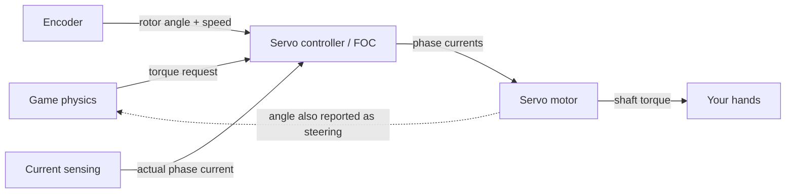
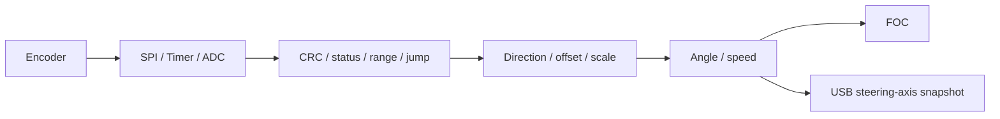
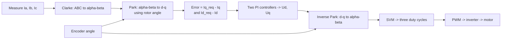
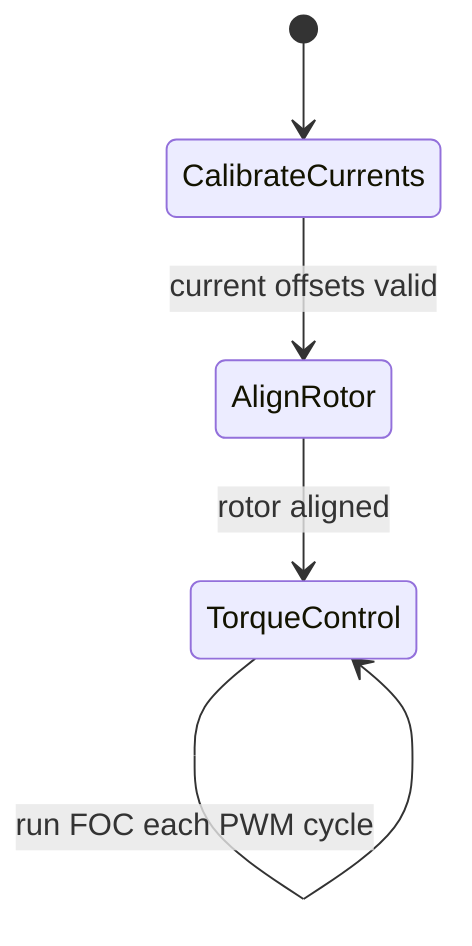
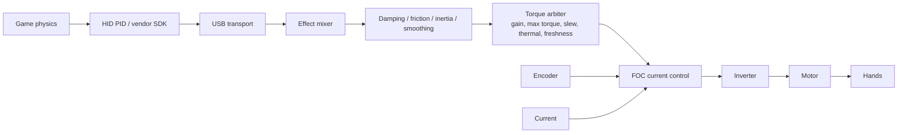
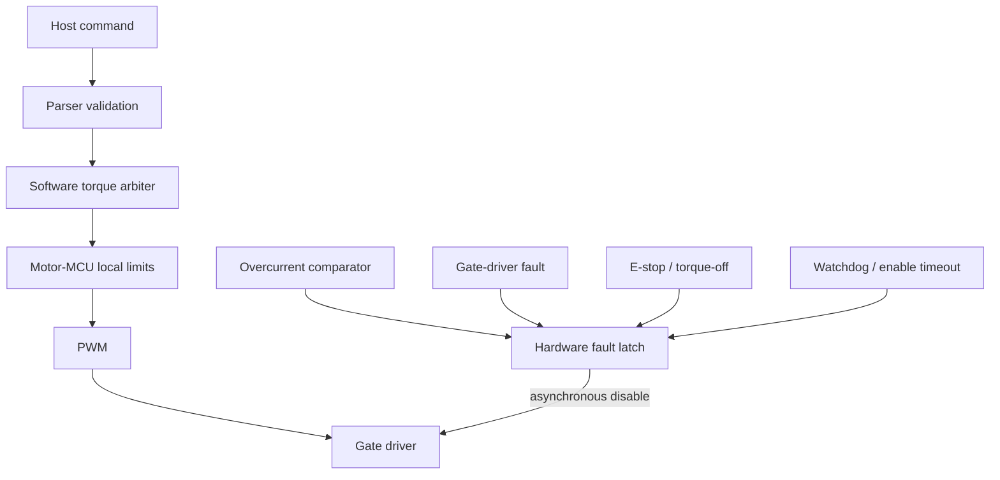

# The Servo Motor and Its Sensors in Sim Racing — A Deep Dive

> Version: 1.0 · Compiled: 2026-07-07
> Scope: the servo motor at the heart of a direct-drive sim-racing wheel base — how it is built, the sensors it depends on (position encoders, current sensing, temperature), and how it is actually controlled to turn a game's physics into torque at your hands.
> Grounding: this document is built on the accompanying study base (`wheel_base.md`, `force_feedback_explained.md`, `sim_racing_research.md`, `pedals.md`, `glossary.md`) and its original teaching illustrations. The control logic is explained with language-agnostic **pseudocode** that describes the standard field-oriented-control approach, not any one product's implementation. Product-specific numbers (torque, resolution, latency, pole count) are quoted as **manufacturer/advertised claims**, not independently verified measurements, consistent with the study base's evidence model.

---

## Table of Contents

1. [Why "Servo," and Where It Sits](#1-why-servo-and-where-it-sits)
2. [What a Servo Motor Is](#2-what-a-servo-motor-is)
3. [Inside the Motor: Construction](#3-inside-the-motor-construction)
4. [Making Torque: The Inverter and Three-Phase Drive](#4-making-torque-the-inverter-and-three-phase-drive)
5. [The Sensors a Servo Depends On](#5-the-sensors-a-servo-depends-on)
   - [5.1 Position/angle encoders](#51-positionangle-encoders)
   - [5.2 Encoder types compared](#52-encoder-types-compared)
   - [5.3 Current sensing](#53-current-sensing)
   - [5.4 Temperature and bus sensing](#54-temperature-and-bus-sensing)
6. [How the Servo Is Controlled: Field-Oriented Control](#6-how-the-servo-is-controlled-field-oriented-control)
7. [The FOC Control Loop in Pseudocode](#7-the-foc-control-loop-in-pseudocode)
8. [The Control-Loop Timing Budget](#8-the-control-loop-timing-budget)
9. [From Torque Request to Steering Feel](#9-from-torque-request-to-steering-feel)
10. [Resolution, Cogging, and Fidelity](#10-resolution-cogging-and-fidelity)
11. [Safety: A High-Torque Motor on Your Wrists](#11-safety-a-high-torque-motor-on-your-wrists)
12. [Servo vs. Other Sim-Racing Sensors (A Map)](#12-servo-vs-other-sim-racing-sensors-a-map)
13. [Quick Glossary](#13-quick-glossary)
14. [Open Questions for Developers to Self-Investigate](#14-open-questions-for-developers-to-self-investigate)
15. [Sources and Evidence Model](#15-sources-and-evidence-model)

---

## 1. Why "Servo," and Where It Sits

In sim racing the word **servo** is shorthand for the closed-loop motor system inside a direct-drive (DD) wheel base. A "servo" is not one part; it is a *motor + sensors + controller* operating as a feedback loop:

- a **motor** that produces torque,
- **sensors** that continuously measure what the motor is actually doing (angle, current, temperature), and
- a **controller** that compares the measured state to what is commanded and corrects it thousands of times per second.

That loop is exactly what makes a DD wheel feel like a car instead of a rumble pack. The study base states the base's job in one sentence: *"Force feedback converts simulation-defined physical effects into bounded shaft torque while returning steering position and controls to the simulation."* The servo is the machine that makes that sentence physical — it is both the **actuator** (torque out) and, through its encoder, the **primary sensor** (steering angle in).



The rest of this document walks that loop from the metal outward: the motor, the power stage, the sensors, and finally the control algorithm — with pseudocode to make it concrete.

---

## 2. What a Servo Motor Is

A sim-racing DD servo is a **three-phase Permanent-Magnet Synchronous Motor (PMSM)**, very closely related to a **BLDC** motor. The distinction people argue about is mostly the control style, not the hardware:

| Term | What it means here |
|---|---|
| **PMSM** | Permanent-magnet rotor, driven with *sinusoidal* currents for smooth torque. This is what a good DD base wants. |
| **BLDC** | The same class of magnet motor, historically driven with *trapezoidal* six-step commutation — simpler, but produces more torque ripple. |
| **"Servo"** | Any of the above run **closed-loop** with a position/current sensor and a controller, so commanded torque and actual torque agree. |

Two properties make a PMSM the right choice for steering feel:

- **Torque is (to first order) proportional to a single controllable current.** `τ ≈ Kt × Iq`. Ask for more torque, push more current. This is what lets the controller reproduce a smoothly varying steering load.
- **A direct-drive PMSM has no gearbox.** The motor shaft *is* the steering shaft, so there is no backlash or belt stretch between the magnetics and your hands (see the drive-type comparison in `force_feedback_explained.md`). Every stage of mechanical transmission is a filter that blurs detail; removing it is the whole point of DD.

The trade-off is that a large, low-cogging PMSM capable of 8–25 N·m is an *industrial* actuator. It is powerful enough to be dangerous, which is why so much of the design (§11) is about removing torque safely rather than producing it.

---

## 3. Inside the Motor: Construction


The cross-section above shows the pieces (illustrated as a simplified 12-slot / 8-pole machine; real pole counts vary and are a per-product value):

| Part | Role |
|---|---|
| **Stator** | The fixed, wound steel outer structure. Its slots hold the three-phase windings. Energizing them creates a controllable, *rotating* magnetic field. |
| **Windings (A/B/C)** | Three coil groups, electrically 120° apart. The currents you push through them set the direction and strength of the stator field. |
| **Air gap** | The small clearance between stator and rotor. Torque is produced across it; keeping it uniform is what keeps cogging low. |
| **Rotor** | The rotating part carrying **permanent magnets**. It tries to align with the stator field — the "effort" of chasing that field *is* the torque you feel. |
| **Shaft** | In a DD base, bolts (via the quick release) straight to the steering rim. No reduction stage. |

The number of magnet **pole pairs** matters for control: electrical angle = mechanical angle × pole pairs. A typical sim-racing PMSM might have on the order of five pole pairs, meaning one full mechanical turn of the shaft is five full electrical cycles. The controller must always work in *electrical* angle, which is why knowing the pole-pair count and the encoder's zero offset is non-negotiable (§5, §6).

---

## 4. Making Torque: The Inverter and Three-Phase Drive

A PMSM **cannot be driven from raw DC.** It needs three sinusoidal phase currents, offset 120° from one another, whose combined effect is a rotating magnetic field the rotor follows. The component that synthesizes those phases from the base's fixed DC bus is the **inverter**.


The inverter is six power MOSFETs arranged as three **half-bridges** (one per phase). Each phase has a high-side switch (to DC+) and a low-side switch (to DC−). Rapidly switching them with **PWM** sets the *average* voltage on each phase; doing this on all three legs with the right timing produces the rotating field. Two hard rules fall out of this and appear verbatim in real firmware requirements:

- **Dead-time is mandatory.** The two switches in one leg must never be on together, or they short the DC bus (**shoot-through**) and destroy the MOSFETs. Hardware enforces a brief both-off gap on every edge.
- **Low-side shunts measure current.** Small resistors in each low-side leg let the controller read actual phase current — the feedback the torque loop needs.

The last step in the chain that converts a desired voltage vector into the six gate signals is **Space-Vector Modulation (SVM)**. Conceptually it is a single operation at the end of the control cycle: it takes the requested α/β voltage and produces the three duty cycles the timer applies to the bridge. As a by-product it also identifies the active **SVM sector** — which of six 60° regions the voltage vector currently sits in — and that sector is used to decide *which* shunts can be read cleanly that cycle (more in §5.3).

---

## 5. The Sensors a Servo Depends On

A servo is only as good as what it can measure. FOC (§6) needs two feedback signals every control cycle — **rotor angle** and **phase current** — plus slower housekeeping signals for **temperature** and **bus voltage**.

| Sensor | Reads | Why the servo needs it |
|---|---|---|
| **Encoder** | Rotor/shaft angle & speed | FOC must know rotor position to commutate; the same angle is the steering position reported to the game |
| **Current sensing** (shunts + amp + synced ADC) | Phase currents | Closes the torque loop: `τ ≈ Kt × Iq` requires knowing `Iq` |
| **Temperature** (NTC / IC / model) | Motor & FET heat | Enables thermal derating instead of sudden cutout |
| **Bus voltage/current** | DC-link state | Brownout, overvoltage on regen, power plausibility |

### 5.1 Position/angle encoders

The **encoder** is the single most important sensor in the whole base, because it does double duty:

1. **Commutation:** FOC transforms currents into the rotor's reference frame using the measured electrical angle. A wrong angle means the motor pushes in the wrong direction — at best inefficient, at worst violent.
2. **Steering input:** the same angle, unwrapped over multiple turns and scaled to the configured steering range, is what the game reads as "where the wheel is pointed."


The illustration contrasts a **potentiometer** (a contact wiper on a resistive track — cheap, read as a simple voltage divider `V_out = V+ × wiper/track`, but it wears and gets noisy) with a **rotary encoder** (contactless, reporting an **A/B quadrature** pair whose phase order encodes direction). For a servo's rotor you want the contactless approach: no wear, high resolution, and — for the absolute types — a valid angle the instant you power on.

A key processing detail from the study base's sensor pipeline: the raw encoder reading is not trusted blindly. It is **validated → calibrated → unwrapped** before use:



A **stale or implausible encoder reading is treated as a critical motor fault** and triggers immediate torque inhibit — you cannot safely drive current into a motor whose rotor position you don't trust.

### 5.2 Encoder types compared

Different angle sensors trade off cost, boot behavior, resolution, and failure modes. The study base summarizes the practical picture:

| Encoder | Strength | Concern | Typical fit |
|---|---|---|---|
| **SPI / SSI / BiSS-C absolute** | Knows angle at boot; carries CRC/status | Interface timing, receiver design, multi-turn wrap | Premium DD steering (angle valid immediately, no homing) |
| **ABZ incremental** | Simple, low latency | Needs a reference/index pulse; can miss edges at speed | Cost-sensitive designs; needs an alignment/homing step |
| **Sin/Cos** | Very fine interpolation between poles | Analog offset/gain/phase errors need calibration | High-resolution feel, paired with good analog front-end |
| **Hall sectors** | Robust, cheap, coarse commutation | Too coarse alone for smooth premium steering | Startup commutation or low-cost BLDC, not fine FFB |

For steering feel, **absolute** encoders (SPI/SSI/BiSS-C) are the premium default: the wheel knows exactly where it is at power-on with no "wiggle to find zero" dance, and the CRC/status fields let the controller detect a bad read and fault safely. Vendors compete on **resolution** here — e.g. a 23-bit sensor advertised as reproducing over 8 million points per rotation (a manufacturer claim) — because resolution sets the ceiling on how finely small forces can be reproduced (§10).

> **Note on the rim's "rotary encoders."** The knobs on a steering rim are also called encoders (see `glossary.md`), but those are coarse *input* devices that report step up/step down — they are unrelated to the high-resolution **rotor** encoder discussed here. Same word, very different job.

### 5.3 Current sensing

Torque control is current control, so the servo must measure phase current accurately, and **when** it samples matters as much as the value.


The MOSFET switching edges inject electrical noise, so the ADC is triggered at the *quiet* point — the **middle of the PWM period**, at the carrier peak, away from the edges. A triangular carrier is compared against each phase's duty command to make the gate signal; sampling at the peak captures a clean average.

There is a subtlety unique to low-side shunt sensing: when a phase's duty cycle is very high, its low-side switch is barely on, so there is almost no window to read that shunt. The controller works around this using the **SVM sector** to decide which two phases to measure and reconstruct the third from Kirchhoff's current law (`Ia + Ib + Ic = 0`). In other words, the channel-to-phase mapping is chosen per sector so that only the two "readable" phases are sampled each cycle.

The signals and their sanity checks, from the study base:

| Signal | Acquisition | Checks |
|---|---|---|
| Phase currents | Shunt / CSA / synchronized ADC | Offset, gain, saturation, consistency |
| DC current | Shunt / Hall ADC | Overcurrent, power plausibility |
| DC voltage | Divider / isolated ADC | Brownout, nominal, regen overvoltage |

**Offset calibration first.** Before any torque, the controller measures each current channel with the bridge idle to learn its zero offset (op-amp/ADC bias). This is the very first thing a safe bring-up sequence does (§7). Skipping it would put a constant false current into the loop and bias every torque command.

### 5.4 Temperature and bus sensing

Because `τ ≈ Kt × Iq`, more torque means more current means more heat. Rather than cut out abruptly at a temperature limit, good firmware **derates** — smoothly lowering the torque ceiling as the motor and inverter warm up.


Below the derate-start temperature the full ceiling is available; between derate-start and shutdown the ceiling falls off; above shutdown, torque is removed. Recovery uses **hysteresis** so the system doesn't oscillate at the threshold. In practice this derating is computed on a slow (millisecond-rate) housekeeping task, deliberately separate from the fast current loop — it responds to a slow physical phenomenon (heat), so it does not need to run at kilohertz. The temperature itself is typically read from an NTC thermistor through a voltage divider whose calibration point is characterized in advance.

A **Hall-effect sensor** — contactless, magnet-based — is the usual choice for current or temperature-adjacent measurement where a contact sensor would wear or where isolation is wanted:


---

## 6. How the Servo Is Controlled: Field-Oriented Control

**Field-Oriented Control (FOC)** is the algorithm that makes a DD wheel feel clean instead of notchy. Its core idea is a change of reference frame. Instead of wrestling with three time-varying phase currents, FOC uses the measured rotor angle to rotate the problem into the *rotor's* frame, where the currents become two steady values:

- **`Id` (d-axis)** — the component aligned with the magnets. It produces no useful torque, only heat and demagnetization risk, so it is driven toward **zero**.
- **`Iq` (q-axis)** — the component 90° (electrical) to the magnets. This is the **torque-producing** current: `τ ≈ Kt × Iq`.

Control `Iq`, and you control torque directly and smoothly. The full cycle:



Step by step:

1. **Clarke transform** — collapse the three phase currents into a two-axis stationary frame (α/β).
2. **Park transform** — using the **encoder angle**, rotate α/β into the rotor's rotating d/q frame. *This is the step that fails without a correct angle.*
3. **Two PI controllers** — one drives `Id` to zero, one drives `Iq` to the requested torque current. Each outputs a voltage (`Ud`, `Uq`).
4. **Inverse Park** — rotate the voltage command back to the stationary α/β frame.
5. **SVM + PWM** — turn that voltage vector into three duty cycles and drive the inverter.

The current loop runs *fast* — typically **10–40 kHz** — because it must track the rotor and reject switching noise (§8).

---

## 7. The FOC Control Loop in Pseudocode

The description in §6 maps directly onto code. Below is the FOC current loop written as language-agnostic pseudocode — this is the standard structure a competent motor controller follows, not any one product. For force feedback it runs as a **current/torque controller** (the game commands a torque, not a target position), and it executes once per PWM cycle.

### 7.1 The per-cycle current loop

```text
# Runs every PWM period (typically 10–40 kHz), triggered at the
# quiet mid-PWM ADC sample point. Everything here must finish
# deterministically inside one period.

function foc_current_loop(iq_request):
    # --- 1. Read sensors ---
    (ia, ib, ic) = read_phase_currents()      # two measured, third by Ia+Ib+Ic=0
    theta_e      = read_electrical_angle()     # encoder angle × pole_pairs, offset-corrected
    (sin_t, cos_t) = (sin(theta_e), cos(theta_e))

    # --- 2. Clarke: 3-phase (abc) -> 2-axis stationary (alpha/beta) ---
    i_alpha = ia
    i_beta  = (ia + 2*ib) / sqrt(3)

    # --- 3. Park: stationary -> rotor frame (d/q), using the angle ---
    i_d =  i_alpha*cos_t + i_beta*sin_t
    i_q = -i_alpha*sin_t + i_beta*cos_t

    # optional: light smoothing of measured d/q currents
    i_d = filter(i_d);  i_q = filter(i_q)

    # --- 4. Two PI controllers ---
    # d-axis is driven to ZERO (no useful torque, only heat/demag)
    err_d = 0        - i_d
    err_q = iq_request - i_q

    u_d = pi_d.update(err_d)                    # PI with anti-windup (see 7.2)

    # voltage-circle limit: total vector must fit inside the DC bus,
    # so whatever d used is subtracted from q's budget.
    u_max   = available_bus_voltage()
    uq_lim  = sqrt(max(0, u_max^2 - u_d^2))
    u_q     = pi_q.update(err_q, limit = ±uq_lim)

    # --- 5. Inverse Park: rotor frame -> stationary (alpha/beta) ---
    u_alpha = u_d*cos_t - u_q*sin_t
    u_beta  = u_d*sin_t + u_q*cos_t

    # compensate for actual DC-bus voltage (ripple elimination)
    (u_alpha, u_beta) = scale_to_dc_bus(u_alpha, u_beta)

    # --- 6. SVM -> three duty cycles -> inverter ---
    (duty_a, duty_b, duty_c) = space_vector_modulation(u_alpha, u_beta)
    apply_pwm(duty_a, duty_b, duty_c)
```

Two design points are worth pulling out:

- **Anti-windup on the PI controllers.** When the wheel is held hard against a limit the controller output saturates. Without anti-windup the integrator keeps accumulating and then overshoots violently when the wheel is released. Anti-windup freezes or bleeds off the integrator while saturated.
- **Voltage-circle limiting.** The combined d/q voltage vector cannot exceed the DC-bus voltage, so the q-axis limit is derived from whatever the d-axis already used (`uq_lim = sqrt(u_max² − u_d²)`). This keeps the motor inside its physical envelope instead of clipping unpredictably.

### 7.2 A PI controller with anti-windup

```text
function pi.update(error, limit = ±out_max):
    proportional = Kp * error
    integrator  += Ki * error * Ts          # Ts = loop sample time
    output       = proportional + integrator

    if output > limit.high:                 # saturated high
        output = limit.high
        integrator -= (proportional + integrator) - limit.high   # anti-windup
    else if output < limit.low:             # saturated low
        output = limit.low
        integrator += limit.low - (proportional + integrator)    # anti-windup

    return output
```

The gains `Kp` and `Ki` are not guessed; they are derived from the target loop bandwidth (a few hundred Hz is typical), the loop sample time, and the motor's electrical parameters (resistance, inductance, torque constant `Kt`). Because a sim-racing PMSM is nearly symmetric (`Ld ≈ Lq`), the d-axis and q-axis controllers usually share the same gains.

> **Implementation note.** On a small MCU the fast loop is often written in **fixed-point** rather than floating-point, so it completes deterministically inside every PWM period. The math above is identical either way; only the number representation differs.

### 7.3 Rotor alignment (why the angle must be trusted first)

FOC's Park transform is meaningless without a correct electrical angle. If the encoder's zero offset relative to the magnets is not yet known, the controller performs an **alignment**: it forces the stator field to a *known* angle and pushes d-axis current, which physically drags the rotor into alignment with that field. Once the rotor has settled, the encoder reading at that instant defines the zero offset.

```text
function align_rotor(align_voltage, duration):
    set_known_angle(theta_e = 0)      # cos = 1, sin = 0
    request_d_current(align_voltage)  # pull rotor toward that field
    request_q_current(0)
    hold for duration                 # let the rotor settle
    encoder_offset = read_raw_encoder()   # this angle is now "zero"
```

### 7.4 The safe bring-up state machine

You never energize a servo for torque until the current sensors are zeroed and the rotor angle is trusted. That ordering *is* the safety design, not an afterthought:

```text
state CALIBRATE_CURRENTS:      # bridge idle: measure each channel's zero offset
    if current_offsets_valid -> ALIGN_ROTOR

state ALIGN_ROTOR:             # drive rotor to a known angle, capture encoder offset
    if rotor_aligned -> TORQUE_CONTROL

state TORQUE_CONTROL:          # run foc_current_loop() every PWM cycle
    accept bounded torque requests from the arbiter
```



---

## 8. The Control-Loop Timing Budget

A servo runs several loops at very different rates. Getting the rates and their nesting right is what separates a stable, quiet wheel from an oscillating one.

| Loop | Typical rate | Where it runs | If it's late / wrong |
|---|---|---|---|
| **Current / FOC loop** | 10–40 kHz | PWM/ADC interrupt or a dedicated motor core | Torque distortion, audible whine, or fault |
| **Encoder read** | Every control cycle (or a submultiple) | Timer/SPI DMA interrupt | Stale angle → wrong commutation → inhibit |
| **FFB / torque arbitration** | 0.5–2 kHz | Main firmware task | Coarse or laggy feel |
| **Thermal derating / housekeeping** | ~1 kHz or slower | Slow task | Slow to protect against heat — acceptable, it's a slow phenomenon |
| **USB host link** | USB endpoint cadence | USB stack | Stale command → torque decays to zero |

The nesting principle: **fast, local, deterministic loops close inside slow, remote ones.** The current loop must never wait on USB. This is also why premium bases split work across a **main MCU** (USB, FFB, profiles, safety policy) and a **motor MCU/ASIC** (encoder, current, PWM), with a single **torque arbiter** as the only bridge between them — timing faults in one domain can't corrupt the other.

Two freshness rules from the study base close the loop safely:

- A **stale host command** (game crash, USB drop) decays to zero torque in bounded time rather than freezing at the last value.
- **Stale encoder or current data** is a *critical* fault → immediate inhibit. You can coast a wheel to neutral; you cannot safely drive a motor blind.

---

## 9. From Torque Request to Steering Feel

The servo sits at the very end of a longer chain. It is worth seeing where it fits, because the servo "knows nothing about effects" — it only knows current.



The **torque arbiter** is the single software gate to the motor: it applies overall gain, the maximum-torque cap, slew-rate limiting, thermal derating, the enable state, and freshness checks — and only then hands a bounded torque request to the FOC loop. No "effect," however labeled, can bypass it. The servo's contribution is the final, faithful conversion of that one bounded number into force at your hands.

The physical sensations riders feel — the wheel getting heavy as the tires load, going light under understeer, the self-aligning torque catching a slide, kerb texture — are all just this torque signal varying in real time (see `force_feedback_explained.md`, §7). The servo doesn't interpret them; it renders them.

---

## 10. Resolution, Cogging, and Fidelity

Three servo-level properties decide how convincing the wheel is:

**Strength (dynamic range).** More peak torque means the wheel can be feather-light in a hairpin and genuinely fight you at speed. But peak and holding torque are different numbers and not directly comparable, and *more N·m does not automatically mean more detail* — a well-tuned 8 N·m base can out-communicate a badly clipped 20 N·m one.

**Resolution (fine detail).** How small a force/position step the system can represent. It is gated by encoder resolution:


More bits = smaller quantization steps = smoother small-signal texture (engine idle, tire graining), *given* a low-noise signal. The same "more bits = finer steps" idea governs pedal ADCs; for the servo it's the rotor encoder that sets the ceiling.

**Cogging (the artifact to minimize).** A permanent-magnet motor has a faint position-dependent torque ripple even with no drive — the rotor "prefers" certain angles relative to the stator teeth. Felt at the rim it's a subtle notchiness as you turn. It is a thing to *engineer out* (motor design, skew, and control compensation), not a driving cue. Good FOC plus a fine encoder keeps it below the threshold of feel.

Put together: **strength gives range, resolution + a rigid path preserve texture, and low cogging keeps the baseline clean.** All three are needed; a big torque number alone doesn't buy realism.

---

## 11. Safety: A High-Torque Motor on Your Wrists

A DD servo is an industrial actuator bolted to a wheel your wrists are on. The same power that makes it expressive makes it dangerous, so the entire design is arranged to **fail with torque OFF.**



The governing principle: **hardware protection is authoritative and independent of software.** An overcurrent comparator, a gate fault, an E-stop press, or a watchdog timeout can drop the power stage *without asking software's permission.* Software requests torque; only hardware gets the final word on removing it.

Invariants worth memorizing (from the study base, and reflected in any competent design's PWM-default-off and staged bring-up):

- The motor stays **de-energized** through reset, bootloader, updates, USB enumeration, incompatible-rim detection, invalid sensor feedback, and brownout. USB being connected does **not** mean torque is enabled. (The gate/PWM outputs default to off out of reset and are only enabled after every check passes.)
- Enabling full torque requires verified firmware, a passed self-test, **calibrated current sensors**, a **valid encoder**, a healthy power stage, an explicit policy, and no latched faults.
- **Thermal derating** (§5.4) lowers the ceiling smoothly rather than cutting out mid-corner.

Practical operator rules: keep hands, hair, clothing, and cables clear of the rotating rim; never bypass interlocks, torque limits, or firmware safety; treat "let the wheel self-align" as a *driving technique*, not permission to let go of a live high-torque wheel. Treat high-torque bring-up as hazardous until independent gate-disable and fault handling are verified electrically.

---

## 12. Servo vs. Other Sim-Racing Sensors (A Map)

It's easy to conflate the servo's sensors with the many *other* sensors in a rig. They are different subsystems with different jobs:

| Sensor | Where | Measures | Relationship to the servo |
|---|---|---|---|
| **Rotor/steering encoder** | Wheel base motor | Rotor angle & speed | **Core servo sensor** — commutation + steering input |
| **Phase-current shunts** | Wheel base inverter | Motor phase current | **Core servo sensor** — closes the torque loop |
| **Motor/FET temperature** | Wheel base | Heat | Servo housekeeping — drives derating |
| Pedal potentiometer / Hall | Pedals | Pedal travel | Separate input device (throttle/brake/clutch) |
| Load cell | Pedals / handbrake | Applied force | Separate input device; strain-gauge bridge |
| Rim rotary encoders / MPS | Steering rim | Knob steps | Coarse *inputs*, not the rotor encoder |
| Tactile transducers | Seat/frame | (actuators, not sensors) | A **separate** vibration system, isolated from FFB |

The confusion to avoid: the **rim's rotary encoders** and the **motor's rotor encoder** share a name but nothing else, and **tactile/bass-shaker** buzz (and the rim's `SHO`-controlled rumble motors) is a different path entirely from the servo's torque — turning up shaker/rumble strength never increases steering force.

---

## 13. Quick Glossary

| Term | Meaning |
|---|---|
| **Servo** | Motor + sensors + controller run as a closed loop so commanded and actual torque agree |
| **PMSM / BLDC** | The three-phase permanent-magnet motor used in DD bases |
| **Pole pairs** | Magnet pairs on the rotor; electrical angle = mechanical angle × pole pairs |
| **Inverter** | Six-MOSFET power stage that synthesizes three phases from the DC bus |
| **PWM / dead-time** | Pulse-width modulation sets phase voltage; dead-time prevents shoot-through |
| **SVM** | Space-Vector Modulation — turns a voltage vector into three duty cycles |
| **FOC** | Field-Oriented Control — regulates torque via the q-axis current |
| **Id / Iq** | Rotor-frame currents: d = flux (→0), q = torque (`τ ≈ Kt × Iq`) |
| **Clarke / Park** | Transforms: ABC→αβ, then αβ→dq using the encoder angle |
| **Anti-windup (pAW)** | PI feature that stops integrator buildup during saturation |
| **Voltage-circle limit** | `Uq_max = sqrt(Umax² − Ud²)`; keeps the voltage vector within the DC bus |
| **Encoder** | Rotor angle sensor; its resolution caps FFB fine detail |
| **Absolute vs incremental** | Absolute knows angle at boot (SPI/SSI/BiSS-C); incremental (ABZ) needs homing |
| **Cogging** | Position-dependent torque ripple of the motor; an artifact to minimize |
| **Kt** | Torque constant; N·m per amp of q-axis current |
| **Derating** | Smoothly lowering the torque ceiling as the motor heats up |
| **Torque arbiter** | The single software gate applying all final power/safety limits |
| **Freshness / stale policy** | Stale host → torque decays; stale encoder/current → immediate inhibit |
| **E-stop / torque-off** | Hardware kill that removes motor power independent of software |

---

## 14. Open Questions for Developers to Self-Investigate

Following the study base's discipline, these are the servo-specific items that require the actual motor spec or bench measurement rather than public inference:

- **Motor electrical/thermal parameters (Kt, R, L, thermal time constants).** *How:* obtain from the selected motor's datasheet; measure directly; characterize regeneration into the DC bus under fast reversals and size the clamp/brake resistor accordingly. The PI gains follow from these parameters plus the chosen loop bandwidth and sample time, so they must be re-derived for a different motor.
- **Encoder choice and interface.** *How:* choose absolute (SPI/SSI/BiSS-C) vs incremental against your resolution and boot-behavior targets; validate CRC/status handling, wrap, and timing electrically on a bring-up board before full power.
- **Current-sense topology and sampling window.** *How:* low-side vs in-line shunts vs Hall; confirm the valid mid-PWM sample window and per-sector channel mapping for your modulation scheme.
- **Pole-pair count and encoder zero offset.** *How:* confirm against the motor; verify the alignment routine lands the rotor at the electrical zero the encoder reports.
- **Cogging and torque-ripple budget.** *How:* measure open-loop cogging on the bench; decide whether motor design alone meets the feel target or compensation is needed.

---

## 15. Sources and Evidence Model

This document synthesizes the accompanying study base and its original illustrations, following the base's evidence discipline:

- **Verified public / standards:** PMSM/FOC control principles; Clarke/Park transforms; `τ ≈ Kt·Iq`; three-phase inversion, dead-time, and SVM; USB HID/PID force-feedback model; low-side shunt current sensing and mid-PWM sampling.
- **Control logic (pseudocode):** the Clarke/Park/PI/inverse-Park/SVM cycle, the calibrate→align→torque bring-up sequence, anti-windup PI, and voltage-circle limiting are presented as language-agnostic pseudocode describing the standard FOC approach. Any specific numbers (pole pairs, gains, loop rate) are illustrative and must be derived for the actual motor.
- **Manufacturer / advertised claims (not independently verified here):** specific torque figures, latency figures (e.g. ~1 ms), and sensor-resolution figures (e.g. 23-bit / 8-million-points). These describe vendor specs/marketing; real results depend on the full system, firmware, and game.
- **Engineering inference:** loop-rate nesting, timing budget, and safe bring-up ordering.

Primary study files: `wheel_base.md` (motor drive, sensors, safety, timing), `force_feedback_explained.md` (servo in the FFB chain, drive types, what hands feel), `sim_racing_research.md` (ecosystem, hardware block diagram), `pedals.md` / `wheel_rim.md` (potentiometer vs. encoder), `glossary.md` (terminology). Illustrations are original teaching diagrams of general engineering principles, reused from the study base's `assets`.

Selected public references cited by the study base: [USB-IF HID](https://www.usb.org/hid), [Infineon PMSM FOC reference](https://documentation.infineon.com/aurixtc3xx/docs/kbv1711616051757), [TI sensored FOC](https://software-dl.ti.com/msp430/esd/MSPM0-SDK/2_04_00_06/docs/english/middleware/motor_control_pmsm_sensored_foc/doc_guide/doc_guide-srcs/Sensored_FOC_Motor_Control_Library.html), [OpenFFBoard wiki](https://github.com/Ultrawipf/OpenFFBoard/wiki/), [hid-fanatecff](https://github.com/gotzl/hid-fanatecff).

> Note on scope: general internet browsing was not available in this environment, so live web sources beyond those already cited in the study base were not re-fetched. Motor specs and firmware-dependent figures change frequently — verify current numbers against the manufacturer's or motor vendor's datasheets before relying on them.
