# Modern Sim Racing Ecosystem: Embedded Knowledge Base

| Document | Version | Date | Target Audience |
|---|---|---|---|
| Modern Sim Racing Ecosystem: Embedded Knowledge Base | 1.4 | 2026-07-02 | Fresher/junior in the sim racing domain, mid level in embedded system |

> **Informative:**
> Scope: Public information and reference architectures only. No proprietary firmware reverse engineering. Evidence priority: standards bodies; manufacturer manuals/support; semiconductor references; public open implementations; patents. Brand-specific MCUs, buses, packet formats, control rates, and security mechanisms remain unknown unless public documentation explicitly identifies them.

## Document Change Log

| Version | Date | Changes |
|---|---|---|
| 1.0 | 2026-07-01 | Initial research draft. |
| 1.1 | 2026-07-01 | Restructured for pedagogical flow, applied normative language conventions, and updated diagrams. |
| 1.2 | 2026-07-01 | Merged foundational concepts, drive types, and setup safety from basic.md. |
| 1.3 | 2026-07-01 | Added developer reading path and explicit reference-link model for study docs. |
| 1.4 | 2026-07-02 | Added current Fanatec tiers, platform-license ownership, QR2 transition, connection-path guidance, and source currency notes. |

## System Architecture Navigation

This overarching document serves as the root of the sim racing knowledge base. For deep-dives into specific subsystems, refer to the following interconnected documents:

| Subsystem | Document | Primary Focus |
|---|---|---|
| **Wheel Base** | [`wheel_base.md`](./wheel_base.md) | Motor control, FFB stages, centralized USB hub |
| **Force Feedback (explainer)** | [`force_feedback_explained.md`](./force_feedback_explained.md) | Consolidated FFB explanation: force theory, servo motor, signal chain, felt forces/vibrations, fidelity, tuning, safety |
| **Steering Rim** | [`wheel_rim.md`](./wheel_rim.md) | Embedded wheel firmware, inputs, integrated displays, SPI |
| **Pedals** | [`pedals.md`](./pedals.md) | Load cells, ADCs, RJ12 proxying |
| **Add-Ons** | [`add_ons.md`](./add_ons.md) | Shifters (H-pattern/sequential) and handbrakes |
| **Accessories** | [`accessories.md`](./accessories.md) | Quick releases, standalone dashboards, button boxes |
| **Cockpits** | [`cockpits.md`](./cockpits.md) | Mechanical rigidity and structural components |
| **Tools** | [`tools.md`](./tools.md) | Standards, host tools, firmware tools, measurement, and validation |
| **Repositories** | [`repos.md`](./repos.md) | Public community implementation discovery and evidence limits |
| **Glossary** | [`glossary.md`](./glossary.md) | Customer terminology, compatibility labels, model families, and abbreviations |
| **Source Register** | [`references.md`](./references.md) | Ecosystem source classification, review dates, and known currency conflicts |

## Developer Reading Path

Use this path when onboarding an embedded developer:

1. Read this file for system ownership and safety vocabulary.
2. Read [wheel_base.md](./wheel_base.md) before any FFB, motor-control, update, or USB/PID work.
3. Read [wheel_rim.md](./wheel_rim.md) before any QR, display, LED, or wheel-button work.
4. Read [pedals.md](./pedals.md), [add_ons.md](./add_ons.md), and [accessories.md](./accessories.md) for peripheral input nodes.
5. Read [cockpits.md](./cockpits.md) before interpreting force, torque, or pedal-load test data.
6. Use [tools.md](./tools.md) and [repos.md](./repos.md) for validation references and public implementation examples.

---

## 1. System Overview

This section defines the scope and boundary of the sim racing ecosystem. It explains the high-level relationship between the host, the wheel base, and its peripherals.

A sim racing ecosystem is a bidirectional human-machine system. The system shall route steering and driver controls to the host. The wheel base shall accept haptic commands and produce bounded shaft torque. The system may aggregate all accessories through the wheel base, or it may support independent USB peripherals.

### 1.1. Components

The following table describes the primary components within the ecosystem and their typical firmware roles.

| Component | Purpose | Typical Interface | Firmware Role |
|---|---|---|---|
| PC | Game, driver, configuration, update | USB, network | Host driver/service and updater; open-source Linux kernel drivers (e.g., hid-fanatecff) exist for FFB support |
| Console | Controlled game/accessory platform | Licensed USB path | Approved integration; Xbox licensing is in a licensed wheel/hub, while PlayStation licensing is in a licensed base |
| Wheel base | Haptic actuator and system hub | USB plus internal/peripheral buses | HID/PID, FFB, motor control, safety |
| Steering wheel | Controls, indicators, and hub | QR contacts, wired/wireless vendor link, or USB depending on ecosystem | Scan, debounce, display, identity; an Xbox-licensed Fanatec wheel/hub can provide Xbox platform compatibility |
| Wheel rim | Bare mechanical hoop attached to hub | Mechanical bolting | None (Passive) |
| Quick release | Mechanical torque coupling; optional power/data | Contacts or wireless/inductive system | Presence, handshake, power sequencing |
| Motor | Physical torque generation | Three-phase inverter | Current/torque control and protection |
| Encoder | Shaft/rotor angle | SPI, SSI, BiSS-C, ABZ, Sin/Cos | Acquisition, validity, calibration |
| Pedals | Throttle, brake, clutch | Base port (e.g., RJ12) or USB | ADC, filter, calibration, reports; can be proxied through base for console support |
| Shifter | Gear or sequential events | Base port (e.g., RJ12) or USB | Classification and debounce |
| Handbrake | Continuous braking input | Base port (e.g., RJ12) or USB | ADC, calibration, report |
| Dashboard | Telemetry/status display | USB, serial, Ethernet/Wi-Fi | Rendering and link watchdog |
| Button box | Auxiliary controls | USB HID | Matrix/encoder scan |
| Load cell | Force-to-signal transducer | Amplifier and ADC | Tare, span, filtering, diagnostics |
| Power supply | Isolated DC source | DC connector | Base monitors bus state |
| Cockpits | Structural mounting chassis | Mechanical | Passive rigid body |

**Figure 1-1: System Ecosystem Overview**

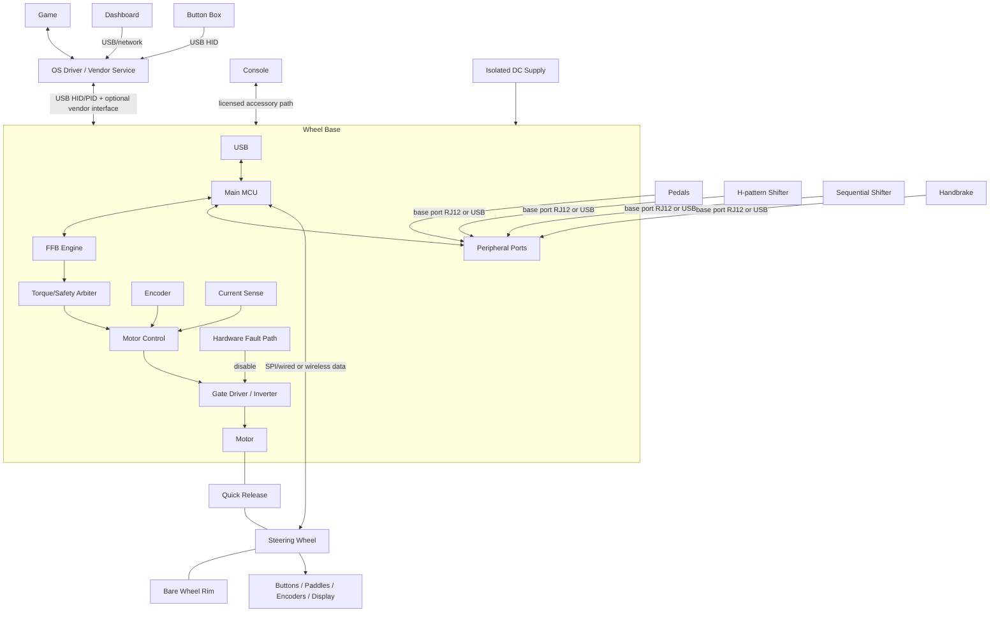

### 1.2. Fanatec Ecosystem as a Public Example

Fanatec's public ecosystem is highly modular, designed so users can mix and match components (wheel bases, steering wheels, pedals) and upgrade incrementally. Products broadly use three tiers:
- **CSL (ClubSport Light)**: The entry-level, budget-friendly tier, typically using plastic and basic metal components.
- **ClubSport**: The mid-range enthusiast tier, utilizing premium materials like aluminum and carbon fiber with more advanced electronics.
- **Podium**: The flagship, professional-grade tier, designed for maximum torque, durability, and customization using industrial-grade materials.

Tier labels help navigation but do not prove that two products are electrically, mechanically, or platform compatible.

The wheel base is the central system hub for a console setup. Compatible pedals, shifters, and handbrakes connect to the base, which exposes one licensed USB path to the console. On PC, supported peripherals may instead operate as independent USB devices. A Ready2Race bundle is a purchasing package, not a new interface standard.

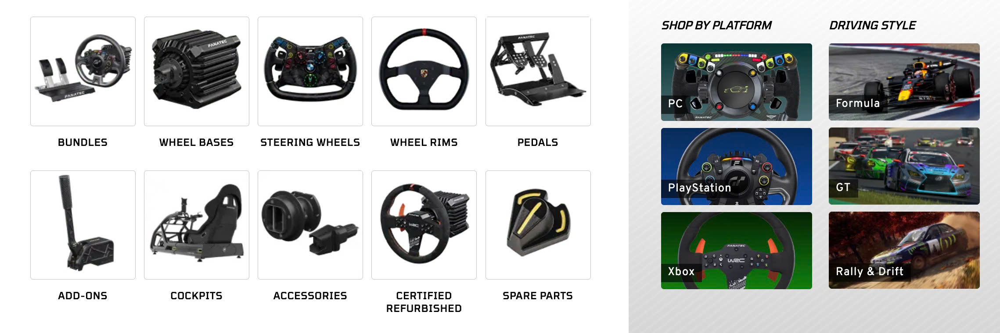

| Platform | Fanatec License Location | Practical Rule |
|---|---|---|
| Windows PC | No console security chip required | Verify Windows version, game support, driver/App, and each device's connection path. |
| Xbox | Xbox-licensed steering wheel or hub | The licensed wheel/hub enables the compatible base and base-connected peripherals on Xbox. |
| PlayStation | PlayStation-licensed wheel base | Compatible wheels and base-connected peripherals inherit PlayStation support through that base. |

*Note: Combining a PlayStation-licensed wheel base with an Xbox-licensed steering wheel typically creates a cross-compatible setup that works on PlayStation, Xbox, and PC.*

As of 2026-02-16, Fanatec states that wheels and bases purchased through its store use QR2 by default and that QR1 is discontinued. Legacy QR1 hardware remains relevant, but Base-Side and Wheel-Side generations must match and upgrade support is model-specific.

### 1.3. Drive Types

Sim racing wheel bases are generally categorized by their mechanical torque delivery systems:

- **Gear-driven bases:** Low-cost mechanism but introduces mechanical backlash.
- **Belt-driven bases:** Provides smoother delivery but introduces mechanical compliance/stretch.
- **Direct-drive bases:** The motor shaft connects directly to the steering rim. Offers the lowest transmission error and demands the highest torque and safety considerations.

### 1.4. Firmware Boundaries

Firmware shall establish independent ownership boundaries for connectors, power domains, USB descriptors, platform modes, and torque limits. Firmware shall verify identity, routing, timing, calibration, and update compatibility before enabling operation.

### 1.5. Form Factors and Driving Styles

Peripherals are generally tailored to specific simulated driving styles:
- **Formula:** Rectangular/butterfly steering wheels optimized for limited rotation.
- **GT:** D-shaped or round steering wheels with extensive button sets.
- **Rally & Drift:** Perfectly round wheel rims prioritizing rapid, slip-angle rotation.

## 2. Physical and Mechanical Fundamentals

This section covers the underlying physical principles of sim racing hardware, focusing on torque, motion dynamics, and sensing. It bridges the gap between mechanical design and embedded system control.

- **Torque (N·m)** is the product of tangential force and radius. Larger steering rims reduce the required hand force at an equal shaft torque.
- **Inertia** resists angular acceleration.
- **Damping** opposes velocity.
- **Friction** opposes motion.
- **Cogging** is position-dependent magnetic torque ripple inherent to the motor design.

## 3. Product Breakdown

This section decomposes the overall system into specific functional subsystems. It identifies the hardware capabilities and firmware responsibilities for each module.

### 3.1. Subsystem Matrix

The subsystem matrix outlines the allocation of responsibilities across distinct hardware modules.

| Subsystem | Hardware / MCU Class | Firmware Responsibilities | Communication | Power / Update |
|---|---|---|---|---|
| Wheel base | Main MCU; optional motor MCU/ASIC; encoder; inverter; NVM | USB, FFB, input aggregation, safety, calibration | USB; SPI/UART/CAN internally | External DC; USB bootloader/recovery |
| Steering wheel | Low-power MCU, GPIO expanders, Hall sensors, LEDs/LCD | Scan, debounce, encoder decode, display, identity, FFB unlock | QR wired link (SPI commonly spoofed by emulators), wireless, or USB | QR/inductive/USB/battery; pass-through/USB/OTA |
| Pedals | Sensors (Potentiometers, Hall effect), load-cell AFE, ADC, optional MCU | Sampling, filtering, calibration, HID | Analog/digital base port (RJ12) or USB | Base/USB; none or USB update |
| H-pattern shifter | Two-axis Hall/switch array, optional MCU | Gate thresholds, hysteresis, impossible-state rejection | Analog, GPIO, digital bus, USB | Base/USB |
| Sequential shifter | Two switches or Hall arrangement | Debounce, edge/pulse semantics | GPIO, analog, bus, USB | Base/USB |
| Handbrake | Potentiometer/Hall/load cell, optional MCU | Filter, range calibration, open/short detection | Analog, digital bus, USB | Base/USB |
| Dashboard | MCU/MPU, LCD/OLED, LED drivers | Telemetry decode, rendering, watchdog | USB, UART/CAN, Ethernet/Wi-Fi | USB/auxiliary; USB/OTA |
| Button box | Low-power USB MCU, matrix/expanders | Scan, debounce, descriptors | USB HID | USB; bootloader |
| Power board | Protection, DC bus, buck/LDO, sense, inverter | Sequencing, monitoring, regeneration policy | ADC/GPIO to controllers | External isolated DC |
| Motor controller | Real-time MCU/DSP/ASIC, ADC/timers | Encoder/current acquisition and bounded PWM | SPI/CAN/PWM from main MCU | Logic and DC bus; base-bundled update |
| USB interface | Integrated/external PHY, ESD | Enumeration, reports, endpoint lifecycle | USB control/interrupt; optional vendor interface | Self-powered base with VBUS sensing |

**Figure 3-1: Wheel Base Core Data Path**

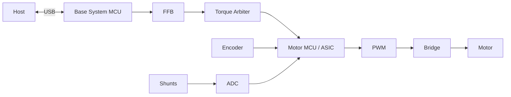

**Figure 3-2: Pedal and Analog Sensor Data Path**

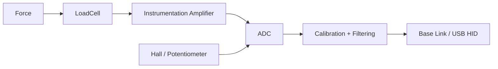

**Figure 3-3: Steering Wheel Data Path**

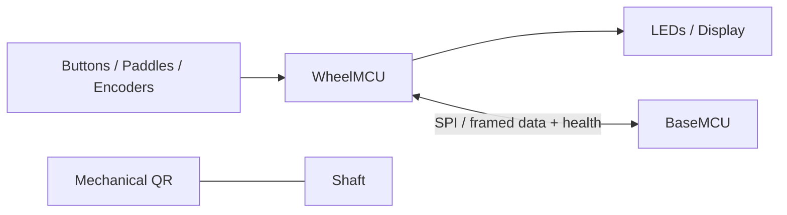

### 3.2. Component Identity and Health

Firmware shall treat each intelligent component as a versioned node. Each node shall report its identity, capabilities, boot state, application state, health, and recovery status. Firmware shall implement fault handling for passive sensors, including cable-fault, rail out-of-bounds, range limits, and signal plausibility checks.

## 4. Force Feedback Overview

This section describes the theoretical basis of force feedback (FFB). It traces how virtual physics events are translated into physical shaft torque.

Force feedback converts simulation-defined physical effects into bounded shaft torque while returning steering position and controls to the simulation.

### 4.1. Feedback Stages

The following stages describe the path from the game engine to physical torque.

| Stage | Responsibility |
|---|---|
| Game | Calculate virtual steering forces and physics events |
| API / Driver | Express effects through the supported OS contract |
| USB Transport | Deliver and validate reports |
| PID Manager | Allocate effects; maintain duration, envelope, conditions, and start/stop state |
| FFB Mixer | Combine active effects and apply configured filters |
| Torque Arbiter | Enforce gain, maximum torque, slew rate, thermal derating, enable state, and freshness limits |
| Motor Control | Track torque and current demand derived from feedback |
| Power Stage | Produce physical torque using the motor |
| Safety | Detect hardware faults and actively remove torque |

**Figure 4-1: Force Feedback Pipeline**

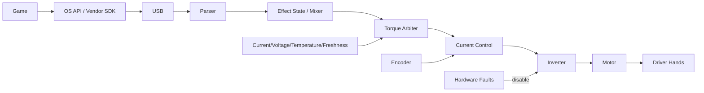

**Figure 4-2: Logical Force Feedback (FFB) Data Path**

### 4.2. FFB Firmware Constraints

The firmware shall validate and schedule all incoming effects. The FFB mixer shall combine effects without arithmetic overflow. The system shall apply all safety and power bounds after the mixing stage. If the host link goes stale, the system shall execute an explicit torque decay and disable policy. Firmware shall not allow any software command to bypass physical or thermal limits. Clipping occurs when the demanded torque exceeds the active limit, causing different large forces to collapse to the same maximum and detail to be lost.

## 5. Hardware Architecture

This section details the internal hardware components of a direct-drive wheel base. It specifies the physical control loop and required electronic safeguards.

### 5.1. Direct-Drive Base Architecture

The core wheel base architecture is separated into a system management domain and a real-time motor control domain. Direct-drive bases commonly use three-phase BLDC/PMSM motors with encoder feedback, phase-current sensing, Pulse Width Modulation (PWM), a gate driver, and an inverter.

The motor is a three-phase PMSM — a wound steel stator around a permanent-magnet rotor on the steering shaft — and the inverter is the six-MOSFET power stage that synthesizes its three phase currents from the DC bus:

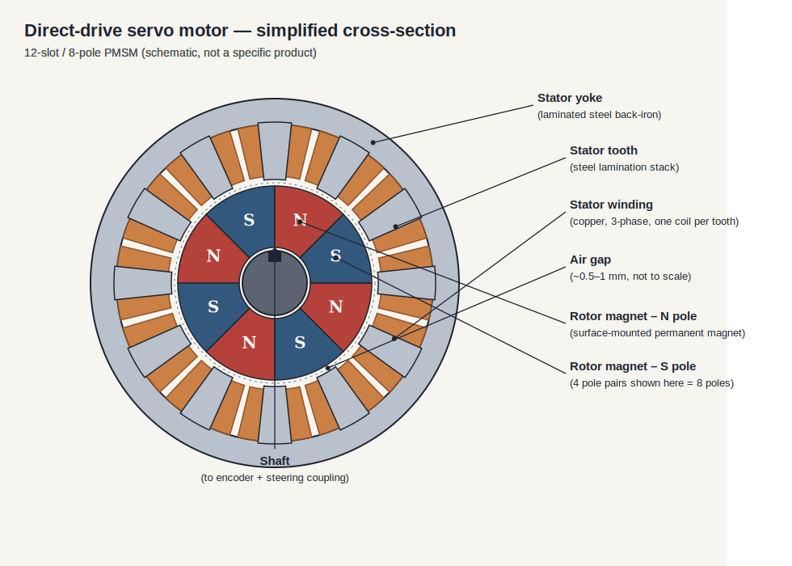

The inverter's three half-bridges each set one phase's voltage by PWM; the two switches in a leg are never on together (dead-time prevents a DC-bus short), and low-side shunts return the phase-current measurement the FOC loop needs.

**Figure 5-1: Hardware Architecture Block Diagram**

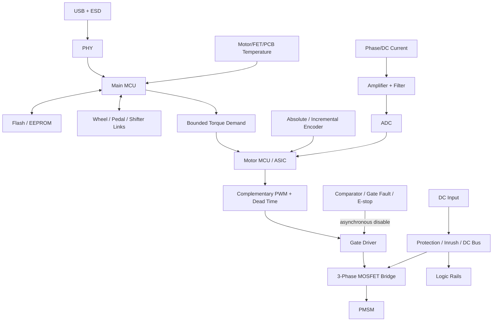

| Block | Responsibility | Firmware Requirement |
|---|---|---|
| Main MCU | Host/peripheral protocols and system policy | Shall enforce scheduling and version compatibility |
| Motor MCU/ASIC | Real-time current/torque path | Shall meet deterministic deadlines and fault responses |
| PMSM/BLDC | Torque actuator | Shall operate within motor parameters and thermal limits |
| Encoder | Angle/speed feedback | Shall validate CRC, status, wrap, direction, offset, and timeout |
| Current sensing | Phase/DC current feedback | Shall calibrate offset, gain, saturation, and align with the PWM sample window |
| Advanced timer | PWM and ADC trigger | Shall generate complementary outputs with dead time and break input support |
| Gate driver/inverter| Switch DC into three phases | Shall default to off; shall immediately respond to hardware faults |
| NVM | Firmware, calibration, profiles, fault records | Shall guarantee atomic writes and support wear levelling |

### 5.2. Control Domain Design

The system may use a single MCU or a split architecture (Main MCU + Motor MCU/ASIC). 

Field-Oriented Control (FOC) transforms rotor angle and current measurements to regulate the torque-producing current. The firmware shall ensure high accuracy and synchronized PWM/ADC timing. Hardware-level overcurrent and break inputs shall override software control. Firmware shall synchronously trigger the ADC within a valid middle-of-PWM window and shall calibrate current-sense offsets during initialization.

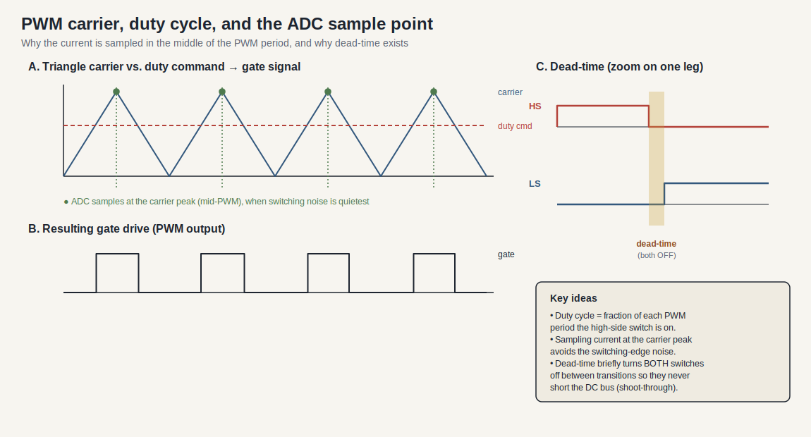

The "valid middle-of-PWM window" is the key timing detail: a triangular carrier compared against each phase's duty command generates the gate signals, and the ADC samples current at the carrier peak — the quiet midpoint of the switching period — so the reading is not corrupted by switching-edge noise. The dead-time zoom shows the brief both-off gap that prevents shoot-through on every transition.

## 6. Hardware Interaction

This section outlines how firmware interacts with specific hardware peripherals. It defines the mapping between electrical interfaces and microcontroller features.

### 6.1. Peripheral Interfaces

Firmware shall configure and manage MCU peripherals to safely interface with external hardware.

| Connection | MCU Peripheral | Firmware Requirement |
|---|---|---|
| Encoder | SPI/SSI/BiSS-C/ABZ, timer, DMA | Shall verify deadline, CRC, wrap, direction, and timeout |
| Current amplifier | ADC, PWM trigger, DMA | Shall verify sampling window, offset, gain, and saturation |
| MCU PWM to gate | Advanced timer, break GPIO | Shall configure dead time, safe reset, and break latency |
| Gate fault to MCU | Break input, GPIO | Shall execute hardware-first shutdown and latch the fault record |
| Rim to base | CAN/SPI/UART/radio | Shall handle hot-plug, ESD recovery, power sequencing, and timeout |
| Pedals to ADC/bus | ADC/SPI/I2C | Shall verify open/short conditions, reference bounds, and calibration |
| Buttons to GPIO | GPIO, timer | Shall apply debounce and reject ghosting |
| Display to SPI | SPI, DMA | Shall budget bandwidth to prevent priority inversion |
| LEDs | Timer, serial bus | Shall limit current and maintain refresh rates |
| USB to host | USB device | Shall manage VBUS, reset, suspend, and endpoint lifecycle |
| NVM to MCU | QSPI/SPI/I2C | Shall implement wear levelling, atomicity, and schema validation |

**Figure 6-1: Hardware Peripheral Routing**

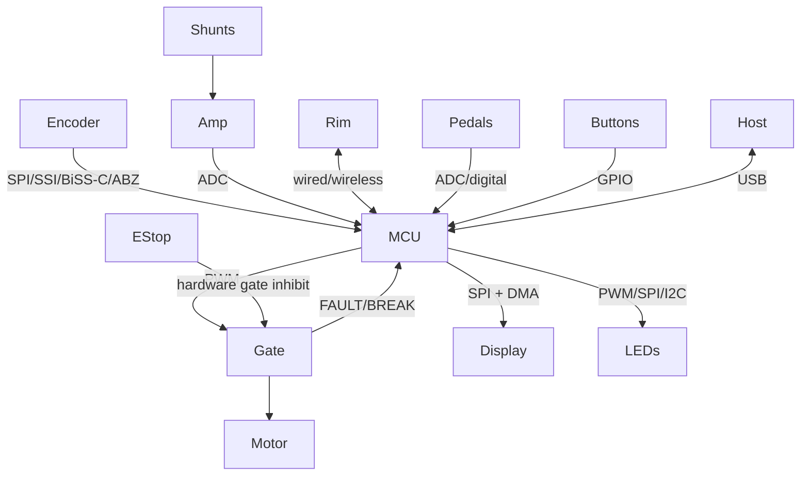

### 6.2. Pin and State Management

The gate enable output shall default to the inactive state during reset, bootloader execution, recovery, and while pins are unconfigured. The system shall protect peripheral power rails so that a damaged external accessory cannot collapse the main control rails.

## 7. Communication Architecture

This section defines the internal and external communication links. It specifies transport protocols, capabilities, and data integrity requirements.

### 7.1. Link Characteristics

The following links define how modules exchange data.

| Interface | Typical Role | Topology | Description |
|---|---|---|---|
| USB 2.0 FS HID | Host to device | Host/device | Standard, self-describing; handles axes, buttons, and FFB |
| USB HS | Display/vendor data | Host/device | High bandwidth; increased stack complexity |
| SPI | MCU to ASIC/encoder/display | Controller/peripheral | MHz speeds; DMA-friendly; sensitive to EMI |
| UART | Debug/boot/simple accessory | Peer framing | Universal; requires software addressing and framing |
| CAN / CAN-FD | Distributed modules | Multi-controller | Differential robust bus; has protocol overhead |
| I2C | EEPROM/sensors/expanders | Controller/target | Two wires; sensitive to bus lock and capacitance |
| RS-485 | Cabled accessories | Protocol-defined | Differential; requires framing and arbitration |
| Ethernet | Dash/service | Packet network | Standard tools; stack and variable latency |
| BLE | Wireless rim/config | Central/peripheral | Wireless; subject to RF and latency constraints |
| Wi-Fi | Dashboard/telemetry | IP network | High throughput; incurs power and security burden |

### 7.2. Host Platform Communication

The communication strategy relies on the **Wheel Base acting as a centralized USB Hub**, with behavior adapting to the host platform's security model:

#### 7.2.1. PC (Windows/Linux)
The system shall expose standard USB endpoints to handle physical feedback and inputs. The system shall use **USB HID** (Human Interface Device) to report controls (steering axes, pedal positions, button presses), and may use **USB PID** (Physical Interface Device) to receive Force Feedback (FFB) physical effects from the game engine. Open-source drivers (e.g., `hid-fanatecff` for Linux) or vendor software can freely interact with this open protocol.

**Figure 7-1: USB Descriptor Topology (PC)**

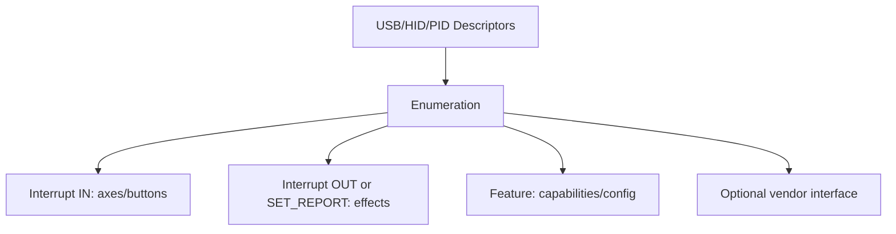

#### 7.2.2. Consoles (PlayStation & Xbox)
Consoles use licensed accessory paths. Public Fanatec guidance establishes where compatibility is owned, but it does not publish the cryptographic protocol or authorize an implementation assumption.

- **Xbox:** compatibility is provided by an Xbox-licensed steering wheel or hub attached to a compatible Fanatec wheel base.
- **PlayStation:** compatibility is provided by a PlayStation-licensed Fanatec wheel base.
- **Peripheral aggregation:** Fanatec pedals, shifters, and handbrakes must connect through the wheel base for console use. Standalone USB peripherals are a PC path unless a current product page explicitly states otherwise.

Firmware architecture shall model platform licensing as an approved product requirement. It shall not invent, emulate, or bypass unpublished console-authentication behavior.

### 7.3. Internal Topologies

**Figure 7-2: Internal Bus Topology**

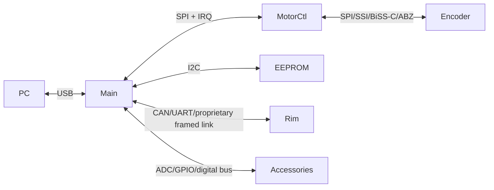

### 7.4. Framing and Integrity

Every framed link shall define version, type, length, sequence, payload integrity (e.g., CRC), and freshness timeouts. Firmware shall enforce bounded queues, compatibility negotiation, and link recovery. DMA transfers shall enforce explicit buffer ownership, transfer deadlines, cache coherence, and error handling.

## 8. Firmware Architecture

This section provides the structural design of the firmware application. It covers modular boundaries, state machines, and lifecycle management.

### 8.1. Software Modules

Firmware shall separate responsibilities to ensure UI and transport layers cannot interfere with the real-time control path.

**Figure 8-1: Firmware Component Architecture**

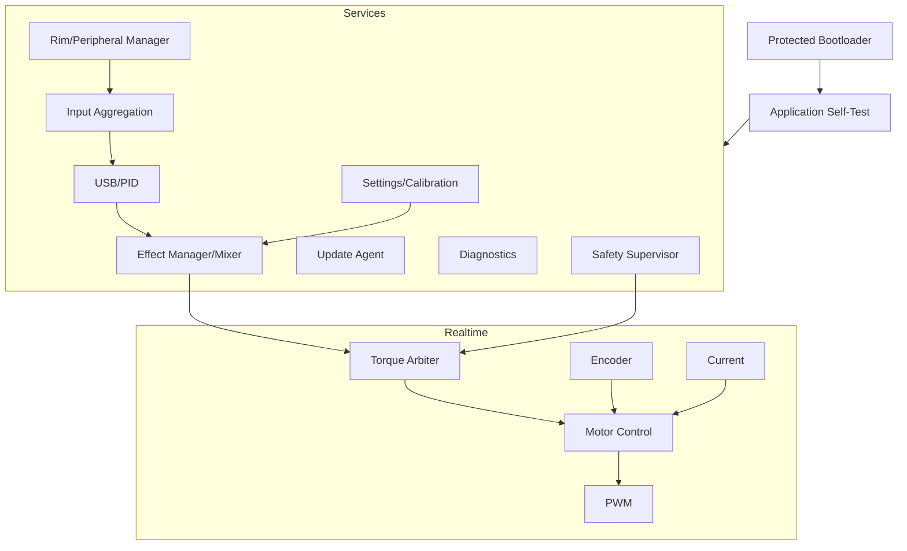

### 8.2. Module Constraints

The following constraints shall be enforced across the firmware architecture.

| Module | Requirement |
|---|---|
| Bootloader | Shall verify, select, and recover the image; shall never energize the motor |
| USB/PID | Shall transport descriptors and effect reports; shall never write to PWM |
| FFB | Shall perform bounded arithmetic for effect mixing |
| Torque arbiter | Shall be the only software route to motor demand; shall enforce enable, limits, and freshness |
| Motor control | Shall not parse host traffic |
| Encoder/current | Shall attach a timestamp and status to every sampled value |
| Peripherals | Shall manage hot-plug events and stale device states |
| Settings | Shall not execute blocking flash writes within the hard real-time path |
| Diagnostics | Shall bound counters/traces; shall not block the control loop |
| Update | Shall disable torque during the entire update process |
| Safety | Shall classify faults and request inhibit; shall act alongside fast electrical protection |

### 8.3. System State Machine

Firmware shall implement a defined state machine for torque authorization. The hardware inhibit shall remain authoritative at all times.

**Figure 8-2: Torque Enable State Machine**

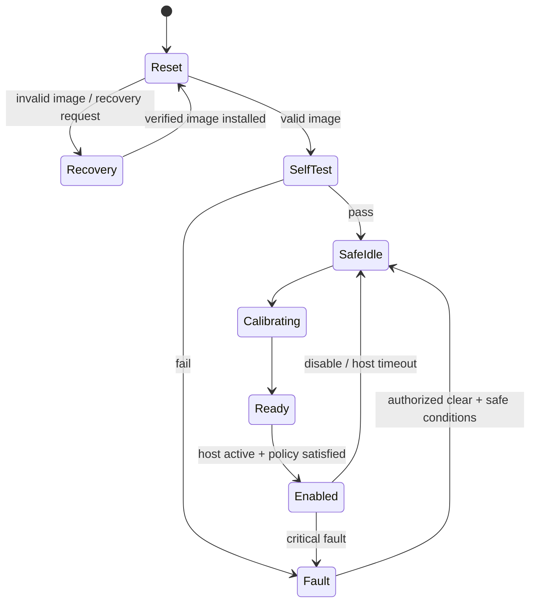

## 9. Data Flow

This section details the end-to-end movement of data through the system. It covers the handling of sensor inputs, effect updates, and hardware feedback.

### 9.1. End-to-End Sequence

The host interactions and internal real-time loops shall execute concurrently without data tearing.

**Figure 9-1: End-to-End Data Flow Sequence**

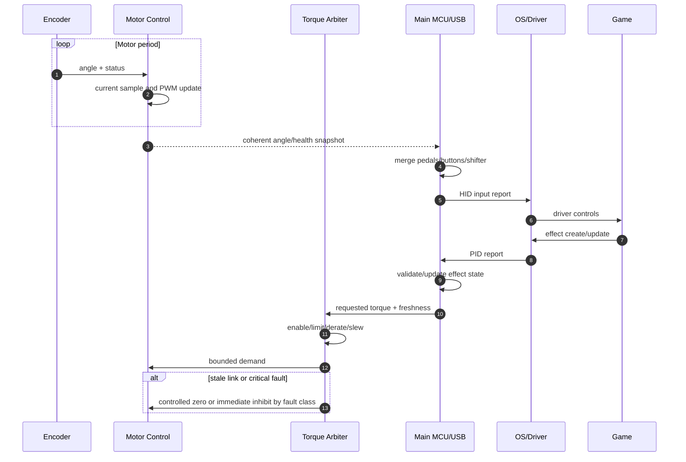

### 9.2. Input Pipeline

Inputs from sensors shall pass through standard validation and calibration stages before being reported to the host.

**Figure 9-2: Input Processing Pipeline**

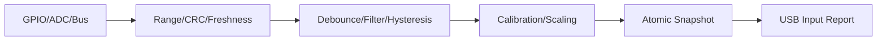

### 9.3. Stale Data Handling

Firmware shall define and apply strict stale-data policies. Every transmitted datum shall include its value, timestamp, validity, owner, and stale policy.

**Table 9-1: Standard Datum Elements**

| Element | Type | Description |
|---------|------|-------------|
| `value` | Payload | The numerical or state value |
| `timestamp` | uint32 | Time the data was sampled or generated |
| `validity` | Boolean | Indicates if the datum is trusted or valid |
| `owner` | Enum | The subsystem that originated the datum |
| `stale_policy` | Enum | Action required when data exceeds timeout |

**Table 9-2: Stale Policies by Source**

| Data Source | Stale Policy |
|---|---|
| Torque / Effects | Shall undergo defined decay and stop; shall never hold indefinitely |
| Encoder / Current | Shall trigger immediate control fault when invalid beyond tolerance |
| Buttons | Shall clear or retain based on explicit protocol semantics |
| Pedals | Shall mark input as invalid or fall back to a documented safe report state |
| Temperature | Shall apply conservative derating or fault on invalid sensor |
| Rim telemetry | Shall clear disconnected controls and stop display updates |

Firmware shall use atomic snapshots or double buffers between Interrupt Service Routines (ISRs) and tasks.

## 10. Real-Time Tasks

This section defines the execution context and timing requirements for system tasks. It sets the performance targets for critical control loops.

### 10.1. Execution Contexts

Firmware shall assign priorities ensuring the fast hardware loop and protection mechanisms preempt transport and background tasks.

**Figure 10-1: Task Preemption Hierarchy**

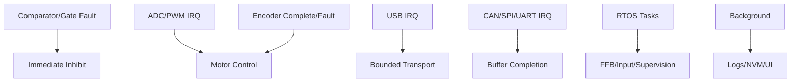

### 10.2. Timing and Deadlines

The following table provides common frequency targets. Exact rates are implementation requirements. Game physics rate, USB cadence, FFB evaluation rate, motor-loop rate, end-to-end latency, jitter, and bandwidth are distinct performance metrics.

| Activity | Frequency Range | Context | Consequence of Miss |
|---|---|---|---|
| Current / FOC loop | 10–40 kHz | Timer/ADC ISR or motor core | Torque distortion, overcurrent fault |
| Encoder read | Control rate | SPI DMA / timer ISR | Stale angle calculation |
| FFB / torque arbitration | 0.5–2 kHz | High-priority task | Jitter, phase delay in feedback |
| USB Transport | Endpoint cadence | ISR + task | Dropped or delayed reports |
| Rim Link | 100–1000 Hz | DMA + task | Stale control input, delayed display |
| Pedals / Buttons | 100–1000 Hz | ADC DMA / timer task | High input latency, noise |
| Safety supervision | Hardware limit + 10–1000 Hz | Hardware / ISR / task | Delayed shutdown |
| Diagnostics / NVM | On demand | Low priority task | Must not block control execution |

### 10.3. Real-Time Rules

Firmware shall measure Worst-Case Execution Time (WCET) under maximum traffic and DMA contention. ISR execution time shall be bounded. Firmware shall prohibit memory allocation, flash erase/write operations, and blocking I/O in the motor control paths. The system shall detect timing overruns. Hardware watchdogs shall only be serviced from the verified critical path.

## 11. Safety and Security

This section addresses fault detection and system protection. It specifies the required reactions to hazardous conditions, system compromises, and outlines proper setup protocols.

### 11.1. Setup and Safety Requirements

This section defines the mandatory safety and operational requirements for setting up and testing sim racing equipment. Adherence is critical due to the high torque capabilities of direct-drive systems.

- The equipment shall be rigidly mounted prior to operation.
- The operator shall inspect the quick release, cables, power supply unit, and torque-off switch before operation.
- The operator should use approved software and update procedures.
- The system shall be calibrated for steering center, steering range, and pedals.
- Initial operation shall commence at a low torque setting using default filters.
- The operator shall verify motor direction, inputs, and torque-off switch functionality before normal use.
- The operator should match the hardware steering range to the game steering range.
- The operator should increase torque gradually and monitor the system for clipping, oscillation, and excessive heat.
- Operators shall keep hands, children, hair, clothing, and cables clear of rotating parts.
- Users shall never bypass physical interlocks or firmware security features.
- Modified motor hardware shall require verified direction, current scaling, bounded torque, and an independent gate disable mechanism before energizing.

### 11.2. Hazard Control

The system shall protect the user and the hardware from unexpected behavior.

**Condition Table: Fault Reactions**

| Condition | Trigger | Action |
|---|---|---|
| `Stale host data` OR `Torque limit exceeded` | Unexpected torque | Execute controlled zero or immediate inhibit |
| `Encoder polarity differs from driven polarity` | Wrong direction | Refuse enable and latch fault |
| `Phase current > OVERCURRENT_TRIP` | Overcurrent | Hardware PWM disable via comparator break input |
| `Inverter Temp > THERMAL_LIMIT` | Overtemperature | Apply thermal derating; if exceeded, disable PWM |
| `DC Bus Voltage > OVERVOLTAGE_TRIP` | Regenerative overvoltage | Reduce or disable torque based on braking policy |
| `Encoder CRC fail` OR `Timeout` | Encoder loss | Immediate inhibit or enter validated degraded mode |
| `Signature check fail` | Update corruption | Remain in torque-disabled recovery state |
| `Watchdog timeout` | Software lockup | Trigger hardware reset; gate outputs default off |

### 11.3. Security Posture

Firmware shall authenticate production update images. The system shall validate all external packet lengths and types. The system shall require a torque-disabled state before accepting service or debug commands. Retail firmware shall disable manufacturing debug interfaces.

**Licensed platforms and rim identity:** Public Fanatec guidance confirms the product-level license locations described above, not the internal authentication algorithm. Community rim emulators demonstrate observations for selected legacy base/rim links; they are not evidence of a universal cryptographic handshake, a current ClubSport DD/DD+ contract, or an approved console-authentication path. Treat rim identity, torque enable, and platform licensing as separate requirements until an approved interface specification proves otherwise.

## 12. Firmware Engineering View

This section outlines the engineering practices, testing strategies, and validation steps required to build the firmware.

### 12.1. Subsystem Engineering Requirements

Engineers shall verify each subsystem's contracts, state transitions, and tests before integration.

| Subsystem | APIs and State Flow | Primary Test Target |
|---|---|---|
| Boot/update | `reset` → `verify` → `boot/recovery` | Hardware mismatch, corrupt image, power loss during flash |
| USB/PID | `detached` → `configured` → `suspended` | Descriptor validation, fuzzed reports, latency measurement |
| FFB | `idle` → `allocated` → `playing` → `stopped` | Lifecycle state, arithmetic overflow, duration wrap |
| Torque arbiter | `disabled` → `ready` → `enabled` → `fault` | Limit precedence, thermal fault logic, stale host reaction |
| Motor control | `init` → `offset cal` → `ready` → `run` → `fault` | Control math, saturation, hardware-in-the-loop (HIL) |
| Settings | `valid` → `dirty` → `commit/error` | Torn writes, wear levelling, schema migration |
| Safety | `safe` → `ready` → `enabled` → `fault` | Fault injection, verify break input precedence |

### 12.2. Verification Sequence

Development shall follow a progression from isolated tests to full power operation. Full-torque work shall begin only after low-energy evidence proves the system can enforce bounds and shut down independently.

**Figure 12-1: Testing Progression**

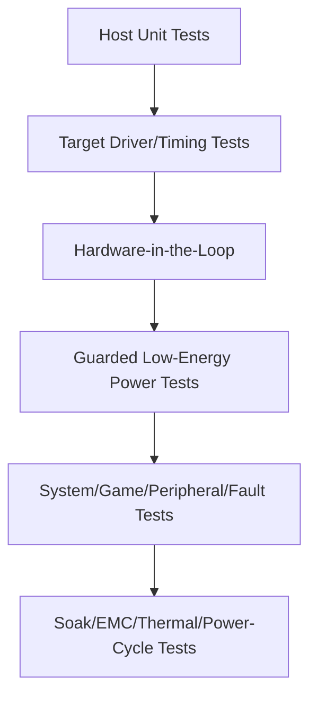

Engineers shall physically verify encoder scale and direction, ADC timing, and independent gate disable before connecting the full power supply.

## 13. Question Register (Resolved and Open)

Reviewed 2026-07-05. Items that could be answered from the knowledge base, public standards, or documented community evidence are marked **Resolved**. Items that depend on a specific product's requirements, proprietary vendor specs, or on-target measurement cannot be answered in the abstract and are re-styled as **Open — developer self-investigation**, each with a concrete method.

### 13.1 Resolved

- **Should motion platforms, tactile transducers, cockpits, and telemetry software be expanded into separate documents?**
  **Resolved (done).** All four now exist: [`motion.md`](./motion.md), [`tactile.md`](./tactile.md), [`cockpits.md`](./cockpits.md), and [`telemetry.md`](./telemetry.md), and are in the reading path in [`README.md`](./README.md).
- **USB descriptors, report cadence, effect capacity, and vendor interface?**
  **Partially resolved (verified public model; product values Unknown).** The transport and effect model are public: USB HID for inputs and USB PID Class 1.0 for force effects (constant, periodic, condition, ramp), typically USB 2.0 Full-Speed. Report cadence follows the endpoint's interrupt interval; the control loop rates are in §10.2. What remains product-specific is the exact VID/PID, effect-pool size, and any vendor (non-HID) interface — see §13.2. Community evidence: the `hid-fanatecff` driver enumerates Fanatec devices under **VID `0EB7`** (e.g. `0EB7:0020` for the CSL DD / DD Pro / ClubSport DD base), which is *community-observed*, not an official descriptor spec.
- **Hardware torque-inhibit path and safety/regulatory targets?**
  **Resolved at the architecture level (targets are product-specific).** The required inhibit path is defined throughout §11 and in [`wheel_base.md`](./wheel_base.md) §15: an independent hardware fault latch driven by an overcurrent comparator, gate-driver fault, E-stop/torque-off, and watchdog, asynchronously disabling the gate driver regardless of software. The industry reference pattern is a Safe-Torque-Off (STO) style architecture (cf. TI TIDA-01599). The *specific* regulatory scope (e.g. which EMC/safety marks apply in target markets) is a product decision — see §13.2.
- **End-to-end latency/jitter budgets and acceptance methods?**
  **Resolved as method (numeric targets are product-specific).** Latency is stage-additive; budget and measure each stage independently (game tick → USB → FFB eval → FOC loop) rather than only end-to-end, per [`telemetry.md`](./telemetry.md) §6. Typical loop-rate anchors are in §10.2 (FOC 10–40 kHz, FFB 0.5–2 kHz). The accepted budget number itself must be set against the product's competitive/latency goals and then verified on target.

### 13.2 Open — for developers to self-investigate

These require a specific product definition, an approved vendor spec, or bench measurement. They are engineering inputs to gather, not facts to look up.

- **Product torque, speed, inertia, rotation, acoustic, and environmental requirements.**
  *How:* derive from the target market segment and reference competitors' published specs; convert to motor sizing (continuous/peak torque, thermal duty) and confirm with a dyno/bench.
- **Supported PC/console platforms and approved licensing architecture.**
  *How:* platform licensing is contractual — obtain the console licensing program terms directly; do not infer or emulate console authentication (§11.3). PC support is verifiable against OS + game requirements.
- **Exact MCU/ASIC, encoder, gate driver, sensing topology, and power ratings.**
  *How:* select against the torque/loop-rate requirements above using vendor reference designs (e.g. Infineon PMSM FOC, TI sensored FOC, OpenFFBoard's TMC4671-based approach as a public example); validate on a bring-up board.
- **Peripheral electrical/protocol topology and ownership.**
  *How:* define per-port; for the base-proxy path, community pinouts (FendtXerion Fanatec-Pinout wiki; GeekyDeaks pedal-emulator RJ12/UART notes) are discovery input to verify electrically, not an authority.
- **Update signing, rollback, provisioning, anti-downgrade, and recovery policy.**
  *How:* choose a signing scheme (hash/CRC + authenticated image), A/B staging, and an independent recovery bootloader; see [`wheel_base.md`](./wheel_base.md) §14.
- **Calibration/version compatibility across base, motor, rim, pedals, and adapters.**
  *How:* version every node and define a compatibility matrix ([`compatibility-matrix.md`](./compatibility-matrix.md)); range-check calibration before use.
- **Diagnostics retention and retail debug-access rules.**
  *How:* decide a wear-limited critical-fault retention policy and disable manufacturing debug in retail images (§11.3).

## 14. References

This section provides citations to public standards, reference designs, and manufacturer documentation.

- [Steering rim architecture](./wheel_rim.md)
- [Wheel-base architecture](./wheel_base.md)
- [USB-IF HID specifications and tools](https://www.usb.org/hid) — HID 1.11, usage tables, PID entry point.
- [USB-IF PID Class 1.0](https://www.usb.org/sites/default/files/documents/pid1_01.pdf) — force-feedback HID reports/model.
- [OpenFFBoard public wiki](https://github.com/Ultrawipf/OpenFFBoard/wiki/) — public modular HID PID, motor-driver, encoder, and I/O architecture.
- [Fanatec Podium DD1 manual](https://assets.fanatec.com/fanatec-pwa/image/upload/downloads-prod/pdfs/P-WB-DD1-Manual-EN_web.pdf) — exposed ports, base/motor versions, update, and calibration.
- [Fanatec Ecosystem Diagram](https://help.fanatec.com/hc/de/articles/43786297099281-Fanatec-Ecosystem-Diagramm) — official ecosystem visual entry point; no unseen diagram details are inferred.
- [Fanatec Wheel Bases FAQ](https://help.fanatec.com/hc/en-us/articles/43766204938257-Wheel-Bases-A-FAQ) — current tiers, console peripheral aggregation, and PC standalone-device context.
- [Fanatec platform compatibility](https://www.fanatec.com/us-en/platforms) — Xbox wheel/hub and PlayStation base licensing rules.
- [Fanatec Steering Wheel FAQ](https://help.fanatec.com/hc/en-us/articles/43802514108433-Steering-Wheel-FAQ) — QR2 default and QR1 discontinuation date.
- [Fanatec ecosystem source register](./references.md) — review dates, community-guide use, and known stale claims.
- [Fanatec update guide](https://www.fanatec.com/eu/en/explorer/products/racing-wheels-wheel-bases/update-fanatec-firmware-and-drivers/) — base, selected wheel, USB pedal, and adapter updates.
- [lshachar/Arduino_Fanatec_Wheel](https://github.com/lshachar/Arduino_Fanatec_Wheel) — custom steering wheel SPI emulator.
- [StuyoP/Fanatec-Wheel-Barebone-Emulator](https://github.com/StuyoP/Fanatec-Wheel-Barebone-Emulator) — ATmega328p barebone wheelbase emulator.
- [Alexbox364/F_Interface_AL](https://github.com/Alexbox364/F_Interface_AL) — DIY custom steering wheels via SPI.
- [jssting/ArduinoTec-Pedals](https://github.com/jssting/ArduinoTec-Pedals) — Fanatec ClubSport Pedals replacement controller.
- [GeekyDeaks/fanatec-pedal-emulator](https://github.com/GeekyDeaks/fanatec-pedal-emulator) — proxy third-party USB pedals via RJ12.
- [StuyoP/Universal-Shifter-Interface-for-Fanatec](https://github.com/StuyoP/Universal-Shifter-Interface-for-Fanatec) — switch-based shifter interface via RJ12.
- [vnmsimulation/VNM_MOTION_CONTROLLER](https://github.com/vnmsimulation/VNM_MOTION_CONTROLLER) — DIY STM32-based hardware controllers.
- [FendtXerion3800/Fanatec-Pinout](https://github.com/FendtXerion3800/Fanatec-Pinout) — RJ12 socket pinout references.
- [gotzl/hid-fanatecff](https://github.com/gotzl/hid-fanatecff) — Linux kernel driver module for Fanatec FFB support.
- [Simucube 2 user guide](https://simucube.com/app/uploads/2022/11/Simucube_2_User_Guide.pdf) — wireless controls, USB relay, pairing, safe torque.
- [Simucube 3 guide](https://docs.simucube.com/Simucube3/index.html) — wireless QR data/power statement.
- [MOZA wheel-base support](https://support.mozaracing.com/en/support/solutions/articles/70000627811-wheel-base-faqs) — compatibility, recovery, calibration, and detection.
- [Simagic Alpha manual](https://image.simagic.com/profile/upload/2022/08/16/41a7d396-805a-439e-b0da-0b81632e2511.pdf) — public setup/update/safety context.
- [Logitech TRUEFORCE](https://www.logitechg.com/en-za/innovation/trueforce.html) — public physics/audio and processing claims.
- [Infineon PMSM FOC reference](https://documentation.infineon.com/aurixtc3xx/docs/kbv1711616051757) — current sampling, PWM trigger, offset calibration.
- [TI TIDA-01599](https://www.ti.com/tool/TIDA-01599) — assessed industrial STO reference architecture.
- [EP1501004A3](https://patents.google.com/patent/EP1501004A3/en) — public motor/encoder/controller architecture context.
- [Simucube FFB effects](https://docs.simucube.com/TunerSoftware/wheelbases/wheelbaseeffects.html)
- [TI sensored FOC](https://software-dl.ti.com/msp430/esd/MSPM0-SDK/2_04_00_06/docs/english/middleware/motor_control_pmsm_sensored_foc/doc_guide/doc_guide-srcs/Sensored_FOC_Motor_Control_Library.html)
