# Sim Racing Hardware and Firmware — Consolidated Study

> Version 1.4  ·  Reviewed 2026-07-05  ·  Developer study base (single-file edition)

> Compiled: single-file edition assembled from the sim-racing study base in recommended reading-path order.


## Sim Racing Study Index

> Version: 1.4
> Reviewed: 2026-07-05

### Document Change Log

| Version | Date | Changes |
|---|---|---|
| 1.4 | 2026-07-05 | Question-register pass. Reviewed every "Unresolved Questions" section across the base and either **resolved** items (from the knowledge base, public standards, or documented community evidence such as the `hid-fanatecff` USB IDs and the GeekyDeaks RJ12/UART pinout) or **re-styled** them as "Open — developer self-investigation" with a concrete method (what to measure, which spec to obtain, which tool to use). Sections renamed to "Question Register (Resolved and Open)" or "Open Questions for Developers to Self-Investigate" accordingly. |
| 1.3 | 2026-07-05 | Added a consolidated, reader-facing force-feedback explainer ([force_feedback_explained.md](./force_feedback_explained.md)) covering the theory of force, the servo motor and power electronics, the full FFB signal chain, and every category of force/vibration felt at the hand (tire physics, weight transfer, road/kerb texture, condition effects) plus fidelity, tuning, and safety. It reuses the existing FFB-relevant illustrations and cross-references the subsystem docs. |
| 1.2 | 2026-07-05 | Systematic explanation + illustration pass. Added original SVG illustrations for physical/power-electronics concepts across the subsystem docs (three-phase inverter, PWM/ADC timing, thermal derating, servo cross-section, load cell / Hall / potentiometer-encoder sensors, ADC resolution, button-matrix ghosting, H-pattern gate, quick-release coupling, cockpit flex, 6-DOF motion, comms stack, telemetry latency, tactile crossover), each with accompanying plain-language explanation. Illustrations are original diagrams, not manufacturer artwork. |
| 1.1 | 2026-07-02 | Added version header and change log; added the five newer subsystem docs (telemetry, tactile, motion, compatibility-matrix, communication-protocols) to the reading path and dependency map; captioned the dependency-map diagram. |

This folder is a developer-oriented study map for sim-racing hardware and firmware. It separates public facts, community evidence, and engineering recommendations so implementation work can proceed without assuming proprietary Fanatec internals.

### Recommended Reading Path

| Step | Read | Outcome |
|---|---|---|
| 1 | [glossary.md](./glossary.md) | Learn product terms, abbreviations, compatibility labels, and customer-safe wording. |
| 2 | [sim_racing_research.md](./sim_racing_research.md) | Learn the ecosystem, safety model, FFB path, and subsystem ownership. |
| 2b | [force_feedback_explained.md](./force_feedback_explained.md) | Get the consolidated FFB picture: theory of force, servo motor, the full signal chain, what the hands feel (tire physics, weight transfer, road texture), fidelity, tuning, and safety. |
| 3 | [wheel_base.md](./wheel_base.md) | Understand the safety-critical hub: USB/PID, motor control, torque arbitration, update, diagnostics. |
| 4 | [wheel_rim.md](./wheel_rim.md) | Understand rotating I/O nodes, QR links, rim identity, input scanning, displays, and generation boundaries. |
| 5 | [pedals.md](./pedals.md) | Understand sensor chains, calibration, USB HID, and base-port proxying. |
| 6 | [add_ons.md](./add_ons.md) | Understand shifters and handbrakes as discrete or analog input devices. |
| 7 | [accessories.md](./accessories.md) | Understand quick releases, dashboards, telemetry displays, and button boxes. |
| 8 | [cockpits.md](./cockpits.md) | Understand the mechanical chassis that preserves FFB and pedal signal fidelity. |
| 9 | [tools.md](./tools.md) | Pick standards, software, measurement tools, and validation references. |
| 10 | [repos.md](./repos.md) | Inspect public projects; treat them as community evidence, not official specs. |
| 11 | [telemetry.md](./telemetry.md) | Understand the game -> bridge -> device telemetry pipeline. |
| 12 | [tactile.md](./tactile.md) | Understand tactile transducers as a separate vibration system isolated from FFB. |
| 13 | [motion.md](./motion.md) | Understand motion platforms, motion cueing, and the mandatory safety envelope. |
| 14 | [communication-protocols.md](./communication-protocols.md) | Understand the layered protocol stack and how software tools reach devices. |
| 15 | [compatibility-matrix.md](./compatibility-matrix.md) | Separate USB-direct vs base-proxy, QR generation, and platform paths, with verification status. |

### Subsystem Dependency Map

**Figure 1-1: Subsystem Dependency Map**

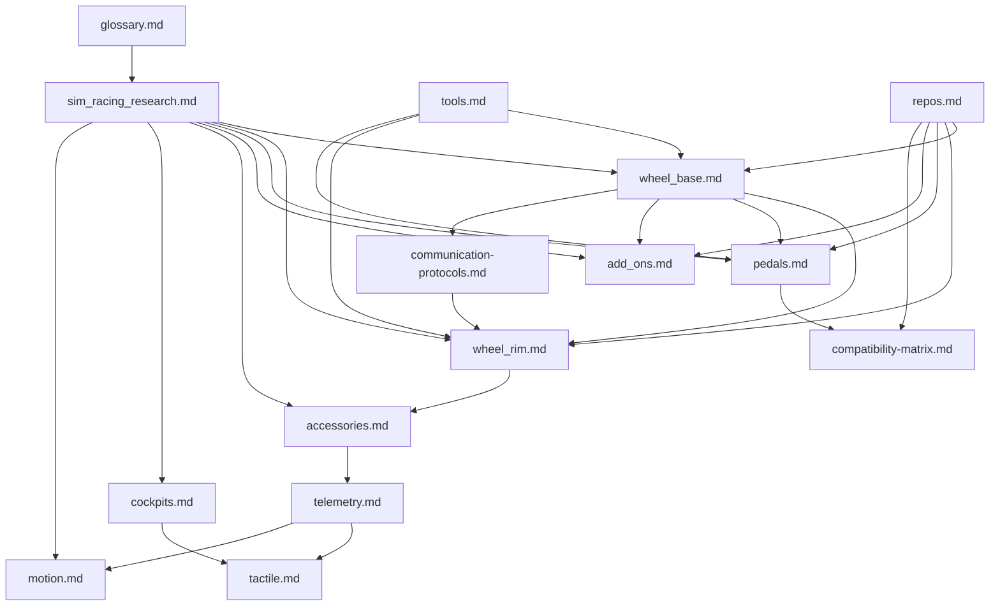

### Evidence Model

| Label | Meaning | Preferred Sources |
|---|---|---|
| Verified public behavior | Publicly documented product or standard behavior | USB-IF specs, manufacturer manuals, support pages |
| Community implementation | Working or documented public implementation | GitHub repositories, project wikis |
| Engineering inference | Reasoned design conclusion from public evidence | Multiple sources plus embedded/control-system practice |
| Unknown | Not public enough to claim | Requires approved schematic, BOM, trace, descriptor, or vendor spec |

> **On the illustrations (added v1.2).** The SVG diagrams added in this pass are original, schematic teaching illustrations of general engineering principles (motor construction, three-phase inversion, PWM timing, strain-gauge bridges, quadrature encoding, button matrices, and so on). They are **not** reproductions of any manufacturer's schematics or product artwork, and they depict generic concepts rather than any specific product's internals. Where a value would be product-specific (pole count, PWM rate, resolution, resonance frequency), the illustration is labelled as illustrative and the text defers to measurement or an approved specification. They sit at the "engineering inference / verified public general knowledge" confidence level, not "verified product behavior."

### Safety and Scope Rules

- Do not include leaked firmware, confidential schematics, proprietary binaries, credentials, or private support material.
- Do not present Fanatec-compatible community projects as official Fanatec protocol specifications.
- Do not bypass console authentication, torque limits, safety keys, or firmware protections.
- Treat high-torque motor testing as hazardous until independent gate-disable and fault handling are verified.

### Reference Hubs

- [USB-IF HID specifications and tools](https://www.usb.org/hid)
- [USB-IF PID Class 1.0](https://www.usb.org/sites/default/files/documents/pid1_01.pdf)
- [Fanatec Podium DD1 manual](https://assets.fanatec.com/fanatec-pwa/image/upload/downloads-prod/pdfs/P-WB-DD1-Manual-EN_web.pdf)
- [OpenFFBoard wiki](https://github.com/Ultrawipf/OpenFFBoard/wiki/)
- [hid-fanatecff Linux driver](https://github.com/gotzl/hid-fanatecff)
- [SimHub wiki](https://github.com/SHWotever/SimHub/wiki)

### Unresolved Questions

- None.


## Fanatec Sim-Racing Customer Glossary

> Research date: 2026-07-02
> Audience: customer support, sales, developers, technical writers, and new sim racers
> Scope: current and commonly encountered Fanatec product, compatibility, setup, tuning, peripheral, and troubleshooting language

This glossary standardizes words used when discussing Fanatec products with customers. It is unofficial and does not replace the product page, Quick Guide, manual, or Fanatec Support instructions for a specific product and firmware version.

### How to Use This Glossary

#### Evidence labels

| Label | Meaning |
|---|---|
| Official | Fanatec product, support, Explorer, or manual language. |
| Standard | General USB, control-system, electrical, or motorsport usage. |
| Common | Widely used sim-racing language; exact implementation can vary by product or game. |
| Legacy | Older Fanatec product/software language that customers may still use. |

Current-product claims age quickly. The [ecosystem source register](./references.md) records review dates and known conflicts. In particular, a January 2026 community guide predates the current ClubSport DD/DD+ torque update and Podium DD flagship positioning.

#### Communication rules

- Say **Fanatec**, not “Fantec.”
- Ask for the exact product name, platform, connection path, Fanatec App version, and firmware versions before diagnosing.
- Separate **steering wheel** from **wheel base**. Customers often call either one “the wheel.”
- Say **FFB strength** for a setting and **torque in Nm** for physical output. They are related but not interchangeable.
- Do not promise compatibility from connector shape alone. Product, platform, firmware, quick-release generation, and connection path all matter.
- Treat “Xbox Ready” and “PlayStation Ready” as conditional labels, not the same as licensed compatibility.
- Verify current product-specific QR2 torque support. QR2 Lite behavior has changed for selected wheels through firmware updates. [F4]

### Customer Intake Vocabulary

Collect these facts first. This prevents most terminology-driven support errors.

| Ask Customer For | What It Means | Useful Example |
|---|---|---|
| Platform | Host running the game | Windows PC, Xbox Series X\|S, PS5 |
| Wheel base | Motor and USB hub unit | CSL DD, ClubSport DD+, Podium DD1 |
| Steering wheel or hub | Detachable control assembly | Formula V2.5X, CSL Universal Hub V2 |
| Quick release | Mechanical/electrical wheel-to-base coupling | QR1, QR2 Lite, QR2 Pro |
| Peripherals | Pedals, shifter, handbrake, or static paddles | CSL Pedals, ClubSport Shifter SQ V1.5 |
| Connection path | How each peripheral reaches the host | Pedals to base by RJ12; base to PC by USB |
| Software versions | Host package and device firmware | Fanatec App plus base/wheel firmware versions |
| Mode | Current platform or compatibility mode | PC mode, Xbox mode, compatibility mode |
| Symptom | Observable failure, not assumed cause | “Base is detected but there is no FFB” |
| Trigger | Action after which issue began | Firmware update, QR swap, game update |

### Brand, Product, and Bundle Terms

| Term | Definition and Customer Explanation | Evidence |
|---|---|---|
| Fanatec | Sim-racing hardware brand. Use the exact capitalization. | Official |
| Ecosystem | Interoperable set of bases, wheels, pedals, shifters, handbrakes, quick releases, software, and mounting accessories. It does not mean every combination supports every platform or feature. | Official [F1] |
| CSL | CSL stands for ClubSport Light. Fanatec product tier classified as the entry-level series. It is a family name, not a connector or compatibility standard. | Official [F19] |
| CSL Elite | Product-family name used for selected wheels and pedals. “Elite” does not define platform compatibility. | Official |
| ClubSport / CS | Mid-to-high product tier and common abbreviated prefix. Products such as ClubSport DD and ClubSport Shifter remain distinct. | Official |
| Podium / P | Premium product tier used for high-performance bases, hubs, modules, and accessories. | Official |
| Ready2Race / R2R | Bundle intended to contain the major components needed to start driving. Confirm platform support, mounting, and optional upgrades on its page. | Official |
| Racing Wheel | May mean a complete base-and-wheel package. Ask whether the customer means the system or only the detachable steering wheel. | Official/Common |
| Wheel Base | Fixed unit containing the steering motor, shaft, control electronics, USB interface, and peripheral ports. It generates FFB. | Official |
| Steering Wheel | Detachable driver control assembly with grips/rim, buttons, paddles, and often LEDs/display. It does not generate main steering torque. | Official |
| Wheel Rim / Rim | Part held by the driver. In modular systems it bolts to a hub. Customers also use “rim” for the entire steering wheel; clarify. | Official/Common |
| Hub | Interface between rim and base, usually carrying controls, paddles, electronics, and quick-release mounting. | Official [F3] |
| Universal Hub | Modular Fanatec hub accepting compatible rims. Bolt pattern, diameter, weight, controls, QR, and platform support still require checks. | Official [F3] |
| Button Module | Add-on control/display assembly mounted to a compatible hub or rim. | Official |
| Paddle Module | Add-on rear control assembly containing shift paddles and, depending on model, analogue clutch paddles. | Official |
| V1 / V2 / V2.5 | Hardware revision in a product name. Do not assume accessories or firmware are interchangeable across revisions. | Official |
| Discontinued / Legacy Product | Product outside the current range but possibly still supported by legacy drivers, firmware, manuals, or spare parts. | Legacy |

### Fanatec DD Wheel-Base Model Families

`DD` means **Direct Drive**, but customers may use “DD” for the drive architecture, the ClubSport DD, or the current Podium DD product. Always request the complete model name.

| Model | Product Position | Advertised Torque | Platform Summary | Main Distinction |
|---|---|---:|---|---|
| CSL DD | Entry-level direct drive | 5 Nm; 8 Nm with supported Boost Kit | Windows PC; Xbox with an Xbox-licensed wheel or hub; not PlayStation licensed | Compact, lower-cost entry into the Fanatec DD ecosystem. [F13] |
| Podium Wheel Base DD1 | Previous-generation Podium flagship | Up to 20 Nm peak | Standard model: Windows PC; Xbox with an Xbox-licensed wheel or hub | Earlier high-torque Podium base. A separate historical PlayStation-licensed DD1 bundle/model existed, so check the exact SKU. [F14] |
| Podium Wheel Base DD2 | Previous-generation Podium flagship | Up to 25 Nm peak | Windows PC; Xbox with an Xbox-licensed wheel or hub | Stronger DD1-era model; Podium Kill Switch supplied as standard. [F14] |
| ClubSport DD | Current ClubSport direct drive | 15 Nm holding torque with current firmware | Windows PC; Xbox with an Xbox-licensed wheel or hub; not PlayStation licensed | Current-generation QR2 and FullForce platform without PlayStation licensing. [F15] |
| ClubSport DD+ | Current ClubSport direct drive | 18 Nm holding torque with current firmware | Windows PC and PlayStation; Xbox with an Xbox-licensed wheel or hub | Stronger ClubSport model with PlayStation licensing. [F15] |
| Podium DD | Current Podium flagship introduced in 2026 | 25 Nm holding torque; up to 33 Nm peak overshoot | Check the current regional product page and attached wheel/hub for platform support | Successor to DD1/DD2, based on the newer ClubSport DD architecture with FullForce. [F16] |

#### Naming and comparison cautions

- **CSL DD** is a complete model name: `CSL` is the product tier and `DD` means Direct Drive.
- **DD1** and **DD2** are model identifiers in the previous Podium Wheel Base generation; “2” identifies the higher-output variant, not “Direct Drive version 2.”
- **DD / DD+** usually means **ClubSport DD / ClubSport DD+** in customer shorthand. The `+` identifies the stronger, PlayStation-licensed ClubSport model.
- **Podium DD** without a number is a separate 2026 product. Do not confuse it with DD1, DD2, or generic direct drive.
- DD1/DD2 figures are published as **peak torque**. ClubSport DD/DD+ and Podium DD use **holding torque** in current product claims. These numbers are not directly equivalent.
- ClubSport DD and DD+ originally shipped with advertised holding torque of 12 Nm and 15 Nm. Fanatec firmware V1.4.2.3 or later raised them to 15 Nm and 18 Nm in May 2026 without hardware changes. Update through the latest Fanatec App. [F15]
- Available torque can still be limited by the attached steering wheel, quick release, firmware, or Low Torque Mode. [F4]

### Platform and Compatibility Terms

| Term | Definition and Customer Explanation | Evidence |
|---|---|---|
| Platform | PC or console environment on which the game runs. Support can depend on licensing hardware and peripheral connection path. | Official [F2] |
| PC Compatible | Product works on supported Windows PCs through an approved connection. It does not promise support in every game or non-Windows OS. | Official [F2] |
| Xbox Compatible / Xbox Licensed | Steering wheel or hub contains Xbox licensing hardware. Attached to a compatible Fanatec base, it enables the connected system on Xbox. | Official [F2] |
| Xbox Ready | Conditional label: product becomes usable on Xbox when combined with an Xbox-licensed Fanatec steering wheel or hub. | Official [F2] |
| PlayStation Compatible / PS Licensed | Fanatec PlayStation licensing is in the wheel base. A licensed base enables supported attached components on PlayStation. | Official [F2] |
| PlayStation Ready / PS Ready | Conditional label: component can work on PlayStation when connected through a PlayStation-licensed Fanatec base. | Official [F2] |
| Cross-Platform Setup | Xbox-licensed wheel/hub plus PlayStation-licensed base. This can support PC and both console families; verify every product page. | Official [F2] |
| Console Compatibility | Requires licensed hardware and a supported game. Peripherals normally connect through the base rather than separate console USB ports. | Official [F2][F8] |
| Game Support | Game implements the relevant axes, buttons, FFB, displays, LEDs, or telemetry. Hardware compatibility does not guarantee every feature. | Official [F7] |
| Native Mode | Device identifies in its intended current mode. Exact name and behavior vary by base and platform. | Official/Common |
| Compatibility Mode / CSW Mode | Base emulates or identifies similarly to an older base so games without native support may work. Features can differ. | Official/Legacy |
| PC Mode | Wheel-base mode intended for Windows PC. LED color and mode-switch procedure are product-specific. | Official |
| Xbox Mode | State used with supported hardware on Xbox. Xbox licensing remains in the wheel or licensed hub. | Official |
| PlayStation Mode | State of a PlayStation-licensed base on a supported PlayStation console. Exact indication varies. | Official |
| Standalone | Peripheral connects directly to PC, usually by USB or ClubSport USB Adapter. Standalone USB normally does not work on consoles. | Official [F2][F8] |
| Base-Connected | Peripheral connects to the base, which aggregates it into the base’s host/console connection. | Official [F2] |

### Wheel Base, Torque, and Mounting Terms

| Term / Abbreviation | Definition and Customer Explanation | Evidence |
|---|---|---|
| DD — Direct Drive | Motor shaft drives the steering shaft directly, without belt or gear reduction. DD describes architecture, not automatically torque or quality. | Official/Common |
| Belt Drive | Motor transfers force through belts and pulleys. Common on older wheel bases. | Common/Legacy |
| FFB — Force Feedback | Motor-generated steering force based on game commands and base settings. | Official [F5] |
| Torque | Rotational force at the steering shaft, usually stated in newton-metres. | Standard |
| Nm — Newton-metre | SI unit of torque. More Nm means higher possible torque, not automatically more detail or realism. | Standard |
| Peak Torque | Highest short-duration torque under specified conditions. Do not compare it directly with another product’s holding torque. | Common |
| Holding / Sustained Torque | Torque maintained longer under thermal and electrical limits. Vendor definitions and test conditions can differ. | Common |
| High Torque Mode | State allowing more than the low-torque limit when the wheel/QR combination is approved. Never bypass detection or warnings. | Official [F4] |
| Low Torque Mode | Safety-limited mode for a wheel or QR not approved for full base torque. Current guidance describes 8 Nm on listed high-output bases. | Official [F4] |
| QR — Quick Release | Mechanical/electrical coupling attaching the steering wheel to the base. Both sides and generations must match. | Official [F4] |
| QR1 | First-generation Fanatec QR family. QR1 and QR2 do not mate. Fanatec states QR1 is discontinued, though legacy hardware and model-specific conversion paths remain. | Official [F4][F17] |
| QR1 Lite | Composite wheel-side QR1 with product-specific torque limits. It is not equivalent to QR2 Lite. | Official [F4] |
| QR2 | Current QR family with separate Base-Side and Wheel-Side components. | Official [F4] |
| QR2 Base-Side | QR2 component fitted to the base shaft. Type-C, Type-F, or Type-M is base-specific. | Official [F4] |
| QR2 Wheel-Side | Component fitted to wheel/hub. It mates with official QR2 Base-Side variants, subject to product and torque approval. | Official [F4] |
| QR2 Lite Wheel-Side | Composite QR2 wheel-side. High-torque support is wheel- and firmware-specific; selected products gained full-torque approval. | Official [F4] |
| QR2 Pro Wheel-Side | Premium motorsport-oriented metal variant. “Pro” does not imply universal platform support. | Official [F4] |
| Type-C / Type-F / Type-M | Base-specific QR2 Base-Side variants: Type-C for CSL DD/GT DD Pro, Type-F for ClubSport DD, Type-M for Podium in current guidance. | Official [F4] |
| Shaft | Rotating output member of the wheel base. The Base-Side QR mounts to it. | Standard |
| Flex | Unwanted elastic movement in cockpit, mount, rim, or QR. It can reduce perceived detail without an electronic fault. | Common |
| Play / Backlash | Free movement before load transfers. Ask where: QR, shaft, hub, rim, pedals, or cockpit. | Common |
| Hard Mount | Bolting equipment directly to a cockpit/plate using specified points. Use approved bolt size and depth. | Official |
| Table Clamp | Accessory securing base or shifter to a desk. Desk strength and torque limits matter. | Official |
| Cockpit / Rig | Structural frame supporting seat, base, pedals, and accessories. Rigidity and adjustment affect comfort and FFB perception. | Common |
| Boost Kit | Higher-power supply for supported bases that enables the advertised higher torque configuration. It is not a generic overclock. | Official |
| FullForce | Fanatec high-frequency FFB protocol/effect layer on supported hardware and games. As of June 2026, current official guidance includes CSL DD and GT DD Pro as well as ClubSport and current Podium DD families; game support remains required. | Official [F18] |

### Steering Wheel and Control Terms

| Term / Abbreviation | Definition and Customer Explanation | Evidence |
|---|---|---|
| D-pad | Four-direction digital control, often with center press, used for menus or Tuning Menu navigation. | Common |
| FunkySwitch | Fanatec multi-function control combining directional movement, rotation, and push on supported wheels. | Official [F5] |
| Rotary Encoder | Knob producing step-up/step-down inputs when turned. It usually does not report a fixed absolute position. | Standard |
| Thumb Encoder | Rotary encoder positioned for thumb operation while gripping the wheel. | Common |
| MPS — Multi-Position Switch | Multi-position control exposed as encoder, pulse, constant, or game-selected behavior. | Official [F5] |
| Button Cluster / Island | Group of buttons mounted together, often adjustable on a Universal Hub. | Official [F3] |
| Button Caps | Removable labels matching platform/game functions. Labels do not change electronic compatibility. | Official |
| Magnetic Shifter Paddle | Paddle with magnetic return/detent action, normally reporting a digital shift input. | Common |
| Analogue Paddle | Variable-axis paddle configurable for clutch, handbrake, brake/throttle, or extra axes on supported wheels. | Official [F5] |
| Dual Clutch | Two analogue paddles used together for race starts; one can hold the configured bite point. | Official [F5] |
| CbP — Clutch Bite Point | Configured clutch engagement percentage for repeatable starts with dual analogue paddles. | Official [F5] |
| RevLEDs | RPM/rev indicators controlled by game telemetry or supported software. They do not prove FFB is working. | Official [F7] |
| FlagLEDs | Multi-color LEDs for race flags, pit/limiter, and other supported status indications. | Official [F7] |
| RevStripe | Product-specific illuminated rev strip. Behavior depends on wheel, game, platform, and software. | Official [F7] |
| OLED / LCD | Display technologies showing speed, gear, tuning, telemetry, or status. Content support varies. | Standard/Official |
| Telemetry | Game-exported data such as RPM, speed, gear, flags, or fuel. It drives displays/LEDs and is separate from FFB. | Common |
| Static Shifter Paddles | Fixed paddles attached to base/cockpit rather than rotating with the wheel. Port behavior is base-specific. | Official [F8] |

### Pedal, Shifter, and Handbrake Terms

| Term / Abbreviation | Definition and Customer Explanation | Evidence |
|---|---|---|
| Pedal Set | Throttle, brake, and optional clutch assembly. Connection and USB capability vary by model and installed kits. | Official |
| Throttle / Accelerator | Pedal axis commanding engine power, usually position-sensed. | Common |
| Brake Pedal | Pedal axis commanding braking. It may measure travel, force, or a combination. | Common |
| Clutch Pedal | Pedal axis used for manual clutch control. | Common |
| Load Cell / LC | Force sensor commonly used in brake pedals; measures applied force rather than position. | Official [F6] |
| Hall Sensor | Non-contact magnetic sensor normally measuring pedal or lever position. | Official [F6] |
| Potentiometer / Pot | Contact-based variable resistor measuring position. Wear or contamination can cause noisy readings. | Standard/Common |
| Hydraulic-Equipped Pedal | Uses fluid-based resistance/pressure behavior. Confirm whether the exact model senses pressure, force, or travel. | Official [F6] |
| Elastomer | Compressible polymer element tuning pedal resistance/travel, especially around a load-cell brake. | Official [F6] |
| Preload | Initial compression or force before normal pedal movement. It is not the maximum brake force. | Common |
| Pedal Travel | Physical distance or angle through which a pedal moves. | Standard |
| BRF — Brake Force | Fanatec setting for physical load-cell force corresponding to maximum brake input. It is not brake bias. | Official [F5] |
| Brake Bias | In-game setting distributing braking between front/rear axles; unrelated to BRF calibration. | Common |
| Dead Zone | Input range ignored near start/end of an axis. Too much reduces usable resolution. | Common |
| Calibration | Maps physical minimum, maximum, center, or gear positions to logical values. | Official [F8] |
| H-Pattern | Manual shifter layout with a physical gate position for each gear. | Official [F8] |
| SQ — Sequential | Forward/back shifter actions request next/previous gear. “SQ” identifies sequential capability. | Official [F8] |
| Reverse Inhibitor | Mechanism preventing accidental reverse, such as pressing the lever down first. | Official [F8] |
| Shifter 1 Port | Supports H-pattern and sequential modes for ClubSport Shifter SQ V1.5 in current guidance. | Official [F8] |
| Shifter 2 Port | Supports sequential input; current guidance also identifies Static Shifter Paddles use. | Official [F8] |
| Handbrake | Usually an analogue lever axis for rally/drift input. It is not a digital button unless mapped that way. | Official/Common |
| ClubSport USB Adapter | Adapter allowing selected peripherals to work standalone on PC. Adapter mode must match the peripheral. | Official [F9] |
| RJ12 | Modular connector used for Fanatec peripherals. Connector name does not define protocol or guarantee compatibility. | Official/Common [F9] |
| PS/2 Connector | Mini-DIN used on some legacy base/shifter paths. It does not imply PC keyboard/mouse compatibility. | Official/Legacy [F8] |
| Simultaneous USB and Base Connection | Potentially unsafe/unsupported for some pedals. Follow the exact manual; do not use both unless explicitly permitted. | Product-specific official guidance |

### Software, Firmware, and Setup Terms

| Term | Definition and Customer Explanation | Evidence |
|---|---|---|
| Fanatec App | Current Windows software for supported setup, testing, tuning, LED/display configuration, and firmware management. | Official [F4][F8] |
| Fanatec Control Panel / Wheel Property Page | Legacy Windows configuration interface in older drivers/support material. Ask which package the customer sees. | Legacy [F5] |
| FanaLab | Legacy/companion PC tuning and telemetry-profile tool in older setups. Verify version and active profile before diagnosis. | Legacy |
| Driver | Host software enabling Windows communication with hardware. Driver and firmware versions are different values. | Official [F10] |
| Firmware / FW | Software stored in base, motor controller, wheel, pedals, or adapter. One setup can have several firmware components. | Official [F10] |
| Firmware Manager | Update/recovery workflow for checking and flashing supported firmware. | Official [F8][F10] |
| Bootloader | Minimal device code used to start/recover updates. Update mode does not necessarily mean permanent damage. | Standard |
| Firmware Update | Replaces device firmware. Keep power/cables stable and follow prompts. | Official [F10] |
| Manual Firmware Update | Advanced workflow selecting firmware/component manually. Use only when official instructions require it. | Official [F8] |
| Adapter Mode | ClubSport USB Adapter firmware/personality selected for its attached peripheral. | Official [F8][F9] |
| Device Detection | Host software recognizes the base/components. Detection is separate from game mapping and FFB. | Common |
| Center Calibration | Stores physical straight-ahead as logical center. It does not fix mechanical misalignment. | Official |
| Shifter Calibration | Teaches H-pattern gear positions; may be requested after firmware updates. | Official [F8] |
| Pedal Calibration | Stores pedal minimum/maximum or force range. Modes are product/software-specific. | Official |
| Tuning Menu | Base settings accessible through wheel controls and PC software. It does not replace in-game setup. | Official [F5] |
| Standard Tuning Menu | Simplified view exposing core parameters and fewer profiles. | Official [F5] |
| Advanced Tuning Menu | Full view exposing additional parameters and multiple custom slots. | Official [F5] |
| A SET — Auto Setup | Lets a supported game control tuning values; documented defaults apply when unused. | Official [F5] |
| C SET — Custom Setup | User-adjustable profile in Standard Tuning Menu on supported current bases. | Official [F5] |
| S_1–S_5 / SET 1–5 | User-stored Advanced Tuning Menu profiles. Availability depends on base/firmware. | Official [F5] |
| Profile | Saved group of values. State its owner: base, Fanatec App, FanaLab, or game. | Official/Common |
| Factory Settings | Manufacturer baseline. Resetting profiles is not firmware downgrade or driver uninstall. | Official |

### Tuning Menu Abbreviations

Exact ranges and availability vary by base, wheel, pedals, firmware, and menu mode. Check the current product manual/support page before recommending values. [F5]

| Abbreviation | Expansion | Practical Explanation |
|---|---|---|
| SEN | Sensitivity | Steering rotation in degrees, or automatic game/driver control. Not USB polling sensitivity. |
| FF / FFB | Force Feedback | Base maximum FFB strength. Final torque also depends on game output and modifiers. |
| FFS | Force Feedback Scaling | Selects linear (`LIN`) or peak (`PEA`) behavior. Not the same as FF strength. |
| LIN | Linear | Preserves a more linear request-to-torque relationship, potentially with reduced maximum output. |
| PEA | Peak | Allows peak output behavior on supported bases. |
| NDP | Natural Damper | Adds speed-dependent resistance, controlling movement and oscillation. Too much feels slow. |
| NFR | Natural Friction | Adds relatively constant resistance independent of game detail. Too much masks detail and adds fatigue. [F11] |
| NIN | Natural Inertia | Simulates additional steering mass/inertia, often useful with lighter wheels. |
| INT | FFB Interpolation | Smooths coarse/noisy game FFB. Higher values reduce harshness but can reduce immediacy. |
| FEI | Force Effect Intensity | Changes intensity/sharpness of game force effects. Not the main torque limit. |
| FOR | Force | Scales game constant-force effects. Keep baseline unless game-specific guidance requires change. |
| SPR | Spring | Scales game-requested spring effects. It does not always create automatic centering. |
| DPR | Damper | Scales game-requested damper effects. It differs from base-generated NDP. |
| BRF | Brake Force | Sets load-cell force required for maximum brake input on supported pedals. |
| BLI | Brake Level Indicator | Threshold for supported pedal/wheel vibration; game-controlled behavior can differ. |
| SHO | Shock / Vibration Strength | Controls supported vibration motors, not the base’s main FFB motor. |
| MPS | Multi-Position Switch Function | Chooses how supported multi-position switches report inputs. |
| AUTO | Automatic / Game Specific | Lets game/software select behavior. Meaning depends on the parent setting. |
| ENC | Encoder | MPS sends one input clockwise and another counter-clockwise. |
| CONST | Constant | MPS holds a distinct button state for each position. |
| PULSE | Pulse | MPS sends a brief position-specific input when moved. |
| AP | Analogue Paddles | Selects supported analogue-paddle function. |
| CbP | Clutch Bite Point | Both paddles cooperate as clutch controls for repeatable starts. |
| CH | Clutch / Handbrake | One analogue paddle is clutch; the other is handbrake. |
| bt / BT | Brake / Throttle | Analogue paddles become brake and throttle. |
| AnA | Mappable Analogue Axes | Exposes paddles as additional axes where supported. |

### General FFB and Sim-Racing Terms

| Term / Abbreviation | Definition and Customer Explanation | Evidence |
|---|---|---|
| Axis | Continuous input such as steering, throttle, brake, clutch, or handbrake. | USB/Common |
| Button Mapping | Assignment from physical control to game command. It does not change licensing or firmware. | Common |
| Clipping | FFB reaches configured maximum, so stronger forces lose distinction. Lower/rebalance in-game gain to preserve detail. | Common |
| Damping | Resistance mainly related to motion speed. It stabilizes movement; too much hides fast detail. | Control-system/Common |
| Friction | Resistance opposing movement, including slow movement. In Fanatec tuning, see NFR. | Control-system/Common |
| Inertia | Resistance to rotational-speed change due to effective mass. In tuning, see NIN. | Control-system/Common |
| Oscillation | Unwanted back-and-forth wheel motion. Aggressive FFB, latency, low damping, or game behavior can contribute. | Official/Common [F12] |
| Gain | FFB strength multiplier in game/software. High gain can cause clipping. | Common |
| Minimum Force | Game setting boosting weak center FFB. Excess can cause oscillation on DD bases. | Common [F12] |
| Linearity | How proportionally output torque follows requested force. More linear does not mean stronger. | Common |
| Latency | Delay across game, USB, firmware, motor, and driver response. | Standard |
| Polling / Report Rate | Frequency at which input reports are exchanged. It is not complete end-to-end latency. | USB/Common |
| USB HID | Universal Serial Bus Human Interface Device class for controls such as axes/buttons. | Standard [S1] |
| USB PID | USB Physical Interface Device model for FFB effects; unrelated to product identification numbers. | Standard [S2] |
| RPM | Revolutions per minute. Engine RPM telemetry commonly drives RevLEDs. | Standard |
| Understeer | Front tires lack grip for requested turn. FFB representation depends on game physics/design. | Motorsport/Common |
| Oversteer | Rear tires lose lateral grip relative to front, rotating the car more than requested. | Motorsport/Common |
| Road Effects | Texture, bump, kerb, or vibration effects; physics-derived or canned depending on game. | Common |
| Soft Lock | Software force near the simulated car’s steering limit, not a physical shaft stop. | Common |
| Steering Lock / Rotation | Total steering angle in degrees. Coordinate Fanatec SEN and game steering lock. | Common |
| Sim Rig | Complete installation: cockpit, seat, controls, display/VR, PC/console, and accessories. | Common |
| Telemetry Dashboard | Display driven by game data, often through Fanatec App or SimHub. | Common |

### Troubleshooting Terms

| Term | Definition and Customer-Safe Wording |
|---|---|
| Not Detected | Host does not recognize device. Check power, USB path, mode, cable, port, and Device Manager before assuming firmware failure. |
| Detected but Not Working in Game | Driver sees device, but game mapping/mode/support may be missing. Separate input, FFB, LEDs, and telemetry tests. |
| No FFB | Inputs may work while motor force does not. Check game FFB, mode, FF setting, firmware, torque/safety state, and game focus. |
| FFB Loss | FFB worked then stopped. Record trigger, temperature, USB events, session state, and whether inputs remain. |
| Wheel Disconnect | Detachable wheel loses communication while base stays powered. Check seating, QR pairing, approved contact inspection, firmware, and play. |
| Mis-shift | H-pattern gear reads incorrectly. Confirm Shifter 1, H mode, cable, and calibration. |
| Input Jitter / Spiking | Axis changes without intended movement. Causes can include sensor noise/wear, grounding, cable, calibration, or mechanics. |
| EMI — Electromagnetic Interference | Electrical noise coupled into USB/sensors/cables. Reproduce against routing, grounding, load, and alternate ports. |
| Ground Loop | Unwanted grounded-device current path causing noise/disconnects. Never remove protective earth as a workaround. |
| Power Cycle | Controlled shutdown, wait, restart. It is not unplugging during firmware flash. |
| Re-enumeration | USB device disconnects and appears again, possibly in another mode/identifier. |
| Firmware Mismatch | Components run unintended version combinations. Use current official package guidance. |
| Recovery Mode | Bootloader/update state used to restore firmware. Follow exact-model official steps. |
| Bricked | Informal claim that device is unusable after update. Check recovery, detection, and power before declaring permanent damage. |
| RMA — Return Merchandise Authorization | Approved return/repair process. Supply serial, purchase proof, versions, logs, evidence, and reproduction steps. |
| DOA — Dead on Arrival | Informal first-setup failure label. Complete minimum safe checks before using it in a case. |
| Reproduction Steps | Short sequence reliably causing issue, including state, connections, mode, versions, game, and result. |
| Expected Result | Behavior supported by current manual/product documentation. |
| Actual Result | What customer directly observes, separate from assumed cause. |
| Workaround | Temporary safe method restoring use without claiming root cause is fixed. |
| Root Cause | Verified reason for failure. Symptom, correlation, or reboot success alone is not proof. |

### Abbreviation Quick Index

| Abbreviation | Expansion | Abbreviation | Expansion |
|---|---|---|---|
| AnA | Mappable Analogue Axes | AP | Analogue Paddles |
| BLI | Brake Level Indicator | BRF | Brake Force |
| BT / bt | Brake / Throttle | CbP | Clutch Bite Point |
| CH | Clutch / Handbrake | CONST | Constant |
| CS | ClubSport | DD | Direct Drive |
| DOA | Dead on Arrival | DPR | Damper |
| EMI | Electromagnetic Interference | ENC | Encoder |
| FEI | Force Effect Intensity | FF / FFB | Force Feedback |
| FFS | Force Feedback Scaling | FW | Firmware |
| HID | Human Interface Device | INT | FFB Interpolation |
| LC | Load Cell | LIN | Linear |
| MPS | Multi-Position Switch | NDP | Natural Damper |
| NFR | Natural Friction | NIN | Natural Inertia |
| Nm | Newton-metre | OLED | Organic Light-Emitting Diode |
| PEA | Peak | PID | Physical Interface Device |
| PS | PlayStation | QR | Quick Release |
| R2R | Ready2Race | RMA | Return Merchandise Authorization |
| RPM | Revolutions per minute | SEN | Sensitivity |
| SHO | Shock / Vibration Strength | SPR | Spring |
| SQ | Sequential | USB | Universal Serial Bus |

### Recommended Customer Language

| Avoid | Prefer | Reason |
|---|---|---|
| “Your wheel is incompatible.” | “Confirm the exact base, wheel/hub, QR, platform, and connection path.” | “Wheel” is ambiguous; compatibility is combination-specific. |
| “Turn the force to 8 Nm.” | “Set documented FFB value; base/QR determines available torque.” | Percent settings and physical torque differ. |
| “Xbox compatibility is in the base.” | “Xbox licensing is in the Fanatec steering wheel or licensed hub.” | Prevents wrong purchases. [F2] |
| “PlayStation compatibility is in the wheel.” | “PlayStation licensing is in the Fanatec wheel base.” | Prevents wrong purchases. [F2] |
| “QR2 Lite always limits torque.” | “QR2 Lite support depends on exact wheel and current firmware approval.” | Selected products changed. [F4] |
| “The LEDs are broken.” | “Do LEDs pass App test, and does this game/platform provide telemetry?” | Separates hardware from game support. [F7] |
| “The update bricked it.” | “Device is not detected after update; check recovery/bootloader state.” | Avoids asserting permanent damage. |

### References

#### Official Fanatec sources

- **[F1]** [Fanatec ecosystem diagram](https://help.fanatec.com/hc/de/articles/43786297099281-Fanatec-Ecosystem-Diagramm) — category relationships.
- **[F2]** [Platform compatibility explained](https://www.fanatec.com/us-en/platforms) — compatibility labels and licensing locations.
- **[F3]** [Fanatec steering wheel hubs comparison](https://www.fanatec.com/jp/en/explorer/products/steering-wheel/fanatec-hubs-a-comparison/) — hub purpose and distinctions.
- **[F4]** [QR2 Lite torque update](https://www.fanatec.com/eu/en/explorer/products/steering-wheel/qr2-lite-torque-limit-lifted/) and [QR2 conversion guidance](https://help.fanatec.com/hc/en-us/articles/30011253510289-Which-products-can-be-converted-to-QR2) — QR variants and current cautions.
- **[F5]** [Tuning Menu parameters](https://help.fanatec.com/hc/en-us/articles/43901256649233-In-the-Tuning-Menu-of-your-wheel-base-you-can-adjust-a-variety-of-parameters) — setting names and modes.
- **[F6]** [Load cell, Hall, and hydraulic-equipped pedals](https://www.fanatec.com/us/en/explorer/products/pedals/difference-load-cell-hall-sensor-and-hydraulic-pedals/) — pedal sensors.
- **[F7]** [RevLED and FlagLED activation](https://help.fanatec.com/hc/en-us/articles/30312122625553-How-do-I-activate-the-RevLEDs-or-flag-LEDs-on-my-wheel) and [FlagLED guide](https://www.fanatec.com/au/en/explorer/products/steering-wheel/understanding-fanatec-steering-wheel-flagleds/) — game/platform dependencies.
- **[F8]** [ClubSport Shifter SQ V1.5 guide](https://www.fanatec.com/us/en/explorer/products/shifters/guide-to-fanatecs-clubsport-shifter-sq-v15/) and [shifter-port guidance](https://help.fanatec.com/hc/en-us/articles/45597346898449-Which-shifter-port-should-I-use-on-my-Fanatec-wheel-base) — modes, calibration, ports.
- **[F9]** [ClubSport USB Adapter guide](https://www.fanatec.com/ca/en/explorer/products/handbrakes/guide-to-fanatecs-clubsport-usb-adapter/) — standalone use and adapter mode.
- **[F10]** [Driver and Firmware Instructions](https://assets.fanatec.com/fanatec-pwa/image/upload/downloads-prod/pdfs/Driver-Firmware-Instructions-Manual-EN_Web_02_MO.pdf) — update terminology.
- **[F11]** [Natural Friction explained](https://www.fanatec.com/us/en/explorer/products/racing-wheels-wheel-bases/nfr-natural-friction-tuning-menu/) — NFR behavior.
- **[F12]** [Wheel oscillation guidance](https://help.fanatec.com/hc/en-us/articles/30312108300177-Why-is-my-steering-wheel-oscillating-or-shaking) — oscillation and settings.
- **[F13]** [CSL DD Wheel Base guide](https://www.fanatec.com/au/en/explorer/products/racing-wheels-wheel-bases/fanatec-csl-dd-wheel-base/) — 5 Nm and 8 Nm configurations.
- **[F14]** [Podium DD1 and DD2 comparison](https://www.fanatec.com/us/en/explorer/products/racing-wheels-wheel-bases/podium-dd1-vs-dd2-differences/) — previous Podium generation, peak torque, features, and platform support.
- **[F15]** [ClubSport DD and DD+ torque update](https://www.fanatec.com/us/en/explorer/products/racing-wheels-wheel-bases/more-torque-same-hardware/) and [ClubSport DD+ product page](https://www.fanatec.com/us/en/p/wheel-bases/cs_dd%2B_us/clubsport-dd-plus-eu) — current 15 Nm and 18 Nm holding-torque figures and firmware requirement.
- **[F16]** [Podium DD, DD1, and DD2 comparison](https://www.fanatec.com/ca/en/explorer/products/racing-wheels-wheel-bases/fanatec-podium-dd-vs-dd1-vs-dd2-key-differences/) — current Podium DD architecture, holding torque, and peak overshoot.
- **[F17]** [Fanatec Steering Wheel FAQ](https://help.fanatec.com/hc/en-us/articles/43802514108433-Steering-Wheel-FAQ) — QR2 default and QR1 discontinuation date.
- **[F18]** [FullForce arrives on CSL DD and Gran Turismo DD Pro](https://www.fanatec.com/us/en/explorer/products/racing-wheels-wheel-bases/fullforce-arrives-on-csl-dd-and-gran-turismo-dd-pro/) — June 2026 FullForce expansion and current-generation architecture context.
- **[F19]** [What does CSL mean?](https://help.fanatec.com/hc/de/articles/30312787274641-What-does-CSL-mean) — Official definition of the CSL abbreviation as ClubSport Light and its entry-level classification.

#### Standards sources

- **[S1]** [USB-IF HID specifications and tools](https://www.usb.org/hid) — USB input terminology.
- **[S2]** [USB PID Class 1.0](https://www.usb.org/sites/default/files/documents/pid1_01.pdf) — USB FFB model.

#### Supplemental community reading

These aid onboarding but are not authoritative for current compatibility or safety decisions.

- [OC Racing: Fanatec ecosystem explained](https://ocracing.com/guides/fanatec-ecosystem-explained-for-dummies/)
- [Sim Racing Setups: Fanatec ecosystem explained](https://simracingsetup.com/product-guides/fanatec-ecosystem-explained/)
- [Internal developer study index](./README.md)
- [Ecosystem source register and currency notes](./references.md)

### Actionable Next Steps

1. Use this vocabulary in support scripts, ticket templates, FAQs, and specifications.
2. Keep SKU compatibility matrices separate; a glossary should not duplicate fast-changing compatibility data.
3. Recheck official compatibility, QR, App, and Tuning Menu sources before major releases.
4. Record customer wording as aliases only after mapping it to an exact component term.


## Modern Sim Racing Ecosystem: Embedded Knowledge Base

| Document | Version | Date | Target Audience |
|---|---|---|---|
| Modern Sim Racing Ecosystem: Embedded Knowledge Base | 1.4 | 2026-07-02 | Fresher/junior in the sim racing domain, mid level in embedded system |

> **Informative:**
> Scope: Public information and reference architectures only. No proprietary firmware reverse engineering. Evidence priority: standards bodies; manufacturer manuals/support; semiconductor references; public open implementations; patents. Brand-specific MCUs, buses, packet formats, control rates, and security mechanisms remain unknown unless public documentation explicitly identifies them.

### Document Change Log

| Version | Date | Changes |
|---|---|---|
| 1.0 | 2026-07-01 | Initial research draft. |
| 1.1 | 2026-07-01 | Restructured for pedagogical flow, applied normative language conventions, and updated diagrams. |
| 1.2 | 2026-07-01 | Merged foundational concepts, drive types, and setup safety from basic.md. |
| 1.3 | 2026-07-01 | Added developer reading path and explicit reference-link model for study docs. |
| 1.4 | 2026-07-02 | Added current Fanatec tiers, platform-license ownership, QR2 transition, connection-path guidance, and source currency notes. |

### System Architecture Navigation

This overarching document serves as the root of the sim racing knowledge base. For deep-dives into specific subsystems, refer to the following interconnected documents:

| Subsystem | Document | Primary Focus |
|---|---|---|
| **Wheel Base** | [`wheel_base.md`](./wheel_base.md) | Motor control, FFB stages, centralized USB hub |
| **Force Feedback (explainer)** | [`force_feedback_explained.md`](./force_feedback_explained.md) | Consolidated FFB explanation: force theory, servo motor, signal chain, felt forces/vibrations, fidelity, tuning, safety |
| **Steering Rim** | [`wheel_rim.md`](./wheel_rim.md) | Embedded wheel firmware, inputs, integrated displays, SPI |
| **Pedals** | [`pedals.md`](./pedals.md) | Load cells, ADCs, RJ12 proxying |
| **Add-Ons** | [`add_ons.md`](./add_ons.md) | Shifters (H-pattern/sequential) and handbrakes |
| **Accessories** | [`accessories.md`](./accessories.md) | Quick releases, standalone dashboards, button boxes |
| **Cockpits** | [`cockpits.md`](./cockpits.md) | Mechanical rigidity and structural components |
| **Tools** | [`tools.md`](./tools.md) | Standards, host tools, firmware tools, measurement, and validation |
| **Repositories** | [`repos.md`](./repos.md) | Public community implementation discovery and evidence limits |
| **Glossary** | [`glossary.md`](./glossary.md) | Customer terminology, compatibility labels, model families, and abbreviations |
| **Source Register** | [`references.md`](./references.md) | Ecosystem source classification, review dates, and known currency conflicts |

### Developer Reading Path

Use this path when onboarding an embedded developer:

1. Read this file for system ownership and safety vocabulary.
2. Read [wheel_base.md](./wheel_base.md) before any FFB, motor-control, update, or USB/PID work.
3. Read [wheel_rim.md](./wheel_rim.md) before any QR, display, LED, or wheel-button work.
4. Read [pedals.md](./pedals.md), [add_ons.md](./add_ons.md), and [accessories.md](./accessories.md) for peripheral input nodes.
5. Read [cockpits.md](./cockpits.md) before interpreting force, torque, or pedal-load test data.
6. Use [tools.md](./tools.md) and [repos.md](./repos.md) for validation references and public implementation examples.

---

### 1. System Overview

This section defines the scope and boundary of the sim racing ecosystem. It explains the high-level relationship between the host, the wheel base, and its peripherals.

A sim racing ecosystem is a bidirectional human-machine system. The system shall route steering and driver controls to the host. The wheel base shall accept haptic commands and produce bounded shaft torque. The system may aggregate all accessories through the wheel base, or it may support independent USB peripherals.

#### 1.1. Components

The following table describes the primary components within the ecosystem and their typical firmware roles.

| Component | Purpose | Typical Interface | Firmware Role |
|---|---|---|---|
| PC | Game, driver, configuration, update | USB, network | Host driver/service and updater; open-source Linux kernel drivers (e.g., hid-fanatecff) exist for FFB support |
| Console | Controlled game/accessory platform | Licensed USB path | Approved integration; Xbox licensing is in a licensed wheel/hub, while PlayStation licensing is in a licensed base |
| Wheel base | Haptic actuator and system hub | USB plus internal/peripheral buses | HID/PID, FFB, motor control, safety |
| Steering wheel | Controls, indicators, and hub | QR contacts, wired/wireless vendor link, or USB depending on ecosystem | Scan, debounce, display, identity; an Xbox-licensed Fanatec wheel/hub can provide Xbox platform compatibility |
| Wheel rim | Bare mechanical hoop attached to hub | Mechanical bolting | None (Passive) |
| Quick release | Mechanical torque coupling; optional power/data | Contacts or wireless/inductive system | Presence, handshake, power sequencing |
| Motor | Physical torque generation | Three-phase inverter | Current/torque control and protection |
| Encoder | Shaft/rotor angle | SPI, SSI, BiSS-C, ABZ, Sin/Cos | Acquisition, validity, calibration |
| Pedals | Throttle, brake, clutch | Base port (e.g., RJ12) or USB | ADC, filter, calibration, reports; can be proxied through base for console support |
| Shifter | Gear or sequential events | Base port (e.g., RJ12) or USB | Classification and debounce |
| Handbrake | Continuous braking input | Base port (e.g., RJ12) or USB | ADC, calibration, report |
| Dashboard | Telemetry/status display | USB, serial, Ethernet/Wi-Fi | Rendering and link watchdog |
| Button box | Auxiliary controls | USB HID | Matrix/encoder scan |
| Load cell | Force-to-signal transducer | Amplifier and ADC | Tare, span, filtering, diagnostics |
| Power supply | Isolated DC source | DC connector | Base monitors bus state |
| Cockpits | Structural mounting chassis | Mechanical | Passive rigid body |

**Figure 1-1: System Ecosystem Overview**

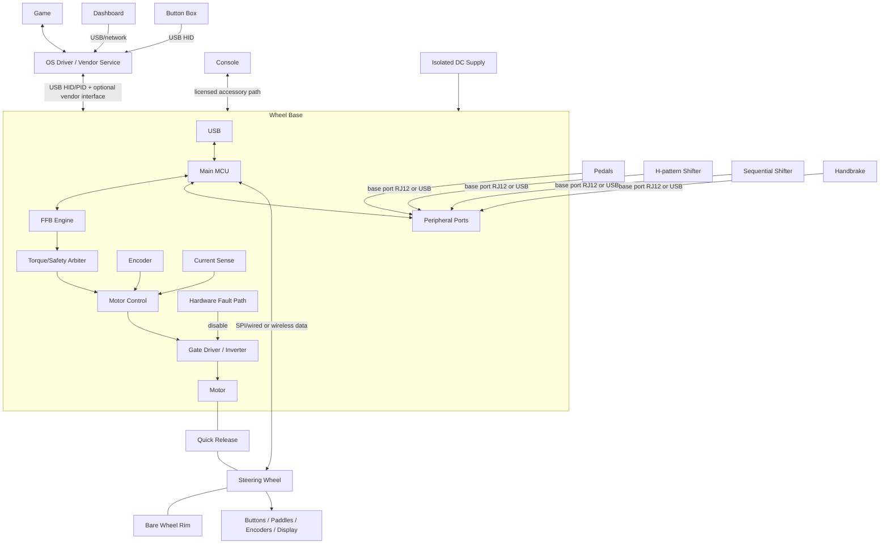

#### 1.2. Fanatec Ecosystem as a Public Example

Fanatec's public ecosystem is highly modular, designed so users can mix and match components (wheel bases, steering wheels, pedals) and upgrade incrementally. Products broadly use three tiers:
- **CSL (ClubSport Light)**: The entry-level, budget-friendly tier, typically using plastic and basic metal components.
- **ClubSport**: The mid-range enthusiast tier, utilizing premium materials like aluminum and carbon fiber with more advanced electronics.
- **Podium**: The flagship, professional-grade tier, designed for maximum torque, durability, and customization using industrial-grade materials.

Tier labels help navigation but do not prove that two products are electrically, mechanically, or platform compatible.

The wheel base is the central system hub for a console setup. Compatible pedals, shifters, and handbrakes connect to the base, which exposes one licensed USB path to the console. On PC, supported peripherals may instead operate as independent USB devices. A Ready2Race bundle is a purchasing package, not a new interface standard.


| Platform | Fanatec License Location | Practical Rule |
|---|---|---|
| Windows PC | No console security chip required | Verify Windows version, game support, driver/App, and each device's connection path. |
| Xbox | Xbox-licensed steering wheel or hub | The licensed wheel/hub enables the compatible base and base-connected peripherals on Xbox. |
| PlayStation | PlayStation-licensed wheel base | Compatible wheels and base-connected peripherals inherit PlayStation support through that base. |

*Note: Combining a PlayStation-licensed wheel base with an Xbox-licensed steering wheel typically creates a cross-compatible setup that works on PlayStation, Xbox, and PC.*

As of 2026-02-16, Fanatec states that wheels and bases purchased through its store use QR2 by default and that QR1 is discontinued. Legacy QR1 hardware remains relevant, but Base-Side and Wheel-Side generations must match and upgrade support is model-specific.

#### 1.3. Drive Types

Sim racing wheel bases are generally categorized by their mechanical torque delivery systems:

- **Gear-driven bases:** Low-cost mechanism but introduces mechanical backlash.
- **Belt-driven bases:** Provides smoother delivery but introduces mechanical compliance/stretch.
- **Direct-drive bases:** The motor shaft connects directly to the steering rim. Offers the lowest transmission error and demands the highest torque and safety considerations.

#### 1.4. Firmware Boundaries

Firmware shall establish independent ownership boundaries for connectors, power domains, USB descriptors, platform modes, and torque limits. Firmware shall verify identity, routing, timing, calibration, and update compatibility before enabling operation.

#### 1.5. Form Factors and Driving Styles

Peripherals are generally tailored to specific simulated driving styles:
- **Formula:** Rectangular/butterfly steering wheels optimized for limited rotation.
- **GT:** D-shaped or round steering wheels with extensive button sets.
- **Rally & Drift:** Perfectly round wheel rims prioritizing rapid, slip-angle rotation.

### 2. Physical and Mechanical Fundamentals

This section covers the underlying physical principles of sim racing hardware, focusing on torque, motion dynamics, and sensing. It bridges the gap between mechanical design and embedded system control.

- **Torque (N·m)** is the product of tangential force and radius. Larger steering rims reduce the required hand force at an equal shaft torque.
- **Inertia** resists angular acceleration.
- **Damping** opposes velocity.
- **Friction** opposes motion.
- **Cogging** is position-dependent magnetic torque ripple inherent to the motor design.

### 3. Product Breakdown

This section decomposes the overall system into specific functional subsystems. It identifies the hardware capabilities and firmware responsibilities for each module.

#### 3.1. Subsystem Matrix

The subsystem matrix outlines the allocation of responsibilities across distinct hardware modules.

| Subsystem | Hardware / MCU Class | Firmware Responsibilities | Communication | Power / Update |
|---|---|---|---|---|
| Wheel base | Main MCU; optional motor MCU/ASIC; encoder; inverter; NVM | USB, FFB, input aggregation, safety, calibration | USB; SPI/UART/CAN internally | External DC; USB bootloader/recovery |
| Steering wheel | Low-power MCU, GPIO expanders, Hall sensors, LEDs/LCD | Scan, debounce, encoder decode, display, identity, FFB unlock | QR wired link (SPI commonly spoofed by emulators), wireless, or USB | QR/inductive/USB/battery; pass-through/USB/OTA |
| Pedals | Sensors (Potentiometers, Hall effect), load-cell AFE, ADC, optional MCU | Sampling, filtering, calibration, HID | Analog/digital base port (RJ12) or USB | Base/USB; none or USB update |
| H-pattern shifter | Two-axis Hall/switch array, optional MCU | Gate thresholds, hysteresis, impossible-state rejection | Analog, GPIO, digital bus, USB | Base/USB |
| Sequential shifter | Two switches or Hall arrangement | Debounce, edge/pulse semantics | GPIO, analog, bus, USB | Base/USB |
| Handbrake | Potentiometer/Hall/load cell, optional MCU | Filter, range calibration, open/short detection | Analog, digital bus, USB | Base/USB |
| Dashboard | MCU/MPU, LCD/OLED, LED drivers | Telemetry decode, rendering, watchdog | USB, UART/CAN, Ethernet/Wi-Fi | USB/auxiliary; USB/OTA |
| Button box | Low-power USB MCU, matrix/expanders | Scan, debounce, descriptors | USB HID | USB; bootloader |
| Power board | Protection, DC bus, buck/LDO, sense, inverter | Sequencing, monitoring, regeneration policy | ADC/GPIO to controllers | External isolated DC |
| Motor controller | Real-time MCU/DSP/ASIC, ADC/timers | Encoder/current acquisition and bounded PWM | SPI/CAN/PWM from main MCU | Logic and DC bus; base-bundled update |
| USB interface | Integrated/external PHY, ESD | Enumeration, reports, endpoint lifecycle | USB control/interrupt; optional vendor interface | Self-powered base with VBUS sensing |

**Figure 3-1: Wheel Base Core Data Path**

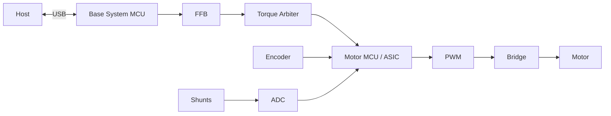

**Figure 3-2: Pedal and Analog Sensor Data Path**

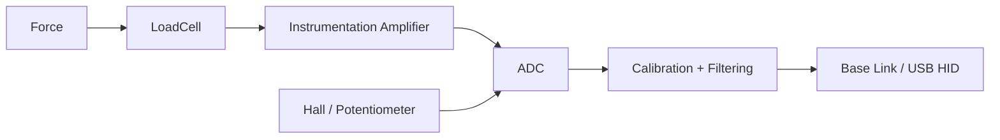

**Figure 3-3: Steering Wheel Data Path**

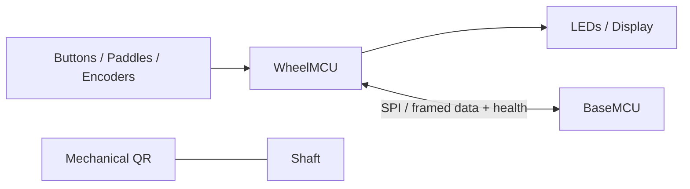

#### 3.2. Component Identity and Health

Firmware shall treat each intelligent component as a versioned node. Each node shall report its identity, capabilities, boot state, application state, health, and recovery status. Firmware shall implement fault handling for passive sensors, including cable-fault, rail out-of-bounds, range limits, and signal plausibility checks.

### 4. Force Feedback Overview

This section describes the theoretical basis of force feedback (FFB). It traces how virtual physics events are translated into physical shaft torque.

Force feedback converts simulation-defined physical effects into bounded shaft torque while returning steering position and controls to the simulation.

#### 4.1. Feedback Stages

The following stages describe the path from the game engine to physical torque.

| Stage | Responsibility |
|---|---|
| Game | Calculate virtual steering forces and physics events |
| API / Driver | Express effects through the supported OS contract |
| USB Transport | Deliver and validate reports |
| PID Manager | Allocate effects; maintain duration, envelope, conditions, and start/stop state |
| FFB Mixer | Combine active effects and apply configured filters |
| Torque Arbiter | Enforce gain, maximum torque, slew rate, thermal derating, enable state, and freshness limits |
| Motor Control | Track torque and current demand derived from feedback |
| Power Stage | Produce physical torque using the motor |
| Safety | Detect hardware faults and actively remove torque |

**Figure 4-1: Force Feedback Pipeline**

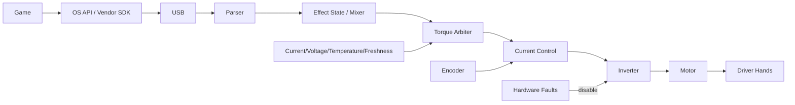

**Figure 4-2: Logical Force Feedback (FFB) Data Path**


#### 4.2. FFB Firmware Constraints

The firmware shall validate and schedule all incoming effects. The FFB mixer shall combine effects without arithmetic overflow. The system shall apply all safety and power bounds after the mixing stage. If the host link goes stale, the system shall execute an explicit torque decay and disable policy. Firmware shall not allow any software command to bypass physical or thermal limits. Clipping occurs when the demanded torque exceeds the active limit, causing different large forces to collapse to the same maximum and detail to be lost.

### 5. Hardware Architecture

This section details the internal hardware components of a direct-drive wheel base. It specifies the physical control loop and required electronic safeguards.

#### 5.1. Direct-Drive Base Architecture

The core wheel base architecture is separated into a system management domain and a real-time motor control domain. Direct-drive bases commonly use three-phase BLDC/PMSM motors with encoder feedback, phase-current sensing, Pulse Width Modulation (PWM), a gate driver, and an inverter.

The motor is a three-phase PMSM — a wound steel stator around a permanent-magnet rotor on the steering shaft — and the inverter is the six-MOSFET power stage that synthesizes its three phase currents from the DC bus:


The inverter's three half-bridges each set one phase's voltage by PWM; the two switches in a leg are never on together (dead-time prevents a DC-bus short), and low-side shunts return the phase-current measurement the FOC loop needs.

**Figure 5-1: Hardware Architecture Block Diagram**

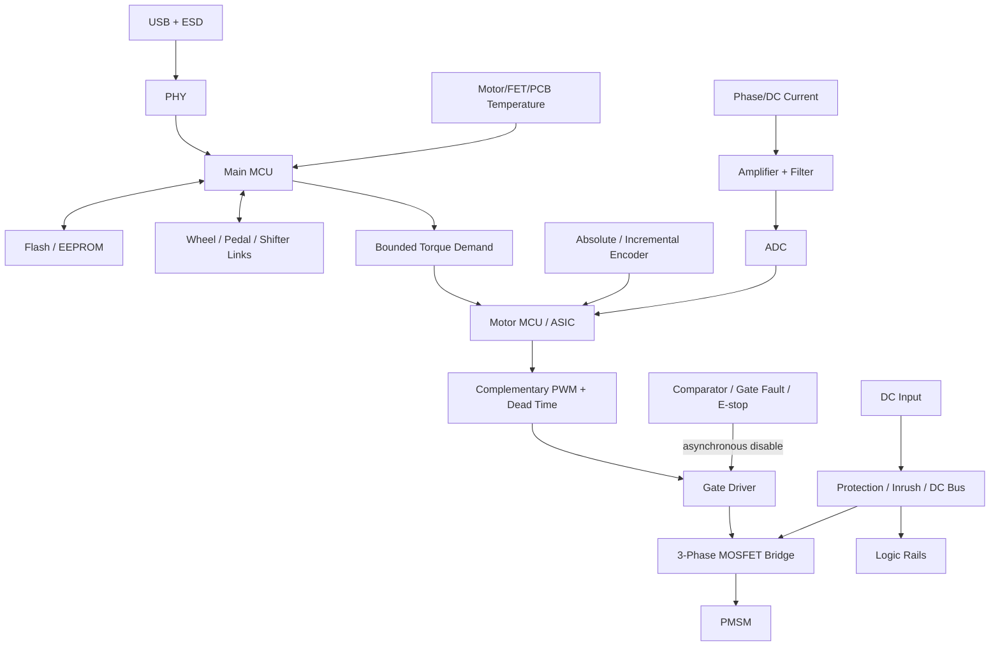

| Block | Responsibility | Firmware Requirement |
|---|---|---|
| Main MCU | Host/peripheral protocols and system policy | Shall enforce scheduling and version compatibility |
| Motor MCU/ASIC | Real-time current/torque path | Shall meet deterministic deadlines and fault responses |
| PMSM/BLDC | Torque actuator | Shall operate within motor parameters and thermal limits |
| Encoder | Angle/speed feedback | Shall validate CRC, status, wrap, direction, offset, and timeout |
| Current sensing | Phase/DC current feedback | Shall calibrate offset, gain, saturation, and align with the PWM sample window |
| Advanced timer | PWM and ADC trigger | Shall generate complementary outputs with dead time and break input support |
| Gate driver/inverter| Switch DC into three phases | Shall default to off; shall immediately respond to hardware faults |
| NVM | Firmware, calibration, profiles, fault records | Shall guarantee atomic writes and support wear levelling |

#### 5.2. Control Domain Design

The system may use a single MCU or a split architecture (Main MCU + Motor MCU/ASIC). 

Field-Oriented Control (FOC) transforms rotor angle and current measurements to regulate the torque-producing current. The firmware shall ensure high accuracy and synchronized PWM/ADC timing. Hardware-level overcurrent and break inputs shall override software control. Firmware shall synchronously trigger the ADC within a valid middle-of-PWM window and shall calibrate current-sense offsets during initialization.


The "valid middle-of-PWM window" is the key timing detail: a triangular carrier compared against each phase's duty command generates the gate signals, and the ADC samples current at the carrier peak — the quiet midpoint of the switching period — so the reading is not corrupted by switching-edge noise. The dead-time zoom shows the brief both-off gap that prevents shoot-through on every transition.

### 6. Hardware Interaction

This section outlines how firmware interacts with specific hardware peripherals. It defines the mapping between electrical interfaces and microcontroller features.

#### 6.1. Peripheral Interfaces

Firmware shall configure and manage MCU peripherals to safely interface with external hardware.

| Connection | MCU Peripheral | Firmware Requirement |
|---|---|---|
| Encoder | SPI/SSI/BiSS-C/ABZ, timer, DMA | Shall verify deadline, CRC, wrap, direction, and timeout |
| Current amplifier | ADC, PWM trigger, DMA | Shall verify sampling window, offset, gain, and saturation |
| MCU PWM to gate | Advanced timer, break GPIO | Shall configure dead time, safe reset, and break latency |
| Gate fault to MCU | Break input, GPIO | Shall execute hardware-first shutdown and latch the fault record |
| Rim to base | CAN/SPI/UART/radio | Shall handle hot-plug, ESD recovery, power sequencing, and timeout |
| Pedals to ADC/bus | ADC/SPI/I2C | Shall verify open/short conditions, reference bounds, and calibration |
| Buttons to GPIO | GPIO, timer | Shall apply debounce and reject ghosting |
| Display to SPI | SPI, DMA | Shall budget bandwidth to prevent priority inversion |
| LEDs | Timer, serial bus | Shall limit current and maintain refresh rates |
| USB to host | USB device | Shall manage VBUS, reset, suspend, and endpoint lifecycle |
| NVM to MCU | QSPI/SPI/I2C | Shall implement wear levelling, atomicity, and schema validation |

**Figure 6-1: Hardware Peripheral Routing**

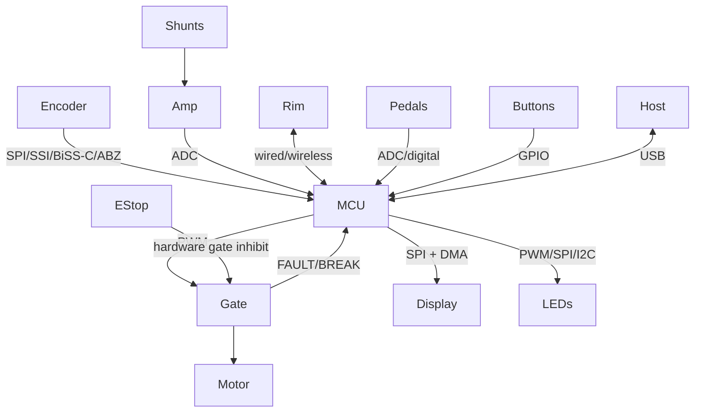

#### 6.2. Pin and State Management

The gate enable output shall default to the inactive state during reset, bootloader execution, recovery, and while pins are unconfigured. The system shall protect peripheral power rails so that a damaged external accessory cannot collapse the main control rails.

### 7. Communication Architecture

This section defines the internal and external communication links. It specifies transport protocols, capabilities, and data integrity requirements.

#### 7.1. Link Characteristics

The following links define how modules exchange data.

| Interface | Typical Role | Topology | Description |
|---|---|---|---|
| USB 2.0 FS HID | Host to device | Host/device | Standard, self-describing; handles axes, buttons, and FFB |
| USB HS | Display/vendor data | Host/device | High bandwidth; increased stack complexity |
| SPI | MCU to ASIC/encoder/display | Controller/peripheral | MHz speeds; DMA-friendly; sensitive to EMI |
| UART | Debug/boot/simple accessory | Peer framing | Universal; requires software addressing and framing |
| CAN / CAN-FD | Distributed modules | Multi-controller | Differential robust bus; has protocol overhead |
| I2C | EEPROM/sensors/expanders | Controller/target | Two wires; sensitive to bus lock and capacitance |
| RS-485 | Cabled accessories | Protocol-defined | Differential; requires framing and arbitration |
| Ethernet | Dash/service | Packet network | Standard tools; stack and variable latency |
| BLE | Wireless rim/config | Central/peripheral | Wireless; subject to RF and latency constraints |
| Wi-Fi | Dashboard/telemetry | IP network | High throughput; incurs power and security burden |

#### 7.2. Host Platform Communication

The communication strategy relies on the **Wheel Base acting as a centralized USB Hub**, with behavior adapting to the host platform's security model:

##### 7.2.1. PC (Windows/Linux)
The system shall expose standard USB endpoints to handle physical feedback and inputs. The system shall use **USB HID** (Human Interface Device) to report controls (steering axes, pedal positions, button presses), and may use **USB PID** (Physical Interface Device) to receive Force Feedback (FFB) physical effects from the game engine. Open-source drivers (e.g., `hid-fanatecff` for Linux) or vendor software can freely interact with this open protocol.

**Figure 7-1: USB Descriptor Topology (PC)**

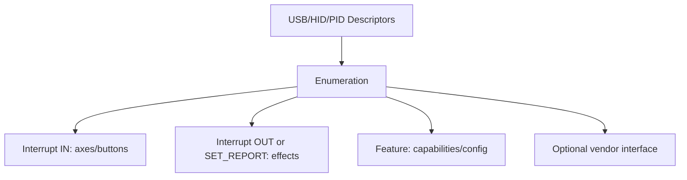

##### 7.2.2. Consoles (PlayStation & Xbox)
Consoles use licensed accessory paths. Public Fanatec guidance establishes where compatibility is owned, but it does not publish the cryptographic protocol or authorize an implementation assumption.

- **Xbox:** compatibility is provided by an Xbox-licensed steering wheel or hub attached to a compatible Fanatec wheel base.
- **PlayStation:** compatibility is provided by a PlayStation-licensed Fanatec wheel base.
- **Peripheral aggregation:** Fanatec pedals, shifters, and handbrakes must connect through the wheel base for console use. Standalone USB peripherals are a PC path unless a current product page explicitly states otherwise.

Firmware architecture shall model platform licensing as an approved product requirement. It shall not invent, emulate, or bypass unpublished console-authentication behavior.

#### 7.3. Internal Topologies

**Figure 7-2: Internal Bus Topology**

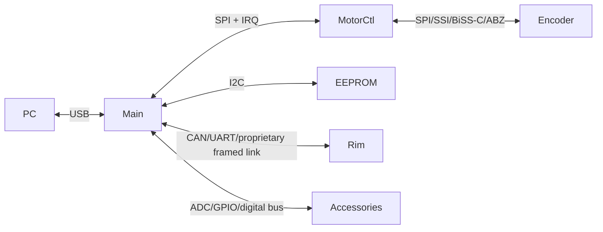

#### 7.4. Framing and Integrity

Every framed link shall define version, type, length, sequence, payload integrity (e.g., CRC), and freshness timeouts. Firmware shall enforce bounded queues, compatibility negotiation, and link recovery. DMA transfers shall enforce explicit buffer ownership, transfer deadlines, cache coherence, and error handling.

### 8. Firmware Architecture

This section provides the structural design of the firmware application. It covers modular boundaries, state machines, and lifecycle management.

#### 8.1. Software Modules

Firmware shall separate responsibilities to ensure UI and transport layers cannot interfere with the real-time control path.

**Figure 8-1: Firmware Component Architecture**

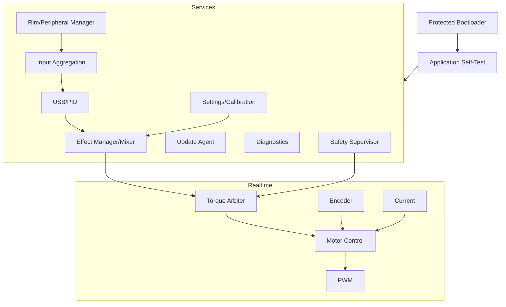

#### 8.2. Module Constraints

The following constraints shall be enforced across the firmware architecture.

| Module | Requirement |
|---|---|
| Bootloader | Shall verify, select, and recover the image; shall never energize the motor |
| USB/PID | Shall transport descriptors and effect reports; shall never write to PWM |
| FFB | Shall perform bounded arithmetic for effect mixing |
| Torque arbiter | Shall be the only software route to motor demand; shall enforce enable, limits, and freshness |
| Motor control | Shall not parse host traffic |
| Encoder/current | Shall attach a timestamp and status to every sampled value |
| Peripherals | Shall manage hot-plug events and stale device states |
| Settings | Shall not execute blocking flash writes within the hard real-time path |
| Diagnostics | Shall bound counters/traces; shall not block the control loop |
| Update | Shall disable torque during the entire update process |
| Safety | Shall classify faults and request inhibit; shall act alongside fast electrical protection |

#### 8.3. System State Machine

Firmware shall implement a defined state machine for torque authorization. The hardware inhibit shall remain authoritative at all times.

**Figure 8-2: Torque Enable State Machine**

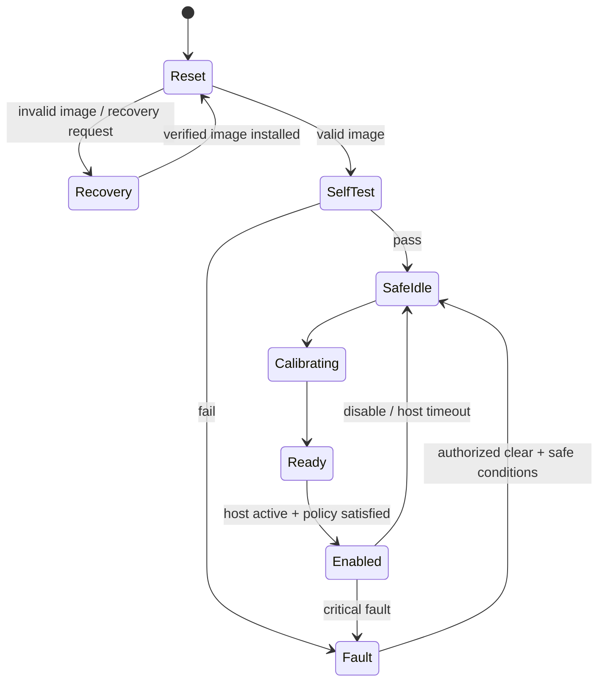

### 9. Data Flow

This section details the end-to-end movement of data through the system. It covers the handling of sensor inputs, effect updates, and hardware feedback.

#### 9.1. End-to-End Sequence

The host interactions and internal real-time loops shall execute concurrently without data tearing.

**Figure 9-1: End-to-End Data Flow Sequence**

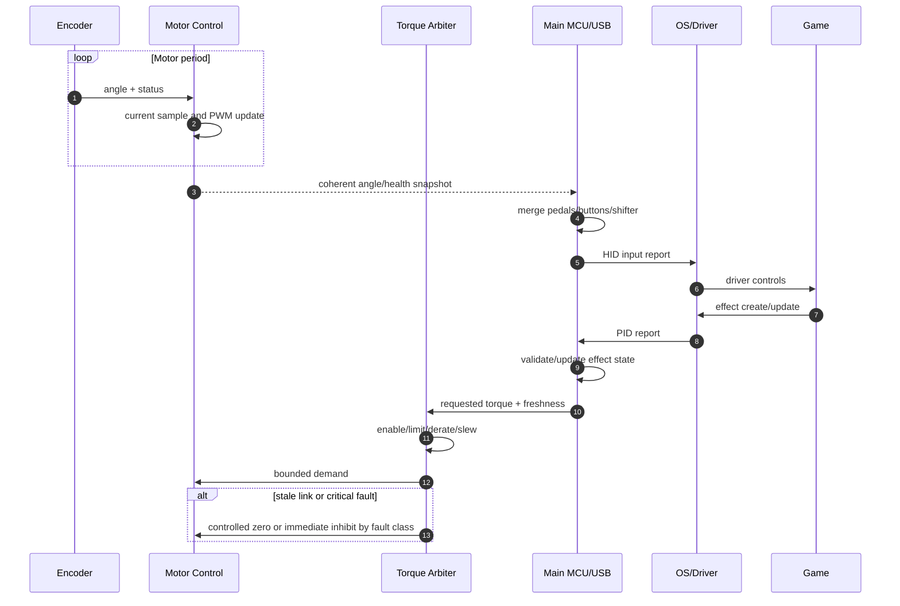

#### 9.2. Input Pipeline

Inputs from sensors shall pass through standard validation and calibration stages before being reported to the host.

**Figure 9-2: Input Processing Pipeline**

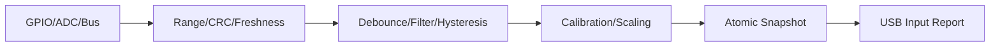

#### 9.3. Stale Data Handling

Firmware shall define and apply strict stale-data policies. Every transmitted datum shall include its value, timestamp, validity, owner, and stale policy.

**Table 9-1: Standard Datum Elements**

| Element | Type | Description |
|---------|------|-------------|
| `value` | Payload | The numerical or state value |
| `timestamp` | uint32 | Time the data was sampled or generated |
| `validity` | Boolean | Indicates if the datum is trusted or valid |
| `owner` | Enum | The subsystem that originated the datum |
| `stale_policy` | Enum | Action required when data exceeds timeout |

**Table 9-2: Stale Policies by Source**

| Data Source | Stale Policy |
|---|---|
| Torque / Effects | Shall undergo defined decay and stop; shall never hold indefinitely |
| Encoder / Current | Shall trigger immediate control fault when invalid beyond tolerance |
| Buttons | Shall clear or retain based on explicit protocol semantics |
| Pedals | Shall mark input as invalid or fall back to a documented safe report state |
| Temperature | Shall apply conservative derating or fault on invalid sensor |
| Rim telemetry | Shall clear disconnected controls and stop display updates |

Firmware shall use atomic snapshots or double buffers between Interrupt Service Routines (ISRs) and tasks.

### 10. Real-Time Tasks

This section defines the execution context and timing requirements for system tasks. It sets the performance targets for critical control loops.

#### 10.1. Execution Contexts

Firmware shall assign priorities ensuring the fast hardware loop and protection mechanisms preempt transport and background tasks.

**Figure 10-1: Task Preemption Hierarchy**

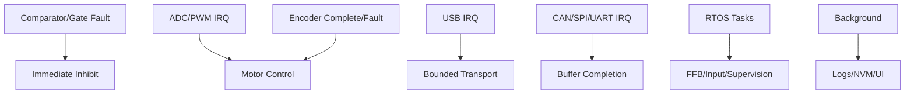

#### 10.2. Timing and Deadlines

The following table provides common frequency targets. Exact rates are implementation requirements. Game physics rate, USB cadence, FFB evaluation rate, motor-loop rate, end-to-end latency, jitter, and bandwidth are distinct performance metrics.

| Activity | Frequency Range | Context | Consequence of Miss |
|---|---|---|---|
| Current / FOC loop | 10–40 kHz | Timer/ADC ISR or motor core | Torque distortion, overcurrent fault |
| Encoder read | Control rate | SPI DMA / timer ISR | Stale angle calculation |
| FFB / torque arbitration | 0.5–2 kHz | High-priority task | Jitter, phase delay in feedback |
| USB Transport | Endpoint cadence | ISR + task | Dropped or delayed reports |
| Rim Link | 100–1000 Hz | DMA + task | Stale control input, delayed display |
| Pedals / Buttons | 100–1000 Hz | ADC DMA / timer task | High input latency, noise |
| Safety supervision | Hardware limit + 10–1000 Hz | Hardware / ISR / task | Delayed shutdown |
| Diagnostics / NVM | On demand | Low priority task | Must not block control execution |

#### 10.3. Real-Time Rules

Firmware shall measure Worst-Case Execution Time (WCET) under maximum traffic and DMA contention. ISR execution time shall be bounded. Firmware shall prohibit memory allocation, flash erase/write operations, and blocking I/O in the motor control paths. The system shall detect timing overruns. Hardware watchdogs shall only be serviced from the verified critical path.

### 11. Safety and Security

This section addresses fault detection and system protection. It specifies the required reactions to hazardous conditions, system compromises, and outlines proper setup protocols.

#### 11.1. Setup and Safety Requirements

This section defines the mandatory safety and operational requirements for setting up and testing sim racing equipment. Adherence is critical due to the high torque capabilities of direct-drive systems.

- The equipment shall be rigidly mounted prior to operation.
- The operator shall inspect the quick release, cables, power supply unit, and torque-off switch before operation.
- The operator should use approved software and update procedures.
- The system shall be calibrated for steering center, steering range, and pedals.
- Initial operation shall commence at a low torque setting using default filters.
- The operator shall verify motor direction, inputs, and torque-off switch functionality before normal use.
- The operator should match the hardware steering range to the game steering range.
- The operator should increase torque gradually and monitor the system for clipping, oscillation, and excessive heat.
- Operators shall keep hands, children, hair, clothing, and cables clear of rotating parts.
- Users shall never bypass physical interlocks or firmware security features.
- Modified motor hardware shall require verified direction, current scaling, bounded torque, and an independent gate disable mechanism before energizing.

#### 11.2. Hazard Control

The system shall protect the user and the hardware from unexpected behavior.

**Condition Table: Fault Reactions**

| Condition | Trigger | Action |
|---|---|---|
| `Stale host data` OR `Torque limit exceeded` | Unexpected torque | Execute controlled zero or immediate inhibit |
| `Encoder polarity differs from driven polarity` | Wrong direction | Refuse enable and latch fault |
| `Phase current > OVERCURRENT_TRIP` | Overcurrent | Hardware PWM disable via comparator break input |
| `Inverter Temp > THERMAL_LIMIT` | Overtemperature | Apply thermal derating; if exceeded, disable PWM |
| `DC Bus Voltage > OVERVOLTAGE_TRIP` | Regenerative overvoltage | Reduce or disable torque based on braking policy |
| `Encoder CRC fail` OR `Timeout` | Encoder loss | Immediate inhibit or enter validated degraded mode |
| `Signature check fail` | Update corruption | Remain in torque-disabled recovery state |
| `Watchdog timeout` | Software lockup | Trigger hardware reset; gate outputs default off |

#### 11.3. Security Posture

Firmware shall authenticate production update images. The system shall validate all external packet lengths and types. The system shall require a torque-disabled state before accepting service or debug commands. Retail firmware shall disable manufacturing debug interfaces.

**Licensed platforms and rim identity:** Public Fanatec guidance confirms the product-level license locations described above, not the internal authentication algorithm. Community rim emulators demonstrate observations for selected legacy base/rim links; they are not evidence of a universal cryptographic handshake, a current ClubSport DD/DD+ contract, or an approved console-authentication path. Treat rim identity, torque enable, and platform licensing as separate requirements until an approved interface specification proves otherwise.

### 12. Firmware Engineering View

This section outlines the engineering practices, testing strategies, and validation steps required to build the firmware.

#### 12.1. Subsystem Engineering Requirements

Engineers shall verify each subsystem's contracts, state transitions, and tests before integration.

| Subsystem | APIs and State Flow | Primary Test Target |
|---|---|---|
| Boot/update | `reset` → `verify` → `boot/recovery` | Hardware mismatch, corrupt image, power loss during flash |
| USB/PID | `detached` → `configured` → `suspended` | Descriptor validation, fuzzed reports, latency measurement |
| FFB | `idle` → `allocated` → `playing` → `stopped` | Lifecycle state, arithmetic overflow, duration wrap |
| Torque arbiter | `disabled` → `ready` → `enabled` → `fault` | Limit precedence, thermal fault logic, stale host reaction |
| Motor control | `init` → `offset cal` → `ready` → `run` → `fault` | Control math, saturation, hardware-in-the-loop (HIL) |
| Settings | `valid` → `dirty` → `commit/error` | Torn writes, wear levelling, schema migration |
| Safety | `safe` → `ready` → `enabled` → `fault` | Fault injection, verify break input precedence |

#### 12.2. Verification Sequence

Development shall follow a progression from isolated tests to full power operation. Full-torque work shall begin only after low-energy evidence proves the system can enforce bounds and shut down independently.

**Figure 12-1: Testing Progression**

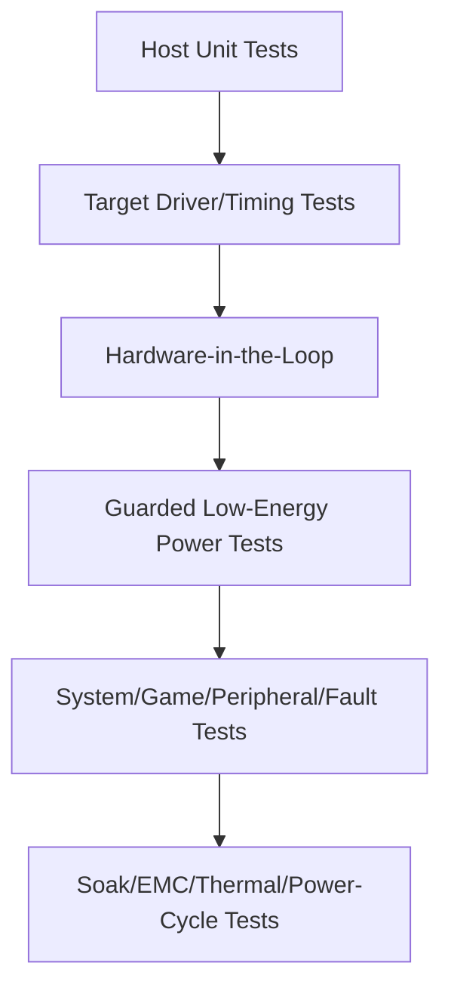

Engineers shall physically verify encoder scale and direction, ADC timing, and independent gate disable before connecting the full power supply.

### 13. Question Register (Resolved and Open)

Reviewed 2026-07-05. Items that could be answered from the knowledge base, public standards, or documented community evidence are marked **Resolved**. Items that depend on a specific product's requirements, proprietary vendor specs, or on-target measurement cannot be answered in the abstract and are re-styled as **Open — developer self-investigation**, each with a concrete method.

#### 13.1 Resolved

- **Should motion platforms, tactile transducers, cockpits, and telemetry software be expanded into separate documents?**
  **Resolved (done).** All four now exist: [`motion.md`](./motion.md), [`tactile.md`](./tactile.md), [`cockpits.md`](./cockpits.md), and [`telemetry.md`](./telemetry.md), and are in the reading path in [`README.md`](./README.md).
- **USB descriptors, report cadence, effect capacity, and vendor interface?**
  **Partially resolved (verified public model; product values Unknown).** The transport and effect model are public: USB HID for inputs and USB PID Class 1.0 for force effects (constant, periodic, condition, ramp), typically USB 2.0 Full-Speed. Report cadence follows the endpoint's interrupt interval; the control loop rates are in §10.2. What remains product-specific is the exact VID/PID, effect-pool size, and any vendor (non-HID) interface — see §13.2. Community evidence: the `hid-fanatecff` driver enumerates Fanatec devices under **VID `0EB7`** (e.g. `0EB7:0020` for the CSL DD / DD Pro / ClubSport DD base), which is *community-observed*, not an official descriptor spec.
- **Hardware torque-inhibit path and safety/regulatory targets?**
  **Resolved at the architecture level (targets are product-specific).** The required inhibit path is defined throughout §11 and in [`wheel_base.md`](./wheel_base.md) §15: an independent hardware fault latch driven by an overcurrent comparator, gate-driver fault, E-stop/torque-off, and watchdog, asynchronously disabling the gate driver regardless of software. The industry reference pattern is a Safe-Torque-Off (STO) style architecture (cf. TI TIDA-01599). The *specific* regulatory scope (e.g. which EMC/safety marks apply in target markets) is a product decision — see §13.2.
- **End-to-end latency/jitter budgets and acceptance methods?**
  **Resolved as method (numeric targets are product-specific).** Latency is stage-additive; budget and measure each stage independently (game tick → USB → FFB eval → FOC loop) rather than only end-to-end, per [`telemetry.md`](./telemetry.md) §6. Typical loop-rate anchors are in §10.2 (FOC 10–40 kHz, FFB 0.5–2 kHz). The accepted budget number itself must be set against the product's competitive/latency goals and then verified on target.

#### 13.2 Open — for developers to self-investigate

These require a specific product definition, an approved vendor spec, or bench measurement. They are engineering inputs to gather, not facts to look up.

- **Product torque, speed, inertia, rotation, acoustic, and environmental requirements.**
  *How:* derive from the target market segment and reference competitors' published specs; convert to motor sizing (continuous/peak torque, thermal duty) and confirm with a dyno/bench.
- **Supported PC/console platforms and approved licensing architecture.**
  *How:* platform licensing is contractual — obtain the console licensing program terms directly; do not infer or emulate console authentication (§11.3). PC support is verifiable against OS + game requirements.
- **Exact MCU/ASIC, encoder, gate driver, sensing topology, and power ratings.**
  *How:* select against the torque/loop-rate requirements above using vendor reference designs (e.g. Infineon PMSM FOC, TI sensored FOC, OpenFFBoard's TMC4671-based approach as a public example); validate on a bring-up board.
- **Peripheral electrical/protocol topology and ownership.**
  *How:* define per-port; for the base-proxy path, community pinouts (FendtXerion Fanatec-Pinout wiki; GeekyDeaks pedal-emulator RJ12/UART notes) are discovery input to verify electrically, not an authority.
- **Update signing, rollback, provisioning, anti-downgrade, and recovery policy.**
  *How:* choose a signing scheme (hash/CRC + authenticated image), A/B staging, and an independent recovery bootloader; see [`wheel_base.md`](./wheel_base.md) §14.
- **Calibration/version compatibility across base, motor, rim, pedals, and adapters.**
  *How:* version every node and define a compatibility matrix ([`compatibility-matrix.md`](./compatibility-matrix.md)); range-check calibration before use.
- **Diagnostics retention and retail debug-access rules.**
  *How:* decide a wear-limited critical-fault retention policy and disable manufacturing debug in retail images (§11.3).

### 14. References

This section provides citations to public standards, reference designs, and manufacturer documentation.

- [Steering rim architecture](./wheel_rim.md)
- [Wheel-base architecture](./wheel_base.md)
- [USB-IF HID specifications and tools](https://www.usb.org/hid) — HID 1.11, usage tables, PID entry point.
- [USB-IF PID Class 1.0](https://www.usb.org/sites/default/files/documents/pid1_01.pdf) — force-feedback HID reports/model.
- [OpenFFBoard public wiki](https://github.com/Ultrawipf/OpenFFBoard/wiki/) — public modular HID PID, motor-driver, encoder, and I/O architecture.
- [Fanatec Podium DD1 manual](https://assets.fanatec.com/fanatec-pwa/image/upload/downloads-prod/pdfs/P-WB-DD1-Manual-EN_web.pdf) — exposed ports, base/motor versions, update, and calibration.
- [Fanatec Ecosystem Diagram](https://help.fanatec.com/hc/de/articles/43786297099281-Fanatec-Ecosystem-Diagramm) — official ecosystem visual entry point; no unseen diagram details are inferred.
- [Fanatec Wheel Bases FAQ](https://help.fanatec.com/hc/en-us/articles/43766204938257-Wheel-Bases-A-FAQ) — current tiers, console peripheral aggregation, and PC standalone-device context.
- [Fanatec platform compatibility](https://www.fanatec.com/us-en/platforms) — Xbox wheel/hub and PlayStation base licensing rules.
- [Fanatec Steering Wheel FAQ](https://help.fanatec.com/hc/en-us/articles/43802514108433-Steering-Wheel-FAQ) — QR2 default and QR1 discontinuation date.
- [Fanatec ecosystem source register](./references.md) — review dates, community-guide use, and known stale claims.
- [Fanatec update guide](https://www.fanatec.com/eu/en/explorer/products/racing-wheels-wheel-bases/update-fanatec-firmware-and-drivers/) — base, selected wheel, USB pedal, and adapter updates.
- [lshachar/Arduino_Fanatec_Wheel](https://github.com/lshachar/Arduino_Fanatec_Wheel) — custom steering wheel SPI emulator.
- [StuyoP/Fanatec-Wheel-Barebone-Emulator](https://github.com/StuyoP/Fanatec-Wheel-Barebone-Emulator) — ATmega328p barebone wheelbase emulator.
- [Alexbox364/F_Interface_AL](https://github.com/Alexbox364/F_Interface_AL) — DIY custom steering wheels via SPI.
- [jssting/ArduinoTec-Pedals](https://github.com/jssting/ArduinoTec-Pedals) — Fanatec ClubSport Pedals replacement controller.
- [GeekyDeaks/fanatec-pedal-emulator](https://github.com/GeekyDeaks/fanatec-pedal-emulator) — proxy third-party USB pedals via RJ12.
- [StuyoP/Universal-Shifter-Interface-for-Fanatec](https://github.com/StuyoP/Universal-Shifter-Interface-for-Fanatec) — switch-based shifter interface via RJ12.
- [vnmsimulation/VNM_MOTION_CONTROLLER](https://github.com/vnmsimulation/VNM_MOTION_CONTROLLER) — DIY STM32-based hardware controllers.
- [FendtXerion3800/Fanatec-Pinout](https://github.com/FendtXerion3800/Fanatec-Pinout) — RJ12 socket pinout references.
- [gotzl/hid-fanatecff](https://github.com/gotzl/hid-fanatecff) — Linux kernel driver module for Fanatec FFB support.
- [Simucube 2 user guide](https://simucube.com/app/uploads/2022/11/Simucube_2_User_Guide.pdf) — wireless controls, USB relay, pairing, safe torque.
- [Simucube 3 guide](https://docs.simucube.com/Simucube3/index.html) — wireless QR data/power statement.
- [MOZA wheel-base support](https://support.mozaracing.com/en/support/solutions/articles/70000627811-wheel-base-faqs) — compatibility, recovery, calibration, and detection.
- [Simagic Alpha manual](https://image.simagic.com/profile/upload/2022/08/16/41a7d396-805a-439e-b0da-0b81632e2511.pdf) — public setup/update/safety context.
- [Logitech TRUEFORCE](https://www.logitechg.com/en-za/innovation/trueforce.html) — public physics/audio and processing claims.
- [Infineon PMSM FOC reference](https://documentation.infineon.com/aurixtc3xx/docs/kbv1711616051757) — current sampling, PWM trigger, offset calibration.
- [TI TIDA-01599](https://www.ti.com/tool/TIDA-01599) — assessed industrial STO reference architecture.
- [EP1501004A3](https://patents.google.com/patent/EP1501004A3/en) — public motor/encoder/controller architecture context.
- [Simucube FFB effects](https://docs.simucube.com/TunerSoftware/wheelbases/wheelbaseeffects.html)
- [TI sensored FOC](https://software-dl.ti.com/msp430/esd/MSPM0-SDK/2_04_00_06/docs/english/middleware/motor_control_pmsm_sensored_foc/doc_guide/doc_guide-srcs/Sensored_FOC_Motor_Control_Library.html)


## Force Feedback (FFB) in Sim Racing — A Complete Explanation

> Version: 1.0 · Compiled: 2026-07-05
> Scope: how a sim‑racing steering system turns virtual physics into real forces on your hands — from the theory of force, through the servo motor and power electronics, to every category of force and vibration you can feel, and how it is tuned and kept safe.
> Grounding: this document is built on the accompanying study base (`wheel_base.md`, `sim_racing_research.md`, `tactile.md`, `telemetry.md`, `glossary.md`) and its original teaching illustrations, plus the *Inside Sim Racing Tech* explainer video. Product‑specific numbers (torque, latency, sensor resolution) are quoted as **manufacturer/advertised claims**, not independently verified measurements, consistent with the study base's evidence model.

---

### 1. What Force Feedback Actually Is

Force feedback is best understood not as a feature bolted onto a steering wheel, but as one half of a **closed, bidirectional human‑machine loop** that runs continuously while you drive.

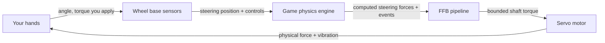

Two things are happening at once, thousands of times per second:

- **Input (you → game):** the base measures exactly where the wheel is pointed and reports it, along with pedals and buttons, to the simulation.
- **Output (game → you):** the simulation calculates the forces that *would* be acting on a real steering rack and commands the motor to reproduce a scaled, safe version of them at the rim.

The definition matters because it sets expectations. Force feedback is *not* a rumble effect layered on top of a game; it is the physics of a virtual car projected onto a real motor. When the tires load up, the wheel gets heavy. When grip is lost, the wheel goes light. When you hit a kerb, you feel the impact. The quality of a system is measured by how faithfully and how quickly it closes that loop.

The study base states this precisely: *"Force feedback converts simulation‑defined physical effects into bounded shaft torque while returning steering position and controls to the simulation."* Everything else in this document is the machinery that makes that one sentence real.

---

### 2. The Theory of Force: Torque, and the Four Base Sensations

#### 2.1 Torque is the currency of FFB

A steering wheel is a rotating object, so the relevant physical quantity is not *force* (newtons) but **torque** (newton‑metres, N·m) — a rotational force. Torque is the product of a tangential force and the radius at which it acts:

$$\tau = F \times r$$

This single relationship has a practical consequence people feel immediately: **for the same shaft torque, a larger‑diameter rim requires less hand force.** A 33 cm GT rim on a 10 N·m base feels heavier at the grips than a 30 cm rim on the same base, because your hands are at a shorter lever. Torque is the honest number; "how heavy it feels" also depends on rim size and grip position.

> **Language discipline (from the glossary):** *FFB strength* is a **setting** (often a percentage); *torque in N·m* is a **physical output**. They are related but not interchangeable. "Set FFB to 100%" and "the base produces 15 N·m" describe different things.

#### 2.2 The four base sensations FFB synthesizes

Beyond the raw torque signal, almost everything a wheel does to your hands is built from a small set of physical behaviors. The study base defines the core four (plus one motor artifact):

| Sensation | Physical meaning | What it feels like at the wheel |
|---|---|---|
| **Torque** | Tangential force at a radius | The wheel actively pushing/pulling your hands |
| **Inertia** | Resistance to *angular acceleration* (effective mass) | The wheel feels "heavy" to start or stop turning |
| **Damping** | Resistance proportional to *velocity* | Movement is smoothed; fast flicks are resisted |
| **Friction** | Resistance opposing *motion*, including slow motion | A constant drag, like a stiff steering rack |
| **Cogging** *(artifact)* | Position‑dependent magnetic torque ripple in the motor itself | A faint notchiness as the wheel turns; a thing to *minimize*, not a driving cue |

These are the primitives. Grip, self‑aligning torque, kerbs, and weight transfer are all *expressed* through combinations of torque, inertia, damping, and friction — modulated in real time by the game's physics.

---

### 3. The Servo Motor: How the Force Is Physically Made

To feel anything, a real motor has to produce real torque. Modern direct‑drive bases use a **three‑phase PMSM** (Permanent‑Magnet Synchronous Motor, closely related to a BLDC motor): a wound steel **stator** surrounding a permanent‑magnet **rotor** that is coupled directly to the steering shaft.


#### 3.1 Why you can't just apply DC

A PMSM cannot be driven from raw DC. It needs **three sinusoidal phase currents, offset 120° from one another**, which together create a *rotating magnetic field* in the stator. The permanent‑magnet rotor tries to follow that field — and the "effort" of following it, controlled precisely, *is* the torque you feel. Steer the field, and you steer the force.

#### 3.2 The inverter: turning a DC bus into three phases

The component that synthesizes those three phases is the **inverter** — six power MOSFETs arranged as three **half‑bridges** (one per phase), fed from a fixed DC bus.


Each phase has a high‑side switch (to DC+) and a low‑side switch (to DC−). Rapidly switching them with **PWM** (Pulse‑Width Modulation) sets the *average* voltage on each phase; doing this on all three legs with the right timing produces the rotating field. Two hard rules fall out of this:

- **Dead‑time is mandatory.** The two switches in one leg must never be on together, or they short the DC bus (**shoot‑through**) and destroy the MOSFETs. Hardware enforces a brief both‑off gap on every transition.
- **Low‑side shunts measure current.** Small resistors in each low‑side leg let the controller read the actual phase current — the feedback the control loop needs to regulate torque.

#### 3.3 Field‑Oriented Control (FOC): the heart of "feel"

The algorithm that makes a modern DD wheel feel clean rather than notchy is **Field‑Oriented Control**. FOC continuously reads the **rotor angle** (from the encoder) and the **phase currents** (from the shunts), then mathematically separates the current into two components:

- the part that produces useful **torque** (the *q‑axis* current, `Iq`), and
- the wasteful part that just pushes against the magnets (the *d‑axis*, driven toward zero).

The controller then commands exactly the torque current requested. The governing relationship is beautifully simple:

$$\tau \approx K_t \times I_q$$

Torque is (to first order) proportional to the torque‑producing current. **Want more force? Push more current. More current makes more heat** — which is why thermal management (§12) exists.

#### 3.4 When the current is measured matters as much as the value

FOC only works if the current reading is clean, and the switching edges of the MOSFETs inject electrical noise. So the ADC (analog‑to‑digital converter) is triggered at the *quiet* point — the **middle of the PWM period**, away from the switching edges.


A triangular carrier is compared against each phase's duty command to generate the gate signal; sampling at the carrier peak (the middle of the on‑time) captures a clean average value. This "valid middle‑of‑PWM window" is a core timing requirement of any competent motor controller, and it runs *very* fast — the current/FOC loop typically executes at **10–40 kHz**.

#### 3.5 The two sensors FOC depends on

| Sensor | Reads | Why FFB needs it |
|---|---|---|
| **Encoder** (absolute SPI/SSI/BiSS‑C, or ABZ / Sin‑Cos) | Rotor/shaft angle & speed | FOC must know rotor position to commutate correctly; it is also the steering angle reported to the game |
| **Current sensing** (shunts + amplifier + synchronized ADC) | Phase currents | Closes the torque loop: `τ ≈ Kt × Iq` requires knowing `Iq` |

Encoder **resolution** is the ceiling on how finely the wheel can *sense* position, and therefore how finely it can reproduce small forces — this is the "23‑bit / 8‑million‑points" claim discussed in §5.

---

### 4. Drive Types: Gear vs Belt vs Direct Drive

How the motor's torque reaches the rim decides how much detail survives the trip.

| Drive type | Cost | Mechanism | Characteristic artifact |
|---|---|---|---|
| **Gear‑driven** | Low | Motor drives rim through a gear reduction | **Backlash** — a small dead zone / notchiness on direction change |
| **Belt‑driven** | Mid | Motor drives rim through a belt | **Compliance / stretch** — the belt slightly absorbs and delays fast detail |
| **Direct‑drive (DD)** | High | Motor shaft *is* the steering shaft | **Lowest transmission error** — highest fidelity; also the highest torque and the greatest safety burden |

The reason direct drive dominates the high end is that every mechanical stage between the motor and your hands is a **filter** that blurs the signal. Gears add a dead zone; belts add stretch and lag. Removing the transmission removes the filter: with DD, the tiny high‑frequency textures the motor produces arrive at the rim essentially intact. That fidelity is exactly why DD systems must be treated as hazardous — there is nothing mechanical between an industrial‑grade motor and your wrists.

---

### 5. High‑Resolution Motor Technology: Torque, Latency, Fidelity

A direct‑drive base is not "a controller with stronger rumble." It is an industrial servo drive with precision sensing. Three specifications describe how convincing it can be: **how strong**, **how fast**, and **how detailed**.

#### 5.1 Strength — peak vs holding torque (N·m)

More torque means a wider dynamic range: the wheel can be feather‑light in a slow hairpin and genuinely fight you in a high‑speed corner. But there is a subtlety the glossary insists on — **peak torque and holding torque are not the same number and are not directly comparable:**

| Metric | Meaning |
|---|---|
| **Peak torque** | Highest short‑duration torque under specified conditions |
| **Holding / sustained torque** | Torque maintained over time within thermal & electrical limits |

Representative advertised figures from the study base (as manufacturer claims, subject to change and firmware updates):

| Product (example) | Advertised torque | Note |
|---|---|---|
| Fanatec CSL DD | 5 N·m (8 N·m with Boost Kit) | Entry direct drive |
| Fanatec ClubSport DD / DD+ | 15 / 18 N·m holding (post firmware V1.4.2.3) | Raised in software, no hardware change |
| Fanatec Podium DD1 / DD2 | up to 20 / 25 N·m **peak** | Previous flagship generation |
| Fanatec Podium DD (2026) | 25 N·m holding; up to 33 N·m peak overshoot | Current flagship |
| VNM Direct Drive Xtreme (vendor claim) | 32 N·m | High‑output enthusiast base |

> Available torque is *also* capped by the attached steering wheel, quick release, firmware, and any Low‑Torque Mode — the motor's rating is a ceiling, not a guarantee.

#### 5.2 Speed — latency

Realism collapses if the force arrives late. The wheel must respond to an in‑game event (kerb strike, snap of oversteer) with as little delay as possible so the cue reaches your hands essentially in lockstep with what you see. Vendors advertise very low figures — for example, **Simagic markets ~1 ms latency** on its Alpha line — which, if achieved end‑to‑end, means information reaches your hands almost instantaneously.

Latency is not a single number, though; it is **stage‑additive** across the whole chain (game physics tick → USB transport → FFB evaluation → motor loop). The useful engineering practice is to budget and measure each stage, not just the end‑to‑end figure. The study base lists typical rates: FOC loop 10–40 kHz, FFB/torque arbitration 0.5–2 kHz, USB at endpoint cadence.

#### 5.3 Detail — fidelity and sensor resolution

Fidelity is the ability to reproduce *small* forces cleanly — engine idle vibration, the fine graining of a tire near its limit, the texture of coarse asphalt. It is gated by:

- **Encoder resolution.** The finer the angle sensor, the more distinct steps of position and force the system can resolve. Vendors quote large numbers here — e.g. a **23‑bit sensor advertised as reproducing over 8 million data points per rotation** (VNM). More bits = smaller quantization steps = smoother small‑signal detail (given a low‑noise signal). The same "more bits = finer steps" principle governs pedal ADCs:

  

- **Low transmission error** (direct drive, §4) so the detail is not filtered out mechanically.
- **A rigid cockpit** so the detail is not absorbed by a flexing frame (§9.3, illustrated below).

Put together: **strength gives dynamic range, low latency keeps it synchronized with the sim, and resolution + rigidity preserve the fine texture.** A convincing wheel needs all three; a big torque number alone does not buy realism — indeed the glossary warns that "more N·m does not automatically mean more detail or realism."

---

### 6. The FFB Signal Chain: From Game Physics to Your Hands

A single force starts as a number in the game engine and ends as current in the motor. The study base calls this "the FFB journey." Each stage has one job.

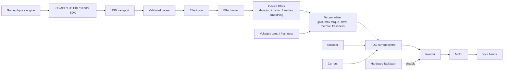

| Stage | Responsibility |
|---|---|
| **Game engine** | Computes the virtual steering forces and physics events every physics tick |
| **API / driver** | Expresses effects through the OS contract — DirectInput, **USB HID PID**, or a vendor SDK |
| **USB transport** | Delivers and validates the effect reports |
| **PID manager / effect pool** | Allocates effects and tracks their duration, envelope, conditions, and start/stop state |
| **FFB mixer** | Combines all active effects into one signal **without arithmetic overflow** |
| **Device filters** | Apply the user's configured damping / friction / inertia / smoothing |
| **Torque arbiter** | The single gatekeeper: applies gain, max torque, **slew‑rate**, thermal derating, enable state, and **freshness** limits |
| **Motor control (FOC)** | Converts the bounded torque request into phase current / PWM — it knows nothing about "effects," only current |
| **Power stage** | Produces the physical torque |
| **Safety** | Independently removes torque on a hardware fault, no matter what software wants |

Two design principles are worth internalizing:

- **The torque arbiter is the only software route to the motor.** No effect, however it's labelled, can bypass the final safety and power bounds.
- **Freshness is enforced.** If the host link goes stale (game crash, USB drop), the base runs a defined **torque decay and disable** policy rather than freezing at the last commanded force. Stale encoder/current data, by contrast, is treated as a critical fault and triggers immediate inhibit.

---

### 7. What Your Hands Actually Feel

This is the heart of the request: the catalog of sensations a good FFB system delivers, and the physics behind each. All of them are ultimately expressed through the torque/inertia/damping/friction primitives of §2, modulated in real time by the game.

#### 7.1 Tire physics — the primary language of FFB

The steering wheel does not merely vibrate; it **rotates and creates drag** based on the interaction between the tires and the road. This is where most of the "information" lives.

**Grip and cornering load.** When you turn into a corner, the front tires build a **slip angle** and deform, generating lateral force. That force acts through the steering geometry and shows up at your hands as **increasing weight** — the wheel gets heavier the harder the tires are working. Reading that build‑up is how you find the limit by feel: you sense the tire loading up, approaching its peak, without looking at anything on screen.

**Loss of traction (understeer).** When the front tires exceed their grip and start to **understeer**, they can no longer generate the lateral force that was loading the wheel. The result is dramatic and instantly recognizable: the **drag on the steering suddenly drops and the wheel goes light.** That lightening is an early warning — you feel the car begin to lose the front *before* you see the nose wash wide. Adding more lock at that point does nothing, and the light wheel tells you so.

**Self‑aligning torque (SAT) and letting the wheel work.** In a real car, caster and pneumatic trail make the front wheels naturally try to **return to center** — this is self‑aligning torque. High‑end wheels reproduce SAT faithfully, which is what lets you *"let go" and let the car balance itself.* During a controlled slide (oversteer/drift), the SAT will actively spin the wheel toward the correct amount of counter‑steer; a good driver rides that self‑aligning force rather than fighting it, catching the slide with a light touch. When the rear steps out, you feel the wheel try to countersteer *for* you — follow it, don't resist it.

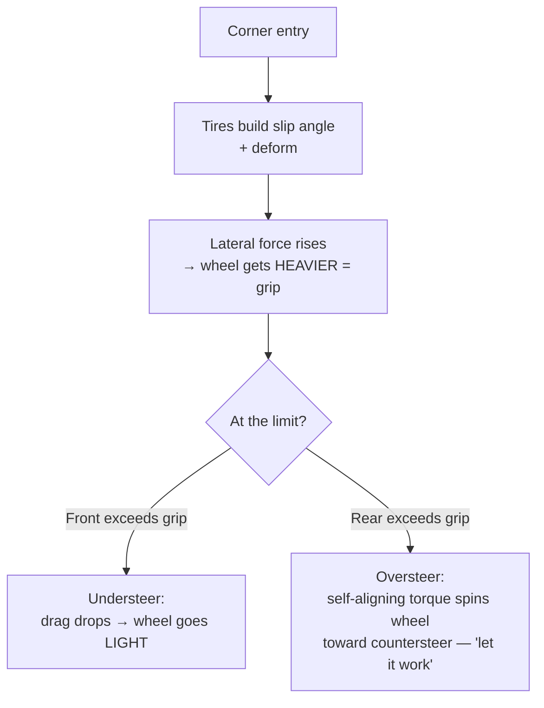

#### 7.2 Suspension and weight transfer

The simulation calculates the load on each wheel in real time and folds it into the steering signal.

**Weight transfer changes wheel weight.** Under **hard braking**, load shifts forward onto the front tires; they grip harder and the **steering gets heavier.** Under **acceleration**, the front unloads and the **steering goes lighter.** These slow, large‑scale changes in wheel weight are your read on what the chassis is doing dynamically — they tell you when the front is planted and when it's floating.

**Road surface and impacts.** Every **kerb (rumble strip)**, pothole, expansion joint, and the transition from asphalt to grass or gravel comes through as vibration and jolts of torque. A kerb strike is a sharp, structured buzz; grass or a gravel trap is a coarse, chaotic rumble; a smooth track surface is quiet. This is layered *on top of* the tire and weight signals, so you feel the road texture through the steering load rather than instead of it.

#### 7.3 Vibration and texture effects

Higher‑frequency content rides on the main force signal:

- **Engine / RPM vibration** — a periodic buzz that rises with revs; strongest with high‑resolution DD hardware that can reproduce fine, fast oscillations.
- **ABS pulsing and brake lockup** — the pedal/wheel feedback when a front wheel locks or ABS modulates.
- **Tire graining / scrub** — the fine "scrubbing" texture as a tire approaches or passes its grip limit.
- **Wheelspin** — a fluttery vibration when the driven wheels break traction.

Depending on the title, these are either **physics‑derived** (computed from the actual simulated contact patch) or **canned** (pre‑authored effects triggered by an event). Physics‑derived effects scale naturally with the situation; canned effects are more uniform. The glossary flags this distinction under *Road Effects*.

#### 7.4 Condition effects (the "feel" primitives, as knobs)

The four base sensations from §2 also appear as *deliberately configurable* effects that shape the overall character of the wheel:

| Effect | What it does at the wheel | Tuning name (Fanatec) |
|---|---|---|
| **Spring** | Pulls the wheel toward a center point | SPR (scales game‑requested spring; not automatic centering) |
| **Damper** | Resists *speed* of movement — calms and stabilizes | Damping / NDP |
| **Friction** | Constant resistance to motion, even slow | NFR (Natural Friction) |
| **Inertia** | Adds simulated steering mass — useful with light rims | NIN (Natural Inertia) |

Used in moderation these add realism and stability; overused, they **mask detail** and add fatigue — too much friction or damping hides exactly the fine cues §7.1–7.3 are trying to deliver.

---

### 8. The Force‑Effect Taxonomy (HID PID)

Under the hood, the game does not send "understeer" or "kerb." It sends standardized **USB PID (Physical Interface Device)** effects that the base combines. Understanding the taxonomy explains what the FFB pipeline is actually mixing.

| PID effect class | Examples | Used to convey |
|---|---|---|
| **Constant force** | A steady torque of a given magnitude/direction | The main steering load — grip, weight transfer, SAT |
| **Periodic** | Sine, square, triangle, sawtooth vibrations | Engine buzz, kerbs, ABS, road texture |
| **Condition** | Spring, damper, inertia, friction | Centering and the "feel" primitives (§7.4) |
| **Ramp** | A force rising/falling linearly over time | Transitional effects |
| **Envelope** (modifier) | Attack/fade shaping on the above | Smooths how effects start and stop |

The **effect pool** allocates these; the **mixer** sums the active ones; the **arbiter** bounds the result. The realism of a title depends heavily on how intelligently it maps its physics onto these primitives — a great sim drives the *constant force* from a genuine tire model, while a weaker one leans on canned periodics.

---

### 9. Vibrations on the Hand vs. in the Seat

"Vibration you feel" in a sim rig comes from up to **three separate systems**, and conflating them is a common source of confusion. They must stay separate — both for fidelity and for safety.

```mermaid
flowchart TD
    Game[Game / telemetry] --> FFBpath[FFB motor path]
    Game --> Rumble[Rim rumble motors]
    Game --> Tactile[Tactile transducers / bass shakers]
    FFBpath -->|torque + fine texture| Hand1[Hands - via steering shaft]
    Rumble -->|buzz| Hand2[Hands - via rim]
    Tactile -->|low-frequency body| Seat[Seat / chassis / pedals]
```

#### 9.1 The main FFB motor (hands, via the shaft)

The primary and highest‑fidelity path. On a good DD base this alone can reproduce engine vibration and road texture as *modulation of the main torque signal* — the fine, fast content described in §7.3. This is "vibration on the hand" in its truest form.

#### 9.2 Rim rumble / shaker motors (hands, via the rim)

Some steering wheels contain small dedicated vibration motors, controlled by a **separate** strength setting (Fanatec's **SHO** — Shock/Vibration Strength). Crucially, **SHO controls those buzz motors, not the base's main FFB motor** — turning it up does not increase steering force, and it is a coarser effect than motor‑generated texture.

#### 9.3 Tactile transducers / "bass shakers" (body, via the seat & frame)

These are a **distinct vibration subsystem**, fed from telemetry or a low‑frequency audio channel, that shake the *seat, panel, or frame* — engine rumble, kerb strikes, wheel lock felt through your body rather than your hands. The study base is emphatic: they **must be isolated so they do not corrupt FFB or sensor readings.**


A **crossover** keeps the shaker inside its low band (green) so its energy does not sum into the wheel's FFB detail band (purple) or drive a structural resonance of the rig (red). Mount transducers to the seat or a dedicated panel (not rigidly into the main FFB load path), use compliant mounts on the frame, and commission them independently before running alongside high‑torque FFB.

#### 9.4 Why rigidity matters to *hand* feel

Even the best motor is undermined by a flexible cockpit, because a frame that flexes silently **absorbs** FFB torque and blurs the fine detail before it reaches your hands.


A stiff rig sends the motor's force into your hands; a flexible one dissipates part of it into frame deflection. This is the mechanical counterpart to §5.3: resolution creates the detail, and rigidity is what lets it survive to the rim.

---

### 10. Fidelity, Resolution, Latency, and Clipping

Three quantities determine how convincing the loop feels, plus one common failure mode.

- **Resolution** (§5.3): the smallest force/position step the system can represent. Higher = smoother small‑signal texture.
- **Latency** (§5.2): the delay from in‑game event to force at your hands. Lower = better synchronization with what you see. It is stage‑additive; budget each stage.
- **Dynamic range** (§5.1): the span from the lightest cue to peak torque. Wider = more expressive.

#### Clipping — the most important failure mode to understand

**Clipping** occurs when the demanded torque exceeds the active limit, so **different large forces all collapse to the same maximum and detail is lost.** Imagine three distinct heavy corners that all get flattened to "100%": you can no longer tell them apart, and the wheel feels like an on/off wall instead of a living surface.

```mermaid
flowchart LR
    subgraph Requested[Requested force]
        R1[Corner A: 90%] --- R2[Corner B: 110%] --- R3[Corner C: 130%]
    end
    subgraph Output[After clipping at 100%]
        O1[90%] --- O2[100% - clipped] --- O3[100% - clipped]
    end
    Requested --> Output
```

The fix is counter‑intuitive: **lower the in‑game gain** (or rebalance strength) so peaks sit just under the limit. That preserves the differences between forces — the detail — even though the absolute maximum is slightly lower. A common in‑game telemetry meter or the base LED helps you set gain so it only clips on the very biggest hits.

Two related tools:

- **Interpolation (INT)** smooths coarse or noisy game FFB; higher values reduce harshness but can slightly reduce immediacy.
- **Minimum Force** boosts weak on‑center forces so the very smallest cues are felt — but excess minimum force can cause on‑center **oscillation** on sensitive DD bases.

---

### 11. Tuning FFB

Good FFB is a negotiation between the game's output and the base's settings. The goal is to feel the most information with the least distortion, fatigue, and clipping.

**A sane starting procedure (from the study base's setup safety section):**

1. Mount the base rigidly; inspect QR, cables, PSU, and the torque‑off switch.
2. Calibrate steering center, steering range, and pedals. Match the hardware steering range to the in‑game range.
3. **Start at low torque with default filters.** Verify motor direction and that the torque‑off switch works before normal use.
4. Increase torque gradually, watching for **clipping, oscillation, and excessive heat.**

**Key settings and what they trade off:**

| Setting (abbrev.) | Effect | Watch out for |
|---|---|---|
| **Gain** (in‑game) | Overall FFB strength multiplier | Too high → clipping |
| **FF / FFB** (base) | Base maximum strength | Related to, but not the same as, N·m output |
| **FFS — LIN / PEA** | Linear vs peak response curve | LIN preserves proportionality, may reduce max output |
| **NDP / Damping** | Speed‑based resistance; stabilizes | Too much hides fast detail |
| **NFR — Natural Friction** | Constant resistance | Too much masks detail, adds fatigue |
| **NIN — Natural Inertia** | Simulated steering mass | Helpful with light rims; too much feels sluggish |
| **INT — Interpolation** | Smooths coarse FFB | Too much reduces immediacy |
| **FEI — Force Effect Intensity** | Sharpness/intensity of effects | Not the main torque limit |
| **Minimum Force** | Boosts weak center forces | Excess → on‑center oscillation on DD |

**The golden rules:** set in‑game gain so it only clips on the biggest hits; use damping/friction sparingly so they don't bury the tire and road cues; and remember that **more N·m is dynamic range, not automatically more realism.** A well‑tuned 8 N·m base can out‑communicate a badly clipped 20 N·m one.

---

### 12. Safety and Limits

A direct‑drive base is an industrial servo motor bolted to a wheel your wrists are on. The same power that makes it expressive makes it dangerous, so safety is not optional and the pipeline is designed to **fail with torque OFF.**

#### 12.1 The layered safety model

```mermaid
flowchart TD
    Host[Host command] --> Validate[Parser validation] --> Arbiter[Software torque arbiter]
    Arbiter --> Local[Motor-MCU local limits] --> PWM --> Gate[Gate driver]
    OCP[Overcurrent comparator] --> Latch[Hardware fault latch]
    GF[Gate driver fault] --> Latch
    EStop[E-stop / torque-off] --> Latch
    WDG[Watchdog / enable timeout] --> Latch
    Latch -->|asynchronous disable| Gate
```

The principle: **hardware protection is authoritative and independent of software.** An overcurrent comparator, a gate fault, an E‑stop press, or a watchdog timeout can drop the motor's power stage *without asking software's permission.* Software can request torque; only hardware gets the final word on removing it.

Key invariants from the study base:

- The motor stays **de‑energized** through reset, bootloader, updates, USB enumeration, incompatible‑rim detection, invalid sensor feedback, and brownout. USB being connected does **not** mean torque is enabled.
- **Stale host commands** decay to zero torque in bounded time; **stale encoder/current** triggers immediate inhibit.
- Enabling full torque requires verified firmware, a passed self‑test, calibrated sensors, a healthy power stage, an explicit policy, and no latched faults.

#### 12.2 Thermal derating — torque and heat

Because `τ ≈ Kt × Iq`, torque needs current, and current makes heat. Rather than cutting out abruptly at a temperature limit, firmware **derates** — smoothly lowering the torque ceiling as the motor and inverter warm up — so the base stays usable and predictable instead of dying mid‑corner.

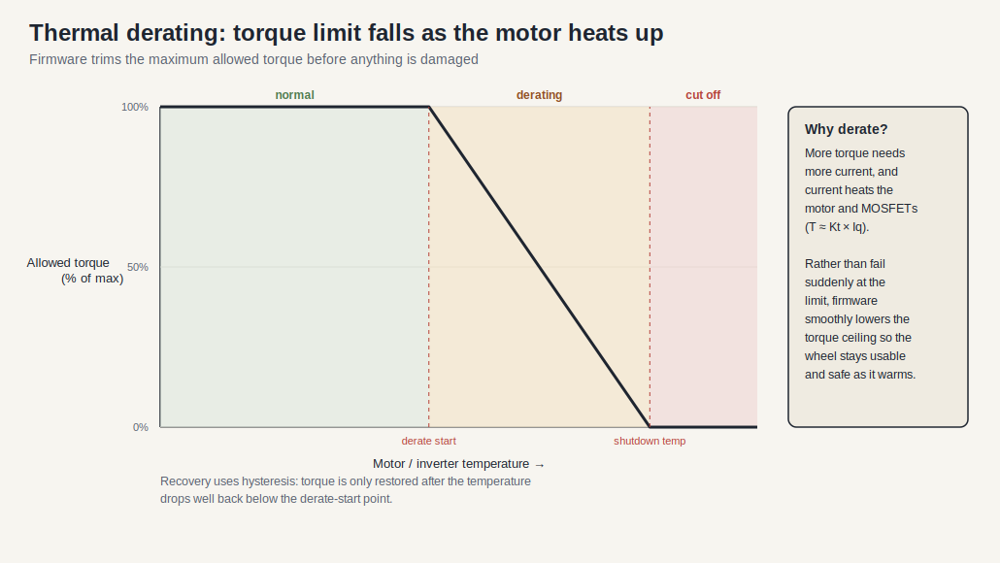

Below the derate‑start temperature the full ceiling is available; between derate‑start and shutdown the ceiling falls off; above shutdown, torque is removed. Recovery uses **hysteresis** — torque is only restored once the temperature drops well back below the derate point — so the system doesn't oscillate in and out of derating at the threshold.

#### 12.3 Practical operator rules

Keep hands, hair, clothing, cables, and children clear of the rotating rim. Never bypass physical interlocks, torque limits, or firmware safety features. Use approved software and update procedures. And treat the "let go and let it self‑align" behavior of §7.1 as a *driving technique*, not an invitation to remove your hands from a live high‑torque wheel.

---

### 13. Quick Glossary

| Term | Meaning |
|---|---|
| **FFB** | Force Feedback — motor‑generated steering force based on game commands and base settings |
| **Torque / N·m** | Rotational force at the shaft; the honest measure of FFB output |
| **Peak vs Holding torque** | Short‑duration max vs sustainable max; not directly comparable |
| **DD (Direct Drive)** | Motor shaft drives the steering shaft directly — lowest transmission error |
| **PMSM / BLDC** | The three‑phase permanent‑magnet motor used in DD bases |
| **FOC** | Field‑Oriented Control — the algorithm regulating torque‑producing current |
| **Inverter / PWM / dead‑time** | Power stage that synthesizes three phases from DC; dead‑time prevents shoot‑through |
| **Encoder** | Angle sensor; its resolution caps FFB fine detail |
| **SAT** | Self‑Aligning Torque — the wheel's natural return‑to‑center; key to catching slides |
| **Understeer / Oversteer** | Front loses grip (wheel goes light) / rear loses grip (SAT countersteers) |
| **Clipping** | Forces above the limit collapse to max, losing detail; fix by lowering gain |
| **Slew rate** | Limit on how fast commanded torque may change |
| **Freshness / stale policy** | If the host link drops, torque decays and disables rather than freezing |
| **Tactile transducer / bass shaker** | Separate seat/frame vibration system, isolated from FFB |
| **SHO** | Shock/Vibration Strength — controls rim buzz motors, *not* the main FFB motor |
| **NDP / NFR / NIN / INT / FEI** | Damping / friction / inertia / interpolation / effect‑intensity tuning knobs |
| **Torque arbiter** | The single software gate that applies all final power and safety limits |
| **Derating** | Smoothly lowering the torque ceiling as the motor heats up |
| **E‑stop / torque‑off** | Hardware kill switch that removes motor power independent of software |

---

### 14. Sources and Evidence Model

This document synthesizes the accompanying study base and its original illustrations. Following that base's evidence discipline:

- **Verified public / standards:** USB HID & PID force‑feedback model; PMSM/FOC motor‑control principles; torque = F·r; `τ ≈ Kt·Iq`; three‑phase inversion and dead‑time.
- **Manufacturer / advertised claims (not independently verified here):** specific torque figures (CSL DD, ClubSport DD/DD+, Podium DD, VNM 32 N·m), latency figures (Simagic ~1 ms), and sensor‑resolution figures (23‑bit / 8‑million‑points). These describe vendor specifications and marketing; real‑world results depend on the full system, firmware, and game.
- **Engineering inference:** latency budgeting, tactile isolation, and tuning guidance.

Primary study files: `wheel_base.md` (motor control, FFB path, safety), `sim_racing_research.md` (ecosystem, FFB stages, drive types), `tactile.md` (tactile isolation), `telemetry.md` (latency budget), `glossary.md` (terminology and tuning). Illustrations are original teaching diagrams of general engineering principles, reused from the study base's `assets`.

Selected public references cited by the study base: [USB‑IF HID](https://www.usb.org/hid), [USB‑IF PID Class 1.0](https://www.usb.org/sites/default/files/documents/pid1_01.pdf), [Infineon PMSM FOC reference](https://documentation.infineon.com/aurixtc3xx/docs/kbv1711616051757), [TI sensored FOC](https://software-dl.ti.com/msp430/esd/MSPM0-SDK/2_04_00_06/docs/english/middleware/motor_control_pmsm_sensored_foc/doc_guide/doc_guide-srcs/Sensored_FOC_Motor_Control_Library.html), [Logitech TRUEFORCE](https://www.logitechg.com/en-za/innovation/trueforce.html), [Simucube FFB effects](https://docs.simucube.com/TunerSoftware/wheelbases/wheelbaseeffects.html), [OpenFFBoard wiki](https://github.com/Ultrawipf/OpenFFBoard/wiki/), [hid‑fanatecff](https://github.com/gotzl/hid-fanatecff).

> Note on scope: general internet browsing was not available in this environment, so live web sources beyond those already cited in the study base were not re‑fetched. Product specifications and firmware‑dependent torque figures change frequently — verify current numbers against the manufacturer's product pages before relying on them.


## Wheel Base Hardware and Software Architecture

> Version: 1.1
> Research date: 2026-07-01  
> Audience: Fresher/junior in the sim racing domain, mid level in embedded system.  
> Scope: modern direct-drive sim-racing wheel base. Rim internals: [wheel_rim.md](./wheel_rim.md).  
> Evidence: public standards, manufacturer manuals/support, public open-source projects, and [wheel_rim.md](./wheel_rim.md). No proprietary firmware reverse engineering.

### Document Change Log

| Version | Date | Description |
|---|---|---|
| 1.0 | 2026-07-01 | Initial research document. |
| 1.1 | 2026-07-01 | Reordered sections (Basic to Advanced), enforced normative language, replaced pseudocode with interface tables, added figure captions, and inserted introductory paragraphs. |

### 1. Executive Summary

This section provides a high-level overview of the wheel base's role in the sim racing ecosystem. It establishes the foundational safety and architectural paradigms.

The wheel base is the safety-critical ecosystem center. It is simultaneously a USB human-interface device, real-time servo drive, and peripheral hub. It reports steering and controls, accepts force-feedback effects, converts bounded torque demand into motor phase current/PWM, and aggregates rim, pedal, shifter, and handbrake data.

The architecture should employ a main MCU for USB, FFB, profiles, peripherals, updates, and system policy, alongside a separate motor MCU or control ASIC for encoder/current acquisition and inverter PWM. A torque arbiter shall act as the only software bridge between these domains. Hardware overcurrent, gate fault, E-stop, watchdog, and timer-break paths shall remain authoritative if software fails.

The base shall fail in a torque-off state. The system shall remain non-energized during reset, bootloader execution, updates, USB enumeration, incompatible rim detection, invalid encoder/current feedback, stale torque command conditions, brownout, and watchdog recovery. High-torque enable shall require verified images, a successful self-test, calibrated sensors, a healthy power stage, an explicit software policy, and no latched faults.

### 2. Scope and Evidence

This section defines the boundaries of the analysis and clarifies the confidence levels of the presented information. It is necessary for understanding the context of the claims made.

| Label | Meaning |
|---|---|
| Verified public behavior | Supported by a public standard, manual, or project document |
| Industry pattern | Common architecture, not universal |
| Reference design | Recommended project structure, not a vendor-internal claim |
| Unknown | Needs customer schematics, BOM, source, descriptors, or requirements |

Included items are base electronics, processors, inverter, sensors, USB, peripherals, firmware, timing, safety, update, diagnostics, and verification. Excluded items are proprietary formats, extracted firmware, console-authentication bypass, detailed control equations/gains, and rim internals.

`repos.md` is discovery input, not a technical authority. Community Fanatec projects establish observations, not official specifications.

### 3. System Context

This section illustrates how the wheel base interacts with external actors, including the host PC/console, the user's peripheral devices, and the power supply.

**Figure 3-1: System Context Diagram**

```mermaid
flowchart LR
    Game -->|FFB effects| Host[OS Driver / Vendor Service]
    Host <-->|USB HID/PID + vendor interface| Base
    Console[Licensed Console] <-->|approved accessory path| Base
    PSU[Isolated DC Supply] --> Base
    subgraph Base[Wheel Base]
      Main[Main MCU] --> MotorDomain[Motor-Control Domain]
      Safety -->|enable / inhibit| MotorDomain
      Main <--> Ports[Peripheral Interfaces]
    end
    Base <-->|QR power/data + mechanical torque| Rim
    Pedals --> Ports
    Shifter --> Ports
    Handbrake --> Ports
    Tool[Configurator / Updater] <-->|USB| Base
```

| Responsibility | Base | Rim | Host |
|---|---|---|---|
| Shaft angle | Primary | No | Consumes |
| Motor current/torque | Primary | No | Requests effects |
| Hardware torque inhibit | Primary | No | No |
| Rim controls | Aggregates | Scans | Consumes |
| LEDs/display | Routes | Drives | Produces values |
| USB enumeration/update | Primary | Usually indirect | Controls bus/tool |

#### 3.1 Public Fanatec Ecosystem Boundary

Fanatec's public ecosystem demonstrates the base-as-hub pattern but does not publish an internal architecture contract. Current products broadly use CSL, ClubSport, and Podium tiers. The tier name is commercial/product context; firmware compatibility still depends on exact model, generation, QR, peripheral ports, and software version.

For console systems, platform licensing and peripheral aggregation are separate concerns:

| Concern | Public Fanatec Rule |
|---|---|
| Xbox compatibility | Comes from an Xbox-licensed steering wheel or hub. |
| PlayStation compatibility | Comes from a PlayStation-licensed wheel base. |
| Console pedals/shifter/handbrake | Connect through the compatible wheel base. |
| PC standalone peripherals | Supported products may connect separately by USB or ClubSport USB Adapter. |

These are product-level facts. They do not establish a public rim protocol, authentication algorithm, USB descriptor, or motor-control partition.

### 4. Hardware Architecture

This section details the physical electronics components and domains within the wheel base. Familiarity with mixed-signal PCB design and power electronics is required to understand the boundaries.

**Figure 4-1: Hardware Architecture Block Diagram**

```mermaid
flowchart TD
    USB[USB + ESD + VBUS Sense] --> PHY --> Main[Main MCU]
    Main <--> Flash[Flash / EEPROM]
    Main <--> RimIF[QR Interface]
    Main <--> Accessory[Pedal / Shifter / Handbrake]
    Main --> TorqueLink[Bounded Torque Link]

    subgraph MotorDomain[Hard Real-Time Motor Domain]
      TorqueLink --> MotorMCU[Motor MCU / ASIC]
      Encoder --> EncoderIF --> MotorMCU
      Shunts --> CSA[Current Amplifiers] --> ADC[ADC + PWM Trigger] --> MotorMCU
      MotorMCU --> Timer[Complementary PWM] --> Gate[Gate Driver]
      Gate --> Bridge[3-Phase MOSFET Bridge] --> Motor[PMSM / BLDC]
    end

    DC[DC Input] --> Protect[Fuse / Reverse / TVS / Inrush] --> Bus[DC Link]
    Bus --> Bridge
    Bus --> Rails[Logic Rails] --> Main
    Bus --> Sense[Voltage / Current Sense] --> Main
    Thermal[Motor / FET / PCB Temperature] --> Main
    Gate -->|FAULT| Latch[Hardware Fault Latch]
    OCP[Overcurrent Comparator] --> Latch
    EStop[E-stop / Torque-Off] --> Latch
    Latch -->|asynchronous inhibit| Gate
```

| Domain | Contents | Design objective |
|---|---|---|
| Logic | Main MCU, USB, NVM, accessory transceivers | Protect USB/logic from switching noise |
| Motor control | Motor MCU/ASIC, encoder receiver, ADC path | Deterministic short feedback paths |
| Power stage | Gate driver, MOSFET bridge, shunts, DC link | Low inductance, cooling, fault containment |
| Power input | Protection, inrush, rails, regen strategy | Contain source/transient faults |
| Connectors | USB, QR, accessories, E-stop | ESD/cable-fault isolation |

### 5. Power and Motor Drive

This section explains the power electronics required to convert the incoming DC supply into the three-phase alternating current that drives the servo motor.

**Figure 5-1: Power and Motor Drive Flow**

```mermaid
flowchart LR
    AC --> PSU[Isolated AC/DC]
    PSU --> Fuse --> Reverse[Reverse Protection] --> Inrush --> Bus[DC Bus]
    Bus --> Inverter --> Motor
    Bus --> Buck[Logic Rails]
    Bus --> Regen[Clamp / Brake / Regen Strategy]
    Bus --> Measure[Voltage / Current / Temperature]
```

| Block | Hardware responsibility | Firmware responsibility |
|---|---|---|
| PSU | Isolated rated DC | Detect range; do not assume regen absorption |
| Input protection | Fuse/eFuse, reverse, TVS, inrush | Sequence/report controllable faults |
| DC link | Pulse energy | Monitor voltage and regen margin |
| Gate driver | Drive, UVLO, faults | Configure; enable only after checks |
| Inverter | DC-to-three-phase switching | Motor domain PWM only |
| Shunts/CSA | Current feedback | Offset/gain/saturation/plausibility |
| Regen hardware | Returned energy handling | Coordinate torque reduction/clamp |
| Rails | MCU/sensor/accessory supply | Power-good/reset sequencing |

Rapid user motion may regenerate energy into the DC bus. The firmware shall calculate the returned energy to determine supply absorption limits, coordinate the brake resistor/clamp, and manage voltage limits. 
For PWM generation, the microcontroller shall use complementary timer outputs. The hardware shall enforce dead time. The ADC trigger shall be synchronized with the PWM cycle. The hardware shall provide an asynchronous break input to immediately halt switching. The gate enable signal shall default to an off state through reset and bootloader execution. The firmware shall perform all PWM parameter updates on an atomic boundary.

#### 5.1 How the inverter produces three-phase current

The inverter is the power heart of the wheel base. A PMSM/BLDC motor cannot be driven from raw DC; it needs three sinusoidal phase currents, offset 120° from each other, whose rotating magnetic field the rotor follows. The inverter synthesizes those phases from the fixed DC bus using six power MOSFETs arranged as three **half-bridges** (one per phase).


Each phase has a high-side switch (to the DC+ rail) and a low-side switch (to DC−). Rapidly switching the appropriate switch on and off with PWM sets the average voltage on that phase; doing this on all three legs with the right timing produces the rotating field. Two facts from this drawing map directly onto the normative requirements above:

- **Dead-time is mandatory.** The two switches in one leg must never be on together, or they would create a direct short across the DC bus (called *shoot-through*) and destroy the MOSFETs. Hardware enforces a brief dead-time gap where both are off during every transition.
- **Low-side shunts feed the current loop.** The small shunt resistors in each low-side leg are how phase current is measured, which is the feedback the FOC current loop (§5.2 and §6) needs to control torque.

#### 5.2 PWM timing and current sampling

Field-Oriented Control depends on measuring phase current accurately, and *when* the current is sampled matters as much as the sample itself. The switching edges of the MOSFETs inject electrical noise, so the ADC is triggered at the quiet point in the middle of the PWM period rather than near an edge.


A triangular carrier is compared against each phase's duty command to generate the gate signal: where the carrier is below the command, the high-side switch is on. Sampling current at the carrier peak (the middle of the on-time) captures a clean average value away from the switching transients. This is exactly the "valid middle-of-PWM triggers" requirement in §6, and the dead-time zoom shows the small both-off gap that prevents shoot-through on every edge.

### 6. Sensors

This section details the feedback mechanisms used to measure shaft position and motor currents, which are critical for field-oriented control (FOC) and force feedback.

The motor itself is a three-phase PMSM: a wound steel stator surrounding a permanent-magnet rotor coupled to the steering shaft. The encoder reads the rotor/shaft angle that FOC needs to commutate correctly, and the current sensing reads the phase currents FOC regulates. The cross-section below shows how the pieces relate.


| Encoder | Strength | Concern |
|---|---|---|
| SPI/SSI/BiSS-C absolute | Angle at boot, CRC/status | Timing, receiver, wrap |
| ABZ | Simple/low latency | Reference/index and missed edges |
| Sin/Cos | Fine interpolation | Analog offset/gain/phase |
| Hall sectors | Robust coarse commutation | Insufficient alone for premium steering |

**Figure 6-1: Sensor Processing Pipeline**

```mermaid
flowchart LR
    Encoder --> Acquire[SPI / Timer / ADC]
    Acquire --> Validate[CRC / Status / Range / Jump]
    Validate --> Cal[Direction / Offset / Scale]
    Cal --> Unwrap[Angle / Speed]
    Unwrap --> Control
    Unwrap --> USBReport[USB Axis Snapshot]
```

| Signal | Acquisition | Checks |
|---|---|---|
| Phase currents | Shunt/CSA/synchronized ADC | Offset, gain, saturation, consistency |
| DC current | Shunt/Hall ADC | Overcurrent, power plausibility |
| DC voltage | Divider/isolation ADC | Brownout, nominal, regen overvoltage |
| FET/motor temperature | NTC/IC/model | Open/short, rate, derating |
| Rail health | Supervisor/ADC/GPIO | Power-good and reset cause |

The architecture should support current sampling during each PWM cycle, utilizing valid middle-of-PWM triggers, and must perform startup offset calibration. Exact sampling windows depend on the selected inverter topology and modulation scheme.

### 7. External Interfaces

This section catalogs the physical and logical boundaries where the wheel base communicates with external hardware peripherals.

| Interface | Owner | Purpose |
|---|---|---|
| USB FS/HS | Main MCU | HID input/PID FFB, config, diagnostics, update |
| QR/rim link | Main MCU | Identity, controls, LED/display output |
| Pedal/shifter/handbrake | Main MCU | Analog/digital controls (e.g., via RJ12, subject to hardware emulation proxying) |
| Motor encoder | Motor MCU | Rotor/shaft feedback |
| Main↔motor | Both | Torque, angle, health, faults |
| SWD/JTAG/UART/service USB | Controlled service | Manufacturing/recovery |
| E-stop/torque key | Hardware safety logic | Torque permission/inhibit |

Legacy community projects report a 3.3 V base-master/rim-slave SPI for older products, alongside a newer compatibility boundary for modern direct-drive bases. The rim link should be designed as a replaceable protocol adapter rather than a universal assumption. Accessory power rails shall be electrically protected so that rim or cable faults cannot collapse the main motor control logic.

### 8. Processor Partitioning

This section discusses the distribution of computing responsibilities. Separating the USB stack from hard real-time motor control is a core architectural decision.

| Option | Strength | Weakness | Use |
|---|---|---|---|
| Single MCU | Low BOM/simple update | Shared timing/failure domain | Only with proven margin |
| Main + motor MCU | Timing/fault separation | Versioned IPC required | Recommended high-torque base |
| Main + control ASIC | Specialized deterministic control | Vendor limits/lock-in | If sensor/control fit is proven |
| Main MPU + motor MCU | Rich networking/UI | OS boot/security complexity | Premium connected products |

**Figure 8-1: Processor Domain Interaction**

```mermaid
flowchart LR
    subgraph Main
      USB[USB/PID]
      FFB[FFB Engine]
      Input[Input Aggregation]
      Profile[Profiles]
      Supervisor[Safety Supervisor]
    end
    subgraph MotorMCU
      Enc[Encoder]
      Curr[Current]
      Control[Motor Control]
      PWM[PWM]
      FastFault[Fast Fault]
    end
    FFB --> Arbiter[Torque Arbiter]
    Supervisor --> Arbiter
    Arbiter -->|bounded command + freshness| Control
    Control -->|angle/current/health| Supervisor
    Enc --> Control
    Curr --> Control
    Control --> PWM
    FastFault --> PWM
```

| Data | Direction | Requirements |
|---|---|---|
| Torque request | Main → motor | Physical units, bound, sequence, timestamp |
| Enable/limits | Main → motor | Explicit; default disabled; motor reapplies local limits |
| Angle/speed/current | Motor → main | Value, validity, timestamp, wrap semantics |
| Health/fault | Both | Version, reset reason, deadline and fault state |
| Heartbeat | Both | Independent counters and timeout reaction |

Stale main commands shall reach zero torque or trigger a hardware inhibit in bounded time.

### 9. Software Architecture

This section outlines the logical modules comprising the wheel base firmware and their required isolation to ensure safety and determinism.

**Figure 9-1: Software Component Architecture**

```mermaid
flowchart TD
    Boot[Protected Bootloader] --> BSP[BSP / Safe Pins / Self-Test]
    subgraph Services
      USB[USB / HID / PID]
      FFB[Effect Manager]
      Arbiter[Torque Arbiter]
      Input[Input Aggregator]
      Rim[Rim Manager]
      Acc[Accessory Manager]
      Settings[Settings / Calibration]
      Update[Update]
      Diag[Diagnostics]
      Safety[Safety Supervisor]
    end
    subgraph Motor
      Encoder[Encoder Service]
      Current[Current Acquisition]
      Controller[Motor Control]
      PWM[PWM Driver]
      Fault[Fast Fault Handler]
    end
    BSP --> Services
    USB --> FFB --> Arbiter --> Controller
    Rim --> Input --> USB
    Acc --> Input
    Settings --> FFB
    Safety --> Arbiter
    Encoder --> Controller
    Current --> Controller
    Controller --> PWM
    Fault --> PWM
```

| Module | Owns | Must not own |
|---|---|---|
| USB | Descriptors, endpoints, reports | PWM/gate writes |
| FFB | Effect state/mixing | Safety enable |
| Torque arbiter | Final enable/torque/slew/thermal/power/freshness limits | USB transport |
| Motor control | Feedback-to-PWM | Host parsing |
| Safety | State/fault policy | Sole electrical protection |
| Peripherals | Discovery, mapping, health | Motor enable |
| Settings | Schema/atomic persistence | Flash writes in control ISR |
| Diagnostics | Bounded events/traces | Blocking output |
| Update/boot | Verify/stage/recover | Motor activation |

### 10. Force-Feedback Path

This section traces the lifecycle of a force-feedback effect from the host's request down to the motor currents. It focuses on how abstract effects become physical torque.

**Figure 10-1: Force-Feedback Data Flow**

```mermaid
flowchart LR
    Game --> API[DirectInput / HID PID / Vendor SDK]
    API --> USB[USB Reports] --> Parser[Validated Parser]
    Parser --> Pool[Effect Pool] --> Mixer[Effect Mixer]
    Mixer --> Arbiter[Torque Arbiter]
    Limits[Torque / Current / Slew / Thermal / Voltage / Freshness] --> Arbiter
    Arbiter --> Control[Motor Current Control] --> PWM --> Inverter --> Motor
    Encoder --> Control
    Current --> Control
```

| Block | Responsibility |
|---|---|
| Parser | Validate ID, size, index, units, duration |
| Effect pool | Allocate/update/start/stop deterministic effects |
| Mixer | Combine effects without overflow |
| Device filters | Configured damping/friction/inertia/smoothing |
| Torque arbiter | Apply all final product and safety limits |
| Motor control | Convert torque request to current/PWM; no effect semantics |
| Hardware faults | Remove gate drive independently |

Host freshness tracking shall be explicit. Normal host loss shall trigger a bounded decay and disable policy. Critical sensor or electrical faults shall trigger an immediate hardware inhibit.

#### 10.1. Motor-Domain Invariants

1. The PWM output shall remain inactive after reset until a valid enable command is received.
2. Invalid encoder or current feedback shall not coexist with active torque beyond a documented detection time limit.
3. Both the main MCU and the motor domain shall enforce torque and speed limits.
4. Hardware break signals shall override any software commands.
5. Stale inter-processor communication (IPC) shall reach zero torque or hardware inhibit within a bounded time.
6. Calibration data shall be versioned and mathematically range-checked before use.
7. NaN, numeric overflow, invalid enumerations, or corrupt communication frames shall never reach the PWM generation module.

#### 10.2. Input Aggregation

**Figure 10-2: Input Aggregation Data Flow**

```mermaid
flowchart LR
    Rim[Rim Snapshot] --> Validate
    Pedals[Pedals] --> Validate
    Shifter[Shifter] --> Validate
    Handbrake[Handbrake] --> Validate
    Angle[Steering Angle] --> Validate
    Validate[Validity / Freshness / Calibration] --> Aggregate[Atomic Aggregate]
    Aggregate --> HID[USB Input Report]
```

Each aggregated value shall carry a timestamp, status, and source identifier. USB input reports shall use coherent snapshots of system state rather than reading directly from disparate interrupt service routines. A stale encoder reading shall be treated as a critical motor fault. A stale rim link shall automatically clear momentary button controls to prevent stuck inputs. Invalid pedal, shifter, or handbrake data shall fall back to explicitly documented safe reporting values.

### 11. Host Software

This section describes the host-side drivers and services that interact with the wheel base. While embedded developers do not write the OS driver, they must understand its requirements.

**Figure 11-1: Host Software Interaction Model**

```mermaid
flowchart TD
    Game -->|DirectInput / HID PID / SDK| Driver[OS / Vendor Driver]
    Driver <-->|USB HID/PID| Base
    Config[Control Panel] <-->|vendor config| Base
    Updater[Update Manager] <-->|recovery interface| Base
    Game -->|telemetry| Service[Telemetry Service]
    Service -->|LED/display| Base
```

The public `hid-fanatecff` driver demonstrates how Linux input and force-feedback effects translate to custom HID reports on an asynchronous 2 ms default timer. It maps sysfs/HIDRAW paths for tuning ranges, wheel ID, LEDs, displays, load cell feedback, and pedal rumble where supported. Tools like `hid-fanatecff-tools` bridge UDP or shared-memory game telemetry into these outputs.

The base shall manage several separate logical planes of communication:

| Plane | Criticality | Data |
|---|---|---|
| Input | High | Steering, pedals, buttons |
| FFB | High | Effects/torque-related state |
| Safety | Highest local authority | Enable, faults, power, thermal, freshness |
| Configuration | Medium | Profiles/range/tuning |
| Display telemetry | Best effort | RPM, gear, flags, speed |
| Update/diagnostics | Torque-disabled service | Images, traces, calibration |

### 12. State Machines

This section defines the operational states of the wheel base and the motor domain. It describes the precise conditions required to transition from a safe idle state to active torque generation.

#### 12.1. Base Lifecycle

**Figure 12-1: Base Lifecycle State Machine**

```mermaid
stateDiagram-v2
    [*] --> Reset
    Reset --> Recovery: invalid app / recovery request
    Reset --> SelfTest: verified app
    SelfTest --> SafeIdle: pass
    SelfTest --> LatchedFault: fail
    SafeIdle --> Calibrating
    Calibrating --> Ready: sensors/calibration valid
    Ready --> TorqueEnabled: host + user + interlocks valid
    TorqueEnabled --> Derated: thermal/voltage limit
    Derated --> TorqueEnabled: recovered with hysteresis
    TorqueEnabled --> SafeIdle: normal disable / host loss
    TorqueEnabled --> LatchedFault: critical fault
    Derated --> LatchedFault: critical fault
    LatchedFault --> SafeIdle: authorized clear + safe conditions
    Recovery --> Reset: verified image
```

#### 12.2. Motor Domain

**Figure 12-2: Motor Domain State Machine**

```mermaid
stateDiagram-v2
    [*] --> Disabled
    Disabled --> OffsetCalibration: power valid
    OffsetCalibration --> EncoderCheck: offsets valid
    EncoderCheck --> Ready: encoder valid
    Ready --> Running: enable + fresh command
    Running --> Ready: zero/disable
    Running --> Fault: break / feedback / deadline / link fault
    Ready --> Fault: critical fault
    Fault --> Disabled: reset / authorized recovery
```

USB enumeration and configuration shall not imply that torque is enabled.

### 13. Real-Time Execution

This section defines the critical timing deadlines for the firmware. Missed deadlines in the motor control loop can lead to torque distortion or safety hazards.

| Activity | Common range | Context | Miss impact |
|---|---|---|---|
| Current/FOC loop | 10–40 kHz | PWM/ADC ISR or motor core | Torque distortion/fault |
| Encoder | Every control cycle/submultiple | Timer/SPI DMA ISR | Stale angle |
| Torque/FFB | 0.5–2 kHz | High-priority task | Jitter/phase lag |
| USB | Event-driven/descriptor contract | USB ISR + task | Stale reports |
| Rim link | 100–1000 Hz or protocol-defined | DMA + task | Stale controls/display |
| Pedals | 250–1000 Hz | ADC DMA/task | Latency/noise |
| Safety | Hardware trip + periodic checks | Hardware/ISR/task | Delayed shutdown |
| Thermal | 10–100 Hz typical | Task | Delayed derating |
| Diagnostics/NVM | Bounded background/on demand | Task/bootloader | Must not block control |

**Figure 13-1: Real-Time Execution Priorities**

```mermaid
flowchart TD
    HW[Comparator / Gate Fault / E-stop] --> P0[Hardware Inhibit]
    ADCIRQ[ADC / PWM IRQ] --> P1[Motor Control]
    EncIRQ[Encoder Complete / Error] --> P1
    IPC[Main-Motor IRQ] --> P2[Torque / Health]
    USBIRQ[USB IRQ] --> P3[Bounded USB]
    BusIRQ[Rim / Accessory IRQ] --> P4[Buffer Completion]
    Tasks[RTOS Tasks] --> P5[FFB / Input / Safety]
    BG[Background] --> P6[Logs / NVM / UI]
```

The development team shall measure the target worst-case execution time (WCET) under maximum bus traffic. The system shall strictly bound all ISR execution times. The motor control paths shall not perform memory allocation, flash writes, blocking lock acquisition, or blocking I/O. The architecture shall define and document maximum interrupt masking times. The firmware shall expose hardware timer overrun counters for diagnostics. The firmware shall service the hardware watchdog timer only from a verified, healthy critical path.

### 14. Boot, Update, and Configuration

This section details the startup sequence, the safe firmware update process, and the management of non-volatile configuration data.

#### 14.1. Boot Chain

1. The hardware shall hold the inverter gate disabled upon power-up.
2. The bootloader shall verify the selected application image and its hardware compatibility.
3. The application shall configure safe pin states and clocks, and then record the hardware reset reason.
4. The main and motor processors shall exchange software versions and feature capabilities.
5. The firmware shall verify current offsets, encoder status, bus voltage, temperatures, and physical interlocks.
6. The base shall enter the `SafeIdle` state; transitioning to active torque shall require explicit host or user conditions.

**Figure 14-1: Firmware Update Sequence**

```mermaid
sequenceDiagram
    participant Tool as Host Tool
    participant App as Base App
    participant Boot as Base Bootloader
    participant Motor as Motor Bootloader
    Tool->>App: query identity / versions
    App->>App: enter torque-disabled update state
    Tool->>App: signed manifest
    App->>Boot: authenticated reset
    Tool->>Boot: stage and verify base image
    Boot->>Motor: stage compatible motor image if needed
    Motor->>Motor: verify with PWM disabled
    Boot->>App: reset
    App->>Tool: self-test / migration / result
```

Firmware updates shall require an authenticated image protected by a hash or CRC. The bootloader shall enforce hardware compatibility and version gating. Flash staging shall be power-loss-safe (e.g., dual-bank A/B). The bootloader recovery mode shall be completely independent of the main application. The system shall force torque to be disabled during the entire update process. Any calibration or settings migration shall be atomic.

| Data | Storage rule |
|---|---|
| Factory calibration | Protected, versioned, CRC, provenance |
| User center/range | Atomic and resettable |
| Profiles | Schema version, bounds, defaults |
| Safety limits | Immutable/service-authorized |
| Fault records | Wear-limited critical ring |
| Update metadata | Selected image, attempts, recovery state |

### 15. Safety Architecture

This section consolidates the fault detection and mitigation strategies. It maps specific electrical and software hazards to their corresponding safety reactions.

**Figure 15-1: Safety and Fault Handling Architecture**

```mermaid
flowchart TD
    Host[Host Command] --> Validate[Parser Validation] --> Arbiter[Software Arbiter]
    Arbiter --> Local[Motor MCU Local Limits] --> PWM --> Gate
    OCP[Overcurrent Comparator] --> Latch[Hardware Fault Latch]
    GF[Gate Driver Fault] --> Latch
    EStop[E-stop] --> Latch
    WDG[Independent Watchdog / Enable Timeout] --> Latch
    Latch -->|asynchronous disable| Gate
```

| Hazard | Detection/control | Reaction |
|---|---|---|
| Unexpected torque | Startup inhibit, validation, torque/slew/freshness bounds | Controlled zero or immediate inhibit |
| Wrong direction | Commissioning consistency test | Refuse enable; latch fault |
| Overcurrent/short | Comparator, gate protection, ADC plausibility | Hardware disable |
| Encoder loss | CRC/status/timeout/jump | Immediate inhibit unless validated fallback |
| Overtemperature | Sensor diagnostics/model | Derate then disable |
| Regen overvoltage | Bus sensing and energy strategy | Reduce torque/clamp/inhibit |
| Main/motor lockup | IPC timeout, watchdog, gate timeout | Zero/inhibit/reset |
| USB loss | SOF/report freshness | Bounded FFB decay/disable |
| Accessory short | Protected rails/ports | Isolate accessory; preserve motor safety |
| Update corruption | Authentication/integrity/recovery | Stay torque-disabled |

The firmware shall distinguish fault classes: informational, degraded operation, recoverable torque-off, latched fault, and hardware-dominant fault. The software shall not be permitted to clear a hardware-dominant fault while the underlying hardware condition remains asserted.

#### 15.1 Thermal derating in practice

Overtemperature is handled by *derating* — smoothly lowering the torque ceiling as the motor and inverter heat up — rather than by an abrupt cutoff at the limit. Because torque needs current and current makes heat (`T ≈ Kt × Iq`), a base run hard will warm up; derating keeps it usable and safe instead of failing suddenly mid-corner.


Below the derate-start temperature the full torque ceiling is available. Between derate-start and the shutdown temperature the ceiling falls off; above shutdown, torque is removed. Recovery uses hysteresis: torque is only restored once the temperature drops well back below the derate-start point, so the system does not oscillate in and out of derating right at the threshold. This is the "derate then disable" reaction listed for overtemperature in the hazard table above.

### 16. Diagnostics

This section lists the logging and telemetry requirements needed to diagnose issues in the field without compromising real-time performance.

**Figure 16-1: Diagnostic Data Flow**

```mermaid
flowchart LR
    Events[Typed Events] --> Ring[Bounded RAM Ring] --> USB[Diagnostic USB]
    Fast[Triggered Samples] --> Trace[Fixed Trace Buffer] --> USB
    Critical[Critical Snapshot] --> NVM[Wear-Limited NVM]
```

The firmware shall provide reset reasons, version numbers, WCET margins, encoder errors, ADC saturation events, gate faults, bus voltage spikes, and thermal histories. The firmware shall not execute formatted logging functions within the motor ISR. Telemetry shall use fixed, timestamped binary records. High-rate control traces shall be triggered and time-limited. Non-volatile persistent logs shall only store critical fault snapshots to prevent flash wear. Execution of dangerous service commands shall require the system to be in a torque-disabled state. The system shall never log security credentials or signing secrets.

### 17. Reference Design

This section provides a concrete, recommended starting point for the hardware and software design of a new direct-drive wheel base.

| Area | Recommendation |
|---|---|
| Main MCU | Cortex-M7/M33-class with USB and adequate deterministic memory |
| Motor controller | Dedicated MCU/DSP or validated motor ASIC |
| IPC | CRC/sequence/freshness-protected SPI or CAN-FD plus enable timeout |
| Motor | PMSM/BLDC sized from continuous/peak torque and thermal duty |
| Encoder | Absolute CRC/status-capable sensor plus plausibility |
| Current sense | Two/three shunts or inline sensors based on control/diagnostics |
| Inverter | Robust gate driver, UVLO, fault and timer break |
| DC input | Fuse/eFuse, reverse, TVS, inrush, bus capacitance, regen strategy |
| USB | FS for HID unless HS bandwidth is justified |
| Accessories | Individually protected/current-limited power |
| Safety | Comparator/break, fault latch, watchdog, E-stop/torque-off |
| NVM/debug | Protected calibration, atomic config, lifecycle-controlled debug |

Software baseline should include a protected bootloader, RTOS utilization restricted to non-motor tasks, a dedicated bare-metal motor scheduler, and versioned APIs.

**Table 17-1: Torque Request Interface (Main to Motor)**

| Element | Direction | Type | Description |
|---------|-----------|------|-------------|
| `torque_mNm` | Input | int32 | The requested torque in milli-Newton-meters |
| `sequence` | Input | uint32 | Monotonically increasing sequence number |
| `timestamp_us` | Input | uint32 | Microsecond timestamp of the request |
| `validity` | Input | uint32 | Magic word or CRC validating the request |

**Table 17-2: Motor Snapshot Interface (Motor to Main)**

| Element | Direction | Type | Description |
|---------|-----------|------|-------------|
| `angle_urad` | Output | int32 | Motor shaft angle in microradians |
| `speed_urad_s` | Output | int32 | Motor shaft speed in microradians per second |
| `phase_current_mA_u` | Output | int32 | Phase U current in milliamperes |
| `phase_current_mA_v` | Output | int32 | Phase V current in milliamperes |
| `phase_current_mA_w` | Output | int32 | Phase W current in milliamperes |
| `timestamp_us` | Output | uint32 | Microsecond timestamp of the snapshot |
| `status` | Output | uint32 | Bitfield indicating health and fault state |

The interfaces shall use explicit physical units, validation fields, and bounded primitive types. The implementation shall avoid hidden enable transitions and shall clearly document ISR versus task buffer ownership.

### 18. Verification

This section outlines the testing pyramid required to ensure the reliability and safety of the wheel base.

**Figure 18-1: Verification Pipeline**

```mermaid
flowchart TD
    Unit[Host Unit Tests] --> Static[Static Analysis / Review]
    Static --> Target[Target Driver / Timing Tests]
    Target --> HIL[Hardware-in-the-Loop]
    HIL --> Low[Guarded Low-Energy Motor Tests]
    Low --> Full[Controlled Full-Power Tests]
    Full --> System[Game / Peripheral / Update Tests]
    System --> Qual[Thermal / EMC / Vibration / Soak]
```

| Area | Minimum tests |
|---|---|
| USB/FFB | Descriptor, malformed reports, effect lifecycle, reset/suspend, stale host |
| Arbiter | Limit precedence, slew, derating, enable/fault races |
| Encoder/current | CRC, timeout, wrap, direction, offset, saturation, ADC timing |
| PWM/gate | Dead time, reset state, break latency, gate fault |
| IPC | Loss, corruption, duplication, wrap, incompatible versions |
| Power | Brownout, overvoltage, regeneration, inrush, sequencing |
| Peripherals | Hot-plug, short, stale data, incompatible identity |
| Update/NVM | Wrong HW/image, interruption, rollback, torn write, migration |
| Watchdogs | Stalled tasks/loop, bus deadlock, interrupt storm |

#### 18.1. Full-Torque Entry Gate

The following criteria shall be met before enabling full motor torque during development:

- Schematics, BOM, power, and thermal designs shall be reviewed.
- Encoder scale, sign, status, and timeout logic shall be verified.
- Current scaling, ADC trigger timing, offsets, and saturation limits shall be measured.
- PWM and gate driver states shall be proven safe through reset, boot, and update.
- Comparator, gate fault, and E-stop inputs shall independently disable PWM in hardware.
- Torque sign and current conversion shall be tested under a restrained, current-limited load.
- Host loss, IPC loss, brownout, thermal derating, encoder failure, and watchdog tests shall pass.
- The update mechanism shall survive a power loss at any persistent transition point.
- WCET and jitter margins shall be proven under maximum system traffic.
- Mechanical guarding, E-stop availability, and operator exclusion procedures shall be approved.

### 19. Implementation Roadmap

This section provides a step-by-step project plan for developing the firmware from initial hardware bring-up to final validation.

**Table 19-1: Implementation Sequence**

| Step | Action | Notes / Constraint |
|------|--------|--------------------|
| 1 | Obtain torque, speed, inertia, angle, latency, acoustic, thermal, platform, and safety requirements. | Prerequisite for all tasks |
| 2 | Obtain schematics, BOM, and connectors; map power, clocks, reset, interrupts, DMA. | Required for BSP setup |
| 3 | Complete hazard analysis and fault reactions before motor enable. | Mandatory safety gate |
| 4 | Select processor partition and versioned IPC. | Defines software architecture |
| 5 | Bring up rails, reset, watchdog, inhibit, and diagnostics with inverter disabled. | Base hardware validation |
| 6 | Bring up encoder and current sensing; verify timing electrically. | ADC/Timer sync verification |
| 7 | Bring up PWM and gate driver into safe dummy or low-voltage load. | Verifies inverter control |
| 8 | Implement motor states, local limits, and perform low-energy tests. | Initial FOC tuning |
| 9 | Implement USB, PID, FFB, and arbiter against simulated motor endpoint. | Host software integration |
| 10 | Integrate motor domain and verify stale and fault paths first. | Validates safety architecture |
| 11 | Add rim and accessories behind isolated adapters. | Peripheral integration |
| 12 | Add profiles, calibration, diagnostics, and update/recovery mechanisms. | System features |
| 13 | Execute HIL, system, thermal, EMC, vibration, power-cycle, and soak tests. | Formal verification |
| 14 | Publish compatibility, calibration, update, fault, and service documentation. | Release prerequisite |

### 20. References

This section contains links to external documentation and related internal research files used to compile this architecture.

#### 20.1. Current Research

- [`sim_racing_research.md`](./sim_racing_research.md) — ecosystem, base/motor, communication, timing, and safety.
- [`wheel_rim.md`](./wheel_rim.md) — rim architecture and QR boundary.
- [`pedals.md`](./pedals.md) — pedal sensor and base-port proxy context.
- [`tools.md`](./tools.md) — validation tools and standards entry points.
- [`repos.md`](./repos.md) — public repository discovery list.

#### 20.2. Consolidated Public Sources

- [USB-IF HID specifications](https://www.usb.org/hid)
- [USB-IF PID Class 1.0](https://www.usb.org/sites/default/files/documents/pid1_01.pdf)
- [OpenFFBoard wiki](https://github.com/Ultrawipf/OpenFFBoard/wiki/)
- [Fanatec Podium DD1 manual](https://assets.fanatec.com/fanatec-pwa/image/upload/downloads-prod/pdfs/P-WB-DD1-Manual-EN_web.pdf)
- [Fanatec Wheel Bases FAQ](https://help.fanatec.com/hc/en-us/articles/43766204938257-Wheel-Bases-A-FAQ)
- [Fanatec platform compatibility](https://www.fanatec.com/us-en/platforms)
- [Fanatec ecosystem source register](./references.md)
- [Fanatec update guide](https://www.fanatec.com/eu/en/explorer/products/racing-wheels-wheel-bases/update-fanatec-firmware-and-drivers/)
- [Simucube 2 user guide](https://simucube.com/app/uploads/2022/11/Simucube_2_User_Guide.pdf)
- [Infineon PMSM FOC reference](https://documentation.infineon.com/aurixtc3xx/docs/kbv1711616051757)
- [TI TIDA-01599](https://www.ti.com/tool/TIDA-01599)
- [gotzl/hid-fanatecff](https://github.com/gotzl/hid-fanatecff)
- [gotzl/hid-fanatecff-tools](https://github.com/gotzl/hid-fanatecff-tools)
- [Fanatec-Pinout](https://github.com/FendtXerion3800/Fanatec-Pinout) — community, not official.

#### 20.3 Open-Source Hardware Emulators

- [lshachar/Arduino_Fanatec_Wheel](https://github.com/lshachar/Arduino_Fanatec_Wheel) — custom steering wheel SPI emulator.
- [StuyoP/Fanatec-Wheel-Barebone-Emulator](https://github.com/StuyoP/Fanatec-Wheel-Barebone-Emulator) — barebone wheelbase emulator.
- [Alexbox364/F_Interface_AL](https://github.com/Alexbox364/F_Interface_AL) — DIY custom steering wheels via SPI.
- [jssting/ArduinoTec-Pedals](https://github.com/jssting/ArduinoTec-Pedals) — Fanatec pedal replacement controller.
- [GeekyDeaks/fanatec-pedal-emulator](https://github.com/GeekyDeaks/fanatec-pedal-emulator) — proxy third-party USB pedals via RJ12.
- [StuyoP/Universal-Shifter-Interface-for-Fanatec](https://github.com/StuyoP/Universal-Shifter-Interface-for-Fanatec) — switch-based shifter proxy.
- [vnmsimulation/VNM_MOTION_CONTROLLER](https://github.com/vnmsimulation/VNM_MOTION_CONTROLLER) — DIY STM32-based hardware controllers.

### 21. Question Register (Resolved and Open)

Reviewed 2026-07-05. Most items here are **design inputs** for a specific product rather than facts with a public answer. Where the architecture already answers "how," the item is marked **Resolved (method/architecture)**; where a concrete value or selection is still required, it is re-styled as **Open — developer self-investigation** with the method to obtain it.

#### 21.1 Resolved (method or architecture already defined)

- **USB descriptors, cadence, effect capacity, and vendor interfaces.**
  The model is public: HID for inputs + PID Class 1.0 for effects over USB 2.0 FS, cadence set by the endpoint interval (see §13). Community evidence shows Fanatec bases enumerate under **VID `0EB7`** (e.g. `0EB7:0020` CSL DD/DD Pro/ClubSport DD). The *specific* VID/PID, effect-pool depth, and any vendor interface remain a product/registration decision (see 21.2).
- **Safety/regulatory: the torque-inhibit path.**
  Fully specified as architecture in §15: an independent hardware latch (overcurrent comparator + gate fault + E-stop + watchdog) that asynchronously disables the gate driver, following an STO-style pattern (cf. TI TIDA-01599). The *regulatory targets* (which marks/standards apply) are market-specific (21.2).
- **Latency/jitter acceptance budgets and instrumentation.**
  Method resolved: budget per stage and instrument with hardware timer overrun counters and triggered control traces (§13, §16). Loop-rate anchors are in §13's timing table. The accepted numeric budget is product-specific (21.2).
- **Signing, rollback, provisioning, anti-downgrade, and debug policy.**
  The required shape is defined in §14: authenticated image (hash/CRC), A/B power-loss-safe staging, independent recovery bootloader, version/anti-downgrade gating, and debug disabled in retail. The chosen crypto/PKI is an implementation decision (21.2).

#### 21.2 Open — for developers to self-investigate

Each needs a requirement, an approved spec, or a measurement — not a lookup.

- **Peak/continuous torque, speed, inertia, range, and duty cycle.**
  *How:* set from the target segment and competitor specs; size the motor to continuous + peak torque and thermal duty; confirm on a dyno.
- **Motor electrical/thermal data and regenerative energy envelope.**
  *How:* obtain from the selected motor's datasheet; measure Kt, resistance, inductance, and thermal time constants; characterize regen into the DC bus under fast reversals and size the clamp/brake resistor.
- **Selected processor partition, encoder, current topology, gate driver, and MOSFETs.**
  *How:* choose against the torque/loop-rate targets using vendor reference designs (Infineon PMSM FOC, TI sensored FOC; OpenFFBoard's TMC4671 approach as a public example); validate timing electrically on a bring-up board before full power.
- **Required PC/console platforms and licensed authentication architecture.**
  *How:* obtain console licensing terms contractually; never emulate or bypass console authentication (§15, §11 of research doc).
- **QR/rim protocol per supported generation and compatibility policy.**
  *How:* treat the rim link as a replaceable adapter (§7); community SPI observations for legacy links are discovery input, not a spec — get the approved interface definition for any current generation.
- **Accessory/E-stop/torque-key/CAN connector definitions.**
  *How:* define pinouts per port; community references (FendtXerion Fanatec-Pinout wiki, which notes the Torque Key applies only to DD1/DD2 and documents an E-stop switch circuit) are to be verified electrically before use.
- **Safety/regulatory and independent-assessment targets.**
  *How:* determine applicable EMC/product-safety marks for each market and engage an independent assessor early.
- **Calibration ownership/migration across base, motor, rim, and peripherals.**
  *How:* version calibration per node, range-check before use, and define atomic migration (§14); track compatibility in [`compatibility-matrix.md`](./compatibility-matrix.md).
- **Environmental, EMC, vibration, acoustic, and service-life requirements.**
  *How:* set targets from intended use and validate in the qualification stage (§18 thermal/EMC/vibration/soak).


## Steering Rim Hardware and Software Architecture

> Research date: 2026-07-02
> Scope: steering rim / steering wheel electronics, wheel-base link, host integration, and adjacent pedal architecture.
> Evidence: public GitHub projects and public documentation supplied by the requester.
> Constraint: community observations are not official Fanatec specifications. No proprietary firmware extraction or security bypass.
> Related docs: [sim_racing_research.md](./sim_racing_research.md), [wheel_base.md](./wheel_base.md), [accessories.md](./accessories.md), [tools.md](./tools.md), and [repos.md](./repos.md).

### 1. Executive Summary

This section provides a high-level overview of the steering rim architecture, establishing its role as an I/O node rather than a force-feedback controller. It is intended to orient the reader before diving into hardware and software details.

A modern steering rim is a rotating embedded I/O node. It scans buttons, paddles, rotary encoders, joysticks, and analog clutch inputs; it receives display/LED commands; it identifies its capabilities to the wheel base; and it exchanges bounded frames over the quick-release electrical link. It does not own force-feedback motor control. The wheel base owns USB enumeration, steering-axis acquisition, force-feedback processing, motor torque, safety, and aggregation of rim/peripheral data.

The strongest community evidence for older Fanatec-compatible rims describes the wheel base as SPI controller/master and the rim as SPI peripheral/slave using 3.3 V signaling. `Arduino_Fanatec_Wheel` implements a 33-byte exchange, CRC-8 checking, button bitfields, and display decoding on AVR hardware. `Fanatec-Wheel-Barebone-Emulator` adds boot-time constraints, more peripherals, and a clear compatibility warning: its AVR approach is reported incompatible with ClubSport DD/DD+, while older bases through CSL DD and DD1/DD2 are reported working. This is a critical generation boundary, not a minor timing adjustment.

At the host boundary, `hid-fanatecff` shows a separate architecture: Linux input/FF effects are translated into device-specific USB HID reports, while LEDs, displays, tuning, wheel identity, and pedal functions are exposed through Linux sysfs or HIDRAW. `hid-fanatecff-tools` consumes game telemetry and drives those extended outputs. Therefore, steering input/FFB and dashboard telemetry should be treated as separate but coordinated data planes.

### 2. System Boundary

This section defines the physical and logical boundaries of the steering rim system. It illustrates the interactions between the rim, the wheel base, and the host computer, which is critical for understanding where specific functionality resides.

**Figure 2-1: System Boundary and Data Flow**

```mermaid
flowchart LR
    Game[Game / Simulator] -->|FF effects| Host[OS Driver / Vendor Service]
    Game -->|telemetry| Telemetry[Telemetry Adapter]
    Host <-->|USB HID / vendor reports| Base
    Telemetry -->|LED/display values| Host

    subgraph Base[Wheel Base]
        USB[USB Device]
        Main[System MCU]
        RimManager[Rim Manager]
        FFB[FFB Engine]
        MotorCtl[Motor Control]
        Safety[Safety Supervisor]
        USB <--> Main
        Main <--> RimManager
        Main --> FFB --> MotorCtl
        Safety --> MotorCtl
    end

    RimManager <-->|QR power + synchronous data| Rim

    subgraph Rim[Steering Rim]
        RimMCU[Low-latency MCU]
        Inputs[Buttons / Encoders / Paddles / Joysticks]
        Outputs[Display / RPM LEDs / Status LEDs / Rumble]
        Inputs --> RimMCU
        RimMCU --> Outputs
    end

    Pedals[Pedals] -->|base port or standalone USB| Base
```

#### 2.1 Ownership

| Function | Rim | Wheel base | Host software |
|---|---|---|---|
| Button/paddle electrical scan | Primary | Receives/mapping | Consumes logical controls |
| Rim identity/capabilities | Supplies | Discovers/validates | May display configuration |
| Display and LEDs | Drives hardware | Transports/controls | Produces telemetry values |
| Steering shaft angle | No, normally base encoder | Primary | Consumes axis |
| FFB effect interpretation | No | Primary | Sends effects |
| Motor current/PWM | No | Primary and safety-critical | No |
| Firmware update | Rim bootloader if present | Coordinator/pass-through | Update tool |
| Pedal sensing | Separate pedal node/base | Aggregates | Consumes axes |

### 3. Research Method and Evidence Quality

This section outlines the sources used to derive this architecture and rules for interpreting them. It provides context on the reliability of the engineering conclusions presented throughout the document.

#### 3.1 Sources Consulted

| Source | Role | Confidence for architecture | Limitations |
|---|---|---|---|
| `Arduino_Fanatec_Wheel` | DIY rim compatible with older bases | Medium-high for demonstrated AVR/SPI pattern | Community implementation; old; model-specific |
| `Fanatec-Wheel-Barebone-Emulator` | Expanded DIY rim emulator | Medium-high for boot/timing/peripheral lessons | Explicitly incompatible with newer CS DD/DD+ |
| `Fanatec-Pinout` | Community connector/pinout collection | Medium for electrical hypotheses | Incomplete; DD1-centered; not manufacturer-approved |
| `ArduinoTec-Pedals` | Standalone USB pedal controller | Medium for pedal signal chain | CSP V1-focused, not rim protocol evidence |
| `hid-fanatecff` | Linux kernel USB/FF driver | High for that driver's public software design | Host side; device protocol remains vendor-specific |
| `hid-fanatecff-tools` | Game telemetry to wheel outputs | High for public tool architecture | Limited games/features; DBus path marked unfinished |
| GitHub Fanatec search | Discovery | Low | Search ranking is not technical evidence |

#### 3.2 Interpretation Rules

- **Observed**: directly present in repository documentation or source.
- **Inferred**: engineering conclusion supported by several observed behaviors.
- **Recommended**: product design guidance, not a claim about commercial internals.
- Exact pinouts, byte meanings, timing, and IDs remain generation-specific until verified on approved hardware documentation.

### 4. Repository Analysis

This section dives deeper into the specific open-source repositories analyzed during the research phase. It highlights key findings, strengths, and weaknesses of each project, extracting product design lessons applicable to a new implementation.

#### 4.1 `lshachar/Arduino_Fanatec_Wheel`

| Aspect | Finding |
|---|---|
| Goal | DIY wheel recognized by Fanatec base |
| Controller | Arduino Uno/Nano; 5 V variants require level handling |
| Rim link | Base-master, rim-slave SPI at 3.3 V |
| Frame behavior | 33-byte buffers, CRC-8, button bit mapping, display data |
| Peripherals | Buttons, analog D-pad, TM1637 alphanumeric display |
| Strength | Concrete schematic/source reference for legacy architecture |
| Weakness | Monolithic Arduino implementation; debug serial can disturb button timing; old compatibility evidence |
| Product lesson | The firmware shall keep the fast path independent from logging and display rendering. |

#### 4.2 `StuyoP/Fanatec-Wheel-Barebone-Emulator`

| Aspect | Finding |
|---|---|
| Goal | Compact compatible rim node with buttons, display, LEDs |
| Controller | Bare ATmega328P at native 3.3 V; bootloader removed for startup speed |
| Extensions | Shift registers and custom peripheral variants |
| Strength | Highlights power-up sequencing, startup deadline, footprint, integration |
| Weakness | Each build has custom code; AVR limit; newer base incompatibility |
| Product lesson | Capability-driven modular firmware and a measured startup deadline shall be mandatory. |

#### 4.3 `FendtXerion3800/Fanatec-Pinout`

| Aspect | Finding |
|---|---|
| Goal | Collect scattered connector/pinout information |
| Coverage | Base basics, handbrake, shifters, pedals, E-stop, torque key, data/CAN |
| Observed pattern | Some base inputs pulled up to 5 V and asserted low; analog inputs commonly span 0–5 V |
| Limitation | Schematics are incomplete and mainly DD1-based |
| Product lesson | Every pin shall be verified electrically and against approved schematics. |


#### 4.4 `gotzl/hid-fanatecff`

| Aspect | Finding |
|---|---|
| Goal | Linux input and force-feedback support for multiple Fanatec USB devices |
| Architecture | Out-of-tree HID kernel module split across device, PID/FF, and tuning files |
| FFB | Standard Linux effects translated to custom HID; asynchronous 2 ms default timer |
| Extended features | LEDs, displays, tuning, wheel ID, ranges, load cell, pedal rumble via sysfs/HIDRAW |
| Compatibility | Device IDs have differing stable/experimental status |
| Product lesson | The system shall keep generic FF API, vendor transport, and advanced feature control separated. |

#### 4.5 `gotzl/hid-fanatecff-tools`

| Aspect | Finding |
|---|---|
| Goal | Bridge game telemetry to extended wheel functions |
| Inputs | UDP or shared-memory/named-mapping adapters per game |
| Outputs | sysfs display/LED/load/tuning operations |
| Architecture | Main server plus per-game client adapters/threads |
| Limitation | Game coverage and telemetry fields vary; DBus service marked not working |
| Product lesson | The host software should normalize game telemetry before device output, isolate adapters, and rate-limit display traffic. |

#### 4.6 `Alexbox364/F_Interface_AL`

| Aspect | Finding |
|---|---|
| Goal | DIY custom steering wheels via SPI with shift registers |
| Controller | Arduino Nano plus level converters and 74HC165 shift registers |
| Extensibility | Easier hardware scaling for multiple buttons |
| Product lesson | Using external shift registers/expanders reduces the required MCU pin count but requires careful timing/ghosting management. |

### 5. Power Architecture

This section details the power distribution and protection strategies for the steering rim. It is essential for preventing electrical damage caused by mismatched voltage levels, inrush currents, or improper connections.

**Figure 5-1: Power Architecture Tree**

```mermaid
flowchart TD
    BasePower[QR Supply] --> ESD[ESD / Surge / Current Limit]
    USBPower[Debug USB Supply] --> USBProtect[USB Current Limit]
    ESD --> ORing[Ideal-Diode Power Mux]
    USBProtect --> ORing
    ORing --> Reg[3.3 V Regulator / Supervisor]
    Reg --> MCU
    Reg --> Sensors
    Reg --> Logic
    Reg --> DisplayRail[Load-Switched Display/LED Rail]
    Supervisor[Brownout / Reset Supervisor] --> MCU
```

#### 5.1 Power Design Rules

Community evidence indicates that improper voltage levels can cause permanent damage. Furthermore, boot timing dictates base-recognition success.

- The hardware shall never directly join base and USB 5 V rails.
- The hardware shall use a load switch or ideal-diode mux to isolate supplies.
- The hardware shall bound inrush current from display capacitors and LED loads.
- The MISO and input signals shall remain high-impedance while unpowered or in reset.
- The design shall measure and guarantee a boot-to-first-valid-response time across voltage and temperature limits.

### 6. Reference Hardware Architecture

This section explains the internal hardware design of the steering rim controller. It connects the physical inputs (buttons, encoders) and outputs (LEDs, displays) to the central microcontroller unit.

**Figure 6-1: Rim Controller Hardware Block Diagram**

```mermaid
flowchart TD
    QR[Quick Release Connector] --> Protect[ESD / Series Resistance / Level Protection]
    Protect --> Power[Power Selection / Regulation]
    Protect <-->|SCLK / MOSI / MISO / CS or generation-specific link| MCU

    MCU --> Matrix[Button Matrix / Direct GPIO]
    MCU --> Encoders[Rotary Encoders]
    MCU --> Paddles[Digital Shift Paddles]
    MCU --> Analog[ADC: Clutch / Joystick / Analog Paddles]
    MCU --> Expanders[Shift Registers / GPIO Expanders]
    MCU --> Display[Segment / OLED / LCD Controller]
    MCU --> LEDs[RPM / Flag LED Drivers]
    MCU --> Haptics[Optional Rumble Driver]
    Debug[SWD / UPDI / ISP / UART] --> MCU
```

#### 6.1 Hardware Block Responsibilities

| Block | Purpose | Design requirements |
|---|---|---|
| MCU | Deterministic link service and local I/O | Fast boot; peripheral-slave support; timers; ADC; enough GPIO/DMA |
| QR connector | Mechanical, power, and signal transfer | Contact sequencing, wear, ESD, vibration, no exposed unsafe voltage |
| Input protection | Limit transients and contention | 3.3 V compatibility; series resistors; ESD devices; avoid slow edges |
| Power selection | Prevent source backfeed | Ideal diode/load switch; USB/debug and base supply isolation |
| Matrix/expanders | Increase button count | Ghosting strategy, pull-ups, deterministic scan |
| Analog front end | Condition Hall/potentiometer inputs | Rail protection, RC filter, ratiometric measurement, diagnostics |
| Display interface | Present setup/telemetry | DMA where useful; bounded refresh workload |
| LED driver | Current-controlled visual outputs | Per-channel current, thermal budget, global brightness |
| Haptic driver | Drive rim vibration if fitted | Transistor/driver, flyback protection, current limit |
| Programming port | Manufacturing and recovery | Protected access and production lock policy |

#### 6.2 MCU Selection

Community prototypes use ATmega328P/Arduino Uno/Nano-class devices. That proves feasibility for older links but should not define a new production design.

| MCU requirement | Rationale |
|---|---|
| Native 3.3 V operation | Avoid level-shifter and contention hazards |
| Deterministic SPI peripheral with DMA/interrupts | Service base polling without blocking |
| Fast reset-to-response | Prevent base declaring the rim incompatible |
| Enough GPIO/ADC/timers | Buttons, encoders, analog paddles, LEDs |
| CRC acceleration optional | Helpful, not mandatory for small frames |
| Internal oscillator quality or crystal | Meet link timing across temperature |
| Secure boot/update capability | Production authenticity and recovery |
| Brownout/reset supervision | Prevent malformed responses during rail collapse |

> **Note:** The MCU should be a modern Cortex-M0+/M33 or comparable low-power MCU with native 3.3 V I/O, deterministic peripheral mode, DMA, and a documented boot path. The selection shall be based on measured link requirements, not brand imitation.

### 7. Inputs and Outputs

This section details how physical user inputs are translated into logical states, and how external telemetry data is rendered onto displays and LEDs. It covers the boundary between hardware signals and firmware processing.

#### 7.1 Input Acquisition

**Figure 7-1: Input Processing Pipeline**

```mermaid
flowchart LR
    Electrical[GPIO / Matrix / ADC] --> Sample[Periodic Sampling]
    Sample --> Validate[Range / Impossible-State Checks]
    Validate --> Filter[Debounce / Hysteresis]
    Filter --> Map[Logical Button / Axis Mapping]
    Map --> Snapshot[Atomic Rim Response Snapshot]
```

| Input | Hardware | Firmware processing |
|---|---|---|
| Pushbutton | Direct GPIO or matrix | Pull configuration, debounce, stuck detection |
| Shift paddle | Microswitch or Hall switch | Low-latency debounce and edge/state reporting |
| Rotary encoder | Quadrature contacts/Hall | Transition table, bounce rejection, accumulator |
| Funky switch/D-pad | Discrete switches or resistor ladder | Direction classification and hysteresis |
| Analog clutch paddle | Hall sensor/potentiometer | ADC filter, min/max calibration, deadzone |
| Thumb joystick | Dual Hall/potentiometer axes | ADC, center calibration, circular/square mapping |
| Mode switch | Multi-position digital/analog | Stable mode state and capability mapping |

Several of these inputs are rotary or analog. A rotary encoder reports incremental steps as an A/B quadrature pair, where the phase order of the two channels encodes direction; an analog clutch paddle or thumb joystick instead uses a Hall sensor or potentiometer read through the ADC. The comparison below contrasts the contact-based potentiometer with the contactless encoder disc and its A/B waveforms.


#### 7.2 Output Architecture

| Output | Driver | Data origin | Update policy |
|---|---|---|---|
| Numeric/segment display | TM1637 or other controller | Base setup menu or host telemetry | Update only on change |
| RPM LEDs | GPIO, shift register, LED driver | Game telemetry through base/host driver | Rate-limited frame |
| Flag/status LEDs | Addressable or constant-current driver | Game/base state | Priority alerts over decoration |
| OLED/LCD | SPI/QSPI display controller | Rich telemetry/configuration | DMA, bounded FPS, partial updates |
| Rumble motor | MOSFET/transistor driver | Pedal slip/ABS or base command | PWM plus thermal/current limits |

`hid-fanatecff` exposes wheel LEDs and displays separately from the standard input/FF path. `hid-fanatecff-tools` consumes UDP/shared-memory telemetry and writes those controls. The implementation shall support a split between real-time steering/FFB traffic and best-effort display traffic.

### 8. Rim-to-Base Communication

This section examines the data exchange between the steering rim and the wheel base. It discusses legacy protocols observed in community projects and defines the requirements for a robust communication link in modern designs.

#### 8.1 Observed Legacy/Community Model

The community implementation `Arduino_Fanatec_Wheel` provides insight into older architectures. These facts apply to the tested community implementation and are not a universal Fanatec contract.

**Figure 8-1: Rim-to-Base SPI Transaction Sequence**

```mermaid
sequenceDiagram
    participant Base as Wheel Base (controller)
    participant RimISR as Rim Link ISR/DMA
    participant RimTask as Rim Background Tasks

    RimTask->>RimTask: Scan/debounce inputs
    RimTask->>RimISR: Publish next immutable response
    Base->>RimISR: Assert CS
    loop Fixed transaction bytes
        Base->>RimISR: Clock command/display byte on MOSI
        RimISR-->>Base: Return identity/input byte on MISO
    end
    Base->>RimISR: Deassert CS
    RimISR->>RimISR: Validate received length/CRC
    RimISR->>RimTask: Publish validated output command
```

#### 8.2 Generation Boundary

| Product family evidence | Community status | Engineering conclusion |
|---|---|---|
| Older CSW-era bases | Demonstrated by Arduino projects | Legacy SPI emulator may be used as a lab reference |
| CSL DD / DD1 / DD2 | Barebone project reports working | Timing and electrical details shall be verified per base firmware |
| ClubSport DD / DD+ | Barebone project reports incompatible | Assume changed timing, protocol, or security until officially clarified |
| Podium DD (2026) | No evidence from the cited legacy emulator projects | Treat as unsupported until an approved current-generation specification or verified implementation exists |
| Future bases/rims | Unknown | Approved specifications and capability negotiation shall be required |

Current commercial compatibility has a separate mechanical boundary. Fanatec-store wheels and bases are QR2 by default as of 2026-02-16, while QR1 is discontinued. QR2 requires matching Base-Side and Wheel-Side components; a legacy SPI observation does not establish QR2 mechanical fit, torque approval, or current protocol compatibility.


The QR is where the rim's electrical link physically crosses to the base: a Wheel-Side half on the rim mates with a Base-Side half on the shaft, carrying torque mechanically and, for a smart rim, power and data across spring-pin contacts. Both halves must be the same generation to mate at all, so a matching rim bolt pattern alone never proves QR or protocol compatibility.

Platform licensing is also separate from the rim data link. Xbox compatibility comes from a licensed steering wheel or hub, while PlayStation compatibility comes from a licensed wheel base. Do not infer console-authentication messages from the community SPI projects.

The incompatibility could reflect boot latency, transaction timing, electrical behavior, framing, authentication, or an architectural change. The hardware and firmware shall not blindly overclock or replay captures to bypass generation mismatches.

#### 8.3 Link Requirements for a New Design

| Requirement | Recommended behavior |
|---|---|
| Electrical levels | The design shall use native target voltage; a 5 V drive shall not connect to a 3.3 V input. |
| Startup | The MISO pin shall remain high-impedance until selected; the link shall be ready within the measured deadline. |
| Framing | The frame shall include a fixed header, version, type, length, payload, and CRC where protocol ownership permits. |
| Freshness | The protocol should include a sequence number or transaction counter. |
| Error handling | The firmware shall drop invalid RX frames, provide a deterministic fallback response, and increment error counters. |
| Compatibility | The rim shall provide its identity, capability bitmap, and major/minor version to the base. |
| Hot-plug | The system shall tolerate contact bounce, implement a brownout-safe reset, and prevent bus latch-up. |
| Timeout | The firmware shall clear momentary controls and stop changing outputs when the link is stale. |

### 9. Reference Firmware Architecture

This section describes the overall software design of the microcontroller running inside the steering rim. It focuses on separating real-time communication tasks from background processing tasks to guarantee communication stability.

**Figure 9-1: Firmware Execution Flow**

```mermaid
flowchart TD
    Reset --> SafePins[Safe GPIO and MISO State]
    SafePins --> SelfTest[Clock / RAM / NVM / I/O Self-Test]
    SelfTest --> Identity[Load Identity and Capabilities]
    Identity --> Link[Arm Rim-Link Peripheral]

    subgraph FastPath[Interrupt / DMA Fast Path]
        Link --> RX[Receive Base Frame]
        RX --> Validate[Length / Sequence / CRC]
        Validate --> PublishOut[Publish LED / Display Commands]
        Snapshot[Prebuilt Input Snapshot] --> TX[Transmit Rim Frame]
    end

    subgraph Background[Bounded Background]
        Scan[Button / Encoder Scan]
        ADC[Analog Acquisition]
        Debounce[Debounce / Hysteresis]
        Compose[Compose Next Snapshot + CRC]
        Render[Display / LED Rendering]
        Health[Health / Fault Counters]
        Scan --> Debounce --> Compose
        ADC --> Debounce
        PublishOut --> Render
        Health --> Compose
    end

    TX --> Link
```

#### 9.1 Modules

| Module | Responsibility | Execution context |
|---|---|---|
| Boot/startup | Safe pins, self-test, load identity, fast link readiness | Reset path |
| Link ISR/DMA | Move fixed frame, maintain byte index, CS boundary handling | Highest rim priority |
| Frame validator | Length, CRC, sequence, command sanity | ISR tail or high-priority task |
| Input acquisition | Scan matrix, GPIO, ADC, encoders | Periodic timer/task |
| Debounce/filter | Convert electrical samples into stable logical state | Periodic task |
| Snapshot composer | Create immutable next response | Between transactions |
| Output dispatcher | Decode validated display/LED/haptic commands | Task |
| Device identity | Model, revision, capabilities, firmware version | Startup/query |
| Diagnostics | CRC errors, overruns, reset reason, rail faults | Background |
| Bootloader | Verify/update/recover image | Separate torque-safe update mode |

#### 9.2 Buffering Model

The firmware shall decouple slow background tasks from fast link deadlines.

- The firmware shall use double buffering for transmission.
- The active TX snapshot shall remain immutable during one base transaction.
- The input task shall build the inactive snapshot.
- The atomic pointer/index swap shall occur only at a transaction boundary.
- The firmware shall validate the RX frame before updating display or configuration state.
- Upon CRC/length failure, the firmware shall retain the last valid non-dangerous output state and increment diagnostic counters.

### 10. Host Software Architecture

This section covers the software running on the host computer (e.g., Linux driver and utilities). It provides insight into how the operating system and games interact with the wheel base and, by extension, the steering rim.

**Figure 10-1: Host Software Architecture**

```mermaid
flowchart TD
    Game -->|Linux FF effects| InputAPI[Linux Input / evdev]
    InputAPI --> Driver[hid-fanatecff Kernel Module]
    Driver -->|custom USB HID reports, asynchronous 2 ms default timer| Base
    Base -->|axes/buttons| Driver --> InputAPI

    Game -->|UDP / shared memory telemetry| Tool[hid-fanatecff-tools]
    Tool -->|sysfs: LEDs/display/tuning| Driver

    Proton[Wine / Proton HIDRAW] <-->|PID descriptor and reports| Driver
    Proton -->|Fanatec SDK advanced functions where supported| Driver
```

#### 10.1 Driver Responsibilities

| Layer | Responsibility |
|---|---|
| Linux input subsystem | Standard axes, buttons, and FF effect API |
| `hid-fanatecff` core | Device matching, report handling, descriptor integration |
| FF translation | Convert Linux/PID effects to device-specific reports; asynchronous update timer |
| sysfs integration | Range, wheel ID, tuning, LEDs, display, pedal load/rumble where supported |
| HIDRAW path | Allow Wine/Proton direct HID-style access and SDK-dependent features |
| Telemetry tool | Translate per-game UDP/shared-memory telemetry into LED/display values |

The host driver is not steering-rim firmware. It communicates with the base over USB; the base then mediates the attached rim. This separation is important when debugging specific features (e.g., "buttons work but LEDs do not").

### 11. Real-Time Behavior

This section defines the execution priorities and frequency targets for the firmware tasks. These timing constraints ensure the rim meets base-communication deadlines while adequately debouncing inputs and refreshing displays.

The timing requirements listed below are engineering starting points, not official Fanatec requirements.

| Activity | Starting target | Priority | Notes |
|---|---|---|---|
| Rim link ISR/DMA | Every base transaction | Highest | Deadline derived from measured clock/CS behavior |
| Button/encoder scan | 500–1000 Hz | High | Low latency; bounded debounce |
| Analog acquisition | 500–1000 Hz | High | Timer-triggered ADC; filtered snapshot |
| Snapshot compose | Once per scan or on change | High | Complete before next transaction |
| LED update | 50–200 Hz | Medium | Rate-limit; update on change |
| Segment display | 20–100 Hz | Medium | Human-visible; not link-critical |
| Rich LCD | 20–60 FPS | Medium/low | DMA and partial update |
| Diagnostics | 1–10 Hz plus counters | Low | Never synchronous serial in fast path |
| NVM write | On explicit commit | Lowest | Atomic, wear-limited, outside transactions |

### 12. State Machines

This section formally describes the operational states of the steering rim and the link transaction process. It outlines how the rim boots, transitions into a working state, and recovers from errors.

#### 12.1 Rim Lifecycle

**Figure 12-1: Rim Lifecycle State Machine**

```mermaid
stateDiagram-v2
    [*] --> Reset
    Reset --> SelfTest
    SelfTest --> LinkReady: pass
    SelfTest --> Fault: fail
    LinkReady --> Identifying: base transaction
    Identifying --> Active: identity accepted
    Identifying --> CompatibilityFault: rejected / timeout
    Active --> Degraded: CRC/error threshold
    Degraded --> Active: clean recovery window
    Active --> Disconnected: power/link loss
    Degraded --> Disconnected
    Disconnected --> Reset: power restored
    CompatibilityFault --> Recovery: service request
    Recovery --> Reset: verified image
```

#### 12.2 Transaction State

**Figure 12-2: Transaction State Machine**

```mermaid
stateDiagram-v2
    [*] --> Idle
    Idle --> Selected: CS asserted
    Selected --> Transfer: first clock
    Transfer --> Transfer: next byte
    Transfer --> Validate: CS deasserted
    Validate --> Publish: length and CRC valid
    Validate --> Error: invalid
    Publish --> Idle
    Error --> Idle: count and retain safe state
```

### 13. Recommended Product Architecture

This section consolidates the engineering recommendations into a coherent system design. It is intended for implementers designing a new production-ready rim rather than a hobbyist project.

#### 13.1 Hardware

1. The design shall use a native 3.3 V MCU with deterministic peripheral-mode SPI or approved generation-specific interface.
2. The hardware shall use an independent power mux/current limit for QR and debug USB supplies.
3. The hardware shall provide input-protected QR signals with high-impedance reset behavior.
4. The design should use GPIO expanders/shift registers only where scan latency and fault modes are acceptable.
5. The hardware shall use a separate LED/display supply switching and current budget.
6. The analog inputs shall be protected, filtered, calibrated, and diagnosable.
7. The hardware shall provide a production debug connector plus a controlled recovery mechanism.

#### 13.2 Software Layers

**Figure 13-1: Recommended Software Layers**

```mermaid
flowchart TD
    App[Application Features] --> Model[Logical Rim Model]
    Model --> Inputs[Input Service]
    Model --> Outputs[Output Service]
    Model --> Identity[Identity / Capabilities]
    Inputs --> HAL[HAL / BSP]
    Outputs --> HAL
    Identity --> Protocol[Versioned Rim Protocol Adapter]
    Protocol --> Link[Link Driver ISR / DMA]
    Link --> HAL
    Health[Diagnostics / Watchdog / Reset Reason] --> Model
    Boot[Verified Bootloader] --> App
```

#### 13.3 Non-Negotiable Design Rules

- The firmware shall not perform serial logging or display work in the link ISR.
- The firmware shall not allow a mutable response buffer during a transaction.
- The hardware shall not connect a 5 V output directly to an unverified base signal.
- The hardware shall prevent backfeeding between USB and QR supplies.
- The firmware shall not assume that one legacy identity/frame works on all bases.
- A host telemetry outage shall not block button reporting.
- A rim failure shall not alter base motor safety limits.
- A firmware update shall not leave bus pins actively driven during reset/recovery.

### 14. Safety, Robustness, and Security

This section highlights the critical risks associated with the rim hardware and firmware. It provides specific controls to mitigate electrical damage, protocol faults, and potential misuse.

A steering rim should not contain torque authority. Nevertheless, false rim identity or corrupted controls may cause unexpected mode changes, so input and identity integrity matter. Users shall not use community emulators to bypass licensed console authentication, torque restrictions, safety keys, or product security.

#### 14.1 Electrical and Operational Risks

| Risk | Control |
|---|---|
| Bus contention | Native voltage, direction-safe level shifter, high-Z reset, series resistance |
| Power backfeed | Ideal-diode mux/load switches; never join supplies |
| QR contact bounce | Brownout supervisor, debounced presence, transaction recovery |
| Late boot | Minimal startup, no unnecessary boot delay, precomputed identity response |
| CRC storms | Error counter, resync, bounded degraded state |
| Stuck button | Plausibility/stuck-duration diagnostics; host-visible status where supported |
| Encoder bounce | Transition-table decoder and illegal-transition count |
| Display workload starvation | DMA/rate limits and lower priority than link/input |
| Corrupt update | Authenticated/integrity-checked image and recovery path |
| Unknown new base | Compatibility rejection rather than unsafe electrical/protocol guessing |

### 15. Verification Strategy

This section outlines how the hardware and firmware must be tested to ensure reliability. It details a step-by-step bench sequence and a comprehensive test matrix spanning unit to system levels.

#### 15.1 Bench Sequence

| Step | Action | Notes / Constraint |
|---|---|---|
| 1 | Verify connector orientation and every rail with current-limited supply | No base connected |
| 2 | Verify unpowered/reset pin impedance and absence of USB/QR backfeed | Prevent electrical contention |
| 3 | Verify boot-to-link-ready time across voltage and temperature | Ensures reliable enumeration |
| 4 | Use a protocol simulator or logic-level fixture | Required before commercial base connection |
| 5 | Validate CS boundaries, clock mode, setup/hold, response latency, and CRC | Validates link stability |
| 6 | Inject truncated frames, extra clocks, CRC errors, rapid reconnects, and brownouts | Proves error handling |
| 7 | Validate every input for bounce, stuck state, open/short, and simultaneous activation | Proves input robustness |
| 8 | Stress LED/display traffic while proving zero missed link transactions | Proves real-time scheduling |
| 9 | Test firmware update interruption and recovery | Ensures field reliability |
| 10 | Test each supported base/firmware combination | Treat results as a compatibility matrix |

#### 15.2 Test Matrix

| Test layer | Examples |
|---|---|
| Host unit | CRC, frame parser, button map, encoder transition table, calibration |
| MCU unit | HAL fakes, state machines, NVM schema |
| Component | SPI peripheral timing, DMA completion, ADC accuracy, display driver |
| HIL | Base transaction simulator, power bounce, malformed frames |
| System | Supported bases, rims, host drivers, games, telemetry tools |
| Soak | Vibration, repeated QR cycles, thermal range, long button/LED traffic |

#### 15.3 Instrumentation

- Logic analyzer: CS, SCLK, MOSI, MISO, link-ready GPIO.
- Oscilloscope: rails, inrush, reset, level-shifter edges, backfeed current.
- Firmware counters: transactions, CRC/length errors, overruns, missed scans, reset reason.
- Host trace: USB reports, sysfs/HIDRAW operations, telemetry input cadence.

### 16. Implementation Roadmap

This section defines the logical sequence of steps required to build and validate a new steering rim product. It helps project teams track progress from initial research to final validation.

| Step | Action | Notes / Constraint |
|---|---|---|
| 1 | Obtain approved QR electrical specifications and supported base generation list. | Foundation for hardware |
| 2 | Capture requirements: inputs, display, LEDs, analog axes, update, boot deadline. | Product definition |
| 3 | Build a non-powered connector/pinout verification fixture. | Electrical safety first |
| 4 | Implement protocol-independent input/output model and unit tests. | Firmware logic |
| 5 | Implement rim-link adapter behind a versioned interface. | Base communication |
| 6 | Bring up power/reset/high-impedance behavior before link traffic. | Prevents base damage |
| 7 | Validate fixed-frame exchange against a simulator, then current-limited target base. | Link testing |
| 8 | Add display/LED features only after input/link error rate is zero under stress. | Avoid real-time regressions |
| 9 | Implement diagnostics, update recovery, and compatibility reporting. | Reliability features |
| 10 | Publish a tested base/firmware/rim matrix with explicit unsupported combinations. | End-user documentation |

### 17. Question Register (Resolved and Open)

Reviewed 2026-07-05. Items answerable from public/community evidence or already-defined method are marked **Resolved**; product-specific selections and proprietary specs are re-styled as **Open — developer self-investigation** with a method.

#### 17.1 Resolved

- **Is the rim link legacy SPI, a newer protocol, or multiple negotiated transports?**
  **Community evidence: both patterns exist.** DIY rim projects (lshachar/Arduino_Fanatec_Wheel, Alexbox364/F_Interface_AL, darknao/btClubSportWheel) demonstrate a **3.3 V base-master / rim-slave SPI** on older products. Modern direct-drive generations use a newer compatibility boundary. Design the rim link as a **replaceable protocol adapter with transport negotiation**, not a single universal assumption. The exact current-generation protocol is Unknown without an approved spec (17.2).
- **Is rim firmware updated through the base, direct USB/debug, or both?**
  **Verified public pattern:** base-mediated update is the norm (the base is the USB hub and updater); direct USB/debug is a manufacturing/service path. The Fanatec update guide documents base + selected-wheel updates through the host app. Support "via base" as primary and a controlled service path for recovery.
- **Which host platforms and telemetry APIs must support display/LED output?**
  **Resolved as method:** LED/display are telemetry sinks, not FFB; drive them from the telemetry pipeline ([`telemetry.md`](./telemetry.md)). SimHub + `hid-fanatecff-tools` are working public examples across common titles. The specific title/API list is a product scope decision (17.2).

#### 17.2 Open — for developers to self-investigate

- **Which exact steering rim and wheel-base generations are the product targets?**
  *How:* a product-scope decision; enumerate target base generations and QR variants up front — everything below depends on it.
- **Is compatibility with ClubSport DD/DD+ required, and where is the approved interface specification?**
  *How:* if required, obtain the approved interface spec through official channels; community emulators are not a substitute for a current contract.
- **QR rail voltage/current, signal levels, contact order, and ESD requirements.**
  *How:* measure on approved hardware or obtain from the vendor spec; verify community pinouts electrically before trusting them; design ESD protection on all QR contacts.
- **Measured boot-to-first-response deadline.**
  *How:* instrument on target (power-up to first valid rim report); set the deadline against the base's stale-input policy.
- **What identity/capability fields are legally and technically permitted for a new product?**
  *How:* a legal/licensing question — clear with counsel and the platform program before implementing any identity handshake.
- **Required counts for buttons, encoders, analog paddles, LEDs, display type, and haptics.**
  *How:* derive from the target driving styles (§Form factors in research doc) and competitor rims; size the input-scan matrix and HID descriptor accordingly.
- **Which safety, EMC, environmental, and console-licensing requirements apply?**
  *How:* determine per target market and platform; validate in qualification.

### 18. References

This section provides links to the community repositories and technical standards that informed this document.

#### 18.1 Primary Repositories

- [lshachar/Arduino_Fanatec_Wheel](https://github.com/lshachar/Arduino_Fanatec_Wheel) — legacy DIY rim, SPI peripheral, buttons and display.
- [StuyoP/Fanatec-Wheel-Barebone-Emulator](https://github.com/StuyoP/Fanatec-Wheel-Barebone-Emulator) — bare ATmega rim emulator, startup and compatibility lessons.
- [FendtXerion3800/Fanatec-Pinout](https://github.com/FendtXerion3800/Fanatec-Pinout) — community connector and peripheral observations.
- [jssting/ArduinoTec-Pedals](https://github.com/jssting/ArduinoTec-Pedals) — standalone USB pedal conversion.
- [Alexbox364/F_Interface_AL](https://github.com/Alexbox364/F_Interface_AL) — DIY custom steering wheels via SPI.
- [GeekyDeaks/fanatec-pedal-emulator](https://github.com/GeekyDeaks/fanatec-pedal-emulator) — proxy third-party USB pedals via RJ12.
- [StuyoP/Universal-Shifter-Interface-for-Fanatec](https://github.com/StuyoP/Universal-Shifter-Interface-for-Fanatec) — switch-based shifter interface via RJ12.
- [gotzl/hid-fanatecff](https://github.com/gotzl/hid-fanatecff) — Linux HID/FF driver and extended controls.
- [gotzl/hid-fanatecff-tools](https://github.com/gotzl/hid-fanatecff-tools) — telemetry-to-display/LED bridge.
- [GitHub Fanatec repository search](https://github.com/search?q=%20fanatec&type=repositories) — discovery only; validate each result independently.

#### 18.2 Important Upstream/Related References

- [darknao/btClubSportWheel](https://github.com/darknao/btClubSportWheel) — cited by the DIY rim projects as prior work.
- [Alexbox364/F_Interface_AL](https://github.com/Alexbox364/F_Interface_AL) — cited for an expanded Nano/level-converter/shift-register design.
- [USB-IF HID specifications](https://www.usb.org/hid) — standard HID and PID documentation.
- [Fanatec QR2 conversion guidance](https://help.fanatec.com/hc/en-us/articles/30011253510289-Which-products-can-be-converted-to-QR2) — QR generation, Base-Side/Wheel-Side variants, and upgrades.
- [Fanatec Steering Wheel FAQ](https://help.fanatec.com/hc/en-us/articles/43802514108433-Steering-Wheel-FAQ) — QR2 default and QR1 discontinuation date.
- [Fanatec platform compatibility](https://www.fanatec.com/us-en/platforms) — Xbox wheel/hub and PlayStation base licensing boundary.
- [Fanatec ecosystem source register](./references.md) — source dates and buyer-guide limitations.


## Sim Racing Pedals Architecture

> Research date: 2026-07-02
> Evidence model: public standards, manufacturer manuals/support, and community projects. Community projects are implementation evidence, not official vendor specifications.  
> Related docs: [sim_racing_research.md](./sim_racing_research.md), [wheel_base.md](./wheel_base.md), [add_ons.md](./add_ons.md), [repos.md](./repos.md).

### 1. Introduction and Scope

This document provides a technical overview of the hardware and software architecture of modern sim racing pedals. It is designed to introduce the foundational concepts of sim racing peripherals to engineers while detailing the embedded systems that drive them. Readers should have a basic understanding of microcontrollers and analog signal processing before reading this specification.

This document describes the physical sensor technologies, the analog-to-digital signal chain, the communication protocols used to interface with a host system, and the software layer responsible for calibration and telemetry.

---

### 2. Sensor Technologies

This section details the physical sensors used to translate mechanical pedal movement into electrical signals. Understanding these sensors is critical for evaluating the durability, precision, and realistic feel of a pedal set.

#### 2.1 Potentiometers

Potentiometers are contact-based rotary resistors that measure the pedal's travel distance (position). As the pedal is pressed, a mechanical wiper moves across a resistive track, producing a variable voltage output.


Read as a voltage divider, the output is simply `V_out = V+ × (wiper position / full track)`. This is cheap and trivial for an ADC to read, but the sliding contact is also the weakness: it wears, and worn tracks develop noise and dead spots. (The right-hand panel shows a rotary encoder for contrast — a contactless alternative used for steering-angle and rotor sensing rather than pedal travel.)

*   The system **shall** supply a stable reference voltage to the potentiometer.
*   Potentiometers are prone to mechanical wear over time, which introduces noise or "dead spots" into the signal.

#### 2.2 Hall Effect Sensors

Hall Effect sensors are non-contact devices that measure changes in a magnetic field to determine pedal position. A magnet attached to the pedal arm moves relative to the sensor, altering the magnetic flux.


Because there is no physical contact between the magnet and the sensor, there is nothing to wear out. The trade-off is placement sensitivity: the magnet size, air gap, and alignment must be right, and calibration should keep the pedal's travel inside the sensor's linear range (the output saturates outside it, as the curve above shows).

*   Hall Effect implementations **shall** use a fixed magnetic reference to ensure repeatable position tracking.
*   Because they lack physical contact, Hall Effect sensors are highly durable and immune to the frictional wear associated with potentiometers.

#### 2.3 Load Cells

Load cells measure the physical force (pressure) applied to the pedal rather than its position. They utilize strain gauges that deform under pressure, altering their electrical resistance and producing a microvolt-level differential signal. This mimics real-world hydraulic brake systems where pedal pressure dictates braking force.


The reason the raw signal is so small — and why an amplifier is non-negotiable — is visible in the bridge above. Four strain gauges are wired into a Wheatstone bridge, two in tension and two in compression, so applying force unbalances the bridge and produces a differential voltage. This arrangement doubles sensitivity and cancels temperature drift, but the output is still only microvolts to millivolts, so an instrumentation amplifier sits between the bridge and the ADC.

*   A load cell-based brake pedal **shall** be paired with an appropriate mechanical resistance medium (e.g., elastomers or springs) to provide physical feedback.
*   The raw signal from a load cell **shall** be amplified using an instrumentation amplifier before analog-to-digital conversion.

**Table 2-1: Sensor Technology Comparison**

| Sensor Type | Measurement | Contact Type | Durability | Typical Application |
|-------------|-------------|--------------|------------|---------------------|
| Potentiometer | Position | Contact | Low | Entry-level pedals |
| Hall Effect | Position | Non-contact | High | Throttle, Clutch |
| Load Cell | Force | Non-contact | High | Brake |

---

### 3. Hardware Architecture and Signal Chain

This section covers the electronic signal routing and processing required to digitize the analog sensor inputs.

The hardware signal chain converts the physical input into a digital value that can be processed by a microcontroller. High-end pedals require precise Analog-to-Digital Converters (ADCs) to ensure minimal noise and high sensitivity.

**Figure 3-1: Pedal Hardware Signal Chain**

```mermaid
graph LR
    A[Mechanical Input] --> B[Sensor]
    B --> C[Analog Signal]
    C --> D[ADC / Amplifier]
    D --> E[Microcontroller]
    E --> F[Digital Output]
```

#### 3.1 Analog-to-Digital Conversion

The raw analog signals from the sensors must be digitized. The resolution of the ADC directly impacts the precision of the pedal input.


An ADC records the continuous analog signal as a series of discrete steps. More bits means more steps, so the recorded staircase hugs the true signal more closely and the pedal moves smoothly rather than in visible jumps. This is why a load cell — whose usable signal is tiny even after amplification — benefits from 16-bit or higher conversion, while position sensors are adequate at 12-bit. The important caveat is that extra bits only help if the analog signal is clean; without a stable reference and proper filtering, the additional bits simply digitize noise.

*   The system **shall** digitize the amplified load cell signal using a high-resolution ADC (e.g., HX711 or ADS1115).
*   The ADC resolution **should** be at least 12-bit for potentiometers and Hall Effect sensors, and 16-bit or higher for load cells.
*   The hardware **shall** implement low-pass filtering to mitigate high-frequency electrical noise before the ADC sampling phase.

---

### 4. Communication Interfaces

This section explains the two primary methods for connecting sim racing pedals to a host system: direct USB connection and RJ12 proxying via a wheelbase.

Pedals must transmit their digital state to the simulation software. The choice of interface impacts convenience, ecosystem compatibility, and sometimes the polling rate.

**Figure 4-1: Communication Topology**

```mermaid
graph TD
    P[Pedals] -->|USB| PC[Host PC]
    P -->|RJ12| W[Wheelbase]
    W -->|USB| PC
    W -->|Proprietary| C[Console]
```

#### 4.1 USB (Direct to Host)

Connecting pedals directly to the host PC via USB allows the pedals to operate as an independent Human Interface Device (HID).

*   Polling/report rate, firmware-update path, and available calibration controls are product-specific.
*   Direct USB is a PC connection path. Fanatec accessories must connect through a Fanatec wheel base for console use.
*   Base CSL Pedals do not include standalone USB by themselves. The supported USB path requires a CSL Pedals Load Cell Kit or ClubSport USB Adapter.
*   Third-party USB pedals can operate independently on PC but cannot connect directly to a Fanatec wheel-base pedal port.

#### 4.2 RJ12 Proxying (via Wheelbase)

Connecting the pedals to a wheelbase via an RJ12 cable allows the wheelbase to act as a proxy, translating the pedal signals into its own communication protocol.

*   The base aggregates the pedal axes into its host report and provides the required console path.
*   Supported load-cell pedals may expose Brake Force (BRF) adjustment through the base Tuning Menu.
*   Follow the exact pedal manual for USB/RJ12 selection. Do not assume simultaneous connection is permitted across all models.

**Table 4-1: Interface Comparison**

| Feature | USB | RJ12 (Wheelbase Proxy) |
|---------|-----|------------------------|
| Resolution/report rate | Product-specific | Product/base-specific |
| Platform | Supported PC path | PC and supported consoles through a compatible base |
| Tuning | Product software/App | Base/App behavior depends on pedal model |
| Firmware updates | Product-specific | Follow current manual/App workflow |

---

### 5. Software Architecture

This section describes the software logic responsible for processing the raw digital values and mapping them to standardized game inputs.

The embedded firmware and host PC software work in tandem to calibrate the pedals, apply custom curves, and provide haptic feedback.

#### 5.1 Calibration and Filtering

*   The pedal firmware **shall** allow the user to define logical minimum (deadzone) and maximum (saturation) bounds for each axis.
*   The software **should** implement dynamic filtering (e.g., a moving average or Kalman filter) to smooth load cell jitter without introducing excessive latency.
*   The calibration parameters **shall** be stored in non-volatile memory on the pedal controller to ensure persistence across power cycles.

#### 5.2 HID Mapping and Telemetry

*   The controller **shall** report the calibrated pedal values as standard HID joystick axes.
*   If equipped with haptic actuators (e.g., vibration motors), the software **may** read game telemetry (such as ABS activation or wheel slip) to trigger physical feedback through the pedal faces.

---

### 6. Repository Analysis

This section explores how community open-source projects approach pedal emulation and interface conversion.

#### 6.1 `jssting/ArduinoTec-Pedals`

| Aspect | Finding |
|---|---|
| Goal | Replace CSP V1 pedal controller with standalone USB MCU |
| Controller | Leonardo, Pro Micro, or Teensy using ArduinoJoystickLibrary |
| Sensors | Existing linear Hall sensors; load cell through existing or external amplifier |
| Output | USB joystick axes; host calibration |
| Extra output | Pedal vibration motor via transistor/PWM |
| Product lesson | Pedals shall act as a separate sensor/USB node; load-cell AFE, analog Hall behavior, and actuator drive require distinct ownership. |

#### 6.2 `GeekyDeaks/fanatec-pedal-emulator`

| Aspect | Finding |
|---|---|
| Goal | Proxy third-party USB pedals into a Fanatec wheelbase via RJ12 |
| Platform | Raspberry Pi Pico (RP2040) acting as USB host and RJ12 analog emulator |
| Motivation | Allows use of non-Fanatec pedals on consoles, bypassing console security |
| Product lesson | The wheelbase pedal port is an analog/digital interface (not USB), which can be spoofed by external DACs/PWM to proxy other devices. |

### 7. Question Register (Resolved and Open)

Reviewed 2026-07-05.

#### 7.1 Resolved

- **What is the acceptable latency budget (ms) from physical pedal actuation to USB HID packet transmission for competitive e-sports?**
  **Engineering inference.** The dominant, controllable term is the report interval: a 1000 Hz (1 ms interval) HID device caps quantization latency at ~1 ms, versus ~8 ms at 125 Hz. A competitive target is therefore a **1 ms polling interval** plus a bounded sampling/filtering delay, keeping actuation-to-report comfortably under one game frame (≈16.7 ms at 60 Hz). Treat 1 ms as the *transport* budget and measure sensor + filter latency separately (see [`telemetry.md`](./telemetry.md) §6 for the stage-additive method); over-filtering (heavy averaging) is usually the real latency culprit, not USB.
- **Should the firmware support custom non-linear gamma curves on the MCU, or delegate to host software?**
  **Engineering inference: support both, MCU-first for portability.** An on-device curve (lookup table over the calibrated range) works everywhere including consoles and independent of host software, and is the safer default; a host-side curve offers richer, easier editing. The common pattern is: MCU applies calibration + an optional stored curve; host tooling edits and uploads that curve. Keep the raw axis available so the curve is never destructive.
- **Are there proprietary wheelbase protocols over RJ12 that require licensing or reverse-engineering for cross-compatibility?**
  **Community evidence (verify electrically).** The analog pedal path over RJ12 is simple and community-documented — e.g. GeekyDeaks' `fanatec-pedal-emulator` reports the CSL Elite pedal-to-base link as a plain **UART protocol** (CP2102, 5 V-tolerant) and publishes an RJ12 pinout (pin 1 = 3.3 V, pin 6 = GND, analog signal(s) between; wheelbase side carries RX/TX/Vcc). No licensing is needed for the *analog/serial* pedal path itself; what is licensed/proprietary is the **console authentication** the base performs upstream, which is a separate concern from the pedal link. Older CSL Elite LC modules use a PIC18F26J53. Confirm any pinout on your exact hardware before connecting.

#### 7.2 Open — for developers to self-investigate

- **Exact per-model RJ12 electrical limits and pin assignments across the full product range.**
  *How:* the community pinout above covers selected models only; measure your target model's socket (reference voltages, signal ranges, current limits) before proxying third-party hardware, and never exceed the base's rail limits.

### 8. References

#### 8.1 Official and Standards Sources

- [USB-IF HID specifications and tools](https://www.usb.org/hid) — HID descriptor and report model for standalone USB pedals.
- [Fanatec Podium DD1 manual](https://assets.fanatec.com/fanatec-pwa/image/upload/downloads-prod/pdfs/P-WB-DD1-Manual-EN_web.pdf) — public base-side update/calibration context and accessory integration constraints.
- [Fanatec Wheel Bases FAQ](https://help.fanatec.com/hc/en-us/articles/43766204938257-Wheel-Bases-A-FAQ) — console aggregation, PC standalone peripherals, and third-party pedal boundary.
- [Fanatec CSL Pedals direct USB guidance](https://help.fanatec.com/hc/en-us/articles/30312127196945-How-can-I-connect-CSL-Pedals-directly-to-a-PC-via-USB) — Load Cell Kit and ClubSport USB Adapter requirements.

#### 8.2 Community Implementation Sources

- [jssting/ArduinoTec-Pedals](https://github.com/jssting/ArduinoTec-Pedals) — Arduino Leonardo/Pro Micro/Teensy replacement controller for older Fanatec ClubSport Pedals.
- [GeekyDeaks/fanatec-pedal-emulator](https://github.com/GeekyDeaks/fanatec-pedal-emulator) — USB-pedal proxying to Fanatec wheelbase via pedal-port emulation.
- [adamcrawley/fanatec-pedal-emulator-vrs](https://github.com/adamcrawley/fanatec-pedal-emulator-vrs) — VRS-focused fork of the pedal-emulator pattern.
- [FendtXerion3800/Fanatec-Pinout](https://github.com/FendtXerion3800/Fanatec-Pinout) — community pedal/shifter/handbrake connector observations; verify before hardware use.
- [Fanatec ecosystem source register](./references.md) — source confidence and currency notes.

#### 8.3 Design Follow-Up

- Build a pedal compatibility matrix that separates direct USB HID behavior from wheelbase-port proxy behavior.
- Capture known electrical limits from approved manuals or bench measurement before connecting third-party hardware.


---
name: add_ons
version: 1.0.0
description: Hardware and firmware architecture for sim racing shifters and handbrakes
author: Antigravity
---

## Sim Racing Add-Ons: Shifters and Handbrakes Architecture

> Research date: 2026-07-02
> Evidence model: public standards, manufacturer manuals/support, and community projects. Community projects are implementation evidence, not official vendor specifications.
> Related docs: [sim_racing_research.md](./sim_racing_research.md), [wheel_base.md](./wheel_base.md), [pedals.md](./pedals.md), [repos.md](./repos.md).

### 1. Introduction and Scope

This document defines the hardware mechanisms and embedded software architecture required for modern sim racing add-ons, focusing specifically on handbrakes and dual-mode (H-pattern and sequential) shifters. It provides the necessary context and constraints for engineers entering the sim racing hardware domain with an existing background in embedded systems.

The scope covers physical sensor paradigms (load cell vs. Hall effect), mechanical actuation, microcontroller selection, and USB Human Interface Device (HID) firmware implementation.

---

### 2. Hardware Architecture and Mechanisms

This section outlines the physical and electrical foundations of sim racing add-ons before detailing the software implementation. Understanding the mechanical interaction is critical, as sim racing devices must replicate the tactile feedback of real automotive components.

#### 2.1 Handbrake Sensor Paradigms

Sim racing handbrakes rely on two primary sensing architectures to capture user input: force-based (load cell) and position-based (Hall effect). The hardware shall support the selected sensor type and interface it with the microcontroller's analog-to-digital converter (ADC).

| Sensor Type | Operating Principle | Characteristic |
|-------------|---------------------|----------------|
| **Load Cell** | Measures physical force (pressure) using a strain gauge. | Mirrors hydraulic brake systems; relies on muscle memory. |
| **Hall Effect** | Measures physical displacement (lever travel) using magnetic flux. | Non-contact, highly durable, lower complexity. |

The two paradigms differ in what they physically measure. A load cell senses *force* through a strain-gauge bridge (shown below left); a Hall sensor senses *position* through a moving magnet (below right). A force-based handbrake rewards muscle memory the way a real hydraulic lever does; a position-based one is simpler and wears less.


**Figure 2-1: Handbrake Sensor Data Flow**

```mermaid
graph TD
  Lever[Handbrake Lever] -->|Applies Force| Elastomer[Spring/Elastomer Stack]
  Elastomer --> LoadCell[Load Cell Sensor]
  LoadCell -->|Microvolt Signal| Amp[Instrumentation Amplifier]
  Amp -->|0-3.3V Analog| MCU[Microcontroller ADC]

  Lever2[Handbrake Lever] -->|Changes Position| Magnet[Permanent Magnet]
  Magnet -->|Varying Magnetic Flux| Hall[Hall Effect Sensor]
  Hall -->|0-3.3V Analog| MCU
```

> **Informative:**
> Because load cells output signals in the microvolt range, they require a dedicated amplifier (e.g., HX711 or INA333) before the microcontroller can read the signal. Hall effect sensors output a ready-to-read analog voltage.

#### 2.2 Dual-Mode Shifter Mechanisms

Dual-mode shifters provide both traditional H-pattern and sequential shifting within a single unit. The mechanical architecture uses constrained pathways and physical locking mechanisms to route the shifter shaft.


In H-pattern mode a machined gate plate limits where the lever can travel, so only real gear positions are reachable; a microswitch or Hall sensor at each position reports the selected gear, and firmware rejects impossible states. Switching to sequential mode blocks the sideways channel, leaving a single up/down lane (push = one direction, pull = the other).

The shifter hardware should incorporate heavy-duty springs and spring-loaded detents to provide tactile resistance and a distinct "click" upon gear engagement.

**Figure 2-2: Dual-Mode Shifter Architecture**

```mermaid
graph LR
  Shaft[Shifter Shaft] -->|H-Pattern Mode| Gate[H-Pattern Gate Plate]
  Shaft -->|Sequential Mode| Lock[Lateral Lock Mechanism]
  Gate --> SwitchesH[Position Microswitches]
  Lock --> SwitchesS[Sequential Microswitches]
```

To switch between modes, the design may use a physical switch or removable plate that restricts the lateral (left-right) motion of the shaft, limiting it to a single forward-backward axis.

#### 2.3 Fanatec Connection Paths

Current public guidance separates console and standalone-PC use:

| Use Case | Supported Path | Constraint |
|---|---|---|
| Console shifter/handbrake | Peripheral to Fanatec wheel base; base to console | Standalone USB adapters are not a console path. Platform licensing still comes from the wheel/hub for Xbox or base for PlayStation. |
| PC through wheel base | Peripheral to compatible base; base to PC | Uses the base as the input aggregator. |
| Standalone PC | Peripheral through a correctly configured ClubSport USB Adapter | Adapter firmware/mode must match shifter, handbrake, or pedals. |
| ClubSport Shifter H-pattern or SQ | Shifter 1 | Current guidance assigns both H-pattern and sequential modes to Shifter 1. |
| Sequential/static paddles | Shifter 2 | Shifter 2 supports sequential input, including supported static paddles. |

Connector shape alone does not prove electrical or firmware compatibility. Check the exact peripheral, base, cable, and adapter mode.

---

### 3. Firmware Architecture

This section describes the embedded software responsible for converting physical hardware states into standard USB HID reports. The firmware acts as the bridge between the analog/digital inputs and the host PC.

#### 3.1 Microcontroller Requirements

The device shall utilize a microcontroller with native USB support to allow plug-and-play functionality without requiring secondary USB-to-serial conversion chips. Appropriate selections include the ATmega32U4, RP2040, or STM32 architectures.

#### 3.2 Main Execution Loop

The firmware shall implement a non-blocking execution loop to guarantee low latency. Standard polling rates for sim racing peripherals should be at least 1000 Hz (1 ms).

**Figure 3-2: Firmware Execution Loop**

```mermaid
sequenceDiagram
    participant HW as Hardware Sensors
    participant MCU as MCU Firmware
    participant USB as USB Stack
    participant PC as Host PC

    loop 1000 Hz Non-blocking
        HW->>MCU: Read GPIO / ADC
        MCU->>MCU: Apply Debounce & Filters
        MCU->>USB: Map to HID Logical Values
        USB->>PC: Transmit USB HID Report
    end
```

#### 3.3 Initialization Sequence

The initialization sequence dictates the device startup before entering the main loop.

| Step | Action | Notes / Constraint |
|------|--------|--------------------|
| 1 | The firmware shall initialize the USB HID stack. | The device shall identify as a Gamepad or Joystick. |
| 2 | The firmware shall configure GPIO pins. | Input pins shall use internal pull-up resistors where applicable. |
| 3 | The firmware shall initialize the ADC peripheral. | Set resolution to match the HID report descriptor (e.g., 10-bit or 12-bit). |

---

### 4. Signal Processing and Fault Handling

This section covers the processing applied to raw sensor data to ensure consistent and reliable input to the host PC, mitigating mechanical tolerances and electrical noise.

The firmware shall map raw analog inputs to the logical bounds defined in the USB report descriptor.

| Interface Element | Direction | Type | Description |
|-------------------|-----------|------|-------------|
| `raw_adc_val` | Input | uint16 | Raw measurement from load cell amp or Hall sensor |
| `switch_state` | Input | boolean | Raw digital read from shifter microswitch |
| `hid_axis_out` | Output | uint8 / uint16 | Scaled output for USB transmission |

The system shall handle edge cases and signal noise using the following logic:

| Condition | Trigger | Action |
|-----------|---------|--------|
| `raw_adc_val < DEADZONE_MIN` | Lever resting state / slight mechanical play | The firmware shall output `0` (minimum axis value). |
| `raw_adc_val > DEADZONE_MAX` | Maximum physical force applied | The firmware shall output the logical maximum axis value. |
| `switch_state` changes | Shifter gear engaged | The firmware shall apply a software debounce timer (e.g., 20ms) before validating the state change. |

---

### 5. Repository Analysis

This section explores how community projects interface with standard shifter mechanisms.

#### 5.1 `StuyoP/Universal-Shifter-Interface-for-Fanatec`

| Aspect | Finding |
|---|---|
| Goal | Connect any switch-based shifter (H-pattern or sequential) via RJ12 |
| Method | Resistor networks and analog voltage mapping to mimic original hardware |
| Product lesson | Shifter interfaces rely on specific analog voltage windowing or matrix logic rather than digital bus protocols. |

### 6. References

#### 6.1 Official and Standards Sources

- [USB-IF HID specifications and tools](https://www.usb.org/hid) — reference for standalone shifter/handbrake HID joystick reports.
- [Fanatec Podium DD1 manual](https://assets.fanatec.com/fanatec-pwa/image/upload/downloads-prod/pdfs/P-WB-DD1-Manual-EN_web.pdf) — public base update, shifter calibration, startup, and accessory context.
- [Fanatec shifter-port guidance](https://help.fanatec.com/hc/en-us/articles/45597346898449-Which-shifter-port-should-I-use-on-my-Fanatec-wheel-base) — Shifter 1 H-pattern/SQ and Shifter 2 sequential/static-paddle use.
- [Fanatec ClubSport USB Adapter troubleshooting](https://help.fanatec.com/hc/en-us/articles/45603844706705-My-connected-product-isn-t-working-when-using-the-ClubSport-USB-Adapter) — product-specific adapter modes and PC connection path.

#### 6.2 Public Tools and Community Sources

- [StuyoP/Universal-Shifter-Interface-for-Fanatec](https://github.com/StuyoP/Universal-Shifter-Interface-for-Fanatec) — switch-based H-pattern/sequential shifter interface for Fanatec wheelbases.
- [FendtXerion3800/Fanatec-Pinout](https://github.com/FendtXerion3800/Fanatec-Pinout) — community connector/pinout discovery; verify before hardware use.
- [SimHub wiki](https://github.com/SHWotever/SimHub/wiki) — button boxes, serial devices, and telemetry support patterns.
- [Fanatec ecosystem source register](./references.md) — buyer-guide context and official compatibility cross-checks.

### 7. Question Register (Resolved and Open)

Reviewed 2026-07-05.

#### 7.1 Resolved

- **How do proprietary ecosystems handle device enumeration/communication via RJ12/CAN to the wheelbase rather than direct USB?**
  **Community evidence + engineering inference.** The base acts as the aggregator: peripherals present analog/digital signals or a simple serial link over the base port, and the base folds them into its own HID report to the host (so the host sees one device). Documented examples: GeekyDeaks' pedal emulator proxies USB pedals into the base's **RJ12 UART**; StuyoP's shifter interface presents switch states over the shifter port. Internally, vendors also use **CAN** for distributed nodes (the FendtXerion Fanatec-Pinout wiki includes a "Data and CAN" section). Net: on a base-proxy design, enumeration is the base's job, not the accessory's; the accessory just delivers well-framed signals.
- **Can dual-mode shifter firmware reliably auto-detect H-pattern vs sequential without a manual toggle?**
  **Engineering inference: yes for hardware-swap detection, no for inferring from motion alone.** The robust method is a **physical/electrical identity** — a detect pin or resistor ID on the shifter gate that changes with the installed mode — which the firmware reads deterministically. Trying to *infer* mode from lever movement patterns is unreliable (a sequential push can resemble an H-gate move) and can produce wrong-gear events, so it should not be the primary mechanism. Recommend: identity pin primary, software override secondary.

#### 7.2 Open — for developers to self-investigate

- **Thermal drift compensation for load-cell amplifiers (e.g. HX711) over multi-hour endurance sessions.**
  *How (engineering guidance + measurement):* strain-gauge bridges and their amplifiers drift with temperature (offset and gain). Mitigations to evaluate: use a ratiometric bridge (drift largely cancels), allow warm-up, apply periodic **auto-tare/auto-zero** when the pedal is known-released, and characterize the specific amplifier's temperature coefficient on the bench across a realistic temperature sweep. The acceptable residual drift is a product decision — measure your chosen AFE over a multi-hour run and set a re-tare policy from the data rather than assuming a fixed number.

---
*End of Document*


## Sim Racing Accessories Architecture

> Research date: 2026-07-02
> Evidence model: public standards, manufacturer manuals/support, and community projects. Community projects are implementation evidence, not official vendor specifications.
> Start here after [sim_racing_research.md](./sim_racing_research.md), [wheel_base.md](./wheel_base.md), and [wheel_rim.md](./wheel_rim.md).

This document outlines the hardware and software architectures of common sim racing peripherals, specifically Quick Release (QR) systems, dashboards, and button boxes. It is intended to provide a foundational understanding for engineers entering the sim racing domain, focusing on embedded systems design, communication protocols, and human-machine interface (HMI) integration.

### 1. Quick Release (QR) Systems

> **Note:** This section covers the generic physical and mechanical coupling standards of standalone accessories. For details on how the steering wheel PCB and firmware specifically handle the QR data payload and power muxing, refer to the [Steering Rim Architecture](./wheel_rim.md).

The Quick Release (QR) system forms the critical physical and electrical bridge between the stationary (or rotating) wheelbase and the interchangeable steering wheel rim. This section details its mechanical constraints and data transmission architectures.

#### 1.1 Mechanical and Electrical Interfaces

> **Informative:** A QR system must handle significant torque from Direct Drive (DD) wheelbases while maintaining continuous electrical contact for wheel-mounted buttons and displays.

The QR and hub are separate compatibility boundaries. A universal hub may support common rim bolt patterns such as 6x70 mm or 3x50 mm, while the QR itself must match the wheel-base shaft generation, torque rating, mechanical lock, and electrical interface. A generic bolt pattern does not make a rim safe or electrically compatible with a base.

For current Fanatec products, QR2 has distinct **Base-Side** and **Wheel-Side** components. Both sides must use QR2. QR1 and QR2 do not mate, QR1 is discontinued, and conversion support is model-specific. QR2 Lite, QR2, and QR2 Pro Wheel-Side variants also have different product and high-torque approvals; check the current compatibility list rather than inferring support from material alone.


The coupling does two jobs at once. Mechanically it locks the Wheel-Side hub to the Base-Side shaft so torque transfers with no play. Electrically, for rims with buttons and displays, spring pins meet contact pads across the joint to carry power and data. Because both halves must be the same generation to mate at all, a shared rim bolt pattern on the hub does *not* prove QR or electrical compatibility — the QR generation, torque rating, and contact interface are separate checks.

**Figure 1-1: Quick Release Electrical Architecture**

```mermaid
graph LR
    PC[Host PC] -->|USB| Base[Wheel Base MCU]
    Base -->|Proprietary Protocol| SlipRing[Slip Ring / Pins]
    SlipRing -->|Power & Data| WheelMCU[Steering Wheel MCU]
    WheelMCU --> Buttons[Switch Inputs]
    WheelMCU --> SPI[SPI Display]
```

#### 1.2 Data Transmission Protocols

> **Informative:** Manufacturers employ various protocols to pass data through the QR. Some use standard USB pass-through, while others rely on proprietary serial buses or wireless (Bluetooth/2.4GHz) links combined with inductive power.

The steering wheel microcontroller **shall** process raw peripheral inputs and package them into a structured payload. The QR data link **shall** maintain a polling rate of at least 100 Hz to prevent noticeable input lag.

| Element | Direction | Type | Description |
|---------|-----------|------|-------------|
| `VCC` | Input | Power | 5V or 12V supply from wheelbase to rim |
| `GND` | Common | Ground | System ground reference |
| `DATA_TX` | Output | Serial | Button state payload to wheelbase |
| `DATA_RX` | Input | Serial | Force feedback or display data from wheelbase |

### 2. Dashboards and Telemetry Displays

> **Note:** This section covers *standalone* USB or Wi-Fi telemetry dashboards. For information on *integrated* displays that are built into a steering wheel and driven directly by the wheelbase link, refer to the [Steering Rim Architecture](./wheel_rim.md).

Dashboards provide real-time telemetry, such as RPM, gear, and tire temperatures, to the driver. They require a reliable software bridge to extract game data and an embedded controller to drive the physical display.

#### 2.1 Hardware Architecture

> **Informative:** DIY and prosumer dashboards typically rely on microcontrollers (e.g., Arduino, ESP32) bridging USB serial data to display peripherals via I2C or SPI.

The dashboard controller **shall** interface with character displays via the I2C bus and TFT/OLED displays via the SPI bus. The system **should** minimize I2C device daisy-chaining to prevent bus saturation during high-refresh-rate telemetry updates.

**Figure 2-1: Dashboard Controller Architecture**

```mermaid
graph TD
    SimHub[PC: SimHub Software] -->|Virtual COM / USB| MCU[ESP32 / Arduino]
    MCU -->|I2C| CharDisplay[1602 Character LCD]
    MCU -->|SPI| TFTDisplay[Nextion / USBD480 TFT]
    MCU -->|GPIO| WS2812[RPM LED Strip]
```

#### 2.2 Telemetry Software Integration

> **Informative:** SimHub is the industry-standard software for extracting game telemetry and dispatching it to external devices.

The host software **shall** transmit encoded telemetry strings over a virtual serial port to the dashboard controller. The dashboard firmware **shall** parse these strings and update the respective display buffers.

| Condition | Trigger | Action |
|-----------|---------|--------|
| `RPM >= SHIFT_POINT` | RPM Threshold | Flash all WS2812 LEDs |
| `Rx_Timeout > 2000ms` | Connection Loss | Clear screen and display "NO SIGNAL" |

### 3. Button Boxes and Input Matrices

Button boxes expand the driver's input capabilities, handling ignition switches, brake bias rotaries, and menu navigation. They act as standalone USB Human Interface Devices (HID).

#### 3.1 Input Matrix Hardware

> **Informative:** To support dozens of switches without exhausting microcontroller GPIO pins, buttons are wired in a row-column matrix.

The button box hardware **shall** utilize a switch matrix topology for all push-buttons and toggles. A diode (e.g., 1N4148) **shall** be placed in series with each switch to prevent phantom keypresses (ghosting) when multiple inputs are active. Rotary encoders **shall not** be wired into the matrix; they **shall** be connected to dedicated GPIO pins with hardware or software debouncing.

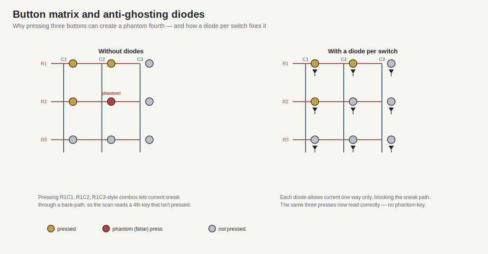

The diode requirement is not optional cosmetics. In a bare matrix, holding three buttons that share a row and column lets current sneak through a back-path, so the scan reads a fourth key that nobody pressed — a phantom press. A diode in series with each switch allows current one way only, blocking that sneak path so the same three presses read correctly. This is why the diode is specified per switch rather than per row or column.

**Figure 3-1: Matrix Wiring Topology**

```mermaid
graph TD
    MCU[e.g STM32 MCU] -->|Row Outputs| Rows[Matrix Rows]
    MCU -->|Column Inputs| Cols[Matrix Columns]
    Rows --> Switches[Push Buttons]
    Cols --> Switches
    Switches --> Diodes[Anti-Ghosting Diodes]
```

#### 3.2 Firmware and USB HID Enumeration

> **Informative:** For native plug-and-play compatibility with operating systems and racing simulators, the device must emulate a standard game controller.

The button box microcontroller **shall** feature native USB HID support (e.g., ATmega32U4 or RP2040). The firmware **shall** debounce all physical switch state transitions.

| Step | Action | Notes / Constraint |
|------|--------|--------------------|
| 1 | The firmware **shall** configure matrix rows as outputs and columns as inputs with internal pull-ups. | Initializes hardware state. |
| 2 | The firmware **shall** sequentially pull each row LOW and sample the column states. | Matrix scanning loop. |
| 3 | The firmware **shall** construct a standard HID joystick report. | Formats data for host PC. |
| 4 | The firmware **shall** transmit the HID report over USB. | Occurs on state change or polling interval. |

### 4. Question Register (Resolved and Open)

Reviewed 2026-07-05.

#### 4.1 Resolved

- **What are the latency overheads of bridging telemetry through middleware (SimHub) vs native game telemetry?**
  **Resolved as method ([`telemetry.md`](./telemetry.md) §6).** End-to-end latency is stage-additive: game publish interval + host acquisition/mapping + transport (virtual COM/USB) + device render. Middleware adds the host acquisition/mapping stage and a transport hop that native in-engine output avoids, but for numeric dashboard fields this is typically small relative to the game publish interval; latency-sensitive effects (tactile, LEDs) should be prioritized in the mapping. The exact millisecond overhead is hardware/transport-specific — measure each stage (4.2).
- **Could CAN/CAN-FD replace simple serial or SPI for higher reliability and node expansion in prosumer rims?**
  **Engineering inference: yes, that is exactly its niche.** CAN/CAN-FD is a differential, multi-controller bus with built-in error detection and arbitration, well suited to several distributed nodes on one rig; the trade-off is protocol overhead and a transceiver per node. It is already listed as an internal topology in [`communication-protocols.md`](./communication-protocols.md), and community evidence shows Fanatec uses CAN internally (FendtXerion Fanatec-Pinout wiki "Data and CAN"). Choose CAN when node count/reliability matters; keep SPI/UART for short point-to-point links where its overhead isn't justified.

#### 4.2 Open — for developers to self-investigate

- **Which identity, capability, and torque-permission exchanges are publicly specified per QR generation?**
  *How:* **none are publicly specified** as a cryptographic/DRM mechanism — treat this as Unknown. Do not assume a handshake without an approved spec; community emulators show only selected legacy observations. Obtain the interface definition officially for any current generation.
- **Measured middleware-vs-native latency figures on target hardware.**
  *How:* timestamp at host acquisition, at transport, and at device render, per the method above; report per stage so the dominant contributor is visible.

### 5. References

#### 5.1 Official and Standards Sources

- [USB-IF HID specifications and tools](https://www.usb.org/hid) — HID descriptors, usages, and tooling for button boxes and dashboard control interfaces.
- [USB-IF PID Class 1.0](https://www.usb.org/sites/default/files/documents/pid1_01.pdf) — haptic/force-feedback device model; useful boundary context for separating FFB from dashboard telemetry.
- [Fanatec Podium DD1 manual](https://assets.fanatec.com/fanatec-pwa/image/upload/downloads-prod/pdfs/P-WB-DD1-Manual-EN_web.pdf) — public quick-release, startup, update, calibration, and steering-wheel detection context.
- [Fanatec QR2 conversion guidance](https://help.fanatec.com/hc/en-us/articles/30011253510289-Which-products-can-be-converted-to-QR2) — QR1/QR2 generation boundary, Base-Side/Wheel-Side variants, and model-specific upgrades.
- [Fanatec Steering Wheel FAQ](https://help.fanatec.com/hc/en-us/articles/43802514108433-Steering-Wheel-FAQ) — QR2 default and QR1 discontinuation date.

#### 5.2 Public Tools and Community Sources

- [SimHub wiki](https://github.com/SHWotever/SimHub/wiki) — dashboards, Arduino displays, LEDs, buttons, custom serial devices, and telemetry tooling.
- [OpenFFBoard wiki](https://github.com/Ultrawipf/OpenFFBoard/wiki/) — open force-feedback device architecture; useful for separating motor control, HID/PID, and I/O concerns.
- [gotzl/hid-fanatecff](https://github.com/gotzl/hid-fanatecff) — Linux-side Fanatec LED/display, HIDRAW, and force-feedback integration patterns.
- [FendtXerion3800/Fanatec-Pinout](https://github.com/FendtXerion3800/Fanatec-Pinout) — community connector observations; verify electrically before use.
- [Fanatec ecosystem source register](./references.md) — official/community source classification and currency notes.


## Sim Racing Cockpits: Mechanical Architecture & Rigidity

> Research date: 2026-07-02
> Evidence model: public product/manual information plus engineering inference. Cockpit stiffness recommendations are design guidance, not a universal vendor requirement.
> Related docs: [sim_racing_research.md](./sim_racing_research.md), [wheel_base.md](./wheel_base.md), [pedals.md](./pedals.md).

### 1. Introduction

The sim racing cockpit serves as the mechanical grounding plane for all user inputs and system outputs. For an embedded systems engineer, the cockpit can be viewed as the structural chassis that houses the primary actuators (Direct Drive wheelbases) and sensors (Load Cell pedals). Any mechanical flex in this chassis acts as an unintended low-pass filter for Force Feedback (FFB) signals and injects noise into braking pressure readings. This document details the architectural standards, rigidity requirements, and integration methods for extruded aluminum (8020) sim racing cockpits.

### 2. System Architecture Overview

Modern high-fidelity sim racing rigs rely on modular T-slot extruded aluminum profiles. This approach provides infinite adjustability and immense stiffness-to-weight ratios. The architecture isolates different stress points by distributing them across a rigid base frame.

**Figure 2-1: Standard Cockpit Component Hierarchy**

```mermaid
graph TD
    RigBase[Main Base Frame] --> WheelUprights[Wheelbase Uprights]
    RigBase --> PedalDeck[Pedal Deck]
    RigBase --> SeatCrossmembers[Seat Cross-members]

    WheelUprights --> DDMount[Direct Drive Mount]
    PedalDeck --> LCPedals[Load Cell Pedals]
    SeatCrossmembers --> SeatBrackets[Seat Brackets / Sliders]
    SeatBrackets --> DriverSeat[Driver Seat]
```

The base frame is the foundational structural loop. All secondary structures (uprights, decks, and cross-members) branch off this base to support the driver and the hardware.

### 3. Structural Rigidity and Signal Fidelity

Structural flex introduces parasitic losses to the system. Understanding how flex affects both output fidelity and input consistency is critical for designing a performant rig.


The illustration makes the core idea concrete: in a stiff rig, the wheelbase's FFB torque and the driver's brake force transfer almost entirely to the hands and feet. In a flexible rig, part of that energy bends the frame instead — the upright leans under torque and the pedal deck moves back under braking. That absorbed energy is exactly the detail the driver loses: the wheel feels soft or delayed, and braking becomes hard to repeat.

#### 3.1. Direct Drive Torque Dynamics

Direct Drive (DD) wheelbases couple a large servo motor directly to the steering wheel, capable of producing transient torque spikes in excess of 20Nm. These motors operate with high bandwidth to deliver detailed road texture and slip angle feedback.

If the wheelbase uprights flex, the mechanical structure absorbs the high-frequency FFB transients.

* The wheelbase uprights **shall** be constructed from profile no smaller than 40x80mm to resist torsional flex.
* The mounting brackets connecting the uprights to the base frame **should** utilise heavy-duty corner gussets and sandwich plates to eliminate play.
* The steering column mount **shall** ensure zero lateral or vertical deflection under peak operating torque.

#### 3.2. Load Cell Brake Deflection Forces

Unlike standard potentiometers that measure angular displacement, load cell pedals measure the actual physical force applied to the brake face (often up to or exceeding 100kg of force). This mimics the hydraulic pressure in a real racing car, relying on human muscle memory which is highly sensitive to pressure but poor at measuring distance.

When a driver applies 100kg of force, any backward flex in the pedal deck or the driver's seat creates "lost energy" and changes the pedal's spatial position relative to the driver. This dynamically alters the pressure-to-displacement ratio, destroying input consistency during critical trail-braking phases.

* The pedal deck and seat mounting system **shall** remain completely rigid under a minimum of 100kg longitudinal force.
* Load cell pedal stiffness **should** be tuned via elastomers or springs to allow a minimal, predictable travel without inducing chassis flex.

### 4. Component Sizing and Specifications

Aluminum profiles are categorized by their cross-sectional dimensions. Proper selection is critical to meet the rigidity requirements without unnecessary cost.

| Profile Size | Primary Application | Structural Rigidity Rating | Usage Requirement |
|--------------|---------------------|----------------------------|-------------------|
| **40x40mm**  | Accessories, monitor mounts | Low | **Shall not** be used for primary structural load paths. |
| **40x80mm**  | Base Frame, Uprights, Pedal Deck | High | **Shall** be the minimum standard for the main chassis and uprights. |
| **40x120mm+**| Heavy-duty Uprights, Aesthetic builds | Extreme | **May** be used for ultra-high-torque Direct Drive bases (20Nm+). |

### 5. Seat Integration and Ergonomics

The seat mounting architecture must bridge the lateral gap between the main base rails while accommodating drivers of different sizes. Modularity is achieved through a layered approach of cross-members and sliding rails.

**Figure 5-1: Seat Mounting Architecture and Load Path**

```mermaid
graph LR
    MainRails[40x80mm Base Rails] --> Crossmembers[40x40mm Cross-members]
    Crossmembers --> Sliders[Seat Sliders]
    Sliders --> Brackets[FIA Side Brackets]
    Brackets --> Seat[Racing Bucket Seat]
```

* The system **shall** provide a secure, flat mounting interface to prevent binding in the slider rails.
* Seat cross-members **should** span the exact width between the inner channels of the base rails.
* If automotive seats are used, spacers or adapter plates **may** be required to flush-mount uneven factory seat rails to the flat aluminum profiles.

#### 5.1 Ecosystem Mounting Example

Fanatec's public ClubSport GT Cockpit guidance states that its standard bottom plate supports current Fanatec bases including CSL DD, Gran Turismo DD Pro, ClubSport DD/DD+, and Podium DD2 QR2. An optional Direct Drive Front Mount is a separate mounting path. This is product-specific evidence, not proof that every cockpit or hole pattern supports every base.

For customer communication, separate three questions:

1. Does the mounting plate have the approved hole pattern and fastener depth for the exact base?
2. Is the structure rated and sufficiently stiff for the base's available torque and pedal force?
3. Are the seat, wheel, pedals, shifter, and handbrake ergonomically adjustable together?

### 6. Question Register (Resolved and Open)

Reviewed 2026-07-05.

#### 6.1 Resolved

- **How should tactile transducers ("bass shakers") be mechanically isolated from the primary structural profiles to avoid interfering with DD high-frequency FFB?**
  **Resolved ([`tactile.md`](./tactile.md) §4–5).** Mount transducers to the seat or a dedicated panel rather than rigidly into the main FFB load path; where a frame mount is unavoidable, use compliant/isolating mounts; and restrict the transducer to its intended low-frequency band with a crossover so its energy does not sum into the wheel's FFB detail band. Commission the tactile system independently before running it alongside high-torque FFB.

#### 6.2 Open — for developers to self-investigate

- **Acceptable micro-flex tolerance (mm) under a 100 kg braking load before it demonstrably affects load-cell consistency.**
  *How:* this is measurement-specific to the rig and load cell — there is no universal number. Method: apply a known static load, measure deflection at the pedal deck with a dial indicator, and correlate against load-cell repeatability. Treat the rig as a stable reference frame only once deflection is small relative to the load cell's resolution; record fastener torque and bracket type so results are reproducible (see Implementation Notes).
- **Do standard 40×80 mm aluminum structures have resonances aligning with common FFB frequencies, and how to damp them?**
  *How:* **Unknown without measurement on the actual structure** — resonances depend on length, bracing, joints, and mounted mass. Method (per [`tactile.md`](./tactile.md) §6 and [`tools.md`](./tools.md) §5): excite the structure (swept sine via a transducer) with an accelerometer attached to locate resonances, then keep transducer energy and dominant FFB effect bands out of those frequencies, adding mass/bracing/isolating mounts where an overlap exists.

### 7. References

#### 7.1 Manufacturer and Product Context

- [Sim-Lab P1X Pro cockpit](https://sim-lab.eu/products/p1x-pro-sim-racing-cockpit) — public example of an aluminum-profile cockpit ecosystem with wheel, pedal, seat, monitor, shifter, and handbrake mounting accessories.
- [Fanatec Podium DD1 manual](https://assets.fanatec.com/fanatec-pwa/image/upload/downloads-prod/pdfs/P-WB-DD1-Manual-EN_web.pdf) — public high-torque base setup, calibration, and safety context.
- [Fanatec ClubSport GT Cockpit wheel-base compatibility](https://www.fanatec.com/us/en/explorer/products/cockpit/wheel-bases-fit-on-the-fanatec-clubsport-gt-cockpit/) — official bottom-mount and optional front-mount product example.
- [Fanatec ecosystem source register](./references.md) — source dates and community buyer-guide limitations.

#### 7.2 Related Internal References

- [Wheel-base architecture](./wheel_base.md) — torque generation, motor safety, and FFB constraints.
- [Pedals architecture](./pedals.md) — load-cell force path and calibration sensitivity.

### 8. Implementation Notes

- Measure cockpit deflection under expected peak brake force and wheel torque before treating the rig as a stable reference frame.
- Treat tactile transducers as a separate vibration system; isolate and test them so they do not mask FFB or sensor diagnostics.
- Record fastener torque, bracket type, and profile size in bench reports so mechanical results are reproducible.


## Sim Racing Developer Tools and References

This document lists practical tools and reference sources for developers studying or prototyping sim-racing peripherals. It is a starting point, not a product approval list.

### 1. Standards and Interface References

| Need | Reference | Use |
|---|---|---|
| USB input devices | [USB-IF HID specifications and tools](https://www.usb.org/hid) | HID descriptors, usages, report model, descriptor authoring tools. |
| Force feedback devices | [USB-IF PID Class 1.0](https://www.usb.org/sites/default/files/documents/pid1_01.pdf) | Physical Interface Device reports for force-feedback wheels and haptic devices. |
| Linux input and FF APIs | [Linux force-feedback documentation](https://www.kernel.org/doc/html/latest/input/ff.html) | Host-side effect upload/playback concepts. |
| HIDRAW access | [Linux HIDRAW documentation](https://docs.kernel.org/hid/hidraw.html) | Direct HID descriptor/report access for tools and compatibility layers. |

### 2. Ecosystem and Compatibility References

| Need | Reference | Use |
|---|---|---|
| Source confidence and dates | [Fanatec ecosystem source register](./references.md) | Check whether a claim is official, current community context, or stale buyer-guide material. |
| Customer terminology | [Fanatec customer glossary](./glossary.md) | Use consistent component, platform, QR, tuning, and troubleshooting language. |
| Current wheel-base tiers | [Fanatec Wheel Bases FAQ](https://help.fanatec.com/hc/en-us/articles/43766204938257-Wheel-Bases-A-FAQ) | Verify current CSL, ClubSport, and Podium positioning and connection constraints. |
| Platform licensing | [Fanatec platform compatibility](https://www.fanatec.com/us-en/platforms) | Verify Xbox wheel/hub and PlayStation base ownership. |
| QR generations | [Fanatec QR2 conversion guidance](https://help.fanatec.com/hc/en-us/articles/30011253510289-Which-products-can-be-converted-to-QR2) | Check Base-Side/Wheel-Side generation, upgrade path, and model-specific restrictions. |

### 3. Public Sim-Racing Software

| Tool | Source | Developer Use |
|---|---|---|
| OpenFFBoard | [OpenFFBoard wiki](https://github.com/Ultrawipf/OpenFFBoard/wiki/) | Study modular FFB firmware concepts, motor drivers, encoders, and HID/PID integration. |
| hid-fanatecff | [gotzl/hid-fanatecff](https://github.com/gotzl/hid-fanatecff) | Study Linux-side Fanatec HID/FFB translation, device IDs, LED/display sysfs separation, and HIDRAW behavior. |
| hid-fanatecff-tools | [gotzl/hid-fanatecff-tools](https://github.com/gotzl/hid-fanatecff-tools) | Study game-telemetry bridge patterns for LEDs, displays, and tuning values. |
| SimHub | [SimHub wiki](https://github.com/SHWotever/SimHub/wiki) | Study telemetry dashboards, Arduino displays, LEDs, button boxes, and serial-device integration. |

### 4. Firmware and Hardware Bring-Up Tools

| Tool Class | Examples | Use |
|---|---|---|
| Logic analyzer | Saleae-class analyzer, sigrok/PulseView | Validate SPI/UART/CAN timing, QR transaction boundaries, and boot-to-response deadlines. |
| Oscilloscope | 2+ channel DSO | Verify rails, reset, PWM timing, encoder signals, current-sense timing, and QR backfeed. |
| USB analyzer/software | Wireshark USBPcap, Linux `usbmon`, hid-tools | Inspect enumeration, descriptors, reports, and host/device timing. |
| Firmware debug | SWD/JTAG, RTT, semihosting disabled in real-time paths | Debug startup, state machines, and diagnostics without disturbing critical link timing. |
| HIL fixtures | Protocol simulator, current-limited power fixture, dummy motor/load | Verify fault handling before commercial hardware or full-energy operation. |

### 5. Validation Checklist by Subsystem

| Subsystem | Minimum Tooling |
|---|---|
| Wheel base | Oscilloscope, logic analyzer, current-limited supply, USB trace, E-stop/fault injection fixture. |
| Steering rim | Logic analyzer, QR pinout fixture, rail/backfeed test, input bounce test, display/LED stress test. |
| Pedals | DMM, ADC capture, known weights/force fixture, USB HID trace, calibration persistence test. |
| Shifter/handbrake | GPIO/ADC capture, debounce timing trace, impossible-state injection. |
| Dashboard/button box | USB/serial trace, SimHub profile, display refresh stress test. |
| Cockpit | Deflection measurement under wheel torque and brake load, fastener torque audit, resonance/tactile-transducer isolation check. |

### 6. Source Handling Rules

- Use official standards for protocol claims.
- Use manufacturer manuals for public setup, update, safety, and connector behavior.
- Use GitHub/community projects for demonstrated public implementations only.
- Record generation boundaries. A legacy Fanatec SPI rim emulator is not proof for ClubSport DD/DD+ behavior.
- Link the exact source used; do not cite a repository search result as evidence for a specific claim.
- Date community buyer guides. Recheck torque, availability, QR, platform, and firmware claims against current manufacturer support before reuse.

### Question Register (Resolved and Open)

Reviewed 2026-07-05.

#### Resolved

- **Which USB/HID descriptor inspection tool should be standardized once source code exists?**
  **Engineering recommendation (verified public tools).** Standardize on a small, cross-platform set rather than one tool: for descriptor decoding use the **USB-IF HID Descriptor Tool** or an online HID report-descriptor decoder; for live capture/decode use **Wireshark with USBPcap** (Windows) or **usbmon** (Linux); for raw HID read/write and quick FFB report testing use **hidapitester** or Linux `usbhid-dump` + `evtest`; and validate axis/button/FFB behavior with the OS joystick/HID test panel. On Linux specifically, the `hid-fanatecff` driver plus `evtest`/`fftest` is the practical FFB-verification path. Pick the descriptor decoder as the primary standard and keep the capture/raw-HID tools as the supporting toolchain.


## Fanatec & Sim Racing Open-Source Repositories

This document is a curated discovery map for public projects relevant to Fanatec-compatible and sim-racing hardware research. These repositories are useful for architecture lessons and interoperability hypotheses. They are not official Fanatec specifications unless the repository is owned by the vendor.

### How To Use These Repositories

| Evidence Type | What It Can Support | Required Caution |
|---|---|---|
| README/project docs | Project goals, supported hardware, build method | May be stale or incomplete |
| Source code | Observed framing, timing, descriptors, and hardware assumptions | May target only one device generation |
| Schematics/pinouts | Community electrical hypotheses | Must be verified against approved docs or measured safely |
| Issues/discussions | Failure modes and compatibility reports | Treat as anecdotal until reproduced |
| Releases/binaries | Reproducible build/deployment path | Do not redistribute proprietary firmware or unknown binaries |

### Developer Reading Order

1. Read [sim_racing_research.md](./sim_racing_research.md) for subsystem boundaries.
2. Read [wheel_rim.md](./wheel_rim.md) before wheel-emulator projects.
3. Read [pedals.md](./pedals.md) before pedal-controller or pedal-proxy projects.
4. Read [add_ons.md](./add_ons.md) before shifter/handbrake projects.
5. Use [tools.md](./tools.md) to validate USB, HID, timing, and electrical assumptions.

### Wheel Emulators & DIY Steering Wheels

* **[lshachar/Arduino_Fanatec_Wheel](https://github.com/lshachar/Arduino_Fanatec_Wheel)**
  A do-it-yourself project allowing you to build a custom steering wheel that communicates with Fanatec wheel bases over SPI. It supports buttons, D-pads, and alphanumeric displays, spoofing the wheelbase into enabling Force Feedback.

* **[StuyoP/Fanatec-Wheel-Barebone-Emulator](https://github.com/StuyoP/Fanatec-Wheel-Barebone-Emulator)**
  A barebone emulator for Fanatec wheelbases utilizing an ATmega328p chip natively running at 3.3V. It allows you to create DIY steering wheels with full button, display, and LED support without the need for logic level shifters.

* **[Alexbox364/F_Interface_AL](https://github.com/Alexbox364/F_Interface_AL)**
  A versatile hardware and software platform for building DIY custom steering wheels. It communicates directly with Fanatec wheelbases via the SPI protocol and can support up to 24 push buttons, rotary encoders, TM1637 displays, and OLED screens.

### Pedal Emulators & Controller Replacements

* **[jssting/ArduinoTec-Pedals](https://github.com/jssting/ArduinoTec-Pedals)**
  An Arduino Leonardo/Pro Micro project meant to replace the OEM controller board of Fanatec ClubSport Pedals (CSP) V1/V2. Perfect for repairing older pedals when the main PCB breaks, allowing you to interface the original load cells and Hall effect sensors via standard USB.

* **[GeekyDeaks/fanatec-pedal-emulator](https://github.com/GeekyDeaks/fanatec-pedal-emulator)**
  A tool that allows you to take third-party USB pedals (like Heusinkveld) and proxy them through a Fanatec wheelbase via the RJ12 port, making them usable on consoles like PS4/PS5 or Xbox.

* **[adamcrawley/fanatec-pedal-emulator-vrs](https://github.com/adamcrawley/fanatec-pedal-emulator-vrs)**
  A modified version of the emulator above, specifically geared toward making VRS DirectForce Pro Pedals compatible with a Fanatec wheelbase.

### Shifters, Motion & Force Feedback

* **[StuyoP/Universal-Shifter-Interface-for-Fanatec](https://github.com/StuyoP/Universal-Shifter-Interface-for-Fanatec)**
  An interface that allows you to connect any switch-based H-pattern or sequential shifter directly to a Fanatec wheelbase using its internal RJ12 protocol.

* **[Ultrawipf/OpenFFBoard](https://github.com/Ultrawipf/OpenFFBoard)**
  An overarching universal open-source force feedback interface platform for highly compatible DIY simulation devices, particularly direct-drive steering wheels. It supports various motor drivers (like TMC4671, ODrive, VESC) and encoders.

* **[vnmsimulation/VNM_MOTION_CONTROLLER](https://github.com/vnmsimulation/VNM_MOTION_CONTROLLER)**
  STM32F401RCT-based firmware and configurator app from VNM Simulation to build DIY hardware including wheelbases, pedals, and motion rigs.

### Hardware Reference & Pinouts

* **[FendtXerion3800/Fanatec-Pinout](https://github.com/FendtXerion3800/Fanatec-Pinout)**
  A useful hardware reference repository documenting the pinouts for Fanatec equipment (such as RJ12 sockets for pedals, shifters, and wheel quick releases). This is crucial for anyone building DIY conversion cables or custom adapters.

### Drivers & Software Interfaces

* **[gotzl/hid-fanatecff](https://github.com/gotzl/hid-fanatecff)**
  A highly regarded Linux kernel driver module providing full force feedback (FFB) support for Fanatec wheel bases. Essential for anyone wanting to sim race on Linux or SteamOS platforms.

### General Repository Searches

If you want to keep exploring the latest community creations across GitHub and GitLab, here are a few direct search queries:
* [GitHub Search: "fanatec"](https://github.com/search?q=%20fanatec&type=repositories)
* [GitHub Search: "racing wheel base"](https://github.com/search?q=racing+wheel+base+&type=repositories)
* [GitLab Search: "fanatec"](https://gitlab.com/search?search=fanatec)
* [GitLab Search: "sim racing"](https://gitlab.com/search?search=sim+racing)

### Reference Anchors

- [USB-IF HID specifications and tools](https://www.usb.org/hid) — baseline for USB HID reports and usages.
- [USB-IF PID Class 1.0](https://www.usb.org/sites/default/files/documents/pid1_01.pdf) — baseline for HID force-feedback/PID model.
- [Fanatec Podium DD1 manual](https://assets.fanatec.com/fanatec-pwa/image/upload/downloads-prod/pdfs/P-WB-DD1-Manual-EN_web.pdf) — public manufacturer behavior for one high-end base family.
- [SimHub wiki](https://github.com/SHWotever/SimHub/wiki) — public telemetry/dashboard/button-box ecosystem.
- [OpenFFBoard wiki](https://github.com/Ultrawipf/OpenFFBoard/wiki/) — public modular FFB wheelbase ecosystem.

### Open Questions for Developers to Self-Investigate

Reviewed 2026-07-05. Process question — the answer is produced by the reader's verification work, not by lookup.

- **Which repositories should be promoted into a formal compatibility matrix after bench verification?**
  *How to investigate:* treat every repo here as **discovery input / community evidence**, never as an official spec. Promote a project into [`compatibility-matrix.md`](./compatibility-matrix.md) only after (a) confirming the exact hardware/firmware it was validated against, (b) reproducing its behavior on the bench, and (c) recording the result with date and versions. Prioritize projects that already publish concrete, checkable details — e.g. `gotzl/hid-fanatecff` (device USB IDs, extended controls) and `GeekyDeaks/fanatec-pedal-emulator` (RJ12/UART pinout) — since these are the easiest to verify. Re-verify on firmware or product changes.


## Telemetry Software Architecture

> Version: 1.0
> Reviewed: 2026-07-02
> Purpose: describe the game-telemetry pipeline (game -> bridge -> device) as a first-class subsystem, consolidating material previously split across accessories.md and tools.md. This answers one of the expansion questions raised in [sim_racing_research.md](./sim_racing_research.md) §13.

### Document Change Log

| Version | Date | Changes |
|---|---|---|
| 1.0 | 2026-07-02 | New document. Consolidates the dashboard/SimHub material from [accessories.md](./accessories.md) §2 and the telemetry-bridge role of `hid-fanatecff-tools` from [repos.md](./repos.md); adds a latency-budget discussion for the open question in accessories.md §4. |

### 1. Purpose

Telemetry software extracts real-time data from a racing simulation (speed, RPM, gear, tyre state, flags) and dispatches it to output devices: dashboards, LED strips, button-box displays, and tactile transducers. It is the bridge between the game host and the embedded peripherals in this ecosystem.

> [!NOTE]
> Focus is on the *architecture* of the pipeline. SimHub is treated as a **community implementation** example (verified against its upstream README), not as a proprietary specification.

### 2. Responsibilities

- Acquire telemetry from the game (native telemetry API, shared memory, or UDP feed).
- Map telemetry fields to device effects (display fields, LED patterns, shaker channels).
- Encode and transmit to devices over the chosen transport.
- Maintain a link watchdog so a stalled feed does not leave stale or unsafe output.

### 3. Pipeline Architecture

**Figure 3-1: Telemetry Pipeline**

```mermaid
flowchart LR
    Game["Sim / Game"] -->|"telemetry API / shared mem / UDP"| Host["Telemetry Software (e.g. SimHub)"]
    Host -->|"virtual COM / USB serial"| Dash["Dashboard MCU (ESP32 / Arduino)"]
    Host -->|"USB / driver hooks"| LEDs["Wheel / Base LEDs"]
    Host -->|"audio / DSP"| Tactile["Tactile Transducers"]
    Dash -->|"I2C"| Char["Character Display"]
    Dash -->|"SPI"| TFT["TFT / OLED Display"]
```

This mirrors the dashboard architecture already documented in [accessories.md](./accessories.md) §2: the host transmits encoded telemetry strings over a virtual serial port, and the dashboard firmware parses them to update display buffers.

### 4. Data Sources

| Source type | Description | Caution |
|---|---|---|
| Native telemetry API | Game exposes a documented telemetry output | Field set and rate are game-specific. |
| Shared memory | Game publishes a memory-mapped structure | Structure layout can change between game versions. |
| UDP feed | Game broadcasts telemetry packets | Requires network configuration; subject to loss. |

Telemetry software **shall** treat every source as game-version-dependent and **should** degrade gracefully when a field is absent.

### 5. Communication Interfaces

- Host-to-dashboard: the host **shall** transmit encoded telemetry over a virtual serial (USB CDC) port; the device firmware **shall** parse and update display buffers, per [accessories.md](./accessories.md) §2.2.
- Character displays over I2C; TFT/OLED over SPI. The system **should** minimize I2C daisy-chaining to avoid bus saturation at high refresh rates.
- LED/display output on Fanatec bases and rims can also be driven through community driver tooling; `hid-fanatecff-tools` is documented as a telemetry bridge for LEDs, displays, and tuning (see [repos.md](./repos.md)).

### 6. Latency Budget

This addresses the open question in [accessories.md](./accessories.md) §4 (middleware vs native latency). End-to-end latency is the sum of: game publish interval, host acquisition and mapping, transport (serial/USB), and device render. As **engineering inference**, a responsive dashboard budgets each stage so total latency stays below one game frame at the target rate; tactile and LED effects are more latency-sensitive than numeric fields and **should** be prioritized in the mapping and transport.


Because the stages add up, the useful thing to measure is each stage on its own, not just the end-to-end figure — that is how the dominant contributor becomes visible and fixable. The percentages above are illustrative only.

> [!TIP]
> Measure each stage independently (host timestamp, transport, device render) rather than only the end-to-end figure, so the dominant contributor is visible.

### 7. Firmware Modules

Device-side firmware in this pipeline **shall** provide: a serial parser with framing and length checks; a display/effect buffer; a link watchdog that blanks or freezes output safely on feed loss; and a mapping layer that is data-driven where possible so new telemetry fields do not require reflashing.

### 8. Debugging Strategy

Capture the serial stream on the bench (logic analyzer or host loopback), confirm framing under packet loss, and verify watchdog behavior by cutting the feed mid-session. For LED/display bridges, confirm no bus saturation under maximum refresh.

### 9. Firmware Perspective

The device is a telemetry *sink*: it does not own the game connection and **shall not** assume the feed is present or well-formed. All safety-relevant output (for example, flag or shift-light states) **shall** have a defined safe value when telemetry is stale.

### 10. Key Takeaways

- Telemetry software is a distinct subsystem bridging game host and embedded outputs.
- The dashboard pipeline (SimHub -> virtual COM -> MCU -> I2C/SPI display) is already the ecosystem norm.
- Latency is stage-additive; measure per stage and prioritize latency-sensitive effects.
- Treat every feed as untrusted and version-dependent; fail safe on loss.

### References

- [SimHub](https://github.com/SHWotever/SimHub) — telemetry dashboards, Arduino displays, LEDs, button boxes, and custom serial devices.
- [gotzl/hid-fanatecff-tools](https://github.com/gotzl/hid-fanatecff-tools) — telemetry bridge for Fanatec LEDs, displays, and tuning.
- [accessories.md](./accessories.md) — dashboard and telemetry-display architecture.
- [tactile.md](./tactile.md) — tactile-transducer output driven from telemetry.

### Open Questions for Developers to Self-Investigate

Reviewed 2026-07-05. This is measurement-dependent — the numbers vary by transport, host load, and device, so it must be measured on target rather than looked up.

- **What per-stage latency figures are achievable with each common transport, measured on target hardware?**
  *How to investigate:* instrument the three stages separately — (1) host acquisition/mapping (timestamp on telemetry receipt vs. on encode), (2) transport (host send vs. device receive, e.g. USB CDC/virtual COM vs. USB HID vs. network), and (3) device render (parse vs. display/effect update). Use a logic analyzer or host-side loopback plus a device-side timestamp. Compare virtual-COM serial, USB HID, and any network transport under realistic refresh rates and host load. Report per stage so the dominant contributor is visible (see §6). As an order-of-magnitude anchor: keep total telemetry latency below one game frame at the target rate, and prioritize latency-sensitive effects (tactile, LEDs) over numeric fields.


## Tactile Transducer Architecture

> Version: 1.0
> Reviewed: 2026-07-02
> Purpose: treat tactile transducers ("bass shakers") as a distinct vibration subsystem and address the isolation and resonance questions raised in [cockpits.md](./cockpits.md) §6. Answers part of the expansion question in [sim_racing_research.md](./sim_racing_research.md) §13.

### Document Change Log

| Version | Date | Changes |
|---|---|---|
| 1.0 | 2026-07-02 | New document. Directly addresses the tactile-transducer isolation and resonance open questions in [cockpits.md](./cockpits.md) §6 and the isolation-check gate in [tools.md](./tools.md) §5. |

### 1. Purpose

Tactile transducers convert an audio/telemetry signal into low-frequency vibration felt through the seat and chassis (engine rumble, kerb strikes, wheel lock, road texture). This document defines them as a **separate vibration system** that must not corrupt Direct Drive force feedback or pedal-sensor readings.

> [!IMPORTANT]
> The guiding constraint from [cockpits.md](./cockpits.md): tactile transducers **shall** be treated as a separate vibration system and isolated and tested so they do not mask FFB or sensor diagnostics.

### 2. Responsibilities

- Reproduce low-frequency effects from a telemetry-derived or audio source.
- Deliver vibration to the driver without injecting destructive energy into the FFB or sensor paths.
- Allow per-effect tuning (channel, frequency band, level).

### 3. Transducer Types (General)

As **verified public** general knowledge, tactile transducers range from small "puck" exciters mounted to a seat or panel, to larger high-output shakers bolted to the rig frame. Larger units couple more energy into the structure — increasing both effect strength and the risk of interfering with FFB and sensors.

### 4. Signal Source and Crossover

**Figure 4-1: Tactile Signal Path**

```mermaid
flowchart LR
    Src["Telemetry / Audio Source (e.g. SimHub)"] --> Xover["Low-Pass / Crossover"]
    Xover --> Amp["Amplifier"]
    Amp --> Trans["Tactile Transducer(s)"]
    Trans --> Seat["Seat / Panel / Frame"]
```

The source is typically the telemetry pipeline (see [telemetry.md](./telemetry.md)) or a dedicated low-frequency audio channel. A crossover/low-pass stage **shall** restrict energy to the transducer's intended low-frequency band so higher-frequency content is not dumped into the structure.


Keeping the shaker inside its intended low band (green) is what stops its energy from summing into the wheel's FFB detail band (purple) or driving a structural resonance of the rig (red). The exact resonance frequencies are rig-specific and must be measured rather than assumed — see §6.

### 5. Mechanical Isolation (Answering cockpits.md §6)

The open question in [cockpits.md](./cockpits.md) §6 asks how transducers should be isolated from the primary structural profiles to avoid destructive interference with DD high-frequency FFB. As **engineering inference** consistent with that document's guidance:

- Transducers **should** be mounted to the seat or a dedicated panel rather than rigidly to the main FFB load path where practical, so their energy does not sum with FFB torque at the wheel.
- Where a transducer must attach to the frame, compliant/isolating mounts **should** be used to decouple its vibration from the structural profiles.
- The tactile system **should** be commissioned and measured independently (see §7) before running alongside high-torque FFB.

### 6. Resonance Interaction (Answering cockpits.md §6)

The second open question asks whether standard 40x80 mm aluminum structures have resonance frequencies that align with common FFB signal frequencies, and how to damp them. This study base does not assert specific measured resonance frequencies for a given rig — that is **Unknown** without measurement on the actual structure. The correct method:

- Measure the rig's structural response (for example, with an accelerometer and a swept excitation) to locate resonances, per the resonance/tactile-isolation check in [tools.md](./tools.md) §5.
- Avoid driving transducer energy into a band that coincides with a structural resonance or a dominant FFB effect band.
- Add damping (mass, bracing, or isolating mounts) where a resonance overlaps the operating band.

### 7. Debugging and Commissioning

Commission the tactile system alone first: sweep frequency and level, and confirm with an accelerometer that energy stays in-band and does not excite a structural resonance. Then enable FFB and confirm the transducers do not mask FFB detail or perturb pedal-sensor readings. Treat any change in pedal calibration or FFB noise floor when shakers are active as a coupling problem to fix mechanically.

### 8. Firmware Perspective

Tactile output is usually driven by host software plus an amplifier, so device firmware involvement is minimal; where a controller is used, it **shall** keep effects within the configured band and **shall** have a defined quiet state when its source is lost (see [telemetry.md](./telemetry.md) §9).

### 9. Key Takeaways

- Tactile transducers are a separate vibration system, not part of the FFB path.
- Isolate them (seat/panel mounting, compliant mounts) so they do not sum with FFB or disturb sensors.
- Structural resonances are rig-specific and **Unknown** until measured; locate them, then keep energy out of that band.
- Commission tactile alone, then verify no interference with FFB and pedals.

### References

- [cockpits.md](./cockpits.md) — the structure and the original isolation/resonance questions.
- [telemetry.md](./telemetry.md) — the telemetry/audio source and safe-quiet behavior.
- [tools.md](./tools.md) — resonance / tactile-transducer isolation check.

### Open Questions for Developers to Self-Investigate

Reviewed 2026-07-05. This item is rig-specific and cannot be answered in the abstract — it requires measurement on the actual structure.

- **What are the measured resonance frequencies of the target rig structure, and which effect bands must be avoided or damped?**
  *How to investigate:* attach an accelerometer to the structure and excite it with a swept-sine signal through a transducer (or an impact test); the response peaks are the resonances. Cross-reference those frequencies against the dominant FFB effect bands and the transducer's operating band, then keep energy out of any overlap (crossover tuning) and add damping — mass, bracing, or isolating mounts — where an overlap is unavoidable. Record the rig configuration (profile size, bracing, mounted mass, fastener torque) with the results, because resonances shift when any of these change. See [`tools.md`](./tools.md) §5 for the isolation/resonance check.


## Motion Platform Architecture

> Version: 1.0
> Reviewed: 2026-07-02
> Purpose: introduce motion platforms (motion cueing rigs) as a subsystem, at the architectural level. Answers part of the expansion question in [sim_racing_research.md](./sim_racing_research.md) §13.

### Document Change Log

| Version | Date | Changes |
|---|---|---|
| 1.0 | 2026-07-02 | New document. Architecture-level treatment grounded in the `VNM_MOTION_CONTROLLER` project from [repos.md](./repos.md) and the ecosystem safety model in [sim_racing_research.md](./sim_racing_research.md). |

### 1. Purpose

A motion platform physically moves the cockpit to cue the driver's vestibular system — conveying acceleration, braking, and road texture that a static rig cannot. This document defines architectural boundaries and, above all, the safety requirements; it does not specify a particular product's internals.

> [!IMPORTANT]
> Motion platforms move a person under power. Safety requirements in §6 are not optional and take precedence over fidelity.

### 2. Responsibilities

- Receive a motion source (telemetry-derived accelerations, or a game's motion output).
- Apply motion cueing (scaling, filtering, and washout) to fit real actuator travel.
- Command actuators within hard travel, velocity, and force limits.
- Detect faults and bring the platform to a safe state on any anomaly.

### 3. Degrees of Freedom (General)

As **verified public** general knowledge, hobby and prosumer platforms are commonly described by their actuated degrees of freedom: heave (vertical), pitch, roll, surge, sway, and yaw. Small platforms often actuate a subset (for example, pitch and roll); larger rigs add more. The exact DOF and geometry are platform-specific.


Each axis cues a different sensation: surge conveys acceleration and braking, sway conveys cornering load, heave conveys bumps and crests, while pitch (nose up/down), roll (leaning into corners), and yaw (rotation, e.g. the onset of a spin) are the three rotations. A cueing strategy chooses which of these a given platform can render and how strongly.

### 4. Controller Architecture

**Figure 4-1: Motion Control Path**

```mermaid
flowchart LR
    Tele["Telemetry / Motion Source"] --> Cue["Motion Cueing (scale, filter, washout)"]
    Cue --> Ctl["Motion Controller (MCU)"]
    Ctl --> Drv["Actuator Drivers"]
    Drv --> Act["Actuators"]
    Act --> Sense["Position / Limit Sensing"]
    Sense --> Ctl
    Estop["E-Stop"] --> Ctl
```

Community DIY controllers exist for this class of hardware: `VNM_MOTION_CONTROLLER` is documented as STM32F401RCT-based firmware and a configurator for building DIY hardware including motion rigs (see [repos.md](./repos.md)). This is **community implementation** evidence, not a reference design.

### 5. Motion Cueing (General)

Motion cueing maps large virtual accelerations onto small physical travel. As **engineering inference** from standard motion-simulation practice, a cueing stage scales the input, applies filtering, and uses a **washout** filter that returns actuators toward center after a sustained input so the platform does not hit its travel limit. Tuning trades cue strength against available travel.

### 6. Safety Requirements

These are mandatory and align with the safety posture in [sim_racing_research.md](./sim_racing_research.md) and [tools.md](./tools.md) (E-stop / fault-injection).

- A hardware **E-stop shall** be present and **shall** remove actuator power independently of firmware state.
- Hard limits on travel, velocity, and force **shall** be enforced and **shall not** be user-overridable into an unsafe range.
- Position/limit sensing **shall** be validated; loss of sensing **shall** drive a safe stop.
- On any fault (sensor loss, command timeout, out-of-range), the controller **shall** bring the platform to a defined safe state and latch until an authenticated reset.
- The system **shall not** implement bypasses of these interlocks. Full-energy motion testing **shall** follow the HIL/fault-injection gating in [tools.md](./tools.md) §5.

### 7. Communication Interfaces

The controller receives motion data from the telemetry pipeline (see [telemetry.md](./telemetry.md)) over USB/serial or network, and commands actuator drivers over the driver-specific interface (PWM, step/direction, or a motor-controller bus). Interfaces **shall** use bounded, length-checked messages with a command-timeout watchdog.

### 8. Debugging Strategy

Bring up against a current-limited supply and, where possible, without load; verify E-stop and limit handling *before* attaching to the cockpit; measure command-to-motion latency; and confirm washout keeps actuators off their end-stops under sustained input.

### 9. Firmware Perspective

The motion controller is a real-time actuator system with a person in the loop. It **shall** treat the motion source as untrusted, enforce limits in firmware independent of the source, and fail safe. Cueing quality is secondary to never exceeding a safe envelope.

### 10. Key Takeaways

- Motion platforms cue acceleration through bounded physical travel; cueing plus washout makes this possible.
- Safety (E-stop, hard limits, fault-driven safe stop) is mandatory and non-bypassable.
- DIY controllers exist (`VNM_MOTION_CONTROLLER`) as community evidence, not reference designs.
- The motion source arrives from the telemetry pipeline; treat it as untrusted.

### References

- [vnmsimulation/VNM_MOTION_CONTROLLER](https://github.com/vnmsimulation/VNM_MOTION_CONTROLLER) — DIY STM32-based motion/hardware controllers.
- [telemetry.md](./telemetry.md) — motion source pipeline.
- [tools.md](./tools.md) — HIL fixtures and fault-injection gating.
- [cockpits.md](./cockpits.md) — the structure a platform moves.

### Question Register (Resolved and Open)

Reviewed 2026-07-05.

#### Resolved (as method / typical ranges)

- **Latency and safe-stop acceptance criteria — how to set them.**
  Motion cueing latency should be budgeted stage-additively (telemetry → cueing algorithm → actuator command → actuator response) and kept low enough that motion agrees with the visual/FFB cue rather than lagging it. Safe-stop is a **hard safety requirement**, not a tuning goal: the platform must have an independent E-stop and a bounded, controlled stop time with the actuators failing to a safe state — this mirrors the wheel base's hardware-inhibit principle (fail to a safe state, hardware authoritative over software). The *numeric* thresholds are product-specific and set from the chosen actuator class (2.2).

#### Open — for developers to self-investigate

- **What DOF, actuator class, and travel limits will be in scope, and what are the numeric acceptance criteria for latency and safe-stop time on target hardware?**
  *How to investigate:* a scoping decision. Pick the DOF set (e.g. 2-DOF seat mover, 3-DOF, or 6-DOF Stewart platform — see the 6-DOF illustration) and actuator class (belt/servo vs. linear actuator) from the target experience and budget; those choices set travel limits, force, and speed. Then **measure** achieved end-to-end cueing latency and the controlled safe-stop time on the built platform and validate against the safety envelope before unsupervised use. Do not finalize acceptance numbers before actuator selection — they are meaningless without it.


## Communication Protocols and Standards

> Version: 1.0
> Reviewed: 2026-07-02
> Purpose: provide a single layered reference for the communication standards in the sim-racing ecosystem — physical layer through application/API layer — with emphasis on the wheel base <-> PC link and on how software tools talk to devices. It consolidates and extends the material in [sim_racing_research.md](./sim_racing_research.md) §7, [wheel_base.md](./wheel_base.md) §7 & §11, and [telemetry.md](./telemetry.md).

### Document Change Log

| Version | Date | Changes |
|---|---|---|
| 1.0 | 2026-07-02 | New document. Fills the OS/driver/API layer (DirectInput, XInput, GameInput, Raw Input, Linux evdev/FF/hidraw/libinput, SDL, IOKit), the HID usage/HID-PID application layer, the USB DFU update transport, and a software-tools-to-device matrix. Linux and telemetry specifics cited from the verified `hid-fanatecff` and `hid-fanatecff-tools` repositories. |

### 1. Purpose and Scope

The existing docs describe the *physical links* well (see the link table in [sim_racing_research.md](./sim_racing_research.md) §7.1). What was missing was a consolidated view of the **higher layers** — the operating-system input APIs, the HID application/force-feedback protocol, the firmware-update transport, and the concrete paths software tools use to reach devices. This document supplies that view.

> [!IMPORTANT]
> **Evidence and reachability.** USB-IF, Microsoft, Apple, and Fanatec documentation were **not reachable** from the review environment and are cited by reference only (verified for internal consistency, not re-fetched). Linux and translation-layer specifics are taken from the **verified** `hid-fanatecff` / `hid-fanatecff-tools` READMEs. Standard OS APIs are **verified public** general knowledge as of the review date; brand-specific packet formats remain **Unknown** unless a public source identifies them.

### 2. The Layered Model

**Figure 2-1: Ecosystem Communication Stack**

```mermaid
flowchart TD
    App["Application: game / config tool / telemetry tool"]
    API["OS Input & FFB API: DirectInput / XInput / GameInput / evdev+FF / SDL / IOKit"]
    Class["Device-class protocol: USB HID + HID-PID (FFB); USB CDC (serial); USB DFU (update)"]
    Xport["Transport: USB (FS/HS), Bluetooth/BLE, Ethernet/Wi-Fi (IP), UDP / shared memory (host-side)"]
    Link["Data-link / framing: USB packets, SPI frames + CRC, CAN frames, UART framing, RS-485"]
    Phy["Physical: USB D+/D-, 3.3V SPI over QR, differential CAN/RS-485, I2C, analog rails"]
    App --> API --> Class --> Xport --> Link --> Phy
```

The same stack, drawn as labelled layers with the concrete protocols at each level, makes the "each layer only talks to its neighbours" property easier to see:


This document is organized top-down: PC transport and its device classes (§3–§6), the OS/API layer (§7), firmware update (§8), and software-tools-to-device paths (§9). The physical and data-link layers are catalogued in [sim_racing_research.md](./sim_racing_research.md) §7.1 and §7.3 and are not duplicated here beyond the additions in §3.

### 3. Physical and Link Layer (Additions)

The canonical physical link table lives in [sim_racing_research.md](./sim_racing_research.md) §7.1 (USB FS/HS, SPI, UART, CAN/CAN-FD, I2C, RS-485, Ethernet, BLE, Wi-Fi). Additions relevant to the standards below:

- **USB speeds.** A wheel base typically enumerates as **USB 2.0 Full Speed (12 Mbit/s)**; **High Speed (480 Mbit/s)** is used where display/vendor bandwidth demands it (**verified public**; stated in research §7.1).
- **USB connector/power.** Base is self-powered with VBUS sensing (see [wheel_base.md](./wheel_base.md) §7). Connector type is product-specific.
- **QR electrical link.** 3.3 V SPI (base controller/master, rim peripheral/slave) for older generations — see [wheel_rim.md](./wheel_rim.md) and [accessories.md](./accessories.md); generation boundary tracked in [compatibility-matrix.md](./compatibility-matrix.md).

### 4. USB Transport for the Base <-> PC Link

At enumeration the base presents USB descriptors that declare its interfaces and endpoints. As documented in [sim_racing_research.md](./sim_racing_research.md) §7.2.1:

- **Interrupt IN** endpoint carries axes/buttons (device -> host).
- **Interrupt OUT** or **SET_REPORT** carries force-feedback effects (host -> device).
- **Feature** reports carry capabilities/configuration.
- An optional **vendor interface** carries vendor-specific data.

**Verified public device identity:** the `hid-fanatecff` driver enumerates Fanatec devices under **USB vendor ID `0x0EB7`**, with per-device product IDs — for example `0x0020` (CSL DD / DD Pro / ClubSport DD), `0x0006` (Podium DD1), `0x0007` (Podium DD2), and pedal PIDs such as `0x6204` (see [repos.md](./repos.md) and the `hid-fanatecff` README). Exact PIDs should be confirmed per product.

### 5. HID Application Layer

USB HID is the self-describing class that lets the base work without a custom driver. Two semantic pieces were previously implied but not named:

- **Usage pages / usages.** The report descriptor tags each field with a usage. The **Generic Desktop** usage page (`0x01`) describes axes (X, Y, Z, Rx, Ry, Rz), sliders, and buttons; the **Physical Interface Device (PID)** usage page (`0x0F`) describes force-feedback controls. (**Verified public**, USB-IF HID usage tables.)
- **Report types and control requests.** **Input** reports flow device -> host; **Output** reports flow host -> device; **Feature** reports are bidirectional configuration. `GET_REPORT` / `SET_REPORT` control requests move Feature/Output reports over the control endpoint.

### 6. HID-PID: The Force-Feedback Command Layer

Force feedback on the PC is carried by the USB-IF **Physical Interface Device (PID)** class — the "high layer" that turns a game's forces into device commands. This was referenced as "PID Class" in the existing docs but not detailed.

Typical HID-PID reports (**verified public**, USB-IF PID 1.0):

| Report | Role |
|---|---|
| Set Effect | Define an effect's type, duration, and parameters |
| Set Envelope | Attack/fade shaping |
| Set Condition | Spring / damper / inertia / friction coefficients |
| Set Periodic | Sine / square / triangle / sawtooth parameters |
| Set Constant / Ramp Force | Constant or ramped magnitude |
| Effect Operation | Start / start-solo / stop an effect |
| Device Gain | Global gain scaling |
| PID Pool / Block Load | Effect memory management on the device |

> [!NOTE]
> The verified `hid-fanatecff` driver shows a real instance of this layer: for Wine/Proton via HIDRAW it **extends the device's HID descriptor with HID-PID components**, then intercepts HID-PID commands and translates them into Fanatec's custom HID protocol. The custom on-wire protocol itself is **Unknown** from public specs; only the standard HID-PID boundary is public. (Reference: USB-IF *Device Class Definition for PID 1.0*.)

### 7. Operating-System Input and FFB APIs (Primary Gap)

This is the layer through which software talks to the base, and it was the largest documentation gap. It differs per OS.

#### 7.1 Windows

**Figure 7-1: Windows Input/FFB API Landscape**

```mermaid
flowchart LR
    Game["Game / Tool"] --> DI["DirectInput"]
    Game --> XI["XInput"]
    Game --> GI["GameInput / Windows.Gaming.Input"]
    Game --> RI["Raw Input (HID)"]
    DI --> HID["USB HID + HID-PID"]
    GI --> HID
    RI --> HID
    XI --> Pad["Xbox-style gamepad model only"]
    HID --> Base["Wheel Base"]
```

| API | FFB support | Wheel fit | Notes |
|---|---|---|---|
| **DirectInput** | Yes (full effect set) | Strong | Legacy but still the common path for FFB wheels; exposes many axes/buttons and the effect model in §6. |
| **XInput** | Rumble only | Poor | Fixed Xbox-gamepad model; no directional FFB, limited axes. Wheels are **not** well served by XInput. |
| **GameInput / Windows.Gaming.Input** | Yes (RacingWheel class) | Growing | Newer unified API with an explicit racing-wheel device class and force feedback. |
| **Raw Input** | Read only | Read path | Low-level HID input access; no FFB output model of its own. |

(**Verified public** as of the review date; API availability evolves, so confirm current support before relying on any one path.)

#### 7.2 Linux

The Linux path is documented concretely by the **verified** `hid-fanatecff` driver:

- **evdev** (`/dev/input/event*`) and **joydev** (`/dev/input/js*`) expose input; `evdev-joystick` sets deadzone/fuzz.
- The kernel **force-feedback (FF) API** lets effects be uploaded via the standard **libinput** interface; `hid-fanatecff` translates them into the custom HID protocol on an asynchronous timer defaulting to **2 ms**. `FF_FRICTION` and `FF_INERTIA` are experimental in that driver.
- The kernel **LED interface** (sysfs) drives rim RPM/other LEDs by writing sysfs files.
- **hidraw** (`/dev/hidrawN`) gives raw HID-descriptor access used for SDK-style LED/display control.

#### 7.3 macOS

macOS exposes devices through **IOKit HID** and the higher-level **Game Controller** framework (**verified public**, general knowledge). FFB support for arbitrary wheels is more limited than on Windows/Linux and is product-dependent.

#### 7.4 Cross-Platform and Translation Layers

- **SDL** (SDL_Joystick / SDL_GameController + the haptic subsystem) is the common cross-platform library many games and tools use; it sits on top of the OS layers above.
- **Wine/Proton** (from the verified `hid-fanatecff` README) reaches the device two ways: via **libinput (directly or through SDL)** to synthesize a Windows input device, or via **HIDRAW** to present the raw HID descriptor so the vendor SDK and HID-PID FFB work as on native Windows. Proton 10.0-2+ enables HIDRAW for Fanatec bases by default; `PROTON_DISABLE_HIDRAW=1` forces the libinput/SDL path.

### 8. Firmware Update Transport

Update was covered as "bootloader" behavior but the standardized transport was not named:

- **USB DFU (Device Firmware Upgrade) class** is the standard mechanism: a device advertises a DFU interface, is sent a **DETACH** and re-enumerates in **DFU mode**, then receives the image (host tooling such as `dfu-util`). (**Verified public**, USB-IF DFU 1.1.)
- **Vendor bootloader / recovery** interfaces are the common alternative, exposed over the same USB connection or a service interface (see [wheel_base.md](./wheel_base.md) §7, §11). Fanatec ships its own updater; its wire protocol is **Unknown** from public specs.

> [!IMPORTANT]
> Per the safety model in [wheel_base.md](./wheel_base.md), update/diagnostics is a **torque-disabled service plane**. Firmware **shall not** produce torque while in a bootloader/DFU state.

### 9. How Software Tools Communicate With Devices

This section answers the second question directly. Tools reach devices through three distinct paths.

**Figure 9-1: Software-Tool-to-Device Paths**

```mermaid
flowchart LR
    subgraph Config
      CP["Control Panel / tuning"]
      HFT["hid-fanatecff-tools / DBus / sysfs"]
    end
    subgraph Telemetry
      Game["Game"] -->|"UDP / shared memory"| SH["SimHub / led_server"]
    end
    subgraph Virtual
      VJ["vJoy / virtual joystick"]
    end
    CP -->|"HID Feature / vendor interface"| Base["Device"]
    HFT -->|"sysfs / hidraw"| Base
    SH -->|"virtual COM / USB serial / driver hooks"| Base
    VJ -->|"synthesized HID device"| OS["OS input layer"]
```

| Tool type | Path to device | Standard / mechanism | Status |
|---|---|---|---|
| Config / tuning (e.g. Control Panel) | HID **Feature** reports or a **vendor interface** over USB | USB HID (§5); vendor specifics Unknown | Verified public boundary; vendor payload Unknown |
| Linux tuning bridge (`hid-fanatecff-tools`) | Driver **sysfs** via a **DBus** service; **hidraw** for SDK features | Linux sysfs/DBus/hidraw | Verified (community) |
| Telemetry (SimHub, `fanatec_led_server.py`) | Read game telemetry over **UDP** or **shared memory / memory-mapped ("named-mapping")**, then push to the device over **virtual COM / USB serial** or driver hooks | Per-game telemetry APIs; USB CDC | Verified (community); see [telemetry.md](./telemetry.md) |
| Virtual / relay driver (**vJoy**) | Presents a **synthesized HID joystick** to the OS input layer for injection/relay | Windows virtual-joystick driver | Verified public |
| Proxy emulator (pedal/rim emulators) | Presents as a **HID device** or connects to a **base RJ12 port** as a proxy | USB HID / RJ12 (§3) | Community-reported; see [repos.md](./repos.md), [compatibility-matrix.md](./compatibility-matrix.md) |

Per-game telemetry transports observed in the verified `hid-fanatecff-tools` README: Assetto Corsa exposes a **UDP** endpoint by default; ACC uses Windows **named memory-mappings** (bridged to Linux); AMS2 / Project CARS 2 use **UDP** (a configurable protocol version); rFactor 2 uses a **shared-memory-map plugin** creating mappings in `/dev/shm/`; the F1 titles use **UDP**. This confirms the two dominant host-side telemetry transports are **UDP** and **shared memory / memory-mapped files**.

### 10. What This Document Adds

Relative to prior coverage, this document newly names and organizes: the OS API layer (DirectInput / XInput / GameInput / Raw Input; Linux evdev / FF / libinput / hidraw / joydev; macOS IOKit; SDL and Wine/Proton translation); the HID usage-page and report-type semantics; the HID-PID effect command set; the USB DFU update transport; and the software-tool-to-device matrix with per-game telemetry transports. Physical-layer detail continues to live in research §7.

### 11. Firmware Perspective

The base must present standards-clean interfaces at each layer so it works without bespoke drivers: HID + HID-PID for input/FFB, CDC where a serial plane is offered, and DFU or a clearly-scoped vendor recovery for update. Every host-facing plane **shall** be bounded and length-checked (§ input/FFB/config/telemetry/update planes in [wheel_base.md](./wheel_base.md) §11), and the device **shall not** trust that any particular host API or tool is present.

### 12. Key Takeaways

- Base <-> PC is USB HID for I/O and **HID-PID** for force feedback; consoles use licensed paths that **shall not** be emulated or bypassed.
- The OS API layer matters: **DirectInput** and **GameInput** carry wheel FFB on Windows; **XInput** does not; Linux uses the kernel **FF API + libinput/hidraw**; **SDL** and **Wine/Proton** bridge across.
- Firmware update has a standard transport (**USB DFU**) and a torque-disabled safety requirement.
- Software tools reach devices three ways: **config** (HID Feature / vendor / sysfs), **telemetry** (UDP or shared memory -> serial), and **virtual/relay** drivers (vJoy) or **proxy** emulators.

### References

- [USB-IF HID specifications and tools](https://www.usb.org/hid) — HID class, usage tables, report types.
- [USB-IF Device Class Definition for PID 1.0](https://www.usb.org/document-library/device-class-definition-pid-10-0) — force-feedback command layer.
- [USB-IF Device Firmware Upgrade (DFU) 1.1](https://www.usb.org/sites/default/files/DFU_1.1.pdf) — standardized update transport.
- [Linux force-feedback (FF) API](https://www.kernel.org/doc/html/latest/input/ff.html) and [hidraw](https://docs.kernel.org/hid/hidraw.html) — Linux input/FFB/raw-HID interfaces.
- [gotzl/hid-fanatecff](https://github.com/gotzl/hid-fanatecff) — verified Linux driver; VID/PID list, FF API, sysfs LEDs, HIDRAW/HID-PID, SDL/Proton behavior.
- [gotzl/hid-fanatecff-tools](https://github.com/gotzl/hid-fanatecff-tools) — verified telemetry bridge; per-game UDP / shared-memory transports.
- [telemetry.md](./telemetry.md), [wheel_base.md](./wheel_base.md) §7 & §11, [sim_racing_research.md](./sim_racing_research.md) §7 — related in-tree sections.

> Vendor/standards links (usb.org, Microsoft, Apple, Fanatec) were not reachable in this review environment and are cited by reference; re-confirm against the live sources before production use.

### Question Register (Resolved and Open)

Reviewed 2026-07-05.

#### Resolved

- **Which OS APIs should the target integration support first (DirectInput vs GameInput on Windows; libinput vs hidraw on Linux)?**
  **Engineering recommendation.** On Windows, lead with the **DirectInput / HID PID** path because it has the broadest existing sim-title support for both input and force feedback; treat Microsoft's newer **GameInput** as a forward-looking addition, not the first target. On Linux, use **hidraw** for device access and custom HID reports (this is exactly how the `hid-fanatecff` kernel driver exposes FFB and extended controls), with evdev/joystick for standard axis/button input; `libinput` is not the right layer for wheel FFB. Minimum viable set: Windows DirectInput + Linux hidraw/evdev.

#### Open — for developers to self-investigate

- **Exact USB product IDs and any vendor-interface report formats per current product.**
  *How:* the vendor VID is community-observed as **`0EB7`** (Fanatec), with per-model PIDs enumerated by `hid-fanatecff` (e.g. `0EB7:0020` CSL DD/DD Pro/ClubSport DD) — but this is community evidence for *existing* devices, not a spec for a new product. For your own device, assign/obtain a VID/PID through USB-IF and define descriptors to the HID/PID standard. Vendor (non-HID) payload formats of commercial products are **Unknown** from public specs; capture them only from hardware you own for interoperability testing, and do not assume stability across firmware versions.


## Compatibility Matrix

> Version: 1.0
> Reviewed: 2026-07-02
> Purpose: provide the structure of a pedal/wheel/QR compatibility matrix, as requested in [pedals.md](./pedals.md) §8.3 and [repos.md](./repos.md). It separates the axes of compatibility and records verification status per cell; it does **not** assert unverified product-by-product claims.

### Document Change Log

| Version | Date | Changes |
|---|---|---|
| 1.0 | 2026-07-02 | New document. Framework created per the pedal-matrix follow-up in [pedals.md](./pedals.md) §8.3 and the "promote repos into a formal compatibility matrix after bench verification" question in [repos.md](./repos.md). Cells populated only where this study base already establishes a fact; all others marked for verification. |

### 1. Purpose and Method

> [!IMPORTANT]
> Compatibility claims are exactly the kind of fact this study base declines to assert without evidence. This document is a **framework**: every entry carries a status of **Verified public**, **Community-reported**, or **Verify** (not yet established here). Populate "Verify" cells only after confirming against an official source or a bench test.

The value of a matrix is separating axes that are often conflated. This document defines those axes and populates only what the set already supports.

### 2. Axes of Compatibility

| Axis | Question it answers |
|---|---|
| Connection path | Direct USB HID, or through a wheelbase port (proxy)? |
| QR generation | QR1 vs QR2; Base-Side vs Wheel-Side variant. |
| Platform/console | PC, Xbox, PlayStation — and where the license/ownership lives. |
| Device generation | Does the peripheral or protocol depend on a base generation? |

### 3. Connection Path (USB-direct vs Base-Proxy)

This is the separation [pedals.md](./pedals.md) §8.3 explicitly asks for.

| Path | Behavior | Status |
|---|---|---|
| Direct USB HID | Pedals/peripheral enumerate as their own HID device to the host. | Verified public (see [pedals.md](./pedals.md)) |
| Wheelbase-port proxy | Pedals/peripheral connect to a base port (e.g. RJ12); the base aggregates and reports them. | Verified public (see [pedals.md](./pedals.md)) |
| Console via base | Console support is generally reached *through* a compatible base rather than direct USB. | Community-reported / Verify against official platform docs |

The Fanatec USB vendor ID observed by the Linux driver `hid-fanatecff` is `0x0EB7` (see [repos.md](./repos.md)) — useful when identifying a direct-USB device, and labeled a driver observation rather than an official statement.

### 4. QR Generation

Grounded in the QR2 conversion guidance cited in [accessories.md](./accessories.md) and the QR treatment in [wheel_rim.md](./wheel_rim.md).

| Aspect | Note | Status |
|---|---|---|
| QR1 vs QR2 | Distinct generations; not all products convert, and conversions can be model-specific. | Verified public (Fanatec QR2 conversion guidance) |
| Base-Side vs Wheel-Side | QR2 has Base-Side and Wheel-Side variants that must be matched. | Verified public (same source) |
| Torque suitability | Higher DD torque raises mechanical demands on the coupling. | Engineering inference (see [accessories.md](./accessories.md)) |
| Specific model conversion list | Which exact products convert to QR2. | Verify against the live Fanatec conversion article |

### 5. Device / Protocol Generation Boundary

The clearest established boundary in this study base, from [wheel_rim.md](./wheel_rim.md) and the `Fanatec-Wheel-Barebone-Emulator` README (verified):

| Case | Reported outcome | Status |
|---|---|---|
| Community AVR SPI rim emulators on older bases (through CSL DD, DD1/DD2) | Reported working | Community-reported |
| Community AVR SPI rim emulators on ClubSport DD / DD+ | Reported **not** working | Community-reported (upstream emulator warning) |

> [!NOTE]
> This is a correctness-critical caveat: it is a generation boundary, not a timing tweak. Any rim/base integration plan **shall** account for it and **shall** verify on the actual target base.

### 6. Platform / Console Licensing

Grounded in the platform-licensing entries in [tools.md](./tools.md); all specific ownership claims are marked for verification because the vendor pages were not reachable in this review environment (see the review report's reachability note).

| Aspect | Note | Status |
|---|---|---|
| PC | Broadest compatibility path. | Verified public |
| Xbox | Xbox support is generally tied to a licensed wheel/hub. | Verify against Fanatec platform page |
| PlayStation | PlayStation support is generally tied to a licensed base. | Verify against Fanatec platform page |

### 7. Promoting Community Repos into This Matrix

[repos.md](./repos.md) asks which repositories should be promoted into a formal compatibility matrix after bench verification. The rule: a repository's claimed device support moves from **Community-reported** to **Verified** in this matrix only after it is reproduced on the bench per [tools.md](./tools.md) §5. Until then it stays labeled community-reported, with a link to the source.

### 8. How to Extend

Add a row only with an explicit status. New "Verify" rows are welcome as a to-do list, but a cell **shall not** be marked Verified without either an official source or a reproduced bench result recorded alongside it.

### Open Questions for Developers to Self-Investigate

Reviewed 2026-07-05. This is a process/verification question with no static answer — promotion depends on bench work the reader performs.

- **Which specific products, QR conversions, and community projects can move from "Verify" / "Community-reported" to "Verified" after bench testing?**
  *How to investigate:* apply the evidence model in [`README.md`](./README.md). Promote an item to **Verified public behavior** only when it is either (a) confirmed against a live official source (manufacturer manual/support page/product page) *and* re-checked for currency, or (b) reproduced on the bench with the actual hardware and recorded (setup, firmware version, date, measurement). Community-reported items (e.g. the `0EB7:xxxx` USB IDs from `hid-fanatecff`, RJ12 pinouts, QR conversion claims) stay "Community-reported" until one of those two conditions is met. Keep a dated log so entries can be re-verified when firmware or product lines change.


## Fanatec Ecosystem Source Register

> Reviewed: 2026-07-02  
> Purpose: classify ecosystem-level sources before their claims are reused in technical or customer-facing documents

### Source Register

| Source | Type | Reviewed State | Approved Use | Do Not Use As |
|---|---|---|---|---|
| [Fanatec Ecosystem Diagram](https://help.fanatec.com/hc/de/articles/43786297099281-Fanatec-Ecosystem-Diagramm) | Official support visual | URL verified; page content not machine-extractable in this audit | Official visual entry point for ecosystem relationships | Evidence for unseen labels, protocols, or electrical behavior |
| [OC Racing: Fanatec Ecosystem Explained for Dummies in 2026](https://ocracing.com/guides/fanatec-ecosystem-explained-for-dummies/) | Community buyer guide, published 2026-06-07 | Current enough to reflect Podium DD and 15/18 Nm ClubSport update | Beginner mental model, product-tier overview, discovery | Technical specification, safety requirement, exhaustive compatibility matrix |
| [Sim Racing Setups: Fanatec Ecosystem Explained](https://simracingsetup.com/product-guides/fanatec-ecosystem-explained/) | Community buyer guide, updated 2026-01-13 | Partly stale by July 2026 | Modular buying model, Ready2Race explanation, legacy context | Current torque/flagship claims, protocol facts, authoritative compatibility |

### Current Official Cross-Checks

| Topic | Official Source | Verified Conclusion |
|---|---|---|
| Wheel-base tiers | [Wheel Bases FAQ](https://help.fanatec.com/hc/en-us/articles/43766204938257-Wheel-Bases-A-FAQ) | Current tiers are CSL, ClubSport, and Podium; exact product compatibility remains model-specific. |
| Xbox licensing | [Understanding Fanatec Xbox Compatibility](https://www.fanatec.com/us/en/explorer/products/racing-wheels-wheel-bases/understanding-fanatec-xbox-compatibility/) | Xbox support comes from an Xbox-licensed steering wheel or hub. |
| PlayStation licensing | [Fanatec platform compatibility](https://www.fanatec.com/us-en/platforms) | PlayStation support comes from a PlayStation-licensed wheel base. |
| Current QR generation | [Steering Wheel FAQ](https://help.fanatec.com/hc/en-us/articles/43802514108433-Steering-Wheel-FAQ) | Fanatec-store wheels/bases are QR2 by default as of 2026-02-16; QR1 is discontinued. |
| QR conversion | [QR2 conversion guidance](https://help.fanatec.com/hc/en-us/articles/30011253510289-Which-products-can-be-converted-to-QR2) | Both Base-Side and Wheel-Side must use the same QR generation; conversion support is model-specific. |
| ClubSport torque | [More Torque, Same Hardware](https://www.fanatec.com/us/en/explorer/products/racing-wheels-wheel-bases/more-torque-same-hardware/) | Current firmware raises ClubSport DD/DD+ holding torque from 12/15 Nm to 15/18 Nm. |
| Console accessories | [Wheel Bases FAQ](https://help.fanatec.com/hc/en-us/articles/43766204938257-Wheel-Bases-A-FAQ) | Fanatec accessories must route through the wheel base on consoles; standalone USB is a PC path. |
| CSL Pedals USB | [CSL Pedals direct USB guidance](https://help.fanatec.com/hc/en-us/articles/30312127196945-How-can-I-connect-CSL-Pedals-directly-to-a-PC-via-USB) | Base CSL Pedals require a Load Cell Kit or ClubSport USB Adapter for standalone PC USB. |
| Shifter ports | [Shifter-port guidance](https://help.fanatec.com/hc/en-us/articles/45597346898449-Which-shifter-port-should-I-use-on-my-Fanatec-wheel-base) | Shifter 1 supports ClubSport Shifter H-pattern/SQ; Shifter 2 supports sequential/static paddles. |

### Known Currency Conflict

The Sim Racing Setups guide reports ClubSport DD/DD+ at 12/15 Nm and DD2 as the highest current base. These statements describe an earlier 2026 state. For July 2026 documentation, use Fanatec's 15/18 Nm firmware update and current Podium DD material instead.

### Reuse Rules

- Cite official sources for compatibility, torque, QR, firmware, safety, and connection behavior.
- Cite community guides only for dated explanations, buyer mental models, and discovery.
- Do not infer electrical buses, authentication mechanisms, or protocol details from an ecosystem diagram or buyer guide.
- Keep prices and availability out of evergreen architecture docs.

### Related Documents

- [Customer glossary](./glossary.md)
- [Ecosystem research](./sim_racing_research.md)
- [Beginner knowledge base](./sim_racing_knowledge_base_en.md)
- [Developer tools and references](./tools.md)

### Unresolved Questions

- None.

