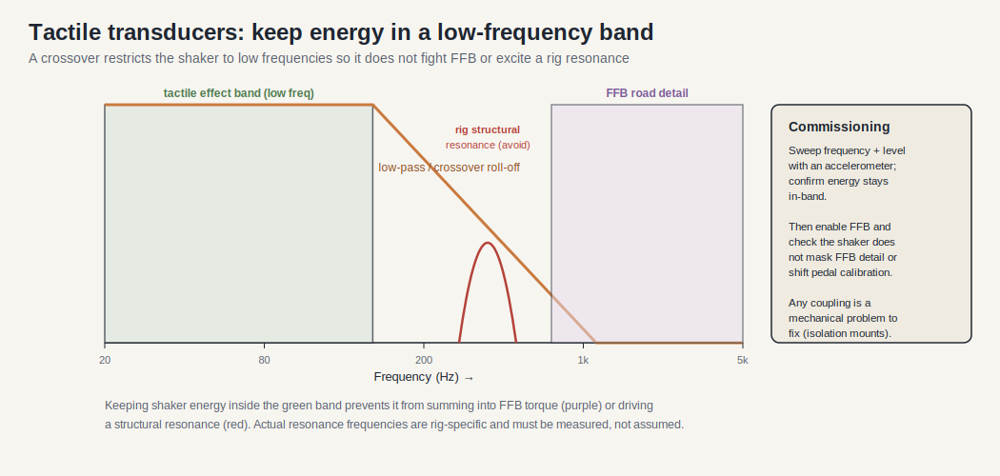

# Tactile Transducer Architecture

> Version: 1.0
> Reviewed: 2026-07-02
> Purpose: treat tactile transducers ("bass shakers") as a distinct vibration subsystem and address the isolation and resonance questions raised in [cockpits.md](./cockpits.md) §6. Answers part of the expansion question in [sim_racing_research.md](./sim_racing_research.md) §13.

## Document Change Log

| Version | Date | Changes |
|---|---|---|
| 1.0 | 2026-07-02 | New document. Directly addresses the tactile-transducer isolation and resonance open questions in [cockpits.md](./cockpits.md) §6 and the isolation-check gate in [tools.md](./tools.md) §5. |

## 1. Purpose

Tactile transducers convert an audio/telemetry signal into low-frequency vibration felt through the seat and chassis (engine rumble, kerb strikes, wheel lock, road texture). This document defines them as a **separate vibration system** that must not corrupt Direct Drive force feedback or pedal-sensor readings.

> [!IMPORTANT]
> The guiding constraint from [cockpits.md](./cockpits.md): tactile transducers **shall** be treated as a separate vibration system and isolated and tested so they do not mask FFB or sensor diagnostics.

## 2. Responsibilities

- Reproduce low-frequency effects from a telemetry-derived or audio source.
- Deliver vibration to the driver without injecting destructive energy into the FFB or sensor paths.
- Allow per-effect tuning (channel, frequency band, level).

## 3. Transducer Types (General)

As **verified public** general knowledge, tactile transducers range from small "puck" exciters mounted to a seat or panel, to larger high-output shakers bolted to the rig frame. Larger units couple more energy into the structure — increasing both effect strength and the risk of interfering with FFB and sensors.

## 4. Signal Source and Crossover

**Figure 4-1: Tactile Signal Path**

The source is typically the telemetry pipeline (see [telemetry.md](./telemetry.md)) or a dedicated low-frequency audio channel. A crossover/low-pass stage **shall** restrict energy to the transducer's intended low-frequency band so higher-frequency content is not dumped into the structure.

Keeping the shaker inside its intended low band (green) is what stops its energy from summing into the wheel's FFB detail band (purple) or driving a structural resonance of the rig (red). The exact resonance frequencies are rig-specific and must be measured rather than assumed — see §6.

## 5. Mechanical Isolation (Answering cockpits.md §6)

The open question in [cockpits.md](./cockpits.md) §6 asks how transducers should be isolated from the primary structural profiles to avoid destructive interference with DD high-frequency FFB. As **engineering inference** consistent with that document's guidance:

- Transducers **should** be mounted to the seat or a dedicated panel rather than rigidly to the main FFB load path where practical, so their energy does not sum with FFB torque at the wheel.
- Where a transducer must attach to the frame, compliant/isolating mounts **should** be used to decouple its vibration from the structural profiles.
- The tactile system **should** be commissioned and measured independently (see §7) before running alongside high-torque FFB.

## 6. Resonance Interaction (Answering cockpits.md §6)

The second open question asks whether standard 40x80 mm aluminum structures have resonance frequencies that align with common FFB signal frequencies, and how to damp them. This study base does not assert specific measured resonance frequencies for a given rig — that is **Unknown** without measurement on the actual structure. The correct method:

- Measure the rig's structural response (for example, with an accelerometer and a swept excitation) to locate resonances, per the resonance/tactile-isolation check in [tools.md](./tools.md) §5.
- Avoid driving transducer energy into a band that coincides with a structural resonance or a dominant FFB effect band.
- Add damping (mass, bracing, or isolating mounts) where a resonance overlaps the operating band.

## 7. Debugging and Commissioning

Commission the tactile system alone first: sweep frequency and level, and confirm with an accelerometer that energy stays in-band and does not excite a structural resonance. Then enable FFB and confirm the transducers do not mask FFB detail or perturb pedal-sensor readings. Treat any change in pedal calibration or FFB noise floor when shakers are active as a coupling problem to fix mechanically.

## 8. Firmware Perspective

Tactile output is usually driven by host software plus an amplifier, so device firmware involvement is minimal; where a controller is used, it **shall** keep effects within the configured band and **shall** have a defined quiet state when its source is lost (see [telemetry.md](./telemetry.md) §9).

## 9. Key Takeaways

- Tactile transducers are a separate vibration system, not part of the FFB path.
- Isolate them (seat/panel mounting, compliant mounts) so they do not sum with FFB or disturb sensors.
- Structural resonances are rig-specific and **Unknown** until measured; locate them, then keep energy out of that band.
- Commission tactile alone, then verify no interference with FFB and pedals.

## References

- [cockpits.md](./cockpits.md) — the structure and the original isolation/resonance questions.
- [telemetry.md](./telemetry.md) — the telemetry/audio source and safe-quiet behavior.
- [tools.md](./tools.md) — resonance / tactile-transducer isolation check.

## Open Questions for Developers to Self-Investigate

Reviewed 2026-07-05. This item is rig-specific and cannot be answered in the abstract — it requires measurement on the actual structure.

- **What are the measured resonance frequencies of the target rig structure, and which effect bands must be avoided or damped?**
  *How to investigate:* attach an accelerometer to the structure and excite it with a swept-sine signal through a transducer (or an impact test); the response peaks are the resonances. Cross-reference those frequencies against the dominant FFB effect bands and the transducer's operating band, then keep energy out of any overlap (crossover tuning) and add damping — mass, bracing, or isolating mounts — where an overlap is unavoidable. Record the rig configuration (profile size, bracing, mounted mass, fastener torque) with the results, because resonances shift when any of these change. See [`tools.md`](./tools.md) §5 for the isolation/resonance check.
