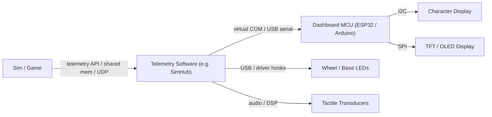

# Telemetry Software Architecture

> Version: 1.0
> Reviewed: 2026-07-02
> Purpose: describe the game-telemetry pipeline (game -> bridge -> device) as a first-class subsystem, consolidating material previously split across accessories.md and tools.md. This answers one of the expansion questions raised in [sim_racing_research.md](./sim_racing_research.md) §13.

## Document Change Log

| Version | Date | Changes |
|---|---|---|
| 1.0 | 2026-07-02 | New document. Consolidates the dashboard/SimHub material from [accessories.md](./accessories.md) §2 and the telemetry-bridge role of `hid-fanatecff-tools` from [repos.md](./repos.md); adds a latency-budget discussion for the open question in accessories.md §4. |

## 1. Purpose

Telemetry software extracts real-time data from a racing simulation (speed, RPM, gear, tyre state, flags) and dispatches it to output devices: dashboards, LED strips, button-box displays, and tactile transducers. It is the bridge between the game host and the embedded peripherals in this ecosystem.

> [!NOTE]
> Focus is on the *architecture* of the pipeline. SimHub is treated as a **community implementation** example (verified against its upstream README), not as a proprietary specification.

## 2. Responsibilities

- Acquire telemetry from the game (native telemetry API, shared memory, or UDP feed).
- Map telemetry fields to device effects (display fields, LED patterns, shaker channels).
- Encode and transmit to devices over the chosen transport.
- Maintain a link watchdog so a stalled feed does not leave stale or unsafe output.

## 3. Pipeline Architecture

**Figure 3-1: Telemetry Pipeline**

This mirrors the dashboard architecture already documented in [accessories.md](./accessories.md) §2: the host transmits encoded telemetry strings over a virtual serial port, and the dashboard firmware parses them to update display buffers.

## 4. Data Sources

| Source type | Description | Caution |
|---|---|---|
| Native telemetry API | Game exposes a documented telemetry output | Field set and rate are game-specific. |
| Shared memory | Game publishes a memory-mapped structure | Structure layout can change between game versions. |
| UDP feed | Game broadcasts telemetry packets | Requires network configuration; subject to loss. |

Telemetry software **shall** treat every source as game-version-dependent and **should** degrade gracefully when a field is absent.

## 5. Communication Interfaces

- Host-to-dashboard: the host **shall** transmit encoded telemetry over a virtual serial (USB CDC) port; the device firmware **shall** parse and update display buffers, per [accessories.md](./accessories.md) §2.2.
- Character displays over I2C; TFT/OLED over SPI. The system **should** minimize I2C daisy-chaining to avoid bus saturation at high refresh rates.
- LED/display output on Fanatec bases and rims can also be driven through community driver tooling; `hid-fanatecff-tools` is documented as a telemetry bridge for LEDs, displays, and tuning (see [repos.md](./repos.md)).

## 6. Latency Budget

This addresses the open question in [accessories.md](./accessories.md) §4 (middleware vs native latency). End-to-end latency is the sum of: game publish interval, host acquisition and mapping, transport (serial/USB), and device render. As **engineering inference**, a responsive dashboard budgets each stage so total latency stays below one game frame at the target rate; tactile and LED effects are more latency-sensitive than numeric fields and **should** be prioritized in the mapping and transport.

Because the stages add up, the useful thing to measure is each stage on its own, not just the end-to-end figure — that is how the dominant contributor becomes visible and fixable. The percentages above are illustrative only.

> [!TIP]
> Measure each stage independently (host timestamp, transport, device render) rather than only the end-to-end figure, so the dominant contributor is visible.

## 7. Firmware Modules

Device-side firmware in this pipeline **shall** provide: a serial parser with framing and length checks; a display/effect buffer; a link watchdog that blanks or freezes output safely on feed loss; and a mapping layer that is data-driven where possible so new telemetry fields do not require reflashing.

## 8. Debugging Strategy

Capture the serial stream on the bench (logic analyzer or host loopback), confirm framing under packet loss, and verify watchdog behavior by cutting the feed mid-session. For LED/display bridges, confirm no bus saturation under maximum refresh.

## 9. Firmware Perspective

The device is a telemetry *sink*: it does not own the game connection and **shall not** assume the feed is present or well-formed. All safety-relevant output (for example, flag or shift-light states) **shall** have a defined safe value when telemetry is stale.

## 10. Key Takeaways

- Telemetry software is a distinct subsystem bridging game host and embedded outputs.
- The dashboard pipeline (SimHub -> virtual COM -> MCU -> I2C/SPI display) is already the ecosystem norm.
- Latency is stage-additive; measure per stage and prioritize latency-sensitive effects.
- Treat every feed as untrusted and version-dependent; fail safe on loss.

## References

- [SimHub](https://github.com/SHWotever/SimHub) — telemetry dashboards, Arduino displays, LEDs, button boxes, and custom serial devices.
- [gotzl/hid-fanatecff-tools](https://github.com/gotzl/hid-fanatecff-tools) — telemetry bridge for Fanatec LEDs, displays, and tuning.
- [accessories.md](./accessories.md) — dashboard and telemetry-display architecture.
- [tactile.md](./tactile.md) — tactile-transducer output driven from telemetry.

## Unresolved Questions

- What per-stage latency figures are achievable with each common transport, measured on target hardware?
