# Wheel Base Hardware and Software Architecture

> Version: 1.1
> Research date: 2026-07-01  
> Audience: Fresher/junior in the sim racing domain, mid level in embedded system.  
> Scope: modern direct-drive sim-racing wheel base. Rim internals: [wheel_rim.md](./wheel_rim.md).  
> Evidence: public standards, manufacturer manuals/support, public open-source projects, and [wheel_rim.md](./wheel_rim.md). No proprietary firmware reverse engineering.

## Document Change Log

| Version | Date | Description |
|---|---|---|
| 1.0 | 2026-07-01 | Initial research document. |
| 1.1 | 2026-07-01 | Reordered sections (Basic to Advanced), enforced normative language, replaced pseudocode with interface tables, added figure captions, and inserted introductory paragraphs. |

## 1. Executive Summary

This section provides a high-level overview of the wheel base's role in the sim racing ecosystem. It establishes the foundational safety and architectural paradigms.

The wheel base is the safety-critical ecosystem center. It is simultaneously a USB human-interface device, real-time servo drive, and peripheral hub. It reports steering and controls, accepts force-feedback effects, converts bounded torque demand into motor phase current/PWM, and aggregates rim, pedal, shifter, and handbrake data.

The architecture should employ a main MCU for USB, FFB, profiles, peripherals, updates, and system policy, alongside a separate motor MCU or control ASIC for encoder/current acquisition and inverter PWM. A torque arbiter shall act as the only software bridge between these domains. Hardware overcurrent, gate fault, E-stop, watchdog, and timer-break paths shall remain authoritative if software fails.

The base shall fail in a torque-off state. The system shall remain non-energized during reset, bootloader execution, updates, USB enumeration, incompatible rim detection, invalid encoder/current feedback, stale torque command conditions, brownout, and watchdog recovery. High-torque enable shall require verified images, a successful self-test, calibrated sensors, a healthy power stage, an explicit software policy, and no latched faults.

## 2. Scope and Evidence

This section defines the boundaries of the analysis and clarifies the confidence levels of the presented information. It is necessary for understanding the context of the claims made.

| Label | Meaning |
|---|---|
| Verified public behavior | Supported by a public standard, manual, or project document |
| Industry pattern | Common architecture, not universal |
| Reference design | Recommended project structure, not a vendor-internal claim |
| Unknown | Needs customer schematics, BOM, source, descriptors, or requirements |

Included items are base electronics, processors, inverter, sensors, USB, peripherals, firmware, timing, safety, update, diagnostics, and verification. Excluded items are proprietary formats, extracted firmware, console-authentication bypass, detailed control equations/gains, and rim internals.

`repos.md` is discovery input, not a technical authority. Community Fanatec projects establish observations, not official specifications.

## 3. System Context

This section illustrates how the wheel base interacts with external actors, including the host PC/console, the user's peripheral devices, and the power supply.

**Figure 3-1: System Context Diagram**

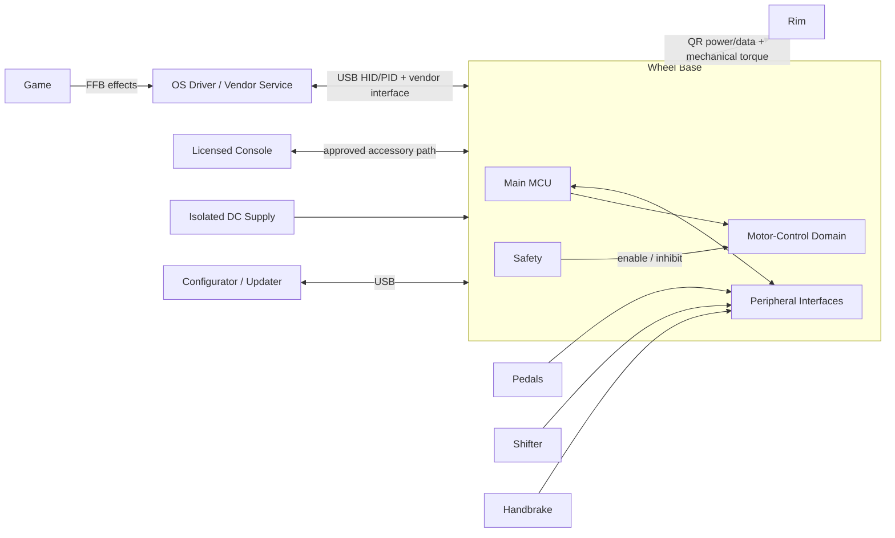

| Responsibility | Base | Rim | Host |
|---|---|---|---|
| Shaft angle | Primary | No | Consumes |
| Motor current/torque | Primary | No | Requests effects |
| Hardware torque inhibit | Primary | No | No |
| Rim controls | Aggregates | Scans | Consumes |
| LEDs/display | Routes | Drives | Produces values |
| USB enumeration/update | Primary | Usually indirect | Controls bus/tool |

### 3.1 Public Fanatec Ecosystem Boundary

Fanatec's public ecosystem demonstrates the base-as-hub pattern but does not publish an internal architecture contract. Current products broadly use CSL, ClubSport, and Podium tiers. The tier name is commercial/product context; firmware compatibility still depends on exact model, generation, QR, peripheral ports, and software version.

For console systems, platform licensing and peripheral aggregation are separate concerns:

| Concern | Public Fanatec Rule |
|---|---|
| Xbox compatibility | Comes from an Xbox-licensed steering wheel or hub. |
| PlayStation compatibility | Comes from a PlayStation-licensed wheel base. |
| Console pedals/shifter/handbrake | Connect through the compatible wheel base. |
| PC standalone peripherals | Supported products may connect separately by USB or ClubSport USB Adapter. |

These are product-level facts. They do not establish a public rim protocol, authentication algorithm, USB descriptor, or motor-control partition.

## 4. Hardware Architecture

This section details the physical electronics components and domains within the wheel base. Familiarity with mixed-signal PCB design and power electronics is required to understand the boundaries.

**Figure 4-1: Hardware Architecture Block Diagram**

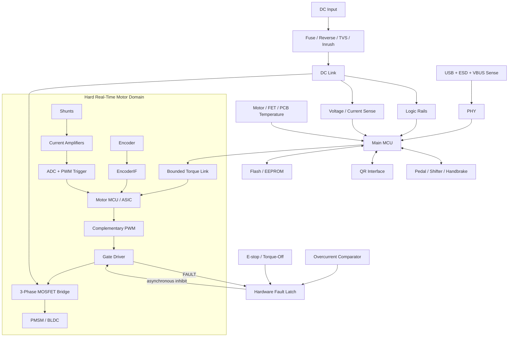

| Domain | Contents | Design objective |
|---|---|---|
| Logic | Main MCU, USB, NVM, accessory transceivers | Protect USB/logic from switching noise |
| Motor control | Motor MCU/ASIC, encoder receiver, ADC path | Deterministic short feedback paths |
| Power stage | Gate driver, MOSFET bridge, shunts, DC link | Low inductance, cooling, fault containment |
| Power input | Protection, inrush, rails, regen strategy | Contain source/transient faults |
| Connectors | USB, QR, accessories, E-stop | ESD/cable-fault isolation |

## 5. Power and Motor Drive

This section explains the power electronics required to convert the incoming DC supply into the three-phase alternating current that drives the servo motor.

**Figure 5-1: Power and Motor Drive Flow**

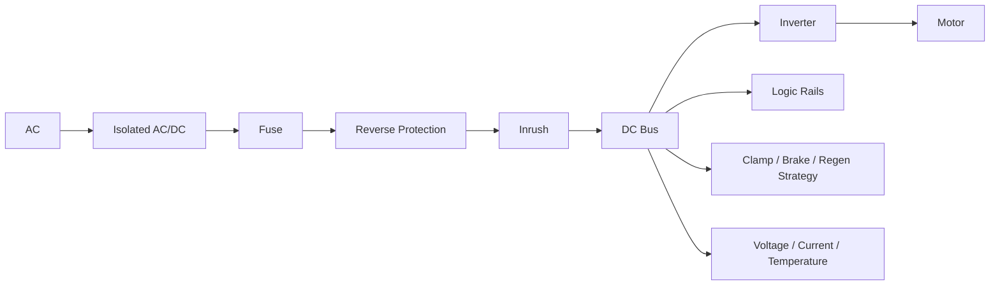

| Block | Hardware responsibility | Firmware responsibility |
|---|---|---|
| PSU | Isolated rated DC | Detect range; do not assume regen absorption |
| Input protection | Fuse/eFuse, reverse, TVS, inrush | Sequence/report controllable faults |
| DC link | Pulse energy | Monitor voltage and regen margin |
| Gate driver | Drive, UVLO, faults | Configure; enable only after checks |
| Inverter | DC-to-three-phase switching | Motor domain PWM only |
| Shunts/CSA | Current feedback | Offset/gain/saturation/plausibility |
| Regen hardware | Returned energy handling | Coordinate torque reduction/clamp |
| Rails | MCU/sensor/accessory supply | Power-good/reset sequencing |

Rapid user motion may regenerate energy into the DC bus. The firmware shall calculate the returned energy to determine supply absorption limits, coordinate the brake resistor/clamp, and manage voltage limits. 
For PWM generation, the microcontroller shall use complementary timer outputs. The hardware shall enforce dead time. The ADC trigger shall be synchronized with the PWM cycle. The hardware shall provide an asynchronous break input to immediately halt switching. The gate enable signal shall default to an off state through reset and bootloader execution. The firmware shall perform all PWM parameter updates on an atomic boundary.

### 5.1 How the inverter produces three-phase current

The inverter is the power heart of the wheel base. A PMSM/BLDC motor cannot be driven from raw DC; it needs three sinusoidal phase currents, offset 120° from each other, whose rotating magnetic field the rotor follows. The inverter synthesizes those phases from the fixed DC bus using six power MOSFETs arranged as three **half-bridges** (one per phase).

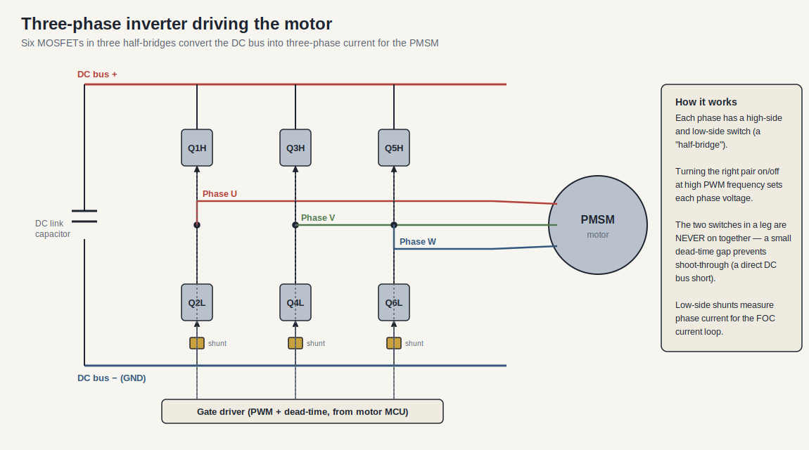

Each phase has a high-side switch (to the DC+ rail) and a low-side switch (to DC−). Rapidly switching the appropriate switch on and off with PWM sets the average voltage on that phase; doing this on all three legs with the right timing produces the rotating field. Two facts from this drawing map directly onto the normative requirements above:

- **Dead-time is mandatory.** The two switches in one leg must never be on together, or they would create a direct short across the DC bus (called *shoot-through*) and destroy the MOSFETs. Hardware enforces a brief dead-time gap where both are off during every transition.
- **Low-side shunts feed the current loop.** The small shunt resistors in each low-side leg are how phase current is measured, which is the feedback the FOC current loop (§5.2 and §6) needs to control torque.

### 5.2 PWM timing and current sampling

Field-Oriented Control depends on measuring phase current accurately, and *when* the current is sampled matters as much as the sample itself. The switching edges of the MOSFETs inject electrical noise, so the ADC is triggered at the quiet point in the middle of the PWM period rather than near an edge.

A triangular carrier is compared against each phase's duty command to generate the gate signal: where the carrier is below the command, the high-side switch is on. Sampling current at the carrier peak (the middle of the on-time) captures a clean average value away from the switching transients. This is exactly the "valid middle-of-PWM triggers" requirement in §6, and the dead-time zoom shows the small both-off gap that prevents shoot-through on every edge.

## 6. Sensors

This section details the feedback mechanisms used to measure shaft position and motor currents, which are critical for field-oriented control (FOC) and force feedback.

The motor itself is a three-phase PMSM: a wound steel stator surrounding a permanent-magnet rotor coupled to the steering shaft. The encoder reads the rotor/shaft angle that FOC needs to commutate correctly, and the current sensing reads the phase currents FOC regulates. The cross-section below shows how the pieces relate.

| Encoder | Strength | Concern |
|---|---|---|
| SPI/SSI/BiSS-C absolute | Angle at boot, CRC/status | Timing, receiver, wrap |
| ABZ | Simple/low latency | Reference/index and missed edges |
| Sin/Cos | Fine interpolation | Analog offset/gain/phase |
| Hall sectors | Robust coarse commutation | Insufficient alone for premium steering |

**Figure 6-1: Sensor Processing Pipeline**

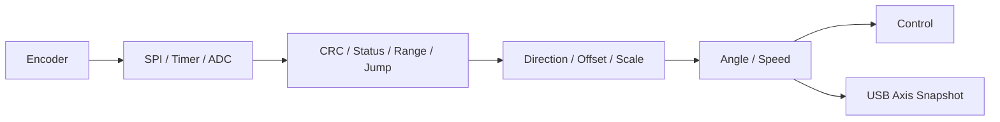

| Signal | Acquisition | Checks |
|---|---|---|
| Phase currents | Shunt/CSA/synchronized ADC | Offset, gain, saturation, consistency |
| DC current | Shunt/Hall ADC | Overcurrent, power plausibility |
| DC voltage | Divider/isolation ADC | Brownout, nominal, regen overvoltage |
| FET/motor temperature | NTC/IC/model | Open/short, rate, derating |
| Rail health | Supervisor/ADC/GPIO | Power-good and reset cause |

The architecture should support current sampling during each PWM cycle, utilizing valid middle-of-PWM triggers, and must perform startup offset calibration. Exact sampling windows depend on the selected inverter topology and modulation scheme.

## 7. External Interfaces

This section catalogs the physical and logical boundaries where the wheel base communicates with external hardware peripherals.

| Interface | Owner | Purpose |
|---|---|---|
| USB FS/HS | Main MCU | HID input/PID FFB, config, diagnostics, update |
| QR/rim link | Main MCU | Identity, controls, LED/display output |
| Pedal/shifter/handbrake | Main MCU | Analog/digital controls (e.g., via RJ12, subject to hardware emulation proxying) |
| Motor encoder | Motor MCU | Rotor/shaft feedback |
| Main↔motor | Both | Torque, angle, health, faults |
| SWD/JTAG/UART/service USB | Controlled service | Manufacturing/recovery |
| E-stop/torque key | Hardware safety logic | Torque permission/inhibit |

Legacy community projects report a 3.3 V base-master/rim-slave SPI for older products, alongside a newer compatibility boundary for modern direct-drive bases. The rim link should be designed as a replaceable protocol adapter rather than a universal assumption. Accessory power rails shall be electrically protected so that rim or cable faults cannot collapse the main motor control logic.

## 8. Processor Partitioning

This section discusses the distribution of computing responsibilities. Separating the USB stack from hard real-time motor control is a core architectural decision.

| Option | Strength | Weakness | Use |
|---|---|---|---|
| Single MCU | Low BOM/simple update | Shared timing/failure domain | Only with proven margin |
| Main + motor MCU | Timing/fault separation | Versioned IPC required | Recommended high-torque base |
| Main + control ASIC | Specialized deterministic control | Vendor limits/lock-in | If sensor/control fit is proven |
| Main MPU + motor MCU | Rich networking/UI | OS boot/security complexity | Premium connected products |

**Figure 8-1: Processor Domain Interaction**

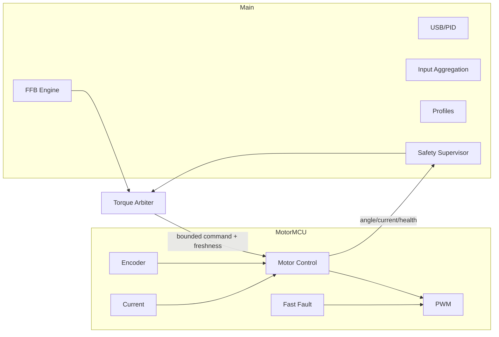

| Data | Direction | Requirements |
|---|---|---|
| Torque request | Main → motor | Physical units, bound, sequence, timestamp |
| Enable/limits | Main → motor | Explicit; default disabled; motor reapplies local limits |
| Angle/speed/current | Motor → main | Value, validity, timestamp, wrap semantics |
| Health/fault | Both | Version, reset reason, deadline and fault state |
| Heartbeat | Both | Independent counters and timeout reaction |

Stale main commands shall reach zero torque or trigger a hardware inhibit in bounded time.

## 9. Software Architecture

This section outlines the logical modules comprising the wheel base firmware and their required isolation to ensure safety and determinism.

**Figure 9-1: Software Component Architecture**

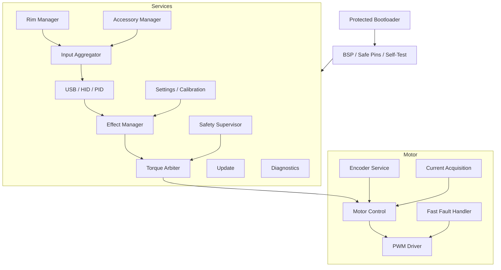

| Module | Owns | Must not own |
|---|---|---|
| USB | Descriptors, endpoints, reports | PWM/gate writes |
| FFB | Effect state/mixing | Safety enable |
| Torque arbiter | Final enable/torque/slew/thermal/power/freshness limits | USB transport |
| Motor control | Feedback-to-PWM | Host parsing |
| Safety | State/fault policy | Sole electrical protection |
| Peripherals | Discovery, mapping, health | Motor enable |
| Settings | Schema/atomic persistence | Flash writes in control ISR |
| Diagnostics | Bounded events/traces | Blocking output |
| Update/boot | Verify/stage/recover | Motor activation |

## 10. Force-Feedback Path

This section traces the lifecycle of a force-feedback effect from the host's request down to the motor currents. It focuses on how abstract effects become physical torque.

**Figure 10-1: Force-Feedback Data Flow**

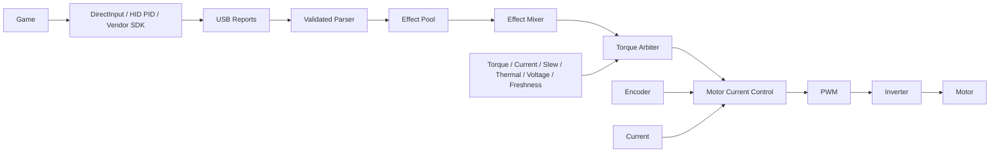

| Block | Responsibility |
|---|---|
| Parser | Validate ID, size, index, units, duration |
| Effect pool | Allocate/update/start/stop deterministic effects |
| Mixer | Combine effects without overflow |
| Device filters | Configured damping/friction/inertia/smoothing |
| Torque arbiter | Apply all final product and safety limits |
| Motor control | Convert torque request to current/PWM; no effect semantics |
| Hardware faults | Remove gate drive independently |

Host freshness tracking shall be explicit. Normal host loss shall trigger a bounded decay and disable policy. Critical sensor or electrical faults shall trigger an immediate hardware inhibit.

### 10.1. Motor-Domain Invariants

1. The PWM output shall remain inactive after reset until a valid enable command is received.
2. Invalid encoder or current feedback shall not coexist with active torque beyond a documented detection time limit.
3. Both the main MCU and the motor domain shall enforce torque and speed limits.
4. Hardware break signals shall override any software commands.
5. Stale inter-processor communication (IPC) shall reach zero torque or hardware inhibit within a bounded time.
6. Calibration data shall be versioned and mathematically range-checked before use.
7. NaN, numeric overflow, invalid enumerations, or corrupt communication frames shall never reach the PWM generation module.

### 10.2. Input Aggregation

**Figure 10-2: Input Aggregation Data Flow**

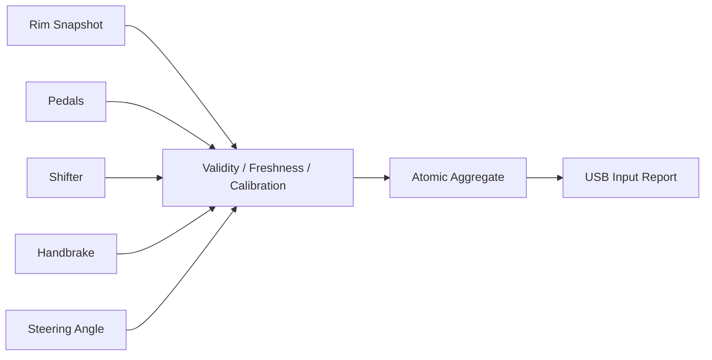

Each aggregated value shall carry a timestamp, status, and source identifier. USB input reports shall use coherent snapshots of system state rather than reading directly from disparate interrupt service routines. A stale encoder reading shall be treated as a critical motor fault. A stale rim link shall automatically clear momentary button controls to prevent stuck inputs. Invalid pedal, shifter, or handbrake data shall fall back to explicitly documented safe reporting values.

## 11. Host Software

This section describes the host-side drivers and services that interact with the wheel base. While embedded developers do not write the OS driver, they must understand its requirements.

**Figure 11-1: Host Software Interaction Model**

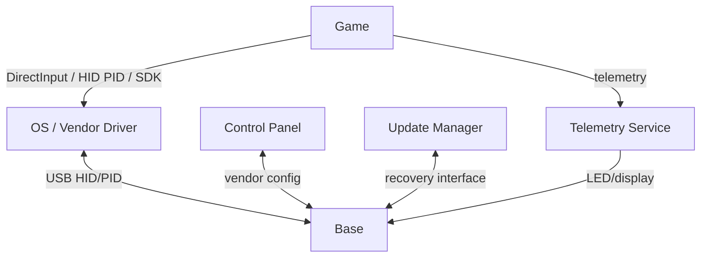

The public `hid-fanatecff` driver demonstrates how Linux input and force-feedback effects translate to custom HID reports on an asynchronous 2 ms default timer. It maps sysfs/HIDRAW paths for tuning ranges, wheel ID, LEDs, displays, load cell feedback, and pedal rumble where supported. Tools like `hid-fanatecff-tools` bridge UDP or shared-memory game telemetry into these outputs.

The base shall manage several separate logical planes of communication:

| Plane | Criticality | Data |
|---|---|---|
| Input | High | Steering, pedals, buttons |
| FFB | High | Effects/torque-related state |
| Safety | Highest local authority | Enable, faults, power, thermal, freshness |
| Configuration | Medium | Profiles/range/tuning |
| Display telemetry | Best effort | RPM, gear, flags, speed |
| Update/diagnostics | Torque-disabled service | Images, traces, calibration |

## 12. State Machines

This section defines the operational states of the wheel base and the motor domain. It describes the precise conditions required to transition from a safe idle state to active torque generation.

### 12.1. Base Lifecycle

**Figure 12-1: Base Lifecycle State Machine**

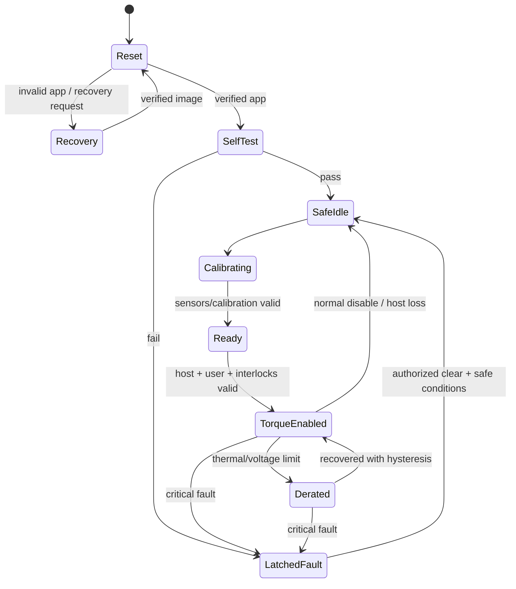

### 12.2. Motor Domain

**Figure 12-2: Motor Domain State Machine**

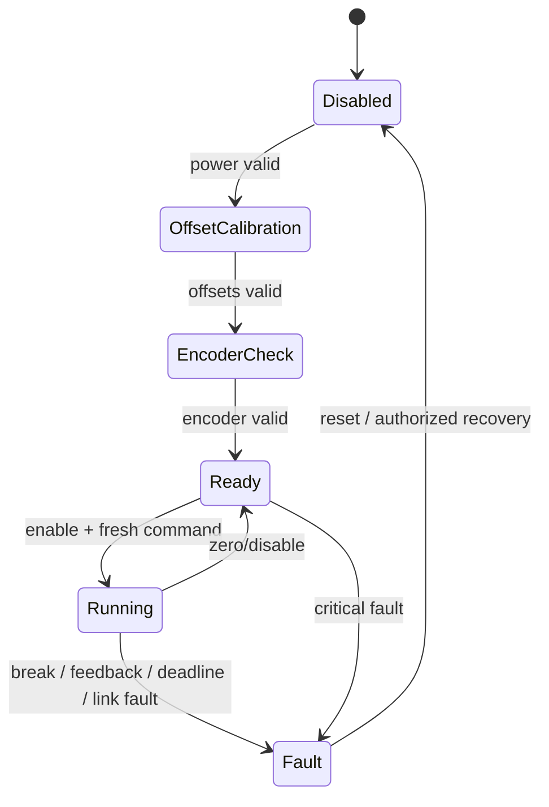

USB enumeration and configuration shall not imply that torque is enabled.

## 13. Real-Time Execution

This section defines the critical timing deadlines for the firmware. Missed deadlines in the motor control loop can lead to torque distortion or safety hazards.

| Activity | Common range | Context | Miss impact |
|---|---|---|---|
| Current/FOC loop | 10–40 kHz | PWM/ADC ISR or motor core | Torque distortion/fault |
| Encoder | Every control cycle/submultiple | Timer/SPI DMA ISR | Stale angle |
| Torque/FFB | 0.5–2 kHz | High-priority task | Jitter/phase lag |
| USB | Event-driven/descriptor contract | USB ISR + task | Stale reports |
| Rim link | 100–1000 Hz or protocol-defined | DMA + task | Stale controls/display |
| Pedals | 250–1000 Hz | ADC DMA/task | Latency/noise |
| Safety | Hardware trip + periodic checks | Hardware/ISR/task | Delayed shutdown |
| Thermal | 10–100 Hz typical | Task | Delayed derating |
| Diagnostics/NVM | Bounded background/on demand | Task/bootloader | Must not block control |

**Figure 13-1: Real-Time Execution Priorities**

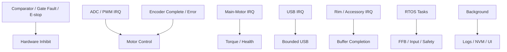

The development team shall measure the target worst-case execution time (WCET) under maximum bus traffic. The system shall strictly bound all ISR execution times. The motor control paths shall not perform memory allocation, flash writes, blocking lock acquisition, or blocking I/O. The architecture shall define and document maximum interrupt masking times. The firmware shall expose hardware timer overrun counters for diagnostics. The firmware shall service the hardware watchdog timer only from a verified, healthy critical path.

## 14. Boot, Update, and Configuration

This section details the startup sequence, the safe firmware update process, and the management of non-volatile configuration data.

### 14.1. Boot Chain

1. The hardware shall hold the inverter gate disabled upon power-up.
2. The bootloader shall verify the selected application image and its hardware compatibility.
3. The application shall configure safe pin states and clocks, and then record the hardware reset reason.
4. The main and motor processors shall exchange software versions and feature capabilities.
5. The firmware shall verify current offsets, encoder status, bus voltage, temperatures, and physical interlocks.
6. The base shall enter the `SafeIdle` state; transitioning to active torque shall require explicit host or user conditions.

**Figure 14-1: Firmware Update Sequence**

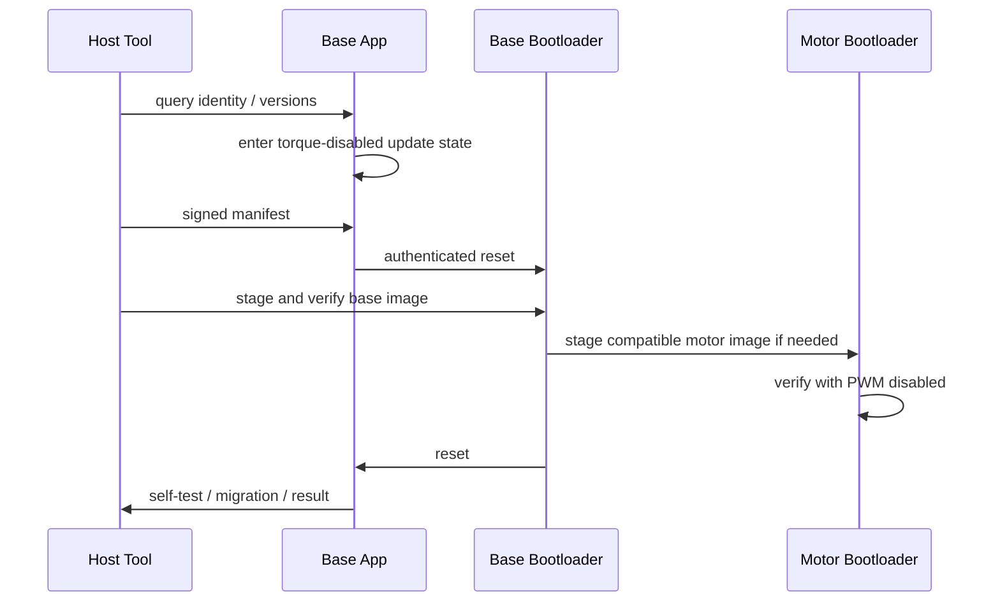

Firmware updates shall require an authenticated image protected by a hash or CRC. The bootloader shall enforce hardware compatibility and version gating. Flash staging shall be power-loss-safe (e.g., dual-bank A/B). The bootloader recovery mode shall be completely independent of the main application. The system shall force torque to be disabled during the entire update process. Any calibration or settings migration shall be atomic.

| Data | Storage rule |
|---|---|
| Factory calibration | Protected, versioned, CRC, provenance |
| User center/range | Atomic and resettable |
| Profiles | Schema version, bounds, defaults |
| Safety limits | Immutable/service-authorized |
| Fault records | Wear-limited critical ring |
| Update metadata | Selected image, attempts, recovery state |

## 15. Safety Architecture

This section consolidates the fault detection and mitigation strategies. It maps specific electrical and software hazards to their corresponding safety reactions.

**Figure 15-1: Safety and Fault Handling Architecture**

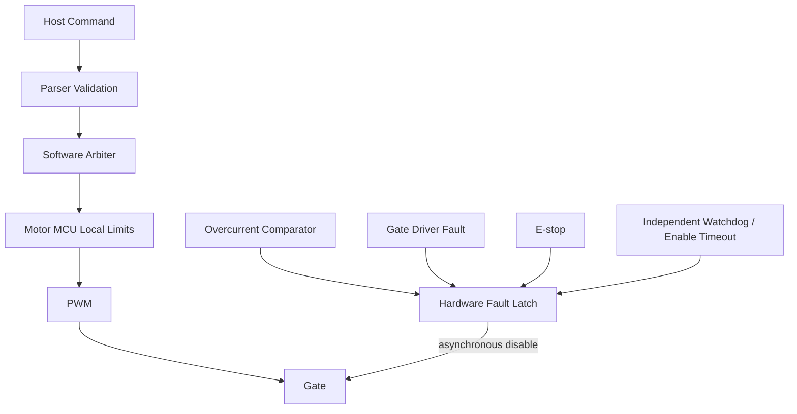

| Hazard | Detection/control | Reaction |
|---|---|---|
| Unexpected torque | Startup inhibit, validation, torque/slew/freshness bounds | Controlled zero or immediate inhibit |
| Wrong direction | Commissioning consistency test | Refuse enable; latch fault |
| Overcurrent/short | Comparator, gate protection, ADC plausibility | Hardware disable |
| Encoder loss | CRC/status/timeout/jump | Immediate inhibit unless validated fallback |
| Overtemperature | Sensor diagnostics/model | Derate then disable |
| Regen overvoltage | Bus sensing and energy strategy | Reduce torque/clamp/inhibit |
| Main/motor lockup | IPC timeout, watchdog, gate timeout | Zero/inhibit/reset |
| USB loss | SOF/report freshness | Bounded FFB decay/disable |
| Accessory short | Protected rails/ports | Isolate accessory; preserve motor safety |
| Update corruption | Authentication/integrity/recovery | Stay torque-disabled |

The firmware shall distinguish fault classes: informational, degraded operation, recoverable torque-off, latched fault, and hardware-dominant fault. The software shall not be permitted to clear a hardware-dominant fault while the underlying hardware condition remains asserted.

### 15.1 Thermal derating in practice

Overtemperature is handled by *derating* — smoothly lowering the torque ceiling as the motor and inverter heat up — rather than by an abrupt cutoff at the limit. Because torque needs current and current makes heat (`T ≈ Kt × Iq`), a base run hard will warm up; derating keeps it usable and safe instead of failing suddenly mid-corner.

Below the derate-start temperature the full torque ceiling is available. Between derate-start and the shutdown temperature the ceiling falls off; above shutdown, torque is removed. Recovery uses hysteresis: torque is only restored once the temperature drops well back below the derate-start point, so the system does not oscillate in and out of derating right at the threshold. This is the "derate then disable" reaction listed for overtemperature in the hazard table above.

## 16. Diagnostics

This section lists the logging and telemetry requirements needed to diagnose issues in the field without compromising real-time performance.

**Figure 16-1: Diagnostic Data Flow**

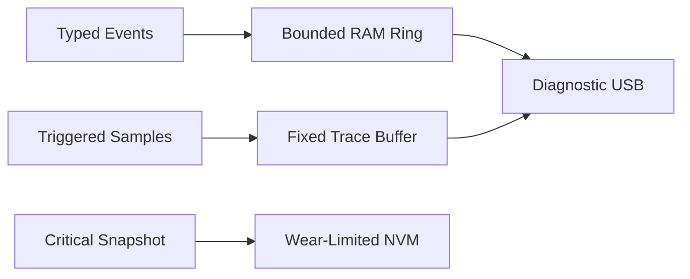

The firmware shall provide reset reasons, version numbers, WCET margins, encoder errors, ADC saturation events, gate faults, bus voltage spikes, and thermal histories. The firmware shall not execute formatted logging functions within the motor ISR. Telemetry shall use fixed, timestamped binary records. High-rate control traces shall be triggered and time-limited. Non-volatile persistent logs shall only store critical fault snapshots to prevent flash wear. Execution of dangerous service commands shall require the system to be in a torque-disabled state. The system shall never log security credentials or signing secrets.

## 17. Reference Design

This section provides a concrete, recommended starting point for the hardware and software design of a new direct-drive wheel base.

| Area | Recommendation |
|---|---|
| Main MCU | Cortex-M7/M33-class with USB and adequate deterministic memory |
| Motor controller | Dedicated MCU/DSP or validated motor ASIC |
| IPC | CRC/sequence/freshness-protected SPI or CAN-FD plus enable timeout |
| Motor | PMSM/BLDC sized from continuous/peak torque and thermal duty |
| Encoder | Absolute CRC/status-capable sensor plus plausibility |
| Current sense | Two/three shunts or inline sensors based on control/diagnostics |
| Inverter | Robust gate driver, UVLO, fault and timer break |
| DC input | Fuse/eFuse, reverse, TVS, inrush, bus capacitance, regen strategy |
| USB | FS for HID unless HS bandwidth is justified |
| Accessories | Individually protected/current-limited power |
| Safety | Comparator/break, fault latch, watchdog, E-stop/torque-off |
| NVM/debug | Protected calibration, atomic config, lifecycle-controlled debug |

Software baseline should include a protected bootloader, RTOS utilization restricted to non-motor tasks, a dedicated bare-metal motor scheduler, and versioned APIs.

**Table 17-1: Torque Request Interface (Main to Motor)**

| Element | Direction | Type | Description |
|---------|-----------|------|-------------|
| `torque_mNm` | Input | int32 | The requested torque in milli-Newton-meters |
| `sequence` | Input | uint32 | Monotonically increasing sequence number |
| `timestamp_us` | Input | uint32 | Microsecond timestamp of the request |
| `validity` | Input | uint32 | Magic word or CRC validating the request |

**Table 17-2: Motor Snapshot Interface (Motor to Main)**

| Element | Direction | Type | Description |
|---------|-----------|------|-------------|
| `angle_urad` | Output | int32 | Motor shaft angle in microradians |
| `speed_urad_s` | Output | int32 | Motor shaft speed in microradians per second |
| `phase_current_mA_u` | Output | int32 | Phase U current in milliamperes |
| `phase_current_mA_v` | Output | int32 | Phase V current in milliamperes |
| `phase_current_mA_w` | Output | int32 | Phase W current in milliamperes |
| `timestamp_us` | Output | uint32 | Microsecond timestamp of the snapshot |
| `status` | Output | uint32 | Bitfield indicating health and fault state |

The interfaces shall use explicit physical units, validation fields, and bounded primitive types. The implementation shall avoid hidden enable transitions and shall clearly document ISR versus task buffer ownership.

## 18. Verification

This section outlines the testing pyramid required to ensure the reliability and safety of the wheel base.

**Figure 18-1: Verification Pipeline**

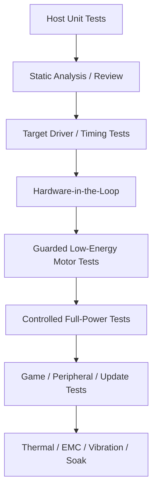

| Area | Minimum tests |
|---|---|
| USB/FFB | Descriptor, malformed reports, effect lifecycle, reset/suspend, stale host |
| Arbiter | Limit precedence, slew, derating, enable/fault races |
| Encoder/current | CRC, timeout, wrap, direction, offset, saturation, ADC timing |
| PWM/gate | Dead time, reset state, break latency, gate fault |
| IPC | Loss, corruption, duplication, wrap, incompatible versions |
| Power | Brownout, overvoltage, regeneration, inrush, sequencing |
| Peripherals | Hot-plug, short, stale data, incompatible identity |
| Update/NVM | Wrong HW/image, interruption, rollback, torn write, migration |
| Watchdogs | Stalled tasks/loop, bus deadlock, interrupt storm |

### 18.1. Full-Torque Entry Gate

The following criteria shall be met before enabling full motor torque during development:

- Schematics, BOM, power, and thermal designs shall be reviewed.
- Encoder scale, sign, status, and timeout logic shall be verified.
- Current scaling, ADC trigger timing, offsets, and saturation limits shall be measured.
- PWM and gate driver states shall be proven safe through reset, boot, and update.
- Comparator, gate fault, and E-stop inputs shall independently disable PWM in hardware.
- Torque sign and current conversion shall be tested under a restrained, current-limited load.
- Host loss, IPC loss, brownout, thermal derating, encoder failure, and watchdog tests shall pass.
- The update mechanism shall survive a power loss at any persistent transition point.
- WCET and jitter margins shall be proven under maximum system traffic.
- Mechanical guarding, E-stop availability, and operator exclusion procedures shall be approved.

## 19. Implementation Roadmap

This section provides a step-by-step project plan for developing the firmware from initial hardware bring-up to final validation.

**Table 19-1: Implementation Sequence**

| Step | Action | Notes / Constraint |
|------|--------|--------------------|
| 1 | Obtain torque, speed, inertia, angle, latency, acoustic, thermal, platform, and safety requirements. | Prerequisite for all tasks |
| 2 | Obtain schematics, BOM, and connectors; map power, clocks, reset, interrupts, DMA. | Required for BSP setup |
| 3 | Complete hazard analysis and fault reactions before motor enable. | Mandatory safety gate |
| 4 | Select processor partition and versioned IPC. | Defines software architecture |
| 5 | Bring up rails, reset, watchdog, inhibit, and diagnostics with inverter disabled. | Base hardware validation |
| 6 | Bring up encoder and current sensing; verify timing electrically. | ADC/Timer sync verification |
| 7 | Bring up PWM and gate driver into safe dummy or low-voltage load. | Verifies inverter control |
| 8 | Implement motor states, local limits, and perform low-energy tests. | Initial FOC tuning |
| 9 | Implement USB, PID, FFB, and arbiter against simulated motor endpoint. | Host software integration |
| 10 | Integrate motor domain and verify stale and fault paths first. | Validates safety architecture |
| 11 | Add rim and accessories behind isolated adapters. | Peripheral integration |
| 12 | Add profiles, calibration, diagnostics, and update/recovery mechanisms. | System features |
| 13 | Execute HIL, system, thermal, EMC, vibration, power-cycle, and soak tests. | Formal verification |
| 14 | Publish compatibility, calibration, update, fault, and service documentation. | Release prerequisite |

## 20. References

This section contains links to external documentation and related internal research files used to compile this architecture.

### 20.1. Current Research

- [`sim_racing_research.md`](./sim_racing_research.md) — ecosystem, base/motor, communication, timing, and safety.
- [`wheel_rim.md`](./wheel_rim.md) — rim architecture and QR boundary.
- [`pedals.md`](./pedals.md) — pedal sensor and base-port proxy context.
- [`tools.md`](./tools.md) — validation tools and standards entry points.
- [`repos.md`](./repos.md) — public repository discovery list.

### 20.2. Consolidated Public Sources

- [USB-IF HID specifications](https://www.usb.org/hid)
- [USB-IF PID Class 1.0](https://www.usb.org/sites/default/files/documents/pid1_01.pdf)
- [OpenFFBoard wiki](https://github.com/Ultrawipf/OpenFFBoard/wiki/)
- [Fanatec Podium DD1 manual](https://assets.fanatec.com/fanatec-pwa/image/upload/downloads-prod/pdfs/P-WB-DD1-Manual-EN_web.pdf)
- [Fanatec Wheel Bases FAQ](https://help.fanatec.com/hc/en-us/articles/43766204938257-Wheel-Bases-A-FAQ)
- [Fanatec platform compatibility](https://www.fanatec.com/us-en/platforms)
- [Fanatec ecosystem source register](./references.md)
- [Fanatec update guide](https://www.fanatec.com/eu/en/explorer/products/racing-wheels-wheel-bases/update-fanatec-firmware-and-drivers/)
- [Simucube 2 user guide](https://simucube.com/app/uploads/2022/11/Simucube_2_User_Guide.pdf)
- [Infineon PMSM FOC reference](https://documentation.infineon.com/aurixtc3xx/docs/kbv1711616051757)
- [TI TIDA-01599](https://www.ti.com/tool/TIDA-01599)
- [gotzl/hid-fanatecff](https://github.com/gotzl/hid-fanatecff)
- [gotzl/hid-fanatecff-tools](https://github.com/gotzl/hid-fanatecff-tools)
- [Fanatec-Pinout](https://github.com/FendtXerion3800/Fanatec-Pinout) — community, not official.

### 20.3 Open-Source Hardware Emulators

- [lshachar/Arduino_Fanatec_Wheel](https://github.com/lshachar/Arduino_Fanatec_Wheel) — custom steering wheel SPI emulator.
- [StuyoP/Fanatec-Wheel-Barebone-Emulator](https://github.com/StuyoP/Fanatec-Wheel-Barebone-Emulator) — barebone wheelbase emulator.
- [Alexbox364/F_Interface_AL](https://github.com/Alexbox364/F_Interface_AL) — DIY custom steering wheels via SPI.
- [jssting/ArduinoTec-Pedals](https://github.com/jssting/ArduinoTec-Pedals) — Fanatec pedal replacement controller.
- [GeekyDeaks/fanatec-pedal-emulator](https://github.com/GeekyDeaks/fanatec-pedal-emulator) — proxy third-party USB pedals via RJ12.
- [StuyoP/Universal-Shifter-Interface-for-Fanatec](https://github.com/StuyoP/Universal-Shifter-Interface-for-Fanatec) — switch-based shifter proxy.
- [vnmsimulation/VNM_MOTION_CONTROLLER](https://github.com/vnmsimulation/VNM_MOTION_CONTROLLER) — DIY STM32-based hardware controllers.

## 21. Unresolved Questions

This section lists the open design decisions and missing information that must be addressed to complete the system architecture.

- Peak/continuous torque, speed, inertia, range, and duty cycle?
- Motor electrical/thermal data and regenerative energy envelope?
- Selected processor partition, encoder, current topology, gate driver, and MOSFETs?
- Required PC/console platforms and licensed authentication architecture?
- USB descriptors, cadence, effect capacity, and vendor interfaces?
- QR/rim protocol per supported generation and compatibility policy?
- Accessory/E-stop/torque-key/CAN connector definitions?
- Safety/regulatory and independent-assessment targets?
- Signing, rollback, provisioning, anti-downgrade, and debug policy?
- Calibration ownership/migration across base, motor, rim, and peripherals?
- Latency/jitter acceptance budgets and instrumentation?
- Environmental, EMC, vibration, acoustic, and service-life requirements?
