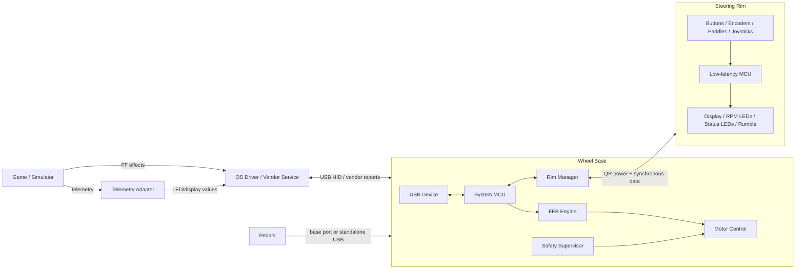
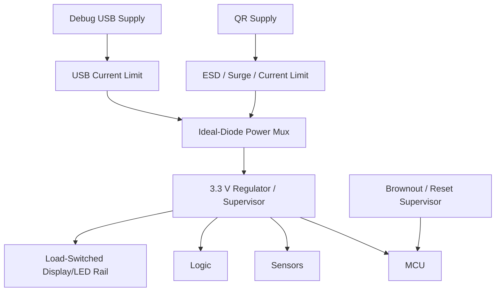
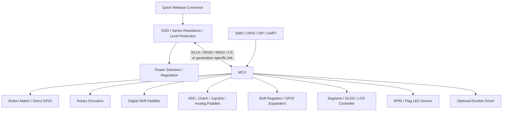
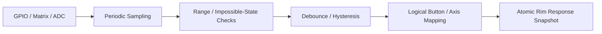
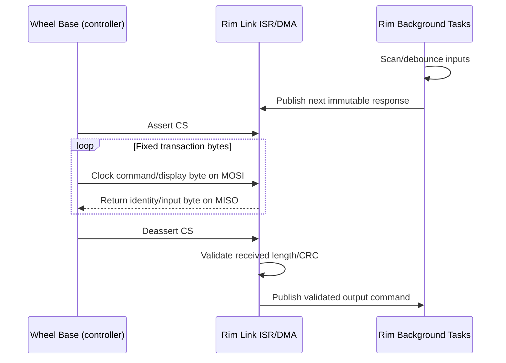
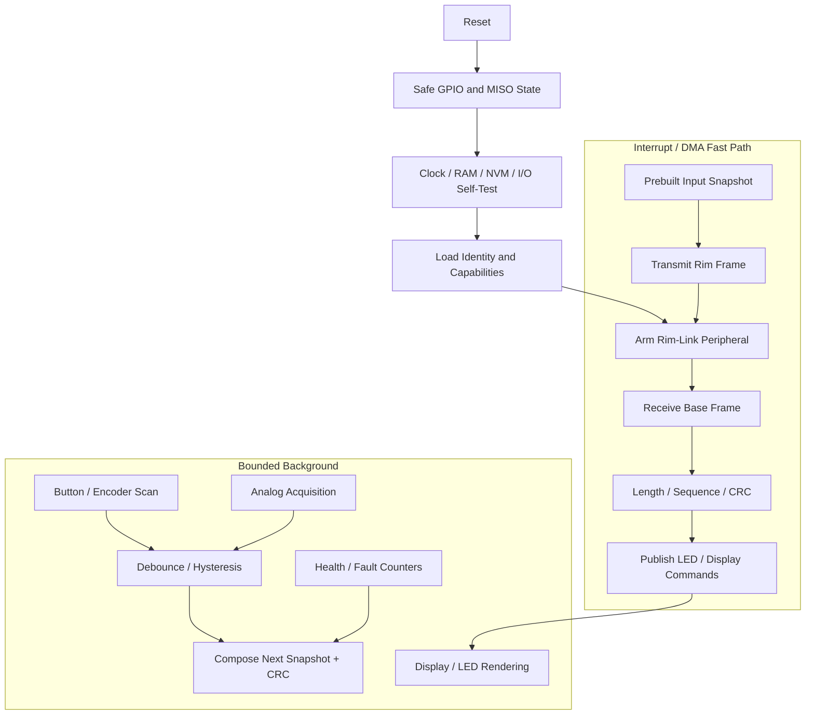
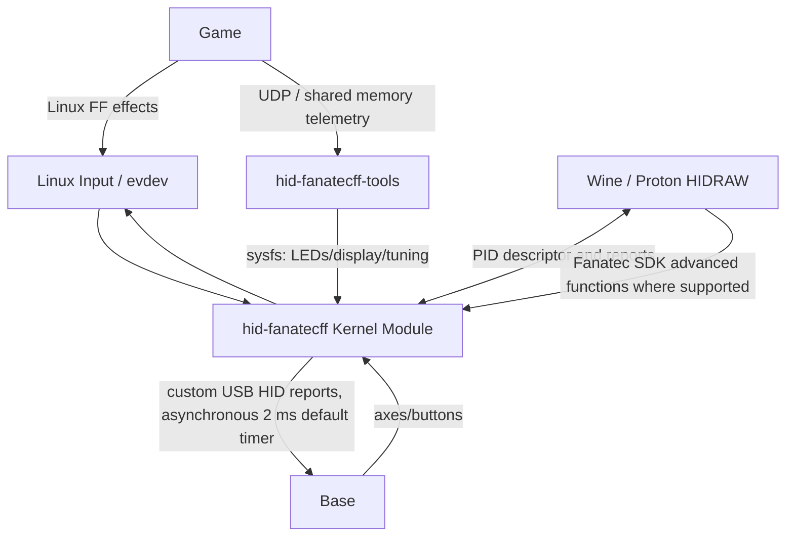
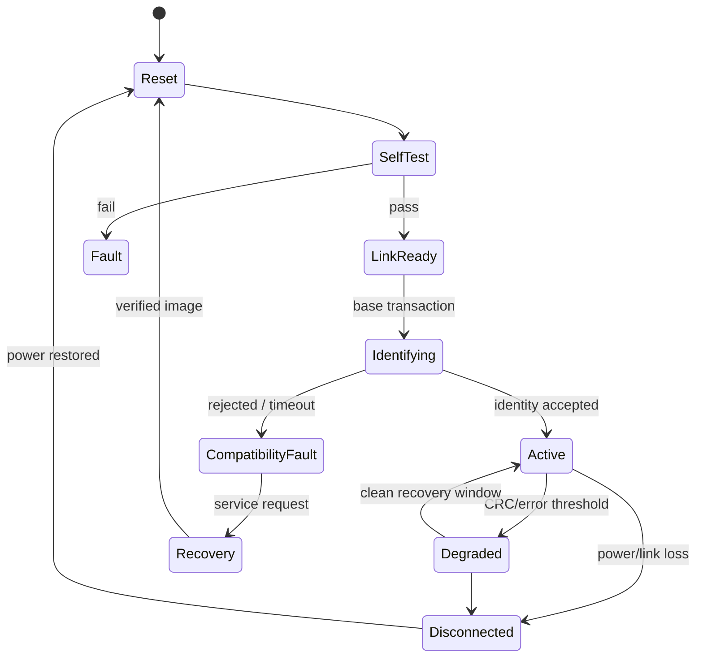
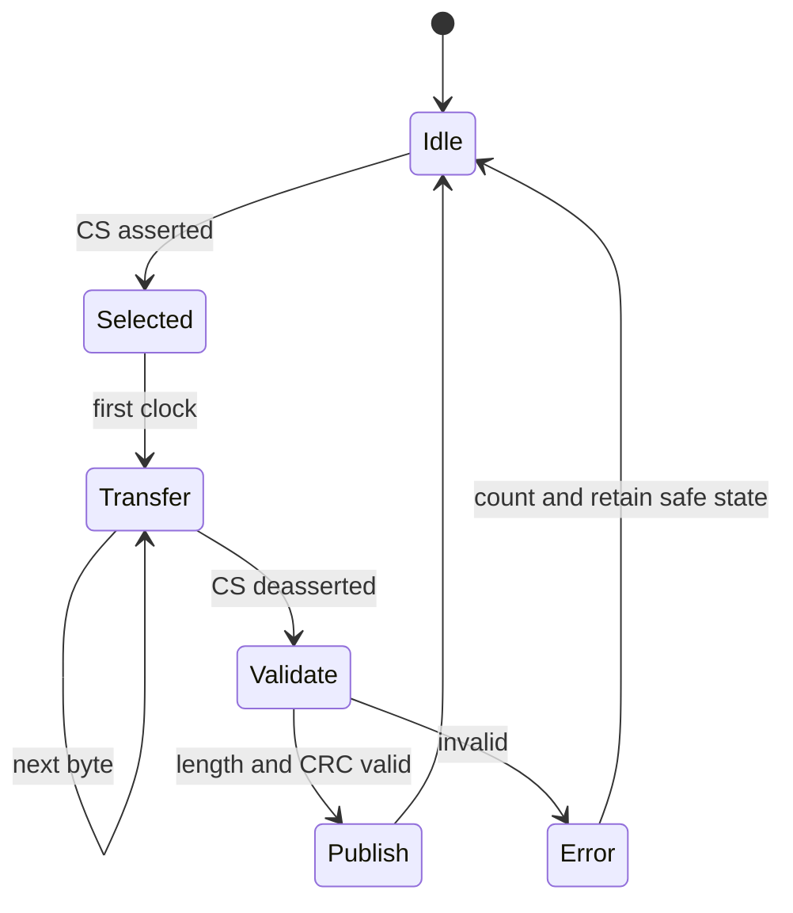
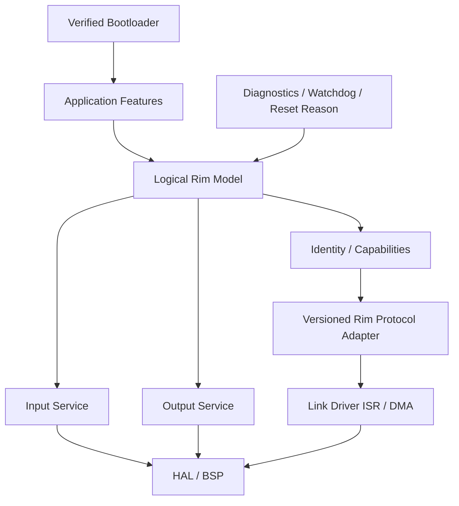

# Steering Rim Hardware and Software Architecture

> Research date: 2026-07-02
> Scope: steering rim / steering wheel electronics, wheel-base link, host integration, and adjacent pedal architecture.  
> Evidence: public GitHub projects and public documentation supplied by the requester.  
> Constraint: community observations are not official Fanatec specifications. No proprietary firmware extraction or security bypass.
> Related docs: [sim_racing_research.md](./sim_racing_research.md), [wheel_base.md](./wheel_base.md), [accessories.md](./accessories.md), [tools.md](./tools.md), and [repos.md](./repos.md).

## 1. Executive Summary

This section provides a high-level overview of the steering rim architecture, establishing its role as an I/O node rather than a force-feedback controller. It is intended to orient the reader before diving into hardware and software details.

A modern steering rim is a rotating embedded I/O node. It scans buttons, paddles, rotary encoders, joysticks, and analog clutch inputs; it receives display/LED commands; it identifies its capabilities to the wheel base; and it exchanges bounded frames over the quick-release electrical link. It does not own force-feedback motor control. The wheel base owns USB enumeration, steering-axis acquisition, force-feedback processing, motor torque, safety, and aggregation of rim/peripheral data.

The strongest community evidence for older Fanatec-compatible rims describes the wheel base as SPI controller/master and the rim as SPI peripheral/slave using 3.3 V signaling. `Arduino_Fanatec_Wheel` implements a 33-byte exchange, CRC-8 checking, button bitfields, and display decoding on AVR hardware. `Fanatec-Wheel-Barebone-Emulator` adds boot-time constraints, more peripherals, and a clear compatibility warning: its AVR approach is reported incompatible with ClubSport DD/DD+, while older bases through CSL DD and DD1/DD2 are reported working. This is a critical generation boundary, not a minor timing adjustment.

At the host boundary, `hid-fanatecff` shows a separate architecture: Linux input/FF effects are translated into device-specific USB HID reports, while LEDs, displays, tuning, wheel identity, and pedal functions are exposed through Linux sysfs or HIDRAW. `hid-fanatecff-tools` consumes game telemetry and drives those extended outputs. Therefore, steering input/FFB and dashboard telemetry should be treated as separate but coordinated data planes.

## 2. System Boundary

This section defines the physical and logical boundaries of the steering rim system. It illustrates the interactions between the rim, the wheel base, and the host computer, which is critical for understanding where specific functionality resides.

**Figure 2-1: System Boundary and Data Flow**

### 2.1 Ownership

| Function | Rim | Wheel base | Host software |
|---|---|---|---|
| Button/paddle electrical scan | Primary | Receives/mapping | Consumes logical controls |
| Rim identity/capabilities | Supplies | Discovers/validates | May display configuration |
| Display and LEDs | Drives hardware | Transports/controls | Produces telemetry values |
| Steering shaft angle | No, normally base encoder | Primary | Consumes axis |
| FFB effect interpretation | No | Primary | Sends effects |
| Motor current/PWM | No | Primary and safety-critical | No |
| Firmware update | Rim bootloader if present | Coordinator/pass-through | Update tool |
| Pedal sensing | Separate pedal node/base | Aggregates | Consumes axes |

## 3. Research Method and Evidence Quality

This section outlines the sources used to derive this architecture and rules for interpreting them. It provides context on the reliability of the engineering conclusions presented throughout the document.

### 3.1 Sources Consulted

| Source | Role | Confidence for architecture | Limitations |
|---|---|---|---|
| `Arduino_Fanatec_Wheel` | DIY rim compatible with older bases | Medium-high for demonstrated AVR/SPI pattern | Community implementation; old; model-specific |
| `Fanatec-Wheel-Barebone-Emulator` | Expanded DIY rim emulator | Medium-high for boot/timing/peripheral lessons | Explicitly incompatible with newer CS DD/DD+ |
| `Fanatec-Pinout` | Community connector/pinout collection | Medium for electrical hypotheses | Incomplete; DD1-centered; not manufacturer-approved |
| `ArduinoTec-Pedals` | Standalone USB pedal controller | Medium for pedal signal chain | CSP V1-focused, not rim protocol evidence |
| `hid-fanatecff` | Linux kernel USB/FF driver | High for that driver's public software design | Host side; device protocol remains vendor-specific |
| `hid-fanatecff-tools` | Game telemetry to wheel outputs | High for public tool architecture | Limited games/features; DBus path marked unfinished |
| GitHub Fanatec search | Discovery | Low | Search ranking is not technical evidence |

### 3.2 Interpretation Rules

- **Observed**: directly present in repository documentation or source.
- **Inferred**: engineering conclusion supported by several observed behaviors.
- **Recommended**: product design guidance, not a claim about commercial internals.
- Exact pinouts, byte meanings, timing, and IDs remain generation-specific until verified on approved hardware documentation.

## 4. Repository Analysis

This section dives deeper into the specific open-source repositories analyzed during the research phase. It highlights key findings, strengths, and weaknesses of each project, extracting product design lessons applicable to a new implementation.

### 4.1 `lshachar/Arduino_Fanatec_Wheel`

| Aspect | Finding |
|---|---|
| Goal | DIY wheel recognized by Fanatec base |
| Controller | Arduino Uno/Nano; 5 V variants require level handling |
| Rim link | Base-master, rim-slave SPI at 3.3 V |
| Frame behavior | 33-byte buffers, CRC-8, button bit mapping, display data |
| Peripherals | Buttons, analog D-pad, TM1637 alphanumeric display |
| Strength | Concrete schematic/source reference for legacy architecture |
| Weakness | Monolithic Arduino implementation; debug serial can disturb button timing; old compatibility evidence |
| Product lesson | The firmware shall keep the fast path independent from logging and display rendering. |

### 4.2 `StuyoP/Fanatec-Wheel-Barebone-Emulator`

| Aspect | Finding |
|---|---|
| Goal | Compact compatible rim node with buttons, display, LEDs |
| Controller | Bare ATmega328P at native 3.3 V; bootloader removed for startup speed |
| Extensions | Shift registers and custom peripheral variants |
| Strength | Highlights power-up sequencing, startup deadline, footprint, integration |
| Weakness | Each build has custom code; AVR limit; newer base incompatibility |
| Product lesson | Capability-driven modular firmware and a measured startup deadline shall be mandatory. |

### 4.3 `FendtXerion3800/Fanatec-Pinout`

| Aspect | Finding |
|---|---|
| Goal | Collect scattered connector/pinout information |
| Coverage | Base basics, handbrake, shifters, pedals, E-stop, torque key, data/CAN |
| Observed pattern | Some base inputs pulled up to 5 V and asserted low; analog inputs commonly span 0–5 V |
| Limitation | Schematics are incomplete and mainly DD1-based |
| Product lesson | Every pin shall be verified electrically and against approved schematics. |

### 4.4 `gotzl/hid-fanatecff`

| Aspect | Finding |
|---|---|
| Goal | Linux input and force-feedback support for multiple Fanatec USB devices |
| Architecture | Out-of-tree HID kernel module split across device, PID/FF, and tuning files |
| FFB | Standard Linux effects translated to custom HID; asynchronous 2 ms default timer |
| Extended features | LEDs, displays, tuning, wheel ID, ranges, load cell, pedal rumble via sysfs/HIDRAW |
| Compatibility | Device IDs have differing stable/experimental status |
| Product lesson | The system shall keep generic FF API, vendor transport, and advanced feature control separated. |

### 4.5 `gotzl/hid-fanatecff-tools`

| Aspect | Finding |
|---|---|
| Goal | Bridge game telemetry to extended wheel functions |
| Inputs | UDP or shared-memory/named-mapping adapters per game |
| Outputs | sysfs display/LED/load/tuning operations |
| Architecture | Main server plus per-game client adapters/threads |
| Limitation | Game coverage and telemetry fields vary; DBus service marked not working |
| Product lesson | The host software should normalize game telemetry before device output, isolate adapters, and rate-limit display traffic. |

### 4.6 `Alexbox364/F_Interface_AL`

| Aspect | Finding |
|---|---|
| Goal | DIY custom steering wheels via SPI with shift registers |
| Controller | Arduino Nano plus level converters and 74HC165 shift registers |
| Extensibility | Easier hardware scaling for multiple buttons |
| Product lesson | Using external shift registers/expanders reduces the required MCU pin count but requires careful timing/ghosting management. |

## 5. Power Architecture

This section details the power distribution and protection strategies for the steering rim. It is essential for preventing electrical damage caused by mismatched voltage levels, inrush currents, or improper connections.

**Figure 5-1: Power Architecture Tree**

### 5.1 Power Design Rules

Community evidence indicates that improper voltage levels can cause permanent damage. Furthermore, boot timing dictates base-recognition success.

- The hardware shall never directly join base and USB 5 V rails.
- The hardware shall use a load switch or ideal-diode mux to isolate supplies.
- The hardware shall bound inrush current from display capacitors and LED loads.
- The MISO and input signals shall remain high-impedance while unpowered or in reset.
- The design shall measure and guarantee a boot-to-first-valid-response time across voltage and temperature limits.

## 6. Reference Hardware Architecture

This section explains the internal hardware design of the steering rim controller. It connects the physical inputs (buttons, encoders) and outputs (LEDs, displays) to the central microcontroller unit.

**Figure 6-1: Rim Controller Hardware Block Diagram**

### 6.1 Hardware Block Responsibilities

| Block | Purpose | Design requirements |
|---|---|---|
| MCU | Deterministic link service and local I/O | Fast boot; peripheral-slave support; timers; ADC; enough GPIO/DMA |
| QR connector | Mechanical, power, and signal transfer | Contact sequencing, wear, ESD, vibration, no exposed unsafe voltage |
| Input protection | Limit transients and contention | 3.3 V compatibility; series resistors; ESD devices; avoid slow edges |
| Power selection | Prevent source backfeed | Ideal diode/load switch; USB/debug and base supply isolation |
| Matrix/expanders | Increase button count | Ghosting strategy, pull-ups, deterministic scan |
| Analog front end | Condition Hall/potentiometer inputs | Rail protection, RC filter, ratiometric measurement, diagnostics |
| Display interface | Present setup/telemetry | DMA where useful; bounded refresh workload |
| LED driver | Current-controlled visual outputs | Per-channel current, thermal budget, global brightness |
| Haptic driver | Drive rim vibration if fitted | Transistor/driver, flyback protection, current limit |
| Programming port | Manufacturing and recovery | Protected access and production lock policy |

### 6.2 MCU Selection

Community prototypes use ATmega328P/Arduino Uno/Nano-class devices. That proves feasibility for older links but should not define a new production design.

| MCU requirement | Rationale |
|---|---|
| Native 3.3 V operation | Avoid level-shifter and contention hazards |
| Deterministic SPI peripheral with DMA/interrupts | Service base polling without blocking |
| Fast reset-to-response | Prevent base declaring the rim incompatible |
| Enough GPIO/ADC/timers | Buttons, encoders, analog paddles, LEDs |
| CRC acceleration optional | Helpful, not mandatory for small frames |
| Internal oscillator quality or crystal | Meet link timing across temperature |
| Secure boot/update capability | Production authenticity and recovery |
| Brownout/reset supervision | Prevent malformed responses during rail collapse |

> **Note:** The MCU should be a modern Cortex-M0+/M33 or comparable low-power MCU with native 3.3 V I/O, deterministic peripheral mode, DMA, and a documented boot path. The selection shall be based on measured link requirements, not brand imitation.

## 7. Inputs and Outputs

This section details how physical user inputs are translated into logical states, and how external telemetry data is rendered onto displays and LEDs. It covers the boundary between hardware signals and firmware processing.

### 7.1 Input Acquisition

**Figure 7-1: Input Processing Pipeline**

| Input | Hardware | Firmware processing |
|---|---|---|
| Pushbutton | Direct GPIO or matrix | Pull configuration, debounce, stuck detection |
| Shift paddle | Microswitch or Hall switch | Low-latency debounce and edge/state reporting |
| Rotary encoder | Quadrature contacts/Hall | Transition table, bounce rejection, accumulator |
| Funky switch/D-pad | Discrete switches or resistor ladder | Direction classification and hysteresis |
| Analog clutch paddle | Hall sensor/potentiometer | ADC filter, min/max calibration, deadzone |
| Thumb joystick | Dual Hall/potentiometer axes | ADC, center calibration, circular/square mapping |
| Mode switch | Multi-position digital/analog | Stable mode state and capability mapping |

Several of these inputs are rotary or analog. A rotary encoder reports incremental steps as an A/B quadrature pair, where the phase order of the two channels encodes direction; an analog clutch paddle or thumb joystick instead uses a Hall sensor or potentiometer read through the ADC. The comparison below contrasts the contact-based potentiometer with the contactless encoder disc and its A/B waveforms.

### 7.2 Output Architecture

| Output | Driver | Data origin | Update policy |
|---|---|---|---|
| Numeric/segment display | TM1637 or other controller | Base setup menu or host telemetry | Update only on change |
| RPM LEDs | GPIO, shift register, LED driver | Game telemetry through base/host driver | Rate-limited frame |
| Flag/status LEDs | Addressable or constant-current driver | Game/base state | Priority alerts over decoration |
| OLED/LCD | SPI/QSPI display controller | Rich telemetry/configuration | DMA, bounded FPS, partial updates |
| Rumble motor | MOSFET/transistor driver | Pedal slip/ABS or base command | PWM plus thermal/current limits |

`hid-fanatecff` exposes wheel LEDs and displays separately from the standard input/FF path. `hid-fanatecff-tools` consumes UDP/shared-memory telemetry and writes those controls. The implementation shall support a split between real-time steering/FFB traffic and best-effort display traffic.

## 8. Rim-to-Base Communication

This section examines the data exchange between the steering rim and the wheel base. It discusses legacy protocols observed in community projects and defines the requirements for a robust communication link in modern designs.

### 8.1 Observed Legacy/Community Model

The community implementation `Arduino_Fanatec_Wheel` provides insight into older architectures. These facts apply to the tested community implementation and are not a universal Fanatec contract.

**Figure 8-1: Rim-to-Base SPI Transaction Sequence**

### 8.2 Generation Boundary

| Product family evidence | Community status | Engineering conclusion |
|---|---|---|
| Older CSW-era bases | Demonstrated by Arduino projects | Legacy SPI emulator may be used as a lab reference |
| CSL DD / DD1 / DD2 | Barebone project reports working | Timing and electrical details shall be verified per base firmware |
| ClubSport DD / DD+ | Barebone project reports incompatible | Assume changed timing, protocol, or security until officially clarified |
| Podium DD (2026) | No evidence from the cited legacy emulator projects | Treat as unsupported until an approved current-generation specification or verified implementation exists |
| Future bases/rims | Unknown | Approved specifications and capability negotiation shall be required |

Current commercial compatibility has a separate mechanical boundary. Fanatec-store wheels and bases are QR2 by default as of 2026-02-16, while QR1 is discontinued. QR2 requires matching Base-Side and Wheel-Side components; a legacy SPI observation does not establish QR2 mechanical fit, torque approval, or current protocol compatibility.

The QR is where the rim's electrical link physically crosses to the base: a Wheel-Side half on the rim mates with a Base-Side half on the shaft, carrying torque mechanically and, for a smart rim, power and data across spring-pin contacts. Both halves must be the same generation to mate at all, so a matching rim bolt pattern alone never proves QR or protocol compatibility.

Platform licensing is also separate from the rim data link. Xbox compatibility comes from a licensed steering wheel or hub, while PlayStation compatibility comes from a licensed wheel base. Do not infer console-authentication messages from the community SPI projects.

The incompatibility could reflect boot latency, transaction timing, electrical behavior, framing, authentication, or an architectural change. The hardware and firmware shall not blindly overclock or replay captures to bypass generation mismatches.

### 8.3 Link Requirements for a New Design

| Requirement | Recommended behavior |
|---|---|
| Electrical levels | The design shall use native target voltage; a 5 V drive shall not connect to a 3.3 V input. |
| Startup | The MISO pin shall remain high-impedance until selected; the link shall be ready within the measured deadline. |
| Framing | The frame shall include a fixed header, version, type, length, payload, and CRC where protocol ownership permits. |
| Freshness | The protocol should include a sequence number or transaction counter. |
| Error handling | The firmware shall drop invalid RX frames, provide a deterministic fallback response, and increment error counters. |
| Compatibility | The rim shall provide its identity, capability bitmap, and major/minor version to the base. |
| Hot-plug | The system shall tolerate contact bounce, implement a brownout-safe reset, and prevent bus latch-up. |
| Timeout | The firmware shall clear momentary controls and stop changing outputs when the link is stale. |

## 9. Reference Firmware Architecture

This section describes the overall software design of the microcontroller running inside the steering rim. It focuses on separating real-time communication tasks from background processing tasks to guarantee communication stability.

**Figure 9-1: Firmware Execution Flow**

### 9.1 Modules

| Module | Responsibility | Execution context |
|---|---|---|
| Boot/startup | Safe pins, self-test, load identity, fast link readiness | Reset path |
| Link ISR/DMA | Move fixed frame, maintain byte index, CS boundary handling | Highest rim priority |
| Frame validator | Length, CRC, sequence, command sanity | ISR tail or high-priority task |
| Input acquisition | Scan matrix, GPIO, ADC, encoders | Periodic timer/task |
| Debounce/filter | Convert electrical samples into stable logical state | Periodic task |
| Snapshot composer | Create immutable next response | Between transactions |
| Output dispatcher | Decode validated display/LED/haptic commands | Task |
| Device identity | Model, revision, capabilities, firmware version | Startup/query |
| Diagnostics | CRC errors, overruns, reset reason, rail faults | Background |
| Bootloader | Verify/update/recover image | Separate torque-safe update mode |

### 9.2 Buffering Model

The firmware shall decouple slow background tasks from fast link deadlines.

- The firmware shall use double buffering for transmission.
- The active TX snapshot shall remain immutable during one base transaction.
- The input task shall build the inactive snapshot.
- The atomic pointer/index swap shall occur only at a transaction boundary.
- The firmware shall validate the RX frame before updating display or configuration state.
- Upon CRC/length failure, the firmware shall retain the last valid non-dangerous output state and increment diagnostic counters.

## 10. Host Software Architecture

This section covers the software running on the host computer (e.g., Linux driver and utilities). It provides insight into how the operating system and games interact with the wheel base and, by extension, the steering rim.

**Figure 10-1: Host Software Architecture**

### 10.1 Driver Responsibilities

| Layer | Responsibility |
|---|---|
| Linux input subsystem | Standard axes, buttons, and FF effect API |
| `hid-fanatecff` core | Device matching, report handling, descriptor integration |
| FF translation | Convert Linux/PID effects to device-specific reports; asynchronous update timer |
| sysfs integration | Range, wheel ID, tuning, LEDs, display, pedal load/rumble where supported |
| HIDRAW path | Allow Wine/Proton direct HID-style access and SDK-dependent features |
| Telemetry tool | Translate per-game UDP/shared-memory telemetry into LED/display values |

The host driver is not steering-rim firmware. It communicates with the base over USB; the base then mediates the attached rim. This separation is important when debugging specific features (e.g., "buttons work but LEDs do not").

## 11. Real-Time Behavior

This section defines the execution priorities and frequency targets for the firmware tasks. These timing constraints ensure the rim meets base-communication deadlines while adequately debouncing inputs and refreshing displays.

The timing requirements listed below are engineering starting points, not official Fanatec requirements.

| Activity | Starting target | Priority | Notes |
|---|---|---|---|
| Rim link ISR/DMA | Every base transaction | Highest | Deadline derived from measured clock/CS behavior |
| Button/encoder scan | 500–1000 Hz | High | Low latency; bounded debounce |
| Analog acquisition | 500–1000 Hz | High | Timer-triggered ADC; filtered snapshot |
| Snapshot compose | Once per scan or on change | High | Complete before next transaction |
| LED update | 50–200 Hz | Medium | Rate-limit; update on change |
| Segment display | 20–100 Hz | Medium | Human-visible; not link-critical |
| Rich LCD | 20–60 FPS | Medium/low | DMA and partial update |
| Diagnostics | 1–10 Hz plus counters | Low | Never synchronous serial in fast path |
| NVM write | On explicit commit | Lowest | Atomic, wear-limited, outside transactions |

## 12. State Machines

This section formally describes the operational states of the steering rim and the link transaction process. It outlines how the rim boots, transitions into a working state, and recovers from errors.

### 12.1 Rim Lifecycle

**Figure 12-1: Rim Lifecycle State Machine**

### 12.2 Transaction State

**Figure 12-2: Transaction State Machine**

## 13. Recommended Product Architecture

This section consolidates the engineering recommendations into a coherent system design. It is intended for implementers designing a new production-ready rim rather than a hobbyist project.

### 13.1 Hardware

1. The design shall use a native 3.3 V MCU with deterministic peripheral-mode SPI or approved generation-specific interface.
2. The hardware shall use an independent power mux/current limit for QR and debug USB supplies.
3. The hardware shall provide input-protected QR signals with high-impedance reset behavior.
4. The design should use GPIO expanders/shift registers only where scan latency and fault modes are acceptable.
5. The hardware shall use a separate LED/display supply switching and current budget.
6. The analog inputs shall be protected, filtered, calibrated, and diagnosable.
7. The hardware shall provide a production debug connector plus a controlled recovery mechanism.

### 13.2 Software Layers

**Figure 13-1: Recommended Software Layers**

### 13.3 Non-Negotiable Design Rules

- The firmware shall not perform serial logging or display work in the link ISR.
- The firmware shall not allow a mutable response buffer during a transaction.
- The hardware shall not connect a 5 V output directly to an unverified base signal.
- The hardware shall prevent backfeeding between USB and QR supplies.
- The firmware shall not assume that one legacy identity/frame works on all bases.
- A host telemetry outage shall not block button reporting.
- A rim failure shall not alter base motor safety limits.
- A firmware update shall not leave bus pins actively driven during reset/recovery.

## 14. Safety, Robustness, and Security

This section highlights the critical risks associated with the rim hardware and firmware. It provides specific controls to mitigate electrical damage, protocol faults, and potential misuse.

A steering rim should not contain torque authority. Nevertheless, false rim identity or corrupted controls may cause unexpected mode changes, so input and identity integrity matter. Users shall not use community emulators to bypass licensed console authentication, torque restrictions, safety keys, or product security.

### 14.1 Electrical and Operational Risks

| Risk | Control |
|---|---|
| Bus contention | Native voltage, direction-safe level shifter, high-Z reset, series resistance |
| Power backfeed | Ideal-diode mux/load switches; never join supplies |
| QR contact bounce | Brownout supervisor, debounced presence, transaction recovery |
| Late boot | Minimal startup, no unnecessary boot delay, precomputed identity response |
| CRC storms | Error counter, resync, bounded degraded state |
| Stuck button | Plausibility/stuck-duration diagnostics; host-visible status where supported |
| Encoder bounce | Transition-table decoder and illegal-transition count |
| Display workload starvation | DMA/rate limits and lower priority than link/input |
| Corrupt update | Authenticated/integrity-checked image and recovery path |
| Unknown new base | Compatibility rejection rather than unsafe electrical/protocol guessing |

## 15. Verification Strategy

This section outlines how the hardware and firmware must be tested to ensure reliability. It details a step-by-step bench sequence and a comprehensive test matrix spanning unit to system levels.

### 15.1 Bench Sequence

| Step | Action | Notes / Constraint |
|---|---|---|
| 1 | Verify connector orientation and every rail with current-limited supply | No base connected |
| 2 | Verify unpowered/reset pin impedance and absence of USB/QR backfeed | Prevent electrical contention |
| 3 | Verify boot-to-link-ready time across voltage and temperature | Ensures reliable enumeration |
| 4 | Use a protocol simulator or logic-level fixture | Required before commercial base connection |
| 5 | Validate CS boundaries, clock mode, setup/hold, response latency, and CRC | Validates link stability |
| 6 | Inject truncated frames, extra clocks, CRC errors, rapid reconnects, and brownouts | Proves error handling |
| 7 | Validate every input for bounce, stuck state, open/short, and simultaneous activation | Proves input robustness |
| 8 | Stress LED/display traffic while proving zero missed link transactions | Proves real-time scheduling |
| 9 | Test firmware update interruption and recovery | Ensures field reliability |
| 10 | Test each supported base/firmware combination | Treat results as a compatibility matrix |

### 15.2 Test Matrix

| Test layer | Examples |
|---|---|
| Host unit | CRC, frame parser, button map, encoder transition table, calibration |
| MCU unit | HAL fakes, state machines, NVM schema |
| Component | SPI peripheral timing, DMA completion, ADC accuracy, display driver |
| HIL | Base transaction simulator, power bounce, malformed frames |
| System | Supported bases, rims, host drivers, games, telemetry tools |
| Soak | Vibration, repeated QR cycles, thermal range, long button/LED traffic |

### 15.3 Instrumentation

- Logic analyzer: CS, SCLK, MOSI, MISO, link-ready GPIO.
- Oscilloscope: rails, inrush, reset, level-shifter edges, backfeed current.
- Firmware counters: transactions, CRC/length errors, overruns, missed scans, reset reason.
- Host trace: USB reports, sysfs/HIDRAW operations, telemetry input cadence.

## 16. Implementation Roadmap

This section defines the logical sequence of steps required to build and validate a new steering rim product. It helps project teams track progress from initial research to final validation.

| Step | Action | Notes / Constraint |
|---|---|---|
| 1 | Obtain approved QR electrical specifications and supported base generation list. | Foundation for hardware |
| 2 | Capture requirements: inputs, display, LEDs, analog axes, update, boot deadline. | Product definition |
| 3 | Build a non-powered connector/pinout verification fixture. | Electrical safety first |
| 4 | Implement protocol-independent input/output model and unit tests. | Firmware logic |
| 5 | Implement rim-link adapter behind a versioned interface. | Base communication |
| 6 | Bring up power/reset/high-impedance behavior before link traffic. | Prevents base damage |
| 7 | Validate fixed-frame exchange against a simulator, then current-limited target base. | Link testing |
| 8 | Add display/LED features only after input/link error rate is zero under stress. | Avoid real-time regressions |
| 9 | Implement diagnostics, update recovery, and compatibility reporting. | Reliability features |
| 10 | Publish a tested base/firmware/rim matrix with explicit unsupported combinations. | End-user documentation |

## 17. Question Register (Resolved and Open)

Reviewed 2026-07-05. Items answerable from public/community evidence or already-defined method are marked **Resolved**; product-specific selections and proprietary specs are re-styled as **Open — developer self-investigation** with a method.

### 17.1 Resolved

- **Is the rim link legacy SPI, a newer protocol, or multiple negotiated transports?**
  **Community evidence: both patterns exist.** DIY rim projects (lshachar/Arduino_Fanatec_Wheel, Alexbox364/F_Interface_AL, darknao/btClubSportWheel) demonstrate a **3.3 V base-master / rim-slave SPI** on older products. Modern direct-drive generations use a newer compatibility boundary. Design the rim link as a **replaceable protocol adapter with transport negotiation**, not a single universal assumption. The exact current-generation protocol is Unknown without an approved spec (17.2).
- **Is rim firmware updated through the base, direct USB/debug, or both?**
  **Verified public pattern:** base-mediated update is the norm (the base is the USB hub and updater); direct USB/debug is a manufacturing/service path. The Fanatec update guide documents base + selected-wheel updates through the host app. Support "via base" as primary and a controlled service path for recovery.
- **Which host platforms and telemetry APIs must support display/LED output?**
  **Resolved as method:** LED/display are telemetry sinks, not FFB; drive them from the telemetry pipeline ([`telemetry.md`](./telemetry.md)). SimHub + `hid-fanatecff-tools` are working public examples across common titles. The specific title/API list is a product scope decision (17.2).

### 17.2 Open — for developers to self-investigate

- **Which exact steering rim and wheel-base generations are the product targets?**
  *How:* a product-scope decision; enumerate target base generations and QR variants up front — everything below depends on it.
- **Is compatibility with ClubSport DD/DD+ required, and where is the approved interface specification?**
  *How:* if required, obtain the approved interface spec through official channels; community emulators are not a substitute for a current contract.
- **QR rail voltage/current, signal levels, contact order, and ESD requirements.**
  *How:* measure on approved hardware or obtain from the vendor spec; verify community pinouts electrically before trusting them; design ESD protection on all QR contacts.
- **Measured boot-to-first-response deadline.**
  *How:* instrument on target (power-up to first valid rim report); set the deadline against the base's stale-input policy.
- **What identity/capability fields are legally and technically permitted for a new product?**
  *How:* a legal/licensing question — clear with counsel and the platform program before implementing any identity handshake.
- **Required counts for buttons, encoders, analog paddles, LEDs, display type, and haptics.**
  *How:* derive from the target driving styles (§Form factors in research doc) and competitor rims; size the input-scan matrix and HID descriptor accordingly.
- **Which safety, EMC, environmental, and console-licensing requirements apply?**
  *How:* determine per target market and platform; validate in qualification.

## 18. References

This section provides links to the community repositories and technical standards that informed this document.

### 18.1 Primary Repositories

- [lshachar/Arduino_Fanatec_Wheel](https://github.com/lshachar/Arduino_Fanatec_Wheel) — legacy DIY rim, SPI peripheral, buttons and display.
- [StuyoP/Fanatec-Wheel-Barebone-Emulator](https://github.com/StuyoP/Fanatec-Wheel-Barebone-Emulator) — bare ATmega rim emulator, startup and compatibility lessons.
- [FendtXerion3800/Fanatec-Pinout](https://github.com/FendtXerion3800/Fanatec-Pinout) — community connector and peripheral observations.
- [jssting/ArduinoTec-Pedals](https://github.com/jssting/ArduinoTec-Pedals) — standalone USB pedal conversion.
- [Alexbox364/F_Interface_AL](https://github.com/Alexbox364/F_Interface_AL) — DIY custom steering wheels via SPI.
- [GeekyDeaks/fanatec-pedal-emulator](https://github.com/GeekyDeaks/fanatec-pedal-emulator) — proxy third-party USB pedals via RJ12.
- [StuyoP/Universal-Shifter-Interface-for-Fanatec](https://github.com/StuyoP/Universal-Shifter-Interface-for-Fanatec) — switch-based shifter interface via RJ12.
- [gotzl/hid-fanatecff](https://github.com/gotzl/hid-fanatecff) — Linux HID/FF driver and extended controls.
- [gotzl/hid-fanatecff-tools](https://github.com/gotzl/hid-fanatecff-tools) — telemetry-to-display/LED bridge.
- [GitHub Fanatec repository search](https://github.com/search?q=%20fanatec&type=repositories) — discovery only; validate each result independently.

### 18.2 Important Upstream/Related References

- [darknao/btClubSportWheel](https://github.com/darknao/btClubSportWheel) — cited by the DIY rim projects as prior work.
- [Alexbox364/F_Interface_AL](https://github.com/Alexbox364/F_Interface_AL) — cited for an expanded Nano/level-converter/shift-register design.
- [USB-IF HID specifications](https://www.usb.org/hid) — standard HID and PID documentation.
- [Fanatec QR2 conversion guidance](https://help.fanatec.com/hc/en-us/articles/30011253510289-Which-products-can-be-converted-to-QR2) — QR generation, Base-Side/Wheel-Side variants, and upgrades.
- [Fanatec Steering Wheel FAQ](https://help.fanatec.com/hc/en-us/articles/43802514108433-Steering-Wheel-FAQ) — QR2 default and QR1 discontinuation date.
- [Fanatec platform compatibility](https://www.fanatec.com/us-en/platforms) — Xbox wheel/hub and PlayStation base licensing boundary.
- [Fanatec ecosystem source register](./references.md) — source dates and buyer-guide limitations.
