# Basic Sim Racing Knowledge Base for Beginners

> **Document objective:** help beginners understand foundational concepts in physics, sensors, communication protocols, force feedback, and the components of a racing simulator setup.  
> **Target audience:** people new to sim racing, embedded engineers entering the wheel base / steering rim / pedals / peripherals domain, or anyone who wants to understand the basics before buying, assembling, testing, or developing equipment.  
> **Scope:** public knowledge, common engineering principles, and reference architectures. This document does not describe proprietary firmware reverse engineering, console-security bypassing, or confidential manufacturer specifications.

---

## Table of Contents

1. [What is sim racing?](#1-what-is-sim-racing)
2. [Overall view of a sim racing system](#2-overall-view-of-a-sim-racing-system)
3. [Foundational physics concepts](#3-foundational-physics-concepts)
4. [Force feedback: what is haptic steering feedback?](#4-force-feedback-what-is-haptic-steering-feedback)
5. [Wheel base: the center of torque generation and safety control](#5-wheel-base-the-center-of-torque-generation-and-safety-control)
6. [Steering wheel / steering rim](#6-steering-wheel--steering-rim)
7. [Pedals: throttle, brake, clutch](#7-pedals-throttle-brake-clutch)
8. [Shifter and handbrake](#8-shifter-and-handbrake)
9. [Quick release, dashboard, and button box](#9-quick-release-dashboard-and-button-box)
10. [Cockpit / rig: mechanical chassis](#10-cockpit--rig-mechanical-chassis)
11. [Sensors in sim racing](#11-sensors-in-sim-racing)
12. [Common communication protocols](#12-common-communication-protocols)
13. [Firmware and real-time control](#13-firmware-and-real-time-control)
14. [Calibration, filtering, and latency](#14-calibration-filtering-and-latency)
15. [Safety when working with force-feedback systems](#15-safety-when-working-with-force-feedback-systems)
16. [Learning, measurement, and debug tools](#16-learning-measurement-and-debug-tools)
17. [Learning path for beginners](#17-learning-path-for-beginners)
18. [English - Vietnamese glossary](#18-english---vietnamese-glossary)
19. [Quick-read checklist](#19-quick-read-checklist)
20. [Source documents used](#20-source-documents-used)

---

## 1. What is sim racing?

**Sim racing** is racing-car driving simulation using simulation software and dedicated control hardware. A basic system includes:

- A game / simulator running on a PC or console.
- A wheel base that generates force feedback at the steering shaft.
- A steering wheel / rim that the driver holds, uses for buttons, and shifts with paddles.
- Pedals: throttle, brake, and clutch.
- Shifter, handbrake, dashboard, and button box when needed.
- A cockpit / rig that keeps all hardware fixed in place.

The major difference between sim racing and a gamepad is that **the driver receives physical force** from the steering wheel. This force is called **force feedback**. It helps the driver feel whether the car is gripping, sliding, hitting an obstacle, running over a kerb, or losing control.

---

## 2. Overall view of a sim racing system

A sim racing system is a **bidirectional human-machine system**:

- Driver → game: the steering wheel, pedals, buttons, and shifter send input to the PC/console.
- Game → driver: the game sends force feedback / telemetry down to the devices.
- The wheel base converts force commands into physical torque at the steering shaft.

**System overview:**

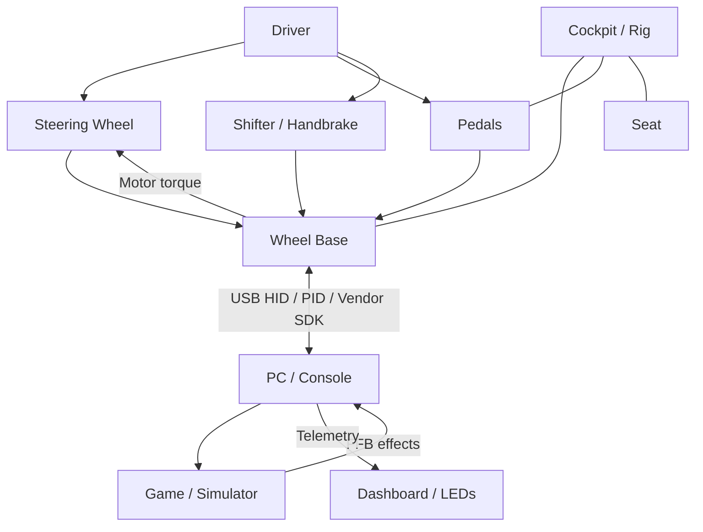

### 2.1 Main components

| Component | Role | Main data / signal |
|---|---|---|
| PC / Console | Runs the game, driver, and updater | USB HID, PID, vendor protocol, telemetry |
| Wheel base | Generates torque, reads steering angle, manages safety | FFB, motor current, encoder, safety state |
| Steering wheel / rim | The part the driver holds and uses for input | Buttons, paddles, encoders, LEDs, display |
| Quick release | Mechanical coupling and possible power/data transfer | Torque coupling, power, data |
| Pedals | Throttle, brake, clutch | Position or force, ADC, USB/RJ12 |
| Shifter | H-pattern or sequential shifting | Switch / Hall / analog state |
| Handbrake | Simulated parking/rally handbrake | Position or force |
| Dashboard | Displays telemetry | RPM, gear, speed, flags, tire temperature |
| Button box | Auxiliary controls | USB HID buttons, rotary encoders |
| Cockpit / rig | Mechanical load-bearing frame | Stiffness, anti-flex behavior |

### 2.2 Fanatec ecosystem example

Fanatec is a useful example of a modular ecosystem. The customer normally combines a wheel base, steering wheel or hub, matching quick-release components, pedals, and optional add-ons. Ready2Race bundles package required components for easier purchasing, but the bundle name is not a protocol or compatibility standard.

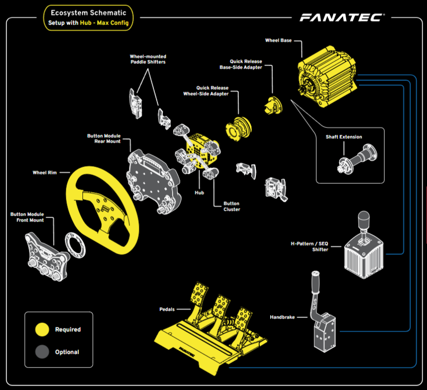


| Tier | Simple Meaning | Important Limitation |
|---|---|---|
| CSL | Entry point | “CSL” alone does not guarantee compatibility with every CSL or legacy product. |
| ClubSport | Enthusiast tier | Check exact model, platform label, QR, and firmware. |
| Podium | Flagship tier | Higher torque increases mounting and safety requirements. |

Platform compatibility is easier to remember as separate rules:

- **Xbox comes from an Xbox-licensed steering wheel or hub.**
- **PlayStation comes from a PlayStation-licensed wheel base.**
- **Console pedals, shifters, and handbrakes connect through the wheel base.**
- **PC supports more standalone USB combinations, but every device still needs a supported USB path and game mapping.**

For current product-family definitions and abbreviations, use the [customer glossary](./glossary.md). For source dates and conflicts, use the [ecosystem source register](./references.md).

---

## 3. Foundational physics concepts

This section is important because sim racing hardware is not only a USB device. It is a mechanical, electrical, and control system. A wheel base generates real torque, a pedal can measure real force, and a cockpit carries real loads.

### 3.1 Force

**Force** is denoted by `F` and is measured in **newtons (N)**.

Basic formula:

```text
F = m × a
```

Where:

- `F`: force, in N.
- `m`: mass, in kg.
- `a`: acceleration, in m/s².

In sim racing, force appears as:

- Hand force applied to the steering wheel.
- Foot force applied to the brake pedal.
- Force carried by the cockpit / pedal deck.
- Force converted from motor torque into the driver's hands.

### 3.2 Torque

**Torque** is the rotational effect of force. It is usually denoted by `T` or `τ` and is measured in **N·m**.

Simple formula:

```text
T = F × r
```

Where:

- `T`: torque, in N·m.
- `F`: tangential force, in N.
- `r`: radius / lever arm, in m.

Example: a wheel base generates 10 N·m of torque and the steering wheel has a radius of 0.15 m. The approximate tangential hand force is:

```text
F = T / r = 10 / 0.15 ≈ 66.7 N
```

If a larger rim is used, the same shaft torque requires less hand force to resist.

### 3.3 Inertia

**Inertia** is resistance to a change in rotational speed. In linear motion, we use mass `m`; in rotational motion, we use moment of inertia `J`.

Equivalent formula:

```text
T = J × α
```

Where:

- `T`: torque.
- `J`: moment of inertia.
- `α`: angular acceleration.

Meaning in sim racing:

- A heavier rim or a larger-diameter rim has higher inertia.
- High inertia makes the wheel feel “heavy” and slower to respond.
- A good direct-drive base usually has a motor and encoder capable of compensating for or controlling inertia.

### 3.4 Damping

**Damping** is force / torque that opposes velocity. If you rotate quickly, damping generates an opposing torque to smooth the motion.

```text
T_damping = -B × ω
```

Where:

- `B`: damping coefficient.
- `ω`: angular velocity.

In FFB:

- Damping helps reduce vibration and oscillation.
- Too much damping makes the wheel feel sluggish and hides road detail.
- Too little damping can allow the wheel to shake or oscillate around center.

### 3.5 Friction

**Friction** opposes motion, including very slow motion.

In a wheel base:

- A gear-driven base usually has more mechanical backlash and friction.
- A belt-driven base feels smoother but has belt elasticity.
- A direct-drive base has fewer intermediate transmission elements, so force transmission error is lower.

### 3.6 Spring / centering force

A spring effect generates torque that pulls the wheel toward a center or target position.

```text
T_spring = -K × θ
```

Where:

- `K`: virtual spring stiffness.
- `θ`: angular displacement from center.

In games, a spring effect may be used for centering force, menus, or special modes. However, in a realistic vehicle simulation, steering self-aligning torque usually comes from the tire model, caster, trail, slip angle, and suspension system rather than from a simple spring alone.

### 3.7 Stiffness

**Stiffness** is resistance to deformation. In a cockpit, stiffness is extremely important.

If the cockpit flexes:

- Wheel base torque is partially “absorbed” by the frame.
- The pedal deck moves backward or bends under braking force.
- The driver perceives FFB less accurately.
- A load-cell brake feels inconsistent because part of the foot force becomes chassis deformation.

### 3.8 Latency

**Latency** is the time between an event occurring and the driver feeling it, or the game receiving the input.

Common latency sources:

- Game physics update.
- Driver / API.
- USB polling.
- Firmware processing.
- FFB mixing.
- Motor control loop.
- Filters in firmware or the game.
- Mechanical compliance in belts, gears, or cockpit structure.

In sim racing, lower latency makes the car response feel more natural.

---

## 4. Force feedback: what is haptic steering feedback?

**Force feedback (FFB)** is the process of converting physical information from the game into real torque at the steering wheel.

The game usually does not send “motor voltage” directly. Instead, the game / driver sends effects or force requests, and firmware processes them:

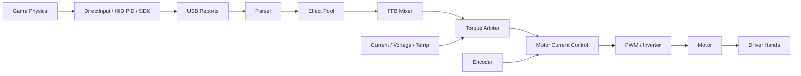

### 4.1 Common FFB effect types

| Effect | Meaning |
|---|---|
| Constant force | Constant force in one direction |
| Spring | Pulls toward center or a target position |
| Damper | Opposes rotational speed |
| Friction | Opposes movement, similar to friction |
| Periodic / sine | Periodic vibration, rumble, texture |
| Condition effects | Force dependent on position or speed |
| Collision / impact | Short impulse during an impact |
| Road texture | Fine vibration from road surface / kerbs |

### 4.2 What is a torque arbiter?

The **torque arbiter** decides the final torque that is allowed to go to the motor. It does not merely sum FFB effects; it also applies safety limits.

A torque arbiter typically checks:

- Maximum torque limit.
- Motor current limit.
- Slew-rate limit, meaning the maximum rate of torque change.
- Motor / MOSFET / PCB temperature.
- DC bus voltage.
- Encoder status.
- Whether the FFB command is fresh or stale.
- E-stop, watchdog, and fault-latch state.

Important idea:

> The game may request force, but the wheel base may only generate force after that request passes limiting and safety layers.

### 4.3 FFB clipping

**Clipping** occurs when the game requests more torque than the wheel base can produce, or more than the user-configured limit.

Example:

- The game requests 15 N·m.
- The wheel base is limited to 8 N·m.
- Any value above 8 N·m is clipped.

Consequences:

- Loss of force detail in the high-force region.
- Different situations all feel “equally heavy.”
- The driver has a harder time feeling the grip limit.

### 4.4 Slew rate

**Slew rate** limits how quickly torque can change.

If torque jumps from 0 to 20 N·m too quickly, the user may experience a violent jerk. A slew limit makes torque increase and decrease in a controlled way.

### 4.5 Oscillation

**Oscillation** is the steering wheel shaking left and right by itself, often around the center position.

Common causes:

- FFB gain is too high.
- Damping is too low.
- Filters or latency make the control loop unstable.
- The wheel base is strong, but the game or settings are not properly tuned.

---

## 5. Wheel base: the center of torque generation and safety control

The wheel base is the most important part of a force-feedback sim racing system. It is simultaneously:

- A USB device communicating with the PC/console.
- A real-time servo drive.
- A motor controller.
- A hub for pedals, shifter, handbrake, and rim.
- A safety-critical system because it can generate high torque.

### 5.1 Wheel base types by drive mechanism

| Type | Characteristics | Advantages | Disadvantages |
|---|---|---|---|
| Gear-driven | Motor drives through gears | Low cost, simple | Backlash, noise, gear feel |
| Belt-driven | Motor drives through a belt | Smoother than gears | Belt stretch, compliance |
| Direct-drive | Motor connects directly to steering shaft | Accurate, high torque, low transmission error | Expensive, high safety requirements |

### 5.2 Wheel base hardware architecture

A direct-drive wheel base typically contains:

- Main MCU: USB, profiles, settings, FFB, peripheral aggregation.
- Motor MCU / DSP / ASIC: encoder, current sampling, PWM, control loop.
- Encoder: measures shaft angle.
- Current sense: measures phase current or DC current.
- Gate driver: drives the MOSFETs.
- Three-phase inverter: converts the DC bus into three-phase motor current.
- Power supply / DC input.
- Protection: fuse, reverse protection, TVS, inrush, overcurrent, thermal.
- E-stop or torque-off input.

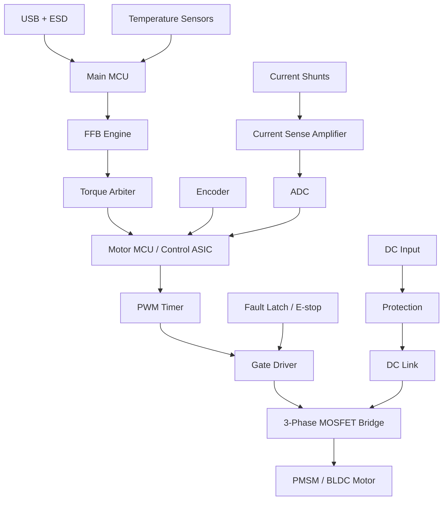

### 5.3 Basic motor control

For a BLDC/PMSM motor, torque is strongly related to current:

```text
T ≈ Kt × Iq
```

Where:

- `T`: torque.
- `Kt`: torque constant.
- `Iq`: torque-producing current in FOC.

Meaning:

- More torque requires more current.
- More current heats the motor and MOSFETs.
- Firmware must therefore limit current, torque, and temperature.

### 5.4 What is a servo motor?

In the context of direct-drive wheel bases, the term **servo motor** is frequently used. A servo motor is not necessarily a specific type of electromagnetic design (it can be a BLDC, PMSM, or even a brushed DC motor). Instead, it refers to a motor that operates in a **closed-loop control system**.

A true servo system requires:

1. **A motor:** To generate torque and motion (e.g., a PMSM).
2. **A sensor (encoder):** To provide precise, real-time feedback on the shaft's position, speed, and sometimes acceleration.
3. **A controller:** To continuously compare the actual position/speed from the encoder with the desired target (the FFB command) and adjust the motor current/PWM instantly to correct any error.

**Why is it important in sim racing?**

- **Precision:** It knows exactly where the wheel is at all times.
- **Dynamic response:** It can react instantly to FFB transients (like hitting a kerb or losing traction).
- **Torque control:** It allows the firmware to deliver exactly the requested torque without losing steps or lagging behind.

### 5.5 Encoder and steering angle

The encoder measures the steering shaft position/angle. It is important because:

- The game needs steering angle.
- Motor control needs rotor position.
- FFB needs to synchronize torque with wheel angle.

Common encoder types:

| Type | Advantage | Notes |
|---|---|---|
| Absolute SPI / SSI / BiSS-C | Knows angle immediately at power-up | Needs CRC/status and wrap handling |
| ABZ incremental | Simple, low latency | Needs index/reference; may miss edges |
| Sin/Cos | High resolution after interpolation | Needs analog offset/gain/phase handling |
| Hall sector | Robust for basic commutation | Not accurate enough for high-end wheel bases |

### 5.6 DC bus and regeneration

When the motor is forced by the user or decelerates quickly, it can return energy to the DC bus. This is called **regeneration**.

Firmware / hardware must handle:

- DC bus overvoltage.
- Brake resistor or clamp when available.
- Torque reduction when the bus exceeds its limit.
- Avoiding the assumption that the power supply can always absorb returned energy.

---

## 6. Steering wheel / steering rim

The steering wheel / rim is the part the driver holds. In technical documents, it can be useful to distinguish:

- **Wheel rim:** the mechanical hoop, which can be round, D-shaped, or formula-style.
- **Steering wheel electronics:** the electronics assembly with buttons, paddles, display, LEDs, and rotary encoders.

### 6.1 The steering rim does not control FFB

A key point:

> The steering rim is usually a rotating I/O node, not the FFB motor controller.

The wheel base owns:

- Steering shaft angle.
- FFB effect processing.
- Motor current / PWM.
- Torque safety.

The steering rim usually owns:

- Button scanning.
- Paddle shifting.
- Rotary encoders.
- Display / LEDs.
- Rim identity / capabilities.
- Communication through the QR link.

### 6.2 Steering rim data path

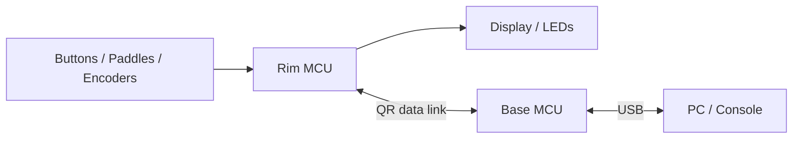

### 6.3 Input scanning

Common inputs include:

- Push button.
- Paddle switch.
- Rotary encoder.
- Multi-position switch.
- Analog clutch paddle.
- Joystick / funky switch.

Firmware needs to:

- Debounce buttons.
- Decode encoders.
- Avoid ghosting when using a matrix.
- Pack bitfields / reports.
- Send state regularly with a sufficiently high polling rate.

### 6.4 Display and LED

High-end steering wheels may include:

- Gear display.
- RPM LEDs.
- Flag LEDs.
- OLED / LCD / TFT.
- Telemetry pages.

Display/LED handling is usually not safety-critical. If the display lags, the user is annoyed; if FFB safety fails, it can be dangerous. Firmware should therefore separate input/FFB/safety data paths from telemetry-display paths.

---

## 7. Pedals: throttle, brake, clutch

Pedals convert the driver's foot movement into electrical signals.

### 7.1 Three common pedal sensor types

| Sensor | What does it measure? | Advantage | Disadvantage | Typical application |
|---|---|---|---|---|
| Potentiometer | Position / travel | Cheap, easy ADC reading | Mechanical wear, noise, dead spots | Entry-level pedals |
| Hall effect | Position through magnetic field | Contactless, durable | Requires correct magnet placement | Throttle, clutch, handbrake |
| Load cell | Force / pressure | Realistic braking feel, stable muscle memory | Requires amplifier, rigid mechanics | Brake pedal |

### 7.2 Why is a load-cell brake better than a potentiometer?

In a real car, the driver usually controls braking by **foot force**, not by pedal travel. A load cell measures force, so it is closer to the real sensation.

Example:

- Potentiometer: deeper pedal travel → larger value.
- Load cell: stronger pedal force → larger value.

For trail braking, the driver must reduce braking force very smoothly. A load cell helps reproduce braking force better through muscle memory.

### 7.3 Pedal signal chain

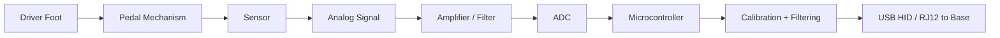

### 7.4 ADC resolution

An ADC converts an analog signal into a number.

Examples:

- 12-bit ADC: 0–4095 counts.
- 16-bit ADC: 0–65535 counts.
- Load cells usually need higher-resolution ADCs because their signals are small.

Notes:

- Higher resolution does not automatically mean higher accuracy if noise is large.
- A stable reference voltage is required.
- Reasonable analog and digital filtering is required.
- Min/max/tare/span calibration is required.

### 7.5 USB or RJ12 through the wheel base

Pedals may connect:

- Directly to the PC through USB.
- To the wheel base through RJ12 / an accessory port.

| Connection method | Advantage | Notes |
|---|---|---|
| Direct USB | Independent, good polling rate, easy debug | May not be supported on console outside the correct ecosystem |
| Through wheel base | Clean setup, ecosystem-compatible, often better console support | Depends on pinout/protocol/base compatibility |

Fanatec-specific public guidance adds three practical constraints:

- Fanatec accessories must connect through a Fanatec wheel base for console use.
- Base CSL Pedals do not provide standalone USB by themselves; the supported PC USB path requires a CSL Pedals Load Cell Kit or ClubSport USB Adapter.
- Third-party USB pedals can be used independently on PC, but they cannot connect directly to a Fanatec wheel-base pedal port.

Do not generalize USB availability, resolution, update path, or simultaneous USB/RJ12 behavior across all pedal models. Check the exact pedal manual.

---

## 8. Shifter and handbrake

### 8.1 H-pattern shifter

An H-pattern shifter simulates a traditional manual gearbox.

Gear detection methods:

- Switch per gear position.
- Hall sensor on X/Y axes.
- Optical sensor or magnetic sensor.
- Gate plate mechanism to create the H pattern.

Firmware needs to:

- Determine valid positions.
- Reject impossible states.
- Debounce switches.
- Apply hysteresis when using analog/Hall signals.

### 8.2 Sequential shifter

A sequential shifter only has:

- Pull backward: upshift or downshift depending on setup.
- Push forward: the opposite direction.

It usually uses two switches or Hall sensors.

### 8.3 Handbrake

A handbrake may be:

- Position-based: travel measured by Hall sensor / potentiometer.
- Force-based: force measured by a load cell.

For rally/drift, a handbrake needs a smooth signal, low latency, and durable mechanics.

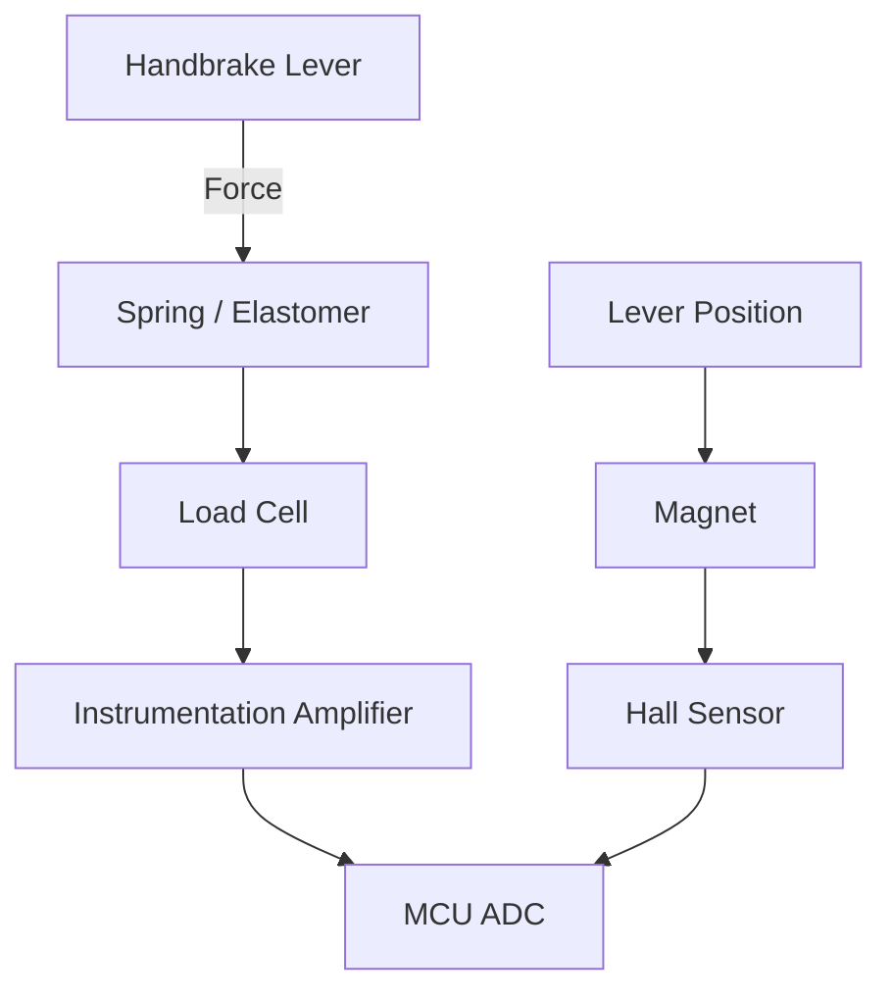

---

## 9. Quick release, dashboard, and button box

### 9.1 Quick release - QR

A quick release is the coupling between the wheel base and the steering wheel.

It has two jobs:

1. **Mechanical:** transfer torque from the wheel base to the wheel.
2. **Electrical/data:** when the wheel has electronics, the QR may transfer power and data.

A QR may use:

- Pin contacts.
- Slip ring.
- Wireless data + inductive power.
- USB pass-through.
- Proprietary serial bus.

In the current Fanatec ecosystem, **QR2** is the default generation for wheels and bases bought through Fanatec as of 2026-02-16, and **QR1** is discontinued. QR2 requires a matching Base-Side component on the wheel base and Wheel-Side component on the steering wheel. QR1 and QR2 shapes do not mate; conversion support and high-torque approval are model-specific.

Technical requirements:

- No mechanical play under high torque.
- Stable electrical contact during vibration/rotation.
- Backfeed protection when debug USB and QR power are both present.
- Handshake or identity so the base knows which rim is attached.

### 9.2 Dashboard / telemetry display

A dashboard displays game data:

- RPM.
- Gear.
- Speed.
- Lap time.
- Tire temperature.
- Fuel.
- Flags.

Common architecture:

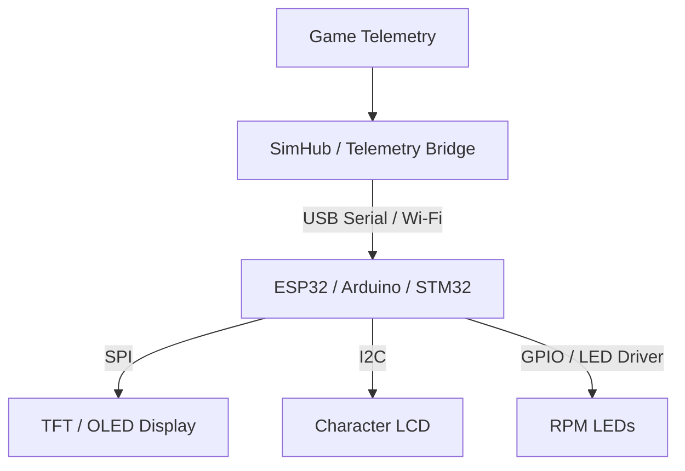

A dashboard is usually best-effort. This means dropped display frames must not affect input or FFB safety.

### 9.3 Button box

A button box is an auxiliary control box used to assign functions such as:

- Engine start.
- Pit limiter.
- Brake bias.
- TC/ABS setting.
- Wiper, lights, radio.

A button box is usually a USB HID device.

Common hardware:

- Button matrix.
- Rotary encoder.
- Toggle switch.
- I/O expander over I2C/SPI.
- Native-USB MCU such as ATmega32U4, RP2040, or STM32.

---

## 10. Cockpit / rig: mechanical chassis

The cockpit is the mechanical foundation that holds the wheel base, pedals, seat, and accessories. Beginners often underestimate it, but it strongly affects feel.

### 10.1 Why must the cockpit be stiff?

A direct-drive base can generate very high torque. If the wheel frame flexes:

- Part of the torque becomes frame deformation.
- Road texture and FFB transients are reduced.
- The driver feels the force as “soft” or delayed.

A load-cell brake can experience very high foot force. If the pedal deck or seat flexes:

- Foot force is lost into the chassis.
- Brake input is no longer repeatable.
- Stable trail braking becomes difficult.

### 10.2 Areas that must be stiff

| Area | Why it matters |
|---|---|
| Wheelbase uprights | Carry torsional torque from a DD base |
| Pedal deck | Carries high braking force |
| Seat mount | If the seat moves/flexes, braking force becomes inconsistent |
| Base frame | Acts as the main load-bearing loop |
| Shifter/handbrake mount | Must be firm so fast inputs do not shake the mount |

### 10.3 Ergonomics

Correct seating posture reduces fatigue and improves accuracy:

- Arms slightly bent when holding the wheel.
- Shoulders not raised.
- The driver can brake hard without the back leaving the seat.
- Pedal angle fits ankle movement.
- Monitor height and field of view are correct.

---

## 11. Sensors in sim racing

### 11.1 Potentiometer

A potentiometer is a mechanical variable resistor. When the shaft rotates, resistance changes and produces a different analog voltage.

Advantages:

- Cheap.
- Easy to use.
- Can be read directly by an ADC.

Disadvantages:

- Mechanical contact causes wear.
- Can develop noise or dead spots.
- Not ideal for high-end devices.

### 11.2 Hall effect sensor

A Hall sensor measures magnetic field. When a magnet moves near the sensor, the output voltage changes.

Advantages:

- Contactless.
- Durable.
- Suitable for pedals, handbrakes, and shifters.

Notes:

- Magnet and sensor placement must be correct.
- Linearity must be checked.
- Min/max calibration is required.

### 11.3 Load cell

A load cell measures force through a strain gauge. When compressed or pulled, the strain gauge resistance changes by a very small amount.

Characteristics:

- Very small signal, usually microvolts to millivolts.
- Requires an instrumentation amplifier or dedicated ADC.
- Requires tare and span calibration.
- Very suitable for brake pedals.

### 11.4 Encoder

An encoder measures angle or rotational speed.

Applications:

- Measure steering angle.
- Measure rotor position for motor control.
- Measure rotational speed.

Issues to handle:

- Wrap-around at 0°/360°.
- Direction sign.
- Offset calibration.
- CRC/status when using an absolute encoder.
- Missed pulses when using an incremental encoder.

### 11.5 Current sensor

A current sensor measures motor current.

Common types:

- Shunt resistor + current sense amplifier.
- Hall current sensor.
- Inline / low-side / phase current sensing.

Motor current is directly related to torque, so current sensing is extremely important in a wheel base.

### 11.6 Temperature sensor

Temperature sensors protect:

- Motor winding.
- MOSFETs.
- PCB.
- Gate driver.
- Power supply.

Firmware can derate torque as temperature rises.

### 11.7 Switch and button matrix

Buttons should not be read raw and sent immediately. Firmware needs:

- Debounce.
- Clear pull-up/pull-down configuration.
- Stuck-button handling.
- Anti-ghosting when using a matrix.
- Stable scan rate.

---

## 12. Common communication protocols

### 12.1 USB HID

USB HID is a common standard for input devices:

- Steering axis.
- Pedal axes.
- Buttons.
- Shifter states.
- Button boxes.

Advantages:

- Plug-and-play.
- Supported by operating systems.
- Uses a report descriptor to describe data.

### 12.2 USB PID for force feedback

USB PID is the Physical Interface Device class used for force-feedback / haptic devices.

It includes concepts such as:

- Effect upload.
- Effect start/stop.
- Effect duration.
- Condition, envelope, and gain.

In practice, many vendors add proprietary protocols outside the standard to control tuning, LEDs, displays, and compatibility features.

### 12.3 SPI

SPI is a synchronous bus consisting of:

- SCLK.
- MOSI.
- MISO.
- CS.

Applications in sim racing:

- Absolute encoder.
- Display.
- Shift register.
- Rim-to-base link in some designs/community projects.

Advantages:

- High speed.
- Clear timing.

Notes:

- Voltage levels must be correct.
- A logic analyzer is useful for debugging.
- CRC/status should be used for important data.

### 12.4 I2C

I2C uses two wires:

- SDA.
- SCL.

Applications:

- Small OLED/LCD displays.
- GPIO expanders.
- Low/medium-speed sensor configuration.

Notes:

- Pull-up resistors are required.
- Bus capacitance can become a limitation.
- It is not ideal for heavy telemetry refresh if many devices share the same bus.

### 12.5 UART / Serial

UART uses TX/RX and is simple to debug.

Applications:

- Debug log.
- Telemetry bridge.
- MCU communication with display modules.
- Arduino/SimHub devices.

Notes:

- Blocking logs should not be used in real-time paths.
- Framing and checksum are needed when data is important.

### 12.6 CAN

CAN is commonly used in automotive/industrial systems and has good noise immunity.

Possible applications:

- Internal module communication.
- Motion systems.
- High-end dashboard or button systems.

Notes:

- Arbitration IDs must be clear.
- Termination is required.
- Watchdog/heartbeat should be implemented at the application layer.

### 12.7 RJ12 / analog accessory ports

Many wheel bases use RJ12-style ports for pedals/shifters/handbrakes. These ports may carry:

- Analog voltage.
- GPIO switch states.
- Power/GND.
- A bus or proprietary protocol depending on the ecosystem.

Do not assume pinouts are identical across manufacturers or product generations.

### 12.8 Wireless / Bluetooth / 2.4 GHz / Wi-Fi

These may be used for:

- Wireless rims.
- Wi-Fi dashboards.
- Telemetry displays.

Notes:

- Wireless links have different latency and reliability from wired links.
- Safety-critical FFB should not depend on an uncontrolled wireless link.
- Timeouts and fallback states are required.

### 12.9 Data integrity: CRC, timestamp, heartbeat

Any important link should include:

- Sequence counter.
- Timestamp.
- CRC/checksum.
- Timeout.
- Health/state field.
- Version/capability field.

This helps detect:

- Stale data.
- Corrupted packets.
- Disconnection.
- Wrong device.
- Protocol incompatibility.

---

## 13. Firmware and real-time control

### 13.1 Typical firmware layers

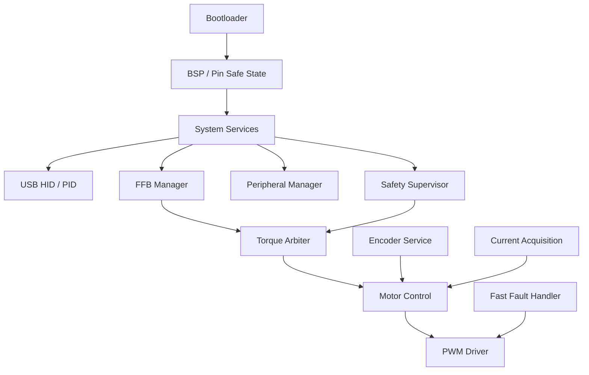

### 13.2 Control loops

A wheel base has multiple control loops:

| Loop | Function | Relative speed |
|---|---|---|
| Current loop | Controls motor current and torque | Fastest |
| Torque/FFB loop | Mixes effects and limits torque | Fast |
| USB/input loop | Sends/receives reports | Medium |
| Telemetry/display loop | Updates LEDs/display | Slower |
| Config/update | Saves settings, updates firmware | Not real-time |

### 13.3 Real-time principles

In a real-time path, avoid:

- Blocking logs.
- Uncontrolled dynamic memory allocation.
- Flash writes inside an ISR.
- Long mutex waits.
- Complex USB parsing inside a motor ISR.
- Mixing display rendering with the fast control path.

Prefer:

- Coherent data snapshots.
- Timestamps for each input.
- Clear timeouts.
- Separation of safety paths from feature paths.
- Fail-to torque-off behavior.

### 13.4 Basic state machine

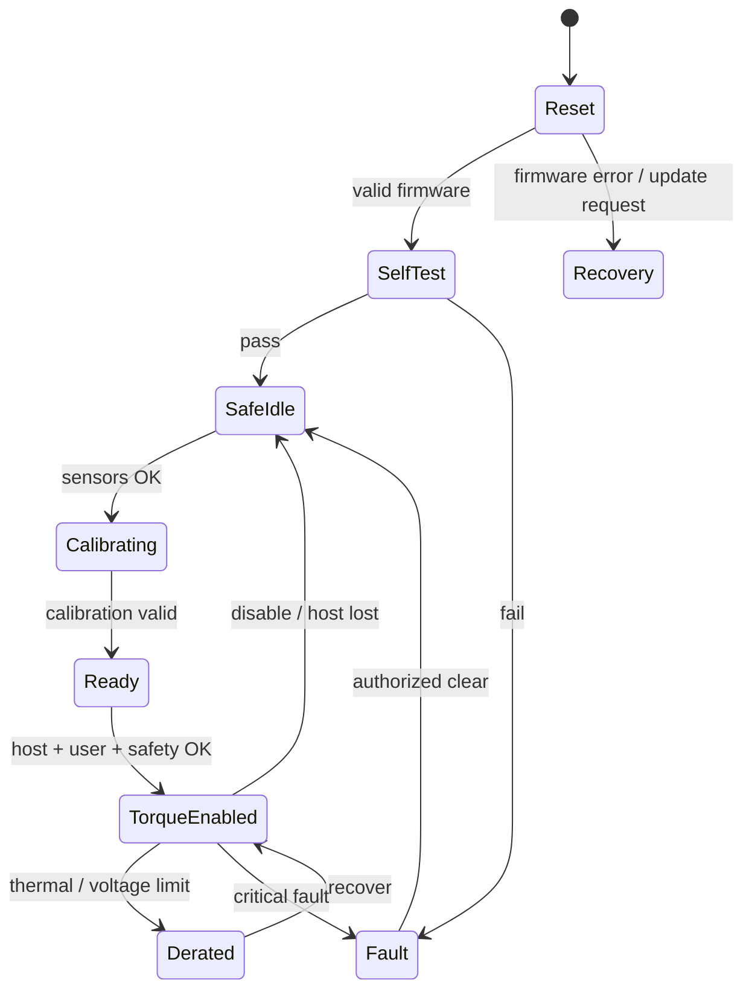

Important point:

> USB device enumeration does not mean torque is enabled. Torque enable must require separate safety conditions.

---

## 14. Calibration, filtering, and latency

### 14.1 Calibration

Calibration converts raw signals into meaningful values.

Pedal example:

- Raw ADC min when not pressed.
- Raw ADC max when fully pressed / pressed to a reference force.
- Start/end dead zones.
- Linear or nonlinear curve.

Steering example:

- Center offset.
- Rotation range.
- Direction sign.
- End-stop / soft lock.

### 14.2 Filtering

A filter reduces noise but can increase latency.

Common filter types:

- Moving average.
- Exponential moving average.
- Low-pass filter.
- Median filter for spikes.
- Hysteresis for switch/analog thresholds.

Trade-off:

```text
Stronger filtering → smoother signal but more latency.
Weaker filtering   → faster response but more noise.
```

### 14.3 Debounce

A button/switch can bounce for a few milliseconds when it closes. If read directly, firmware may detect multiple presses.

Debounce can be implemented with:

- Delay/time threshold.
- State machine.
- Counter of stable samples.
- Hardware RC filter in some cases.

### 14.4 Dead zone

A dead zone ignores a small region around the rest point to avoid noise.

Used for:

- Pedals not pressed while ADC still fluctuates.
- Handbrake not pulled.
- Analog clutch paddle.
- Joystick.

A dead zone should not be too large, otherwise sensitivity is lost.

### 14.5 Linearity and curve

A pedal or handbrake can be mapped as:

- Linear: input increases uniformly with force/travel.
- Progressive: light at the start, heavier at the end.
- Custom curve: tuned to the game or driver preference.

A load-cell brake usually needs a good curve so the driver can control force in the trail-braking region.

---

## 15. Safety when working with force-feedback systems

A direct-drive wheel base can cause injury if handled incorrectly. When testing or developing, treat it as a high-power actuator system.

### 15.1 Default torque-off principle

The system should default to no torque when:

- Resetting.
- In bootloader.
- Updating firmware.
- During USB enumeration.
- Self-test has not completed.
- Encoder is invalid.
- Current feedback is invalid.
- Watchdog reset occurs.
- Brownout occurs.
- Torque command is stale.
- E-stop is active.

### 15.2 Protection layers

| Protection layer | Purpose |
|---|---|
| Software torque limit | Limit torque by profile/user setting |
| Current limit | Protect motor and inverter |
| Slew-rate limit | Avoid sudden torque jerks |
| Thermal derating | Reduce torque when too hot |
| Encoder validity | Do not control torque when angle is unreliable |
| Watchdog | Detect firmware lockup |
| Hardware overcurrent | Disable gate drive when current is dangerous |
| E-stop / torque-off | Independently remove torque |
| Fault latch | Prevent automatic re-enable after a serious fault |

### 15.3 Warnings for DIY or reverse engineering

Do not:

- Bypass torque limits.
- Bypass console authentication.
- Use community pinouts without safe measurement and verification.
- Mix up 5 V / 3.3 V voltage levels.
- Test a high-torque DD base before it is firmly mounted to a rig.
- Put hands inside the wheel when running auto-rotation tests.
- Use unknown firmware on high-power hardware.

Do:

- Use a current-limited supply during bring-up.
- Use a physical E-stop.
- Test the motor unloaded / at low torque first.
- Use a dummy load or HIL fixture.
- Log faults, but do not perform blocking logging in the fast path.

---

## 16. Learning, measurement, and debug tools

### 16.1 Software tools

| Tool | What it is used for |
|---|---|
| USB HID tools | Inspect descriptors, reports, usages |
| Wireshark USBPcap / usbmon | Trace USB traffic |
| SimHub | Telemetry, dashboards, LEDs, Arduino integration |
| OpenFFBoard | Learn open FFB firmware architecture |
| hid-tools / hid-recorder | Inspect HID reports |
| Vendor control panel | Configure gain, rotation, firmware updates |

### 16.2 Hardware tools

| Tool | What it is used for |
|---|---|
| Oscilloscope | Rails, reset, PWM, encoder, current sense |
| Logic analyzer | SPI/I2C/UART/CAN timing, QR transactions |
| Multimeter | Power, continuity, voltage level checks |
| Current-limited supply | Safe bring-up |
| Dummy load / test fixture | Testing without full hardware |
| Torque wrench / force gauge | Mechanical force/torque checks |

### 16.3 Things worth measuring

- Whether USB enumeration is stable.
- HID report rate.
- Input latency.
- Encoder noise/wrap.
- Pedal ADC noise.
- Load-cell drift.
- PWM timing.
- Current-sense offset.
- Temperature rise.
- QR contact stability.
- Cockpit flex under real load.

---

## 17. Learning path for beginners

### Stage 1: Understand the system

1. What modules does a sim racing system contain?
2. How is a wheel base different from a steering rim?
3. How are position-based and force-based pedals different?
4. What path does FFB follow from the game to the motor?

### Stage 2: Understand physics

1. Force, torque, radius.
2. Inertia, damping, friction.
3. Spring, stiffness, compliance.
4. Latency and clipping.

### Stage 3: Understand sensors

1. Potentiometer.
2. Hall effect.
3. Load cell + amplifier + ADC.
4. Encoder.
5. Current/voltage/temperature sensors.

### Stage 4: Understand communication

1. USB HID input.
2. USB PID / force feedback.
3. SPI/I2C/UART.
4. RJ12/accessory port.
5. Telemetry bridge.

### Stage 5: Understand firmware

1. Main loop and polling.
2. Debounce/filter/calibration.
3. State machine.
4. Watchdog and fault handling.
5. Real-time control loop.

### Stage 6: Practice measurement and validation

1. Read the HID report of a USB device.
2. Read a pedal ADC value with an MCU.
3. Use a logic analyzer to inspect SPI/I2C.
4. Build a simple USB HID button box.
5. Use SimHub to display telemetry on a display.
6. Work on motor/FFB only after understanding safety.

---

## 18. English - Vietnamese glossary

| English | Vietnamese | Short explanation |
|---|---|---|
| Force | Lực | An action that accelerates, redirects, or deforms an object |
| Torque | Mô-men xoắn | Force that rotates an object around an axis |
| Radius | Bán kính | Distance from the axis to the force application point |
| Inertia | Quán tính | Resistance to changes in motion |
| Damping | Giảm chấn | Force opposing velocity |
| Friction | Ma sát | Force opposing relative motion |
| Stiffness | Độ cứng | Resistance to deformation |
| Compliance | Độ đàn hồi mềm | Opposite of stiffness; easier to deform |
| Backlash | Độ rơ | Mechanical delay caused by transmission gaps |
| Force Feedback | Lực phản hồi | Motor-generated force that simulates driving feel |
| FFB Clipping | Cắt lực | Requested force exceeds limit and is clipped |
| Slew Rate | Tốc độ thay đổi | Limit on how fast torque may increase/decrease |
| Wheel Base | Đế vô lăng | Device that generates force and reads steering angle |
| Steering Rim | Vành vô lăng | The part the driver holds |
| Quick Release | Khớp tháo nhanh | Connects the wheel to the base and may carry power/data |
| Load Cell | Cảm biến lực | Measures force using a strain gauge |
| Hall Sensor | Cảm biến Hall | Measures magnetic field to infer position |
| Potentiometer | Biến trở | Measures position using changing resistance |
| Encoder | Cảm biến góc | Measures angular position/speed |
| ADC | Bộ chuyển đổi tương tự-số | Converts analog voltage into a digital number |
| PWM | Điều chế độ rộng xung | Pulse control used for inverter/motor control |
| Inverter | Bộ nghịch lưu | Converts DC into three-phase current/voltage |
| Gate Driver | Driver cổng MOSFET | Drives power MOSFET gates |
| DC Bus | Bus DC | Main DC supply rail for the inverter |
| Regeneration | Tái sinh năng lượng | Motor returns energy to the bus during forced rotation/deceleration |
| HID | Human Interface Device | USB class for input devices |
| PID | Physical Interface Device | USB class for force feedback/haptics |
| Telemetry | Dữ liệu mô phỏng | RPM, gear, speed, tire temperature, fuel, etc. |
| Debounce | Chống dội phím | Filtering switch mechanical bounce |
| Calibration | Hiệu chỉnh | Mapping raw signal to correct values |
| Dead Zone | Vùng chết | Small ignored input region to avoid noise |
| Watchdog | Bộ giám sát treo | Resets/disables the system when firmware stops responding |
| E-stop | Dừng khẩn cấp | Emergency stop to remove torque/power |
| HIL | Hardware-in-the-loop | Firmware test using hardware or simulated signals |

---

## 19. Quick-read checklist

### For beginners buying/assembling a sim racing setup

- [ ] Know whether your wheel base is gear-driven, belt-driven, or direct-drive.
- [ ] Know the maximum torque and set a safe gain.
- [ ] Use a sufficiently stiff cockpit if using a load-cell brake or DD base.
- [ ] Understand that a load-cell brake measures force, not only travel.
- [ ] Understand what FFB clipping is and avoid excessive gain.
- [ ] Update firmware with official tools.
- [ ] Verify platform ownership: Xbox license in wheel/hub; PlayStation license in base.
- [ ] Verify Base-Side and Wheel-Side quick-release generations match.
- [ ] Verify every console accessory connects through the wheel base.
- [ ] Do not use unknown pinouts/protocols.

### For beginners learning embedded sim racing

- [ ] Understand USB HID report descriptors.
- [ ] Understand USB PID at a conceptual level.
- [ ] Know how to read ADC, filter, and calibrate signals.
- [ ] Know how to debounce switches and rotary encoders.
- [ ] Know where SPI/I2C/UART/CAN are used.
- [ ] Understand encoder wrap, timestamp, and stale data.
- [ ] Understand torque arbiter and default torque-off behavior.
- [ ] Know that logging/display must not affect the fast control path.

### For beginners debugging hardware

- [ ] Measure voltage levels correctly before connecting devices.
- [ ] Use a current-limited supply during bring-up.
- [ ] Use an oscilloscope for rails/reset/PWM.
- [ ] Use a logic analyzer for SPI/I2C/UART.
- [ ] Have an E-stop when testing motors.
- [ ] Test low torque first, then increase gradually in a controlled way.
- [ ] Do not put hands in the area where the wheel may rotate strongly by itself.

---

## 20. Source documents used

This document was translated and interpreted from the Markdown files provided in the working folder:

| Source file | Main content used |
|---|---|
| `README.md` | Reading order, evidence model, safety/scope rules |
| `sim_racing_research.md` | Ecosystem, component map, FFB overview, communication, firmware, safety |
| `wheel_base.md` | Wheel base, motor control, FFB path, safety, state machine, diagnostics |
| `wheel_rim.md` | Steering rim, QR link, input scanning, display/LED, rim-to-base communication |
| `pedals.md` | Pedal sensors, load cell, Hall, potentiometer, ADC, calibration, USB/RJ12 |
| `add_ons.md` | Shifter, handbrake, sensor paradigms, firmware loop |
| `accessories.md` | Quick release, dashboard, button box, telemetry display |
| `cockpits.md` | Rigidity, cockpit flex, pedal deck, DD torque dynamics |
| `tools.md` | USB/HID/PID references, SimHub, OpenFFBoard, measurement tools |
| `repos.md` | Public/community repositories as implementation evidence, not official vendor specifications |
| `glossary.md` | Customer terminology, platform labels, model families, and abbreviations |
| `references.md` | Ecosystem source classification, currency conflicts, and official cross-checks |

External ecosystem sources used for the 2026-07-02 refresh:

- [Fanatec Ecosystem Diagram](https://help.fanatec.com/hc/de/articles/43786297099281-Fanatec-Ecosystem-Diagramm) — official visual reference.
- [Fanatec Wheel Bases FAQ](https://help.fanatec.com/hc/en-us/articles/43766204938257-Wheel-Bases-A-FAQ) — current tiers and connection rules.
- [Fanatec platform compatibility](https://www.fanatec.com/us-en/platforms) — platform license ownership.
- [OC Racing ecosystem guide, 2026-06-07](https://ocracing.com/guides/fanatec-ecosystem-explained-for-dummies/) — current community onboarding model.
- [Sim Racing Setups ecosystem guide, 2026-01-13](https://simracingsetup.com/product-guides/fanatec-ecosystem-explained/) — buyer-oriented modular-system explanation; current torque/flagship claims require newer official cross-checks.

---

## Appendix A: Example pedal input flow

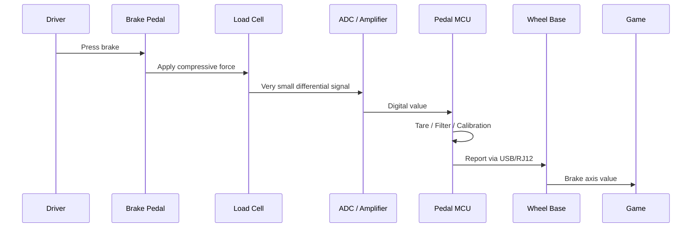

## Appendix B: Example FFB flow

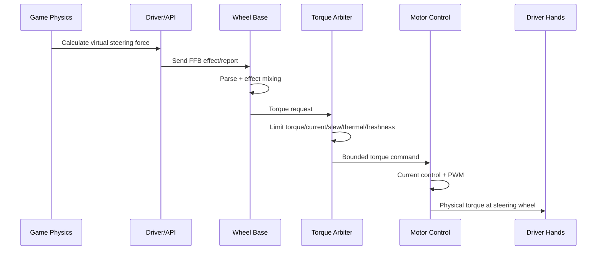

## Appendix C: Quick formulas to remember

```text
Force:        F = m × a
Torque:       T = F × r
Hand force:   F_hand = T_base / r_wheel
Power:        P = T × ω
Motor torque: T ≈ Kt × Iq
Damping:      T_damping = -B × ω
Spring:       T_spring = -K × θ
Rotational:   T = J × α
```

---

**Short conclusion:**  
To understand sim racing, view it as a real-time mechanical-electrical-control system. The game creates virtual physics events; the driver and USB transport commands; the wheel base limits and converts commands into motor current; the motor generates torque; the cockpit holds the forces; sensors and firmware send the driver's state back to the game. Understanding force, torque, sensors, USB/HID/PID, the FFB path, and safety gives you the foundation needed to go deeper.
