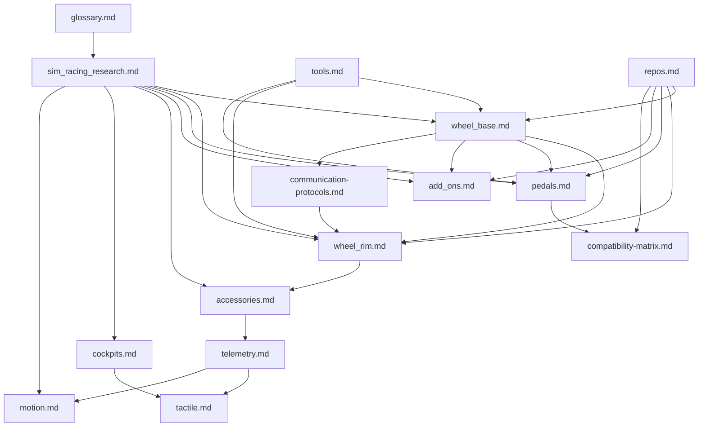

# Chỉ số Nghiên cứu Sim Racing

> Phiên bản: 1.4
> Đánh giá: 2026-07-05

## Nhật ký thay đổi tài liệu

| Phiên bản | Ngày | Thay đổi |
|---|---|---|
| 1.4 | 2026-07-05 | Đánh giá sổ đăng ký câu hỏi. Đã xem xét từng phần "Câu hỏi chưa được giải quyết" trên toàn bộ cơ sở và **giải quyết** các mục (từ cơ sở kiến thức, tiêu chuẩn công khai hoặc bằng chứng cộng đồng được ghi chép lại như USB IDs `hid-fanatecff` và sơ đồ chân GeekyDeaks RJ12/UART) hoặc **định dạng lại** chúng thành "Mở — nhà phát triển tự điều tra" với một phương pháp cụ thể (đo lường gì, lấy thông số nào, sử dụng công cụ nào). Các phần được đổi tên thành "Sổ đăng ký câu hỏi (Đã giải quyết và Mở)" hoặc "Câu hỏi mở để nhà phát triển tự điều tra" cho phù hợp. |
| 1.3 | 2026-07-05 | Thêm phần giải thích tổng hợp về force-feedback hướng tới người đọc ([force_feedback_explained.md](./force_feedback_explained.md)) bao gồm lý thuyết về lực, động cơ servo và điện tử công suất, toàn bộ chuỗi tín hiệu FFB, và mọi danh mục lực/rung động cảm nhận được ở tay (vật lý lốp xe, chuyển dịch trọng lượng, kết cấu đường/lề đường, hiệu ứng điều kiện) cùng với độ chân thực, tinh chỉnh và an toàn. Phần này sử dụng lại các hình minh họa liên quan đến FFB hiện có và tham chiếu chéo đến các tài liệu hệ thống con. |
| 1.2 | 2026-07-05 | Giải thích có hệ thống + thông qua minh họa. Đã thêm hình minh họa SVG gốc cho các khái niệm vật lý/điện tử công suất trên các tài liệu hệ thống con (biến tần ba pha, thời gian PWM/ADC, giảm nhiệt, tiết diện servo, cảm biến load cell / Hall / chiết áp, độ phân giải ADC, bóng ma trận nút, cổng mẫu H, khớp nối nhả nhanh, uốn cong buồng lái, chuyển động 6-DOF, ngăn xếp giao tiếp, độ trễ telemetry, giao thoa xúc giác), mỗi hình minh họa đi kèm với giải thích bằng ngôn ngữ đơn giản. Hình minh họa là sơ đồ gốc, không phải tác phẩm nghệ thuật của nhà sản xuất. |
| 1.1 | 2026-07-02 | Đã thêm tiêu đề phiên bản và nhật ký thay đổi; thêm năm tài liệu hệ thống con mới hơn (telemetry, tactile, motion, compatibility-matrix, communication-protocols) vào đường dẫn đọc và bản đồ phụ thuộc; chú thích sơ đồ bản đồ phụ thuộc. |

Thư mục này là một bản đồ nghiên cứu định hướng nhà phát triển cho phần cứng và firmware mô phỏng đua xe. Nó phân tách các sự kiện công khai, bằng chứng cộng đồng và các khuyến nghị kỹ thuật để công việc triển khai có thể tiến hành mà không phải giả định về các thiết kế nội bộ độc quyền của Fanatec.

## Đường dẫn đọc được đề xuất

| Bước | Đọc | Kết quả |
|---|---|---|
| 1 | [glossary.md](./glossary.md) | Tìm hiểu thuật ngữ sản phẩm, từ viết tắt, nhãn tương thích và từ ngữ an toàn với khách hàng. |
| 2 | [sim_racing_research.md](./sim_racing_research.md) | Tìm hiểu hệ sinh thái, mô hình an toàn, đường dẫn FFB và quyền sở hữu hệ thống con. |
| 2b | [force_feedback_explained.md](./force_feedback_explained.md) | Nhận bức tranh tổng thể về FFB: lý thuyết về lực, động cơ servo, toàn bộ chuỗi tín hiệu, những gì bàn tay cảm nhận (vật lý lốp xe, chuyển dịch trọng lượng, kết cấu đường), độ chân thực, tinh chỉnh và an toàn. |
| 3 | [wheel_base.md](./wheel_base.md) | Hiểu được trung tâm an toàn quan trọng: USB/PID, điều khiển động cơ, trọng tài mô-men xoắn, cập nhật, chẩn đoán. |
| 4 | [wheel_rim.md](./wheel_rim.md) | Hiểu các nút I/O quay, liên kết QR, nhận dạng vành, quét đầu vào, hiển thị và ranh giới thế hệ. |
| 5 | [pedals.md](./pedals.md) | Hiểu chuỗi cảm biến, hiệu chuẩn, USB HID và ủy nhiệm cổng cơ sở. |
| 6 | [add_ons.md](./add_ons.md) | Hiểu shifter và handbrake như các thiết bị đầu vào rời rạc hoặc analog. |
| 7 | [accessories.md](./accessories.md) | Hiểu các quick release, dashboard, hiển thị telemetry và button box. |
| 8 | [cockpits.md](./cockpits.md) | Hiểu khung gầm cơ khí bảo tồn FFB và độ trung thực tín hiệu bàn đạp. |
| 9 | [tools.md](./tools.md) | Chọn tiêu chuẩn, phần mềm, công cụ đo lường và tài liệu tham khảo xác nhận. |
| 10 | [repos.md](./repos.md) | Kiểm tra các dự án công cộng; coi chúng là bằng chứng cộng đồng, không phải thông số kỹ thuật chính thức. |
| 11 | [telemetry.md](./telemetry.md) | Hiểu đường ống telemetry game -> bridge -> thiết bị. |
| 12 | [tactile.md](./tactile.md) | Hiểu đầu dò xúc giác như một hệ thống rung riêng biệt được cách ly khỏi FFB. |
| 13 | [motion.md](./motion.md) | Hiểu nền tảng chuyển động, motion cueing, và phong bì an toàn bắt buộc. |
| 14 | [communication-protocols.md](./communication-protocols.md) | Hiểu ngăn xếp giao thức phân lớp và cách các công cụ phần mềm tiếp cận thiết bị. |
| 15 | [compatibility-matrix.md](./compatibility-matrix.md) | Phân tách các đường dẫn USB-direct so với base-proxy, thế hệ QR và nền tảng, với trạng thái xác minh. |

## Bản đồ phụ thuộc hệ thống con

**Hình 1-1: Bản đồ phụ thuộc hệ thống con**

## Mô hình bằng chứng

| Nhãn | Ý nghĩa | Nguồn ưu tiên |
|---|---|---|
| Hành vi công khai đã được xác minh | Sản phẩm hoặc hành vi tiêu chuẩn được ghi lại công khai | Thông số kỹ thuật USB-IF, hướng dẫn sử dụng của nhà sản xuất, trang hỗ trợ |
| Thực hiện cộng đồng | Triển khai công khai hoặc có tài liệu hoạt động | GitHub repositories, project wikis |
| Suy luận kỹ thuật | Kết luận thiết kế hợp lý từ bằng chứng công khai | Nhiều nguồn kết hợp với thực hành hệ thống nhúng / điều khiển |
| Không rõ | Không đủ tính công khai để xác nhận | Yêu cầu sơ đồ, BOM, dấu vết, mô tả hoặc đặc tả từ nhà cung cấp được phê duyệt |

> **Về các hình minh họa (được thêm vào v1.2).** Các sơ đồ SVG được thêm vào trong đợt này là bản gốc, minh họa sơ đồ giảng dạy về các nguyên tắc kỹ thuật chung (cấu tạo động cơ, biến tần ba pha, thời gian PWM, cầu đo biến dạng, mã hóa cầu phương, ma trận nút, v.v.). Chúng **không** phải là bản sao chép của bất kỳ sơ đồ hoặc tác phẩm nghệ thuật sản phẩm nào từ nhà sản xuất, và chúng mô tả các khái niệm chung chứ không phải cấu tạo bên trong của một sản phẩm cụ thể nào. Trong trường hợp một giá trị phụ thuộc vào sản phẩm cụ thể (số cực, tốc độ PWM, độ phân giải, tần số cộng hưởng), hình minh họa được dán nhãn là chỉ để minh họa và văn bản sẽ ưu tiên theo kết quả đo lường hoặc thông số kỹ thuật được phê duyệt. Chúng nằm ở mức độ tin cậy "suy luận kỹ thuật / kiến thức chung công khai đã được xác minh", không phải "hành vi sản phẩm đã được xác minh".

## Quy tắc an toàn và phạm vi

- Không bao gồm firmware bị rò rỉ, sơ đồ bí mật, tệp nhị phân độc quyền, thông tin xác thực hoặc tài liệu hỗ trợ riêng.
- Không trình bày các dự án cộng đồng tương thích với Fanatec như là các thông số kỹ thuật giao thức chính thức của Fanatec.
- Không vượt qua xác thực console, giới hạn mô-men xoắn, khóa an toàn hoặc bảo vệ firmware.
- Xử lý việc kiểm tra động cơ mô-men xoắn cao là nguy hiểm cho đến khi việc vô hiệu hóa cổng độc lập và xử lý lỗi được xác minh.

## Hub tham chiếu

- [Thông số kỹ thuật và công cụ USB-IF HID](https://www.usb.org/hid)
- [USB-IF PID Lớp 1.0](https://www.usb.org/sites/default/files/documents/pid1_01.pdf)
- [Hướng dẫn sử dụng Fanatec Podium DD1](https://assets.fanatec.com/fanatec-pwa/image/upload/downloads-prod/pdfs/P-WB-DD1-Manual-EN_web.pdf)
- [OpenFFBoard wiki](https://github.com/Ultrawipf/OpenFFBoard/wiki/)
- [Trình điều khiển Linux hid-fanatecff](https://github.com/gotzl/hid-fanatecff)
- [SimHub wiki](https://github.com/SHWotever/SimHub/wiki)

## Câu hỏi chưa được giải quyết

- Không có.
