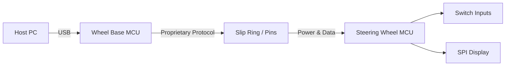
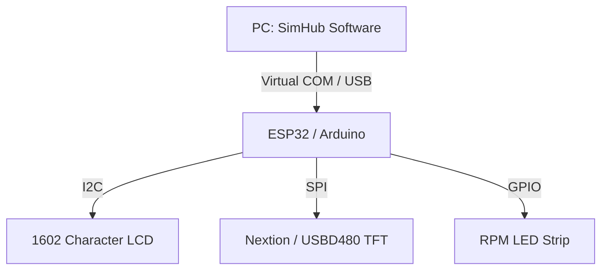
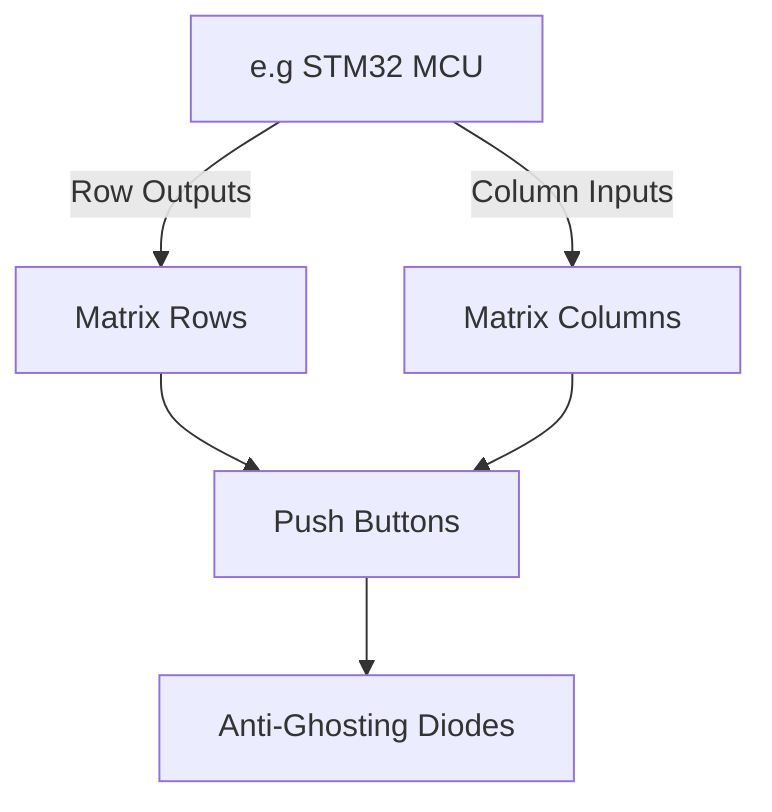

# Kiến trúc Phụ kiện Sim Racing

> Ngày nghiên cứu: 2026-07-02
> Mô hình bằng chứng: tiêu chuẩn công cộng, hướng dẫn sử dụng/hỗ trợ của nhà sản xuất và các dự án cộng đồng. Các dự án cộng đồng là bằng chứng thực hiện, không phải thông số kỹ thuật của nhà cung cấp chính thức.
> Bắt đầu ở đây sau [sim_racing_research.md](./sim_racing_research.md), [wheel_base.md](./wheel_base.md), và [wheel_rim.md](./wheel_rim.md).

Tài liệu này phác thảo kiến trúc phần cứng và phần mềm của các thiết bị ngoại vi đua xe mô phỏng phổ biến, cụ thể là hệ thống Quick Release (QR), bảng điều khiển và hộp nút. Nó nhằm cung cấp sự hiểu biết nền tảng cho các kỹ sư tham gia vào lĩnh vực đua xe mô phỏng, tập trung vào thiết kế hệ thống nhúng, giao thức truyền thông và tích hợp giao diện người-máy (HMI).

## 1. Hệ thống Quick Release (QR)

> **Lưu ý:** Phần này bao gồm các tiêu chuẩn khớp nối vật lý và cơ học chung của các phụ kiện độc lập. Để biết chi tiết về cách PCB và firmware của vô lăng xử lý cụ thể payload dữ liệu QR và power muxing, hãy tham khảo [Kiến trúc Vành lái](./wheel_rim.md).

Hệ thống Quick Release (QR) tạo thành cầu nối vật lý và điện quan trọng giữa wheelbase cố định (hoặc quay) và vành vô lăng có thể thay thế. Phần này nêu chi tiết các ràng buộc cơ học và kiến trúc truyền dữ liệu của nó.

### 1.1 Giao diện Cơ và Điện

> **Thông tin bổ sung:** Một hệ thống QR phải xử lý mô-men xoắn đáng kể từ các wheelbase Direct Drive (DD) trong khi duy trì tiếp xúc điện liên tục cho các nút và màn hình gắn trên bánh xe.

QR và hub là các ranh giới tương thích riêng biệt. Một hub đa năng có thể hỗ trợ các mẫu bu-lông vành phổ biến như 6x70 mm hoặc 3x50 mm, trong khi bản thân QR phải phù hợp với thế hệ trục của wheelbase, giới hạn mô-men xoắn, khóa cơ học và giao diện điện. Một mẫu bu-lông chung không làm cho vành an toàn hoặc tương thích về điện với base.

Đối với các sản phẩm Fanatec hiện tại, QR2 có các thành phần **Base-Side** và **Wheel-Side** riêng biệt. Cả hai bên phải sử dụng QR2. QR1 và QR2 không khớp với nhau, QR1 đã bị ngừng sản xuất và hỗ trợ chuyển đổi tùy thuộc vào từng model. Các biến thể QR2 Lite, QR2 và QR2 Pro Wheel-Side cũng có các chứng nhận sản phẩm và chịu mô-men xoắn cao khác nhau; hãy kiểm tra danh sách tương thích hiện tại thay vì suy đoán sự hỗ trợ chỉ dựa trên vật liệu.

Khớp nối thực hiện hai nhiệm vụ cùng lúc. Về mặt cơ học, nó khóa hub Wheel-Side vào trục Base-Side để truyền mô-men xoắn mà không có độ rơ. Về mặt điện, đối với vành có nút và màn hình, các chân pogo pin tiếp xúc với các miếng đệm qua khớp nối để truyền điện và dữ liệu. Bởi vì cả hai nửa phải cùng một thế hệ để có thể khớp với nhau, một mẫu bu-lông vành chung trên hub *không* chứng minh khả năng tương thích QR hoặc điện — thế hệ QR, giới hạn mô-men xoắn và giao diện tiếp xúc là các điểm cần kiểm tra riêng biệt.

**Hình 1-1: Kiến trúc Điện Quick Release**

### 1.2 Giao thức Truyền dữ liệu

> **Thông tin bổ sung:** Các nhà sản xuất sử dụng các giao thức khác nhau để truyền dữ liệu qua QR. Một số sử dụng USB pass-through tiêu chuẩn, trong khi những hãng khác dựa vào các bus nối tiếp độc quyền hoặc liên kết không dây (Bluetooth/2.4GHz) kết hợp với truyền điện cảm ứng.

Vi điều khiển của vô lăng **phải** xử lý các đầu vào ngoại vi thô và đóng gói chúng thành một payload có cấu trúc. Liên kết dữ liệu QR **phải** duy trì tốc độ lấy mẫu (polling rate) ít nhất 100 Hz để tránh độ trễ đầu vào có thể nhận biết được.

| Element | Direction | Type | Description |
|---------|-----------|------|-------------|
| `VCC` | Input | Power | Nguồn 5V hoặc 12V từ wheelbase đến vành |
| `GND` | Common | Ground | Tham chiếu ground của hệ thống |
| `DATA_TX` | Output | Serial | Payload trạng thái nút gửi đến wheelbase |
| `DATA_RX` | Input | Serial | Force feedback hoặc dữ liệu hiển thị từ wheelbase |

## 2. Bảng điều khiển (Dashboards) và Màn hình Telemetry

> **Lưu ý:** Phần này bao gồm các bảng điều khiển telemetry USB hoặc Wi-Fi *độc lập*. Để biết thông tin về màn hình *tích hợp* được gắn trong vô lăng và điều khiển trực tiếp bởi liên kết wheelbase, hãy tham khảo [Kiến trúc Vành lái](./wheel_rim.md).

Bảng điều khiển cung cấp dữ liệu telemetry theo thời gian thực cho người lái, chẳng hạn như vòng tua máy (RPM), số và nhiệt độ lốp. Chúng yêu cầu một cầu nối phần mềm đáng tin cậy để trích xuất dữ liệu game và một bộ điều khiển nhúng để điều khiển màn hình vật lý.

### 2.1 Kiến trúc Phần cứng

> **Thông tin bổ sung:** Các bảng điều khiển tự chế (DIY) và prosumer thường dựa vào các vi điều khiển (ví dụ: Arduino, ESP32) làm cầu nối dữ liệu serial USB để hiển thị qua các thiết bị ngoại vi thông qua I2C hoặc SPI.

Bộ điều khiển bảng điều khiển **phải** giao tiếp với màn hình ký tự thông qua bus I2C và màn hình TFT/OLED thông qua bus SPI. Hệ thống **nên** giảm thiểu việc nối tiếp (daisy-chaining) các thiết bị I2C để ngăn ngừa nghẽn bus trong quá trình cập nhật telemetry với tốc độ làm mới cao.

**Hình 2-1: Kiến trúc Bộ điều khiển Bảng điều khiển**

### 2.2 Tích hợp Phần mềm Telemetry

> **Thông tin bổ sung:** SimHub là phần mềm tiêu chuẩn trong ngành để trích xuất telemetry của game và gửi nó đến các thiết bị bên ngoài.

Phần mềm máy chủ (host software) **phải** truyền các chuỗi telemetry đã mã hóa qua cổng nối tiếp ảo (virtual serial port) đến bộ điều khiển bảng điều khiển. Firmware của bảng điều khiển **phải** phân tích các chuỗi này và cập nhật các bộ đệm hiển thị (display buffers) tương ứng.

| Condition | Trigger | Action |
|-----------|---------|--------|
| `RPM >= SHIFT_POINT` | RPM Threshold | Nhấp nháy tất cả LED WS2812 |
| `Rx_Timeout > 2000ms` | Connection Loss | Xóa màn hình và hiển thị "NO SIGNAL" |

## 3. Hộp nút (Button Boxes) và Ma trận Đầu vào

Hộp nút mở rộng khả năng nhập liệu của người lái, xử lý các công tắc đánh lửa, núm xoay phân bổ lực phanh và điều hướng menu. Chúng hoạt động như các thiết bị Human Interface Devices (HID) USB độc lập.

### 3.1 Phần cứng Ma trận Đầu vào

> **Thông tin bổ sung:** Để hỗ trợ hàng chục công tắc mà không làm cạn kiệt các chân GPIO của vi điều khiển, các nút được nối dây thành một ma trận hàng-cột (row-column matrix).

Phần cứng hộp nút **phải** sử dụng cấu trúc liên kết ma trận công tắc cho tất cả các nút nhấn và công tắc gạt. Một diode (ví dụ: 1N4148) **phải** được đặt nối tiếp với mỗi công tắc để ngăn chặn hiện tượng nhấn phím ảo (ghosting) khi có nhiều đầu vào được kích hoạt cùng lúc. Bộ mã hóa vòng xoay (rotary encoders) **không được** nối dây vào ma trận; chúng **phải** được kết nối với các chân GPIO chuyên dụng với mạch chống dội (debouncing) phần cứng hoặc phần mềm.

Yêu cầu về diode không phải là tùy chọn hình thức. Trong một ma trận thông thường, việc giữ ba nút cùng chia sẻ một hàng và một cột sẽ cho phép dòng điện rò rỉ qua một đường dẫn ngược, do đó chu kỳ quét sẽ đọc được phím thứ tư mà không ai nhấn — một lỗi nhấn phím ảo. Một diode nối tiếp với mỗi công tắc chỉ cho phép dòng điện đi một chiều, chặn đường rò rỉ đó để ba phím được nhấn đọc chính xác. Đây là lý do tại sao diode được chỉ định cho từng công tắc thay vì cho từng hàng hoặc cột.

**Hình 3-1: Cấu trúc Nối dây Ma trận**

### 3.2 Firmware và Phân loại USB HID

> **Thông tin bổ sung:** Để tương thích plug-and-play tự nhiên với hệ điều hành và các trình mô phỏng đua xe, thiết bị phải giả lập một tay cầm chơi game tiêu chuẩn (game controller).

Vi điều khiển hộp nút **phải** có hỗ trợ USB HID phần cứng (ví dụ: ATmega32U4 hoặc RP2040). Firmware **phải** xử lý chống dội (debounce) cho tất cả các chuyển đổi trạng thái của công tắc vật lý.

| Step | Action | Notes / Constraint |
|------|--------|--------------------|
| 1 | Firmware **phải** cấu hình các hàng của ma trận là đầu ra và các cột là đầu vào với điện trở kéo lên nội bộ (internal pull-ups). | Khởi tạo trạng thái phần cứng. |
| 2 | Firmware **phải** tuần tự kéo từng hàng xuống mức LOW và lấy mẫu trạng thái của các cột. | Vòng lặp quét ma trận. |
| 3 | Firmware **phải** cấu trúc một báo cáo HID joystick tiêu chuẩn. | Định dạng dữ liệu cho PC host. |
| 4 | Firmware **phải** truyền báo cáo HID qua USB. | Xảy ra khi có thay đổi trạng thái hoặc theo khoảng thời gian lấy mẫu (polling interval). |

## 4. Danh sách Câu hỏi (Đã giải quyết và Đang mở)

Đã kiểm tra vào ngày 2026-07-05.

### 4.1 Đã giải quyết

- **Chi phí độ trễ khi kết nối telemetry thông qua phần mềm trung gian (SimHub) so với telemetry gốc của game là gì?**
  **Được giải quyết như một phương pháp ([`telemetry.md`](./telemetry.md) §6).** Độ trễ từ đầu đến cuối là tổng hợp các giai đoạn: khoảng thời gian game xuất dữ liệu + thu thập/ánh xạ ở host + vận chuyển (COM/USB ảo) + hiển thị trên thiết bị. Phần mềm trung gian thêm giai đoạn thu thập/ánh xạ ở host và một bước vận chuyển mà đầu ra gốc trong engine tránh được, nhưng đối với các trường bảng điều khiển số liệu thì điều này thường nhỏ gọn so với khoảng thời gian xuất của game; các hiệu ứng nhạy cảm với độ trễ (phản hồi xúc giác, đèn LED) nên được ưu tiên trong ánh xạ. Số liệu millisecond chính xác phụ thuộc vào phần cứng/phương thức vận chuyển — hãy đo từng giai đoạn (4.2).
- **Liệu CAN/CAN-FD có thể thay thế kết nối serial đơn giản hoặc SPI để có độ tin cậy cao hơn và mở rộng thiết bị trong các vô lăng prosumer không?**
  **Suy luận kỹ thuật: có, đó chính xác là thế mạnh của nó.** CAN/CAN-FD là một bus vi sai, đa điều khiển (multi-controller) với khả năng phát hiện lỗi và phân xử được tích hợp sẵn, rất phù hợp cho nhiều nút phân tán trên một hệ thống; sự đánh đổi là chi phí quá tải giao thức (protocol overhead) và cần một transceiver ở mỗi nút. Nó đã được liệt kê dưới dạng cấu trúc topology nội bộ trong [`communication-protocols.md`](./communication-protocols.md), và các bằng chứng cộng đồng cho thấy Fanatec sử dụng CAN nội bộ (FendtXerion Fanatec-Pinout wiki "Data and CAN"). Hãy chọn CAN khi số lượng nút/độ tin cậy quan trọng; giữ lại SPI/UART cho các liên kết điểm-điểm ngắn nơi sự quá tải của CAN không xứng đáng.

### 4.2 Đang mở — dành cho các nhà phát triển tự điều tra

- **Trao đổi nhận dạng, khả năng và quyền về mô-men xoắn nào được quy định công khai cho mỗi thế hệ QR?**
  *Cách thức:* **không có cái nào được quy định công khai** như một cơ chế mật mã/DRM — hãy coi điều này là Không xác định (Unknown). Không giả định một handshake mà không có thông số kỹ thuật được chấp thuận; các thiết bị mô phỏng của cộng đồng chỉ cho thấy các quan sát từ các hệ thống cũ. Nhận định nghĩa giao diện chính thức cho bất kỳ thế hệ hiện tại nào.
- **Đo lường các con số độ trễ giữa phần mềm trung gian và bản gốc trên phần cứng mục tiêu.**
  *Cách thức:* đo thời gian (timestamp) tại thời điểm thu thập trên host, khi vận chuyển và khi hiển thị trên thiết bị, theo phương pháp ở trên; báo cáo từng giai đoạn để xác định nguyên nhân gây trễ chính.

## 5. Tài liệu tham khảo

### 5.1 Các nguồn Chính thức và Tiêu chuẩn

- [Thông số kỹ thuật và công cụ USB-IF HID](https://www.usb.org/hid) — Mô tả HID, cách sử dụng và công cụ cho hộp nút và giao diện điều khiển bảng điều khiển.
- [USB-IF PID Class 1.0](https://www.usb.org/sites/default/files/documents/pid1_01.pdf) — mô hình thiết bị haptic/force-feedback; ngữ cảnh ranh giới hữu ích để tách biệt FFB với telemetry bảng điều khiển.
- [Hướng dẫn sử dụng Fanatec Podium DD1](https://assets.fanatec.com/fanatec-pwa/image/upload/downloads-prod/pdfs/P-WB-DD1-Manual-EN_web.pdf) — thông tin công khai về quick-release, khởi động, cập nhật, hiệu chuẩn và phát hiện vô lăng.
- [Hướng dẫn chuyển đổi Fanatec QR2](https://help.fanatec.com/hc/en-us/articles/30011253510289-Which-products-can-be-converted-to-QR2) — Ranh giới thế hệ QR1/QR2, các biến thể Base-Side/Wheel-Side và hướng dẫn nâng cấp cụ thể theo model.
- [Câu hỏi thường gặp về Vô lăng Fanatec](https://help.fanatec.com/hc/en-us/articles/43802514108433-Steering-Wheel-FAQ) — Thời điểm QR2 trở thành mặc định và QR1 bị ngừng.

### 5.2 Công cụ Công cộng và Các nguồn Cộng đồng

- [SimHub wiki](https://github.com/SHWotever/SimHub/wiki) — bảng điều khiển, màn hình Arduino, đèn LED, nút bấm, thiết bị serial tùy chỉnh và công cụ telemetry.
- [OpenFFBoard wiki](https://github.com/Ultrawipf/OpenFFBoard/wiki/) — kiến trúc thiết bị force-feedback mở; hữu ích để tách biệt các vấn đề điều khiển động cơ, HID/PID và I/O.
- [gotzl/hid-fanatecff](https://github.com/gotzl/hid-fanatecff) — Mô hình tích hợp hiển thị/LED Fanatec ở phía Linux, HIDRAW và force-feedback.
- [FendtXerion3800/Fanatec-Pinout](https://github.com/FendtXerion3800/Fanatec-Pinout) — quan sát các chân kết nối từ cộng đồng; cần xác minh điện trước khi sử dụng.
- [Đăng ký nguồn hệ sinh thái Fanatec](./references.md) — phân loại nguồn chính thức/cộng đồng và các ghi chú tiền tệ.
