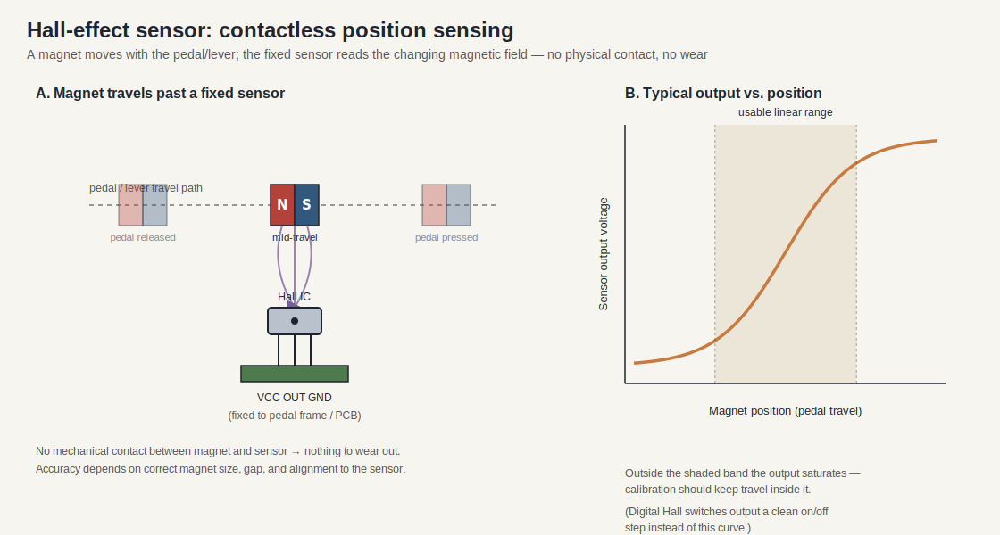
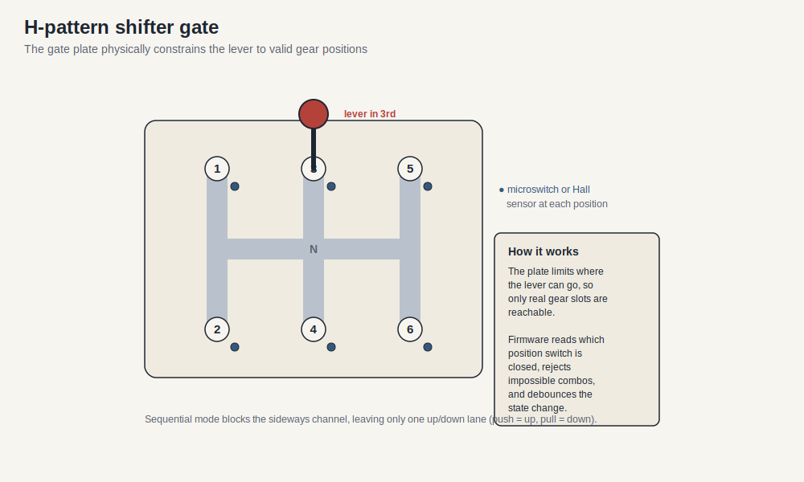

# Sim Racing Add-Ons: Kiến trúc Shifters và Handbrakes

> Ngày nghiên cứu: 2026-07-02
> Mô hình bằng chứng: tiêu chuẩn công cộng, hướng dẫn sử dụng / hỗ trợ của nhà sản xuất và các dự án cộng đồng. Các dự án cộng đồng là bằng chứng thực hiện, không phải thông số kỹ thuật của nhà cung cấp chính thức.
> Tài liệu liên quan: [sim_racing_research.md](./sim_racing_research.md), [wheel_base.md](./wheel_base.md), [pedals.md](./pedals.md), [repos.md](./repos.md).

## 1. Giới thiệu và Phạm vi

Tài liệu này xác định các cơ chế phần cứng và kiến trúc phần mềm nhúng cần thiết cho các tiện ích đua xe mô phỏng hiện đại, tập trung cụ thể vào phanh tay và bộ chuyển đổi chế độ kép (mẫu H và tuần tự). Nó cung cấp bối cảnh và ràng buộc cần thiết cho các kỹ sư tham gia vào lĩnh vực phần cứng đua xe mô phỏng với nền tảng hiện có trong các hệ thống nhúng.

Phạm vi bao gồm các mô hình cảm biến vật lý (tế bào tải so với hiệu ứng Hall), hoạt động cơ học, lựa chọn vi điều khiển và triển khai firmware USB Human Interface Device (HID).

---

## 2. Kiến trúc và cơ chế phần cứng

Phần này phác thảo các cơ sở vật lý và điện của các tiện ích đua xe mô phỏng trước khi chi tiết hóa việc triển khai phần mềm. Hiểu được sự tương tác cơ học là rất quan trọng, vì các thiết bị đua xe mô phỏng phải sao chép phản hồi xúc giác của các thành phần ô tô thực.

### 2.1 Mô hình cảm biến phanh tay

Phanh tay đua Sim dựa trên hai kiến trúc cảm biến chính để nắm bắt đầu vào của người dùng: dựa trên lực (tế bào tải) và dựa trên vị trí (hiệu ứng Hall). Phần cứng sẽ hỗ trợ loại cảm biến được chọn và giao diện nó với bộ chuyển đổi tương tự sang kỹ thuật số (ADC) của vi điều khiển.

| Loại cảm biến | Nguyên lý hoạt động | Đặc trưng |
|-------------|---------------------|----------------|
** Load Cell ** | Đo lực vật lý (áp suất) bằng cách sử dụng máy đo căng thẳng. | Gương hệ thống phanh thủy lực; dựa vào bộ nhớ cơ bắp. |
** Hiệu ứng Hall ** | Đo độ dịch chuyển vật lý (du hành thông minh) bằng từ thông. | Không tiếp xúc, độ bền cao, độ phức tạp thấp hơn. |

Hai mô hình khác nhau về những gì họ đo lường về mặt vật lý. Một tế bào tải cảm nhận * lực * thông qua một cây cầu đo căng thẳng (hiển thị bên dưới bên trái); một cảm biến Hall cảm nhận * vị trí * thông qua một nam châm di chuyển (bên dưới bên phải). Một phanh tay dựa trên lực thưởng cho bộ nhớ cơ bắp theo cách mà một đòn bẩy thủy lực thực sự làm; một vị trí dựa trên đơn giản hơn và hao mòn ít hơn.

! [Tải đồng hồ đo biến dạng tế bào trong cầu Wheatstone] (./load_cell_wheatstone_bridge.svg)



**Hình 2-1: Dòng dữ liệu cảm biến phanh tay **

```nàng tiên cá
đồ thị TD
Đòn bẩy [Đòn bẩy phanh tay] -> | Áp dụng lực | Elastomer [Spring / Elastomer Stack]
Elastomer -> LoadCell [Cảm biến tế bào tải]
LoadCell -->|Microvolt Signal| Amp[Bộ khuếch đại dụng cụ]
Amp -> |0-3.3V Tương tự | MCU [Microcontroller ADC]
  
Lever2[Đòn bẩy phanh tay] -->|Thay đổi vị trí| Magnet[Nam châm vĩnh cửu]
Magnet -->|Varying Magnetic Flux| Hall[Cảm biến hiệu ứng Hall]
Hội trường -> |0-3.3V Tương tự | MCU
```

> **Tin tức:**
> Bởi vì các tế bào tải xuất tín hiệu trong phạm vi microvolt, chúng yêu cầu bộ khuếch đại chuyên dụng (ví dụ: HX711 hoặc INA333) trước khi vi điều khiển có thể đọc tín hiệu. Cảm biến hiệu ứng Hall xuất ra điện áp tương tự sẵn sàng để đọc.

### 2.2 Cơ chế Shifter chế độ kép

Bộ chuyển đổi chế độ kép cung cấp cả mô hình H truyền thống và chuyển đổi tuần tự trong một đơn vị duy nhất. Kiến trúc cơ học sử dụng các con đường bị hạn chế và cơ chế khóa vật lý để định tuyến trục shifter.



Trong chế độ H-mẫu, một tấm cổng gia công giới hạn nơi cần gạt có thể di chuyển, vì vậy chỉ có thể truy cập các vị trí bánh răng thực; cảm biến microswitch hoặc Hall ở mỗi vị trí báo cáo thiết bị đã chọn và phần sụn từ chối các trạng thái không thể. Chuyển sang chế độ tuần tự chặn kênh ngang, để lại một làn đường lên / xuống duy nhất (đẩy = một hướng, kéo = hướng khác).

Phần cứng cần số nên kết hợp lò xo hạng nặng và bộ phận nạp lò xo để cung cấp khả năng chống xúc giác và "nhấp" khác biệt khi tham gia bánh răng.

**Hình 2-2: Kiến trúc Shifter chế độ kép **

```nàng tiên cá
đồ thị LR
Trục [Trục Shifter] -> Chế độ H-Pattern | Cổng [Tấm cổng H-Pattern]
Trục -> |Chế độ tuần tự | Khóa [Cơ chế khóa bên]
Cổng -> SwitchesH [Vị trí Microswitches]
Khóa -> SwitchesS [Microswitches tuần tự]
```

Để chuyển đổi giữa các chế độ, thiết kế có thể sử dụng một công tắc vật lý hoặc tấm có thể tháo rời hạn chế chuyển động bên (trái-phải) của trục, giới hạn nó thành một trục tiến-hậu duy nhất.

### 2.3 Đường dẫn kết nối Fanatec

Hướng dẫn công khai hiện tại tách việc sử dụng bảng điều khiển và máy tính độc lập:

| Use Case | Supported Path | Constraint |
|---|---|---|
| Bộ chuyển đổi / phanh tay của bảng điều khiển | Cơ sở bánh xe ngoại vi đến Fanatec; cơ sở đến bảng điều khiển | Bộ điều hợp USB độc lập không phải là đường dẫn bảng điều khiển. Giấy phép nền tảng vẫn đến từ bánh xe / trung tâm cho Xbox hoặc cơ sở cho PlayStation. |
| PC thông qua cơ sở bánh xe | Ngoại vi đến cơ sở tương thích; cơ sở với PC | Sử dụng cơ sở làm bộ tổng hợp đầu vào. |
| Máy tính cá nhân độc lập | Thiết bị ngoại vi thông qua bộ chuyển đổi USB ClubSport được cấu hình chính xác | Firmware / chế độ bộ chuyển đổi phải phù hợp với bộ chuyển đổi, phanh tay hoặc bàn đạp. |
| ClubSport Shifter Mẫu H hoặc SQ | Shifter 1 | Hướng dẫn hiện tại gán cả mẫu H và chế độ tuần tự cho Shifter 1. |
| Sequential / paddles tĩnh | Shifter 2 | Shifter 2 hỗ trợ đầu vào tuần tự, bao gồm cả paddles tĩnh được hỗ trợ. |

Hình dạng kết nối một mình không chứng minh khả năng tương thích điện hoặc firmware. Kiểm tra chính xác chế độ ngoại vi, cơ sở, cáp và bộ chuyển đổi.

---

## 3. Kiến trúc Firmware

Phần này mô tả phần mềm nhúng chịu trách nhiệm chuyển đổi trạng thái phần cứng vật lý thành báo cáo USB HID tiêu chuẩn. Phần sụn hoạt động như cầu nối giữa đầu vào analog / kỹ thuật số và PC chủ.

### 3.1 Yêu cầu về vi điều khiển

Thiết bị sẽ sử dụng bộ vi điều khiển có hỗ trợ USB gốc để cho phép chức năng cắm và chạy mà không cần chip chuyển đổi USB nối tiếp thứ cấp. Các lựa chọn phù hợp bao gồm kiến trúc ATmega32U4, RP2040 hoặc STM32.

### 3.2 Vòng lặp thực hiện chính

Firmware sẽ thực hiện một vòng lặp thực thi không chặn để đảm bảo độ trễ thấp. Tỷ lệ bỏ phiếu tiêu chuẩn cho các thiết bị ngoại vi đua xe sim phải ít nhất 1000 Hz (1 ms).

**Hình 3-2: Firmware Execution Loop**

```nàng tiên cá
trình tựSơ đồ
tham gia CTNH như cảm biến phần cứng
tham gia MCU như MCU Firmware
người tham gia USB như ngăn xếp USB
PC tham gia với tư cách là PC chủ
    
vòng lặp 1000 Hz Không chặn
HW->>MCU: Đọc GPIO / ADC
MCU->>MCU: Áp dụng nợ & Bộ lọc
MCU->>USB: Bản đồ để HID giá trị hợp lý
USB->> PC: Truyền báo cáo USB HID
kết thúc
```

### 3.3 Trình tự khởi tạo

Trình tự khởi tạo ra lệnh cho thiết bị khởi động trước khi vào vòng lặp chính.

| Bước | Hành động | Ghi chú / ràng buộc |
|------|--------|--------------------|
Phần sụn sẽ khởi tạo ngăn xếp USB HID. Thiết bị sẽ được xác định là Gamepad hoặc Joystick.
| 2 | Firmware phải cấu hình các chân GPIO. | Các chân đầu vào phải sử dụng các điện trở kéo lên bên trong nếu có. |
| 3 | Firmware sẽ khởi tạo thiết bị ngoại vi ADC. | Đặt độ phân giải để phù hợp với mô tả báo cáo HID (ví dụ: 10-bit hoặc 12-bit). |

---

## 4. Xử lý tín hiệu và xử lý lỗi

Phần này bao gồm việc xử lý áp dụng cho dữ liệu cảm biến thô để đảm bảo đầu vào nhất quán và đáng tin cậy cho PC chủ, giảm thiểu dung sai cơ học và tiếng ồn điện.

Firmware sẽ ánh xạ các đầu vào analog thô đến các giới hạn logic được xác định trong bộ mô tả báo cáo USB.

| Phần tử giao diện | Hướng | Kiểu | Mô tả |
|-------------------|-----------|------|-------------|
| `raw_adc_val` | Đầu vào | uint16 | Đo thô từ amp tế bào tải hoặc cảm biến Hall |
| `switch_state` | Input | boolean | Raw digital read from shifter microswitch |
| `hid_axis_out` | Đầu ra | uint8 / uint16 | Đầu ra mở rộng để truyền USB |

Hệ thống sẽ xử lý các trường hợp cạnh và nhiễu tín hiệu theo logic sau:

| Điều kiện | Kích hoạt | Hành động |
|-----------|---------|--------|
| `raw_adc_val <DEADZONE_MIN` | Trạng thái nghỉ đòn bẩy / chơi cơ khí nhẹ | Firmware sẽ xuất `0` (giá trị trục tối thiểu). |
| `raw_adc_val > DEADZONE_MAX` | Áp dụng lực vật lý tối đa | Firmware sẽ xuất ra giá trị trục tối đa hợp lý. |
| `switch_state` changes | Shifter gear engaged | Firmware sẽ áp dụng bộ đếm thời gian gỡ lỗi phần mềm (ví dụ: 20ms) trước khi xác nhận thay đổi trạng thái. |

---

## 5. Phân tích kho

Phần này khám phá cách các dự án cộng đồng giao tiếp với các cơ chế shifter tiêu chuẩn.

# 5.1 `StuyoP / Universal-Shifter-Interface-for-Fanatec`

| Khía cạnh | Tìm kiếm |
|---|---|
| Goal | Kết nối bất kỳ bộ chuyển đổi dựa trên công tắc (mẫu H hoặc tuần tự) thông qua RJ12 |
| Phương pháp | Mạng lưới điện trở và ánh xạ điện áp tương tự để bắt chước phần cứng gốc |
| Bài học sản phẩm | Giao diện Shifter dựa trên cửa sổ điện áp tương tự cụ thể hoặc logic ma trận hơn là các giao thức bus kỹ thuật số. |

## 6. Tài liệu tham khảo

### 6.1 Nguồn chính thức và tiêu chuẩn

- [Công cụ và thông số kỹ thuật USB-IF HID] (https://www.usb.org/hid) - tham khảo cho các báo cáo cần điều khiển shifter / handbrake HID độc lập.
- [Hướng dẫn sử dụng Fanatec Podium DD1] (https://assets.fanatec.com/fanatec-pwa/image/upload/downloads-prod/pdfs/P-WB-DD1-Manual-EN_web.pdf) - cập nhật cơ sở công cộng, hiệu chuẩn shifter, khởi động và ngữ cảnh phụ kiện.
- [Hướng dẫn cổng shifter Fanatec] (https://help.fanatec.com/hc/en-us/articles/45597346898449-Which-shifter-port-should-I-use-on-my-Fanatec-wheel-base) - Shifter 1 H-pattern / SQ và Shifter 2 sử dụng tuần tự / tĩnh.
- [Fanatec ClubSport USB Adapter khắc phục sự cố] (https://help.fanatec.com/hc/en-us/articles/45603844706705-My-connected-product-isn-t-working-when-using-the-ClubSport-USB-Adapter) - chế độ bộ điều hợp dành riêng cho sản phẩm và đường dẫn kết nối PC.

### 6.2 Công cụ công cộng và nguồn cộng đồng

- [StuyoP/Universal-Shifter-Interface-for-Fanatec] (https://github.com/StuyoP/Universal-Shifter-Interface-for-Fanatec) - chuyển đổi dựa trên H-pattern / giao diện shifter tuần tự cho cơ sở bánh xe Fanatec.
- [FendtXerion3800/Fanatec-Pinout] (https://github.com/FendtXerion3800/Fanatec-Pinout) - kết nối cộng đồng / khám phá pinout; xác minh trước khi sử dụng phần cứng.
- [SimHub wiki] (https://github.com/SHWotever/SimHub/wiki) - hộp nút, thiết bị nối tiếp và các mẫu hỗ trợ từ xa.
- [Đăng ký nguồn hệ sinh thái Fanatec] (./references.md) - ngữ cảnh hướng dẫn người mua và kiểm tra chéo tương thích chính thức.

## 7. Câu hỏi chưa được giải quyết

- ** Tích hợp hệ sinh thái: ** Làm thế nào để các hệ sinh thái độc quyền (ví dụ: Fanatec, Moza) xử lý việc liệt kê và liên lạc thiết bị thông qua các kết nối RJ12 / CAN-bus độc quyền với chiều dài cơ sở, thay vì USB độc lập trực tiếp?
- ** Trôi nhiệt: ** Các yêu cầu bù trôi nhiệt cụ thể cho các bộ khuếch đại tế bào tải (ví dụ: HX711) trong các phiên đua độ bền sim kéo dài, nhiều giờ là gì?
- ** Tự động phát hiện: ** Phần mềm chuyển đổi chế độ kép có thể tự động phát hiện sự chuyển đổi giữa mô hình H và chế độ tuần tự mà không yêu cầu người dùng kích hoạt thủ công công tắc chuyển đổi hoặc cờ phần mềm không?

---
*Kết thúc tài liệu*
