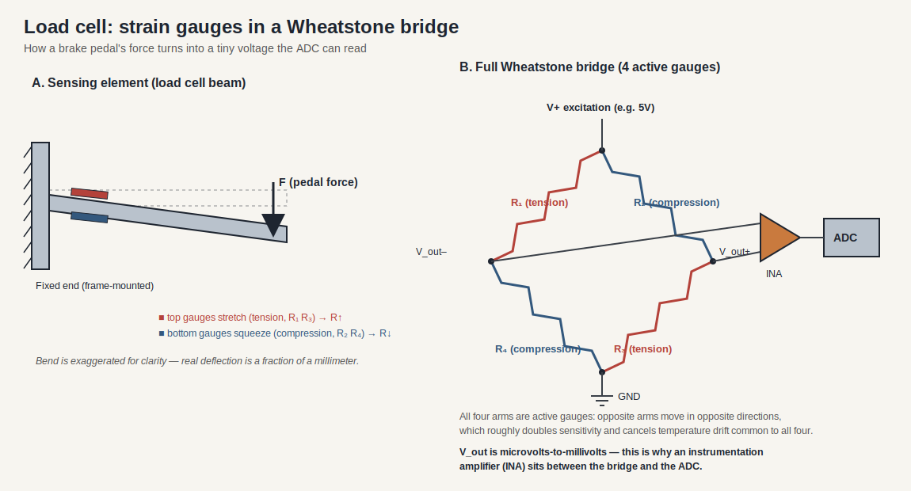
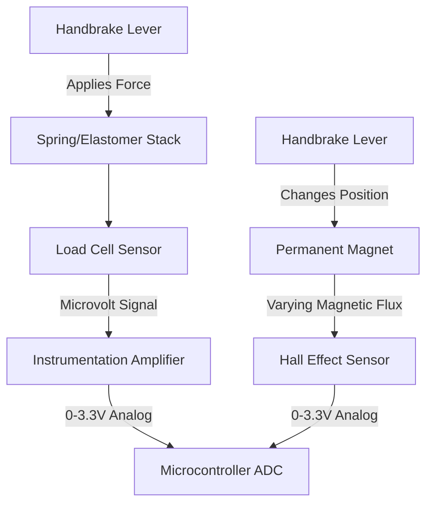
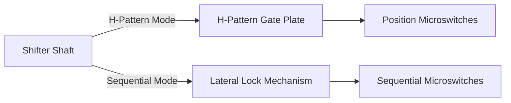
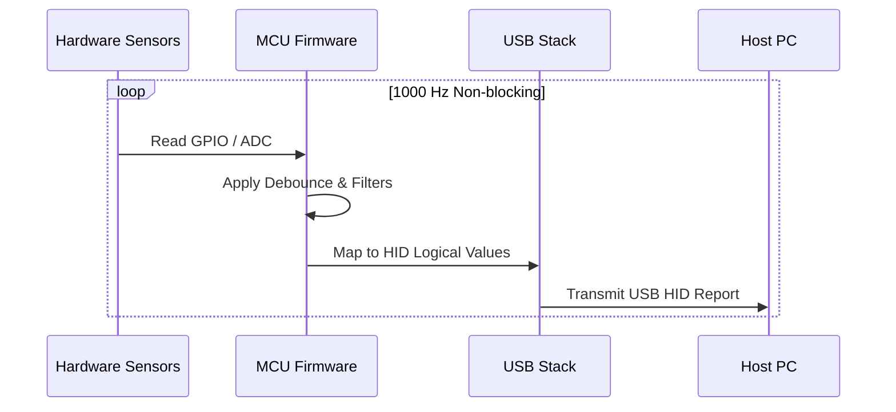

# Sim Racing Add-Ons: Kiến trúc Shifters và Handbrakes

> Ngày nghiên cứu: 2026-07-02
> Mô hình bằng chứng: tiêu chuẩn công cộng, hướng dẫn sử dụng/hỗ trợ của nhà sản xuất và các dự án cộng đồng. Các dự án cộng đồng là bằng chứng thực hiện, không phải thông số kỹ thuật của nhà cung cấp chính thức.
> Tài liệu liên quan: [sim_racing_research.md](./sim_racing_research.md), [wheel_base.md](./wheel_base.md), [pedals.md](./pedals.md), [repos.md](./repos.md).

## 1. Giới thiệu và Phạm vi

Tài liệu này xác định các cơ chế phần cứng và kiến trúc phần mềm nhúng (embedded software) cần thiết cho các tiện ích mở rộng đua xe mô phỏng hiện đại, tập trung cụ thể vào phanh tay (handbrake) và shifter chế độ kép (H-pattern và tuần tự). Nó cung cấp bối cảnh và ràng buộc cần thiết cho các kỹ sư tham gia vào lĩnh vực phần cứng đua xe mô phỏng với nền tảng hiện có trong các hệ thống nhúng.

Phạm vi bao gồm các mô hình cảm biến vật lý (load cell so với hiệu ứng Hall), hoạt động cơ học, lựa chọn vi điều khiển và triển khai firmware USB Human Interface Device (HID).

---

## 2. Kiến trúc Phần cứng và Cơ chế

Phần này phác thảo các nền tảng vật lý và điện của các tiện ích đua xe mô phỏng trước khi đi vào chi tiết triển khai phần mềm. Hiểu được sự tương tác cơ học là rất quan trọng, vì các thiết bị đua xe mô phỏng phải sao chép phản hồi xúc giác của các thành phần ô tô thực.

### 2.1 Các mô hình Cảm biến Phanh tay

Phanh tay sim racing dựa trên hai kiến trúc cảm biến chính để nắm bắt đầu vào của người dùng: dựa trên lực (load cell) và dựa trên vị trí (hiệu ứng Hall). Phần cứng **phải** hỗ trợ loại cảm biến được chọn và giao tiếp nó với bộ chuyển đổi analog-to-digital (ADC) của vi điều khiển.

| Sensor Type | Operating Principle | Characteristic |
|-------------|---------------------|----------------|
| **Load Cell** | Đo lực vật lý (áp suất) bằng cách sử dụng strain gauge. | Mô phỏng hệ thống phanh thủy lực; dựa vào trí nhớ cơ bắp. |
| **Hall Effect** | Đo độ dịch chuyển vật lý (hành trình đòn bẩy) bằng từ thông. | Không tiếp xúc, độ bền cao, độ phức tạp thấp hơn. |

Hai mô hình khác nhau về những gì chúng đo lường về mặt vật lý. Một load cell cảm nhận *lực* thông qua một cầu strain-gauge (hiển thị bên dưới bên trái); một cảm biến Hall cảm nhận *vị trí* thông qua một nam châm di chuyển (bên dưới bên phải). Một phanh tay dựa trên lực thưởng cho trí nhớ cơ bắp theo cách mà một đòn bẩy thủy lực thực sự làm; một thiết kế dựa trên vị trí thì đơn giản hơn và ít hao mòn hơn.

**Hình 2-1: Luồng Dữ liệu Cảm biến Phanh tay**

> **Thông tin bổ sung:**
> Bởi vì các load cell xuất tín hiệu trong phạm vi microvolt, chúng yêu cầu bộ khuếch đại chuyên dụng (ví dụ: HX711 hoặc INA333) trước khi vi điều khiển có thể đọc tín hiệu. Cảm biến hiệu ứng Hall xuất ra điện áp analog sẵn sàng để đọc.

### 2.2 Cơ chế Shifter Chế độ Kép

Shifter chế độ kép cung cấp cả hai kiểu sang số H-pattern truyền thống và sang số tuần tự (sequential) trong một thiết bị duy nhất. Kiến trúc cơ học sử dụng các đường rãnh bị giới hạn và cơ chế khóa vật lý để định tuyến trục shifter.

Ở chế độ H-pattern, một tấm cổng được gia công giới hạn nơi đòn bẩy có thể di chuyển, vì vậy chỉ có thể tới được các vị trí số thực; một microswitch hoặc cảm biến Hall ở mỗi vị trí sẽ báo cáo số đã chọn, và firmware từ chối các trạng thái không thể xảy ra. Chuyển sang chế độ tuần tự sẽ chặn kênh di chuyển ngang, để lại một làn đường lên/xuống duy nhất (đẩy = một hướng, kéo = hướng kia).

Phần cứng shifter nên kết hợp các lò xo chịu lực cao và các chốt chịu lò xo (spring-loaded detents) để cung cấp lực cản xúc giác và một tiếng "click" rõ rệt khi vào số.

**Hình 2-2: Kiến trúc Shifter Chế độ Kép**

Để chuyển đổi giữa các chế độ, thiết kế có thể sử dụng một công tắc vật lý hoặc một tấm chắn có thể tháo rời để hạn chế chuyển động ngang (trái-phải) của trục, giới hạn nó thành một trục tiến-lùi duy nhất.

### 2.3 Các Đường dẫn Kết nối Fanatec

Hướng dẫn công khai hiện tại phân định rạch ròi việc sử dụng với console và với PC độc lập:

| Use Case | Supported Path | Constraint |
|---|---|---|
| Shifter/handbrake console | Thiết bị ngoại vi kết nối vào wheelbase Fanatec; từ wheelbase vào console | Adapter USB độc lập không phải là đường dẫn console. Giấy phép nền tảng (Platform licensing) vẫn đến từ vô lăng/hub cho Xbox hoặc wheelbase cho PlayStation. |
| PC thông qua wheelbase | Thiết bị ngoại vi kết nối vào wheelbase tương thích; từ wheelbase vào PC | Sử dụng wheelbase làm bộ tổng hợp đầu vào (input aggregator). |
| PC độc lập | Thiết bị ngoại vi thông qua ClubSport USB Adapter được cấu hình chính xác | Firmware/chế độ của adapter phải khớp với shifter, phanh tay, hoặc pedals. |
| ClubSport Shifter H-pattern hoặc SQ | Shifter 1 | Hướng dẫn hiện tại gán cả chế độ H-pattern và tuần tự cho cổng Shifter 1. |
| Sequential/static paddles | Shifter 2 | Cổng Shifter 2 hỗ trợ đầu vào tuần tự, bao gồm các lẫy số tĩnh (static paddles) được hỗ trợ. |

Chỉ hình dạng đầu nối thôi không chứng minh được sự tương thích về điện hay firmware. Phải kiểm tra chính xác thiết bị ngoại vi, wheelbase, cáp, và chế độ của adapter.

---

## 3. Kiến trúc Firmware

Phần này mô tả phần mềm nhúng chịu trách nhiệm chuyển đổi trạng thái phần cứng vật lý thành các báo cáo USB HID tiêu chuẩn. Firmware đóng vai trò là cầu nối giữa các đầu vào analog/digital và PC host.

### 3.1 Yêu cầu về Vi điều khiển

Thiết bị **phải** sử dụng vi điều khiển có hỗ trợ USB gốc để cho phép chức năng plug-and-play mà không yêu cầu các chip chuyển đổi USB-to-serial phụ. Các lựa chọn phù hợp bao gồm kiến trúc ATmega32U4, RP2040, hoặc STM32.

### 3.2 Vòng lặp Thực thi Chính

Firmware **phải** triển khai một vòng lặp thực thi không chặn (non-blocking) để đảm bảo độ trễ thấp. Tốc độ lấy mẫu (polling rate) tiêu chuẩn cho các thiết bị đua xe sim nên đạt ít nhất 1000 Hz (1 ms).

**Hình 3-2: Vòng lặp Thực thi Firmware**

### 3.3 Trình tự Khởi tạo

Trình tự khởi tạo quy định quá trình khởi động thiết bị trước khi vào vòng lặp chính.

| Step | Action | Notes / Constraint |
|------|--------|--------------------|
| 1 | Firmware **phải** khởi tạo USB HID stack. | Thiết bị **phải** tự nhận diện là Gamepad hoặc Joystick. |
| 2 | Firmware **phải** cấu hình các chân GPIO. | Các chân đầu vào **phải** sử dụng điện trở kéo lên nội bộ (internal pull-up resistors) nếu có. |
| 3 | Firmware **phải** khởi tạo ngoại vi ADC. | Đặt độ phân giải khớp với mô tả báo cáo HID (ví dụ: 10-bit hoặc 12-bit). |

---

## 4. Xử lý Tín hiệu và Xử lý Lỗi

Phần này bao gồm quá trình xử lý áp dụng cho dữ liệu cảm biến thô để đảm bảo đầu vào nhất quán và đáng tin cậy tới PC host, giảm thiểu sự ảnh hưởng của sai số cơ học và nhiễu điện.

Firmware **phải** ánh xạ các đầu vào analog thô thành các giới hạn logic được định nghĩa trong mô tả báo cáo USB.

| Interface Element | Direction | Type | Description |
|-------------------|-----------|------|-------------|
| `raw_adc_val` | Input | uint16 | Đo lường thô từ bộ khuếch đại load cell hoặc cảm biến Hall |
| `switch_state` | Input | boolean | Giá trị digital thô từ microswitch của shifter |
| `hid_axis_out` | Output | uint8 / uint16 | Giá trị đầu ra đã được scale để truyền qua USB |

Hệ thống **phải** xử lý các trường hợp ngoại lệ (edge cases) và nhiễu tín hiệu theo logic sau:

| Condition | Trigger | Action |
|-----------|---------|--------|
| `raw_adc_val < DEADZONE_MIN` | Trạng thái nghỉ của đòn bẩy / độ rơ cơ học nhẹ | Firmware **phải** xuất giá trị `0` (giá trị trục tối thiểu). |
| `raw_adc_val > DEADZONE_MAX` | Lực vật lý tối đa được áp dụng | Firmware **phải** xuất giá trị trục tối đa logic. |
| `switch_state` changes | Gài số shifter | Firmware **phải** áp dụng một bộ định thời chống dội (debounce timer) bằng phần mềm (ví dụ: 20ms) trước khi xác nhận sự thay đổi trạng thái. |

---

## 5. Phân tích Repository

Phần này khám phá cách các dự án cộng đồng giao tiếp với các cơ chế shifter tiêu chuẩn.

### 5.1 `StuyoP/Universal-Shifter-Interface-for-Fanatec`

| Aspect | Finding |
|---|---|
| Mục tiêu | Kết nối bất kỳ shifter dựa trên công tắc nào (H-pattern hoặc tuần tự) thông qua RJ12 |
| Phương pháp | Mạng điện trở và ánh xạ điện áp analog để bắt chước phần cứng gốc |
| Bài học sản phẩm | Giao diện Shifter dựa trên việc chia mức điện áp analog (analog voltage windowing) cụ thể hoặc logic ma trận thay vì các giao thức bus digital. |

## 6. Tài liệu Tham khảo

### 6.1 Các nguồn Chính thức và Tiêu chuẩn

- [Thông số kỹ thuật và công cụ USB-IF HID](https://www.usb.org/hid) — tham khảo cho các báo cáo HID joystick độc lập của shifter/handbrake.
- [Hướng dẫn sử dụng Fanatec Podium DD1](https://assets.fanatec.com/fanatec-pwa/image/upload/downloads-prod/pdfs/P-WB-DD1-Manual-EN_web.pdf) — cập nhật base công khai, hiệu chuẩn shifter, khởi động, và ngữ cảnh phụ kiện.
- [Hướng dẫn cổng shifter Fanatec](https://help.fanatec.com/hc/en-us/articles/45597346898449-Which-shifter-port-should-I-use-on-my-Fanatec-wheel-base) — Cách dùng cổng Shifter 1 H-pattern/SQ và cổng Shifter 2 cho chế độ tuần tự/lẫy số tĩnh (static-paddle).
- [Khắc phục sự cố Fanatec ClubSport USB Adapter](https://help.fanatec.com/hc/en-us/articles/45603844706705-My-connected-product-isn-t-working-when-using-the-ClubSport-USB-Adapter) — các chế độ adapter đặc thù của sản phẩm và đường dẫn kết nối PC.

### 6.2 Công cụ Công cộng và Các nguồn Cộng đồng

- [StuyoP/Universal-Shifter-Interface-for-Fanatec](https://github.com/StuyoP/Universal-Shifter-Interface-for-Fanatec) — giao diện shifter H-pattern/tuần tự dựa trên công tắc cho các wheelbase Fanatec.
- [FendtXerion3800/Fanatec-Pinout](https://github.com/FendtXerion3800/Fanatec-Pinout) — khám phá pinout/cổng kết nối từ cộng đồng; hãy xác minh lại trước khi dùng với phần cứng.
- [SimHub wiki](https://github.com/SHWotever/SimHub/wiki) — hộp nút, thiết bị nối tiếp (serial devices), và các pattern hỗ trợ telemetry.
- [Đăng ký nguồn hệ sinh thái Fanatec](./references.md) — bối cảnh hướng dẫn người mua và đối chiếu tính tương thích chính thức.

## 7. Danh sách Câu hỏi (Đã giải quyết và Đang mở)

Đã kiểm tra vào ngày 2026-07-05.

### 7.1 Đã giải quyết

- **Làm cách nào các hệ sinh thái độc quyền xử lý việc nhận diện/giao tiếp thiết bị qua RJ12/CAN với wheelbase thay vì USB trực tiếp?**
  **Bằng chứng cộng đồng + suy luận kỹ thuật.** Wheelbase hoạt động như bộ tổng hợp (aggregator): thiết bị ngoại vi cung cấp tín hiệu analog/digital hoặc liên kết nối tiếp đơn giản qua cổng trên wheelbase, và wheelbase kết hợp chúng vào báo cáo HID của chính nó tới host (vì vậy host chỉ thấy một thiết bị duy nhất). Ví dụ được ghi nhận: bộ giả lập pedal của GeekyDeaks chuyển tiếp pedal USB vào **RJ12 UART** của base; giao diện shifter của StuyoP trình bày trạng thái công tắc qua cổng shifter. Ở bên trong, các nhà cung cấp cũng dùng **CAN** cho các node phân tán (wiki FendtXerion Fanatec-Pinout bao gồm một mục "Data and CAN"). Tóm lại: trên một thiết kế theo kiểu base-proxy, việc nhận diện thiết bị (enumeration) là công việc của wheelbase, không phải của phụ kiện; phụ kiện chỉ cung cấp các tín hiệu được định dạng chuẩn.
- **Liệu firmware của shifter chế độ kép có thể tự động nhận diện H-pattern hay tuần tự một cách đáng tin cậy mà không cần chuyển đổi thủ công?**
  **Suy luận kỹ thuật: có cho trường hợp phát hiện thay đổi phần cứng, không cho việc suy diễn chỉ từ chuyển động.** Phương pháp tối ưu là dùng **nhận dạng vật lý/điện** — một chân phát hiện hoặc resistor ID trên cổng shifter mà giá trị sẽ thay đổi tùy theo chế độ được lắp đặt — mà firmware sẽ đọc một cách tất định. Cố gắng *suy diễn* chế độ từ kiểu di chuyển của đòn bẩy là không đáng tin cậy (một cú đẩy tuần tự có thể giống với việc di chuyển cổng chữ H) và có thể gây ra hiện tượng sai số, do đó không nên coi đây là cơ chế chính. Khuyến nghị: nhận diện bằng chân tín hiệu là chính, dùng software override là phụ.

### 7.2 Đang mở — dành cho các nhà phát triển tự điều tra

- **Bù trôi nhiệt (Thermal drift compensation) cho các bộ khuếch đại load-cell (ví dụ: HX711) qua các phiên đua sức bền kéo dài nhiều giờ.**
  *Cách thức (hướng dẫn kỹ thuật + đo lường):* các cầu strain-gauge và bộ khuếch đại của chúng bị trôi theo nhiệt độ (cả offset và độ lợi gain). Các biện pháp giảm thiểu cần đánh giá: sử dụng cầu ratiometric (phần lớn độ trôi sẽ triệt tiêu), cho phép thời gian làm nóng (warm-up), áp dụng tính năng **auto-tare/auto-zero** định kỳ khi pedal được xác định là đang nhả, và biểu diễn (characterize) hệ số nhiệt độ của bộ khuếch đại cụ thể trên bàn thí nghiệm qua dải nhiệt độ thực tế. Mức độ rò rỉ còn lại có thể chấp nhận được là quyết định của sản phẩm — hãy đo Analog Front End (AFE) mà bạn chọn trong một quá trình chạy nhiều giờ và thiết lập chính sách tự động bù trừ từ dữ liệu thu được thay vì giả định một con số cố định.

---
*End of Document*
