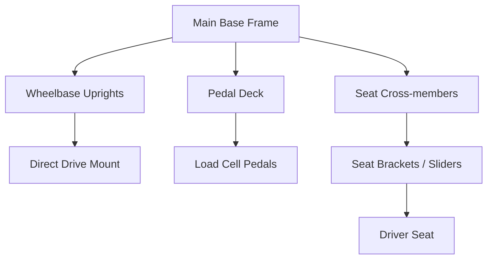
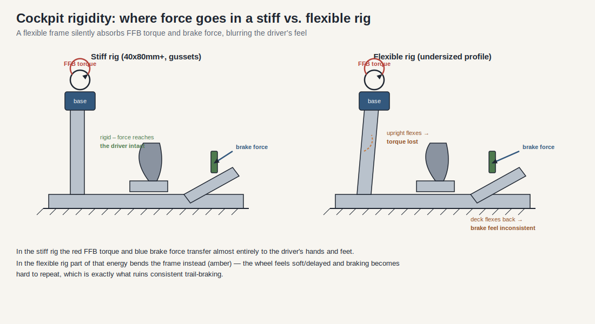

# Buồng lái Sim Racing: Kiến trúc Cơ khí & Độ cứng

> Ngày nghiên cứu: 2026-07-02
> Mô hình bằng chứng: thông tin sản phẩm/hướng dẫn sử dụng công khai cộng với suy luận kỹ thuật. Các khuyến nghị về độ cứng của buồng lái là hướng dẫn thiết kế, không phải là một yêu cầu bắt buộc chung từ nhà sản xuất.
> Tài liệu liên quan: [sim_racing_research.md](./sim_racing_research.md), [wheel_base.md](./wheel_base.md), [pedals.md](./pedals.md).

## 1. Giới thiệu

Buồng lái (cockpit) sim racing đóng vai trò là mặt phẳng nền tảng cơ học cho tất cả các đầu vào của người dùng và đầu ra của hệ thống. Đối với một kỹ sư hệ thống nhúng, buồng lái có thể được xem như bộ khung gầm cấu trúc chứa các bộ truyền động (actuators) chính (Direct Drive wheelbases) và cảm biến (bàn đạp Load Cell). Bất kỳ sự uốn cong (flex) cơ học nào trong bộ khung này cũng hoạt động như một bộ lọc thông thấp (low-pass filter) ngoài ý muốn đối với các tín hiệu Force Feedback (FFB) và gây nhiễu cho các thông số áp lực phanh. Tài liệu này nêu chi tiết các tiêu chuẩn kiến trúc, yêu cầu độ cứng và phương pháp tích hợp cho các buồng lái sim racing làm bằng nhôm định hình (8020).

## 2. Tổng quan về Kiến trúc Hệ thống

Các hệ thống sim racing có độ trung thực cao hiện đại (modern high-fidelity sim racing rigs) phụ thuộc vào các thanh nhôm định hình có khe chữ T (T-slot extruded aluminum profiles). Phương pháp này cung cấp khả năng điều chỉnh vô hạn và tỷ lệ độ cứng trên trọng lượng (stiffness-to-weight ratio) cực lớn. Kiến trúc này cô lập các điểm chịu ứng suất khác nhau bằng cách phân bổ chúng trên một khung cơ sở cứng cáp.

**Hình 2-1: Cấu trúc Hệ thống Thành phần Buồng lái Tiêu chuẩn**

Khung cơ sở (base frame) là vòng lặp cấu trúc nền tảng. Tất cả các cấu trúc phụ (thanh đứng, mặt bàn, và thanh ngang) đều phân nhánh từ khung cơ sở này để hỗ trợ người lái và phần cứng.

## 3. Độ cứng Cấu trúc và Độ trung thực Tín hiệu

Độ cong cấu trúc (structural flex) tạo ra những tổn hao ký sinh cho hệ thống. Hiểu được cách độ cong ảnh hưởng đến cả độ trung thực của đầu ra và tính nhất quán của đầu vào là rất quan trọng để thiết kế một hệ thống hiệu suất cao.

Hình minh họa làm cho ý tưởng cốt lõi trở nên cụ thể: trong một hệ thống cứng cáp, lực xoắn FFB của wheelbase và lực phanh của người lái được truyền gần như hoàn toàn đến tay và chân. Trong một hệ thống thiếu độ cứng, một phần năng lượng đó sẽ làm cong khung — thanh đứng bị nghiêng dưới lực xoắn và mặt bàn đạp lùi lại khi phanh. Phần năng lượng bị hấp thụ đó chính xác là những chi tiết mà người lái bị mất đi: vô lăng có cảm giác mềm mại hoặc bị trễ, và cảm giác phanh trở nên khó lặp lại chuẩn xác.

### 3.1. Động lực học Mô-men xoắn Direct Drive

Các wheelbase Direct Drive (DD) kết nối trực tiếp một động cơ servo lớn vào vô lăng, có khả năng tạo ra các xung mô-men xoắn đột ngột vượt quá 20Nm. Những động cơ này hoạt động với băng thông cao để truyền tải chi tiết kết cấu mặt đường và phản hồi góc trượt (slip angle feedback).

Nếu các thanh đứng của wheelbase bị cong, cấu trúc cơ học sẽ hấp thụ các xung động FFB tần số cao.

* Các thanh đứng của wheelbase **phải** được thi công từ thanh định hình không nhỏ hơn 40x80mm để chống lại sự uốn cong do xoắn (torsional flex).
* Các giá đỡ gắn kết (mounting brackets) nối các thanh đứng với khung cơ sở **nên** sử dụng các ke góc chịu lực (heavy-duty corner gussets) và tấm ốp kẹp (sandwich plates) để loại bỏ độ rơ.
* Giá treo trụ lái **phải** đảm bảo không có độ lệch ngang hoặc dọc dưới mô-men xoắn vận hành tối đa.

### 3.2. Lực Độ võng Phanh Load Cell

Không giống như các chiết áp tiêu chuẩn đo sự dịch chuyển góc, các bàn đạp load cell đo lực vật lý thực tế tác dụng lên mặt phanh (thường lên đến hoặc vượt quá 100kg lực). Điều này mô phỏng áp suất thủy lực trong một chiếc xe đua thực tế, dựa vào trí nhớ cơ bắp của con người, vốn rất nhạy cảm với áp lực nhưng lại kém trong việc đo đạc khoảng cách.

Khi người lái tác dụng lực 100kg, bất kỳ sự cong lùi nào ở mặt bàn đạp hoặc ghế người lái sẽ tạo ra "năng lượng mất mát" và thay đổi vị trí không gian của bàn đạp so với người lái. Điều này làm thay đổi động lực học tỷ lệ giữa áp suất và chuyển vị (pressure-to-displacement ratio), phá hủy tính nhất quán của đầu vào trong các giai đoạn rà phanh (trail-braking) quan trọng.

* Bàn đạp và hệ thống gắn ghế **phải** duy trì độ cứng hoàn toàn dưới tác dụng lực tối thiểu 100kg theo chiều dọc.
* Độ cứng của bàn đạp load cell **nên** được tinh chỉnh bằng chất đàn hồi (elastomers) hoặc lò xo để cho phép một khoảng di chuyển nhỏ, có thể dự đoán được mà không làm cong khung gầm.

## 4. Kích thước và Thông số Thành phần

Các thanh nhôm định hình được phân loại theo kích thước mặt cắt ngang của chúng. Lựa chọn đúng là rất quan trọng để đáp ứng các yêu cầu về độ cứng mà không gây lãng phí chi phí.

| Profile Size | Primary Application | Structural Rigidity Rating | Usage Requirement |
|--------------|---------------------|----------------------------|-------------------|
| **40x40mm**  | Phụ kiện, giá treo màn hình | Thấp | **Không được** sử dụng cho các đường truyền lực cấu trúc chính. |
| **40x80mm**  | Khung cơ sở, Thanh đứng, Mặt bàn đạp | Cao | **Phải** là tiêu chuẩn tối thiểu cho khung gầm chính và các thanh đứng. |
| **40x120mm+**| Thanh đứng chịu lực, Xây dựng thẩm mỹ | Cực cao | **Có thể** được sử dụng cho các wheelbase Direct Drive mô-men xoắn siêu cao (20Nm+). |

## 5. Tích hợp Ghế và Công thái học

Kiến trúc gắn ghế phải lấp đầy khoảng trống ngang giữa các thanh ray chính (main base rails) trong khi vẫn có thể điều chỉnh phù hợp cho những người lái có kích thước khác nhau. Tính mô-đun (Modularity) đạt được thông qua cách tiếp cận xếp lớp các thanh ngang (cross-members) và ray trượt (sliding rails).

**Hình 5-1: Kiến trúc Lắp Ghế và Đường truyền lực**

* Hệ thống **phải** cung cấp một giao diện lắp đặt phẳng và chắc chắn để ngăn tình trạng kẹt (binding) trong các ray trượt.
* Các thanh ngang gắn ghế **nên** trải dài bằng chính xác độ rộng giữa các rãnh bên trong của thanh ray cơ sở.
* Nếu sử dụng ghế ô tô tiêu chuẩn, có thể cần đến các miếng chêm (spacers) hoặc tấm chuyển đổi (adapter plates) để lắp phẳng các ray ghế không đồng đều lên các thanh nhôm định hình phẳng.

### 5.1 Ví dụ về Hệ sinh thái Gắn kết

Hướng dẫn công khai về buồng lái ClubSport GT của Fanatec nêu rõ tấm gắn phía dưới tiêu chuẩn của nó hỗ trợ các base Fanatec hiện tại, bao gồm CSL DD, Gran Turismo DD Pro, ClubSport DD/DD+, và Podium DD2 QR2. Việc lắp theo mặt trước (Direct Drive Front Mount) cho base Direct Drive là một tùy chọn lắp đặt riêng. Đây là bằng chứng thiết kế theo từng sản phẩm cụ thể, không phải là bằng chứng cho thấy mọi buồng lái hay mọi mẫu lỗ đều sẽ hỗ trợ mọi base.

Để truyền đạt thông tin cho khách hàng, hãy tách biệt ba câu hỏi:

1. Tấm lắp có đúng mẫu lỗ và độ sâu ốc vít được cho phép đối với loại base đó không?
2. Cấu trúc có được thiết kế và đủ cứng cáp để đáp ứng mô-men xoắn của base và lực của bàn đạp không?
3. Ghế, vô lăng, bàn đạp, shifter và phanh tay có thể điều chỉnh công thái học cùng với nhau không?

## 6. Danh sách Câu hỏi (Đã giải quyết và Đang mở)

Đã kiểm tra vào ngày 2026-07-05.

### 6.1 Đã giải quyết

- **Nên cách ly cơ học các bộ biến đổi xúc giác ("bass shakers") khỏi các thanh định hình cấu trúc chính như thế nào để tránh làm nhiễu tín hiệu FFB tần số cao của hệ thống DD?**
  **Đã giải quyết ([`tactile.md`](./tactile.md) §4–5).** Hãy gắn các bộ biến đổi (transducers) vào ghế hoặc vào một tấm bảng riêng thay vì gắn trực tiếp và cứng nhắc vào đường truyền lực chính của FFB; trong trường hợp bắt buộc phải gắn trên khung, hãy dùng các ngàm cách ly (compliant/isolating mounts); và giới hạn bộ biến đổi ở băng tần số thấp mục tiêu của nó bằng bộ phân tần (crossover) để năng lượng của nó không cộng gộp vào dải FFB chi tiết của vô lăng. Vận hành riêng rẽ hệ thống xúc giác (tactile system) trước khi chạy đồng thời với FFB mô-men xoắn cao.

### 6.2 Đang mở — dành cho các nhà phát triển tự điều tra

- **Độ uốn vi mô (micro-flex) bao nhiêu mm là chấp nhận được (dưới tải trọng phanh 100 kg) trước khi nó ảnh hưởng một cách rõ rệt đến độ ổn định của load-cell?**
  *Cách thức:* điều này phụ thuộc vào đo đạc cụ thể cho từng hệ thống và bộ load cell — không có một con số chung. Phương pháp: áp dụng một lực tĩnh (static load) đã biết, dùng đồng hồ so (dial indicator) để đo độ lệch ở mặt bàn đạp, và thiết lập tương quan với độ lặp lại của load-cell. Chỉ coi hệ thống là một hệ quy chiếu (reference frame) ổn định khi độ võng nhỏ so với độ phân giải của load cell; hãy ghi lại mô-men siết của các ốc vít và loại giá đỡ (bracket) để có thể tái tạo kết quả (xem mục Ghi chú Thực hiện).
- **Các cấu trúc nhôm chuẩn 40×80 mm có hiện tượng cộng hưởng (resonances) trùng với các tần số phổ biến của hệ thống FFB hay không, và cách triệt tiêu chúng như thế nào?**
  *Cách thức:* **Chưa biết nếu không đo trên kết cấu thực tế** — sự cộng hưởng phụ thuộc vào chiều dài, thanh giằng, các điểm nối, và khối lượng được lắp. Phương pháp (theo [`tactile.md`](./tactile.md) §6 và [`tools.md`](./tools.md) §5): kích thích cấu trúc (thực hiện quét hàm sin (swept sine) qua một bộ transducer) kết hợp với một gia tốc kế (accelerometer) được gắn trên đó để tìm ra các vị trí cộng hưởng, sau đó tránh để năng lượng của transducer và các dải hiệu ứng FFB chủ đạo rơi vào những tần số đó, đồng thời bổ sung các thanh giằng, vật liệu khối lượng/ngàm cách ly vào những điểm có sự trùng lặp (overlap).

## 7. Tài liệu Tham khảo

### 7.1 Bối cảnh về Nhà sản xuất và Sản phẩm

- [Buồng lái Sim-Lab P1X Pro](https://sim-lab.eu/products/p1x-pro-sim-racing-cockpit) — ví dụ công khai về hệ sinh thái buồng lái bằng nhôm định hình đi kèm với các phụ kiện lắp ráp vô lăng, bàn đạp, ghế, màn hình, shifter, và phanh tay.
- [Hướng dẫn sử dụng Fanatec Podium DD1](https://assets.fanatec.com/fanatec-pwa/image/upload/downloads-prod/pdfs/P-WB-DD1-Manual-EN_web.pdf) — thông tin công khai về thiết lập, hiệu chuẩn, và các quy định an toàn cho hệ thống base mô-men xoắn cao.
- [Khả năng tương thích giữa wheelbase và buồng lái Fanatec ClubSport GT](https://www.fanatec.com/us/en/explorer/products/cockpit/wheel-bases-fit-on-the-fanatec-clubsport-gt-cockpit/) — ví dụ sản phẩm chính thức cho cách lắp mặt dưới và mặt trước tùy chọn.
- [Đăng ký nguồn hệ sinh thái Fanatec](./references.md) — ngày cập nhật thông tin và giới hạn của các hướng dẫn mua sắm từ cộng đồng.

### 7.2 Các Tham chiếu Nội bộ Liên quan

- [Kiến trúc wheelbase](./wheel_base.md) — cơ chế tạo mô-men xoắn, an toàn động cơ, và các giới hạn về FFB.
- [Kiến trúc Bàn đạp](./pedals.md) — đường dẫn lực cho load-cell và độ nhạy trong việc hiệu chuẩn.

## 8. Ghi chú Thực hiện

- Đo độ võng của buồng lái dưới lực phanh tối đa dự kiến và lực xoắn của vô lăng trước khi sử dụng hệ thống như một bộ khung tham chiếu ổn định.
- Hãy coi các bộ biến đổi xúc giác (tactile transducers) như một hệ thống rung riêng biệt; cách ly và thử nghiệm chúng độc lập để tránh che khuất tín hiệu FFB hoặc các quy trình chẩn đoán (diagnostics) của cảm biến.
- Ghi lại lực siết ốc, loại giá đỡ, và kích thước thanh định hình trong các báo cáo thử nghiệm (bench reports) để có thể tái tạo (reproducible) các kết quả cơ học.
