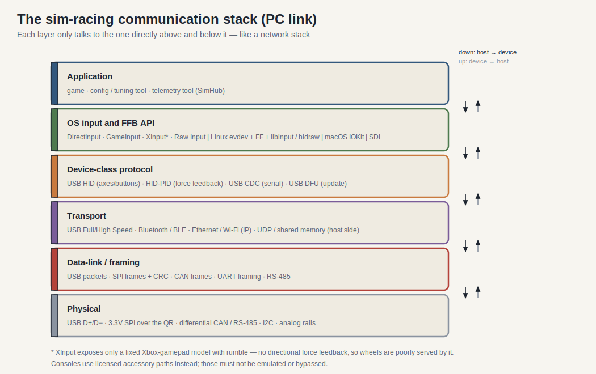

# Giao thức truyền thông và tiêu chuẩn

> Phiên bản: 1.0
> Đánh giá: 2026-07-02
> Mục đích: cung cấp một tài liệu tham khảo lớp duy nhất cho các tiêu chuẩn truyền thông trong hệ sinh thái đua xe sim - lớp vật lý thông qua lớp ứng dụng / API - nhấn mạnh vào đế bánh xe <-> liên kết PC và cách các công cụ phần mềm nói chuyện với thiết bị. Nó hợp nhất và mở rộng tài liệu trong [sim_racing_research.md] (./sim_racing_research.md) §7, [wheel_base.md] (./wheel_base.md) §7 & §11 và [telemetry.md] (./telemetry.md).

## Nhật ký thay đổi tài liệu

| Phiên bản | Ngày | Thay đổi |
|---|---|---|
| 1.0 | 2026-07-02 | Tài liệu mới. Điền vào lớp OS/driver/API (DirectInput, XInput, GameInput, Raw Input, Linux evdev/FF/hidraw/libinput, SDL, IOKit), lớp ứng dụng HID usage/HID-PID, USB DFU update transport, và ma trận phần mềm-công cụ-đến-thiết bị. Các chi tiết cụ thể về Linux và đo từ xa được trích dẫn từ kho `hid-fanatecff` và `hid-fanatecff-tools` đã được xác minh. |

## 1. Mục đích và phạm vi

Các tài liệu hiện có mô tả * liên kết vật lý * tốt (xem bảng liên kết trong [sim_racing_research.md] (./sim_racing_research.md) §7.1). Những gì còn thiếu là một cái nhìn tổng hợp của ** các lớp cao hơn ** - các API đầu vào hệ điều hành, giao thức phản hồi ứng dụng / lực HID, vận chuyển cập nhật firmware và các công cụ phần mềm đường dẫn cụ thể sử dụng để tiếp cận các thiết bị. Tài liệu này cung cấp chế độ xem.

> [ QUAN TRỌNG]
> ** Bằng chứng và khả năng truy cập. ** Tài liệu USB-IF, Microsoft, Apple và Fanatec là ** không thể truy cập ** từ môi trường đánh giá và chỉ được trích dẫn bằng tham chiếu (đã xác minh tính nhất quán nội bộ, không được tìm nạp lại). Các chi tiết cụ thể về lớp dịch và Linux được lấy từ READMEs ** đã xác minh ** `hid-fanatecff` / `hid-fanatecff-tools`. API hệ điều hành tiêu chuẩn là ** đã xác minh kiến thức chung ** công khai tính đến ngày đánh giá; định dạng gói cụ thể cho thương hiệu vẫn ** Không xác định ** trừ khi nguồn công khai xác định chúng.

## 2. Mô hình lớp

**Hình 2-1: Ngăn xếp truyền thông hệ sinh thái **

```nàng tiên cá
Sơ đồ TD
Ứng dụng["Ứng dụng: game / công cụ cấu hình / công cụ đo từ xa"]
API["Đầu vào hệ điều hành & API FFB: DirectInput / XInput / GameInput / evdev+FF / SDL / IOKit"]
Lớp ["Giao thức lớp thiết bị: USB HID + HID-PID (FFB); USB CDC (serial); USB DFU (cập nhật)"]
Xport["Chuyển: USB (FS / HS), Bluetooth / BLE, Ethernet / Wi-Fi (IP), UDP / bộ nhớ chia sẻ (host-side)"]
Liên kết ["Liên kết / khung dữ liệu: gói USB, khung SPI + CRC, khung CAN, khung UART, RS-485"]
Phy ["Vật lý: USB D + / D-, 3.3V SPI trên QR, vi sai CAN / RS-485, I2C, đường ray tương tự"]
Ứng dụng -> API -> Lớp -> Xport -> Liên kết -> Phy
```

Cùng một ngăn xếp, được vẽ dưới dạng các lớp được dán nhãn với các giao thức cụ thể ở mỗi cấp, làm cho thuộc tính "mỗi lớp chỉ nói chuyện với các lớp lân cận" dễ nhìn thấy hơn:



Tài liệu này được tổ chức từ trên xuống: vận chuyển PC và các lớp thiết bị của nó (§3–§6), lớp OS / API (§7), cập nhật firmware (§8) và đường dẫn công cụ phần mềm đến thiết bị (§9). Các lớp liên kết vật lý và dữ liệu được phân loại trong [sim_racing_research.md] (./sim_racing_research.md) §7.1 và §7.3 và không được sao chép ở đây ngoài các bổ sung trong §3.

## 3. Lớp vật lý và liên kết (Bổ sung)

Bảng liên kết vật lý kinh điển sống trong [sim_racing_research.md](./sim_racing_research.md) §7.1 (USB FS / HS, SPI, UART, CAN / CAN-FD, I2C, RS-485, Ethernet, BLE, Wi-Fi). Bổ sung liên quan đến các tiêu chuẩn dưới đây:

- ** Tốc độ USB. ** Một cơ sở bánh xe thường liệt kê là ** USB 2.0 Full Speed (12 Mbit / s) **; ** Tốc độ cao (480 Mbit / s) ** được sử dụng khi băng thông hiển thị / nhà cung cấp yêu cầu nó (** đã được xác minh công khai **; đã nêu trong nghiên cứu §7.1).
- ** Đầu nối / nguồn USB. ** Cơ sở tự cấp nguồn với cảm biến VBUS (xem [wheel_base.md] (./wheel_base.md) §7). Loại kết nối là sản phẩm cụ thể.
- ** QR liên kết điện ** 3.3 V SPI (bộ điều khiển cơ sở / master, vành ngoại vi / nô lệ) cho các thế hệ cũ - xem [wheel_rim.md](./wheel_rim.md) và [accessories.md](./accessories.md); ranh giới thế hệ theo dõi trong [compatibility-matrix.md](./compatibility-matrix.md).

## 4. Giao thông USB cho cơ sở <-> Liên kết PC

Khi liệt kê các cơ sở trình bày các mô tả USB khai báo giao diện và điểm cuối của nó. Như tài liệu trong [sim_racing_research.md](./sim_racing_research.md) §7.2.1:

- ** Interrupt IN ** điểm cuối mang trục / nút (thiết bị -> máy chủ).
- ** Interrupt OUT ** hoặc ** SET_REPORT ** mang hiệu ứng phản hồi lực (máy chủ -> thiết bị).
- ** Tính năng ** báo cáo mang khả năng / cấu hình.
- Giao diện ** nhà cung cấp ** tùy chọn mang dữ liệu cụ thể của nhà cung cấp.

** Đã xác minh danh tính thiết bị công cộng: ** trình điều khiển `hid-fanatecff` liệt kê các thiết bị Fanatec dưới ** ID nhà cung cấp USB `0x0EB7` **, với ID sản phẩm trên mỗi thiết bị - ví dụ: `0x0020` (CSL DD / DD Pro / ClubSport DD), `0x0006` (Sân vận động DD1), `0x0007` (Sân vận động DD2) và các PID đạp như `0x6204` (xem [repos.md] (./repos.md) và `hid-fanatecff` README). Các PID chính xác phải được xác nhận cho mỗi sản phẩm.

## 5. Lớp ứng dụng HID

USB HID là lớp tự mô tả cho phép cơ sở hoạt động mà không cần trình điều khiển tùy chỉnh. Hai phần ngữ nghĩa trước đây đã được ngụ ý nhưng không được đặt tên:

- ** Trang sử dụng / cách sử dụng. ** Các thẻ mô tả báo cáo mỗi trường có cách sử dụng. ** Trang sử dụng ** Máy tính để bàn chung (`0x01`) mô tả các trục (X, Y, Z, Rx, Ry, Rz), thanh trượt và nút; ** Thiết bị giao diện vật lý (PID) ** trang sử dụng (`0x0F`) mô tả các điều khiển phản hồi lực. (** Đã xác minh công khai **, bảng sử dụng USB-IF HID.)
- ** Loại báo cáo và yêu cầu điều khiển. ** ** Đầu vào ** báo cáo lưu lượng thiết bị -> máy chủ; ** Đầu ra ** báo cáo lưu lượng máy chủ -> thiết bị; ** Tính năng ** báo cáo là cấu hình hai chiều. `GET_REPORT` / `SET_REPORT` yêu cầu điều khiển di chuyển báo cáo Tính năng / Đầu ra qua điểm cuối điều khiển.

## 6. HID-PID: Lớp lệnh phản hồi lực

Phản hồi lực trên PC được thực hiện bởi lớp USB-IF ** Thiết bị giao diện vật lý (PID) ** - "lớp cao" biến lực lượng của trò chơi thành các lệnh thiết bị. Điều này đã được tham chiếu là "Lớp PID" trong các tài liệu hiện có nhưng không chi tiết.

Các báo cáo HID-PID điển hình (** đã được xác minh công khai **, USB-IF PID 1.0):

Báo cáo | Vai trò |
|---|---|
| Set Effect | Xác định kiểu, thời lượng và tham số của hiệu ứng |
| Đặt phong bì | Tấn công/làm mờ hình |
| Đặt điều kiện | Hệ số lò xo / van điều tiết / quán tính / ma sát |
| Đặt thông số định kỳ | sin / vuông / tam giác / răng cưa |
| Set Constant / Ramp Force | Cường độ không đổi hoặc cường độ dốc |
| Hiệu ứng Thao tác | Bắt đầu / bắt đầu-solo / dừng một hiệu ứng |
| Mức tăng thiết bị | Mở rộng mức tăng toàn cầu |
| PID Pool / Block Load | Hiệu ứng quản lý bộ nhớ trên thiết bị |

> [! Chú ý]
> Trình điều khiển `hid-fanatecff` đã được xác minh hiển thị một phiên bản thực của lớp này: đối với Wine / Proton thông qua HIDRAW, nó ** mở rộng mô tả HID của thiết bị với các thành phần HID-PID **, sau đó chặn các lệnh HID-PID và dịch chúng thành giao thức HID tùy chỉnh của Fanatec. Bản thân giao thức trên dây tùy chỉnh là ** Không xác định ** từ thông số kỹ thuật công khai; chỉ có ranh giới HID-PID tiêu chuẩn là công khai. (Tham khảo: USB-IF * Định nghĩa lớp thiết bị cho PID 1.0 *.)

## 7. Đầu vào hệ điều hành và API FFB (Khoảng cách chính)

Đây là lớp thông qua đó phần mềm nói chuyện với cơ sở, và đó là khoảng cách tài liệu lớn nhất. Nó khác nhau trên mỗi hệ điều hành.

### 7.1 Cửa sổ

** Hình 7-1: Cảnh quan API Windows Input / FFB **

```nàng tiên cá
Lưu đồ LR
Trò chơi ["Trò chơi / Công cụ"] -> DI ["DirectInput"]
Trò chơi --> XI["XInput"]
Trò chơi --> GI["GameInput / Windows.Gaming.Input"]
Trò chơi --> RI["Đầu vào thô (HID)"]
DI -> HID ["USB HID + HID-PID"]
GI -> GIẤU
RI -> HID
XI --> Pad ["Mô hình gamepad kiểu Xbox"]
HID -> Base ["Cơ sở bánh xe"]
```

| API | Hỗ trợ FFB | Bánh xe phù hợp | Ghi chú |
|---|---|---|---|
| ** DirectInput ** | Yes (full effect set) | Strong | Legacy nhưng vẫn là đường dẫn chung cho bánh xe FFB; cho thấy nhiều trục / nút và mô hình hiệu ứng trong §6. |
| ** XInput ** | Rumble only | Poor | Mô hình Xbox-gamepad cố định; không có FFB định hướng, trục giới hạn. Bánh xe ** không ** được phục vụ tốt bởi XInput. |
| ** GameInput / Windows.Gaming.Input ** | Có (lớp RacingWheel) | Đang phát triển | API thống nhất mới hơn với lớp thiết bị bánh xe đua rõ ràng và phản hồi lực. |
| ** Đầu vào thô ** | Chỉ đọc | Đường dẫn đọc | Truy cập đầu vào HID cấp thấp; không có mô hình đầu ra FFB của riêng nó. |

(** Đã xác minh công khai ** kể từ ngày đánh giá; Tính khả dụng của API phát triển, vì vậy hãy xác nhận hỗ trợ hiện tại trước khi dựa vào bất kỳ một đường dẫn nào.)

### 7.2 Linux

Đường dẫn Linux được ghi lại cụ thể bởi trình điều khiển ** đã được xác minh ** `hid-fanatecff`:

- **evdev** (`/dev/input/event*`) và **joydev** (`/dev/input/js*`) hiển thị đầu vào; `evdev-joystick` đặt deadzone/fuzz.
- Hạt nhân **force-feedback (FF) API ** cho phép các hiệu ứng được tải lên thông qua giao diện **libinput ** tiêu chuẩn; `hid-fanatecff` dịch chúng thành giao thức HID tùy chỉnh trên bộ hẹn giờ không đồng bộ mặc định là ** 2 ms **. `FF_FRICTION` và `FF_INERTIA` là thử nghiệm trong trình điều khiển đó.
- Hạt nhân ** Giao diện LED ** (sysfs) ổ đĩa rim RPM / đèn LED khác bằng cách viết các tập tin sysfs.
- ** hidraw ** (`/dev/hidrawN`) cho phép truy cập mô tả HID thô được sử dụng để điều khiển LED / hiển thị kiểu SDK.

# # 7.3 macOS

macOS hiển thị các thiết bị thông qua ** IOKit HID ** và khung ** Game Controller ** cấp cao hơn (** đã được xác minh công khai **, kiến thức chung). Hỗ trợ FFB cho bánh xe tùy ý bị hạn chế hơn trên Windows / Linux và phụ thuộc vào sản phẩm.

### 7.4 Lớp đa nền tảng và dịch thuật

- ** SDL ** (SDL_Joystick / SDL_GameController + hệ thống con haptic) là thư viện đa nền tảng phổ biến mà nhiều trò chơi và công cụ sử dụng; nó nằm trên đầu các lớp HĐH ở trên.
- ** Rượu / Proton ** (từ README `hid-fanatecff` đã được xác minh) đến thiết bị theo hai cách: thông qua ** libinput (trực tiếp hoặc thông qua SDL) ** để tổng hợp thiết bị đầu vào Windows hoặc thông qua ** HIDRAW ** để trình bày bộ mô tả HID thô để SDK của nhà cung cấp và FFB HID-PID hoạt động như trên Windows gốc. Proton 10.0-2 + cho phép HIDRAW cho các cơ sở Fanatec theo mặc định; `PROTON_DISABLE_HIDRAW=1` buộc đường dẫn libinput / SDL.

## 8. Vận chuyển cập nhật firmware

Cập nhật đã được bao phủ như là hành vi "bootloader" nhưng việc vận chuyển tiêu chuẩn hóa không được đặt tên:

- ** USB DFU (Device Firmware Upgrade) class ** là cơ chế tiêu chuẩn: thiết bị quảng cáo giao diện DFU, được gửi **DETACH ** và ghi lại trong ** Chế độ DFU **, sau đó nhận hình ảnh (công cụ máy chủ như `dfu-util`). (** Đã xác minh công khai **, USB-IF DFU 1.1.)
- ** Giao diện bootloader / phục hồi của nhà cung cấp ** là lựa chọn thay thế phổ biến, được hiển thị trên cùng một kết nối USB hoặc giao diện dịch vụ (xem [wheel_base.md] (./wheel_base.md) §7, §11). Fanatec vận chuyển trình cập nhật của riêng mình; giao thức dây của nó là ** Không rõ ** từ thông số kỹ thuật công khai.

> [ QUAN TRỌNG]
> Theo mô hình an toàn trong [wheel_base.md] (./wheel_base.md), cập nhật / chẩn đoán là máy bay dịch vụ ** bị vô hiệu hóa mô-men xoắn **. Firmware ** sẽ không ** tạo ra mô-men xoắn trong khi ở trạng thái bộ nạp khởi động / DFU.

## 9. Công cụ phần mềm giao tiếp với thiết bị như thế nào

Phần này trả lời trực tiếp câu hỏi thứ hai. Các công cụ tiếp cận các thiết bị thông qua ba con đường riêng biệt.

**Hình 9-1: Đường dẫn từ công cụ đến thiết bị **

```nàng tiên cá
Lưu đồ LR
Cấu hình đồ thị con
CP["Bảng điều khiển / điều chỉnh"]
HFT["hid-fanatecff-tools / DBus / sysfs"] Name
kết thúc
subgraph Đo từ xa
Trò chơi ["Trò chơi"] -->|"UDP / bộ nhớ dùng chung"| SH["SimHub / led_server"]
kết thúc
tiểu đồ thị Ảo
VJ["vJoy / phím điều khiển ảo"]
kết thúc
CP -->|"HID Feature / vendor interface"| Base["Device"]
HFT -->|"sysfs / hidraw"| Base
SH -->|"móc nối tiếp / trình điều khiển COM / USB ảo"| Base
VJ -->|"thiết bị HID tổng hợp"| OS["lớp đầu vào OS"]
```

| Kiểu công cụ | Đường dẫn đến thiết bị | Tiêu chuẩn / cơ chế | Trạng thái |
|---|---|---|---|
| Cấu hình / điều chỉnh (ví dụ: Bảng điều khiển) | HID ** Tính năng ** báo cáo hoặc ** giao diện nhà cung cấp ** qua USB | USB HID (§ 5); chi tiết cụ thể của nhà cung cấp Không rõ | Ranh giới công khai đã xác minh; tải trọng của nhà cung cấp Không rõ |
| Linux tuning bridge (`hid-fanatecff-tools`) | Trình điều khiển **sysfs** thông qua dịch vụ **DBus**; **hidraw** cho các tính năng của SDK | Linux sysfs/DBus/hidraw | Verified (community) |
| Telemetry (SimHub, `fanatec_led_server.py`) | Đọc từ xa trò chơi qua ** UDP ** hoặc ** ánh xạ bộ nhớ chung / bộ nhớ ("ánh xạ có tên") **, sau đó đẩy đến thiết bị qua ** nối tiếp COM / USB ảo ** hoặc móc trình điều khiển | API từ xa cho mỗi trò chơi; USB CDC | Đã xác minh (cộng đồng); xem [telemetry.md](./telemetry.md) |
| Trình điều khiển ảo / chuyển tiếp (** vJoy **) | Trình bày ** cần điều khiển HID tổng hợp ** cho lớp đầu vào hệ điều hành để tiêm / chuyển tiếp | Trình điều khiển cần điều khiển ảo Windows | Đã xác minh công khai |
| Trình giả lập proxy (trình giả lập bàn đạp / rim) | Trình bày dưới dạng ** thiết bị HID ** hoặc kết nối với ** cổng RJ12 cơ sở ** dưới dạng proxy | USB HID / RJ12 (§3) | Cộng đồng báo cáo; xem [repos.md](./repos.md), [compatibility-matrix.md](./compatibility-matrix.md) |

Vận chuyển từ xa theo trò chơi được quan sát trong README `hid-fanatecff-tools` đã được xác minh: Assetto Corsa hiển thị điểm cuối ** UDP ** theo mặc định; ACC sử dụng Windows ** có tên là ánh xạ bộ nhớ ** (được nối với Linux); AMS2 / Project CARS 2 sử dụng ** UDP ** (phiên bản giao thức có thể định cấu hình); rFactor 2 sử dụng ** plugin bản đồ bộ nhớ chung ** tạo bản đồ trong `/ dev / shm /`; các tiêu đề F1 sử dụng ** UDP **. Điều này xác nhận hai phương thức vận chuyển từ xa phía máy chủ chiếm ưu thế là ** UDP ** và ** tệp ánh xạ bộ nhớ / bộ nhớ chung **.

## 10. Tài liệu này thêm gì

Liên quan đến phạm vi bảo hiểm trước đó, tài liệu này mới được đặt tên và tổ chức: lớp API hệ điều hành (DirectInput / XInput / GameInput / Raw Input; Linux evdev / FF / libinput / hidraw / joydev; macOS IOKit; Bản dịch SDL và Wine / Proton); ngữ nghĩa trang sử dụng và loại báo cáo HID; bộ lệnh hiệu ứng HID-PID; vận chuyển cập nhật USB DFU; và ma trận phần mềm-công cụ-đến-thiết bị với vận chuyển từ xa cho mỗi trò chơi. Chi tiết lớp vật lý tiếp tục sống trong nghiên cứu §7.

# 11. Quan điểm firmware

Cơ sở phải trình bày các giao diện sạch tiêu chuẩn ở mỗi lớp để nó hoạt động mà không cần trình điều khiển bespoke: HID + HID-PID cho đầu vào / FFB, CDC nơi cung cấp mặt phẳng nối tiếp và DFU hoặc phục hồi nhà cung cấp có phạm vi rõ ràng để cập nhật. Mỗi mặt phẳng đối diện với máy chủ ** sẽ ** được giới hạn và kiểm tra độ dài (§ đầu vào / FFB / cấu hình / đo từ xa / cập nhật mặt phẳng trong [wheel_base.md] (./wheel_base.md) §11) và thiết bị ** sẽ không ** tin tưởng rằng bất kỳ API hoặc công cụ máy chủ cụ thể nào có mặt.

## 12. Key Takeaways

- Base <-> PC là USB HID cho I / O và ** HID-PID ** để phản hồi lực; bảng điều khiển sử dụng các đường dẫn được cấp phép ** sẽ không ** được mô phỏng hoặc bỏ qua.
- Các vấn đề lớp API hệ điều hành: ** DirectInput ** và ** GameInput ** mang bánh xe FFB trên Windows; ** XInput ** không; Linux sử dụng hạt nhân ** FF API + libinput / hidraw **; ** SDL ** và ** Cầu Rượu / Proton **.
- Cập nhật firmware có giao thông tiêu chuẩn (** USB DFU **) và yêu cầu an toàn vô hiệu hóa mô-men xoắn.
- Công cụ phần mềm tiếp cận thiết bị theo ba cách: ** cấu hình ** (HID Feature / vendor / sysfs), ** từ xa ** (UDP hoặc bộ nhớ dùng chung -> nối tiếp) và ** trình điều khiển ảo / chuyển tiếp ** (vJoy) hoặc ** giả lập proxy **.

## Tài liệu tham khảo

- [Công cụ và thông số kỹ thuật USB-IF HID] (https://www.usb.org/hid) - Lớp HID, bảng sử dụng, loại báo cáo.
- [USB-IF Device Class Definition cho PID 1.0] (https://www.usb.org/document-library/device-class-definition-pid-10-0) - lớp lệnh force-feedback.
- [Nâng cấp firmware thiết bị USB-IF (DFU) 1.1] (https://www.usb.org/sites/default/files/DFU_1.1.pdf) - vận chuyển cập nhật tiêu chuẩn.
- API [Linux force-feedback (FF)] (https://www.kernel.org/doc/html/latest/input/ff.html) và [hidraw] (https://docs.kernel.org/hid/hidraw.html) - Giao diện Linux input/FFB/raw-HID.
- [gotzl/hid-fanatecff] (https://github.com/gotzl/hid-fanatecff) - Trình điều khiển Linux đã được xác minh; Danh sách VID / PID, API FF, đèn LED sysfs, hành vi HIDRAW / HID-PID, SDL / Proton.
- [gotzl/hid-fanatecff-tools] (https://github.com/gotzl/hid-fanatecff-tools) - Đã xác minh cầu đo từ xa; vận chuyển UDP / bộ nhớ chia sẻ trên mỗi trò chơi.
- [telemetry.md](./telemetry.md), [wheel_base.md](./wheel_base.md) §7 & §11, [sim_racing_research.md](./sim_racing_research.md) §7 — phần liên quan trong cây.

> Liên kết nhà cung cấp / tiêu chuẩn (usb.org, Microsoft, Apple, Fanatec) không thể truy cập được trong môi trường đánh giá này và được trích dẫn bằng tài liệu tham khảo; xác nhận lại với các nguồn trực tiếp trước khi sử dụng sản xuất.

## Câu hỏi chưa được giải quyết

- ID sản phẩm USB chính xác và bất kỳ định dạng báo cáo giao diện nhà cung cấp nào cho mỗi sản phẩm hiện tại là gì? (Tải trọng của nhà cung cấp không được biết từ thông số kỹ thuật công khai.)
- API hệ điều hành nào sẽ hỗ trợ tích hợp mục tiêu đầu tiên (DirectInput vs GameInput trên Windows) và bộ khả thi tối thiểu cho Linux (libinput vs hidraw) là gì?
