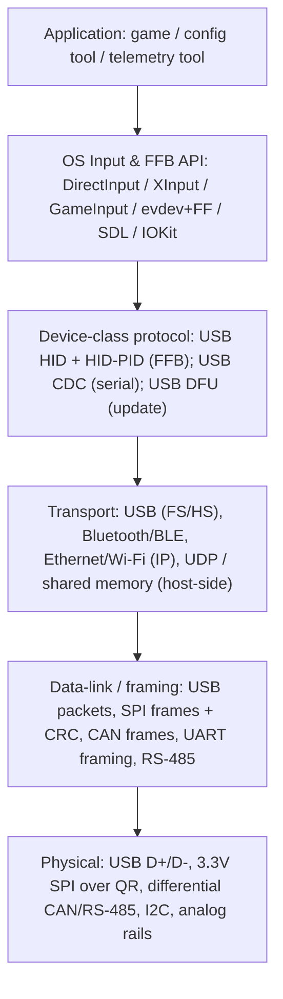
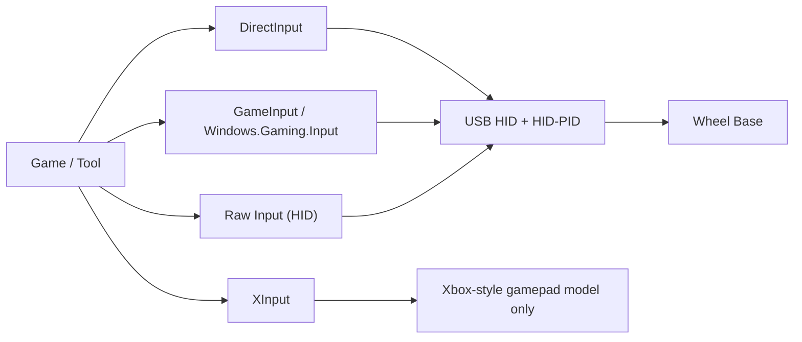
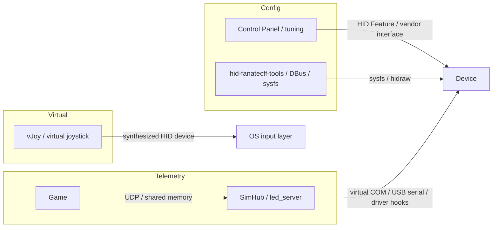

# Giao thức truyền thông và tiêu chuẩn

> Phiên bản: 1.0
> Đánh giá: 2026-07-02
> Mục đích: cung cấp một tài liệu tham khảo lớp duy nhất cho các tiêu chuẩn truyền thông trong hệ sinh thái đua xe sim — từ lớp vật lý đến lớp ứng dụng/API — với trọng tâm vào liên kết giữa wheel base <-> PC và cách các công cụ phần mềm giao tiếp với thiết bị. Nó hợp nhất và mở rộng các tài liệu trong [sim_racing_research.md](./sim_racing_research.md) §7, [wheel_base.md](./wheel_base.md) §7 & §11, và [telemetry.md](./telemetry.md).

## Nhật ký thay đổi tài liệu

| Phiên bản | Ngày | Thay đổi |
|---|---|---|
| 1.0 | 2026-07-02 | Tài liệu mới. Bổ sung lớp hệ điều hành/driver/API (DirectInput, XInput, GameInput, Raw Input, Linux evdev/FF/hidraw/libinput, SDL, IOKit), lớp ứng dụng sử dụng HID/HID-PID, phương thức cập nhật USB DFU, và ma trận phần mềm-công cụ-đến-thiết bị. Các chi tiết cụ thể về Linux và telemetry được trích dẫn từ các repository `hid-fanatecff` và `hid-fanatecff-tools` đã được xác minh. |

## 1. Mục đích và phạm vi

Các tài liệu hiện có mô tả rất tốt các *liên kết vật lý* (xem bảng liên kết trong [sim_racing_research.md](./sim_racing_research.md) §7.1). Điều còn thiếu là một cái nhìn tổng hợp về các **lớp cao hơn** — các API đầu vào của hệ điều hành, lớp ứng dụng HID / giao thức force-feedback, phương thức cập nhật firmware, và các đường dẫn cụ thể mà các công cụ phần mềm sử dụng để tiếp cận thiết bị. Tài liệu này cung cấp cái nhìn đó.

> [!IMPORTANT]
> **Bằng chứng và khả năng truy cập.** Tài liệu của USB-IF, Microsoft, Apple và Fanatec **không thể truy cập được** từ môi trường đánh giá và chỉ được trích dẫn bằng tham chiếu (đã xác minh tính nhất quán nội bộ, không tải lại). Các thông tin cụ thể về Linux và lớp dịch thuật được lấy từ README của `hid-fanatecff` / `hid-fanatecff-tools` **đã được xác minh**. Các API hệ điều hành chuẩn là **kiến thức chung đã được xác minh công khai** tính đến ngày đánh giá; các định dạng gói dữ liệu đặc thù của thương hiệu vẫn là **Không xác định** trừ khi có nguồn công khai xác định chúng.

## 2. Mô hình lớp

**Hình 2-1: Ngăn xếp truyền thông hệ sinh thái**

Cùng một ngăn xếp này, được vẽ dưới dạng các lớp có dán nhãn với các giao thức cụ thể ở mỗi cấp độ, làm cho thuộc tính "mỗi lớp chỉ giao tiếp với lớp lân cận" dễ hình dung hơn:

Tài liệu này được sắp xếp theo cấu trúc từ trên xuống: phương thức truyền tải PC và các lớp thiết bị của nó (§3–§6), lớp hệ điều hành/API (§7), cập nhật firmware (§8), và các đường dẫn từ công cụ phần mềm đến thiết bị (§9). Các lớp vật lý và liên kết dữ liệu được liệt kê trong [sim_racing_research.md](./sim_racing_research.md) §7.1 và §7.3 và không được lặp lại ở đây ngoài các bổ sung trong §3.

## 3. Lớp vật lý và liên kết (Bổ sung)

Bảng liên kết vật lý tiêu chuẩn nằm trong [sim_racing_research.md](./sim_racing_research.md) §7.1 (USB FS/HS, SPI, UART, CAN/CAN-FD, I2C, RS-485, Ethernet, BLE, Wi-Fi). Các bổ sung có liên quan đến các tiêu chuẩn dưới đây:

- **Tốc độ USB.** Một wheel base thường kết nối dưới dạng **USB 2.0 Full Speed (12 Mbit/s)**; **High Speed (480 Mbit/s)** được sử dụng khi băng thông cho màn hình/nhà cung cấp yêu cầu (**đã xác minh công khai**; được nêu trong nghiên cứu §7.1).
- **Cổng kết nối/nguồn USB.** Base tự cấp nguồn có cảm biến VBUS (xem [wheel_base.md](./wheel_base.md) §7). Loại cổng kết nối tùy thuộc vào sản phẩm.
- **Liên kết điện QR.** 3.3 V SPI (base controller/master, rim peripheral/slave) cho các thế hệ cũ hơn — xem [wheel_rim.md](./wheel_rim.md) và [accessories.md](./accessories.md); ranh giới thế hệ được theo dõi trong [compatibility-matrix.md](./compatibility-matrix.md).

## 4. Giao tiếp USB cho liên kết Base <-> PC

Khi kết nối, base cung cấp các mô tả USB (USB descriptors) khai báo các giao diện (interfaces) và điểm cuối (endpoints) của nó. Như được trình bày trong [sim_racing_research.md](./sim_racing_research.md) §7.2.1:

- Điểm cuối **Interrupt IN** truyền dữ liệu trục/nút bấm (thiết bị -> host).
- Điểm cuối **Interrupt OUT** hoặc **SET_REPORT** truyền các hiệu ứng force-feedback (host -> thiết bị).
- Báo cáo **Feature** mang dữ liệu khả năng/cấu hình.
- Giao diện **nhà cung cấp** (vendor interface) tùy chọn mang dữ liệu đặc thù của nhà cung cấp.

**Đã xác minh danh tính thiết bị công khai:** driver `hid-fanatecff` nhận diện các thiết bị Fanatec theo **USB vendor ID `0x0EB7`**, với các product ID tùy từng thiết bị — ví dụ `0x0020` (CSL DD / DD Pro / ClubSport DD), `0x0006` (Podium DD1), `0x0007` (Podium DD2), và PID của bàn đạp như `0x6204` (xem [repos.md](./repos.md) và README của `hid-fanatecff`). PID chính xác nên được xác nhận theo từng sản phẩm.

## 5. Lớp ứng dụng HID

USB HID là lớp tự mô tả giúp base hoạt động mà không cần driver tùy chỉnh. Có hai khái niệm ngữ nghĩa trước đây được hàm ý nhưng chưa được gọi tên:

- **Usage pages / usages.** Report descriptor gắn thẻ từng trường dữ liệu với một "usage". Usage page **Generic Desktop** (`0x01`) mô tả các trục (X, Y, Z, Rx, Ry, Rz), sliders, và nút bấm; usage page **Physical Interface Device (PID)** (`0x0F`) mô tả các điều khiển force-feedback. (**Đã xác minh công khai**, USB-IF HID usage tables.)
- **Các loại báo cáo (Report types) và yêu cầu điều khiển.** Báo cáo **Input** truyền từ thiết bị -> host; báo cáo **Output** truyền từ host -> thiết bị; báo cáo **Feature** là cấu hình hai chiều. Yêu cầu điều khiển `GET_REPORT` / `SET_REPORT` di chuyển báo cáo Feature/Output qua điểm cuối điều khiển (control endpoint).

## 6. HID-PID: Lớp lệnh Force-Feedback

Force feedback trên PC được truyền qua lớp USB-IF **Physical Interface Device (PID)** — một "lớp cao" chuyển các lực từ trò chơi thành lệnh cho thiết bị. Trước đây, lớp này được gọi là "PID Class" trong các tài liệu nhưng chưa được nêu chi tiết.

Các báo cáo HID-PID điển hình (**đã xác minh công khai**, USB-IF PID 1.0):

| Báo cáo | Vai trò |
|---|---|
| Set Effect | Xác định loại, thời lượng, và tham số của một hiệu ứng |
| Set Envelope | Tạo hình dáng attack/fade |
| Set Condition | Hệ số lò xo (spring) / bộ giảm chấn (damper) / quán tính (inertia) / ma sát (friction) |
| Set Periodic | Tham số hình sin / vuông / tam giác / răng cưa |
| Set Constant / Ramp Force | Lực độ lớn không đổi hoặc thay đổi theo dốc |
| Effect Operation | Start / start-solo / stop một hiệu ứng |
| Device Gain | Chỉnh tỷ lệ cường độ chung (global gain) |
| PID Pool / Block Load | Quản lý bộ nhớ hiệu ứng trên thiết bị |

> [!NOTE]
> Driver `hid-fanatecff` đã xác minh cho thấy một trường hợp thực tế của lớp này: đối với Wine/Proton thông qua HIDRAW, nó **mở rộng HID descriptor của thiết bị với các thành phần HID-PID**, sau đó chặn các lệnh HID-PID và biên dịch chúng sang giao thức HID tùy chỉnh của Fanatec. Giao thức truyền tải thực tế (on-wire protocol) tùy chỉnh là **Không xác định** từ các tài liệu kỹ thuật công khai; chỉ có ranh giới HID-PID tiêu chuẩn là công khai. (Tham chiếu: USB-IF *Device Class Definition for PID 1.0*.)

## 7. Các API hệ điều hành cho Đầu vào và FFB (Khoảng trống chính)

Đây là lớp mà qua đó phần mềm giao tiếp với base, và đây là khoảng trống tài liệu lớn nhất. Lớp này khác nhau tùy theo từng hệ điều hành.

### 7.1 Windows

**Hình 7-1: Cảnh quan API Đầu vào/FFB của Windows**

| API | Hỗ trợ FFB | Mức độ phù hợp với Wheel | Ghi chú |
|---|---|---|---|
| **DirectInput** | Có (đầy đủ các hiệu ứng) | Tốt | Công nghệ cũ nhưng vẫn là phương thức phổ biến cho wheel FFB; bộc lộ nhiều trục/nút bấm và mô hình hiệu ứng ở §6. |
| **XInput** | Chỉ rung (Rumble) | Kém | Mô hình gamepad Xbox cố định; không có FFB định hướng, giới hạn trục. Wheel **không** được hỗ trợ tốt bởi XInput. |
| **GameInput / Windows.Gaming.Input** | Có (Lớp RacingWheel) | Đang phát triển | API hợp nhất mới hơn có tích hợp lớp thiết bị racing-wheel rõ ràng và force feedback. |
| **Raw Input** | Chỉ đọc | Lấy dữ liệu | Cung cấp truy cập HID cấp thấp; không có mô hình đầu ra FFB riêng. |

(**Đã xác minh công khai** tính đến ngày đánh giá; tính khả dụng của API sẽ thay đổi, vì vậy hãy kiểm tra sự hỗ trợ hiện tại trước khi phụ thuộc vào bất kỳ phương thức nào.)

### 7.2 Linux

Phương thức Linux được dẫn chứng cụ thể bởi driver `hid-fanatecff` **đã được xác minh**:

- **evdev** (`/dev/input/event*`) và **joydev** (`/dev/input/js*`) hỗ trợ dữ liệu đầu vào; `evdev-joystick` thiết lập deadzone/fuzz.
- **Force-feedback (FF) API** của kernel cho phép upload hiệu ứng thông qua giao diện **libinput** chuẩn; `hid-fanatecff` dịch chúng sang giao thức HID tùy chỉnh trên một timer bất đồng bộ với chu kỳ mặc định là **2 ms**. `FF_FRICTION` và `FF_INERTIA` vẫn đang trong giai đoạn thử nghiệm đối với driver này.
- Giao diện **LED interface** (sysfs) của kernel điều khiển RPM/đèn LED khác của rim bằng cách ghi vào các tập tin sysfs.
- **hidraw** (`/dev/hidrawN`) cung cấp truy cập HID-descriptor thô được dùng để điều khiển hiển thị/LED giống với SDK.

### 7.3 macOS

macOS bộc lộ các thiết bị thông qua **IOKit HID** và bộ framework **Game Controller** cấp cao hơn (**đã xác minh công khai**, kiến thức chung). Việc hỗ trợ FFB cho các loại wheel tùy ý thường hạn chế hơn so với Windows/Linux và phụ thuộc vào từng sản phẩm.

### 7.4 Các lớp đa nền tảng và Dịch thuật

- **SDL** (SDL_Joystick / SDL_GameController + hệ thống con haptic) là thư viện chung đa nền tảng mà nhiều trò chơi và công cụ sử dụng; nó nằm trên các lớp HĐH ở trên.
- **Wine/Proton** (từ README của `hid-fanatecff` đã xác minh) kết nối tới thiết bị bằng hai cách: thông qua **libinput (trực tiếp hoặc thông qua SDL)** để tổng hợp một thiết bị đầu vào của Windows, hoặc thông qua **HIDRAW** để trình bày HID descriptor thô sao cho vendor SDK và FFB qua HID-PID hoạt động giống như trên Windows gốc. Proton 10.0-2+ mặc định bật HIDRAW cho các base Fanatec; `PROTON_DISABLE_HIDRAW=1` sẽ ép dùng luồng libinput/SDL.

## 8. Phương thức truyền tải Cập nhật Firmware

Quá trình cập nhật trước đây đã được đề cập với vai trò "bootloader" nhưng phương thức truyền tải chưa được định danh:

- Lớp **USB DFU (Device Firmware Upgrade)** là cơ chế chuẩn: thiết bị quảng bá giao diện DFU, nhận một yêu cầu **DETACH** và khởi động lại vào **chế độ DFU**, sau đó nhận firmware image (các công cụ ở phía host như `dfu-util`). (**Đã xác minh công khai**, USB-IF DFU 1.1.)
- Các giao diện **vendor bootloader / recovery** là các giải pháp thay thế phổ biến, được mở thông qua cùng cổng USB hoặc qua giao diện service (xem [wheel_base.md](./wheel_base.md) §7, §11). Fanatec cung cấp công cụ cập nhật của riêng mình; giao thức phần cứng (wire protocol) của nó **Không xác định** dựa trên các thông số công khai.

> [!IMPORTANT]
> Dựa trên mô hình an toàn trong [wheel_base.md](./wheel_base.md), cập nhật/chẩn đoán là một **dịch vụ vô hiệu hóa mô-men xoắn** (torque-disabled service plane). Firmware **không được phép** tạo ra mô-men xoắn khi đang ở trạng thái bootloader/DFU.

## 9. Cách các Công cụ Phần mềm Giao tiếp với Thiết bị

Phần này trực tiếp trả lời câu hỏi thứ hai. Các công cụ có thể giao tiếp với thiết bị thông qua ba luồng chính.

**Hình 9-1: Các đường dẫn Công cụ Phần mềm tới Thiết bị**

| Loại công cụ | Đường dẫn đến thiết bị | Tiêu chuẩn / cơ chế | Trạng thái |
|---|---|---|---|
| Cấu hình / Tinh chỉnh (vd. Control Panel) | Các báo cáo HID **Feature** hoặc **vendor interface** qua USB | USB HID (§5); định dạng đặc thù **Không xác định** | Ranh giới công khai đã xác minh; gói dữ liệu vendor Không xác định |
| Công cụ tinh chỉnh trên Linux (`hid-fanatecff-tools`) | Driver **sysfs** qua dịch vụ **DBus**; **hidraw** cho tính năng SDK | Linux sysfs/DBus/hidraw | Đã xác minh (từ cộng đồng) |
| Telemetry (SimHub, `fanatec_led_server.py`) | Đọc telemetry của trò chơi qua **UDP** hoặc **shared memory / bộ nhớ ánh xạ ("named-mapping")**, sau đó đẩy dữ liệu tới thiết bị qua **virtual COM / USB serial** hoặc các driver hook. | Các API telemetry theo từng trò chơi; USB CDC | Đã xác minh (từ cộng đồng); xem [telemetry.md](./telemetry.md) |
| Driver giả lập / chuyển tiếp (**vJoy**) | Hiển thị một **joystick HID giả lập** đối với hệ điều hành để đưa dữ liệu vào / truyền chuyển tiếp | Windows virtual-joystick driver | Đã xác minh công khai |
| Trình giả lập proxy (giả lập pedal/rim) | Hiển thị dưới dạng **thiết bị HID** hoặc kết nối tới **cổng RJ12 của base** làm proxy | USB HID / RJ12 (§3) | Cộng đồng báo cáo; xem [repos.md](./repos.md), [compatibility-matrix.md](./compatibility-matrix.md) |

Giao thức telemetry theo từng trò chơi được quan sát trong README của `hid-fanatecff-tools` đã xác minh: Assetto Corsa mặc định hỗ trợ **UDP**; ACC sử dụng **named memory-mappings** trên Windows (chuyển nối tới Linux); AMS2 / Project CARS 2 sử dụng **UDP** (phiên bản giao thức có thể cấu hình); rFactor 2 dùng một **plugin shared-memory-map** tạo ánh xạ vào `/dev/shm/`; các game F1 dùng **UDP**. Điều này chứng nhận hai cơ chế telemetry chính bên phía host là **UDP** và **shared memory / tập tin ánh xạ bộ nhớ**.

## 10. Những điểm mới trong Tài liệu này

So với những thông tin trước đây, tài liệu này bổ sung và hệ thống hóa: lớp API của hệ điều hành (DirectInput / XInput / GameInput / Raw Input; Linux evdev / FF / libinput / hidraw / joydev; macOS IOKit; SDL và quá trình dịch mã Wine/Proton); tính chất usage-page và loại báo cáo của HID; bộ lệnh hiệu ứng HID-PID; cơ chế truyền tải qua USB DFU; và cấu trúc liên lạc phần mềm-thiết bị với telemetry đặc thù của từng trò chơi. Các chi tiết liên quan đến lớp vật lý vẫn nằm trong phần nghiên cứu §7.

## 11. Góc nhìn Firmware

Base phải cung cấp các giao diện tuân thủ tiêu chuẩn tại từng lớp để có thể hoạt động mà không cần các driver chuyên biệt: HID + HID-PID dùng cho I/O/FFB, CDC khi cung cấp giao tiếp tuần tự (serial plane), và DFU hoặc giao diện vendor recovery giới hạn rõ ràng dùng cho việc cập nhật. Mọi phương diện giao tiếp với host **phải** có giới hạn và kiểm tra độ dài dữ liệu (§ input/FFB/config/telemetry/update planes trong [wheel_base.md](./wheel_base.md) §11), đồng thời thiết bị **không được phép** tin tưởng tuyệt đối vào bất kỳ API hay công cụ host cụ thể nào đang được sử dụng.

## 12. Những Điểm Chính

- Kết nối Base <-> PC qua USB HID cho I/O và **HID-PID** cho force feedback; console sử dụng các kênh cấp phép riêng mà **không được** giả lập hoặc bỏ qua.
- Lớp API của hệ điều hành rất quan trọng: **DirectInput** và **GameInput** hỗ trợ FFB cho wheel trên Windows; **XInput** thì không; Linux sử dụng kernel **FF API + libinput/hidraw**; **SDL** và **Wine/Proton** làm cầu nối xuyên nền tảng.
- Việc cập nhật Firmware có cơ chế chuẩn (**USB DFU**) và yêu cầu an toàn vô hiệu hóa mô-men xoắn.
- Công cụ phần mềm tương tác với thiết bị theo 3 cách: **cấu hình** (HID Feature / vendor / sysfs), **telemetry** (UDP hoặc shared memory -> serial), và **trình điều khiển giả lập/chuyển tiếp** (vJoy) hoặc **proxy** emulator.

## Tài liệu tham khảo

- [USB-IF HID specifications and tools](https://www.usb.org/hid) — Lớp HID, bảng usage, và loại báo cáo.
- [USB-IF Device Class Definition for PID 1.0](https://www.usb.org/document-library/device-class-definition-pid-10-0) — Lớp lệnh force-feedback.
- [USB-IF Device Firmware Upgrade (DFU) 1.1](https://www.usb.org/sites/default/files/DFU_1.1.pdf) — Phương thức truyền tải cập nhật tiêu chuẩn.
- [Linux force-feedback (FF) API](https://www.kernel.org/doc/html/latest/input/ff.html) và [hidraw](https://docs.kernel.org/hid/hidraw.html) — Các giao diện Linux input/FFB/raw-HID.
- [gotzl/hid-fanatecff](https://github.com/gotzl/hid-fanatecff) — Driver Linux đã xác minh; danh sách VID/PID, FF API, sysfs LEDs, HIDRAW/HID-PID, giao tiếp SDL/Proton.
- [gotzl/hid-fanatecff-tools](https://github.com/gotzl/hid-fanatecff-tools) — Telemetry bridge đã xác minh; giao tiếp UDP / shared-memory theo từng game.
- [telemetry.md](./telemetry.md), [wheel_base.md](./wheel_base.md) §7 & §11, [sim_racing_research.md](./sim_racing_research.md) §7 — Các phần có liên quan trong tài liệu.

> Liên kết đến tài liệu của nhà cung cấp/tiêu chuẩn (usb.org, Microsoft, Apple, Fanatec) không thể truy cập trong môi trường đánh giá này và được trích dẫn bằng tham chiếu; vui lòng xác minh lại đối với các nguồn trực tuyến trước khi ứng dụng thực tế.

## Danh sách Câu hỏi (Đã giải quyết và Còn mở)

Đã đánh giá 2026-07-05.

### Đã giải quyết

- **Những API hệ điều hành nào mà dự án tích hợp mục tiêu nên hỗ trợ trước tiên (DirectInput vs GameInput trên Windows; libinput vs hidraw trên Linux)?**
  **Khuyến nghị kỹ thuật.** Trên Windows, nên ưu tiên hướng **DirectInput / HID PID** bởi vì nó được hỗ trợ rộng rãi nhất bởi các tựa game sim hiện tại cho cả đầu vào và force feedback; hãy xem **GameInput** mới hơn của Microsoft như một bổ sung cho tương lai, chứ không phải mục tiêu đầu tiên. Trên Linux, sử dụng **hidraw** để truy cập thiết bị và báo cáo HID tùy chỉnh (đây chính xác là cách mà kernel driver `hid-fanatecff` vận hành FFB và các điều khiển mở rộng), dùng evdev/joystick cho dữ liệu trục/nút cơ bản; `libinput` không phải là lớp phù hợp cho wheel FFB. Bộ tối thiểu khả thi: Windows DirectInput + Linux hidraw/evdev.

### Câu hỏi mở — dành cho nhà phát triển tự điều tra

- **Product ID USB chính xác và các định dạng báo cáo giao diện của nhà cung cấp cho mỗi sản phẩm hiện tại là gì?**
  *Cách điều tra:* VID của nhà cung cấp được cộng đồng quan sát là **`0EB7`** (Fanatec), kèm theo các PID phân định từng model được liệt kê bởi `hid-fanatecff` (vd. `0EB7:0020` cho CSL DD/DD Pro/ClubSport DD) — nhưng đây chỉ là bằng chứng từ cộng đồng dựa trên các thiết bị *hiện có*, chứ không phải một thông số kỹ thuật (spec) cho sản phẩm mới. Đối với thiết bị của riêng bạn, hãy gán/nhận một VID/PID thông qua USB-IF và xác định các descriptor theo chuẩn HID/PID. Các định dạng gói dữ liệu (payload) nội bộ của nhà cung cấp (không phải HID) đối với các thiết bị thương mại đều **Không xác định** trên các tài liệu công khai; bạn chỉ có thể lấy được chúng bằng cách nghiên cứu phần cứng mình có để kiểm thử khả năng tương tác, và đừng mặc định rằng những định dạng này sẽ ổn định qua các phiên bản firmware.
