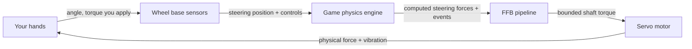
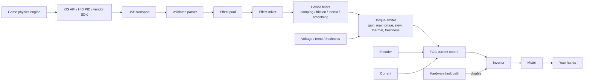
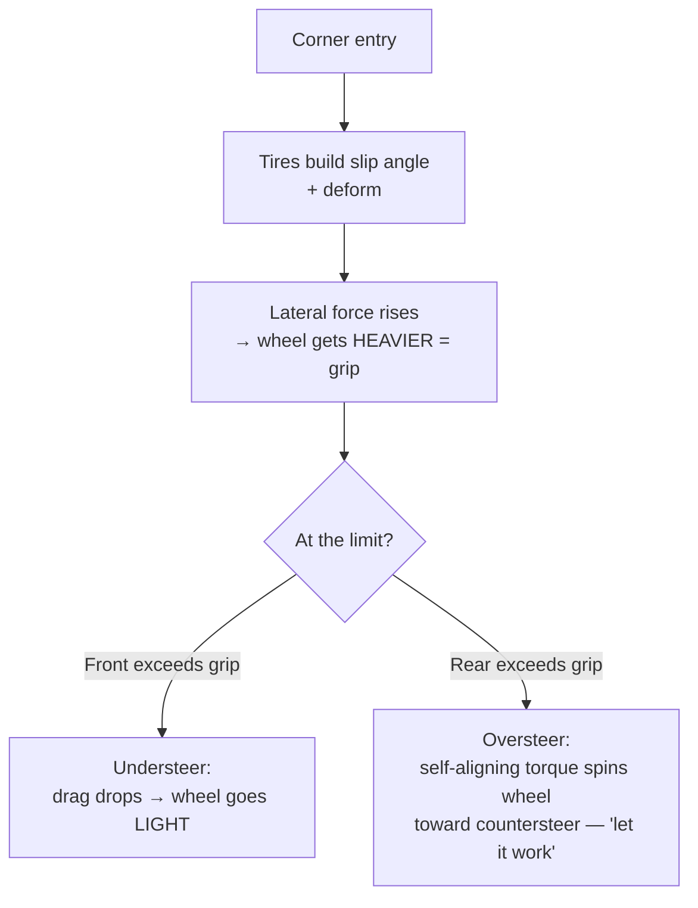
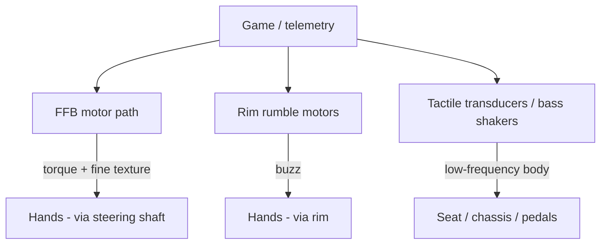
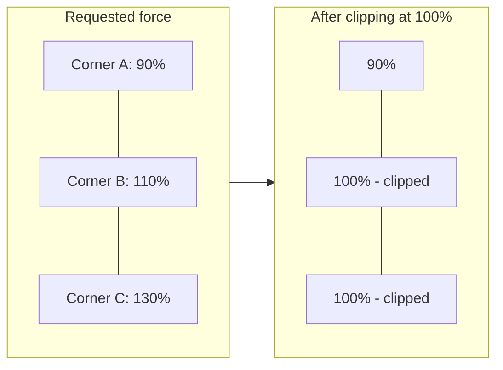
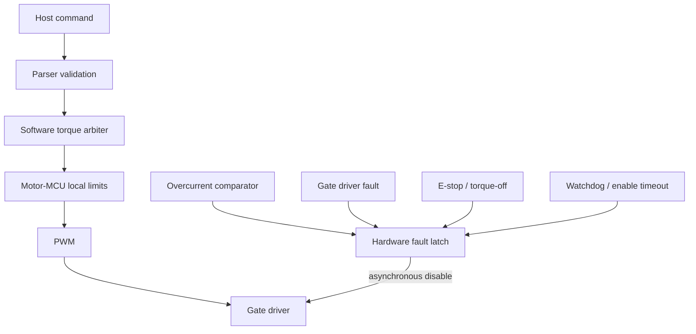

# Force Feedback (FFB) trong Sim Racing — Giải Thích Chi Tiết

> Phiên bản: 1.0 · Cập nhật: 2026-07-05
> Phạm vi: cách một hệ thống vô lăng sim-racing chuyển đổi vật lý ảo thành các lực thực tế trên tay bạn — từ lý thuyết về lực, qua servo motor và thiết bị điện tử công suất, đến từng loại lực và độ rung mà bạn có thể cảm nhận, và cách nó được tinh chỉnh và giữ an toàn.
> Cơ sở: document này được xây dựng dựa trên cơ sở nghiên cứu đi kèm (`wheel_base.md`, `sim_racing_research.md`, `tactile.md`, `telemetry.md`, `glossary.md`) và các hình minh họa giảng dạy gốc của nó, cộng với video giải thích *Inside Sim Racing Tech*. Các con số cụ thể của sản phẩm (torque, latency, độ phân giải sensor) được trích dẫn như **công bố của nhà sản xuất/quảng cáo**, không phải là các phép đo được xác minh độc lập, nhất quán với mô hình bằng chứng của cơ sở nghiên cứu.

---

## Mục lục

1. [Thực Chất Force Feedback Là Gì](#1-thực-chất-force-feedback-là-gì)
2. [Lý Thuyết Về Lực: Torque và Bốn Cảm Giác Cơ Bản](#2-lý-thuyết-về-lực-torque-và-bốn-cảm-giác-cơ-bản)
3. [Servo Motor: Lực Được Tạo Ra Bằng Cấu Trúc Vật Lý Như Thế Nào](#3-servo-motor-lực-được-tạo-ra-bằng-cấu-trúc-vật-lý-như-thế-nào)
4. [Các Loại Truyền Động: Gear vs Belt vs Direct Drive](#4-các-loại-truyền-động-gear-vs-belt-vs-direct-drive)
5. [Công Nghệ Motor Độ Phân Giải Cao: Torque, Latency, Fidelity](#5-công-nghệ-motor-độ-phân-giải-cao-torque-latency-fidelity)
6. [Chuỗi Tín Hiệu FFB: Từ Game Physics Đến Tay Bạn](#6-chuỗi-tín-hiệu-ffb-từ-game-physics-đến-tay-bạn)
7. [Những Gì Tay Bạn Thực Sự Cảm Nhận Được](#7-những-gì-tay-bạn-thực-sự-cảm-nhận-được)
8. [Phân Loại Force-Effect (HID PID)](#8-phân-loại-force-effect-hid-pid)
9. [Vibrations Trên Tay vs. Trên Ghế](#9-vibrations-trên-tay-vs-trên-ghế)
10. [Fidelity, Độ Phân Giải, Latency, và Clipping](#10-fidelity-độ-phân-giải-latency-và-clipping)
11. [Tinh Chỉnh FFB](#11-tinh-chỉnh-ffb)
12. [An Toàn và Giới Hạn](#12-an-toàn-và-giới-hạn)
13. [Bảng Thuật Ngữ Nhanh](#13-bảng-thuật-ngữ-nhanh)
14. [Nguồn và Mô Hình Bằng Chứng](#14-nguồn-và-mô-hình-bằng-chứng)

---

## 1. Thực Chất Force Feedback Là Gì

Force feedback được hiểu tốt nhất không phải là một tính năng được gắn thêm vào vô lăng, mà là một nửa của một **vòng lặp kín, hai chiều giữa người và máy (closed, bidirectional human-machine loop)** chạy liên tục trong khi bạn lái.

Có hai việc diễn ra đồng thời, hàng nghìn lần mỗi giây:

- **Input (bạn → game):** base đo lường chính xác hướng vô lăng đang chỉ và báo cáo nó, cùng với pedals và các nút bấm, cho simulation.
- **Output (game → bạn):** simulation tính toán các lực *đáng lẽ* sẽ tác động lên một hệ thống thước lái thực tế và ra lệnh cho motor tái tạo một phiên bản an toàn, được scale tỷ lệ của chúng tại vành vô lăng (rim).

Định nghĩa này quan trọng vì nó thiết lập kỳ vọng. Force feedback *không* phải là một hiệu ứng rung (rumble effect) được xếp chồng lên một game; nó là physics của một chiếc xe ảo được chiếu lên một motor thực tế. Khi lốp xe chịu tải, vô lăng trở nên nặng. Khi mất độ bám đường (grip), vô lăng trở nên nhẹ. Khi bạn cán qua kerb, bạn cảm nhận được lực tác động. Chất lượng của một hệ thống được đo lường bằng việc nó đóng vòng lặp đó trung thực và nhanh đến mức nào.

Cơ sở nghiên cứu phát biểu điều này một cách chính xác: *"Force feedback chuyển đổi các physical effects được định nghĩa bởi simulation thành bounded shaft torque trong khi trả về steering position và controls cho simulation."* Mọi thứ khác trong document này là bộ máy làm cho câu nói đó thành hiện thực.

---

## 2. Lý Thuyết Về Lực: Torque và Bốn Cảm Giác Cơ Bản

### 2.1 Torque là tiền tệ của FFB

Vô lăng là một vật thể quay, vì vậy đại lượng vật lý liên quan không phải là *force* (newtons) mà là **torque** (newton-metres, N·m) — một lực quay. Torque là tích của lực tiếp tuyến và bán kính mà tại đó nó tác động:

$$\tau = F \times r$$

Mối quan hệ đơn giản này có một hệ quả thực tế mà mọi người cảm nhận được ngay lập tức: **đối với cùng một shaft torque, rim có đường kính lớn hơn đòi hỏi ít lực tay hơn.** Một chiếc rim GT 33 cm trên một base 10 N·m cho cảm giác nhẹ hơn ở tay cầm so với rim 30 cm trên cùng một base, bởi vì tay bạn đang ở một đòn bẩy ngắn hơn. Torque là con số trung thực; "cảm giác nặng như thế nào" cũng phụ thuộc vào kích thước rim và vị trí cầm nắm.

> **Kỷ luật ngôn ngữ (từ glossary):** *FFB strength* là một **setting** (thường là tỷ lệ phần trăm); *torque tính bằng N·m* là một **physical output**. Chúng liên quan với nhau nhưng không thể hoán đổi cho nhau. "Đặt FFB ở mức 100%" và "base tạo ra 15 N·m" mô tả hai điều khác nhau.

### 2.2 Bốn cảm giác cơ bản mà FFB tổng hợp

Vượt ra ngoài tín hiệu raw torque, hầu hết mọi thứ mà vô lăng tác động lên tay bạn được xây dựng từ một tập hợp nhỏ các hành vi vật lý. Cơ sở nghiên cứu xác định bốn cảm giác cốt lõi (cộng với một motor artifact):

| Sensation | Ý nghĩa vật lý | Cảm giác ở vô lăng |
|---|---|---|
| **Torque** | Lực tiếp tuyến tại một bán kính | Vô lăng chủ động đẩy/kéo tay bạn |
| **Inertia** | Sức cản lại *angular acceleration* (effective mass) | Vô lăng có cảm giác "nặng" khi bắt đầu hoặc dừng quay |
| **Damping** | Sức cản tỷ lệ với *velocity* | Chuyển động được làm mượt; các cú đánh lái nhanh bị cản lại |
| **Friction** | Sức cản chống lại *motion*, bao gồm cả chuyển động chậm | Một lực kéo liên tục, giống như một thước lái cứng |
| **Cogging** *(artifact)* | Torque ripple từ tính phụ thuộc vào vị trí trong chính motor | Một cảm giác khựng nhẹ (notchiness) khi vô lăng quay; một thứ cần *giảm thiểu*, không phải là một driving cue |

Đây là các yếu tố cơ bản. Grip, self-aligning torque, kerbs, và weight transfer đều được *thể hiện* thông qua sự kết hợp của torque, inertia, damping, và friction — được điều biến theo thời gian thực bởi physics của game.

---

## 3. Servo Motor: Lực Được Tạo Ra Bằng Cấu Trúc Vật Lý Như Thế Nào

Để cảm nhận được bất cứ điều gì, một motor thực sự phải tạo ra torque thực sự. Các base direct-drive hiện đại sử dụng **three-phase PMSM** (Permanent-Magnet Synchronous Motor, có liên quan chặt chẽ với motor BLDC): một **stator** bằng thép có dây quấn bao quanh một **rotor** nam châm vĩnh cửu được kết nối trực tiếp với steering shaft.

### 3.1 Tại sao bạn không thể chỉ apply DC

Một PMSM không thể được dẫn động từ DC thô (raw DC). Nó cần **ba dòng điện pha hình sin (three sinusoidal phase currents), lệch nhau 120°**, cùng nhau tạo ra một *rotating magnetic field* (từ trường quay) trong stator. Rotor nam châm vĩnh cửu cố gắng bám theo từ trường đó — và "nỗ lực" bám theo đó, được kiểm soát chính xác, *chính là* torque mà bạn cảm nhận được. Điều khiển từ trường, và bạn điều khiển được lực (Steer the field, and you steer the force).

### 3.2 Inverter: biến DC bus thành ba pha

Thành phần tổng hợp ba pha đó là **inverter** — sáu power MOSFETs được sắp xếp thành ba **half-bridges** (một cho mỗi pha), được cấp nguồn từ một DC bus cố định.

Mỗi pha có một high-side switch (đến DC+) và một low-side switch (đến DC−). Chuyển mạch chúng nhanh chóng với **PWM** (Pulse-Width Modulation) thiết lập điện áp *trung bình* trên mỗi pha; làm điều này trên cả ba nhánh với timing phù hợp sẽ tạo ra rotating field. Hai quy tắc cứng được rút ra từ điều này:

- **Dead-time là bắt buộc.** Hai switches trong một nhánh không bao giờ được bật cùng nhau, nếu không chúng sẽ làm ngắn mạch DC bus (**shoot-through**) và phá hủy các MOSFETs. Phần cứng áp đặt một khoảng trống "both-off" (cả hai đều tắt) ngắn gọn trong mọi transition.
- **Low-side shunts đo lường dòng điện.** Các điện trở nhỏ ở mỗi low-side leg cho phép controller đọc được phase current thực tế — feedback mà control loop cần để điều chỉnh torque.

### 3.3 Field-Oriented Control (FOC): trái tim của "feel"

Algorithm làm cho một DD wheel hiện đại mang lại cảm giác mượt mà (clean) thay vì khựng (notchy) là **Field-Oriented Control**. FOC liên tục đọc **rotor angle** (từ encoder) và **phase currents** (từ shunts), sau đó phân tách toán học dòng điện thành hai thành phần:

- phần tạo ra **torque** hữu ích (*q-axis* current, `Iq`), và
- phần lãng phí chỉ đẩy chống lại các magnets (*d-axis*, được điều khiển về 0).

Controller sau đó ra lệnh chính xác dòng điện torque (torque current) được yêu cầu. Mối quan hệ chi phối đẹp và đơn giản:

$$\tau \approx K_t \times I_q$$

Torque (đối với thứ tự đầu tiên) tỷ lệ thuận với dòng điện tạo ra torque (torque-producing current). **Bạn muốn có nhiều force hơn? Đẩy nhiều current hơn. Nhiều current hơn tạo ra nhiều nhiệt lượng hơn** — đó là lý do tại sao thermal management (§12) tồn tại.

### 3.4 Khi nào dòng điện được đo lường cũng quan trọng như giá trị của nó

FOC chỉ hoạt động nếu việc đọc dòng điện rõ ràng (clean), và các switching edges (cạnh chuyển mạch) của các MOSFETs đưa vào electrical noise. Do đó, ADC (analog-to-digital converter) được trigger tại điểm *yên tĩnh* (quiet point) — **giữa của chu kỳ PWM (middle of the PWM period)**, cách xa các switching edges.

Một triangular carrier được so sánh với duty command của từng pha để tạo ra gate signal; lấy mẫu tại carrier peak (giữa on-time) nắm bắt được giá trị trung bình rõ ràng. "Valid middle-of-PWM window" (cửa sổ giữa PWM hợp lệ) này là một timing requirement cốt lõi của bất kỳ motor controller có năng lực nào, và nó chạy *rất* nhanh — current/FOC loop thường thực thi ở mức **10–40 kHz**.

### 3.5 Hai sensors mà FOC phụ thuộc vào

| Sensor | Đọc gì | Tại sao FFB cần nó |
|---|---|---|
| **Encoder** (absolute SPI/SSI/BiSS-C, hoặc ABZ / Sin-Cos) | Góc rotor/shaft & tốc độ | FOC phải biết rotor position để commutate (đổi pha) chính xác; nó cũng là steering angle được báo cáo cho game |
| **Current sensing** (shunts + amplifier + synchronized ADC) | Các dòng điện pha (phase currents) | Đóng vòng lặp torque: `τ ≈ Kt × Iq` đòi hỏi phải biết `Iq` |

**Độ phân giải (resolution)** của encoder là giới hạn trần cho mức độ wheel có thể *cảm nhận* (sense) position một cách tinh tế đến mức nào, và do đó, nó có thể tái tạo các lực nhỏ tinh tế đến mức nào — đây là "23-bit / 8 triệu điểm" được đề cập trong phần §5.

---

## 4. Các Loại Truyền Động: Gear vs Belt vs Direct Drive

Cách torque của motor tiếp cận rim quyết định mức độ chi tiết nào còn tồn tại sau quá trình truyền động.

| Loại truyền động | Chi phí | Cơ chế | Characteristic artifact |
|---|---|---|---|
| **Gear-driven** (Dẫn động bằng bánh răng) | Thấp | Motor dẫn động rim thông qua giảm tốc bánh răng | **Backlash** — một vùng chết (dead zone) nhỏ / notchiness khi chuyển hướng |
| **Belt-driven** (Dẫn động bằng dây đai) | Trung bình | Motor dẫn động rim thông qua một dây đai (belt) | **Compliance / stretch** — dây đai hấp thụ nhẹ và làm trễ các fast detail |
| **Direct-drive (DD)** | Cao | Motor shaft *chính là* steering shaft | **Lowest transmission error** — độ trung thực cao nhất; cũng là torque cao nhất và gánh nặng an toàn lớn nhất |

Lý do direct drive thống trị phân khúc high-end là mỗi mechanical stage giữa motor và tay bạn là một **filter (bộ lọc)** làm mờ tín hiệu. Gears thêm dead zone; belts thêm độ dãn và độ trễ. Loại bỏ transmission sẽ loại bỏ bộ lọc: với DD, những kết cấu (textures) nhỏ ở tần số cao mà motor tạo ra sẽ truyền đến rim gần như nguyên vẹn. Fidelity đó chính xác là lý do tại sao các hệ thống DD phải được xử lý như một mối nguy hiểm tiềm ẩn — không có yếu tố cơ học nào giữa một motor chuẩn công nghiệp và cổ tay bạn.

---

## 5. Công Nghệ Motor Độ Phân Giải Cao: Torque, Latency, Fidelity

Một direct-drive base không phải là "một controller với độ rung mạnh hơn". Nó là một industrial servo drive (bộ truyền động servo công nghiệp) với precision sensing. Ba thông số mô tả mức độ thuyết phục của nó: **độ mạnh (how strong)**, **tốc độ (how fast)**, và **chi tiết (how detailed)**.

### 5.1 Sức mạnh — peak vs holding torque (N·m)

Nhiều torque hơn có nghĩa là dynamic range rộng hơn: wheel có thể nhẹ tựa lông hồng trong một khúc cua kẹp tóc (hairpin) chậm và thực sự chiến đấu với bạn trong một góc cua tốc độ cao. Nhưng có một điểm tinh tế mà glossary nhấn mạnh — **peak torque và holding torque không phải là cùng một con số và không thể so sánh trực tiếp:**

| Số liệu | Ý nghĩa |
|---|---|
| **Peak torque** | Torque cao nhất trong thời gian ngắn (short-duration) ở các điều kiện xác định |
| **Holding / sustained torque** | Torque được duy trì theo thời gian trong giới hạn về nhiệt và điện |

Các số liệu đại diện được quảng cáo từ cơ sở nghiên cứu (dưới dạng công bố của nhà sản xuất, có thể thay đổi và cập nhật firmware):

| Sản phẩm (ví dụ) | Torque được quảng cáo | Ghi chú |
|---|---|---|
| Fanatec CSL DD | 5 N·m (8 N·m với Boost Kit) | Entry direct drive |
| Fanatec ClubSport DD / DD+ | 15 / 18 N·m holding (sau firmware V1.4.2.3) | Được tăng lên trong phần mềm, không thay đổi phần cứng |
| Fanatec Podium DD1 / DD2 | Lên đến 20 / 25 N·m **peak** | Thế hệ flagship trước đây |
| Fanatec Podium DD (2026) | 25 N·m holding; lên đến 33 N·m peak overshoot | Flagship hiện tại |
| VNM Direct Drive Xtreme (công bố của nhà bán hàng) | 32 N·m | High-output enthusiast base |

> Available torque *cũng* bị giới hạn bởi steering wheel được gắn vào, quick release, firmware, và bất kỳ Low-Torque Mode nào — xếp hạng của motor là mức trần, không phải là mức đảm bảo.

### 5.2 Tốc độ — latency

Độ chân thực sụp đổ nếu force đến muộn. Wheel phải phản hồi với một event trong game (như va chạm kerb, bị oversteer) với độ trễ càng nhỏ càng tốt để tín hiệu đến tay bạn gần như đồng bộ với những gì bạn nhìn thấy. Các nhà cung cấp quảng cáo những con số rất thấp — ví dụ, **Simagic quảng bá mức latency ~1 ms** trên dòng Alpha của mình — điều này, nếu đạt được end-to-end, có nghĩa là thông tin đến tay bạn gần như ngay lập tức.

Tuy nhiên, Latency không phải là một con số duy nhất; nó có tính **cộng dồn theo giai đoạn (stage-additive)** trên toàn bộ chuỗi (game physics tick → USB transport → FFB evaluation → motor loop). Hoạt động engineering hữu ích là thiết lập ngân sách (budget) và đo lường từng stage, không chỉ con số end-to-end. Cơ sở nghiên cứu liệt kê typical rates: FOC loop 10–40 kHz, FFB/torque arbitration 0.5–2 kHz, USB ở endpoint cadence.

### 5.3 Chi tiết — fidelity và độ phân giải của sensor

Fidelity là khả năng tái tạo các lực *nhỏ* một cách rõ ràng — engine idle vibration (độ rung khi xe nổ máy chờ), độ sần (graining) của lốp gần giới hạn của nó, hoặc texture của mặt đường nhựa thô. Nó bị kiểm soát bởi:

- **Độ phân giải của Encoder (Encoder resolution).** Angle sensor càng mịn (finer), hệ thống càng có thể resolve được các bước vị trí và force nhỏ. Các nhà cung cấp trích dẫn những con số lớn ở đây — ví dụ: một **23-bit sensor được quảng cáo là tái tạo hơn 8 triệu điểm dữ liệu trên mỗi vòng quay** (VNM). Càng nhiều bit = các bước lượng tử hóa (quantization steps) nhỏ hơn = chi tiết tín hiệu nhỏ (small-signal detail) mượt mà hơn. Cùng một nguyên lý "nhiều bit hơn = các bước mịn hơn" chi phối pedal ADCs:

  

- **Low transmission error** (direct drive, §4) để chi tiết không bị lọc ra một cách cơ học.
- **Cockpit cứng cáp (A rigid cockpit)** để chi tiết không bị hấp thụ bởi một khung (frame) dễ uốn cong (§9.3, được minh họa bên dưới).

Tóm lại: **sức mạnh mang lại dynamic range, độ trễ thấp giữ cho nó được đồng bộ với sim, và resolution + sự cứng cáp bảo toàn các texture mượt mà.** Một vô lăng mang tính thuyết phục cần cả ba yếu tố đó; chỉ một con số torque lớn không đủ để mang lại realism — trên thực tế, glossary đã cảnh báo rằng "nhiều N·m hơn không tự động đồng nghĩa với nhiều detail hay realism hơn."

---

## 6. Chuỗi Tín Hiệu FFB: Từ Game Physics Đến Tay Bạn

Một force duy nhất bắt đầu dưới dạng một con số trong game engine và kết thúc bằng current trong motor. Cơ sở nghiên cứu gọi đây là "hành trình FFB." Mỗi stage có một công việc riêng.

| Giai đoạn (Stage) | Trách nhiệm |
|---|---|
| **Game engine** | Tính toán virtual steering forces và các physics events mỗi physics tick |
| **API / driver** | Thể hiện các effects thông qua OS contract — DirectInput, **USB HID PID**, hoặc vendor SDK |
| **USB transport** | Cung cấp và xác thực các effect reports |
| **PID manager / effect pool** | Phân bổ các effects và theo dõi duration, envelope, conditions, và trạng thái start/stop của chúng |
| **FFB mixer** | Kết hợp tất cả các effects đang hoạt động thành một tín hiệu **mà không gây tràn số (arithmetic overflow)** |
| **Device filters** | Apply damping / friction / inertia / smoothing theo cấu hình của người dùng |
| **Torque arbiter** | Người giữ cổng duy nhất: áp dụng gain, max torque, **slew-rate**, thermal derating, enable state, và giới hạn **freshness** |
| **Motor control (FOC)** | Chuyển đổi yêu cầu bounded torque thành phase current / PWM — nó không biết gì về các "effects," chỉ biết về current |
| **Power stage** | Tạo ra physical torque (torque vật lý) |
| **Safety** | Khóa (remove) torque một cách độc lập khi có hardware fault, bất kể phần mềm yêu cầu gì |

Hai nguyên tắc thiết kế đáng được ghi nhớ:

- **Torque arbiter là tuyến đường duy nhất bằng phần mềm tới motor.** Không có effect nào có thể bỏ qua được các giới hạn về độ an toàn và công suất cuối cùng.
- **Freshness được enforce.** Nếu host link bị ngắt kết nối, base sẽ chạy chính sách **torque decay and disable (giảm dần torque và vô hiệu hóa)** thay vì đóng băng ở lực được ra lệnh cuối cùng. Ngược lại, dữ liệu encoder/current bị ngắt quãng được xử lý như một lỗi nghiêm trọng và kích hoạt tình trạng ngăn chặn (inhibit) ngay lập tức.

---

## 7. Những Gì Tay Bạn Thực Sự Cảm Nhận Được

Đây là trọng tâm của yêu cầu: danh sách các sensations mà một hệ thống FFB tốt mang lại, và các physics đằng sau mỗi điều đó. Tất cả chúng cuối cùng đều được biểu hiện thông qua các yếu tố nguyên thủy torque/inertia/damping/friction của §2, được game điều biến trong thời gian thực.

### 7.1 Tire physics — ngôn ngữ chính của FFB

Vô lăng không chỉ đơn thuần rung (vibrate); nó **quay (rotates) và tạo ra drag (sức cản)** dựa trên tương tác giữa lốp xe và mặt đường. Đây là nơi chứa đựng hầu hết "thông tin".

**Grip và góc cua có chịu tải (cornering load).** Khi bạn bẻ lái vào một góc cua, bánh trước tạo thành một **slip angle (góc trượt)** và biến dạng, tạo ra lực bên (lateral force). Lực đó tác động thông qua steering geometry và hiển thị ở tay bạn dưới dạng **increasing weight (trọng lượng tăng lên)** — vô lăng trở nên nặng hơn khi lốp xe hoạt động càng khắc nghiệt. Việc đọc được quá trình tích tụ lực (build-up) đó là cách bạn tìm ra điểm tới hạn (limit) bằng cảm giác: bạn cảm nhận được lốp xe chịu tải (loading up), tiến dần đến điểm cực đại (peak) của nó, mà không cần nhìn vào bất cứ thứ gì trên màn hình.

**Mất lực bám (Loss of traction / understeer).** Khi lốp trước vượt quá độ bám đường và bắt đầu **understeer (thiếu lái)**, chúng không thể tạo ra lateral force dùng để load vô lăng nữa. Kết quả vô cùng kịch tính và có thể nhận ra ngay lập tức: **drag trên vô lăng đột ngột giảm xuống và vô lăng trở nên nhẹ đi.** Sự nhẹ đi đó là một cảnh báo sớm — bạn cảm thấy chiếc xe bắt đầu mất lực bám bánh trước *trước khi* bạn thấy mũi xe trượt rộng ra. Việc đánh lái thêm tại điểm đó không có tác dụng gì, và vô lăng nhẹ sẽ cho bạn biết điều đó.

**Self-aligning torque (SAT) và để vô lăng tự hoạt động.** Trong một chiếc xe thật, góc caster và pneumatic trail làm cho bánh trước có xu hướng tự nhiên cố gắng **return to center (trở về tâm)** — đây là lực trả lái (self-aligning torque). Những chiếc wheel cao cấp tái tạo chính xác lực SAT, điều này cho phép bạn *"buông tay" (let go) và để xe tự lấy lại cân bằng.* Trong một pha trượt được kiểm soát (oversteer/drift), lực SAT sẽ chủ động quay vô lăng về phía điểm đánh lái ngược (counter-steer) chính xác; một tay lái giỏi sẽ nương theo self-aligning force đó thay vì chống lại nó, và bắt được cú trượt chỉ bằng một cú chạm nhẹ. Khi phần đuôi xe trượt ra, bạn cảm nhận vô lăng cố gắng đánh lái ngược *cho* bạn — hãy nương theo nó, đừng chống lại nó.

### 7.2 Suspension và weight transfer

Simulation tính toán tải trọng (load) trên mỗi bánh xe theo thời gian thực và đưa nó vào tín hiệu steering.

**Weight transfer làm thay đổi độ nặng vô lăng.** Dưới thao tác **hard braking (phanh gấp)**, trọng lượng dồn về bánh trước; độ bám đường tăng và **vô lăng trở nên nặng hơn.** Dưới thao tác **acceleration (tăng tốc)**, bánh trước bị giảm tải (unload) và **vô lăng trở nên nhẹ hơn.** Những sự thay đổi chậm, quy mô lớn này về độ nặng vô lăng là dữ liệu cho bạn biết những gì khung xe (chassis) đang làm về mặt động lực học.

**Mặt đường (Road surface) và các tác động.** Mọi **kerb (rumble strip)**, ổ gà (pothole), khe co giãn, và quá trình chuyển từ nhựa đường sang cỏ (grass) hoặc sỏi (gravel) đều thông qua dạng vibration và các cú giật của torque. Một pha va chạm kerb là một tiếng buzz sắc bén; cỏ hay sỏi là một tiếng ầm ĩ (rumble) thô và lộn xộn; bề mặt đường đua nhẵn thì im lặng. Điều này được xếp chồng *lên trên* các tín hiệu tire và weight, vì vậy bạn cảm nhận texture mặt đường thông qua steering load thay vì dùng nó để thay thế.

### 7.3 Các hiệu ứng Vibration và texture

Nội dung có tần số cao hơn được truyền tải (rides on) trên tín hiệu main force:

- **Engine / RPM vibration** — một tiếng buzz định kỳ tăng theo số vòng tua máy (revs); mạnh nhất đối với high-resolution DD hardware có thể tái tạo được dao động nhanh, mịn.
- **ABS pulsing và brake lockup** — pedal/wheel feedback khi một bánh trước bị khóa hoặc ABS hoạt động.
- **Tire graining / scrub** — fine "scrubbing" texture khi một lốp xe tiến đến hoặc vượt qua giới hạn bám đường (grip limit).
- **Wheelspin** — rung động dồn dập (fluttery) khi các bánh xe dẫn động (driven wheels) mất độ bám.

Tùy thuộc vào tựa game, những effects này sẽ là **physics-derived** (được tính toán từ các vùng tiếp xúc ảo thực tế) hoặc **canned** (được tạo sẵn trước và được kích hoạt bởi một sự kiện). Physics-derived effects thay đổi một cách tự nhiên theo tình huống; canned effects thì đồng nhất hơn. Bảng thuật ngữ đánh dấu sự khác biệt này trong mục *Road Effects*.

### 7.4 Condition effects (các primitives của "feel", đóng vai trò như các tùy chọn)

Bốn base sensations từ §2 cũng xuất hiện dưới dạng các *deliberately configurable effects* giúp định hình tổng thể đặc tính của vô lăng:

| Effect | Tác động ở vô lăng | Tên Tuning (Fanatec) |
|---|---|---|
| **Spring** | Kéo vô lăng về một điểm trung tâm | SPR (scales spring được game yêu cầu; không phải automatic centering) |
| **Damper** | Chống lại *tốc độ* di chuyển — làm dịu và ổn định | Damping / NDP |
| **Friction** | Kháng cự liên tục đối với motion, ngay cả khi di chuyển chậm | NFR (Natural Friction) |
| **Inertia** | Thêm khối lượng lái mô phỏng — hữu ích với các vành (rim) nhẹ | NIN (Natural Inertia) |

Được sử dụng ở mức độ vừa phải, những hiệu ứng này giúp bổ sung độ realism và độ ổn định; Nếu lạm dụng, chúng **mask detail (che khuất chi tiết)** và tăng thêm độ mỏi — quá nhiều friction hoặc damping sẽ che giấu chính xác các tín hiệu tinh tế mà §7.1–7.3 đang cố gắng truyền tải.

---

## 8. Phân Loại Force-Effect (HID PID)

Thực chất, game không gửi "understeer" hay "kerb". Nó gửi các effects tiêu chuẩn là **USB PID (Physical Interface Device)** mà base kết hợp lại. Việc hiểu quy tắc phân loại này sẽ giải thích những gì FFB pipeline thực sự đang trộn lẫn (mixing).

| PID effect class | Ví dụ | Dùng để truyền tải |
|---|---|---|
| **Constant force** | Một torque ổn định có độ lớn/hướng nhất định | Main steering load — grip, weight transfer, SAT |
| **Periodic** | Sine, square, triangle, sawtooth vibrations | Engine buzz, kerbs, ABS, road texture |
| **Condition** | Spring, damper, inertia, friction | Centering và các "feel" primitives (§7.4) |
| **Ramp** | Lực tăng/giảm tuyến tính theo thời gian | Transitional effects (Các hiệu ứng chuyển tiếp) |
| **Envelope** (modifier) | Attack/fade shaping cho những tác động bên trên | Làm mượt cách các hiệu ứng bắt đầu và dừng lại |

**Effect pool** phân bổ những yếu tố này; **mixer** tính tổng những yếu tố đang hoạt động; **arbiter** giới hạn (bounds) kết quả. Realism của một game phụ thuộc rất nhiều vào mức độ thông minh (intelligently) mà nó ánh xạ (maps) các physical của nó vào các primitives này — một sim tuyệt vời thúc đẩy *constant force* từ tire model thực thụ, trong khi một bản sim yếu hơn sẽ phụ thuộc vào các canned periodics.

---

## 9. Vibrations Trên Tay vs. Trên Ghế

"Vibration bạn cảm nhận được" trong một dàn sim rig đến từ tối đa **ba hệ thống riêng biệt (three separate systems)**, và việc gộp chung chúng lại (conflating) là nguyên nhân phổ biến gây nhầm lẫn. Chúng phải luôn tách rời — vì mục đích fidelity cũng như tính an toàn.

### 9.1 FFB motor chính (tay, thông qua shaft)

Tuyến đường chính (primary) và có fidelity cao nhất. Trên một DD base tốt, chỉ riêng điều này có thể tái tạo engine vibration và road texture dưới dạng *modulation of the main torque signal (sự điều chế của tín hiệu main torque)* — nội dung chi tiết, tốc độ nhanh được mô tả ở mục §7.3. Đây là "vibration trên tay" ở dạng thực thụ nhất của nó.

### 9.2 Rim rumble / shaker motors (tay, qua rim)

Một số vô lăng chứa các động cơ rung nhỏ chuyên dụng, được điều khiển bởi một cài đặt cường độ (strength setting) **tách rời** (**SHO** của Fanatec — Shock/Vibration Strength). Quan trọng, **SHO điều khiển các động cơ tạo ra tiếng buzz đó, chứ không phải main FFB motor của base** — việc tăng mức độ không làm tăng steering force, và nó là một effect thô (coarser) hơn so với motor-generated texture.

### 9.3 Tactile transducers / "bass shakers" (thân thể, thông qua ghế & frame)

Đây là một **vibration subsystem riêng biệt**, được nạp từ telemetry hoặc low-frequency audio channel, làm rung *ghế, bản điều khiển, hoặc khung (frame)* — tiếng gầm (rumble) của động cơ, các cú va chạm vào kerb, khoá bánh xe được cảm nhận qua thân thể bạn chứ không phải bàn tay. Cơ sở nghiên cứu nhấn mạnh: chúng **phải được cách ly (isolated) để không làm hỏng FFB hay sensor.**

Một **crossover** giữ shaker ở bên trong dải tần số thấp (màu xanh lá) để năng lượng không bị cộng dồn vào dải sóng mang chi tiết FFB của wheel (màu tím) hay điều khiển rung cộng hưởng (structural resonance) trên hệ thống (màu đỏ). Bạn phải mount các transducers vào ghế hay một bảng chuyên dụng (không gắn trực tiếp vào luồng main FFB load path), sử dụng các kết cấu treo (compliant mounts) trên khung (frame), và thiết lập chúng một cách độc lập trước khi chạy song song chung với FFB có torque cao.

### 9.4 Tại sao tính cứng cáp (rigidity) có ý nghĩa đối với cảm giác *trên tay* (hand feel)

Ngay cả motor tốt nhất cũng bị làm suy giảm tác dụng bởi một dàn cockpit bị flex, bởi vì một khung bị bẻ cong **sẽ hấp thụ** torque FFB và làm mờ fine detail trước khi nó có thể truyền đến đôi tay bạn.

Một hệ thống sim rig cứng cáp truyền sức đẩy (motor's force) từ motor thẳng vào tay bạn; một dàn sim linh hoạt, uốn éo (flexible) lại tiêu tán một phần lực vào độ lệch khung (frame deflection). Đây chính là phiên bản cơ học của mục §5.3: độ phân giải tạo ra các detail, còn mức độ cứng cáp (rigidity) chính là điều cho phép những detail đó truyền tải tới vành vô lăng (rim) cuối cùng.

---

## 10. Fidelity, Độ Phân Giải, Latency, và Clipping

Ba đại lượng xác định mức độ thuyết phục của vòng lặp, cộng với một chế độ lỗi phổ biến.

- **Độ phân giải (§5.3):** bước lực/vị trí nhỏ nhất mà hệ thống có thể đại diện. Càng cao = các kết cấu tín hiệu nhỏ (small-signal texture) mượt mà hơn.
- **Latency (§5.2):** độ trễ từ in-game event đến lực trên tay bạn. Càng thấp = đồng bộ hóa tốt hơn với những gì bạn thấy. Nó có tính cộng dồn (stage-additive); cần thiết lập ngân sách (budget) cho từng giai đoạn.
- **Dynamic range (§5.1):** khoảng cách từ tín hiệu nhẹ nhất đến peak torque. Càng rộng = càng có tính biểu đạt cao.

### Clipping — chế độ lỗi quan trọng nhất cần hiểu rõ

**Clipping** xảy ra khi torque được yêu cầu vượt quá giới hạn active, dẫn đến **các lực lớn khác nhau đều bị xẹp xuống cùng một mức tối đa và detail bị mất.** Hãy tưởng tượng ba góc cua nặng khác nhau đều bị san phẳng thành "100%": bạn không còn có thể phân biệt chúng, và vô lăng có cảm giác như một bức tường on/off thay vì một bề mặt sống động.

Cách khắc phục nghe có vẻ ngược đời: **giảm in-game gain** (hoặc cân bằng lại sức mạnh) để các đỉnh (peaks) nằm ngay dưới giới hạn. Điều này bảo tồn sự khác biệt giữa các lực — detail — ngay cả khi mức tối đa tuyệt đối bị thấp hơn một chút. Một công cụ đo từ xa (telemetry meter) phổ biến trong game hoặc đèn LED trên base sẽ giúp bạn thiết lập gain sao cho nó chỉ bị clipping ở những tác động lớn nhất.

Hai công cụ liên quan:

- **Interpolation (INT)** làm mượt FFB bị thô hoặc nhiễu trong game; giá trị cao hơn làm giảm độ gắt nhưng có thể làm giảm nhẹ mức độ phản ứng trực tiếp (immediacy).
- **Minimum Force** tăng cường (boosts) các lực on-center yếu để bạn có thể cảm nhận được những tín hiệu nhỏ nhất — nhưng việc lạm dụng có thể gây ra hiện tượng **oscillation (rung lắc)** trên các base DD nhạy bén.

---

## 11. Tinh Chỉnh FFB

FFB tốt là một sự thỏa hiệp giữa kết quả đầu ra của game và thiết lập của base. Mục tiêu là cảm nhận được nhiều thông tin nhất với ít sự biến dạng, mệt mỏi, và clipping nhất.

**Một quy trình bắt đầu hợp lý (từ phần an toàn thiết lập của cơ sở nghiên cứu):**

1. Mount base một cách cứng cáp; kiểm tra QR, cáp, PSU, và torque-off switch.
2. Hiệu chỉnh (Calibrate) steering center, steering range, và pedals. Đảm bảo steering range phần cứng khớp với in-game range.
3. **Bắt đầu với torque thấp cùng các bộ lọc mặc định (default filters).** Xác minh hướng của motor và torque-off switch hoạt động bình thường trước khi sử dụng.
4. Tăng dần torque, theo dõi **clipping, oscillation, và tình trạng nhiệt độ quá cao (excessive heat).**

**Các cài đặt chính và sự đánh đổi (what they trade off):**

| Cài đặt (Viết tắt) | Tác động | Cần lưu ý |
|---|---|---|
| **Gain** (in-game) | Hệ số nhân độ lớn FFB tổng thể | Quá cao → clipping |
| **FF / FFB** (base) | Sức mạnh tối đa của base | Có liên quan, nhưng không hoàn toàn tương đương với công suất N·m |
| **FFS — LIN / PEA** | Đường cong phản ứng tuyến tính vs đỉnh | LIN giữ tỷ lệ, có thể làm giảm max output |
| **NDP / Damping** | Lực cản dựa trên tốc độ; làm ổn định | Quá nhiều che lấp các fast detail |
| **NFR — Natural Friction** | Lực cản không đổi | Quá nhiều che lấp detail, gây mỏi |
| **NIN — Natural Inertia** | Khối lượng lái mô phỏng | Hữu ích với rim nhẹ; quá nhiều tạo cảm giác chậm chạp |
| **INT — Interpolation** | Làm mượt FFB thô ráp | Quá nhiều làm giảm độ nhạy bén (immediacy) |
| **FEI — Force Effect Intensity** | Độ sắc nét/cường độ của các hiệu ứng | Không phải giới hạn torque chính |
| **Minimum Force** | Tăng cường lực ở vị trí trung tâm (center forces) yếu | Dư thừa → dao động (oscillation) trên DD |

**Quy tắc vàng:** thiết lập in-game gain sao cho nó chỉ clip ở những cú chạm lớn nhất; sử dụng damping/friction vừa phải để chúng không chôn vùi các tín hiệu của lốp và mặt đường; và hãy nhớ rằng **nhiều N·m hơn là dải động (dynamic range), không tự động đồng nghĩa với sự chân thực hơn.** Một base 8 N·m được tinh chỉnh tốt có thể truyền đạt thông tin tốt hơn một chiếc 20 N·m bị clipping nặng nề.

---

## 12. An Toàn và Giới Hạn

Một base direct-drive là một servo motor công nghiệp được gắn vào một vô lăng nơi cổ tay bạn đang thao tác. Cùng một sức mạnh làm cho nó biểu đạt xuất sắc cũng làm cho nó trở nên nguy hiểm, vì vậy an toàn không phải là một tùy chọn và pipeline được thiết kế để **fail với torque OFF.**

### 12.1 Mô hình an toàn phân lớp

Nguyên lý: **bảo vệ phần cứng mang tính ủy quyền (authoritative) và độc lập với phần mềm.** Một thiết bị so sánh quá dòng (overcurrent comparator), một gate fault, một lần nhấn E-stop, hay một watchdog timeout đều có thể ngắt motor's power stage *mà không cần sự cho phép của phần mềm.* Phần mềm có thể yêu cầu torque; nhưng chỉ phần cứng mới có quyết định cuối cùng trong việc ngắt lực (removing it).

Các bất biến cốt lõi từ cơ sở nghiên cứu:

- Motor vẫn **de-energized (ngắt điện)** qua các giai đoạn reset, bootloader, cập nhật (updates), USB enumeration, phát hiện rim không tương thích, sensor feedback không hợp lệ, và brownout. Kết nối USB **không** đồng nghĩa với việc torque được kích hoạt.
- **Stale host commands** suy giảm về 0 torque trong thời gian quy định; **stale encoder/current** kích hoạt ngăn chặn (inhibit) ngay lập tức.
- Để kích hoạt full torque cần firmware đã được xác minh (verified), vượt qua self-test, sensor đã hiệu chỉnh, power stage khỏe mạnh, một policy rõ ràng, và không có latched faults.

### 12.2 Thermal derating — torque và nhiệt độ

Vì `τ ≈ Kt × Iq`, torque cần dòng điện (current), và dòng điện tạo ra nhiệt (heat). Thay vì cắt điện đột ngột ở một giới hạn nhiệt độ, firmware **derates (giảm định mức)** — từ từ hạ thấp mức trần torque khi motor và inverter nóng lên — để base vẫn hoạt động ổn định và có thể dự đoán được thay vì bị tắt nguồn (dying) ngay giữa góc cua.

Dưới nhiệt độ derate-start, toàn bộ trần sức mạnh được tận dụng; giữa derate-start và shutdown, trần này sẽ giảm dần; trên shutdown, torque sẽ bị ngắt. Quá trình phục hồi sử dụng **hysteresis (hiện tượng trễ)** — torque chỉ được khôi phục khi nhiệt độ giảm xuống thấp hơn nhiều so với derate point — để hệ thống không bị dao động (oscillate) ra vào điểm derating ở mức ngưỡng giới hạn.

### 12.3 Nguyên tắc thực hành cho người dùng

Giữ cho tay, tóc, quần áo, dây cáp, và trẻ em tránh xa vành vô lăng (rim) đang quay. Không bao giờ bỏ qua các interlocks vật lý, giới hạn torque, hoặc các tính năng an toàn của firmware. Hãy sử dụng các phần mềm được phê duyệt và quy trình cập nhật chuẩn. Và hãy coi hành vi "buông tay và để nó tự trả lái" trong phần §7.1 là một *kỹ thuật lái xe*, chứ không phải là lý do để bạn hoàn toàn buông tay khỏi một chiếc vô lăng đang có lực torque cao đang chạy.

---

## 13. Bảng Thuật Ngữ Nhanh

| Thuật ngữ | Ý nghĩa |
|---|---|
| **FFB** | Force Feedback — lực lái do motor tạo ra dựa trên các lệnh của game và cài đặt của base |
| **Torque / N·m** | Lực quay tại trục (shaft); thước đo chân thực về công suất đầu ra của FFB |
| **Peak vs Holding torque** | Mức tối đa trong thời gian ngắn (short-duration) vs mức tối đa duy trì (sustainable); không thể so sánh trực tiếp |
| **DD (Direct Drive)** | Motor shaft điều khiển steering shaft trực tiếp — lỗi truyền động (transmission error) thấp nhất |
| **PMSM / BLDC** | Three-phase permanent-magnet motor được sử dụng trong các DD bases |
| **FOC** | Field-Oriented Control — thuật toán điều chỉnh dòng điện tạo torque (torque-producing current) |
| **Inverter / PWM / dead-time** | Mạch công suất tổng hợp ba pha từ DC; dead-time ngăn chặn đoản mạch (shoot-through) |
| **Encoder** | Angle sensor; độ phân giải của nó giới hạn các fine detail của FFB |
| **SAT** | Self-Aligning Torque — xu hướng trả lái (return-to-center) tự nhiên của vô lăng; chìa khóa để xử lý các pha trượt |
| **Understeer / Oversteer** | Bánh trước mất độ bám (vô lăng nhẹ đi) / bánh sau mất độ bám (SAT sẽ countersteer) |
| **Clipping** | Các lực vượt qua mức giới hạn đều bị xẹp xuống thành lực lớn nhất, mất đi detail; khắc phục bằng cách giảm gain |
| **Slew rate** | Giới hạn tốc độ thay đổi của commanded torque |
| **Freshness / stale policy** | Nếu host link ngắt kết nối, torque sẽ giảm (decay) và bị vô hiệu hóa thay vì đóng băng |
| **Tactile transducer / bass shaker** | Hệ thống rung riêng biệt trên ghế/khung, được cách ly khỏi FFB |
| **SHO** | Shock/Vibration Strength — điều khiển các buzz motors trên rim, *không phải* main FFB motor |
| **NDP / NFR / NIN / INT / FEI** | Các tùy chọn (knobs) tinh chỉnh Damping / friction / inertia / interpolation / effect-intensity |
| **Torque arbiter** | Cổng phần mềm duy nhất (single software gate) áp dụng toàn bộ các giới hạn sức mạnh cuối và độ an toàn |
| **Derating** | Việc hạ thấp từ từ trần torque khi motor sinh nhiệt |
| **E-stop / torque-off** | Công tắc vật lý ngắt điện motor không phụ thuộc (independent) vào phần mềm |

---

## 14. Nguồn và Mô Hình Bằng Chứng

Document này tổng hợp kiến thức từ cơ sở nghiên cứu (study base) đi kèm và các hình minh họa gốc. Tuân thủ mô hình bằng chứng (evidence discipline) của cơ sở đó:

- **Verified public / standards (Tiêu chuẩn/Đã xác minh công khai):** Mô hình force-feedback USB HID & PID; nguyên lý FOC/PMSM motor-control; torque = F·r; `τ ≈ Kt·Iq`; bộ nghịch lưu ba pha (three-phase inversion) và dead-time.
- **Manufacturer / advertised claims (Công bố của nhà sản xuất / quảng cáo) (không được xác minh độc lập ở đây):** Thông số torque cụ thể (CSL DD, ClubSport DD/DD+, Podium DD, VNM 32 N·m), thông số latency (Simagic ~1 ms), và độ phân giải sensor (23-bit / 8 triệu điểm). Những số liệu này mô tả các thông số kỹ thuật và quảng cáo từ nhà sản xuất; kết quả thực tế phụ thuộc vào tổng thể hệ thống, firmware, và bản thân game.
- **Engineering inference (Suy luận kỹ thuật):** Tính toán latency (latency budgeting), cách ly cảm giác rung (tactile isolation), và hướng dẫn tinh chỉnh (tuning guidance).

Các tệp (files) nghiên cứu chính: `wheel_base.md` (motor control, FFB path, an toàn), `sim_racing_research.md` (ecosystem, các giai đoạn FFB, các loại truyền động), `tactile.md` (cách ly rung), `telemetry.md` (latency budget), `glossary.md` (thuật ngữ và tinh chỉnh). Các hình minh họa là bản vẽ gốc về các nguyên lý kỹ thuật chung, được sử dụng lại từ mục `assets` của cơ sở nghiên cứu.

Các tài liệu tham khảo công khai được trích dẫn bởi cơ sở nghiên cứu: [USB-IF HID](https://www.usb.org/hid), [USB-IF PID Class 1.0](https://www.usb.org/sites/default/files/documents/pid1_01.pdf), [Infineon PMSM FOC reference](https://documentation.infineon.com/aurixtc3xx/docs/kbv1711616051757), [TI sensored FOC](https://software-dl.ti.com/msp430/esd/MSPM0-SDK/2_04_00_06/docs/english/middleware/motor_control_pmsm_sensored_foc/doc_guide/doc_guide-srcs/Sensored_FOC_Motor_Control_Library.html), [Logitech TRUEFORCE](https://www.logitechg.com/en-za/innovation/trueforce.html), [Simucube FFB effects](https://docs.simucube.com/TunerSoftware/wheelbases/wheelbaseeffects.html), [OpenFFBoard wiki](https://github.com/Ultrawipf/OpenFFBoard/wiki/), [hid-fanatecff](https://github.com/gotzl/hid-fanatecff).

> Lưu ý về phạm vi: môi trường hiện tại không cung cấp chức năng trình duyệt web trực tiếp, vì vậy các nguồn web trực tiếp nằm ngoài những gì đã được trích dẫn trong cơ sở nghiên cứu đã không được lấy lại. Thông số kỹ thuật của sản phẩm và dữ liệu torque phụ thuộc vào firmware thay đổi thường xuyên — hãy xác minh số liệu hiện tại từ các trang sản phẩm của nhà sản xuất trước khi dựa vào chúng.
