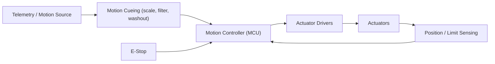

# Kiến trúc Nền tảng Chuyển động

> Phiên bản: 1.0
> Đánh giá: 2026-07-02
> Mục đích: giới thiệu nền tảng chuyển động (giàn motion cueing) như một hệ thống con, ở cấp độ kiến trúc. Trả lời một phần của câu hỏi mở rộng trong [sim_racing_research.md](./sim_racing_research.md) §13.

## Nhật ký thay đổi tài liệu

| Phiên bản | Ngày | Thay đổi |
|---|---|---|
| 1.0 | 2026-07-02 | Tài liệu mới. Xử lý cấp kiến trúc dựa trên dự án `VNM_MOTION_CONTROLLER` từ [repos.md](./repos.md) và mô hình an toàn hệ sinh thái trong [sim_racing_research.md](./sim_racing_research.md). |

## 1. Mục đích

Một nền tảng chuyển động vật lý di chuyển buồng lái để tạo tín hiệu cho hệ thống tiền đình của người lái — truyền đạt gia tốc, phanh và kết cấu đường mà một giàn tĩnh không thể. Tài liệu này xác định các ranh giới kiến trúc và trên hết là các yêu cầu an toàn; nó không chỉ định chi tiết bên trong của một sản phẩm cụ thể.

> [!IMPORTANT]
> Nền tảng chuyển động di chuyển một người bằng năng lượng. Các yêu cầu an toàn trong §6 không phải là tùy chọn và được ưu tiên hơn tính chân thực (fidelity).

## 2. Trách nhiệm

- Nhận một nguồn chuyển động (gia tốc xuất phát từ telemetry, hoặc đầu ra chuyển động của trò chơi).
- Áp dụng motion cueing (chia tỷ lệ, lọc và washout) để phù hợp với hành trình thực của bộ truyền động.
- Chỉ huy các bộ truyền động trong các giới hạn cứng về hành trình, vận tốc và lực.
- Phát hiện các lỗi và đưa nền tảng về trạng thái an toàn khi có bất kỳ sự bất thường nào.

## 3. Các bậc tự do (Chung)

Theo kiến thức chung **đã được xác minh công khai**, các nền tảng hobby và prosumer thường được mô tả bởi các bậc tự do (degrees of freedom - DOF) được kích hoạt của chúng: heave (trục dọc), pitch, roll, surge, sway, và yaw. Các nền tảng nhỏ thường kích hoạt một tập hợp con (ví dụ: pitch và roll); các giàn lớn hơn thêm nhiều hơn. Số DOF và hình học chính xác tùy thuộc vào từng nền tảng.

Mỗi trục mang lại một cảm giác khác nhau: surge truyền đạt sự tăng tốc và phanh, sway truyền đạt tải trọng khi vào cua, heave truyền đạt các chướng ngại vật và đỉnh đồi, trong khi pitch (mũi lên/xuống), roll (nghiêng khi vào cua), và yaw (quay, ví dụ như bắt đầu bị spin) là ba chuyển động xoay. Chiến lược cueing chọn nền tảng nào trong số này có thể thể hiện được và ở cường độ bao nhiêu.

## 4. Kiến trúc Bộ điều khiển

**Hình 4-1: Đường dẫn Điều khiển Chuyển động**

Các bộ điều khiển DIY từ cộng đồng tồn tại cho lớp phần cứng này: `VNM_MOTION_CONTROLLER` được ghi chép dưới dạng firmware dựa trên STM32F401RCT và một bộ cấu hình để xây dựng phần cứng DIY bao gồm cả giàn chuyển động (xem [repos.md](./repos.md)). Đây là bằng chứng **thực hiện cộng đồng**, không phải là một thiết kế tham chiếu.

## 5. Motion Cueing (Chung)

Motion cueing ánh xạ các gia tốc ảo lớn vào hành trình vật lý nhỏ. Theo **suy luận kỹ thuật** từ thực tiễn mô phỏng chuyển động tiêu chuẩn, một giai đoạn cueing sẽ chia tỷ lệ đầu vào, áp dụng lọc, và sử dụng một bộ lọc **washout** để đưa các bộ truyền động trở về vị trí trung tâm sau một đầu vào kéo dài để nền tảng không chạm tới giới hạn hành trình của nó. Việc tinh chỉnh sẽ cân bằng giữa cường độ tín hiệu và hành trình khả dụng.

## 6. Yêu cầu An toàn

Những yêu cầu này là bắt buộc và phù hợp với lập trường an toàn trong [sim_racing_research.md](./sim_racing_research.md) và [tools.md](./tools.md) (E-stop / fault-injection).

- Một **E-stop** phần cứng **phải** có mặt và **phải** ngắt nguồn của bộ truyền động độc lập với trạng thái firmware.
- Các giới hạn cứng về hành trình, vận tốc và lực **phải** được thực thi và **không được** để người dùng ghi đè vượt quá phạm vi an toàn.
- Cảm biến vị trí/giới hạn **phải** được xác thực; mất cảm biến **phải** kích hoạt trạng thái dừng an toàn.
- Trong trường hợp có bất kỳ lỗi nào (mất cảm biến, hết thời gian lệnh, vượt ngoài phạm vi), bộ điều khiển **phải** đưa nền tảng về một trạng thái an toàn được xác định và chốt cho đến khi có một lệnh khởi động lại được xác thực.
- Hệ thống **không được** thực hiện các cách để vượt qua những khóa liên động này. Việc thử nghiệm chuyển động toàn năng **phải** tuân theo các bài kiểm tra gating HIL/fault-injection trong [tools.md](./tools.md) §5.

## 7. Giao diện Giao tiếp

Bộ điều khiển nhận dữ liệu chuyển động từ đường ống telemetry (xem [telemetry.md](./telemetry.md)) qua USB/serial hoặc mạng, và ra lệnh cho các driver của bộ truyền động qua giao diện cụ thể của driver đó (PWM, step/direction, hoặc bus điều khiển động cơ). Các giao diện **phải** sử dụng các tin nhắn có độ dài được kiểm tra, được giới hạn cùng với một cơ quan giám sát thời gian chờ lệnh.

## 8. Chiến lược Debug

Khởi động hệ thống với một nguồn cấp có giới hạn dòng và, nếu có thể, không có tải; xác thực E-stop và xử lý giới hạn *trước khi* gắn vào buồng lái; đo lường độ trễ từ lệnh đến chuyển động; và xác nhận bộ lọc washout giữ cho các bộ truyền động không chạm vào các điểm dừng cuối của chúng dưới một đầu vào kéo dài.

## 9. Quan điểm Firmware

Bộ điều khiển chuyển động là một hệ thống truyền động thời gian thực với con người trong vòng lặp (human in the loop). Nó **phải** coi nguồn chuyển động là không đáng tin cậy, thực thi các giới hạn trong firmware độc lập với nguồn, và fail safe. Chất lượng của tín hiệu là thứ yếu so với việc không bao giờ vượt quá phong bì an toàn.

## 10. Điểm chính Cần ghi nhớ

- Nền tảng chuyển động báo hiệu gia tốc thông qua hành trình vật lý có giới hạn; quá trình cueing cộng với washout làm cho điều này trở nên khả thi.
- An toàn (E-stop, giới hạn cứng, dừng an toàn do lỗi) là bắt buộc và không thể vượt qua.
- Các bộ điều khiển DIY có tồn tại (`VNM_MOTION_CONTROLLER`) dưới dạng bằng chứng cộng đồng, không phải là thiết kế tham chiếu.
- Nguồn chuyển động đến từ đường ống telemetry; hãy coi nó là không đáng tin cậy.

## Tài liệu Tham khảo

- [vnmsimulation/VNM_MOTION_CONTROLLER](https://github.com/vnmsimulation/VNM_MOTION_CONTROLLER) — Bộ điều khiển chuyển động/phần cứng DIY dựa trên STM32.
- [telemetry.md](./telemetry.md) — đường ống nguồn chuyển động.
- [tools.md](./tools.md) — thiết bị HIL và gating tiêm lỗi.
- [cockpits.md](./cockpits.md) — cấu trúc mà một nền tảng di chuyển.

## Sổ đăng ký Câu hỏi (Đã giải quyết và Mở)

Được đánh giá: 2026-07-05.

### Đã giải quyết (theo phương pháp / phạm vi điển hình)

- **Tiêu chí chấp nhận độ trễ và dừng an toàn — cách thiết lập chúng.**
  Độ trễ motion cueing nên được lập ngân sách theo từng giai đoạn cộng dồn (telemetry → thuật toán cueing → lệnh bộ truyền động → phản hồi bộ truyền động) và được giữ ở mức đủ thấp để chuyển động khớp với tín hiệu hình ảnh/FFB thay vì bị tụt hậu so với nó. Dừng an toàn là một **yêu cầu an toàn cứng**, không phải là mục tiêu điều chỉnh: nền tảng phải có E-stop độc lập và thời gian dừng có giới hạn, được kiểm soát với các bộ truyền động chuyển về trạng thái an toàn khi có lỗi — điều này phản ánh nguyên tắc ức chế phần cứng của wheel base (lỗi dẫn đến trạng thái an toàn, phần cứng có thẩm quyền cao hơn phần mềm). Các ngưỡng *số* cụ thể phụ thuộc vào từng sản phẩm và được thiết lập từ lớp bộ truyền động đã chọn (2.2).

### Mở — dành cho nhà phát triển tự điều tra

- **Những bậc tự do (DOF), lớp bộ truyền động và giới hạn hành trình nào sẽ nằm trong phạm vi, và tiêu chí chấp nhận bằng số cho độ trễ và thời gian dừng an toàn trên phần cứng mục tiêu là gì?**
  *Cách điều tra:* một quyết định về phạm vi. Chọn tập hợp DOF (ví dụ: bộ di chuyển ghế 2-DOF, 3-DOF, hoặc nền tảng Stewart 6-DOF — xem hình minh họa 6-DOF) và lớp bộ truyền động (belt/servo so với bộ truyền động tuyến tính) từ trải nghiệm và ngân sách mục tiêu; những lựa chọn đó đặt ra các giới hạn hành trình, lực và tốc độ. Sau đó **đo lường** độ trễ cueing từ đầu đến cuối đạt được và thời gian dừng an toàn được kiểm soát trên nền tảng đã xây dựng và xác nhận với phong bì an toàn trước khi sử dụng mà không có sự giám sát. Không hoàn thiện các con số chấp nhận trước khi lựa chọn bộ truyền động — chúng vô nghĩa nếu không có nó.
