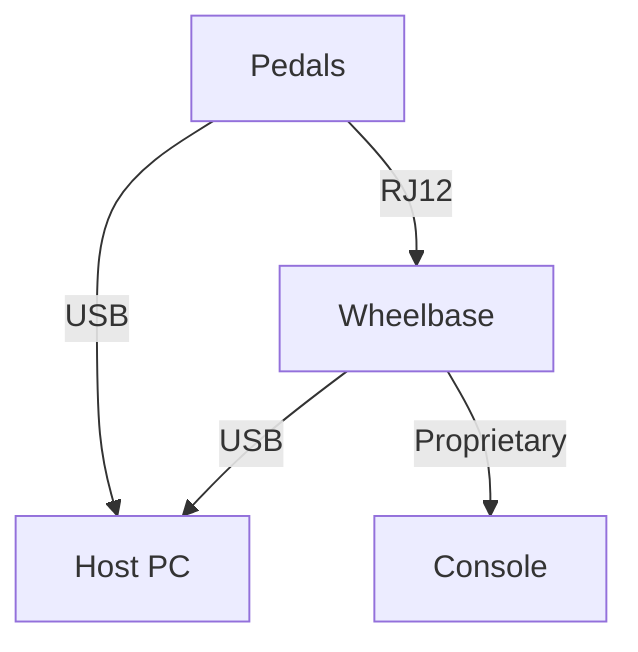

# Kiến trúc Bàn đạp Sim Racing

> Ngày nghiên cứu: 2026-07-02
> Mô hình bằng chứng: tiêu chuẩn công khai, hướng dẫn sử dụng/hỗ trợ của nhà sản xuất, và các dự án cộng đồng. Các dự án cộng đồng là bằng chứng triển khai, không phải là thông số kỹ thuật chính thức từ nhà cung cấp.
> Tài liệu liên quan: [sim_racing_research.md](./sim_racing_research.md), [wheel_base.md](./wheel_base.md), [add_ons.md](./add_ons.md), [repos.md](./repos.md).

## 1. Giới thiệu và Phạm vi

Tài liệu này cung cấp một cái nhìn tổng quan kỹ thuật về kiến trúc phần cứng và phần mềm của bàn đạp mô phỏng đua xe (sim racing) hiện đại. Nó được thiết kế để giới thiệu các khái niệm cơ bản về thiết bị ngoại vi sim racing cho các kỹ sư, đồng thời trình bày chi tiết về các hệ thống nhúng điều khiển chúng. Người đọc nên có một sự hiểu biết cơ bản về vi điều khiển và xử lý tín hiệu analog trước khi đọc đặc điểm kỹ thuật này.

Tài liệu này mô tả các công nghệ cảm biến vật lý, chuỗi tín hiệu analog-to-digital, các giao thức truyền thông được sử dụng để giao tiếp với hệ thống máy chủ, và lớp phần mềm chịu trách nhiệm hiệu chuẩn và telemetry.

---

## 2. Công nghệ Cảm biến

Phần này trình bày chi tiết về các cảm biến vật lý được sử dụng để chuyển đổi chuyển động cơ học của bàn đạp thành các tín hiệu điện. Việc hiểu các cảm biến này là rất quan trọng để đánh giá độ bền, độ chính xác và cảm giác thực tế của một bộ bàn đạp.

### 2.1 Chiết áp (Potentiometers)

Chiết áp là các điện trở quay dựa trên tiếp xúc để đo khoảng cách di chuyển (vị trí) của bàn đạp. Khi bàn đạp được nhấn, một cần gạt cơ học di chuyển trên một dải điện trở, tạo ra một đầu ra điện áp biến thiên.

Được đọc dưới dạng một bộ chia điện áp, đầu ra đơn giản là `V_out = V+ × (vị trí cần gạt / toàn dải)`. Điều này vừa rẻ vừa đơn giản để ADC có thể đọc được, nhưng điểm tiếp xúc trượt cũng chính là điểm yếu: nó sẽ bị mài mòn, và các dải bị mòn sẽ sinh ra nhiễu và điểm chết (dead spots). (Bảng bên phải hiển thị một bộ mã hóa quay để so sánh — một giải pháp thay thế không tiếp xúc được sử dụng cho góc lái và cảm biến rô-to thay vì chuyển động của bàn đạp.)

*   Hệ thống **phải** cung cấp một điện áp tham chiếu ổn định cho chiết áp.
*   Chiết áp dễ bị hao mòn cơ học theo thời gian, điều này sẽ tạo ra nhiễu hoặc "điểm chết" trong tín hiệu.

### 2.2 Cảm biến Hiệu ứng Hall

Cảm biến Hiệu ứng Hall là các thiết bị không tiếp xúc đo lường sự thay đổi trong từ trường để xác định vị trí bàn đạp. Một nam châm gắn vào tay đòn bàn đạp di chuyển tương đối so với cảm biến, làm thay đổi từ thông.

Bởi vì không có sự tiếp xúc vật lý giữa nam châm và cảm biến, nên không có gì bị mài mòn. Sự đánh đổi là độ nhạy với vị trí: kích thước nam châm, khoảng cách không khí và sự căn chỉnh phải chuẩn xác, và việc hiệu chuẩn nên giữ hành trình của bàn đạp bên trong phạm vi tuyến tính của cảm biến (đầu ra sẽ bão hòa nếu nằm ngoài phạm vi này, như đường cong ở trên cho thấy).

*   Các triển khai Hiệu ứng Hall **phải** sử dụng một tham chiếu từ tính cố định để đảm bảo việc theo dõi vị trí có thể lặp lại chính xác.
*   Bởi vì chúng không có tiếp xúc vật lý, cảm biến Hiệu ứng Hall có độ bền cực cao và miễn nhiễm với sự mài mòn do ma sát thường thấy ở chiết áp.

### 2.3 Load Cell

Load cell đo lường lực vật lý (áp lực) được tác dụng lên bàn đạp thay vì vị trí của nó. Chúng sử dụng các cảm biến đo biến dạng (strain gauges) biến dạng dưới tác dụng của áp lực, làm thay đổi điện trở của chúng và tạo ra một tín hiệu vi sai ở mức microvolt. Điều này mô phỏng các hệ thống phanh thủy lực trong thế giới thực, nơi áp lực bàn đạp quyết định lực phanh.

Lý do tín hiệu thô quá nhỏ — và tại sao một bộ khuếch đại là điều kiện bắt buộc — có thể được nhìn thấy trong sơ đồ cầu ở trên. Bốn cảm biến biến dạng được đấu dây vào một cầu Wheatstone, hai cái chịu lực kéo và hai cái chịu lực nén, do đó việc tác dụng lực làm mất cân bằng cầu và tạo ra một điện áp vi sai. Sự sắp xếp này tăng gấp đôi độ nhạy và triệt tiêu sự trôi dạt nhiệt độ, nhưng đầu ra vẫn chỉ ở mức microvolt đến millivolt, vì vậy một bộ khuếch đại đo lường (instrumentation amplifier) được đặt giữa cầu và ADC.

*   Một bàn đạp phanh dựa trên load cell **phải** được kết hợp với một môi trường cản cơ học thích hợp (ví dụ: chất đàn hồi hoặc lò xo) để cung cấp phản hồi vật lý.
*   Tín hiệu thô từ một load cell **phải** được khuếch đại bằng một bộ khuếch đại đo lường trước khi chuyển đổi từ analog sang digital.

**Bảng 2-1: So sánh Công nghệ Cảm biến**

| Loại Cảm biến | Đo lường | Loại Tiếp xúc | Độ bền | Ứng dụng Tiêu biểu |
|-------------|-------------|--------------|------------|---------------------|
| Chiết áp | Vị trí | Tiếp xúc | Thấp | Bàn đạp phổ thông |
| Hiệu ứng Hall | Vị trí | Không tiếp xúc | Cao | Ga, Côn |
| Load Cell | Lực | Không tiếp xúc | Cao | Phanh |

---

## 3. Kiến trúc Phần cứng và Chuỗi Tín hiệu

Phần này đề cập đến việc định tuyến tín hiệu điện tử và xử lý cần thiết để số hóa các đầu vào cảm biến analog.

Chuỗi tín hiệu phần cứng chuyển đổi đầu vào vật lý thành một giá trị digital có thể được xử lý bởi một vi điều khiển. Các bàn đạp cao cấp đòi hỏi các Bộ chuyển đổi Analog-to-Digital (ADC) có độ chính xác cao để đảm bảo nhiễu ở mức tối thiểu và độ nhạy cao.

**Hình 3-1: Chuỗi Tín hiệu Phần cứng Bàn đạp**

### 3.1 Chuyển đổi Analog-to-Digital

Các tín hiệu analog thô từ các cảm biến phải được số hóa. Độ phân giải của ADC tác động trực tiếp đến độ chính xác của đầu vào bàn đạp.

Một ADC ghi lại tín hiệu analog liên tục thành một loạt các bước rời rạc. Nhiều bit hơn có nghĩa là có nhiều bước hơn, do đó cầu thang được ghi lại sẽ bám sát tín hiệu thực một cách chặt chẽ hơn và bàn đạp di chuyển trơn tru hơn thay vì những bước nhảy rõ rệt. Đây là lý do tại sao một load cell — có tín hiệu khả dụng là rất nhỏ ngay cả sau khi được khuếch đại — lại được hưởng lợi từ việc chuyển đổi 16-bit hoặc cao hơn, trong khi các cảm biến vị trí là đủ với mức 12-bit. Có một lưu ý quan trọng là các bit bổ sung chỉ hữu ích nếu tín hiệu analog là sạch; nếu không có một tham chiếu ổn định và bộ lọc thích hợp, các bit bổ sung đơn giản chỉ số hóa sự nhiễu.

*   Hệ thống **phải** số hóa tín hiệu load cell đã khuếch đại bằng cách sử dụng một ADC có độ phân giải cao (ví dụ: HX711 hoặc ADS1115).
*   Độ phân giải ADC **nên** ít nhất là 12-bit cho chiết áp và cảm biến Hiệu ứng Hall, và 16-bit hoặc cao hơn cho các load cell.
*   Phần cứng **phải** triển khai lọc thông thấp (low-pass filtering) để giảm thiểu nhiễu điện tần số cao trước giai đoạn lấy mẫu của ADC.

---

## 4. Giao diện Giao tiếp

Phần này giải thích hai phương pháp chính để kết nối bàn đạp sim racing với một hệ thống máy chủ: kết nối USB trực tiếp và ủy quyền (proxying) qua cổng RJ12 tới wheel base.

Bàn đạp phải truyền trạng thái kỹ thuật số của chúng tới phần mềm mô phỏng. Việc lựa chọn giao diện ảnh hưởng đến sự tiện lợi, khả năng tương thích hệ sinh thái, và đôi khi là tốc độ lấy mẫu (polling rate).

**Hình 4-1: Cấu trúc Giao tiếp**

### 4.1 USB (Trực tiếp tới Máy chủ)

Kết nối bàn đạp trực tiếp với PC chủ qua USB cho phép bàn đạp hoạt động như một Thiết bị Giao diện Con người (Human Interface Device - HID) độc lập.

*   Tần suất lấy mẫu/báo cáo, đường dẫn cập nhật firmware, và các công cụ hiệu chuẩn có sẵn là cụ thể cho từng sản phẩm.
*   USB trực tiếp là đường dẫn kết nối PC. Các phụ kiện Fanatec phải kết nối qua một wheel base của Fanatec để sử dụng trên console.
*   Bàn đạp CSL Pedals cơ bản không đi kèm kết nối USB độc lập. Đường dẫn USB được hỗ trợ đòi hỏi phải có CSL Pedals Load Cell Kit hoặc ClubSport USB Adapter.
*   Bàn đạp USB của bên thứ ba có thể hoạt động độc lập trên PC nhưng không thể kết nối trực tiếp vào cổng bàn đạp của wheel base Fanatec.

### 4.2 Ủy quyền qua RJ12 (thông qua Wheelbase)

Kết nối bàn đạp với wheel base qua cáp RJ12 cho phép wheel base hoạt động như một proxy, biên dịch các tín hiệu bàn đạp thành giao thức giao tiếp của riêng nó.

*   Base sẽ tổng hợp các trục bàn đạp vào báo cáo gửi máy chủ của mình và cung cấp đường dẫn console cần thiết.
*   Các bàn đạp load cell được hỗ trợ có thể hiển thị điều chỉnh Lực Phanh (Brake Force - BRF) thông qua Tuning Menu của base.
*   Tuân thủ hướng dẫn sử dụng chính xác của bàn đạp để lựa chọn USB / RJ12. Không giả định rằng việc kết nối đồng thời được phép trên tất cả các mẫu.

**Bảng 4-1: So sánh Giao diện**

| Tính năng | USB | RJ12 (Proxy qua Wheelbase) |
|---------|-----|------------------------|
| Độ phân giải/tốc độ báo cáo | Tùy thuộc vào sản phẩm | Tùy thuộc vào sản phẩm/base |
| Nền tảng | Đường dẫn PC được hỗ trợ | PC và các console được hỗ trợ thông qua base tương thích |
| Tinh chỉnh | Phần mềm sản phẩm/App | Hành vi Base/App phụ thuộc vào mẫu bàn đạp |
| Cập nhật firmware | Tùy thuộc vào sản phẩm | Tuân thủ hướng dẫn hiện hành/luồng làm việc của App |

---

## 5. Kiến trúc Phần mềm

Phần này mô tả logic phần mềm chịu trách nhiệm xử lý các giá trị digital thô và ánh xạ chúng đến các đầu vào tiêu chuẩn của game.

Firmware nhúng và phần mềm trên PC chủ hoạt động cùng nhau để hiệu chuẩn bàn đạp, áp dụng các đường cong tùy chỉnh, và cung cấp phản hồi xúc giác (haptic feedback).

### 5.1 Hiệu chuẩn và Lọc

*   Firmware bàn đạp **phải** cho phép người dùng xác định các giới hạn tối thiểu (deadzone) và tối đa (saturation) cho mỗi trục.
*   Phần mềm **nên** triển khai bộ lọc động (ví dụ: bộ lọc trung bình động hoặc Kalman filter) để làm mịn sự rung lắc của load cell mà không gây ra độ trễ quá mức.
*   Các tham số hiệu chuẩn **phải** được lưu trữ trong bộ nhớ không bay hơi (non-volatile memory) trên bộ điều khiển bàn đạp để đảm bảo chúng vẫn được duy trì qua các lần tắt mở nguồn.

### 5.2 Ánh xạ HID và Telemetry

*   Bộ điều khiển **phải** báo cáo các giá trị bàn đạp đã được hiệu chuẩn thành các trục joystick HID tiêu chuẩn.
*   Nếu được trang bị các bộ truyền động xúc giác (ví dụ: động cơ rung), phần mềm **có thể** đọc telemetry của game (chẳng hạn như khi kích hoạt ABS hoặc trượt bánh xe) để kích hoạt phản hồi vật lý thông qua mặt bàn đạp.

---

## 6. Phân tích Kho chứa (Repository Analysis)

Phần này khám phá cách các dự án mã nguồn mở cộng đồng tiếp cận việc giả lập bàn đạp và chuyển đổi giao diện.

### 6.1 `jssting/ArduinoTec-Pedals`

| Khía cạnh | Khám phá |
|---|---|
| Mục tiêu | Thay thế bộ điều khiển bàn đạp CSP V1 bằng một MCU USB độc lập |
| Bộ điều khiển | Leonardo, Pro Micro, hoặc Teensy sử dụng ArduinoJoystickLibrary |
| Cảm biến | Cảm biến Hall tuyến tính hiện có; load cell thông qua bộ khuếch đại hiện có hoặc bên ngoài |
| Đầu ra | Trục joystick USB; hiệu chuẩn trên máy chủ |
| Đầu ra bổ sung | Động cơ rung bàn đạp qua bóng bán dẫn/PWM |
| Bài học sản phẩm | Bàn đạp phải hoạt động như một cảm biến/nút USB riêng biệt; bộ xử lý tín hiệu analog (AFE) của load cell, hành vi của cảm biến Hall analog, và truyền động động cơ yêu cầu các quyền sở hữu riêng biệt. |

### 6.2 `GeekyDeaks/fanatec-pedal-emulator`

| Khía cạnh | Khám phá |
|---|---|
| Mục tiêu | Proxy bàn đạp USB của bên thứ ba vào wheel base Fanatec qua RJ12 |
| Nền tảng | Raspberry Pi Pico (RP2040) hoạt động như một máy chủ USB và trình giả lập tín hiệu analog RJ12 |
| Động lực | Cho phép sử dụng bàn đạp không phải của Fanatec trên các console, vượt qua hệ thống bảo mật của console |
| Bài học sản phẩm | Cổng bàn đạp của wheel base là một giao diện analog/digital (không phải USB), có thể bị giả lập bởi DAC/PWM bên ngoài để proxy cho các thiết bị khác. |

## 7. Sổ đăng ký Câu hỏi (Đã giải quyết và Mở)

Được đánh giá: 2026-07-05.

### 7.1 Đã giải quyết

- **Ngân sách độ trễ chấp nhận được (ms) từ khi nhấn bàn đạp vật lý cho đến khi truyền gói tin USB HID đối với thể thao điện tử cạnh tranh là bao nhiêu?**
  **Suy luận kỹ thuật.** Yếu tố chiếm ưu thế, có thể kiểm soát được là khoảng thời gian báo cáo (report interval): một thiết bị HID 1000 Hz (khoảng thời gian 1 ms) sẽ giới hạn độ trễ lượng tử hóa ở khoảng ~1 ms, so với ~8 ms ở 125 Hz. Do đó, một mục tiêu mang tính cạnh tranh là **khoảng thời gian lấy mẫu 1 ms** cộng với một độ trễ lấy mẫu/lọc được giới hạn, giữ cho khoảng thời gian từ lúc nhấn đến khi báo cáo nằm thoải mái dưới một khung hình game (≈16.7 ms ở 60 Hz). Hãy coi 1 ms như là ngân sách *vận chuyển* và đo lường độ trễ của cảm biến + bộ lọc riêng biệt (xem [`telemetry.md`](./telemetry.md) §6 cho phương pháp cộng dồn từng giai đoạn); việc lọc quá mức (lấy trung bình quá nhiều) thường là thủ phạm thực sự gây ra độ trễ chứ không phải do USB.
- **Firmware nên hỗ trợ các đường cong gamma phi tuyến tính tùy chỉnh trên MCU, hay ủy quyền cho phần mềm máy chủ?**
  **Suy luận kỹ thuật: hỗ trợ cả hai, MCU ưu tiên cho tính di động.** Một đường cong trên thiết bị (bảng tra cứu qua phạm vi đã hiệu chuẩn) hoạt động ở khắp mọi nơi bao gồm cả trên console và không phụ thuộc vào phần mềm máy chủ, và là lựa chọn mặc định an toàn hơn; một đường cong trên máy chủ cung cấp khả năng chỉnh sửa phong phú hơn, dễ dàng hơn. Mô hình phổ biến là: MCU áp dụng hiệu chuẩn + một đường cong tùy chọn được lưu trữ; các công cụ trên máy chủ sẽ chỉnh sửa và upload đường cong đó. Giữ cho trục thô có sẵn để đường cong không bao giờ có tính phá hủy (destructive).
- **Có các giao thức wheel base độc quyền qua RJ12 đòi hỏi cấp phép hay kỹ thuật dịch ngược để tương thích chéo không?**
  **Bằng chứng cộng đồng (xác minh về điện).** Đường dẫn bàn đạp analog qua RJ12 rất đơn giản và đã được cộng đồng ghi chép — ví dụ: `fanatec-pedal-emulator` của GeekyDeaks báo cáo liên kết giữa bàn đạp CSL Elite và base là một **giao thức UART** thông thường (CP2102, chịu được 5 V) và công bố sơ đồ chân RJ12 (chân 1 = 3.3 V, chân 6 = GND, tín hiệu analog nằm ở giữa; phía wheel base mang theo RX/TX/Vcc). Không cần giấy phép cho chính đường dẫn bàn đạp *analog/serial*; điều bị cấp phép/độc quyền chính là **xác thực console** mà base thực hiện ở hệ thống tuyến trên, vốn là một vấn đề tách biệt với liên kết bàn đạp. Các mô-đun CSL Elite LC cũ hơn sử dụng PIC18F26J53. Hãy xác nhận bất kỳ sơ đồ chân nào trên phần cứng chính xác của bạn trước khi kết nối.

### 7.2 Mở — dành cho nhà phát triển tự điều tra

- **Giới hạn điện và gán chân RJ12 chính xác cho từng mẫu trên toàn bộ dòng sản phẩm.**
  *Cách làm:* sơ đồ chân từ cộng đồng ở trên chỉ bao gồm các mô hình được chọn; hãy đo chân cắm trên thiết bị mục tiêu của bạn (điện áp tham chiếu, phạm vi tín hiệu, giới hạn dòng điện) trước khi ủy quyền cho phần cứng bên thứ ba, và không bao giờ được vượt qua giới hạn của nguồn cấp trên base.

## 8. Tài liệu Tham khảo

### 8.1 Nguồn Chính thức và Tiêu chuẩn

- [Thông số kỹ thuật và công cụ USB-IF HID](https://www.usb.org/hid) — Descriptor HID và mô hình báo cáo cho các bàn đạp USB độc lập.
- [Hướng dẫn sử dụng Fanatec Podium DD1](https://assets.fanatec.com/fanatec-pwa/image/upload/downloads-prod/pdfs/P-WB-DD1-Manual-EN_web.pdf) — ngữ cảnh cập nhật/hiệu chuẩn công khai phía wheel base và các ràng buộc về tích hợp phụ kiện.
- [Fanatec Wheel Bases FAQ](https://help.fanatec.com/hc/en-us/articles/43766204938257-Wheel-Bases-A-FAQ) — tổng hợp console, thiết bị ngoại vi PC độc lập, và ranh giới bàn đạp của bên thứ ba.
- [Hướng dẫn kết nối USB trực tiếp cho Fanatec CSL Pedals](https://help.fanatec.com/hc/en-us/articles/30312127196945-How-can-I-connect-CSL-Pedals-directly-to-a-PC-via-USB) — yêu cầu của Load Cell Kit và ClubSport USB Adapter.

### 8.2 Nguồn Triển khai Cộng đồng

- [jssting/ArduinoTec-Pedals](https://github.com/jssting/ArduinoTec-Pedals) — Bộ điều khiển thay thế Arduino Leonardo/Pro Micro/Teensy cho bàn đạp Fanatec ClubSport cũ hơn.
- [GeekyDeaks/fanatec-pedal-emulator](https://github.com/GeekyDeaks/fanatec-pedal-emulator) — ủy quyền bàn đạp USB vào wheel base Fanatec thông qua giả lập cổng bàn đạp.
- [adamcrawley/fanatec-pedal-emulator-vrs](https://github.com/adamcrawley/fanatec-pedal-emulator-vrs) — Bản fork tập trung vào VRS của mẫu trình giả lập bàn đạp.
- [FendtXerion3800/Fanatec-Pinout](https://github.com/FendtXerion3800/Fanatec-Pinout) — quan sát đầu nối bàn đạp/shifter/handbrake từ cộng đồng; hãy xác minh trước khi sử dụng phần cứng.
- [Đăng ký nguồn hệ sinh thái Fanatec](./references.md) — độ tin cậy của nguồn và các ghi chú hiện hành.

### 8.3 Theo dõi Thiết kế

- Xây dựng một ma trận tương thích bàn đạp phân tách rõ hành vi của USB HID trực tiếp với hành vi proxy qua cổng wheel base.
- Nắm bắt các giới hạn điện đã biết từ các sách hướng dẫn đã được phê duyệt hoặc thông qua đo lường thủ công trước khi kết nối phần cứng của bên thứ ba.
