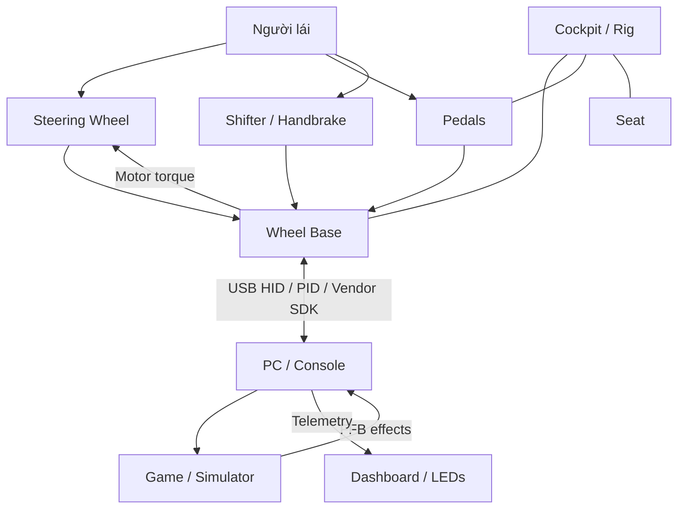
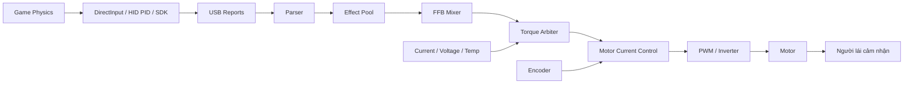
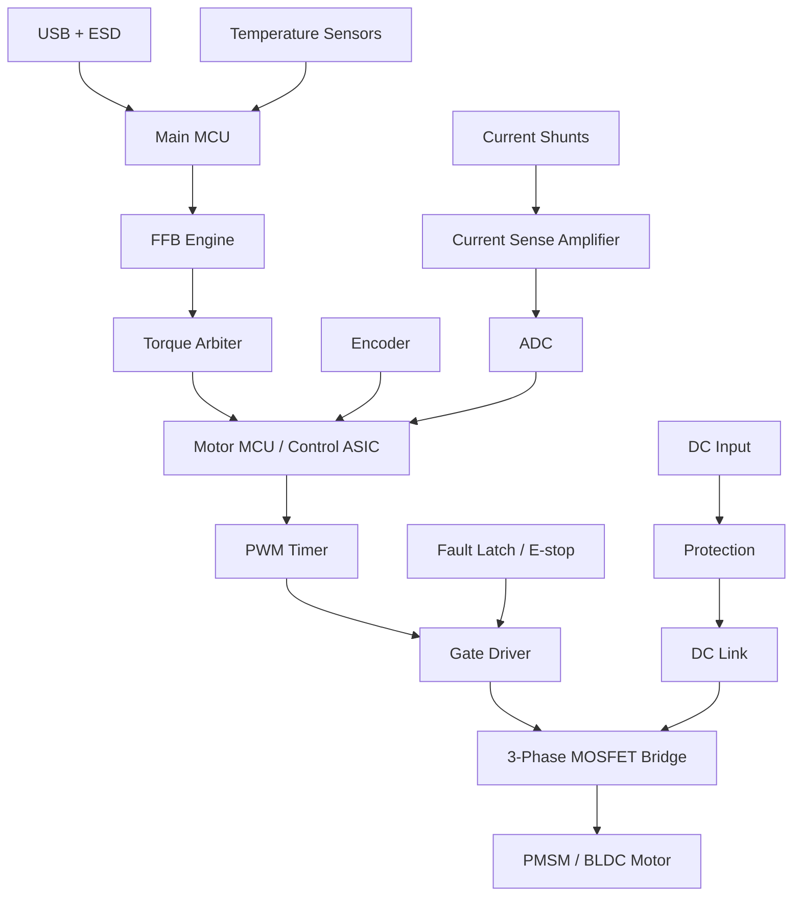
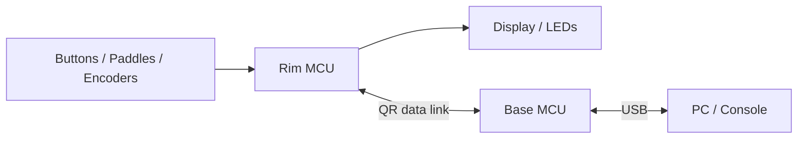
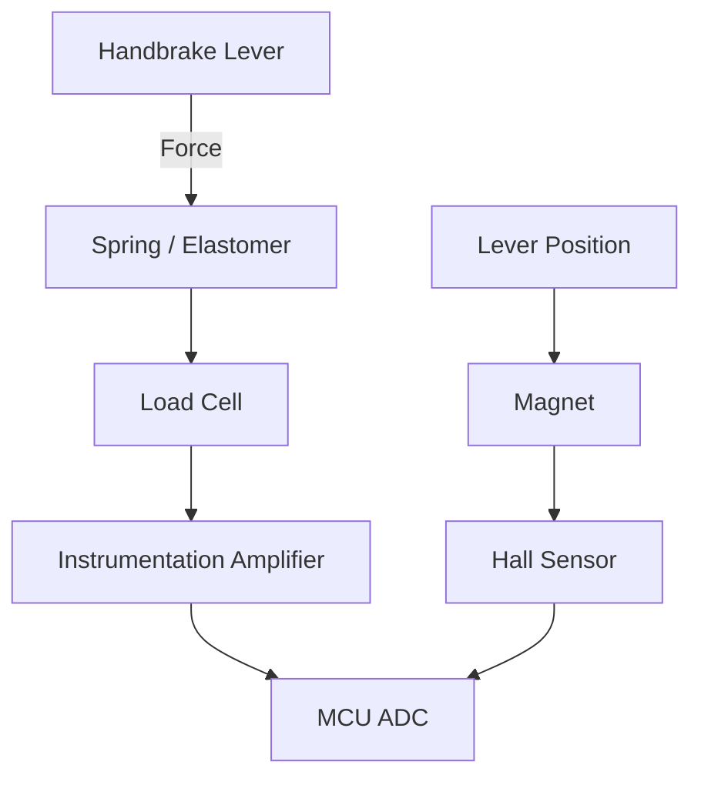
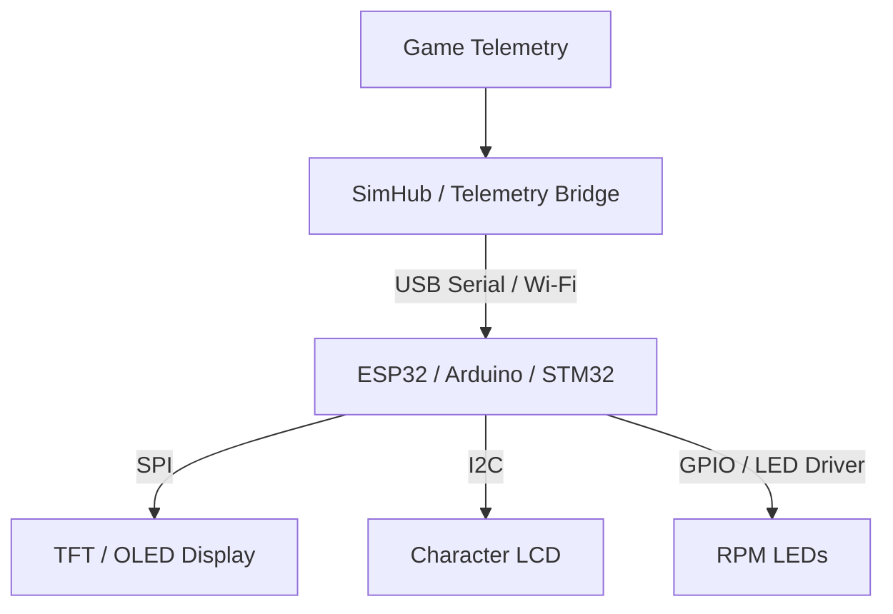
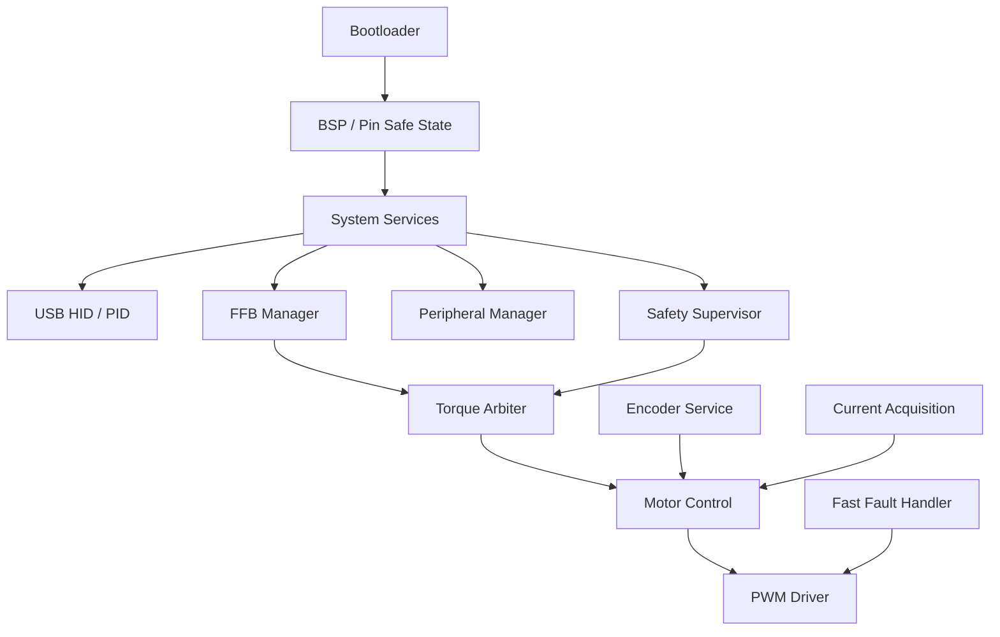
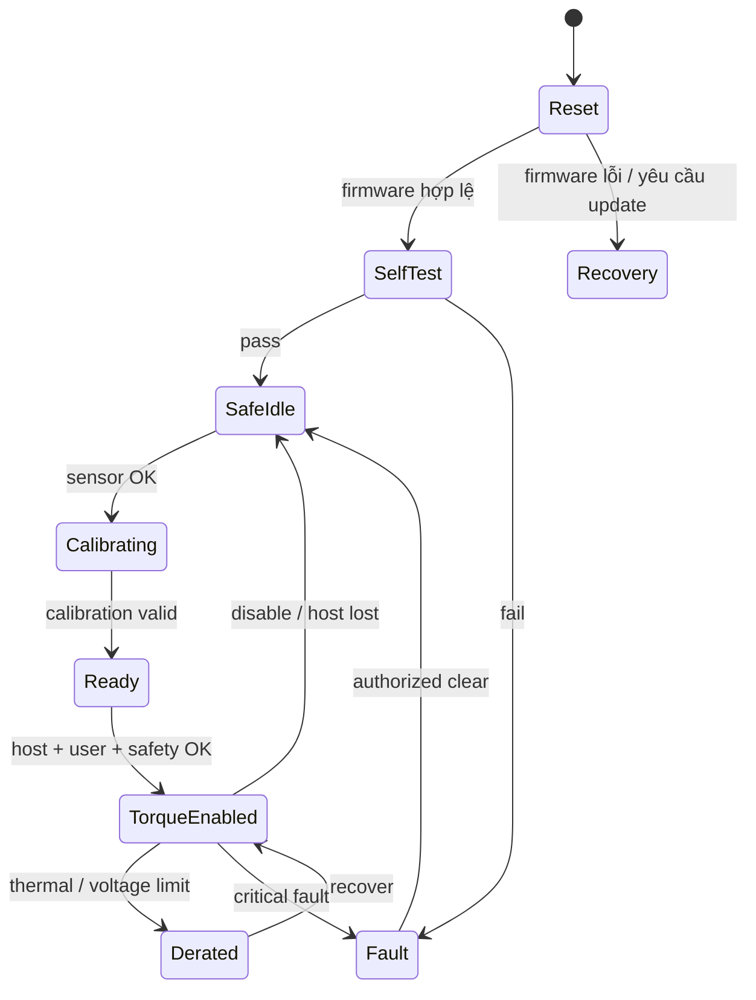
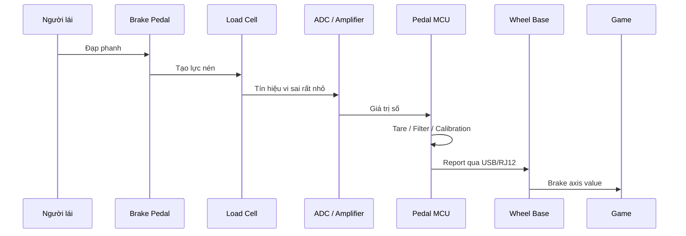
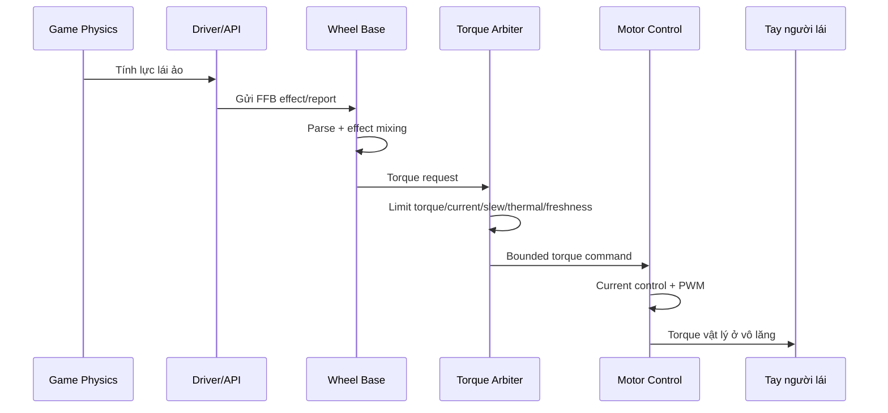

# Tổng hợp kiến thức cơ bản về Sim Racing cho người mới bắt đầu

> **Mục tiêu tài liệu:** giúp người mới hiểu các khái niệm nền tảng về vật lý, cảm biến, giao thức truyền thông, force feedback và các thành phần trong một bộ mô phỏng đua xe.
> **Đối tượng:** người mới tìm hiểu sim racing, kỹ sư embedded mới bước vào mảng wheel base / steering rim / pedals / peripherals, hoặc người muốn hiểu trước khi mua, lắp, test hoặc phát triển thiết bị.
> **Phạm vi:** kiến thức công khai, nguyên lý kỹ thuật phổ biến và kiến trúc tham khảo. Không mô tả reverse engineering firmware độc quyền, bypass bảo mật console, hoặc thông số bí mật của nhà sản xuất.

---

## Mục lục

1. [Sim racing là gì?](#1-sim-racing-là-gì)
2. [Bức tranh tổng thể của một hệ sim racing](#2-bức-tranh-tổng-thể-của-một-hệ-sim-racing)
3. [Kiến thức vật lý nền tảng](#3-kiến-thức-vật-lý-nền-tảng)
4. [Force feedback: lực phản hồi là gì?](#4-force-feedback-lực-phản-hồi-là-gì)
5. [Wheel base: trung tâm tạo lực và điều khiển an toàn](#5-wheel-base-trung-tâm-tạo-lực-và-điều-khiển-an-toàn)
6. [Steering wheel / steering rim](#6-steering-wheel--steering-rim)
7. [Pedals: ga, phanh, côn](#7-pedals-ga-phanh-côn)
8. [Shifter và handbrake](#8-shifter-và-handbrake)
9. [Quick release, dashboard và button box](#9-quick-release-dashboard-và-button-box)
10. [Cockpit / rig: khung cơ khí](#10-cockpit--rig-khung-cơ-khí)
11. [Cảm biến trong sim racing](#11-cảm-biến-trong-sim-racing)
12. [Giao thức truyền thông thường gặp](#12-giao-thức-truyền-thông-thường-gặp)
13. [Firmware và real-time control](#13-firmware-và-real-time-control)
14. [Hiệu chỉnh, lọc tín hiệu và độ trễ](#14-hiệu-chỉnh-lọc-tín-hiệu-và-độ-trễ)
15. [An toàn khi làm việc với hệ force feedback](#15-an-toàn-khi-làm-việc-với-hệ-force-feedback)
16. [Công cụ học tập, đo kiểm và debug](#16-công-cụ-học-tập-đo-kiểm-và-debug)
17. [Lộ trình học cho người mới](#17-lộ-trình-học-cho-người-mới)
18. [Glossary thuật ngữ Anh - Việt](#18-glossary-thuật-ngữ-anh---việt)
19. [Checklist đọc nhanh](#19-checklist-đọc-nhanh)
20. [Tài liệu nguồn đã dùng](#20-tài-liệu-nguồn-đã-dùng)

---

## 1. Sim racing là gì?

**Sim racing** là mô phỏng lái xe đua bằng phần mềm mô phỏng và phần cứng điều khiển chuyên dụng. Một hệ cơ bản gồm:

- Game / simulator trên PC hoặc console.
- Wheel base tạo lực phản hồi ở trục vô lăng.
- Steering wheel / rim để người lái cầm, bấm nút, sang số bằng paddle.
- Pedals: ga, phanh, côn.
- Shifter, handbrake, dashboard, button box nếu cần.
- Cockpit / rig giữ cố định toàn bộ phần cứng.

Điểm khác biệt lớn giữa sim racing và tay cầm/gamepad là **người lái nhận lại lực vật lý** từ vô lăng. Lực này gọi là **force feedback**. Nó giúp người lái cảm nhận xe đang bám đường, trượt, va chạm, qua kerb, hoặc mất lái.

---

## 2. Bức tranh tổng thể của một hệ sim racing

Một hệ sim racing là một hệ **human-machine bidirectional system**:

- Chiều người lái → game: vô lăng, pedal, nút bấm, shifter gửi input lên PC/console.
- Chiều game → người lái: game gửi force feedback / telemetry xuống thiết bị.
- Wheel base biến lệnh lực thành torque vật lý ở trục vô lăng.

**Sơ đồ tổng quan:**



### 2.1 Các thành phần chính

| Thành phần | Vai trò | Dữ liệu / tín hiệu chính |
|---|---|---|
| PC / Console | Chạy game, driver, updater | USB HID, PID, vendor protocol, telemetry |
| Wheel base | Tạo torque, đọc steering angle, quản lý an toàn | FFB, motor current, encoder, safety state |
| Steering wheel / rim | Nơi người lái cầm và nhập lệnh | Buttons, paddles, encoders, LEDs, display |
| Quick release | Khớp nối cơ khí và có thể truyền điện/dữ liệu | Torque coupling, power, data |
| Pedals | Ga, phanh, côn | Position hoặc force, ADC, USB/RJ12 |
| Shifter | Sang số H-pattern hoặc sequential | Switch / Hall / analog state |
| Handbrake | Phanh tay mô phỏng | Position hoặc force |
| Dashboard | Hiển thị telemetry | RPM, gear, speed, flags, tire temp |
| Button box | Nút phụ trợ | USB HID buttons, rotary encoders |
| Cockpit / rig | Khung cơ khí chịu lực | Độ cứng, chống flex |

---

## 3. Kiến thức vật lý nền tảng

Phần này rất quan trọng vì sim racing không chỉ là USB device. Nó là hệ cơ - điện - điều khiển. Wheel base tạo torque thật, pedal đo lực thật, cockpit chịu tải thật.

### 3.1 Force - lực

**Force** là lực, ký hiệu `F`, đơn vị **Newton (N)**.

Công thức nền tảng:

```text
F = m × a
```

Trong đó:

- `F`: lực, N.
- `m`: khối lượng, kg.
- `a`: gia tốc, m/s².

Trong sim racing:

- Lực tay tác dụng lên vô lăng.
- Lực chân tác dụng lên bàn đạp phanh.
- Lực do cockpit / pedal deck phải chịu.
- Lực quy đổi từ torque của motor ra tay người lái.

### 3.2 Torque - mô-men xoắn

**Torque** là lực làm vật quay, ký hiệu thường là `T` hoặc `τ`, đơn vị **N·m**.

Công thức đơn giản:

```text
T = F × r
```

Trong đó:

- `T`: torque, N·m.
- `F`: lực tiếp tuyến, N.
- `r`: bán kính / cánh tay đòn, m.

Ví dụ: wheel base tạo torque 10 N·m, steering wheel có bán kính 0.15 m. Lực tiếp tuyến trên tay xấp xỉ:

```text
F = T / r = 10 / 0.15 ≈ 66.7 N
```

Nếu dùng rim lớn hơn, cùng một torque ở trục sẽ cần lực tay nhỏ hơn để giữ lại.

### 3.3 Inertia - quán tính quay

**Inertia** là khả năng chống lại sự thay đổi tốc độ quay. Trong chuyển động thẳng có khối lượng `m`; trong chuyển động quay có moment of inertia `J`.

Công thức tương đương:

```text
T = J × α
```

Trong đó:

- `T`: torque.
- `J`: moment of inertia.
- `α`: angular acceleration, gia tốc góc.

Ý nghĩa trong sim racing:

- Rim càng nặng hoặc đường kính càng lớn thì quán tính càng cao.
- Quán tính cao làm vô lăng có cảm giác “nặng”, phản ứng chậm hơn.
- Direct-drive base tốt thường có motor và encoder đủ tốt để bù hoặc kiểm soát inertia.

### 3.4 Damping - giảm chấn

**Damping** là lực / torque chống lại vận tốc. Nếu bạn quay nhanh, damping tạo lực ngược lại để làm chuyển động mượt hơn.

```text
T_damping = -B × ω
```

Trong đó:

- `B`: hệ số damping.
- `ω`: tốc độ góc.

Trong FFB:

- Damping giúp giảm rung, giảm oscillation.
- Damping quá cao làm vô lăng “ì”, mất chi tiết mặt đường.
- Damping quá thấp có thể làm wheel rung, lắc qua lại quanh tâm.

### 3.5 Friction - ma sát

**Friction** chống lại chuyển động, kể cả khi chuyển động chậm.

Trong wheel base:

- Gear-driven base có backlash và friction cơ khí rõ hơn.
- Belt-driven base mượt hơn nhưng có độ đàn hồi dây đai.
- Direct-drive base ít truyền động trung gian nên ít sai số truyền lực hơn.

### 3.6 Spring - lực hồi tâm

Spring tạo torque kéo vô lăng về một vị trí trung tâm hoặc vị trí mục tiêu.

```text
T_spring = -K × θ
```

Trong đó:

- `K`: độ cứng lò xo ảo.
- `θ`: góc lệch khỏi vị trí trung tâm.

Trong game, hiệu ứng spring có thể dùng cho centering force, menu, hoặc một số chế độ đặc biệt. Tuy nhiên trong mô phỏng xe thật, lực hồi vô lăng thường đến từ mô hình lốp, caster, trail, slip angle và hệ thống treo chứ không chỉ là spring đơn giản.

### 3.7 Stiffness - độ cứng cơ khí

**Stiffness** là khả năng chống biến dạng. Trong cockpit, stiffness cực kỳ quan trọng.

Nếu cockpit flex:

- Wheel base torque bị “nuốt” bởi khung.
- Pedal deck lùi hoặc cong khi đạp phanh.
- Người lái cảm nhận FFB kém chính xác.
- Load cell brake bị sai cảm giác vì lực chân một phần biến thành biến dạng khung.

### 3.8 Latency - độ trễ

**Latency** là thời gian từ khi sự kiện xảy ra đến khi người lái cảm nhận được hoặc game nhận được input.

Các nguồn latency:

- Game physics update.
- Driver / API.
- USB polling.
- Firmware processing.
- FFB mixing.
- Motor control loop.
- Filter trong firmware hoặc game.
- Mechanical compliance của belt, gear, cockpit.

Trong sim racing, latency thấp giúp phản ứng xe tự nhiên hơn.

---

## 4. Force feedback: lực phản hồi là gì?

**Force feedback (FFB)** là quá trình chuyển thông tin vật lý trong game thành torque thật ở vô lăng.

Game không gửi trực tiếp “điện áp motor”. Thường game / driver gửi các hiệu ứng hoặc yêu cầu lực, sau đó firmware xử lý:



### 4.1 Các loại hiệu ứng FFB phổ biến

| Hiệu ứng | Ý nghĩa |
|---|---|
| Constant force | Lực không đổi theo một hướng |
| Spring | Kéo về tâm hoặc vị trí mục tiêu |
| Damper | Chống lại tốc độ quay |
| Friction | Chống lại chuyển động, gần giống ma sát |
| Periodic / sine | Rung tuần hoàn, rumble, texture |
| Condition effects | Lực phụ thuộc vị trí hoặc tốc độ |
| Collision / impact | Xung lực ngắn khi va chạm |
| Road texture | Rung chi tiết theo mặt đường / kerb |

### 4.2 Torque arbiter là gì?

**Torque arbiter** là khối quyết định torque cuối cùng được phép đưa xuống motor. Nó không chỉ cộng hiệu ứng FFB mà còn áp dụng giới hạn an toàn.

Torque arbiter thường kiểm tra:

- Giới hạn torque tối đa.
- Giới hạn dòng motor.
- Giới hạn slew rate, tức tốc độ thay đổi torque.
- Nhiệt độ motor / MOSFET / PCB.
- Điện áp DC bus.
- Tình trạng encoder.
- Tình trạng lệnh FFB có còn mới hay đã stale.
- Trạng thái E-stop, watchdog, fault latch.

Ý tưởng quan trọng:

> Game có thể yêu cầu lực, nhưng wheel base chỉ được tạo lực sau khi qua lớp giới hạn và an toàn.

### 4.3 FFB clipping

**Clipping** xảy ra khi game yêu cầu torque lớn hơn khả năng wheel base hoặc lớn hơn giới hạn người dùng đặt.

Ví dụ:

- Game yêu cầu 15 N·m.
- Wheel base đang giới hạn 8 N·m.
- Mọi giá trị trên 8 N·m đều bị cắt.

Hậu quả:

- Mất chi tiết lực ở vùng cao.
- Các tình huống khác nhau đều cảm giác “nặng như nhau”.
- Người lái khó cảm nhận grip limit.

### 4.4 Slew rate

**Slew rate** là giới hạn tốc độ thay đổi torque.

Nếu torque nhảy từ 0 lên 20 N·m quá nhanh, người dùng có thể bị giật tay. Slew limit làm torque tăng/giảm có kiểm soát hơn.

### 4.5 Oscillation

**Oscillation** là hiện tượng vô lăng tự lắc trái-phải, thường xảy ra quanh vị trí trung tâm.

Nguyên nhân thường gặp:

- FFB gain quá cao.
- Damping quá thấp.
- Filter hoặc latency làm vòng điều khiển mất ổn định.
- Wheel base quá mạnh nhưng game hoặc setting không phù hợp.

---

## 5. Wheel base: trung tâm tạo lực và điều khiển an toàn

Wheel base là phần quan trọng nhất của hệ sim racing có FFB. Nó vừa là:

- USB device giao tiếp với PC/console.
- Servo drive thời gian thực.
- Bộ điều khiển motor.
- Hub kết nối pedal, shifter, handbrake, rim.
- Hệ thống safety-critical vì có thể tạo torque lớn.

### 5.1 Các loại wheel base theo cơ cấu truyền động

| Loại | Đặc điểm | Ưu điểm | Nhược điểm |
|---|---|---|---|
| Gear-driven | Motor qua bánh răng | Rẻ, đơn giản | Backlash, ồn, cảm giác răng |
| Belt-driven | Motor qua dây đai | Mượt hơn gear | Belt stretch, compliance |
| Direct-drive | Motor nối trực tiếp trục vô lăng | Chính xác, torque cao, ít sai số truyền động | Đắt, yêu cầu an toàn cao |

### 5.2 Kiến trúc phần cứng wheel base

Một direct-drive wheel base thường có:

- Main MCU: USB, profile, setting, FFB, peripheral aggregation.
- Motor MCU / DSP / ASIC: encoder, current sampling, PWM, control loop.
- Encoder: đo góc trục.
- Current sense: đo dòng pha hoặc dòng DC.
- Gate driver: điều khiển MOSFET.
- Inverter 3 pha: biến DC bus thành dòng 3 pha cho motor.
- Power supply / DC input.
- Protection: fuse, reverse protection, TVS, inrush, overcurrent, thermal.
- E-stop hoặc torque-off input.



### 5.3 Motor control cơ bản

Với BLDC/PMSM, torque liên quan chặt với dòng điện:

```text
T ≈ Kt × Iq
```

Trong đó:

- `T`: torque.
- `Kt`: hằng số torque.
- `Iq`: dòng tạo torque trong điều khiển FOC.

Ý nghĩa:

- Muốn torque lớn hơn → cần dòng lớn hơn.
- Dòng lớn làm nóng motor và MOSFET.
- Vì vậy firmware phải giới hạn current, torque và nhiệt.

### 5.4 Servo motor là gì?

Trong bối cảnh direct-drive wheel base, thuật ngữ **servo motor** được sử dụng rất phổ biến. Servo motor không hẳn là một loại thiết kế điện từ cụ thể (nó có thể là BLDC, PMSM, hoặc thậm chí là DC motor có chổi than). Thay vào đó, nó ám chỉ một motor hoạt động trong một **hệ thống điều khiển vòng kín (closed-loop control system)**.

Một hệ servo thực sự cần có:

1. **Motor:** Để tạo ra torque và chuyển động (ví dụ: PMSM).
2. **Cảm biến (encoder):** Để cung cấp phản hồi chính xác, theo thời gian thực về vị trí, tốc độ và đôi khi là gia tốc của trục.
3. **Bộ điều khiển (controller):** Để liên tục so sánh vị trí/tốc độ thực tế từ encoder với mục tiêu mong muốn (lệnh FFB) và điều chỉnh dòng điện/PWM ngay lập tức để sửa lỗi.

**Tại sao nó quan trọng trong sim racing?**

- **Độ chính xác:** Luôn biết chính xác vô lăng đang ở đâu.
- **Phản hồi động (Dynamic response):** Có thể phản ứng ngay lập tức với các thay đổi FFB nhanh (như chém kerb hoặc mất bám).
- **Kiểm soát torque:** Cho phép firmware tạo ra chính xác mức torque được yêu cầu mà không bị trễ hay mất bước.

**Bên trong motor (stator, rotor, cặp cực).** Đa số direct-drive base dùng motor đồng bộ nam châm vĩnh cửu ba pha (PMSM): một stator bằng thép quấn dây đồng bao quanh một rotor gắn nam châm nối với trục vô lăng. Torque sinh ra do tương tác từ qua khe hở không khí rất nhỏ giữa stator và rotor.


**Inverter: biến DC thành dòng ba pha.** Motor ba pha không thể chạy bằng DC thô — nó cần ba dòng lệch pha 120°. Sáu MOSFET công suất (ba nửa cầu) băm bus DC thành ba pha đó.


Hai điểm an toàn quan trọng: hai công tắc trong cùng một nhánh **không bao giờ** được bật cùng lúc (nếu không sẽ ngắn mạch bus DC — *shoot-through*), nên luôn có một khe **dead-time** nhỏ; và các điện trở shunt phía thấp là nơi đo dòng pha — phản hồi mà vòng dòng điện FOC cần.

**Thời điểm lấy mẫu dòng.** Các công tắc được điều khiển bằng PWM. Vì các cạnh chuyển mạch gây nhiễu điện, dòng được lấy mẫu ở điểm yên tĩnh giữa chu kỳ PWM thay vì gần cạnh.


### 5.5 Encoder và steering angle

Encoder đo vị trí/góc trục vô lăng. Nó rất quan trọng vì:

- Game cần biết steering angle.
- Motor control cần biết vị trí rotor.
- FFB cần đồng bộ torque với góc vô lăng.

Các loại encoder thường gặp:

| Loại | Ưu điểm | Lưu ý |
|---|---|---|
| Absolute SPI / SSI / BiSS-C | Biết góc ngay khi bật nguồn | Cần CRC/status, xử lý wrap |
| ABZ incremental | Đơn giản, latency thấp | Cần index/reference, có thể miss edge |
| Sin/Cos | Độ phân giải cao sau nội suy | Cần xử lý analog offset/gain/phase |
| Hall sector | Robust cho commutation cơ bản | Không đủ chính xác cho wheel base cao cấp |

### 5.6 DC bus và regeneration

Khi motor bị người dùng quay ngược hoặc giảm tốc nhanh, motor có thể trả năng lượng về DC bus. Hiện tượng này gọi là **regeneration**.

Firmware / hardware cần xử lý:

- DC bus overvoltage.
- Brake resistor hoặc clamp nếu có.
- Giảm torque khi bus vượt giới hạn.
- Không giả định power supply luôn hấp thụ được năng lượng trả về.

---

## 6. Steering wheel / steering rim

Steering wheel / rim là phần người lái cầm. Trong tài liệu kỹ thuật có thể phân biệt:

- **Wheel rim:** vòng cơ khí, có thể là round, D-shape, formula style.
- **Steering wheel electronics:** cụm điện tử có nút, paddle, display, LED, rotary encoder.

### 6.1 Steering rim không điều khiển FFB

Một điểm cần nhớ:

> Steering rim thường là I/O node xoay, không phải bộ điều khiển motor FFB.

Wheel base mới là nơi sở hữu:

- Steering shaft angle.
- FFB effect processing.
- Motor current / PWM.
- Torque safety.

Steering rim thường sở hữu:

- Scan buttons.
- Paddle shifter.
- Rotary encoders.
- Display / LEDs.
- Rim identity / capabilities.
- Giao tiếp qua QR link.

### 6.2 Steering rim data path



### 6.3 Input scanning

Các input thường gặp:

- Push button.
- Paddle switch.
- Rotary encoder.
- Multi-position switch.
- Analog clutch paddle.
- Joystick / funky switch.

Firmware cần:

- Debounce nút.
- Decode encoder.
- Chống ghosting nếu dùng matrix.
- Đóng gói bitfield / report.
- Gửi trạng thái đều đặn với polling rate đủ cao.

### 6.4 Display và LED

Steering wheel cao cấp có thể có:

- Gear display.
- RPM LEDs.
- Flag LEDs.
- OLED / LCD / TFT.
- Telemetry page.

Display/LED thường không nằm trên đường safety-critical. Nếu display lag, người dùng khó chịu; nếu FFB safety lỗi, có thể nguy hiểm. Vì vậy firmware nên tách đường dữ liệu input/FFB/safety khỏi telemetry display.

---

## 7. Pedals: ga, phanh, côn

Pedals chuyển động chân người lái thành tín hiệu điện.

### 7.1 Ba loại cảm biến pedal phổ biến

| Cảm biến | Đo cái gì? | Ưu điểm | Nhược điểm | Ứng dụng thường gặp |
|---|---|---|---|---|
| Potentiometer | Vị trí / hành trình | Rẻ, dễ đọc ADC | Mòn cơ khí, noise, dead spot | Pedal entry-level |
| Hall effect | Vị trí qua từ trường | Không tiếp xúc, bền | Cần bố trí nam châm chuẩn | Ga, côn, handbrake |
| Load cell | Lực / áp lực | Giống cảm giác phanh thật, ổn định theo muscle memory | Cần amplifier, cơ khí cứng | Brake pedal |

Ba loại cảm biến này khác nhau ở nguyên lý: potentiometer đo vị trí bằng con trượt tiếp xúc trên vệt điện trở; Hall đo vị trí không tiếp xúc qua nam châm; load cell đo lực qua strain gauge trong một cầu Wheatstone.


### 7.2 Vì sao phanh load cell tốt hơn potentiometer?

Trong xe thật, người lái thường kiểm soát phanh bằng **lực chân**, không phải bằng hành trình pedal. Load cell đo lực nên gần với cảm giác thật hơn.

Ví dụ:

- Potentiometer: đạp càng sâu → giá trị càng lớn.
- Load cell: đạp càng mạnh → giá trị càng lớn.

Với trail braking, người lái cần giảm lực phanh rất mượt. Load cell giúp lặp lại lực phanh tốt hơn nhờ muscle memory.

### 7.3 Signal chain của pedal


### 7.4 ADC resolution

ADC biến tín hiệu analog thành số.

Ví dụ:

- ADC 12-bit: 0–4095 count.
- ADC 16-bit: 0–65535 count.
- Load cell thường cần ADC độ phân giải cao hơn vì tín hiệu nhỏ.

Lưu ý:

- Độ phân giải cao không tự động có nghĩa là chính xác nếu noise lớn.
- Cần nguồn tham chiếu ổn định.
- Cần lọc analog và digital hợp lý.
- Cần calibration min/max/tare/span.

### 7.5 USB hoặc RJ12 qua wheel base

Pedals có thể kết nối:

- Trực tiếp PC qua USB.
- Qua wheel base bằng RJ12 / cổng accessory.

| Cách kết nối | Ưu điểm | Lưu ý |
|---|---|---|
| USB direct | Độc lập, polling rate tốt, dễ debug | Trên console có thể không hỗ trợ nếu không đúng ecosystem |
| Qua wheel base | Gọn, ecosystem-compatible, console support tốt hơn | Phụ thuộc pinout/protocol/base compatibility |

---

## 8. Shifter và handbrake

### 8.1 H-pattern shifter

H-pattern shifter mô phỏng cần số tay truyền thống.

Cách nhận biết gear:

- Switch theo từng vị trí.
- Hall sensor theo trục X/Y.
- Optical sensor hoặc magnetic sensor.
- Cơ cấu gate plate để tạo đường H.

Firmware cần:

- Xác định vị trí hợp lệ.
- Chống impossible state.
- Debounce switch.
- Hysteresis nếu dùng analog/Hall.

### 8.2 Sequential shifter

Sequential shifter chỉ có:

- Kéo về sau: upshift hoặc downshift tùy setup.
- Đẩy về trước: hướng ngược lại.

Nó thường dùng 2 switch hoặc Hall sensor.

### 8.3 Handbrake

Handbrake có thể là:

- Position-based: đo hành trình bằng Hall / potentiometer.
- Force-based: đo lực bằng load cell.

Handbrake trong rally/drift cần tín hiệu mượt, độ trễ thấp, và cơ khí bền.



---

## 9. Quick release, dashboard và button box

### 9.1 Quick release - QR

Quick release là khớp nối giữa wheel base và steering wheel.

Nó có 2 nhiệm vụ:

1. **Cơ khí:** truyền torque từ wheel base đến wheel.
2. **Điện/dữ liệu:** nếu wheel có điện tử, QR có thể truyền power và data.

QR có thể dùng:

- Pin contact.
- Slip ring.
- Wireless data + inductive power.
- USB pass-through.
- Proprietary serial bus.

Yêu cầu kỹ thuật:

- Không rơ cơ khí dưới torque cao.
- Tiếp xúc điện ổn định khi rung/quay.
- Chống backfeed nếu có debug USB và QR power cùng lúc.
- Có handshake hoặc identity để base biết rim nào đang gắn.

### 9.2 Dashboard / telemetry display

Dashboard hiển thị dữ liệu game:

- RPM.
- Gear.
- Speed.
- Lap time.
- Tire temperature.
- Fuel.
- Flags.

Kiến trúc thường gặp:



Dashboard thường là best-effort. Nghĩa là display rớt frame không được làm ảnh hưởng input hoặc FFB safety.

### 9.3 Button box

Button box là hộp nút phụ, dùng để gán chức năng như:

- Engine start.
- Pit limiter.
- Brake bias.
- TC/ABS setting.
- Wiper, light, radio.

Button box thường là USB HID device.

Phần cứng thường dùng:

- Button matrix.
- Rotary encoder.
- Toggle switch.
- I/O expander qua I2C/SPI.
- MCU có native USB như ATmega32U4, RP2040, STM32.

---

## 10. Cockpit / rig: khung cơ khí

Cockpit là nền cơ khí giữ wheel base, pedals, seat và phụ kiện. Với người mới, cockpit thường bị xem nhẹ, nhưng nó ảnh hưởng lớn đến cảm giác.

### 10.1 Vì sao cockpit phải cứng?

Direct-drive base có thể tạo torque rất lớn. Nếu khung vô lăng flex:

- Một phần torque biến thành biến dạng khung.
- Road texture và FFB transient bị giảm.
- Người lái cảm giác lực bị “mềm” hoặc trễ.

Load cell brake có thể chịu lực chân rất lớn. Nếu pedal deck hoặc ghế flex:

- Lực chân bị mất vào khung.
- Brake input không còn lặp lại tốt.
- Trail braking khó ổn định.

### 10.2 Các vùng cần cứng

| Vùng | Tại sao quan trọng |
|---|---|
| Wheelbase uprights | Chịu torque xoắn từ DD base |
| Pedal deck | Chịu lực đạp phanh lớn |
| Seat mount | Nếu ghế lùi/flex, lực phanh bị sai |
| Base frame | Đóng vai trò vòng chịu lực chính |
| Shifter/handbrake mount | Cần chắc để thao tác nhanh không lắc |

### 10.3 Ergonomics

Tư thế ngồi đúng giúp giảm mỏi và tăng độ chính xác:

- Tay hơi cong khi giữ vô lăng.
- Vai không bị nhô lên.
- Chân đạp phanh mạnh mà lưng không rời ghế.
- Pedal angle phù hợp cổ chân.
- Màn hình đúng tầm mắt và đúng FOV.

---

## 11. Cảm biến trong sim racing

### 11.1 Potentiometer

Potentiometer là biến trở cơ khí. Khi trục quay, giá trị điện trở thay đổi, tạo điện áp analog khác nhau.

Ưu điểm:

- Rẻ.
- Dễ dùng.
- Đọc trực tiếp bằng ADC.

Nhược điểm:

- Có tiếp xúc cơ khí nên mòn.
- Có thể bị noise hoặc dead spot.
- Không lý tưởng cho thiết bị cao cấp.

### 11.2 Hall effect sensor

Hall sensor đo từ trường. Khi nam châm di chuyển gần sensor, điện áp output thay đổi.

Ưu điểm:

- Không tiếp xúc.
- Bền.
- Phù hợp pedal, handbrake, shifter.

Lưu ý:

- Cần bố trí nam châm và sensor chuẩn.
- Cần kiểm tra tuyến tính.
- Cần calibration min/max.

### 11.3 Load cell

Load cell đo lực qua strain gauge. Khi bị nén/kéo, điện trở strain gauge thay đổi rất nhỏ.

Đặc điểm:

- Tín hiệu rất nhỏ, thường microvolt đến millivolt.
- Cần instrumentation amplifier hoặc ADC chuyên dụng.
- Cần tare, span calibration.
- Rất phù hợp brake pedal.

### 11.4 Encoder

Encoder đo góc hoặc tốc độ quay.

Ứng dụng:

- Đo steering angle.
- Đo rotor position cho motor control.
- Đo tốc độ quay.

Các vấn đề cần xử lý:

- Wrap-around 0°/360°.
- Direction sign.
- Offset calibration.
- CRC/status nếu là absolute encoder.
- Missed pulse nếu là incremental encoder.

### 11.5 Current sensor

Dùng để đo dòng motor.

Loại thường gặp:

- Shunt resistor + current sense amplifier.
- Hall current sensor.
- Inline / low-side / phase current sensing.

Dòng motor liên quan trực tiếp tới torque, nên current sensing là phần cực kỳ quan trọng trong wheel base.

### 11.6 Temperature sensor

Dùng để bảo vệ:

- Motor winding.
- MOSFET.
- PCB.
- Gate driver.
- Power supply.

Firmware có thể derate torque khi nhiệt độ tăng.

### 11.7 Switch và button matrix

Button không nên đọc thô rồi gửi ngay. Cần:

- Debounce.
- Pull-up/pull-down rõ ràng.
- Chống stuck button.
- Chống ghosting nếu dùng matrix.
- Scan rate ổn định.

---

## 12. Giao thức truyền thông thường gặp

### 12.1 USB HID

USB HID là chuẩn phổ biến cho thiết bị input:

- Steering axis.
- Pedal axes.
- Buttons.
- Shifter states.
- Button box.

Ưu điểm:

- Plug-and-play.
- OS hỗ trợ sẵn.
- Dùng report descriptor để mô tả dữ liệu.

### 12.2 USB PID cho force feedback

USB PID là lớp cho Physical Interface Device, dùng cho force feedback / haptic device.

Nó có khái niệm:

- Effect upload.
- Effect start/stop.
- Effect duration.
- Condition, envelope, gain.

Trong thực tế, nhiều vendor có thêm giao thức riêng ngoài chuẩn để điều khiển tuning, LEDs, display, compatibility.

### 12.3 SPI

SPI là bus đồng bộ, gồm:

- SCLK.
- MOSI.
- MISO.
- CS.

Ứng dụng trong sim racing:

- Encoder absolute.
- Display.
- Shift register.
- Rim-to-base link trong một số thiết kế/community project.

Ưu điểm:

- Tốc độ cao.
- Timing rõ.

Lưu ý:

- Cần đúng voltage level.
- Cần logic analyzer khi debug.
- Cần CRC/status nếu dữ liệu quan trọng.

### 12.4 I2C

I2C dùng 2 dây:

- SDA.
- SCL.

Ứng dụng:

- OLED/LCD nhỏ.
- GPIO expander.
- Sensor cấu hình thấp/tốc độ vừa.

Lưu ý:

- Dùng pull-up.
- Dễ bị giới hạn bởi bus capacitance.
- Không phù hợp refresh telemetry quá nặng nếu nhiều thiết bị nối chung.

### 12.5 UART / Serial

UART dùng TX/RX, đơn giản và dễ debug.

Ứng dụng:

- Debug log.
- Telemetry bridge.
- MCU giao tiếp module display.
- Arduino/SimHub device.

Lưu ý:

- Không nên log blocking trong real-time path.
- Cần frame, checksum nếu dữ liệu quan trọng.

### 12.6 CAN

CAN thường dùng trong automotive/industrial, có khả năng chống nhiễu tốt.

Ứng dụng có thể gặp:

- Internal module communication.
- Motion system.
- Dashboard hoặc button system cao cấp.

Lưu ý:

- Cần arbitration ID rõ.
- Cần termination.
- Cần watchdog/heartbeat ở tầng ứng dụng.

### 12.7 RJ12 / analog accessory ports

Nhiều wheel base dùng cổng dạng RJ12 cho pedals/shifter/handbrake. Cổng này có thể truyền:

- Analog voltage.
- GPIO switch states.
- Power/GND.
- Bus hoặc proprietary protocol tùy hệ.

Không nên giả định pinout giữa các hãng hoặc các đời sản phẩm là giống nhau.

### 12.8 Wireless / Bluetooth / 2.4GHz / Wi-Fi

Có thể dùng cho:

- Rim wireless.
- Dashboard Wi-Fi.
- Telemetry display.

Lưu ý:

- Wireless có latency và reliability khác wired.
- Safety-critical FFB không nên phụ thuộc wireless không kiểm soát.
- Cần timeout và fallback state.

### 12.9 Data integrity: CRC, timestamp, heartbeat

Bất kỳ link nào quan trọng đều nên có:

- Sequence counter.
- Timestamp.
- CRC/checksum.
- Timeout.
- Health/state field.
- Version/capability field.

Điều này giúp phát hiện:

- Dữ liệu cũ.
- Gói lỗi.
- Mất kết nối.
- Sai thiết bị.
- Không tương thích protocol.

---

## 13. Firmware và real-time control

### 13.1 Các lớp firmware điển hình



### 13.2 Vòng điều khiển

Trong wheel base, có nhiều vòng điều khiển:

| Vòng | Chức năng | Tốc độ tương đối |
|---|---|---|
| Current loop | Điều khiển dòng motor, torque | Nhanh nhất |
| Torque/FFB loop | Trộn hiệu ứng và giới hạn torque | Nhanh |
| USB/input loop | Gửi/nhận report | Trung bình |
| Telemetry/display loop | Cập nhật LED/display | Chậm hơn |
| Config/update | Lưu setting, update firmware | Không real-time |

### 13.3 Nguyên tắc real-time

Trong đường real-time không nên:

- Log blocking.
- Cấp phát bộ nhớ động không kiểm soát.
- Ghi flash trong ISR.
- Chờ mutex lâu.
- Parse USB phức tạp trong motor ISR.
- Trộn display rendering với fast control path.

Nên:

- Dùng snapshot dữ liệu coherent.
- Có timestamp cho từng input.
- Có timeout rõ.
- Tách safety path khỏi feature path.
- Fail về torque-off.

### 13.4 State machine cơ bản



Điểm quan trọng:

> USB nhận thiết bị không có nghĩa là torque được bật. Torque enable phải cần điều kiện an toàn riêng.

---

## 14. Hiệu chỉnh, lọc tín hiệu và độ trễ

### 14.1 Calibration

Calibration dùng để biến tín hiệu raw thành giá trị có ý nghĩa.

Ví dụ pedal:

- Raw ADC min khi chưa đạp.
- Raw ADC max khi đạp hết / đạp lực chuẩn.
- Dead zone đầu/cuối.
- Curve tuyến tính hoặc phi tuyến.

Ví dụ steering:

- Center offset.
- Rotation range.
- Direction sign.
- End-stop / soft lock.

### 14.2 Filtering

Filter giúp giảm noise nhưng có thể tăng latency.

Loại thường gặp:

- Moving average.
- Exponential moving average.
- Low-pass filter.
- Median filter cho spike.
- Hysteresis cho switch/analog threshold.

Trade-off:

```text
Filter mạnh hơn → tín hiệu mượt hơn nhưng trễ hơn.
Filter yếu hơn → phản ứng nhanh hơn nhưng noise nhiều hơn.
```

### 14.3 Debounce

Button/switch khi đóng có thể bounce vài ms. Nếu đọc trực tiếp, firmware có thể thấy nhiều lần bấm.

Debounce có thể làm bằng:

- Delay/time threshold.
- State machine.
- Counter stable samples.
- Hardware RC filter trong một số trường hợp.

### 14.4 Dead zone

Dead zone bỏ qua vùng nhỏ quanh điểm nghỉ để tránh noise.

Dùng cho:

- Pedal chưa đạp nhưng ADC dao động.
- Handbrake chưa kéo.
- Analog clutch paddle.
- Joystick.

Không nên đặt dead zone quá lớn vì mất độ nhạy.

### 14.5 Linearity và curve

Pedal hoặc handbrake có thể mapping:

- Linear: input tăng đều theo lực/hành trình.
- Progressive: đầu nhẹ, cuối nặng.
- Custom curve: phù hợp game hoặc thói quen.

Brake load cell thường cần curve tốt để người lái kiểm soát lực ở vùng trail braking.

---

## 15. An toàn khi làm việc với hệ force feedback

Direct-drive wheel base có thể gây chấn thương nếu xử lý sai. Khi test hoặc phát triển, cần coi nó là hệ actuator công suất cao.

### 15.1 Nguyên tắc torque-off mặc định

Hệ thống nên mặc định không tạo torque khi:

- Reset.
- Bootloader.
- Firmware update.
- USB enumeration.
- Chưa self-test.
- Encoder invalid.
- Current feedback invalid.
- Watchdog reset.
- Brownout.
- Lệnh torque stale.
- E-stop active.

### 15.2 Các lớp bảo vệ

| Lớp bảo vệ | Mục đích |
|---|---|
| Software torque limit | Giới hạn torque theo profile/user |
| Current limit | Bảo vệ motor và inverter |
| Slew rate limit | Tránh giật lực đột ngột |
| Thermal derating | Giảm torque khi quá nóng |
| Encoder validity | Không điều khiển khi góc không tin cậy |
| Watchdog | Phát hiện firmware treo |
| Hardware overcurrent | Tắt gate khi dòng nguy hiểm |
| E-stop / torque-off | Ngắt torque độc lập |
| Fault latch | Không tự bật lại sau lỗi nghiêm trọng |

### 15.3 Cảnh báo khi DIY hoặc reverse engineering

Không nên:

- Bypass torque limit.
- Bypass console authentication.
- Dùng pinout cộng đồng mà không đo kiểm an toàn.
- Cắm nhầm voltage level 5 V/3.3 V.
- Test DD base torque cao khi chưa gắn chắc vào rig.
- Để tay trong wheel khi chạy test auto-rotation.
- Dùng firmware không rõ nguồn với hardware công suất cao.

Nên:

- Dùng nguồn giới hạn dòng khi bring-up.
- Có E-stop vật lý.
- Test motor không tải/torque thấp trước.
- Dùng dummy load hoặc HIL fixture.
- Ghi log fault nhưng không log blocking trong fast path.

---

## 16. Công cụ học tập, đo kiểm và debug

### 16.1 Công cụ phần mềm

| Công cụ | Dùng để làm gì |
|---|---|
| USB HID tools | Xem descriptor, report, usage |
| Wireshark USBPcap / usbmon | Trace USB traffic |
| SimHub | Telemetry, dashboard, LEDs, Arduino integration |
| OpenFFBoard | Học kiến trúc FFB firmware mở |
| hid-tools / hid-recorder | Kiểm tra HID report |
| Vendor control panel | Cấu hình gain, rotation, firmware update |

### 16.2 Công cụ phần cứng

| Công cụ | Dùng để làm gì |
|---|---|
| Oscilloscope | Rails, reset, PWM, encoder, current sense |
| Logic analyzer | SPI/I2C/UART/CAN timing, QR transaction |
| Multimeter | Kiểm tra nguồn, continuity, voltage level |
| Current-limited supply | Bring-up an toàn |
| Dummy load / test fixture | Test không dùng full hardware |
| Torque wrench / force gauge | Kiểm tra lực/torque cơ khí |

### 16.3 Những thứ nên đo

- USB enumeration có ổn định không.
- HID report rate.
- Input latency.
- Encoder noise/wrap.
- ADC noise của pedal.
- Load cell drift.
- PWM timing.
- Current sense offset.
- Temperature rise.
- QR contact stability.
- Cockpit flex dưới lực thật.

---

## 17. Lộ trình học cho người mới

### Giai đoạn 1: Hiểu hệ thống

1. Sim racing gồm những module nào?
2. Wheel base khác steering rim như thế nào?
3. Pedal position-based và force-based khác nhau ra sao?
4. FFB đi từ game xuống motor theo đường nào?

### Giai đoạn 2: Hiểu vật lý

1. Force, torque, radius.
2. Inertia, damping, friction.
3. Spring, stiffness, compliance.
4. Latency và clipping.

### Giai đoạn 3: Hiểu cảm biến

1. Potentiometer.
2. Hall effect.
3. Load cell + amplifier + ADC.
4. Encoder.
5. Current/voltage/temperature sensors.

### Giai đoạn 4: Hiểu giao tiếp

1. USB HID input.
2. USB PID / force feedback.
3. SPI/I2C/UART.
4. RJ12/accessory port.
5. Telemetry bridge.

### Giai đoạn 5: Hiểu firmware

1. Main loop và polling.
2. Debounce/filter/calibration.
3. State machine.
4. Watchdog và fault handling.
5. Real-time control loop.

### Giai đoạn 6: Thực hành đo kiểm

1. Đọc HID report của một thiết bị USB.
2. Đọc ADC pedal bằng MCU.
3. Dùng logic analyzer xem SPI/I2C.
4. Làm button box USB HID đơn giản.
5. Dùng SimHub hiển thị telemetry lên display.
6. Chỉ làm motor/FFB khi đã hiểu safety.

---

## 18. Glossary thuật ngữ Anh - Việt

| English | Vietnamese | Giải thích ngắn |
|---|---|---|
| Force | Lực | Tác động làm vật tăng tốc/đổi hướng/biến dạng |
| Torque | Mô-men xoắn | Lực làm vật quay quanh trục |
| Radius | Bán kính | Khoảng cách từ trục đến điểm đặt lực |
| Inertia | Quán tính | Khả năng chống thay đổi chuyển động |
| Damping | Giảm chấn | Lực chống lại vận tốc |
| Friction | Ma sát | Lực chống chuyển động tương đối |
| Stiffness | Độ cứng | Khả năng chống biến dạng |
| Compliance | Độ đàn hồi mềm | Ngược với stiffness; dễ biến dạng hơn |
| Backlash | Độ rơ | Khoảng trễ cơ khí do khe hở truyền động |
| Force Feedback | Lực phản hồi | Lực motor tạo ra để mô phỏng cảm giác lái |
| FFB Clipping | Cắt lực | Lực yêu cầu vượt giới hạn nên bị cắt |
| Slew Rate | Tốc độ thay đổi | Giới hạn tốc độ tăng/giảm torque |
| Wheel Base | Đế vô lăng | Bộ tạo lực và đọc steering angle |
| Steering Rim | Vành vô lăng | Phần người lái cầm |
| Quick Release | Khớp tháo nhanh | Nối wheel với base, có thể truyền điện/dữ liệu |
| Load Cell | Cảm biến lực | Đo lực bằng strain gauge |
| Hall Sensor | Cảm biến Hall | Đo từ trường để suy ra vị trí |
| Potentiometer | Biến trở | Đo vị trí bằng điện trở thay đổi |
| Encoder | Cảm biến góc | Đo vị trí/tốc độ quay |
| ADC | Bộ chuyển đổi tương tự-số | Biến điện áp analog thành số |
| PWM | Điều chế độ rộng xung | Điều khiển inverter/motor bằng xung |
| Inverter | Bộ nghịch lưu | Biến DC thành dòng/áp 3 pha |
| Gate Driver | Driver cổng MOSFET | Kích MOSFET công suất |
| DC Bus | Bus DC | Đường nguồn DC chính cho inverter |
| Regeneration | Tái sinh năng lượng | Motor trả năng lượng về bus khi bị quay/giảm tốc |
| HID | Human Interface Device | Chuẩn USB cho thiết bị input |
| PID | Physical Interface Device | Lớp USB cho force feedback/haptic |
| Telemetry | Dữ liệu mô phỏng | RPM, gear, speed, tire temp, fuel... |
| Debounce | Chống dội phím | Lọc rung cơ khí của switch |
| Calibration | Hiệu chỉnh | Map raw signal sang giá trị đúng |
| Dead Zone | Vùng chết | Vùng input nhỏ bị bỏ qua để tránh noise |
| Watchdog | Bộ giám sát treo | Reset/tắt hệ khi firmware không phản hồi |
| E-stop | Dừng khẩn cấp | Ngắt torque/power trong tình huống nguy hiểm |
| HIL | Hardware-in-the-loop | Test firmware với phần cứng/mô phỏng tín hiệu |

---

## 19. Checklist đọc nhanh

### Người mới mua/lắp bộ sim racing

- [ ] Biết wheel base mình là gear, belt hay direct-drive.
- [ ] Biết torque tối đa và đặt gain an toàn.
- [ ] Có cockpit đủ cứng nếu dùng load cell brake hoặc DD base.
- [ ] Hiểu brake load cell đo lực, không chỉ đo hành trình.
- [ ] Biết FFB clipping là gì và tránh gain quá cao.
- [ ] Cập nhật firmware bằng công cụ chính thức.
- [ ] Không dùng pinout/protocol không rõ nguồn.

### Người mới học embedded sim racing

- [ ] Hiểu USB HID report descriptor.
- [ ] Hiểu USB PID ở mức khái niệm.
- [ ] Biết đọc ADC, filter và calibration.
- [ ] Biết debounce switch và rotary encoder.
- [ ] Biết SPI/I2C/UART/CAN dùng ở đâu.
- [ ] Biết encoder wrap, timestamp, stale data.
- [ ] Biết torque arbiter và torque-off default.
- [ ] Biết không để logging/display ảnh hưởng fast control path.

### Người mới debug phần cứng

- [ ] Đo đúng voltage level trước khi nối thiết bị.
- [ ] Dùng current-limited supply khi bring-up.
- [ ] Dùng oscilloscope đo rail/reset/PWM.
- [ ] Dùng logic analyzer cho SPI/I2C/UART.
- [ ] Có E-stop khi test motor.
- [ ] Test torque thấp trước, tăng dần có kiểm soát.
- [ ] Không đặt tay vào vùng wheel có thể tự quay mạnh.

---

## 20. Tài liệu nguồn đã dùng

Tài liệu này được tổng hợp và diễn giải lại từ các file Markdown đã cung cấp trong thư mục làm việc:

| File nguồn | Nội dung chính được dùng |
|---|---|
| `README.md` | Thứ tự đọc, mô hình bằng chứng, quy tắc an toàn/phạm vi |
| `sim_racing.md` | Hệ sinh thái, component map, FFB overview, communication, firmware, safety |
| `wheel_base.md` | Wheel base, motor control, FFB path, safety, state machine, diagnostics |
| `wheel_rim.md` | Steering rim, QR link, input scanning, display/LED, rim-to-base communication |
| `pedals.md` | Sensor pedal, load cell, Hall, potentiometer, ADC, calibration, USB/RJ12 |
| `add_ons.md` | Shifter, handbrake, sensor paradigms, firmware loop |
| `accessories.md` | Quick release, dashboard, button box, telemetry display |
| `cockpits.md` | Rigidity, cockpit flex, pedal deck, DD torque dynamics |
| `tools.md` | USB/HID/PID references, SimHub, OpenFFBoard, measurement tools |
| `repos.md` | Public/community repos as implementation evidence, not official vendor specs |

---

## Phụ lục A: Một ví dụ luồng input pedal



## Phụ lục B: Một ví dụ luồng FFB



## Phụ lục C: Công thức nhớ nhanh

```text
Force:        F = m × a
Torque:       T = F × r
Hand force:   F_hand = T_base / r_wheel
Power:        P = T × ω
Motor torque: T ≈ Kt × Iq
Damping:      T_damping = -B × ω
Spring:       T_spring = -K × θ
Rotational:   T = J × α
```

---

**Kết luận ngắn:**
Muốn hiểu sim racing, hãy nhìn nó như một hệ thống cơ-điện-điều khiển thời gian thực. Game tạo sự kiện vật lý ảo; driver và USB truyền lệnh; wheel base giới hạn và biến lệnh thành dòng motor; motor tạo torque; cockpit giữ lực; cảm biến và firmware đưa trạng thái người lái trở lại game. Nắm được force, torque, sensor, USB/HID/PID, FFB path và safety là đủ nền tảng để bắt đầu học sâu hơn.
