# Hệ sinh thái Sim Racing hiện đại: Cơ sở tri thức nhúng

| Tài liệu | Phiên bản | Ngày | Đối tượng |
|---|---|---|---|
| Modern Sim Racing Ecosystem: Embedded Knowledge Base | 1.4 | 2026-07-02 | Fresher/junior trong lĩnh vực sim racing, mid level trong hệ thống nhúng |

> **Tin tức (Informative):**
> Phạm vi: Chỉ bao gồm thông tin công cộng và kiến trúc tham chiếu. Không đảo ngược (reverse engineering) firmware độc quyền. Ưu tiên bằng chứng: các tổ chức tiêu chuẩn; hướng dẫn/hỗ trợ từ nhà sản xuất; tài liệu tham khảo bán dẫn; các triển khai mở công khai; bằng sáng chế. Các vi điều khiển (MCU), bus, định dạng gói, tốc độ điều khiển, và các cơ chế bảo mật đặc thù của thương hiệu vẫn được coi là chưa biết (unknown) trừ khi tài liệu công khai xác định rõ.

## Nhật ký thay đổi tài liệu

| Phiên bản | Ngày | Thay đổi |
|---|---|---|
| 1.0 | 2026-07-01 | Dự thảo nghiên cứu ban đầu. |
| 1.1 | 2026-07-01 | Tái cấu trúc cho luồng hướng dẫn, áp dụng quy ước ngôn ngữ quy phạm và cập nhật sơ đồ. |
| 1.2 | 2026-07-01 | Hợp nhất các khái niệm nền tảng, các loại truyền động, và an toàn thiết lập từ basic.md. |
| 1.3 | 2026-07-01 | Thêm đường dẫn đọc cho nhà phát triển và mô hình liên kết tham chiếu rõ ràng cho các tài liệu nghiên cứu. |
| 1.4 | 2026-07-02 | Thêm các phân khúc Fanatec hiện tại, quyền sở hữu giấy phép nền tảng, chuyển đổi QR2, hướng dẫn đường dẫn kết nối, và ghi chú về tính cập nhật của nguồn. |

## Điều hướng Kiến trúc Hệ thống

Tài liệu bao quát này đóng vai trò là gốc của cơ sở kiến thức sim racing. Để đi sâu vào các hệ thống con cụ thể, hãy tham khảo các tài liệu được liên kết dưới đây:

| Hệ thống con | Tài liệu | Trọng tâm chính |
|---|---|---|
| **Đế vô lăng (Wheel Base)** | [`wheel_base.md`](./wheel_base.md) | Điều khiển động cơ, các giai đoạn FFB, hub USB tập trung |
| **Phản hồi lực (Giải thích)** | [`force_feedback_explained.md`](./force_feedback_explained.md) | Giải thích FFB hợp nhất: lý thuyết lực, động cơ servo, chuỗi tín hiệu, lực/rung động cảm nhận, độ chân thực, tinh chỉnh, an toàn |
| **Vô lăng (Steering Rim)** | [`wheel_rim.md`](./wheel_rim.md) | Firmware vô lăng nhúng, đầu vào, màn hình tích hợp, SPI |
| **Bàn đạp (Pedals)** | [`pedals.md`](./pedals.md) | Load cells, ADC, proxy RJ12 |
| **Phụ kiện thêm (Add-Ons)** | [`add_ons.md`](./add_ons.md) | Cần số (H-pattern/tuần tự) và phanh tay |
| **Phụ kiện (Accessories)** | [`accessories.md`](./accessories.md) | Ngàm tháo lắp nhanh (QR), dashboard độc lập, button boxes |
| **Buồng lái (Cockpits)** | [`cockpits.md`](./cockpits.md) | Độ cứng cơ học và các thành phần cấu trúc |
| **Công cụ (Tools)** | [`tools.md`](./tools.md) | Tiêu chuẩn, công cụ máy chủ, công cụ firmware, đo lường và xác thực |
| **Kho lưu trữ (Repositories)** | [`repos.md`](./repos.md) | Khám phá các triển khai cộng đồng công khai và giới hạn bằng chứng |
| **Bảng thuật ngữ (Glossary)** | [`glossary.md`](./glossary.md) | Thuật ngữ khách hàng, nhãn tương thích, các dòng mô hình và từ viết tắt |
| **Sổ đăng ký nguồn** | [`references.md`](./references.md) | Phân loại nguồn hệ sinh thái, ngày đánh giá và các xung đột tính cập nhật đã biết |

## Đường dẫn đọc cho Nhà phát triển

Sử dụng đường dẫn này khi hướng dẫn cho một nhà phát triển nhúng mới:

1. Đọc tài liệu này để nắm được quyền sở hữu hệ thống và từ vựng về an toàn.
2. Đọc [`wheel_base.md`](./wheel_base.md) trước bất kỳ công việc nào liên quan đến FFB, điều khiển động cơ, cập nhật hoặc USB/PID.
3. Đọc [`wheel_rim.md`](./wheel_rim.md) trước bất kỳ công việc nào liên quan đến QR, màn hình, LED hoặc nút trên vô lăng.
4. Đọc [`pedals.md`](./pedals.md), [`add_ons.md`](./add_ons.md), và [`accessories.md`](./accessories.md) cho các node đầu vào ngoại vi.
5. Đọc [`cockpits.md`](./cockpits.md) trước khi phân tích dữ liệu kiểm tra lực, mô-men xoắn, hoặc tải bàn đạp.
6. Sử dụng [`tools.md`](./tools.md) và [`repos.md`](./repos.md) làm tài liệu tham khảo để xác thực và các ví dụ triển khai công khai.

---

## 1. Tổng quan Hệ thống

Phần này xác định phạm vi và ranh giới của hệ sinh thái sim racing. Nó giải thích mối quan hệ cấp cao giữa máy chủ (host), đế vô lăng (wheel base) và các thiết bị ngoại vi của nó.

Một hệ sinh thái sim racing là một hệ thống hai chiều giữa người và máy. Hệ thống **phải** định tuyến các thao tác lái và điều khiển của người lái đến máy chủ. Đế vô lăng **phải** tiếp nhận các lệnh haptic và tạo ra mô-men xoắn trục trong giới hạn. Hệ thống có thể tổng hợp tất cả các phụ kiện qua đế vô lăng, hoặc hỗ trợ các thiết bị ngoại vi USB độc lập.

### 1.1. Các Thành phần

Bảng dưới đây mô tả các thành phần chính trong hệ sinh thái và vai trò firmware điển hình của chúng.

| Thành phần | Mục đích | Giao diện điển hình | Vai trò Firmware |
|---|---|---|---|
| PC | Game, driver, cấu hình, cập nhật | USB, network | Host driver/dịch vụ và trình cập nhật; có các driver kernel Linux mã nguồn mở (như hid-fanatecff) hỗ trợ FFB |
| Bảng điều khiển (Console) | Nền tảng game/phụ kiện có kiểm soát | Đường dẫn USB được cấp phép | Tích hợp được phê duyệt; giấy phép Xbox nằm trong vô lăng/hub được cấp phép, trong khi giấy phép PlayStation nằm ở đế vô lăng |
| Đế vô lăng | Thiết bị truyền động haptic và hub hệ thống | USB kèm theo các bus nội bộ/ngoại vi | HID/PID, FFB, điều khiển động cơ, an toàn |
| Vô lăng | Điều khiển, đèn báo, và hub | Các tiếp điểm QR, kết nối có dây/không dây tùy hệ sinh thái, hoặc USB | Quét, chống dội (debounce), màn hình, danh tính; một vô lăng/hub được Fanatec cấp phép Xbox có thể cung cấp khả năng tương thích nền tảng Xbox |
| Vành vô lăng (Rim) | Vòng cơ học trần gắn vào hub | Bắt ốc cơ học | Không có (Thụ động) |
| Ngàm tháo lắp nhanh (QR) | Khớp nối mô-men xoắn cơ học; tùy chọn nguồn/dữ liệu | Các tiếp điểm hoặc hệ thống không dây/cảm ứng | Hiện diện, bắt tay, tuần tự hóa nguồn |
| Động cơ | Tạo mô-men xoắn vật lý | Biến tần ba pha (Three-phase inverter) | Điều khiển dòng/mô-men xoắn và bảo vệ |
| Bộ mã hóa (Encoder) | Góc của trục/rotor | SPI, SSI, BiSS-C, ABZ, Sin/Cos | Thu thập, tính hợp lệ, hiệu chuẩn |
| Bàn đạp (Pedals) | Ga, phanh, côn | Cổng trên đế (như RJ12) hoặc USB | ADC, lọc, hiệu chuẩn, báo cáo; có thể được proxy qua đế để hỗ trợ console |
| Cần số (Shifter) | Sang số (chữ H hoặc tuần tự) | Cổng trên đế (như RJ12) hoặc USB | Phân loại và chống dội |
| Phanh tay (Handbrake) | Đầu vào phanh liên tục | Cổng trên đế (như RJ12) hoặc USB | ADC, hiệu chuẩn, báo cáo |
| Dashboard | Màn hình telemetry/trạng thái | USB, serial, Ethernet/Wi-Fi | Hiển thị và theo dõi liên kết |
| Button box | Điều khiển phụ | USB HID | Quét ma trận/bộ mã hóa |
| Load cell | Chuyển đổi lực thành tín hiệu | Bộ khuếch đại và ADC | Tare, span, lọc, chẩn đoán |
| Nguồn điện | Nguồn DC cách ly | Đầu nối DC | Đế giám sát trạng thái bus |
| Buồng lái (Cockpit) | Khung lắp ráp kết cấu | Cơ học | Khối rắn thụ động |

**Hình 1-1: Tổng quan Hệ sinh thái Hệ thống**

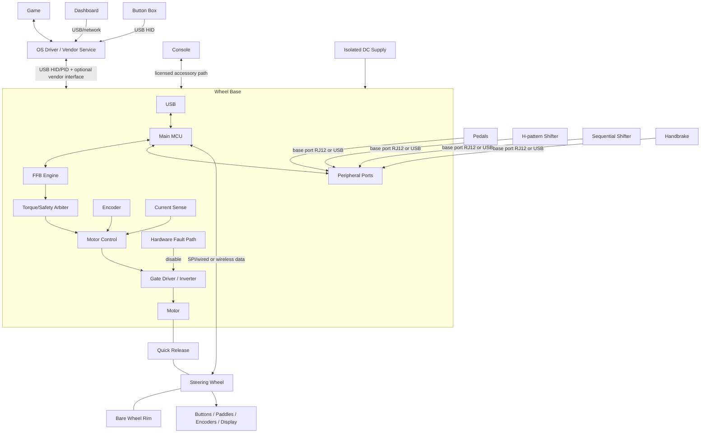

### 1.2. Hệ sinh thái Fanatec như một ví dụ Công khai

Hệ sinh thái công khai của Fanatec có tính module cao, được thiết kế để người dùng có thể kết hợp các thành phần (đế vô lăng, vô lăng, bàn đạp) và nâng cấp từng phần. Sản phẩm chủ yếu theo ba phân khúc:
- **CSL (ClubSport Light)**: Phân khúc nhập môn, thân thiện với ngân sách, thường sử dụng nhựa và kim loại cơ bản.
- **ClubSport**: Phân khúc tầm trung dành cho những người đam mê, sử dụng vật liệu cao cấp như nhôm, sợi carbon với thiết bị điện tử tiên tiến hơn.
- **Podium**: Phân khúc cao cấp nhất, chuẩn chuyên nghiệp, thiết kế để đạt mô-men xoắn, độ bền và khả năng tùy chỉnh tối đa, sử dụng vật liệu chuẩn công nghiệp.

Nhãn phân khúc giúp điều hướng nhưng không chứng minh rằng hai sản phẩm tương thích về mặt điện, cơ học, hay nền tảng.

Đế vô lăng là hub trung tâm của hệ thống cho cấu hình console. Các bàn đạp, cần số, và phanh tay tương thích được kết nối với đế, qua đó xuất ra một đường dẫn USB duy nhất được cấp phép tới console. Trên PC, các thiết bị ngoại vi được hỗ trợ có thể hoạt động độc lập qua USB. Gói "Ready2Race" chỉ là một gói bán hàng, không phải tiêu chuẩn giao diện mới.

| Nền tảng | Vị trí Giấy phép Fanatec | Quy tắc Thực tế |
|---|---|---|
| Windows PC | Không yêu cầu chip bảo mật console | Xác minh phiên bản Windows, hỗ trợ của game, driver/App, và đường dẫn kết nối của từng thiết bị. |
| Xbox | Vô lăng hoặc hub được cấp phép Xbox | Vô lăng/hub được cấp phép kích hoạt đế tương thích và các thiết bị kết nối vào đế trên Xbox. |
| PlayStation | Đế vô lăng được cấp phép PlayStation | Vô lăng và các thiết bị ngoại vi kết nối vào đế tương thích thừa hưởng hỗ trợ PlayStation thông qua đế đó. |

*Lưu ý: Kết hợp đế vô lăng PlayStation với vô lăng Xbox thường tạo ra hệ thống tương thích chéo, hoạt động được trên PlayStation, Xbox, và PC.*

Tính đến 2026-02-16, Fanatec tuyên bố các vô lăng và đế mua từ cửa hàng của họ mặc định sử dụng QR2, và QR1 đã bị ngừng sản xuất. Phần cứng QR1 cũ vẫn khả dụng, nhưng thế hệ giữa Base-Side và Wheel-Side phải khớp nhau, và hỗ trợ nâng cấp phụ thuộc vào từng mẫu.

### 1.3. Các loại Truyền động (Drive Types)

Các đế vô lăng sim racing thường được phân loại theo cơ chế cung cấp mô-men xoắn cơ học:

- **Dẫn động bánh răng (Gear-driven):** Cơ chế chi phí thấp nhưng gây ra độ trễ (backlash) cơ học.
- **Dẫn động bằng dây curoa (Belt-driven):** Mang lại sự mượt mà hơn nhưng gây ra độ co giãn cơ học.
- **Truyền động trực tiếp (Direct-drive):** Trục động cơ kết nối trực tiếp với vành vô lăng. Cung cấp sai số truyền động thấp nhất và đòi hỏi các cân nhắc cao nhất về mô-men xoắn và an toàn.

### 1.4. Ranh giới Firmware

Firmware **phải** thiết lập ranh giới sở hữu độc lập cho các kết nối, vùng năng lượng, mô tả USB, chế độ nền tảng, và giới hạn mô-men xoắn. Firmware **phải** xác minh danh tính, định tuyến, thời gian, hiệu chuẩn và tính tương thích cập nhật trước khi cho phép hoạt động.

### 1.5. Kích thước và Phong cách Lái

Thiết bị ngoại vi thường được thiết kế cho các phong cách lái cụ thể:
- **Formula:** Vô lăng hình chữ nhật/bướm tối ưu cho góc quay hẹp.
- **GT:** Vô lăng hình chữ D hoặc tròn với nhiều nút bấm.
- **Rally & Drift:** Vô lăng tròn hoàn hảo ưu tiên quay vòng nhanh và góc trượt.

## 2. Nguyên tắc Cơ bản về Vật lý và Cơ học

Phần này đề cập đến các nguyên tắc vật lý cơ bản của phần cứng sim racing, tập trung vào mô-men xoắn, động lực học chuyển động, và cảm biến. Nó là cầu nối giữa thiết kế cơ học và điều khiển hệ thống nhúng.

- **Mô-men xoắn (N·m)** là tích của lực tiếp tuyến và bán kính. Vành vô lăng lớn hơn làm giảm lực tay yêu cầu với cùng mô-men xoắn trục.
- **Quán tính (Inertia)** cản trở gia tốc góc.
- **Độ hãm (Damping)** cản trở vận tốc.
- **Ma sát (Friction)** cản trở chuyển động.
- **Cogging** là hiện tượng gợn mô-men xoắn từ tính phụ thuộc vào vị trí, vốn có trong thiết kế động cơ.

## 3. Phân rã Sản phẩm

Phần này chia nhỏ toàn bộ hệ thống thành các hệ thống con chức năng. Nó xác định khả năng phần cứng và trách nhiệm firmware của mỗi module.

### 3.1. Ma trận Hệ thống con

| Hệ thống con | Phần cứng / Dòng MCU | Trách nhiệm Firmware | Giao tiếp | Nguồn / Cập nhật |
|---|---|---|---|---|
| Đế vô lăng | Main MCU; optional motor MCU/ASIC; encoder; inverter; NVM | USB, FFB, tổng hợp đầu vào, an toàn, hiệu chuẩn | USB; SPI/UART/CAN nội bộ | DC ngoài; USB bootloader/phục hồi |
| Vô lăng | Low-power MCU, GPIO expanders, cảm biến Hall, LED/LCD | Quét, chống dội, giải mã encoder, màn hình, danh tính, mở khóa FFB | Liên kết dây QR (SPI thường bị giả lập), không dây, hoặc USB | QR/cảm ứng/USB/pin; pass-through/USB/OTA |
| Bàn đạp | Cảm biến (Potentiometer, Hall), load-cell AFE, ADC, MCU tùy chọn | Lấy mẫu, lọc, hiệu chuẩn, HID | Cổng analog/digital (RJ12) hoặc USB | Đế/USB; không cập nhật hoặc qua USB |
| Cần số H | Mảng công tắc/Hall 2 trục, MCU tùy chọn | Ngưỡng vào số, độ trễ, loại bỏ trạng thái lỗi | Analog, GPIO, digital bus, USB | Đế/USB |
| Cần số tuần tự | Hai công tắc hoặc Hall | Chống dội, nhận dạng cạnh/xung | GPIO, analog, bus, USB | Đế/USB |
| Phanh tay | Potentiometer/Hall/load cell, MCU tùy chọn | Lọc, hiệu chuẩn phạm vi, phát hiện mở/chập mạch | Analog, digital bus, USB | Đế/USB |
| Dashboard | MCU/MPU, LCD/OLED, LED drivers | Giải mã telemetry, hiển thị, watchdog | USB, UART/CAN, Ethernet/Wi-Fi | USB/phụ trợ; USB/OTA |
| Button box | Low-power USB MCU, ma trận/expanders | Quét, chống dội, descriptors | USB HID | USB; bootloader |
| Power board | Bảo vệ, DC bus, buck/LDO, cảm biến, inverter | Tuần tự hóa, giám sát, chính sách tái tạo năng lượng | ADC/GPIO đến vi điều khiển | DC cách ly ngoài |
| Motor controller | Real-time MCU/DSP/ASIC, ADC/timers | Thu thập encoder/dòng và PWM bị giới hạn | SPI/CAN/PWM từ Main MCU | Logic và DC bus; cập nhật gói cùng đế |
| Giao diện USB | PHY tích hợp/ngoài, ESD | Liệt kê thiết bị, báo cáo, vòng đời điểm cuối | USB control/interrupt; giao diện phụ trợ | Đế tự cấp nguồn cảm biến VBUS |

**Hình 3-1: Đường dẫn Dữ liệu Cốt lõi của Đế Vô lăng**

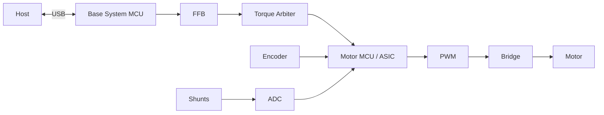

**Hình 3-2: Đường dẫn Dữ liệu Bàn đạp và Cảm biến Analog**

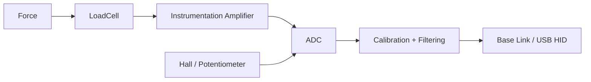

**Hình 3-3: Đường dẫn Dữ liệu Vô lăng**

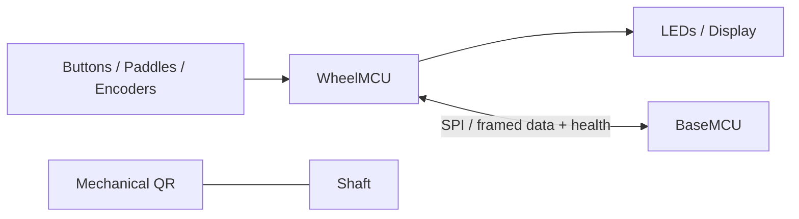

### 3.2. Danh tính và Sức khỏe Thành phần

Firmware **phải** xử lý mỗi thành phần thông minh như một node có phiên bản. Mỗi node **phải** báo cáo danh tính, khả năng, trạng thái khởi động, trạng thái ứng dụng, sức khỏe, và trạng thái phục hồi. Firmware **phải** xử lý lỗi cho cảm biến thụ động (ví dụ lỗi cáp đứt, chập mạch, ngoài giới hạn, và kiểm tra tính hợp lý của tín hiệu).

## 4. Tổng quan Phản hồi Lực (Force Feedback)

Phần này mô tả lý thuyết của phản hồi lực (FFB). Nó theo dõi quá trình chuyển đổi các sự kiện vật lý ảo thành mô-men xoắn vật lý trên trục.

Phản hồi lực chuyển đổi các hiệu ứng vật lý từ mô phỏng thành mô-men xoắn vật lý giới hạn, đồng thời trả lại vị trí vô lăng và thao tác cho mô phỏng.

### 4.1. Các Giai đoạn Phản hồi

| Giai đoạn | Trách nhiệm |
|---|---|
| Game | Tính toán lực ảo và sự kiện vật lý |
| API / Driver | Thể hiện hiệu ứng qua hợp đồng hệ điều hành |
| USB Transport | Giao nhận và xác minh báo cáo |
| Trình quản lý PID | Phân bổ hiệu ứng; duy trì thời lượng, cấu hình đường cong, điều kiện, và trạng thái |
| FFB Mixer | Trộn các hiệu ứng đang hoạt động và áp dụng bộ lọc |
| Torque Arbiter | Thực thi độ lợi, giới hạn mô-men xoắn, slew rate, giảm tải nhiệt, trạng thái bật, và tính thời gian |
| Điều khiển Motor | Theo dõi dòng/mô-men yêu cầu từ FFB |
| Power Stage | Sinh ra mô-men xoắn vật lý bằng motor |
| An toàn | Phát hiện lỗi phần cứng và chủ động vô hiệu hóa mô-men xoắn |

**Hình 4-1: Đường ống Phản hồi Lực (Force Feedback Pipeline)**

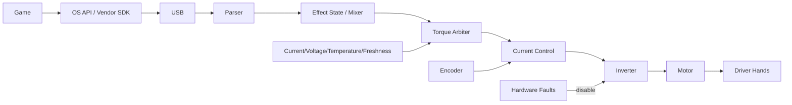

**Hình 4-2: Đường dẫn Dữ liệu Logic Phản hồi Lực (FFB)**

### 4.2. Ràng buộc Firmware FFB

Firmware **phải** xác thực và lập lịch toàn bộ các hiệu ứng gửi tới. FFB mixer **phải** kết hợp các hiệu ứng mà không bị tràn số (arithmetic overflow). Hệ thống **phải** áp dụng toàn bộ giới hạn an toàn và công suất sau giai đoạn trộn. Nếu liên kết với máy chủ (host) bị trễ, hệ thống **phải** kích hoạt phân rã (decay) mô-men xoắn và tự vô hiệu hóa. Firmware **không được** cho phép bất kỳ lệnh phần mềm nào vượt qua giới hạn vật lý/nhiệt. Clipping xảy ra khi mô-men xoắn yêu cầu vượt quá giới hạn, khiến lực quá lớn bị cào bằng ở mức tối đa và mất chi tiết.

## 5. Kiến trúc Phần cứng

Phần này trình bày cấu trúc phần cứng của một đế vô lăng truyền động trực tiếp. Nó định nghĩa vòng lặp điều khiển vật lý và các lớp an toàn điện tử cần thiết.

### 5.1. Kiến trúc Đế truyền động Trực tiếp (Direct-Drive Base)

Cốt lõi của đế vô lăng được chia thành phân vùng quản lý hệ thống và phân vùng điều khiển động cơ thời gian thực. Đế DD thường sử dụng động cơ BLDC/PMSM ba pha với phản hồi encoder, cảm biến dòng pha, Điều chế độ rộng xung (PWM), gate driver, và inverter.

Động cơ là PMSM ba pha (stator thép có cuộn dây quay quanh một rotor nam châm vĩnh cửu gắn ở trục lái) — và inverter (bộ biến tần) là khối công suất với sáu MOSFET để tổng hợp các dòng điện ba pha từ bus DC:

Ba bán cầu của inverter sẽ quyết định điện áp của mỗi pha qua PWM; hai công tắc trên cùng một pha không bao giờ được bật cùng lúc (dead-time để tránh chập bus DC), và các shunt phía thấp đo lường dòng pha phục vụ vòng lặp FOC.

**Hình 5-1: Sơ đồ Khối Kiến trúc Phần cứng**

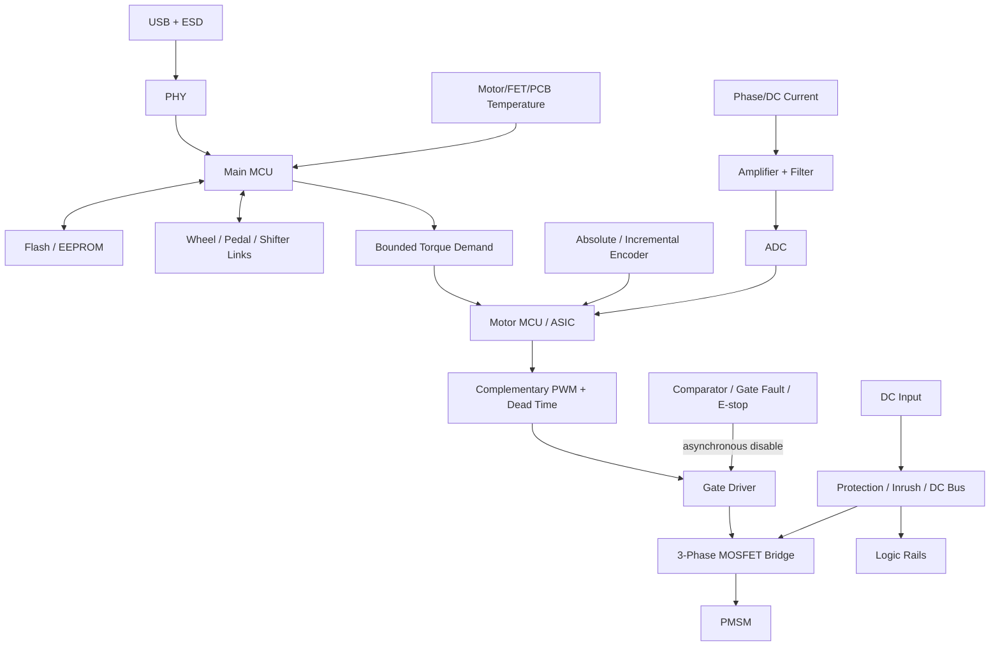

| Khối | Trách nhiệm | Yêu cầu Firmware |
|---|---|---|
| Main MCU | Giao thức Host/ngoại vi và chính sách hệ thống | **Phải** thực thi lập lịch và khả năng tương thích phiên bản |
| Motor MCU/ASIC | Đường dẫn dòng điện/mô-men xoắn thời gian thực | **Phải** đáp ứng thời hạn chính xác và xử lý lỗi |
| PMSM/BLDC | Bộ truyền động mô-men xoắn | **Phải** vận hành trong giới hạn thông số động cơ và nhiệt |
| Encoder | Phản hồi góc/tốc độ | **Phải** xác thực CRC, trạng thái, wrap, hướng, bù, và timeout |
| Cảm biến dòng | Phản hồi dòng pha/DC | **Phải** hiệu chuẩn độ lệch, độ lợi, bão hòa, và căn chỉnh với cửa sổ lấy mẫu PWM |
| Advanced timer | PWM và kích hoạt ADC | **Phải** tạo tín hiệu bù trừ với dead time và có ngắt bảo vệ |
| Gate driver/inverter| Chuyển mạch DC thành 3 pha | **Phải** mặc định Tắt; **phải** phản hồi lập tức trước lỗi phần cứng |
| NVM | Firmware, hiệu chuẩn, profile, nhật ký lỗi | **Phải** đảm bảo ghi nguyên tử (atomic) và wear levelling |

### 5.2. Thiết kế Miền Điều khiển

Hệ thống có thể sử dụng một MCU duy nhất hoặc kiến trúc tách biệt (Main MCU + Motor MCU/ASIC). 

Điều khiển hướng trường (FOC) biến đổi đo lường góc rotor và dòng điện để điều chỉnh dòng sinh mô-men xoắn. Firmware **phải** đảm bảo độ chính xác cao và đồng bộ hóa giữa PWM và ADC. Các lỗi phần cứng như quá dòng và tín hiệu ngắt (break) **phải** ghi đè các lệnh phần mềm. Firmware **phải** kích hoạt ADC một cách đồng bộ trong khoảng giữa hợp lệ của PWM và **phải** hiệu chỉnh các giá trị lệch (offset) của cảm biến dòng điện trong quá trình khởi tạo.

"Khoảng giữa PWM hợp lệ" là chi tiết thời gian quan trọng: sóng mang tam giác (carrier) so sánh với chu kỳ (duty) của mỗi pha để tạo ra tín hiệu điều khiển cổng, và ADC lấy mẫu ở đỉnh sóng mang — điểm tĩnh giữa chu kỳ chuyển mạch — để tránh nhiễu từ các quá trình chuyển mạch. Thu phóng "dead-time" hiển thị khoảng trống khi cả hai khóa đều tắt để ngăn chặn hiện tượng bắn chéo (shoot-through).

## 6. Tương tác Phần cứng

Phần này phác thảo cách firmware tương tác với các ngoại vi phần cứng cụ thể. Nó định nghĩa ánh xạ giữa giao diện điện tử và vi điều khiển.

### 6.1. Giao diện Ngoại vi

Firmware **phải** cấu hình và quản lý các giao diện MCU để giao tiếp an toàn với phần cứng ngoài.

| Kết nối | Vi điều khiển | Yêu cầu Firmware |
|---|---|---|
| Encoder | SPI/SSI/BiSS-C/ABZ, timer, DMA | **Phải** kiểm tra deadline, CRC, wrap, hướng, timeout |
| Mạch khuếch đại dòng | ADC, PWM trigger, DMA | **Phải** kiểm tra cửa sổ lấy mẫu, độ lệch, độ lợi, bão hòa |
| MCU PWM đến gate | Advanced timer, break GPIO | **Phải** cấu hình dead time, khởi động an toàn, độ trễ ngắt |
| Gate fault đến MCU | Break input, GPIO | **Phải** ưu tiên tắt phần cứng trước, sau đó lưu trạng thái lỗi |
| Rim đến Base | CAN/SPI/UART/radio | **Phải** xử lý cắm nóng (hot-plug), ESD, cấp nguồn, timeout |
| Pedals đến ADC/bus | ADC/SPI/I2C | **Phải** kiểm tra hở mạch/ngắn mạch, giới hạn tham chiếu, hiệu chuẩn |
| Buttons đến GPIO | GPIO, timer | **Phải** chống dội (debounce) và chặn tín hiệu ảo |
| Display đến SPI | SPI, DMA | **Phải** phân bổ băng thông tránh đảo ngược độ ưu tiên |
| LEDs | Timer, serial bus | **Phải** giới hạn dòng và duy trì tốc độ làm mới |
| USB tới host | USB device | **Phải** quản lý VBUS, reset, suspend, và vòng đời endpoint |
| NVM tới MCU | QSPI/SPI/I2C | **Phải** có wear levelling, ghi nguyên tử, và xác thực schema |

**Hình 6-1: Định tuyến Ngoại vi Phần cứng**

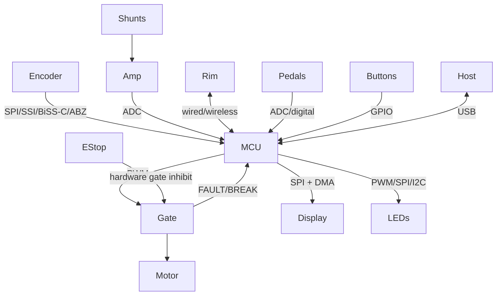

### 6.2. Quản lý Chân và Trạng thái

Đầu ra bật (enable) gate **phải** mặc định ở trạng thái Tắt (inactive) khi reset, khi chạy bootloader, khi recovery, và khi chân chưa được cấu hình. Hệ thống **phải** bảo vệ đường điện ngoại vi để thiết bị cắm ngoài hỏng không kéo sập đường điều khiển chính.

## 7. Kiến trúc Giao tiếp

Phần này định nghĩa các kết nối trong và ngoài hệ thống. Nó quy định các giao thức truyền tải, khả năng, và tính toàn vẹn dữ liệu.

### 7.1. Đặc tính Liên kết

| Giao diện | Vai trò Điển hình | Topology | Mô tả |
|---|---|---|---|
| USB 2.0 FS HID | Host tới device | Host/device | Tiêu chuẩn, tự mô tả; truyền trục, nút bấm, FFB |
| USB HS | Màn hình/dữ liệu NSX | Host/device | Băng thông cao; ngăn xếp phức tạp |
| SPI | MCU tới ASIC/encoder/màn hình | Master/slave | Tốc độ MHz; hỗ trợ DMA; dễ bị nhiễu EMI |
| UART | Debug/boot/phụ kiện đơn giản | Peer framing | Thông dụng; cần phần mềm định dạng frame |
| CAN / CAN-FD | Modules phân tán | Multi-master | Mạng vi sai ổn định; có overhead giao thức |
| I2C | EEPROM/cảm biến | Master/slave | 2 dây; dễ bị treo bus |
| RS-485 | Phụ kiện có dây | Tùy giao thức | Vi sai; cần định dạng frame |
| Ethernet | Dash/dịch vụ | Packet network | Chuẩn hóa; có độ trễ thay đổi |
| BLE | Rim/cấu hình không dây | Master/slave | Không dây; bị giới hạn bởi RF và độ trễ |
| Wi-Fi | Bảng điều khiển telemetry | IP network | Băng thông cao; tiêu thụ điện lớn và phức tạp bảo mật |

### 7.2. Giao tiếp với Nền tảng Host

Chiến lược giao tiếp coi **Đế Vô lăng là một USB Hub trung tâm**, với hành vi tự thích ứng theo mô hình bảo mật của nền tảng host:

#### 7.2.1. PC (Windows/Linux)
Hệ thống **phải** mở các endpoint USB tiêu chuẩn để nhận dữ liệu đầu vào và đầu ra lực vật lý. Hệ thống **phải** dùng **USB HID** (Thiết bị Giao diện Người dùng) để báo cáo các thao tác (trục, nút bấm), và có thể dùng **USB PID** (Thiết bị Giao diện Vật lý) để nhận các tín hiệu FFB từ engine game. Các driver nguồn mở (như `hid-fanatecff` cho Linux) hoặc phần mềm từ nhà sản xuất có thể dễ dàng tương tác qua giao thức mở này.

**Hình 7-1: Topology của USB Descriptor (PC)**

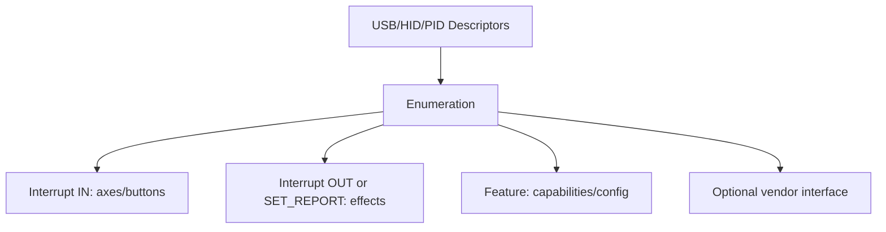

#### 7.2.2. Consoles (PlayStation & Xbox)
Console sử dụng các luồng phụ kiện được cấp phép. Tài liệu của Fanatec giải thích vị trí cấp phép, nhưng không bộc lộ thuật toán xác thực mật mã hay hướng dẫn mô phỏng cấp phép.
- **Xbox:** Cấp phép qua vô lăng Xbox gắn với một đế vô lăng Fanatec tương thích.
- **PlayStation:** Cấp phép ở chính đế vô lăng Fanatec được cấp phép PlayStation.
- **Tổng hợp ngoại vi:** Bàn đạp, cần số, phanh tay Fanatec phải cắm qua đế vô lăng để được dùng trên console. Thiết bị USB độc lập sẽ không dùng được trên console.

Cấu trúc firmware **phải** thiết lập việc cấp phép nền tảng như một rào cản được phê duyệt. Firmware **không được** mô phỏng, phát minh, hay vượt qua (bypass) xác thực console.

### 7.3. Cấu trúc liên kết Nội bộ

**Hình 7-2: Cấu trúc liên kết Bus Nội bộ**

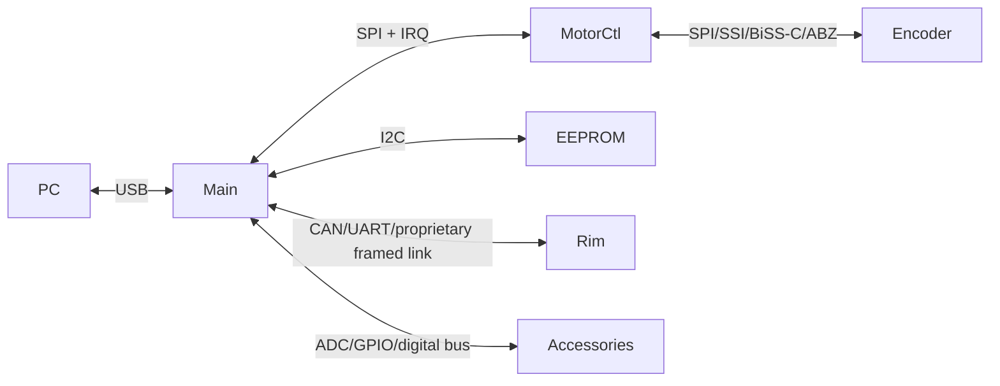

### 7.4. Đóng khung (Framing) và Tính Toàn vẹn

Mỗi kết nối **phải** định dạng rõ phiên bản, loại, độ dài, chuỗi tuần tự, kiểm tra lỗi (như CRC), và giới hạn thời gian timeout. Firmware **phải** hỗ trợ hàng đợi bị chặn, đàm phán, và khôi phục kết nối. Chuyển DMA **phải** giới hạn quyền kiểm soát bộ đệm, thời gian kết thúc, nhất quán bộ nhớ đệm (cache), và xử lý lỗi.

## 8. Kiến trúc Firmware

Phần này cung cấp thiết kế cấu trúc của phần mềm firmware. Nó đề cập đến các ranh giới module, máy trạng thái, và vòng đời.

### 8.1. Các Module Phần mềm

Firmware **phải** phân chia trách nhiệm để đảm bảo các lớp truyền dữ liệu và UI không cản trở quá trình điều khiển thời gian thực.

**Hình 8-1: Kiến trúc Thành phần Firmware**

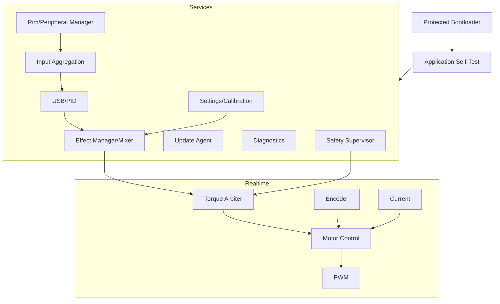

### 8.2. Các Ràng buộc Module

| Module | Yêu cầu |
|---|---|
| Bootloader | **Phải** kiểm tra, lựa chọn, phục hồi firmware; **không bao giờ** kích hoạt motor |
| USB/PID | **Phải** truyền tải thông số và tín hiệu FFB; **không bao giờ** được thay đổi PWM |
| FFB | **Phải** thực hiện trộn tín hiệu mà không làm tràn số học |
| Torque arbiter | **Phải** là kênh mềm duy nhất dẫn đến motor; **phải** kiểm soát giới hạn, sức mạnh |
| Điều khiển Motor | **Không được** giải mã tín hiệu host |
| Encoder/Dòng điện| **Phải** đính kèm thời gian và trạng thái mỗi khi lấy mẫu |
| Ngoại vi | **Phải** xử lý cắm nóng và thiết bị không còn kết nối |
| Settings | **Không được** chặn vòng lặp thời gian thực bằng việc ghi flash bộ nhớ |
| Chẩn đoán | **Phải** giới hạn số lần đếm; **không được** chặn hệ thống điều khiển |
| Update | **Phải** tắt mô-men xoắn toàn bộ trong quá trình nâng cấp |
| Safety | **Phải** ngắt tín hiệu khi có lỗi; hoạt động song song với bảo vệ mạch điện cứng |

### 8.3. Máy trạng thái Hệ thống

Firmware **phải** triển khai máy trạng thái xác định để quản lý việc kích hoạt mô-men xoắn. Các hệ thống bảo vệ phần cứng sẽ hoạt động ưu tiên nhất mọi lúc.

**Hình 8-2: Máy Trạng thái Kích hoạt Mô-men xoắn**

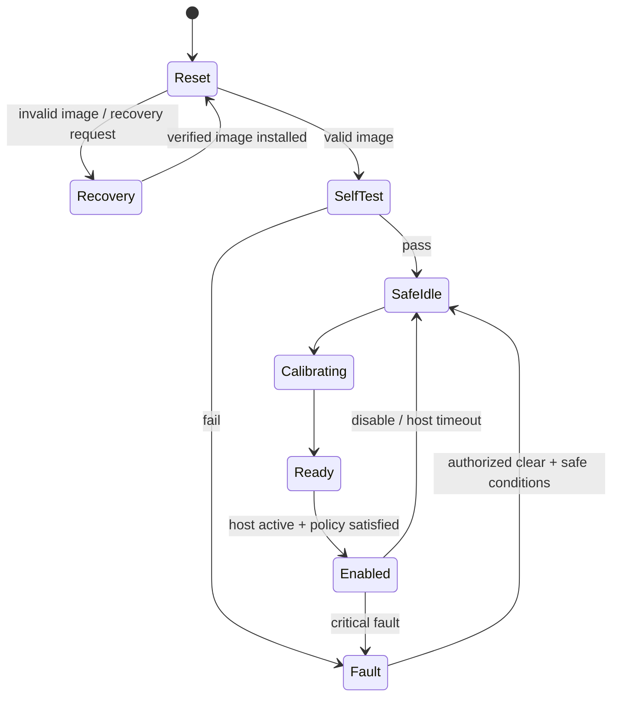

## 9. Luồng Dữ liệu

Phần này chi tiết đường đi của dữ liệu xuyên suốt hệ thống. Nó giải quyết đầu vào từ cảm biến, cập nhật hiệu ứng, và phản hồi phần cứng.

### 9.1. Quá trình Đầu-Cuối

Sự tương tác của host và vòng điều khiển thời gian thực **phải** hoạt động đồng thời mà không bị đứt quãng dữ liệu.

**Hình 9-1: Sơ đồ Luồng Dữ liệu Đầu-Cuối**

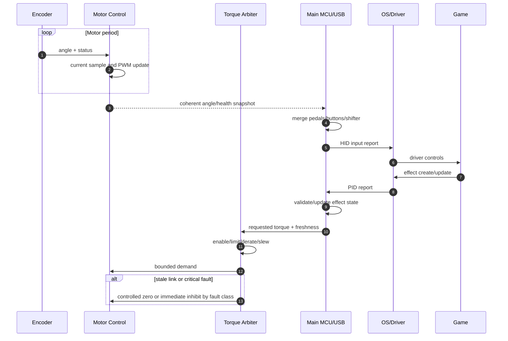

### 9.2. Luồng Đầu vào (Input Pipeline)

Các đầu vào từ cảm biến **phải** qua quá trình xác nhận và hiệu chỉnh trước khi gửi đến host.

**Hình 9-2: Luồng Xử lý Đầu vào**

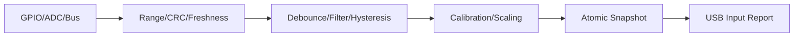

### 9.3. Xử lý Dữ liệu Quá hạn (Stale Data)

Firmware **phải** định nghĩa và tuân thủ chặt chẽ chính sách quá hạn. Dữ liệu khi gửi đi **phải** kèm theo giá trị, timestamp, tính hợp lệ, nguồn gốc, và chính sách quá hạn.

**Bảng 9-1: Các Tham số Dữ liệu Tiêu chuẩn**

| Yếu tố | Loại | Mô tả |
|---------|------|-------------|
| `value` | Payload | Giá trị số liệu hoặc trạng thái |
| `timestamp` | uint32 | Thời gian lấy mẫu |
| `validity` | Boolean | Xác định mức độ tin cậy của dữ liệu |
| `owner` | Enum | Nguồn khởi phát dữ liệu |
| `stale_policy` | Enum | Hành động khi dữ liệu quá hạn |

**Bảng 9-2: Chính sách Dữ liệu Quá hạn Tùy theo Nguồn**

| Nguồn Dữ liệu | Chính sách Quá hạn |
|---|---|
| Torque / Hiệu ứng | **Phải** phân rã về 0 một cách an toàn; không được duy trì vô thời hạn |
| Encoder / Dòng điện | **Phải** kích hoạt ngắt mạch lập tức nếu dữ liệu quá hạn vượt ngưỡng |
| Buttons | Xóa hoặc duy trì tùy theo giao thức cụ thể |
| Bàn đạp | Gắn cờ lỗi hoặc đưa về trạng thái mặc định an toàn |
| Nhiệt độ | Kích hoạt cảnh báo hoặc ngắt kết nối cảm biến hỏng |
| Giao tiếp Rim | Xóa các lệnh trên vô lăng và ngừng gửi tín hiệu tới màn hình |

Firmware **phải** sử dụng cơ chế bảo vệ lấy mẫu tuần tự, không để đứt đoạn giữa các lệnh ngắt (ISRs) và các tasks.

## 10. Các Nhiệm vụ Thời gian Thực

Phần này quy định bối cảnh thời gian cho các nhiệm vụ trong hệ thống, nhấn mạnh các mục tiêu cho vòng điều khiển quan trọng.

### 10.1. Mức Ưu tiên Nhiệm vụ

Firmware **phải** áp dụng sự ưu tiên cao nhất cho hệ thống vòng điều khiển phần cứng và bảo vệ thiết bị. Các nhiệm vụ background sẽ xếp sau.

**Hình 10-1: Mức Ưu tiên Preemption (Chen ngang)**

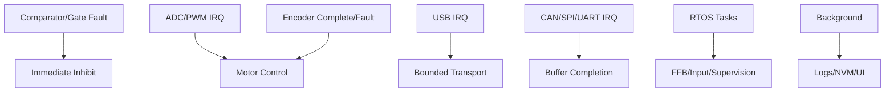

### 10.2. Tần suất Thời gian Lặp

Tần suất dưới đây là các tiêu chuẩn lý thuyết; thực tế do phần cứng đáp ứng.

| Hoạt động | Dải tần số | Bối cảnh | Hậu quả khi Bỏ lỡ |
|---|---|---|---|
| Current / Vòng FOC | 10–40 kHz | Ngắt Timer/ADC | Bóp méo mô-men xoắn, quá dòng |
| Đọc Encoder | Bằng tốc độ FOC | Ngắt SPI DMA | Dữ liệu góc bị sai lệch |
| FFB / Mô-men xoắn | 0.5–2 kHz | RTOS mức cao | Trễ pha, giật gián đoạn tín hiệu lực |
| USB Transport | USB Cadence | Ngắt + Task | Rớt tín hiệu USB, mất điều khiển |
| Rim Link | 100–1000 Hz | DMA + Task | Rớt nút bấm, màn hình giật lag |
| Pedals / Buttons | 100–1000 Hz | ADC DMA / Timer | Giật lag khi nhả chân ga/phanh |
| Cảnh báo an toàn | Max rate | Hardware/ISR | Cảnh báo trễ, rủi ro hỏng hóc |
| Chẩn đoán / NVM | Không ưu tiên | Background | Tuyệt đối không cản trở FOC |

### 10.3. Các Quy tắc Thời gian Thực

Firmware **phải** đánh giá Worst-Case Execution Time (WCET) dưới điều kiện hoạt động nặng nề nhất. Các ISR phải đảm bảo phản ứng nhanh. Các hệ thống phân vùng **không được** cấp phát động (malloc), ghi flash, hay dùng blocking I/O tại tiến trình điều khiển motor. Hệ thống **phải** có cảnh báo nếu bị lấn thời gian. Watchdogs phần cứng **chỉ được** reset thông qua tiến trình an toàn đã kiểm chứng.

## 11. An toàn và Bảo mật

Phần này nêu rõ các cơ chế tự bảo vệ và phòng thủ phần cứng/phần mềm. Nó xác định phản hồi với các rủi ro, can thiệp bên ngoài, và quy tắc cài đặt an toàn.

### 11.1. Yêu cầu Thiết lập và An toàn

- Thiết bị **phải** được gắn cứng trước khi sử dụng.
- Người dùng **phải** kiểm tra kết nối QR, các cáp nối, nguồn điện, nút dừng khẩn cấp trước khi chơi.
- Bắt buộc dùng ứng dụng cấu hình và file bản cập nhật chuẩn.
- Bắt buộc hiệu chỉnh chuẩn trung tâm vô lăng, hành trình tay lái và chân ga/phanh.
- Lần đầu thử máy **phải** dùng mô-men xoắn thấp.
- Người dùng **phải** kiểm tra độ phản hồi tự động trước khi sử dụng thực tế.
- Khớp cài đặt số vòng quay tay lái với cấu hình trong game.
- Nếu có hiện tượng bị chèn ép lực, quá tải nhiệt, tăng dao động rung lắc, **phải** điều chỉnh giảm lực.
- Để xa thiết bị đang hoạt động khỏi quần áo, trẻ nhỏ và các vật cản.
- **Tuyệt đối không** hack, thay thế các chip bảo mật hay bypass thiết bị.
- Mọi sửa đổi vào motor **phải** bảo đảm độc lập vô hiệu hóa (disable) mạch cầu điện.

### 11.2. Kiểm soát Rủi ro

Hệ thống **phải** tự bảo vệ bản thân và người sử dụng khỏi những lỗi nghiêm trọng.

**Bảng: Các Phản ứng khi Gặp Lỗi**

| Tình trạng | Lỗi kích hoạt | Hành động can thiệp |
|---|---|---|
| `Dữ liệu host quá hạn` OR `Vượt ngưỡng lực` | Lực tăng bất thường | Giảm lực an toàn hoặc ngắt toàn bộ điện motor lập tức |
| `Góc quay sai cực trị với tín hiệu` | Khác chiều động cơ | Ngắt lệnh bật và lưu log cảnh báo |
| `Pha dòng điện > OVERCURRENT_TRIP` | Quá dòng | Hardware PWM vô hiệu hóa thông qua mạch comparator ngắt |
| `Nhiệt độ mạch > THERMAL_LIMIT` | Quá nhiệt | Giảm dòng liên tục; ngắt toàn bộ PWM nếu vẫn nóng |
| `Điện áp DC Bus > OVERVOLTAGE_TRIP` | Vượt dòng nạp xả ngược | Tiêu hao dòng ngược; ngắt điện lực FFB |
| `Encoder sai CRC` OR `Mất kết nối` | Rớt vị trí góc | Ngắt lập tức mạch bảo vệ, hoặc giảm tốc nhẹ |
| `Chứng thực chữ ký sai` | Firmware can thiệp | Kẹt vĩnh viễn ở bootloader, chờ cập nhật đúng |
| `Watchdog timeout` | Treo phần mềm | Reset nóng; các cổng đầu ra trả về 0 |

### 11.3. Cơ chế Bảo mật

Firmware **phải** chứng thực các file cập nhật. Nó **phải** nhận dạng các gói tin chuẩn độ dài và mã tin. Firmware yêu cầu phải tắt mô-men xoắn trước khi gửi các lệnh gỡ lỗi. Đối với máy bản lẻ, hệ thống **phải** khóa kín đường vào gỡ lỗi (JTAG, SWD).

**Nền tảng được cấp phép:** Việc mô phỏng chip bảo mật console từ các bên thứ ba là hành vi ngoài quy chuẩn (như trong các emulator). Hãy coi việc chứng thực này là độc quyền của nhà sản xuất, trừ khi có thông cáo công khai.

## 12. Chế độ xem Kỹ thuật Firmware

Phần này mô tả các chiến lược kiểm tra, và quy trình thử nghiệm để phát triển phần mềm nhúng.

### 12.1. Yêu cầu Kỹ thuật Hệ thống con

Mọi hệ thống **phải** kiểm chứng bằng Unit tests, chạy giả lập, trước khi lắp đặt thực.

| Hệ thống con | Trạng thái API | Kiểm thử |
|---|---|---|
| Boot/update | `reset` → `verify` → `boot/recovery` | Sai phiên bản, file rác, rút điện khi cài |
| USB/PID | `detached` → `configured` → `suspended` | Gửi dữ liệu nhiễu, test băng thông trễ |
| FFB | `idle` → `allocated` → `playing` → `stopped` | Vòng lặp liên tiếp, tính tràn số |
| Torque arbiter | `disabled` → `ready` → `enabled` → `fault` | Chèn lực ảo, quá nhiệt, rớt host |
| Motor control | `init` → `offset cal` → `ready` → `run` → `fault` | Hardware in Loop (HIL), tính chính xác bão hòa |
| Settings | `valid` → `dirty` → `commit/error` | Ghi đè rác, test tuổi thọ ghi, phiên bản config |
| Safety | `safe` → `ready` → `enabled` → `fault` | Bắn ngắt cứng xem ưu tiên tắt bảo vệ kịp không |

### 12.2. Trình tự Xác minh

Phải kiểm tra từ không tải đến toàn tải. Bắt buộc test lực điện áp cực nhỏ trước khi test FFB lớn.

**Hình 12-1: Quá trình Thử nghiệm**

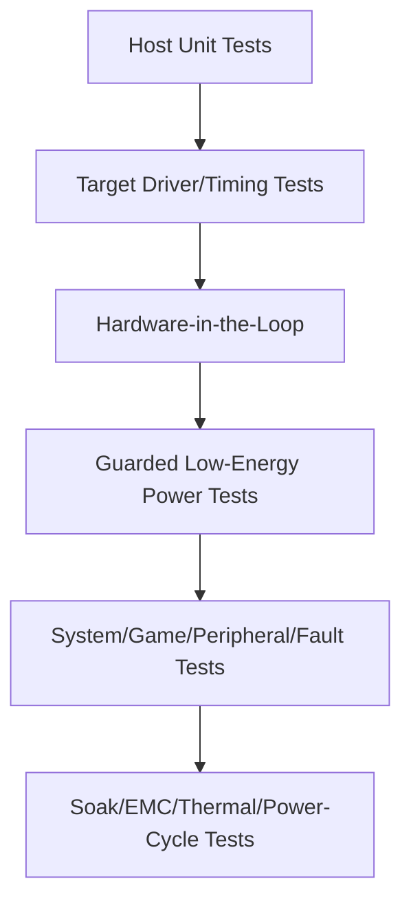

## 13. Danh sách Câu hỏi (Đã giải quyết và Còn mở)

Đánh giá ngày 2026-07-05. Các mục có thể được trả lời từ cơ sở kiến thức, tiêu chuẩn công khai, hoặc bằng chứng từ cộng đồng được đánh dấu là **Đã giải quyết (Resolved)**. Các mục phụ thuộc vào yêu cầu của một sản phẩm cụ thể, thông số kỹ thuật độc quyền của nhà cung cấp, hoặc đo lường trên mục tiêu thực tế không thể được trả lời chung chung và được đánh dấu là **Mở — nhà phát triển tự điều tra**, với phương pháp cụ thể.

### 13.1 Đã giải quyết

- **Có nên mở rộng các nền tảng chuyển động (motion), đầu dò xúc giác (tactile), buồng lái (cockpits), và phần mềm telemetry thành các tài liệu riêng biệt không?**
  **Đã giải quyết (xong).** Tất cả bốn chủ đề hiện đã có tài liệu: [`motion.md`](./motion.md), [`tactile.md`](./tactile.md), [`cockpits.md`](./cockpits.md), và [`telemetry.md`](./telemetry.md), và nằm trong danh sách đọc ở [`README.md`](./README.md).
- **USB descriptors, tần suất báo cáo (report cadence), sức chứa hiệu ứng, và giao diện nhà cung cấp (vendor interface)?**
  **Đã giải quyết một phần (mô hình công khai đã xác minh; giá trị đặc thù của sản phẩm là Chưa rõ).** Phương thức truyền tải và mô hình hiệu ứng là công khai: USB HID cho đầu vào và USB PID Class 1.0 cho hiệu ứng lực, thường là USB 2.0 Full-Speed. Tần suất báo cáo tuân theo ngắt thời gian của endpoint; tốc độ vòng điều khiển nằm trong §10.2. Những gì thuộc về đặc thù sản phẩm là VID/PID chính xác, dung lượng bộ nhớ chứa hiệu ứng (effect-pool), và giao diện vendor — xem §13.2. Bằng chứng từ cộng đồng: driver `hid-fanatecff` liệt kê các thiết bị Fanatec qua **VID `0EB7`** (ví dụ: `0EB7:0020` cho CSL DD / DD Pro / ClubSport DD), đây là quan sát của cộng đồng chứ không phải thông số mô tả chính thức.
- **Đường dẫn cấm mô-men xoắn (torque-inhibit path) phần cứng và các mục tiêu an toàn/quy định?**
  **Đã giải quyết ở cấp độ kiến trúc (các mục tiêu là đặc thù sản phẩm).** Đường dẫn ức chế (inhibit path) bắt buộc được định nghĩa xuyên suốt §11 và trong [`wheel_base.md`](./wheel_base.md) §15: một chốt lỗi phần cứng độc lập được kích hoạt bởi ngắt quá dòng (comparator), lỗi gate-driver, E-stop, và watchdog, có khả năng vô hiệu hóa gate driver một cách bất đồng bộ bất kể phần mềm. Tham chiếu ngành là kiến trúc kiểu Safe-Torque-Off (STO) (như TI TIDA-01599). Phạm vi quy định *cụ thể* (ví dụ: dấu chuẩn EMC/an toàn nào áp dụng cho thị trường mục tiêu) là quyết định của nhà phát triển sản phẩm — xem §13.2.
- **Ngân sách độ trễ/jitter từ đầu đến cuối (end-to-end latency) và các phương pháp nghiệm thu?**
  **Đã giải quyết bằng phương pháp (mục tiêu con số là đặc thù sản phẩm).** Độ trễ có tính cộng dồn từng giai đoạn; hãy phân bổ ngân sách và đo lường độc lập cho từng giai đoạn (tick game → USB → đánh giá FFB → vòng FOC) thay vì chỉ đo từ đầu đến cuối, theo [`telemetry.md`](./telemetry.md) §6. Các tốc độ vòng lặp neo điển hình nằm trong §10.2 (FOC 10–40 kHz, FFB 0.5–2 kHz). Ngân sách cụ thể phải được đặt so với các mục tiêu độ trễ/cạnh tranh của sản phẩm và sau đó được xác nhận trên thiết bị thực.

### 13.2 Mở — để các nhà phát triển tự điều tra

Những mục này yêu cầu một thông số kỹ thuật sản phẩm cụ thể, tiêu chuẩn từ nhà cung cấp đã được phê duyệt, hoặc đo lường trên băng ghế thử nghiệm. Chúng là các thông tin kỹ thuật cần thu thập, không phải là sự kiện có sẵn để tra cứu.

- **Yêu cầu về mô-men xoắn, tốc độ, quán tính, số vòng quay, âm thanh, và môi trường của sản phẩm.**
  *Cách điều tra:* Dẫn xuất từ phân khúc thị trường mục tiêu và tham khảo thông số đã công bố của đối thủ; chuyển đổi thành kích thước động cơ (mô-men xoắn liên tục/đỉnh, nhiệm vụ nhiệt) và xác nhận bằng máy đo (dyno/bench).
- **Các nền tảng PC/console được hỗ trợ và kiến trúc cấp phép được phê duyệt.**
  *Cách điều tra:* Cấp phép nền tảng mang tính hợp đồng — lấy các điều khoản chương trình cấp phép console trực tiếp từ nhà cung cấp; không được suy luận hoặc mô phỏng xác thực console (§11.3). Hỗ trợ PC có thể được xác minh bằng hệ điều hành + yêu cầu của game.
- **Chính xác MCU/ASIC, encoder, gate driver, mô hình cảm biến (sensing topology), và công suất chịu tải.**
  *Cách điều tra:* Lựa chọn theo các yêu cầu mô-men/vòng lặp điều khiển ở trên bằng cách dùng thiết kế tham chiếu của nhà cung cấp (ví dụ: Infineon PMSM FOC, TI sensored FOC, và thiết kế dùng TMC4671 của OpenFFBoard làm ví dụ công khai); kiểm chứng trên bo mạch khởi tạo (bring-up board).
- **Topology điện/giao thức ngoại vi và quyền sở hữu.**
  *Cách điều tra:* Xác định theo từng cổng; đối với đường dẫn proxy qua base, các sơ đồ chân cộng đồng (như FendtXerion Fanatec-Pinout) và giao diện tùy chỉnh (như Universal-Shifter-Interface-for-Fanatec) tồn tại làm tài liệu tham khảo, nhưng sản phẩm phải tự xác định ma trận tương thích được xác thực của riêng mình.
- **Chính sách chữ ký cập nhật (signing policy), rollback, khởi tạo (provisioning), và phục hồi (recovery)?**
  *Cách điều tra:* Định nghĩa Root of Trust (gốc tin cậy), kiến trúc bootloader, và quy trình chèn key trong quá trình sản xuất.
- **Khả năng tương thích phiên bản/hiệu chuẩn giữa base, động cơ, vành (rim), bàn đạp, và các adapter?**
  *Cách điều tra:* Tạo chính sách ma trận phiên bản trong trình cập nhật (updater) và định nghĩa thành phần nào nắm giữ quyền ưu tiên đối với hiệu chuẩn trung tâm/khoảng dao động.
- **Lưu trữ chẩn đoán và quy tắc truy cập gỡ lỗi máy bán lẻ (retail debug-access)?**
  *Cách điều tra:* Phân bổ dung lượng NVM cho crash logs/đếm lỗi và kiểm chứng việc firmware phát hành cho khách hàng khóa chặt cổng JTAG/SWD.
