# Phần cứng và Firmware Sim Racing — Nghiên cứu Tổng hợp

> Phiên bản 1.4  ·  Đánh giá 2026-07-05  ·  Cơ sở nghiên cứu cho nhà phát triển (bản một tệp)

> Compiled: single-file edition assembled from the sim-racing study base in recommended reading-path order.


## Chỉ số Nghiên cứu Sim Racing

> Phiên bản: 1.4
> Đánh giá: 2026-07-05

### Nhật ký thay đổi tài liệu

| Phiên bản | Ngày | Thay đổi |
|---|---|---|
| 1.4 | 2026-07-05 | Đánh giá sổ đăng ký câu hỏi. Đã xem xét từng phần "Câu hỏi chưa được giải quyết" trên toàn bộ cơ sở và **giải quyết** các mục (từ cơ sở kiến thức, tiêu chuẩn công khai hoặc bằng chứng cộng đồng được ghi chép lại như USB IDs `hid-fanatecff` và sơ đồ chân GeekyDeaks RJ12/UART) hoặc **định dạng lại** chúng thành "Mở — nhà phát triển tự điều tra" với một phương pháp cụ thể (đo lường gì, lấy thông số nào, sử dụng công cụ nào). Các phần được đổi tên thành "Sổ đăng ký câu hỏi (Đã giải quyết và Mở)" hoặc "Câu hỏi mở để nhà phát triển tự điều tra" cho phù hợp. |
| 1.3 | 2026-07-05 | Thêm phần giải thích tổng hợp về force-feedback hướng tới người đọc ([force_feedback_explained.md](./force_feedback_explained.md)) bao gồm lý thuyết về lực, động cơ servo và điện tử công suất, toàn bộ chuỗi tín hiệu FFB, và mọi danh mục lực/rung động cảm nhận được ở tay (vật lý lốp xe, chuyển dịch trọng lượng, kết cấu đường/lề đường, hiệu ứng điều kiện) cùng với độ chân thực, tinh chỉnh và an toàn. Phần này sử dụng lại các hình minh họa liên quan đến FFB hiện có và tham chiếu chéo đến các tài liệu hệ thống con. |
| 1.2 | 2026-07-05 | Giải thích có hệ thống + thông qua minh họa. Đã thêm hình minh họa SVG gốc cho các khái niệm vật lý/điện tử công suất trên các tài liệu hệ thống con (biến tần ba pha, thời gian PWM/ADC, giảm nhiệt, tiết diện servo, cảm biến load cell / Hall / chiết áp, độ phân giải ADC, bóng ma trận nút, cổng mẫu H, khớp nối nhả nhanh, uốn cong buồng lái, chuyển động 6-DOF, ngăn xếp giao tiếp, độ trễ telemetry, giao thoa xúc giác), mỗi hình minh họa đi kèm với giải thích bằng ngôn ngữ đơn giản. Hình minh họa là sơ đồ gốc, không phải tác phẩm nghệ thuật của nhà sản xuất. |
| 1.1 | 2026-07-02 | Đã thêm tiêu đề phiên bản và nhật ký thay đổi; thêm năm tài liệu hệ thống con mới hơn (telemetry, tactile, motion, compatibility-matrix, communication-protocols) vào đường dẫn đọc và bản đồ phụ thuộc; chú thích sơ đồ bản đồ phụ thuộc. |

Thư mục này là một bản đồ nghiên cứu định hướng nhà phát triển cho phần cứng và firmware mô phỏng đua xe. Nó phân tách các sự kiện công khai, bằng chứng cộng đồng và các khuyến nghị kỹ thuật để công việc triển khai có thể tiến hành mà không phải giả định về các thiết kế nội bộ độc quyền của Fanatec.

### Đường dẫn đọc được đề xuất

| Bước | Đọc | Kết quả |
|---|---|---|
| 1 | [glossary.md](./glossary.md) | Tìm hiểu thuật ngữ sản phẩm, từ viết tắt, nhãn tương thích và từ ngữ an toàn với khách hàng. |
| 2 | [sim_racing_research.md](./sim_racing_research.md) | Tìm hiểu hệ sinh thái, mô hình an toàn, đường dẫn FFB và quyền sở hữu hệ thống con. |
| 2b | [force_feedback_explained.md](./force_feedback_explained.md) | Nhận bức tranh tổng thể về FFB: lý thuyết về lực, động cơ servo, toàn bộ chuỗi tín hiệu, những gì bàn tay cảm nhận (vật lý lốp xe, chuyển dịch trọng lượng, kết cấu đường), độ chân thực, tinh chỉnh và an toàn. |
| 3 | [wheel_base.md](./wheel_base.md) | Hiểu được trung tâm an toàn quan trọng: USB/PID, điều khiển động cơ, trọng tài mô-men xoắn, cập nhật, chẩn đoán. |
| 4 | [wheel_rim.md](./wheel_rim.md) | Hiểu các nút I/O quay, liên kết QR, nhận dạng vành, quét đầu vào, hiển thị và ranh giới thế hệ. |
| 5 | [pedals.md](./pedals.md) | Hiểu chuỗi cảm biến, hiệu chuẩn, USB HID và ủy nhiệm cổng cơ sở. |
| 6 | [add_ons.md](./add_ons.md) | Hiểu shifter và handbrake như các thiết bị đầu vào rời rạc hoặc analog. |
| 7 | [accessories.md](./accessories.md) | Hiểu các quick release, dashboard, hiển thị telemetry và button box. |
| 8 | [cockpits.md](./cockpits.md) | Hiểu khung gầm cơ khí bảo tồn FFB và độ trung thực tín hiệu bàn đạp. |
| 9 | [tools.md](./tools.md) | Chọn tiêu chuẩn, phần mềm, công cụ đo lường và tài liệu tham khảo xác nhận. |
| 10 | [repos.md](./repos.md) | Kiểm tra các dự án công cộng; coi chúng là bằng chứng cộng đồng, không phải thông số kỹ thuật chính thức. |
| 11 | [telemetry.md](./telemetry.md) | Hiểu đường ống telemetry game -> bridge -> thiết bị. |
| 12 | [tactile.md](./tactile.md) | Hiểu đầu dò xúc giác như một hệ thống rung riêng biệt được cách ly khỏi FFB. |
| 13 | [motion.md](./motion.md) | Hiểu nền tảng chuyển động, motion cueing, và phong bì an toàn bắt buộc. |
| 14 | [communication-protocols.md](./communication-protocols.md) | Hiểu ngăn xếp giao thức phân lớp và cách các công cụ phần mềm tiếp cận thiết bị. |
| 15 | [compatibility-matrix.md](./compatibility-matrix.md) | Phân tách các đường dẫn USB-direct so với base-proxy, thế hệ QR và nền tảng, với trạng thái xác minh. |

### Bản đồ phụ thuộc hệ thống con

**Hình 1-1: Bản đồ phụ thuộc hệ thống con**

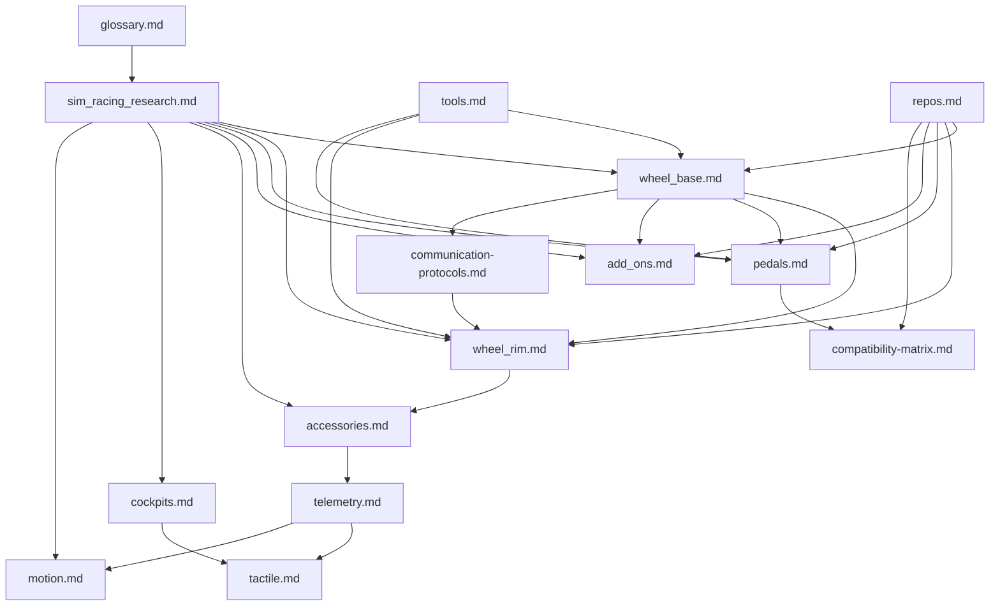

### Mô hình bằng chứng

| Nhãn | Ý nghĩa | Nguồn ưu tiên |
|---|---|---|
| Hành vi công khai đã được xác minh | Sản phẩm hoặc hành vi tiêu chuẩn được ghi lại công khai | Thông số kỹ thuật USB-IF, hướng dẫn sử dụng của nhà sản xuất, trang hỗ trợ |
| Thực hiện cộng đồng | Triển khai công khai hoặc có tài liệu hoạt động | GitHub repositories, project wikis |
| Suy luận kỹ thuật | Kết luận thiết kế hợp lý từ bằng chứng công khai | Nhiều nguồn kết hợp với thực hành hệ thống nhúng / điều khiển |
| Không rõ | Không đủ tính công khai để xác nhận | Yêu cầu sơ đồ, BOM, dấu vết, mô tả hoặc đặc tả từ nhà cung cấp được phê duyệt |

> **Về các hình minh họa (được thêm vào v1.2).** Các sơ đồ SVG được thêm vào trong đợt này là bản gốc, minh họa sơ đồ giảng dạy về các nguyên tắc kỹ thuật chung (cấu tạo động cơ, biến tần ba pha, thời gian PWM, cầu đo biến dạng, mã hóa cầu phương, ma trận nút, v.v.). Chúng **không** phải là bản sao chép của bất kỳ sơ đồ hoặc tác phẩm nghệ thuật sản phẩm nào từ nhà sản xuất, và chúng mô tả các khái niệm chung chứ không phải cấu tạo bên trong của một sản phẩm cụ thể nào. Trong trường hợp một giá trị phụ thuộc vào sản phẩm cụ thể (số cực, tốc độ PWM, độ phân giải, tần số cộng hưởng), hình minh họa được dán nhãn là chỉ để minh họa và văn bản sẽ ưu tiên theo kết quả đo lường hoặc thông số kỹ thuật được phê duyệt. Chúng nằm ở mức độ tin cậy "suy luận kỹ thuật / kiến thức chung công khai đã được xác minh", không phải "hành vi sản phẩm đã được xác minh".

### Quy tắc an toàn và phạm vi

- Không bao gồm firmware bị rò rỉ, sơ đồ bí mật, tệp nhị phân độc quyền, thông tin xác thực hoặc tài liệu hỗ trợ riêng.
- Không trình bày các dự án cộng đồng tương thích với Fanatec như là các thông số kỹ thuật giao thức chính thức của Fanatec.
- Không vượt qua xác thực console, giới hạn mô-men xoắn, khóa an toàn hoặc bảo vệ firmware.
- Xử lý việc kiểm tra động cơ mô-men xoắn cao là nguy hiểm cho đến khi việc vô hiệu hóa cổng độc lập và xử lý lỗi được xác minh.

### Hub tham chiếu

- [Thông số kỹ thuật và công cụ USB-IF HID](https://www.usb.org/hid)
- [USB-IF PID Lớp 1.0](https://www.usb.org/sites/default/files/documents/pid1_01.pdf)
- [Hướng dẫn sử dụng Fanatec Podium DD1](https://assets.fanatec.com/fanatec-pwa/image/upload/downloads-prod/pdfs/P-WB-DD1-Manual-EN_web.pdf)
- [OpenFFBoard wiki](https://github.com/Ultrawipf/OpenFFBoard/wiki/)
- [Trình điều khiển Linux hid-fanatecff](https://github.com/gotzl/hid-fanatecff)
- [SimHub wiki](https://github.com/SHWotever/SimHub/wiki)

### Câu hỏi chưa được giải quyết

- Không có.


## Thuật ngữ Khách hàng Fanatec Sim-Racing

> Ngày nghiên cứu: 2026-07-02
> Đối tượng: hỗ trợ khách hàng, bán hàng, nhà phát triển, người viết tài liệu kỹ thuật, và những người mới chơi sim-racing
> Phạm vi: sản phẩm Fanatec hiện tại và thường gặp, khả năng tương thích, thiết lập, điều chỉnh, thiết bị ngoại vi, và ngôn ngữ khắc phục sự cố

Bảng thuật ngữ này chuẩn hóa các từ được sử dụng khi thảo luận về các sản phẩm Fanatec với khách hàng. Nó không phải là tài liệu chính thức và không thay thế cho trang sản phẩm, Hướng dẫn nhanh (Quick Guide), sách hướng dẫn (manual), hoặc các hướng dẫn Hỗ trợ Fanatec cho một sản phẩm và phiên bản firmware cụ thể.

### Nội dung

- [Cách sử dụng Bảng thuật ngữ này](#cach-su-dung-bang-thuat-ngu-nay)
- [Từ vựng Tiếp nhận Khách hàng](#tu-vung-tiep-nhan-khach-hang)
- [Thuật ngữ Thương hiệu, Sản phẩm và Bundle](#thuat-ngu-thuong-hieu-san-pham-va-bundle)
- [Các Dòng Wheel Base Fanatec DD](#cac-dong-wheel-base-fanatec-dd)
- [Thuật ngữ Nền tảng và Tương thích](#thuat-ngu-nen-tang-va-tuong-thich)
- [Thuật ngữ Wheel Base, Mô-men xoắn, và Lắp đặt](#thuat-ngu-wheel-base-mo-men-xoan-va-lap-dat)
- [Thuật ngữ Vô lăng và Điều khiển](#thuat-ngu-vo-lang-va-dieu-khien)
- [Thuật ngữ Bàn đạp, Cần số, và Phanh tay](#thuat-ngu-ban-dap-can-so-va-phanh-tay)
- [Thuật ngữ Phần mềm, Firmware, và Thiết lập](#thuat-ngu-phan-mem-firmware-va-thiet-lap)
- [Các từ viết tắt trong Tuning Menu](#cac-tu-viet-tat-trong-tuning-menu)
- [Thuật ngữ FFB và Sim-Racing chung](#thuat-ngu-ffb-va-sim-racing-chung)
- [Thuật ngữ Khắc phục sự cố](#thuat-ngu-khac-phuc-su-co)
- [Bảng tra cứu nhanh Từ viết tắt](#bang-tra-cuu-nhanh-tu-viet-tat)
- [Tài liệu tham khảo](#tai-lieu-tham-khao)

### Cách sử dụng Bảng thuật ngữ này

#### Nhãn bằng chứng

| Nhãn | Ý nghĩa |
|---|---|
| Official | Ngôn ngữ từ sản phẩm Fanatec, hỗ trợ, Explorer, hoặc sách hướng dẫn. |
| Standard | Cách sử dụng chung trong USB, hệ thống điều khiển, điện, hoặc motorsport. |
| Common | Ngôn ngữ sim-racing được sử dụng rộng rãi; việc triển khai chính xác có thể khác nhau tùy theo sản phẩm hoặc trò chơi. |
| Legacy | Ngôn ngữ phần mềm/sản phẩm Fanatec cũ mà khách hàng vẫn có thể sử dụng. |

Các tuyên bố về sản phẩm hiện tại rất nhanh bị lỗi thời. [Sổ đăng ký nguồn hệ sinh thái](./references.md) ghi lại ngày đánh giá và các xung đột đã biết. Đặc biệt, một hướng dẫn cộng đồng vào tháng 1 năm 2026 có trước bản cập nhật mô-men xoắn của ClubSport DD/DD+ hiện tại và định vị flagship Podium DD.

#### Quy tắc giao tiếp

- Gọi là **Fanatec**, không phải "Fantec".
- Yêu cầu cung cấp tên sản phẩm chính xác, nền tảng, đường dẫn kết nối, phiên bản Fanatec App, và phiên bản firmware trước khi chẩn đoán.
- Phân biệt rõ **steering wheel** (vô lăng) với **wheel base** (đế bánh xe). Khách hàng thường gọi chung cả hai là "the wheel".
- Dùng **cường độ FFB** cho một cài đặt và **mô-men xoắn tính bằng Nm** cho lực đầu ra vật lý. Chúng có liên quan nhưng không thể thay thế cho nhau.
- Không hứa hẹn khả năng tương thích chỉ dựa vào hình dạng cổng kết nối. Sản phẩm, nền tảng, firmware, thế hệ quick-release, và đường dẫn kết nối đều rất quan trọng.
- Xử lý "Xbox Ready" và "PlayStation Ready" như là các nhãn có điều kiện, không giống như khả năng tương thích được cấp phép đầy đủ.
- Xác minh hỗ trợ mô-men xoắn QR2 cho từng sản phẩm hiện tại. Hành vi của QR2 Lite đã thay đổi đối với một số wheel thông qua các bản cập nhật firmware. [F4]

### Từ vựng Tiếp nhận Khách hàng

Hãy thu thập những thông tin này trước. Điều này ngăn chặn hầu hết các lỗi hỗ trợ do thuật ngữ gây ra.

| Hỏi Khách hàng Về | Ý nghĩa | Ví dụ Hữu ích |
|---|---|---|
| Platform | Máy chủ (host) đang chạy trò chơi | Windows PC, Xbox Series X\|S, PS5 |
| Wheel base | Bộ phận động cơ và hub USB | CSL DD, ClubSport DD+, Podium DD1 |
| Steering wheel hoặc hub | Cụm điều khiển có thể tháo rời | Formula V2.5X, CSL Universal Hub V2 |
| Quick release | Khớp nối cơ/điện giữa wheel và base | QR1, QR2 Lite, QR2 Pro |
| Peripherals | Bàn đạp, cần số, phanh tay, hoặc ngàm chuyển số tĩnh | CSL Pedals, ClubSport Shifter SQ V1.5 |
| Connection path | Cách mỗi thiết bị ngoại vi kết nối với máy chủ | Bàn đạp nối với base bằng RJ12; base nối với PC bằng USB |
| Software versions | Gói phần mềm trên máy chủ và firmware thiết bị | Fanatec App và phiên bản firmware của base/wheel |
| Mode | Nền tảng hoặc chế độ tương thích hiện tại | PC mode, Xbox mode, compatibility mode |
| Symptom | Lỗi có thể quan sát được, không phải nguyên nhân giả định | "Base được nhận diện nhưng không có FFB" |
| Trigger | Hành động sau đó sự cố bắt đầu | Cập nhật firmware, thay QR, cập nhật trò chơi |

### Thuật ngữ Thương hiệu, Sản phẩm và Bundle

| Thuật ngữ | Định nghĩa và Giải thích cho Khách hàng | Bằng chứng |
|---|---|---|
| Fanatec | Thương hiệu phần cứng sim-racing. Sử dụng chữ viết hoa chính xác. | Official |
| Ecosystem | Tập hợp các base, wheel, bàn đạp, cần số, phanh tay, quick release, phần mềm, và phụ kiện lắp đặt có thể hoạt động cùng nhau. Nó không có nghĩa là mọi kết hợp đều hỗ trợ mọi nền tảng hoặc tính năng. | Official [F1] |
| CSL | CSL là viết tắt của ClubSport Light. Cấp độ sản phẩm Fanatec được phân loại là dòng entry-level (cơ bản). Đây là tên của một dòng sản phẩm, không phải là chuẩn cổng kết nối hay tính tương thích. | Official [F19] |
| CSL Elite | Tên dòng sản phẩm được sử dụng cho một số wheel và bàn đạp. "Elite" không xác định tính tương thích nền tảng. | Official |
| ClubSport / CS | Cấp độ sản phẩm từ trung bình đến cao và là tiền tố viết tắt phổ biến. Các sản phẩm như ClubSport DD và ClubSport Shifter là hoàn toàn khác nhau. | Official |
| Podium / P | Cấp độ sản phẩm cao cấp được sử dụng cho các base, hub, module, và phụ kiện hiệu suất cao. | Official |
| Ready2Race / R2R | Bundle được thiết kế để chứa các thành phần chính cần thiết để bắt đầu đua. Cần xác nhận hỗ trợ nền tảng, thiết bị lắp đặt, và các nâng cấp tùy chọn trên trang của bundle đó. | Official |
| Racing Wheel | Có thể có nghĩa là một gói hoàn chỉnh gồm cả base và wheel. Hãy hỏi rõ xem khách hàng đang nói đến toàn bộ hệ thống hay chỉ riêng vô lăng có thể tháo rời. | Official/Common |
| Wheel Base | Đơn vị cố định chứa động cơ lái, trục, mạch điều khiển, giao diện USB, và các cổng cho thiết bị ngoại vi. Nó tạo ra FFB. | Official |
| Steering Wheel | Cụm điều khiển của người lái có thể tháo rời với tay cầm/vành, các nút, paddle, và thường có đèn LED/màn hình. Nó không tạo ra mô-men xoắn lái chính. | Official |
| Wheel Rim / Rim | Phần được người lái cầm nắm. Trong các hệ thống module, nó được gắn vít vào một hub. Khách hàng cũng thường dùng từ "rim" để chỉ toàn bộ steering wheel; hãy làm rõ. | Official/Common |
| Hub | Giao diện giữa rim và base, thường mang các nút điều khiển, paddle, mạch điện tử, và ngàm quick-release. | Official [F3] |
| Universal Hub | Hub dạng module của Fanatec chấp nhận các rim tương thích. Vẫn cần kiểm tra kiểu bắt vít, đường kính, trọng lượng, nút điều khiển, QR, và hỗ trợ nền tảng. | Official [F3] |
| Button Module | Cụm điều khiển/màn hình bổ sung được gắn vào một hub hoặc rim tương thích. | Official |
| Paddle Module | Cụm điều khiển phía sau bổ sung chứa các paddle sang số và, tùy thuộc vào mẫu mã, các paddle ly hợp analog. | Official |
| V1 / V2 / V2.5 | Phiên bản phần cứng trong tên sản phẩm. Đừng mặc định rằng các phụ kiện hoặc firmware có thể hoán đổi giữa các phiên bản. | Official |
| Discontinued / Legacy Product | Sản phẩm nằm ngoài danh mục hiện tại nhưng có thể vẫn được hỗ trợ bởi các driver, firmware, tài liệu, hoặc phụ tùng cũ. | Legacy |

### Các Dòng Wheel Base Fanatec DD

`DD` có nghĩa là **Direct Drive**, nhưng khách hàng có thể dùng "DD" để chỉ cấu trúc truyền động, ClubSport DD, hoặc sản phẩm Podium DD hiện tại. Luôn luôn hỏi tên mẫu mã (model) đầy đủ.

| Model | Định vị Sản phẩm | Mô-men xoắn Quảng cáo | Tóm tắt Nền tảng | Điểm khác biệt chính |
|---|---|---:|---|---|
| CSL DD | Direct drive entry-level | 5 Nm; 8 Nm với Boost Kit hỗ trợ | Windows PC; Xbox với wheel/hub được cấp phép Xbox; không cấp phép PlayStation | Sự lựa chọn nhỏ gọn, chi phí thấp để bước vào hệ sinh thái DD của Fanatec. [F13] |
| Podium Wheel Base DD1 | Flagship Podium thế hệ trước | Đỉnh (peak) lên tới 20 Nm | Mẫu tiêu chuẩn: Windows PC; Xbox với wheel/hub được cấp phép Xbox | Base Podium mô-men xoắn cao thế hệ trước. Từng có một mẫu DD1/bundle cấp phép PlayStation lịch sử, nên hãy kiểm tra SKU chính xác. [F14] |
| Podium Wheel Base DD2 | Flagship Podium thế hệ trước | Đỉnh (peak) lên tới 25 Nm | Windows PC; Xbox với wheel/hub được cấp phép Xbox | Mẫu mạnh hơn trong thời kỳ DD1; đi kèm Podium Kill Switch theo chuẩn. [F14] |
| ClubSport DD | Direct drive ClubSport hiện tại | 15 Nm holding torque với firmware hiện tại | Windows PC; Xbox với wheel/hub được cấp phép Xbox; không cấp phép PlayStation | Nền tảng QR2 và FullForce thế hệ hiện tại không có cấp phép PlayStation. [F15] |
| ClubSport DD+ | Direct drive ClubSport hiện tại | 18 Nm holding torque với firmware hiện tại | Windows PC và PlayStation; Xbox với wheel/hub được cấp phép Xbox | Mẫu ClubSport mạnh hơn có cấp phép PlayStation. [F15] |
| Podium DD | Flagship Podium hiện tại ra mắt năm 2026 | 25 Nm holding torque; đỉnh lên tới 33 Nm | Kiểm tra trang sản phẩm theo khu vực hiện tại và wheel/hub gắn kèm để biết hỗ trợ nền tảng | Hậu duệ của DD1/DD2, dựa trên kiến trúc ClubSport DD mới hơn với FullForce. [F16] |

#### Cảnh báo khi gọi tên và so sánh

- **CSL DD** là tên mô hình hoàn chỉnh: `CSL` là cấp độ sản phẩm và `DD` có nghĩa là Direct Drive.
- **DD1** và **DD2** là mã mô hình trong thế hệ Podium Wheel Base trước đó; số "2" xác định biến thể có công suất cao hơn, không phải "Direct Drive phiên bản 2".
- **DD / DD+** trong cách gọi tắt của khách hàng thường có nghĩa là **ClubSport DD / ClubSport DD+**. Dấu `+` xác định mẫu ClubSport mạnh hơn, được cấp phép PlayStation.
- **Podium DD** không có số là một sản phẩm năm 2026 hoàn toàn riêng biệt. Đừng nhầm lẫn với DD1, DD2, hoặc bất kỳ direct drive chung chung nào.
- Số liệu của DD1/DD2 được công bố là **peak torque** (mô-men xoắn đỉnh). ClubSport DD/DD+ và Podium DD sử dụng **holding torque** (mô-men xoắn duy trì) trong các thông số sản phẩm hiện tại. Các con số này không tương đương trực tiếp.
- ClubSport DD và DD+ ban đầu được bán với holding torque quảng cáo là 12 Nm và 15 Nm. Firmware Fanatec V1.4.2.3 hoặc mới hơn đã tăng lên 15 Nm và 18 Nm vào tháng 5 năm 2026 mà không thay đổi phần cứng. Hãy cập nhật qua Fanatec App mới nhất. [F15]
- Lượng mô-men xoắn khả dụng vẫn có thể bị giới hạn bởi steering wheel gắn kèm, quick release, firmware, hoặc Low Torque Mode. [F4]

### Thuật ngữ Nền tảng và Tương thích

| Thuật ngữ | Định nghĩa và Giải thích cho Khách hàng | Bằng chứng |
|---|---|---|
| Platform | PC hoặc môi trường console mà trò chơi đang chạy trên đó. Hỗ trợ có thể phụ thuộc vào phần cứng cấp phép và đường dẫn kết nối thiết bị ngoại vi. | Official [F2] |
| PC Compatible | Sản phẩm hoạt động trên các Windows PC được hỗ trợ qua kết nối được phê duyệt. Nó không hứa hẹn sẽ hỗ trợ trong mọi trò chơi hoặc các hệ điều hành không phải Windows. | Official [F2] |
| Xbox Compatible / Xbox Licensed | Steering wheel hoặc hub có chứa phần cứng cấp phép Xbox. Khi được gắn vào một base Fanatec tương thích, nó kích hoạt hệ thống đó trên Xbox. | Official [F2] |
| Xbox Ready | Nhãn có điều kiện: sản phẩm sẽ sử dụng được trên Xbox khi kết hợp với một steering wheel hoặc hub Fanatec được cấp phép Xbox. | Official [F2] |
| PlayStation Compatible / PS Licensed | Việc cấp phép PlayStation của Fanatec nằm ở wheel base. Một base được cấp phép sẽ kích hoạt các thành phần gắn kèm được hỗ trợ trên PlayStation. | Official [F2] |
| PlayStation Ready / PS Ready | Nhãn có điều kiện: thiết bị có thể hoạt động trên PlayStation khi được kết nối qua một base Fanatec được cấp phép PlayStation. | Official [F2] |
| Cross-Platform Setup | Wheel/hub cấp phép Xbox cộng với base cấp phép PlayStation. Thiết lập này có thể hỗ trợ PC và cả hai dòng console; hãy xác minh từng trang sản phẩm. | Official [F2] |
| Console Compatibility | Yêu cầu phần cứng được cấp phép và trò chơi hỗ trợ. Các thiết bị ngoại vi thường kết nối qua base thay vì các cổng USB riêng biệt của console. | Official [F2][F8] |
| Game Support | Trò chơi có triển khai các trục, nút, FFB, màn hình, đèn LED, hoặc telemetry liên quan. Tính tương thích phần cứng không đảm bảo mọi tính năng đều có. | Official [F7] |
| Native Mode | Thiết bị nhận diện ở chế độ hiện tại theo đúng dự định của nó. Tên gọi và hành vi chính xác khác nhau tùy base và nền tảng. | Official/Common |
| Compatibility Mode / CSW Mode | Base mô phỏng hoặc nhận diện tương tự như một base cũ hơn để các trò chơi không có native support có thể hoạt động. Tính năng có thể khác biệt. | Official/Legacy |
| PC Mode | Chế độ wheel-base dành cho Windows PC. Màu đèn LED và quy trình chuyển chế độ tùy thuộc vào sản phẩm. | Official |
| Xbox Mode | Trạng thái được dùng với các phần cứng được hỗ trợ trên Xbox. Việc cấp phép Xbox vẫn nằm trong wheel hoặc hub được cấp phép. | Official |
| PlayStation Mode | Trạng thái của một base cấp phép PlayStation trên console PlayStation được hỗ trợ. Chỉ báo chính xác có thể khác nhau. | Official |
| Standalone | Thiết bị ngoại vi kết nối trực tiếp với PC, thường qua USB hoặc ClubSport USB Adapter. USB standalone thường không hoạt động trên console. | Official [F2][F8] |
| Base-Connected | Thiết bị ngoại vi kết nối với base, base sẽ tổng hợp và truyền tín hiệu qua kết nối host/console của base. | Official [F2] |

### Thuật ngữ Wheel Base, Mô-men xoắn, và Lắp đặt

| Thuật ngữ / Viết tắt | Định nghĩa và Giải thích cho Khách hàng | Bằng chứng |
|---|---|---|
| DD — Direct Drive | Trục động cơ truyền động trực tiếp trục lái, không qua dây đai hoặc bánh răng giảm tốc. DD mô tả cấu trúc, không tự động mang ý nghĩa mô-men xoắn hoặc chất lượng. | Official/Common |
| Belt Drive | Động cơ truyền lực qua dây đai và puli. Thường thấy trên các wheel base đời cũ. | Common/Legacy |
| FFB — Force Feedback | Lực lái do động cơ tạo ra dựa trên các lệnh từ trò chơi và cài đặt của base. | Official [F5] |
| Torque | Lực xoay tại trục lái, thường được biểu thị bằng newton-mét (Nm). | Standard |
| Nm — Newton-metre | Đơn vị SI của mô-men xoắn. Nhiều Nm hơn có nghĩa là mô-men xoắn khả thi cao hơn, không tự động có nghĩa là chi tiết hoặc chân thực hơn. | Standard |
| Peak Torque | Mô-men xoắn cao nhất trong thời gian ngắn dưới các điều kiện quy định. Không so sánh trực tiếp nó với holding torque của một sản phẩm khác. | Common |
| Holding / Sustained Torque | Mô-men xoắn duy trì được lâu hơn dưới các giới hạn về nhiệt và điện. Định nghĩa và điều kiện thử nghiệm của mỗi nhà cung cấp có thể khác nhau. | Common |
| High Torque Mode | Trạng thái cho phép sử dụng quá mức giới hạn low-torque khi bộ đôi wheel/QR được phê duyệt. Không bao giờ bỏ qua cơ chế phát hiện hoặc các cảnh báo. | Official [F4] |
| Low Torque Mode | Chế độ giới hạn an toàn đối với wheel hoặc QR không được phê duyệt cho lực kéo tối đa của base. Hướng dẫn hiện tại quy định là 8 Nm trên các base đầu ra cao được liệt kê. | Official [F4] |
| QR — Quick Release | Khớp nối cơ/điện kết nối steering wheel với base. Cả hai phía và thế hệ QR phải khớp nhau. | Official [F4] |
| QR1 | Hệ QR Fanatec thế hệ thứ nhất. QR1 và QR2 không kết nối được với nhau. Fanatec tuyên bố QR1 đã bị ngừng sản xuất, dù các phần cứng cũ và cách chuyển đổi tùy model vẫn tồn tại. | Official [F4][F17] |
| QR1 Lite | QR1 wheel-side bằng vật liệu composite có giới hạn mô-men xoắn theo sản phẩm. Nó không tương đương với QR2 Lite. | Official [F4] |
| QR2 | Hệ QR hiện tại với các thành phần Base-Side và Wheel-Side tách biệt. | Official [F4] |
| QR2 Base-Side | Thành phần QR2 được lắp trên trục của base. Type-C, Type-F, hoặc Type-M tùy thuộc vào từng base. | Official [F4] |
| QR2 Wheel-Side | Thành phần được lắp trên wheel/hub. Nó kết nối với các biến thể QR2 Base-Side chính thức, tùy thuộc vào sản phẩm và sự phê duyệt mô-men xoắn. | Official [F4] |
| QR2 Lite Wheel-Side | QR2 wheel-side bằng composite. Hỗ trợ mô-men xoắn cao tùy thuộc vào wheel và firmware; các sản phẩm nhất định đã nhận được phê duyệt full-torque. | Official [F4] |
| QR2 Pro Wheel-Side | Phiên bản kim loại cao cấp hướng tới motorsport. "Pro" không ngụ ý là tương thích hoàn toàn với mọi nền tảng. | Official [F4] |
| Type-C / Type-F / Type-M | Các biến thể QR2 Base-Side tùy theo base: Type-C cho CSL DD/GT DD Pro, Type-F cho ClubSport DD, Type-M cho Podium trong hướng dẫn hiện tại. | Official [F4] |
| Shaft | Trục xoay đầu ra của wheel base. QR Base-Side được lắp vào đây. | Standard |
| Flex | Chuyển động đàn hồi không mong muốn ở buồng lái (cockpit), ngàm lắp, rim, hoặc QR. Nó có thể làm giảm chi tiết cảm nhận mà không phải do lỗi điện tử. | Common |
| Play / Backlash | Chuyển động tự do trước khi tải được truyền đi. Hãy hỏi ở vị trí nào: QR, shaft, hub, rim, bàn đạp, hay cockpit. | Common |
| Hard Mount | Bắt chặt thiết bị trực tiếp vào cockpit/bản kim loại bằng các điểm được chỉ định. Sử dụng kích thước và độ sâu bu lông được phê duyệt. | Official |
| Table Clamp | Phụ kiện dùng để kẹp chặt base hoặc shifter vào bàn. Độ cứng của bàn và giới hạn mô-men xoắn là yếu tố quan trọng. | Official |
| Cockpit / Rig | Khung kết cấu hỗ trợ ghế, base, bàn đạp, và phụ kiện. Độ cứng vững và sự điều chỉnh ảnh hưởng đến sự thoải mái và cảm nhận FFB. | Common |
| Boost Kit | Bộ nguồn công suất cao hơn cho các base được hỗ trợ giúp kích hoạt cấu hình mô-men xoắn cao hơn đã quảng cáo. Đây không phải là overclock chung chung. | Official |
| FullForce | Lớp hiệu ứng/giao thức FFB tần số cao của Fanatec trên các phần cứng và trò chơi được hỗ trợ. Tính đến tháng 6 năm 2026, hướng dẫn chính thức hiện tại bao gồm CSL DD và GT DD Pro cùng với các dòng ClubSport và Podium DD hiện tại; vẫn yêu cầu hỗ trợ từ phía trò chơi. | Official [F18] |

### Thuật ngữ Vô lăng và Điều khiển

| Thuật ngữ / Viết tắt | Định nghĩa và Giải thích cho Khách hàng | Bằng chứng |
|---|---|---|
| D-pad | Điều khiển kỹ thuật số bốn hướng, thường có bấm ở giữa, dùng cho các menu hoặc điều hướng Tuning Menu. | Common |
| FunkySwitch | Điều khiển đa chức năng của Fanatec kết hợp di chuyển theo hướng, xoay, và bấm trên các wheel được hỗ trợ. | Official [F5] |
| Rotary Encoder | Núm vặn tạo ra tín hiệu tăng/giảm theo từng bước khi xoay. Thường không báo cáo một vị trí tuyệt đối cố định. | Standard |
| Thumb Encoder | Rotary encoder được đặt ở vị trí ngón cái để dễ thao tác khi cầm vô lăng. | Common |
| MPS — Multi-Position Switch | Điều khiển đa vị trí có thể xuất ra dưới dạng encoder, pulse, constant, hoặc hành vi do game tùy chọn. | Official [F5] |
| Button Cluster / Island | Nhóm các nút được bố trí cùng nhau, thường có thể điều chỉnh trên một Universal Hub. | Official [F3] |
| Button Caps | Các nắp phím có thể thay thế phù hợp với các chức năng của nền tảng/game. Nhãn hiệu không làm thay đổi tính tương thích điện tử. | Official |
| Magnetic Shifter Paddle | Paddle với hành động trả về/chốt bằng từ tính, thường báo cáo tín hiệu sang số kỹ thuật số. | Common |
| Analogue Paddle | Paddle sử dụng trục biến thiên có thể cấu hình cho ly hợp, phanh tay, phanh/ga, hoặc các trục bổ sung trên các wheel được hỗ trợ. | Official [F5] |
| Dual Clutch | Hai paddle analog được sử dụng cùng lúc cho các pha xuất phát cuộc đua; một bên có thể giữ điểm cắt (bite point) đã thiết lập. | Official [F5] |
| CbP — Clutch Bite Point | Tỷ lệ phần trăm bám ly hợp được cấu hình cho việc xuất phát lặp lại với các paddle analog kép. | Official [F5] |
| RevLEDs | Đèn báo RPM/vòng tua do telemetry của game hoặc phần mềm hỗ trợ điều khiển. Chúng không chứng tỏ FFB đang hoạt động. | Official [F7] |
| FlagLEDs | Đèn LED nhiều màu dùng cho các cờ đua, pit/giới hạn, và các trạng thái khác được hỗ trợ. | Official [F7] |
| RevStripe | Dải đèn tua máy sáng đặc thù cho từng sản phẩm. Hành vi phụ thuộc vào wheel, game, nền tảng, và phần mềm. | Official [F7] |
| OLED / LCD | Công nghệ hiển thị tốc độ, số, tuning, telemetry, hoặc trạng thái. Hỗ trợ hiển thị nội dung khác nhau. | Standard/Official |
| Telemetry | Dữ liệu xuất từ game như RPM, tốc độ, số, cờ, hoặc nhiên liệu. Nó điều khiển màn hình/đèn LED và độc lập với FFB. | Common |
| Static Shifter Paddles | Các paddle cố định được gắn vào base/cockpit thay vì quay cùng với wheel. Hoạt động của cổng tùy thuộc vào từng base. | Official [F8] |

### Thuật ngữ Bàn đạp, Cần số, và Phanh tay

| Thuật ngữ / Viết tắt | Định nghĩa và Giải thích cho Khách hàng | Bằng chứng |
|---|---|---|
| Pedal Set | Cụm chân ga, chân phanh, và ly hợp tùy chọn. Kết nối và khả năng USB khác nhau tùy thuộc vào từng model và kit đã lắp. | Official |
| Throttle / Accelerator | Trục bàn đạp ra lệnh công suất động cơ, thường được cảm biến bằng vị trí. | Common |
| Brake Pedal | Trục bàn đạp ra lệnh phanh. Nó có thể đo hành trình, lực, hoặc kết hợp cả hai. | Common |
| Clutch Pedal | Trục bàn đạp dùng để điều khiển ly hợp thủ công. | Common |
| Load Cell / LC | Cảm biến lực thường được dùng trong các bàn đạp phanh; đo lực tác động thay vì vị trí. | Official [F6] |
| Hall Sensor | Cảm biến từ không tiếp xúc thường đo vị trí bàn đạp hoặc đòn bẩy. | Official [F6] |
| Potentiometer / Pot | Biến trở đo vị trí có tiếp xúc. Hao mòn hoặc bụi bẩn có thể gây ra tín hiệu nhiễu. | Standard/Common |
| Hydraulic-Equipped Pedal | Sử dụng điện trở/áp suất dựa trên chất lỏng. Hãy xác nhận xem mẫu cụ thể đó cảm biến áp suất, lực hay hành trình. | Official [F6] |
| Elastomer | Phần tử polymer chịu nén để chỉnh độ cứng/hành trình của bàn đạp, đặc biệt là quanh phanh load-cell. | Official [F6] |
| Preload | Lực nén ban đầu trước khi bàn đạp dịch chuyển bình thường. Nó không phải là lực phanh tối đa. | Common |
| Pedal Travel | Khoảng cách hoặc góc vật lý mà qua đó bàn đạp dịch chuyển. | Standard |
| BRF — Brake Force | Cài đặt Fanatec quy định mức lực load-cell vật lý tương ứng với tín hiệu phanh tối đa. Nó không phải là phân bổ lực phanh (brake bias). | Official [F5] |
| Brake Bias | Cài đặt trong game phân bổ lực phanh giữa trục trước/sau; không liên quan đến hiệu chỉnh BRF. | Common |
| Dead Zone | Vùng đầu vào bị bỏ qua ở phần đầu/cuối của một trục. Cài đặt quá nhiều sẽ giảm độ phân giải khả dụng. | Common |
| Calibration | Ánh xạ các vị trí vật lý tối thiểu, tối đa, vị trí giữa, hoặc số sang các giá trị logic. | Official [F8] |
| H-Pattern | Kiểu cần số thủ công với vị trí cửa vào (gate) vật lý cho từng số. | Official [F8] |
| SQ — Sequential | Thao tác cần số tiến/lùi để lên/xuống số. "SQ" nhận diện khả năng tuần tự. | Official [F8] |
| Reverse Inhibitor | Cơ cấu ngăn việc lùi số vô tình, ví dụ như phải ấn đòn bẩy xuống trước. | Official [F8] |
| Shifter 1 Port | Hỗ trợ các chế độ H-pattern và sequential cho ClubSport Shifter SQ V1.5 trong hướng dẫn hiện tại. | Official [F8] |
| Shifter 2 Port | Hỗ trợ đầu vào sequential; hướng dẫn hiện tại cũng xác nhận sử dụng Static Shifter Paddles. | Official [F8] |
| Handbrake | Thường là trục đòn bẩy analog dùng cho drift/rally. Không phải là nút kỹ thuật số trừ khi được gán (mapped) như vậy. | Official/Common |
| ClubSport USB Adapter | Adapter cho phép các thiết bị ngoại vi được chọn hoạt động standalone trên PC. Adapter mode phải khớp với thiết bị ngoại vi. | Official [F9] |
| RJ12 | Cổng kết nối dạng module dùng cho các thiết bị ngoại vi Fanatec. Tên cổng không xác định giao thức hay đảm bảo tương thích. | Official/Common [F9] |
| PS/2 Connector | Mini-DIN được sử dụng trên một số kết nối base/shifter đời cũ. Không ngụ ý tương thích với bàn phím/chuột PC. | Official/Legacy [F8] |
| Simultaneous USB and Base Connection | Việc cắm cùng lúc USB và Base có thể không an toàn/không được hỗ trợ cho một số bàn đạp. Làm theo tài liệu hướng dẫn chính xác; không dùng cả hai trừ khi được cho phép rõ ràng. | Hướng dẫn official theo từng sản phẩm |

### Thuật ngữ Phần mềm, Firmware, và Thiết lập

| Thuật ngữ | Định nghĩa và Giải thích cho Khách hàng | Bằng chứng |
|---|---|---|
| Fanatec App | Phần mềm Windows hiện tại dùng cho việc thiết lập, kiểm tra, điều chỉnh, cấu hình LED/hiển thị, và quản lý firmware được hỗ trợ. | Official [F4][F8] |
| Fanatec Control Panel / Wheel Property Page | Giao diện cấu hình Windows cũ trong các driver/tài liệu hỗ trợ cũ. Hãy hỏi khách hàng đang xem gói nào. | Legacy [F5] |
| FanaLab | Công cụ PC tinh chỉnh profile telemetry/vệ tinh cũ trong các thiết lập cũ. Xác minh phiên bản và profile đang hoạt động trước khi chẩn đoán. | Legacy |
| Driver | Phần mềm host giúp Windows giao tiếp với phần cứng. Phiên bản Driver và firmware là các giá trị khác nhau. | Official [F10] |
| Firmware / FW | Phần mềm được lưu trữ bên trong base, mạch điều khiển động cơ, wheel, bàn đạp, hoặc adapter. Một hệ thống có thể có nhiều thành phần firmware. | Official [F10] |
| Firmware Manager | Chức năng quy trình cập nhật/khôi phục dùng để kiểm tra và nạp (flash) firmware được hỗ trợ. | Official [F8][F10] |
| Bootloader | Đoạn mã thiết bị tối thiểu được sử dụng để khởi động/khôi phục các bản cập nhật. Chế độ cập nhật không nhất thiết có nghĩa là hư hỏng vĩnh viễn. | Standard |
| Firmware Update | Thay thế firmware của thiết bị. Giữ nguồn/cáp ổn định và làm theo lời nhắc. | Official [F10] |
| Manual Firmware Update | Quy trình nâng cao để chọn cấu hình firmware/thành phần thủ công. Chỉ sử dụng khi hướng dẫn chính thức yêu cầu. | Official [F8] |
| Adapter Mode | Firmware/định dạng của ClubSport USB Adapter được chọn cho thiết bị ngoại vi gắn kèm. | Official [F8][F9] |
| Device Detection | Phần mềm host nhận diện được base/thành phần. Việc nhận diện là riêng biệt với gán nút trong game và FFB. | Common |
| Center Calibration | Lưu trữ vị trí đi thẳng vật lý làm tâm (center) logic. Nó không sửa chữa việc bị lệch tâm cơ học. | Official |
| Shifter Calibration | Dạy (teach) các vị trí số H-pattern; có thể bị yêu cầu làm lại sau các bản cập nhật firmware. | Official [F8] |
| Pedal Calibration | Lưu trữ dải tối thiểu/tối đa hoặc lực của bàn đạp. Các chế độ phụ thuộc vào sản phẩm/phần mềm. | Official |
| Tuning Menu | Các cài đặt của base có thể truy cập qua điều khiển wheel và phần mềm PC. Nó không thay thế thiết lập (setup) trong game. | Official [F5] |
| Standard Tuning Menu | Chế độ xem đơn giản hóa bộc lộ các tham số cốt lõi và ít profile hơn. | Official [F5] |
| Advanced Tuning Menu | Chế độ xem đầy đủ bộc lộ thêm các tham số và nhiều slot tùy chỉnh. | Official [F5] |
| A SET — Auto Setup | Cho phép một game được hỗ trợ kiểm soát các giá trị điều chỉnh; các giá trị mặc định được dùng khi tính năng này không kích hoạt. | Official [F5] |
| C SET — Custom Setup | Profile có thể do người dùng tùy chỉnh trong Standard Tuning Menu trên các base hiện tại hỗ trợ tính năng này. | Official [F5] |
| S_1–S_5 / SET 1–5 | Profile Advanced Tuning Menu do người dùng lưu. Tính khả dụng phụ thuộc vào base/firmware. | Official [F5] |
| Profile | Nhóm các giá trị đã được lưu. Hãy nói rõ ai sở hữu nó: base, Fanatec App, FanaLab, hay game. | Official/Common |
| Factory Settings | Cài đặt gốc của nhà sản xuất. Reset profile không phải là hạ cấp (downgrade) firmware hay gỡ cài đặt driver. | Official |

### Các từ viết tắt trong Tuning Menu

Dải đo chính xác và sự khả dụng khác nhau theo từng base, wheel, bàn đạp, firmware, và chế độ menu. Kiểm tra trang hướng dẫn sử dụng/hỗ trợ hiện hành của sản phẩm trước khi khuyến nghị các giá trị. [F5]

| Viết tắt | Ý nghĩa (Mở rộng) | Giải thích thực tế |
|---|---|---|
| SEN | Sensitivity | Góc quay của tay lái (độ), hoặc được điều khiển tự động bởi game/driver. Không phải là polling sensitivity (độ nhạy cập nhật USB). |
| FF / FFB | Force Feedback | Cường độ FFB tối đa của base. Lực xoắn thực tế cuối cùng còn phụ thuộc vào game xuất ra và các modifiers. |
| FFS | Force Feedback Scaling | Chọn hành vi dạng tuyến tính (`LIN`) hoặc đỉnh (`PEA`). Không giống với cường độ FF. |
| LIN | Linear | Duy trì mối quan hệ yêu cầu-lực (request-to-torque) tuyến tính hơn, nhưng lực tối đa có thể bị giảm lại. |
| PEA | Peak | Cho phép hành vi đầu ra chạm đỉnh (peak) trên các base hỗ trợ. |
| NDP | Natural Damper | Thêm kháng lực phụ thuộc vào tốc độ, kiểm soát chuyển động và dao động (oscillation). Thiết lập quá cao sẽ cảm thấy tay lái bị chậm/nặng. |
| NFR | Natural Friction | Thêm kháng lực tương đối không đổi bất kể chi tiết trong game. Thiết lập quá cao làm mất chi tiết và gây mỏi tay. [F11] |
| NIN | Natural Inertia | Mô phỏng khối lượng lái/quán tính bổ sung, thường rất hữu ích với những wheel có trọng lượng nhẹ. |
| INT | FFB Interpolation | Làm mịn các tín hiệu FFB giật/nhiễu từ game. Giá trị cao làm giảm sự thô ráp nhưng có thể làm giảm tính tức thời. |
| FEI | Force Effect Intensity | Làm thay đổi độ gắt/sắc nét (intensity/sharpness) của hiệu ứng lực trong game. Không phải là bộ giới hạn lực chính. |
| FOR | Force | Nhân bản (scale) hiệu ứng constant-force từ game. Giữ nguyên giá trị trừ khi hướng dẫn của game yêu cầu thay đổi. |
| SPR | Spring | Nhân bản (scale) hiệu ứng spring (lò xo) từ game. Không phải lúc nào cũng tạo ra hiệu ứng tự động trả thẳng tâm (auto-centering). |
| DPR | Damper | Nhân bản (scale) hiệu ứng damper từ game. Khác biệt với hiệu ứng NDP được tạo bởi base. |
| BRF | Brake Force | Thiết lập mức lực vật lý lên load-cell cần thiết để đạt tín hiệu phanh tối đa trên bàn đạp hỗ trợ. |
| BLI | Brake Level Indicator | Ngưỡng (threshold) cho cơ chế rung bàn đạp/wheel được hỗ trợ; hành vi do game điều khiển có thể khác. |
| SHO | Shock / Vibration Strength | Điều khiển mô-tơ rung tích hợp (nếu có hỗ trợ), không phải điều khiển mô-tơ FFB chính của base. |
| MPS | Multi-Position Switch Function | Lựa chọn cách công tắc MPS (hỗ trợ) sẽ gửi tín hiệu đầu vào. |
| AUTO | Automatic / Game Specific | Để game/phần mềm chọn cách hoạt động. Ý nghĩa phụ thuộc vào thiết lập cha (parent setting). |
| ENC | Encoder | Công tắc MPS xuất một input khi quay theo chiều kim đồng hồ, và một input khác khi quay ngược chiều. |
| CONST | Constant | Công tắc MPS gửi duy trì (hold) một trạng thái nút khác nhau cho từng vị trí. |
| PULSE | Pulse | Công tắc MPS gửi một input cụ thể cực nhanh (pulse) cho từng vị trí khi di chuyển. |
| AP | Analogue Paddles | Chọn các chức năng hoạt động của analogue-paddle có hỗ trợ. |
| CbP | Clutch Bite Point | Cả 2 paddle phối hợp làm điều khiển ly hợp cho khả năng xuất phát ổn định, lặp lại cao. |
| CH | Clutch / Handbrake | Một paddle analog đóng vai trò ly hợp; paddle kia đóng vai trò phanh tay. |
| bt / BT | Brake / Throttle | Analogue paddles đóng vai trò chân phanh và chân ga. |
| AnA | Mappable Analogue Axes | Mở rộng paddle như là các trục có thể gán phím riêng lẻ. |

### Thuật ngữ FFB và Sim-Racing chung

| Thuật ngữ / Viết tắt | Định nghĩa và Giải thích cho Khách hàng | Bằng chứng |
|---|---|---|
| Axis | Tín hiệu đầu vào liên tục như tay lái, bướm ga, chân phanh, ly hợp, hoặc phanh tay. | USB/Common |
| Button Mapping | Việc gán chức năng từ nút bấm vật lý thành lệnh trong game. Nó không thay đổi tính cấp phép hay firmware. | Common |
| Clipping | FFB đạt đến mức tối đa được cấu hình, vì vậy các lực mạnh hơn bị mất đi điểm nhấn. Hạ/Cân bằng lại gain trong game để giữ lại các chi tiết. | Common |
| Damping | Kháng lực chủ yếu liên quan tới tốc độ chuyển động. Giúp làm mượt sự di chuyển; đặt quá mức che lấp các chi tiết xử lý nhanh. | Control-system/Common |
| Friction | Kháng lực chống lại sự di chuyển, bao gồm di chuyển chậm. Trong tinh chỉnh Fanatec, xem mục NFR. | Control-system/Common |
| Inertia | Sự phản kháng tới sự thay đổi tốc độ quay vì khối lượng hiệu dụng. Trong tinh chỉnh, xem mục NIN. | Control-system/Common |
| Oscillation | Dao động qua lại không mong muốn ở tay lái. FFB quá mạnh, có độ trễ, damping quá thấp, hay do cơ chế game đều có thể gây ra hiện tượng này. | Official/Common [F12] |
| Gain | Bộ nhân cường độ FFB trong game/phần mềm. Mức Gain quá cao có thể gây clipping. | Common |
| Minimum Force | Cài đặt trong game giúp tăng FFB ở vùng giữa/tâm (center). Mức cao quá có thể gây oscillation trên các mẫu DD. | Common [F12] |
| Linearity | Cách mô-men xoắn phản ứng theo tỉ lệ tuyến tính của lực yêu cầu. Lực chạy tuyến tính hơn không có nghĩa là mạnh hơn. | Common |
| Latency | Độ trễ giữa game, tín hiệu USB, firmware, mô-tơ, và driver hồi đáp. | Standard |
| Polling / Report Rate | Tần suất mà các báo cáo dữ liệu đầu vào được trao đổi. Nó không phải là toàn bộ độ trễ end-to-end. | USB/Common |
| USB HID | Universal Serial Bus Human Interface Device class dành cho điều khiển như các trục (axes)/nút bấm (buttons). | Standard [S1] |
| USB PID | USB Physical Interface Device model dành cho các hiệu ứng FFB; không liên quan đến Product ID (PID). | Standard [S2] |
| RPM | Số vòng quay mỗi phút (Revolutions per minute). Telemetry RPM của động cơ thường dùng để điểu khiển RevLEDs. | Standard |
| Understeer | Lốp trước bị thiếu độ bám so với lượt đánh lái yêu cầu. Sự thể hiện qua FFB sẽ dựa trên thiết kế/hệ vật lý của game. | Motorsport/Common |
| Oversteer | Lốp sau trượt (mất độ bám) nhanh hơn so với lốp trước, khiến xe bị quay (rotate) gắt hơn mức yêu cầu. | Motorsport/Common |
| Road Effects | Bề mặt, ổ gà, lề đường (kerb) hoặc các hiệu ứng rung lắc; có thể được tính bằng vật lý hay từ các file vạch sẵn (canned effect) tùy vào game. | Common |
| Soft Lock | Lực ngáng ảo được thiết lập gần giới hạn lái góc quay thực tế của xe trong game, đây không phải điểm kết thúc vòng quay vật lý (physical shaft stop). | Common |
| Steering Lock / Rotation | Tổng góc lái tối đa tính bằng độ. Hãy điều chỉnh Fanatec SEN và thiết lập steering lock của game để có thông số trùng khớp. | Common |
| Sim Rig | Thiết lập đầy đủ: khung đua (cockpit), ghế, điều khiển, màn hình/VR, thiết bị (PC/Console), và các phụ kiện khác. | Common |
| Telemetry Dashboard | Bảng hiển thị điều khiển từ dữ liệu game, thông thường qua Fanatec App hoặc SimHub. | Common |

### Thuật ngữ Khắc phục sự cố

| Thuật ngữ | Định nghĩa và Diễn đạt An toàn với Khách hàng |
|---|---|
| Not Detected | Máy chủ không nhận dạng được thiết bị. Kiểm tra lại nguồn điện, cáp USB, chế độ, cổng kết nối, và Device Manager (trên Windows) trước khi nghi ngờ hỏng firmware. |
| Detected but Not Working in Game | Trình điều khiển (driver) nhận thiết bị, nhưng các bản map/cài đặt tương thích của game có thể đã bị thiếu. Tách biệt riêng các khâu test input, FFB, LED, và telemetry. |
| No FFB | Tín hiệu vào (Input) có thể vẫn hoạt động dù mô-tơ mất FFB. Kiểm tra trong game, các cài đặt FFB, FF của thiết bị, tình trạng firmware, trạng thái low-torque/an toàn, và xem màn hình game có được focus không. |
| FFB Loss | FFB hoạt động được rồi ngừng. Lưu lại thao tác nào làm lỗi xảy ra (trigger), nhiệt độ, cổng kết nối USB, tình trạng phiên đua, và xác nhận coi Input (trục tay lái) còn tác dụng không. |
| Wheel Disconnect | Wheel tháo rời liên tục mất tín hiệu dù base vẫn có điện. Xác nhận khả năng khớp nối, nhận diện QR, kiểm tra cổng chân tiếp xúc (contact pin), firmware, và mức độ lỏng (play). |
| Mis-shift | Số dạng cổng chữ H (H-pattern) đọc sai. Xác nhận cắm vào cổng Shifter 1, chế độ hộp số H mode, kiểm tra dây cắm, và căn chỉnh lại. |
| Input Jitter / Spiking | Tín hiệu Trục (axis) nhảy loạn xạ dù không tác động vật lý. Các nguyên nhân có thể do kẹt/rơ, nhiễu/kéo dãn cáp cảm biến, đường nối mass, hay vấn đề bộ phận cơ học. |
| EMI — Electromagnetic Interference | Nhiễu tín hiệu điện cộng hưởng vào USB/cảm biến/dây điện. Việc chẩn đoán sẽ dựa vào đường đi của dây, cách nối mass, công suất tải, và thử đổi các cổng khác. |
| Ground Loop | Đường dây rò điện không mong muốn chạy xuyên qua nối đất làm ngắt kết nối. Tuyệt đối không gỡ dây nối đất bảo vệ đi vì nghĩ đây là cách giải quyết. |
| Power Cycle | Đóng tắt hoàn toàn một cách có kiểm soát, chờ một chút rồi bật lại. Không phải là rút giắc nguồn trong khi đang nâng cấp Firmware. |
| Re-enumeration | Gỡ kết nối thiết bị USB rồi nhận lại, có thể bằng mode/ID nhận dạng khác. |
| Firmware Mismatch | Các thành phần đang dùng lẫn lộn bản firmware không tương thích. Hãy dùng theo hướng dẫn hiện tại của các bản cập nhật chính thức. |
| Recovery Mode | Trạng thái bootloader/update dùng để khôi phục lại (restore) phần sụn. Thao tác đúng theo bước chính thức từ từng bản phần cứng đó. |
| Bricked | Một thuật ngữ không chính thức diễn đạt việc thiết bị sau khi update bị hư hỏng không dùng được nữa. Phải kiểm tra tính năng khôi phục (recovery), mức độ nhận dạng, và điện đóm (power) trước khi chẩn đoán hỏng vĩnh viễn. |
| RMA — Return Merchandise Authorization | Quy trình trả lại/sửa chữa thiết bị được hãng phê duyệt. Cung cấp rõ Serial, biên lai mua bán (proof), số series thiết bị, thông tin logs, bằng chứng, và các bước mô tả tái hiện sự cố. |
| DOA — Dead on Arrival | Một nhãn đánh giá không chính thức dùng khi thiết bị gặp lỗi hỏng hóc ngay lập tức khi khui thùng setup (first-setup failure). Vẫn cần rà soát qua các bước kiểm tra an toàn tối thiểu (minimum safe checks) trước khi dùng thuật ngữ này lên ticket hỗ trợ. |
| Reproduction Steps | Trình tự ngắn và đáng tin cậy mô tả cách khiến lỗi xảy ra, kể ra trạng thái, thiết bị, dây cắm kết nối, mode (chế độ), thông số firmware, phần mềm game, và kết quả lỗi. |
| Expected Result | Cách hoạt động phải tuân thủ đúng như phần Sách hướng dẫn / Tài liệu mô tả của sản phẩm hiện tại. |
| Actual Result | Hiện tượng được khách hàng báo lại đúng như lúc nhìn thấy trên mặt báo, không dựa theo kết luận bị ngộ nhận (assumed cause). |
| Workaround | Biện pháp bảo đảm tính hoạt động an toàn tạm thời nhưng bản chất chưa loại trừ hoàn toàn nguyên nhân gốc (root cause). |
| Root Cause | Nguyên do gây hỏng hóc đã được xác nhận. Triệu chứng, các mối liên kết, hoặc khởi động lại (reboot) thành công đơn lẻ không dùng làm bằng chứng kết luận. |

### Bảng tra cứu nhanh Từ viết tắt

| Viết tắt | Mở rộng | Viết tắt | Mở rộng |
|---|---|---|---|
| AnA | Mappable Analogue Axes | AP | Analogue Paddles |
| BLI | Brake Level Indicator | BRF | Brake Force |
| BT / bt | Brake / Throttle | CbP | Clutch Bite Point |
| CH | Clutch / Handbrake | CONST | Constant |
| CS | ClubSport | DD | Direct Drive |
| DOA | Dead on Arrival | DPR | Damper |
| EMI | Electromagnetic Interference | ENC | Encoder |
| FEI | Force Effect Intensity | FF / FFB | Force Feedback |
| FFS | Force Feedback Scaling | FW | Firmware |
| HID | Human Interface Device | INT | FFB Interpolation |
| LC | Load Cell | LIN | Linear |
| MPS | Multi-Position Switch | NDP | Natural Damper |
| NFR | Natural Friction | NIN | Natural Inertia |
| Nm | Newton-metre | OLED | Organic Light-Emitting Diode |
| PEA | Peak | PID | Physical Interface Device |
| PS | PlayStation | QR | Quick Release |
| R2R | Ready2Race | RMA | Return Merchandise Authorization |
| RPM | Revolutions per minute | SEN | Sensitivity |
| SHO | Shock / Vibration Strength | SPR | Spring |
| SQ | Sequential | USB | Universal Serial Bus |

### Ngôn ngữ Khách hàng được Khuyến nghị

| Tránh | Ưu tiên | Lý do |
|---|---|---|
| "Wheel của bạn không tương thích." | "Vui lòng xác nhận chính xác base, wheel/hub, QR, nền tảng (platform), và kết nối (connection path)." | "Wheel" là từ dễ gây hiểu lầm; mức tương thích cụ thể cho từng loại. |
| "Vặn lực xoắn tới 8 Nm đi." | "Set thông số FFB theo hướng dẫn; base/QR sẽ tự điều chỉnh giới hạn mô-men xoắn cho bạn." | Các chỉ số thông số phần trăm (%) và lực kéo vật lý tính bằng mô men xoắn sẽ khác nhau. |
| "Tính năng tương thích Xbox nằm ở base." | "Hệ phần cứng cấp phép cho nền tảng Xbox nằm trong Fanatec steering wheel hoặc bộ hub có bản quyền (licensed hub)." | Đề phòng mua sai thông tin dẫn tới cắm sai. [F2] |
| "Tính năng tương thích PlayStation nằm ở wheel." | "Bản quyền cấp phép PlayStation nằm trong Fanatec wheel base." | Đề phòng mua sai thiết bị dẫn tới cắm nhầm. [F2] |
| "Loại ngàm QR2 Lite lúc nào cũng giảm/giới hạn lực kéo." | "Mức hỗ trợ của QR2 Lite sẽ bị phục thuộc vô sự phê duyệt thông qua thông số bánh lái (wheel) cùng phiên bản firmware hiện tại." | Các sản phẩm nhất định sẽ có sự thay đổi khác biệt. [F4] |
| "Bóng đèn LEDs bị hư rồi." | "Các dải LED có sáng lên không khi Test (thử) bằng Fanatec App, và tựa game/nền tảng này có hỗ trợ cấp tín hiệu telemetry không?" | Phân chia khu vực giới hạn khả năng hoạt động trên phần cứng từ thiết bị (hardware) tránh liên lụy sang game. [F7] |
| "Cập nhật khiến máy thành cục gạch (bricked)." | "Thiết bị không được phát hiện sau khi hoàn tất update; hãy rà soát tính khôi phục (recovery)/chế độ (bootloader)." | Tránh đưa ra kết luận nhanh dẫn tới hiểu lầm rủi ro hư hỏng (permanent damage) khó gỡ. |

### Tài liệu tham khảo

#### Nguồn chính thức từ Fanatec

- **[F1]** [Sơ đồ Hệ sinh thái Fanatec](https://help.fanatec.com/hc/de/articles/43786297099281-Fanatec-Ecosystem-Diagramm) — các mối liên hệ danh mục.
- **[F2]** [Giải thích tính tương thích nền tảng](https://www.fanatec.com/us-en/platforms) — nhãn tính tương thích và vị trí cấp phép.
- **[F3]** [So sánh các hub steering wheel của Fanatec](https://www.fanatec.com/jp/en/explorer/products/steering-wheel/fanatec-hubs-a-comparison/) — công dụng hub và điểm khác biệt.
- **[F4]** [Cập nhật mô-men xoắn của QR2 Lite](https://www.fanatec.com/eu/en/explorer/products/steering-wheel/qr2-lite-torque-limit-lifted/) và [Hướng dẫn chuyển đổi QR2](https://help.fanatec.com/hc/en-us/articles/30011253510289-Which-products-can-be-converted-to-QR2) — Các biến thể QR và những cảnh báo hiện tại.
- **[F5]** [Tham số Tuning Menu](https://help.fanatec.com/hc/en-us/articles/43901256649233-In-the-Tuning-Menu-of-your-wheel-base-you-can-adjust-a-variety-of-parameters) — tên gọi cài đặt và chế độ.
- **[F6]** [Bàn đạp trang bị load cell, Hall, và thủy lực](https://www.fanatec.com/us/en/explorer/products/pedals/difference-load-cell-hall-sensor-and-hydraulic-pedals/) — các loại cảm biến bàn đạp.
- **[F7]** [Kích hoạt RevLED và FlagLED](https://help.fanatec.com/hc/en-us/articles/30312122625553-How-do-I-activate-the-RevLEDs-or-flag-LEDs-on-my-wheel) và [Hướng dẫn FlagLED](https://www.fanatec.com/au/en/explorer/products/steering-wheel/understanding-fanatec-steering-wheel-flagleds/) — các sự phụ thuộc của game/nền tảng.
- **[F8]** [Hướng dẫn ClubSport Shifter SQ V1.5](https://www.fanatec.com/us/en/explorer/products/shifters/guide-to-fanatecs-clubsport-shifter-sq-v15/) và [hướng dẫn cổng shifter-port](https://help.fanatec.com/hc/en-us/articles/45597346898449-Which-shifter-port-should-I-use-on-my-Fanatec-wheel-base) — các chế độ, căn chỉnh, cổng.
- **[F9]** [Hướng dẫn ClubSport USB Adapter](https://www.fanatec.com/ca/en/explorer/products/handbrakes/guide-to-fanatecs-clubsport-usb-adapter/) — cách sử dụng standalone (riêng biệt) và chế độ adapter.
- **[F10]** [Sách Hướng dẫn Driver và Firmware](https://assets.fanatec.com/fanatec-pwa/image/upload/downloads-prod/pdfs/Driver-Firmware-Instructions-Manual-EN_Web_02_MO.pdf) — thuật ngữ về update.
- **[F11]** [Giải thích Natural Friction](https://www.fanatec.com/us/en/explorer/products/racing-wheels-wheel-bases/nfr-natural-friction-tuning-menu/) — cơ chế của NFR.
- **[F12]** [Hướng dẫn về hiện tượng dao động vô lăng (oscillation)](https://help.fanatec.com/hc/en-us/articles/30312108300177-Why-is-my-steering-wheel-oscillating-or-shaking) — hiện tượng dao động và các thiết lập.
- **[F13]** [Hướng dẫn CSL DD Wheel Base](https://www.fanatec.com/au/en/explorer/products/racing-wheels-wheel-bases/fanatec-csl-dd-wheel-base/) — các cấu hình 5 Nm và 8 Nm.
- **[F14]** [So sánh Podium DD1 và DD2](https://www.fanatec.com/us/en/explorer/products/racing-wheels-wheel-bases/podium-dd1-vs-dd2-differences/) — Podium thế hệ trước, mô-men xoắn đỉnh (peak torque), tính năng, và tương thích nền tảng.
- **[F15]** [Cập nhật mô-men xoắn ClubSport DD và DD+](https://www.fanatec.com/us/en/explorer/products/racing-wheels-wheel-bases/more-torque-same-hardware/) và [Trang sản phẩm ClubSport DD+](https://www.fanatec.com/us/en/p/wheel-bases/cs_dd%2B_us/clubsport-dd-plus-eu) — thông số mô-men xoắn duy trì (holding-torque) 15 Nm và 18 Nm hiện hành cùng yêu cầu về firmware.
- **[F16]** [So sánh Podium DD, DD1, và DD2](https://www.fanatec.com/ca/en/explorer/products/racing-wheels-wheel-bases/fanatec-podium-dd-vs-dd1-vs-dd2-key-differences/) — kiến trúc Podium DD hiện tại, mô-men xoắn duy trì (holding torque), và mức vọt qua đỉnh (peak overshoot).
- **[F17]** [Fanatec Steering Wheel FAQ](https://help.fanatec.com/hc/en-us/articles/43802514108433-Steering-Wheel-FAQ) — mặc định QR2 và ngày ngưng sản xuất QR1.
- **[F18]** [FullForce chính thức ra mắt trên CSL DD và Gran Turismo DD Pro](https://www.fanatec.com/us/en/explorer/products/racing-wheels-wheel-bases/fullforce-arrives-on-csl-dd-and-gran-turismo-dd-pro/) — đợt triển khai FullForce vào tháng 6 năm 2026 và kiến trúc thế hệ mới nhất.
- **[F19]** [CSL có nghĩa là gì?](https://help.fanatec.com/hc/de/articles/30312787274641-What-does-CSL-mean) — Định nghĩa chính thức của từ viết tắt CSL là ClubSport Light cùng cách xếp loại dòng cơ bản.

#### Nguồn tiêu chuẩn

- **[S1]** [Công cụ và đặc tả USB-IF HID](https://www.usb.org/hid) — các thuật ngữ USB input.
- **[S2]** [USB PID Class 1.0](https://www.usb.org/sites/default/files/documents/pid1_01.pdf) — mô hình USB FFB.

#### Tài liệu bổ sung từ cộng đồng

Những tài liệu này hỗ trợ cho việc làm quen nhưng không thể dùng làm nguồn xác thực cho các quyết định về sự tương thích hay độ an toàn hiện hành.

- [OC Racing: Giải thích về Hệ sinh thái Fanatec](https://ocracing.com/guides/fanatec-ecosystem-explained-for-dummies/)
- [Sim Racing Setups: Giải thích Hệ sinh thái Fanatec](https://simracingsetup.com/product-guides/fanatec-ecosystem-explained/)
- [Chỉ mục nghiên cứu dành cho nhà phát triển nội bộ](./README.md)
- [Sổ đăng ký nguồn hệ sinh thái và ghi chú tính hiện hành](./references.md)

### Các Bước Hành động Tiếp theo

1. Sử dụng bộ từ vựng này vào trong các kịch bản trả lời (support scripts), các mẫu biểu mẫu ticket (ticket templates), FAQs, và chi tiết đặc tả kĩ thuật (specifications).
2. Hãy tách riêng các ma trận về tính tương thích SKU; bảng thuật ngữ không nên sao chép các số liệu tương thích thay đổi liên tục.
3. Kiểm tra lại thông tin trên trang chính thức về cấu hình độ tương thích, QR, ứng dụng Fanatec App, và Tuning Menu trước những đợt xuất bản lớn.
4. Ghi lại các cách dùng từ mà khách hàng hay xài dưới dạng bí danh (alias) chỉ sau khi bạn đã quy chiếu nó đúng vào một thuật ngữ cấu thành xác thực (exact component term).


## Hệ sinh thái Sim Racing hiện đại: Cơ sở tri thức nhúng

| Tài liệu | Phiên bản | Ngày | Đối tượng |
|---|---|---|---|
| Modern Sim Racing Ecosystem: Embedded Knowledge Base | 1.4 | 2026-07-02 | Fresher/junior trong lĩnh vực sim racing, mid level trong hệ thống nhúng |

> **Tin tức (Informative):**
> Phạm vi: Chỉ bao gồm thông tin công cộng và kiến trúc tham chiếu. Không đảo ngược (reverse engineering) firmware độc quyền. Ưu tiên bằng chứng: các tổ chức tiêu chuẩn; hướng dẫn/hỗ trợ từ nhà sản xuất; tài liệu tham khảo bán dẫn; các triển khai mở công khai; bằng sáng chế. Các vi điều khiển (MCU), bus, định dạng gói, tốc độ điều khiển, và các cơ chế bảo mật đặc thù của thương hiệu vẫn được coi là chưa biết (unknown) trừ khi tài liệu công khai xác định rõ.

### Nhật ký thay đổi tài liệu

| Phiên bản | Ngày | Thay đổi |
|---|---|---|
| 1.0 | 2026-07-01 | Dự thảo nghiên cứu ban đầu. |
| 1.1 | 2026-07-01 | Tái cấu trúc cho luồng hướng dẫn, áp dụng quy ước ngôn ngữ quy phạm và cập nhật sơ đồ. |
| 1.2 | 2026-07-01 | Hợp nhất các khái niệm nền tảng, các loại truyền động, và an toàn thiết lập từ basic.md. |
| 1.3 | 2026-07-01 | Thêm đường dẫn đọc cho nhà phát triển và mô hình liên kết tham chiếu rõ ràng cho các tài liệu nghiên cứu. |
| 1.4 | 2026-07-02 | Thêm các phân khúc Fanatec hiện tại, quyền sở hữu giấy phép nền tảng, chuyển đổi QR2, hướng dẫn đường dẫn kết nối, và ghi chú về tính cập nhật của nguồn. |

### Điều hướng Kiến trúc Hệ thống

Tài liệu bao quát này đóng vai trò là gốc của cơ sở kiến thức sim racing. Để đi sâu vào các hệ thống con cụ thể, hãy tham khảo các tài liệu được liên kết dưới đây:

| Hệ thống con | Tài liệu | Trọng tâm chính |
|---|---|---|
| **Đế vô lăng (Wheel Base)** | [`wheel_base.md`](./wheel_base.md) | Điều khiển động cơ, các giai đoạn FFB, hub USB tập trung |
| **Phản hồi lực (Giải thích)** | [`force_feedback_explained.md`](./force_feedback_explained.md) | Giải thích FFB hợp nhất: lý thuyết lực, động cơ servo, chuỗi tín hiệu, lực/rung động cảm nhận, độ chân thực, tinh chỉnh, an toàn |
| **Vô lăng (Steering Rim)** | [`wheel_rim.md`](./wheel_rim.md) | Firmware vô lăng nhúng, đầu vào, màn hình tích hợp, SPI |
| **Bàn đạp (Pedals)** | [`pedals.md`](./pedals.md) | Load cells, ADC, proxy RJ12 |
| **Phụ kiện thêm (Add-Ons)** | [`add_ons.md`](./add_ons.md) | Cần số (H-pattern/tuần tự) và phanh tay |
| **Phụ kiện (Accessories)** | [`accessories.md`](./accessories.md) | Ngàm tháo lắp nhanh (QR), dashboard độc lập, button boxes |
| **Buồng lái (Cockpits)** | [`cockpits.md`](./cockpits.md) | Độ cứng cơ học và các thành phần cấu trúc |
| **Công cụ (Tools)** | [`tools.md`](./tools.md) | Tiêu chuẩn, công cụ máy chủ, công cụ firmware, đo lường và xác thực |
| **Kho lưu trữ (Repositories)** | [`repos.md`](./repos.md) | Khám phá các triển khai cộng đồng công khai và giới hạn bằng chứng |
| **Bảng thuật ngữ (Glossary)** | [`glossary.md`](./glossary.md) | Thuật ngữ khách hàng, nhãn tương thích, các dòng mô hình và từ viết tắt |
| **Sổ đăng ký nguồn** | [`references.md`](./references.md) | Phân loại nguồn hệ sinh thái, ngày đánh giá và các xung đột tính cập nhật đã biết |

### Đường dẫn đọc cho Nhà phát triển

Sử dụng đường dẫn này khi hướng dẫn cho một nhà phát triển nhúng mới:

1. Đọc tài liệu này để nắm được quyền sở hữu hệ thống và từ vựng về an toàn.
2. Đọc [`wheel_base.md`](./wheel_base.md) trước bất kỳ công việc nào liên quan đến FFB, điều khiển động cơ, cập nhật hoặc USB/PID.
3. Đọc [`wheel_rim.md`](./wheel_rim.md) trước bất kỳ công việc nào liên quan đến QR, màn hình, LED hoặc nút trên vô lăng.
4. Đọc [`pedals.md`](./pedals.md), [`add_ons.md`](./add_ons.md), và [`accessories.md`](./accessories.md) cho các node đầu vào ngoại vi.
5. Đọc [`cockpits.md`](./cockpits.md) trước khi phân tích dữ liệu kiểm tra lực, mô-men xoắn, hoặc tải bàn đạp.
6. Sử dụng [`tools.md`](./tools.md) và [`repos.md`](./repos.md) làm tài liệu tham khảo để xác thực và các ví dụ triển khai công khai.

---

### 1. Tổng quan Hệ thống

Phần này xác định phạm vi và ranh giới của hệ sinh thái sim racing. Nó giải thích mối quan hệ cấp cao giữa máy chủ (host), đế vô lăng (wheel base) và các thiết bị ngoại vi của nó.

Một hệ sinh thái sim racing là một hệ thống hai chiều giữa người và máy. Hệ thống **phải** định tuyến các thao tác lái và điều khiển của người lái đến máy chủ. Đế vô lăng **phải** tiếp nhận các lệnh haptic và tạo ra mô-men xoắn trục trong giới hạn. Hệ thống có thể tổng hợp tất cả các phụ kiện qua đế vô lăng, hoặc hỗ trợ các thiết bị ngoại vi USB độc lập.

#### 1.1. Các Thành phần

Bảng dưới đây mô tả các thành phần chính trong hệ sinh thái và vai trò firmware điển hình của chúng.

| Thành phần | Mục đích | Giao diện điển hình | Vai trò Firmware |
|---|---|---|---|
| PC | Game, driver, cấu hình, cập nhật | USB, network | Host driver/dịch vụ và trình cập nhật; có các driver kernel Linux mã nguồn mở (như hid-fanatecff) hỗ trợ FFB |
| Bảng điều khiển (Console) | Nền tảng game/phụ kiện có kiểm soát | Đường dẫn USB được cấp phép | Tích hợp được phê duyệt; giấy phép Xbox nằm trong vô lăng/hub được cấp phép, trong khi giấy phép PlayStation nằm ở đế vô lăng |
| Đế vô lăng | Thiết bị truyền động haptic và hub hệ thống | USB kèm theo các bus nội bộ/ngoại vi | HID/PID, FFB, điều khiển động cơ, an toàn |
| Vô lăng | Điều khiển, đèn báo, và hub | Các tiếp điểm QR, kết nối có dây/không dây tùy hệ sinh thái, hoặc USB | Quét, chống dội (debounce), màn hình, danh tính; một vô lăng/hub được Fanatec cấp phép Xbox có thể cung cấp khả năng tương thích nền tảng Xbox |
| Vành vô lăng (Rim) | Vòng cơ học trần gắn vào hub | Bắt ốc cơ học | Không có (Thụ động) |
| Ngàm tháo lắp nhanh (QR) | Khớp nối mô-men xoắn cơ học; tùy chọn nguồn/dữ liệu | Các tiếp điểm hoặc hệ thống không dây/cảm ứng | Hiện diện, bắt tay, tuần tự hóa nguồn |
| Động cơ | Tạo mô-men xoắn vật lý | Biến tần ba pha (Three-phase inverter) | Điều khiển dòng/mô-men xoắn và bảo vệ |
| Bộ mã hóa (Encoder) | Góc của trục/rotor | SPI, SSI, BiSS-C, ABZ, Sin/Cos | Thu thập, tính hợp lệ, hiệu chuẩn |
| Bàn đạp (Pedals) | Ga, phanh, côn | Cổng trên đế (như RJ12) hoặc USB | ADC, lọc, hiệu chuẩn, báo cáo; có thể được proxy qua đế để hỗ trợ console |
| Cần số (Shifter) | Sang số (chữ H hoặc tuần tự) | Cổng trên đế (như RJ12) hoặc USB | Phân loại và chống dội |
| Phanh tay (Handbrake) | Đầu vào phanh liên tục | Cổng trên đế (như RJ12) hoặc USB | ADC, hiệu chuẩn, báo cáo |
| Dashboard | Màn hình telemetry/trạng thái | USB, serial, Ethernet/Wi-Fi | Hiển thị và theo dõi liên kết |
| Button box | Điều khiển phụ | USB HID | Quét ma trận/bộ mã hóa |
| Load cell | Chuyển đổi lực thành tín hiệu | Bộ khuếch đại và ADC | Tare, span, lọc, chẩn đoán |
| Nguồn điện | Nguồn DC cách ly | Đầu nối DC | Đế giám sát trạng thái bus |
| Buồng lái (Cockpit) | Khung lắp ráp kết cấu | Cơ học | Khối rắn thụ động |

**Hình 1-1: Tổng quan Hệ sinh thái Hệ thống**

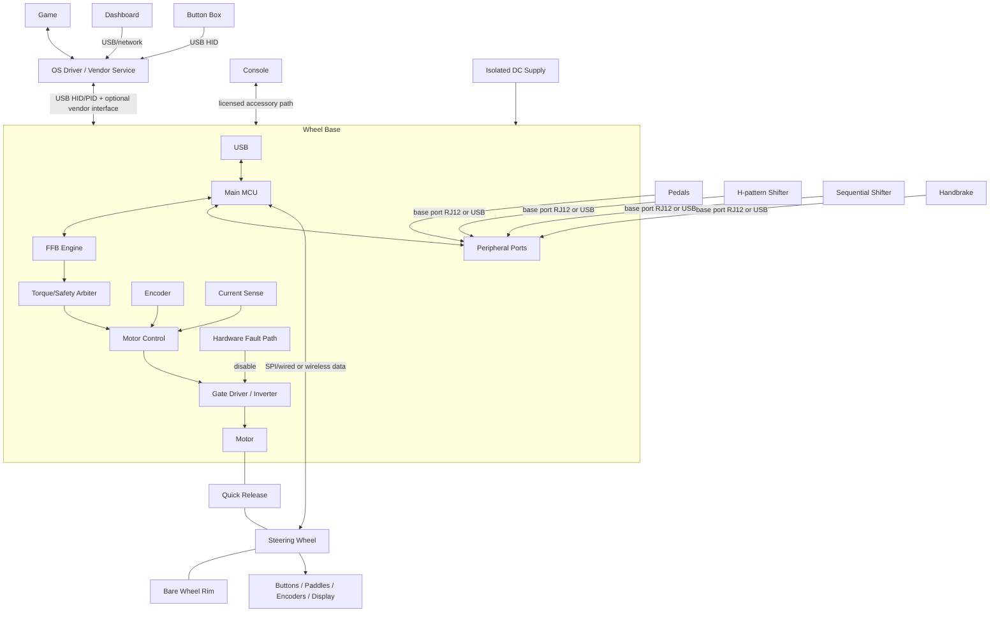

#### 1.2. Hệ sinh thái Fanatec như một ví dụ Công khai

Hệ sinh thái công khai của Fanatec có tính module cao, được thiết kế để người dùng có thể kết hợp các thành phần (đế vô lăng, vô lăng, bàn đạp) và nâng cấp từng phần. Sản phẩm chủ yếu theo ba phân khúc:
- **CSL (ClubSport Light)**: Phân khúc nhập môn, thân thiện với ngân sách, thường sử dụng nhựa và kim loại cơ bản.
- **ClubSport**: Phân khúc tầm trung dành cho những người đam mê, sử dụng vật liệu cao cấp như nhôm, sợi carbon với thiết bị điện tử tiên tiến hơn.
- **Podium**: Phân khúc cao cấp nhất, chuẩn chuyên nghiệp, thiết kế để đạt mô-men xoắn, độ bền và khả năng tùy chỉnh tối đa, sử dụng vật liệu chuẩn công nghiệp.

Nhãn phân khúc giúp điều hướng nhưng không chứng minh rằng hai sản phẩm tương thích về mặt điện, cơ học, hay nền tảng.

Đế vô lăng là hub trung tâm của hệ thống cho cấu hình console. Các bàn đạp, cần số, và phanh tay tương thích được kết nối với đế, qua đó xuất ra một đường dẫn USB duy nhất được cấp phép tới console. Trên PC, các thiết bị ngoại vi được hỗ trợ có thể hoạt động độc lập qua USB. Gói "Ready2Race" chỉ là một gói bán hàng, không phải tiêu chuẩn giao diện mới.


| Nền tảng | Vị trí Giấy phép Fanatec | Quy tắc Thực tế |
|---|---|---|
| Windows PC | Không yêu cầu chip bảo mật console | Xác minh phiên bản Windows, hỗ trợ của game, driver/App, và đường dẫn kết nối của từng thiết bị. |
| Xbox | Vô lăng hoặc hub được cấp phép Xbox | Vô lăng/hub được cấp phép kích hoạt đế tương thích và các thiết bị kết nối vào đế trên Xbox. |
| PlayStation | Đế vô lăng được cấp phép PlayStation | Vô lăng và các thiết bị ngoại vi kết nối vào đế tương thích thừa hưởng hỗ trợ PlayStation thông qua đế đó. |

*Lưu ý: Kết hợp đế vô lăng PlayStation với vô lăng Xbox thường tạo ra hệ thống tương thích chéo, hoạt động được trên PlayStation, Xbox, và PC.*

Tính đến 2026-02-16, Fanatec tuyên bố các vô lăng và đế mua từ cửa hàng của họ mặc định sử dụng QR2, và QR1 đã bị ngừng sản xuất. Phần cứng QR1 cũ vẫn khả dụng, nhưng thế hệ giữa Base-Side và Wheel-Side phải khớp nhau, và hỗ trợ nâng cấp phụ thuộc vào từng mẫu.

#### 1.3. Các loại Truyền động (Drive Types)

Các đế vô lăng sim racing thường được phân loại theo cơ chế cung cấp mô-men xoắn cơ học:

- **Dẫn động bánh răng (Gear-driven):** Cơ chế chi phí thấp nhưng gây ra độ trễ (backlash) cơ học.
- **Dẫn động bằng dây curoa (Belt-driven):** Mang lại sự mượt mà hơn nhưng gây ra độ co giãn cơ học.
- **Truyền động trực tiếp (Direct-drive):** Trục động cơ kết nối trực tiếp với vành vô lăng. Cung cấp sai số truyền động thấp nhất và đòi hỏi các cân nhắc cao nhất về mô-men xoắn và an toàn.

#### 1.4. Ranh giới Firmware

Firmware **phải** thiết lập ranh giới sở hữu độc lập cho các kết nối, vùng năng lượng, mô tả USB, chế độ nền tảng, và giới hạn mô-men xoắn. Firmware **phải** xác minh danh tính, định tuyến, thời gian, hiệu chuẩn và tính tương thích cập nhật trước khi cho phép hoạt động.

#### 1.5. Kích thước và Phong cách Lái

Thiết bị ngoại vi thường được thiết kế cho các phong cách lái cụ thể:
- **Formula:** Vô lăng hình chữ nhật/bướm tối ưu cho góc quay hẹp.
- **GT:** Vô lăng hình chữ D hoặc tròn với nhiều nút bấm.
- **Rally & Drift:** Vô lăng tròn hoàn hảo ưu tiên quay vòng nhanh và góc trượt.

### 2. Nguyên tắc Cơ bản về Vật lý và Cơ học

Phần này đề cập đến các nguyên tắc vật lý cơ bản của phần cứng sim racing, tập trung vào mô-men xoắn, động lực học chuyển động, và cảm biến. Nó là cầu nối giữa thiết kế cơ học và điều khiển hệ thống nhúng.

- **Mô-men xoắn (N·m)** là tích của lực tiếp tuyến và bán kính. Vành vô lăng lớn hơn làm giảm lực tay yêu cầu với cùng mô-men xoắn trục.
- **Quán tính (Inertia)** cản trở gia tốc góc.
- **Độ hãm (Damping)** cản trở vận tốc.
- **Ma sát (Friction)** cản trở chuyển động.
- **Cogging** là hiện tượng gợn mô-men xoắn từ tính phụ thuộc vào vị trí, vốn có trong thiết kế động cơ.

### 3. Phân rã Sản phẩm

Phần này chia nhỏ toàn bộ hệ thống thành các hệ thống con chức năng. Nó xác định khả năng phần cứng và trách nhiệm firmware của mỗi module.

#### 3.1. Ma trận Hệ thống con

| Hệ thống con | Phần cứng / Dòng MCU | Trách nhiệm Firmware | Giao tiếp | Nguồn / Cập nhật |
|---|---|---|---|---|
| Đế vô lăng | Main MCU; optional motor MCU/ASIC; encoder; inverter; NVM | USB, FFB, tổng hợp đầu vào, an toàn, hiệu chuẩn | USB; SPI/UART/CAN nội bộ | DC ngoài; USB bootloader/phục hồi |
| Vô lăng | Low-power MCU, GPIO expanders, cảm biến Hall, LED/LCD | Quét, chống dội, giải mã encoder, màn hình, danh tính, mở khóa FFB | Liên kết dây QR (SPI thường bị giả lập), không dây, hoặc USB | QR/cảm ứng/USB/pin; pass-through/USB/OTA |
| Bàn đạp | Cảm biến (Potentiometer, Hall), load-cell AFE, ADC, MCU tùy chọn | Lấy mẫu, lọc, hiệu chuẩn, HID | Cổng analog/digital (RJ12) hoặc USB | Đế/USB; không cập nhật hoặc qua USB |
| Cần số H | Mảng công tắc/Hall 2 trục, MCU tùy chọn | Ngưỡng vào số, độ trễ, loại bỏ trạng thái lỗi | Analog, GPIO, digital bus, USB | Đế/USB |
| Cần số tuần tự | Hai công tắc hoặc Hall | Chống dội, nhận dạng cạnh/xung | GPIO, analog, bus, USB | Đế/USB |
| Phanh tay | Potentiometer/Hall/load cell, MCU tùy chọn | Lọc, hiệu chuẩn phạm vi, phát hiện mở/chập mạch | Analog, digital bus, USB | Đế/USB |
| Dashboard | MCU/MPU, LCD/OLED, LED drivers | Giải mã telemetry, hiển thị, watchdog | USB, UART/CAN, Ethernet/Wi-Fi | USB/phụ trợ; USB/OTA |
| Button box | Low-power USB MCU, ma trận/expanders | Quét, chống dội, descriptors | USB HID | USB; bootloader |
| Power board | Bảo vệ, DC bus, buck/LDO, cảm biến, inverter | Tuần tự hóa, giám sát, chính sách tái tạo năng lượng | ADC/GPIO đến vi điều khiển | DC cách ly ngoài |
| Motor controller | Real-time MCU/DSP/ASIC, ADC/timers | Thu thập encoder/dòng và PWM bị giới hạn | SPI/CAN/PWM từ Main MCU | Logic và DC bus; cập nhật gói cùng đế |
| Giao diện USB | PHY tích hợp/ngoài, ESD | Liệt kê thiết bị, báo cáo, vòng đời điểm cuối | USB control/interrupt; giao diện phụ trợ | Đế tự cấp nguồn cảm biến VBUS |

**Hình 3-1: Đường dẫn Dữ liệu Cốt lõi của Đế Vô lăng**

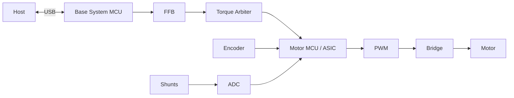

**Hình 3-2: Đường dẫn Dữ liệu Bàn đạp và Cảm biến Analog**

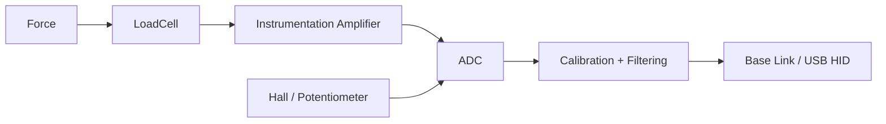

**Hình 3-3: Đường dẫn Dữ liệu Vô lăng**

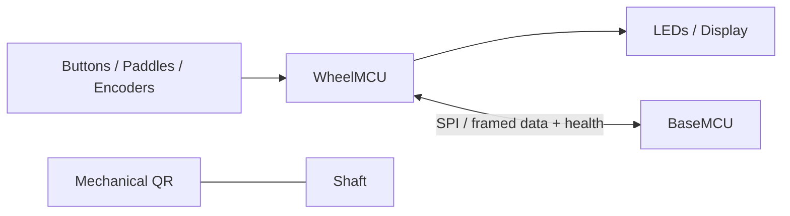

#### 3.2. Danh tính và Sức khỏe Thành phần

Firmware **phải** xử lý mỗi thành phần thông minh như một node có phiên bản. Mỗi node **phải** báo cáo danh tính, khả năng, trạng thái khởi động, trạng thái ứng dụng, sức khỏe, và trạng thái phục hồi. Firmware **phải** xử lý lỗi cho cảm biến thụ động (ví dụ lỗi cáp đứt, chập mạch, ngoài giới hạn, và kiểm tra tính hợp lý của tín hiệu).

### 4. Tổng quan Phản hồi Lực (Force Feedback)

Phần này mô tả lý thuyết của phản hồi lực (FFB). Nó theo dõi quá trình chuyển đổi các sự kiện vật lý ảo thành mô-men xoắn vật lý trên trục.

Phản hồi lực chuyển đổi các hiệu ứng vật lý từ mô phỏng thành mô-men xoắn vật lý giới hạn, đồng thời trả lại vị trí vô lăng và thao tác cho mô phỏng.

#### 4.1. Các Giai đoạn Phản hồi

| Giai đoạn | Trách nhiệm |
|---|---|
| Game | Tính toán lực ảo và sự kiện vật lý |
| API / Driver | Thể hiện hiệu ứng qua hợp đồng hệ điều hành |
| USB Transport | Giao nhận và xác minh báo cáo |
| Trình quản lý PID | Phân bổ hiệu ứng; duy trì thời lượng, cấu hình đường cong, điều kiện, và trạng thái |
| FFB Mixer | Trộn các hiệu ứng đang hoạt động và áp dụng bộ lọc |
| Torque Arbiter | Thực thi độ lợi, giới hạn mô-men xoắn, slew rate, giảm tải nhiệt, trạng thái bật, và tính thời gian |
| Điều khiển Motor | Theo dõi dòng/mô-men yêu cầu từ FFB |
| Power Stage | Sinh ra mô-men xoắn vật lý bằng motor |
| An toàn | Phát hiện lỗi phần cứng và chủ động vô hiệu hóa mô-men xoắn |

**Hình 4-1: Đường ống Phản hồi Lực (Force Feedback Pipeline)**

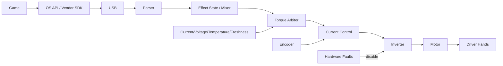

**Hình 4-2: Đường dẫn Dữ liệu Logic Phản hồi Lực (FFB)**


#### 4.2. Ràng buộc Firmware FFB

Firmware **phải** xác thực và lập lịch toàn bộ các hiệu ứng gửi tới. FFB mixer **phải** kết hợp các hiệu ứng mà không bị tràn số (arithmetic overflow). Hệ thống **phải** áp dụng toàn bộ giới hạn an toàn và công suất sau giai đoạn trộn. Nếu liên kết với máy chủ (host) bị trễ, hệ thống **phải** kích hoạt phân rã (decay) mô-men xoắn và tự vô hiệu hóa. Firmware **không được** cho phép bất kỳ lệnh phần mềm nào vượt qua giới hạn vật lý/nhiệt. Clipping xảy ra khi mô-men xoắn yêu cầu vượt quá giới hạn, khiến lực quá lớn bị cào bằng ở mức tối đa và mất chi tiết.

### 5. Kiến trúc Phần cứng

Phần này trình bày cấu trúc phần cứng của một đế vô lăng truyền động trực tiếp. Nó định nghĩa vòng lặp điều khiển vật lý và các lớp an toàn điện tử cần thiết.

#### 5.1. Kiến trúc Đế truyền động Trực tiếp (Direct-Drive Base)

Cốt lõi của đế vô lăng được chia thành phân vùng quản lý hệ thống và phân vùng điều khiển động cơ thời gian thực. Đế DD thường sử dụng động cơ BLDC/PMSM ba pha với phản hồi encoder, cảm biến dòng pha, Điều chế độ rộng xung (PWM), gate driver, và inverter.

Động cơ là PMSM ba pha (stator thép có cuộn dây quay quanh một rotor nam châm vĩnh cửu gắn ở trục lái) — và inverter (bộ biến tần) là khối công suất với sáu MOSFET để tổng hợp các dòng điện ba pha từ bus DC:


Ba bán cầu của inverter sẽ quyết định điện áp của mỗi pha qua PWM; hai công tắc trên cùng một pha không bao giờ được bật cùng lúc (dead-time để tránh chập bus DC), và các shunt phía thấp đo lường dòng pha phục vụ vòng lặp FOC.

**Hình 5-1: Sơ đồ Khối Kiến trúc Phần cứng**

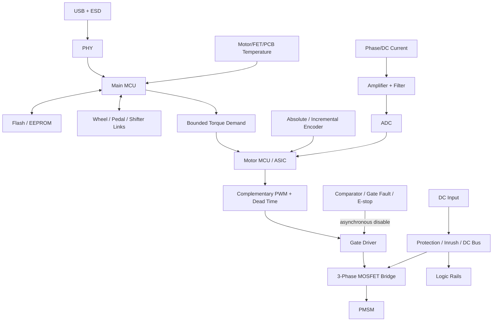

| Khối | Trách nhiệm | Yêu cầu Firmware |
|---|---|---|
| Main MCU | Giao thức Host/ngoại vi và chính sách hệ thống | **Phải** thực thi lập lịch và khả năng tương thích phiên bản |
| Motor MCU/ASIC | Đường dẫn dòng điện/mô-men xoắn thời gian thực | **Phải** đáp ứng thời hạn chính xác và xử lý lỗi |
| PMSM/BLDC | Bộ truyền động mô-men xoắn | **Phải** vận hành trong giới hạn thông số động cơ và nhiệt |
| Encoder | Phản hồi góc/tốc độ | **Phải** xác thực CRC, trạng thái, wrap, hướng, bù, và timeout |
| Cảm biến dòng | Phản hồi dòng pha/DC | **Phải** hiệu chuẩn độ lệch, độ lợi, bão hòa, và căn chỉnh với cửa sổ lấy mẫu PWM |
| Advanced timer | PWM và kích hoạt ADC | **Phải** tạo tín hiệu bù trừ với dead time và có ngắt bảo vệ |
| Gate driver/inverter| Chuyển mạch DC thành 3 pha | **Phải** mặc định Tắt; **phải** phản hồi lập tức trước lỗi phần cứng |
| NVM | Firmware, hiệu chuẩn, profile, nhật ký lỗi | **Phải** đảm bảo ghi nguyên tử (atomic) và wear levelling |

#### 5.2. Thiết kế Miền Điều khiển

Hệ thống có thể sử dụng một MCU duy nhất hoặc kiến trúc tách biệt (Main MCU + Motor MCU/ASIC). 

Điều khiển hướng trường (FOC) biến đổi đo lường góc rotor và dòng điện để điều chỉnh dòng sinh mô-men xoắn. Firmware **phải** đảm bảo độ chính xác cao và đồng bộ hóa giữa PWM và ADC. Các lỗi phần cứng như quá dòng và tín hiệu ngắt (break) **phải** ghi đè các lệnh phần mềm. Firmware **phải** kích hoạt ADC một cách đồng bộ trong khoảng giữa hợp lệ của PWM và **phải** hiệu chỉnh các giá trị lệch (offset) của cảm biến dòng điện trong quá trình khởi tạo.


"Khoảng giữa PWM hợp lệ" là chi tiết thời gian quan trọng: sóng mang tam giác (carrier) so sánh với chu kỳ (duty) của mỗi pha để tạo ra tín hiệu điều khiển cổng, và ADC lấy mẫu ở đỉnh sóng mang — điểm tĩnh giữa chu kỳ chuyển mạch — để tránh nhiễu từ các quá trình chuyển mạch. Thu phóng "dead-time" hiển thị khoảng trống khi cả hai khóa đều tắt để ngăn chặn hiện tượng bắn chéo (shoot-through).

### 6. Tương tác Phần cứng

Phần này phác thảo cách firmware tương tác với các ngoại vi phần cứng cụ thể. Nó định nghĩa ánh xạ giữa giao diện điện tử và vi điều khiển.

#### 6.1. Giao diện Ngoại vi

Firmware **phải** cấu hình và quản lý các giao diện MCU để giao tiếp an toàn với phần cứng ngoài.

| Kết nối | Vi điều khiển | Yêu cầu Firmware |
|---|---|---|
| Encoder | SPI/SSI/BiSS-C/ABZ, timer, DMA | **Phải** kiểm tra deadline, CRC, wrap, hướng, timeout |
| Mạch khuếch đại dòng | ADC, PWM trigger, DMA | **Phải** kiểm tra cửa sổ lấy mẫu, độ lệch, độ lợi, bão hòa |
| MCU PWM đến gate | Advanced timer, break GPIO | **Phải** cấu hình dead time, khởi động an toàn, độ trễ ngắt |
| Gate fault đến MCU | Break input, GPIO | **Phải** ưu tiên tắt phần cứng trước, sau đó lưu trạng thái lỗi |
| Rim đến Base | CAN/SPI/UART/radio | **Phải** xử lý cắm nóng (hot-plug), ESD, cấp nguồn, timeout |
| Pedals đến ADC/bus | ADC/SPI/I2C | **Phải** kiểm tra hở mạch/ngắn mạch, giới hạn tham chiếu, hiệu chuẩn |
| Buttons đến GPIO | GPIO, timer | **Phải** chống dội (debounce) và chặn tín hiệu ảo |
| Display đến SPI | SPI, DMA | **Phải** phân bổ băng thông tránh đảo ngược độ ưu tiên |
| LEDs | Timer, serial bus | **Phải** giới hạn dòng và duy trì tốc độ làm mới |
| USB tới host | USB device | **Phải** quản lý VBUS, reset, suspend, và vòng đời endpoint |
| NVM tới MCU | QSPI/SPI/I2C | **Phải** có wear levelling, ghi nguyên tử, và xác thực schema |

**Hình 6-1: Định tuyến Ngoại vi Phần cứng**

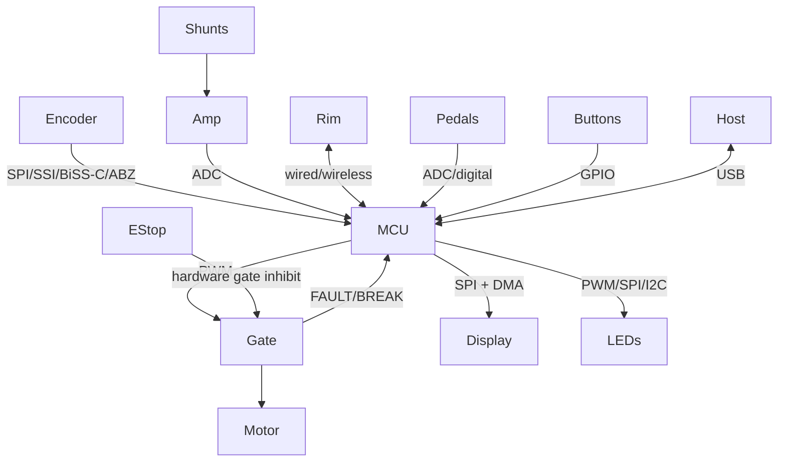

#### 6.2. Quản lý Chân và Trạng thái

Đầu ra bật (enable) gate **phải** mặc định ở trạng thái Tắt (inactive) khi reset, khi chạy bootloader, khi recovery, và khi chân chưa được cấu hình. Hệ thống **phải** bảo vệ đường điện ngoại vi để thiết bị cắm ngoài hỏng không kéo sập đường điều khiển chính.

### 7. Kiến trúc Giao tiếp

Phần này định nghĩa các kết nối trong và ngoài hệ thống. Nó quy định các giao thức truyền tải, khả năng, và tính toàn vẹn dữ liệu.

#### 7.1. Đặc tính Liên kết

| Giao diện | Vai trò Điển hình | Topology | Mô tả |
|---|---|---|---|
| USB 2.0 FS HID | Host tới device | Host/device | Tiêu chuẩn, tự mô tả; truyền trục, nút bấm, FFB |
| USB HS | Màn hình/dữ liệu NSX | Host/device | Băng thông cao; ngăn xếp phức tạp |
| SPI | MCU tới ASIC/encoder/màn hình | Master/slave | Tốc độ MHz; hỗ trợ DMA; dễ bị nhiễu EMI |
| UART | Debug/boot/phụ kiện đơn giản | Peer framing | Thông dụng; cần phần mềm định dạng frame |
| CAN / CAN-FD | Modules phân tán | Multi-master | Mạng vi sai ổn định; có overhead giao thức |
| I2C | EEPROM/cảm biến | Master/slave | 2 dây; dễ bị treo bus |
| RS-485 | Phụ kiện có dây | Tùy giao thức | Vi sai; cần định dạng frame |
| Ethernet | Dash/dịch vụ | Packet network | Chuẩn hóa; có độ trễ thay đổi |
| BLE | Rim/cấu hình không dây | Master/slave | Không dây; bị giới hạn bởi RF và độ trễ |
| Wi-Fi | Bảng điều khiển telemetry | IP network | Băng thông cao; tiêu thụ điện lớn và phức tạp bảo mật |

#### 7.2. Giao tiếp với Nền tảng Host

Chiến lược giao tiếp coi **Đế Vô lăng là một USB Hub trung tâm**, với hành vi tự thích ứng theo mô hình bảo mật của nền tảng host:

##### 7.2.1. PC (Windows/Linux)
Hệ thống **phải** mở các endpoint USB tiêu chuẩn để nhận dữ liệu đầu vào và đầu ra lực vật lý. Hệ thống **phải** dùng **USB HID** (Thiết bị Giao diện Người dùng) để báo cáo các thao tác (trục, nút bấm), và có thể dùng **USB PID** (Thiết bị Giao diện Vật lý) để nhận các tín hiệu FFB từ engine game. Các driver nguồn mở (như `hid-fanatecff` cho Linux) hoặc phần mềm từ nhà sản xuất có thể dễ dàng tương tác qua giao thức mở này.

**Hình 7-1: Topology của USB Descriptor (PC)**

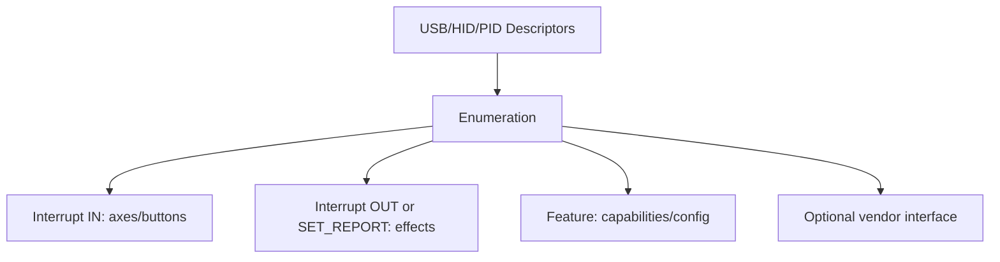

##### 7.2.2. Consoles (PlayStation & Xbox)
Console sử dụng các luồng phụ kiện được cấp phép. Tài liệu của Fanatec giải thích vị trí cấp phép, nhưng không bộc lộ thuật toán xác thực mật mã hay hướng dẫn mô phỏng cấp phép.
- **Xbox:** Cấp phép qua vô lăng Xbox gắn với một đế vô lăng Fanatec tương thích.
- **PlayStation:** Cấp phép ở chính đế vô lăng Fanatec được cấp phép PlayStation.
- **Tổng hợp ngoại vi:** Bàn đạp, cần số, phanh tay Fanatec phải cắm qua đế vô lăng để được dùng trên console. Thiết bị USB độc lập sẽ không dùng được trên console.

Cấu trúc firmware **phải** thiết lập việc cấp phép nền tảng như một rào cản được phê duyệt. Firmware **không được** mô phỏng, phát minh, hay vượt qua (bypass) xác thực console.

#### 7.3. Cấu trúc liên kết Nội bộ

**Hình 7-2: Cấu trúc liên kết Bus Nội bộ**

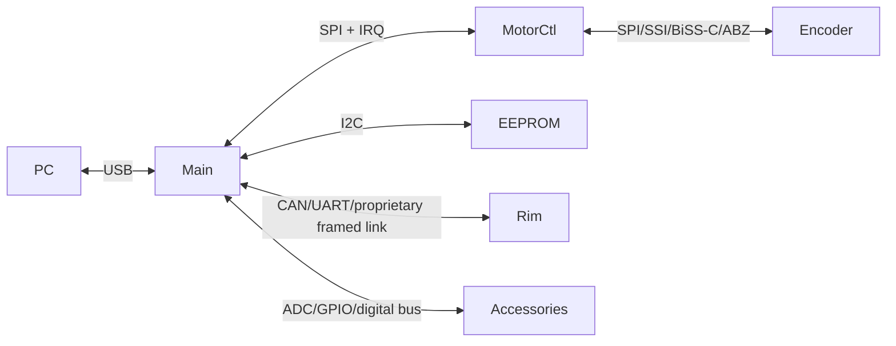

#### 7.4. Đóng khung (Framing) và Tính Toàn vẹn

Mỗi kết nối **phải** định dạng rõ phiên bản, loại, độ dài, chuỗi tuần tự, kiểm tra lỗi (như CRC), và giới hạn thời gian timeout. Firmware **phải** hỗ trợ hàng đợi bị chặn, đàm phán, và khôi phục kết nối. Chuyển DMA **phải** giới hạn quyền kiểm soát bộ đệm, thời gian kết thúc, nhất quán bộ nhớ đệm (cache), và xử lý lỗi.

### 8. Kiến trúc Firmware

Phần này cung cấp thiết kế cấu trúc của phần mềm firmware. Nó đề cập đến các ranh giới module, máy trạng thái, và vòng đời.

#### 8.1. Các Module Phần mềm

Firmware **phải** phân chia trách nhiệm để đảm bảo các lớp truyền dữ liệu và UI không cản trở quá trình điều khiển thời gian thực.

**Hình 8-1: Kiến trúc Thành phần Firmware**

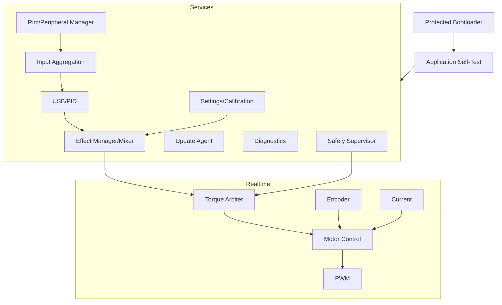

#### 8.2. Các Ràng buộc Module

| Module | Yêu cầu |
|---|---|
| Bootloader | **Phải** kiểm tra, lựa chọn, phục hồi firmware; **không bao giờ** kích hoạt motor |
| USB/PID | **Phải** truyền tải thông số và tín hiệu FFB; **không bao giờ** được thay đổi PWM |
| FFB | **Phải** thực hiện trộn tín hiệu mà không làm tràn số học |
| Torque arbiter | **Phải** là kênh mềm duy nhất dẫn đến motor; **phải** kiểm soát giới hạn, sức mạnh |
| Điều khiển Motor | **Không được** giải mã tín hiệu host |
| Encoder/Dòng điện| **Phải** đính kèm thời gian và trạng thái mỗi khi lấy mẫu |
| Ngoại vi | **Phải** xử lý cắm nóng và thiết bị không còn kết nối |
| Settings | **Không được** chặn vòng lặp thời gian thực bằng việc ghi flash bộ nhớ |
| Chẩn đoán | **Phải** giới hạn số lần đếm; **không được** chặn hệ thống điều khiển |
| Update | **Phải** tắt mô-men xoắn toàn bộ trong quá trình nâng cấp |
| Safety | **Phải** ngắt tín hiệu khi có lỗi; hoạt động song song với bảo vệ mạch điện cứng |

#### 8.3. Máy trạng thái Hệ thống

Firmware **phải** triển khai máy trạng thái xác định để quản lý việc kích hoạt mô-men xoắn. Các hệ thống bảo vệ phần cứng sẽ hoạt động ưu tiên nhất mọi lúc.

**Hình 8-2: Máy Trạng thái Kích hoạt Mô-men xoắn**

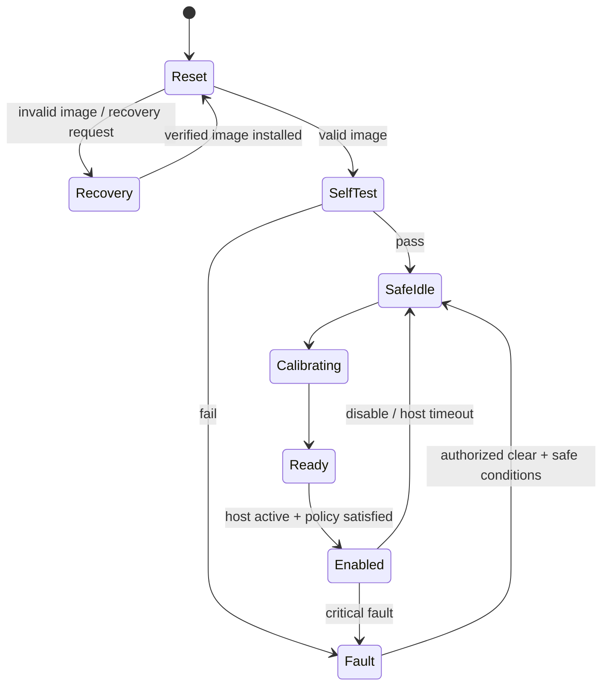

### 9. Luồng Dữ liệu

Phần này chi tiết đường đi của dữ liệu xuyên suốt hệ thống. Nó giải quyết đầu vào từ cảm biến, cập nhật hiệu ứng, và phản hồi phần cứng.

#### 9.1. Quá trình Đầu-Cuối

Sự tương tác của host và vòng điều khiển thời gian thực **phải** hoạt động đồng thời mà không bị đứt quãng dữ liệu.

**Hình 9-1: Sơ đồ Luồng Dữ liệu Đầu-Cuối**

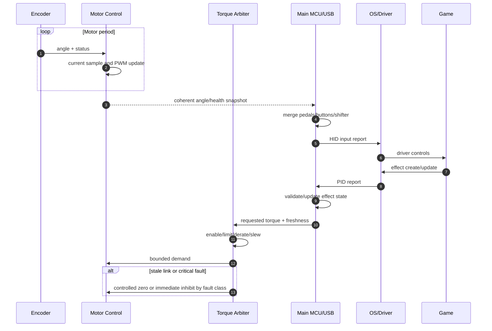

#### 9.2. Luồng Đầu vào (Input Pipeline)

Các đầu vào từ cảm biến **phải** qua quá trình xác nhận và hiệu chỉnh trước khi gửi đến host.

**Hình 9-2: Luồng Xử lý Đầu vào**

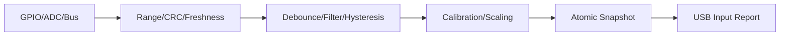

#### 9.3. Xử lý Dữ liệu Quá hạn (Stale Data)

Firmware **phải** định nghĩa và tuân thủ chặt chẽ chính sách quá hạn. Dữ liệu khi gửi đi **phải** kèm theo giá trị, timestamp, tính hợp lệ, nguồn gốc, và chính sách quá hạn.

**Bảng 9-1: Các Tham số Dữ liệu Tiêu chuẩn**

| Yếu tố | Loại | Mô tả |
|---------|------|-------------|
| `value` | Payload | Giá trị số liệu hoặc trạng thái |
| `timestamp` | uint32 | Thời gian lấy mẫu |
| `validity` | Boolean | Xác định mức độ tin cậy của dữ liệu |
| `owner` | Enum | Nguồn khởi phát dữ liệu |
| `stale_policy` | Enum | Hành động khi dữ liệu quá hạn |

**Bảng 9-2: Chính sách Dữ liệu Quá hạn Tùy theo Nguồn**

| Nguồn Dữ liệu | Chính sách Quá hạn |
|---|---|
| Torque / Hiệu ứng | **Phải** phân rã về 0 một cách an toàn; không được duy trì vô thời hạn |
| Encoder / Dòng điện | **Phải** kích hoạt ngắt mạch lập tức nếu dữ liệu quá hạn vượt ngưỡng |
| Buttons | Xóa hoặc duy trì tùy theo giao thức cụ thể |
| Bàn đạp | Gắn cờ lỗi hoặc đưa về trạng thái mặc định an toàn |
| Nhiệt độ | Kích hoạt cảnh báo hoặc ngắt kết nối cảm biến hỏng |
| Giao tiếp Rim | Xóa các lệnh trên vô lăng và ngừng gửi tín hiệu tới màn hình |

Firmware **phải** sử dụng cơ chế bảo vệ lấy mẫu tuần tự, không để đứt đoạn giữa các lệnh ngắt (ISRs) và các tasks.

### 10. Các Nhiệm vụ Thời gian Thực

Phần này quy định bối cảnh thời gian cho các nhiệm vụ trong hệ thống, nhấn mạnh các mục tiêu cho vòng điều khiển quan trọng.

#### 10.1. Mức Ưu tiên Nhiệm vụ

Firmware **phải** áp dụng sự ưu tiên cao nhất cho hệ thống vòng điều khiển phần cứng và bảo vệ thiết bị. Các nhiệm vụ background sẽ xếp sau.

**Hình 10-1: Mức Ưu tiên Preemption (Chen ngang)**

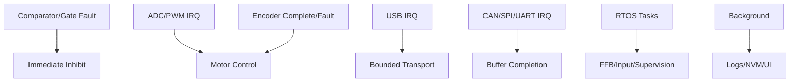

#### 10.2. Tần suất Thời gian Lặp

Tần suất dưới đây là các tiêu chuẩn lý thuyết; thực tế do phần cứng đáp ứng.

| Hoạt động | Dải tần số | Bối cảnh | Hậu quả khi Bỏ lỡ |
|---|---|---|---|
| Current / Vòng FOC | 10–40 kHz | Ngắt Timer/ADC | Bóp méo mô-men xoắn, quá dòng |
| Đọc Encoder | Bằng tốc độ FOC | Ngắt SPI DMA | Dữ liệu góc bị sai lệch |
| FFB / Mô-men xoắn | 0.5–2 kHz | RTOS mức cao | Trễ pha, giật gián đoạn tín hiệu lực |
| USB Transport | USB Cadence | Ngắt + Task | Rớt tín hiệu USB, mất điều khiển |
| Rim Link | 100–1000 Hz | DMA + Task | Rớt nút bấm, màn hình giật lag |
| Pedals / Buttons | 100–1000 Hz | ADC DMA / Timer | Giật lag khi nhả chân ga/phanh |
| Cảnh báo an toàn | Max rate | Hardware/ISR | Cảnh báo trễ, rủi ro hỏng hóc |
| Chẩn đoán / NVM | Không ưu tiên | Background | Tuyệt đối không cản trở FOC |

#### 10.3. Các Quy tắc Thời gian Thực

Firmware **phải** đánh giá Worst-Case Execution Time (WCET) dưới điều kiện hoạt động nặng nề nhất. Các ISR phải đảm bảo phản ứng nhanh. Các hệ thống phân vùng **không được** cấp phát động (malloc), ghi flash, hay dùng blocking I/O tại tiến trình điều khiển motor. Hệ thống **phải** có cảnh báo nếu bị lấn thời gian. Watchdogs phần cứng **chỉ được** reset thông qua tiến trình an toàn đã kiểm chứng.

### 11. An toàn và Bảo mật

Phần này nêu rõ các cơ chế tự bảo vệ và phòng thủ phần cứng/phần mềm. Nó xác định phản hồi với các rủi ro, can thiệp bên ngoài, và quy tắc cài đặt an toàn.

#### 11.1. Yêu cầu Thiết lập và An toàn

- Thiết bị **phải** được gắn cứng trước khi sử dụng.
- Người dùng **phải** kiểm tra kết nối QR, các cáp nối, nguồn điện, nút dừng khẩn cấp trước khi chơi.
- Bắt buộc dùng ứng dụng cấu hình và file bản cập nhật chuẩn.
- Bắt buộc hiệu chỉnh chuẩn trung tâm vô lăng, hành trình tay lái và chân ga/phanh.
- Lần đầu thử máy **phải** dùng mô-men xoắn thấp.
- Người dùng **phải** kiểm tra độ phản hồi tự động trước khi sử dụng thực tế.
- Khớp cài đặt số vòng quay tay lái với cấu hình trong game.
- Nếu có hiện tượng bị chèn ép lực, quá tải nhiệt, tăng dao động rung lắc, **phải** điều chỉnh giảm lực.
- Để xa thiết bị đang hoạt động khỏi quần áo, trẻ nhỏ và các vật cản.
- **Tuyệt đối không** hack, thay thế các chip bảo mật hay bypass thiết bị.
- Mọi sửa đổi vào motor **phải** bảo đảm độc lập vô hiệu hóa (disable) mạch cầu điện.

#### 11.2. Kiểm soát Rủi ro

Hệ thống **phải** tự bảo vệ bản thân và người sử dụng khỏi những lỗi nghiêm trọng.

**Bảng: Các Phản ứng khi Gặp Lỗi**

| Tình trạng | Lỗi kích hoạt | Hành động can thiệp |
|---|---|---|
| `Dữ liệu host quá hạn` OR `Vượt ngưỡng lực` | Lực tăng bất thường | Giảm lực an toàn hoặc ngắt toàn bộ điện motor lập tức |
| `Góc quay sai cực trị với tín hiệu` | Khác chiều động cơ | Ngắt lệnh bật và lưu log cảnh báo |
| `Pha dòng điện > OVERCURRENT_TRIP` | Quá dòng | Hardware PWM vô hiệu hóa thông qua mạch comparator ngắt |
| `Nhiệt độ mạch > THERMAL_LIMIT` | Quá nhiệt | Giảm dòng liên tục; ngắt toàn bộ PWM nếu vẫn nóng |
| `Điện áp DC Bus > OVERVOLTAGE_TRIP` | Vượt dòng nạp xả ngược | Tiêu hao dòng ngược; ngắt điện lực FFB |
| `Encoder sai CRC` OR `Mất kết nối` | Rớt vị trí góc | Ngắt lập tức mạch bảo vệ, hoặc giảm tốc nhẹ |
| `Chứng thực chữ ký sai` | Firmware can thiệp | Kẹt vĩnh viễn ở bootloader, chờ cập nhật đúng |
| `Watchdog timeout` | Treo phần mềm | Reset nóng; các cổng đầu ra trả về 0 |

#### 11.3. Cơ chế Bảo mật

Firmware **phải** chứng thực các file cập nhật. Nó **phải** nhận dạng các gói tin chuẩn độ dài và mã tin. Firmware yêu cầu phải tắt mô-men xoắn trước khi gửi các lệnh gỡ lỗi. Đối với máy bản lẻ, hệ thống **phải** khóa kín đường vào gỡ lỗi (JTAG, SWD).

**Nền tảng được cấp phép:** Việc mô phỏng chip bảo mật console từ các bên thứ ba là hành vi ngoài quy chuẩn (như trong các emulator). Hãy coi việc chứng thực này là độc quyền của nhà sản xuất, trừ khi có thông cáo công khai.

### 12. Chế độ xem Kỹ thuật Firmware

Phần này mô tả các chiến lược kiểm tra, và quy trình thử nghiệm để phát triển phần mềm nhúng.

#### 12.1. Yêu cầu Kỹ thuật Hệ thống con

Mọi hệ thống **phải** kiểm chứng bằng Unit tests, chạy giả lập, trước khi lắp đặt thực.

| Hệ thống con | Trạng thái API | Kiểm thử |
|---|---|---|
| Boot/update | `reset` → `verify` → `boot/recovery` | Sai phiên bản, file rác, rút điện khi cài |
| USB/PID | `detached` → `configured` → `suspended` | Gửi dữ liệu nhiễu, test băng thông trễ |
| FFB | `idle` → `allocated` → `playing` → `stopped` | Vòng lặp liên tiếp, tính tràn số |
| Torque arbiter | `disabled` → `ready` → `enabled` → `fault` | Chèn lực ảo, quá nhiệt, rớt host |
| Motor control | `init` → `offset cal` → `ready` → `run` → `fault` | Hardware in Loop (HIL), tính chính xác bão hòa |
| Settings | `valid` → `dirty` → `commit/error` | Ghi đè rác, test tuổi thọ ghi, phiên bản config |
| Safety | `safe` → `ready` → `enabled` → `fault` | Bắn ngắt cứng xem ưu tiên tắt bảo vệ kịp không |

#### 12.2. Trình tự Xác minh

Phải kiểm tra từ không tải đến toàn tải. Bắt buộc test lực điện áp cực nhỏ trước khi test FFB lớn.

**Hình 12-1: Quá trình Thử nghiệm**

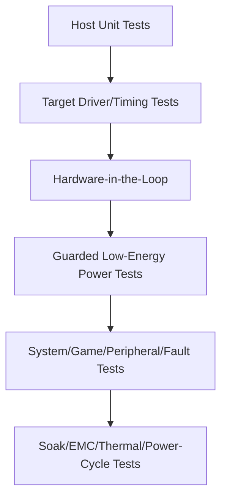

### 13. Danh sách Câu hỏi (Đã giải quyết và Còn mở)

Đánh giá ngày 2026-07-05. Các mục có thể được trả lời từ cơ sở kiến thức, tiêu chuẩn công khai, hoặc bằng chứng từ cộng đồng được đánh dấu là **Đã giải quyết (Resolved)**. Các mục phụ thuộc vào yêu cầu của một sản phẩm cụ thể, thông số kỹ thuật độc quyền của nhà cung cấp, hoặc đo lường trên mục tiêu thực tế không thể được trả lời chung chung và được đánh dấu là **Mở — nhà phát triển tự điều tra**, với phương pháp cụ thể.

#### 13.1 Đã giải quyết

- **Có nên mở rộng các nền tảng chuyển động (motion), đầu dò xúc giác (tactile), buồng lái (cockpits), và phần mềm telemetry thành các tài liệu riêng biệt không?**
  **Đã giải quyết (xong).** Tất cả bốn chủ đề hiện đã có tài liệu: [`motion.md`](./motion.md), [`tactile.md`](./tactile.md), [`cockpits.md`](./cockpits.md), và [`telemetry.md`](./telemetry.md), và nằm trong danh sách đọc ở [`README.md`](./README.md).
- **USB descriptors, tần suất báo cáo (report cadence), sức chứa hiệu ứng, và giao diện nhà cung cấp (vendor interface)?**
  **Đã giải quyết một phần (mô hình công khai đã xác minh; giá trị đặc thù của sản phẩm là Chưa rõ).** Phương thức truyền tải và mô hình hiệu ứng là công khai: USB HID cho đầu vào và USB PID Class 1.0 cho hiệu ứng lực, thường là USB 2.0 Full-Speed. Tần suất báo cáo tuân theo ngắt thời gian của endpoint; tốc độ vòng điều khiển nằm trong §10.2. Những gì thuộc về đặc thù sản phẩm là VID/PID chính xác, dung lượng bộ nhớ chứa hiệu ứng (effect-pool), và giao diện vendor — xem §13.2. Bằng chứng từ cộng đồng: driver `hid-fanatecff` liệt kê các thiết bị Fanatec qua **VID `0EB7`** (ví dụ: `0EB7:0020` cho CSL DD / DD Pro / ClubSport DD), đây là quan sát của cộng đồng chứ không phải thông số mô tả chính thức.
- **Đường dẫn cấm mô-men xoắn (torque-inhibit path) phần cứng và các mục tiêu an toàn/quy định?**
  **Đã giải quyết ở cấp độ kiến trúc (các mục tiêu là đặc thù sản phẩm).** Đường dẫn ức chế (inhibit path) bắt buộc được định nghĩa xuyên suốt §11 và trong [`wheel_base.md`](./wheel_base.md) §15: một chốt lỗi phần cứng độc lập được kích hoạt bởi ngắt quá dòng (comparator), lỗi gate-driver, E-stop, và watchdog, có khả năng vô hiệu hóa gate driver một cách bất đồng bộ bất kể phần mềm. Tham chiếu ngành là kiến trúc kiểu Safe-Torque-Off (STO) (như TI TIDA-01599). Phạm vi quy định *cụ thể* (ví dụ: dấu chuẩn EMC/an toàn nào áp dụng cho thị trường mục tiêu) là quyết định của nhà phát triển sản phẩm — xem §13.2.
- **Ngân sách độ trễ/jitter từ đầu đến cuối (end-to-end latency) và các phương pháp nghiệm thu?**
  **Đã giải quyết bằng phương pháp (mục tiêu con số là đặc thù sản phẩm).** Độ trễ có tính cộng dồn từng giai đoạn; hãy phân bổ ngân sách và đo lường độc lập cho từng giai đoạn (tick game → USB → đánh giá FFB → vòng FOC) thay vì chỉ đo từ đầu đến cuối, theo [`telemetry.md`](./telemetry.md) §6. Các tốc độ vòng lặp neo điển hình nằm trong §10.2 (FOC 10–40 kHz, FFB 0.5–2 kHz). Ngân sách cụ thể phải được đặt so với các mục tiêu độ trễ/cạnh tranh của sản phẩm và sau đó được xác nhận trên thiết bị thực.

#### 13.2 Mở — để các nhà phát triển tự điều tra

Những mục này yêu cầu một thông số kỹ thuật sản phẩm cụ thể, tiêu chuẩn từ nhà cung cấp đã được phê duyệt, hoặc đo lường trên băng ghế thử nghiệm. Chúng là các thông tin kỹ thuật cần thu thập, không phải là sự kiện có sẵn để tra cứu.

- **Yêu cầu về mô-men xoắn, tốc độ, quán tính, số vòng quay, âm thanh, và môi trường của sản phẩm.**
  *Cách điều tra:* Dẫn xuất từ phân khúc thị trường mục tiêu và tham khảo thông số đã công bố của đối thủ; chuyển đổi thành kích thước động cơ (mô-men xoắn liên tục/đỉnh, nhiệm vụ nhiệt) và xác nhận bằng máy đo (dyno/bench).
- **Các nền tảng PC/console được hỗ trợ và kiến trúc cấp phép được phê duyệt.**
  *Cách điều tra:* Cấp phép nền tảng mang tính hợp đồng — lấy các điều khoản chương trình cấp phép console trực tiếp từ nhà cung cấp; không được suy luận hoặc mô phỏng xác thực console (§11.3). Hỗ trợ PC có thể được xác minh bằng hệ điều hành + yêu cầu của game.
- **Chính xác MCU/ASIC, encoder, gate driver, mô hình cảm biến (sensing topology), và công suất chịu tải.**
  *Cách điều tra:* Lựa chọn theo các yêu cầu mô-men/vòng lặp điều khiển ở trên bằng cách dùng thiết kế tham chiếu của nhà cung cấp (ví dụ: Infineon PMSM FOC, TI sensored FOC, và thiết kế dùng TMC4671 của OpenFFBoard làm ví dụ công khai); kiểm chứng trên bo mạch khởi tạo (bring-up board).
- **Topology điện/giao thức ngoại vi và quyền sở hữu.**
  *Cách điều tra:* Xác định theo từng cổng; đối với đường dẫn proxy qua base, các sơ đồ chân cộng đồng (như FendtXerion Fanatec-Pinout) và giao diện tùy chỉnh (như Universal-Shifter-Interface-for-Fanatec) tồn tại làm tài liệu tham khảo, nhưng sản phẩm phải tự xác định ma trận tương thích được xác thực của riêng mình.
- **Chính sách chữ ký cập nhật (signing policy), rollback, khởi tạo (provisioning), và phục hồi (recovery)?**
  *Cách điều tra:* Định nghĩa Root of Trust (gốc tin cậy), kiến trúc bootloader, và quy trình chèn key trong quá trình sản xuất.
- **Khả năng tương thích phiên bản/hiệu chuẩn giữa base, động cơ, vành (rim), bàn đạp, và các adapter?**
  *Cách điều tra:* Tạo chính sách ma trận phiên bản trong trình cập nhật (updater) và định nghĩa thành phần nào nắm giữ quyền ưu tiên đối với hiệu chuẩn trung tâm/khoảng dao động.
- **Lưu trữ chẩn đoán và quy tắc truy cập gỡ lỗi máy bán lẻ (retail debug-access)?**
  *Cách điều tra:* Phân bổ dung lượng NVM cho crash logs/đếm lỗi và kiểm chứng việc firmware phát hành cho khách hàng khóa chặt cổng JTAG/SWD.


## Force Feedback (FFB) trong Sim Racing — Giải Thích Chi Tiết

> Phiên bản: 1.0 · Cập nhật: 2026-07-05
> Phạm vi: cách một hệ thống vô lăng sim-racing chuyển đổi vật lý ảo thành các lực thực tế trên tay bạn — từ lý thuyết về lực, qua servo motor và thiết bị điện tử công suất, đến từng loại lực và độ rung mà bạn có thể cảm nhận, và cách nó được tinh chỉnh và giữ an toàn.
> Cơ sở: document này được xây dựng dựa trên cơ sở nghiên cứu đi kèm (`wheel_base.md`, `sim_racing_research.md`, `tactile.md`, `telemetry.md`, `glossary.md`) và các hình minh họa giảng dạy gốc của nó, cộng với video giải thích *Inside Sim Racing Tech*. Các con số cụ thể của sản phẩm (torque, latency, độ phân giải sensor) được trích dẫn như **công bố của nhà sản xuất/quảng cáo**, không phải là các phép đo được xác minh độc lập, nhất quán với mô hình bằng chứng của cơ sở nghiên cứu.

---

### Mục lục

1. [Thực Chất Force Feedback Là Gì](#1-thực-chất-force-feedback-là-gì)
2. [Lý Thuyết Về Lực: Torque và Bốn Cảm Giác Cơ Bản](#2-lý-thuyết-về-lực-torque-và-bốn-cảm-giác-cơ-bản)
3. [Servo Motor: Lực Được Tạo Ra Bằng Cấu Trúc Vật Lý Như Thế Nào](#3-servo-motor-lực-được-tạo-ra-bằng-cấu-trúc-vật-lý-như-thế-nào)
4. [Các Loại Truyền Động: Gear vs Belt vs Direct Drive](#4-các-loại-truyền-động-gear-vs-belt-vs-direct-drive)
5. [Công Nghệ Motor Độ Phân Giải Cao: Torque, Latency, Fidelity](#5-công-nghệ-motor-độ-phân-giải-cao-torque-latency-fidelity)
6. [Chuỗi Tín Hiệu FFB: Từ Game Physics Đến Tay Bạn](#6-chuỗi-tín-hiệu-ffb-từ-game-physics-đến-tay-bạn)
7. [Những Gì Tay Bạn Thực Sự Cảm Nhận Được](#7-những-gì-tay-bạn-thực-sự-cảm-nhận-được)
8. [Phân Loại Force-Effect (HID PID)](#8-phân-loại-force-effect-hid-pid)
9. [Vibrations Trên Tay vs. Trên Ghế](#9-vibrations-trên-tay-vs-trên-ghế)
10. [Fidelity, Độ Phân Giải, Latency, và Clipping](#10-fidelity-độ-phân-giải-latency-và-clipping)
11. [Tinh Chỉnh FFB](#11-tinh-chỉnh-ffb)
12. [An Toàn và Giới Hạn](#12-an-toàn-và-giới-hạn)
13. [Bảng Thuật Ngữ Nhanh](#13-bảng-thuật-ngữ-nhanh)
14. [Nguồn và Mô Hình Bằng Chứng](#14-nguồn-và-mô-hình-bằng-chứng)

---

### 1. Thực Chất Force Feedback Là Gì

Force feedback được hiểu tốt nhất không phải là một tính năng được gắn thêm vào vô lăng, mà là một nửa của một **vòng lặp kín, hai chiều giữa người và máy (closed, bidirectional human-machine loop)** chạy liên tục trong khi bạn lái.

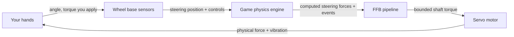

Có hai việc diễn ra đồng thời, hàng nghìn lần mỗi giây:

- **Input (bạn → game):** base đo lường chính xác hướng vô lăng đang chỉ và báo cáo nó, cùng với pedals và các nút bấm, cho simulation.
- **Output (game → bạn):** simulation tính toán các lực *đáng lẽ* sẽ tác động lên một hệ thống thước lái thực tế và ra lệnh cho motor tái tạo một phiên bản an toàn, được scale tỷ lệ của chúng tại vành vô lăng (rim).

Định nghĩa này quan trọng vì nó thiết lập kỳ vọng. Force feedback *không* phải là một hiệu ứng rung (rumble effect) được xếp chồng lên một game; nó là physics của một chiếc xe ảo được chiếu lên một motor thực tế. Khi lốp xe chịu tải, vô lăng trở nên nặng. Khi mất độ bám đường (grip), vô lăng trở nên nhẹ. Khi bạn cán qua kerb, bạn cảm nhận được lực tác động. Chất lượng của một hệ thống được đo lường bằng việc nó đóng vòng lặp đó trung thực và nhanh đến mức nào.

Cơ sở nghiên cứu phát biểu điều này một cách chính xác: *"Force feedback chuyển đổi các physical effects được định nghĩa bởi simulation thành bounded shaft torque trong khi trả về steering position và controls cho simulation."* Mọi thứ khác trong document này là bộ máy làm cho câu nói đó thành hiện thực.

---

### 2. Lý Thuyết Về Lực: Torque và Bốn Cảm Giác Cơ Bản

#### 2.1 Torque là tiền tệ của FFB

Vô lăng là một vật thể quay, vì vậy đại lượng vật lý liên quan không phải là *force* (newtons) mà là **torque** (newton-metres, N·m) — một lực quay. Torque là tích của lực tiếp tuyến và bán kính mà tại đó nó tác động:

$$\tau = F \times r$$

Mối quan hệ đơn giản này có một hệ quả thực tế mà mọi người cảm nhận được ngay lập tức: **đối với cùng một shaft torque, rim có đường kính lớn hơn đòi hỏi ít lực tay hơn.** Một chiếc rim GT 33 cm trên một base 10 N·m cho cảm giác nhẹ hơn ở tay cầm so với rim 30 cm trên cùng một base, bởi vì tay bạn đang ở một đòn bẩy ngắn hơn. Torque là con số trung thực; "cảm giác nặng như thế nào" cũng phụ thuộc vào kích thước rim và vị trí cầm nắm.

> **Kỷ luật ngôn ngữ (từ glossary):** *FFB strength* là một **setting** (thường là tỷ lệ phần trăm); *torque tính bằng N·m* là một **physical output**. Chúng liên quan với nhau nhưng không thể hoán đổi cho nhau. "Đặt FFB ở mức 100%" và "base tạo ra 15 N·m" mô tả hai điều khác nhau.

#### 2.2 Bốn cảm giác cơ bản mà FFB tổng hợp

Vượt ra ngoài tín hiệu raw torque, hầu hết mọi thứ mà vô lăng tác động lên tay bạn được xây dựng từ một tập hợp nhỏ các hành vi vật lý. Cơ sở nghiên cứu xác định bốn cảm giác cốt lõi (cộng với một motor artifact):

| Sensation | Ý nghĩa vật lý | Cảm giác ở vô lăng |
|---|---|---|
| **Torque** | Lực tiếp tuyến tại một bán kính | Vô lăng chủ động đẩy/kéo tay bạn |
| **Inertia** | Sức cản lại *angular acceleration* (effective mass) | Vô lăng có cảm giác "nặng" khi bắt đầu hoặc dừng quay |
| **Damping** | Sức cản tỷ lệ với *velocity* | Chuyển động được làm mượt; các cú đánh lái nhanh bị cản lại |
| **Friction** | Sức cản chống lại *motion*, bao gồm cả chuyển động chậm | Một lực kéo liên tục, giống như một thước lái cứng |
| **Cogging** *(artifact)* | Torque ripple từ tính phụ thuộc vào vị trí trong chính motor | Một cảm giác khựng nhẹ (notchiness) khi vô lăng quay; một thứ cần *giảm thiểu*, không phải là một driving cue |

Đây là các yếu tố cơ bản. Grip, self-aligning torque, kerbs, và weight transfer đều được *thể hiện* thông qua sự kết hợp của torque, inertia, damping, và friction — được điều biến theo thời gian thực bởi physics của game.

---

### 3. Servo Motor: Lực Được Tạo Ra Bằng Cấu Trúc Vật Lý Như Thế Nào

Để cảm nhận được bất cứ điều gì, một motor thực sự phải tạo ra torque thực sự. Các base direct-drive hiện đại sử dụng **three-phase PMSM** (Permanent-Magnet Synchronous Motor, có liên quan chặt chẽ với motor BLDC): một **stator** bằng thép có dây quấn bao quanh một **rotor** nam châm vĩnh cửu được kết nối trực tiếp với steering shaft.


#### 3.1 Tại sao bạn không thể chỉ apply DC

Một PMSM không thể được dẫn động từ DC thô (raw DC). Nó cần **ba dòng điện pha hình sin (three sinusoidal phase currents), lệch nhau 120°**, cùng nhau tạo ra một *rotating magnetic field* (từ trường quay) trong stator. Rotor nam châm vĩnh cửu cố gắng bám theo từ trường đó — và "nỗ lực" bám theo đó, được kiểm soát chính xác, *chính là* torque mà bạn cảm nhận được. Điều khiển từ trường, và bạn điều khiển được lực (Steer the field, and you steer the force).

#### 3.2 Inverter: biến DC bus thành ba pha

Thành phần tổng hợp ba pha đó là **inverter** — sáu power MOSFETs được sắp xếp thành ba **half-bridges** (một cho mỗi pha), được cấp nguồn từ một DC bus cố định.


Mỗi pha có một high-side switch (đến DC+) và một low-side switch (đến DC−). Chuyển mạch chúng nhanh chóng với **PWM** (Pulse-Width Modulation) thiết lập điện áp *trung bình* trên mỗi pha; làm điều này trên cả ba nhánh với timing phù hợp sẽ tạo ra rotating field. Hai quy tắc cứng được rút ra từ điều này:

- **Dead-time là bắt buộc.** Hai switches trong một nhánh không bao giờ được bật cùng nhau, nếu không chúng sẽ làm ngắn mạch DC bus (**shoot-through**) và phá hủy các MOSFETs. Phần cứng áp đặt một khoảng trống "both-off" (cả hai đều tắt) ngắn gọn trong mọi transition.
- **Low-side shunts đo lường dòng điện.** Các điện trở nhỏ ở mỗi low-side leg cho phép controller đọc được phase current thực tế — feedback mà control loop cần để điều chỉnh torque.

#### 3.3 Field-Oriented Control (FOC): trái tim của "feel"

Algorithm làm cho một DD wheel hiện đại mang lại cảm giác mượt mà (clean) thay vì khựng (notchy) là **Field-Oriented Control**. FOC liên tục đọc **rotor angle** (từ encoder) và **phase currents** (từ shunts), sau đó phân tách toán học dòng điện thành hai thành phần:

- phần tạo ra **torque** hữu ích (*q-axis* current, `Iq`), và
- phần lãng phí chỉ đẩy chống lại các magnets (*d-axis*, được điều khiển về 0).

Controller sau đó ra lệnh chính xác dòng điện torque (torque current) được yêu cầu. Mối quan hệ chi phối đẹp và đơn giản:

$$\tau \approx K_t \times I_q$$

Torque (đối với thứ tự đầu tiên) tỷ lệ thuận với dòng điện tạo ra torque (torque-producing current). **Bạn muốn có nhiều force hơn? Đẩy nhiều current hơn. Nhiều current hơn tạo ra nhiều nhiệt lượng hơn** — đó là lý do tại sao thermal management (§12) tồn tại.

#### 3.4 Khi nào dòng điện được đo lường cũng quan trọng như giá trị của nó

FOC chỉ hoạt động nếu việc đọc dòng điện rõ ràng (clean), và các switching edges (cạnh chuyển mạch) của các MOSFETs đưa vào electrical noise. Do đó, ADC (analog-to-digital converter) được trigger tại điểm *yên tĩnh* (quiet point) — **giữa của chu kỳ PWM (middle of the PWM period)**, cách xa các switching edges.


Một triangular carrier được so sánh với duty command của từng pha để tạo ra gate signal; lấy mẫu tại carrier peak (giữa on-time) nắm bắt được giá trị trung bình rõ ràng. "Valid middle-of-PWM window" (cửa sổ giữa PWM hợp lệ) này là một timing requirement cốt lõi của bất kỳ motor controller có năng lực nào, và nó chạy *rất* nhanh — current/FOC loop thường thực thi ở mức **10–40 kHz**.

#### 3.5 Hai sensors mà FOC phụ thuộc vào

| Sensor | Đọc gì | Tại sao FFB cần nó |
|---|---|---|
| **Encoder** (absolute SPI/SSI/BiSS-C, hoặc ABZ / Sin-Cos) | Góc rotor/shaft & tốc độ | FOC phải biết rotor position để commutate (đổi pha) chính xác; nó cũng là steering angle được báo cáo cho game |
| **Current sensing** (shunts + amplifier + synchronized ADC) | Các dòng điện pha (phase currents) | Đóng vòng lặp torque: `τ ≈ Kt × Iq` đòi hỏi phải biết `Iq` |

**Độ phân giải (resolution)** của encoder là giới hạn trần cho mức độ wheel có thể *cảm nhận* (sense) position một cách tinh tế đến mức nào, và do đó, nó có thể tái tạo các lực nhỏ tinh tế đến mức nào — đây là "23-bit / 8 triệu điểm" được đề cập trong phần §5.

---

### 4. Các Loại Truyền Động: Gear vs Belt vs Direct Drive

Cách torque của motor tiếp cận rim quyết định mức độ chi tiết nào còn tồn tại sau quá trình truyền động.

| Loại truyền động | Chi phí | Cơ chế | Characteristic artifact |
|---|---|---|---|
| **Gear-driven** (Dẫn động bằng bánh răng) | Thấp | Motor dẫn động rim thông qua giảm tốc bánh răng | **Backlash** — một vùng chết (dead zone) nhỏ / notchiness khi chuyển hướng |
| **Belt-driven** (Dẫn động bằng dây đai) | Trung bình | Motor dẫn động rim thông qua một dây đai (belt) | **Compliance / stretch** — dây đai hấp thụ nhẹ và làm trễ các fast detail |
| **Direct-drive (DD)** | Cao | Motor shaft *chính là* steering shaft | **Lowest transmission error** — độ trung thực cao nhất; cũng là torque cao nhất và gánh nặng an toàn lớn nhất |

Lý do direct drive thống trị phân khúc high-end là mỗi mechanical stage giữa motor và tay bạn là một **filter (bộ lọc)** làm mờ tín hiệu. Gears thêm dead zone; belts thêm độ dãn và độ trễ. Loại bỏ transmission sẽ loại bỏ bộ lọc: với DD, những kết cấu (textures) nhỏ ở tần số cao mà motor tạo ra sẽ truyền đến rim gần như nguyên vẹn. Fidelity đó chính xác là lý do tại sao các hệ thống DD phải được xử lý như một mối nguy hiểm tiềm ẩn — không có yếu tố cơ học nào giữa một motor chuẩn công nghiệp và cổ tay bạn.

---

### 5. Công Nghệ Motor Độ Phân Giải Cao: Torque, Latency, Fidelity

Một direct-drive base không phải là "một controller với độ rung mạnh hơn". Nó là một industrial servo drive (bộ truyền động servo công nghiệp) với precision sensing. Ba thông số mô tả mức độ thuyết phục của nó: **độ mạnh (how strong)**, **tốc độ (how fast)**, và **chi tiết (how detailed)**.

#### 5.1 Sức mạnh — peak vs holding torque (N·m)

Nhiều torque hơn có nghĩa là dynamic range rộng hơn: wheel có thể nhẹ tựa lông hồng trong một khúc cua kẹp tóc (hairpin) chậm và thực sự chiến đấu với bạn trong một góc cua tốc độ cao. Nhưng có một điểm tinh tế mà glossary nhấn mạnh — **peak torque và holding torque không phải là cùng một con số và không thể so sánh trực tiếp:**

| Số liệu | Ý nghĩa |
|---|---|
| **Peak torque** | Torque cao nhất trong thời gian ngắn (short-duration) ở các điều kiện xác định |
| **Holding / sustained torque** | Torque được duy trì theo thời gian trong giới hạn về nhiệt và điện |

Các số liệu đại diện được quảng cáo từ cơ sở nghiên cứu (dưới dạng công bố của nhà sản xuất, có thể thay đổi và cập nhật firmware):

| Sản phẩm (ví dụ) | Torque được quảng cáo | Ghi chú |
|---|---|---|
| Fanatec CSL DD | 5 N·m (8 N·m với Boost Kit) | Entry direct drive |
| Fanatec ClubSport DD / DD+ | 15 / 18 N·m holding (sau firmware V1.4.2.3) | Được tăng lên trong phần mềm, không thay đổi phần cứng |
| Fanatec Podium DD1 / DD2 | Lên đến 20 / 25 N·m **peak** | Thế hệ flagship trước đây |
| Fanatec Podium DD (2026) | 25 N·m holding; lên đến 33 N·m peak overshoot | Flagship hiện tại |
| VNM Direct Drive Xtreme (công bố của nhà bán hàng) | 32 N·m | High-output enthusiast base |

> Available torque *cũng* bị giới hạn bởi steering wheel được gắn vào, quick release, firmware, và bất kỳ Low-Torque Mode nào — xếp hạng của motor là mức trần, không phải là mức đảm bảo.

#### 5.2 Tốc độ — latency

Độ chân thực sụp đổ nếu force đến muộn. Wheel phải phản hồi với một event trong game (như va chạm kerb, bị oversteer) với độ trễ càng nhỏ càng tốt để tín hiệu đến tay bạn gần như đồng bộ với những gì bạn nhìn thấy. Các nhà cung cấp quảng cáo những con số rất thấp — ví dụ, **Simagic quảng bá mức latency ~1 ms** trên dòng Alpha của mình — điều này, nếu đạt được end-to-end, có nghĩa là thông tin đến tay bạn gần như ngay lập tức.

Tuy nhiên, Latency không phải là một con số duy nhất; nó có tính **cộng dồn theo giai đoạn (stage-additive)** trên toàn bộ chuỗi (game physics tick → USB transport → FFB evaluation → motor loop). Hoạt động engineering hữu ích là thiết lập ngân sách (budget) và đo lường từng stage, không chỉ con số end-to-end. Cơ sở nghiên cứu liệt kê typical rates: FOC loop 10–40 kHz, FFB/torque arbitration 0.5–2 kHz, USB ở endpoint cadence.

#### 5.3 Chi tiết — fidelity và độ phân giải của sensor

Fidelity là khả năng tái tạo các lực *nhỏ* một cách rõ ràng — engine idle vibration (độ rung khi xe nổ máy chờ), độ sần (graining) của lốp gần giới hạn của nó, hoặc texture của mặt đường nhựa thô. Nó bị kiểm soát bởi:

- **Độ phân giải của Encoder (Encoder resolution).** Angle sensor càng mịn (finer), hệ thống càng có thể resolve được các bước vị trí và force nhỏ. Các nhà cung cấp trích dẫn những con số lớn ở đây — ví dụ: một **23-bit sensor được quảng cáo là tái tạo hơn 8 triệu điểm dữ liệu trên mỗi vòng quay** (VNM). Càng nhiều bit = các bước lượng tử hóa (quantization steps) nhỏ hơn = chi tiết tín hiệu nhỏ (small-signal detail) mượt mà hơn. Cùng một nguyên lý "nhiều bit hơn = các bước mịn hơn" chi phối pedal ADCs:

  

- **Low transmission error** (direct drive, §4) để chi tiết không bị lọc ra một cách cơ học.
- **Cockpit cứng cáp (A rigid cockpit)** để chi tiết không bị hấp thụ bởi một khung (frame) dễ uốn cong (§9.3, được minh họa bên dưới).

Tóm lại: **sức mạnh mang lại dynamic range, độ trễ thấp giữ cho nó được đồng bộ với sim, và resolution + sự cứng cáp bảo toàn các texture mượt mà.** Một vô lăng mang tính thuyết phục cần cả ba yếu tố đó; chỉ một con số torque lớn không đủ để mang lại realism — trên thực tế, glossary đã cảnh báo rằng "nhiều N·m hơn không tự động đồng nghĩa với nhiều detail hay realism hơn."

---

### 6. Chuỗi Tín Hiệu FFB: Từ Game Physics Đến Tay Bạn

Một force duy nhất bắt đầu dưới dạng một con số trong game engine và kết thúc bằng current trong motor. Cơ sở nghiên cứu gọi đây là "hành trình FFB." Mỗi stage có một công việc riêng.

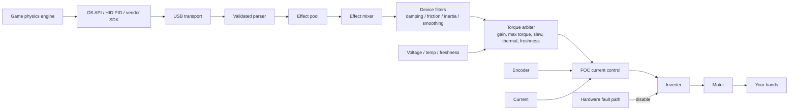

| Giai đoạn (Stage) | Trách nhiệm |
|---|---|
| **Game engine** | Tính toán virtual steering forces và các physics events mỗi physics tick |
| **API / driver** | Thể hiện các effects thông qua OS contract — DirectInput, **USB HID PID**, hoặc vendor SDK |
| **USB transport** | Cung cấp và xác thực các effect reports |
| **PID manager / effect pool** | Phân bổ các effects và theo dõi duration, envelope, conditions, và trạng thái start/stop của chúng |
| **FFB mixer** | Kết hợp tất cả các effects đang hoạt động thành một tín hiệu **mà không gây tràn số (arithmetic overflow)** |
| **Device filters** | Apply damping / friction / inertia / smoothing theo cấu hình của người dùng |
| **Torque arbiter** | Người giữ cổng duy nhất: áp dụng gain, max torque, **slew-rate**, thermal derating, enable state, và giới hạn **freshness** |
| **Motor control (FOC)** | Chuyển đổi yêu cầu bounded torque thành phase current / PWM — nó không biết gì về các "effects," chỉ biết về current |
| **Power stage** | Tạo ra physical torque (torque vật lý) |
| **Safety** | Khóa (remove) torque một cách độc lập khi có hardware fault, bất kể phần mềm yêu cầu gì |

Hai nguyên tắc thiết kế đáng được ghi nhớ:

- **Torque arbiter là tuyến đường duy nhất bằng phần mềm tới motor.** Không có effect nào có thể bỏ qua được các giới hạn về độ an toàn và công suất cuối cùng.
- **Freshness được enforce.** Nếu host link bị ngắt kết nối, base sẽ chạy chính sách **torque decay and disable (giảm dần torque và vô hiệu hóa)** thay vì đóng băng ở lực được ra lệnh cuối cùng. Ngược lại, dữ liệu encoder/current bị ngắt quãng được xử lý như một lỗi nghiêm trọng và kích hoạt tình trạng ngăn chặn (inhibit) ngay lập tức.

---

### 7. Những Gì Tay Bạn Thực Sự Cảm Nhận Được

Đây là trọng tâm của yêu cầu: danh sách các sensations mà một hệ thống FFB tốt mang lại, và các physics đằng sau mỗi điều đó. Tất cả chúng cuối cùng đều được biểu hiện thông qua các yếu tố nguyên thủy torque/inertia/damping/friction của §2, được game điều biến trong thời gian thực.

#### 7.1 Tire physics — ngôn ngữ chính của FFB

Vô lăng không chỉ đơn thuần rung (vibrate); nó **quay (rotates) và tạo ra drag (sức cản)** dựa trên tương tác giữa lốp xe và mặt đường. Đây là nơi chứa đựng hầu hết "thông tin".

**Grip và góc cua có chịu tải (cornering load).** Khi bạn bẻ lái vào một góc cua, bánh trước tạo thành một **slip angle (góc trượt)** và biến dạng, tạo ra lực bên (lateral force). Lực đó tác động thông qua steering geometry và hiển thị ở tay bạn dưới dạng **increasing weight (trọng lượng tăng lên)** — vô lăng trở nên nặng hơn khi lốp xe hoạt động càng khắc nghiệt. Việc đọc được quá trình tích tụ lực (build-up) đó là cách bạn tìm ra điểm tới hạn (limit) bằng cảm giác: bạn cảm nhận được lốp xe chịu tải (loading up), tiến dần đến điểm cực đại (peak) của nó, mà không cần nhìn vào bất cứ thứ gì trên màn hình.

**Mất lực bám (Loss of traction / understeer).** Khi lốp trước vượt quá độ bám đường và bắt đầu **understeer (thiếu lái)**, chúng không thể tạo ra lateral force dùng để load vô lăng nữa. Kết quả vô cùng kịch tính và có thể nhận ra ngay lập tức: **drag trên vô lăng đột ngột giảm xuống và vô lăng trở nên nhẹ đi.** Sự nhẹ đi đó là một cảnh báo sớm — bạn cảm thấy chiếc xe bắt đầu mất lực bám bánh trước *trước khi* bạn thấy mũi xe trượt rộng ra. Việc đánh lái thêm tại điểm đó không có tác dụng gì, và vô lăng nhẹ sẽ cho bạn biết điều đó.

**Self-aligning torque (SAT) và để vô lăng tự hoạt động.** Trong một chiếc xe thật, góc caster và pneumatic trail làm cho bánh trước có xu hướng tự nhiên cố gắng **return to center (trở về tâm)** — đây là lực trả lái (self-aligning torque). Những chiếc wheel cao cấp tái tạo chính xác lực SAT, điều này cho phép bạn *"buông tay" (let go) và để xe tự lấy lại cân bằng.* Trong một pha trượt được kiểm soát (oversteer/drift), lực SAT sẽ chủ động quay vô lăng về phía điểm đánh lái ngược (counter-steer) chính xác; một tay lái giỏi sẽ nương theo self-aligning force đó thay vì chống lại nó, và bắt được cú trượt chỉ bằng một cú chạm nhẹ. Khi phần đuôi xe trượt ra, bạn cảm nhận vô lăng cố gắng đánh lái ngược *cho* bạn — hãy nương theo nó, đừng chống lại nó.

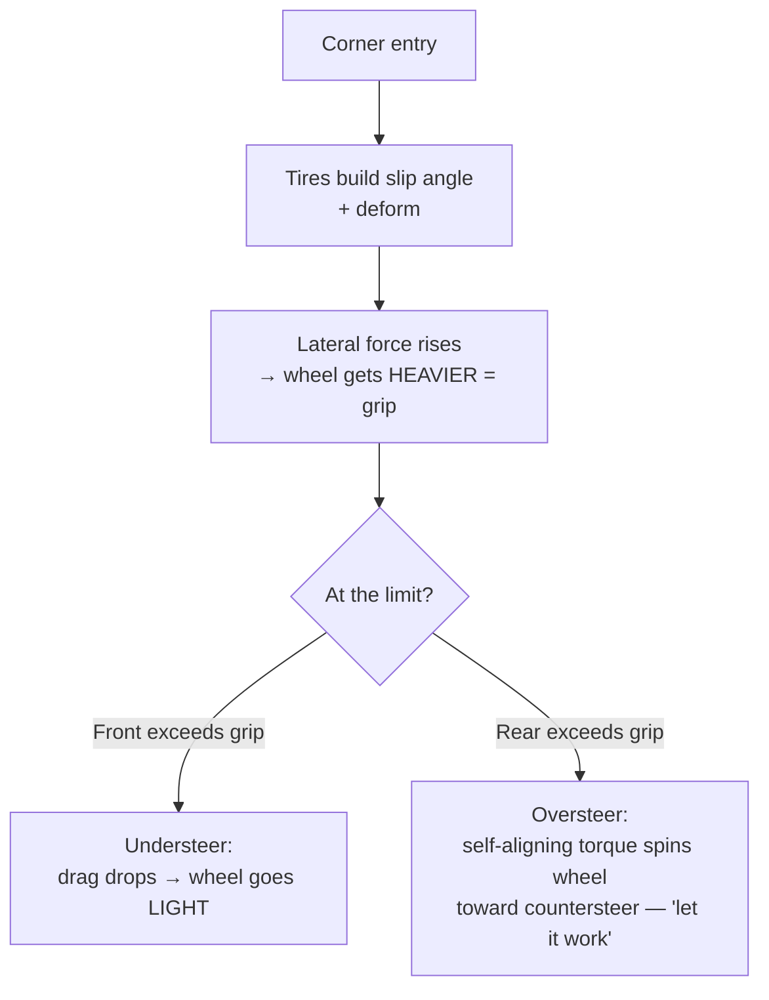

#### 7.2 Suspension và weight transfer

Simulation tính toán tải trọng (load) trên mỗi bánh xe theo thời gian thực và đưa nó vào tín hiệu steering.

**Weight transfer làm thay đổi độ nặng vô lăng.** Dưới thao tác **hard braking (phanh gấp)**, trọng lượng dồn về bánh trước; độ bám đường tăng và **vô lăng trở nên nặng hơn.** Dưới thao tác **acceleration (tăng tốc)**, bánh trước bị giảm tải (unload) và **vô lăng trở nên nhẹ hơn.** Những sự thay đổi chậm, quy mô lớn này về độ nặng vô lăng là dữ liệu cho bạn biết những gì khung xe (chassis) đang làm về mặt động lực học.

**Mặt đường (Road surface) và các tác động.** Mọi **kerb (rumble strip)**, ổ gà (pothole), khe co giãn, và quá trình chuyển từ nhựa đường sang cỏ (grass) hoặc sỏi (gravel) đều thông qua dạng vibration và các cú giật của torque. Một pha va chạm kerb là một tiếng buzz sắc bén; cỏ hay sỏi là một tiếng ầm ĩ (rumble) thô và lộn xộn; bề mặt đường đua nhẵn thì im lặng. Điều này được xếp chồng *lên trên* các tín hiệu tire và weight, vì vậy bạn cảm nhận texture mặt đường thông qua steering load thay vì dùng nó để thay thế.

#### 7.3 Các hiệu ứng Vibration và texture

Nội dung có tần số cao hơn được truyền tải (rides on) trên tín hiệu main force:

- **Engine / RPM vibration** — một tiếng buzz định kỳ tăng theo số vòng tua máy (revs); mạnh nhất đối với high-resolution DD hardware có thể tái tạo được dao động nhanh, mịn.
- **ABS pulsing và brake lockup** — pedal/wheel feedback khi một bánh trước bị khóa hoặc ABS hoạt động.
- **Tire graining / scrub** — fine "scrubbing" texture khi một lốp xe tiến đến hoặc vượt qua giới hạn bám đường (grip limit).
- **Wheelspin** — rung động dồn dập (fluttery) khi các bánh xe dẫn động (driven wheels) mất độ bám.

Tùy thuộc vào tựa game, những effects này sẽ là **physics-derived** (được tính toán từ các vùng tiếp xúc ảo thực tế) hoặc **canned** (được tạo sẵn trước và được kích hoạt bởi một sự kiện). Physics-derived effects thay đổi một cách tự nhiên theo tình huống; canned effects thì đồng nhất hơn. Bảng thuật ngữ đánh dấu sự khác biệt này trong mục *Road Effects*.

#### 7.4 Condition effects (các primitives của "feel", đóng vai trò như các tùy chọn)

Bốn base sensations từ §2 cũng xuất hiện dưới dạng các *deliberately configurable effects* giúp định hình tổng thể đặc tính của vô lăng:

| Effect | Tác động ở vô lăng | Tên Tuning (Fanatec) |
|---|---|---|
| **Spring** | Kéo vô lăng về một điểm trung tâm | SPR (scales spring được game yêu cầu; không phải automatic centering) |
| **Damper** | Chống lại *tốc độ* di chuyển — làm dịu và ổn định | Damping / NDP |
| **Friction** | Kháng cự liên tục đối với motion, ngay cả khi di chuyển chậm | NFR (Natural Friction) |
| **Inertia** | Thêm khối lượng lái mô phỏng — hữu ích với các vành (rim) nhẹ | NIN (Natural Inertia) |

Được sử dụng ở mức độ vừa phải, những hiệu ứng này giúp bổ sung độ realism và độ ổn định; Nếu lạm dụng, chúng **mask detail (che khuất chi tiết)** và tăng thêm độ mỏi — quá nhiều friction hoặc damping sẽ che giấu chính xác các tín hiệu tinh tế mà §7.1–7.3 đang cố gắng truyền tải.

---

### 8. Phân Loại Force-Effect (HID PID)

Thực chất, game không gửi "understeer" hay "kerb". Nó gửi các effects tiêu chuẩn là **USB PID (Physical Interface Device)** mà base kết hợp lại. Việc hiểu quy tắc phân loại này sẽ giải thích những gì FFB pipeline thực sự đang trộn lẫn (mixing).

| PID effect class | Ví dụ | Dùng để truyền tải |
|---|---|---|
| **Constant force** | Một torque ổn định có độ lớn/hướng nhất định | Main steering load — grip, weight transfer, SAT |
| **Periodic** | Sine, square, triangle, sawtooth vibrations | Engine buzz, kerbs, ABS, road texture |
| **Condition** | Spring, damper, inertia, friction | Centering và các "feel" primitives (§7.4) |
| **Ramp** | Lực tăng/giảm tuyến tính theo thời gian | Transitional effects (Các hiệu ứng chuyển tiếp) |
| **Envelope** (modifier) | Attack/fade shaping cho những tác động bên trên | Làm mượt cách các hiệu ứng bắt đầu và dừng lại |

**Effect pool** phân bổ những yếu tố này; **mixer** tính tổng những yếu tố đang hoạt động; **arbiter** giới hạn (bounds) kết quả. Realism của một game phụ thuộc rất nhiều vào mức độ thông minh (intelligently) mà nó ánh xạ (maps) các physical của nó vào các primitives này — một sim tuyệt vời thúc đẩy *constant force* từ tire model thực thụ, trong khi một bản sim yếu hơn sẽ phụ thuộc vào các canned periodics.

---

### 9. Vibrations Trên Tay vs. Trên Ghế

"Vibration bạn cảm nhận được" trong một dàn sim rig đến từ tối đa **ba hệ thống riêng biệt (three separate systems)**, và việc gộp chung chúng lại (conflating) là nguyên nhân phổ biến gây nhầm lẫn. Chúng phải luôn tách rời — vì mục đích fidelity cũng như tính an toàn.

```mermaid
flowchart TD
    Game[Game / telemetry] --> FFBpath[FFB motor path]
    Game --> Rumble[Rim rumble motors]
    Game --> Tactile[Tactile transducers / bass shakers]
    FFBpath -->|torque + fine texture| Hand1[Hands - via steering shaft]
    Rumble -->|buzz| Hand2[Hands - via rim]
    Tactile -->|low-frequency body| Seat[Seat / chassis / pedals]
```

#### 9.1 FFB motor chính (tay, thông qua shaft)

Tuyến đường chính (primary) và có fidelity cao nhất. Trên một DD base tốt, chỉ riêng điều này có thể tái tạo engine vibration và road texture dưới dạng *modulation of the main torque signal (sự điều chế của tín hiệu main torque)* — nội dung chi tiết, tốc độ nhanh được mô tả ở mục §7.3. Đây là "vibration trên tay" ở dạng thực thụ nhất của nó.

#### 9.2 Rim rumble / shaker motors (tay, qua rim)

Một số vô lăng chứa các động cơ rung nhỏ chuyên dụng, được điều khiển bởi một cài đặt cường độ (strength setting) **tách rời** (**SHO** của Fanatec — Shock/Vibration Strength). Quan trọng, **SHO điều khiển các động cơ tạo ra tiếng buzz đó, chứ không phải main FFB motor của base** — việc tăng mức độ không làm tăng steering force, và nó là một effect thô (coarser) hơn so với motor-generated texture.

#### 9.3 Tactile transducers / "bass shakers" (thân thể, thông qua ghế & frame)

Đây là một **vibration subsystem riêng biệt**, được nạp từ telemetry hoặc low-frequency audio channel, làm rung *ghế, bản điều khiển, hoặc khung (frame)* — tiếng gầm (rumble) của động cơ, các cú va chạm vào kerb, khoá bánh xe được cảm nhận qua thân thể bạn chứ không phải bàn tay. Cơ sở nghiên cứu nhấn mạnh: chúng **phải được cách ly (isolated) để không làm hỏng FFB hay sensor.**


Một **crossover** giữ shaker ở bên trong dải tần số thấp (màu xanh lá) để năng lượng không bị cộng dồn vào dải sóng mang chi tiết FFB của wheel (màu tím) hay điều khiển rung cộng hưởng (structural resonance) trên hệ thống (màu đỏ). Bạn phải mount các transducers vào ghế hay một bảng chuyên dụng (không gắn trực tiếp vào luồng main FFB load path), sử dụng các kết cấu treo (compliant mounts) trên khung (frame), và thiết lập chúng một cách độc lập trước khi chạy song song chung với FFB có torque cao.

#### 9.4 Tại sao tính cứng cáp (rigidity) có ý nghĩa đối với cảm giác *trên tay* (hand feel)

Ngay cả motor tốt nhất cũng bị làm suy giảm tác dụng bởi một dàn cockpit bị flex, bởi vì một khung bị bẻ cong **sẽ hấp thụ** torque FFB và làm mờ fine detail trước khi nó có thể truyền đến đôi tay bạn.


Một hệ thống sim rig cứng cáp truyền sức đẩy (motor's force) từ motor thẳng vào tay bạn; một dàn sim linh hoạt, uốn éo (flexible) lại tiêu tán một phần lực vào độ lệch khung (frame deflection). Đây chính là phiên bản cơ học của mục §5.3: độ phân giải tạo ra các detail, còn mức độ cứng cáp (rigidity) chính là điều cho phép những detail đó truyền tải tới vành vô lăng (rim) cuối cùng.

---

### 10. Fidelity, Độ Phân Giải, Latency, và Clipping

Ba đại lượng xác định mức độ thuyết phục của vòng lặp, cộng với một chế độ lỗi phổ biến.

- **Độ phân giải (§5.3):** bước lực/vị trí nhỏ nhất mà hệ thống có thể đại diện. Càng cao = các kết cấu tín hiệu nhỏ (small-signal texture) mượt mà hơn.
- **Latency (§5.2):** độ trễ từ in-game event đến lực trên tay bạn. Càng thấp = đồng bộ hóa tốt hơn với những gì bạn thấy. Nó có tính cộng dồn (stage-additive); cần thiết lập ngân sách (budget) cho từng giai đoạn.
- **Dynamic range (§5.1):** khoảng cách từ tín hiệu nhẹ nhất đến peak torque. Càng rộng = càng có tính biểu đạt cao.

#### Clipping — chế độ lỗi quan trọng nhất cần hiểu rõ

**Clipping** xảy ra khi torque được yêu cầu vượt quá giới hạn active, dẫn đến **các lực lớn khác nhau đều bị xẹp xuống cùng một mức tối đa và detail bị mất.** Hãy tưởng tượng ba góc cua nặng khác nhau đều bị san phẳng thành "100%": bạn không còn có thể phân biệt chúng, và vô lăng có cảm giác như một bức tường on/off thay vì một bề mặt sống động.

```mermaid
flowchart LR
    subgraph Requested[Requested force]
        R1[Corner A: 90%] --- R2[Corner B: 110%] --- R3[Corner C: 130%]
    end
    subgraph Output[After clipping at 100%]
        O1[90%] --- O2[100% - clipped] --- O3[100% - clipped]
    end
    Requested --> Output
```

Cách khắc phục nghe có vẻ ngược đời: **giảm in-game gain** (hoặc cân bằng lại sức mạnh) để các đỉnh (peaks) nằm ngay dưới giới hạn. Điều này bảo tồn sự khác biệt giữa các lực — detail — ngay cả khi mức tối đa tuyệt đối bị thấp hơn một chút. Một công cụ đo từ xa (telemetry meter) phổ biến trong game hoặc đèn LED trên base sẽ giúp bạn thiết lập gain sao cho nó chỉ bị clipping ở những tác động lớn nhất.

Hai công cụ liên quan:

- **Interpolation (INT)** làm mượt FFB bị thô hoặc nhiễu trong game; giá trị cao hơn làm giảm độ gắt nhưng có thể làm giảm nhẹ mức độ phản ứng trực tiếp (immediacy).
- **Minimum Force** tăng cường (boosts) các lực on-center yếu để bạn có thể cảm nhận được những tín hiệu nhỏ nhất — nhưng việc lạm dụng có thể gây ra hiện tượng **oscillation (rung lắc)** trên các base DD nhạy bén.

---

### 11. Tinh Chỉnh FFB

FFB tốt là một sự thỏa hiệp giữa kết quả đầu ra của game và thiết lập của base. Mục tiêu là cảm nhận được nhiều thông tin nhất với ít sự biến dạng, mệt mỏi, và clipping nhất.

**Một quy trình bắt đầu hợp lý (từ phần an toàn thiết lập của cơ sở nghiên cứu):**

1. Mount base một cách cứng cáp; kiểm tra QR, cáp, PSU, và torque-off switch.
2. Hiệu chỉnh (Calibrate) steering center, steering range, và pedals. Đảm bảo steering range phần cứng khớp với in-game range.
3. **Bắt đầu với torque thấp cùng các bộ lọc mặc định (default filters).** Xác minh hướng của motor và torque-off switch hoạt động bình thường trước khi sử dụng.
4. Tăng dần torque, theo dõi **clipping, oscillation, và tình trạng nhiệt độ quá cao (excessive heat).**

**Các cài đặt chính và sự đánh đổi (what they trade off):**

| Cài đặt (Viết tắt) | Tác động | Cần lưu ý |
|---|---|---|
| **Gain** (in-game) | Hệ số nhân độ lớn FFB tổng thể | Quá cao → clipping |
| **FF / FFB** (base) | Sức mạnh tối đa của base | Có liên quan, nhưng không hoàn toàn tương đương với công suất N·m |
| **FFS — LIN / PEA** | Đường cong phản ứng tuyến tính vs đỉnh | LIN giữ tỷ lệ, có thể làm giảm max output |
| **NDP / Damping** | Lực cản dựa trên tốc độ; làm ổn định | Quá nhiều che lấp các fast detail |
| **NFR — Natural Friction** | Lực cản không đổi | Quá nhiều che lấp detail, gây mỏi |
| **NIN — Natural Inertia** | Khối lượng lái mô phỏng | Hữu ích với rim nhẹ; quá nhiều tạo cảm giác chậm chạp |
| **INT — Interpolation** | Làm mượt FFB thô ráp | Quá nhiều làm giảm độ nhạy bén (immediacy) |
| **FEI — Force Effect Intensity** | Độ sắc nét/cường độ của các hiệu ứng | Không phải giới hạn torque chính |
| **Minimum Force** | Tăng cường lực ở vị trí trung tâm (center forces) yếu | Dư thừa → dao động (oscillation) trên DD |

**Quy tắc vàng:** thiết lập in-game gain sao cho nó chỉ clip ở những cú chạm lớn nhất; sử dụng damping/friction vừa phải để chúng không chôn vùi các tín hiệu của lốp và mặt đường; và hãy nhớ rằng **nhiều N·m hơn là dải động (dynamic range), không tự động đồng nghĩa với sự chân thực hơn.** Một base 8 N·m được tinh chỉnh tốt có thể truyền đạt thông tin tốt hơn một chiếc 20 N·m bị clipping nặng nề.

---

### 12. An Toàn và Giới Hạn

Một base direct-drive là một servo motor công nghiệp được gắn vào một vô lăng nơi cổ tay bạn đang thao tác. Cùng một sức mạnh làm cho nó biểu đạt xuất sắc cũng làm cho nó trở nên nguy hiểm, vì vậy an toàn không phải là một tùy chọn và pipeline được thiết kế để **fail với torque OFF.**

#### 12.1 Mô hình an toàn phân lớp

```mermaid
flowchart TD
    Host[Host command] --> Validate[Parser validation] --> Arbiter[Software torque arbiter]
    Arbiter --> Local[Motor-MCU local limits] --> PWM --> Gate[Gate driver]
    OCP[Overcurrent comparator] --> Latch[Hardware fault latch]
    GF[Gate driver fault] --> Latch
    EStop[E-stop / torque-off] --> Latch
    WDG[Watchdog / enable timeout] --> Latch
    Latch -->|asynchronous disable| Gate
```

Nguyên lý: **bảo vệ phần cứng mang tính ủy quyền (authoritative) và độc lập với phần mềm.** Một thiết bị so sánh quá dòng (overcurrent comparator), một gate fault, một lần nhấn E-stop, hay một watchdog timeout đều có thể ngắt motor's power stage *mà không cần sự cho phép của phần mềm.* Phần mềm có thể yêu cầu torque; nhưng chỉ phần cứng mới có quyết định cuối cùng trong việc ngắt lực (removing it).

Các bất biến cốt lõi từ cơ sở nghiên cứu:

- Motor vẫn **de-energized (ngắt điện)** qua các giai đoạn reset, bootloader, cập nhật (updates), USB enumeration, phát hiện rim không tương thích, sensor feedback không hợp lệ, và brownout. Kết nối USB **không** đồng nghĩa với việc torque được kích hoạt.
- **Stale host commands** suy giảm về 0 torque trong thời gian quy định; **stale encoder/current** kích hoạt ngăn chặn (inhibit) ngay lập tức.
- Để kích hoạt full torque cần firmware đã được xác minh (verified), vượt qua self-test, sensor đã hiệu chỉnh, power stage khỏe mạnh, một policy rõ ràng, và không có latched faults.

#### 12.2 Thermal derating — torque và nhiệt độ

Vì `τ ≈ Kt × Iq`, torque cần dòng điện (current), và dòng điện tạo ra nhiệt (heat). Thay vì cắt điện đột ngột ở một giới hạn nhiệt độ, firmware **derates (giảm định mức)** — từ từ hạ thấp mức trần torque khi motor và inverter nóng lên — để base vẫn hoạt động ổn định và có thể dự đoán được thay vì bị tắt nguồn (dying) ngay giữa góc cua.


Dưới nhiệt độ derate-start, toàn bộ trần sức mạnh được tận dụng; giữa derate-start và shutdown, trần này sẽ giảm dần; trên shutdown, torque sẽ bị ngắt. Quá trình phục hồi sử dụng **hysteresis (hiện tượng trễ)** — torque chỉ được khôi phục khi nhiệt độ giảm xuống thấp hơn nhiều so với derate point — để hệ thống không bị dao động (oscillate) ra vào điểm derating ở mức ngưỡng giới hạn.

#### 12.3 Nguyên tắc thực hành cho người dùng

Giữ cho tay, tóc, quần áo, dây cáp, và trẻ em tránh xa vành vô lăng (rim) đang quay. Không bao giờ bỏ qua các interlocks vật lý, giới hạn torque, hoặc các tính năng an toàn của firmware. Hãy sử dụng các phần mềm được phê duyệt và quy trình cập nhật chuẩn. Và hãy coi hành vi "buông tay và để nó tự trả lái" trong phần §7.1 là một *kỹ thuật lái xe*, chứ không phải là lý do để bạn hoàn toàn buông tay khỏi một chiếc vô lăng đang có lực torque cao đang chạy.

---

### 13. Bảng Thuật Ngữ Nhanh

| Thuật ngữ | Ý nghĩa |
|---|---|
| **FFB** | Force Feedback — lực lái do motor tạo ra dựa trên các lệnh của game và cài đặt của base |
| **Torque / N·m** | Lực quay tại trục (shaft); thước đo chân thực về công suất đầu ra của FFB |
| **Peak vs Holding torque** | Mức tối đa trong thời gian ngắn (short-duration) vs mức tối đa duy trì (sustainable); không thể so sánh trực tiếp |
| **DD (Direct Drive)** | Motor shaft điều khiển steering shaft trực tiếp — lỗi truyền động (transmission error) thấp nhất |
| **PMSM / BLDC** | Three-phase permanent-magnet motor được sử dụng trong các DD bases |
| **FOC** | Field-Oriented Control — thuật toán điều chỉnh dòng điện tạo torque (torque-producing current) |
| **Inverter / PWM / dead-time** | Mạch công suất tổng hợp ba pha từ DC; dead-time ngăn chặn đoản mạch (shoot-through) |
| **Encoder** | Angle sensor; độ phân giải của nó giới hạn các fine detail của FFB |
| **SAT** | Self-Aligning Torque — xu hướng trả lái (return-to-center) tự nhiên của vô lăng; chìa khóa để xử lý các pha trượt |
| **Understeer / Oversteer** | Bánh trước mất độ bám (vô lăng nhẹ đi) / bánh sau mất độ bám (SAT sẽ countersteer) |
| **Clipping** | Các lực vượt qua mức giới hạn đều bị xẹp xuống thành lực lớn nhất, mất đi detail; khắc phục bằng cách giảm gain |
| **Slew rate** | Giới hạn tốc độ thay đổi của commanded torque |
| **Freshness / stale policy** | Nếu host link ngắt kết nối, torque sẽ giảm (decay) và bị vô hiệu hóa thay vì đóng băng |
| **Tactile transducer / bass shaker** | Hệ thống rung riêng biệt trên ghế/khung, được cách ly khỏi FFB |
| **SHO** | Shock/Vibration Strength — điều khiển các buzz motors trên rim, *không phải* main FFB motor |
| **NDP / NFR / NIN / INT / FEI** | Các tùy chọn (knobs) tinh chỉnh Damping / friction / inertia / interpolation / effect-intensity |
| **Torque arbiter** | Cổng phần mềm duy nhất (single software gate) áp dụng toàn bộ các giới hạn sức mạnh cuối và độ an toàn |
| **Derating** | Việc hạ thấp từ từ trần torque khi motor sinh nhiệt |
| **E-stop / torque-off** | Công tắc vật lý ngắt điện motor không phụ thuộc (independent) vào phần mềm |

---

### 14. Nguồn và Mô Hình Bằng Chứng

Document này tổng hợp kiến thức từ cơ sở nghiên cứu (study base) đi kèm và các hình minh họa gốc. Tuân thủ mô hình bằng chứng (evidence discipline) của cơ sở đó:

- **Verified public / standards (Tiêu chuẩn/Đã xác minh công khai):** Mô hình force-feedback USB HID & PID; nguyên lý FOC/PMSM motor-control; torque = F·r; `τ ≈ Kt·Iq`; bộ nghịch lưu ba pha (three-phase inversion) và dead-time.
- **Manufacturer / advertised claims (Công bố của nhà sản xuất / quảng cáo) (không được xác minh độc lập ở đây):** Thông số torque cụ thể (CSL DD, ClubSport DD/DD+, Podium DD, VNM 32 N·m), thông số latency (Simagic ~1 ms), và độ phân giải sensor (23-bit / 8 triệu điểm). Những số liệu này mô tả các thông số kỹ thuật và quảng cáo từ nhà sản xuất; kết quả thực tế phụ thuộc vào tổng thể hệ thống, firmware, và bản thân game.
- **Engineering inference (Suy luận kỹ thuật):** Tính toán latency (latency budgeting), cách ly cảm giác rung (tactile isolation), và hướng dẫn tinh chỉnh (tuning guidance).

Các tệp (files) nghiên cứu chính: `wheel_base.md` (motor control, FFB path, an toàn), `sim_racing_research.md` (ecosystem, các giai đoạn FFB, các loại truyền động), `tactile.md` (cách ly rung), `telemetry.md` (latency budget), `glossary.md` (thuật ngữ và tinh chỉnh). Các hình minh họa là bản vẽ gốc về các nguyên lý kỹ thuật chung, được sử dụng lại từ mục `assets` của cơ sở nghiên cứu.

Các tài liệu tham khảo công khai được trích dẫn bởi cơ sở nghiên cứu: [USB-IF HID](https://www.usb.org/hid), [USB-IF PID Class 1.0](https://www.usb.org/sites/default/files/documents/pid1_01.pdf), [Infineon PMSM FOC reference](https://documentation.infineon.com/aurixtc3xx/docs/kbv1711616051757), [TI sensored FOC](https://software-dl.ti.com/msp430/esd/MSPM0-SDK/2_04_00_06/docs/english/middleware/motor_control_pmsm_sensored_foc/doc_guide/doc_guide-srcs/Sensored_FOC_Motor_Control_Library.html), [Logitech TRUEFORCE](https://www.logitechg.com/en-za/innovation/trueforce.html), [Simucube FFB effects](https://docs.simucube.com/TunerSoftware/wheelbases/wheelbaseeffects.html), [OpenFFBoard wiki](https://github.com/Ultrawipf/OpenFFBoard/wiki/), [hid-fanatecff](https://github.com/gotzl/hid-fanatecff).

> Lưu ý về phạm vi: môi trường hiện tại không cung cấp chức năng trình duyệt web trực tiếp, vì vậy các nguồn web trực tiếp nằm ngoài những gì đã được trích dẫn trong cơ sở nghiên cứu đã không được lấy lại. Thông số kỹ thuật của sản phẩm và dữ liệu torque phụ thuộc vào firmware thay đổi thường xuyên — hãy xác minh số liệu hiện tại từ các trang sản phẩm của nhà sản xuất trước khi dựa vào chúng.


## Kiến trúc Phần cứng và Phần mềm của Wheel Base

> Phiên bản: 1.1
> Ngày nghiên cứu: 2026-07-01  
> Đối tượng: Fresher/junior trong lĩnh vực sim racing, mid level về hệ thống nhúng (embedded system).  
> Phạm vi: wheel base truyền động trực tiếp (direct-drive) hiện đại. Cấu tạo bên trong rim: [wheel_rim.md](./wheel_rim.md).  
> Bằng chứng: các tiêu chuẩn công khai, hướng dẫn/hỗ trợ từ nhà sản xuất, dự án mã nguồn mở công khai, và [wheel_rim.md](./wheel_rim.md). Không có kỹ thuật dịch ngược firmware (reverse engineering) độc quyền.

### Nhật ký Thay đổi Tài liệu

| Phiên bản | Ngày | Mô tả |
|---|---|---|
| 1.0 | 2026-07-01 | Tài liệu nghiên cứu ban đầu. |
| 1.1 | 2026-07-01 | Sắp xếp lại các phần (Cơ bản đến Nâng cao), bắt buộc sử dụng ngôn ngữ tiêu chuẩn, thay thế mã giả bằng bảng giao diện, thêm chú thích cho hình ảnh và chèn các đoạn giới thiệu. |

### 1. Tóm tắt Thực thi

Phần này cung cấp một cái nhìn tổng quan cấp cao về vai trò của wheel base trong hệ sinh thái sim racing. Nó thiết lập các mô hình cốt lõi về kiến trúc và an toàn.

Wheel base là trung tâm an toàn then chốt của hệ sinh thái. Nó đồng thời là một thiết bị USB human-interface, ổ đĩa servo thời gian thực, và hub ngoại vi. Nó báo cáo thông tin về trục lái và các điều khiển, tiếp nhận các hiệu ứng force-feedback, chuyển đổi yêu cầu mô-men xoắn (torque) giới hạn thành dòng điện pha của động cơ / PWM, và tổng hợp dữ liệu từ rim, bàn đạp (pedals), cần số (shifter), và phanh tay (handbrake).

Kiến trúc nên sử dụng một MCU chính cho USB, FFB, profile, thiết bị ngoại vi, cập nhật, và chính sách hệ thống, cùng với một MCU động cơ riêng biệt hoặc ASIC điều khiển cho việc thu thập encoder/dòng điện và biến tần (inverter) PWM. Một torque arbiter sẽ hoạt động như cầu nối phần mềm duy nhất giữa các miền này. Các đường dẫn phần cứng về quá dòng (overcurrent), lỗi cổng (gate fault), E-stop, watchdog, và ngắt timer (timer-break) sẽ đóng vai trò quyết định nếu phần mềm gặp sự cố.

Base sẽ phải rơi vào trạng thái ngắt mô-men xoắn (torque-off) nếu có lỗi. Hệ thống sẽ duy trì trạng thái không được cấp điện trong quá trình reset, thực thi bootloader, cập nhật, liệt kê (enumeration) USB, phát hiện rim không tương thích, phản hồi từ encoder/dòng điện không hợp lệ, tình trạng lệnh mô-men xoắn cũ (stale), sụt áp (brownout), và phục hồi watchdog. Việc bật mô-men xoắn cao sẽ yêu cầu các bản image đã được xác minh, vượt qua quá trình tự kiểm tra (self-test) thành công, các cảm biến đã hiệu chỉnh, power stage khỏe mạnh, một chính sách phần mềm rõ ràng và không có các lỗi latched faults.

### 2. Phạm vi và Bằng chứng

Phần này xác định các ranh giới của bài phân tích và làm rõ mức độ tin cậy của thông tin được trình bày. Điều này cần thiết để hiểu bối cảnh của các tuyên bố được đưa ra.

| Nhãn | Ý nghĩa |
|---|---|
| Hành vi công khai đã được xác minh | Được hỗ trợ bởi một tiêu chuẩn công khai, sách hướng dẫn hoặc tài liệu dự án |
| Pattern ngành | Kiến trúc phổ biến, không phải là quy luật chung |
| Reference design | Cấu trúc dự án được khuyến nghị, không phải là tuyên bố nội bộ của nhà cung cấp |
| Unknown | Cần bản vẽ mạch (schematics) của khách hàng, BOM, mã nguồn, descriptors hoặc tài liệu yêu cầu |

Các mục bao gồm: điện tử của base, vi xử lý, inverter, cảm biến, USB, thiết bị ngoại vi, firmware, timing, an toàn, cập nhật, chẩn đoán, và xác minh. Các mục không bao gồm: các định dạng độc quyền, firmware được trích xuất, bypass xác thực console, phương trình điều khiển/gains chi tiết, và cấu tạo bên trong rim.

`repos.md` là tài nguyên đầu vào để khám phá, không phải là tiêu chuẩn kỹ thuật. Các dự án cộng đồng Fanatec cung cấp quan sát thực tế, không phải thông số kỹ thuật chính thức.

### 3. Bối cảnh Hệ thống

Phần này minh họa cách wheel base tương tác với các tác nhân bên ngoài, bao gồm PC/console host, thiết bị ngoại vi của người dùng và nguồn cấp điện.

**Hình 3-1: Sơ đồ Bối cảnh Hệ thống**

```mermaid
flowchart LR
    Game -->|FFB effects| Host[OS Driver / Vendor Service]
    Host <-->|USB HID/PID + vendor interface| Base
    Console[Licensed Console] <-->|approved accessory path| Base
    PSU[Isolated DC Supply] --> Base
    subgraph Base[Wheel Base]
      Main[Main MCU] --> MotorDomain[Motor-Control Domain]
      Safety -->|enable / inhibit| MotorDomain
      Main <--> Ports[Peripheral Interfaces]
    end
    Base <-->|QR power/data + mechanical torque| Rim
    Pedals --> Ports
    Shifter --> Ports
    Handbrake --> Ports
    Tool[Configurator / Updater] <-->|USB| Base
```

| Trách nhiệm | Base | Rim | Host |
|---|---|---|---|
| Góc trục quay (Shaft angle) | Chính | Không | Tiêu thụ |
| Dòng điện động cơ/mô-men xoắn | Chính | Không | Yêu cầu hiệu ứng |
| Ức chế mô-men xoắn bằng phần cứng | Chính | Không | Không |
| Điều khiển Rim | Tổng hợp | Quét | Tiêu thụ |
| Đèn LED/màn hình | Định tuyến | Điều khiển (Drives) | Tạo giá trị |
| Liệt kê/cập nhật USB | Chính | Thường gián tiếp | Điều khiển bus/tool |

#### 3.1 Ranh giới Hệ sinh thái Fanatec Công khai

Hệ sinh thái công khai của Fanatec thể hiện mô hình base-as-hub (base đóng vai trò là trung tâm) nhưng không công bố cấu trúc liên kết nội bộ. Các sản phẩm hiện nay sử dụng chủ yếu các phân khúc CSL, ClubSport và Podium. Tên phân khúc là ngữ cảnh thương mại/sản phẩm; khả năng tương thích firmware vẫn phụ thuộc vào mẫu cụ thể, thế hệ, QR, cổng ngoại vi và phiên bản phần mềm.

Đối với hệ thống console, việc cấp phép nền tảng và kết nối thiết bị ngoại vi là các mối quan tâm riêng biệt:

| Mối quan tâm | Quy tắc Công khai Fanatec |
|---|---|
| Khả năng tương thích Xbox | Phụ thuộc vào vô lăng hoặc hub được cấp phép Xbox. |
| Khả năng tương thích PlayStation | Phụ thuộc vào wheel base được cấp phép PlayStation. |
| Bàn đạp/shifter/phanh tay cho Console | Kết nối thông qua wheel base tương thích. |
| Thiết bị ngoại vi độc lập PC | Sản phẩm được hỗ trợ có thể kết nối riêng bằng USB hoặc qua ClubSport USB Adapter. |

Đây là những sự thật ở cấp độ sản phẩm. Chúng không thiết lập một giao thức rim công khai, thuật toán xác thực, USB descriptor, hay phân vùng điều khiển động cơ.

### 4. Kiến trúc Phần cứng

Phần này trình bày chi tiết về các thành phần điện tử vật lý và các miền bên trong wheel base. Để hiểu rõ về các ranh giới này, cần phải làm quen với thiết kế PCB mixed-signal và điện tử công suất.

**Hình 4-1: Sơ đồ Khối Kiến trúc Phần cứng**

```mermaid
flowchart TD
    USB[USB + ESD + VBUS Sense] --> PHY --> Main[Main MCU]
    Main <--> Flash[Flash / EEPROM]
    Main <--> RimIF[QR Interface]
    Main <--> Accessory[Pedal / Shifter / Handbrake]
    Main --> TorqueLink[Bounded Torque Link]

    subgraph MotorDomain[Hard Real-Time Motor Domain]
      TorqueLink --> MotorMCU[Motor MCU / ASIC]
      Encoder --> EncoderIF --> MotorMCU
      Shunts --> CSA[Current Amplifiers] --> ADC[ADC + PWM Trigger] --> MotorMCU
      MotorMCU --> Timer[Complementary PWM] --> Gate[Gate Driver]
      Gate --> Bridge[3-Phase MOSFET Bridge] --> Motor[PMSM / BLDC]
    end

    DC[DC Input] --> Protect[Fuse / Reverse / TVS / Inrush] --> Bus[DC Link]
    Bus --> Bridge
    Bus --> Rails[Logic Rails] --> Main
    Bus --> Sense[Voltage / Current Sense] --> Main
    Thermal[Motor / FET / PCB Temperature] --> Main
    Gate -->|FAULT| Latch[Hardware Fault Latch]
    OCP[Overcurrent Comparator] --> Latch
    EStop[E-stop / Torque-Off] --> Latch
    Latch -->|asynchronous inhibit| Gate
```

| Miền (Domain) | Nội dung | Mục tiêu Thiết kế |
|---|---|---|
| Logic | Main MCU, USB, NVM, accessory transceivers | Bảo vệ USB/logic khỏi nhiễu chuyển mạch |
| Điều khiển động cơ | Motor MCU/ASIC, encoder receiver, ADC path | Đường phản hồi ngắn, có tính xác định (Deterministic) |
| Giai đoạn công suất | Gate driver, MOSFET bridge, shunts, DC link | Điện cảm thấp, làm mát, khống chế sự cố |
| Đầu vào nguồn | Bảo vệ, dòng khởi động (inrush), rails, chiến lược regen | Khống chế nguồn/lỗi thoáng qua |
| Đầu nối | USB, QR, phụ kiện, E-stop | Cách ly ESD/lỗi cáp |

### 5. Nguồn điện và Điều khiển Động cơ

Phần này giải thích các điện tử công suất cần thiết để chuyển đổi nguồn DC đầu vào thành dòng điện xoay chiều 3 pha (three-phase) nhằm điều khiển động cơ servo.

**Hình 5-1: Luồng Nguồn và Điều khiển Động cơ**

```mermaid
flowchart LR
    AC --> PSU[Isolated AC/DC]
    PSU --> Fuse --> Reverse[Reverse Protection] --> Inrush --> Bus[DC Bus]
    Bus --> Inverter --> Motor
    Bus --> Buck[Logic Rails]
    Bus --> Regen[Clamp / Brake / Regen Strategy]
    Bus --> Measure[Voltage / Current / Temperature]
```

| Khối | Trách nhiệm Phần cứng | Trách nhiệm Firmware |
|---|---|---|
| PSU | Cấp DC định mức cách ly | Phát hiện dải điện áp; không được giả định khả năng hấp thụ regen |
| Bảo vệ đầu vào | Fuse/eFuse, reverse, TVS, inrush | Xác định trình tự/báo cáo các lỗi có thể điều khiển |
| Bus DC (DC link) | Năng lượng xung | Theo dõi điện áp và biên độ regen |
| Gate driver | Drive, UVLO, faults | Cấu hình; chỉ bật sau khi kiểm tra xong |
| Inverter | Chuyển mạch từ DC sang 3 pha | Chỉ nhận PWM từ miền động cơ |
| Shunts/CSA | Phản hồi dòng điện | Offset/gain/saturation/plausibility |
| Phần cứng Regen | Xử lý năng lượng trả về | Phối hợp giảm mô-men xoắn/kẹp (clamp) |
| Rails | Cấp nguồn MCU/cảm biến/phụ kiện | Power-good/trình tự reset |

Chuyển động nhanh của người dùng có thể tạo ra năng lượng tái tạo (regen) trả về bus DC. Firmware sẽ phải tính toán mức năng lượng này để giới hạn mức hấp thụ của nguồn, phối hợp các kẹp/điện trở phanh (brake resistor) và quản lý giới hạn điện áp. 
Để tạo tín hiệu PWM, vi điều khiển sẽ sử dụng các đầu ra timer bù trừ (complementary timer outputs). Phần cứng sẽ bắt buộc áp dụng thời gian chết (dead time). Trình kích hoạt ADC (ADC trigger) sẽ được đồng bộ hóa với chu kỳ PWM. Phần cứng sẽ cung cấp một ngõ vào break không đồng bộ để dừng ngay quá trình chuyển mạch. Tín hiệu bật gate driver mặc định sẽ ở trạng thái tắt trong quá trình reset và thực thi bootloader. Firmware sẽ thực hiện mọi cập nhật tham số PWM tại một ranh giới atomic (nguyên tử) duy nhất.

#### 5.1 Biến tần tạo ra dòng điện 3 pha như thế nào

Biến tần (inverter) là trái tim công suất của wheel base. Một động cơ PMSM/BLDC không thể điều khiển trực tiếp bằng DC thô; nó cần ba dòng điện pha hình sin, lệch nhau 120°, và tạo ra từ trường quay để rotor theo sau. Biến tần tổng hợp ba pha đó từ bus DC cố định sử dụng sáu MOSFET công suất được bố trí thành ba **nửa cầu** (half-bridges), mỗi cầu một pha.


Mỗi pha sẽ có một switch high-side (nối vào DC+) và một switch low-side (nối vào DC-). Việc bật/tắt nhanh switch bằng PWM sẽ thiết lập điện áp trung bình trên pha đó; thực hiện với đúng timing trên cả ba nhánh sẽ tạo ra từ trường quay. Hai đặc điểm từ sơ đồ trên ứng trực tiếp vào các yêu cầu bắt buộc:

- **Dead-time (Thời gian chết) là bắt buộc.** Hai switch trên một nhánh không bao giờ được bật cùng lúc, nếu không sẽ gây đoản mạch trực tiếp dọc bus DC (gọi là *shoot-through*) và làm hỏng MOSFET. Phần cứng đảm bảo một khoảng thời gian dead-time rất ngắn để cả hai switch đều tắt ở mỗi lần chuyển trạng thái.
- **Low-side shunts phản hồi cho vòng lặp dòng điện.** Các điện trở shunt nhỏ trên các nhánh low-side là phương tiện để đo dòng pha, vốn là phản hồi (feedback) mà vòng lặp dòng điện FOC (FOC current loop, mục §5.2 và §6) cần để kiểm soát mô-men xoắn.

#### 5.2 Timing PWM và lấy mẫu dòng điện

Field-Oriented Control (FOC) phụ thuộc vào việc đo dòng pha một cách chính xác, và việc lấy mẫu dòng điện *vào thời điểm nào* quan trọng không kém bản thân mẫu đó. Các cạnh chuyển mạch của MOSFET gây ra nhiễu điện (electrical noise), vì vậy ADC được kích hoạt tại thời điểm yên tĩnh ở giữa khoảng thời gian PWM thay vì nằm gần một cạnh.


Sóng mang hình tam giác được so sánh với lệnh duty của mỗi pha để tạo ra tín hiệu cổng: khi sóng mang thấp hơn lệnh, switch high-side được bật. Lấy mẫu dòng điện tại đỉnh sóng mang (chính giữa thời gian on-time) giúp ghi lại giá trị trung bình sạch nhất, cách xa các xung điện (transients) do chuyển mạch. Đây chính là yêu cầu "valid middle-of-PWM triggers" ở mục §6, và việc zoom vào phần dead-time cho thấy khoảng cách both-off (cả hai cùng tắt) rất nhỏ để ngăn chặn shoot-through ở mọi cạnh.

### 6. Cảm biến

Phần này nêu chi tiết các cơ chế phản hồi được sử dụng để đo vị trí trục quay và dòng điện động cơ, những dữ liệu cực kỳ quan trọng đối với FOC và force feedback.

Bản thân động cơ là một PMSM 3 pha: một stator làm bằng thép từ quấn dây bao quanh một rotor nam châm vĩnh cửu gắn liền với trục lái. Encoder sẽ đọc góc quay rotor/trục cần thiết cho FOC thực hiện chuyển mạch chính xác, và bộ cảm biến dòng điện đọc giá trị dòng pha mà FOC đang điều chỉnh. Hình cắt ngang dưới đây hiển thị sự kết nối giữa các bộ phận này.


| Encoder | Điểm mạnh | Vấn đề quan tâm |
|---|---|---|
| SPI/SSI/BiSS-C tuyệt đối | Có góc ngay khi boot, CRC/status | Timing, receiver, wrap |
| ABZ | Đơn giản/độ trễ thấp | Cần reference/index, bị lỡ xung |
| Sin/Cos | Nội suy (interpolation) tốt | Lỗi offset/gain/phase analog |
| Hall sectors | Commutation thô rất tốt | Không đủ mịn cho các hệ thống lái cao cấp |

**Hình 6-1: Luồng Xử lý Cảm biến**

```mermaid
flowchart LR
    Encoder --> Acquire[SPI / Timer / ADC]
    Acquire --> Validate[CRC / Status / Range / Jump]
    Validate --> Cal[Direction / Offset / Scale]
    Cal --> Unwrap[Angle / Speed]
    Unwrap --> Control
    Unwrap --> USBReport[USB Axis Snapshot]
```

| Tín hiệu | Thu thập | Kiểm tra |
|---|---|---|
| Dòng pha | Shunt/CSA/synchronized ADC | Offset, gain, saturation, tính nhất quán |
| Dòng điện DC | Shunt/Hall ADC | Quá dòng, tính hợp lý của công suất |
| Điện áp DC | Divider/isolation ADC | Brownout, danh định, quá áp regen |
| Nhiệt độ FET/động cơ | NTC/IC/mô hình | Open/short, tốc độ thay đổi, derating |
| Sức khỏe Rails | Supervisor/ADC/GPIO | Power-good và nguyên nhân reset |

Kiến trúc cần hỗ trợ lấy mẫu dòng điện trong mỗi chu kỳ PWM, tận dụng các trigger hợp lệ giữa PWM, và bắt buộc phải thực hiện hiệu chuẩn (calibration) offset khi khởi động. Khung lấy mẫu chính xác phụ thuộc vào topo inverter và phương pháp điều chế (modulation scheme) được chọn.

### 7. Giao diện Bên ngoài

Phần này phân loại các ranh giới vật lý và logic nơi wheel base giao tiếp với các thiết bị ngoại vi phần cứng bên ngoài.

| Giao diện | Thuộc về | Mục đích |
|---|---|---|
| USB FS/HS | Main MCU | Nhập HID/PID FFB, config, chẩn đoán, cập nhật |
| QR/rim link | Main MCU | Định danh, điều khiển, đầu ra LED/màn hình |
| Bàn đạp/shifter/phanh tay | Main MCU | Analog/digital controls (vd. thông qua RJ12, tùy thuộc vào hardware emulation proxying) |
| Motor encoder | Motor MCU | Phản hồi từ rotor/trục |
| Main↔motor | Cả hai | Torque, angle, tình trạng sức khỏe, lỗi |
| SWD/JTAG/UART/service USB | Dịch vụ được kiểm soát | Sản xuất/phục hồi |
| E-stop/torque key | Logic an toàn phần cứng | Cho phép/Ức chế mô-men xoắn |

Các dự án cộng đồng cũ cho biết có sự tồn tại của SPI 3.3 V base-master/rim-slave cho các sản phẩm cũ, đồng thời có ranh giới tương thích mới hơn dành cho các base truyền động trực tiếp hiện đại. Đường truyền rim link cần được thiết kế dưới dạng bộ điều hợp giao thức có thể thay thế (replaceable protocol adapter) thay vì mặc định sử dụng mọi lúc. Nguồn cấp cho các phụ kiện phải được bảo vệ về điện để lỗi rim hoặc đứt cáp không làm chập/tắt nguồn logic điều khiển động cơ chính.

### 8. Phân vùng Vi xử lý

Phần này thảo luận về việc phân chia trách nhiệm máy tính. Việc tách rời giao thức USB khỏi điều khiển động cơ thời gian thực (hard real-time motor control) là một quyết định cốt lõi trong kiến trúc.

| Tùy chọn | Điểm mạnh | Điểm yếu | Trường hợp sử dụng |
|---|---|---|---|
| Single MCU | BOM thấp/cập nhật đơn giản | Cùng chia sẻ timing/miền lỗi | Chỉ dùng khi có tính ổn định cao |
| Main + motor MCU | Tách biệt Timing/lỗi | Yêu cầu IPC (Inter-Processor Communication) phiên bản | Khuyên dùng cho base mô-men xoắn cao |
| Main + control ASIC | Chuyên dụng, deterministic | Hạn chế/bị lock-in bởi nhà cung cấp | Nếu cảm biến/điều khiển đã chứng minh sự phù hợp |
| Main MPU + motor MCU | Mạng/UI phong phú | Khởi động HĐH/phức tạp bảo mật | Sản phẩm cao cấp, có kết nối mạng |

**Hình 8-1: Tương tác Miền Bộ xử lý**

```mermaid
flowchart LR
    subgraph Main
      USB[USB/PID]
      FFB[FFB Engine]
      Input[Input Aggregation]
      Profile[Profiles]
      Supervisor[Safety Supervisor]
    end
    subgraph MotorMCU
      Enc[Encoder]
      Curr[Current]
      Control[Motor Control]
      PWM[PWM]
      FastFault[Fast Fault]
    end
    FFB --> Arbiter[Torque Arbiter]
    Supervisor --> Arbiter
    Arbiter -->|bounded command + freshness| Control
    Control -->|angle/current/health| Supervisor
    Enc --> Control
    Curr --> Control
    Control --> PWM
    FastFault --> PWM
```

| Dữ liệu | Hướng | Yêu cầu |
|---|---|---|
| Yêu cầu Torque | Main → motor | Đơn vị vật lý, bound (giới hạn), trình tự, dấu thời gian |
| Bật/Giới hạn | Main → motor | Rõ ràng; mặc định bị vô hiệu hóa; motor áp dụng lại giới hạn cục bộ |
| Angle/speed/current | Motor → main | Giá trị, tính hợp lệ, timestamp, ngữ nghĩa wrap |
| Health/fault | Cả hai | Phiên bản, lý do reset, tình trạng deadline và lỗi |
| Heartbeat | Cả hai | Bộ đếm độc lập và phản ứng khi timeout |

Các lệnh (command) cũ từ MCU chính sẽ về mức không mô-men xoắn hoặc kích hoạt bộ phận ức chế phần cứng (hardware inhibit) trong một giới hạn thời gian.

### 9. Kiến trúc Phần mềm

Phần này phác thảo các mô-đun logic tạo nên firmware của wheel base và việc cô lập cần thiết của chúng để đảm bảo tính an toàn và deterministic.

**Hình 9-1: Kiến trúc Thành phần Phần mềm**

```mermaid
flowchart TD
    Boot[Protected Bootloader] --> BSP[BSP / Safe Pins / Self-Test]
    subgraph Services
      USB[USB / HID / PID]
      FFB[Effect Manager]
      Arbiter[Torque Arbiter]
      Input[Input Aggregator]
      Rim[Rim Manager]
      Acc[Accessory Manager]
      Settings[Settings / Calibration]
      Update[Update]
      Diag[Diagnostics]
      Safety[Safety Supervisor]
    end
    subgraph Motor
      Encoder[Encoder Service]
      Current[Current Acquisition]
      Controller[Motor Control]
      PWM[PWM Driver]
      Fault[Fast Fault Handler]
    end
    BSP --> Services
    USB --> FFB --> Arbiter --> Controller
    Rim --> Input --> USB
    Acc --> Input
    Settings --> FFB
    Safety --> Arbiter
    Encoder --> Controller
    Current --> Controller
    Controller --> PWM
    Fault --> PWM
```

| Mô-đun | Quản lý | Không được quản lý |
|---|---|---|
| USB | Descriptors, endpoints, reports | PWM/gate writes |
| FFB | Trạng thái effect/mixing | Safety enable |
| Torque arbiter | Các giới hạn cuối cùng (torque/slew/thermal/power/freshness) | USB transport |
| Motor control | Phản hồi-đến-PWM | Host parsing |
| Safety | State/fault policy | Bảo vệ điện cơ sở (đơn thuần) |
| Peripherals | Khám phá (discovery), mapping, tình trạng | Bật (enable) motor |
| Settings | Schema/atomic persistence | Việc ghi Flash trong ISR điều khiển |
| Diagnostics | Bounded events/traces | Blocking output |
| Update/boot | Verify/stage/recover | Motor activation |

### 10. Đường dẫn Force-Feedback

Phần này theo dõi toàn bộ vòng đời của một hiệu ứng force-feedback từ khi máy chủ yêu cầu xuống đến khi tạo ra dòng điện trong động cơ. Nó tập trung vào cách các hiệu ứng trừu tượng trở thành mô-men xoắn vật lý.

**Hình 10-1: Luồng Dữ liệu Force-Feedback**

```mermaid
flowchart LR
    Game --> API[DirectInput / HID PID / Vendor SDK]
    API --> USB[USB Reports] --> Parser[Validated Parser]
    Parser --> Pool[Effect Pool] --> Mixer[Effect Mixer]
    Mixer --> Arbiter[Torque Arbiter]
    Limits[Torque / Current / Slew / Thermal / Voltage / Freshness] --> Arbiter
    Arbiter --> Control[Motor Current Control] --> PWM --> Inverter --> Motor
    Encoder --> Control
    Current --> Control
```

| Khối (Block) | Trách nhiệm |
|---|---|
| Parser | Xác thực ID, kích thước, index, đơn vị, thời gian |
| Effect pool | Phân bổ/cập nhật/khởi chạy/dừng các hiệu ứng theo một cách deterministic |
| Mixer | Kết hợp các hiệu ứng với nhau mà không bị tràn (overflow) |
| Device filters | Cấu hình cho damping/friction/inertia/smoothing |
| Torque arbiter | Áp dụng tất cả các giới hạn an toàn và cuối cùng của sản phẩm |
| Motor control | Chuyển đổi yêu cầu torque thành current/PWM; không có ngữ nghĩa về hiệu ứng |
| Hardware faults | Tách cổng điều khiển một cách độc lập |

Tính tươi (freshness) từ máy chủ sẽ được theo dõi rõ ràng. Mất kết nối máy chủ sẽ kích hoạt chính sách suy giảm dần (bounded decay) và disable mô-men xoắn. Các lỗi cảm biến quan trọng hoặc lỗi điện sẽ kích hoạt một thao tác ngắt (inhibit) phần cứng ngay lập tức.

#### 10.1. Các Biến thể Trong Miền Động cơ (Motor-Domain Invariants)

1. Đầu ra PWM sẽ phải ở trạng thái không hoạt động (inactive) sau khi reset cho đến khi nhận được lệnh enable hợp lệ.
2. Dữ liệu từ encoder hoặc dòng điện nếu không hợp lệ sẽ không được cho phép xuất hiện cùng với torque đang kích hoạt vượt quá thời gian phát hiện quy định.
3. Cả main MCU và miền động cơ đều sẽ giới hạn torque và tốc độ.
4. Tín hiệu break phần cứng sẽ ghi đè bất kỳ lệnh phần mềm nào.
5. IPC (giao tiếp vi xử lý) cũ (stale) sẽ trở về không mô-men xoắn (zero torque) hoặc bị hardware inhibit trong thời gian quy định.
6. Dữ liệu hiệu chuẩn (calibration data) sẽ có phiên bản và phải kiểm tra logic toán học trước khi sử dụng.
7. Số lượng NaN, quá tải (overflow), liệt kê sai, hay các frame giao tiếp lỗi không bao giờ được chạm tới mô-đun sinh PWM.

#### 10.2. Thu thập Đầu vào (Input Aggregation)

**Hình 10-2: Luồng Dữ liệu Thu thập Đầu vào**

```mermaid
flowchart LR
    Rim[Rim Snapshot] --> Validate
    Pedals[Pedals] --> Validate
    Shifter[Shifter] --> Validate
    Handbrake[Handbrake] --> Validate
    Angle[Steering Angle] --> Validate
    Validate[Validity / Freshness / Calibration] --> Aggregate[Atomic Aggregate]
    Aggregate --> HID[USB Input Report]
```

Mỗi giá trị được tổng hợp sẽ đi kèm với dấu thời gian, trạng thái, và định danh của nguồn. Các USB input report sẽ sử dụng các bản snapshot để thu nhận chính xác thay vì đọc trực tiếp dữ liệu từ các hàm ngắt gián đoạn (ISRs). Việc đọc encoder cũ sẽ được coi là lỗi động cơ (critical motor fault). Một rim link bị cũ sẽ tự động giải phóng toàn bộ các điều khiển nút nhấn hiện thời để tránh lỗi treo. Dữ liệu bàn đạp (pedal), shifter, handbrake bị lỗi sẽ rơi về trạng thái báo cáo an toàn (safe reporting values).

### 11. Phần mềm Máy chủ (Host Software)

Phần này mô tả các trình điều khiển (drivers) phía máy chủ và các dịch vụ tương tác với wheel base. Mặc dù lập trình viên embedded không viết OS driver, họ vẫn phải nắm được những yêu cầu chung của nó.

**Hình 11-1: Mô hình Tương tác Phần mềm Máy chủ**

```mermaid
flowchart TD
    Game -->|DirectInput / HID PID / SDK| Driver[OS / Vendor Driver]
    Driver <-->|USB HID/PID| Base
    Config[Control Panel] <-->|vendor config| Base
    Updater[Update Manager] <-->|recovery interface| Base
    Game -->|telemetry| Service[Telemetry Service]
    Service -->|LED/display| Base
```

Trình điều khiển công cộng `hid-fanatecff` biểu diễn cách Linux chuyển hiệu ứng đầu vào và force-feedback qua các báo cáo USB HID tùy chỉnh bằng bộ định thời không đồng bộ 2ms mặc định. Nó chuyển đổi các đường dẫn sysfs/HIDRAW để xử lý dải tinh chỉnh, wheel ID, LED, màn hình, load cell, pedal rumble. Các công cụ như `hid-fanatecff-tools` kết nối telemetry UDP/bộ nhớ dùng chung (shared-memory) từ trò chơi đến những đầu ra (outputs) đó.

Base sẽ phải quản lý một số "mặt phẳng" (plane) riêng biệt trong quá trình truyền tín hiệu:

| Mặt phẳng | Tính Quyết định | Dữ liệu |
|---|---|---|
| Đầu vào (Input) | Cao | Steering, pedals, buttons |
| FFB | Cao | Các effects/tình trạng mô-men xoắn |
| Safety | Quyền cao nhất | Enable, faults, power, thermal, freshness |
| Configuration | Trung bình | Profiles/range/tuning |
| Display telemetry | Tốt nhất có thể | RPM, gear, flags, speed |
| Update/diagnostics | Dịch vụ đã ngắt torque | Images, traces, calibration |

### 12. State Machines

Phần này định nghĩa các trạng thái hoạt động (operational states) của wheel base và miền động cơ (motor domain). Nó cũng giải thích điều kiện thiết yếu nào có thể di chuyển thiết bị từ trạng thái idle an toàn tới việc sinh mô-men xoắn.

#### 12.1. Vòng đời Base

**Hình 12-1: State Machine Vòng đời Base**

```mermaid
stateDiagram-v2
    [*] --> Reset
    Reset --> Recovery: invalid app / recovery request
    Reset --> SelfTest: verified app
    SelfTest --> SafeIdle: pass
    SelfTest --> LatchedFault: fail
    SafeIdle --> Calibrating
    Calibrating --> Ready: sensors/calibration valid
    Ready --> TorqueEnabled: host + user + interlocks valid
    TorqueEnabled --> Derated: thermal/voltage limit
    Derated --> TorqueEnabled: recovered with hysteresis
    TorqueEnabled --> SafeIdle: normal disable / host loss
    TorqueEnabled --> LatchedFault: critical fault
    Derated --> LatchedFault: critical fault
    LatchedFault --> SafeIdle: authorized clear + safe conditions
    Recovery --> Reset: verified image
```

#### 12.2. Miền Động cơ (Motor Domain)

**Hình 12-2: State Machine Miền Động cơ**

```mermaid
stateDiagram-v2
    [*] --> Disabled
    Disabled --> OffsetCalibration: power valid
    OffsetCalibration --> EncoderCheck: offsets valid
    EncoderCheck --> Ready: encoder valid
    Ready --> Running: enable + fresh command
    Running --> Ready: zero/disable
    Running --> Fault: break / feedback / deadline / link fault
    Ready --> Fault: critical fault
    Fault --> Disabled: reset / authorized recovery
```

Liệt kê USB và cấu hình sẽ không tự động ám chỉ là torque đã được bật.

### 13. Thực thi Thời gian thực (Real-Time Execution)

Phần này định nghĩa những thời hạn then chốt cho phần sụn. Trượt những thời hạn ở vòng điều khiển động cơ có thể kéo theo nguy cơ vặn mô-men xoắn hoặc làm suy giảm an toàn.

| Hoạt động | Dải phổ biến | Phạm vi ngữ cảnh | Hậu quả khi trượt |
|---|---|---|---|
| Dòng điện/Vòng lặp FOC | 10–40 kHz | PWM/ADC ISR hay motor core | Lỗi torque distortion/fault |
| Encoder | Mỗi chu kỳ điều khiển hoặc phụ bộ (submultiple) | Hẹn giờ (Timer)/SPI DMA ISR | Góc lỗi cũ (stale angle) |
| Torque/FFB | 0.5–2 kHz | Nhiệm vụ mức ưu tiên cao | Lag phase (Jitter/phase lag) |
| USB | Theo sự kiện (Event-driven)/descriptor contract | USB ISR + task | Báo cáo bị cũ |
| Rim link | 100–1000 Hz hay do giao thức | DMA + task | Controls/display bị lỗi cũ |
| Pedals | 250–1000 Hz | ADC DMA/task | Bị trễ/nhiễu (Latency/noise) |
| Safety | Hardware trip + định kỳ kiểm tra | Hardware/ISR/task | Delay (shut down bị hoãn) |
| Thermal | Khoảng 10–100 Hz | Nhiệm vụ (Task) | Delay derating |
| Diagnostics/NVM | Xử lý nền bị giới hạn/khi yêu cầu | Task/bootloader | Không được block control |

**Hình 13-1: Ưu tiên Thực thi Thực tế**

```mermaid
flowchart TD
    HW[Comparator / Gate Fault / E-stop] --> P0[Hardware Inhibit]
    ADCIRQ[ADC / PWM IRQ] --> P1[Motor Control]
    EncIRQ[Encoder Complete / Error] --> P1
    IPC[Main-Motor IRQ] --> P2[Torque / Health]
    USBIRQ[USB IRQ] --> P3[Bounded USB]
    BusIRQ[Rim / Accessory IRQ] --> P4[Buffer Completion]
    Tasks[RTOS Tasks] --> P5[FFB / Input / Safety]
    BG[Background] --> P6[Logs / NVM / UI]
```

Nhóm phát triển sẽ phải đo target WCET (worst-case execution time) khi tín hiệu bus hoạt động tại mức tối đa. Hệ thống buộc phải xác lập (bound) tất cả các thực thi ISR. Các đường dẫn động cơ thời gian thực sẽ không bao giờ sử dụng việc phân bổ bộ nhớ động, ghi flash, block lock, hoặc block I/O. Kiến trúc sẽ phải công bố độ che chắn ngắt (interrupt masking) lớn nhất. Firmware sẽ phải mở các đồng hồ giám sát quá thời gian thực hiện (overrun counters) cho mục đích chẩn đoán. Các chức năng phục vụ watchdog sẽ chỉ được bật ở trạng thái khỏe mạnh, đã xác minh.

### 14. Khởi động, Cập nhật, và Cấu hình

Phần này nêu chi tiết chuỗi khởi động (startup sequence), tiến trình cập nhật firmware an toàn và cách quản trị dữ liệu không bay hơi (non-volatile).

#### 14.1. Chuỗi Boot (Boot Chain)

1. Phần cứng sẽ phải ngắt tín hiệu bật gate (gate disabled) trong lúc bật thiết bị.
2. Trình nạp khởi động sẽ xác thực application image và khả năng tương thích của hệ thống.
3. Ứng dụng sẽ phải thiết lập lại cấu hình chân (safe pins) và clock an toàn, ghi chú lý do hardware reset.
4. Main và motor MCU trao đổi danh tính/tính năng (software versions/features).
5. Firmware xác nhận lại offset dòng điện (current offsets), trạng thái bộ mã hóa, điện áp bus, cảnh báo/thông báo nhiệt, cùng các khóa liên động (interlocks) vật lý.
6. Base lúc này chuyển sang `SafeIdle`; để đi tới phần có torque, chủ nhà hoặc người dùng bắt buộc cần thao tác xác nhận rõ ràng.

**Hình 14-1: Trình tự Cập nhật Firmware**

```mermaid
sequenceDiagram
    participant Tool as Host Tool
    participant App as Base App
    participant Boot as Base Bootloader
    participant Motor as Motor Bootloader
    Tool->>App: query identity / versions
    App->>App: enter torque-disabled update state
    Tool->>App: signed manifest
    App->>Boot: authenticated reset
    Tool->>Boot: stage and verify base image
    Boot->>Motor: stage compatible motor image if needed
    Motor->>Motor: verify with PWM disabled
    Boot->>App: reset
    App->>Tool: self-test / migration / result
```

Quá trình cập nhật firmware bắt buộc sử dụng những bản image được xác thực (authenticated image) và bảo vệ bằng mã hash hoặc CRC. Bootloader sẽ kiểm soát khả năng tương thích phần cứng và phiên bản. Quá trình staging flash cần phải an toàn ngay cả khi mất điện (ví dụ dual-bank A/B). Chế độ recovery của bootloader phải hoàn toàn độc lập với ứng dụng chính. Hệ thống sẽ bắt buộc khóa vô hiệu hóa torque trong suốt quá trình cập nhật. Bất kỳ việc di chuyển (migration) cài đặt hay hiệu chuẩn nào cũng phải là các thao tác atomic.

| Dữ liệu (Data) | Quy tắc lưu trữ |
|---|---|
| Factory calibration | Được bảo vệ, có phiên bản (versioned), CRC, xác minh nguồn gốc |
| User center/range | Atomic và có thể reset |
| Profiles | Phiên bản schema (Schema version), giới hạn, mặc định |
| Safety limits | Không cho phép thay đổi / được kiểm soát bởi service authority |
| Fault records | Vòng ghi lưu giới hạn sự hao mòn (Wear-limited critical ring) |
| Update metadata | Lịch sử image đã chọn, số lần thử, trạng thái recovery |

### 15. Kiến trúc An toàn (Safety Architecture)

Phần này tổng hợp lại các chiến lược giảm thiểu và phát hiện lỗi. Nó ánh xạ các rủi ro phần mềm và điện học cụ thể vào các phản ứng an toàn tương ứng.

**Hình 15-1: Kiến trúc Xử lý Sự cố và Lỗi An toàn**

```mermaid
flowchart TD
    Host[Host Command] --> Validate[Parser Validation] --> Arbiter[Software Arbiter]
    Arbiter --> Local[Motor MCU Local Limits] --> PWM --> Gate
    OCP[Overcurrent Comparator] --> Latch[Hardware Fault Latch]
    GF[Gate Driver Fault] --> Latch
    EStop[E-stop] --> Latch
    WDG[Independent Watchdog / Enable Timeout] --> Latch
    Latch -->|asynchronous disable| Gate
```

| Mối nguy (Hazard) | Phát hiện/kiểm soát (Detection/control) | Phản ứng (Reaction) |
|---|---|---|
| Yêu cầu Torque sai bất ngờ | Ngăn chặn khởi động, xác thực, giới hạn slew/freshness/torque | Giảm về mức không (zero) một cách có kiểm soát hoặc ức chế ngay lập tức |
| Sai hướng | Kiểm tra tính nhất quán lúc thiết lập (Commissioning consistency test) | Từ chối enable; bật cờ latched fault |
| Quá dòng (Overcurrent/short) | Comparator, bảo vệ cổng (gate protection), tính hợp lý của ADC | Vô hiệu hóa bằng phần cứng (Hardware disable) |
| Mất tín hiệu Encoder | CRC/status/timeout/jump | Ức chế ngay lập tức trừ khi có fallback hợp lệ |
| Quá nhiệt (Overtemperature) | Sensor diagnostics/model | Derate (giảm hiệu suất) rồi mới disable |
| Quá áp Regen (Regen overvoltage) | Cảm biến bus và chiến lược năng lượng | Giảm torque/kẹp (clamp)/ức chế |
| Treo Main/motor | IPC timeout, watchdog, gate timeout | Zero/inhibit/reset |
| Mất USB | SOF/kiểm tra tính tươi của báo cáo | Suy giảm dần FFB (Bounded decay)/disable |
| Đoản mạch phụ kiện (Accessory short) | Bảo vệ rails/ports | Cách ly phụ kiện; bảo vệ sự an toàn của mô tơ chính |
| Lỗi cập nhật (Update corruption) | Xác thực/tính toàn vẹn/recovery | Giữ nguyên trạng thái ngắt torque |

Firmware sẽ phải phân biệt được các loại lỗi sau: thông báo (informational), suy giảm hoạt động (degraded operation), ngắt torque có thể phục hồi (recoverable torque-off), latched fault, và lỗi ưu tiên phần cứng (hardware-dominant fault). Phần mềm sẽ không được phép xóa một hardware-dominant fault trong khi nguyên nhân sự cố phần cứng vẫn còn đang hiển thị.

#### 15.1 Giảm hiệu suất nhiệt (Thermal derating) trong thực tế

Tình trạng quá nhiệt sẽ được xử lý bằng cách *derating* — hạ từ từ trần mô-men xoắn khi motor và inverter nóng lên — thay vì ngắt đột ngột tại mức giới hạn. Do torque cần dòng điện và dòng điện tạo ra nhiệt (`T ≈ Kt × Iq`), một base hoạt động hết công suất sẽ nóng lên; quá trình derating sẽ giữ cho base có thể sử dụng và an toàn thay vì ngắt giữa lúc vào cua.


Bên dưới nhiệt độ bắt đầu derate, người dùng có toàn bộ mức trần torque. Giữa khoảng nhiệt độ bắt đầu derate và nhiệt độ ngắt (shutdown temperature), trần mô-men xoắn sẽ suy giảm dần; trên mức shutdown, torque sẽ bị ngắt bỏ. Phục hồi sử dụng độ trễ (hysteresis): torque chỉ được phục hồi khi nhiệt độ đã giảm trở lại dưới mức điểm bắt đầu derate một khoảng an toàn, để hệ thống không bị dao động liên tục tại ngay sát ngưỡng derating. Đây chính là phản ứng "derate rồi mới disable" được nhắc tới trong bảng nguy hiểm phía trên.

### 16. Chẩn đoán (Diagnostics)

Phần này liệt kê các yêu cầu về ghi log và telemetry cần thiết để chẩn đoán các vấn đề tại hiện trường mà không làm giảm hiệu suất của thời gian thực.

**Hình 16-1: Luồng Dữ liệu Chẩn đoán**

```mermaid
flowchart LR
    Events[Typed Events] --> Ring[Bounded RAM Ring] --> USB[Diagnostic USB]
    Fast[Triggered Samples] --> Trace[Fixed Trace Buffer] --> USB
    Critical[Critical Snapshot] --> NVM[Wear-Limited NVM]
```

Firmware sẽ phải cung cấp lý do reset, số phiên bản, biên độ WCET, lỗi encoder, sự cố quá tải (saturation events) của ADC, gate faults, các đợt tăng điện áp bus bất thường, và lịch sử biến thiên nhiệt độ. Firmware sẽ không được phép gọi lệnh ghi log trực tiếp theo cấu trúc chữ trong motor ISR. Các truy dấu từ xa (telemetry) sẽ sử dụng các record binary cố định, đính kèm timestamp. Trace cho điều khiển ở tốc độ cao sẽ được trigger và có giới hạn thời gian (time-limited). Non-volatile persistent logs sẽ chỉ lưu những lỗi nghiêm trọng (critical fault snapshots) để giảm thiểu hỏng flash (flash wear). Thực thi những lệnh hệ thống dịch vụ nguy hiểm (dangerous service commands) bắt buộc hệ thống ở trạng thái ngắt torque. Hệ thống sẽ không bao giờ được phép ghi log mật khẩu hoặc ký quỹ (signing secrets).

### 17. Thiết kế Tham chiếu (Reference Design)

Phần này cung cấp những tiêu chuẩn đầu vào cụ thể được khuyến nghị dùng trong việc xây dựng phần cứng và phần mềm của direct-drive wheel base mới.

| Vùng (Area) | Khuyến nghị (Recommendation) |
|---|---|
| Main MCU | Cortex-M7/M33-class với khả năng xử lý USB cùng bộ nhớ deterministic lớn |
| Motor controller | MCU/DSP chuyên dụng hoặc ASIC kiểm soát motor chuẩn |
| IPC | SPI được bảo vệ tính tươi, CRC, tuần tự hoặc CAN-FD cộng với timeout bật lệnh |
| Motor | PMSM/BLDC đo chuẩn kích thước/nhiệt khi ở mô-men max/vận hành liên tục |
| Encoder | Cảm biến có khả năng cấp CRC/status tuyệt đối cộng với plausibility |
| Current sense | Hai/ba shunt hoặc cảm biến inline tùy theo yêu cầu điều khiển/chẩn đoán |
| Inverter | Gate driver mạnh, UVLO, fault và timer break |
| DC input | Fuse/eFuse, mạch đảo ngược, TVS, inrush, điện dung bus, chiến lược regen |
| USB | Chuẩn FS cho HID trừ khi yêu cầu băng thông HS là hợp lý |
| Accessories | Các bộ cổng có khóa tải giới hạn dòng được bảo vệ riêng |
| Safety | Comparator/break, fault latch, watchdog, E-stop/torque-off |
| NVM/debug | Calibration an toàn, atomic config, debug giới hạn theo vòng đời |

Software baseline sẽ nên đi kèm một bootloader được chứng nhận, OS (RTOS) vận hành không nằm trong motor task, một bộ scheduler cho motor theo nền bare-metal, và API có chia version.

**Bảng 17-1: Giao diện Yêu cầu Torque (Từ Main tới Motor)**

| Thành phần (Element) | Hướng | Dữ liệu | Mô tả |
|---------|-----------|------|-------------|
| `torque_mNm` | Input | int32 | Mô-men xoắn yêu cầu tính theo milli-Newton-mét |
| `sequence` | Input | uint32 | Số tuần tự tăng đơn điệu (Monotonically increasing sequence) |
| `timestamp_us` | Input | uint32 | Microsecond timestamp của yêu cầu |
| `validity` | Input | uint32 | Magic word hoặc CRC xác thực yêu cầu |

**Bảng 17-2: Giao diện Snapshot Motor (Từ Motor tới Main)**

| Thành phần (Element) | Hướng | Dữ liệu | Mô tả |
|---------|-----------|------|-------------|
| `angle_urad` | Output | int32 | Vị trí góc mô tơ tính theo microradian |
| `speed_urad_s` | Output | int32 | Tốc độ trục quay motor microradian trên mỗi giây |
| `phase_current_mA_u` | Output | int32 | Dòng tải cực U (Phase U current) bằng milliamperes |
| `phase_current_mA_v` | Output | int32 | Dòng tải cực V (Phase V current) bằng milliamperes |
| `phase_current_mA_w` | Output | int32 | Dòng tải cực W (Phase W current) bằng milliamperes |
| `timestamp_us` | Output | uint32 | Microsecond timestamp của bản chụp (snapshot) |
| `status` | Output | uint32 | Trường Bitfield chỉ báo tình trạng sức khỏe và lỗi |

Các giao diện sẽ bắt buộc sử dụng đơn vị vật lý, trường dữ liệu validate, và các primitive types có dung lượng giới hạn rõ ràng. Việc triển khai (implementation) tránh các enable switch bị chôn ngầm và phải minh họa rõ phân tách dữ liệu cho ISR với buffer của task.

### 18. Xác minh (Verification)

Phần này chỉ rõ tháp testing (testing pyramid) bắt buộc có để đảm bảo mức độ an toàn và ổn định của wheel base.

**Hình 18-1: Luồng Verification Pipeline**

```mermaid
flowchart TD
    Unit[Host Unit Tests] --> Static[Static Analysis / Review]
    Static --> Target[Target Driver / Timing Tests]
    Target --> HIL[Hardware-in-the-Loop]
    HIL --> Low[Guarded Low-Energy Motor Tests]
    Low --> Full[Controlled Full-Power Tests]
    Full --> System[Game / Peripheral / Update Tests]
    System --> Qual[Thermal / EMC / Vibration / Soak]
```

| Khu vực kiểm tra | Các test tối thiểu (Minimum tests) |
|---|---|
| USB/FFB | Các báo cáo descriptor bị dị dạng, vòng đời của các effect, reset/suspend, máy chủ bị stale (cũ) |
| Arbiter | Các giới hạn ưu tiên, slew, derating, hiện tượng race conditions của lỗi/enable |
| Encoder/current | CRC, timeout, wrap, chiều/hướng, offset, độ bão hòa, timing của ADC |
| PWM/gate | Thời gian dead time, trạng thái lúc reset, độ trễ break, lỗi cổng gate |
| IPC | Giao tiếp bị đứt quãng, hư hỏng, bị lặp, bị wrap, không tương thích về phiên bản |
| Mạch Power | Brownout, kích quá áp, nạp/xả năng lượng tái tạo, nguồn vào khởi động (inrush), quy trình sequencing |
| Ngoại vi | Rút cắm nhanh (Hot-plug), đoạn mạch ngắn, số liệu cũ, thông tin nhận diện không khớp |
| Update/NVM | Nhầm phiên bản HW/image, quá trình tải bị ngắt ngang, thao tác rollback, rách dữ liệu ghi (torn write), migration |
| Watchdogs | Tasks bị stall, khóa cứng vòng lặp, bế tắc bus, bão ngắt (interrupt storm) |

#### 18.1. Kiểm tra Cổng Vào Full-Torque (Full-Torque Entry Gate)

Các tiêu chí sau bắt buộc được thỏa mãn trước khi mô tơ ở chế độ full-torque cho quá trình chạy mạch test:

- Bản mạch (Schematics), BOM, sơ đồ điện/nhiệt năng phải được kiểm duyệt (review).
- Tỷ lệ Encoder, chiều/hướng, status, thông báo timeout logic đã được kiểm duyệt.
- Tỉ lệ quy chuẩn điện (Current scaling), điểm báo kích hoạt ADC (ADC trigger timing), các mức offset, và độ bão hòa phải được căn đo.
- Mạch PWM và cấu trúc báo lỗi gate cần được thể hiện là an toàn xuyên suốt quá trình khởi động, update và reset.
- Comparator, các lỗi gate (gate fault), tín hiệu E-stop sẽ tự ngắt khóa trực tiếp phần cứng khi xảy ra lỗi.
- Torque sign và bộ phân bổ chuẩn được test chung bởi các dòng lực current-limited load bị kìm hãm.
- Test sự kiện rớt Host, mất IPC, báo sự cố brownout, derating vì nhiệt, hư encoder, và watchdogs cần vượt bài rà lỗi.
- Chức năng update phải hoạt động chống rủi ro bị tắt điện trong khi cài đặt/vận hành (persistent transition point).
- Độ trễ chuẩn WCET (Worst-Case Execution Time) đã vượt kiểm định thử tải khi mạch có nhiều kết nối rác max system traffic.
- Lá chắn bảo vệ động cơ cơ khí, nút báo E-stop, hoặc quy chuẩn phân làn an toàn vận hành đã được thông qua.

### 19. Lộ trình Thực thi (Implementation Roadmap)

Phần này cung cấp bản lộ trình phát triển firmware tuần tự từ việc bật hardware cho đến công đoạn kiểm nghiệm cuối cùng.

**Bảng 19-1: Trình tự Triển khai (Implementation Sequence)**

| Bước | Thực hiện (Action) | Ghi chú / Điều kiện |
|------|--------|--------------------|
| 1 | Lấy thông số kỹ thuật (torque, tốc độ, inertia, angle, latency, độ ồn, độ nóng, nền tảng, các điều luật an toàn). | Cần thiết trước khi bắt đầu (Prerequisite) |
| 2 | Chốt lại sơ đồ (schematics), BOM, các kết nối; kiểm duyệt phân vùng nguồn/clocks/reset, interrupts, DMA. | Cần thiết cho setup BSP |
| 3 | Thực hiện phân tích các điểm nguy hiểm / phản ứng trước bất kỳ việc kích hoạt motor. | Cổng bắt buộc an toàn (Mandatory safety gate) |
| 4 | Tìm/chọn phân mảnh processor và tạo API chuẩn có phiên bản IPC. | Nền tảng định hình hệ Software architecture |
| 5 | Lên các rails (nguồn cơ bản), reset, watchdogs, inhibit/chẩn đoán cùng inverter disabled. | Base hardware validation (Xác nhận phần cứng) |
| 6 | Bật đo tín hiệu encoder, current sensing; xác thực tính tương đồng mạch điện bằng thời gian. | Xác thực ADC/Timer sync |
| 7 | Cấp thử PWM cho gate driver qua hệ thống dummy an toàn hoặc load mô hình tải nhỏ (low-voltage). | Xác nhận điều khiển Inverter |
| 8 | Tạo ra cấu trúc lệnh motor / giới hạn giới khu vực (local limits) / check các điểm mức rủi ro dòng điện nhỏ (low-energy). | Tuning ban đầu cho hệ FOC |
| 9 | Add cổng USB, thiết bị HID PID, FFB / arbiter bằng dummy mô phỏng tại trạm cuối mô tơ. | Tích hợp hệ thống Host software |
| 10 | Gom mã điều khiển motor và check/xác minh lỗi chạy/đứt các tín hiệu trong bài test trước đó. | Xác thực hệ kiến trúc an toàn |
| 11 | Lên mô hình cho rim và bộ phụ kiện sau cổng phân tách độc lập (isolated adapters). | Tích hợp thêm các bộ Peripheral |
| 12 | Đưa profile, config/hiệu chỉnh (calibration), cài đặt báo lỗi diagnostic, và chuẩn bị bộ nạp/cập nhật recovery (update/recovery). | Tích hợp Tính năng hệ thống |
| 13 | Thực thi trạm test HIL, vận hành hệ thống, đo nhiệt (thermal), sóng EMC, độ xóc nảy (vibration), cycle nguồn, test thời gian dài. | Quy trình Formal verification |
| 14 | Up thông tin về chuẩn nền tảng (compatibility), thông tin file mã calib, update/báo lỗi và tài liệu. | Cần thiết trước khi ra mắt công chúng (Release) |

### 20. Tài liệu Tham khảo

Khu vực tổng hợp lại các nguồn tài liệu ngoài cùng các nghiên cứu kỹ thuật phụ trong tài liệu này (architecture info).

#### 20.1. Tự Nghiên cứu Hiện tại (Current Research)

- [`sim_racing_research.md`](./sim_racing_research.md) — về hệ sinh thái, nền tảng base/motor, kết nối, timing, an toàn.
- [`wheel_rim.md`](./wheel_rim.md) — ranh giới biên phân rã QR / thiết kế kỹ thuật cho rim.
- [`pedals.md`](./pedals.md) — dữ liệu cảm biến pedals / tín hiệu từ chân cổng nối proxy base-port.
- [`tools.md`](./tools.md) — quy chuẩn dev đo lường cùng thư viện đánh giá lỗi.
- [`repos.md`](./repos.md) — list các tìm kiếm dự án public từ cộng đồng repository.

#### 20.2. Nguồn Thông tin Tham khảo Công khai

- [USB-IF HID specifications](https://www.usb.org/hid)
- [USB-IF PID Class 1.0](https://www.usb.org/sites/default/files/documents/pid1_01.pdf)
- [OpenFFBoard wiki](https://github.com/Ultrawipf/OpenFFBoard/wiki/)
- [Fanatec Podium DD1 manual](https://assets.fanatec.com/fanatec-pwa/image/upload/downloads-prod/pdfs/P-WB-DD1-Manual-EN_web.pdf)
- [Fanatec Wheel Bases FAQ](https://help.fanatec.com/hc/en-us/articles/43766204938257-Wheel-Bases-A-FAQ)
- [Fanatec platform compatibility](https://www.fanatec.com/us-en/platforms)
- [Fanatec ecosystem source register](./references.md)
- [Fanatec update guide](https://www.fanatec.com/eu/en/explorer/products/racing-wheels-wheel-bases/update-fanatec-firmware-and-drivers/)
- [Simucube 2 user guide](https://simucube.com/app/uploads/2022/11/Simucube_2_User_Guide.pdf)
- [Infineon PMSM FOC reference](https://documentation.infineon.com/aurixtc3xx/docs/kbv1711616051757)
- [TI TIDA-01599](https://www.ti.com/tool/TIDA-01599)
- [gotzl/hid-fanatecff](https://github.com/gotzl/hid-fanatecff)
- [gotzl/hid-fanatecff-tools](https://github.com/gotzl/hid-fanatecff-tools)
- [Fanatec-Pinout](https://github.com/FendtXerion3800/Fanatec-Pinout) — mã cộng đồng, không phải tài liệu chính thức.

#### 20.3 Công cụ Emulators Phần cứng Mã nguồn mở

- [lshachar/Arduino_Fanatec_Wheel](https://github.com/lshachar/Arduino_Fanatec_Wheel) — custom steering wheel SPI emulator.
- [StuyoP/Fanatec-Wheel-Barebone-Emulator](https://github.com/StuyoP/Fanatec-Wheel-Barebone-Emulator) — barebone wheelbase emulator.
- [Alexbox364/F_Interface_AL](https://github.com/Alexbox364/F_Interface_AL) — DIY custom steering wheels qua cổng SPI.
- [jssting/ArduinoTec-Pedals](https://github.com/jssting/ArduinoTec-Pedals) — Bảng mạch controller thay thế bàn đạp (pedal) Fanatec.
- [GeekyDeaks/fanatec-pedal-emulator](https://github.com/GeekyDeaks/fanatec-pedal-emulator) — mạch chuyển tín hiệu bàn đạp qua cáp RJ12 cổng cắm USB proxy.
- [StuyoP/Universal-Shifter-Interface-for-Fanatec](https://github.com/StuyoP/Universal-Shifter-Interface-for-Fanatec) — Proxy cho interface đổi cổng switch-based shifter qua RJ12.
- [vnmsimulation/VNM_MOTION_CONTROLLER](https://github.com/vnmsimulation/VNM_MOTION_CONTROLLER) — DIY STM32-based hardware controllers.

### 21. Sổ Đăng ký Câu hỏi (Đã giải quyết và Mở)

Được review vào ngày 2026-07-05. Phần lớn trong danh mục dưới đây là **những lựa chọn thiết kế (design inputs)** cho một sản phẩm cụ thể thay vì các sự thật công khai. Những gì về hệ kiến trúc "làm ra sao" được đánh dấu **Resolved (method/architecture)**; những thông số kỹ thuật thực tiễn hoặc cần lựa chọn kỹ sẽ được đổi thành **Open — developer self-investigation** (Mở — Developer tự điều tra bằng phương pháp quy định).

#### 21.1 Đã giải quyết (Phương pháp/kiến trúc đã xác định)

- **Các gói USB descriptors, nhịp độ, sức chứa effect pool, và giao diện của nhà cung cấp (vendor interfaces).**
  Mô hình hiện đã công khai: báo hiệu HID cho inputs + PID Class 1.0 cho effects đi qua USB 2.0 FS, tốc độ làm mới (cadence) bằng endpoint interval (xem §13). Cộng đồng đã chứng minh các wheel base nhà Fanatec được liệt kê theo **VID `0EB7`** (ví dụ `0EB7:0020` cho CSL DD/DD Pro/ClubSport DD). Điểm còn lại là *giới hạn VID/PID cụ thể*, độ sâu của effect-pool, cùng bất kỳ giao tiếp đặc thù của hãng nào thì sẽ tùy thuộc vào quyết định đăng ký sản phẩm (xem 21.2).
- **An toàn/pháp lý (Safety/regulatory): the torque-inhibit path.**
  Được định dạng như trong hệ thống kiến trúc §15: có phần khóa cờ (latch) độc lập trong phần cứng (overcurrent comparator + gate fault + E-stop + watchdog), dùng để tự vô hiệu hóa (disable) bộ gate driver không đồng bộ, đi theo nền STO-style pattern (tham khảo tài liệu TI TIDA-01599). Các *mục tiêu tiêu chuẩn (regulatory targets)* (các quy định, dấu mộc nào là cần thiết) là tùy thị trường phát hành (21.2).
- **Ngân sách chấp thuận Latency/jitter và instrumentation.**
  Cách thức hoàn tất: ghi biên số lượng các phần, sử dụng bộ ghi đồng hồ (timer overrun) đếm rà trong báo lỗi phần cứng firmware để fix (mục §13, §16). Cấu trúc các mốc Loop-rate được quy ra cụ thể ở hệ bảng §13. Yêu cầu giá trị/độ lệch số lượng là tùy cấu trúc định hình theo thiết kế sản phẩm (21.2).
- **Mã ký, hệ thống cài rollback, provisioning, chống hạ phiên bản (anti-downgrade), và hệ thống debug policy.**
  Được ghi rõ tại §14: image có mã hoá bảo vệ xác thực (hash/CRC), sử dụng tính năng tránh sụp mạch phân bank (dual-bank) A/B power-loss-safe, bộ recovery bootloader độc lập hoàn toàn, xác định khóa cài update chặn hạ bản thấp/version (anti-downgrade), và thiết lập đóng toàn bộ cổng chạy debug trên phiên bản cung cấp thương mại. Giải pháp cấp crypto/PKI nào để đi theo tùy thuộc vào thiết kế thực tế được đưa ra (21.2).

#### 21.2 Đang mở — Dành cho Developer chủ động điều tra (self-investigate)

Mỗi phần ở đây đòi hỏi một requirements, một chuẩn đo duyệt, hay phải được phân tính – không dùng việc lookup.

- **Peak/continuous torque, speed, mức quán tính cản (inertia), dải hoạt động, và chu kỳ hoạt động (duty cycle).**
  *Cách làm:* Kiểm lại phân vùng mục tiêu và đối thủ để so lại specs; chuẩn hoá bộ động cơ với sức continuous + peak torque, và tính năng tản nhiệt theo hiệu suất tải nhiệt duty cycle; xác nhận với thông số trên dyno.
- **Dữ liệu nhiệt/điện của motor (Motor electrical/thermal) và biểu đồ năng lượng có thể tái sinh (regenerative energy envelope).**
  *Cách làm:* Tìm hiểu datasheet của motor vừa chọn; dùng thước đo thông số hằng số điện tử (Kt, resistance, inductance), tính độ thay đổi dải nhiệt thời gian; thiết lập chỉ định năng lượng regen cho DC bus (bus điện lưu tải) nếu hệ xoay đảo ngược nhanh, sau đó tìm chỉ số điện trở xả/phanh kẹp (clamp/brake resistor).
- **Chọn partition của processor (chíp MCU), loại encoder, loại kiểm tra đo cảm dòng điện (current topology), bộ cổng đóng cắt gate driver, và MOSFETs.**
  *Cách làm:* Đối chiếu vòng độ trễ mức yêu cầu FOC-loop bằng những tham khảo thiết kế có sẵn (Infineon PMSM FOC, TI sensored FOC; cách thiết kế TMC4671 của OpenFFBoard là bài cơ bản public pattern); test phần chuẩn độ trễ trên mạch mẫu kiểm tra điện từ trên mạch bring-up board trước khi dùng power khủng.
- **Platform PC/console nào và cách bảo mật đăng ký licensed authentication architecture.**
  *Cách làm:* Ký xác thực quy chế để thông qua giao thức; cấm không được giả mạo (emulate) hay cố vượt rào console authentication bypass (§15, §11 của tài liệu research doc).
- **Giao thức của QR/rim dùng cho hệ nền (supported generation) tương thích và chính sách liên thông base tương thích (compatibility policy).**
  *Cách làm:* Nên xử lý giao thức thiết kế kiểu cắm nhận (replaceable adapter module) thay mạch rời rạc (§7); các chuẩn cắm SPI thu thập cũ từ cộng đồng mang yếu tố học lý chứ không phải file specs gốc — vui lòng xin code interface giao tiếp chuẩn với thế hệ board mạch hiện hữu mới làm nền gốc base thay vì đoán.
- **Sơ đồ chân giao tiếp Accessory/E-stop/torque-key/CAN connector definitions.**
  *Cách làm:* Ký hiệu sơ đồ chân tín hiệu cho từng cổng port cụ thể; Những gì xem ngoài cộng đồng (FendtXerion Fanatec-Pinout wiki, ở đó nói cắm chức năng Torque Key hoạt động trên mâm base DD1/DD2 với E-stop switch circuit) thì cũng vẫn phải đo bằng mạch điện xem xét có tương thích thật chưa.
- **Tiêu chuẩn quy định Safety/regulatory và mục tiêu đánh giá tự kiểm tra an toàn (independent-assessment targets).**
  *Cách làm:* Đăng ký chuẩn của EMC/product-safety marks tương quan tuỳ theo vùng lãnh thổ định tung sản phẩm, mời chuyên gia đánh giá và lấy chứng chỉ trong giai đoạn sớm.
- **Sở hữu file cấu hình tinh chỉnh (Calibration ownership/migration) phân tán giữa hệ base, motor, rim, và bộ thiết bị kèm theo.**
  *Cách làm:* Quản lý các version cho riêng từng bản mạch, check kỹ logic giới hạn của dữ liệu rồi mới lấy ra xài, mô phỏng atomic migration nếu cần thiết (§14); theo dõi cẩn thận trong mục [`compatibility-matrix.md`](./compatibility-matrix.md).
- **Các yêu cầu về thông số môi trường chuẩn độ bền rung, âm, EMC và độ thọ vòng đời sản phẩm (service-life requirements).**
  *Cách làm:* Chuẩn hóa bằng định nghĩa rõ ràng lúc bàn đầu về môi trường vận hành (intended use) của thiết bị, thực thi đủ quá trình xét duyệt gắt gao vòng qualification stage (§18 thermal/EMC/vibration/soak).


## Kiến trúc Phần cứng và Phần mềm của Steering Rim

> Ngày nghiên cứu: 2026-07-02
> Phạm vi: điện tử của steering rim / steering wheel, liên kết wheel-base, tích hợp máy chủ, và kiến trúc pedal lân cận.  
> Bằng chứng: các dự án GitHub công khai và tài liệu công khai do người yêu cầu cung cấp.  
> Ràng buộc: những quan sát từ cộng đồng không phải là thông số kỹ thuật chính thức của Fanatec. Không có kỹ thuật dịch ngược (reverse engineering) firmware độc quyền hoặc vượt qua (bypass) bảo mật.
> Tài liệu liên quan: [sim_racing_research.md](./sim_racing_research.md), [wheel_base.md](./wheel_base.md), [accessories.md](./accessories.md), [tools.md](./tools.md), và [repos.md](./repos.md).

### 1. Tóm tắt Thực thi

Phần này cung cấp cái nhìn tổng quan cấp cao về kiến trúc steering rim, xác lập vai trò của nó là một nút I/O thay vì bộ điều khiển force-feedback. Nó nhằm mục đích định hướng cho người đọc trước khi đi sâu vào các chi tiết phần cứng và phần mềm.

Một steering rim hiện đại là một nút I/O nhúng xoay. Nó quét các nút bấm, lẫy chuyển số (paddles), bộ mã hóa xoay (rotary encoders), cần điều khiển (joysticks), và đầu vào ly hợp analog (analog clutch); nó nhận các lệnh hiển thị/LED; nó khai báo khả năng của mình với wheel base; và nó trao đổi các khung dữ liệu (frames) có giới hạn thông qua liên kết điện (quick-release). Nó không sở hữu điều khiển động cơ force-feedback. Wheel base sở hữu quá trình liệt kê (enumeration) USB, thu thập trục lái, xử lý force-feedback, mô-men xoắn động cơ, an toàn, và tổng hợp dữ liệu từ rim/thiết bị ngoại vi.

Bằng chứng cộng đồng mạnh mẽ nhất cho các rim tương thích Fanatec cũ mô tả wheel base là SPI controller/master và rim là SPI peripheral/slave sử dụng tín hiệu 3.3 V. `Arduino_Fanatec_Wheel` thực hiện trao đổi 33 byte, kiểm tra CRC-8, ánh xạ các bit của nút bấm, và giải mã màn hình trên phần cứng AVR. `Fanatec-Wheel-Barebone-Emulator` bổ sung các ràng buộc thời gian khởi động, nhiều thiết bị ngoại vi hơn, và một cảnh báo tương thích rõ ràng: phương pháp AVR của nó được báo cáo là không tương thích với ClubSport DD/DD+, trong khi các base cũ hơn đến CSL DD và DD1/DD2 được báo cáo là hoạt động. Đây là ranh giới thế hệ quan trọng, không phải điều chỉnh thời gian nhỏ.

Ở ranh giới máy chủ, `hid-fanatecff` cho thấy một kiến trúc riêng biệt: Các hiệu ứng đầu vào/FF của Linux được dịch thành các báo cáo USB HID dành riêng cho thiết bị, trong khi đèn LED, màn hình, điều chỉnh, định danh vô lăng và chức năng bàn đạp được bộc lộ thông qua sysfs của Linux hoặc HIDRAW. `hid-fanatecff-tools` tiêu thụ telemetry (dữ liệu viễn trắc) của trò chơi và điều khiển các đầu ra mở rộng đó. Do đó, đầu vào lái/FFB và telemetry của bảng điều khiển nên được coi là các mặt phẳng dữ liệu (data planes) riêng biệt nhưng có sự phối hợp.

### 2. Ranh giới Hệ thống

Phần này xác định ranh giới vật lý và logic của hệ thống steering rim. Nó minh họa các tương tác giữa rim, wheel base và máy tính chủ (host), điều này rất quan trọng để hiểu chức năng cụ thể nằm ở đâu.

**Hình 2-1: Ranh giới Hệ thống và Luồng Dữ liệu**

```mermaid
flowchart LR
    Game[Game / Simulator] -->|FF effects| Host[OS Driver / Vendor Service]
    Game -->|telemetry| Telemetry[Telemetry Adapter]
    Host <-->|USB HID / vendor reports| Base
    Telemetry -->|LED/display values| Host

    subgraph Base[Wheel Base]
        USB[USB Device]
        Main[System MCU]
        RimManager[Rim Manager]
        FFB[FFB Engine]
        MotorCtl[Motor Control]
        Safety[Safety Supervisor]
        USB <--> Main
        Main <--> RimManager
        Main --> FFB --> MotorCtl
        Safety --> MotorCtl
    end

    RimManager <-->|QR power + synchronous data| Rim

    subgraph Rim[Steering Rim]
        RimMCU[Low-latency MCU]
        Inputs[Buttons / Encoders / Paddles / Joysticks]
        Outputs[Display / RPM LEDs / Status LEDs / Rumble]
        Inputs --> RimMCU
        RimMCU --> Outputs
    end

    Pedals[Pedals] -->|base port or standalone USB| Base
```

#### 2.1 Quyền Sở hữu

| Chức năng | Rim | Wheel base | Phần mềm máy chủ (Host) |
|---|---|---|---|
| Quét điện nút/lẫy | Chính | Nhận/ánh xạ | Tiêu thụ điều khiển logic |
| Định danh/khả năng của Rim | Cung cấp | Khám phá/xác nhận | Có thể hiển thị cấu hình |
| Màn hình và đèn LED | Trực tiếp điều khiển (Drives) | Truyền/điều khiển | Tạo giá trị telemetry |
| Góc trục lái | Không, thường là encoder của base | Chính | Tiêu thụ trục |
| Diễn giải hiệu ứng FFB | Không | Chính | Gửi hiệu ứng |
| Dòng điện/PWM động cơ | Không | Chính và quan trọng về an toàn | Không |
| Cập nhật Firmware | Bootloader của Rim nếu có | Điều phối/chuyển tiếp (pass-through) | Công cụ cập nhật |
| Cảm biến bàn đạp | Nút bàn đạp riêng/base | Tổng hợp | Tiêu thụ trục |

### 3. Phương pháp Nghiên cứu và Chất lượng Bằng chứng

Phần này phác thảo các nguồn được sử dụng để đưa ra kiến trúc này và các quy tắc để diễn giải chúng. Nó cung cấp bối cảnh về độ tin cậy của các kết luận kỹ thuật được trình bày trong suốt tài liệu.

#### 3.1 Nguồn Đã Tham khảo

| Nguồn | Vai trò | Mức độ tin cậy đối với kiến trúc | Hạn chế |
|---|---|---|---|
| `Arduino_Fanatec_Wheel` | Rim DIY tương thích với base cũ | Trung bình-cao cho mô hình AVR/SPI đã trình bày | Triển khai của cộng đồng; cũ; theo từng mẫu cụ thể |
| `Fanatec-Wheel-Barebone-Emulator` | Emulator rim DIY mở rộng | Trung bình-cao cho các bài học khởi động/thời gian/thiết bị ngoại vi | Báo cáo rõ ràng là không tương thích với CS DD/DD+ mới hơn |
| `Fanatec-Pinout` | Thu thập chân cắm (connector/pinout) của cộng đồng | Trung bình cho các giả thuyết về điện | Không đầy đủ; tập trung vào DD1; không được nhà sản xuất phê duyệt |
| `ArduinoTec-Pedals` | Bộ điều khiển bàn đạp USB độc lập | Trung bình cho chuỗi tín hiệu bàn đạp | Tập trung CSP V1, không phải bằng chứng giao thức rim |
| `hid-fanatecff` | Trình điều khiển kernel Linux USB/FF | Cao đối với thiết kế phần mềm công khai của trình điều khiển đó | Phía máy chủ; giao thức thiết bị vẫn là độc quyền |
| `hid-fanatecff-tools` | Telemetry trò chơi tới các đầu ra của vô lăng | Cao đối với kiến trúc công cụ công khai | Trò chơi/tính năng hạn chế; đường dẫn DBus được đánh dấu là chưa hoàn thiện |
| GitHub Fanatec search | Khám phá | Thấp | Xếp hạng tìm kiếm không phải là bằng chứng kỹ thuật |

#### 3.2 Quy tắc Diễn giải

- **Đã quan sát**: hiện diện trực tiếp trong tài liệu kho lưu trữ hoặc mã nguồn.
- **Đã suy luận**: kết luận kỹ thuật được hỗ trợ bởi một số hành vi đã quan sát.
- **Đã khuyến nghị**: hướng dẫn thiết kế sản phẩm, không phải là tuyên bố về hoạt động thương mại.
- Các sơ đồ chân, ý nghĩa byte, timing, và IDs chính xác vẫn sẽ theo từng thế hệ cho đến khi được xác minh trên tài liệu phần cứng được duyệt.

### 4. Phân tích Kho lưu trữ

Phần này đi sâu hơn vào các kho lưu trữ mã nguồn mở cụ thể được phân tích trong quá trình nghiên cứu. Nó nêu bật các phát hiện chính, điểm mạnh và điểm yếu của từng dự án, rút ra các bài học thiết kế sản phẩm áp dụng cho việc triển khai mới.

#### 4.1 `lshachar/Arduino_Fanatec_Wheel`

| Khía cạnh | Phát hiện |
|---|---|
| Mục tiêu | Vô lăng DIY được nhận diện bởi base Fanatec |
| Bộ điều khiển (Controller) | Arduino Uno/Nano; các biến thể 5 V yêu cầu xử lý mức điện áp |
| Liên kết Rim | SPI Base-master, rim-slave ở 3.3 V |
| Hành vi khung (Frame behavior) | Bộ đệm 33-byte, CRC-8, ánh xạ bit nút, dữ liệu hiển thị |
| Thiết bị ngoại vi | Nút bấm, D-pad analog, màn hình chữ và số TM1637 |
| Điểm mạnh | Sơ đồ/mã nguồn tham chiếu cụ thể cho kiến trúc kế thừa (legacy architecture) |
| Điểm yếu | Triển khai Arduino nguyên khối (Monolithic); việc ghi log qua serial có thể làm nhiễu timing của nút; bằng chứng tương thích cũ |
| Bài học sản phẩm | Firmware sẽ phải tách riêng đường dẫn tốc độ cao khỏi việc ghi log và kết xuất hình ảnh. |

#### 4.2 `StuyoP/Fanatec-Wheel-Barebone-Emulator`

| Khía cạnh | Phát hiện |
|---|---|
| Mục tiêu | Nút rim tương thích nhỏ gọn với các nút, màn hình, LED |
| Bộ điều khiển | ATmega328P trần tại 3.3 V nguyên bản; bootloader bị gỡ bỏ để tăng tốc độ khởi động |
| Mở rộng | Shift registers (Thanh ghi dịch) và các biến thể thiết bị ngoại vi tùy chỉnh |
| Điểm mạnh | Làm nổi bật trình tự cấp nguồn, thời hạn khởi động (startup deadline), dấu chân (footprint), sự tích hợp |
| Điểm yếu | Mỗi bản build có mã tùy chỉnh; giới hạn AVR; base mới hơn không tương thích |
| Bài học sản phẩm | Firmware mô-đun theo khả năng và giới hạn thời gian khởi động đo đạc được sẽ là bắt buộc. |

#### 4.3 `FendtXerion3800/Fanatec-Pinout`

| Khía cạnh | Phát hiện |
|---|---|
| Mục tiêu | Thu thập thông tin rải rác về connector/pinout |
| Phạm vi | Base basics, phanh tay (handbrake), cần số (shifters), bàn đạp (pedals), E-stop, khóa mô-men xoắn, dữ liệu/CAN |
| Mẫu quan sát được | Một số base inputs được kéo (pulled up) lên 5 V và xác nhận thấp (asserted low); các ngõ vào analog thường trải từ 0–5 V |
| Hạn chế | Sơ đồ không đầy đủ và chủ yếu dựa trên DD1 |
| Bài học sản phẩm | Mỗi chân phải được xác minh bằng điện và với sơ đồ thiết kế chính thức. |

#### 4.4 `gotzl/hid-fanatecff`

| Khía cạnh | Phát hiện |
|---|---|
| Mục tiêu | Đầu vào Linux và hỗ trợ force-feedback cho nhiều thiết bị USB Fanatec |
| Kiến trúc | Module hạt nhân HID out-of-tree được chia theo thiết bị, PID/FF, và tệp tuning |
| FFB | Hiệu ứng chuẩn Linux được dịch sang chuẩn HID tùy chỉnh; timer không đồng bộ mặc định 2 ms |
| Tính năng mở rộng | LED, màn hình, điều chỉnh, wheel ID, dải độ, load cell, rung bàn đạp thông qua sysfs/HIDRAW |
| Khả năng tương thích | Device IDs có các trạng thái ổn định/thử nghiệm khác nhau |
| Bài học sản phẩm | Hệ thống sẽ tách biệt FF API chung, vận chuyển (transport) của nhà cung cấp và điều khiển tính năng mở rộng. |

#### 4.5 `gotzl/hid-fanatecff-tools`

| Khía cạnh | Phát hiện |
|---|---|
| Mục tiêu | Nối kết telemetry trò chơi đến các chức năng ngoại vi của vô lăng |
| Đầu vào (Inputs) | Bộ điều hợp (adapters) UDP hoặc shared-memory/named-mapping cho mỗi trò chơi |
| Đầu ra (Outputs) | Các thao tác hiển thị/LED/tải/điều chỉnh trên sysfs |
| Kiến trúc | Máy chủ (server) chính cùng các adapters/threads máy khách (client) cho từng trò chơi |
| Hạn chế | Độ phủ trò chơi và các trường telemetry thay đổi; Dịch vụ DBus được đánh dấu là không hoạt động |
| Bài học sản phẩm | Phần mềm máy chủ nên chuẩn hóa telemetry trò chơi trước khi xuất ra thiết bị, cô lập adapters và giới hạn tốc độ lưu lượng hiển thị. |

#### 4.6 `Alexbox364/F_Interface_AL`

| Khía cạnh | Phát hiện |
|---|---|
| Mục tiêu | Vô lăng DIY tùy chỉnh thông qua SPI với thanh ghi dịch (shift registers) |
| Bộ điều khiển | Arduino Nano cùng bộ chuyển mức (level converters) và thanh ghi dịch 74HC165 |
| Tính mở rộng | Chia tỷ lệ phần cứng dễ dàng hơn cho nhiều nút bấm |
| Bài học sản phẩm | Sử dụng thanh ghi dịch/bộ mở rộng (expanders) bên ngoài làm giảm số chân MCU cần thiết nhưng cần quản lý timing/bóng ma (ghosting) cẩn thận. |

### 5. Kiến trúc Nguồn Điện

Phần này trình bày chi tiết các chiến lược bảo vệ và phân phối điện năng cho steering rim. Nó rất cần thiết để ngăn ngừa hư hỏng về điện do mức điện áp không khớp, dòng khởi động hoặc các kết nối không đúng.

**Hình 5-1: Cây Kiến trúc Điện năng**

```mermaid
flowchart TD
    BasePower[QR Supply] --> ESD[ESD / Surge / Current Limit]
    USBPower[Debug USB Supply] --> USBProtect[USB Current Limit]
    ESD --> ORing[Ideal-Diode Power Mux]
    USBProtect --> ORing
    ORing --> Reg[3.3 V Regulator / Supervisor]
    Reg --> MCU
    Reg --> Sensors
    Reg --> Logic
    Reg --> DisplayRail[Load-Switched Display/LED Rail]
    Supervisor[Brownout / Reset Supervisor] --> MCU
```

#### 5.1 Quy tắc Thiết kế Nguồn Điện

Bằng chứng cộng đồng cho thấy mức điện áp không phù hợp có thể gây ra hư hỏng vĩnh viễn. Ngoài ra, timing khởi động quyết định sự thành công của quá trình nhận diện bởi base.

- Phần cứng sẽ không bao giờ nối chung trực tiếp nguồn 5 V của base và USB.
- Phần cứng sẽ sử dụng bộ chuyển mạch tải (load switch) hoặc bộ ghép ideal-diode (ideal-diode mux) để cách ly nguồn cung cấp.
- Phần cứng sẽ giới hạn dòng khởi động (inrush current) từ tụ điện màn hình và tải LED.
- Chân MISO và các tín hiệu đầu vào sẽ duy trì trạng thái trở kháng cao (high-impedance) trong khi chưa cấp nguồn hoặc đang khởi động lại.
- Thiết kế sẽ đo lường và đảm bảo một khoảng thời gian boot-đến-phản-hồi-đầu-tiên hợp lệ trên các giới hạn điện áp và nhiệt độ.

### 6. Kiến trúc Phần cứng Tham khảo

Phần này giải thích thiết kế phần cứng bên trong của bộ điều khiển steering rim. Nó kết nối các đầu vào vật lý (nút, encoders) và đầu ra (LEDs, màn hình) tới vi điều khiển trung tâm (MCU).

**Hình 6-1: Sơ đồ Khối Phần cứng Bộ điều khiển Rim**

```mermaid
flowchart TD
    QR[Quick Release Connector] --> Protect[ESD / Series Resistance / Level Protection]
    Protect --> Power[Power Selection / Regulation]
    Protect <-->|SCLK / MOSI / MISO / CS or generation-specific link| MCU

    MCU --> Matrix[Button Matrix / Direct GPIO]
    MCU --> Encoders[Rotary Encoders]
    MCU --> Paddles[Digital Shift Paddles]
    MCU --> Analog[ADC: Clutch / Joystick / Analog Paddles]
    MCU --> Expanders[Shift Registers / GPIO Expanders]
    MCU --> Display[Segment / OLED / LCD Controller]
    MCU --> LEDs[RPM / Flag LED Drivers]
    MCU --> Haptics[Optional Rumble Driver]
    Debug[SWD / UPDI / ISP / UART] --> MCU
```

#### 6.1 Nhiệm vụ Khối Phần cứng

| Khối | Mục đích | Yêu cầu thiết kế |
|---|---|---|
| MCU | Cung cấp link có tính xác định (deterministic) và I/O cục bộ | Khởi động nhanh; hỗ trợ peripheral-slave; timers; ADC; đủ GPIO/DMA |
| Đầu nối QR | Cơ học, điện năng, truyền tín hiệu | Trình tự tiếp xúc, độ mòn, ESD, rung động, không để điện áp nguy hiểm lộ ra ngoài |
| Bảo vệ đầu vào | Hạn chế mức tăng (transients) và xung đột | Khả năng tương thích 3.3 V; điện trở nối tiếp; thiết bị ESD; tránh các cạnh chậm |
| Lựa chọn nguồn | Ngăn chặn việc cấp nguồn ngược (backfeed) | Ideal diode/load switch; cách ly nguồn USB/debug và nguồn base |
| Matrix/expanders | Tăng số lượng phím | Chiến lược chống bóng ma (Ghosting), kéo (pull-ups), quét deterministic |
| Analog front end | Xử lý cảm biến Hall/chiết áp (potentiometer) | Bảo vệ rail, bộ lọc RC, ratiometric measurement, chẩn đoán |
| Giao diện hiển thị | Cung cấp màn hình setup/telemetry | Dùng DMA ở đâu hữu ích; giới hạn khối lượng công việc (workload) làm mới |
| LED driver | Các đầu ra hình ảnh (visual outputs) được kiểm soát bằng dòng điện | Dòng điện mỗi kênh, ngân sách nhiệt (thermal budget), độ sáng tổng |
| Haptic driver | Điều khiển rung rim nếu có | Transistor/driver, bảo vệ flyback, giới hạn dòng điện |
| Cổng lập trình | Dùng cho sản xuất và phục hồi | Truy cập được bảo vệ và chính sách khóa thiết bị lúc sản xuất |

#### 6.2 Lựa chọn MCU

Các nguyên mẫu cộng đồng sử dụng ATmega328P/Arduino Uno/Nano. Điều đó chứng tỏ tính khả thi cho các liên kết cũ nhưng không nên định nghĩa một thiết kế thương mại mới.

| Yêu cầu MCU | Lý do |
|---|---|
| Hoạt động ở 3.3 V gốc | Tránh rủi ro về bộ chuyển mức (level-shifter) và xung đột mức điện áp |
| Deterministic SPI peripheral cùng DMA/interrupts | Trả lời base theo polling mà không bị treo (blocking) |
| Khởi động nhanh reset-to-response | Ngăn việc base tuyên bố rim không tương thích |
| Đủ số lượng GPIO/ADC/timers | Dùng cho Nút, encoders, lẫy gạt analog, LEDs |
| Tăng tốc CRC bằng phần cứng (tùy chọn) | Hữu ích, nhưng không bắt buộc cho các frames nhỏ |
| Bộ tạo dao động bên trong hoặc tinh thể | Đạt chuẩn thời gian (timing) xuyên suốt dải nhiệt |
| Khởi động/cập nhật an toàn (Secure boot/update) | Dành cho xuất xưởng (Authenticity) và phục hồi |
| Brownout/reset supervision | Tránh thông tin phản hồi sai khi bị sụt điện rail |

> **Lưu ý:** MCU nên là dòng Cortex-M0+/M33 hiện đại hoặc các vi điều khiển công suất thấp (low-power MCU) với hỗ trợ I/O 3.3 V gốc, chế độ peripheral xác định (deterministic), bộ DMA, và có đường dẫn cập nhật được lập tài liệu rõ ràng. Lựa chọn này bắt buộc thiết kế theo yêu cầu liên kết cụ thể của mạch, chứ không phải do dùng quen một loại chip.

### 7. Đầu vào và Đầu ra (Inputs and Outputs)

Phần này chi tiết về cách các đầu vào do người dùng thao tác vật lý được chuyển thành các trạng thái logic, và cách mà dữ liệu ngoại vi (telemetry data) được vẽ/phát ra (rendered) trên đèn hiển thị và LED. Phần này bao hàm toàn bộ lớp xử lý giữa giao tiếp phần cứng với firmware.

#### 7.1 Xử lý Đầu vào (Input Acquisition)

**Hình 7-1: Quy trình Xử lý Đầu vào (Input Pipeline)**

```mermaid
flowchart LR
    Electrical[GPIO / Matrix / ADC] --> Sample[Periodic Sampling]
    Sample --> Validate[Range / Impossible-State Checks]
    Validate --> Filter[Debounce / Hysteresis]
    Filter --> Map[Logical Button / Axis Mapping]
    Map --> Snapshot[Atomic Rim Response Snapshot]
```

| Đầu vào | Phần cứng | Xử lý Firmware |
|---|---|---|
| Nút bấm (Pushbutton) | GPIO trực tiếp hoặc matrix | Cấu hình pull, debounce, nhận biết phím kẹt |
| Lẫy số (Shift paddle) | Microswitch hoặc Hall switch | Debounce độ trễ thấp và báo cáo cạnh/trạng thái (edge/state) |
| Bộ mã hóa quay (Rotary encoder) | Tiếp điểm vuông pha (Quadrature contacts)/Hall | Bảng chuyển tiếp (Transition table), triệt nhiễu (bounce rejection), bộ tích lũy (accumulator) |
| Funky switch/D-pad | Công tắc rời (Discrete switches) hoặc thang điện trở (resistor ladder) | Phân loại hướng và dùng hysteresis |
| Lẫy ly hợp Analog | Hall sensor/potentiometer | Lọc bộ ADC, hiệu chuẩn cực tiểu/đại (min/max), định vùng điểm chết (deadzone) |
| Thumb joystick | Cặp trục Dual Hall/potentiometer | ADC, hiệu chỉnh ở giữa (center calibration), lập bản đồ tròn/vuông |
| Công tắc mode | Multi-position số/tương tự | Trạng thái mod ổn định và cấu hình khả năng map (mapping) |

Một số ngõ vào trong số đó là loại rotary hoặc analog. Một rotary encoder báo cáo các bước dịch chuyển (incremental steps) thành cặp A/B vuông pha, ở đó thứ tự góc pha hai mạch sẽ định mã hướng; trong khi analog clutch paddle hoặc thumb joystick thì đo qua Cảm biến từ Hall hoặc chiết áp potentiometer chạy trên ADC. Biểu đồ dưới đây dùng để so đo về chiết áp tiếp điểm vật lý so với dĩa từ của encoder và mạch tạo sóng A/B.


#### 7.2 Kiến trúc Đầu ra

| Đầu ra | Driver điều khiển | Nguồn sinh dữ liệu | Chính sách Cập nhật |
|---|---|---|---|
| Màn hình phân đoạn / Segment | TM1637 hoặc một trình điều khiển khác | Menu hiệu chuẩn Base hoặc từ host telemetry | Thay đổi mới ghi đè |
| RPM LEDs | Mạch GPIO, bộ ghi dịch, chip LED | Data game telemetry truyền ngang qua thiết bị chủ (host/base) | Cập nhật dạng giới hạn băng thông (Rate-limited frame) |
| Cờ báo/Flag LEDs | Thiết bị Addressable/dây hằng dòng | Tình trạng của Base hoặc Trò chơi | Mức Ưu tiên báo cảnh cao hơn chạy trang trí (Priority alerts) |
| Màn OLED/LCD | Trình SPI/QSPI riêng | Thiết bị chẩn đoán, telemetry tổng hoặc điều chỉnh | Chạy chuẩn mức DMA, giới hạn số FPS chạy trên đoạn |
| Rung cơ / Rumble | Mạch MOSFET/transistor băm xung | Số vòng Pedal slip/ABS hay trực tiếp từ lệnh base | Nhịp băm PWM kết hợp độ nhiệt ngắt/tải quá cực (limits) |

Cấu trúc mạch báo phần mềm `hid-fanatecff` sẽ tách luồng của bánh vô lăng về màn hình + bộ bóng LED theo thiết bị xử lý tách hoàn toàn so với vòng kiểm duyệt FF vòng input. Bộ điều chỉnh `hid-fanatecff-tools` tự cập nhật vòng (UDP/shared-memory telemetry) sau đó đẩy số xuất ra. Các máy cấu hình hiện đại (implementation) cần đảm bảo phân rã mức (split) phần truyền tải giữa lực vô lăng + dữ liệu truyền vòng thật (FFB) cho nó khỏi chặn việc tạo bảng chạy dữ liệu đo màn.

### 8. Truyền thông Rim tới Base

Khu vực này đo lường (examines) tính linh động trao đổi dữ liệu (data exchange) giữa vành vô lăng (steering rim) và base điều khiển. Phân bổ các phương thức nhận biết thiết bị qua nhiều nền tảng của hệ mã cấu trúc cũ để cho hệ sản phẩm mới độ bền vững hơn.

#### 8.1 Nền Tảng Cơ Sở / Mô hình Mã Công Cộng Cũ (Legacy/Community Model)

Hệ thống mã mở trên cộng đồng của `Arduino_Fanatec_Wheel` phác họa nên tính tham chiếu rõ rệt của những kiến trúc đời cổ. Đây là số liệu minh họa, không dùng để quy định chuẩn cho quy trình ký duyệt nội bộ thương mại ở những bộ wheel (vô lăng) mới của nhà máy.

**Hình 8-1: Chuỗi Giao dịch SPI Rim-tới-Base**

```mermaid
sequenceDiagram
    participant Base as Wheel Base (controller)
    participant RimISR as Rim Link ISR/DMA
    participant RimTask as Rim Background Tasks

    RimTask->>RimTask: Scan/debounce inputs
    RimTask->>RimISR: Publish next immutable response
    Base->>RimISR: Assert CS
    loop Fixed transaction bytes
        Base->>RimISR: Clock command/display byte on MOSI
        RimISR-->>Base: Return identity/input byte on MISO
    end
    Base->>RimISR: Deassert CS
    RimISR->>RimISR: Validate received length/CRC
    RimISR->>RimTask: Publish validated output command
```

#### 8.2 Ranh giới Thế hệ (Generation Boundary)

| Số liệu bằng chứng | Độ công khai trên cộng đồng | Đánh giá tổng hợp Kỹ sư (Engineering conclusion) |
|---|---|---|
| Nhóm Base đời cũ bộ (CSW) | Xác nhận bởi hệ giả lập làm trên board Arduino | Code chạy SPI cũ (Legacy SPI) có quyền làm vật so sánh mẫu để chuẩn hóa. |
| Mẫu CSL DD / DD1 / DD2 | Nhóm mã nguồn trần thiết bị nhận mạch. | Độ trễ vòng cùng chuẩn xung nguồn cần phải do firmware từ mạch điều chỉnh quyết lại. |
| Dòng ClubSport DD / DD+ | Xác nhận từ file thiết bị là KHÔNG chạy với code giả lập hiện hành (incompatible). | Coi là thiết bị có đổi khác (timing/protocol/hoặc security). Không đưa quy cách của mạch cũ lên nền móng này để chuẩn. |
| Đời máy tương lai Podium DD (2026) | Chưa nhận có thiết bị nào tương đương | Luôn chặn tương thích trên chuẩn cũ khi chưa thu chuẩn kết nối đúng (interface definition). |
| Các Mẫu base/rim thế hệ mới | Chưa rõ | Cần giao thức thỏa thuận và thông tin xác thực bắt buộc. |

Nền tảng thương mại thực tế vẫn phải rạch ròi bằng bộ ngàm khóa chân cơ (mechanical boundary). Sản phẩm mâm quay của store Fanatec chính gốc dùng chuẩn kết nối QR2 cho thiết kế (như là thông tin kể từ ngày 2026-02-16), bộ cũ mã QR1 bị chặn ngưng cấp. Các chân chuẩn QR2 sẽ cần cấu hình ghép chân của mặt Mâm-Wheel (Wheel-Side) với mặt trục-Base (Base-Side); giao thức dùng SPI sẽ không đại diện hoặc đo độ chặt cơ khí của ốc vít mô-men cũng không phải là điều kiện giao tiếp mã hiện đời nay.


Quick Release (QR) là mạch dẫn đi tín hiệu mạch (electrical link) từ ngàm vành qua mâm trục base: Cấu trúc nửa ngoài nối cùng mạch vòng và một phần nối tiếp xuống ống thép (Base-Side), tải qua trục đai một lượng mô-men vật lý, còn cung cấp nguồn điện (power) và tín hiệu mạch dọc qua các chân cắm lò xo (spring-pin contacts). Nửa mâm bên ngoài/trong phải bằng bộ dòng mẫu thì mới có khả năng kết nối cùng hệ điều hành, cho nên chỉ việc khớp chân ngàm bu lông cơ học không đánh giá tính ổn cho bộ mã QR hoặc protocol tương thích nào.

Chức năng bản quyền Console của Xbox/PlayStation được tách riêng với rim data link. Base-PlayStation chỉ chạy license có trên cụm base. Các quyền tay cầm hub Xbox thì lưu ở mâm Rim/Hub. Chớ phỏng đoán bộ kết nối check console (console-authentication messages) ra khỏi các bản báo (emulators) trên github vì đó là bảo mật mã nguồn đóng.

Sự lệch hệ cấu hình (incompatibility) ở Base/rim thường đến từ chậm vòng nhận tín hiệu thiết bị, thay đổi vòng băm thời gian, điện chênh áp, đổi đóng gói (framing), hệ điều chỉnh key mã vòng (authentication) hoặc một thiết kế kiến trúc máy tổng mới. Cho nên mạch phần cứng phải loại trừ các thiết kế chạy đồng hồ đo bừa và giả mạo báo lệnh không hợp đời (generation mismatches) để qua kiểm soát hệ thống.

#### 8.3 Yêu cầu Truyền Thông cho Thiết kế Mới

| Yêu cầu | Đề xuất hành vi hoạt động |
|---|---|
| Khung cấp nguồn (Electrical levels) | Các thiết kế bắt buộc sử dụng mốc áp (voltage) máy riêng của thiết bị tương thích; Một dây tín hiệu 5 V sẽ không đấu chung dây dẫn báo input của mạch 3.3 V. |
| Chạy khởi chạy (Startup) | Chân báo nhận (MISO) luôn cần gạt cách điện (high-impedance) trong khi chưa gửi báo/bật kết nối (chưa select); Mạch thu tín hiệu chuẩn sẽ hoàn thiện nhận tin trên báo đo thực tiễn quy trình. |
| Kiểu Đóng Gói Lệnh (Framing) | Gói cấu trúc thông tin có đủ thông tin mã (Header), phiên bản đời phần mềm (Version), số (Length), tệp mang truyền lệnh dữ liệu phụ tải (Payload), mã sửa CRC cho khung quản trị giao thức. |
| Tươi tin/Mới mẻ (Freshness) | Bảng mã quy ước sẽ cần các bộ đếm đếm theo mốc khung gói tin nhận để không lặp (sequence number / transaction counter). |
| Check xử lý Sự Cố (Error handling) | Bản firmware sẽ từ chối loại báo khung tin nhận dỏm (invalid RX frames), và thay thế mã bằng số fallback ổn định, sau đó tăng (increment) mã lỗi bộ đo error counters. |
| Xác nhận chạy Máy (Compatibility) | Dây kết nối (rim link) nhận quyền đọc và cấu hình bit mã phân bổ thông tin bản mẫu đời version to/nhỏ đến thẳng máy base chính. |
| Cắm nối tức thì (Hot-plug) | Bộ xử lý không bị rớt tín hiệu ngầm tiếp giáp nối mâm điện cơ, bảo mật vòng phục điện (brownout-safe reset) khi gắn, tránh bị tắt khóa nghẽn trên main-bus. |
| Treo lệnh (Timeout) | Bản firmware phần thiết bị phụ bắt buộc gỡ dữ liệu tạm lưu (momentary controls) nếu gói báo của liên kết không thay đổi quá thời hạn báo truyền lệnh mới. |

### 9. Kiến trúc Firmware Tham chiếu

Phần này giới thiệu cách cấu hình thiết kế tổng của ứng dụng cho dòng xử lý MCU bên trong thiết bị rim. Kiến trúc nhấn mạnh cách giảm trừ giao thức công việc ngầm nền (background processing tasks) nhường trạm ưu tiên tốc hành (real-time) cho dây gửi thông số base để chống chậm/treo tín hiệu.

**Hình 9-1: Luồng Thực thi Firmware**

```mermaid
flowchart TD
    Reset --> SafePins[Safe GPIO and MISO State]
    SafePins --> SelfTest[Clock / RAM / NVM / I/O Self-Test]
    SelfTest --> Identity[Load Identity and Capabilities]
    Identity --> Link[Arm Rim-Link Peripheral]

    subgraph FastPath[Interrupt / DMA Fast Path]
        Link --> RX[Receive Base Frame]
        RX --> Validate[Length / Sequence / CRC]
        Validate --> PublishOut[Publish LED / Display Commands]
        Snapshot[Prebuilt Input Snapshot] --> TX[Transmit Rim Frame]
    end

    subgraph Background[Bounded Background]
        Scan[Button / Encoder Scan]
        ADC[Analog Acquisition]
        Debounce[Debounce / Hysteresis]
        Compose[Compose Next Snapshot + CRC]
        Render[Display / LED Rendering]
        Health[Health / Fault Counters]
        Scan --> Debounce --> Compose
        ADC --> Debounce
        PublishOut --> Render
        Health --> Compose
    end

    TX --> Link
```

#### 9.1 Các Phân khu Mô-đun (Modules)

| Mô-đun | Trách nhiệm Xử lý | Bối cảnh Thực thi |
|---|---|---|
| Khởi chạy/Trình Boot | Safe pins (pin chặn an toàn), self-test (tự đo), cấp dạng định danh, cài nối chuẩn | Reset path |
| Tín hiệu Link ISR/DMA | Trao đổi chuỗi gói quy ước, đánh mốc điểm (byte index), và cấu định chân mã mạch viền (CS boundary) | Có mức cao nhất của mã vành |
| Frame validator | Quản định khung mã dài (Length, CRC, dãy mạch, command logic kiểm) | Nằm trong nền ISR cao nhất/hay high-priority task |
| Thu lại tin/Input acquisition | Đo Matrix, chạy ADC điện áp đo, scan bảng chân tín hiệu (encoders/GPIO) | Trạm xử lý (Periodic timer/task) định kỳ |
| Đảo sóng Debounce/filter | Tạo dạng khối chuyển tín hiệu nhiễu về (logical state) | Trạm xử lý (Periodic task) |
| Snapshot composer | Soạn sẵn số mẫu dữ liệu chờ gửi, gắn mã block phản hồi. | Chạy nền rãnh của mỗi transaction |
| Trạm gọi mã Output dispatcher | Trả thông báo đèn sáng cho bảng mã điều hướng | Tác vụ (Task) |
| Định danh máy móc (Device identity) | Báo cấu tạo, mẫu linh kiện, và số firmware version đời chip | Query / Khởi động cấp thông báo |
| Rà soát lỗi máy (Diagnostics) | Tính toán quá tốc/lượt, lỗi (CRC), điểm hỏng điện vòng rail | Background/Phông nền |
| Update mã (Bootloader) | Xác minh (Verify)/update/phục kích image lỗi | Luôn khóa chế độ ngắt mô tơ (torque-safe) khi đang nạp |

#### 9.2 Thiết kế Buffer Bộ nhớ đệm (Buffering Model)

Phần firmware cần phải giải phóng nhiệm vụ nền chậm (slow background tasks) cách ly khỏi công việc deadline cấp báo mã nhanh (fast link).

- Nền tảng cấu trúc cần ứng dụng bộ đệm đôi (double buffering) cho chuỗi gửi truyền thông TX.
- Một TX snapshot đang chạy báo cáo sẽ không bị đè đổi nội dung (immutable) trong một chu kỳ xác nhận chuyển của trạm điều khiển (base transaction).
- Các bộ điều nhận/scan sẽ xử lý đắp dữ liệu vô các gói đệm phụ chưa gửi (inactive snapshot).
- Hàm thay cờ hoặc mã truyền luân phiên lệnh gọi atomic (atomic pointer/index swap) bắt buộc nằm đúng giới hạn khung gửi báo cáo chuyển mã (transaction boundary).
- Bản firmware được yêu cầu phân tính (validate) chuẩn đầu mã RX trước khi kích hiệu ứng ánh sáng đèn hiển thị hoặc tinh chỉnh chế độ config.
- Đối với trường hợp có CRC hoặc chiều dài sai lệch, firmware phải giữ nguyên trạng thái đầu ra (output) an toàn không gây sát thương hiện có và phải tăng các bộ đếm lỗi chẩn đoán (diagnostic counters).

### 10. Kiến trúc Phần mềm Máy chủ (Host Software Architecture)

Phần này phân tích phần mềm hoạt động ở môi trường Máy chủ như Driver Linux hoặc tool ứng dụng. Việc thông qua hệ nền (OS) sẽ chia bóc rõ bộ game nhận hiệu lệnh liên quan đến các tay vô lăng và vòng mâm của vành vô lăng (steering rim).

**Hình 10-1: Kiến trúc Host Software**

```mermaid
flowchart TD
    Game -->|Linux FF effects| InputAPI[Linux Input / evdev]
    InputAPI --> Driver[hid-fanatecff Kernel Module]
    Driver -->|custom USB HID reports, asynchronous 2 ms default timer| Base
    Base -->|axes/buttons| Driver --> InputAPI

    Game -->|UDP / shared memory telemetry| Tool[hid-fanatecff-tools]
    Tool -->|sysfs: LEDs/display/tuning| Driver

    Proton[Wine / Proton HIDRAW] <-->|PID descriptor and reports| Driver
    Proton -->|Fanatec SDK advanced functions where supported| Driver
```

#### 10.1 Trách nhiệm Trình điều khiển (Driver)

| Lớp xử lý | Tính chất và vai trò |
|---|---|
| Lớp nhập tín hiệu nền (Linux input subsystem) | Cấp phép hệ hiệu ứng cho nút, trục, FF standard |
| Phần lõi `hid-fanatecff` core | Giao nhận máy gốc (Device matching), xử trí HID/reports báo thiết bị |
| Phiên dịch (FF translation) | Dịch chuỗi báo chuyển mã tác dụng của Linux/PID lên lệnh/tin HID riêng cho hãng; bộ đồng hồ đếm mặc định (asynchronous) là 2 ms |
| Lớp tích hợp mã sysfs | Xử lý Range độ quay, wheel ID (mã base), tuning mốc, LEDs ánh sáng, rung phản cảm phanh chân pedal |
| Khối dẫn báo (HIDRAW path) | Trao API truy vấn trực tiếp báo PID cho dòng (Proton/Wine) chạy trực tiếp tính năng SDK của hãng sản xuất |
| Trạm Telemetry (Telemetry tool) | Tính chuẩn hệ ứng dụng game (UDP/shared-memory) lên dữ liệu vẽ hình trên mâm đèn Base/LED/LCD |

Bộ driver của Máy chủ máy khách hoàn toàn rỗng so với Firmware của Base. Driver Máy chủ trao báo điện toán ở các USB ports; và vòng mạch base sẽ xử lý bộ lệnh phụ cho vành tay quay (Rim) sau đó báo cáo. Phân định vùng dữ liệu này tạo kết nối phân tầng (separation) trong lúc xác định chức năng lỗi ngầm máy cho lập trình: ví dụ: "mạch nhận nút hoạt động mà đèn chưa phản hồi".

### 11. Các Đặc tính Xử lý Thời gian thực (Real-Time Behavior)

Phân bổ và quản lý chu trình phân tính tốc độ làm tươi thông báo (refresh/cadence) trên thiết kế hệ thống là yếu tố then chốt cho phần mềm vô lăng. Vành tay lái (Rim) bị lỗi giật mã thời gian khi báo nút điều hướng vì tính hiệu báo chưa chạy rảnh/nhanh với khung xử lý mâm điện tử hiển thị.

Những quy ước đánh số liệt kê sau không đại diện cho giá trị của chính hãng nhà máy Fanatec, nó chỉ làm mục tiêu giả định cho dân điều chế.

| Tính Vận Hành | Chuẩn tốc độ báo giá trị | Thứ tự Mức Ưu tiên | Ghi chú Thiết kế |
|---|---|---|---|
| Mã Base tín hiệu chốt nhận ISR/DMA | Đi chung trên mọi kỳ của base nhận. | Cao nhất | Phải dựa vào đo thực tế của đồng hồ/CS base. |
| Scan Encoder/Button matrix | Tốc vòng 500–1000 Hz | Cao (High) | Tránh rớt gói mã lặp (debounce) trễ/Lag |
| Chuyển tín hiệu độ đo ADC | 500–1000 Hz | Cao | Đẩy vô lọc bằng timer bộ ADC cho snapshot |
| Đắp báo / Soạn file khung mới (Snapshot compose) | Trên nền của lệnh thay mã/theo scan | Cao | Đắp tin báo truyền kế tiếp xong trước chu kì giao tiếp tới. |
| LED update/Cập nhật báo sáng đèn | Rơi rớt 50–200 Hz | Medium | Update cho những gì mới, theo dạng báo rate-limit |
| Xử lý Segment display / Số bảng hiển thị | 20–100 Hz | Medium | Tính chất báo thị lực/kém nhạy so với tốc độ tín hiệu Link |
| LCD Màn Động chất lượng | Xấp xỉ 20–60 FPS | Medium/low | Buộc phải qua bộ cấp báo vòng DMA ở cục điểm phần tư (partial update). |
| Báo mã chẩn đoán (Diagnostics) | Chậm từ 1–10 Hz cùng ghi log counter | Thấp (Low) | Không để dây chạy báo cổng nối tiếp chặn vòng lặp mã gốc. |
| Ghi xuất NVM | Tại thời điểm chốt cờ/nhấn commit | Kém Nhất (Lowest) | Chạy Atomic (mức lệnh gốc), chống mòn thẻ ghi (wear-limited), đứng ngoài vòng giao tiếp |

### 12. State Machines (Cấu trúc Máy trạng thái)

Đây là khối phân tích rõ tính vòng truyền liên tục cho tay vành vô lăng (steering rim) từ khởi nguyên gắn cổng vật lý (power up) tới hoạt động truyền tín hiệu báo chuẩn nhận lệnh và check rớt điện chập chờn.

#### 12.1 Vòng đời Rim Lifecycle

**Hình 12-1: State Machine Vòng đời Rim Lifecycle**

```mermaid
stateDiagram-v2
    [*] --> Reset
    Reset --> SelfTest
    SelfTest --> LinkReady: pass
    SelfTest --> Fault: fail
    LinkReady --> Identifying: base transaction
    Identifying --> Active: identity accepted
    Identifying --> CompatibilityFault: rejected / timeout
    Active --> Degraded: CRC/error threshold
    Degraded --> Active: clean recovery window
    Active --> Disconnected: power/link loss
    Degraded --> Disconnected
    Disconnected --> Reset: power restored
    CompatibilityFault --> Recovery: service request
    Recovery --> Reset: verified image
```

#### 12.2 Mốc giao dịch truyền mã Transaction State

**Hình 12-2: Máy Trạng thái cho Một Vòng Giao dịch (Transaction State)**

```mermaid
stateDiagram-v2
    [*] --> Idle
    Idle --> Selected: CS asserted
    Selected --> Transfer: first clock
    Transfer --> Transfer: next byte
    Transfer --> Validate: CS deasserted
    Validate --> Publish: length and CRC valid
    Validate --> Error: invalid
    Publish --> Idle
    Error --> Idle: count and retain safe state
```

### 13. Kiến trúc Thiết kế Đề xuất

Phần này hợp nhất tất cả những khuyến nghị chuyên sâu về cơ điện vô lăng ra cấu trúc làm chuẩn để áp dụng thiết kế mâm Rim đua xe chuyên nghiệp thật thay cho làm bo mạch "Hobby" tự chế.

#### 13.1 Mảng phần Cứng Cơ lý (Hardware)

1. Thiết kế bắt buộc có dòng chuẩn native MCU nội bộ (native 3.3 V MCU), ưu tiên các mã peripheral-mode SPI có độ chẩn đoán cao theo đúng nền mốc thông qua kỹ thuật từ hãng base.
2. Nền tảng cần dùng mạch giới hạn áp cấp độc lập/khối Ideal-diode cho cả khu nguồn điện ở trục QR so với điểm cắm USB ngoài/gỡ lỗi debug.
3. Kênh dữ liệu/Nguồn sạc cổng QR/QR signals không tự xả áp, có thông số khởi sinh ban đầu bảo vệ high-impedance reset / chống trả dòng ngắt sốc điện.
4. Xử lý IC ngoại vi Expanders/shift registers trong phạm vi kiểm định tính scan nhanh, độ trễ nhạy/phanh kẹt hoặc ghosting acceptable limit.
5. Setup các thiết bị tải như Led, Display, và IC đèn theo mạch Load switch khóa dòng đo nhiệt.
6. Module Analog ADC buộc đi theo mạch chặn quá tín hiệu, bộ lọc ADC (RC filter) hiệu chuẩn bảo dưỡng an toàn kèm mạch đo đứt liên kết báo chân lỗi (diagnosable).
7. Giao diện chân nối JTAG/cáp cắm có hỗ trợ debug báo vòng lỗi trên điểm sản xuất và chạy phục hồi.

#### 13.2 Phân Mảng Phần mềm (Software Layers)

**Hình 13-1: Đề xuất các Tầng Phần mềm**

```mermaid
flowchart TD
    App[Application Features] --> Model[Logical Rim Model]
    Model --> Inputs[Input Service]
    Model --> Outputs[Output Service]
    Model --> Identity[Identity / Capabilities]
    Inputs --> HAL[HAL / BSP]
    Outputs --> HAL
    Identity --> Protocol[Versioned Rim Protocol Adapter]
    Protocol --> Link[Link Driver ISR / DMA]
    Link --> HAL
    Health[Diagnostics / Watchdog / Reset Reason] --> Model
    Boot[Verified Bootloader] --> App
```

#### 13.3 Yêu cầu Quy chuẩn An toàn Tuyệt đối

- Bản thân firmware bị cấm ngặt hành vi gửi console báo lỗi báo in chuỗi dài (serial logging) hay render trực tiếp vào vòng Link ISR.
- Không cho phép làm báo cáo biến dạng (mutable response buffer) tại lúc phiên thông báo chưa chốt.
- Tuyệt đối mạch Hardware không nối dây dẫn tín hiệu áp ra chuẩn 5 V vô ngõ input chờ (unverified base signal).
- Chặn mạch dẫn đấu ngược giữa điện cung cáp QR với máy USB gốc PC.
- Cấm để bộ thông số cũ/cổ firmware nhét xài bừa lên bộ chân ngàm của base đời mới (legacy pattern mismatch).
- Bị rớt (outage) kết nối telemetry nhưng vòng nút (buttons) bấm phải hoạt động thông số đúng không sập theo.
- Lỗi tại mâm lái Rim (hư LED/đứt chip) không cho tác động tới lệnh bảo mật vòng chặn/tốc độ (motor safety limits) của thiết bị.
- Bản Update Firmware sẽ không để phần mã mạch liên tục vận chuyển hoặc bật kích điện tại điểm phục điện hoặc đang chạy khôi phục (Reset/recovery).

### 14. Tính Bền Vững, Chống Chập Điện và Tính Mở Khoá

Biện pháp bảo vệ phòng tai nạn, hỏa hoạn hoặc lỗi ngắt điện từ chập tải. Thiết bị vô lăng quay nhanh có độ va chạm cáp và độ mòn do rung lắc nên cực rủi ro nếu sai lầm kĩ thuật (security bypass/fault logic).

Mặc dù vô lăng không có cơ phận quản lý thông số động cơ xoắn vòng, nhưng lỗi nhận dạng giả bộ mâm tương thích sẽ báo cáo nhầm và hỏng hóc, hoặc mất mã nút E-stop trên vô lăng (if any). Về phương diện sử dụng, User/nhà chế tạo không được thiết lập Emulator (cộng đồng) để né bản quyền bảo mật Console (vượt firewall bản quyền / console bypass / security key) gây cấm thiết bị vĩnh viễn.

#### 14.1 Nhận biết rủi ro về Điện học và Quản lý Lỗi

| Nguy cơ Báo Lỗi Rủi ro | Giải pháp Điều phối Hệ thống (Control) |
|---|---|
| Chập chờn Bus (Bus contention) | Dùng cấu hình đúng điện áp native/có bộ chuyển dòng (level shifter) có chiều dẫn bảo vệ/Reset trở kháng cao (High-Z)/Điện trở bảo vệ trên dây |
| Trào nguồn ngược vòng (Power backfeed) | Ideal-diode mux/công tắc khoá/Không đấu trực tiếp chân mạch nối 2 chiều cáp. |
| Độ xóc cắm QR (Contact bounce) | Mạch báo giám sát Brownout (sập điện nhỏ), bộ chống nhiễu (debounced presence), đo vòng kết nối chập/khôi phục giao dịch mã (transaction recovery). |
| Trễ quá giờ Boot khởi động | Giảm công đoạn test boot, cắt các điểm làm trễ vô nghĩa (unnecessary delay)/tạo bản copy mã Identity cài trên chip đọc thẳng. |
| Mật độ lỗi CRC storm | Tăng cờ nhận CRC hỏng/Đồng bộ lại khung vòng báo/Thiết lập trạng thái hoạt động cảnh báo an toàn bị giới hạn. |
| Mắc kẹt Nút bấm Button | Đo thời điểm Plausibility ngắt đếm (stuck-duration diagnostics)/Đưa tính báo trạng thái Host theo chuẩn support. |
| Độ dội Encoder bounce | Tăng bảng chuyển dịch (Transition table) đọc chốt điểm xung nhịp/Cài bộ đo đếm chốt thông số phi chuẩn. |
| Treo tín hiệu bộ báo Màn Hình (Starvation) | Chia mảng xử lý DMA/ giới hạn vòng cập nhật; cấu hình mức cấp độ cho việc này nằm sau đường Input/Link. |
| Méo file Update (Corrupt update) | Cần chứng nhận file mã chuẩn/Xác nhận khung cấu trúc không lỗi Integrity/Dự phòng phương án Recovery path. |
| Lạ base Base Không Xác định | Tuyên bố khước từ (Compatibility rejection) an toàn không truy xuất lệnh lạ chứ không tự mò mã điện thế áp chẩn vào linh kiện dỏm (guessing base). |

### 15. Kiểm tra Xác nhận Kỹ Thuật Hệ thống (Verification Strategy)

Một mạch cơ khí của Base Wheel muốn sử dụng và lên truyền hình thực tế cho khách thì phải qua bao nhiêu chốt test phần mềm và phần điện tử trên bài đo phòng thí nghiệm (Bench/Matrix). Đọc thông tin hướng dẫn theo sơ đồ chạy bảng thử cho tới đánh giá cấp công nghiệp (Unit to system levels).

#### 15.1 Chuỗi Bước Kiểm định Test Đo Kĩ (Bench Sequence)

| Tiến độ Đo | Kế hoạch Hành động (Action) | Ghi chú/Yêu cầu (Constraint) |
|---|---|---|
| 1 | Test check đầu dây phân phối ngõ áp (voltage rails)/chức năng chiều (orientation) của cổng và test chập hạn dòng điện | Mạch không nối vào thiết bị Base nào (No base connected) |
| 2 | Check nguồn (unpowered/reset pin) coi điểm chốt tổng kháng tải/kiểm soát ngăn dòng trào ngược USB/QR. | Chặn tranh dành chập nguồn (contention) |
| 3 | Chấm điểm Boot khởi động chờ link mở đầu, đo khi quá nhiệt/hay khi thiếu sụt điện áp. | Độ trễ bảo đảm cho máy quét định danh (enumeration) |
| 4 | Đo bộ lập trình (protocol simulator) trên máy mô phỏng đo sóng trước. | Tiêu chuẩn vượt rào đầu tiên để lắp base lên nguồn thật. |
| 5 | Tính chênh điểm CS / MOSI/MISO clock mode (Setup/hold), chốt dải tốc độ nhận mã + độ delay báo cáo/kiểm soát CRC. | Cho ra điểm đánh giá tốc độ Link (link stability). |
| 6 | Thí nghiệm thả/gắn (inject) khung báo ngắn/lỗi đồng hồ, cố ý chạy mã CRC sai/thả liên tục điểm nối nhanh/hay sập nguồn (brownout). | Nghiệm thu độ chịu lỗi sập của bảng mạch |
| 7 | Cấp tín hiệu chập ngắt/nhiễu kẹt phím kéo cho các cổng chân nối ADC/công tắc matrix input (simultaneous activation/open/short). | Xác suất dội sóng nhiễu của Board Mạch |
| 8 | Tung công suất cao cho LED/LCD hiển thị liên tục đồng thời chứng minh luồng test Link Transaction với Base không mất vòng tín hiệu nào (zero link drop). | Chứng minh hiệu năng Real-time Scheduling |
| 9 | Làm bài thử tắt nguồn cập nhật FW Firmware ngang hay làm lỗi image tải lại | Bảo toàn thông tin sử dụng thực địa (field reliability) |
| 10 | So sánh từng tổ hợp firmware/base cho chuẩn độ tương thích | Cấp chứng nhận kết quả bộ test/dữ liệu tương thích |

#### 15.2 Ma trận Test Nền tảng (Test Matrix)

| Tầng kiểm định Test | Mô Hình Thực tế |
|---|---|
| Lớp báo nhận / Host unit | CRC kiểm báo, lệnh mổ xẻ frame, biểu đồ map phím/Encoder, hệ phương trình offset cân đối dòng bàn đạp... |
| Phân tích Chip / MCU unit | Hệ điều khiển ngụy mạo fakes (HAL fakes), State machines test / Cấu trúc schema NVM |
| Phụ tải lẻ (Component) | DMA điều phối SPI mạch phụ (peripheral timing/completion), dung sai lệch chuẩn của báo cảm ADC, điều khiển Driver hiển thị |
| Giả Lập/HIL (Hardware-in-the-Loop) | Base mô-men giả/hộp nhái điện chập/khởi sắc điểm giao nối rác/nhiễu (malformed frames/power bounce). |
| Điểm Hệ Điều Hành System | Test chéo Wheel rims / Trình giả Host driver / Test game thật / Test hiển thị (telemetry) trên nhiều Base |
| Đo tải ngâm Soak Test | Sức ép rung (Vibration)/ Đảo tháo chốt cơ ngàm QR nhanh/Đẩy nhiệt lên đỉnh/Test ngâm điện đèn sáng (long LED/buttons traffic) |

#### 15.3 Khí Cụ Đo

- Thước Đo sóng Lập Trình/Logic analyzer: Đếm rà xung CS, SCLK, MOSI, MISO, hay ghim các chân kết nối/ready GPIO.
- Băng Cầm Ký/Oscilloscope: Phân tích đường điện sạc (rails), sóng dòng chập chấn sạc (inrush), báo lỗi reset/hệ số điện qua (level-shifter edges), với dòng rò trào ngược (backfeed current).
- Cờ báo điểm mạch (Firmware counters): Đo khung mã (transactions), báo cáo các trường lỗi CRC, length error, bộ ghi lặp nhịp trễ báo (overruns/missed scans) và thông báo mã điểm khởi sập reset.
- Báo tín hiệu vòng cuối cho hệ PC (Host trace): Đơn báo USB, khung tín hiệu sysfs/HIDRAW, độ lệch lưu lượng khung truyền dữ liệu đồ họa (telemetry cadence).

### 16. Lộ trình Thực thi Phát triển

Sơ đồ trình bày chuỗi công việc được đề xuất chuẩn khi có team xây dựng lên kế hoạch cấp phần mềm chạy Base + Rims thương mại thay dự án nhỏ.

| Chặng Step | Kế hoạch Hành động (Action) | Ghi chú/Yêu cầu (Constraint) |
|---|---|---|
| 1 | Lấy thông số kỹ thuật điện ngàm QR chuẩn mực nhất cho hệ sinh thái máy phát. | Kế hoạch cứng (Foundation for hardware) |
| 2 | Tạo bộ yêu cầu số lượng đèn, analog input, phím bấm, tính boot khởi đầu đo đếm hạn chờ (deadline boot timing). | Tính năng báo (Product definition) |
| 3 | Tạo bảng test cắm đo nối cơ/pinout chập báo nhưng không câu qua Base trước | An toàn phần cứng đầu tiên |
| 4 | Kích hoạt bộ chuyển I/O độc lập phần mềm cho chức năng chuẩn thông điệp (input/output firmware) kèm test tĩnh. | Logic hoạt động máy Firmware |
| 5 | Thêm lớp trung gian Firmware phiên bản hệ cấu giao tiếp cho mã liên kết chuẩn Base Protocol. | Mã trung chuyển Base communication |
| 6 | Bật tính kiểm soát dòng ngắt an toàn chân sạc cho IC không cho mã rác ngấm lên kết nối | Đóng phần mạch nguy hại phá base Base damage |
| 7 | Cắm cho base test điện chuẩn truyền thông bộ vòng mạch không sập, đánh giá giao thức mô-men. | Chạy thử tính kết nối (Link testing) |
| 8 | Bơm báo mã cho tính năng trang trí màn hiển thị nếu hệ Input và Link không mất gói nào (stress test ổn định tỷ lệ Error = 0). | Nâng năng suất nhưng tránh chập (real-time regression) |
| 9 | Add bảo vệ Firmware, khôi phục Firmware (Recovery) chuẩn đo mạch/update báo mã đo vòng lỗi cho System. | Features bảo đảm chạy bền lâu Reliability |
| 10 | Công bố mã tương thích matrix có nêu đầy đủ tổ hợp không chuẩn bị báo không tương thích rõ (unsupported combinations) tới End-user. | Phục vụ hậu mãi |

### 17. Sổ Đăng ký Câu hỏi (Đã giải quyết và Mở)

Được review vào ngày 2026-07-05. Các mục đã có lời giải trên các phương diện chuẩn được ghi cấu trúc xác nhận rõ **Resolved**; mục riêng về đặc tính thông số của hãng cần tự tham chiếu chuẩn bị đo/lấy số liệu chính tay (Open - developer self-investigation).

#### 17.1 Đã giải quyết (Phương pháp/kiến trúc đã xác định)

- **Mã báo liên kết Rim là dùng theo giao thức SPI kế thừa, bộ báo truyền kiểu mới, hay là thương lượng chạy đa bộ cấp phát truyền dữ liệu (multiple transports)?**
  **Bằng chứng cộng đồng: Cả hai cách truyền đều đang lưu hành.** Bo mạch rim thiết kế ngoài (lshachar/Arduino_Fanatec_Wheel, Alexbox364/F_Interface_AL, darknao/btClubSportWheel) chạy trên thiết bị cũ có cấu trúc mã lệnh nền **3.3 V base-master / rim-slave SPI**. Các mẫu động cơ điện Base Direct-Drive thế hệ sau nâng chuẩn biên mức báo lên cấu hình khác. Cần làm theo cách bộ cắm mô-đun (adapter/transport negotiation) mà không cố chấp ghi một hàm chạy mã gốc không thay thế duy nhất. Các tham số chính cho các máy thế hệ hiện thời sẽ được cấp riêng trong tài liệu gốc của hãng (Unknown, xem thêm 17.2).
- **Bộ cài (firmware) Rim qua cổng Wheel base USB cắm sẵn, cáp mạch chân USB/Debug phụ có mặt trên vô lăng hay sao?**
  **Verified public pattern (Kiểm duyệt hệ công cộng):** Chạy cài firmware qua trục Base cắm là chính (máy Base biến thành USB Hub/Updater cho cả khối); cổng mạch mạch Debug thì giấu đi chạy trong trung tâm hậu mãi xưởng sản xuất thay vì gắn dùng thường ngày. Cổng update do hệ tool gốc host Fanatec cấp chạy sẽ báo mã firmware base + cài thẳng vô hệ thống. Ưu tiên cách cập nhật qua mâm ("via base") và cổng USB debug phụ trên board gắn ngầm chuyên để fix (controlled service path for recovery).
- **Trình chơi game host / nền tảng telemetry game bắt buộc support chức năng bật màn LED hay hiển thị?**
  **Được xác định theo phương pháp:** Báo cáo LED và Data màn số không lấy dữ liệu theo mã hệ lực FF (force-feedback) mà kéo dữ liệu ra đường API truyền báo (telemetry pipeline) ngoài ([`telemetry.md`](./telemetry.md)). Sử dụng `SimHub` hoặc ứng dụng plugin (`hid-fanatecff-tools`) ở PC đã giải quyết đủ công cụ trên mọi hệ Game đua thông hành. Quyết toán bộ mã hỗ trợ API là dành cho công tác lựa chuẩn bán thị trường sản phẩm mới chứ không vì giới hạn công nghệ (17.2).

#### 17.2 Đang mở — Dành cho Developer chủ động điều tra (self-investigate)

- **Chiếc Steering rim này phải chọn thiết bị và đời base truyền mô-men nào trên quy trình tích hợp nền?**
  *Cách làm:* Nguồn thiết lập theo quản trị và cấp độ (scope); kiểm đếm đủ hệ Base cấp cùng QR (version ngàm khóa), tất cả việc test, làm mẫu firmware ăn theo mốc số lượng này.
- **Quy chuẩn với base lớn/cục động cơ của mã ClubSport DD / DD+ có cần không, file xác định quy ước cho ngàm mã nối ở đâu?**
  *Cách làm:* Check chứng nhận/nếu yêu cầu thiết bị phải thông từ các bộ luật (official channels) của nhà mạng; Mọi đồ ảo giả lập hệ base emulator của các pháp sư trên Github không thay thế cho số liệu chính của base bản thương mại (current contract).
- **Nguồn cấp sạc cho bản khóa QR, mức xung điện (signal levels), số cắm tiếp điểm (contact order), hoặc chống áp vọt mạch ESD bảo vệ thì như thế nào?**
  *Cách làm:* Lấy công tơ đo ở mạch máy có bảo hành đã phê duyệt thông báo; chạy thử mạch do dân công nghệ (pinouts) làm qua công tơ đo thật kỹ không tin báo rác; cần đưa thiết kế mạch tĩnh ESD vô toàn bộ chuỗi ngàm cắm QR (QR contacts).
- **Quy tắc xác định vòng mốc cấp tín hiệu báo sống (first-response) khởi động bao lâu?**
  *Cách làm:* Thiết lập thiết bị ở mâm target báo đo công cụ chạy (Power-up cho ra first valid report/tín hiệu hợp lệ). Áp cái này chung và ép thời gian xử lý vào vòng đánh dấu kiểm duyệt loại trừ tín hiệu ẩu bị treo (stale-input policy).
- **Chỉ số cho điểm xác minh danh tính/thuộc tính tương thích khai lên base nào thì không vi phạm mã số cấp phép và cho chạy bình thường trên một rim mới làm?**
  *Cách làm:* Là mã luật phát lý (licensing question). Sẽ xử kiện ở mức đội pháp chế hệ thống (platform program) không cấp bừa mã lệnh base ID chạy qua vòng điểm (identity handshake) bị khóa mã bản quyền.
- **Thiết kế báo chân cắm (button/encoder/paddles/analog/LCD screen) tốn bao nhiêu mâm chân. Độ nhạy (haptics) nào cần xài?**
  *Cách làm:* Dựa vào nhu cầu làm cho mẫu thiết bị đua F1 đua GT... (§Form factors tại sách tài liệu tham khảo research doc) kết hợp chức năng (HID descriptor) lên tính chân.
- **Tiêu chí thử độ điện/điện áp và số báo hiệu ngầm Console-licensing (giấy quyền hãng Console) ở vùng an toàn nào?**
  *Cách làm:* Phụ thuộc khu bán và theo mẫu nền Console; Kiểm lại trong Qualification cho đầy đủ quy ước cấp phép (Qual testing).

### 18. Nguồn Tài Liệu Tham Khảo

Phân ban kết nối báo cáo / đưa chứng chỉ cộng đồng dùng kiểm định (Technical standards) để xây bộ mẫu tài liệu architecture.

#### 18.1 Repositories Cơ Sở Cộng Đồng Mở

- [lshachar/Arduino_Fanatec_Wheel](https://github.com/lshachar/Arduino_Fanatec_Wheel) — hệ vô lăng DIY cũ SPI.
- [StuyoP/Fanatec-Wheel-Barebone-Emulator](https://github.com/StuyoP/Fanatec-Wheel-Barebone-Emulator) — board ATmega cho emulator rim (chạy trần).
- [FendtXerion3800/Fanatec-Pinout](https://github.com/FendtXerion3800/Fanatec-Pinout) — thông số cho chân port / phụ kiện vòng đua.
- [jssting/ArduinoTec-Pedals](https://github.com/jssting/ArduinoTec-Pedals) — Bảng điều khiển riêng cho cấu trúc pedal USB.
- [Alexbox364/F_Interface_AL](https://github.com/Alexbox364/F_Interface_AL) — Chế lại mẫu custom steering wheels qua SPI riêng.
- [GeekyDeaks/fanatec-pedal-emulator](https://github.com/GeekyDeaks/fanatec-pedal-emulator) — mạch proxy cổng USB báo tín hiệu pedal bàn đạp third-party thành qua RJ12 riêng của hãng.
- [StuyoP/Universal-Shifter-Interface-for-Fanatec](https://github.com/StuyoP/Universal-Shifter-Interface-for-Fanatec) — switch cho shifter truyền từ hub/RJ12.
- [gotzl/hid-fanatecff](https://github.com/gotzl/hid-fanatecff) — Firmware gốc của Kernel Linux hỗ trợ chạy báo HID/FF cho bánh Fanatec.
- [gotzl/hid-fanatecff-tools](https://github.com/gotzl/hid-fanatecff-tools) — Bảng chạy/chia đường dẫn truyền tín hiệu màn hiển thị telemetry-to-display.
- [GitHub Fanatec repository search](https://github.com/search?q=%20fanatec&type=repositories) — Trích dẫn nguồn xem cho biết. Check source độc lập luôn (validate independently).

#### 18.2 Thông tin Báo/Chuẩn Mã Upstream Liên quan

- [darknao/btClubSportWheel](https://github.com/darknao/btClubSportWheel) — mã cơ bản từ nguồn (DIY rim projects).
- [Alexbox364/F_Interface_AL](https://github.com/Alexbox364/F_Interface_AL) — trích cho dự án Nano board dùng bộ level-converter/shift-register.
- [USB-IF HID specifications](https://www.usb.org/hid) — Chuẩn của tài liệu thông báo HID and PID.
- [Fanatec QR2 conversion guidance](https://help.fanatec.com/hc/en-us/articles/30011253510289-Which-products-can-be-converted-to-QR2) — Cấp thông số mạch mã của dòng Wheel/Base (Wheel-Side variants) cấp độ 2/chuẩn đổi đời QR.
- [Fanatec Steering Wheel FAQ](https://help.fanatec.com/hc/en-us/articles/43802514108433-Steering-Wheel-FAQ) — Thời hạn cấm sản xuất chuẩn QR1, thay vào mạch QR2.
- [Fanatec platform compatibility](https://www.fanatec.com/us-en/platforms) — Quyền chạy Xbox (bán theo Rim/hub vô lăng) và Quyền chạy riêng theo Base PlayStation.
- [Fanatec ecosystem source register](./references.md) — Ghi chú/ngày ra số liệu mã và bảng cảnh báo thiết bị bị cũ bỏ/vô hiệu.


## Kiến trúc Bàn đạp Sim Racing

> Ngày nghiên cứu: 2026-07-02
> Mô hình bằng chứng: tiêu chuẩn công khai, hướng dẫn sử dụng/hỗ trợ của nhà sản xuất, và các dự án cộng đồng. Các dự án cộng đồng là bằng chứng triển khai, không phải là thông số kỹ thuật chính thức từ nhà cung cấp.
> Tài liệu liên quan: [sim_racing_research.md](./sim_racing_research.md), [wheel_base.md](./wheel_base.md), [add_ons.md](./add_ons.md), [repos.md](./repos.md).

### 1. Giới thiệu và Phạm vi

Tài liệu này cung cấp một cái nhìn tổng quan kỹ thuật về kiến trúc phần cứng và phần mềm của bàn đạp mô phỏng đua xe (sim racing) hiện đại. Nó được thiết kế để giới thiệu các khái niệm cơ bản về thiết bị ngoại vi sim racing cho các kỹ sư, đồng thời trình bày chi tiết về các hệ thống nhúng điều khiển chúng. Người đọc nên có một sự hiểu biết cơ bản về vi điều khiển và xử lý tín hiệu analog trước khi đọc đặc điểm kỹ thuật này.

Tài liệu này mô tả các công nghệ cảm biến vật lý, chuỗi tín hiệu analog-to-digital, các giao thức truyền thông được sử dụng để giao tiếp với hệ thống máy chủ, và lớp phần mềm chịu trách nhiệm hiệu chuẩn và telemetry.

---

### 2. Công nghệ Cảm biến

Phần này trình bày chi tiết về các cảm biến vật lý được sử dụng để chuyển đổi chuyển động cơ học của bàn đạp thành các tín hiệu điện. Việc hiểu các cảm biến này là rất quan trọng để đánh giá độ bền, độ chính xác và cảm giác thực tế của một bộ bàn đạp.

#### 2.1 Chiết áp (Potentiometers)

Chiết áp là các điện trở quay dựa trên tiếp xúc để đo khoảng cách di chuyển (vị trí) của bàn đạp. Khi bàn đạp được nhấn, một cần gạt cơ học di chuyển trên một dải điện trở, tạo ra một đầu ra điện áp biến thiên.


Được đọc dưới dạng một bộ chia điện áp, đầu ra đơn giản là `V_out = V+ × (vị trí cần gạt / toàn dải)`. Điều này vừa rẻ vừa đơn giản để ADC có thể đọc được, nhưng điểm tiếp xúc trượt cũng chính là điểm yếu: nó sẽ bị mài mòn, và các dải bị mòn sẽ sinh ra nhiễu và điểm chết (dead spots). (Bảng bên phải hiển thị một bộ mã hóa quay để so sánh — một giải pháp thay thế không tiếp xúc được sử dụng cho góc lái và cảm biến rô-to thay vì chuyển động của bàn đạp.)

*   Hệ thống **phải** cung cấp một điện áp tham chiếu ổn định cho chiết áp.
*   Chiết áp dễ bị hao mòn cơ học theo thời gian, điều này sẽ tạo ra nhiễu hoặc "điểm chết" trong tín hiệu.

#### 2.2 Cảm biến Hiệu ứng Hall

Cảm biến Hiệu ứng Hall là các thiết bị không tiếp xúc đo lường sự thay đổi trong từ trường để xác định vị trí bàn đạp. Một nam châm gắn vào tay đòn bàn đạp di chuyển tương đối so với cảm biến, làm thay đổi từ thông.


Bởi vì không có sự tiếp xúc vật lý giữa nam châm và cảm biến, nên không có gì bị mài mòn. Sự đánh đổi là độ nhạy với vị trí: kích thước nam châm, khoảng cách không khí và sự căn chỉnh phải chuẩn xác, và việc hiệu chuẩn nên giữ hành trình của bàn đạp bên trong phạm vi tuyến tính của cảm biến (đầu ra sẽ bão hòa nếu nằm ngoài phạm vi này, như đường cong ở trên cho thấy).

*   Các triển khai Hiệu ứng Hall **phải** sử dụng một tham chiếu từ tính cố định để đảm bảo việc theo dõi vị trí có thể lặp lại chính xác.
*   Bởi vì chúng không có tiếp xúc vật lý, cảm biến Hiệu ứng Hall có độ bền cực cao và miễn nhiễm với sự mài mòn do ma sát thường thấy ở chiết áp.

#### 2.3 Load Cell

Load cell đo lường lực vật lý (áp lực) được tác dụng lên bàn đạp thay vì vị trí của nó. Chúng sử dụng các cảm biến đo biến dạng (strain gauges) biến dạng dưới tác dụng của áp lực, làm thay đổi điện trở của chúng và tạo ra một tín hiệu vi sai ở mức microvolt. Điều này mô phỏng các hệ thống phanh thủy lực trong thế giới thực, nơi áp lực bàn đạp quyết định lực phanh.


Lý do tín hiệu thô quá nhỏ — và tại sao một bộ khuếch đại là điều kiện bắt buộc — có thể được nhìn thấy trong sơ đồ cầu ở trên. Bốn cảm biến biến dạng được đấu dây vào một cầu Wheatstone, hai cái chịu lực kéo và hai cái chịu lực nén, do đó việc tác dụng lực làm mất cân bằng cầu và tạo ra một điện áp vi sai. Sự sắp xếp này tăng gấp đôi độ nhạy và triệt tiêu sự trôi dạt nhiệt độ, nhưng đầu ra vẫn chỉ ở mức microvolt đến millivolt, vì vậy một bộ khuếch đại đo lường (instrumentation amplifier) được đặt giữa cầu và ADC.

*   Một bàn đạp phanh dựa trên load cell **phải** được kết hợp với một môi trường cản cơ học thích hợp (ví dụ: chất đàn hồi hoặc lò xo) để cung cấp phản hồi vật lý.
*   Tín hiệu thô từ một load cell **phải** được khuếch đại bằng một bộ khuếch đại đo lường trước khi chuyển đổi từ analog sang digital.

**Bảng 2-1: So sánh Công nghệ Cảm biến**

| Loại Cảm biến | Đo lường | Loại Tiếp xúc | Độ bền | Ứng dụng Tiêu biểu |
|-------------|-------------|--------------|------------|---------------------|
| Chiết áp | Vị trí | Tiếp xúc | Thấp | Bàn đạp phổ thông |
| Hiệu ứng Hall | Vị trí | Không tiếp xúc | Cao | Ga, Côn |
| Load Cell | Lực | Không tiếp xúc | Cao | Phanh |

---

### 3. Kiến trúc Phần cứng và Chuỗi Tín hiệu

Phần này đề cập đến việc định tuyến tín hiệu điện tử và xử lý cần thiết để số hóa các đầu vào cảm biến analog.

Chuỗi tín hiệu phần cứng chuyển đổi đầu vào vật lý thành một giá trị digital có thể được xử lý bởi một vi điều khiển. Các bàn đạp cao cấp đòi hỏi các Bộ chuyển đổi Analog-to-Digital (ADC) có độ chính xác cao để đảm bảo nhiễu ở mức tối thiểu và độ nhạy cao.

**Hình 3-1: Chuỗi Tín hiệu Phần cứng Bàn đạp**

```mermaid
graph LR
    A[Mechanical Input] --> B[Sensor]
    B --> C[Analog Signal]
    C --> D[ADC / Amplifier]
    D --> E[Microcontroller]
    E --> F[Digital Output]
```

#### 3.1 Chuyển đổi Analog-to-Digital

Các tín hiệu analog thô từ các cảm biến phải được số hóa. Độ phân giải của ADC tác động trực tiếp đến độ chính xác của đầu vào bàn đạp.


Một ADC ghi lại tín hiệu analog liên tục thành một loạt các bước rời rạc. Nhiều bit hơn có nghĩa là có nhiều bước hơn, do đó cầu thang được ghi lại sẽ bám sát tín hiệu thực một cách chặt chẽ hơn và bàn đạp di chuyển trơn tru hơn thay vì những bước nhảy rõ rệt. Đây là lý do tại sao một load cell — có tín hiệu khả dụng là rất nhỏ ngay cả sau khi được khuếch đại — lại được hưởng lợi từ việc chuyển đổi 16-bit hoặc cao hơn, trong khi các cảm biến vị trí là đủ với mức 12-bit. Có một lưu ý quan trọng là các bit bổ sung chỉ hữu ích nếu tín hiệu analog là sạch; nếu không có một tham chiếu ổn định và bộ lọc thích hợp, các bit bổ sung đơn giản chỉ số hóa sự nhiễu.

*   Hệ thống **phải** số hóa tín hiệu load cell đã khuếch đại bằng cách sử dụng một ADC có độ phân giải cao (ví dụ: HX711 hoặc ADS1115).
*   Độ phân giải ADC **nên** ít nhất là 12-bit cho chiết áp và cảm biến Hiệu ứng Hall, và 16-bit hoặc cao hơn cho các load cell.
*   Phần cứng **phải** triển khai lọc thông thấp (low-pass filtering) để giảm thiểu nhiễu điện tần số cao trước giai đoạn lấy mẫu của ADC.

---

### 4. Giao diện Giao tiếp

Phần này giải thích hai phương pháp chính để kết nối bàn đạp sim racing với một hệ thống máy chủ: kết nối USB trực tiếp và ủy quyền (proxying) qua cổng RJ12 tới wheel base.

Bàn đạp phải truyền trạng thái kỹ thuật số của chúng tới phần mềm mô phỏng. Việc lựa chọn giao diện ảnh hưởng đến sự tiện lợi, khả năng tương thích hệ sinh thái, và đôi khi là tốc độ lấy mẫu (polling rate).

**Hình 4-1: Cấu trúc Giao tiếp**

```mermaid
graph TD
    P[Pedals] -->|USB| PC[Host PC]
    P -->|RJ12| W[Wheelbase]
    W -->|USB| PC
    W -->|Proprietary| C[Console]
```

#### 4.1 USB (Trực tiếp tới Máy chủ)

Kết nối bàn đạp trực tiếp với PC chủ qua USB cho phép bàn đạp hoạt động như một Thiết bị Giao diện Con người (Human Interface Device - HID) độc lập.

*   Tần suất lấy mẫu/báo cáo, đường dẫn cập nhật firmware, và các công cụ hiệu chuẩn có sẵn là cụ thể cho từng sản phẩm.
*   USB trực tiếp là đường dẫn kết nối PC. Các phụ kiện Fanatec phải kết nối qua một wheel base của Fanatec để sử dụng trên console.
*   Bàn đạp CSL Pedals cơ bản không đi kèm kết nối USB độc lập. Đường dẫn USB được hỗ trợ đòi hỏi phải có CSL Pedals Load Cell Kit hoặc ClubSport USB Adapter.
*   Bàn đạp USB của bên thứ ba có thể hoạt động độc lập trên PC nhưng không thể kết nối trực tiếp vào cổng bàn đạp của wheel base Fanatec.

#### 4.2 Ủy quyền qua RJ12 (thông qua Wheelbase)

Kết nối bàn đạp với wheel base qua cáp RJ12 cho phép wheel base hoạt động như một proxy, biên dịch các tín hiệu bàn đạp thành giao thức giao tiếp của riêng nó.

*   Base sẽ tổng hợp các trục bàn đạp vào báo cáo gửi máy chủ của mình và cung cấp đường dẫn console cần thiết.
*   Các bàn đạp load cell được hỗ trợ có thể hiển thị điều chỉnh Lực Phanh (Brake Force - BRF) thông qua Tuning Menu của base.
*   Tuân thủ hướng dẫn sử dụng chính xác của bàn đạp để lựa chọn USB / RJ12. Không giả định rằng việc kết nối đồng thời được phép trên tất cả các mẫu.

**Bảng 4-1: So sánh Giao diện**

| Tính năng | USB | RJ12 (Proxy qua Wheelbase) |
|---------|-----|------------------------|
| Độ phân giải/tốc độ báo cáo | Tùy thuộc vào sản phẩm | Tùy thuộc vào sản phẩm/base |
| Nền tảng | Đường dẫn PC được hỗ trợ | PC và các console được hỗ trợ thông qua base tương thích |
| Tinh chỉnh | Phần mềm sản phẩm/App | Hành vi Base/App phụ thuộc vào mẫu bàn đạp |
| Cập nhật firmware | Tùy thuộc vào sản phẩm | Tuân thủ hướng dẫn hiện hành/luồng làm việc của App |

---

### 5. Kiến trúc Phần mềm

Phần này mô tả logic phần mềm chịu trách nhiệm xử lý các giá trị digital thô và ánh xạ chúng đến các đầu vào tiêu chuẩn của game.

Firmware nhúng và phần mềm trên PC chủ hoạt động cùng nhau để hiệu chuẩn bàn đạp, áp dụng các đường cong tùy chỉnh, và cung cấp phản hồi xúc giác (haptic feedback).

#### 5.1 Hiệu chuẩn và Lọc

*   Firmware bàn đạp **phải** cho phép người dùng xác định các giới hạn tối thiểu (deadzone) và tối đa (saturation) cho mỗi trục.
*   Phần mềm **nên** triển khai bộ lọc động (ví dụ: bộ lọc trung bình động hoặc Kalman filter) để làm mịn sự rung lắc của load cell mà không gây ra độ trễ quá mức.
*   Các tham số hiệu chuẩn **phải** được lưu trữ trong bộ nhớ không bay hơi (non-volatile memory) trên bộ điều khiển bàn đạp để đảm bảo chúng vẫn được duy trì qua các lần tắt mở nguồn.

#### 5.2 Ánh xạ HID và Telemetry

*   Bộ điều khiển **phải** báo cáo các giá trị bàn đạp đã được hiệu chuẩn thành các trục joystick HID tiêu chuẩn.
*   Nếu được trang bị các bộ truyền động xúc giác (ví dụ: động cơ rung), phần mềm **có thể** đọc telemetry của game (chẳng hạn như khi kích hoạt ABS hoặc trượt bánh xe) để kích hoạt phản hồi vật lý thông qua mặt bàn đạp.

---

### 6. Phân tích Kho chứa (Repository Analysis)

Phần này khám phá cách các dự án mã nguồn mở cộng đồng tiếp cận việc giả lập bàn đạp và chuyển đổi giao diện.

#### 6.1 `jssting/ArduinoTec-Pedals`

| Khía cạnh | Khám phá |
|---|---|
| Mục tiêu | Thay thế bộ điều khiển bàn đạp CSP V1 bằng một MCU USB độc lập |
| Bộ điều khiển | Leonardo, Pro Micro, hoặc Teensy sử dụng ArduinoJoystickLibrary |
| Cảm biến | Cảm biến Hall tuyến tính hiện có; load cell thông qua bộ khuếch đại hiện có hoặc bên ngoài |
| Đầu ra | Trục joystick USB; hiệu chuẩn trên máy chủ |
| Đầu ra bổ sung | Động cơ rung bàn đạp qua bóng bán dẫn/PWM |
| Bài học sản phẩm | Bàn đạp phải hoạt động như một cảm biến/nút USB riêng biệt; bộ xử lý tín hiệu analog (AFE) của load cell, hành vi của cảm biến Hall analog, và truyền động động cơ yêu cầu các quyền sở hữu riêng biệt. |

#### 6.2 `GeekyDeaks/fanatec-pedal-emulator`

| Khía cạnh | Khám phá |
|---|---|
| Mục tiêu | Proxy bàn đạp USB của bên thứ ba vào wheel base Fanatec qua RJ12 |
| Nền tảng | Raspberry Pi Pico (RP2040) hoạt động như một máy chủ USB và trình giả lập tín hiệu analog RJ12 |
| Động lực | Cho phép sử dụng bàn đạp không phải của Fanatec trên các console, vượt qua hệ thống bảo mật của console |
| Bài học sản phẩm | Cổng bàn đạp của wheel base là một giao diện analog/digital (không phải USB), có thể bị giả lập bởi DAC/PWM bên ngoài để proxy cho các thiết bị khác. |

### 7. Sổ đăng ký Câu hỏi (Đã giải quyết và Mở)

Được đánh giá: 2026-07-05.

#### 7.1 Đã giải quyết

- **Ngân sách độ trễ chấp nhận được (ms) từ khi nhấn bàn đạp vật lý cho đến khi truyền gói tin USB HID đối với thể thao điện tử cạnh tranh là bao nhiêu?**
  **Suy luận kỹ thuật.** Yếu tố chiếm ưu thế, có thể kiểm soát được là khoảng thời gian báo cáo (report interval): một thiết bị HID 1000 Hz (khoảng thời gian 1 ms) sẽ giới hạn độ trễ lượng tử hóa ở khoảng ~1 ms, so với ~8 ms ở 125 Hz. Do đó, một mục tiêu mang tính cạnh tranh là **khoảng thời gian lấy mẫu 1 ms** cộng với một độ trễ lấy mẫu/lọc được giới hạn, giữ cho khoảng thời gian từ lúc nhấn đến khi báo cáo nằm thoải mái dưới một khung hình game (≈16.7 ms ở 60 Hz). Hãy coi 1 ms như là ngân sách *vận chuyển* và đo lường độ trễ của cảm biến + bộ lọc riêng biệt (xem [`telemetry.md`](./telemetry.md) §6 cho phương pháp cộng dồn từng giai đoạn); việc lọc quá mức (lấy trung bình quá nhiều) thường là thủ phạm thực sự gây ra độ trễ chứ không phải do USB.
- **Firmware nên hỗ trợ các đường cong gamma phi tuyến tính tùy chỉnh trên MCU, hay ủy quyền cho phần mềm máy chủ?**
  **Suy luận kỹ thuật: hỗ trợ cả hai, MCU ưu tiên cho tính di động.** Một đường cong trên thiết bị (bảng tra cứu qua phạm vi đã hiệu chuẩn) hoạt động ở khắp mọi nơi bao gồm cả trên console và không phụ thuộc vào phần mềm máy chủ, và là lựa chọn mặc định an toàn hơn; một đường cong trên máy chủ cung cấp khả năng chỉnh sửa phong phú hơn, dễ dàng hơn. Mô hình phổ biến là: MCU áp dụng hiệu chuẩn + một đường cong tùy chọn được lưu trữ; các công cụ trên máy chủ sẽ chỉnh sửa và upload đường cong đó. Giữ cho trục thô có sẵn để đường cong không bao giờ có tính phá hủy (destructive).
- **Có các giao thức wheel base độc quyền qua RJ12 đòi hỏi cấp phép hay kỹ thuật dịch ngược để tương thích chéo không?**
  **Bằng chứng cộng đồng (xác minh về điện).** Đường dẫn bàn đạp analog qua RJ12 rất đơn giản và đã được cộng đồng ghi chép — ví dụ: `fanatec-pedal-emulator` của GeekyDeaks báo cáo liên kết giữa bàn đạp CSL Elite và base là một **giao thức UART** thông thường (CP2102, chịu được 5 V) và công bố sơ đồ chân RJ12 (chân 1 = 3.3 V, chân 6 = GND, tín hiệu analog nằm ở giữa; phía wheel base mang theo RX/TX/Vcc). Không cần giấy phép cho chính đường dẫn bàn đạp *analog/serial*; điều bị cấp phép/độc quyền chính là **xác thực console** mà base thực hiện ở hệ thống tuyến trên, vốn là một vấn đề tách biệt với liên kết bàn đạp. Các mô-đun CSL Elite LC cũ hơn sử dụng PIC18F26J53. Hãy xác nhận bất kỳ sơ đồ chân nào trên phần cứng chính xác của bạn trước khi kết nối.

#### 7.2 Mở — dành cho nhà phát triển tự điều tra

- **Giới hạn điện và gán chân RJ12 chính xác cho từng mẫu trên toàn bộ dòng sản phẩm.**
  *Cách làm:* sơ đồ chân từ cộng đồng ở trên chỉ bao gồm các mô hình được chọn; hãy đo chân cắm trên thiết bị mục tiêu của bạn (điện áp tham chiếu, phạm vi tín hiệu, giới hạn dòng điện) trước khi ủy quyền cho phần cứng bên thứ ba, và không bao giờ được vượt qua giới hạn của nguồn cấp trên base.

### 8. Tài liệu Tham khảo

#### 8.1 Nguồn Chính thức và Tiêu chuẩn

- [Thông số kỹ thuật và công cụ USB-IF HID](https://www.usb.org/hid) — Descriptor HID và mô hình báo cáo cho các bàn đạp USB độc lập.
- [Hướng dẫn sử dụng Fanatec Podium DD1](https://assets.fanatec.com/fanatec-pwa/image/upload/downloads-prod/pdfs/P-WB-DD1-Manual-EN_web.pdf) — ngữ cảnh cập nhật/hiệu chuẩn công khai phía wheel base và các ràng buộc về tích hợp phụ kiện.
- [Fanatec Wheel Bases FAQ](https://help.fanatec.com/hc/en-us/articles/43766204938257-Wheel-Bases-A-FAQ) — tổng hợp console, thiết bị ngoại vi PC độc lập, và ranh giới bàn đạp của bên thứ ba.
- [Hướng dẫn kết nối USB trực tiếp cho Fanatec CSL Pedals](https://help.fanatec.com/hc/en-us/articles/30312127196945-How-can-I-connect-CSL-Pedals-directly-to-a-PC-via-USB) — yêu cầu của Load Cell Kit và ClubSport USB Adapter.

#### 8.2 Nguồn Triển khai Cộng đồng

- [jssting/ArduinoTec-Pedals](https://github.com/jssting/ArduinoTec-Pedals) — Bộ điều khiển thay thế Arduino Leonardo/Pro Micro/Teensy cho bàn đạp Fanatec ClubSport cũ hơn.
- [GeekyDeaks/fanatec-pedal-emulator](https://github.com/GeekyDeaks/fanatec-pedal-emulator) — ủy quyền bàn đạp USB vào wheel base Fanatec thông qua giả lập cổng bàn đạp.
- [adamcrawley/fanatec-pedal-emulator-vrs](https://github.com/adamcrawley/fanatec-pedal-emulator-vrs) — Bản fork tập trung vào VRS của mẫu trình giả lập bàn đạp.
- [FendtXerion3800/Fanatec-Pinout](https://github.com/FendtXerion3800/Fanatec-Pinout) — quan sát đầu nối bàn đạp/shifter/handbrake từ cộng đồng; hãy xác minh trước khi sử dụng phần cứng.
- [Đăng ký nguồn hệ sinh thái Fanatec](./references.md) — độ tin cậy của nguồn và các ghi chú hiện hành.

#### 8.3 Theo dõi Thiết kế

- Xây dựng một ma trận tương thích bàn đạp phân tách rõ hành vi của USB HID trực tiếp với hành vi proxy qua cổng wheel base.
- Nắm bắt các giới hạn điện đã biết từ các sách hướng dẫn đã được phê duyệt hoặc thông qua đo lường thủ công trước khi kết nối phần cứng của bên thứ ba.


---
name: add_ons
version: 1.0.0
description: Kiến trúc phần cứng và firmware cho shifter và phanh tay (handbrake) sim racing
author: Antigravity
---

## Sim Racing Add-Ons: Kiến trúc Shifters và Handbrakes

> Ngày nghiên cứu: 2026-07-02
> Mô hình bằng chứng: tiêu chuẩn công cộng, hướng dẫn sử dụng/hỗ trợ của nhà sản xuất và các dự án cộng đồng. Các dự án cộng đồng là bằng chứng thực hiện, không phải thông số kỹ thuật của nhà cung cấp chính thức.
> Tài liệu liên quan: [sim_racing_research.md](./sim_racing_research.md), [wheel_base.md](./wheel_base.md), [pedals.md](./pedals.md), [repos.md](./repos.md).

### 1. Giới thiệu và Phạm vi

Tài liệu này xác định các cơ chế phần cứng và kiến trúc phần mềm nhúng (embedded software) cần thiết cho các tiện ích mở rộng đua xe mô phỏng hiện đại, tập trung cụ thể vào phanh tay (handbrake) và shifter chế độ kép (H-pattern và tuần tự). Nó cung cấp bối cảnh và ràng buộc cần thiết cho các kỹ sư tham gia vào lĩnh vực phần cứng đua xe mô phỏng với nền tảng hiện có trong các hệ thống nhúng.

Phạm vi bao gồm các mô hình cảm biến vật lý (load cell so với hiệu ứng Hall), hoạt động cơ học, lựa chọn vi điều khiển và triển khai firmware USB Human Interface Device (HID).

---

### 2. Kiến trúc Phần cứng và Cơ chế

Phần này phác thảo các nền tảng vật lý và điện của các tiện ích đua xe mô phỏng trước khi đi vào chi tiết triển khai phần mềm. Hiểu được sự tương tác cơ học là rất quan trọng, vì các thiết bị đua xe mô phỏng phải sao chép phản hồi xúc giác của các thành phần ô tô thực.

#### 2.1 Các mô hình Cảm biến Phanh tay

Phanh tay sim racing dựa trên hai kiến trúc cảm biến chính để nắm bắt đầu vào của người dùng: dựa trên lực (load cell) và dựa trên vị trí (hiệu ứng Hall). Phần cứng **phải** hỗ trợ loại cảm biến được chọn và giao tiếp nó với bộ chuyển đổi analog-to-digital (ADC) của vi điều khiển.

| Sensor Type | Operating Principle | Characteristic |
|-------------|---------------------|----------------|
| **Load Cell** | Đo lực vật lý (áp suất) bằng cách sử dụng strain gauge. | Mô phỏng hệ thống phanh thủy lực; dựa vào trí nhớ cơ bắp. |
| **Hall Effect** | Đo độ dịch chuyển vật lý (hành trình đòn bẩy) bằng từ thông. | Không tiếp xúc, độ bền cao, độ phức tạp thấp hơn. |

Hai mô hình khác nhau về những gì chúng đo lường về mặt vật lý. Một load cell cảm nhận *lực* thông qua một cầu strain-gauge (hiển thị bên dưới bên trái); một cảm biến Hall cảm nhận *vị trí* thông qua một nam châm di chuyển (bên dưới bên phải). Một phanh tay dựa trên lực thưởng cho trí nhớ cơ bắp theo cách mà một đòn bẩy thủy lực thực sự làm; một thiết kế dựa trên vị trí thì đơn giản hơn và ít hao mòn hơn.


**Hình 2-1: Luồng Dữ liệu Cảm biến Phanh tay**

```mermaid
graph TD
  Lever[Handbrake Lever] -->|Applies Force| Elastomer[Spring/Elastomer Stack]
  Elastomer --> LoadCell[Load Cell Sensor]
  LoadCell -->|Microvolt Signal| Amp[Instrumentation Amplifier]
  Amp -->|0-3.3V Analog| MCU[Microcontroller ADC]

  Lever2[Handbrake Lever] -->|Changes Position| Magnet[Permanent Magnet]
  Magnet -->|Varying Magnetic Flux| Hall[Hall Effect Sensor]
  Hall -->|0-3.3V Analog| MCU
```

> **Thông tin bổ sung:**
> Bởi vì các load cell xuất tín hiệu trong phạm vi microvolt, chúng yêu cầu bộ khuếch đại chuyên dụng (ví dụ: HX711 hoặc INA333) trước khi vi điều khiển có thể đọc tín hiệu. Cảm biến hiệu ứng Hall xuất ra điện áp analog sẵn sàng để đọc.

#### 2.2 Cơ chế Shifter Chế độ Kép

Shifter chế độ kép cung cấp cả hai kiểu sang số H-pattern truyền thống và sang số tuần tự (sequential) trong một thiết bị duy nhất. Kiến trúc cơ học sử dụng các đường rãnh bị giới hạn và cơ chế khóa vật lý để định tuyến trục shifter.


Ở chế độ H-pattern, một tấm cổng được gia công giới hạn nơi đòn bẩy có thể di chuyển, vì vậy chỉ có thể tới được các vị trí số thực; một microswitch hoặc cảm biến Hall ở mỗi vị trí sẽ báo cáo số đã chọn, và firmware từ chối các trạng thái không thể xảy ra. Chuyển sang chế độ tuần tự sẽ chặn kênh di chuyển ngang, để lại một làn đường lên/xuống duy nhất (đẩy = một hướng, kéo = hướng kia).

Phần cứng shifter nên kết hợp các lò xo chịu lực cao và các chốt chịu lò xo (spring-loaded detents) để cung cấp lực cản xúc giác và một tiếng "click" rõ rệt khi vào số.

**Hình 2-2: Kiến trúc Shifter Chế độ Kép**

```mermaid
graph LR
  Shaft[Shifter Shaft] -->|H-Pattern Mode| Gate[H-Pattern Gate Plate]
  Shaft -->|Sequential Mode| Lock[Lateral Lock Mechanism]
  Gate --> SwitchesH[Position Microswitches]
  Lock --> SwitchesS[Sequential Microswitches]
```

Để chuyển đổi giữa các chế độ, thiết kế có thể sử dụng một công tắc vật lý hoặc một tấm chắn có thể tháo rời để hạn chế chuyển động ngang (trái-phải) của trục, giới hạn nó thành một trục tiến-lùi duy nhất.

#### 2.3 Các Đường dẫn Kết nối Fanatec

Hướng dẫn công khai hiện tại phân định rạch ròi việc sử dụng với console và với PC độc lập:

| Use Case | Supported Path | Constraint |
|---|---|---|
| Shifter/handbrake console | Thiết bị ngoại vi kết nối vào wheelbase Fanatec; từ wheelbase vào console | Adapter USB độc lập không phải là đường dẫn console. Giấy phép nền tảng (Platform licensing) vẫn đến từ vô lăng/hub cho Xbox hoặc wheelbase cho PlayStation. |
| PC thông qua wheelbase | Thiết bị ngoại vi kết nối vào wheelbase tương thích; từ wheelbase vào PC | Sử dụng wheelbase làm bộ tổng hợp đầu vào (input aggregator). |
| PC độc lập | Thiết bị ngoại vi thông qua ClubSport USB Adapter được cấu hình chính xác | Firmware/chế độ của adapter phải khớp với shifter, phanh tay, hoặc pedals. |
| ClubSport Shifter H-pattern hoặc SQ | Shifter 1 | Hướng dẫn hiện tại gán cả chế độ H-pattern và tuần tự cho cổng Shifter 1. |
| Sequential/static paddles | Shifter 2 | Cổng Shifter 2 hỗ trợ đầu vào tuần tự, bao gồm các lẫy số tĩnh (static paddles) được hỗ trợ. |

Chỉ hình dạng đầu nối thôi không chứng minh được sự tương thích về điện hay firmware. Phải kiểm tra chính xác thiết bị ngoại vi, wheelbase, cáp, và chế độ của adapter.

---

### 3. Kiến trúc Firmware

Phần này mô tả phần mềm nhúng chịu trách nhiệm chuyển đổi trạng thái phần cứng vật lý thành các báo cáo USB HID tiêu chuẩn. Firmware đóng vai trò là cầu nối giữa các đầu vào analog/digital và PC host.

#### 3.1 Yêu cầu về Vi điều khiển

Thiết bị **phải** sử dụng vi điều khiển có hỗ trợ USB gốc để cho phép chức năng plug-and-play mà không yêu cầu các chip chuyển đổi USB-to-serial phụ. Các lựa chọn phù hợp bao gồm kiến trúc ATmega32U4, RP2040, hoặc STM32.

#### 3.2 Vòng lặp Thực thi Chính

Firmware **phải** triển khai một vòng lặp thực thi không chặn (non-blocking) để đảm bảo độ trễ thấp. Tốc độ lấy mẫu (polling rate) tiêu chuẩn cho các thiết bị đua xe sim nên đạt ít nhất 1000 Hz (1 ms).

**Hình 3-2: Vòng lặp Thực thi Firmware**

```mermaid
sequenceDiagram
    participant HW as Hardware Sensors
    participant MCU as MCU Firmware
    participant USB as USB Stack
    participant PC as Host PC

    loop 1000 Hz Non-blocking
        HW->>MCU: Read GPIO / ADC
        MCU->>MCU: Apply Debounce & Filters
        MCU->>USB: Map to HID Logical Values
        USB->>PC: Transmit USB HID Report
    end
```

#### 3.3 Trình tự Khởi tạo

Trình tự khởi tạo quy định quá trình khởi động thiết bị trước khi vào vòng lặp chính.

| Step | Action | Notes / Constraint |
|------|--------|--------------------|
| 1 | Firmware **phải** khởi tạo USB HID stack. | Thiết bị **phải** tự nhận diện là Gamepad hoặc Joystick. |
| 2 | Firmware **phải** cấu hình các chân GPIO. | Các chân đầu vào **phải** sử dụng điện trở kéo lên nội bộ (internal pull-up resistors) nếu có. |
| 3 | Firmware **phải** khởi tạo ngoại vi ADC. | Đặt độ phân giải khớp với mô tả báo cáo HID (ví dụ: 10-bit hoặc 12-bit). |

---

### 4. Xử lý Tín hiệu và Xử lý Lỗi

Phần này bao gồm quá trình xử lý áp dụng cho dữ liệu cảm biến thô để đảm bảo đầu vào nhất quán và đáng tin cậy tới PC host, giảm thiểu sự ảnh hưởng của sai số cơ học và nhiễu điện.

Firmware **phải** ánh xạ các đầu vào analog thô thành các giới hạn logic được định nghĩa trong mô tả báo cáo USB.

| Interface Element | Direction | Type | Description |
|-------------------|-----------|------|-------------|
| `raw_adc_val` | Input | uint16 | Đo lường thô từ bộ khuếch đại load cell hoặc cảm biến Hall |
| `switch_state` | Input | boolean | Giá trị digital thô từ microswitch của shifter |
| `hid_axis_out` | Output | uint8 / uint16 | Giá trị đầu ra đã được scale để truyền qua USB |

Hệ thống **phải** xử lý các trường hợp ngoại lệ (edge cases) và nhiễu tín hiệu theo logic sau:

| Condition | Trigger | Action |
|-----------|---------|--------|
| `raw_adc_val < DEADZONE_MIN` | Trạng thái nghỉ của đòn bẩy / độ rơ cơ học nhẹ | Firmware **phải** xuất giá trị `0` (giá trị trục tối thiểu). |
| `raw_adc_val > DEADZONE_MAX` | Lực vật lý tối đa được áp dụng | Firmware **phải** xuất giá trị trục tối đa logic. |
| `switch_state` changes | Gài số shifter | Firmware **phải** áp dụng một bộ định thời chống dội (debounce timer) bằng phần mềm (ví dụ: 20ms) trước khi xác nhận sự thay đổi trạng thái. |

---

### 5. Phân tích Repository

Phần này khám phá cách các dự án cộng đồng giao tiếp với các cơ chế shifter tiêu chuẩn.

#### 5.1 `StuyoP/Universal-Shifter-Interface-for-Fanatec`

| Aspect | Finding |
|---|---|
| Mục tiêu | Kết nối bất kỳ shifter dựa trên công tắc nào (H-pattern hoặc tuần tự) thông qua RJ12 |
| Phương pháp | Mạng điện trở và ánh xạ điện áp analog để bắt chước phần cứng gốc |
| Bài học sản phẩm | Giao diện Shifter dựa trên việc chia mức điện áp analog (analog voltage windowing) cụ thể hoặc logic ma trận thay vì các giao thức bus digital. |

### 6. Tài liệu Tham khảo

#### 6.1 Các nguồn Chính thức và Tiêu chuẩn

- [Thông số kỹ thuật và công cụ USB-IF HID](https://www.usb.org/hid) — tham khảo cho các báo cáo HID joystick độc lập của shifter/handbrake.
- [Hướng dẫn sử dụng Fanatec Podium DD1](https://assets.fanatec.com/fanatec-pwa/image/upload/downloads-prod/pdfs/P-WB-DD1-Manual-EN_web.pdf) — cập nhật base công khai, hiệu chuẩn shifter, khởi động, và ngữ cảnh phụ kiện.
- [Hướng dẫn cổng shifter Fanatec](https://help.fanatec.com/hc/en-us/articles/45597346898449-Which-shifter-port-should-I-use-on-my-Fanatec-wheel-base) — Cách dùng cổng Shifter 1 H-pattern/SQ và cổng Shifter 2 cho chế độ tuần tự/lẫy số tĩnh (static-paddle).
- [Khắc phục sự cố Fanatec ClubSport USB Adapter](https://help.fanatec.com/hc/en-us/articles/45603844706705-My-connected-product-isn-t-working-when-using-the-ClubSport-USB-Adapter) — các chế độ adapter đặc thù của sản phẩm và đường dẫn kết nối PC.

#### 6.2 Công cụ Công cộng và Các nguồn Cộng đồng

- [StuyoP/Universal-Shifter-Interface-for-Fanatec](https://github.com/StuyoP/Universal-Shifter-Interface-for-Fanatec) — giao diện shifter H-pattern/tuần tự dựa trên công tắc cho các wheelbase Fanatec.
- [FendtXerion3800/Fanatec-Pinout](https://github.com/FendtXerion3800/Fanatec-Pinout) — khám phá pinout/cổng kết nối từ cộng đồng; hãy xác minh lại trước khi dùng với phần cứng.
- [SimHub wiki](https://github.com/SHWotever/SimHub/wiki) — hộp nút, thiết bị nối tiếp (serial devices), và các pattern hỗ trợ telemetry.
- [Đăng ký nguồn hệ sinh thái Fanatec](./references.md) — bối cảnh hướng dẫn người mua và đối chiếu tính tương thích chính thức.

### 7. Danh sách Câu hỏi (Đã giải quyết và Đang mở)

Đã kiểm tra vào ngày 2026-07-05.

#### 7.1 Đã giải quyết

- **Làm cách nào các hệ sinh thái độc quyền xử lý việc nhận diện/giao tiếp thiết bị qua RJ12/CAN với wheelbase thay vì USB trực tiếp?**
  **Bằng chứng cộng đồng + suy luận kỹ thuật.** Wheelbase hoạt động như bộ tổng hợp (aggregator): thiết bị ngoại vi cung cấp tín hiệu analog/digital hoặc liên kết nối tiếp đơn giản qua cổng trên wheelbase, và wheelbase kết hợp chúng vào báo cáo HID của chính nó tới host (vì vậy host chỉ thấy một thiết bị duy nhất). Ví dụ được ghi nhận: bộ giả lập pedal của GeekyDeaks chuyển tiếp pedal USB vào **RJ12 UART** của base; giao diện shifter của StuyoP trình bày trạng thái công tắc qua cổng shifter. Ở bên trong, các nhà cung cấp cũng dùng **CAN** cho các node phân tán (wiki FendtXerion Fanatec-Pinout bao gồm một mục "Data and CAN"). Tóm lại: trên một thiết kế theo kiểu base-proxy, việc nhận diện thiết bị (enumeration) là công việc của wheelbase, không phải của phụ kiện; phụ kiện chỉ cung cấp các tín hiệu được định dạng chuẩn.
- **Liệu firmware của shifter chế độ kép có thể tự động nhận diện H-pattern hay tuần tự một cách đáng tin cậy mà không cần chuyển đổi thủ công?**
  **Suy luận kỹ thuật: có cho trường hợp phát hiện thay đổi phần cứng, không cho việc suy diễn chỉ từ chuyển động.** Phương pháp tối ưu là dùng **nhận dạng vật lý/điện** — một chân phát hiện hoặc resistor ID trên cổng shifter mà giá trị sẽ thay đổi tùy theo chế độ được lắp đặt — mà firmware sẽ đọc một cách tất định. Cố gắng *suy diễn* chế độ từ kiểu di chuyển của đòn bẩy là không đáng tin cậy (một cú đẩy tuần tự có thể giống với việc di chuyển cổng chữ H) và có thể gây ra hiện tượng sai số, do đó không nên coi đây là cơ chế chính. Khuyến nghị: nhận diện bằng chân tín hiệu là chính, dùng software override là phụ.

#### 7.2 Đang mở — dành cho các nhà phát triển tự điều tra

- **Bù trôi nhiệt (Thermal drift compensation) cho các bộ khuếch đại load-cell (ví dụ: HX711) qua các phiên đua sức bền kéo dài nhiều giờ.**
  *Cách thức (hướng dẫn kỹ thuật + đo lường):* các cầu strain-gauge và bộ khuếch đại của chúng bị trôi theo nhiệt độ (cả offset và độ lợi gain). Các biện pháp giảm thiểu cần đánh giá: sử dụng cầu ratiometric (phần lớn độ trôi sẽ triệt tiêu), cho phép thời gian làm nóng (warm-up), áp dụng tính năng **auto-tare/auto-zero** định kỳ khi pedal được xác định là đang nhả, và biểu diễn (characterize) hệ số nhiệt độ của bộ khuếch đại cụ thể trên bàn thí nghiệm qua dải nhiệt độ thực tế. Mức độ rò rỉ còn lại có thể chấp nhận được là quyết định của sản phẩm — hãy đo Analog Front End (AFE) mà bạn chọn trong một quá trình chạy nhiều giờ và thiết lập chính sách tự động bù trừ từ dữ liệu thu được thay vì giả định một con số cố định.

---
*End of Document*


## Kiến trúc Phụ kiện Sim Racing

> Ngày nghiên cứu: 2026-07-02
> Mô hình bằng chứng: tiêu chuẩn công cộng, hướng dẫn sử dụng/hỗ trợ của nhà sản xuất và các dự án cộng đồng. Các dự án cộng đồng là bằng chứng thực hiện, không phải thông số kỹ thuật của nhà cung cấp chính thức.
> Bắt đầu ở đây sau [sim_racing_research.md](./sim_racing_research.md), [wheel_base.md](./wheel_base.md), và [wheel_rim.md](./wheel_rim.md).

Tài liệu này phác thảo kiến trúc phần cứng và phần mềm của các thiết bị ngoại vi đua xe mô phỏng phổ biến, cụ thể là hệ thống Quick Release (QR), bảng điều khiển và hộp nút. Nó nhằm cung cấp sự hiểu biết nền tảng cho các kỹ sư tham gia vào lĩnh vực đua xe mô phỏng, tập trung vào thiết kế hệ thống nhúng, giao thức truyền thông và tích hợp giao diện người-máy (HMI).

### 1. Hệ thống Quick Release (QR)

> **Lưu ý:** Phần này bao gồm các tiêu chuẩn khớp nối vật lý và cơ học chung của các phụ kiện độc lập. Để biết chi tiết về cách PCB và firmware của vô lăng xử lý cụ thể payload dữ liệu QR và power muxing, hãy tham khảo [Kiến trúc Vành lái](./wheel_rim.md).

Hệ thống Quick Release (QR) tạo thành cầu nối vật lý và điện quan trọng giữa wheelbase cố định (hoặc quay) và vành vô lăng có thể thay thế. Phần này nêu chi tiết các ràng buộc cơ học và kiến trúc truyền dữ liệu của nó.

#### 1.1 Giao diện Cơ và Điện

> **Thông tin bổ sung:** Một hệ thống QR phải xử lý mô-men xoắn đáng kể từ các wheelbase Direct Drive (DD) trong khi duy trì tiếp xúc điện liên tục cho các nút và màn hình gắn trên bánh xe.

QR và hub là các ranh giới tương thích riêng biệt. Một hub đa năng có thể hỗ trợ các mẫu bu-lông vành phổ biến như 6x70 mm hoặc 3x50 mm, trong khi bản thân QR phải phù hợp với thế hệ trục của wheelbase, giới hạn mô-men xoắn, khóa cơ học và giao diện điện. Một mẫu bu-lông chung không làm cho vành an toàn hoặc tương thích về điện với base.

Đối với các sản phẩm Fanatec hiện tại, QR2 có các thành phần **Base-Side** và **Wheel-Side** riêng biệt. Cả hai bên phải sử dụng QR2. QR1 và QR2 không khớp với nhau, QR1 đã bị ngừng sản xuất và hỗ trợ chuyển đổi tùy thuộc vào từng model. Các biến thể QR2 Lite, QR2 và QR2 Pro Wheel-Side cũng có các chứng nhận sản phẩm và chịu mô-men xoắn cao khác nhau; hãy kiểm tra danh sách tương thích hiện tại thay vì suy đoán sự hỗ trợ chỉ dựa trên vật liệu.


Khớp nối thực hiện hai nhiệm vụ cùng lúc. Về mặt cơ học, nó khóa hub Wheel-Side vào trục Base-Side để truyền mô-men xoắn mà không có độ rơ. Về mặt điện, đối với vành có nút và màn hình, các chân pogo pin tiếp xúc với các miếng đệm qua khớp nối để truyền điện và dữ liệu. Bởi vì cả hai nửa phải cùng một thế hệ để có thể khớp với nhau, một mẫu bu-lông vành chung trên hub *không* chứng minh khả năng tương thích QR hoặc điện — thế hệ QR, giới hạn mô-men xoắn và giao diện tiếp xúc là các điểm cần kiểm tra riêng biệt.

**Hình 1-1: Kiến trúc Điện Quick Release**

```mermaid
graph LR
    PC[Host PC] -->|USB| Base[Wheel Base MCU]
    Base -->|Proprietary Protocol| SlipRing[Slip Ring / Pins]
    SlipRing -->|Power & Data| WheelMCU[Steering Wheel MCU]
    WheelMCU --> Buttons[Switch Inputs]
    WheelMCU --> SPI[SPI Display]
```

#### 1.2 Giao thức Truyền dữ liệu

> **Thông tin bổ sung:** Các nhà sản xuất sử dụng các giao thức khác nhau để truyền dữ liệu qua QR. Một số sử dụng USB pass-through tiêu chuẩn, trong khi những hãng khác dựa vào các bus nối tiếp độc quyền hoặc liên kết không dây (Bluetooth/2.4GHz) kết hợp với truyền điện cảm ứng.

Vi điều khiển của vô lăng **phải** xử lý các đầu vào ngoại vi thô và đóng gói chúng thành một payload có cấu trúc. Liên kết dữ liệu QR **phải** duy trì tốc độ lấy mẫu (polling rate) ít nhất 100 Hz để tránh độ trễ đầu vào có thể nhận biết được.

| Element | Direction | Type | Description |
|---------|-----------|------|-------------|
| `VCC` | Input | Power | Nguồn 5V hoặc 12V từ wheelbase đến vành |
| `GND` | Common | Ground | Tham chiếu ground của hệ thống |
| `DATA_TX` | Output | Serial | Payload trạng thái nút gửi đến wheelbase |
| `DATA_RX` | Input | Serial | Force feedback hoặc dữ liệu hiển thị từ wheelbase |

### 2. Bảng điều khiển (Dashboards) và Màn hình Telemetry

> **Lưu ý:** Phần này bao gồm các bảng điều khiển telemetry USB hoặc Wi-Fi *độc lập*. Để biết thông tin về màn hình *tích hợp* được gắn trong vô lăng và điều khiển trực tiếp bởi liên kết wheelbase, hãy tham khảo [Kiến trúc Vành lái](./wheel_rim.md).

Bảng điều khiển cung cấp dữ liệu telemetry theo thời gian thực cho người lái, chẳng hạn như vòng tua máy (RPM), số và nhiệt độ lốp. Chúng yêu cầu một cầu nối phần mềm đáng tin cậy để trích xuất dữ liệu game và một bộ điều khiển nhúng để điều khiển màn hình vật lý.

#### 2.1 Kiến trúc Phần cứng

> **Thông tin bổ sung:** Các bảng điều khiển tự chế (DIY) và prosumer thường dựa vào các vi điều khiển (ví dụ: Arduino, ESP32) làm cầu nối dữ liệu serial USB để hiển thị qua các thiết bị ngoại vi thông qua I2C hoặc SPI.

Bộ điều khiển bảng điều khiển **phải** giao tiếp với màn hình ký tự thông qua bus I2C và màn hình TFT/OLED thông qua bus SPI. Hệ thống **nên** giảm thiểu việc nối tiếp (daisy-chaining) các thiết bị I2C để ngăn ngừa nghẽn bus trong quá trình cập nhật telemetry với tốc độ làm mới cao.

**Hình 2-1: Kiến trúc Bộ điều khiển Bảng điều khiển**

```mermaid
graph TD
    SimHub[PC: SimHub Software] -->|Virtual COM / USB| MCU[ESP32 / Arduino]
    MCU -->|I2C| CharDisplay[1602 Character LCD]
    MCU -->|SPI| TFTDisplay[Nextion / USBD480 TFT]
    MCU -->|GPIO| WS2812[RPM LED Strip]
```

#### 2.2 Tích hợp Phần mềm Telemetry

> **Thông tin bổ sung:** SimHub là phần mềm tiêu chuẩn trong ngành để trích xuất telemetry của game và gửi nó đến các thiết bị bên ngoài.

Phần mềm máy chủ (host software) **phải** truyền các chuỗi telemetry đã mã hóa qua cổng nối tiếp ảo (virtual serial port) đến bộ điều khiển bảng điều khiển. Firmware của bảng điều khiển **phải** phân tích các chuỗi này và cập nhật các bộ đệm hiển thị (display buffers) tương ứng.

| Condition | Trigger | Action |
|-----------|---------|--------|
| `RPM >= SHIFT_POINT` | RPM Threshold | Nhấp nháy tất cả LED WS2812 |
| `Rx_Timeout > 2000ms` | Connection Loss | Xóa màn hình và hiển thị "NO SIGNAL" |

### 3. Hộp nút (Button Boxes) và Ma trận Đầu vào

Hộp nút mở rộng khả năng nhập liệu của người lái, xử lý các công tắc đánh lửa, núm xoay phân bổ lực phanh và điều hướng menu. Chúng hoạt động như các thiết bị Human Interface Devices (HID) USB độc lập.

#### 3.1 Phần cứng Ma trận Đầu vào

> **Thông tin bổ sung:** Để hỗ trợ hàng chục công tắc mà không làm cạn kiệt các chân GPIO của vi điều khiển, các nút được nối dây thành một ma trận hàng-cột (row-column matrix).

Phần cứng hộp nút **phải** sử dụng cấu trúc liên kết ma trận công tắc cho tất cả các nút nhấn và công tắc gạt. Một diode (ví dụ: 1N4148) **phải** được đặt nối tiếp với mỗi công tắc để ngăn chặn hiện tượng nhấn phím ảo (ghosting) khi có nhiều đầu vào được kích hoạt cùng lúc. Bộ mã hóa vòng xoay (rotary encoders) **không được** nối dây vào ma trận; chúng **phải** được kết nối với các chân GPIO chuyên dụng với mạch chống dội (debouncing) phần cứng hoặc phần mềm.


Yêu cầu về diode không phải là tùy chọn hình thức. Trong một ma trận thông thường, việc giữ ba nút cùng chia sẻ một hàng và một cột sẽ cho phép dòng điện rò rỉ qua một đường dẫn ngược, do đó chu kỳ quét sẽ đọc được phím thứ tư mà không ai nhấn — một lỗi nhấn phím ảo. Một diode nối tiếp với mỗi công tắc chỉ cho phép dòng điện đi một chiều, chặn đường rò rỉ đó để ba phím được nhấn đọc chính xác. Đây là lý do tại sao diode được chỉ định cho từng công tắc thay vì cho từng hàng hoặc cột.

**Hình 3-1: Cấu trúc Nối dây Ma trận**

```mermaid
graph TD
    MCU[e.g STM32 MCU] -->|Row Outputs| Rows[Matrix Rows]
    MCU -->|Column Inputs| Cols[Matrix Columns]
    Rows --> Switches[Push Buttons]
    Cols --> Switches
    Switches --> Diodes[Anti-Ghosting Diodes]
```

#### 3.2 Firmware và Phân loại USB HID

> **Thông tin bổ sung:** Để tương thích plug-and-play tự nhiên với hệ điều hành và các trình mô phỏng đua xe, thiết bị phải giả lập một tay cầm chơi game tiêu chuẩn (game controller).

Vi điều khiển hộp nút **phải** có hỗ trợ USB HID phần cứng (ví dụ: ATmega32U4 hoặc RP2040). Firmware **phải** xử lý chống dội (debounce) cho tất cả các chuyển đổi trạng thái của công tắc vật lý.

| Step | Action | Notes / Constraint |
|------|--------|--------------------|
| 1 | Firmware **phải** cấu hình các hàng của ma trận là đầu ra và các cột là đầu vào với điện trở kéo lên nội bộ (internal pull-ups). | Khởi tạo trạng thái phần cứng. |
| 2 | Firmware **phải** tuần tự kéo từng hàng xuống mức LOW và lấy mẫu trạng thái của các cột. | Vòng lặp quét ma trận. |
| 3 | Firmware **phải** cấu trúc một báo cáo HID joystick tiêu chuẩn. | Định dạng dữ liệu cho PC host. |
| 4 | Firmware **phải** truyền báo cáo HID qua USB. | Xảy ra khi có thay đổi trạng thái hoặc theo khoảng thời gian lấy mẫu (polling interval). |

### 4. Danh sách Câu hỏi (Đã giải quyết và Đang mở)

Đã kiểm tra vào ngày 2026-07-05.

#### 4.1 Đã giải quyết

- **Chi phí độ trễ khi kết nối telemetry thông qua phần mềm trung gian (SimHub) so với telemetry gốc của game là gì?**
  **Được giải quyết như một phương pháp ([`telemetry.md`](./telemetry.md) §6).** Độ trễ từ đầu đến cuối là tổng hợp các giai đoạn: khoảng thời gian game xuất dữ liệu + thu thập/ánh xạ ở host + vận chuyển (COM/USB ảo) + hiển thị trên thiết bị. Phần mềm trung gian thêm giai đoạn thu thập/ánh xạ ở host và một bước vận chuyển mà đầu ra gốc trong engine tránh được, nhưng đối với các trường bảng điều khiển số liệu thì điều này thường nhỏ gọn so với khoảng thời gian xuất của game; các hiệu ứng nhạy cảm với độ trễ (phản hồi xúc giác, đèn LED) nên được ưu tiên trong ánh xạ. Số liệu millisecond chính xác phụ thuộc vào phần cứng/phương thức vận chuyển — hãy đo từng giai đoạn (4.2).
- **Liệu CAN/CAN-FD có thể thay thế kết nối serial đơn giản hoặc SPI để có độ tin cậy cao hơn và mở rộng thiết bị trong các vô lăng prosumer không?**
  **Suy luận kỹ thuật: có, đó chính xác là thế mạnh của nó.** CAN/CAN-FD là một bus vi sai, đa điều khiển (multi-controller) với khả năng phát hiện lỗi và phân xử được tích hợp sẵn, rất phù hợp cho nhiều nút phân tán trên một hệ thống; sự đánh đổi là chi phí quá tải giao thức (protocol overhead) và cần một transceiver ở mỗi nút. Nó đã được liệt kê dưới dạng cấu trúc topology nội bộ trong [`communication-protocols.md`](./communication-protocols.md), và các bằng chứng cộng đồng cho thấy Fanatec sử dụng CAN nội bộ (FendtXerion Fanatec-Pinout wiki "Data and CAN"). Hãy chọn CAN khi số lượng nút/độ tin cậy quan trọng; giữ lại SPI/UART cho các liên kết điểm-điểm ngắn nơi sự quá tải của CAN không xứng đáng.

#### 4.2 Đang mở — dành cho các nhà phát triển tự điều tra

- **Trao đổi nhận dạng, khả năng và quyền về mô-men xoắn nào được quy định công khai cho mỗi thế hệ QR?**
  *Cách thức:* **không có cái nào được quy định công khai** như một cơ chế mật mã/DRM — hãy coi điều này là Không xác định (Unknown). Không giả định một handshake mà không có thông số kỹ thuật được chấp thuận; các thiết bị mô phỏng của cộng đồng chỉ cho thấy các quan sát từ các hệ thống cũ. Nhận định nghĩa giao diện chính thức cho bất kỳ thế hệ hiện tại nào.
- **Đo lường các con số độ trễ giữa phần mềm trung gian và bản gốc trên phần cứng mục tiêu.**
  *Cách thức:* đo thời gian (timestamp) tại thời điểm thu thập trên host, khi vận chuyển và khi hiển thị trên thiết bị, theo phương pháp ở trên; báo cáo từng giai đoạn để xác định nguyên nhân gây trễ chính.

### 5. Tài liệu tham khảo

#### 5.1 Các nguồn Chính thức và Tiêu chuẩn

- [Thông số kỹ thuật và công cụ USB-IF HID](https://www.usb.org/hid) — Mô tả HID, cách sử dụng và công cụ cho hộp nút và giao diện điều khiển bảng điều khiển.
- [USB-IF PID Class 1.0](https://www.usb.org/sites/default/files/documents/pid1_01.pdf) — mô hình thiết bị haptic/force-feedback; ngữ cảnh ranh giới hữu ích để tách biệt FFB với telemetry bảng điều khiển.
- [Hướng dẫn sử dụng Fanatec Podium DD1](https://assets.fanatec.com/fanatec-pwa/image/upload/downloads-prod/pdfs/P-WB-DD1-Manual-EN_web.pdf) — thông tin công khai về quick-release, khởi động, cập nhật, hiệu chuẩn và phát hiện vô lăng.
- [Hướng dẫn chuyển đổi Fanatec QR2](https://help.fanatec.com/hc/en-us/articles/30011253510289-Which-products-can-be-converted-to-QR2) — Ranh giới thế hệ QR1/QR2, các biến thể Base-Side/Wheel-Side và hướng dẫn nâng cấp cụ thể theo model.
- [Câu hỏi thường gặp về Vô lăng Fanatec](https://help.fanatec.com/hc/en-us/articles/43802514108433-Steering-Wheel-FAQ) — Thời điểm QR2 trở thành mặc định và QR1 bị ngừng.

#### 5.2 Công cụ Công cộng và Các nguồn Cộng đồng

- [SimHub wiki](https://github.com/SHWotever/SimHub/wiki) — bảng điều khiển, màn hình Arduino, đèn LED, nút bấm, thiết bị serial tùy chỉnh và công cụ telemetry.
- [OpenFFBoard wiki](https://github.com/Ultrawipf/OpenFFBoard/wiki/) — kiến trúc thiết bị force-feedback mở; hữu ích để tách biệt các vấn đề điều khiển động cơ, HID/PID và I/O.
- [gotzl/hid-fanatecff](https://github.com/gotzl/hid-fanatecff) — Mô hình tích hợp hiển thị/LED Fanatec ở phía Linux, HIDRAW và force-feedback.
- [FendtXerion3800/Fanatec-Pinout](https://github.com/FendtXerion3800/Fanatec-Pinout) — quan sát các chân kết nối từ cộng đồng; cần xác minh điện trước khi sử dụng.
- [Đăng ký nguồn hệ sinh thái Fanatec](./references.md) — phân loại nguồn chính thức/cộng đồng và các ghi chú tiền tệ.


## Buồng lái Sim Racing: Kiến trúc Cơ khí & Độ cứng

> Ngày nghiên cứu: 2026-07-02
> Mô hình bằng chứng: thông tin sản phẩm/hướng dẫn sử dụng công khai cộng với suy luận kỹ thuật. Các khuyến nghị về độ cứng của buồng lái là hướng dẫn thiết kế, không phải là một yêu cầu bắt buộc chung từ nhà sản xuất.
> Tài liệu liên quan: [sim_racing_research.md](./sim_racing_research.md), [wheel_base.md](./wheel_base.md), [pedals.md](./pedals.md).

### 1. Giới thiệu

Buồng lái (cockpit) sim racing đóng vai trò là mặt phẳng nền tảng cơ học cho tất cả các đầu vào của người dùng và đầu ra của hệ thống. Đối với một kỹ sư hệ thống nhúng, buồng lái có thể được xem như bộ khung gầm cấu trúc chứa các bộ truyền động (actuators) chính (Direct Drive wheelbases) và cảm biến (bàn đạp Load Cell). Bất kỳ sự uốn cong (flex) cơ học nào trong bộ khung này cũng hoạt động như một bộ lọc thông thấp (low-pass filter) ngoài ý muốn đối với các tín hiệu Force Feedback (FFB) và gây nhiễu cho các thông số áp lực phanh. Tài liệu này nêu chi tiết các tiêu chuẩn kiến trúc, yêu cầu độ cứng và phương pháp tích hợp cho các buồng lái sim racing làm bằng nhôm định hình (8020).

### 2. Tổng quan về Kiến trúc Hệ thống

Các hệ thống sim racing có độ trung thực cao hiện đại (modern high-fidelity sim racing rigs) phụ thuộc vào các thanh nhôm định hình có khe chữ T (T-slot extruded aluminum profiles). Phương pháp này cung cấp khả năng điều chỉnh vô hạn và tỷ lệ độ cứng trên trọng lượng (stiffness-to-weight ratio) cực lớn. Kiến trúc này cô lập các điểm chịu ứng suất khác nhau bằng cách phân bổ chúng trên một khung cơ sở cứng cáp.

**Hình 2-1: Cấu trúc Hệ thống Thành phần Buồng lái Tiêu chuẩn**

```mermaid
graph TD
    RigBase[Main Base Frame] --> WheelUprights[Wheelbase Uprights]
    RigBase --> PedalDeck[Pedal Deck]
    RigBase --> SeatCrossmembers[Seat Cross-members]

    WheelUprights --> DDMount[Direct Drive Mount]
    PedalDeck --> LCPedals[Load Cell Pedals]
    SeatCrossmembers --> SeatBrackets[Seat Brackets / Sliders]
    SeatBrackets --> DriverSeat[Driver Seat]
```

Khung cơ sở (base frame) là vòng lặp cấu trúc nền tảng. Tất cả các cấu trúc phụ (thanh đứng, mặt bàn, và thanh ngang) đều phân nhánh từ khung cơ sở này để hỗ trợ người lái và phần cứng.

### 3. Độ cứng Cấu trúc và Độ trung thực Tín hiệu

Độ cong cấu trúc (structural flex) tạo ra những tổn hao ký sinh cho hệ thống. Hiểu được cách độ cong ảnh hưởng đến cả độ trung thực của đầu ra và tính nhất quán của đầu vào là rất quan trọng để thiết kế một hệ thống hiệu suất cao.


Hình minh họa làm cho ý tưởng cốt lõi trở nên cụ thể: trong một hệ thống cứng cáp, lực xoắn FFB của wheelbase và lực phanh của người lái được truyền gần như hoàn toàn đến tay và chân. Trong một hệ thống thiếu độ cứng, một phần năng lượng đó sẽ làm cong khung — thanh đứng bị nghiêng dưới lực xoắn và mặt bàn đạp lùi lại khi phanh. Phần năng lượng bị hấp thụ đó chính xác là những chi tiết mà người lái bị mất đi: vô lăng có cảm giác mềm mại hoặc bị trễ, và cảm giác phanh trở nên khó lặp lại chuẩn xác.

#### 3.1. Động lực học Mô-men xoắn Direct Drive

Các wheelbase Direct Drive (DD) kết nối trực tiếp một động cơ servo lớn vào vô lăng, có khả năng tạo ra các xung mô-men xoắn đột ngột vượt quá 20Nm. Những động cơ này hoạt động với băng thông cao để truyền tải chi tiết kết cấu mặt đường và phản hồi góc trượt (slip angle feedback).

Nếu các thanh đứng của wheelbase bị cong, cấu trúc cơ học sẽ hấp thụ các xung động FFB tần số cao.

* Các thanh đứng của wheelbase **phải** được thi công từ thanh định hình không nhỏ hơn 40x80mm để chống lại sự uốn cong do xoắn (torsional flex).
* Các giá đỡ gắn kết (mounting brackets) nối các thanh đứng với khung cơ sở **nên** sử dụng các ke góc chịu lực (heavy-duty corner gussets) và tấm ốp kẹp (sandwich plates) để loại bỏ độ rơ.
* Giá treo trụ lái **phải** đảm bảo không có độ lệch ngang hoặc dọc dưới mô-men xoắn vận hành tối đa.

#### 3.2. Lực Độ võng Phanh Load Cell

Không giống như các chiết áp tiêu chuẩn đo sự dịch chuyển góc, các bàn đạp load cell đo lực vật lý thực tế tác dụng lên mặt phanh (thường lên đến hoặc vượt quá 100kg lực). Điều này mô phỏng áp suất thủy lực trong một chiếc xe đua thực tế, dựa vào trí nhớ cơ bắp của con người, vốn rất nhạy cảm với áp lực nhưng lại kém trong việc đo đạc khoảng cách.

Khi người lái tác dụng lực 100kg, bất kỳ sự cong lùi nào ở mặt bàn đạp hoặc ghế người lái sẽ tạo ra "năng lượng mất mát" và thay đổi vị trí không gian của bàn đạp so với người lái. Điều này làm thay đổi động lực học tỷ lệ giữa áp suất và chuyển vị (pressure-to-displacement ratio), phá hủy tính nhất quán của đầu vào trong các giai đoạn rà phanh (trail-braking) quan trọng.

* Bàn đạp và hệ thống gắn ghế **phải** duy trì độ cứng hoàn toàn dưới tác dụng lực tối thiểu 100kg theo chiều dọc.
* Độ cứng của bàn đạp load cell **nên** được tinh chỉnh bằng chất đàn hồi (elastomers) hoặc lò xo để cho phép một khoảng di chuyển nhỏ, có thể dự đoán được mà không làm cong khung gầm.

### 4. Kích thước và Thông số Thành phần

Các thanh nhôm định hình được phân loại theo kích thước mặt cắt ngang của chúng. Lựa chọn đúng là rất quan trọng để đáp ứng các yêu cầu về độ cứng mà không gây lãng phí chi phí.

| Profile Size | Primary Application | Structural Rigidity Rating | Usage Requirement |
|--------------|---------------------|----------------------------|-------------------|
| **40x40mm**  | Phụ kiện, giá treo màn hình | Thấp | **Không được** sử dụng cho các đường truyền lực cấu trúc chính. |
| **40x80mm**  | Khung cơ sở, Thanh đứng, Mặt bàn đạp | Cao | **Phải** là tiêu chuẩn tối thiểu cho khung gầm chính và các thanh đứng. |
| **40x120mm+**| Thanh đứng chịu lực, Xây dựng thẩm mỹ | Cực cao | **Có thể** được sử dụng cho các wheelbase Direct Drive mô-men xoắn siêu cao (20Nm+). |

### 5. Tích hợp Ghế và Công thái học

Kiến trúc gắn ghế phải lấp đầy khoảng trống ngang giữa các thanh ray chính (main base rails) trong khi vẫn có thể điều chỉnh phù hợp cho những người lái có kích thước khác nhau. Tính mô-đun (Modularity) đạt được thông qua cách tiếp cận xếp lớp các thanh ngang (cross-members) và ray trượt (sliding rails).

**Hình 5-1: Kiến trúc Lắp Ghế và Đường truyền lực**

```mermaid
graph LR
    MainRails[40x80mm Base Rails] --> Crossmembers[40x40mm Cross-members]
    Crossmembers --> Sliders[Seat Sliders]
    Sliders --> Brackets[FIA Side Brackets]
    Brackets --> Seat[Racing Bucket Seat]
```

* Hệ thống **phải** cung cấp một giao diện lắp đặt phẳng và chắc chắn để ngăn tình trạng kẹt (binding) trong các ray trượt.
* Các thanh ngang gắn ghế **nên** trải dài bằng chính xác độ rộng giữa các rãnh bên trong của thanh ray cơ sở.
* Nếu sử dụng ghế ô tô tiêu chuẩn, có thể cần đến các miếng chêm (spacers) hoặc tấm chuyển đổi (adapter plates) để lắp phẳng các ray ghế không đồng đều lên các thanh nhôm định hình phẳng.

#### 5.1 Ví dụ về Hệ sinh thái Gắn kết

Hướng dẫn công khai về buồng lái ClubSport GT của Fanatec nêu rõ tấm gắn phía dưới tiêu chuẩn của nó hỗ trợ các base Fanatec hiện tại, bao gồm CSL DD, Gran Turismo DD Pro, ClubSport DD/DD+, và Podium DD2 QR2. Việc lắp theo mặt trước (Direct Drive Front Mount) cho base Direct Drive là một tùy chọn lắp đặt riêng. Đây là bằng chứng thiết kế theo từng sản phẩm cụ thể, không phải là bằng chứng cho thấy mọi buồng lái hay mọi mẫu lỗ đều sẽ hỗ trợ mọi base.

Để truyền đạt thông tin cho khách hàng, hãy tách biệt ba câu hỏi:

1. Tấm lắp có đúng mẫu lỗ và độ sâu ốc vít được cho phép đối với loại base đó không?
2. Cấu trúc có được thiết kế và đủ cứng cáp để đáp ứng mô-men xoắn của base và lực của bàn đạp không?
3. Ghế, vô lăng, bàn đạp, shifter và phanh tay có thể điều chỉnh công thái học cùng với nhau không?

### 6. Danh sách Câu hỏi (Đã giải quyết và Đang mở)

Đã kiểm tra vào ngày 2026-07-05.

#### 6.1 Đã giải quyết

- **Nên cách ly cơ học các bộ biến đổi xúc giác ("bass shakers") khỏi các thanh định hình cấu trúc chính như thế nào để tránh làm nhiễu tín hiệu FFB tần số cao của hệ thống DD?**
  **Đã giải quyết ([`tactile.md`](./tactile.md) §4–5).** Hãy gắn các bộ biến đổi (transducers) vào ghế hoặc vào một tấm bảng riêng thay vì gắn trực tiếp và cứng nhắc vào đường truyền lực chính của FFB; trong trường hợp bắt buộc phải gắn trên khung, hãy dùng các ngàm cách ly (compliant/isolating mounts); và giới hạn bộ biến đổi ở băng tần số thấp mục tiêu của nó bằng bộ phân tần (crossover) để năng lượng của nó không cộng gộp vào dải FFB chi tiết của vô lăng. Vận hành riêng rẽ hệ thống xúc giác (tactile system) trước khi chạy đồng thời với FFB mô-men xoắn cao.

#### 6.2 Đang mở — dành cho các nhà phát triển tự điều tra

- **Độ uốn vi mô (micro-flex) bao nhiêu mm là chấp nhận được (dưới tải trọng phanh 100 kg) trước khi nó ảnh hưởng một cách rõ rệt đến độ ổn định của load-cell?**
  *Cách thức:* điều này phụ thuộc vào đo đạc cụ thể cho từng hệ thống và bộ load cell — không có một con số chung. Phương pháp: áp dụng một lực tĩnh (static load) đã biết, dùng đồng hồ so (dial indicator) để đo độ lệch ở mặt bàn đạp, và thiết lập tương quan với độ lặp lại của load-cell. Chỉ coi hệ thống là một hệ quy chiếu (reference frame) ổn định khi độ võng nhỏ so với độ phân giải của load cell; hãy ghi lại mô-men siết của các ốc vít và loại giá đỡ (bracket) để có thể tái tạo kết quả (xem mục Ghi chú Thực hiện).
- **Các cấu trúc nhôm chuẩn 40×80 mm có hiện tượng cộng hưởng (resonances) trùng với các tần số phổ biến của hệ thống FFB hay không, và cách triệt tiêu chúng như thế nào?**
  *Cách thức:* **Chưa biết nếu không đo trên kết cấu thực tế** — sự cộng hưởng phụ thuộc vào chiều dài, thanh giằng, các điểm nối, và khối lượng được lắp. Phương pháp (theo [`tactile.md`](./tactile.md) §6 và [`tools.md`](./tools.md) §5): kích thích cấu trúc (thực hiện quét hàm sin (swept sine) qua một bộ transducer) kết hợp với một gia tốc kế (accelerometer) được gắn trên đó để tìm ra các vị trí cộng hưởng, sau đó tránh để năng lượng của transducer và các dải hiệu ứng FFB chủ đạo rơi vào những tần số đó, đồng thời bổ sung các thanh giằng, vật liệu khối lượng/ngàm cách ly vào những điểm có sự trùng lặp (overlap).

### 7. Tài liệu Tham khảo

#### 7.1 Bối cảnh về Nhà sản xuất và Sản phẩm

- [Buồng lái Sim-Lab P1X Pro](https://sim-lab.eu/products/p1x-pro-sim-racing-cockpit) — ví dụ công khai về hệ sinh thái buồng lái bằng nhôm định hình đi kèm với các phụ kiện lắp ráp vô lăng, bàn đạp, ghế, màn hình, shifter, và phanh tay.
- [Hướng dẫn sử dụng Fanatec Podium DD1](https://assets.fanatec.com/fanatec-pwa/image/upload/downloads-prod/pdfs/P-WB-DD1-Manual-EN_web.pdf) — thông tin công khai về thiết lập, hiệu chuẩn, và các quy định an toàn cho hệ thống base mô-men xoắn cao.
- [Khả năng tương thích giữa wheelbase và buồng lái Fanatec ClubSport GT](https://www.fanatec.com/us/en/explorer/products/cockpit/wheel-bases-fit-on-the-fanatec-clubsport-gt-cockpit/) — ví dụ sản phẩm chính thức cho cách lắp mặt dưới và mặt trước tùy chọn.
- [Đăng ký nguồn hệ sinh thái Fanatec](./references.md) — ngày cập nhật thông tin và giới hạn của các hướng dẫn mua sắm từ cộng đồng.

#### 7.2 Các Tham chiếu Nội bộ Liên quan

- [Kiến trúc wheelbase](./wheel_base.md) — cơ chế tạo mô-men xoắn, an toàn động cơ, và các giới hạn về FFB.
- [Kiến trúc Bàn đạp](./pedals.md) — đường dẫn lực cho load-cell và độ nhạy trong việc hiệu chuẩn.

### 8. Ghi chú Thực hiện

- Đo độ võng của buồng lái dưới lực phanh tối đa dự kiến và lực xoắn của vô lăng trước khi sử dụng hệ thống như một bộ khung tham chiếu ổn định.
- Hãy coi các bộ biến đổi xúc giác (tactile transducers) như một hệ thống rung riêng biệt; cách ly và thử nghiệm chúng độc lập để tránh che khuất tín hiệu FFB hoặc các quy trình chẩn đoán (diagnostics) của cảm biến.
- Ghi lại lực siết ốc, loại giá đỡ, và kích thước thanh định hình trong các báo cáo thử nghiệm (bench reports) để có thể tái tạo (reproducible) các kết quả cơ học.


## Công cụ Phát triển và Tài liệu Tham khảo Sim Racing

Tài liệu này liệt kê các công cụ thực tế và các nguồn tham khảo cho các nhà phát triển đang nghiên cứu hoặc tạo mẫu các thiết bị ngoại vi sim racing. Đây là một điểm khởi đầu, không phải là danh sách phê duyệt sản phẩm.

### 1. Tiêu chuẩn và Tham chiếu Giao diện

| Nhu cầu | Tham chiếu | Sử dụng |
|---|---|---|
| Thiết bị đầu vào USB | [USB-IF HID specifications and tools](https://www.usb.org/hid) | Mô tả HID (HID descriptors), cách sử dụng, mô hình báo cáo, công cụ tạo mô tả. |
| Thiết bị phản hồi lực (Force feedback) | [USB-IF PID Class 1.0](https://www.usb.org/sites/default/files/documents/pid1_01.pdf) | Báo cáo Thiết bị Giao diện Vật lý (PID) cho vô lăng phản hồi lực và thiết bị haptic. |
| API đầu vào và FF của Linux | [Linux force-feedback documentation](https://www.kernel.org/doc/html/latest/input/ff.html) | Các khái niệm về tải lên/phát lại hiệu ứng từ phía máy chủ (host). |
| Truy cập HIDRAW | [Linux HIDRAW documentation](https://docs.kernel.org/hid/hidraw.html) | Truy cập trực tiếp vào mô tả/báo cáo HID cho các công cụ và lớp tương thích. |

### 2. Hệ sinh thái và Tham chiếu Tương thích

| Nhu cầu | Tham chiếu | Sử dụng |
|---|---|---|
| Độ tin cậy của nguồn và ngày tháng | [Fanatec ecosystem source register](./references.md) | Kiểm tra xem một tuyên bố là chính thức, bối cảnh cộng đồng hiện tại hay tài liệu hướng dẫn người mua đã cũ. |
| Thuật ngữ khách hàng | [Fanatec customer glossary](./glossary.md) | Sử dụng ngôn ngữ nhất quán về thành phần, nền tảng, QR, tuning và khắc phục sự cố. |
| Phân khúc wheel-base hiện tại | [Fanatec Wheel Bases FAQ](https://help.fanatec.com/hc/en-us/articles/43766204938257-Wheel-Bases-A-FAQ) | Xác minh các hạn chế về định vị và kết nối của CSL, ClubSport và Podium hiện tại. |
| Cấp phép nền tảng | [Fanatec platform compatibility](https://www.fanatec.com/us-en/platforms) | Xác minh quyền sở hữu cơ sở vô lăng/hub Xbox và PlayStation. |
| Các thế hệ QR | [Fanatec QR2 conversion guidance](https://help.fanatec.com/hc/en-us/articles/30011253510289-Which-products-can-be-converted-to-QR2) | Kiểm tra thế hệ Base-Side/Wheel-Side, lộ trình nâng cấp và các hạn chế theo từng mẫu cụ thể. |

### 3. Phần mềm Sim-Racing Công cộng

| Công cụ | Nguồn | Sử dụng cho Nhà phát triển |
|---|---|---|
| OpenFFBoard | [OpenFFBoard wiki](https://github.com/Ultrawipf/OpenFFBoard/wiki/) | Nghiên cứu các khái niệm firmware FFB mô-đun, trình điều khiển động cơ, bộ mã hóa (encoders) và tích hợp HID/PID. |
| hid-fanatecff | [gotzl/hid-fanatecff](https://github.com/gotzl/hid-fanatecff) | Nghiên cứu bản dịch HID/FFB của Fanatec phía Linux, ID thiết bị, phân tách sysfs LED/màn hình và hành vi HIDRAW. |
| hid-fanatecff-tools | [gotzl/hid-fanatecff-tools](https://github.com/gotzl/hid-fanatecff-tools) | Nghiên cứu các mẫu cầu nối telemetry của trò chơi cho đèn LED, màn hình và các giá trị tuning. |
| SimHub | [SimHub wiki](https://github.com/SHWotever/SimHub/wiki) | Nghiên cứu bảng điều khiển telemetry, màn hình Arduino, đèn LED, hộp nút (button boxes) và tích hợp thiết bị nối tiếp. |

### 4. Công cụ Kiểm tra Phần mềm và Phần cứng

| Lớp Công cụ | Ví dụ | Sử dụng |
|---|---|---|
| Máy phân tích logic | Máy phân tích lớp Saleae, sigrok/PulseView | Xác thực thời gian SPI/UART/CAN, ranh giới giao dịch QR và thời hạn khởi động-đến-phản hồi (boot-to-response). |
| Máy hiện sóng (Oscilloscope) | DSO 2+ kênh | Xác minh các đường điện (rails), reset, thời gian PWM, tín hiệu mã hóa, thời gian cảm biến dòng điện và dòng điện ngược từ QR. |
| Phần mềm/máy phân tích USB | Wireshark USBPcap, Linux `usbmon`, hid-tools | Kiểm tra quá trình liệt kê (enumeration), mô tả, báo cáo và thời gian host/device. |
| Gỡ lỗi Firmware | SWD/JTAG, RTT, vô hiệu hóa semihosting trong các luồng thời gian thực | Gỡ lỗi quá trình khởi động, máy trạng thái và chẩn đoán mà không làm xáo trộn thời gian liên kết quan trọng. |
| Thiết bị thử nghiệm HIL | Trình mô phỏng giao thức, bộ nguồn giới hạn dòng điện, động cơ/tải giả | Xác minh khả năng xử lý lỗi trước khi vận hành phần cứng thương mại hoặc sử dụng toàn bộ năng lượng. |

### 5. Danh sách Kiểm tra Xác thực theo Hệ thống con

| Hệ thống con | Công cụ Tối thiểu |
|---|---|
| Wheel base | Máy hiện sóng, máy phân tích logic, bộ nguồn giới hạn dòng điện, theo dõi USB, thiết bị thử nghiệm E-stop/tiêm lỗi. |
| Steering rim | Máy phân tích logic, thiết bị ghim QR, kiểm tra đường điện/dòng điện ngược, kiểm tra dội đầu vào (bounce), kiểm tra độ bền màn hình/LED. |
| Bàn đạp | DMM, chụp ADC, thiết bị thử nghiệm lực/trọng lượng đã biết, theo dõi USB HID, kiểm tra độ bền hiệu chuẩn. |
| Shifter/handbrake | Chụp GPIO/ADC, theo dõi thời gian chống dội (debounce), tiêm trạng thái không hợp lệ. |
| Dashboard/button box | Theo dõi USB/serial, cấu hình SimHub, kiểm tra độ bền làm mới màn hình. |
| Buồng lái (Cockpit) | Đo độ võng dưới mô-men xoắn vô lăng và tải trọng phanh, kiểm tra mô-men xoắn ốc vít, kiểm tra cách ly cảm biến rung/chạm. |

### 6. Quy tắc Xử lý Nguồn

- Sử dụng các tiêu chuẩn chính thức cho các tuyên bố về giao thức.
- Sử dụng hướng dẫn của nhà sản xuất về thiết lập công khai, cập nhật, an toàn và hành vi kết nối.
- Chỉ sử dụng các dự án GitHub/cộng đồng cho các triển khai công khai đã được chứng minh.
- Ghi chép ranh giới thế hệ. Một trình giả lập SPI rim cũ của Fanatec không phải là bằng chứng cho hành vi của ClubSport DD/DD+.
- Liên kết đến nguồn chính xác được sử dụng; không trích dẫn kết quả tìm kiếm repo như là bằng chứng cho một tuyên bố cụ thể.
- Ghi ngày cho các hướng dẫn mua hàng từ cộng đồng. Kiểm tra lại các tuyên bố về mô-men xoắn, tính khả dụng, QR, nền tảng và firmware so với hỗ trợ hiện tại của nhà sản xuất trước khi tái sử dụng.

### Sổ Đăng ký Câu hỏi (Đã giải quyết và Mở)

Được review vào ngày 2026-07-05.

#### Đã giải quyết

- **Công cụ kiểm tra mô tả USB/HID nào nên được tiêu chuẩn hóa sau khi có mã nguồn?**
  **Khuyến nghị kỹ thuật (các công cụ công khai đã được xác minh).** Tiêu chuẩn hóa một bộ nhỏ, đa nền tảng thay vì một công cụ: để giải mã descriptor, hãy sử dụng **USB-IF HID Descriptor Tool** hoặc bộ giải mã report-descriptor HID trực tuyến; để bắt/giải mã trực tiếp, sử dụng **Wireshark với USBPcap** (Windows) hoặc **usbmon** (Linux); đối với đọc/ghi HID thô và kiểm tra báo cáo FFB nhanh, sử dụng **hidapitester** hoặc `usbhid-dump` + `evtest` của Linux; và xác thực hành vi của trục/nút/FFB bằng bảng điều khiển kiểm tra joystick/HID của hệ điều hành. Đặc biệt trên Linux, trình điều khiển `hid-fanatecff` cùng với `evtest`/`fftest` là đường dẫn xác minh FFB thực tế. Chọn bộ giải mã descriptor làm tiêu chuẩn chính và giữ các công cụ chụp/HID thô làm chuỗi công cụ hỗ trợ.


## Fanatec & Sim Racing Kho mã nguồn mở (Open-Source Repositories)

Tài liệu này là một bản đồ khám phá được chọn lọc về các dự án công cộng có liên quan đến nghiên cứu phần cứng tương thích Fanatec và sim racing. Các repository này rất hữu ích cho việc tìm hiểu kiến trúc và đưa ra giả thuyết về khả năng tương tác. Đây không phải là các thông số kỹ thuật chính thức của Fanatec trừ khi repository thuộc sở hữu của nhà sản xuất.

### Cách Sử dụng Các Kho chứa (Repositories) này

| Loại Bằng chứng | Có thể Hỗ trợ gì | Lưu ý Cần thiết |
|---|---|---|
| README/tài liệu dự án | Mục tiêu dự án, phần cứng hỗ trợ, phương pháp build | Có thể đã cũ hoặc không đầy đủ |
| Mã nguồn (Source code) | Định dạng frame, timing, descriptors, và giả định phần cứng được quan sát | Có thể chỉ nhắm tới một thế hệ thiết bị |
| Sơ đồ (Schematics)/pinout | Giả thuyết điện từ cộng đồng | Cần được xác minh dựa trên tài liệu được phê duyệt hoặc đo đạc an toàn |
| Issues/discussions | Các báo cáo lỗi và độ tương thích | Chỉ xem là thông tin tham khảo cho đến khi tái hiện được lỗi |
| Releases/binaries | Đường dẫn build/deploy có thể tái hiện | Không phân phối lại firmware độc quyền hoặc binary không rõ nguồn gốc |

### Trình tự Đọc cho Developer

1. Đọc [sim_racing_research.md](./sim_racing_research.md) để hiểu ranh giới của các hệ thống con.
2. Đọc [wheel_rim.md](./wheel_rim.md) trước khi tìm hiểu các dự án wheel-emulator.
3. Đọc [pedals.md](./pedals.md) trước khi tìm hiểu các dự án pedal-controller hoặc pedal-proxy.
4. Đọc [add_ons.md](./add_ons.md) trước khi tìm hiểu các dự án shifter/handbrake.
5. Sử dụng [tools.md](./tools.md) để xác thực các giả định về USB, HID, timing và mạch điện.

### Trình giả lập Vô lăng (Wheel Emulators) & Vô lăng DIY

* **[lshachar/Arduino_Fanatec_Wheel](https://github.com/lshachar/Arduino_Fanatec_Wheel)**
  Một dự án do-it-yourself cho phép bạn tạo một steering wheel tùy chỉnh, giao tiếp với các Fanatec wheel base qua SPI. Nó hỗ trợ buttons, D-pad, và alphanumeric display, đánh lừa wheel base để kích hoạt Force Feedback.

* **[StuyoP/Fanatec-Wheel-Barebone-Emulator](https://github.com/StuyoP/Fanatec-Wheel-Barebone-Emulator)**
  Một barebone emulator cho Fanatec wheel base sử dụng chip ATmega328p chạy native ở mức 3.3V. Nó cho phép bạn tạo DIY steering wheel hỗ trợ đầy đủ button, display, và LED mà không cần bộ chuyển đổi mức logic (logic level shifters).

* **[Alexbox364/F_Interface_AL](https://github.com/Alexbox364/F_Interface_AL)**
  Một nền tảng phần cứng và phần mềm đa năng để build vô lăng DIY tùy chỉnh. Nó giao tiếp trực tiếp với Fanatec wheel base qua giao thức SPI và có thể hỗ trợ lên đến 24 push button, rotary encoder, màn hình TM1637 và màn hình OLED.

### Trình giả lập Pedal & Thay thế Bộ điều khiển (Controller Replacements)

* **[jssting/ArduinoTec-Pedals](https://github.com/jssting/ArduinoTec-Pedals)**
  Một dự án Arduino Leonardo/Pro Micro dùng để thay thế board điều khiển OEM của Fanatec ClubSport Pedals (CSP) V1/V2. Hoàn hảo để sửa chữa các bộ pedal cũ khi PCB chính bị hỏng, cho phép bạn giao tiếp trực tiếp với các load cell và Hall effect sensor nguyên bản qua chuẩn USB.

* **[GeekyDeaks/fanatec-pedal-emulator](https://github.com/GeekyDeaks/fanatec-pedal-emulator)**
  Một công cụ cho phép bạn dùng pedal USB của bên thứ ba (như Heusinkveld) và chuyển tiếp (proxy) chúng qua Fanatec wheel base bằng cổng RJ12, giúp chúng có thể dùng được trên các console như PS4/PS5 hoặc Xbox.

* **[adamcrawley/fanatec-pedal-emulator-vrs](https://github.com/adamcrawley/fanatec-pedal-emulator-vrs)**
  Một phiên bản được sửa đổi từ emulator phía trên, thiết kế riêng để làm cho VRS DirectForce Pro Pedals tương thích với một Fanatec wheel base.

### Shifters, Motion & Force Feedback

* **[StuyoP/Universal-Shifter-Interface-for-Fanatec](https://github.com/StuyoP/Universal-Shifter-Interface-for-Fanatec)**
  Một giao diện cho phép bạn kết nối bất kỳ H-pattern shifter dùng công tắc hoặc sequential shifter nào trực tiếp với một Fanatec wheel base thông qua giao thức RJ12 bên trong nó.

* **[Ultrawipf/OpenFFBoard](https://github.com/Ultrawipf/OpenFFBoard)**
  Một nền tảng giao diện force feedback mã nguồn mở phổ quát mang tính bao quát cho các thiết bị mô phỏng DIY có độ tương thích cao, đặc biệt là direct-drive steering wheel. Nó hỗ trợ các trình điều khiển motor khác nhau (như TMC4671, ODrive, VESC) và encoders.

* **[vnmsimulation/VNM_MOTION_CONTROLLER](https://github.com/vnmsimulation/VNM_MOTION_CONTROLLER)**
  Firmware và ứng dụng cấu hình dựa trên STM32F401RCT từ VNM Simulation để build phần cứng DIY bao gồm wheel base, pedal và motion rig.

### Tài liệu Tham khảo Phần cứng & Sơ đồ chân (Pinouts)

* **[FendtXerion3800/Fanatec-Pinout](https://github.com/FendtXerion3800/Fanatec-Pinout)**
  Một repository tham khảo phần cứng hữu ích ghi chép pinout cho thiết bị Fanatec (chẳng hạn như cổng RJ12 cho pedal, shifter, và wheel quick release). Đây là điều cực kỳ quan trọng đối với bất kỳ ai muốn chế tạo cáp chuyển đổi DIY hoặc custom adapter.

### Trình điều khiển (Drivers) & Giao diện Phần mềm

* **[gotzl/hid-fanatecff](https://github.com/gotzl/hid-fanatecff)**
  Một Linux kernel driver module được đánh giá cao cung cấp hỗ trợ đầy đủ force feedback (FFB) cho Fanatec wheel base. Cần thiết cho bất cứ ai muốn chơi sim racing trên nền tảng Linux hoặc SteamOS.

### Tìm kiếm Repository Chung

Nếu bạn muốn tiếp tục khám phá những sáng tạo mới nhất của cộng đồng trên GitHub và GitLab, dưới đây là một số truy vấn tìm kiếm trực tiếp:
* [GitHub Search: "fanatec"](https://github.com/search?q=%20fanatec&type=repositories)
* [GitHub Search: "racing wheel base"](https://github.com/search?q=racing+wheel+base+&type=repositories)
* [GitLab Search: "fanatec"](https://gitlab.com/search?search=fanatec)
* [GitLab Search: "sim racing"](https://gitlab.com/search?search=sim+racing)

### Tài liệu Neo Tham chiếu (Reference Anchors)

- [USB-IF HID specifications and tools](https://www.usb.org/hid) — baseline cho USB HID reports và usages.
- [USB-IF PID Class 1.0](https://www.usb.org/sites/default/files/documents/pid1_01.pdf) — baseline cho mô hình HID force-feedback/PID.
- [Fanatec Podium DD1 manual](https://assets.fanatec.com/fanatec-pwa/image/upload/downloads-prod/pdfs/P-WB-DD1-Manual-EN_web.pdf) — hành vi nhà sản xuất công khai cho một dòng base cao cấp.
- [SimHub wiki](https://github.com/SHWotever/SimHub/wiki) — hệ sinh thái công khai cho telemetry/dashboard/button-box.
- [OpenFFBoard wiki](https://github.com/Ultrawipf/OpenFFBoard/wiki/) — hệ sinh thái công khai cho wheel base FFB dạng module.

### Các Câu hỏi Mở để Developer Tự Tìm hiểu

Reviewed 2026-07-05. Câu hỏi định hướng quá trình — câu trả lời được tạo ra dựa trên nỗ lực kiểm tra của người đọc, chứ không phải do tra cứu.

- **Những repositories nào nên được thăng cấp vào một ma trận tính tương thích chính thức sau khi xác minh trên bench (bench verification)?**
  *Cách điều tra:* xem mọi repository ở đây chỉ như **thông tin để tham khảo / bằng chứng cộng đồng (discovery input / community evidence)**, tuyệt đối không xem là spec chính thức. Chỉ đưa một dự án vào file [`compatibility-matrix.md`](./compatibility-matrix.md) sau khi (a) xác nhận rõ nó được validate chạy trên phần cứng/firmware cụ thể nào, (b) tái hiện được đúng hành vi của nó trên test bench, và (c) ghi nhận kết quả kèm ngày tháng và phiên bản. Ưu tiên các dự án có chia sẻ thông tin cụ thể, có thể kiểm tra được — ví dụ `gotzl/hid-fanatecff` (USB IDs của thiết bị, các extended control) và `GeekyDeaks/fanatec-pedal-emulator` (RJ12/UART pinout) — do chúng dễ xác minh nhất. Cần re-verify mỗi khi firmware hoặc sản phẩm thay đổi.


## Kiến trúc Phần mềm Telemetry

> Phiên bản: 1.0
> Đánh giá: 2026-07-02
> Mục đích: mô tả quy trình game-telemetry (game -> bridge -> device) như một hệ thống con hạng nhất, tổng hợp lại các tài liệu trước đây bị phân tán trong [accessories.md](./accessories.md) và [tools.md](./tools.md). Điều này trả lời một trong các câu hỏi mở rộng được nêu trong [sim_racing_research.md](./sim_racing_research.md) §13.

### Nhật ký thay đổi tài liệu

| Phiên bản | Ngày | Thay đổi |
|---|---|---|
| 1.0 | 2026-07-02 | Tài liệu mới. Tổng hợp các tài liệu về dashboard/SimHub từ [accessories.md](./accessories.md) §2 và vai trò telemetry-bridge của `hid-fanatecff-tools` từ [repos.md](./repos.md); bổ sung cuộc thảo luận về ngân sách độ trễ cho câu hỏi mở trong accessories.md §4. |

### 1. Mục đích

Phần mềm telemetry trích xuất dữ liệu thời gian thực từ một mô phỏng đua xe (tốc độ, RPM, bánh răng, trạng thái lốp, cờ) và gửi nó đến các thiết bị đầu ra: dashboards, dải LED, màn hình button-box, và đầu dò xúc giác. Nó là cầu nối giữa máy chủ (host) game và các thiết bị ngoại vi nhúng trong hệ sinh thái này.

> [!NOTE]
> Trọng tâm là *kiến trúc* của quy trình. SimHub được coi là một ví dụ **triển khai cộng đồng** (được xác minh dựa trên README thượng nguồn của nó), không phải là một đặc tả độc quyền.

### 2. Trách nhiệm

- Thu thập telemetry từ game (native telemetry API, shared memory, hoặc UDP feed).
- Ánh xạ các trường telemetry vào hiệu ứng thiết bị (trường hiển thị, các mẫu LED, kênh shaker).
- Mã hóa và truyền tới các thiết bị qua phương thức vận chuyển (transport) đã chọn.
- Duy trì một watchdog liên kết để khi luồng cấp dữ liệu bị đình trệ sẽ không để lại các đầu ra cũ (stale) hoặc không an toàn.

### 3. Kiến trúc Quy trình

**Hình 3-1: Quy trình Telemetry**

```mermaid
flowchart LR
    Game["Sim / Game"] -->|"telemetry API / shared mem / UDP"| Host["Telemetry Software (e.g. SimHub)"]
    Host -->|"virtual COM / USB serial"| Dash["Dashboard MCU (ESP32 / Arduino)"]
    Host -->|"USB / driver hooks"| LEDs["Wheel / Base LEDs"]
    Host -->|"audio / DSP"| Tactile["Tactile Transducers"]
    Dash -->|"I2C"| Char["Character Display"]
    Dash -->|"SPI"| TFT["TFT / OLED Display"]
```

Điều này phản ánh kiến trúc dashboard đã được ghi nhận trong [accessories.md](./accessories.md) §2: host truyền các chuỗi telemetry đã mã hóa qua một cổng serial ảo (virtual serial port), và firmware của dashboard phân tích chúng để cập nhật các bộ đệm hiển thị (display buffers).

### 4. Nguồn dữ liệu

| Loại nguồn | Mô tả | Chú ý |
|---|---|---|
| Native telemetry API | Game bộc lộ một đầu ra telemetry đã được ghi nhận | Tập trường và tốc độ mang tính đặc thù của game. |
| Shared memory | Game xuất bản một cấu trúc bộ nhớ được ánh xạ | Bố cục cấu trúc có thể thay đổi giữa các phiên bản game. |
| UDP feed | Game phát sóng (broadcasts) các gói telemetry | Yêu cầu cấu hình mạng; có nguy cơ mất gói (loss). |

Phần mềm telemetry **phải** coi mọi nguồn dữ liệu là phụ thuộc vào phiên bản game và **nên** xuống cấp duyên dáng (degrade gracefully) khi thiếu một trường.

### 5. Giao diện Giao tiếp

- Host-to-dashboard: host **phải** truyền telemetry đã mã hóa qua một cổng serial ảo (USB CDC); firmware của thiết bị **phải** phân tích và cập nhật bộ đệm hiển thị, theo [accessories.md](./accessories.md) §2.2.
- Các màn hình ký tự (Character displays) qua I2C; TFT/OLED qua SPI. Hệ thống **nên** giảm thiểu việc kết nối nối tiếp (daisy-chaining) I2C để tránh bão hòa bus (bus saturation) ở tốc độ làm mới cao.
- Đầu ra LED/hiển thị trên các vô lăng và trục (base) Fanatec cũng có thể được điều khiển qua công cụ driver của cộng đồng; `hid-fanatecff-tools` được ghi nhận như một telemetry bridge cho LED, màn hình, và điều chỉnh (xem [repos.md](./repos.md)).

### 6. Ngân sách Độ trễ

Điều này giải quyết câu hỏi mở trong [accessories.md](./accessories.md) §4 (middleware so với native latency). Độ trễ từ đầu đến cuối là tổng của: khoảng thời gian game xuất bản (publish), việc thu thập và ánh xạ của host, phương thức truyền (serial/USB), và việc hiển thị của thiết bị. Theo **suy luận kỹ thuật**, một dashboard phản hồi tốt sẽ phân bổ thời gian (budgets) cho từng giai đoạn sao cho tổng độ trễ luôn nằm dưới một khung hình game ở tốc độ mục tiêu; các hiệu ứng xúc giác và LED nhạy cảm với độ trễ hơn các trường dạng số và **nên** được ưu tiên trong quá trình ánh xạ và truyền dẫn.


Bởi vì các giai đoạn được cộng dồn, điều hữu ích là đo lường riêng từng giai đoạn chứ không chỉ đo tổng độ trễ từ đầu đến cuối — đó là cách để tác nhân đóng góp chính trở nên rõ ràng và có thể sửa chữa được. Các tỷ lệ phần trăm ở trên chỉ mang tính minh họa.

> [!TIP]
> Hãy đo lường độc lập từng giai đoạn (host timestamp, truyền dẫn, thiết bị hiển thị) thay vì chỉ đo tổng số đầu đến cuối, để tác nhân đóng góp chính lộ diện.

### 7. Các Mô-đun Firmware

Firmware phía thiết bị trong quy trình này **phải** cung cấp: một trình phân tích serial (serial parser) có kiểm tra độ dài và khung (framing); một bộ đệm hiển thị/hiệu ứng; một watchdog liên kết có thể xóa hoặc đóng băng đầu ra một cách an toàn khi mất luồng tín hiệu; và một lớp ánh xạ được điều khiển bằng dữ liệu (data-driven) ở bất cứ nơi nào có thể để các trường telemetry mới không yêu cầu phải flash lại (reflashing).

### 8. Chiến lược Gỡ lỗi

Bắt (capture) luồng serial trên bàn thử nghiệm (dùng logic analyzer hoặc loopback trên host), xác nhận khung (framing) trong điều kiện mất gói, và kiểm chứng hành vi của watchdog bằng cách cắt luồng dữ liệu giữa phiên. Đối với các bridge của LED/màn hình, xác nhận không có bão hòa bus dưới tốc độ làm mới tối đa.

### 9. Quan điểm Firmware

Thiết bị là một *điểm nhận* (sink) telemetry: nó không nắm quyền kết nối game và **không được** giả định rằng luồng cấp dữ liệu luôn có mặt hoặc được định dạng chuẩn. Mọi đầu ra liên quan đến an toàn (ví dụ: trạng thái cờ hoặc đèn báo chuyển số) **phải** có một giá trị an toàn được định nghĩa sẵn khi telemetry đã cũ (stale).

### 10. Key Takeaways

- Phần mềm telemetry là một hệ thống con khác biệt làm cầu nối giữa game host và các đầu ra nhúng.
- Quy trình dashboard (SimHub -> virtual COM -> MCU -> hiển thị I2C/SPI) đã trở thành tiêu chuẩn trong hệ sinh thái.
- Độ trễ mang tính cộng dồn theo từng giai đoạn; hãy đo lường từng giai đoạn và ưu tiên các hiệu ứng nhạy cảm với độ trễ.
- Hãy coi mọi luồng dữ liệu là không đáng tin cậy và phụ thuộc phiên bản; ngắt an toàn (fail safe) khi mất dữ liệu.

### Tài liệu tham khảo

- [SimHub](https://github.com/SHWotever/SimHub) — dashboard telemetry, màn hình Arduino, LED, button boxes, và các thiết bị serial tùy chỉnh.
- [gotzl/hid-fanatecff-tools](https://github.com/gotzl/hid-fanatecff-tools) — telemetry bridge cho LED, màn hình, và điều chỉnh Fanatec.
- [accessories.md](./accessories.md) — kiến trúc dashboard và hiển thị telemetry.
- [tactile.md](./tactile.md) — đầu ra đầu dò xúc giác được điều khiển từ telemetry.

### Câu hỏi mở để Nhà phát triển Tự điều tra

Đánh giá ngày 2026-07-05. Mục này phụ thuộc vào đo lường — các con số thay đổi tùy theo phương thức truyền, tải của host, và thiết bị, vì vậy nó phải được đo trên mục tiêu thay vì tìm kiếm thông tin có sẵn.

- **Các số liệu độ trễ từng giai đoạn nào có thể đạt được với mỗi phương thức truyền phổ biến, khi được đo trên phần cứng mục tiêu?**
  *Cách điều tra:* đo đạc riêng biệt ba giai đoạn — (1) thu thập/ánh xạ của host (dấu thời gian khi nhận telemetry so với khi mã hóa), (2) truyền dẫn (host gửi so với thiết bị nhận, ví dụ: USB CDC/virtual COM so với USB HID so với network), và (3) thiết bị hiển thị (phân tích so với cập nhật hiển thị/hiệu ứng). Sử dụng một logic analyzer hoặc loopback phía host cộng với một dấu thời gian phía thiết bị. So sánh serial virtual-COM, USB HID, và bất kỳ truyền dẫn mạng (network transport) nào dưới các tốc độ làm mới thực tế và tải của host. Báo cáo theo từng giai đoạn để tác nhân đóng góp độ trễ lớn nhất có thể nhìn thấy (xem §6). Như một mốc định hướng độ lớn: hãy giữ tổng độ trễ telemetry thấp hơn một khung hình game ở tốc độ mục tiêu, và ưu tiên các hiệu ứng nhạy cảm với độ trễ (xúc giác, LED) hơn là các trường dạng số.


## Kiến trúc Đầu dò Xúc giác

> Phiên bản: 1.0
> Đánh giá: 2026-07-02
> Mục đích: xử lý các đầu dò xúc giác ("bass shakers") như một hệ thống rung động riêng biệt và giải quyết các câu hỏi về cách ly và cộng hưởng được nêu trong [cockpits.md](./cockpits.md) §6. Trả lời một phần của câu hỏi mở rộng trong [sim_racing_research.md](./sim_racing_research.md) §13.

### Nhật ký thay đổi tài liệu

| Phiên bản | Ngày | Thay đổi |
|---|---|---|
| 1.0 | 2026-07-02 | Tài liệu mới. Trực tiếp giải quyết các câu hỏi mở về cách ly và cộng hưởng của đầu dò xúc giác trong [cockpits.md](./cockpits.md) §6 và cổng kiểm tra cách ly trong [tools.md](./tools.md) §5. |

### 1. Mục đích

Đầu dò xúc giác chuyển đổi tín hiệu âm thanh/telemetry thành rung động tần số thấp có thể cảm nhận qua ghế và khung gầm (tiếng động cơ gầm, va chạm lề đường, khóa bánh xe, kết cấu mặt đường). Tài liệu này định nghĩa chúng là một **hệ thống rung riêng biệt** không được làm hỏng phản hồi lực Direct Drive hoặc các chỉ số cảm biến bàn đạp.

> [!IMPORTANT]
> Ràng buộc hướng dẫn từ [cockpits.md](./cockpits.md): các đầu dò xúc giác **phải** được coi là một hệ thống rung động riêng biệt và được cách ly cũng như kiểm tra để chúng không che mờ FFB hoặc chẩn đoán cảm biến.

### 2. Trách nhiệm

- Tái tạo các hiệu ứng tần số thấp từ nguồn telemetry hoặc âm thanh.
- Cung cấp rung động cho người lái mà không truyền năng lượng triệt tiêu vào đường dẫn FFB hoặc cảm biến.
- Cho phép điều chỉnh theo từng hiệu ứng (kênh, dải tần số, mức độ).

### 3. Các loại Đầu dò (Chung)

Theo kiến thức chung **đã được xác minh**, đầu dò xúc giác trải dài từ các bộ kích thích dạng "puck" nhỏ gắn vào ghế hoặc bảng điều khiển, đến các máy lắc (shaker) công suất cao lớn hơn bắt vít vào khung rig. Các đơn vị lớn hơn truyền nhiều năng lượng hơn vào cấu trúc — làm tăng cả cường độ hiệu ứng và nguy cơ gây nhiễu FFB và cảm biến.

### 4. Nguồn tín hiệu và Crossover

**Hình 4-1: Đường dẫn Tín hiệu Xúc giác**

```mermaid
flowchart LR
    Src["Telemetry / Audio Source (e.g. SimHub)"] --> Xover["Low-Pass / Crossover"]
    Xover --> Amp["Amplifier"]
    Amp --> Trans["Tactile Transducer(s)"]
    Trans --> Seat["Seat / Panel / Frame"]
```

Nguồn tín hiệu thường là quy trình telemetry (xem [telemetry.md](./telemetry.md)) hoặc một kênh âm thanh tần số thấp chuyên dụng. Một bộ phân tần (crossover)/bộ lọc thông thấp **phải** giới hạn năng lượng trong dải tần số thấp dự kiến của đầu dò để nội dung tần số cao hơn không bị truyền vào cấu trúc.


Việc giữ máy lắc trong dải tần số thấp dự kiến (màu xanh lá cây) là điều ngăn chặn năng lượng của nó cộng dồn vào dải chi tiết FFB của vô lăng (màu tím) hoặc kích hoạt cộng hưởng cấu trúc của rig (màu đỏ). Các tần số cộng hưởng chính xác mang tính đặc thù của rig và phải được đo lường thay vì giả định — xem §6.

### 5. Cách ly Cơ học (Trả lời cockpits.md §6)

Câu hỏi mở trong [cockpits.md](./cockpits.md) §6 hỏi làm thế nào các đầu dò nên được cách ly khỏi các cấu hình cấu trúc chính để tránh nhiễu triệt tiêu với FFB tần số cao của DD. Theo **suy luận kỹ thuật** phù hợp với hướng dẫn của tài liệu đó:

- Các đầu dò **nên** được gắn vào ghế hoặc một bảng điều khiển chuyên dụng thay vì gắn cứng vào đường dẫn tải trọng chính của FFB nếu có thể, để năng lượng của chúng không cộng hưởng với mô-men xoắn FFB tại vô lăng.
- Khi một đầu dò phải gắn vào khung, các giá đỡ cách ly/có độ đàn hồi **nên** được sử dụng để tách rời rung động của nó khỏi các cấu hình cấu trúc.
- Hệ thống xúc giác **nên** được vận hành và đo lường độc lập (xem §7) trước khi chạy cùng với FFB mô-men xoắn cao.

### 6. Tương tác Cộng hưởng (Trả lời cockpits.md §6)

Câu hỏi mở thứ hai đặt ra là liệu các cấu trúc nhôm 40x80 mm tiêu chuẩn có tần số cộng hưởng trùng khớp với các tần số tín hiệu FFB phổ biến hay không, và làm thế nào để giảm xóc chúng. Cơ sở nghiên cứu này không khẳng định các tần số cộng hưởng cụ thể cho một rig nhất định — điều đó là **Chưa rõ** nếu không đo đạc trên cấu trúc thực tế. Phương pháp chính xác:

- Đo đạc phản hồi cấu trúc của rig (ví dụ: bằng gia tốc kế và một kích thích quét) để xác định vị trí các điểm cộng hưởng, theo kiểm tra cách ly xúc giác/cộng hưởng trong [tools.md](./tools.md) §5.
- Tránh truyền năng lượng của đầu dò vào một dải trùng với cộng hưởng cấu trúc hoặc một dải hiệu ứng FFB chủ đạo.
- Thêm giảm xóc (trọng lượng, thanh giằng hoặc giá đỡ cách ly) ở những nơi cộng hưởng chồng chéo lên dải hoạt động.

### 7. Gỡ lỗi và Vận hành

Hãy vận hành thử riêng hệ thống xúc giác trước: quét tần số và mức độ, đồng thời xác nhận bằng gia tốc kế rằng năng lượng vẫn nằm trong dải và không kích hoạt cộng hưởng cấu trúc. Sau đó bật FFB và xác nhận các đầu dò không làm mờ chi tiết FFB hoặc làm nhiễu dữ liệu cảm biến bàn đạp. Xử lý bất kỳ thay đổi nào trong việc hiệu chuẩn bàn đạp hoặc mức nhiễu FFB khi các máy lắc hoạt động như một vấn đề ghép nối cần được khắc phục về mặt cơ học.

### 8. Quan điểm Firmware

Đầu ra xúc giác thường được điều khiển bởi phần mềm máy chủ (host software) kết hợp với bộ khuếch đại, do đó sự can thiệp của firmware thiết bị là tối thiểu; khi sử dụng bộ điều khiển, nó **phải** giữ các hiệu ứng trong dải đã cấu hình và **phải** có trạng thái im lặng (quiet state) được định nghĩa sẵn khi mất nguồn tín hiệu (xem [telemetry.md](./telemetry.md) §9).

### 9. Key Takeaways

- Đầu dò xúc giác là một hệ thống rung riêng biệt, không thuộc đường dẫn FFB.
- Cách ly chúng (gắn ở ghế/bảng điều khiển, ngàm có độ đàn hồi) để chúng không cộng dồn vào FFB hoặc làm phiền cảm biến.
- Các điểm cộng hưởng cấu trúc mang tính đặc thù của rig và là **Chưa rõ** cho đến khi được đo lường; hãy tìm ra chúng, sau đó giữ năng lượng ra khỏi dải đó.
- Vận hành thử hệ thống xúc giác một cách độc lập, sau đó xác minh không có sự can thiệp vào FFB và bàn đạp.

### Tài liệu tham khảo

- [cockpits.md](./cockpits.md) — cấu trúc và các câu hỏi gốc về cách ly/cộng hưởng.
- [telemetry.md](./telemetry.md) — nguồn telemetry/âm thanh và hành vi an toàn-im lặng.
- [tools.md](./tools.md) — kiểm tra cách ly cộng hưởng/đầu dò xúc giác.

### Câu hỏi mở để Nhà phát triển Tự điều tra

Đánh giá ngày 2026-07-05. Mục này mang tính đặc thù của rig và không thể được trả lời chung chung — nó yêu cầu đo lường trên cấu trúc thực tế.

- **Các tần số cộng hưởng đo được của cấu trúc rig mục tiêu là gì, và các dải hiệu ứng nào cần phải tránh hoặc giảm xóc?**
  *Cách điều tra:* Gắn một gia tốc kế vào cấu trúc và kích thích nó bằng tín hiệu quét dạng sin (swept-sine) thông qua một đầu dò (hoặc bằng thử nghiệm va đập); các đỉnh phản hồi chính là các điểm cộng hưởng. Tham chiếu chéo các tần số đó với các dải hiệu ứng FFB chủ đạo và dải hoạt động của đầu dò, sau đó giữ năng lượng ra khỏi bất kỳ phần chồng chéo nào (điều chỉnh phân tần) và thêm giảm xóc — trọng lượng, thanh giằng, hoặc giá đỡ cách ly — ở những nơi không thể tránh khỏi chồng chéo. Ghi chép lại cấu hình của rig (kích thước khung, thanh giằng, khối lượng được gắn vào, lực siết ốc) cùng với các kết quả, vì cộng hưởng sẽ thay đổi khi bất kỳ yếu tố nào trong số này thay đổi. Xem [`tools.md`](./tools.md) §5 về kiểm tra cách ly/cộng hưởng.


## Kiến trúc Nền tảng Chuyển động

> Phiên bản: 1.0
> Đánh giá: 2026-07-02
> Mục đích: giới thiệu nền tảng chuyển động (giàn motion cueing) như một hệ thống con, ở cấp độ kiến trúc. Trả lời một phần của câu hỏi mở rộng trong [sim_racing_research.md](./sim_racing_research.md) §13.

### Nhật ký thay đổi tài liệu

| Phiên bản | Ngày | Thay đổi |
|---|---|---|
| 1.0 | 2026-07-02 | Tài liệu mới. Xử lý cấp kiến trúc dựa trên dự án `VNM_MOTION_CONTROLLER` từ [repos.md](./repos.md) và mô hình an toàn hệ sinh thái trong [sim_racing_research.md](./sim_racing_research.md). |

### 1. Mục đích

Một nền tảng chuyển động vật lý di chuyển buồng lái để tạo tín hiệu cho hệ thống tiền đình của người lái — truyền đạt gia tốc, phanh và kết cấu đường mà một giàn tĩnh không thể. Tài liệu này xác định các ranh giới kiến trúc và trên hết là các yêu cầu an toàn; nó không chỉ định chi tiết bên trong của một sản phẩm cụ thể.

> [!IMPORTANT]
> Nền tảng chuyển động di chuyển một người bằng năng lượng. Các yêu cầu an toàn trong §6 không phải là tùy chọn và được ưu tiên hơn tính chân thực (fidelity).

### 2. Trách nhiệm

- Nhận một nguồn chuyển động (gia tốc xuất phát từ telemetry, hoặc đầu ra chuyển động của trò chơi).
- Áp dụng motion cueing (chia tỷ lệ, lọc và washout) để phù hợp với hành trình thực của bộ truyền động.
- Chỉ huy các bộ truyền động trong các giới hạn cứng về hành trình, vận tốc và lực.
- Phát hiện các lỗi và đưa nền tảng về trạng thái an toàn khi có bất kỳ sự bất thường nào.

### 3. Các bậc tự do (Chung)

Theo kiến thức chung **đã được xác minh công khai**, các nền tảng hobby và prosumer thường được mô tả bởi các bậc tự do (degrees of freedom - DOF) được kích hoạt của chúng: heave (trục dọc), pitch, roll, surge, sway, và yaw. Các nền tảng nhỏ thường kích hoạt một tập hợp con (ví dụ: pitch và roll); các giàn lớn hơn thêm nhiều hơn. Số DOF và hình học chính xác tùy thuộc vào từng nền tảng.


Mỗi trục mang lại một cảm giác khác nhau: surge truyền đạt sự tăng tốc và phanh, sway truyền đạt tải trọng khi vào cua, heave truyền đạt các chướng ngại vật và đỉnh đồi, trong khi pitch (mũi lên/xuống), roll (nghiêng khi vào cua), và yaw (quay, ví dụ như bắt đầu bị spin) là ba chuyển động xoay. Chiến lược cueing chọn nền tảng nào trong số này có thể thể hiện được và ở cường độ bao nhiêu.

### 4. Kiến trúc Bộ điều khiển

**Hình 4-1: Đường dẫn Điều khiển Chuyển động**

```mermaid
flowchart LR
    Tele["Telemetry / Motion Source"] --> Cue["Motion Cueing (scale, filter, washout)"]
    Cue --> Ctl["Motion Controller (MCU)"]
    Ctl --> Drv["Actuator Drivers"]
    Drv --> Act["Actuators"]
    Act --> Sense["Position / Limit Sensing"]
    Sense --> Ctl
    Estop["E-Stop"] --> Ctl
```

Các bộ điều khiển DIY từ cộng đồng tồn tại cho lớp phần cứng này: `VNM_MOTION_CONTROLLER` được ghi chép dưới dạng firmware dựa trên STM32F401RCT và một bộ cấu hình để xây dựng phần cứng DIY bao gồm cả giàn chuyển động (xem [repos.md](./repos.md)). Đây là bằng chứng **thực hiện cộng đồng**, không phải là một thiết kế tham chiếu.

### 5. Motion Cueing (Chung)

Motion cueing ánh xạ các gia tốc ảo lớn vào hành trình vật lý nhỏ. Theo **suy luận kỹ thuật** từ thực tiễn mô phỏng chuyển động tiêu chuẩn, một giai đoạn cueing sẽ chia tỷ lệ đầu vào, áp dụng lọc, và sử dụng một bộ lọc **washout** để đưa các bộ truyền động trở về vị trí trung tâm sau một đầu vào kéo dài để nền tảng không chạm tới giới hạn hành trình của nó. Việc tinh chỉnh sẽ cân bằng giữa cường độ tín hiệu và hành trình khả dụng.

### 6. Yêu cầu An toàn

Những yêu cầu này là bắt buộc và phù hợp với lập trường an toàn trong [sim_racing_research.md](./sim_racing_research.md) và [tools.md](./tools.md) (E-stop / fault-injection).

- Một **E-stop** phần cứng **phải** có mặt và **phải** ngắt nguồn của bộ truyền động độc lập với trạng thái firmware.
- Các giới hạn cứng về hành trình, vận tốc và lực **phải** được thực thi và **không được** để người dùng ghi đè vượt quá phạm vi an toàn.
- Cảm biến vị trí/giới hạn **phải** được xác thực; mất cảm biến **phải** kích hoạt trạng thái dừng an toàn.
- Trong trường hợp có bất kỳ lỗi nào (mất cảm biến, hết thời gian lệnh, vượt ngoài phạm vi), bộ điều khiển **phải** đưa nền tảng về một trạng thái an toàn được xác định và chốt cho đến khi có một lệnh khởi động lại được xác thực.
- Hệ thống **không được** thực hiện các cách để vượt qua những khóa liên động này. Việc thử nghiệm chuyển động toàn năng **phải** tuân theo các bài kiểm tra gating HIL/fault-injection trong [tools.md](./tools.md) §5.

### 7. Giao diện Giao tiếp

Bộ điều khiển nhận dữ liệu chuyển động từ đường ống telemetry (xem [telemetry.md](./telemetry.md)) qua USB/serial hoặc mạng, và ra lệnh cho các driver của bộ truyền động qua giao diện cụ thể của driver đó (PWM, step/direction, hoặc bus điều khiển động cơ). Các giao diện **phải** sử dụng các tin nhắn có độ dài được kiểm tra, được giới hạn cùng với một cơ quan giám sát thời gian chờ lệnh.

### 8. Chiến lược Debug

Khởi động hệ thống với một nguồn cấp có giới hạn dòng và, nếu có thể, không có tải; xác thực E-stop và xử lý giới hạn *trước khi* gắn vào buồng lái; đo lường độ trễ từ lệnh đến chuyển động; và xác nhận bộ lọc washout giữ cho các bộ truyền động không chạm vào các điểm dừng cuối của chúng dưới một đầu vào kéo dài.

### 9. Quan điểm Firmware

Bộ điều khiển chuyển động là một hệ thống truyền động thời gian thực với con người trong vòng lặp (human in the loop). Nó **phải** coi nguồn chuyển động là không đáng tin cậy, thực thi các giới hạn trong firmware độc lập với nguồn, và fail safe. Chất lượng của tín hiệu là thứ yếu so với việc không bao giờ vượt quá phong bì an toàn.

### 10. Điểm chính Cần ghi nhớ

- Nền tảng chuyển động báo hiệu gia tốc thông qua hành trình vật lý có giới hạn; quá trình cueing cộng với washout làm cho điều này trở nên khả thi.
- An toàn (E-stop, giới hạn cứng, dừng an toàn do lỗi) là bắt buộc và không thể vượt qua.
- Các bộ điều khiển DIY có tồn tại (`VNM_MOTION_CONTROLLER`) dưới dạng bằng chứng cộng đồng, không phải là thiết kế tham chiếu.
- Nguồn chuyển động đến từ đường ống telemetry; hãy coi nó là không đáng tin cậy.

### Tài liệu Tham khảo

- [vnmsimulation/VNM_MOTION_CONTROLLER](https://github.com/vnmsimulation/VNM_MOTION_CONTROLLER) — Bộ điều khiển chuyển động/phần cứng DIY dựa trên STM32.
- [telemetry.md](./telemetry.md) — đường ống nguồn chuyển động.
- [tools.md](./tools.md) — thiết bị HIL và gating tiêm lỗi.
- [cockpits.md](./cockpits.md) — cấu trúc mà một nền tảng di chuyển.

### Sổ đăng ký Câu hỏi (Đã giải quyết và Mở)

Được đánh giá: 2026-07-05.

#### Đã giải quyết (theo phương pháp / phạm vi điển hình)

- **Tiêu chí chấp nhận độ trễ và dừng an toàn — cách thiết lập chúng.**
  Độ trễ motion cueing nên được lập ngân sách theo từng giai đoạn cộng dồn (telemetry → thuật toán cueing → lệnh bộ truyền động → phản hồi bộ truyền động) và được giữ ở mức đủ thấp để chuyển động khớp với tín hiệu hình ảnh/FFB thay vì bị tụt hậu so với nó. Dừng an toàn là một **yêu cầu an toàn cứng**, không phải là mục tiêu điều chỉnh: nền tảng phải có E-stop độc lập và thời gian dừng có giới hạn, được kiểm soát với các bộ truyền động chuyển về trạng thái an toàn khi có lỗi — điều này phản ánh nguyên tắc ức chế phần cứng của wheel base (lỗi dẫn đến trạng thái an toàn, phần cứng có thẩm quyền cao hơn phần mềm). Các ngưỡng *số* cụ thể phụ thuộc vào từng sản phẩm và được thiết lập từ lớp bộ truyền động đã chọn (2.2).

#### Mở — dành cho nhà phát triển tự điều tra

- **Những bậc tự do (DOF), lớp bộ truyền động và giới hạn hành trình nào sẽ nằm trong phạm vi, và tiêu chí chấp nhận bằng số cho độ trễ và thời gian dừng an toàn trên phần cứng mục tiêu là gì?**
  *Cách điều tra:* một quyết định về phạm vi. Chọn tập hợp DOF (ví dụ: bộ di chuyển ghế 2-DOF, 3-DOF, hoặc nền tảng Stewart 6-DOF — xem hình minh họa 6-DOF) và lớp bộ truyền động (belt/servo so với bộ truyền động tuyến tính) từ trải nghiệm và ngân sách mục tiêu; những lựa chọn đó đặt ra các giới hạn hành trình, lực và tốc độ. Sau đó **đo lường** độ trễ cueing từ đầu đến cuối đạt được và thời gian dừng an toàn được kiểm soát trên nền tảng đã xây dựng và xác nhận với phong bì an toàn trước khi sử dụng mà không có sự giám sát. Không hoàn thiện các con số chấp nhận trước khi lựa chọn bộ truyền động — chúng vô nghĩa nếu không có nó.


## Giao thức truyền thông và tiêu chuẩn

> Phiên bản: 1.0
> Đánh giá: 2026-07-02
> Mục đích: cung cấp một tài liệu tham khảo lớp duy nhất cho các tiêu chuẩn truyền thông trong hệ sinh thái đua xe sim — từ lớp vật lý đến lớp ứng dụng/API — với trọng tâm vào liên kết giữa wheel base <-> PC và cách các công cụ phần mềm giao tiếp với thiết bị. Nó hợp nhất và mở rộng các tài liệu trong [sim_racing_research.md](./sim_racing_research.md) §7, [wheel_base.md](./wheel_base.md) §7 & §11, và [telemetry.md](./telemetry.md).

### Nhật ký thay đổi tài liệu

| Phiên bản | Ngày | Thay đổi |
|---|---|---|
| 1.0 | 2026-07-02 | Tài liệu mới. Bổ sung lớp hệ điều hành/driver/API (DirectInput, XInput, GameInput, Raw Input, Linux evdev/FF/hidraw/libinput, SDL, IOKit), lớp ứng dụng sử dụng HID/HID-PID, phương thức cập nhật USB DFU, và ma trận phần mềm-công cụ-đến-thiết bị. Các chi tiết cụ thể về Linux và telemetry được trích dẫn từ các repository `hid-fanatecff` và `hid-fanatecff-tools` đã được xác minh. |

### 1. Mục đích và phạm vi

Các tài liệu hiện có mô tả rất tốt các *liên kết vật lý* (xem bảng liên kết trong [sim_racing_research.md](./sim_racing_research.md) §7.1). Điều còn thiếu là một cái nhìn tổng hợp về các **lớp cao hơn** — các API đầu vào của hệ điều hành, lớp ứng dụng HID / giao thức force-feedback, phương thức cập nhật firmware, và các đường dẫn cụ thể mà các công cụ phần mềm sử dụng để tiếp cận thiết bị. Tài liệu này cung cấp cái nhìn đó.

> [!IMPORTANT]
> **Bằng chứng và khả năng truy cập.** Tài liệu của USB-IF, Microsoft, Apple và Fanatec **không thể truy cập được** từ môi trường đánh giá và chỉ được trích dẫn bằng tham chiếu (đã xác minh tính nhất quán nội bộ, không tải lại). Các thông tin cụ thể về Linux và lớp dịch thuật được lấy từ README của `hid-fanatecff` / `hid-fanatecff-tools` **đã được xác minh**. Các API hệ điều hành chuẩn là **kiến thức chung đã được xác minh công khai** tính đến ngày đánh giá; các định dạng gói dữ liệu đặc thù của thương hiệu vẫn là **Không xác định** trừ khi có nguồn công khai xác định chúng.

### 2. Mô hình lớp

**Hình 2-1: Ngăn xếp truyền thông hệ sinh thái**

```mermaid
flowchart TD
    App["Application: game / config tool / telemetry tool"]
    API["OS Input & FFB API: DirectInput / XInput / GameInput / evdev+FF / SDL / IOKit"]
    Class["Device-class protocol: USB HID + HID-PID (FFB); USB CDC (serial); USB DFU (update)"]
    Xport["Transport: USB (FS/HS), Bluetooth/BLE, Ethernet/Wi-Fi (IP), UDP / shared memory (host-side)"]
    Link["Data-link / framing: USB packets, SPI frames + CRC, CAN frames, UART framing, RS-485"]
    Phy["Physical: USB D+/D-, 3.3V SPI over QR, differential CAN/RS-485, I2C, analog rails"]
    App --> API --> Class --> Xport --> Link --> Phy
```

Cùng một ngăn xếp này, được vẽ dưới dạng các lớp có dán nhãn với các giao thức cụ thể ở mỗi cấp độ, làm cho thuộc tính "mỗi lớp chỉ giao tiếp với lớp lân cận" dễ hình dung hơn:


Tài liệu này được sắp xếp theo cấu trúc từ trên xuống: phương thức truyền tải PC và các lớp thiết bị của nó (§3–§6), lớp hệ điều hành/API (§7), cập nhật firmware (§8), và các đường dẫn từ công cụ phần mềm đến thiết bị (§9). Các lớp vật lý và liên kết dữ liệu được liệt kê trong [sim_racing_research.md](./sim_racing_research.md) §7.1 và §7.3 và không được lặp lại ở đây ngoài các bổ sung trong §3.

### 3. Lớp vật lý và liên kết (Bổ sung)

Bảng liên kết vật lý tiêu chuẩn nằm trong [sim_racing_research.md](./sim_racing_research.md) §7.1 (USB FS/HS, SPI, UART, CAN/CAN-FD, I2C, RS-485, Ethernet, BLE, Wi-Fi). Các bổ sung có liên quan đến các tiêu chuẩn dưới đây:

- **Tốc độ USB.** Một wheel base thường kết nối dưới dạng **USB 2.0 Full Speed (12 Mbit/s)**; **High Speed (480 Mbit/s)** được sử dụng khi băng thông cho màn hình/nhà cung cấp yêu cầu (**đã xác minh công khai**; được nêu trong nghiên cứu §7.1).
- **Cổng kết nối/nguồn USB.** Base tự cấp nguồn có cảm biến VBUS (xem [wheel_base.md](./wheel_base.md) §7). Loại cổng kết nối tùy thuộc vào sản phẩm.
- **Liên kết điện QR.** 3.3 V SPI (base controller/master, rim peripheral/slave) cho các thế hệ cũ hơn — xem [wheel_rim.md](./wheel_rim.md) và [accessories.md](./accessories.md); ranh giới thế hệ được theo dõi trong [compatibility-matrix.md](./compatibility-matrix.md).

### 4. Giao tiếp USB cho liên kết Base <-> PC

Khi kết nối, base cung cấp các mô tả USB (USB descriptors) khai báo các giao diện (interfaces) và điểm cuối (endpoints) của nó. Như được trình bày trong [sim_racing_research.md](./sim_racing_research.md) §7.2.1:

- Điểm cuối **Interrupt IN** truyền dữ liệu trục/nút bấm (thiết bị -> host).
- Điểm cuối **Interrupt OUT** hoặc **SET_REPORT** truyền các hiệu ứng force-feedback (host -> thiết bị).
- Báo cáo **Feature** mang dữ liệu khả năng/cấu hình.
- Giao diện **nhà cung cấp** (vendor interface) tùy chọn mang dữ liệu đặc thù của nhà cung cấp.

**Đã xác minh danh tính thiết bị công khai:** driver `hid-fanatecff` nhận diện các thiết bị Fanatec theo **USB vendor ID `0x0EB7`**, với các product ID tùy từng thiết bị — ví dụ `0x0020` (CSL DD / DD Pro / ClubSport DD), `0x0006` (Podium DD1), `0x0007` (Podium DD2), và PID của bàn đạp như `0x6204` (xem [repos.md](./repos.md) và README của `hid-fanatecff`). PID chính xác nên được xác nhận theo từng sản phẩm.

### 5. Lớp ứng dụng HID

USB HID là lớp tự mô tả giúp base hoạt động mà không cần driver tùy chỉnh. Có hai khái niệm ngữ nghĩa trước đây được hàm ý nhưng chưa được gọi tên:

- **Usage pages / usages.** Report descriptor gắn thẻ từng trường dữ liệu với một "usage". Usage page **Generic Desktop** (`0x01`) mô tả các trục (X, Y, Z, Rx, Ry, Rz), sliders, và nút bấm; usage page **Physical Interface Device (PID)** (`0x0F`) mô tả các điều khiển force-feedback. (**Đã xác minh công khai**, USB-IF HID usage tables.)
- **Các loại báo cáo (Report types) và yêu cầu điều khiển.** Báo cáo **Input** truyền từ thiết bị -> host; báo cáo **Output** truyền từ host -> thiết bị; báo cáo **Feature** là cấu hình hai chiều. Yêu cầu điều khiển `GET_REPORT` / `SET_REPORT` di chuyển báo cáo Feature/Output qua điểm cuối điều khiển (control endpoint).

### 6. HID-PID: Lớp lệnh Force-Feedback

Force feedback trên PC được truyền qua lớp USB-IF **Physical Interface Device (PID)** — một "lớp cao" chuyển các lực từ trò chơi thành lệnh cho thiết bị. Trước đây, lớp này được gọi là "PID Class" trong các tài liệu nhưng chưa được nêu chi tiết.

Các báo cáo HID-PID điển hình (**đã xác minh công khai**, USB-IF PID 1.0):

| Báo cáo | Vai trò |
|---|---|
| Set Effect | Xác định loại, thời lượng, và tham số của một hiệu ứng |
| Set Envelope | Tạo hình dáng attack/fade |
| Set Condition | Hệ số lò xo (spring) / bộ giảm chấn (damper) / quán tính (inertia) / ma sát (friction) |
| Set Periodic | Tham số hình sin / vuông / tam giác / răng cưa |
| Set Constant / Ramp Force | Lực độ lớn không đổi hoặc thay đổi theo dốc |
| Effect Operation | Start / start-solo / stop một hiệu ứng |
| Device Gain | Chỉnh tỷ lệ cường độ chung (global gain) |
| PID Pool / Block Load | Quản lý bộ nhớ hiệu ứng trên thiết bị |

> [!NOTE]
> Driver `hid-fanatecff` đã xác minh cho thấy một trường hợp thực tế của lớp này: đối với Wine/Proton thông qua HIDRAW, nó **mở rộng HID descriptor của thiết bị với các thành phần HID-PID**, sau đó chặn các lệnh HID-PID và biên dịch chúng sang giao thức HID tùy chỉnh của Fanatec. Giao thức truyền tải thực tế (on-wire protocol) tùy chỉnh là **Không xác định** từ các tài liệu kỹ thuật công khai; chỉ có ranh giới HID-PID tiêu chuẩn là công khai. (Tham chiếu: USB-IF *Device Class Definition for PID 1.0*.)

### 7. Các API hệ điều hành cho Đầu vào và FFB (Khoảng trống chính)

Đây là lớp mà qua đó phần mềm giao tiếp với base, và đây là khoảng trống tài liệu lớn nhất. Lớp này khác nhau tùy theo từng hệ điều hành.

#### 7.1 Windows

**Hình 7-1: Cảnh quan API Đầu vào/FFB của Windows**

```mermaid
flowchart LR
    Game["Game / Tool"] --> DI["DirectInput"]
    Game --> XI["XInput"]
    Game --> GI["GameInput / Windows.Gaming.Input"]
    Game --> RI["Raw Input (HID)"]
    DI --> HID["USB HID + HID-PID"]
    GI --> HID
    RI --> HID
    XI --> Pad["Xbox-style gamepad model only"]
    HID --> Base["Wheel Base"]
```

| API | Hỗ trợ FFB | Mức độ phù hợp với Wheel | Ghi chú |
|---|---|---|---|
| **DirectInput** | Có (đầy đủ các hiệu ứng) | Tốt | Công nghệ cũ nhưng vẫn là phương thức phổ biến cho wheel FFB; bộc lộ nhiều trục/nút bấm và mô hình hiệu ứng ở §6. |
| **XInput** | Chỉ rung (Rumble) | Kém | Mô hình gamepad Xbox cố định; không có FFB định hướng, giới hạn trục. Wheel **không** được hỗ trợ tốt bởi XInput. |
| **GameInput / Windows.Gaming.Input** | Có (Lớp RacingWheel) | Đang phát triển | API hợp nhất mới hơn có tích hợp lớp thiết bị racing-wheel rõ ràng và force feedback. |
| **Raw Input** | Chỉ đọc | Lấy dữ liệu | Cung cấp truy cập HID cấp thấp; không có mô hình đầu ra FFB riêng. |

(**Đã xác minh công khai** tính đến ngày đánh giá; tính khả dụng của API sẽ thay đổi, vì vậy hãy kiểm tra sự hỗ trợ hiện tại trước khi phụ thuộc vào bất kỳ phương thức nào.)

#### 7.2 Linux

Phương thức Linux được dẫn chứng cụ thể bởi driver `hid-fanatecff` **đã được xác minh**:

- **evdev** (`/dev/input/event*`) và **joydev** (`/dev/input/js*`) hỗ trợ dữ liệu đầu vào; `evdev-joystick` thiết lập deadzone/fuzz.
- **Force-feedback (FF) API** của kernel cho phép upload hiệu ứng thông qua giao diện **libinput** chuẩn; `hid-fanatecff` dịch chúng sang giao thức HID tùy chỉnh trên một timer bất đồng bộ với chu kỳ mặc định là **2 ms**. `FF_FRICTION` và `FF_INERTIA` vẫn đang trong giai đoạn thử nghiệm đối với driver này.
- Giao diện **LED interface** (sysfs) của kernel điều khiển RPM/đèn LED khác của rim bằng cách ghi vào các tập tin sysfs.
- **hidraw** (`/dev/hidrawN`) cung cấp truy cập HID-descriptor thô được dùng để điều khiển hiển thị/LED giống với SDK.

#### 7.3 macOS

macOS bộc lộ các thiết bị thông qua **IOKit HID** và bộ framework **Game Controller** cấp cao hơn (**đã xác minh công khai**, kiến thức chung). Việc hỗ trợ FFB cho các loại wheel tùy ý thường hạn chế hơn so với Windows/Linux và phụ thuộc vào từng sản phẩm.

#### 7.4 Các lớp đa nền tảng và Dịch thuật

- **SDL** (SDL_Joystick / SDL_GameController + hệ thống con haptic) là thư viện chung đa nền tảng mà nhiều trò chơi và công cụ sử dụng; nó nằm trên các lớp HĐH ở trên.
- **Wine/Proton** (từ README của `hid-fanatecff` đã xác minh) kết nối tới thiết bị bằng hai cách: thông qua **libinput (trực tiếp hoặc thông qua SDL)** để tổng hợp một thiết bị đầu vào của Windows, hoặc thông qua **HIDRAW** để trình bày HID descriptor thô sao cho vendor SDK và FFB qua HID-PID hoạt động giống như trên Windows gốc. Proton 10.0-2+ mặc định bật HIDRAW cho các base Fanatec; `PROTON_DISABLE_HIDRAW=1` sẽ ép dùng luồng libinput/SDL.

### 8. Phương thức truyền tải Cập nhật Firmware

Quá trình cập nhật trước đây đã được đề cập với vai trò "bootloader" nhưng phương thức truyền tải chưa được định danh:

- Lớp **USB DFU (Device Firmware Upgrade)** là cơ chế chuẩn: thiết bị quảng bá giao diện DFU, nhận một yêu cầu **DETACH** và khởi động lại vào **chế độ DFU**, sau đó nhận firmware image (các công cụ ở phía host như `dfu-util`). (**Đã xác minh công khai**, USB-IF DFU 1.1.)
- Các giao diện **vendor bootloader / recovery** là các giải pháp thay thế phổ biến, được mở thông qua cùng cổng USB hoặc qua giao diện service (xem [wheel_base.md](./wheel_base.md) §7, §11). Fanatec cung cấp công cụ cập nhật của riêng mình; giao thức phần cứng (wire protocol) của nó **Không xác định** dựa trên các thông số công khai.

> [!IMPORTANT]
> Dựa trên mô hình an toàn trong [wheel_base.md](./wheel_base.md), cập nhật/chẩn đoán là một **dịch vụ vô hiệu hóa mô-men xoắn** (torque-disabled service plane). Firmware **không được phép** tạo ra mô-men xoắn khi đang ở trạng thái bootloader/DFU.

### 9. Cách các Công cụ Phần mềm Giao tiếp với Thiết bị

Phần này trực tiếp trả lời câu hỏi thứ hai. Các công cụ có thể giao tiếp với thiết bị thông qua ba luồng chính.

**Hình 9-1: Các đường dẫn Công cụ Phần mềm tới Thiết bị**

```mermaid
flowchart LR
    subgraph Config
      CP["Control Panel / tuning"]
      HFT["hid-fanatecff-tools / DBus / sysfs"]
    end
    subgraph Telemetry
      Game["Game"] -->|"UDP / shared memory"| SH["SimHub / led_server"]
    end
    subgraph Virtual
      VJ["vJoy / virtual joystick"]
    end
    CP -->|"HID Feature / vendor interface"| Base["Device"]
    HFT -->|"sysfs / hidraw"| Base
    SH -->|"virtual COM / USB serial / driver hooks"| Base
    VJ -->|"synthesized HID device"| OS["OS input layer"]
```

| Loại công cụ | Đường dẫn đến thiết bị | Tiêu chuẩn / cơ chế | Trạng thái |
|---|---|---|---|
| Cấu hình / Tinh chỉnh (vd. Control Panel) | Các báo cáo HID **Feature** hoặc **vendor interface** qua USB | USB HID (§5); định dạng đặc thù **Không xác định** | Ranh giới công khai đã xác minh; gói dữ liệu vendor Không xác định |
| Công cụ tinh chỉnh trên Linux (`hid-fanatecff-tools`) | Driver **sysfs** qua dịch vụ **DBus**; **hidraw** cho tính năng SDK | Linux sysfs/DBus/hidraw | Đã xác minh (từ cộng đồng) |
| Telemetry (SimHub, `fanatec_led_server.py`) | Đọc telemetry của trò chơi qua **UDP** hoặc **shared memory / bộ nhớ ánh xạ ("named-mapping")**, sau đó đẩy dữ liệu tới thiết bị qua **virtual COM / USB serial** hoặc các driver hook. | Các API telemetry theo từng trò chơi; USB CDC | Đã xác minh (từ cộng đồng); xem [telemetry.md](./telemetry.md) |
| Driver giả lập / chuyển tiếp (**vJoy**) | Hiển thị một **joystick HID giả lập** đối với hệ điều hành để đưa dữ liệu vào / truyền chuyển tiếp | Windows virtual-joystick driver | Đã xác minh công khai |
| Trình giả lập proxy (giả lập pedal/rim) | Hiển thị dưới dạng **thiết bị HID** hoặc kết nối tới **cổng RJ12 của base** làm proxy | USB HID / RJ12 (§3) | Cộng đồng báo cáo; xem [repos.md](./repos.md), [compatibility-matrix.md](./compatibility-matrix.md) |

Giao thức telemetry theo từng trò chơi được quan sát trong README của `hid-fanatecff-tools` đã xác minh: Assetto Corsa mặc định hỗ trợ **UDP**; ACC sử dụng **named memory-mappings** trên Windows (chuyển nối tới Linux); AMS2 / Project CARS 2 sử dụng **UDP** (phiên bản giao thức có thể cấu hình); rFactor 2 dùng một **plugin shared-memory-map** tạo ánh xạ vào `/dev/shm/`; các game F1 dùng **UDP**. Điều này chứng nhận hai cơ chế telemetry chính bên phía host là **UDP** và **shared memory / tập tin ánh xạ bộ nhớ**.

### 10. Những điểm mới trong Tài liệu này

So với những thông tin trước đây, tài liệu này bổ sung và hệ thống hóa: lớp API của hệ điều hành (DirectInput / XInput / GameInput / Raw Input; Linux evdev / FF / libinput / hidraw / joydev; macOS IOKit; SDL và quá trình dịch mã Wine/Proton); tính chất usage-page và loại báo cáo của HID; bộ lệnh hiệu ứng HID-PID; cơ chế truyền tải qua USB DFU; và cấu trúc liên lạc phần mềm-thiết bị với telemetry đặc thù của từng trò chơi. Các chi tiết liên quan đến lớp vật lý vẫn nằm trong phần nghiên cứu §7.

### 11. Góc nhìn Firmware

Base phải cung cấp các giao diện tuân thủ tiêu chuẩn tại từng lớp để có thể hoạt động mà không cần các driver chuyên biệt: HID + HID-PID dùng cho I/O/FFB, CDC khi cung cấp giao tiếp tuần tự (serial plane), và DFU hoặc giao diện vendor recovery giới hạn rõ ràng dùng cho việc cập nhật. Mọi phương diện giao tiếp với host **phải** có giới hạn và kiểm tra độ dài dữ liệu (§ input/FFB/config/telemetry/update planes trong [wheel_base.md](./wheel_base.md) §11), đồng thời thiết bị **không được phép** tin tưởng tuyệt đối vào bất kỳ API hay công cụ host cụ thể nào đang được sử dụng.

### 12. Những Điểm Chính

- Kết nối Base <-> PC qua USB HID cho I/O và **HID-PID** cho force feedback; console sử dụng các kênh cấp phép riêng mà **không được** giả lập hoặc bỏ qua.
- Lớp API của hệ điều hành rất quan trọng: **DirectInput** và **GameInput** hỗ trợ FFB cho wheel trên Windows; **XInput** thì không; Linux sử dụng kernel **FF API + libinput/hidraw**; **SDL** và **Wine/Proton** làm cầu nối xuyên nền tảng.
- Việc cập nhật Firmware có cơ chế chuẩn (**USB DFU**) và yêu cầu an toàn vô hiệu hóa mô-men xoắn.
- Công cụ phần mềm tương tác với thiết bị theo 3 cách: **cấu hình** (HID Feature / vendor / sysfs), **telemetry** (UDP hoặc shared memory -> serial), và **trình điều khiển giả lập/chuyển tiếp** (vJoy) hoặc **proxy** emulator.

### Tài liệu tham khảo

- [USB-IF HID specifications and tools](https://www.usb.org/hid) — Lớp HID, bảng usage, và loại báo cáo.
- [USB-IF Device Class Definition for PID 1.0](https://www.usb.org/document-library/device-class-definition-pid-10-0) — Lớp lệnh force-feedback.
- [USB-IF Device Firmware Upgrade (DFU) 1.1](https://www.usb.org/sites/default/files/DFU_1.1.pdf) — Phương thức truyền tải cập nhật tiêu chuẩn.
- [Linux force-feedback (FF) API](https://www.kernel.org/doc/html/latest/input/ff.html) và [hidraw](https://docs.kernel.org/hid/hidraw.html) — Các giao diện Linux input/FFB/raw-HID.
- [gotzl/hid-fanatecff](https://github.com/gotzl/hid-fanatecff) — Driver Linux đã xác minh; danh sách VID/PID, FF API, sysfs LEDs, HIDRAW/HID-PID, giao tiếp SDL/Proton.
- [gotzl/hid-fanatecff-tools](https://github.com/gotzl/hid-fanatecff-tools) — Telemetry bridge đã xác minh; giao tiếp UDP / shared-memory theo từng game.
- [telemetry.md](./telemetry.md), [wheel_base.md](./wheel_base.md) §7 & §11, [sim_racing_research.md](./sim_racing_research.md) §7 — Các phần có liên quan trong tài liệu.

> Liên kết đến tài liệu của nhà cung cấp/tiêu chuẩn (usb.org, Microsoft, Apple, Fanatec) không thể truy cập trong môi trường đánh giá này và được trích dẫn bằng tham chiếu; vui lòng xác minh lại đối với các nguồn trực tuyến trước khi ứng dụng thực tế.

### Danh sách Câu hỏi (Đã giải quyết và Còn mở)

Đã đánh giá 2026-07-05.

#### Đã giải quyết

- **Những API hệ điều hành nào mà dự án tích hợp mục tiêu nên hỗ trợ trước tiên (DirectInput vs GameInput trên Windows; libinput vs hidraw trên Linux)?**
  **Khuyến nghị kỹ thuật.** Trên Windows, nên ưu tiên hướng **DirectInput / HID PID** bởi vì nó được hỗ trợ rộng rãi nhất bởi các tựa game sim hiện tại cho cả đầu vào và force feedback; hãy xem **GameInput** mới hơn của Microsoft như một bổ sung cho tương lai, chứ không phải mục tiêu đầu tiên. Trên Linux, sử dụng **hidraw** để truy cập thiết bị và báo cáo HID tùy chỉnh (đây chính xác là cách mà kernel driver `hid-fanatecff` vận hành FFB và các điều khiển mở rộng), dùng evdev/joystick cho dữ liệu trục/nút cơ bản; `libinput` không phải là lớp phù hợp cho wheel FFB. Bộ tối thiểu khả thi: Windows DirectInput + Linux hidraw/evdev.

#### Câu hỏi mở — dành cho nhà phát triển tự điều tra

- **Product ID USB chính xác và các định dạng báo cáo giao diện của nhà cung cấp cho mỗi sản phẩm hiện tại là gì?**
  *Cách điều tra:* VID của nhà cung cấp được cộng đồng quan sát là **`0EB7`** (Fanatec), kèm theo các PID phân định từng model được liệt kê bởi `hid-fanatecff` (vd. `0EB7:0020` cho CSL DD/DD Pro/ClubSport DD) — nhưng đây chỉ là bằng chứng từ cộng đồng dựa trên các thiết bị *hiện có*, chứ không phải một thông số kỹ thuật (spec) cho sản phẩm mới. Đối với thiết bị của riêng bạn, hãy gán/nhận một VID/PID thông qua USB-IF và xác định các descriptor theo chuẩn HID/PID. Các định dạng gói dữ liệu (payload) nội bộ của nhà cung cấp (không phải HID) đối với các thiết bị thương mại đều **Không xác định** trên các tài liệu công khai; bạn chỉ có thể lấy được chúng bằng cách nghiên cứu phần cứng mình có để kiểm thử khả năng tương tác, và đừng mặc định rằng những định dạng này sẽ ổn định qua các phiên bản firmware.


## Ma trận tương thích

> Phiên bản: 1.0
> Đánh giá: 2026-07-02
> Mục đích: cung cấp cấu trúc của ma trận tương thích bàn đạp / bánh xe / QR, theo yêu cầu trong [pedals.md](./pedals.md) §8.3 và [repos.md](./repos.md). Nó tách các trục tương thích và ghi lại trạng thái xác minh trên mỗi ô; nó **không** khẳng định các tuyên bố về từng sản phẩm chưa được xác minh.

### Nhật ký thay đổi tài liệu

| Phiên bản | Ngày | Thay đổi |
|---|---|---|
| 1.0 | 2026-07-02 | Tài liệu mới. Khung được tạo theo phần tiếp theo về ma trận bàn đạp trong [pedals.md](./pedals.md) §8.3 và câu hỏi "đưa các repos thành ma trận tương thích chính thức sau khi xác minh trên băng thử nghiệm" trong [repos.md](./repos.md). Các ô chỉ được điền khi cơ sở nghiên cứu này đã thiết lập một thực tế; tất cả những ô khác được đánh dấu để xác minh. |

### 1. Mục đích và phương pháp

> [!IMPORTANT]
> Các tuyên bố về khả năng tương thích chính xác là loại thực tế mà cơ sở nghiên cứu này từ chối khẳng định nếu không có bằng chứng. Tài liệu này là một **khung**: mọi mục nhập đều mang trạng thái **Đã xác minh công khai**, **Báo cáo từ cộng đồng** hoặc **Xác minh** (chưa được thiết lập ở đây). Chỉ điền vào các ô "Xác minh" sau khi xác nhận với một nguồn chính thức hoặc một thử nghiệm trên băng thử nghiệm.

Giá trị của một ma trận là tách các trục thường bị gộp chung. Tài liệu này xác định các trục đó và chỉ điền vào những gì đã được hỗ trợ.

### 2. Các trục tương thích

| Trục | Câu hỏi cần trả lời |
|---|---|
| Đường dẫn kết nối | USB HID trực tiếp, hay thông qua cổng của wheel base (proxy)? |
| Thế hệ QR | QR1 vs QR2; Biến thể Base-Side vs Wheel-Side. |
| Nền tảng/bảng điều khiển | PC, Xbox, PlayStation — và nơi đặt giấy phép/quyền sở hữu. |
| Thế hệ thiết bị | Thiết bị ngoại vi hoặc giao thức có phụ thuộc vào một thế hệ base nào không? |

### 3. Đường dẫn kết nối (USB trực tiếp vs Base-Proxy)

Đây là sự phân tách mà [pedals.md](./pedals.md) §8.3 yêu cầu rõ ràng.

| Đường dẫn | Hành vi | Trạng thái |
|---|---|---|
| Trực tiếp qua USB HID | Bàn đạp/thiết bị ngoại vi liệt kê như là thiết bị HID riêng của chúng cho máy chủ. | Đã xác minh công khai (xem [pedals.md](./pedals.md)) |
| Proxy cổng wheel base | Bàn đạp/thiết bị ngoại vi kết nối với một cổng trên base (ví dụ: RJ12); base tổng hợp và báo cáo chúng. | Đã xác minh công khai (xem [pedals.md](./pedals.md)) |
| Console thông qua base | Hỗ trợ Console thường đạt được *thông qua* một base tương thích thay vì cổng USB trực tiếp. | Báo cáo từ cộng đồng / Xác minh với tài liệu nền tảng chính thức |

ID nhà cung cấp USB Fanatec được quan sát bởi driver Linux `hid-fanatecff` là `0x0EB7` (xem [repos.md](./repos.md)) — hữu ích khi xác định một thiết bị USB trực tiếp, và được dán nhãn là một quan sát từ driver thay vì một tuyên bố chính thức.

### 4. Thế hệ QR

Dựa trên hướng dẫn chuyển đổi QR2 được trích dẫn trong [accessories.md](./accessories.md) và cách xử lý QR trong [wheel_rim.md](./wheel_rim.md).

| Khía cạnh | Ghi chú | Trạng thái |
|---|---|---|
| QR1 vs QR2 | Các thế hệ khác biệt; không phải tất cả các sản phẩm đều chuyển đổi được và việc chuyển đổi có thể phụ thuộc vào từng mô hình. | Đã xác minh công khai (Hướng dẫn chuyển đổi Fanatec QR2) |
| Base-Side vs Wheel-Side | QR2 có các biến thể Base-Side và Wheel-Side phải được khớp với nhau. | Đã xác minh công khai (cùng nguồn) |
| Phù hợp mô-men xoắn | Mô-men xoắn DD cao hơn làm tăng nhu cầu cơ học đối với khớp nối. | Suy luận kỹ thuật (xem [accessories.md](./accessories.md)) |
| Danh sách chuyển đổi mô hình cụ thể | Những sản phẩm cụ thể nào có thể chuyển đổi sang QR2. | Xác minh với bài viết chuyển đổi Fanatec đang hiển thị |

### 5. Ranh giới Thế hệ Thiết bị / Giao thức

Ranh giới được thiết lập rõ ràng nhất trong cơ sở nghiên cứu này, từ [wheel_rim.md](./wheel_rim.md) và README `Fanatec-Wheel-Barebone-Emulator` (đã xác minh):

| Trường hợp | Kết quả được báo cáo | Trạng thái |
|---|---|---|
| Các emulator vành AVR SPI của cộng đồng trên các base cũ (qua CSL DD, DD1/DD2) | Báo cáo là hoạt động | Báo cáo từ cộng đồng |
| Các emulator vành AVR SPI của cộng đồng trên ClubSport DD / DD+ | Báo cáo là **không** hoạt động | Báo cáo từ cộng đồng (cảnh báo từ upstream emulator) |

> [!NOTE]
> Đây là một cảnh báo quan trọng về tính đúng đắn: nó là ranh giới thế hệ, không phải là sự tinh chỉnh thời gian. Bất kỳ kế hoạch tích hợp vành/base nào cũng **phải** tính đến điều này và **phải** xác minh trên base mục tiêu thực tế.

### 6. Cấp phép Nền tảng / Console

Dựa trên các mục cấp phép nền tảng trong [tools.md](./tools.md); tất cả các xác nhận quyền sở hữu cụ thể được đánh dấu để xác minh vì các trang của nhà cung cấp không thể truy cập được trong môi trường đánh giá này (xem ghi chú về khả năng truy cập trong báo cáo đánh giá).

| Khía cạnh | Ghi chú | Trạng thái |
|---|---|---|
| PC | Đường dẫn tương thích rộng nhất. | Đã xác minh công khai |
| Xbox | Hỗ trợ Xbox thường được gắn với một wheel/hub được cấp phép. | Xác minh với trang nền tảng Fanatec |
| PlayStation | Hỗ trợ PlayStation thường được gắn với một base được cấp phép. | Xác minh với trang nền tảng Fanatec |

### 7. Đưa các Repos của Cộng đồng vào Ma trận này

[repos.md](./repos.md) hỏi những kho lưu trữ nào nên được đưa vào ma trận tương thích chính thức sau khi xác minh trên băng thử nghiệm. Quy tắc: hỗ trợ thiết bị được tuyên bố của một repo chuyển từ **Báo cáo từ cộng đồng** sang **Đã xác minh** trong ma trận này chỉ sau khi nó được tái tạo trên băng thử nghiệm theo [tools.md](./tools.md) §5. Cho đến lúc đó, nó vẫn được dán nhãn là báo cáo từ cộng đồng, với một liên kết đến nguồn.

### 8. Cách mở rộng

Chỉ thêm một hàng có trạng thái rõ ràng. Các hàng "Xác minh" mới được hoan nghênh dưới dạng danh sách việc cần làm, nhưng một ô **không được** đánh dấu là Đã xác minh nếu không có nguồn chính thức hoặc kết quả tái tạo trên băng thử nghiệm được ghi lại cùng với nó.

### Các câu hỏi mở để nhà phát triển tự điều tra

Đã đánh giá 2026-07-05. Đây là một câu hỏi về quy trình/xác minh không có câu trả lời tĩnh — việc thăng cấp phụ thuộc vào công việc thử nghiệm mà người đọc thực hiện.

- **Những sản phẩm cụ thể, các chuyển đổi QR và dự án cộng đồng nào có thể chuyển từ "Xác minh" / "Báo cáo từ cộng đồng" sang "Đã xác minh" sau khi thử nghiệm trên băng thử nghiệm?**
  *Cách điều tra:* áp dụng mô hình bằng chứng trong [`README.md`](./README.md). Thăng cấp một mục lên **Hành vi công khai đã được xác minh** chỉ khi nó (a) được xác nhận với một nguồn chính thức đang hoạt động (hướng dẫn sử dụng của nhà sản xuất/trang hỗ trợ/trang sản phẩm) *và* được kiểm tra lại về tính hiện hành, hoặc (b) được tái tạo trên băng thử nghiệm với phần cứng thực tế và được ghi lại (thiết lập, phiên bản firmware, ngày tháng, phép đo). Các mục được cộng đồng báo cáo (ví dụ: USB IDs `0EB7:xxxx` từ `hid-fanatecff`, sơ đồ chân RJ12, các tuyên bố chuyển đổi QR) vẫn là "Báo cáo từ cộng đồng" cho đến khi một trong hai điều kiện đó được đáp ứng. Giữ một nhật ký có ghi ngày tháng để các mục có thể được xác minh lại khi firmware hoặc dòng sản phẩm thay đổi.


## Danh mục Nguồn Hệ sinh thái Fanatec

> Reviewed: 2026-07-02  
> Mục đích: phân loại các nguồn cấp hệ sinh thái trước khi tái sử dụng các tuyên bố của chúng trong các tài liệu kỹ thuật hoặc hướng dẫn khách hàng

### Danh mục Nguồn

| Nguồn | Loại | Trạng thái Review | Phê duyệt Sử dụng | Không dùng làm |
|---|---|---|---|---|
| [Fanatec Ecosystem Diagram](https://help.fanatec.com/hc/de/articles/43786297099281-Fanatec-Ecosystem-Diagramm) | Hình ảnh support chính thức | Đã xác minh URL; nội dung trang không thể trích xuất tự động trong đợt kiểm tra này | Nền tảng trực quan chính thức cho các mối quan hệ trong hệ sinh thái | Bằng chứng cho các nhãn, giao thức, hoặc hành vi điện tử chưa được kiểm chứng |
| [OC Racing: Fanatec Ecosystem Explained for Dummies in 2026](https://ocracing.com/guides/fanatec-ecosystem-explained-for-dummies/) | Hướng dẫn mua hàng từ cộng đồng, xuất bản 2026-06-07 | Đủ tính cập nhật cho Podium DD và bản cập nhật 15/18 Nm của ClubSport | Mô hình khái niệm cho người mới, tổng quan phân khúc sản phẩm, khám phá | Thông số kỹ thuật, yêu cầu an toàn, ma trận tương thích chi tiết |
| [Sim Racing Setups: Fanatec Ecosystem Explained](https://simracingsetup.com/product-guides/fanatec-ecosystem-explained/) | Hướng dẫn mua hàng từ cộng đồng, cập nhật 2026-01-13 | Một phần đã cũ vào tháng 07/2026 | Mô hình mua dạng module, giải thích Ready2Race, bối cảnh legacy | Thông tin torque/flagship hiện tại, thông tin giao thức, tương thích có thẩm quyền |

### Kiểm tra chéo Chính thức Hiện tại

| Chủ đề | Nguồn chính thức | Kết luận đã xác minh |
|---|---|---|
| Phân khúc wheel base | [Wheel Bases FAQ](https://help.fanatec.com/hc/en-us/articles/43766204938257-Wheel-Bases-A-FAQ) | Các phân khúc hiện tại là CSL, ClubSport, và Podium; tính tương thích chính xác của sản phẩm phụ thuộc vào từng model cụ thể. |
| Cấp phép Xbox | [Understanding Fanatec Xbox Compatibility](https://www.fanatec.com/us/en/explorer/products/racing-wheels-wheel-bases/understanding-fanatec-xbox-compatibility/) | Hỗ trợ Xbox đến từ steering wheel hoặc hub được cấp phép bởi Xbox. |
| Cấp phép PlayStation | [Fanatec platform compatibility](https://www.fanatec.com/us-en/platforms) | Hỗ trợ PlayStation đến từ wheel base được cấp phép bởi PlayStation. |
| Thế hệ QR hiện tại | [Steering Wheel FAQ](https://help.fanatec.com/hc/en-us/articles/43802514108433-Steering-Wheel-FAQ) | Các wheel/base trên cửa hàng Fanatec mặc định là QR2 tính từ 2026-02-16; QR1 đã ngừng sản xuất. |
| Chuyển đổi QR | [QR2 conversion guidance](https://help.fanatec.com/hc/en-us/articles/30011253510289-Which-products-can-be-converted-to-QR2) | Cả Base-Side và Wheel-Side phải sử dụng cùng một thế hệ QR; hỗ trợ chuyển đổi phụ thuộc vào từng model cụ thể. |
| Torque của ClubSport | [More Torque, Same Hardware](https://www.fanatec.com/us/en/explorer/products/racing-wheels-wheel-bases/more-torque-same-hardware/) | Firmware hiện tại tăng holding torque của ClubSport DD/DD+ từ 12/15 Nm lên 15/18 Nm. |
| Phụ kiện console | [Wheel Bases FAQ](https://help.fanatec.com/hc/en-us/articles/43766204938257-Wheel-Bases-A-FAQ) | Phụ kiện Fanatec phải kết nối qua wheel base khi dùng trên console; kết nối USB độc lập là dành cho PC. |
| CSL Pedals USB | [CSL Pedals direct USB guidance](https://help.fanatec.com/hc/en-us/articles/30312127196945-How-can-I-connect-CSL-Pedals-directly-to-a-PC-via-USB) | Base CSL Pedals yêu cầu Load Cell Kit hoặc ClubSport USB Adapter để có thể kết nối USB độc lập với PC. |
| Cổng Shifter | [Shifter-port guidance](https://help.fanatec.com/hc/en-us/articles/45597346898449-Which-shifter-port-should-I-use-on-my-Fanatec-wheel-base) | Shifter 1 hỗ trợ ClubSport Shifter H-pattern/SQ; Shifter 2 hỗ trợ sequential/static paddle. |

### Xung đột Tính cập nhật Đã biết

Hướng dẫn của Sim Racing Setups báo cáo ClubSport DD/DD+ ở mức 12/15 Nm và DD2 là base cao nhất hiện tại. Các tuyên bố này mô tả tình trạng trước đó của năm 2026. Đối với tài liệu tháng 07/2026, hãy sử dụng bản cập nhật firmware 15/18 Nm của Fanatec và tài liệu Podium DD hiện hành để thay thế.

### Quy tắc Tái sử dụng

- Trích dẫn các nguồn chính thức đối với tính tương thích, torque, QR, firmware, an toàn, và hành vi kết nối.
- Chỉ trích dẫn các hướng dẫn cộng đồng đối với các giải thích có tính thời điểm, mô hình mua sắm của người dùng, và mục đích khám phá.
- Không suy diễn về các bus điện, cơ chế xác thực, hoặc chi tiết giao thức từ biểu đồ hệ sinh thái hoặc hướng dẫn mua hàng.
- Không đưa thông tin giá cả và tính sẵn sàng vào các tài liệu kiến trúc có giá trị lâu dài (evergreen).

### Tài liệu Liên quan

- [Customer glossary](./glossary.md)
- [Ecosystem research](./sim_racing_research.md)
- [Beginner knowledge base](./sim_racing_knowledge_base.md)
- [Developer tools and references](./tools.md)

### Câu hỏi Chưa giải quyết

- Không có.

