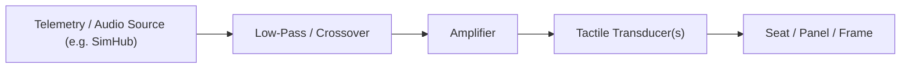

# Kiến trúc Đầu dò Xúc giác

> Phiên bản: 1.0
> Đánh giá: 2026-07-02
> Mục đích: xử lý các đầu dò xúc giác ("bass shakers") như một hệ thống rung động riêng biệt và giải quyết các câu hỏi về cách ly và cộng hưởng được nêu trong [cockpits.md](./cockpits.md) §6. Trả lời một phần của câu hỏi mở rộng trong [sim_racing_research.md](./sim_racing_research.md) §13.

## Nhật ký thay đổi tài liệu

| Phiên bản | Ngày | Thay đổi |
|---|---|---|
| 1.0 | 2026-07-02 | Tài liệu mới. Trực tiếp giải quyết các câu hỏi mở về cách ly và cộng hưởng của đầu dò xúc giác trong [cockpits.md](./cockpits.md) §6 và cổng kiểm tra cách ly trong [tools.md](./tools.md) §5. |

## 1. Mục đích

Đầu dò xúc giác chuyển đổi tín hiệu âm thanh/telemetry thành rung động tần số thấp có thể cảm nhận qua ghế và khung gầm (tiếng động cơ gầm, va chạm lề đường, khóa bánh xe, kết cấu mặt đường). Tài liệu này định nghĩa chúng là một **hệ thống rung riêng biệt** không được làm hỏng phản hồi lực Direct Drive hoặc các chỉ số cảm biến bàn đạp.

> [!IMPORTANT]
> Ràng buộc hướng dẫn từ [cockpits.md](./cockpits.md): các đầu dò xúc giác **phải** được coi là một hệ thống rung động riêng biệt và được cách ly cũng như kiểm tra để chúng không che mờ FFB hoặc chẩn đoán cảm biến.

## 2. Trách nhiệm

- Tái tạo các hiệu ứng tần số thấp từ nguồn telemetry hoặc âm thanh.
- Cung cấp rung động cho người lái mà không truyền năng lượng triệt tiêu vào đường dẫn FFB hoặc cảm biến.
- Cho phép điều chỉnh theo từng hiệu ứng (kênh, dải tần số, mức độ).

## 3. Các loại Đầu dò (Chung)

Theo kiến thức chung **đã được xác minh**, đầu dò xúc giác trải dài từ các bộ kích thích dạng "puck" nhỏ gắn vào ghế hoặc bảng điều khiển, đến các máy lắc (shaker) công suất cao lớn hơn bắt vít vào khung rig. Các đơn vị lớn hơn truyền nhiều năng lượng hơn vào cấu trúc — làm tăng cả cường độ hiệu ứng và nguy cơ gây nhiễu FFB và cảm biến.

## 4. Nguồn tín hiệu và Crossover

**Hình 4-1: Đường dẫn Tín hiệu Xúc giác**

Nguồn tín hiệu thường là quy trình telemetry (xem [telemetry.md](./telemetry.md)) hoặc một kênh âm thanh tần số thấp chuyên dụng. Một bộ phân tần (crossover)/bộ lọc thông thấp **phải** giới hạn năng lượng trong dải tần số thấp dự kiến của đầu dò để nội dung tần số cao hơn không bị truyền vào cấu trúc.

Việc giữ máy lắc trong dải tần số thấp dự kiến (màu xanh lá cây) là điều ngăn chặn năng lượng của nó cộng dồn vào dải chi tiết FFB của vô lăng (màu tím) hoặc kích hoạt cộng hưởng cấu trúc của rig (màu đỏ). Các tần số cộng hưởng chính xác mang tính đặc thù của rig và phải được đo lường thay vì giả định — xem §6.

## 5. Cách ly Cơ học (Trả lời cockpits.md §6)

Câu hỏi mở trong [cockpits.md](./cockpits.md) §6 hỏi làm thế nào các đầu dò nên được cách ly khỏi các cấu hình cấu trúc chính để tránh nhiễu triệt tiêu với FFB tần số cao của DD. Theo **suy luận kỹ thuật** phù hợp với hướng dẫn của tài liệu đó:

- Các đầu dò **nên** được gắn vào ghế hoặc một bảng điều khiển chuyên dụng thay vì gắn cứng vào đường dẫn tải trọng chính của FFB nếu có thể, để năng lượng của chúng không cộng hưởng với mô-men xoắn FFB tại vô lăng.
- Khi một đầu dò phải gắn vào khung, các giá đỡ cách ly/có độ đàn hồi **nên** được sử dụng để tách rời rung động của nó khỏi các cấu hình cấu trúc.
- Hệ thống xúc giác **nên** được vận hành và đo lường độc lập (xem §7) trước khi chạy cùng với FFB mô-men xoắn cao.

## 6. Tương tác Cộng hưởng (Trả lời cockpits.md §6)

Câu hỏi mở thứ hai đặt ra là liệu các cấu trúc nhôm 40x80 mm tiêu chuẩn có tần số cộng hưởng trùng khớp với các tần số tín hiệu FFB phổ biến hay không, và làm thế nào để giảm xóc chúng. Cơ sở nghiên cứu này không khẳng định các tần số cộng hưởng cụ thể cho một rig nhất định — điều đó là **Chưa rõ** nếu không đo đạc trên cấu trúc thực tế. Phương pháp chính xác:

- Đo đạc phản hồi cấu trúc của rig (ví dụ: bằng gia tốc kế và một kích thích quét) để xác định vị trí các điểm cộng hưởng, theo kiểm tra cách ly xúc giác/cộng hưởng trong [tools.md](./tools.md) §5.
- Tránh truyền năng lượng của đầu dò vào một dải trùng với cộng hưởng cấu trúc hoặc một dải hiệu ứng FFB chủ đạo.
- Thêm giảm xóc (trọng lượng, thanh giằng hoặc giá đỡ cách ly) ở những nơi cộng hưởng chồng chéo lên dải hoạt động.

## 7. Gỡ lỗi và Vận hành

Hãy vận hành thử riêng hệ thống xúc giác trước: quét tần số và mức độ, đồng thời xác nhận bằng gia tốc kế rằng năng lượng vẫn nằm trong dải và không kích hoạt cộng hưởng cấu trúc. Sau đó bật FFB và xác nhận các đầu dò không làm mờ chi tiết FFB hoặc làm nhiễu dữ liệu cảm biến bàn đạp. Xử lý bất kỳ thay đổi nào trong việc hiệu chuẩn bàn đạp hoặc mức nhiễu FFB khi các máy lắc hoạt động như một vấn đề ghép nối cần được khắc phục về mặt cơ học.

## 8. Quan điểm Firmware

Đầu ra xúc giác thường được điều khiển bởi phần mềm máy chủ (host software) kết hợp với bộ khuếch đại, do đó sự can thiệp của firmware thiết bị là tối thiểu; khi sử dụng bộ điều khiển, nó **phải** giữ các hiệu ứng trong dải đã cấu hình và **phải** có trạng thái im lặng (quiet state) được định nghĩa sẵn khi mất nguồn tín hiệu (xem [telemetry.md](./telemetry.md) §9).

## 9. Key Takeaways

- Đầu dò xúc giác là một hệ thống rung riêng biệt, không thuộc đường dẫn FFB.
- Cách ly chúng (gắn ở ghế/bảng điều khiển, ngàm có độ đàn hồi) để chúng không cộng dồn vào FFB hoặc làm phiền cảm biến.
- Các điểm cộng hưởng cấu trúc mang tính đặc thù của rig và là **Chưa rõ** cho đến khi được đo lường; hãy tìm ra chúng, sau đó giữ năng lượng ra khỏi dải đó.
- Vận hành thử hệ thống xúc giác một cách độc lập, sau đó xác minh không có sự can thiệp vào FFB và bàn đạp.

## Tài liệu tham khảo

- [cockpits.md](./cockpits.md) — cấu trúc và các câu hỏi gốc về cách ly/cộng hưởng.
- [telemetry.md](./telemetry.md) — nguồn telemetry/âm thanh và hành vi an toàn-im lặng.
- [tools.md](./tools.md) — kiểm tra cách ly cộng hưởng/đầu dò xúc giác.

## Câu hỏi mở để Nhà phát triển Tự điều tra

Đánh giá ngày 2026-07-05. Mục này mang tính đặc thù của rig và không thể được trả lời chung chung — nó yêu cầu đo lường trên cấu trúc thực tế.

- **Các tần số cộng hưởng đo được của cấu trúc rig mục tiêu là gì, và các dải hiệu ứng nào cần phải tránh hoặc giảm xóc?**
  *Cách điều tra:* Gắn một gia tốc kế vào cấu trúc và kích thích nó bằng tín hiệu quét dạng sin (swept-sine) thông qua một đầu dò (hoặc bằng thử nghiệm va đập); các đỉnh phản hồi chính là các điểm cộng hưởng. Tham chiếu chéo các tần số đó với các dải hiệu ứng FFB chủ đạo và dải hoạt động của đầu dò, sau đó giữ năng lượng ra khỏi bất kỳ phần chồng chéo nào (điều chỉnh phân tần) và thêm giảm xóc — trọng lượng, thanh giằng, hoặc giá đỡ cách ly — ở những nơi không thể tránh khỏi chồng chéo. Ghi chép lại cấu hình của rig (kích thước khung, thanh giằng, khối lượng được gắn vào, lực siết ốc) cùng với các kết quả, vì cộng hưởng sẽ thay đổi khi bất kỳ yếu tố nào trong số này thay đổi. Xem [`tools.md`](./tools.md) §5 về kiểm tra cách ly/cộng hưởng.
