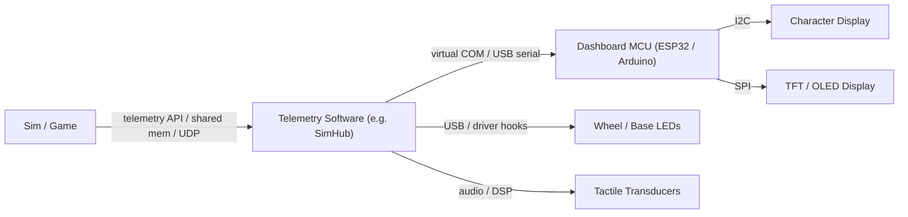

# Kiến trúc Phần mềm Telemetry

> Phiên bản: 1.0
> Đánh giá: 2026-07-02
> Mục đích: mô tả quy trình game-telemetry (game -> bridge -> device) như một hệ thống con hạng nhất, tổng hợp lại các tài liệu trước đây bị phân tán trong [accessories.md](./accessories.md) và [tools.md](./tools.md). Điều này trả lời một trong các câu hỏi mở rộng được nêu trong [sim_racing_research.md](./sim_racing_research.md) §13.

## Nhật ký thay đổi tài liệu

| Phiên bản | Ngày | Thay đổi |
|---|---|---|
| 1.0 | 2026-07-02 | Tài liệu mới. Tổng hợp các tài liệu về dashboard/SimHub từ [accessories.md](./accessories.md) §2 và vai trò telemetry-bridge của `hid-fanatecff-tools` từ [repos.md](./repos.md); bổ sung cuộc thảo luận về ngân sách độ trễ cho câu hỏi mở trong accessories.md §4. |

## 1. Mục đích

Phần mềm telemetry trích xuất dữ liệu thời gian thực từ một mô phỏng đua xe (tốc độ, RPM, bánh răng, trạng thái lốp, cờ) và gửi nó đến các thiết bị đầu ra: dashboards, dải LED, màn hình button-box, và đầu dò xúc giác. Nó là cầu nối giữa máy chủ (host) game và các thiết bị ngoại vi nhúng trong hệ sinh thái này.

> [!NOTE]
> Trọng tâm là *kiến trúc* của quy trình. SimHub được coi là một ví dụ **triển khai cộng đồng** (được xác minh dựa trên README thượng nguồn của nó), không phải là một đặc tả độc quyền.

## 2. Trách nhiệm

- Thu thập telemetry từ game (native telemetry API, shared memory, hoặc UDP feed).
- Ánh xạ các trường telemetry vào hiệu ứng thiết bị (trường hiển thị, các mẫu LED, kênh shaker).
- Mã hóa và truyền tới các thiết bị qua phương thức vận chuyển (transport) đã chọn.
- Duy trì một watchdog liên kết để khi luồng cấp dữ liệu bị đình trệ sẽ không để lại các đầu ra cũ (stale) hoặc không an toàn.

## 3. Kiến trúc Quy trình

**Hình 3-1: Quy trình Telemetry**

Điều này phản ánh kiến trúc dashboard đã được ghi nhận trong [accessories.md](./accessories.md) §2: host truyền các chuỗi telemetry đã mã hóa qua một cổng serial ảo (virtual serial port), và firmware của dashboard phân tích chúng để cập nhật các bộ đệm hiển thị (display buffers).

## 4. Nguồn dữ liệu

| Loại nguồn | Mô tả | Chú ý |
|---|---|---|
| Native telemetry API | Game bộc lộ một đầu ra telemetry đã được ghi nhận | Tập trường và tốc độ mang tính đặc thù của game. |
| Shared memory | Game xuất bản một cấu trúc bộ nhớ được ánh xạ | Bố cục cấu trúc có thể thay đổi giữa các phiên bản game. |
| UDP feed | Game phát sóng (broadcasts) các gói telemetry | Yêu cầu cấu hình mạng; có nguy cơ mất gói (loss). |

Phần mềm telemetry **phải** coi mọi nguồn dữ liệu là phụ thuộc vào phiên bản game và **nên** xuống cấp duyên dáng (degrade gracefully) khi thiếu một trường.

## 5. Giao diện Giao tiếp

- Host-to-dashboard: host **phải** truyền telemetry đã mã hóa qua một cổng serial ảo (USB CDC); firmware của thiết bị **phải** phân tích và cập nhật bộ đệm hiển thị, theo [accessories.md](./accessories.md) §2.2.
- Các màn hình ký tự (Character displays) qua I2C; TFT/OLED qua SPI. Hệ thống **nên** giảm thiểu việc kết nối nối tiếp (daisy-chaining) I2C để tránh bão hòa bus (bus saturation) ở tốc độ làm mới cao.
- Đầu ra LED/hiển thị trên các vô lăng và trục (base) Fanatec cũng có thể được điều khiển qua công cụ driver của cộng đồng; `hid-fanatecff-tools` được ghi nhận như một telemetry bridge cho LED, màn hình, và điều chỉnh (xem [repos.md](./repos.md)).

## 6. Ngân sách Độ trễ

Điều này giải quyết câu hỏi mở trong [accessories.md](./accessories.md) §4 (middleware so với native latency). Độ trễ từ đầu đến cuối là tổng của: khoảng thời gian game xuất bản (publish), việc thu thập và ánh xạ của host, phương thức truyền (serial/USB), và việc hiển thị của thiết bị. Theo **suy luận kỹ thuật**, một dashboard phản hồi tốt sẽ phân bổ thời gian (budgets) cho từng giai đoạn sao cho tổng độ trễ luôn nằm dưới một khung hình game ở tốc độ mục tiêu; các hiệu ứng xúc giác và LED nhạy cảm với độ trễ hơn các trường dạng số và **nên** được ưu tiên trong quá trình ánh xạ và truyền dẫn.

Bởi vì các giai đoạn được cộng dồn, điều hữu ích là đo lường riêng từng giai đoạn chứ không chỉ đo tổng độ trễ từ đầu đến cuối — đó là cách để tác nhân đóng góp chính trở nên rõ ràng và có thể sửa chữa được. Các tỷ lệ phần trăm ở trên chỉ mang tính minh họa.

> [!TIP]
> Hãy đo lường độc lập từng giai đoạn (host timestamp, truyền dẫn, thiết bị hiển thị) thay vì chỉ đo tổng số đầu đến cuối, để tác nhân đóng góp chính lộ diện.

## 7. Các Mô-đun Firmware

Firmware phía thiết bị trong quy trình này **phải** cung cấp: một trình phân tích serial (serial parser) có kiểm tra độ dài và khung (framing); một bộ đệm hiển thị/hiệu ứng; một watchdog liên kết có thể xóa hoặc đóng băng đầu ra một cách an toàn khi mất luồng tín hiệu; và một lớp ánh xạ được điều khiển bằng dữ liệu (data-driven) ở bất cứ nơi nào có thể để các trường telemetry mới không yêu cầu phải flash lại (reflashing).

## 8. Chiến lược Gỡ lỗi

Bắt (capture) luồng serial trên bàn thử nghiệm (dùng logic analyzer hoặc loopback trên host), xác nhận khung (framing) trong điều kiện mất gói, và kiểm chứng hành vi của watchdog bằng cách cắt luồng dữ liệu giữa phiên. Đối với các bridge của LED/màn hình, xác nhận không có bão hòa bus dưới tốc độ làm mới tối đa.

## 9. Quan điểm Firmware

Thiết bị là một *điểm nhận* (sink) telemetry: nó không nắm quyền kết nối game và **không được** giả định rằng luồng cấp dữ liệu luôn có mặt hoặc được định dạng chuẩn. Mọi đầu ra liên quan đến an toàn (ví dụ: trạng thái cờ hoặc đèn báo chuyển số) **phải** có một giá trị an toàn được định nghĩa sẵn khi telemetry đã cũ (stale).

## 10. Key Takeaways

- Phần mềm telemetry là một hệ thống con khác biệt làm cầu nối giữa game host và các đầu ra nhúng.
- Quy trình dashboard (SimHub -> virtual COM -> MCU -> hiển thị I2C/SPI) đã trở thành tiêu chuẩn trong hệ sinh thái.
- Độ trễ mang tính cộng dồn theo từng giai đoạn; hãy đo lường từng giai đoạn và ưu tiên các hiệu ứng nhạy cảm với độ trễ.
- Hãy coi mọi luồng dữ liệu là không đáng tin cậy và phụ thuộc phiên bản; ngắt an toàn (fail safe) khi mất dữ liệu.

## Tài liệu tham khảo

- [SimHub](https://github.com/SHWotever/SimHub) — dashboard telemetry, màn hình Arduino, LED, button boxes, và các thiết bị serial tùy chỉnh.
- [gotzl/hid-fanatecff-tools](https://github.com/gotzl/hid-fanatecff-tools) — telemetry bridge cho LED, màn hình, và điều chỉnh Fanatec.
- [accessories.md](./accessories.md) — kiến trúc dashboard và hiển thị telemetry.
- [tactile.md](./tactile.md) — đầu ra đầu dò xúc giác được điều khiển từ telemetry.

## Câu hỏi mở để Nhà phát triển Tự điều tra

Đánh giá ngày 2026-07-05. Mục này phụ thuộc vào đo lường — các con số thay đổi tùy theo phương thức truyền, tải của host, và thiết bị, vì vậy nó phải được đo trên mục tiêu thay vì tìm kiếm thông tin có sẵn.

- **Các số liệu độ trễ từng giai đoạn nào có thể đạt được với mỗi phương thức truyền phổ biến, khi được đo trên phần cứng mục tiêu?**
  *Cách điều tra:* đo đạc riêng biệt ba giai đoạn — (1) thu thập/ánh xạ của host (dấu thời gian khi nhận telemetry so với khi mã hóa), (2) truyền dẫn (host gửi so với thiết bị nhận, ví dụ: USB CDC/virtual COM so với USB HID so với network), và (3) thiết bị hiển thị (phân tích so với cập nhật hiển thị/hiệu ứng). Sử dụng một logic analyzer hoặc loopback phía host cộng với một dấu thời gian phía thiết bị. So sánh serial virtual-COM, USB HID, và bất kỳ truyền dẫn mạng (network transport) nào dưới các tốc độ làm mới thực tế và tải của host. Báo cáo theo từng giai đoạn để tác nhân đóng góp độ trễ lớn nhất có thể nhìn thấy (xem §6). Như một mốc định hướng độ lớn: hãy giữ tổng độ trễ telemetry thấp hơn một khung hình game ở tốc độ mục tiêu, và ưu tiên các hiệu ứng nhạy cảm với độ trễ (xúc giác, LED) hơn là các trường dạng số.
