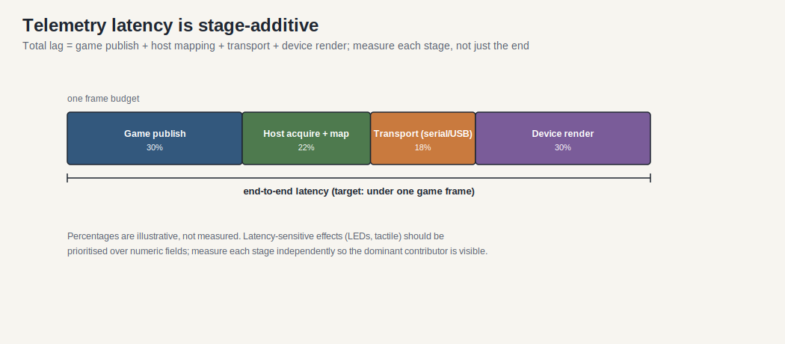

# Kiến trúc phần mềm từ xa

> Phiên bản: 1.0
> Đánh giá: 2026-07-02
> Mục đích: mô tả đường ống dẫn trò chơi từ xa (trò chơi -> cầu -> thiết bị) như một hệ thống con hạng nhất, hợp nhất vật liệu trước đây được chia thành accessories.md và tools.md. Điều này trả lời một trong những câu hỏi mở rộng được nêu trong [sim_racing_research.md](./sim_racing_research.md) §13.

## Nhật ký thay đổi tài liệu

| Phiên bản | Ngày | Thay đổi |
|---|---|---|
| 1.0 | 2026-07-02 | Tài liệu mới. Hợp nhất tài liệu bảng điều khiển / SimHub từ [accessories.md](./accessories.md) §2 và vai trò cầu nối từ xa của `hid-fanatecff-tools` từ [repos.md](./repos.md); thêm một cuộc thảo luận về ngân sách độ trễ cho câu hỏi mở trong accessories.md §4. |

## 1. Mục đích

Phần mềm đo từ xa trích xuất dữ liệu thời gian thực từ mô phỏng đua xe (tốc độ, RPM, bánh răng, trạng thái lốp, cờ) và gửi nó đến các thiết bị đầu ra: bảng điều khiển, dải LED, hiển thị hộp nút và đầu dò xúc giác. Nó là cầu nối giữa máy chủ trò chơi và các thiết bị ngoại vi được nhúng trong hệ sinh thái này.

> [! Chú ý]
> Tập trung vào * kiến trúc * của đường ống. SimHub được coi là ** thực hiện cộng đồng ** ví dụ (được xác minh chống lại README ngược dòng của nó), không phải là một đặc điểm kỹ thuật độc quyền.

## 2. Trách nhiệm

- Có được từ xa từ trò chơi (API từ xa bản địa, bộ nhớ dùng chung hoặc nguồn cấp dữ liệu UDP).
- Lập bản đồ từ xa trường để hiệu ứng thiết bị (trường hiển thị, mô hình LED, kênh shaker).
- Mã hóa và truyền đến các thiết bị qua phương tiện vận chuyển đã chọn.
- Duy trì một liên kết watchdog để một thức ăn bị đình trệ không để lại đầu ra cũ hoặc không an toàn.

## 3. Kiến trúc đường ống

**Hình 3-1: Đường ống Telemetry **

```nàng tiên cá
Lưu đồ LR
Trò chơi ["Sim / Game"] -->|"API từ xa / chia sẻ mem / UDP"| Máy chủ ["Phần mềm từ xa (ví dụ SimHub)"]
Máy chủ -->|"Virtual COM / USB serial"| Dash["Dashboard MCU (ESP32 / Arduino)"]
Máy chủ -->|"Móc USB / trình điều khiển"| Đèn LED["Đèn LED bánh xe / đế"]
Máy chủ -->|"audio / DSP"| Tactile["Tactile Transducers"]
Dash -->|"I2C"| Char["Hiển thị ký tự"]
Dash -->|"SPI"| TFT["Màn hình TFT / OLED"]
```

Điều này phản ánh kiến trúc bảng điều khiển đã được ghi lại trong [accessories.md](./accessories.md) §2: máy chủ truyền các chuỗi từ xa được mã hóa qua cổng nối tiếp ảo và phần mềm bảng điều khiển phân tích cú pháp chúng để cập nhật bộ đệm hiển thị.

## 4. Nguồn dữ liệu

| Kiểu nguồn | Mô tả | Chú ý |
|---|---|---|
| Native telemetry API | Game hiển thị một đầu ra từ xa được ghi lại | Field set và rate là game cụ thể. |
| Bộ nhớ chia sẻ | Game xuất bản cấu trúc ánh xạ bộ nhớ | Bố cục cấu trúc có thể thay đổi giữa các phiên bản game. |
| UDP feed | Game broadcasts telemetry packets | Yêu cầu cấu hình mạng; có thể bị mất. |

Phần mềm đo từ xa ** sẽ ** coi mọi nguồn là phụ thuộc vào phiên bản trò chơi và ** nên ** xuống cấp một cách duyên dáng khi không có trường.

## 5. Giao diện truyền thông

- Host-to-dashboard: máy chủ ** sẽ ** truyền từ xa được mã hóa qua cổng nối tiếp ảo (USB CDC); firmware thiết bị ** sẽ ** phân tích cú pháp và cập nhật bộ đệm hiển thị, mỗi [accessories.md] (./accessories.md) §2.2.
- Ký tự hiển thị trên I2C; TFT / OLED trên SPI. Hệ thống ** nên ** giảm thiểu xích I2C để tránh bão hòa bus ở tốc độ làm mới cao.
- Đầu ra LED / hiển thị trên các cơ sở và vành Fanatec cũng có thể được điều khiển thông qua công cụ trình điều khiển cộng đồng; `hid-fanatecff-tools` được ghi lại dưới dạng cầu từ xa cho đèn LED, màn hình và điều chỉnh (xem [repos.md] (./repos.md)).

## 6. Ngân sách trễ

Điều này giải quyết câu hỏi mở trong [accessories.md] (./accessories.md) §4 (middleware vs native latency). Độ trễ từ đầu đến cuối là tổng của: khoảng thời gian xuất bản trò chơi, mua lại và lập bản đồ máy chủ, vận chuyển (serial / USB) và kết xuất thiết bị. Vì ** suy luận kỹ thuật **, bảng điều khiển đáp ứng ngân sách cho từng giai đoạn để tổng độ trễ nằm dưới một khung trò chơi ở tốc độ mục tiêu; hiệu ứng xúc giác và LED nhạy cảm hơn so với các trường số và ** nên ** được ưu tiên trong việc lập bản đồ và vận chuyển.



Bởi vì các giai đoạn cộng lại, điều hữu ích để đo lường là mỗi giai đoạn riêng của mình, không chỉ là con số end-to-end - đó là cách đóng góp chi phối trở nên rõ ràng và có thể sửa chữa. Các tỷ lệ phần trăm trên chỉ mang tính minh họa.

> [!TIP]
> Đo lường từng giai đoạn một cách độc lập (dấu thời gian máy chủ, vận chuyển, hiển thị thiết bị) thay vì chỉ con số đầu cuối, do đó, người đóng góp chi phối có thể nhìn thấy.

## 7. Mô-đun firmware

Firmware phía thiết bị trong đường ống này ** sẽ ** cung cấp: bộ phân tích cú pháp nối tiếp với kiểm tra khung và độ dài; bộ đệm hiển thị / hiệu ứng; cơ quan giám sát liên kết làm trống hoặc đóng băng đầu ra một cách an toàn khi mất nguồn cấp dữ liệu; và một lớp ánh xạ được điều khiển bằng dữ liệu nếu có thể để các trường đo từ xa mới không yêu cầu reflashing.

## 8. Chiến lược gỡ lỗi

Chụp luồng nối tiếp trên băng ghế dự bị (máy phân tích logic hoặc vòng lặp máy chủ), xác nhận khung hình dưới mất gói tin và xác minh hành vi của cơ quan giám sát bằng cách cắt nguồn cấp dữ liệu giữa phiên. Đối với cầu LED / hiển thị, xác nhận không có bão hòa bus dưới làm mới tối đa.

## 9. Quan điểm Firmware

Thiết bị là từ xa * chìm *: nó không sở hữu kết nối trò chơi và ** sẽ không ** giả định nguồn cấp dữ liệu có mặt hoặc được hình thành tốt. Tất cả các đầu ra liên quan đến an toàn (ví dụ: trạng thái cờ hoặc ánh sáng thay đổi) ** sẽ ** có giá trị an toàn được xác định khi từ xa bị lỗi.

## 10. Key Takeaways

- Phần mềm đo từ xa là một hệ thống con khác biệt bắc cầu máy chủ trò chơi và đầu ra nhúng.
- Đường ống bảng điều khiển (SimHub -> COM ảo -> MCU -> hiển thị I2C / SPI) đã là tiêu chuẩn hệ sinh thái.
- Độ trễ là giai đoạn bổ sung; đo theo từng giai đoạn và ưu tiên các hiệu ứng nhạy cảm với độ trễ.
- Xử lý mọi nguồn cấp dữ liệu không đáng tin cậy và phụ thuộc phiên bản; không an toàn khi mất.

## Tài liệu tham khảo

- [SimHub] (https://github.com/SHWotever/SimHub) - bảng điều khiển từ xa, màn hình Arduino, đèn LED, hộp nút và thiết bị nối tiếp tùy chỉnh.
- [gotzl/hid-fanatecff-tools] (https://github.com/gotzl/hid-fanatecff-tools) - Cầu đo từ xa cho đèn LED Fanatec, màn hình và điều chỉnh.
- [accessories.md](./accessories.md) - bảng điều khiển và kiến trúc hiển thị từ xa.
- [tactile.md] (./tactile.md) - đầu ra đầu dò xúc giác được điều khiển từ xa.

## Câu hỏi chưa được giải quyết

- Những con số độ trễ trên mỗi giai đoạn có thể đạt được với mỗi giao thông chung, được đo trên phần cứng mục tiêu?
