# Kiến trúc Phần cứng và Phần mềm của Wheel Base

> Phiên bản: 1.1
> Ngày nghiên cứu: 2026-07-01  
> Đối tượng: Fresher/junior trong lĩnh vực sim racing, mid level về hệ thống nhúng (embedded system).  
> Phạm vi: wheel base truyền động trực tiếp (direct-drive) hiện đại. Cấu tạo bên trong rim: [wheel_rim.md](./wheel_rim.md).  
> Bằng chứng: các tiêu chuẩn công khai, hướng dẫn/hỗ trợ từ nhà sản xuất, dự án mã nguồn mở công khai, và [wheel_rim.md](./wheel_rim.md). Không có kỹ thuật dịch ngược firmware (reverse engineering) độc quyền.

## Nhật ký Thay đổi Tài liệu

| Phiên bản | Ngày | Mô tả |
|---|---|---|
| 1.0 | 2026-07-01 | Tài liệu nghiên cứu ban đầu. |
| 1.1 | 2026-07-01 | Sắp xếp lại các phần (Cơ bản đến Nâng cao), bắt buộc sử dụng ngôn ngữ tiêu chuẩn, thay thế mã giả bằng bảng giao diện, thêm chú thích cho hình ảnh và chèn các đoạn giới thiệu. |

## 1. Tóm tắt Thực thi

Phần này cung cấp một cái nhìn tổng quan cấp cao về vai trò của wheel base trong hệ sinh thái sim racing. Nó thiết lập các mô hình cốt lõi về kiến trúc và an toàn.

Wheel base là trung tâm an toàn then chốt của hệ sinh thái. Nó đồng thời là một thiết bị USB human-interface, ổ đĩa servo thời gian thực, và hub ngoại vi. Nó báo cáo thông tin về trục lái và các điều khiển, tiếp nhận các hiệu ứng force-feedback, chuyển đổi yêu cầu mô-men xoắn (torque) giới hạn thành dòng điện pha của động cơ / PWM, và tổng hợp dữ liệu từ rim, bàn đạp (pedals), cần số (shifter), và phanh tay (handbrake).

Kiến trúc nên sử dụng một MCU chính cho USB, FFB, profile, thiết bị ngoại vi, cập nhật, và chính sách hệ thống, cùng với một MCU động cơ riêng biệt hoặc ASIC điều khiển cho việc thu thập encoder/dòng điện và biến tần (inverter) PWM. Một torque arbiter sẽ hoạt động như cầu nối phần mềm duy nhất giữa các miền này. Các đường dẫn phần cứng về quá dòng (overcurrent), lỗi cổng (gate fault), E-stop, watchdog, và ngắt timer (timer-break) sẽ đóng vai trò quyết định nếu phần mềm gặp sự cố.

Base sẽ phải rơi vào trạng thái ngắt mô-men xoắn (torque-off) nếu có lỗi. Hệ thống sẽ duy trì trạng thái không được cấp điện trong quá trình reset, thực thi bootloader, cập nhật, liệt kê (enumeration) USB, phát hiện rim không tương thích, phản hồi từ encoder/dòng điện không hợp lệ, tình trạng lệnh mô-men xoắn cũ (stale), sụt áp (brownout), và phục hồi watchdog. Việc bật mô-men xoắn cao sẽ yêu cầu các bản image đã được xác minh, vượt qua quá trình tự kiểm tra (self-test) thành công, các cảm biến đã hiệu chỉnh, power stage khỏe mạnh, một chính sách phần mềm rõ ràng và không có các lỗi latched faults.

## 2. Phạm vi và Bằng chứng

Phần này xác định các ranh giới của bài phân tích và làm rõ mức độ tin cậy của thông tin được trình bày. Điều này cần thiết để hiểu bối cảnh của các tuyên bố được đưa ra.

| Nhãn | Ý nghĩa |
|---|---|
| Hành vi công khai đã được xác minh | Được hỗ trợ bởi một tiêu chuẩn công khai, sách hướng dẫn hoặc tài liệu dự án |
| Pattern ngành | Kiến trúc phổ biến, không phải là quy luật chung |
| Reference design | Cấu trúc dự án được khuyến nghị, không phải là tuyên bố nội bộ của nhà cung cấp |
| Unknown | Cần bản vẽ mạch (schematics) của khách hàng, BOM, mã nguồn, descriptors hoặc tài liệu yêu cầu |

Các mục bao gồm: điện tử của base, vi xử lý, inverter, cảm biến, USB, thiết bị ngoại vi, firmware, timing, an toàn, cập nhật, chẩn đoán, và xác minh. Các mục không bao gồm: các định dạng độc quyền, firmware được trích xuất, bypass xác thực console, phương trình điều khiển/gains chi tiết, và cấu tạo bên trong rim.

`repos.md` là tài nguyên đầu vào để khám phá, không phải là tiêu chuẩn kỹ thuật. Các dự án cộng đồng Fanatec cung cấp quan sát thực tế, không phải thông số kỹ thuật chính thức.

## 3. Bối cảnh Hệ thống

Phần này minh họa cách wheel base tương tác với các tác nhân bên ngoài, bao gồm PC/console host, thiết bị ngoại vi của người dùng và nguồn cấp điện.

**Hình 3-1: Sơ đồ Bối cảnh Hệ thống**

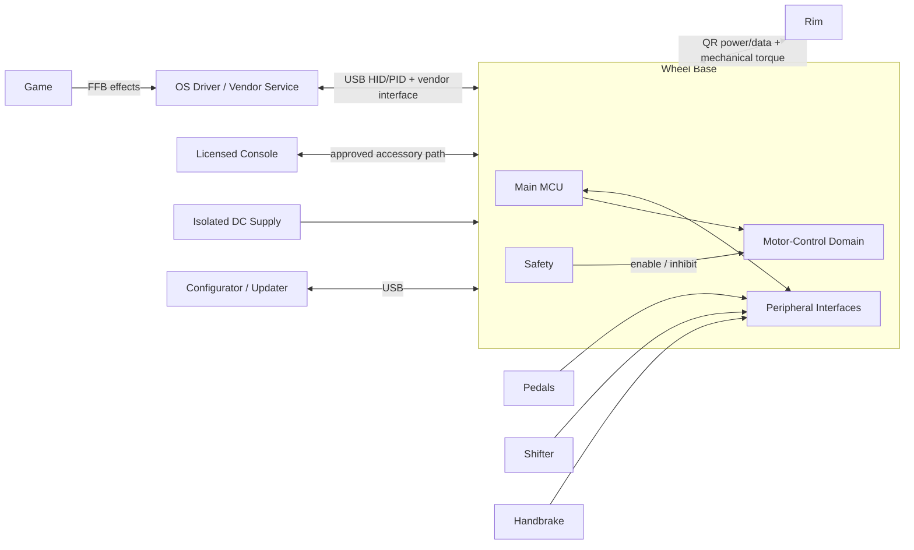

| Trách nhiệm | Base | Rim | Host |
|---|---|---|---|
| Góc trục quay (Shaft angle) | Chính | Không | Tiêu thụ |
| Dòng điện động cơ/mô-men xoắn | Chính | Không | Yêu cầu hiệu ứng |
| Ức chế mô-men xoắn bằng phần cứng | Chính | Không | Không |
| Điều khiển Rim | Tổng hợp | Quét | Tiêu thụ |
| Đèn LED/màn hình | Định tuyến | Điều khiển (Drives) | Tạo giá trị |
| Liệt kê/cập nhật USB | Chính | Thường gián tiếp | Điều khiển bus/tool |

### 3.1 Ranh giới Hệ sinh thái Fanatec Công khai

Hệ sinh thái công khai của Fanatec thể hiện mô hình base-as-hub (base đóng vai trò là trung tâm) nhưng không công bố cấu trúc liên kết nội bộ. Các sản phẩm hiện nay sử dụng chủ yếu các phân khúc CSL, ClubSport và Podium. Tên phân khúc là ngữ cảnh thương mại/sản phẩm; khả năng tương thích firmware vẫn phụ thuộc vào mẫu cụ thể, thế hệ, QR, cổng ngoại vi và phiên bản phần mềm.

Đối với hệ thống console, việc cấp phép nền tảng và kết nối thiết bị ngoại vi là các mối quan tâm riêng biệt:

| Mối quan tâm | Quy tắc Công khai Fanatec |
|---|---|
| Khả năng tương thích Xbox | Phụ thuộc vào vô lăng hoặc hub được cấp phép Xbox. |
| Khả năng tương thích PlayStation | Phụ thuộc vào wheel base được cấp phép PlayStation. |
| Bàn đạp/shifter/phanh tay cho Console | Kết nối thông qua wheel base tương thích. |
| Thiết bị ngoại vi độc lập PC | Sản phẩm được hỗ trợ có thể kết nối riêng bằng USB hoặc qua ClubSport USB Adapter. |

Đây là những sự thật ở cấp độ sản phẩm. Chúng không thiết lập một giao thức rim công khai, thuật toán xác thực, USB descriptor, hay phân vùng điều khiển động cơ.

## 4. Kiến trúc Phần cứng

Phần này trình bày chi tiết về các thành phần điện tử vật lý và các miền bên trong wheel base. Để hiểu rõ về các ranh giới này, cần phải làm quen với thiết kế PCB mixed-signal và điện tử công suất.

**Hình 4-1: Sơ đồ Khối Kiến trúc Phần cứng**

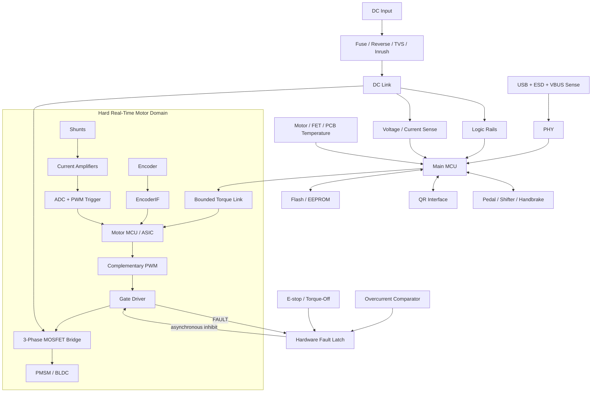

| Miền (Domain) | Nội dung | Mục tiêu Thiết kế |
|---|---|---|
| Logic | Main MCU, USB, NVM, accessory transceivers | Bảo vệ USB/logic khỏi nhiễu chuyển mạch |
| Điều khiển động cơ | Motor MCU/ASIC, encoder receiver, ADC path | Đường phản hồi ngắn, có tính xác định (Deterministic) |
| Giai đoạn công suất | Gate driver, MOSFET bridge, shunts, DC link | Điện cảm thấp, làm mát, khống chế sự cố |
| Đầu vào nguồn | Bảo vệ, dòng khởi động (inrush), rails, chiến lược regen | Khống chế nguồn/lỗi thoáng qua |
| Đầu nối | USB, QR, phụ kiện, E-stop | Cách ly ESD/lỗi cáp |

## 5. Nguồn điện và Điều khiển Động cơ

Phần này giải thích các điện tử công suất cần thiết để chuyển đổi nguồn DC đầu vào thành dòng điện xoay chiều 3 pha (three-phase) nhằm điều khiển động cơ servo.

**Hình 5-1: Luồng Nguồn và Điều khiển Động cơ**

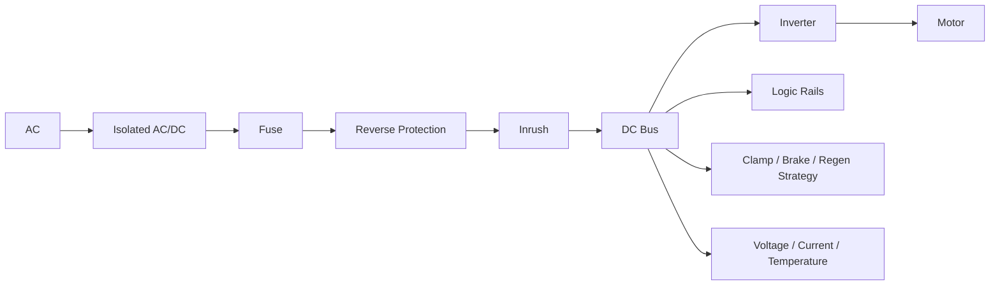

| Khối | Trách nhiệm Phần cứng | Trách nhiệm Firmware |
|---|---|---|
| PSU | Cấp DC định mức cách ly | Phát hiện dải điện áp; không được giả định khả năng hấp thụ regen |
| Bảo vệ đầu vào | Fuse/eFuse, reverse, TVS, inrush | Xác định trình tự/báo cáo các lỗi có thể điều khiển |
| Bus DC (DC link) | Năng lượng xung | Theo dõi điện áp và biên độ regen |
| Gate driver | Drive, UVLO, faults | Cấu hình; chỉ bật sau khi kiểm tra xong |
| Inverter | Chuyển mạch từ DC sang 3 pha | Chỉ nhận PWM từ miền động cơ |
| Shunts/CSA | Phản hồi dòng điện | Offset/gain/saturation/plausibility |
| Phần cứng Regen | Xử lý năng lượng trả về | Phối hợp giảm mô-men xoắn/kẹp (clamp) |
| Rails | Cấp nguồn MCU/cảm biến/phụ kiện | Power-good/trình tự reset |

Chuyển động nhanh của người dùng có thể tạo ra năng lượng tái tạo (regen) trả về bus DC. Firmware sẽ phải tính toán mức năng lượng này để giới hạn mức hấp thụ của nguồn, phối hợp các kẹp/điện trở phanh (brake resistor) và quản lý giới hạn điện áp. 
Để tạo tín hiệu PWM, vi điều khiển sẽ sử dụng các đầu ra timer bù trừ (complementary timer outputs). Phần cứng sẽ bắt buộc áp dụng thời gian chết (dead time). Trình kích hoạt ADC (ADC trigger) sẽ được đồng bộ hóa với chu kỳ PWM. Phần cứng sẽ cung cấp một ngõ vào break không đồng bộ để dừng ngay quá trình chuyển mạch. Tín hiệu bật gate driver mặc định sẽ ở trạng thái tắt trong quá trình reset và thực thi bootloader. Firmware sẽ thực hiện mọi cập nhật tham số PWM tại một ranh giới atomic (nguyên tử) duy nhất.

### 5.1 Biến tần tạo ra dòng điện 3 pha như thế nào

Biến tần (inverter) là trái tim công suất của wheel base. Một động cơ PMSM/BLDC không thể điều khiển trực tiếp bằng DC thô; nó cần ba dòng điện pha hình sin, lệch nhau 120°, và tạo ra từ trường quay để rotor theo sau. Biến tần tổng hợp ba pha đó từ bus DC cố định sử dụng sáu MOSFET công suất được bố trí thành ba **nửa cầu** (half-bridges), mỗi cầu một pha.

Mỗi pha sẽ có một switch high-side (nối vào DC+) và một switch low-side (nối vào DC-). Việc bật/tắt nhanh switch bằng PWM sẽ thiết lập điện áp trung bình trên pha đó; thực hiện với đúng timing trên cả ba nhánh sẽ tạo ra từ trường quay. Hai đặc điểm từ sơ đồ trên ứng trực tiếp vào các yêu cầu bắt buộc:

- **Dead-time (Thời gian chết) là bắt buộc.** Hai switch trên một nhánh không bao giờ được bật cùng lúc, nếu không sẽ gây đoản mạch trực tiếp dọc bus DC (gọi là *shoot-through*) và làm hỏng MOSFET. Phần cứng đảm bảo một khoảng thời gian dead-time rất ngắn để cả hai switch đều tắt ở mỗi lần chuyển trạng thái.
- **Low-side shunts phản hồi cho vòng lặp dòng điện.** Các điện trở shunt nhỏ trên các nhánh low-side là phương tiện để đo dòng pha, vốn là phản hồi (feedback) mà vòng lặp dòng điện FOC (FOC current loop, mục §5.2 và §6) cần để kiểm soát mô-men xoắn.

### 5.2 Timing PWM và lấy mẫu dòng điện

Field-Oriented Control (FOC) phụ thuộc vào việc đo dòng pha một cách chính xác, và việc lấy mẫu dòng điện *vào thời điểm nào* quan trọng không kém bản thân mẫu đó. Các cạnh chuyển mạch của MOSFET gây ra nhiễu điện (electrical noise), vì vậy ADC được kích hoạt tại thời điểm yên tĩnh ở giữa khoảng thời gian PWM thay vì nằm gần một cạnh.

Sóng mang hình tam giác được so sánh với lệnh duty của mỗi pha để tạo ra tín hiệu cổng: khi sóng mang thấp hơn lệnh, switch high-side được bật. Lấy mẫu dòng điện tại đỉnh sóng mang (chính giữa thời gian on-time) giúp ghi lại giá trị trung bình sạch nhất, cách xa các xung điện (transients) do chuyển mạch. Đây chính là yêu cầu "valid middle-of-PWM triggers" ở mục §6, và việc zoom vào phần dead-time cho thấy khoảng cách both-off (cả hai cùng tắt) rất nhỏ để ngăn chặn shoot-through ở mọi cạnh.

## 6. Cảm biến

Phần này nêu chi tiết các cơ chế phản hồi được sử dụng để đo vị trí trục quay và dòng điện động cơ, những dữ liệu cực kỳ quan trọng đối với FOC và force feedback.

Bản thân động cơ là một PMSM 3 pha: một stator làm bằng thép từ quấn dây bao quanh một rotor nam châm vĩnh cửu gắn liền với trục lái. Encoder sẽ đọc góc quay rotor/trục cần thiết cho FOC thực hiện chuyển mạch chính xác, và bộ cảm biến dòng điện đọc giá trị dòng pha mà FOC đang điều chỉnh. Hình cắt ngang dưới đây hiển thị sự kết nối giữa các bộ phận này.

| Encoder | Điểm mạnh | Vấn đề quan tâm |
|---|---|---|
| SPI/SSI/BiSS-C tuyệt đối | Có góc ngay khi boot, CRC/status | Timing, receiver, wrap |
| ABZ | Đơn giản/độ trễ thấp | Cần reference/index, bị lỡ xung |
| Sin/Cos | Nội suy (interpolation) tốt | Lỗi offset/gain/phase analog |
| Hall sectors | Commutation thô rất tốt | Không đủ mịn cho các hệ thống lái cao cấp |

**Hình 6-1: Luồng Xử lý Cảm biến**

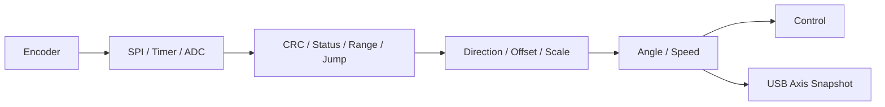

| Tín hiệu | Thu thập | Kiểm tra |
|---|---|---|
| Dòng pha | Shunt/CSA/synchronized ADC | Offset, gain, saturation, tính nhất quán |
| Dòng điện DC | Shunt/Hall ADC | Quá dòng, tính hợp lý của công suất |
| Điện áp DC | Divider/isolation ADC | Brownout, danh định, quá áp regen |
| Nhiệt độ FET/động cơ | NTC/IC/mô hình | Open/short, tốc độ thay đổi, derating |
| Sức khỏe Rails | Supervisor/ADC/GPIO | Power-good và nguyên nhân reset |

Kiến trúc cần hỗ trợ lấy mẫu dòng điện trong mỗi chu kỳ PWM, tận dụng các trigger hợp lệ giữa PWM, và bắt buộc phải thực hiện hiệu chuẩn (calibration) offset khi khởi động. Khung lấy mẫu chính xác phụ thuộc vào topo inverter và phương pháp điều chế (modulation scheme) được chọn.

## 7. Giao diện Bên ngoài

Phần này phân loại các ranh giới vật lý và logic nơi wheel base giao tiếp với các thiết bị ngoại vi phần cứng bên ngoài.

| Giao diện | Thuộc về | Mục đích |
|---|---|---|
| USB FS/HS | Main MCU | Nhập HID/PID FFB, config, chẩn đoán, cập nhật |
| QR/rim link | Main MCU | Định danh, điều khiển, đầu ra LED/màn hình |
| Bàn đạp/shifter/phanh tay | Main MCU | Analog/digital controls (vd. thông qua RJ12, tùy thuộc vào hardware emulation proxying) |
| Motor encoder | Motor MCU | Phản hồi từ rotor/trục |
| Main↔motor | Cả hai | Torque, angle, tình trạng sức khỏe, lỗi |
| SWD/JTAG/UART/service USB | Dịch vụ được kiểm soát | Sản xuất/phục hồi |
| E-stop/torque key | Logic an toàn phần cứng | Cho phép/Ức chế mô-men xoắn |

Các dự án cộng đồng cũ cho biết có sự tồn tại của SPI 3.3 V base-master/rim-slave cho các sản phẩm cũ, đồng thời có ranh giới tương thích mới hơn dành cho các base truyền động trực tiếp hiện đại. Đường truyền rim link cần được thiết kế dưới dạng bộ điều hợp giao thức có thể thay thế (replaceable protocol adapter) thay vì mặc định sử dụng mọi lúc. Nguồn cấp cho các phụ kiện phải được bảo vệ về điện để lỗi rim hoặc đứt cáp không làm chập/tắt nguồn logic điều khiển động cơ chính.

## 8. Phân vùng Vi xử lý

Phần này thảo luận về việc phân chia trách nhiệm máy tính. Việc tách rời giao thức USB khỏi điều khiển động cơ thời gian thực (hard real-time motor control) là một quyết định cốt lõi trong kiến trúc.

| Tùy chọn | Điểm mạnh | Điểm yếu | Trường hợp sử dụng |
|---|---|---|---|
| Single MCU | BOM thấp/cập nhật đơn giản | Cùng chia sẻ timing/miền lỗi | Chỉ dùng khi có tính ổn định cao |
| Main + motor MCU | Tách biệt Timing/lỗi | Yêu cầu IPC (Inter-Processor Communication) phiên bản | Khuyên dùng cho base mô-men xoắn cao |
| Main + control ASIC | Chuyên dụng, deterministic | Hạn chế/bị lock-in bởi nhà cung cấp | Nếu cảm biến/điều khiển đã chứng minh sự phù hợp |
| Main MPU + motor MCU | Mạng/UI phong phú | Khởi động HĐH/phức tạp bảo mật | Sản phẩm cao cấp, có kết nối mạng |

**Hình 8-1: Tương tác Miền Bộ xử lý**

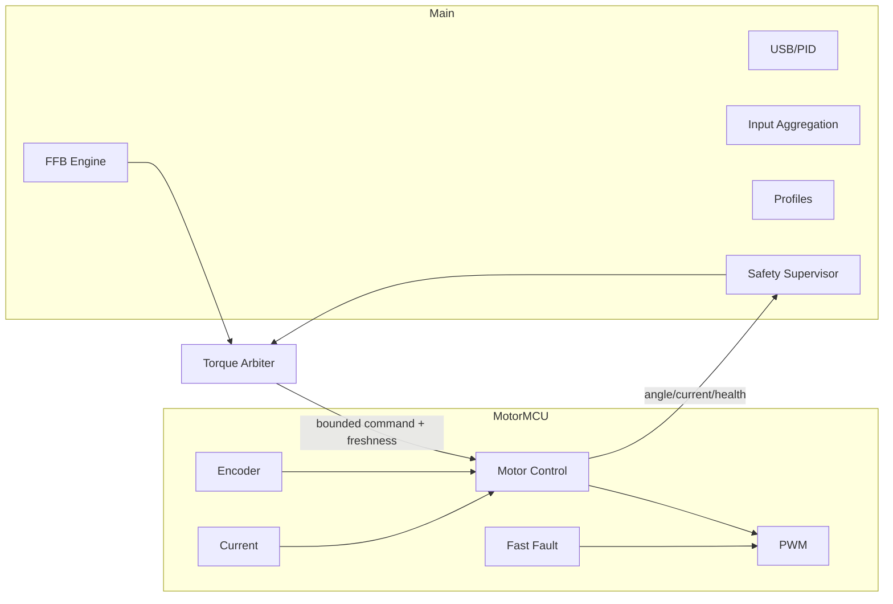

| Dữ liệu | Hướng | Yêu cầu |
|---|---|---|
| Yêu cầu Torque | Main → motor | Đơn vị vật lý, bound (giới hạn), trình tự, dấu thời gian |
| Bật/Giới hạn | Main → motor | Rõ ràng; mặc định bị vô hiệu hóa; motor áp dụng lại giới hạn cục bộ |
| Angle/speed/current | Motor → main | Giá trị, tính hợp lệ, timestamp, ngữ nghĩa wrap |
| Health/fault | Cả hai | Phiên bản, lý do reset, tình trạng deadline và lỗi |
| Heartbeat | Cả hai | Bộ đếm độc lập và phản ứng khi timeout |

Các lệnh (command) cũ từ MCU chính sẽ về mức không mô-men xoắn hoặc kích hoạt bộ phận ức chế phần cứng (hardware inhibit) trong một giới hạn thời gian.

## 9. Kiến trúc Phần mềm

Phần này phác thảo các mô-đun logic tạo nên firmware của wheel base và việc cô lập cần thiết của chúng để đảm bảo tính an toàn và deterministic.

**Hình 9-1: Kiến trúc Thành phần Phần mềm**

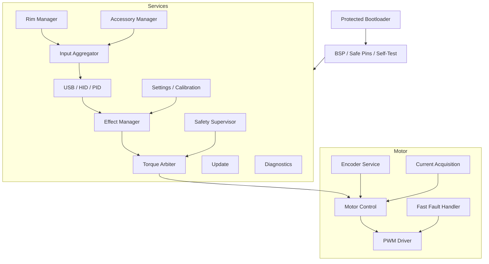

| Mô-đun | Quản lý | Không được quản lý |
|---|---|---|
| USB | Descriptors, endpoints, reports | PWM/gate writes |
| FFB | Trạng thái effect/mixing | Safety enable |
| Torque arbiter | Các giới hạn cuối cùng (torque/slew/thermal/power/freshness) | USB transport |
| Motor control | Phản hồi-đến-PWM | Host parsing |
| Safety | State/fault policy | Bảo vệ điện cơ sở (đơn thuần) |
| Peripherals | Khám phá (discovery), mapping, tình trạng | Bật (enable) motor |
| Settings | Schema/atomic persistence | Việc ghi Flash trong ISR điều khiển |
| Diagnostics | Bounded events/traces | Blocking output |
| Update/boot | Verify/stage/recover | Motor activation |

## 10. Đường dẫn Force-Feedback

Phần này theo dõi toàn bộ vòng đời của một hiệu ứng force-feedback từ khi máy chủ yêu cầu xuống đến khi tạo ra dòng điện trong động cơ. Nó tập trung vào cách các hiệu ứng trừu tượng trở thành mô-men xoắn vật lý.

**Hình 10-1: Luồng Dữ liệu Force-Feedback**

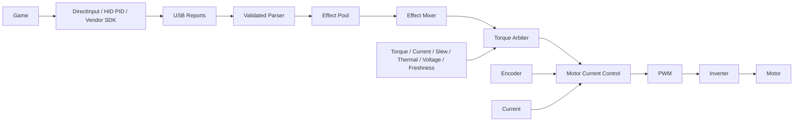

| Khối (Block) | Trách nhiệm |
|---|---|
| Parser | Xác thực ID, kích thước, index, đơn vị, thời gian |
| Effect pool | Phân bổ/cập nhật/khởi chạy/dừng các hiệu ứng theo một cách deterministic |
| Mixer | Kết hợp các hiệu ứng với nhau mà không bị tràn (overflow) |
| Device filters | Cấu hình cho damping/friction/inertia/smoothing |
| Torque arbiter | Áp dụng tất cả các giới hạn an toàn và cuối cùng của sản phẩm |
| Motor control | Chuyển đổi yêu cầu torque thành current/PWM; không có ngữ nghĩa về hiệu ứng |
| Hardware faults | Tách cổng điều khiển một cách độc lập |

Tính tươi (freshness) từ máy chủ sẽ được theo dõi rõ ràng. Mất kết nối máy chủ sẽ kích hoạt chính sách suy giảm dần (bounded decay) và disable mô-men xoắn. Các lỗi cảm biến quan trọng hoặc lỗi điện sẽ kích hoạt một thao tác ngắt (inhibit) phần cứng ngay lập tức.

### 10.1. Các Biến thể Trong Miền Động cơ (Motor-Domain Invariants)

1. Đầu ra PWM sẽ phải ở trạng thái không hoạt động (inactive) sau khi reset cho đến khi nhận được lệnh enable hợp lệ.
2. Dữ liệu từ encoder hoặc dòng điện nếu không hợp lệ sẽ không được cho phép xuất hiện cùng với torque đang kích hoạt vượt quá thời gian phát hiện quy định.
3. Cả main MCU và miền động cơ đều sẽ giới hạn torque và tốc độ.
4. Tín hiệu break phần cứng sẽ ghi đè bất kỳ lệnh phần mềm nào.
5. IPC (giao tiếp vi xử lý) cũ (stale) sẽ trở về không mô-men xoắn (zero torque) hoặc bị hardware inhibit trong thời gian quy định.
6. Dữ liệu hiệu chuẩn (calibration data) sẽ có phiên bản và phải kiểm tra logic toán học trước khi sử dụng.
7. Số lượng NaN, quá tải (overflow), liệt kê sai, hay các frame giao tiếp lỗi không bao giờ được chạm tới mô-đun sinh PWM.

### 10.2. Thu thập Đầu vào (Input Aggregation)

**Hình 10-2: Luồng Dữ liệu Thu thập Đầu vào**

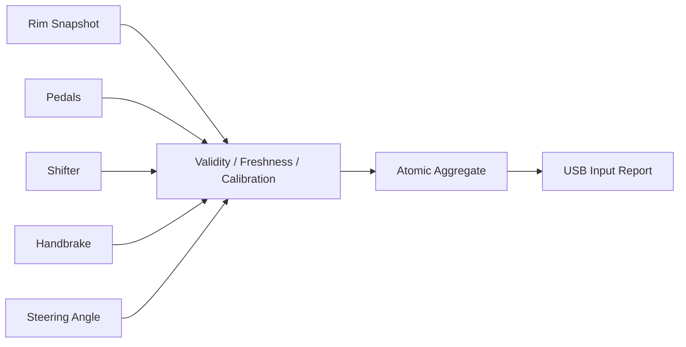

Mỗi giá trị được tổng hợp sẽ đi kèm với dấu thời gian, trạng thái, và định danh của nguồn. Các USB input report sẽ sử dụng các bản snapshot để thu nhận chính xác thay vì đọc trực tiếp dữ liệu từ các hàm ngắt gián đoạn (ISRs). Việc đọc encoder cũ sẽ được coi là lỗi động cơ (critical motor fault). Một rim link bị cũ sẽ tự động giải phóng toàn bộ các điều khiển nút nhấn hiện thời để tránh lỗi treo. Dữ liệu bàn đạp (pedal), shifter, handbrake bị lỗi sẽ rơi về trạng thái báo cáo an toàn (safe reporting values).

## 11. Phần mềm Máy chủ (Host Software)

Phần này mô tả các trình điều khiển (drivers) phía máy chủ và các dịch vụ tương tác với wheel base. Mặc dù lập trình viên embedded không viết OS driver, họ vẫn phải nắm được những yêu cầu chung của nó.

**Hình 11-1: Mô hình Tương tác Phần mềm Máy chủ**

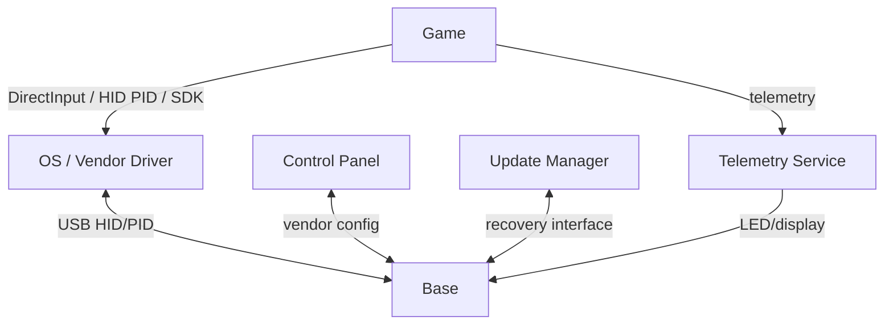

Trình điều khiển công cộng `hid-fanatecff` biểu diễn cách Linux chuyển hiệu ứng đầu vào và force-feedback qua các báo cáo USB HID tùy chỉnh bằng bộ định thời không đồng bộ 2ms mặc định. Nó chuyển đổi các đường dẫn sysfs/HIDRAW để xử lý dải tinh chỉnh, wheel ID, LED, màn hình, load cell, pedal rumble. Các công cụ như `hid-fanatecff-tools` kết nối telemetry UDP/bộ nhớ dùng chung (shared-memory) từ trò chơi đến những đầu ra (outputs) đó.

Base sẽ phải quản lý một số "mặt phẳng" (plane) riêng biệt trong quá trình truyền tín hiệu:

| Mặt phẳng | Tính Quyết định | Dữ liệu |
|---|---|---|
| Đầu vào (Input) | Cao | Steering, pedals, buttons |
| FFB | Cao | Các effects/tình trạng mô-men xoắn |
| Safety | Quyền cao nhất | Enable, faults, power, thermal, freshness |
| Configuration | Trung bình | Profiles/range/tuning |
| Display telemetry | Tốt nhất có thể | RPM, gear, flags, speed |
| Update/diagnostics | Dịch vụ đã ngắt torque | Images, traces, calibration |

## 12. State Machines

Phần này định nghĩa các trạng thái hoạt động (operational states) của wheel base và miền động cơ (motor domain). Nó cũng giải thích điều kiện thiết yếu nào có thể di chuyển thiết bị từ trạng thái idle an toàn tới việc sinh mô-men xoắn.

### 12.1. Vòng đời Base

**Hình 12-1: State Machine Vòng đời Base**

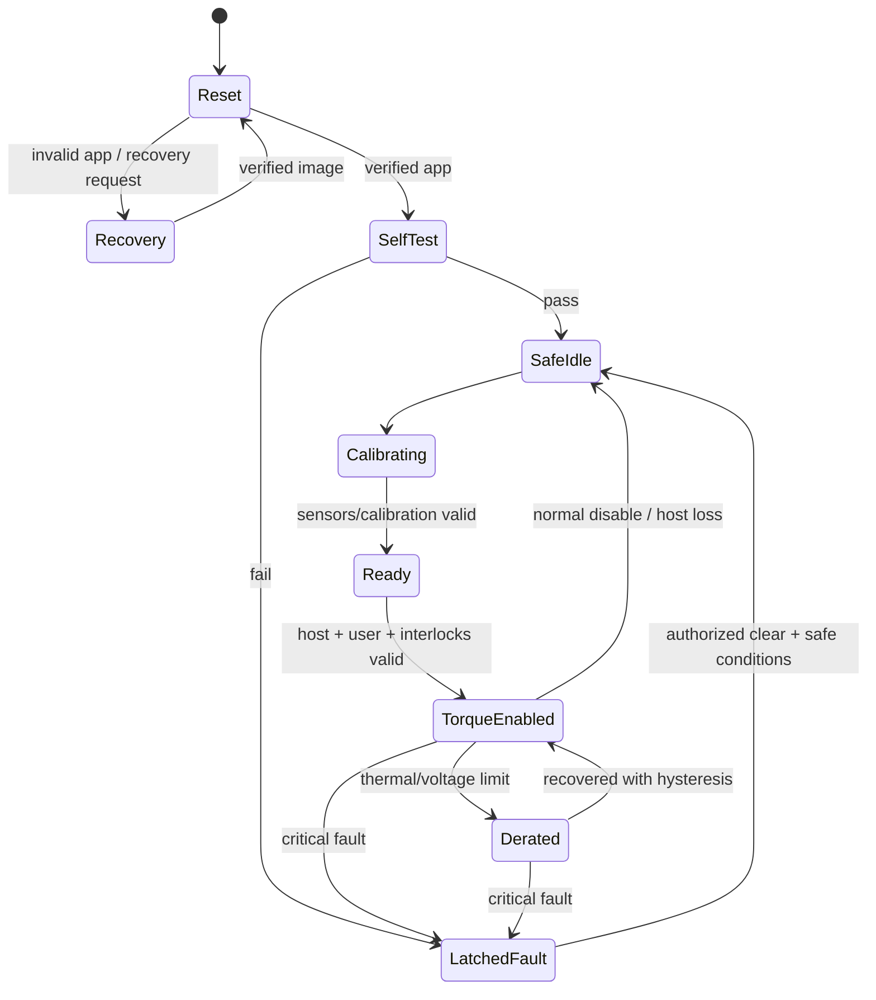

### 12.2. Miền Động cơ (Motor Domain)

**Hình 12-2: State Machine Miền Động cơ**

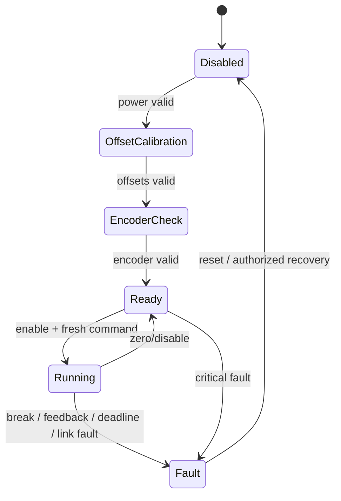

Liệt kê USB và cấu hình sẽ không tự động ám chỉ là torque đã được bật.

## 13. Thực thi Thời gian thực (Real-Time Execution)

Phần này định nghĩa những thời hạn then chốt cho phần sụn. Trượt những thời hạn ở vòng điều khiển động cơ có thể kéo theo nguy cơ vặn mô-men xoắn hoặc làm suy giảm an toàn.

| Hoạt động | Dải phổ biến | Phạm vi ngữ cảnh | Hậu quả khi trượt |
|---|---|---|---|
| Dòng điện/Vòng lặp FOC | 10–40 kHz | PWM/ADC ISR hay motor core | Lỗi torque distortion/fault |
| Encoder | Mỗi chu kỳ điều khiển hoặc phụ bộ (submultiple) | Hẹn giờ (Timer)/SPI DMA ISR | Góc lỗi cũ (stale angle) |
| Torque/FFB | 0.5–2 kHz | Nhiệm vụ mức ưu tiên cao | Lag phase (Jitter/phase lag) |
| USB | Theo sự kiện (Event-driven)/descriptor contract | USB ISR + task | Báo cáo bị cũ |
| Rim link | 100–1000 Hz hay do giao thức | DMA + task | Controls/display bị lỗi cũ |
| Pedals | 250–1000 Hz | ADC DMA/task | Bị trễ/nhiễu (Latency/noise) |
| Safety | Hardware trip + định kỳ kiểm tra | Hardware/ISR/task | Delay (shut down bị hoãn) |
| Thermal | Khoảng 10–100 Hz | Nhiệm vụ (Task) | Delay derating |
| Diagnostics/NVM | Xử lý nền bị giới hạn/khi yêu cầu | Task/bootloader | Không được block control |

**Hình 13-1: Ưu tiên Thực thi Thực tế**

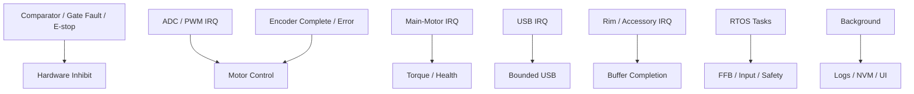

Nhóm phát triển sẽ phải đo target WCET (worst-case execution time) khi tín hiệu bus hoạt động tại mức tối đa. Hệ thống buộc phải xác lập (bound) tất cả các thực thi ISR. Các đường dẫn động cơ thời gian thực sẽ không bao giờ sử dụng việc phân bổ bộ nhớ động, ghi flash, block lock, hoặc block I/O. Kiến trúc sẽ phải công bố độ che chắn ngắt (interrupt masking) lớn nhất. Firmware sẽ phải mở các đồng hồ giám sát quá thời gian thực hiện (overrun counters) cho mục đích chẩn đoán. Các chức năng phục vụ watchdog sẽ chỉ được bật ở trạng thái khỏe mạnh, đã xác minh.

## 14. Khởi động, Cập nhật, và Cấu hình

Phần này nêu chi tiết chuỗi khởi động (startup sequence), tiến trình cập nhật firmware an toàn và cách quản trị dữ liệu không bay hơi (non-volatile).

### 14.1. Chuỗi Boot (Boot Chain)

1. Phần cứng sẽ phải ngắt tín hiệu bật gate (gate disabled) trong lúc bật thiết bị.
2. Trình nạp khởi động sẽ xác thực application image và khả năng tương thích của hệ thống.
3. Ứng dụng sẽ phải thiết lập lại cấu hình chân (safe pins) và clock an toàn, ghi chú lý do hardware reset.
4. Main và motor MCU trao đổi danh tính/tính năng (software versions/features).
5. Firmware xác nhận lại offset dòng điện (current offsets), trạng thái bộ mã hóa, điện áp bus, cảnh báo/thông báo nhiệt, cùng các khóa liên động (interlocks) vật lý.
6. Base lúc này chuyển sang `SafeIdle`; để đi tới phần có torque, chủ nhà hoặc người dùng bắt buộc cần thao tác xác nhận rõ ràng.

**Hình 14-1: Trình tự Cập nhật Firmware**

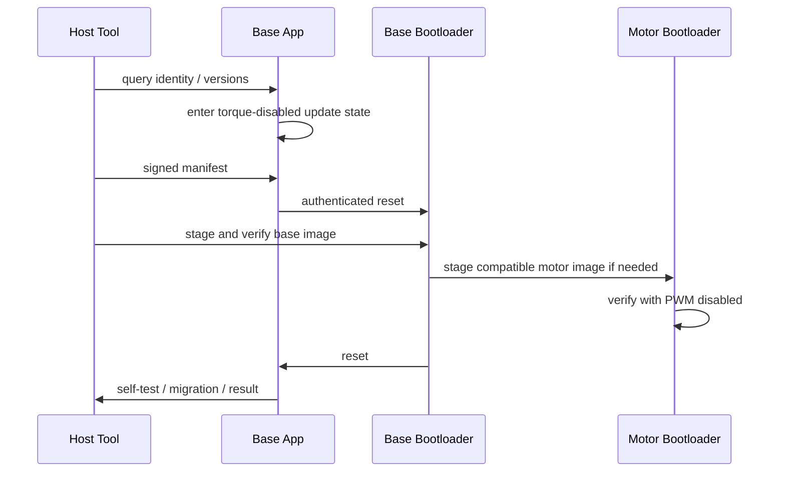

Quá trình cập nhật firmware bắt buộc sử dụng những bản image được xác thực (authenticated image) và bảo vệ bằng mã hash hoặc CRC. Bootloader sẽ kiểm soát khả năng tương thích phần cứng và phiên bản. Quá trình staging flash cần phải an toàn ngay cả khi mất điện (ví dụ dual-bank A/B). Chế độ recovery của bootloader phải hoàn toàn độc lập với ứng dụng chính. Hệ thống sẽ bắt buộc khóa vô hiệu hóa torque trong suốt quá trình cập nhật. Bất kỳ việc di chuyển (migration) cài đặt hay hiệu chuẩn nào cũng phải là các thao tác atomic.

| Dữ liệu (Data) | Quy tắc lưu trữ |
|---|---|
| Factory calibration | Được bảo vệ, có phiên bản (versioned), CRC, xác minh nguồn gốc |
| User center/range | Atomic và có thể reset |
| Profiles | Phiên bản schema (Schema version), giới hạn, mặc định |
| Safety limits | Không cho phép thay đổi / được kiểm soát bởi service authority |
| Fault records | Vòng ghi lưu giới hạn sự hao mòn (Wear-limited critical ring) |
| Update metadata | Lịch sử image đã chọn, số lần thử, trạng thái recovery |

## 15. Kiến trúc An toàn (Safety Architecture)

Phần này tổng hợp lại các chiến lược giảm thiểu và phát hiện lỗi. Nó ánh xạ các rủi ro phần mềm và điện học cụ thể vào các phản ứng an toàn tương ứng.

**Hình 15-1: Kiến trúc Xử lý Sự cố và Lỗi An toàn**

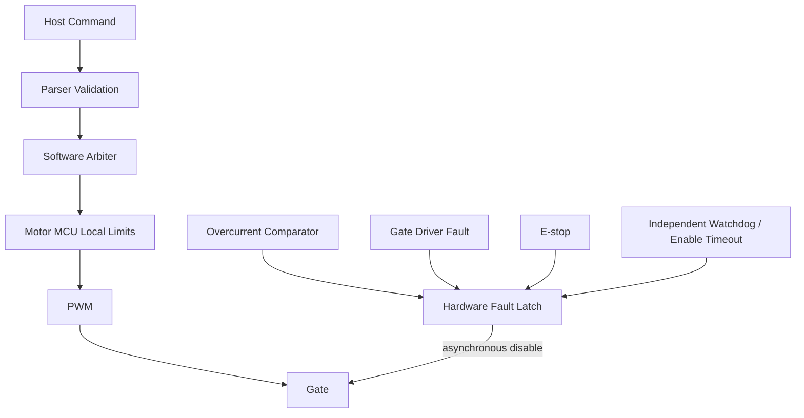

| Mối nguy (Hazard) | Phát hiện/kiểm soát (Detection/control) | Phản ứng (Reaction) |
|---|---|---|
| Yêu cầu Torque sai bất ngờ | Ngăn chặn khởi động, xác thực, giới hạn slew/freshness/torque | Giảm về mức không (zero) một cách có kiểm soát hoặc ức chế ngay lập tức |
| Sai hướng | Kiểm tra tính nhất quán lúc thiết lập (Commissioning consistency test) | Từ chối enable; bật cờ latched fault |
| Quá dòng (Overcurrent/short) | Comparator, bảo vệ cổng (gate protection), tính hợp lý của ADC | Vô hiệu hóa bằng phần cứng (Hardware disable) |
| Mất tín hiệu Encoder | CRC/status/timeout/jump | Ức chế ngay lập tức trừ khi có fallback hợp lệ |
| Quá nhiệt (Overtemperature) | Sensor diagnostics/model | Derate (giảm hiệu suất) rồi mới disable |
| Quá áp Regen (Regen overvoltage) | Cảm biến bus và chiến lược năng lượng | Giảm torque/kẹp (clamp)/ức chế |
| Treo Main/motor | IPC timeout, watchdog, gate timeout | Zero/inhibit/reset |
| Mất USB | SOF/kiểm tra tính tươi của báo cáo | Suy giảm dần FFB (Bounded decay)/disable |
| Đoản mạch phụ kiện (Accessory short) | Bảo vệ rails/ports | Cách ly phụ kiện; bảo vệ sự an toàn của mô tơ chính |
| Lỗi cập nhật (Update corruption) | Xác thực/tính toàn vẹn/recovery | Giữ nguyên trạng thái ngắt torque |

Firmware sẽ phải phân biệt được các loại lỗi sau: thông báo (informational), suy giảm hoạt động (degraded operation), ngắt torque có thể phục hồi (recoverable torque-off), latched fault, và lỗi ưu tiên phần cứng (hardware-dominant fault). Phần mềm sẽ không được phép xóa một hardware-dominant fault trong khi nguyên nhân sự cố phần cứng vẫn còn đang hiển thị.

### 15.1 Giảm hiệu suất nhiệt (Thermal derating) trong thực tế

Tình trạng quá nhiệt sẽ được xử lý bằng cách *derating* — hạ từ từ trần mô-men xoắn khi motor và inverter nóng lên — thay vì ngắt đột ngột tại mức giới hạn. Do torque cần dòng điện và dòng điện tạo ra nhiệt (`T ≈ Kt × Iq`), một base hoạt động hết công suất sẽ nóng lên; quá trình derating sẽ giữ cho base có thể sử dụng và an toàn thay vì ngắt giữa lúc vào cua.

Bên dưới nhiệt độ bắt đầu derate, người dùng có toàn bộ mức trần torque. Giữa khoảng nhiệt độ bắt đầu derate và nhiệt độ ngắt (shutdown temperature), trần mô-men xoắn sẽ suy giảm dần; trên mức shutdown, torque sẽ bị ngắt bỏ. Phục hồi sử dụng độ trễ (hysteresis): torque chỉ được phục hồi khi nhiệt độ đã giảm trở lại dưới mức điểm bắt đầu derate một khoảng an toàn, để hệ thống không bị dao động liên tục tại ngay sát ngưỡng derating. Đây chính là phản ứng "derate rồi mới disable" được nhắc tới trong bảng nguy hiểm phía trên.

## 16. Chẩn đoán (Diagnostics)

Phần này liệt kê các yêu cầu về ghi log và telemetry cần thiết để chẩn đoán các vấn đề tại hiện trường mà không làm giảm hiệu suất của thời gian thực.

**Hình 16-1: Luồng Dữ liệu Chẩn đoán**

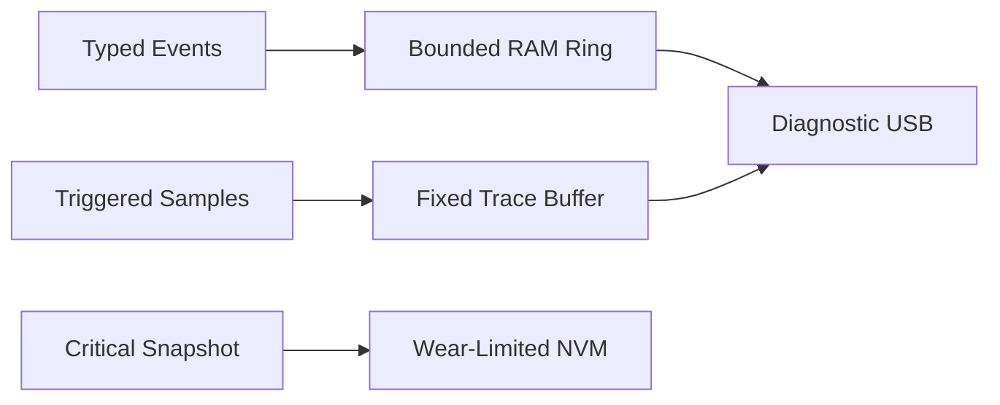

Firmware sẽ phải cung cấp lý do reset, số phiên bản, biên độ WCET, lỗi encoder, sự cố quá tải (saturation events) của ADC, gate faults, các đợt tăng điện áp bus bất thường, và lịch sử biến thiên nhiệt độ. Firmware sẽ không được phép gọi lệnh ghi log trực tiếp theo cấu trúc chữ trong motor ISR. Các truy dấu từ xa (telemetry) sẽ sử dụng các record binary cố định, đính kèm timestamp. Trace cho điều khiển ở tốc độ cao sẽ được trigger và có giới hạn thời gian (time-limited). Non-volatile persistent logs sẽ chỉ lưu những lỗi nghiêm trọng (critical fault snapshots) để giảm thiểu hỏng flash (flash wear). Thực thi những lệnh hệ thống dịch vụ nguy hiểm (dangerous service commands) bắt buộc hệ thống ở trạng thái ngắt torque. Hệ thống sẽ không bao giờ được phép ghi log mật khẩu hoặc ký quỹ (signing secrets).

## 17. Thiết kế Tham chiếu (Reference Design)

Phần này cung cấp những tiêu chuẩn đầu vào cụ thể được khuyến nghị dùng trong việc xây dựng phần cứng và phần mềm của direct-drive wheel base mới.

| Vùng (Area) | Khuyến nghị (Recommendation) |
|---|---|
| Main MCU | Cortex-M7/M33-class với khả năng xử lý USB cùng bộ nhớ deterministic lớn |
| Motor controller | MCU/DSP chuyên dụng hoặc ASIC kiểm soát motor chuẩn |
| IPC | SPI được bảo vệ tính tươi, CRC, tuần tự hoặc CAN-FD cộng với timeout bật lệnh |
| Motor | PMSM/BLDC đo chuẩn kích thước/nhiệt khi ở mô-men max/vận hành liên tục |
| Encoder | Cảm biến có khả năng cấp CRC/status tuyệt đối cộng với plausibility |
| Current sense | Hai/ba shunt hoặc cảm biến inline tùy theo yêu cầu điều khiển/chẩn đoán |
| Inverter | Gate driver mạnh, UVLO, fault và timer break |
| DC input | Fuse/eFuse, mạch đảo ngược, TVS, inrush, điện dung bus, chiến lược regen |
| USB | Chuẩn FS cho HID trừ khi yêu cầu băng thông HS là hợp lý |
| Accessories | Các bộ cổng có khóa tải giới hạn dòng được bảo vệ riêng |
| Safety | Comparator/break, fault latch, watchdog, E-stop/torque-off |
| NVM/debug | Calibration an toàn, atomic config, debug giới hạn theo vòng đời |

Software baseline sẽ nên đi kèm một bootloader được chứng nhận, OS (RTOS) vận hành không nằm trong motor task, một bộ scheduler cho motor theo nền bare-metal, và API có chia version.

**Bảng 17-1: Giao diện Yêu cầu Torque (Từ Main tới Motor)**

| Thành phần (Element) | Hướng | Dữ liệu | Mô tả |
|---------|-----------|------|-------------|
| `torque_mNm` | Input | int32 | Mô-men xoắn yêu cầu tính theo milli-Newton-mét |
| `sequence` | Input | uint32 | Số tuần tự tăng đơn điệu (Monotonically increasing sequence) |
| `timestamp_us` | Input | uint32 | Microsecond timestamp của yêu cầu |
| `validity` | Input | uint32 | Magic word hoặc CRC xác thực yêu cầu |

**Bảng 17-2: Giao diện Snapshot Motor (Từ Motor tới Main)**

| Thành phần (Element) | Hướng | Dữ liệu | Mô tả |
|---------|-----------|------|-------------|
| `angle_urad` | Output | int32 | Vị trí góc mô tơ tính theo microradian |
| `speed_urad_s` | Output | int32 | Tốc độ trục quay motor microradian trên mỗi giây |
| `phase_current_mA_u` | Output | int32 | Dòng tải cực U (Phase U current) bằng milliamperes |
| `phase_current_mA_v` | Output | int32 | Dòng tải cực V (Phase V current) bằng milliamperes |
| `phase_current_mA_w` | Output | int32 | Dòng tải cực W (Phase W current) bằng milliamperes |
| `timestamp_us` | Output | uint32 | Microsecond timestamp của bản chụp (snapshot) |
| `status` | Output | uint32 | Trường Bitfield chỉ báo tình trạng sức khỏe và lỗi |

Các giao diện sẽ bắt buộc sử dụng đơn vị vật lý, trường dữ liệu validate, và các primitive types có dung lượng giới hạn rõ ràng. Việc triển khai (implementation) tránh các enable switch bị chôn ngầm và phải minh họa rõ phân tách dữ liệu cho ISR với buffer của task.

## 18. Xác minh (Verification)

Phần này chỉ rõ tháp testing (testing pyramid) bắt buộc có để đảm bảo mức độ an toàn và ổn định của wheel base.

**Hình 18-1: Luồng Verification Pipeline**

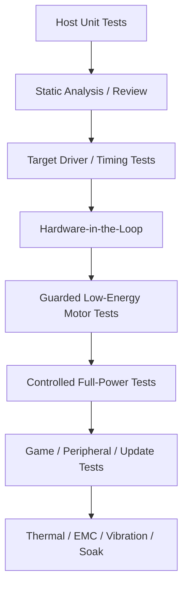

| Khu vực kiểm tra | Các test tối thiểu (Minimum tests) |
|---|---|
| USB/FFB | Các báo cáo descriptor bị dị dạng, vòng đời của các effect, reset/suspend, máy chủ bị stale (cũ) |
| Arbiter | Các giới hạn ưu tiên, slew, derating, hiện tượng race conditions của lỗi/enable |
| Encoder/current | CRC, timeout, wrap, chiều/hướng, offset, độ bão hòa, timing của ADC |
| PWM/gate | Thời gian dead time, trạng thái lúc reset, độ trễ break, lỗi cổng gate |
| IPC | Giao tiếp bị đứt quãng, hư hỏng, bị lặp, bị wrap, không tương thích về phiên bản |
| Mạch Power | Brownout, kích quá áp, nạp/xả năng lượng tái tạo, nguồn vào khởi động (inrush), quy trình sequencing |
| Ngoại vi | Rút cắm nhanh (Hot-plug), đoạn mạch ngắn, số liệu cũ, thông tin nhận diện không khớp |
| Update/NVM | Nhầm phiên bản HW/image, quá trình tải bị ngắt ngang, thao tác rollback, rách dữ liệu ghi (torn write), migration |
| Watchdogs | Tasks bị stall, khóa cứng vòng lặp, bế tắc bus, bão ngắt (interrupt storm) |

### 18.1. Kiểm tra Cổng Vào Full-Torque (Full-Torque Entry Gate)

Các tiêu chí sau bắt buộc được thỏa mãn trước khi mô tơ ở chế độ full-torque cho quá trình chạy mạch test:

- Bản mạch (Schematics), BOM, sơ đồ điện/nhiệt năng phải được kiểm duyệt (review).
- Tỷ lệ Encoder, chiều/hướng, status, thông báo timeout logic đã được kiểm duyệt.
- Tỉ lệ quy chuẩn điện (Current scaling), điểm báo kích hoạt ADC (ADC trigger timing), các mức offset, và độ bão hòa phải được căn đo.
- Mạch PWM và cấu trúc báo lỗi gate cần được thể hiện là an toàn xuyên suốt quá trình khởi động, update và reset.
- Comparator, các lỗi gate (gate fault), tín hiệu E-stop sẽ tự ngắt khóa trực tiếp phần cứng khi xảy ra lỗi.
- Torque sign và bộ phân bổ chuẩn được test chung bởi các dòng lực current-limited load bị kìm hãm.
- Test sự kiện rớt Host, mất IPC, báo sự cố brownout, derating vì nhiệt, hư encoder, và watchdogs cần vượt bài rà lỗi.
- Chức năng update phải hoạt động chống rủi ro bị tắt điện trong khi cài đặt/vận hành (persistent transition point).
- Độ trễ chuẩn WCET (Worst-Case Execution Time) đã vượt kiểm định thử tải khi mạch có nhiều kết nối rác max system traffic.
- Lá chắn bảo vệ động cơ cơ khí, nút báo E-stop, hoặc quy chuẩn phân làn an toàn vận hành đã được thông qua.

## 19. Lộ trình Thực thi (Implementation Roadmap)

Phần này cung cấp bản lộ trình phát triển firmware tuần tự từ việc bật hardware cho đến công đoạn kiểm nghiệm cuối cùng.

**Bảng 19-1: Trình tự Triển khai (Implementation Sequence)**

| Bước | Thực hiện (Action) | Ghi chú / Điều kiện |
|------|--------|--------------------|
| 1 | Lấy thông số kỹ thuật (torque, tốc độ, inertia, angle, latency, độ ồn, độ nóng, nền tảng, các điều luật an toàn). | Cần thiết trước khi bắt đầu (Prerequisite) |
| 2 | Chốt lại sơ đồ (schematics), BOM, các kết nối; kiểm duyệt phân vùng nguồn/clocks/reset, interrupts, DMA. | Cần thiết cho setup BSP |
| 3 | Thực hiện phân tích các điểm nguy hiểm / phản ứng trước bất kỳ việc kích hoạt motor. | Cổng bắt buộc an toàn (Mandatory safety gate) |
| 4 | Tìm/chọn phân mảnh processor và tạo API chuẩn có phiên bản IPC. | Nền tảng định hình hệ Software architecture |
| 5 | Lên các rails (nguồn cơ bản), reset, watchdogs, inhibit/chẩn đoán cùng inverter disabled. | Base hardware validation (Xác nhận phần cứng) |
| 6 | Bật đo tín hiệu encoder, current sensing; xác thực tính tương đồng mạch điện bằng thời gian. | Xác thực ADC/Timer sync |
| 7 | Cấp thử PWM cho gate driver qua hệ thống dummy an toàn hoặc load mô hình tải nhỏ (low-voltage). | Xác nhận điều khiển Inverter |
| 8 | Tạo ra cấu trúc lệnh motor / giới hạn giới khu vực (local limits) / check các điểm mức rủi ro dòng điện nhỏ (low-energy). | Tuning ban đầu cho hệ FOC |
| 9 | Add cổng USB, thiết bị HID PID, FFB / arbiter bằng dummy mô phỏng tại trạm cuối mô tơ. | Tích hợp hệ thống Host software |
| 10 | Gom mã điều khiển motor và check/xác minh lỗi chạy/đứt các tín hiệu trong bài test trước đó. | Xác thực hệ kiến trúc an toàn |
| 11 | Lên mô hình cho rim và bộ phụ kiện sau cổng phân tách độc lập (isolated adapters). | Tích hợp thêm các bộ Peripheral |
| 12 | Đưa profile, config/hiệu chỉnh (calibration), cài đặt báo lỗi diagnostic, và chuẩn bị bộ nạp/cập nhật recovery (update/recovery). | Tích hợp Tính năng hệ thống |
| 13 | Thực thi trạm test HIL, vận hành hệ thống, đo nhiệt (thermal), sóng EMC, độ xóc nảy (vibration), cycle nguồn, test thời gian dài. | Quy trình Formal verification |
| 14 | Up thông tin về chuẩn nền tảng (compatibility), thông tin file mã calib, update/báo lỗi và tài liệu. | Cần thiết trước khi ra mắt công chúng (Release) |

## 20. Tài liệu Tham khảo

Khu vực tổng hợp lại các nguồn tài liệu ngoài cùng các nghiên cứu kỹ thuật phụ trong tài liệu này (architecture info).

### 20.1. Tự Nghiên cứu Hiện tại (Current Research)

- [`sim_racing_research.md`](./sim_racing_research.md) — về hệ sinh thái, nền tảng base/motor, kết nối, timing, an toàn.
- [`wheel_rim.md`](./wheel_rim.md) — ranh giới biên phân rã QR / thiết kế kỹ thuật cho rim.
- [`pedals.md`](./pedals.md) — dữ liệu cảm biến pedals / tín hiệu từ chân cổng nối proxy base-port.
- [`tools.md`](./tools.md) — quy chuẩn dev đo lường cùng thư viện đánh giá lỗi.
- [`repos.md`](./repos.md) — list các tìm kiếm dự án public từ cộng đồng repository.

### 20.2. Nguồn Thông tin Tham khảo Công khai

- [USB-IF HID specifications](https://www.usb.org/hid)
- [USB-IF PID Class 1.0](https://www.usb.org/sites/default/files/documents/pid1_01.pdf)
- [OpenFFBoard wiki](https://github.com/Ultrawipf/OpenFFBoard/wiki/)
- [Fanatec Podium DD1 manual](https://assets.fanatec.com/fanatec-pwa/image/upload/downloads-prod/pdfs/P-WB-DD1-Manual-EN_web.pdf)
- [Fanatec Wheel Bases FAQ](https://help.fanatec.com/hc/en-us/articles/43766204938257-Wheel-Bases-A-FAQ)
- [Fanatec platform compatibility](https://www.fanatec.com/us-en/platforms)
- [Fanatec ecosystem source register](./references.md)
- [Fanatec update guide](https://www.fanatec.com/eu/en/explorer/products/racing-wheels-wheel-bases/update-fanatec-firmware-and-drivers/)
- [Simucube 2 user guide](https://simucube.com/app/uploads/2022/11/Simucube_2_User_Guide.pdf)
- [Infineon PMSM FOC reference](https://documentation.infineon.com/aurixtc3xx/docs/kbv1711616051757)
- [TI TIDA-01599](https://www.ti.com/tool/TIDA-01599)
- [gotzl/hid-fanatecff](https://github.com/gotzl/hid-fanatecff)
- [gotzl/hid-fanatecff-tools](https://github.com/gotzl/hid-fanatecff-tools)
- [Fanatec-Pinout](https://github.com/FendtXerion3800/Fanatec-Pinout) — mã cộng đồng, không phải tài liệu chính thức.

### 20.3 Công cụ Emulators Phần cứng Mã nguồn mở

- [lshachar/Arduino_Fanatec_Wheel](https://github.com/lshachar/Arduino_Fanatec_Wheel) — custom steering wheel SPI emulator.
- [StuyoP/Fanatec-Wheel-Barebone-Emulator](https://github.com/StuyoP/Fanatec-Wheel-Barebone-Emulator) — barebone wheelbase emulator.
- [Alexbox364/F_Interface_AL](https://github.com/Alexbox364/F_Interface_AL) — DIY custom steering wheels qua cổng SPI.
- [jssting/ArduinoTec-Pedals](https://github.com/jssting/ArduinoTec-Pedals) — Bảng mạch controller thay thế bàn đạp (pedal) Fanatec.
- [GeekyDeaks/fanatec-pedal-emulator](https://github.com/GeekyDeaks/fanatec-pedal-emulator) — mạch chuyển tín hiệu bàn đạp qua cáp RJ12 cổng cắm USB proxy.
- [StuyoP/Universal-Shifter-Interface-for-Fanatec](https://github.com/StuyoP/Universal-Shifter-Interface-for-Fanatec) — Proxy cho interface đổi cổng switch-based shifter qua RJ12.
- [vnmsimulation/VNM_MOTION_CONTROLLER](https://github.com/vnmsimulation/VNM_MOTION_CONTROLLER) — DIY STM32-based hardware controllers.

## 21. Sổ Đăng ký Câu hỏi (Đã giải quyết và Mở)

Được review vào ngày 2026-07-05. Phần lớn trong danh mục dưới đây là **những lựa chọn thiết kế (design inputs)** cho một sản phẩm cụ thể thay vì các sự thật công khai. Những gì về hệ kiến trúc "làm ra sao" được đánh dấu **Resolved (method/architecture)**; những thông số kỹ thuật thực tiễn hoặc cần lựa chọn kỹ sẽ được đổi thành **Open — developer self-investigation** (Mở — Developer tự điều tra bằng phương pháp quy định).

### 21.1 Đã giải quyết (Phương pháp/kiến trúc đã xác định)

- **Các gói USB descriptors, nhịp độ, sức chứa effect pool, và giao diện của nhà cung cấp (vendor interfaces).**
  Mô hình hiện đã công khai: báo hiệu HID cho inputs + PID Class 1.0 cho effects đi qua USB 2.0 FS, tốc độ làm mới (cadence) bằng endpoint interval (xem §13). Cộng đồng đã chứng minh các wheel base nhà Fanatec được liệt kê theo **VID `0EB7`** (ví dụ `0EB7:0020` cho CSL DD/DD Pro/ClubSport DD). Điểm còn lại là *giới hạn VID/PID cụ thể*, độ sâu của effect-pool, cùng bất kỳ giao tiếp đặc thù của hãng nào thì sẽ tùy thuộc vào quyết định đăng ký sản phẩm (xem 21.2).
- **An toàn/pháp lý (Safety/regulatory): the torque-inhibit path.**
  Được định dạng như trong hệ thống kiến trúc §15: có phần khóa cờ (latch) độc lập trong phần cứng (overcurrent comparator + gate fault + E-stop + watchdog), dùng để tự vô hiệu hóa (disable) bộ gate driver không đồng bộ, đi theo nền STO-style pattern (tham khảo tài liệu TI TIDA-01599). Các *mục tiêu tiêu chuẩn (regulatory targets)* (các quy định, dấu mộc nào là cần thiết) là tùy thị trường phát hành (21.2).
- **Ngân sách chấp thuận Latency/jitter và instrumentation.**
  Cách thức hoàn tất: ghi biên số lượng các phần, sử dụng bộ ghi đồng hồ (timer overrun) đếm rà trong báo lỗi phần cứng firmware để fix (mục §13, §16). Cấu trúc các mốc Loop-rate được quy ra cụ thể ở hệ bảng §13. Yêu cầu giá trị/độ lệch số lượng là tùy cấu trúc định hình theo thiết kế sản phẩm (21.2).
- **Mã ký, hệ thống cài rollback, provisioning, chống hạ phiên bản (anti-downgrade), và hệ thống debug policy.**
  Được ghi rõ tại §14: image có mã hoá bảo vệ xác thực (hash/CRC), sử dụng tính năng tránh sụp mạch phân bank (dual-bank) A/B power-loss-safe, bộ recovery bootloader độc lập hoàn toàn, xác định khóa cài update chặn hạ bản thấp/version (anti-downgrade), và thiết lập đóng toàn bộ cổng chạy debug trên phiên bản cung cấp thương mại. Giải pháp cấp crypto/PKI nào để đi theo tùy thuộc vào thiết kế thực tế được đưa ra (21.2).

### 21.2 Đang mở — Dành cho Developer chủ động điều tra (self-investigate)

Mỗi phần ở đây đòi hỏi một requirements, một chuẩn đo duyệt, hay phải được phân tính – không dùng việc lookup.

- **Peak/continuous torque, speed, mức quán tính cản (inertia), dải hoạt động, và chu kỳ hoạt động (duty cycle).**
  *Cách làm:* Kiểm lại phân vùng mục tiêu và đối thủ để so lại specs; chuẩn hoá bộ động cơ với sức continuous + peak torque, và tính năng tản nhiệt theo hiệu suất tải nhiệt duty cycle; xác nhận với thông số trên dyno.
- **Dữ liệu nhiệt/điện của motor (Motor electrical/thermal) và biểu đồ năng lượng có thể tái sinh (regenerative energy envelope).**
  *Cách làm:* Tìm hiểu datasheet của motor vừa chọn; dùng thước đo thông số hằng số điện tử (Kt, resistance, inductance), tính độ thay đổi dải nhiệt thời gian; thiết lập chỉ định năng lượng regen cho DC bus (bus điện lưu tải) nếu hệ xoay đảo ngược nhanh, sau đó tìm chỉ số điện trở xả/phanh kẹp (clamp/brake resistor).
- **Chọn partition của processor (chíp MCU), loại encoder, loại kiểm tra đo cảm dòng điện (current topology), bộ cổng đóng cắt gate driver, và MOSFETs.**
  *Cách làm:* Đối chiếu vòng độ trễ mức yêu cầu FOC-loop bằng những tham khảo thiết kế có sẵn (Infineon PMSM FOC, TI sensored FOC; cách thiết kế TMC4671 của OpenFFBoard là bài cơ bản public pattern); test phần chuẩn độ trễ trên mạch mẫu kiểm tra điện từ trên mạch bring-up board trước khi dùng power khủng.
- **Platform PC/console nào và cách bảo mật đăng ký licensed authentication architecture.**
  *Cách làm:* Ký xác thực quy chế để thông qua giao thức; cấm không được giả mạo (emulate) hay cố vượt rào console authentication bypass (§15, §11 của tài liệu research doc).
- **Giao thức của QR/rim dùng cho hệ nền (supported generation) tương thích và chính sách liên thông base tương thích (compatibility policy).**
  *Cách làm:* Nên xử lý giao thức thiết kế kiểu cắm nhận (replaceable adapter module) thay mạch rời rạc (§7); các chuẩn cắm SPI thu thập cũ từ cộng đồng mang yếu tố học lý chứ không phải file specs gốc — vui lòng xin code interface giao tiếp chuẩn với thế hệ board mạch hiện hữu mới làm nền gốc base thay vì đoán.
- **Sơ đồ chân giao tiếp Accessory/E-stop/torque-key/CAN connector definitions.**
  *Cách làm:* Ký hiệu sơ đồ chân tín hiệu cho từng cổng port cụ thể; Những gì xem ngoài cộng đồng (FendtXerion Fanatec-Pinout wiki, ở đó nói cắm chức năng Torque Key hoạt động trên mâm base DD1/DD2 với E-stop switch circuit) thì cũng vẫn phải đo bằng mạch điện xem xét có tương thích thật chưa.
- **Tiêu chuẩn quy định Safety/regulatory và mục tiêu đánh giá tự kiểm tra an toàn (independent-assessment targets).**
  *Cách làm:* Đăng ký chuẩn của EMC/product-safety marks tương quan tuỳ theo vùng lãnh thổ định tung sản phẩm, mời chuyên gia đánh giá và lấy chứng chỉ trong giai đoạn sớm.
- **Sở hữu file cấu hình tinh chỉnh (Calibration ownership/migration) phân tán giữa hệ base, motor, rim, và bộ thiết bị kèm theo.**
  *Cách làm:* Quản lý các version cho riêng từng bản mạch, check kỹ logic giới hạn của dữ liệu rồi mới lấy ra xài, mô phỏng atomic migration nếu cần thiết (§14); theo dõi cẩn thận trong mục [`compatibility-matrix.md`](./compatibility-matrix.md).
- **Các yêu cầu về thông số môi trường chuẩn độ bền rung, âm, EMC và độ thọ vòng đời sản phẩm (service-life requirements).**
  *Cách làm:* Chuẩn hóa bằng định nghĩa rõ ràng lúc bàn đầu về môi trường vận hành (intended use) của thiết bị, thực thi đủ quá trình xét duyệt gắt gao vòng qualification stage (§18 thermal/EMC/vibration/soak).
