# Kiến trúc Phần cứng và Phần mềm của Steering Rim

> Ngày nghiên cứu: 2026-07-02
> Phạm vi: điện tử của steering rim / steering wheel, liên kết wheel-base, tích hợp máy chủ, và kiến trúc pedal lân cận.  
> Bằng chứng: các dự án GitHub công khai và tài liệu công khai do người yêu cầu cung cấp.  
> Ràng buộc: những quan sát từ cộng đồng không phải là thông số kỹ thuật chính thức của Fanatec. Không có kỹ thuật dịch ngược (reverse engineering) firmware độc quyền hoặc vượt qua (bypass) bảo mật.
> Tài liệu liên quan: [sim_racing_research.md](./sim_racing_research.md), [wheel_base.md](./wheel_base.md), [accessories.md](./accessories.md), [tools.md](./tools.md), và [repos.md](./repos.md).

## 1. Tóm tắt Thực thi

Phần này cung cấp cái nhìn tổng quan cấp cao về kiến trúc steering rim, xác lập vai trò của nó là một nút I/O thay vì bộ điều khiển force-feedback. Nó nhằm mục đích định hướng cho người đọc trước khi đi sâu vào các chi tiết phần cứng và phần mềm.

Một steering rim hiện đại là một nút I/O nhúng xoay. Nó quét các nút bấm, lẫy chuyển số (paddles), bộ mã hóa xoay (rotary encoders), cần điều khiển (joysticks), và đầu vào ly hợp analog (analog clutch); nó nhận các lệnh hiển thị/LED; nó khai báo khả năng của mình với wheel base; và nó trao đổi các khung dữ liệu (frames) có giới hạn thông qua liên kết điện (quick-release). Nó không sở hữu điều khiển động cơ force-feedback. Wheel base sở hữu quá trình liệt kê (enumeration) USB, thu thập trục lái, xử lý force-feedback, mô-men xoắn động cơ, an toàn, và tổng hợp dữ liệu từ rim/thiết bị ngoại vi.

Bằng chứng cộng đồng mạnh mẽ nhất cho các rim tương thích Fanatec cũ mô tả wheel base là SPI controller/master và rim là SPI peripheral/slave sử dụng tín hiệu 3.3 V. `Arduino_Fanatec_Wheel` thực hiện trao đổi 33 byte, kiểm tra CRC-8, ánh xạ các bit của nút bấm, và giải mã màn hình trên phần cứng AVR. `Fanatec-Wheel-Barebone-Emulator` bổ sung các ràng buộc thời gian khởi động, nhiều thiết bị ngoại vi hơn, và một cảnh báo tương thích rõ ràng: phương pháp AVR của nó được báo cáo là không tương thích với ClubSport DD/DD+, trong khi các base cũ hơn đến CSL DD và DD1/DD2 được báo cáo là hoạt động. Đây là ranh giới thế hệ quan trọng, không phải điều chỉnh thời gian nhỏ.

Ở ranh giới máy chủ, `hid-fanatecff` cho thấy một kiến trúc riêng biệt: Các hiệu ứng đầu vào/FF của Linux được dịch thành các báo cáo USB HID dành riêng cho thiết bị, trong khi đèn LED, màn hình, điều chỉnh, định danh vô lăng và chức năng bàn đạp được bộc lộ thông qua sysfs của Linux hoặc HIDRAW. `hid-fanatecff-tools` tiêu thụ telemetry (dữ liệu viễn trắc) của trò chơi và điều khiển các đầu ra mở rộng đó. Do đó, đầu vào lái/FFB và telemetry của bảng điều khiển nên được coi là các mặt phẳng dữ liệu (data planes) riêng biệt nhưng có sự phối hợp.

## 2. Ranh giới Hệ thống

Phần này xác định ranh giới vật lý và logic của hệ thống steering rim. Nó minh họa các tương tác giữa rim, wheel base và máy tính chủ (host), điều này rất quan trọng để hiểu chức năng cụ thể nằm ở đâu.

**Hình 2-1: Ranh giới Hệ thống và Luồng Dữ liệu**

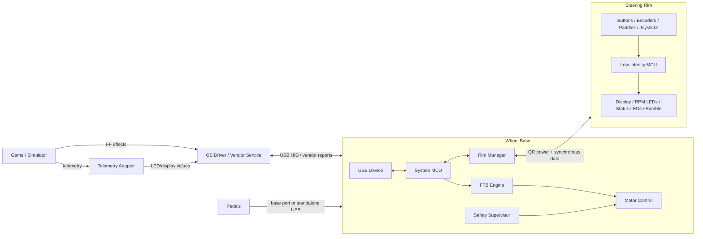

### 2.1 Quyền Sở hữu

| Chức năng | Rim | Wheel base | Phần mềm máy chủ (Host) |
|---|---|---|---|
| Quét điện nút/lẫy | Chính | Nhận/ánh xạ | Tiêu thụ điều khiển logic |
| Định danh/khả năng của Rim | Cung cấp | Khám phá/xác nhận | Có thể hiển thị cấu hình |
| Màn hình và đèn LED | Trực tiếp điều khiển (Drives) | Truyền/điều khiển | Tạo giá trị telemetry |
| Góc trục lái | Không, thường là encoder của base | Chính | Tiêu thụ trục |
| Diễn giải hiệu ứng FFB | Không | Chính | Gửi hiệu ứng |
| Dòng điện/PWM động cơ | Không | Chính và quan trọng về an toàn | Không |
| Cập nhật Firmware | Bootloader của Rim nếu có | Điều phối/chuyển tiếp (pass-through) | Công cụ cập nhật |
| Cảm biến bàn đạp | Nút bàn đạp riêng/base | Tổng hợp | Tiêu thụ trục |

## 3. Phương pháp Nghiên cứu và Chất lượng Bằng chứng

Phần này phác thảo các nguồn được sử dụng để đưa ra kiến trúc này và các quy tắc để diễn giải chúng. Nó cung cấp bối cảnh về độ tin cậy của các kết luận kỹ thuật được trình bày trong suốt tài liệu.

### 3.1 Nguồn Đã Tham khảo

| Nguồn | Vai trò | Mức độ tin cậy đối với kiến trúc | Hạn chế |
|---|---|---|---|
| `Arduino_Fanatec_Wheel` | Rim DIY tương thích với base cũ | Trung bình-cao cho mô hình AVR/SPI đã trình bày | Triển khai của cộng đồng; cũ; theo từng mẫu cụ thể |
| `Fanatec-Wheel-Barebone-Emulator` | Emulator rim DIY mở rộng | Trung bình-cao cho các bài học khởi động/thời gian/thiết bị ngoại vi | Báo cáo rõ ràng là không tương thích với CS DD/DD+ mới hơn |
| `Fanatec-Pinout` | Thu thập chân cắm (connector/pinout) của cộng đồng | Trung bình cho các giả thuyết về điện | Không đầy đủ; tập trung vào DD1; không được nhà sản xuất phê duyệt |
| `ArduinoTec-Pedals` | Bộ điều khiển bàn đạp USB độc lập | Trung bình cho chuỗi tín hiệu bàn đạp | Tập trung CSP V1, không phải bằng chứng giao thức rim |
| `hid-fanatecff` | Trình điều khiển kernel Linux USB/FF | Cao đối với thiết kế phần mềm công khai của trình điều khiển đó | Phía máy chủ; giao thức thiết bị vẫn là độc quyền |
| `hid-fanatecff-tools` | Telemetry trò chơi tới các đầu ra của vô lăng | Cao đối với kiến trúc công cụ công khai | Trò chơi/tính năng hạn chế; đường dẫn DBus được đánh dấu là chưa hoàn thiện |
| GitHub Fanatec search | Khám phá | Thấp | Xếp hạng tìm kiếm không phải là bằng chứng kỹ thuật |

### 3.2 Quy tắc Diễn giải

- **Đã quan sát**: hiện diện trực tiếp trong tài liệu kho lưu trữ hoặc mã nguồn.
- **Đã suy luận**: kết luận kỹ thuật được hỗ trợ bởi một số hành vi đã quan sát.
- **Đã khuyến nghị**: hướng dẫn thiết kế sản phẩm, không phải là tuyên bố về hoạt động thương mại.
- Các sơ đồ chân, ý nghĩa byte, timing, và IDs chính xác vẫn sẽ theo từng thế hệ cho đến khi được xác minh trên tài liệu phần cứng được duyệt.

## 4. Phân tích Kho lưu trữ

Phần này đi sâu hơn vào các kho lưu trữ mã nguồn mở cụ thể được phân tích trong quá trình nghiên cứu. Nó nêu bật các phát hiện chính, điểm mạnh và điểm yếu của từng dự án, rút ra các bài học thiết kế sản phẩm áp dụng cho việc triển khai mới.

### 4.1 `lshachar/Arduino_Fanatec_Wheel`

| Khía cạnh | Phát hiện |
|---|---|
| Mục tiêu | Vô lăng DIY được nhận diện bởi base Fanatec |
| Bộ điều khiển (Controller) | Arduino Uno/Nano; các biến thể 5 V yêu cầu xử lý mức điện áp |
| Liên kết Rim | SPI Base-master, rim-slave ở 3.3 V |
| Hành vi khung (Frame behavior) | Bộ đệm 33-byte, CRC-8, ánh xạ bit nút, dữ liệu hiển thị |
| Thiết bị ngoại vi | Nút bấm, D-pad analog, màn hình chữ và số TM1637 |
| Điểm mạnh | Sơ đồ/mã nguồn tham chiếu cụ thể cho kiến trúc kế thừa (legacy architecture) |
| Điểm yếu | Triển khai Arduino nguyên khối (Monolithic); việc ghi log qua serial có thể làm nhiễu timing của nút; bằng chứng tương thích cũ |
| Bài học sản phẩm | Firmware sẽ phải tách riêng đường dẫn tốc độ cao khỏi việc ghi log và kết xuất hình ảnh. |

### 4.2 `StuyoP/Fanatec-Wheel-Barebone-Emulator`

| Khía cạnh | Phát hiện |
|---|---|
| Mục tiêu | Nút rim tương thích nhỏ gọn với các nút, màn hình, LED |
| Bộ điều khiển | ATmega328P trần tại 3.3 V nguyên bản; bootloader bị gỡ bỏ để tăng tốc độ khởi động |
| Mở rộng | Shift registers (Thanh ghi dịch) và các biến thể thiết bị ngoại vi tùy chỉnh |
| Điểm mạnh | Làm nổi bật trình tự cấp nguồn, thời hạn khởi động (startup deadline), dấu chân (footprint), sự tích hợp |
| Điểm yếu | Mỗi bản build có mã tùy chỉnh; giới hạn AVR; base mới hơn không tương thích |
| Bài học sản phẩm | Firmware mô-đun theo khả năng và giới hạn thời gian khởi động đo đạc được sẽ là bắt buộc. |

### 4.3 `FendtXerion3800/Fanatec-Pinout`

| Khía cạnh | Phát hiện |
|---|---|
| Mục tiêu | Thu thập thông tin rải rác về connector/pinout |
| Phạm vi | Base basics, phanh tay (handbrake), cần số (shifters), bàn đạp (pedals), E-stop, khóa mô-men xoắn, dữ liệu/CAN |
| Mẫu quan sát được | Một số base inputs được kéo (pulled up) lên 5 V và xác nhận thấp (asserted low); các ngõ vào analog thường trải từ 0–5 V |
| Hạn chế | Sơ đồ không đầy đủ và chủ yếu dựa trên DD1 |
| Bài học sản phẩm | Mỗi chân phải được xác minh bằng điện và với sơ đồ thiết kế chính thức. |

### 4.4 `gotzl/hid-fanatecff`

| Khía cạnh | Phát hiện |
|---|---|
| Mục tiêu | Đầu vào Linux và hỗ trợ force-feedback cho nhiều thiết bị USB Fanatec |
| Kiến trúc | Module hạt nhân HID out-of-tree được chia theo thiết bị, PID/FF, và tệp tuning |
| FFB | Hiệu ứng chuẩn Linux được dịch sang chuẩn HID tùy chỉnh; timer không đồng bộ mặc định 2 ms |
| Tính năng mở rộng | LED, màn hình, điều chỉnh, wheel ID, dải độ, load cell, rung bàn đạp thông qua sysfs/HIDRAW |
| Khả năng tương thích | Device IDs có các trạng thái ổn định/thử nghiệm khác nhau |
| Bài học sản phẩm | Hệ thống sẽ tách biệt FF API chung, vận chuyển (transport) của nhà cung cấp và điều khiển tính năng mở rộng. |

### 4.5 `gotzl/hid-fanatecff-tools`

| Khía cạnh | Phát hiện |
|---|---|
| Mục tiêu | Nối kết telemetry trò chơi đến các chức năng ngoại vi của vô lăng |
| Đầu vào (Inputs) | Bộ điều hợp (adapters) UDP hoặc shared-memory/named-mapping cho mỗi trò chơi |
| Đầu ra (Outputs) | Các thao tác hiển thị/LED/tải/điều chỉnh trên sysfs |
| Kiến trúc | Máy chủ (server) chính cùng các adapters/threads máy khách (client) cho từng trò chơi |
| Hạn chế | Độ phủ trò chơi và các trường telemetry thay đổi; Dịch vụ DBus được đánh dấu là không hoạt động |
| Bài học sản phẩm | Phần mềm máy chủ nên chuẩn hóa telemetry trò chơi trước khi xuất ra thiết bị, cô lập adapters và giới hạn tốc độ lưu lượng hiển thị. |

### 4.6 `Alexbox364/F_Interface_AL`

| Khía cạnh | Phát hiện |
|---|---|
| Mục tiêu | Vô lăng DIY tùy chỉnh thông qua SPI với thanh ghi dịch (shift registers) |
| Bộ điều khiển | Arduino Nano cùng bộ chuyển mức (level converters) và thanh ghi dịch 74HC165 |
| Tính mở rộng | Chia tỷ lệ phần cứng dễ dàng hơn cho nhiều nút bấm |
| Bài học sản phẩm | Sử dụng thanh ghi dịch/bộ mở rộng (expanders) bên ngoài làm giảm số chân MCU cần thiết nhưng cần quản lý timing/bóng ma (ghosting) cẩn thận. |

## 5. Kiến trúc Nguồn Điện

Phần này trình bày chi tiết các chiến lược bảo vệ và phân phối điện năng cho steering rim. Nó rất cần thiết để ngăn ngừa hư hỏng về điện do mức điện áp không khớp, dòng khởi động hoặc các kết nối không đúng.

**Hình 5-1: Cây Kiến trúc Điện năng**

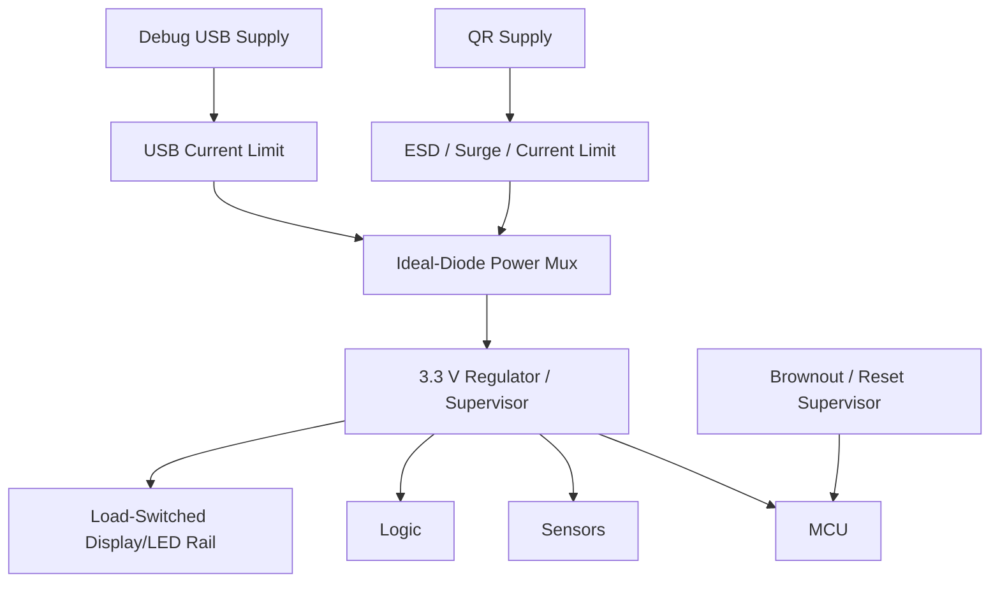

### 5.1 Quy tắc Thiết kế Nguồn Điện

Bằng chứng cộng đồng cho thấy mức điện áp không phù hợp có thể gây ra hư hỏng vĩnh viễn. Ngoài ra, timing khởi động quyết định sự thành công của quá trình nhận diện bởi base.

- Phần cứng sẽ không bao giờ nối chung trực tiếp nguồn 5 V của base và USB.
- Phần cứng sẽ sử dụng bộ chuyển mạch tải (load switch) hoặc bộ ghép ideal-diode (ideal-diode mux) để cách ly nguồn cung cấp.
- Phần cứng sẽ giới hạn dòng khởi động (inrush current) từ tụ điện màn hình và tải LED.
- Chân MISO và các tín hiệu đầu vào sẽ duy trì trạng thái trở kháng cao (high-impedance) trong khi chưa cấp nguồn hoặc đang khởi động lại.
- Thiết kế sẽ đo lường và đảm bảo một khoảng thời gian boot-đến-phản-hồi-đầu-tiên hợp lệ trên các giới hạn điện áp và nhiệt độ.

## 6. Kiến trúc Phần cứng Tham khảo

Phần này giải thích thiết kế phần cứng bên trong của bộ điều khiển steering rim. Nó kết nối các đầu vào vật lý (nút, encoders) và đầu ra (LEDs, màn hình) tới vi điều khiển trung tâm (MCU).

**Hình 6-1: Sơ đồ Khối Phần cứng Bộ điều khiển Rim**

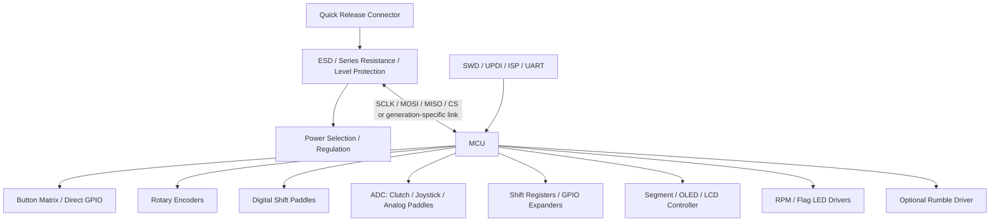

### 6.1 Nhiệm vụ Khối Phần cứng

| Khối | Mục đích | Yêu cầu thiết kế |
|---|---|---|
| MCU | Cung cấp link có tính xác định (deterministic) và I/O cục bộ | Khởi động nhanh; hỗ trợ peripheral-slave; timers; ADC; đủ GPIO/DMA |
| Đầu nối QR | Cơ học, điện năng, truyền tín hiệu | Trình tự tiếp xúc, độ mòn, ESD, rung động, không để điện áp nguy hiểm lộ ra ngoài |
| Bảo vệ đầu vào | Hạn chế mức tăng (transients) và xung đột | Khả năng tương thích 3.3 V; điện trở nối tiếp; thiết bị ESD; tránh các cạnh chậm |
| Lựa chọn nguồn | Ngăn chặn việc cấp nguồn ngược (backfeed) | Ideal diode/load switch; cách ly nguồn USB/debug và nguồn base |
| Matrix/expanders | Tăng số lượng phím | Chiến lược chống bóng ma (Ghosting), kéo (pull-ups), quét deterministic |
| Analog front end | Xử lý cảm biến Hall/chiết áp (potentiometer) | Bảo vệ rail, bộ lọc RC, ratiometric measurement, chẩn đoán |
| Giao diện hiển thị | Cung cấp màn hình setup/telemetry | Dùng DMA ở đâu hữu ích; giới hạn khối lượng công việc (workload) làm mới |
| LED driver | Các đầu ra hình ảnh (visual outputs) được kiểm soát bằng dòng điện | Dòng điện mỗi kênh, ngân sách nhiệt (thermal budget), độ sáng tổng |
| Haptic driver | Điều khiển rung rim nếu có | Transistor/driver, bảo vệ flyback, giới hạn dòng điện |
| Cổng lập trình | Dùng cho sản xuất và phục hồi | Truy cập được bảo vệ và chính sách khóa thiết bị lúc sản xuất |

### 6.2 Lựa chọn MCU

Các nguyên mẫu cộng đồng sử dụng ATmega328P/Arduino Uno/Nano. Điều đó chứng tỏ tính khả thi cho các liên kết cũ nhưng không nên định nghĩa một thiết kế thương mại mới.

| Yêu cầu MCU | Lý do |
|---|---|
| Hoạt động ở 3.3 V gốc | Tránh rủi ro về bộ chuyển mức (level-shifter) và xung đột mức điện áp |
| Deterministic SPI peripheral cùng DMA/interrupts | Trả lời base theo polling mà không bị treo (blocking) |
| Khởi động nhanh reset-to-response | Ngăn việc base tuyên bố rim không tương thích |
| Đủ số lượng GPIO/ADC/timers | Dùng cho Nút, encoders, lẫy gạt analog, LEDs |
| Tăng tốc CRC bằng phần cứng (tùy chọn) | Hữu ích, nhưng không bắt buộc cho các frames nhỏ |
| Bộ tạo dao động bên trong hoặc tinh thể | Đạt chuẩn thời gian (timing) xuyên suốt dải nhiệt |
| Khởi động/cập nhật an toàn (Secure boot/update) | Dành cho xuất xưởng (Authenticity) và phục hồi |
| Brownout/reset supervision | Tránh thông tin phản hồi sai khi bị sụt điện rail |

> **Lưu ý:** MCU nên là dòng Cortex-M0+/M33 hiện đại hoặc các vi điều khiển công suất thấp (low-power MCU) với hỗ trợ I/O 3.3 V gốc, chế độ peripheral xác định (deterministic), bộ DMA, và có đường dẫn cập nhật được lập tài liệu rõ ràng. Lựa chọn này bắt buộc thiết kế theo yêu cầu liên kết cụ thể của mạch, chứ không phải do dùng quen một loại chip.

## 7. Đầu vào và Đầu ra (Inputs and Outputs)

Phần này chi tiết về cách các đầu vào do người dùng thao tác vật lý được chuyển thành các trạng thái logic, và cách mà dữ liệu ngoại vi (telemetry data) được vẽ/phát ra (rendered) trên đèn hiển thị và LED. Phần này bao hàm toàn bộ lớp xử lý giữa giao tiếp phần cứng với firmware.

### 7.1 Xử lý Đầu vào (Input Acquisition)

**Hình 7-1: Quy trình Xử lý Đầu vào (Input Pipeline)**

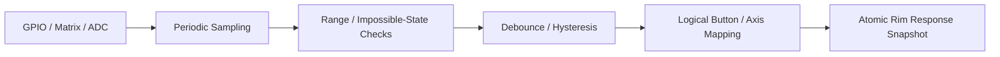

| Đầu vào | Phần cứng | Xử lý Firmware |
|---|---|---|
| Nút bấm (Pushbutton) | GPIO trực tiếp hoặc matrix | Cấu hình pull, debounce, nhận biết phím kẹt |
| Lẫy số (Shift paddle) | Microswitch hoặc Hall switch | Debounce độ trễ thấp và báo cáo cạnh/trạng thái (edge/state) |
| Bộ mã hóa quay (Rotary encoder) | Tiếp điểm vuông pha (Quadrature contacts)/Hall | Bảng chuyển tiếp (Transition table), triệt nhiễu (bounce rejection), bộ tích lũy (accumulator) |
| Funky switch/D-pad | Công tắc rời (Discrete switches) hoặc thang điện trở (resistor ladder) | Phân loại hướng và dùng hysteresis |
| Lẫy ly hợp Analog | Hall sensor/potentiometer | Lọc bộ ADC, hiệu chuẩn cực tiểu/đại (min/max), định vùng điểm chết (deadzone) |
| Thumb joystick | Cặp trục Dual Hall/potentiometer | ADC, hiệu chỉnh ở giữa (center calibration), lập bản đồ tròn/vuông |
| Công tắc mode | Multi-position số/tương tự | Trạng thái mod ổn định và cấu hình khả năng map (mapping) |

Một số ngõ vào trong số đó là loại rotary hoặc analog. Một rotary encoder báo cáo các bước dịch chuyển (incremental steps) thành cặp A/B vuông pha, ở đó thứ tự góc pha hai mạch sẽ định mã hướng; trong khi analog clutch paddle hoặc thumb joystick thì đo qua Cảm biến từ Hall hoặc chiết áp potentiometer chạy trên ADC. Biểu đồ dưới đây dùng để so đo về chiết áp tiếp điểm vật lý so với dĩa từ của encoder và mạch tạo sóng A/B.

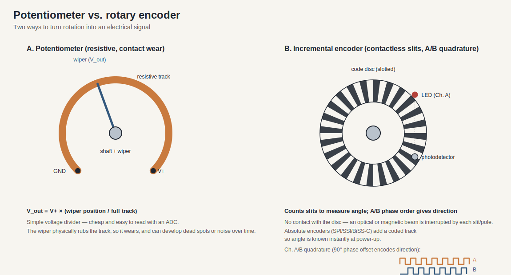

### 7.2 Kiến trúc Đầu ra

| Đầu ra | Driver điều khiển | Nguồn sinh dữ liệu | Chính sách Cập nhật |
|---|---|---|---|
| Màn hình phân đoạn / Segment | TM1637 hoặc một trình điều khiển khác | Menu hiệu chuẩn Base hoặc từ host telemetry | Thay đổi mới ghi đè |
| RPM LEDs | Mạch GPIO, bộ ghi dịch, chip LED | Data game telemetry truyền ngang qua thiết bị chủ (host/base) | Cập nhật dạng giới hạn băng thông (Rate-limited frame) |
| Cờ báo/Flag LEDs | Thiết bị Addressable/dây hằng dòng | Tình trạng của Base hoặc Trò chơi | Mức Ưu tiên báo cảnh cao hơn chạy trang trí (Priority alerts) |
| Màn OLED/LCD | Trình SPI/QSPI riêng | Thiết bị chẩn đoán, telemetry tổng hoặc điều chỉnh | Chạy chuẩn mức DMA, giới hạn số FPS chạy trên đoạn |
| Rung cơ / Rumble | Mạch MOSFET/transistor băm xung | Số vòng Pedal slip/ABS hay trực tiếp từ lệnh base | Nhịp băm PWM kết hợp độ nhiệt ngắt/tải quá cực (limits) |

Cấu trúc mạch báo phần mềm `hid-fanatecff` sẽ tách luồng của bánh vô lăng về màn hình + bộ bóng LED theo thiết bị xử lý tách hoàn toàn so với vòng kiểm duyệt FF vòng input. Bộ điều chỉnh `hid-fanatecff-tools` tự cập nhật vòng (UDP/shared-memory telemetry) sau đó đẩy số xuất ra. Các máy cấu hình hiện đại (implementation) cần đảm bảo phân rã mức (split) phần truyền tải giữa lực vô lăng + dữ liệu truyền vòng thật (FFB) cho nó khỏi chặn việc tạo bảng chạy dữ liệu đo màn.

## 8. Truyền thông Rim tới Base

Khu vực này đo lường (examines) tính linh động trao đổi dữ liệu (data exchange) giữa vành vô lăng (steering rim) và base điều khiển. Phân bổ các phương thức nhận biết thiết bị qua nhiều nền tảng của hệ mã cấu trúc cũ để cho hệ sản phẩm mới độ bền vững hơn.

### 8.1 Nền Tảng Cơ Sở / Mô hình Mã Công Cộng Cũ (Legacy/Community Model)

Hệ thống mã mở trên cộng đồng của `Arduino_Fanatec_Wheel` phác họa nên tính tham chiếu rõ rệt của những kiến trúc đời cổ. Đây là số liệu minh họa, không dùng để quy định chuẩn cho quy trình ký duyệt nội bộ thương mại ở những bộ wheel (vô lăng) mới của nhà máy.

**Hình 8-1: Chuỗi Giao dịch SPI Rim-tới-Base**

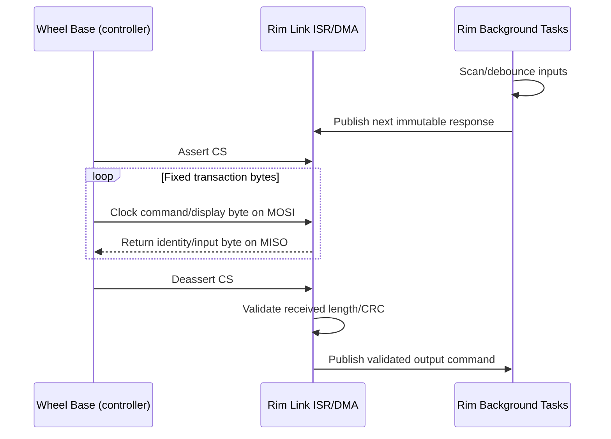

### 8.2 Ranh giới Thế hệ (Generation Boundary)

| Số liệu bằng chứng | Độ công khai trên cộng đồng | Đánh giá tổng hợp Kỹ sư (Engineering conclusion) |
|---|---|---|
| Nhóm Base đời cũ bộ (CSW) | Xác nhận bởi hệ giả lập làm trên board Arduino | Code chạy SPI cũ (Legacy SPI) có quyền làm vật so sánh mẫu để chuẩn hóa. |
| Mẫu CSL DD / DD1 / DD2 | Nhóm mã nguồn trần thiết bị nhận mạch. | Độ trễ vòng cùng chuẩn xung nguồn cần phải do firmware từ mạch điều chỉnh quyết lại. |
| Dòng ClubSport DD / DD+ | Xác nhận từ file thiết bị là KHÔNG chạy với code giả lập hiện hành (incompatible). | Coi là thiết bị có đổi khác (timing/protocol/hoặc security). Không đưa quy cách của mạch cũ lên nền móng này để chuẩn. |
| Đời máy tương lai Podium DD (2026) | Chưa nhận có thiết bị nào tương đương | Luôn chặn tương thích trên chuẩn cũ khi chưa thu chuẩn kết nối đúng (interface definition). |
| Các Mẫu base/rim thế hệ mới | Chưa rõ | Cần giao thức thỏa thuận và thông tin xác thực bắt buộc. |

Nền tảng thương mại thực tế vẫn phải rạch ròi bằng bộ ngàm khóa chân cơ (mechanical boundary). Sản phẩm mâm quay của store Fanatec chính gốc dùng chuẩn kết nối QR2 cho thiết kế (như là thông tin kể từ ngày 2026-02-16), bộ cũ mã QR1 bị chặn ngưng cấp. Các chân chuẩn QR2 sẽ cần cấu hình ghép chân của mặt Mâm-Wheel (Wheel-Side) với mặt trục-Base (Base-Side); giao thức dùng SPI sẽ không đại diện hoặc đo độ chặt cơ khí của ốc vít mô-men cũng không phải là điều kiện giao tiếp mã hiện đời nay.

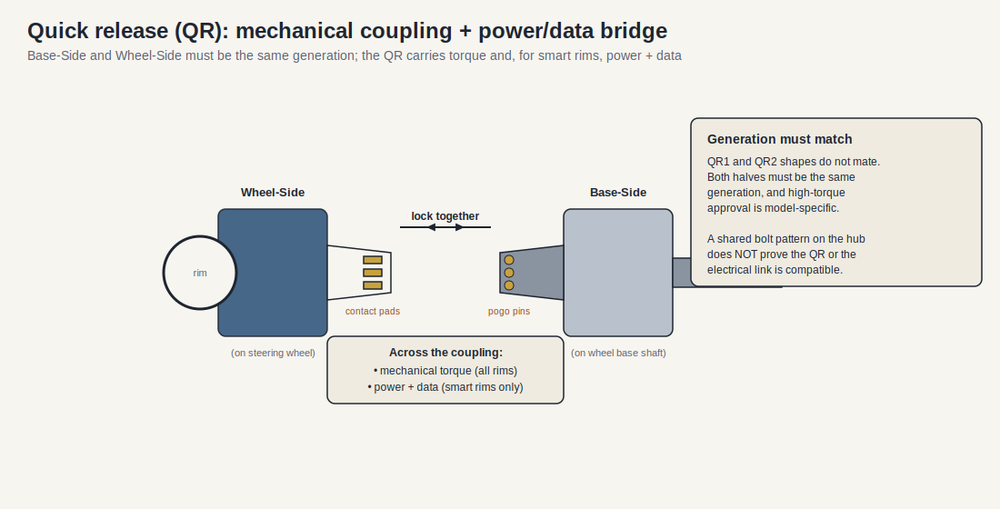

Quick Release (QR) là mạch dẫn đi tín hiệu mạch (electrical link) từ ngàm vành qua mâm trục base: Cấu trúc nửa ngoài nối cùng mạch vòng và một phần nối tiếp xuống ống thép (Base-Side), tải qua trục đai một lượng mô-men vật lý, còn cung cấp nguồn điện (power) và tín hiệu mạch dọc qua các chân cắm lò xo (spring-pin contacts). Nửa mâm bên ngoài/trong phải bằng bộ dòng mẫu thì mới có khả năng kết nối cùng hệ điều hành, cho nên chỉ việc khớp chân ngàm bu lông cơ học không đánh giá tính ổn cho bộ mã QR hoặc protocol tương thích nào.

Chức năng bản quyền Console của Xbox/PlayStation được tách riêng với rim data link. Base-PlayStation chỉ chạy license có trên cụm base. Các quyền tay cầm hub Xbox thì lưu ở mâm Rim/Hub. Chớ phỏng đoán bộ kết nối check console (console-authentication messages) ra khỏi các bản báo (emulators) trên github vì đó là bảo mật mã nguồn đóng.

Sự lệch hệ cấu hình (incompatibility) ở Base/rim thường đến từ chậm vòng nhận tín hiệu thiết bị, thay đổi vòng băm thời gian, điện chênh áp, đổi đóng gói (framing), hệ điều chỉnh key mã vòng (authentication) hoặc một thiết kế kiến trúc máy tổng mới. Cho nên mạch phần cứng phải loại trừ các thiết kế chạy đồng hồ đo bừa và giả mạo báo lệnh không hợp đời (generation mismatches) để qua kiểm soát hệ thống.

### 8.3 Yêu cầu Truyền Thông cho Thiết kế Mới

| Yêu cầu | Đề xuất hành vi hoạt động |
|---|---|
| Khung cấp nguồn (Electrical levels) | Các thiết kế bắt buộc sử dụng mốc áp (voltage) máy riêng của thiết bị tương thích; Một dây tín hiệu 5 V sẽ không đấu chung dây dẫn báo input của mạch 3.3 V. |
| Chạy khởi chạy (Startup) | Chân báo nhận (MISO) luôn cần gạt cách điện (high-impedance) trong khi chưa gửi báo/bật kết nối (chưa select); Mạch thu tín hiệu chuẩn sẽ hoàn thiện nhận tin trên báo đo thực tiễn quy trình. |
| Kiểu Đóng Gói Lệnh (Framing) | Gói cấu trúc thông tin có đủ thông tin mã (Header), phiên bản đời phần mềm (Version), số (Length), tệp mang truyền lệnh dữ liệu phụ tải (Payload), mã sửa CRC cho khung quản trị giao thức. |
| Tươi tin/Mới mẻ (Freshness) | Bảng mã quy ước sẽ cần các bộ đếm đếm theo mốc khung gói tin nhận để không lặp (sequence number / transaction counter). |
| Check xử lý Sự Cố (Error handling) | Bản firmware sẽ từ chối loại báo khung tin nhận dỏm (invalid RX frames), và thay thế mã bằng số fallback ổn định, sau đó tăng (increment) mã lỗi bộ đo error counters. |
| Xác nhận chạy Máy (Compatibility) | Dây kết nối (rim link) nhận quyền đọc và cấu hình bit mã phân bổ thông tin bản mẫu đời version to/nhỏ đến thẳng máy base chính. |
| Cắm nối tức thì (Hot-plug) | Bộ xử lý không bị rớt tín hiệu ngầm tiếp giáp nối mâm điện cơ, bảo mật vòng phục điện (brownout-safe reset) khi gắn, tránh bị tắt khóa nghẽn trên main-bus. |
| Treo lệnh (Timeout) | Bản firmware phần thiết bị phụ bắt buộc gỡ dữ liệu tạm lưu (momentary controls) nếu gói báo của liên kết không thay đổi quá thời hạn báo truyền lệnh mới. |

## 9. Kiến trúc Firmware Tham chiếu

Phần này giới thiệu cách cấu hình thiết kế tổng của ứng dụng cho dòng xử lý MCU bên trong thiết bị rim. Kiến trúc nhấn mạnh cách giảm trừ giao thức công việc ngầm nền (background processing tasks) nhường trạm ưu tiên tốc hành (real-time) cho dây gửi thông số base để chống chậm/treo tín hiệu.

**Hình 9-1: Luồng Thực thi Firmware**

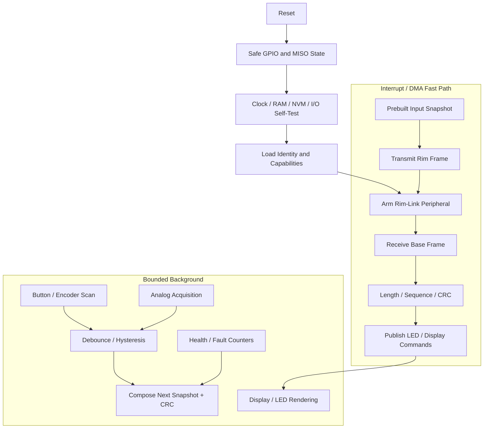

### 9.1 Các Phân khu Mô-đun (Modules)

| Mô-đun | Trách nhiệm Xử lý | Bối cảnh Thực thi |
|---|---|---|
| Khởi chạy/Trình Boot | Safe pins (pin chặn an toàn), self-test (tự đo), cấp dạng định danh, cài nối chuẩn | Reset path |
| Tín hiệu Link ISR/DMA | Trao đổi chuỗi gói quy ước, đánh mốc điểm (byte index), và cấu định chân mã mạch viền (CS boundary) | Có mức cao nhất của mã vành |
| Frame validator | Quản định khung mã dài (Length, CRC, dãy mạch, command logic kiểm) | Nằm trong nền ISR cao nhất/hay high-priority task |
| Thu lại tin/Input acquisition | Đo Matrix, chạy ADC điện áp đo, scan bảng chân tín hiệu (encoders/GPIO) | Trạm xử lý (Periodic timer/task) định kỳ |
| Đảo sóng Debounce/filter | Tạo dạng khối chuyển tín hiệu nhiễu về (logical state) | Trạm xử lý (Periodic task) |
| Snapshot composer | Soạn sẵn số mẫu dữ liệu chờ gửi, gắn mã block phản hồi. | Chạy nền rãnh của mỗi transaction |
| Trạm gọi mã Output dispatcher | Trả thông báo đèn sáng cho bảng mã điều hướng | Tác vụ (Task) |
| Định danh máy móc (Device identity) | Báo cấu tạo, mẫu linh kiện, và số firmware version đời chip | Query / Khởi động cấp thông báo |
| Rà soát lỗi máy (Diagnostics) | Tính toán quá tốc/lượt, lỗi (CRC), điểm hỏng điện vòng rail | Background/Phông nền |
| Update mã (Bootloader) | Xác minh (Verify)/update/phục kích image lỗi | Luôn khóa chế độ ngắt mô tơ (torque-safe) khi đang nạp |

### 9.2 Thiết kế Buffer Bộ nhớ đệm (Buffering Model)

Phần firmware cần phải giải phóng nhiệm vụ nền chậm (slow background tasks) cách ly khỏi công việc deadline cấp báo mã nhanh (fast link).

- Nền tảng cấu trúc cần ứng dụng bộ đệm đôi (double buffering) cho chuỗi gửi truyền thông TX.
- Một TX snapshot đang chạy báo cáo sẽ không bị đè đổi nội dung (immutable) trong một chu kỳ xác nhận chuyển của trạm điều khiển (base transaction).
- Các bộ điều nhận/scan sẽ xử lý đắp dữ liệu vô các gói đệm phụ chưa gửi (inactive snapshot).
- Hàm thay cờ hoặc mã truyền luân phiên lệnh gọi atomic (atomic pointer/index swap) bắt buộc nằm đúng giới hạn khung gửi báo cáo chuyển mã (transaction boundary).
- Bản firmware được yêu cầu phân tính (validate) chuẩn đầu mã RX trước khi kích hiệu ứng ánh sáng đèn hiển thị hoặc tinh chỉnh chế độ config.
- Đối với trường hợp có CRC hoặc chiều dài sai lệch, firmware phải giữ nguyên trạng thái đầu ra (output) an toàn không gây sát thương hiện có và phải tăng các bộ đếm lỗi chẩn đoán (diagnostic counters).

## 10. Kiến trúc Phần mềm Máy chủ (Host Software Architecture)

Phần này phân tích phần mềm hoạt động ở môi trường Máy chủ như Driver Linux hoặc tool ứng dụng. Việc thông qua hệ nền (OS) sẽ chia bóc rõ bộ game nhận hiệu lệnh liên quan đến các tay vô lăng và vòng mâm của vành vô lăng (steering rim).

**Hình 10-1: Kiến trúc Host Software**

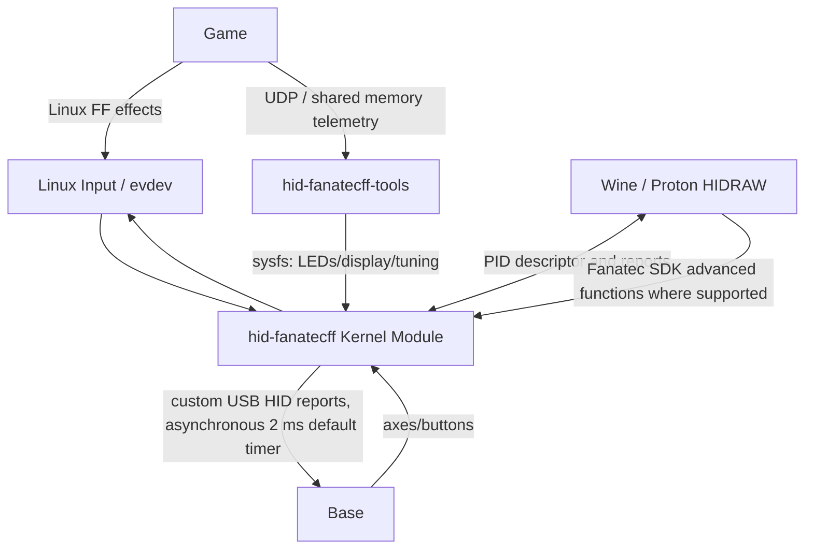

### 10.1 Trách nhiệm Trình điều khiển (Driver)

| Lớp xử lý | Tính chất và vai trò |
|---|---|
| Lớp nhập tín hiệu nền (Linux input subsystem) | Cấp phép hệ hiệu ứng cho nút, trục, FF standard |
| Phần lõi `hid-fanatecff` core | Giao nhận máy gốc (Device matching), xử trí HID/reports báo thiết bị |
| Phiên dịch (FF translation) | Dịch chuỗi báo chuyển mã tác dụng của Linux/PID lên lệnh/tin HID riêng cho hãng; bộ đồng hồ đếm mặc định (asynchronous) là 2 ms |
| Lớp tích hợp mã sysfs | Xử lý Range độ quay, wheel ID (mã base), tuning mốc, LEDs ánh sáng, rung phản cảm phanh chân pedal |
| Khối dẫn báo (HIDRAW path) | Trao API truy vấn trực tiếp báo PID cho dòng (Proton/Wine) chạy trực tiếp tính năng SDK của hãng sản xuất |
| Trạm Telemetry (Telemetry tool) | Tính chuẩn hệ ứng dụng game (UDP/shared-memory) lên dữ liệu vẽ hình trên mâm đèn Base/LED/LCD |

Bộ driver của Máy chủ máy khách hoàn toàn rỗng so với Firmware của Base. Driver Máy chủ trao báo điện toán ở các USB ports; và vòng mạch base sẽ xử lý bộ lệnh phụ cho vành tay quay (Rim) sau đó báo cáo. Phân định vùng dữ liệu này tạo kết nối phân tầng (separation) trong lúc xác định chức năng lỗi ngầm máy cho lập trình: ví dụ: "mạch nhận nút hoạt động mà đèn chưa phản hồi".

## 11. Các Đặc tính Xử lý Thời gian thực (Real-Time Behavior)

Phân bổ và quản lý chu trình phân tính tốc độ làm tươi thông báo (refresh/cadence) trên thiết kế hệ thống là yếu tố then chốt cho phần mềm vô lăng. Vành tay lái (Rim) bị lỗi giật mã thời gian khi báo nút điều hướng vì tính hiệu báo chưa chạy rảnh/nhanh với khung xử lý mâm điện tử hiển thị.

Những quy ước đánh số liệt kê sau không đại diện cho giá trị của chính hãng nhà máy Fanatec, nó chỉ làm mục tiêu giả định cho dân điều chế.

| Tính Vận Hành | Chuẩn tốc độ báo giá trị | Thứ tự Mức Ưu tiên | Ghi chú Thiết kế |
|---|---|---|---|
| Mã Base tín hiệu chốt nhận ISR/DMA | Đi chung trên mọi kỳ của base nhận. | Cao nhất | Phải dựa vào đo thực tế của đồng hồ/CS base. |
| Scan Encoder/Button matrix | Tốc vòng 500–1000 Hz | Cao (High) | Tránh rớt gói mã lặp (debounce) trễ/Lag |
| Chuyển tín hiệu độ đo ADC | 500–1000 Hz | Cao | Đẩy vô lọc bằng timer bộ ADC cho snapshot |
| Đắp báo / Soạn file khung mới (Snapshot compose) | Trên nền của lệnh thay mã/theo scan | Cao | Đắp tin báo truyền kế tiếp xong trước chu kì giao tiếp tới. |
| LED update/Cập nhật báo sáng đèn | Rơi rớt 50–200 Hz | Medium | Update cho những gì mới, theo dạng báo rate-limit |
| Xử lý Segment display / Số bảng hiển thị | 20–100 Hz | Medium | Tính chất báo thị lực/kém nhạy so với tốc độ tín hiệu Link |
| LCD Màn Động chất lượng | Xấp xỉ 20–60 FPS | Medium/low | Buộc phải qua bộ cấp báo vòng DMA ở cục điểm phần tư (partial update). |
| Báo mã chẩn đoán (Diagnostics) | Chậm từ 1–10 Hz cùng ghi log counter | Thấp (Low) | Không để dây chạy báo cổng nối tiếp chặn vòng lặp mã gốc. |
| Ghi xuất NVM | Tại thời điểm chốt cờ/nhấn commit | Kém Nhất (Lowest) | Chạy Atomic (mức lệnh gốc), chống mòn thẻ ghi (wear-limited), đứng ngoài vòng giao tiếp |

## 12. State Machines (Cấu trúc Máy trạng thái)

Đây là khối phân tích rõ tính vòng truyền liên tục cho tay vành vô lăng (steering rim) từ khởi nguyên gắn cổng vật lý (power up) tới hoạt động truyền tín hiệu báo chuẩn nhận lệnh và check rớt điện chập chờn.

### 12.1 Vòng đời Rim Lifecycle

**Hình 12-1: State Machine Vòng đời Rim Lifecycle**

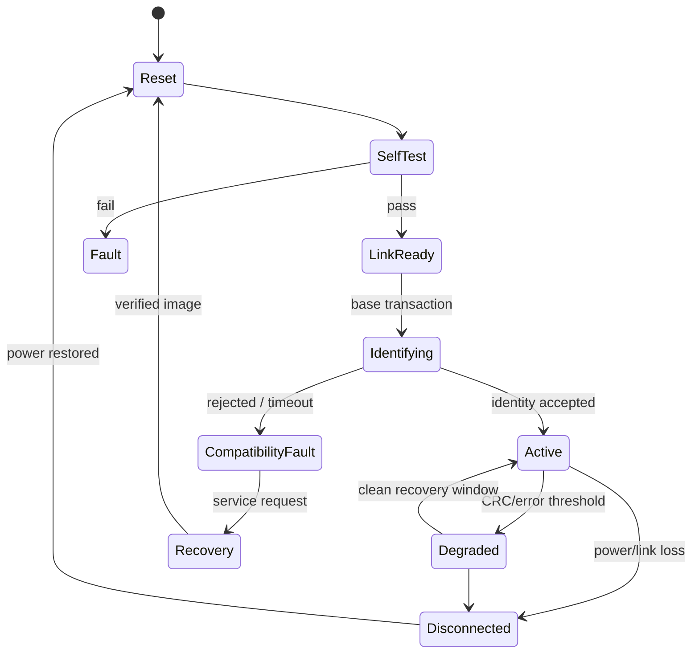

### 12.2 Mốc giao dịch truyền mã Transaction State

**Hình 12-2: Máy Trạng thái cho Một Vòng Giao dịch (Transaction State)**

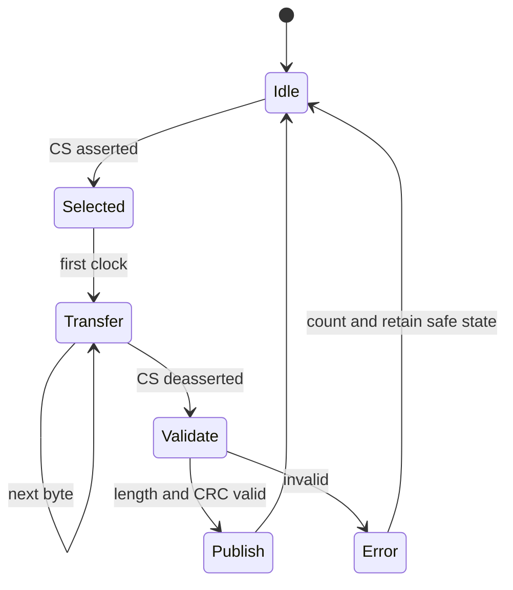

## 13. Kiến trúc Thiết kế Đề xuất

Phần này hợp nhất tất cả những khuyến nghị chuyên sâu về cơ điện vô lăng ra cấu trúc làm chuẩn để áp dụng thiết kế mâm Rim đua xe chuyên nghiệp thật thay cho làm bo mạch "Hobby" tự chế.

### 13.1 Mảng phần Cứng Cơ lý (Hardware)

1. Thiết kế bắt buộc có dòng chuẩn native MCU nội bộ (native 3.3 V MCU), ưu tiên các mã peripheral-mode SPI có độ chẩn đoán cao theo đúng nền mốc thông qua kỹ thuật từ hãng base.
2. Nền tảng cần dùng mạch giới hạn áp cấp độc lập/khối Ideal-diode cho cả khu nguồn điện ở trục QR so với điểm cắm USB ngoài/gỡ lỗi debug.
3. Kênh dữ liệu/Nguồn sạc cổng QR/QR signals không tự xả áp, có thông số khởi sinh ban đầu bảo vệ high-impedance reset / chống trả dòng ngắt sốc điện.
4. Xử lý IC ngoại vi Expanders/shift registers trong phạm vi kiểm định tính scan nhanh, độ trễ nhạy/phanh kẹt hoặc ghosting acceptable limit.
5. Setup các thiết bị tải như Led, Display, và IC đèn theo mạch Load switch khóa dòng đo nhiệt.
6. Module Analog ADC buộc đi theo mạch chặn quá tín hiệu, bộ lọc ADC (RC filter) hiệu chuẩn bảo dưỡng an toàn kèm mạch đo đứt liên kết báo chân lỗi (diagnosable).
7. Giao diện chân nối JTAG/cáp cắm có hỗ trợ debug báo vòng lỗi trên điểm sản xuất và chạy phục hồi.

### 13.2 Phân Mảng Phần mềm (Software Layers)

**Hình 13-1: Đề xuất các Tầng Phần mềm**

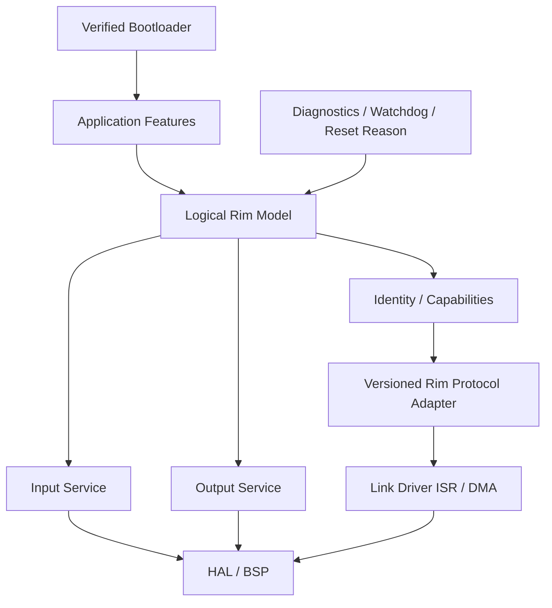

### 13.3 Yêu cầu Quy chuẩn An toàn Tuyệt đối

- Bản thân firmware bị cấm ngặt hành vi gửi console báo lỗi báo in chuỗi dài (serial logging) hay render trực tiếp vào vòng Link ISR.
- Không cho phép làm báo cáo biến dạng (mutable response buffer) tại lúc phiên thông báo chưa chốt.
- Tuyệt đối mạch Hardware không nối dây dẫn tín hiệu áp ra chuẩn 5 V vô ngõ input chờ (unverified base signal).
- Chặn mạch dẫn đấu ngược giữa điện cung cáp QR với máy USB gốc PC.
- Cấm để bộ thông số cũ/cổ firmware nhét xài bừa lên bộ chân ngàm của base đời mới (legacy pattern mismatch).
- Bị rớt (outage) kết nối telemetry nhưng vòng nút (buttons) bấm phải hoạt động thông số đúng không sập theo.
- Lỗi tại mâm lái Rim (hư LED/đứt chip) không cho tác động tới lệnh bảo mật vòng chặn/tốc độ (motor safety limits) của thiết bị.
- Bản Update Firmware sẽ không để phần mã mạch liên tục vận chuyển hoặc bật kích điện tại điểm phục điện hoặc đang chạy khôi phục (Reset/recovery).

## 14. Tính Bền Vững, Chống Chập Điện và Tính Mở Khoá

Biện pháp bảo vệ phòng tai nạn, hỏa hoạn hoặc lỗi ngắt điện từ chập tải. Thiết bị vô lăng quay nhanh có độ va chạm cáp và độ mòn do rung lắc nên cực rủi ro nếu sai lầm kĩ thuật (security bypass/fault logic).

Mặc dù vô lăng không có cơ phận quản lý thông số động cơ xoắn vòng, nhưng lỗi nhận dạng giả bộ mâm tương thích sẽ báo cáo nhầm và hỏng hóc, hoặc mất mã nút E-stop trên vô lăng (if any). Về phương diện sử dụng, User/nhà chế tạo không được thiết lập Emulator (cộng đồng) để né bản quyền bảo mật Console (vượt firewall bản quyền / console bypass / security key) gây cấm thiết bị vĩnh viễn.

### 14.1 Nhận biết rủi ro về Điện học và Quản lý Lỗi

| Nguy cơ Báo Lỗi Rủi ro | Giải pháp Điều phối Hệ thống (Control) |
|---|---|
| Chập chờn Bus (Bus contention) | Dùng cấu hình đúng điện áp native/có bộ chuyển dòng (level shifter) có chiều dẫn bảo vệ/Reset trở kháng cao (High-Z)/Điện trở bảo vệ trên dây |
| Trào nguồn ngược vòng (Power backfeed) | Ideal-diode mux/công tắc khoá/Không đấu trực tiếp chân mạch nối 2 chiều cáp. |
| Độ xóc cắm QR (Contact bounce) | Mạch báo giám sát Brownout (sập điện nhỏ), bộ chống nhiễu (debounced presence), đo vòng kết nối chập/khôi phục giao dịch mã (transaction recovery). |
| Trễ quá giờ Boot khởi động | Giảm công đoạn test boot, cắt các điểm làm trễ vô nghĩa (unnecessary delay)/tạo bản copy mã Identity cài trên chip đọc thẳng. |
| Mật độ lỗi CRC storm | Tăng cờ nhận CRC hỏng/Đồng bộ lại khung vòng báo/Thiết lập trạng thái hoạt động cảnh báo an toàn bị giới hạn. |
| Mắc kẹt Nút bấm Button | Đo thời điểm Plausibility ngắt đếm (stuck-duration diagnostics)/Đưa tính báo trạng thái Host theo chuẩn support. |
| Độ dội Encoder bounce | Tăng bảng chuyển dịch (Transition table) đọc chốt điểm xung nhịp/Cài bộ đo đếm chốt thông số phi chuẩn. |
| Treo tín hiệu bộ báo Màn Hình (Starvation) | Chia mảng xử lý DMA/ giới hạn vòng cập nhật; cấu hình mức cấp độ cho việc này nằm sau đường Input/Link. |
| Méo file Update (Corrupt update) | Cần chứng nhận file mã chuẩn/Xác nhận khung cấu trúc không lỗi Integrity/Dự phòng phương án Recovery path. |
| Lạ base Base Không Xác định | Tuyên bố khước từ (Compatibility rejection) an toàn không truy xuất lệnh lạ chứ không tự mò mã điện thế áp chẩn vào linh kiện dỏm (guessing base). |

## 15. Kiểm tra Xác nhận Kỹ Thuật Hệ thống (Verification Strategy)

Một mạch cơ khí của Base Wheel muốn sử dụng và lên truyền hình thực tế cho khách thì phải qua bao nhiêu chốt test phần mềm và phần điện tử trên bài đo phòng thí nghiệm (Bench/Matrix). Đọc thông tin hướng dẫn theo sơ đồ chạy bảng thử cho tới đánh giá cấp công nghiệp (Unit to system levels).

### 15.1 Chuỗi Bước Kiểm định Test Đo Kĩ (Bench Sequence)

| Tiến độ Đo | Kế hoạch Hành động (Action) | Ghi chú/Yêu cầu (Constraint) |
|---|---|---|
| 1 | Test check đầu dây phân phối ngõ áp (voltage rails)/chức năng chiều (orientation) của cổng và test chập hạn dòng điện | Mạch không nối vào thiết bị Base nào (No base connected) |
| 2 | Check nguồn (unpowered/reset pin) coi điểm chốt tổng kháng tải/kiểm soát ngăn dòng trào ngược USB/QR. | Chặn tranh dành chập nguồn (contention) |
| 3 | Chấm điểm Boot khởi động chờ link mở đầu, đo khi quá nhiệt/hay khi thiếu sụt điện áp. | Độ trễ bảo đảm cho máy quét định danh (enumeration) |
| 4 | Đo bộ lập trình (protocol simulator) trên máy mô phỏng đo sóng trước. | Tiêu chuẩn vượt rào đầu tiên để lắp base lên nguồn thật. |
| 5 | Tính chênh điểm CS / MOSI/MISO clock mode (Setup/hold), chốt dải tốc độ nhận mã + độ delay báo cáo/kiểm soát CRC. | Cho ra điểm đánh giá tốc độ Link (link stability). |
| 6 | Thí nghiệm thả/gắn (inject) khung báo ngắn/lỗi đồng hồ, cố ý chạy mã CRC sai/thả liên tục điểm nối nhanh/hay sập nguồn (brownout). | Nghiệm thu độ chịu lỗi sập của bảng mạch |
| 7 | Cấp tín hiệu chập ngắt/nhiễu kẹt phím kéo cho các cổng chân nối ADC/công tắc matrix input (simultaneous activation/open/short). | Xác suất dội sóng nhiễu của Board Mạch |
| 8 | Tung công suất cao cho LED/LCD hiển thị liên tục đồng thời chứng minh luồng test Link Transaction với Base không mất vòng tín hiệu nào (zero link drop). | Chứng minh hiệu năng Real-time Scheduling |
| 9 | Làm bài thử tắt nguồn cập nhật FW Firmware ngang hay làm lỗi image tải lại | Bảo toàn thông tin sử dụng thực địa (field reliability) |
| 10 | So sánh từng tổ hợp firmware/base cho chuẩn độ tương thích | Cấp chứng nhận kết quả bộ test/dữ liệu tương thích |

### 15.2 Ma trận Test Nền tảng (Test Matrix)

| Tầng kiểm định Test | Mô Hình Thực tế |
|---|---|
| Lớp báo nhận / Host unit | CRC kiểm báo, lệnh mổ xẻ frame, biểu đồ map phím/Encoder, hệ phương trình offset cân đối dòng bàn đạp... |
| Phân tích Chip / MCU unit | Hệ điều khiển ngụy mạo fakes (HAL fakes), State machines test / Cấu trúc schema NVM |
| Phụ tải lẻ (Component) | DMA điều phối SPI mạch phụ (peripheral timing/completion), dung sai lệch chuẩn của báo cảm ADC, điều khiển Driver hiển thị |
| Giả Lập/HIL (Hardware-in-the-Loop) | Base mô-men giả/hộp nhái điện chập/khởi sắc điểm giao nối rác/nhiễu (malformed frames/power bounce). |
| Điểm Hệ Điều Hành System | Test chéo Wheel rims / Trình giả Host driver / Test game thật / Test hiển thị (telemetry) trên nhiều Base |
| Đo tải ngâm Soak Test | Sức ép rung (Vibration)/ Đảo tháo chốt cơ ngàm QR nhanh/Đẩy nhiệt lên đỉnh/Test ngâm điện đèn sáng (long LED/buttons traffic) |

### 15.3 Khí Cụ Đo

- Thước Đo sóng Lập Trình/Logic analyzer: Đếm rà xung CS, SCLK, MOSI, MISO, hay ghim các chân kết nối/ready GPIO.
- Băng Cầm Ký/Oscilloscope: Phân tích đường điện sạc (rails), sóng dòng chập chấn sạc (inrush), báo lỗi reset/hệ số điện qua (level-shifter edges), với dòng rò trào ngược (backfeed current).
- Cờ báo điểm mạch (Firmware counters): Đo khung mã (transactions), báo cáo các trường lỗi CRC, length error, bộ ghi lặp nhịp trễ báo (overruns/missed scans) và thông báo mã điểm khởi sập reset.
- Báo tín hiệu vòng cuối cho hệ PC (Host trace): Đơn báo USB, khung tín hiệu sysfs/HIDRAW, độ lệch lưu lượng khung truyền dữ liệu đồ họa (telemetry cadence).

## 16. Lộ trình Thực thi Phát triển

Sơ đồ trình bày chuỗi công việc được đề xuất chuẩn khi có team xây dựng lên kế hoạch cấp phần mềm chạy Base + Rims thương mại thay dự án nhỏ.

| Chặng Step | Kế hoạch Hành động (Action) | Ghi chú/Yêu cầu (Constraint) |
|---|---|---|
| 1 | Lấy thông số kỹ thuật điện ngàm QR chuẩn mực nhất cho hệ sinh thái máy phát. | Kế hoạch cứng (Foundation for hardware) |
| 2 | Tạo bộ yêu cầu số lượng đèn, analog input, phím bấm, tính boot khởi đầu đo đếm hạn chờ (deadline boot timing). | Tính năng báo (Product definition) |
| 3 | Tạo bảng test cắm đo nối cơ/pinout chập báo nhưng không câu qua Base trước | An toàn phần cứng đầu tiên |
| 4 | Kích hoạt bộ chuyển I/O độc lập phần mềm cho chức năng chuẩn thông điệp (input/output firmware) kèm test tĩnh. | Logic hoạt động máy Firmware |
| 5 | Thêm lớp trung gian Firmware phiên bản hệ cấu giao tiếp cho mã liên kết chuẩn Base Protocol. | Mã trung chuyển Base communication |
| 6 | Bật tính kiểm soát dòng ngắt an toàn chân sạc cho IC không cho mã rác ngấm lên kết nối | Đóng phần mạch nguy hại phá base Base damage |
| 7 | Cắm cho base test điện chuẩn truyền thông bộ vòng mạch không sập, đánh giá giao thức mô-men. | Chạy thử tính kết nối (Link testing) |
| 8 | Bơm báo mã cho tính năng trang trí màn hiển thị nếu hệ Input và Link không mất gói nào (stress test ổn định tỷ lệ Error = 0). | Nâng năng suất nhưng tránh chập (real-time regression) |
| 9 | Add bảo vệ Firmware, khôi phục Firmware (Recovery) chuẩn đo mạch/update báo mã đo vòng lỗi cho System. | Features bảo đảm chạy bền lâu Reliability |
| 10 | Công bố mã tương thích matrix có nêu đầy đủ tổ hợp không chuẩn bị báo không tương thích rõ (unsupported combinations) tới End-user. | Phục vụ hậu mãi |

## 17. Sổ Đăng ký Câu hỏi (Đã giải quyết và Mở)

Được review vào ngày 2026-07-05. Các mục đã có lời giải trên các phương diện chuẩn được ghi cấu trúc xác nhận rõ **Resolved**; mục riêng về đặc tính thông số của hãng cần tự tham chiếu chuẩn bị đo/lấy số liệu chính tay (Open - developer self-investigation).

### 17.1 Đã giải quyết (Phương pháp/kiến trúc đã xác định)

- **Mã báo liên kết Rim là dùng theo giao thức SPI kế thừa, bộ báo truyền kiểu mới, hay là thương lượng chạy đa bộ cấp phát truyền dữ liệu (multiple transports)?**
  **Bằng chứng cộng đồng: Cả hai cách truyền đều đang lưu hành.** Bo mạch rim thiết kế ngoài (lshachar/Arduino_Fanatec_Wheel, Alexbox364/F_Interface_AL, darknao/btClubSportWheel) chạy trên thiết bị cũ có cấu trúc mã lệnh nền **3.3 V base-master / rim-slave SPI**. Các mẫu động cơ điện Base Direct-Drive thế hệ sau nâng chuẩn biên mức báo lên cấu hình khác. Cần làm theo cách bộ cắm mô-đun (adapter/transport negotiation) mà không cố chấp ghi một hàm chạy mã gốc không thay thế duy nhất. Các tham số chính cho các máy thế hệ hiện thời sẽ được cấp riêng trong tài liệu gốc của hãng (Unknown, xem thêm 17.2).
- **Bộ cài (firmware) Rim qua cổng Wheel base USB cắm sẵn, cáp mạch chân USB/Debug phụ có mặt trên vô lăng hay sao?**
  **Verified public pattern (Kiểm duyệt hệ công cộng):** Chạy cài firmware qua trục Base cắm là chính (máy Base biến thành USB Hub/Updater cho cả khối); cổng mạch mạch Debug thì giấu đi chạy trong trung tâm hậu mãi xưởng sản xuất thay vì gắn dùng thường ngày. Cổng update do hệ tool gốc host Fanatec cấp chạy sẽ báo mã firmware base + cài thẳng vô hệ thống. Ưu tiên cách cập nhật qua mâm ("via base") và cổng USB debug phụ trên board gắn ngầm chuyên để fix (controlled service path for recovery).
- **Trình chơi game host / nền tảng telemetry game bắt buộc support chức năng bật màn LED hay hiển thị?**
  **Được xác định theo phương pháp:** Báo cáo LED và Data màn số không lấy dữ liệu theo mã hệ lực FF (force-feedback) mà kéo dữ liệu ra đường API truyền báo (telemetry pipeline) ngoài ([`telemetry.md`](./telemetry.md)). Sử dụng `SimHub` hoặc ứng dụng plugin (`hid-fanatecff-tools`) ở PC đã giải quyết đủ công cụ trên mọi hệ Game đua thông hành. Quyết toán bộ mã hỗ trợ API là dành cho công tác lựa chuẩn bán thị trường sản phẩm mới chứ không vì giới hạn công nghệ (17.2).

### 17.2 Đang mở — Dành cho Developer chủ động điều tra (self-investigate)

- **Chiếc Steering rim này phải chọn thiết bị và đời base truyền mô-men nào trên quy trình tích hợp nền?**
  *Cách làm:* Nguồn thiết lập theo quản trị và cấp độ (scope); kiểm đếm đủ hệ Base cấp cùng QR (version ngàm khóa), tất cả việc test, làm mẫu firmware ăn theo mốc số lượng này.
- **Quy chuẩn với base lớn/cục động cơ của mã ClubSport DD / DD+ có cần không, file xác định quy ước cho ngàm mã nối ở đâu?**
  *Cách làm:* Check chứng nhận/nếu yêu cầu thiết bị phải thông từ các bộ luật (official channels) của nhà mạng; Mọi đồ ảo giả lập hệ base emulator của các pháp sư trên Github không thay thế cho số liệu chính của base bản thương mại (current contract).
- **Nguồn cấp sạc cho bản khóa QR, mức xung điện (signal levels), số cắm tiếp điểm (contact order), hoặc chống áp vọt mạch ESD bảo vệ thì như thế nào?**
  *Cách làm:* Lấy công tơ đo ở mạch máy có bảo hành đã phê duyệt thông báo; chạy thử mạch do dân công nghệ (pinouts) làm qua công tơ đo thật kỹ không tin báo rác; cần đưa thiết kế mạch tĩnh ESD vô toàn bộ chuỗi ngàm cắm QR (QR contacts).
- **Quy tắc xác định vòng mốc cấp tín hiệu báo sống (first-response) khởi động bao lâu?**
  *Cách làm:* Thiết lập thiết bị ở mâm target báo đo công cụ chạy (Power-up cho ra first valid report/tín hiệu hợp lệ). Áp cái này chung và ép thời gian xử lý vào vòng đánh dấu kiểm duyệt loại trừ tín hiệu ẩu bị treo (stale-input policy).
- **Chỉ số cho điểm xác minh danh tính/thuộc tính tương thích khai lên base nào thì không vi phạm mã số cấp phép và cho chạy bình thường trên một rim mới làm?**
  *Cách làm:* Là mã luật phát lý (licensing question). Sẽ xử kiện ở mức đội pháp chế hệ thống (platform program) không cấp bừa mã lệnh base ID chạy qua vòng điểm (identity handshake) bị khóa mã bản quyền.
- **Thiết kế báo chân cắm (button/encoder/paddles/analog/LCD screen) tốn bao nhiêu mâm chân. Độ nhạy (haptics) nào cần xài?**
  *Cách làm:* Dựa vào nhu cầu làm cho mẫu thiết bị đua F1 đua GT... (§Form factors tại sách tài liệu tham khảo research doc) kết hợp chức năng (HID descriptor) lên tính chân.
- **Tiêu chí thử độ điện/điện áp và số báo hiệu ngầm Console-licensing (giấy quyền hãng Console) ở vùng an toàn nào?**
  *Cách làm:* Phụ thuộc khu bán và theo mẫu nền Console; Kiểm lại trong Qualification cho đầy đủ quy ước cấp phép (Qual testing).

## 18. Nguồn Tài Liệu Tham Khảo

Phân ban kết nối báo cáo / đưa chứng chỉ cộng đồng dùng kiểm định (Technical standards) để xây bộ mẫu tài liệu architecture.

### 18.1 Repositories Cơ Sở Cộng Đồng Mở

- [lshachar/Arduino_Fanatec_Wheel](https://github.com/lshachar/Arduino_Fanatec_Wheel) — hệ vô lăng DIY cũ SPI.
- [StuyoP/Fanatec-Wheel-Barebone-Emulator](https://github.com/StuyoP/Fanatec-Wheel-Barebone-Emulator) — board ATmega cho emulator rim (chạy trần).
- [FendtXerion3800/Fanatec-Pinout](https://github.com/FendtXerion3800/Fanatec-Pinout) — thông số cho chân port / phụ kiện vòng đua.
- [jssting/ArduinoTec-Pedals](https://github.com/jssting/ArduinoTec-Pedals) — Bảng điều khiển riêng cho cấu trúc pedal USB.
- [Alexbox364/F_Interface_AL](https://github.com/Alexbox364/F_Interface_AL) — Chế lại mẫu custom steering wheels qua SPI riêng.
- [GeekyDeaks/fanatec-pedal-emulator](https://github.com/GeekyDeaks/fanatec-pedal-emulator) — mạch proxy cổng USB báo tín hiệu pedal bàn đạp third-party thành qua RJ12 riêng của hãng.
- [StuyoP/Universal-Shifter-Interface-for-Fanatec](https://github.com/StuyoP/Universal-Shifter-Interface-for-Fanatec) — switch cho shifter truyền từ hub/RJ12.
- [gotzl/hid-fanatecff](https://github.com/gotzl/hid-fanatecff) — Firmware gốc của Kernel Linux hỗ trợ chạy báo HID/FF cho bánh Fanatec.
- [gotzl/hid-fanatecff-tools](https://github.com/gotzl/hid-fanatecff-tools) — Bảng chạy/chia đường dẫn truyền tín hiệu màn hiển thị telemetry-to-display.
- [GitHub Fanatec repository search](https://github.com/search?q=%20fanatec&type=repositories) — Trích dẫn nguồn xem cho biết. Check source độc lập luôn (validate independently).

### 18.2 Thông tin Báo/Chuẩn Mã Upstream Liên quan

- [darknao/btClubSportWheel](https://github.com/darknao/btClubSportWheel) — mã cơ bản từ nguồn (DIY rim projects).
- [Alexbox364/F_Interface_AL](https://github.com/Alexbox364/F_Interface_AL) — trích cho dự án Nano board dùng bộ level-converter/shift-register.
- [USB-IF HID specifications](https://www.usb.org/hid) — Chuẩn của tài liệu thông báo HID and PID.
- [Fanatec QR2 conversion guidance](https://help.fanatec.com/hc/en-us/articles/30011253510289-Which-products-can-be-converted-to-QR2) — Cấp thông số mạch mã của dòng Wheel/Base (Wheel-Side variants) cấp độ 2/chuẩn đổi đời QR.
- [Fanatec Steering Wheel FAQ](https://help.fanatec.com/hc/en-us/articles/43802514108433-Steering-Wheel-FAQ) — Thời hạn cấm sản xuất chuẩn QR1, thay vào mạch QR2.
- [Fanatec platform compatibility](https://www.fanatec.com/us-en/platforms) — Quyền chạy Xbox (bán theo Rim/hub vô lăng) và Quyền chạy riêng theo Base PlayStation.
- [Fanatec ecosystem source register](./references.md) — Ghi chú/ngày ra số liệu mã và bảng cảnh báo thiết bị bị cũ bỏ/vô hiệu.
