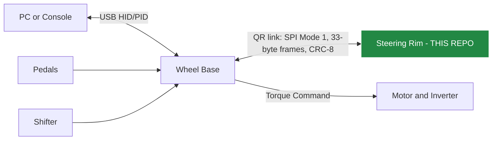
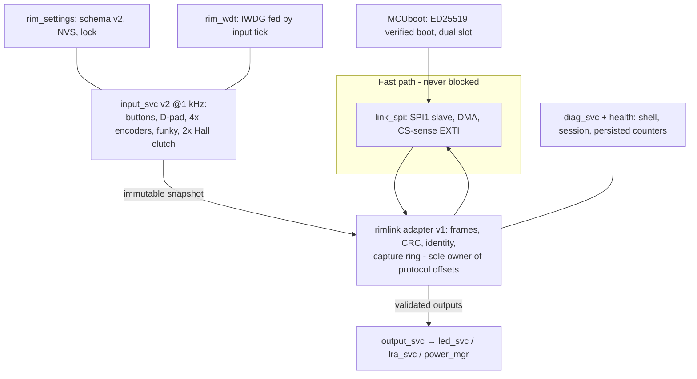

# System Architecture

> Version: 2.0
> Reviewed: 2026-07-04

## Document Change Log

| Version | Date | Changes |
|---|---|---|
| 2.0 | 2026-07-04 | Added the implemented rim firmware architecture and boundaries; retained the ecosystem context diagram with the rim highlighted as this repository's scope. |
| 1.0 | 2026-07-02 | Initial reference architecture (ecosystem-level). |

## Ecosystem Context

This is a research reference architecture, not a claim about proprietary Fanatec internals. **This repository implements the Steering Rim node** (highlighted); the base, pedals, and accessories are context.

## Rim Firmware Architecture (implemented)

## Major Boundaries

| Boundary | Rule |
|---|---|
| Fast path ↔ services | Services never run in the link ISR context; RX hand-off is msgq → workqueue; TX is double-buffer swap |
| Protocol ↔ logic | Frame offsets exist only in `lib/rimlink` (mirrored in the host toolkit by design) |
| Link ↔ outputs | Output rail enabled only after LINK_READY + first valid transaction; stale link (> 200 ms) quiets everything |
| Runtime ↔ persistence | Settings/health commits only from diag context, never the fast path |
| Boot trust | MCUboot verifies the app signature; unconfirmed updates revert |

## Safety Posture

The rim produces no torque; its safety obligations are electrical restraint and honest reporting: never load the link during enumeration, tri-state MISO when unpowered/deselected, fail quiet on stale link, watchdog-reset on a hung acquisition path, and count every anomaly where diagnostics can see it.

## Detailed Specifications

- [Software specification](./specs/steering_wheel_sw_spec.md) · [Hardware specification](./specs/steering_wheel_hw_spec.md)
- Normative phase specs: [Phase 1](./phase1-software-spec.md) · [Phases 2–6](./phases2-6-software-spec.md)
- [DMA / IRQ budget](./specs/dma-irq-budget.md) · [Pin mapping](./specs/steering_wheel_pin_mapping.csv)
