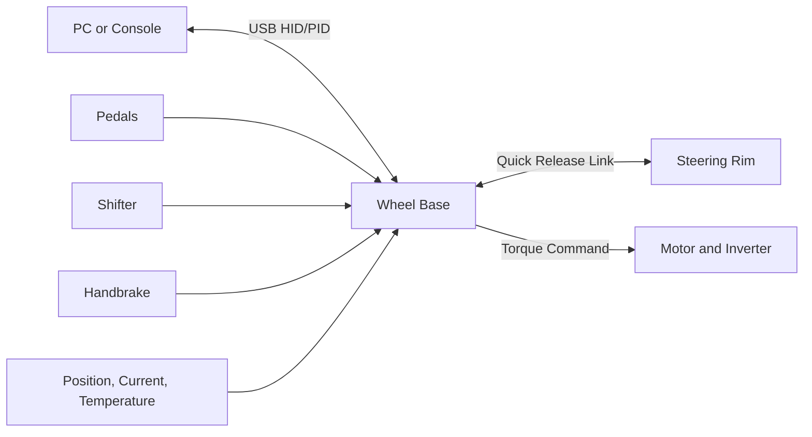

# System Architecture

## Overview

This is a research reference architecture, not a claim about proprietary Fanatec internals. It defines useful boundaries for studying or prototyping a sim-racing ecosystem.

## Major Boundaries

| Component | Primary responsibility |
|---|---|
| Host | Game input, force-feedback effects, configuration, updates |
| Wheel base | USB device, input aggregation, effect processing, safety arbitration |
| Motor domain | Deterministic current/torque control and local fault response |
| Steering rim | Buttons, encoders, display, LEDs, identity, and health |
| Accessories | Pedal, shifter, and handbrake sensing |

## Safety Boundary

All torque-producing paths converge at a single arbiter that applies enable state, command freshness, torque, current, slew, thermal, voltage, and fault limits. Hardware overcurrent and gate-driver faults should asynchronously inhibit motor drive.

## Detailed Research

- [Wheel-base architecture](./study/wheel_base.md)
- [Steering-rim architecture](./study/wheel_rim.md)
- [Sim-racing ecosystem](./study/sim_racing_research.md)
